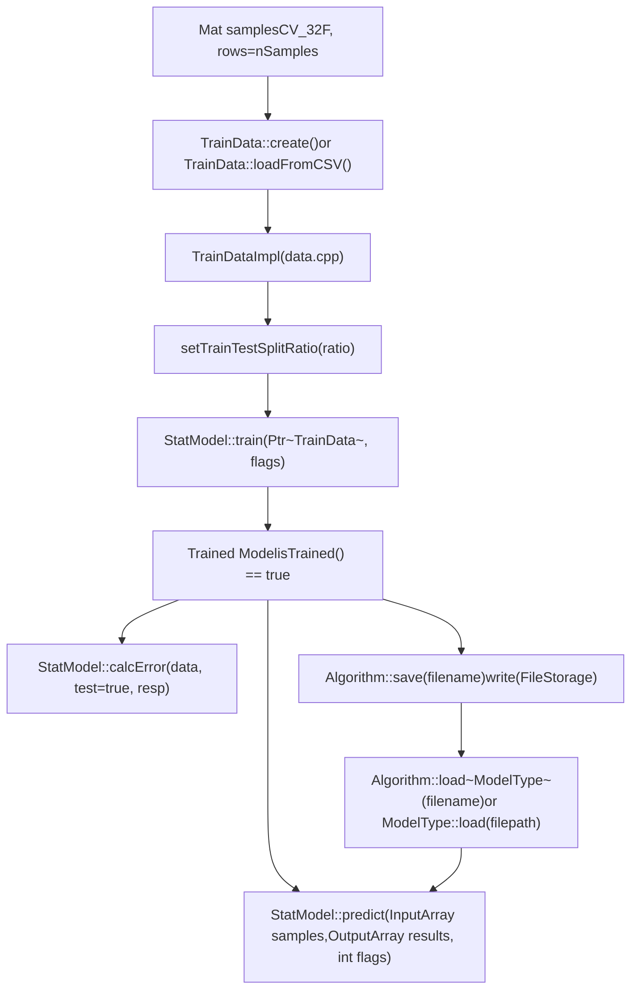
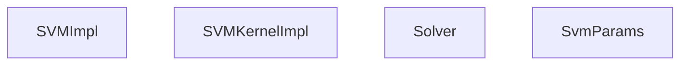
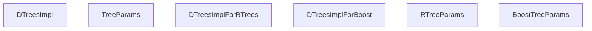

# Machine Learning (ml)

Relevant source files

-   [modules/ml/include/opencv2/ml.hpp](https://github.com/opencv/opencv/blob/91c78f50/modules/ml/include/opencv2/ml.hpp)
-   [modules/ml/include/opencv2/ml/ml.hpp](https://github.com/opencv/opencv/blob/91c78f50/modules/ml/include/opencv2/ml/ml.hpp)
-   [modules/ml/include/opencv2/ml/ml.inl.hpp](https://github.com/opencv/opencv/blob/91c78f50/modules/ml/include/opencv2/ml/ml.inl.hpp)
-   [modules/ml/src/ann\_mlp.cpp](https://github.com/opencv/opencv/blob/91c78f50/modules/ml/src/ann_mlp.cpp)
-   [modules/ml/src/boost.cpp](https://github.com/opencv/opencv/blob/91c78f50/modules/ml/src/boost.cpp)
-   [modules/ml/src/data.cpp](https://github.com/opencv/opencv/blob/91c78f50/modules/ml/src/data.cpp)
-   [modules/ml/src/em.cpp](https://github.com/opencv/opencv/blob/91c78f50/modules/ml/src/em.cpp)
-   [modules/ml/src/gbt.cpp](https://github.com/opencv/opencv/blob/91c78f50/modules/ml/src/gbt.cpp)
-   [modules/ml/src/inner\_functions.cpp](https://github.com/opencv/opencv/blob/91c78f50/modules/ml/src/inner_functions.cpp)
-   [modules/ml/src/knearest.cpp](https://github.com/opencv/opencv/blob/91c78f50/modules/ml/src/knearest.cpp)
-   [modules/ml/src/lr.cpp](https://github.com/opencv/opencv/blob/91c78f50/modules/ml/src/lr.cpp)
-   [modules/ml/src/nbayes.cpp](https://github.com/opencv/opencv/blob/91c78f50/modules/ml/src/nbayes.cpp)
-   [modules/ml/src/precomp.hpp](https://github.com/opencv/opencv/blob/91c78f50/modules/ml/src/precomp.hpp)
-   [modules/ml/src/rtrees.cpp](https://github.com/opencv/opencv/blob/91c78f50/modules/ml/src/rtrees.cpp)
-   [modules/ml/src/svm.cpp](https://github.com/opencv/opencv/blob/91c78f50/modules/ml/src/svm.cpp)
-   [modules/ml/src/svmsgd.cpp](https://github.com/opencv/opencv/blob/91c78f50/modules/ml/src/svmsgd.cpp)
-   [modules/ml/src/tree.cpp](https://github.com/opencv/opencv/blob/91c78f50/modules/ml/src/tree.cpp)
-   [modules/ml/test/test\_lr.cpp](https://github.com/opencv/opencv/blob/91c78f50/modules/ml/test/test_lr.cpp)
-   [modules/ml/test/test\_precomp.hpp](https://github.com/opencv/opencv/blob/91c78f50/modules/ml/test/test_precomp.hpp)
-   [modules/ml/test/test\_rtrees.cpp](https://github.com/opencv/opencv/blob/91c78f50/modules/ml/test/test_rtrees.cpp)
-   [modules/ml/test/test\_save\_load.cpp](https://github.com/opencv/opencv/blob/91c78f50/modules/ml/test/test_save_load.cpp)
-   [modules/ml/test/test\_svmsgd.cpp](https://github.com/opencv/opencv/blob/91c78f50/modules/ml/test/test_svmsgd.cpp)
-   [samples/cpp/logistic\_regression.cpp](https://github.com/opencv/opencv/blob/91c78f50/samples/cpp/logistic_regression.cpp)
-   [samples/cpp/train\_svmsgd.cpp](https://github.com/opencv/opencv/blob/91c78f50/samples/cpp/train_svmsgd.cpp)
-   [samples/cpp/travelsalesman.cpp](https://github.com/opencv/opencv/blob/91c78f50/samples/cpp/travelsalesman.cpp)

## Purpose and Scope

The `opencv_ml` module provides classical statistical machine learning algorithms for classification, regression, and unsupervised clustering. All algorithms share a common interface through `StatModel`, and a common data container through `TrainData`.

This page gives an overview of the module structure, the shared abstractions, and the algorithms available. For detailed documentation on `StatModel`, `TrainData`, and cross-validation, see [Statistical Models and Training Interface](/opencv/opencv/13.1-statistical-models-and-training-interface). For individual algorithm parameters, see [Classifier and Regression Algorithms](/opencv/opencv/13.2-classifier-and-regression-algorithms).

---

## Module Layout

All public types are declared in [modules/ml/include/opencv2/ml.hpp](https://github.com/opencv/opencv/blob/91c78f50/modules/ml/include/opencv2/ml.hpp) under the `cv::ml` namespace. Each algorithm has its own source file.

| Source File | Public Interface | Concrete Class |
| --- | --- | --- |
| `src/data.cpp` | `TrainData` | `TrainDataImpl` |
| `src/inner_functions.cpp` | `StatModel`, `ParamGrid` | base stubs only |
| `src/nbayes.cpp` | `NormalBayesClassifier` | `NormalBayesClassifierImpl` |
| `src/knearest.cpp` | `KNearest` | `BruteForceImpl`, `KDTreeImpl` |
| `src/svm.cpp` | `SVM` | `SVMImpl`, `SVMKernelImpl`, `Solver` |
| `src/em.cpp` | `EM` | `EMImpl` |
| `src/tree.cpp` | `DTrees` | `DTreesImpl` |
| `src/rtrees.cpp` | `RTrees` | `DTreesImplForRTrees` |
| `src/boost.cpp` | `Boost` | `DTreesImplForBoost` |
| `src/ann_mlp.cpp` | `ANN_MLP` | `ANN_MLPImpl` |
| `src/lr.cpp` | `LogisticRegression` | `LogisticRegressionImpl` |
| `src/svmsgd.cpp` | `SVMSGD` | `SVMSGDImpl` |

Sources: [modules/ml/include/opencv2/ml.hpp1-100](https://github.com/opencv/opencv/blob/91c78f50/modules/ml/include/opencv2/ml.hpp#L1-L100) [modules/ml/src/precomp.hpp](https://github.com/opencv/opencv/blob/91c78f50/modules/ml/src/precomp.hpp)

---

## Class Hierarchy

All ML classes inherit from `cv::Algorithm` (defined in `opencv_core`), which provides XML/YAML serialization via `save()`/`load()`. `StatModel` adds the `train()`/`predict()` interface.

**Class hierarchy mapping interfaces to concrete implementations:**

```mermaid
flowchart TD
    classId_Algorithm_78["Algorithm"]
    classId_StatModel_79["StatModel"]
    classId_NormalBayesClassifier_80["NormalBayesClassifier"]
    classId_KNearest_81["KNearest"]
    classId_SVM_82["SVM"]
    classId_EM_83["EM"]
    classId_DTrees_84["DTrees"]
    classId_RTrees_85["RTrees"]
    classId_Boost_86["Boost"]
    classId_ANN_MLP_87["ANN_MLP"]
    classId_LogisticRegression_88["LogisticRegression"]
    classId_SVMSGD_89["SVMSGD"]
```


Sources: [modules/ml/include/opencv2/ml.hpp316-388](https://github.com/opencv/opencv/blob/91c78f50/modules/ml/include/opencv2/ml.hpp#L316-L388) [modules/ml/src/inner\_functions.cpp58-75](https://github.com/opencv/opencv/blob/91c78f50/modules/ml/src/inner_functions.cpp#L58-L75)

---

## Core Abstractions

### StatModel

Declared at [modules/ml/include/opencv2/ml.hpp318-388](https://github.com/opencv/opencv/blob/91c78f50/modules/ml/include/opencv2/ml.hpp#L318-L388) Implemented base methods are in [modules/ml/src/inner\_functions.cpp](https://github.com/opencv/opencv/blob/91c78f50/modules/ml/src/inner_functions.cpp)

The two primary `train` overloads are:

-   `train(Ptr<TrainData> trainData, int flags=0)` — accepts a `TrainData` object for full control over splits, variable types, and weights.
-   `train(InputArray samples, int layout, InputArray responses)` — convenience wrapper that internally calls `TrainData::create()`.

`calcError()` calls `predict()` on each sample and returns RMS error for regression or misclassification rate (0–100%) for classification.

The `flags` parameter to `predict()` accepts `StatModel::RAW_OUTPUT` to return raw scores rather than class labels, and `StatModel::COMPRESSED_INPUT` when only active variables are supplied.

`NormalBayesClassifier` and `ANN_MLP` accept `StatModel::UPDATE_MODEL` in `train()`'s flags to incrementally update an already-trained model without resetting.

### TrainData

Declared at [modules/ml/include/opencv2/ml.hpp145-314](https://github.com/opencv/opencv/blob/91c78f50/modules/ml/include/opencv2/ml.hpp#L145-L314) The concrete class is `TrainDataImpl` in [modules/ml/src/data.cpp114](https://github.com/opencv/opencv/blob/91c78f50/modules/ml/src/data.cpp#L114-L114)

**Construction:**

| Factory Method | Source |
| --- | --- |
| `TrainData::create(samples, layout, responses, varIdx, sampleIdx, sampleWeights, varType)` | in-memory `Mat` arrays |
| `TrainData::loadFromCSV(filename, headerLineCount, responseStartIdx, ...)` | delimited text file |

The `layout` argument is `ROW_SAMPLE` (each row is a sample) or `COL_SAMPLE` (each column is a sample).

Variable types per column are encoded with `VAR_ORDERED` (0, continuous) or `VAR_CATEGORICAL` (1, discrete). Missing values must be represented as `TrainData::missingValue()`, which returns `FLT_MAX`.

Training/test split methods:

-   `setTrainTestSplit(int count, bool shuffle)` — absolute count
-   `setTrainTestSplitRatio(double ratio, bool shuffle)` — fractional

### ParamGrid

Declared at [modules/ml/include/opencv2/ml.hpp107-134](https://github.com/opencv/opencv/blob/91c78f50/modules/ml/include/opencv2/ml.hpp#L107-L134) Defines a log-spaced sequence of values for hyperparameter search:

```
{ minVal, minVal·logStep, minVal·logStep², ... } where each value < maxVal
```
Used by `SVM::trainAuto()` to search over `C`, `GAMMA`, `P`, `NU`, `COEF`, and `DEGREE`. `SVM::getDefaultGrid(param_id)` returns a predefined `ParamGrid` for each parameter ID from `SVM::ParamTypes`.

---

## Training and Prediction Workflow

**Flow from raw data to prediction, naming concrete classes:**


Sources: [modules/ml/src/inner\_functions.cpp58-145](https://github.com/opencv/opencv/blob/91c78f50/modules/ml/src/inner_functions.cpp#L58-L145) [modules/ml/src/data.cpp237-410](https://github.com/opencv/opencv/blob/91c78f50/modules/ml/src/data.cpp#L237-L410)

---

## Algorithm Summary

| Class | Task | Source | Serialization Name |
| --- | --- | --- | --- |
| `NormalBayesClassifier` | Classification | `src/nbayes.cpp` | `opencv_ml_nbayes` |
| `KNearest` | Classification / Regression | `src/knearest.cpp` | `opencv_ml_knn` or `opencv_ml_knn_kd` |
| `SVM` | Classification / Regression | `src/svm.cpp` | `opencv_ml_svm` |
| `EM` | Clustering | `src/em.cpp` | `opencv_ml_em` |
| `DTrees` | Classification / Regression | `src/tree.cpp` | `opencv_ml_dtree` |
| `RTrees` | Classification / Regression | `src/rtrees.cpp` | `opencv_ml_rtrees` |
| `Boost` | Classification | `src/boost.cpp` | `opencv_ml_boost` |
| `ANN_MLP` | Classification / Regression | `src/ann_mlp.cpp` | `opencv_ml_ann_mlp` |
| `LogisticRegression` | Classification | `src/lr.cpp` | `opencv_ml_lr` |
| `SVMSGD` | Classification | `src/svmsgd.cpp` | `opencv_ml_svmsgd` |

Serialization names appear in `getDefaultName()` on each concrete class and are used as the root node name in saved XML/YAML files.

Sources: [modules/ml/test/test\_precomp.hpp](https://github.com/opencv/opencv/blob/91c78f50/modules/ml/test/test_precomp.hpp) [modules/ml/src/nbayes.cpp](https://github.com/opencv/opencv/blob/91c78f50/modules/ml/src/nbayes.cpp) [modules/ml/src/knearest.cpp53-54](https://github.com/opencv/opencv/blob/91c78f50/modules/ml/src/knearest.cpp#L53-L54) [modules/ml/src/em.cpp233-236](https://github.com/opencv/opencv/blob/91c78f50/modules/ml/src/em.cpp#L233-L236) [modules/ml/src/lr.cpp68](https://github.com/opencv/opencv/blob/91c78f50/modules/ml/src/lr.cpp#L68-L68) [modules/ml/src/svmsgd.cpp88](https://github.com/opencv/opencv/blob/91c78f50/modules/ml/src/svmsgd.cpp#L88-L88)

---

## SVM

`SVMImpl` ([modules/ml/src/svm.cpp420](https://github.com/opencv/opencv/blob/91c78f50/modules/ml/src/svm.cpp#L420-L420)) implements `SVM`. The implementation derives from libsvm 2.6.

**Internal components:**


**SVM types** (`SVM::Types`):

| Constant | Value | Use Case |
| --- | --- | --- |
| `C_SVC` | 100 | n-class classification with soft margin |
| `NU_SVC` | 101 | n-class classification, `nu` controls smoothness |
| `ONE_CLASS` | 102 | Novelty / outlier detection |
| `EPS_SVR` | 103 | ε-insensitive regression |
| `NU_SVR` | 104 | ν-regression |

**Kernel types** (`SVM::KernelTypes`):

| Constant | Formula |
| --- | --- |
| `LINEAR` | K(xi,xj) = xi^T·xj |
| `POLY` | K(xi,xj) = (γ·xi^T·xj + coef0)^degree |
| `RBF` | K(xi,xj) = exp(−γ·‖xi−xj‖²) |
| `SIGMOID` | K(xi,xj) = tanh(γ·xi^T·xj + coef0) |
| `CHI2` | K(xi,xj) = exp(−γ·χ²(xi,xj)) |
| `INTER` | K(xi,xj) = Σ min(xi\_k, xj\_k) |
| `CUSTOM` | User-supplied `SVM::Kernel` subclass |

`SVM::trainAuto()` selects parameters by k-fold cross-validation over each provided `ParamGrid`. Default grids are returned by `SVM::getDefaultGrid(param_id)` ([modules/ml/src/svm.cpp375-417](https://github.com/opencv/opencv/blob/91c78f50/modules/ml/src/svm.cpp#L375-L417)).

Sources: [modules/ml/src/svm.cpp](https://github.com/opencv/opencv/blob/91c78f50/modules/ml/src/svm.cpp) [modules/ml/include/opencv2/ml.hpp526-825](https://github.com/opencv/opencv/blob/91c78f50/modules/ml/include/opencv2/ml.hpp#L526-L825)

---

## Decision Tree Family

`DTrees`, `RTrees`, and `Boost` share a base implementation in `DTreesImpl`.

**Relationship between tree classes and their implementations:**


`DTreesImplForRTrees::getActiveVars()` ([modules/ml/src/rtrees.cpp95-109](https://github.com/opencv/opencv/blob/91c78f50/modules/ml/src/rtrees.cpp#L95-L109)) randomly shuffles `allVars` and returns the first `nactiveVars` entries, giving each tree a random feature subset. OOB error is estimated by predicting samples excluded from each bootstrap. If `calcVarImportance` is set, the drop in OOB accuracy when a variable is permuted is recorded as its importance.

`DTreesImplForBoost::train()` ([modules/ml/src/boost.cpp186-202](https://github.com/opencv/opencv/blob/91c78f50/modules/ml/src/boost.cpp#L186-L202)) trains `weakCount` trees sequentially. After each tree, `updateWeightsAndTrim()` reweights misclassified samples and trims samples with low weight (`weightTrimRate`). Supported `boostType` values: `DISCRETE` (AdaBoost.M1), `REAL`, `LOGIT`, `GENTLE`.

Sources: [modules/ml/src/tree.cpp](https://github.com/opencv/opencv/blob/91c78f50/modules/ml/src/tree.cpp) [modules/ml/src/rtrees.cpp](https://github.com/opencv/opencv/blob/91c78f50/modules/ml/src/rtrees.cpp) [modules/ml/src/boost.cpp](https://github.com/opencv/opencv/blob/91c78f50/modules/ml/src/boost.cpp)

---

## ANN\_MLP

`ANN_MLPImpl` ([modules/ml/src/ann\_mlp.cpp144](https://github.com/opencv/opencv/blob/91c78f50/modules/ml/src/ann_mlp.cpp#L144-L144)) implements a fully-connected multi-layer perceptron.

Network topology is specified via `setLayerSizes(Mat)` — a 1D integer array where each element is the neuron count for that layer. Weights are initialized using the Nguyen-Widrow algorithm ([modules/ml/src/ann\_mlp.cpp271-302](https://github.com/opencv/opencv/blob/91c78f50/modules/ml/src/ann_mlp.cpp#L271-L302)).

**Training methods** (`ANN_MLP::TrainMethods`):

| Constant | Algorithm | Key Parameters |
| --- | --- | --- |
| `BACKPROP` | Backpropagation | `bpDWScale`, `bpMomentumScale` |
| `RPROP` | Resilient Propagation (default) | `rpDW0`, `rpDWPlus`, `rpDWMinus`, `rpDWMin`, `rpDWMax` |
| `ANNEAL` | Simulated Annealing | `initialT`, `finalT`, `coolingRatio`, `itePerStep` |

Simulated annealing is implemented by `SimulatedAnnealingANN_MLP` ([modules/ml/src/ann\_mlp.cpp83-142](https://github.com/opencv/opencv/blob/91c78f50/modules/ml/src/ann_mlp.cpp#L83-L142)), which wraps the network and proposes random weight perturbations.

**Activation functions** (`ANN_MLP::ActivationFunctions`):

| Constant | Applied Function |
| --- | --- |
| `IDENTITY` | f(x) = x |
| `SIGMOID_SYM` | f(x) = β·(1−e^(−αx)) / (1+e^(−αx)) |
| `GAUSSIAN` | f(x) = β·exp(−α²x²) |
| `RELU` | f(x) = max(0, x) |
| `LEAKYRELU` | f(x) = x ≥ 0 ? x : α·x |

Sources: [modules/ml/src/ann\_mlp.cpp](https://github.com/opencv/opencv/blob/91c78f50/modules/ml/src/ann_mlp.cpp) [modules/ml/include/opencv2/ml.hpp](https://github.com/opencv/opencv/blob/91c78f50/modules/ml/include/opencv2/ml.hpp)

---

## EM (Gaussian Mixture Models)

`EMImpl` ([modules/ml/src/em.cpp51](https://github.com/opencv/opencv/blob/91c78f50/modules/ml/src/em.cpp#L51-L51)) fits a Gaussian mixture model by iterating E (expectation) and M (maximization) steps.

**Covariance matrix types** (`EM::Types`):

| Constant | Description |
| --- | --- |
| `COV_MAT_SPHERICAL` | Single variance per cluster; isotropic |
| `COV_MAT_DIAGONAL` | Per-feature variances; diagonal matrix |
| `COV_MAT_GENERIC` | Full covariance matrix; most flexible |

Three entry points allow warm-starting the EM from any step:

-   `trainEM(samples)` — full EM, initialized with k-means (`clusterTrainSamples()`)
-   `trainE(samples, means0, covs0, weights0)` — skip M-step, begin from given parameters
-   `trainM(samples, probs0)` — begin from given posterior probabilities

`predict2(sample, probs)` returns `Vec2d{log_likelihood, cluster_label}`.

Sources: [modules/ml/src/em.cpp](https://github.com/opencv/opencv/blob/91c78f50/modules/ml/src/em.cpp) [modules/ml/include/opencv2/ml.hpp](https://github.com/opencv/opencv/blob/91c78f50/modules/ml/include/opencv2/ml.hpp)

---

## Logistic Regression

`LogisticRegressionImpl` ([modules/ml/src/lr.cpp39](https://github.com/opencv/opencv/blob/91c78f50/modules/ml/src/lr.cpp#L39-L39)) supports binary and multiclass classification. For multiclass, a one-vs-rest (OvR) scheme trains one model per class ([modules/ml/src/lr.cpp153-170](https://github.com/opencv/opencv/blob/91c78f50/modules/ml/src/lr.cpp#L153-L170)).

Key parameters:

| Property | Default | Description |
| --- | --- | --- |
| `learningRate` | 0.001 | Step size α for gradient descent |
| `iterations` | 1000 | Maximum iterations |
| `regularization` | `REG_L2` | `REG_DISABLE`, `REG_L1`, or `REG_L2` |
| `trainMethod` | `BATCH` | `BATCH` or `MINI_BATCH` |
| `miniBatchSize` | 1 | Samples per mini-batch update |

After training, `get_learnt_thetas()` returns the coefficient matrix (rows = classes, cols = features + 1 bias term).

Sources: [modules/ml/src/lr.cpp](https://github.com/opencv/opencv/blob/91c78f50/modules/ml/src/lr.cpp)

---

## SVMSGD

`SVMSGDImpl` ([modules/ml/src/svmsgd.cpp60](https://github.com/opencv/opencv/blob/91c78f50/modules/ml/src/svmsgd.cpp#L60-L60)) trains a linear binary classifier with stochastic gradient descent, making it suitable for large datasets where kernel SVM is prohibitively expensive.

The decision function is `weights^T · x + shift`. After training, these are accessed via `getWeights()` and `getShift()`.

**Algorithm variants** (`SVMSGD::SvmsgdType`):

| Constant | Description |
| --- | --- |
| `SGD` | Standard stochastic gradient descent |
| `ASGD` | Averaged SGD — more numerically stable |

**Margin types** (`SVMSGD::MarginType`):

| Constant | Description |
| --- | --- |
| `SOFT_MARGIN` | Allows misclassifications |
| `HARD_MARGIN` | No misclassifications permitted |

`setOptimalParameters(svmsgdType, marginType)` adjusts `marginRegularization`, `initialStepSize`, and `stepDecreasingPower` to recommended values for the chosen variant.

Sources: [modules/ml/src/svmsgd.cpp](https://github.com/opencv/opencv/blob/91c78f50/modules/ml/src/svmsgd.cpp) [modules/ml/include/opencv2/ml.hpp](https://github.com/opencv/opencv/blob/91c78f50/modules/ml/include/opencv2/ml.hpp)

---

## Persistence

All `StatModel` subclasses inherit `save(filename)` and `load(filename)` from `cv::Algorithm`, backed by `FileStorage` (XML/YAML). Each concrete class implements `write(FileStorage&)` and `read(const FileNode&)`.

Two equivalent load patterns exist:

```
// Generic pattern via Algorithm:Ptr<SVM> m = Algorithm::load<SVM>("model.xml"); // Type-specific factory:Ptr<SVM> m = SVM::load("model.xml");
```
Legacy models serialized in older OpenCV formats are tested in [modules/ml/test/test\_save\_load.cpp](https://github.com/opencv/opencv/blob/91c78f50/modules/ml/test/test_save_load.cpp)

For `FileStorage` details, see [Persistence and Serialization (FileStorage)](/opencv/opencv/3.4-persistence-and-serialization-(filestorage)).

Sources: [modules/ml/test/test\_save\_load.cpp](https://github.com/opencv/opencv/blob/91c78f50/modules/ml/test/test_save_load.cpp) [modules/ml/include/opencv2/ml.hpp414-426](https://github.com/opencv/opencv/blob/91c78f50/modules/ml/include/opencv2/ml.hpp#L414-L426)

---

## Integration with Other Modules

-   **`opencv_core`**: `StatModel` extends `cv::Algorithm`; all matrix inputs and outputs are `cv::Mat` with type `CV_32F` (features) or `CV_32S`/`CV_32F` (responses).
-   **`opencv_objdetect`**: `HOGDescriptor` uses a pre-trained `SVM` internally for its people detector — see [HOG Descriptor and SVM Detection](/opencv/opencv/9.2-hog-descriptor-and-svm-detection).
-   **`opencv_features2d`**: `BOWTrainer` clusters descriptors (typically using k-means from core), and `BOWImgDescriptorExtractor` builds histograms used as input to `SVM` or other `StatModel` instances — see [Descriptor Matching and Bag-of-Words](/opencv/opencv/6.2-descriptor-matching-and-bag-of-words).
