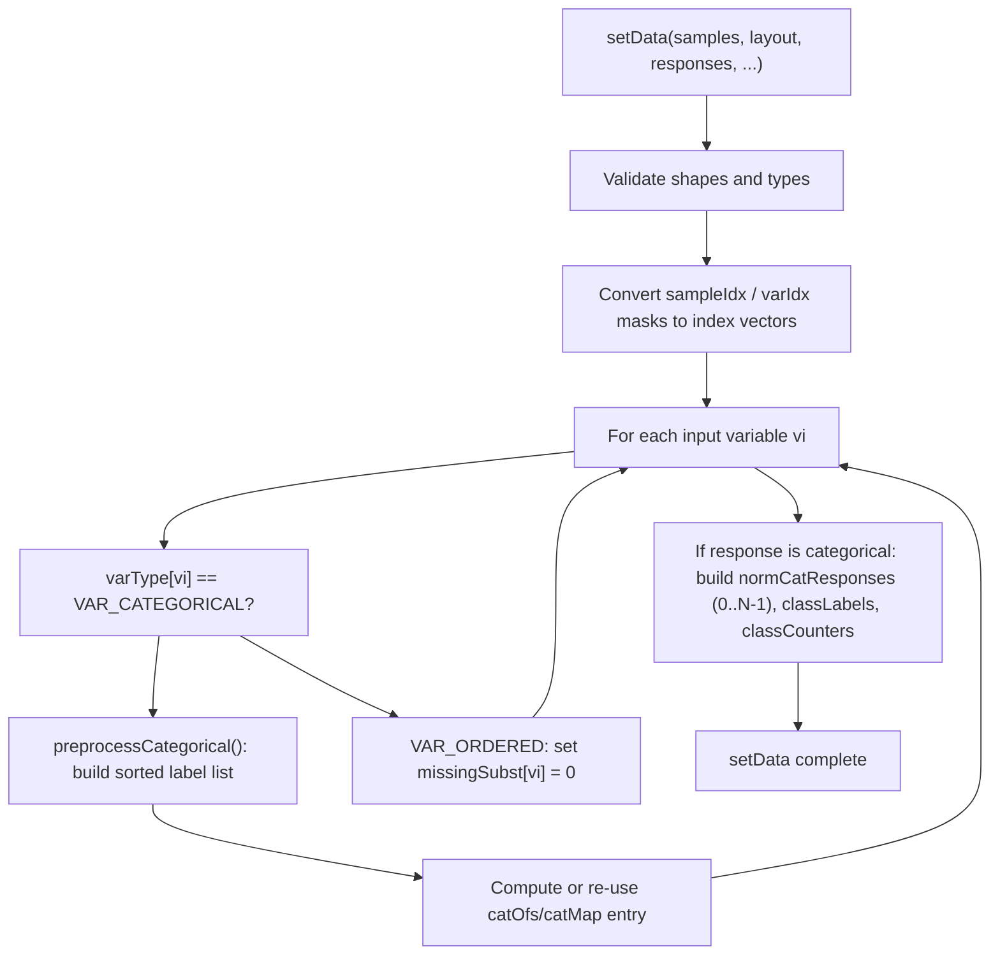
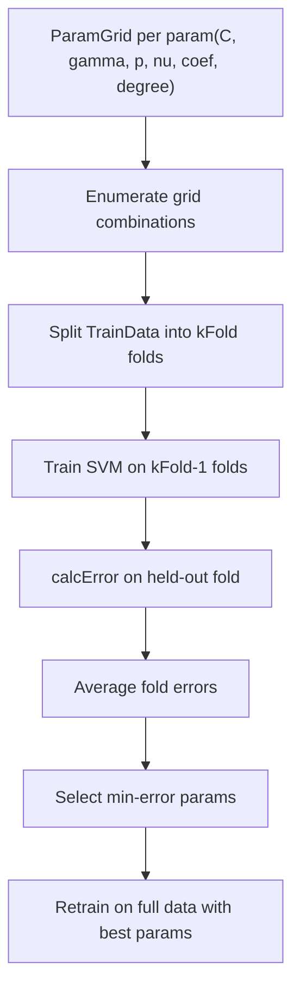

# Statistical Models and Training Interface

Relevant source files

-   [modules/ml/include/opencv2/ml.hpp](https://github.com/opencv/opencv/blob/91c78f50/modules/ml/include/opencv2/ml.hpp)
-   [modules/ml/include/opencv2/ml/ml.hpp](https://github.com/opencv/opencv/blob/91c78f50/modules/ml/include/opencv2/ml/ml.hpp)
-   [modules/ml/include/opencv2/ml/ml.inl.hpp](https://github.com/opencv/opencv/blob/91c78f50/modules/ml/include/opencv2/ml/ml.inl.hpp)
-   [modules/ml/src/ann\_mlp.cpp](https://github.com/opencv/opencv/blob/91c78f50/modules/ml/src/ann_mlp.cpp)
-   [modules/ml/src/boost.cpp](https://github.com/opencv/opencv/blob/91c78f50/modules/ml/src/boost.cpp)
-   [modules/ml/src/data.cpp](https://github.com/opencv/opencv/blob/91c78f50/modules/ml/src/data.cpp)
-   [modules/ml/src/em.cpp](https://github.com/opencv/opencv/blob/91c78f50/modules/ml/src/em.cpp)
-   [modules/ml/src/gbt.cpp](https://github.com/opencv/opencv/blob/91c78f50/modules/ml/src/gbt.cpp)
-   [modules/ml/src/inner\_functions.cpp](https://github.com/opencv/opencv/blob/91c78f50/modules/ml/src/inner_functions.cpp)
-   [modules/ml/src/knearest.cpp](https://github.com/opencv/opencv/blob/91c78f50/modules/ml/src/knearest.cpp)
-   [modules/ml/src/lr.cpp](https://github.com/opencv/opencv/blob/91c78f50/modules/ml/src/lr.cpp)
-   [modules/ml/src/nbayes.cpp](https://github.com/opencv/opencv/blob/91c78f50/modules/ml/src/nbayes.cpp)
-   [modules/ml/src/precomp.hpp](https://github.com/opencv/opencv/blob/91c78f50/modules/ml/src/precomp.hpp)
-   [modules/ml/src/rtrees.cpp](https://github.com/opencv/opencv/blob/91c78f50/modules/ml/src/rtrees.cpp)
-   [modules/ml/src/svm.cpp](https://github.com/opencv/opencv/blob/91c78f50/modules/ml/src/svm.cpp)
-   [modules/ml/src/svmsgd.cpp](https://github.com/opencv/opencv/blob/91c78f50/modules/ml/src/svmsgd.cpp)
-   [modules/ml/src/tree.cpp](https://github.com/opencv/opencv/blob/91c78f50/modules/ml/src/tree.cpp)
-   [modules/ml/test/test\_lr.cpp](https://github.com/opencv/opencv/blob/91c78f50/modules/ml/test/test_lr.cpp)
-   [modules/ml/test/test\_precomp.hpp](https://github.com/opencv/opencv/blob/91c78f50/modules/ml/test/test_precomp.hpp)
-   [modules/ml/test/test\_rtrees.cpp](https://github.com/opencv/opencv/blob/91c78f50/modules/ml/test/test_rtrees.cpp)
-   [modules/ml/test/test\_save\_load.cpp](https://github.com/opencv/opencv/blob/91c78f50/modules/ml/test/test_save_load.cpp)
-   [modules/ml/test/test\_svmsgd.cpp](https://github.com/opencv/opencv/blob/91c78f50/modules/ml/test/test_svmsgd.cpp)
-   [samples/cpp/logistic\_regression.cpp](https://github.com/opencv/opencv/blob/91c78f50/samples/cpp/logistic_regression.cpp)
-   [samples/cpp/train\_svmsgd.cpp](https://github.com/opencv/opencv/blob/91c78f50/samples/cpp/train_svmsgd.cpp)
-   [samples/cpp/travelsalesman.cpp](https://github.com/opencv/opencv/blob/91c78f50/samples/cpp/travelsalesman.cpp)

## Purpose and Scope

This page documents the foundational abstractions of the `opencv_ml` module: the `StatModel` base class, the `TrainData` container, and the `ParamGrid` structure used for hyperparameter search. These three components define the common interface that all ML algorithms in the module implement.

For descriptions of the individual algorithm classes (`SVM`, `RTrees`, `ANN_MLP`, `EM`, etc.), see [Classifier and Regression Algorithms](/opencv/opencv/13.2-classifier-and-regression-algorithms). For information about the `FileStorage` system used to save and load trained models, see [Persistence and Serialization](/opencv/opencv/3.4-persistence-and-serialization-(filestorage)).

---

## Module Structure Overview

All ML classes live in the `cv::ml` namespace and reside under `modules/ml/`. The public API is defined entirely in [\`modules/ml/include/opencv2/ml.hpp\`](https://github.com/opencv/opencv/blob/91c78f50/`modules/ml/include/opencv2/ml.hpp`)

**Class hierarchy in cv::ml**

```mermaid
flowchart TD
    classId_Algorithm_100["Algorithm"]
    classId_StatModel_101["StatModel"]
    classId_NormalBayesClassifier_102["NormalBayesClassifier"]
    classId_KNearest_103["KNearest"]
    classId_SVM_104["SVM"]
    classId_DTrees_105["DTrees"]
    classId_Boost_106["Boost"]
    classId_RTrees_107["RTrees"]
    classId_EM_108["EM"]
    classId_ANN_MLP_109["ANN_MLP"]
    classId_LogisticRegression_110["LogisticRegression"]
    classId_SVMSGD_111["SVMSGD"]
```


Sources: [\`modules/ml/include/opencv2/ml.hpp318-388](https://github.com/opencv/opencv/blob/91c78f50/`modules/ml/include/opencv2/ml.hpp#L318-L388)

---

## Enumerations

Three enumerations define the vocabulary used across the training interface.

### VariableTypes

[\`modules/ml/include/opencv2/ml.hpp81-86](https://github.com/opencv/opencv/blob/91c78f50/`modules/ml/include/opencv2/ml.hpp#L81-L86)

| Constant | Value | Meaning |
| --- | --- | --- |
| `VAR_NUMERICAL` | 0 | Alias for `VAR_ORDERED` |
| `VAR_ORDERED` | 0 | Continuous/numeric variable |
| `VAR_CATEGORICAL` | 1 | Discrete class label |

`TrainData` uses these per-column to distinguish input features from class labels and to trigger categorical preprocessing (building category maps, normalizing responses).

### SampleTypes

[\`modules/ml/include/opencv2/ml.hpp96-100](https://github.com/opencv/opencv/blob/91c78f50/`modules/ml/include/opencv2/ml.hpp#L96-L100)

| Constant | Value | Meaning |
| --- | --- | --- |
| `ROW_SAMPLE` | 0 | Each row in the matrix is one sample |
| `COL_SAMPLE` | 1 | Each column in the matrix is one sample |

This layout flag is passed to `TrainData::create` and `StatModel::train`. Most algorithms expect `ROW_SAMPLE` internally; `TrainData` transposes when needed.

### ErrorTypes

[\`modules/ml/include/opencv2/ml.hpp89-93](https://github.com/opencv/opencv/blob/91c78f50/`modules/ml/include/opencv2/ml.hpp#L89-L93)

| Constant | Value | Meaning |
| --- | --- | --- |
| `TEST_ERROR` | 0 | Error on the test split |
| `TRAIN_ERROR` | 1 | Error on the training split |

Used as the `test` boolean in `StatModel::calcError`.

---

## The `TrainData` Class

`TrainData` is an abstract interface (pure virtual class) that encapsulates a dataset and exposes it to `StatModel::train`. The concrete implementation is `TrainDataImpl` in [\`modules/ml/src/data.cpp114](https://github.com/opencv/opencv/blob/91c78f50/`modules/ml/src/data.cpp#L114-L114)

### Construction

Two factory methods are provided:

**From in-memory arrays:**

```
TrainData::create(samples, layout, responses,
                  varIdx, sampleIdx, sampleWeights, varType)
```
-   `samples`: `CV_32F` matrix of feature vectors.
-   `responses`: `CV_32F` (treated as ordered) or `CV_32S` (treated as categorical).
-   `varIdx`: optional mask or index vector selecting active features.
-   `sampleIdx`: optional mask or index vector selecting the active samples.
-   `sampleWeights`: per-sample `CV_32F` weights; if empty, all weights default to 1.0.
-   `varType`: `CV_8U` vector of length `nInputVars + nOutputVars`; each entry is `VAR_ORDERED` or `VAR_CATEGORICAL`.

**From a CSV file:**

```
TrainData::loadFromCSV(filename, headerLineCount,
                       responseStartIdx, responseEndIdx,
                       varTypeSpec, delimiter, missch)
```
Non-numeric column values are automatically treated as categorical. Missing values are represented by `TrainData::missingValue()` which returns `FLT_MAX`.

Sources: [\`modules/ml/include/opencv2/ml.hpp136-314](https://github.com/opencv/opencv/blob/91c78f50/`modules/ml/include/opencv2/ml.hpp#L136-L314) [\`modules/ml/src/data.cpp237-410](https://github.com/opencv/opencv/blob/91c78f50/`modules/ml/src/data.cpp#L237-L410)

### Train/Test Split

`TrainData` can split itself into training and test subsets:

| Method | Description |
| --- | --- |
| `setTrainTestSplit(count, shuffle)` | Reserve the first `count` samples for training |
| `setTrainTestSplitRatio(ratio, shuffle)` | Reserve a fraction for training |
| `shuffleTrainTest()` | Re-shuffle the existing split |

After a split is set, the `getTrain*` accessors return only the training portion, and `getTest*` return the test portion.

### Accessor Methods

**Dataset dimensions:**

| Method | Returns |
| --- | --- |
| `getNSamples()` | Total samples (respects `sampleIdx`) |
| `getNTrainSamples()` | Training-subset samples |
| `getNTestSamples()` | Test-subset samples |
| `getNVars()` | Number of active variables (respects `varIdx`) |
| `getNAllVars()` | Total variables in the raw matrix |
| `getLayout()` | `ROW_SAMPLE` or `COL_SAMPLE` |

**Data retrieval:**

| Method | Returns |
| --- | --- |
| `getTrainSamples(layout, compressSamples, compressVars)` | Feature matrix for training |
| `getTrainResponses()` | Raw response values for training samples |
| `getTrainNormCatResponses()` | Categorical responses remapped to 0..N-1 |
| `getTestSamples()` | Feature matrix for test samples |
| `getTestResponses()` | Raw responses for test samples |
| `getClassLabels()` | Unique class label values in the original response range |
| `getSampleWeights()` / `getTrainSampleWeights()` | Per-sample weight vectors |
| `getMissing()` | `CV_8U` mask: nonzero = missing |
| `getDefaultSubstValues()` | Substitution values for missing entries |
| `getCatCount(vi)` | Number of categories for variable `vi` |
| `getCatOfs()` / `getCatMap()` | Category offset/map arrays for encoding |

**Utility:**

| Method | Description |
| --- | --- |
| `getSubVector(vec, idx)` | Extract elements from a 1D vector by index |
| `getSubMatrix(matrix, idx, layout)` | Extract rows or columns by index |

Sources: [\`modules/ml/include/opencv2/ml.hpp145-313](https://github.com/opencv/opencv/blob/91c78f50/`modules/ml/include/opencv2/ml.hpp#L145-L313) [\`modules/ml/src/data.cpp114-410](https://github.com/opencv/opencv/blob/91c78f50/`modules/ml/src/data.cpp#L114-L410)

### Internal Data Flow in `TrainDataImpl::setData`

**How `TrainData` processes categorical variables**


Sources: [\`modules/ml/src/data.cpp237-410](https://github.com/opencv/opencv/blob/91c78f50/`modules/ml/src/data.cpp#L237-L410)

---

## The `StatModel` Base Class

`StatModel` inherits from `Algorithm` and adds the train/predict contract. Defined at [\`modules/ml/include/opencv2/ml.hpp318-388](https://github.com/opencv/opencv/blob/91c78f50/`modules/ml/include/opencv2/ml.hpp#L318-L388)

### Key Virtual Methods

| Method | Pure? | Description |
| --- | --- | --- |
| `getVarCount()` | yes | Number of features the trained model expects |
| `isTrained()` | yes | Whether `train` has been called successfully |
| `isClassifier()` | yes | True for classifiers, false for regressors |
| `predict(samples, results, flags)` | yes | Run inference; returns the predicted value for the first sample |
| `train(trainData, flags)` | no | Default delegates to subclass |
| `train(samples, layout, responses)` | no | Convenience: wraps arrays in `TrainData::create`, then calls the above |
| `calcError(data, test, resp)` | no | Computes RMS (regression) or misclassification % (classifier) using `predict` |
| `empty()` | no | Returns `!isTrained()` |

### Predict Flags

Defined as `StatModel::Flags` at [\`modules/ml/include/opencv2/ml.hpp322-327](https://github.com/opencv/opencv/blob/91c78f50/`modules/ml/include/opencv2/ml.hpp#L322-L327):

| Flag | Value | Effect |
| --- | --- | --- |
| `UPDATE_MODEL` | 1 | Incrementally update the model (if the algorithm supports it) |
| `RAW_OUTPUT` | 1 | Return raw scores instead of class labels |
| `COMPRESSED_INPUT` | 2 | Input contains only active variables (compressed by `varIdx`) |
| `PREPROCESSED_INPUT` | 4 | Skip categorical encoding; input is already normalized |

### Default `train` and `calcError` Implementations

The non-pure `train(samples, layout, responses)` override in [\`modules/ml/src/inner\_functions.cpp70-75](https://github.com/opencv/opencv/blob/91c78f50/`modules/ml/src/inner_functions.cpp#L70-L75) simply calls:

```
train(TrainData::create(samples, layout, responses));
```
`calcError` at [\`modules/ml/src/inner\_functions.cpp77-134](https://github.com/opencv/opencv/blob/91c78f50/`modules/ml/src/inner_functions.cpp#L77-L134) uses `StatModel::predict` in parallel (`ParallelCalcError` loop body) and computes:

-   **Classifiers**: percentage of misclassified samples.
-   **Regressors**: root-mean-square error.

### Static `train<T>` Template

[\`modules/ml/include/opencv2/ml.hpp383-387](https://github.com/opencv/opencv/blob/91c78f50/`modules/ml/include/opencv2/ml.hpp#L383-L387)

```
template<typename _Tp>static Ptr<_Tp> train(const Ptr<TrainData>& data, int flags=0)
```
Creates a model via `_Tp::create()`, calls `train`, and returns `Ptr<_Tp>` or empty if training failed. Useful for one-liners like `SVM::train<SVM>(data)`.

---

## The `ParamGrid` Class

`ParamGrid` specifies a logarithmic search grid for a single hyperparameter. Defined at [\`modules/ml/include/opencv2/ml.hpp107-134](https://github.com/opencv/opencv/blob/91c78f50/`modules/ml/include/opencv2/ml.hpp#L107-L134) implemented in [\`modules/ml/src/inner\_functions.cpp45-56](https://github.com/opencv/opencv/blob/91c78f50/`modules/ml/src/inner_functions.cpp#L45-L56)

### Fields

| Field | Default | Description |
| --- | --- | --- |
| `minVal` | 0.0 | Lower bound of the parameter range |
| `maxVal` | 0.0 | Upper bound of the parameter range |
| `logStep` | 1.0 | Multiplicative step between candidates; must be > 1 to activate search |

### Iteration Sequence

The grid generates the sequence:

```
minVal, minVal * logStep, minVal * logStep^2, ...,
```
continuing while the value is less than `maxVal`. When `logStep <= 1`, no sweep is performed and the model uses its current parameter value.

### Construction

```
// Direct constructionParamGrid(double minVal, double maxVal, double logStep); // Factory (returns Ptr<ParamGrid>)ParamGrid::create(double minVal, double maxVal, double logstep);
```
Validation in [\`modules/ml/src/svm.cpp97-105](https://github.com/opencv/opencv/blob/91c78f50/`modules/ml/src/svm.cpp#L97-L105) requires `minVal > 0`, `minVal <= maxVal`, and `logStep > 1`.

### Default Grids for SVM Parameters

`SVM::getDefaultGrid(param_id)` returns pre-configured grids defined in [\`modules/ml/src/svm.cpp375-417](https://github.com/opencv/opencv/blob/91c78f50/`modules/ml/src/svm.cpp#L375-L417):

| Parameter | `minVal` | `maxVal` | `logStep` |
| --- | --- | --- | --- |
| `SVM::C` | 0.1 | 500 | 5 |
| `SVM::GAMMA` | 1e-5 | 0.6 | 15 |
| `SVM::P` | 0.01 | 100 | 7 |
| `SVM::NU` | 0.01 | 0.2 | 3 |
| `SVM::COEF` | 0.1 | 300 | 14 |
| `SVM::DEGREE` | 0.01 | 4 | 7 |

---

## Cross-Validation and `trainAuto`

Cross-validation is implemented directly in `SVM::trainAuto` (declared at [\`modules/ml/include/opencv2/ml.hpp712-759](https://github.com/opencv/opencv/blob/91c78f50/`modules/ml/include/opencv2/ml.hpp#L712-L759)), which is the only algorithm in the module with built-in hyperparameter search. The procedure:

1.  For each combination of `(C, gamma, p, nu, coef0, degree)` values drawn from the supplied `ParamGrid` instances:
    -   Divide the training data into `kFold` equal partitions.
    -   Train on `kFold - 1` partitions; measure error on the held-out partition.
    -   Average the fold errors.
2.  Select the parameter combination with minimum cross-validation error.
3.  Retrain on the full dataset with the optimal parameters.

The `balanced` flag causes class-balanced fold splitting when the problem is binary classification.

**Cross-validation flow for SVM::trainAuto**


Sources: [\`modules/ml/include/opencv2/ml.hpp678-759](https://github.com/opencv/opencv/blob/91c78f50/`modules/ml/include/opencv2/ml.hpp#L678-L759) [\`modules/ml/src/svm.cpp375-417](https://github.com/opencv/opencv/blob/91c78f50/`modules/ml/src/svm.cpp#L375-L417)

General cross-validation for other algorithms is not built into `StatModel` itself. User code must use `TrainData::setTrainTestSplit` or `setTrainTestSplitRatio` combined with repeated calls to `train` and `calcError`.

---

## Training and Prediction Workflow

**Typical training and inference flow**

> **[Mermaid sequence]**
> *(图表结构无法解析)*

Sources: [\`modules/ml/include/opencv2/ml.hpp318-388](https://github.com/opencv/opencv/blob/91c78f50/`modules/ml/include/opencv2/ml.hpp#L318-L388) [\`modules/ml/src/inner\_functions.cpp58-134](https://github.com/opencv/opencv/blob/91c78f50/`modules/ml/src/inner_functions.cpp#L58-L134)

---

## Serialization

All `StatModel` subclasses inherit `Algorithm::save` and `Algorithm::load`. Each algorithm writes its parameters and learned state to `FileStorage` (XML/YAML/JSON) under a fixed string key returned by `getDefaultName()`.

| Algorithm | `getDefaultName()` key |
| --- | --- |
| `SVM` | `opencv_ml_svm` |
| `RTrees` | `opencv_ml_rtrees` |
| `ANN_MLP` | `opencv_ml_ann_mlp` |
| `EM` | `opencv_ml_em` |
| `LogisticRegression` | `opencv_ml_lr` |
| `SVMSGD` | `opencv_ml_svmsgd` |
| `KNearest` (brute force) | `opencv_ml_knn` |
| `KNearest` (KD-tree) | `opencv_ml_knn_kd` |

Each class also provides a static `load(filepath, nodeName)` factory that calls `Algorithm::load<T>` internally. Tests in [\`modules/ml/test/test\_save\_load.cpp\`](https://github.com/opencv/opencv/blob/91c78f50/`modules/ml/test/test_save_load.cpp`) verify round-trip fidelity for all algorithms by loading legacy XML files and comparing predictions.

Sources: [\`modules/ml/src/em.cpp233-236](https://github.com/opencv/opencv/blob/91c78f50/`modules/ml/src/em.cpp#L233-L236) [\`modules/ml/src/lr.cpp68](https://github.com/opencv/opencv/blob/91c78f50/`modules/ml/src/lr.cpp#L68-L68) [\`modules/ml/src/svmsgd.cpp88](https://github.com/opencv/opencv/blob/91c78f50/`modules/ml/src/svmsgd.cpp#L88-L88) [\`modules/ml/test/test\_save\_load.cpp47-100](https://github.com/opencv/opencv/blob/91c78f50/`modules/ml/test/test_save_load.cpp#L47-L100)

---

## Missing Value Handling

`TrainData` marks a cell as missing when its value equals `TrainData::missingValue()` (`FLT_MAX`). The `getMissing()` method returns a `CV_8U` mask matrix of the same shape as the sample matrix. `getDefaultSubstValues()` returns a per-variable substitution vector (0.0 for ordered variables, -1.0 for categorical) used when an algorithm encounters a missing entry during prediction or split selection.

Sources: [\`modules/ml/include/opencv2/ml.hpp148](https://github.com/opencv/opencv/blob/91c78f50/`modules/ml/include/opencv2/ml.hpp#L148-L148) [\`modules/ml/src/data.cpp50](https://github.com/opencv/opencv/blob/91c78f50/`modules/ml/src/data.cpp#L50-L50) [\`modules/ml/src/data.cpp350-395](https://github.com/opencv/opencv/blob/91c78f50/`modules/ml/src/data.cpp#L350-L395)

---

## Summary of Key Code Entities

| Entity | File | Role |
| --- | --- | --- |
| `cv::ml::StatModel` | `ml.hpp:318` | Abstract base for all ML models |
| `cv::ml::TrainData` | `ml.hpp:145` | Abstract dataset interface |
| `TrainDataImpl` | `data.cpp:114` | Concrete `TrainData` implementation |
| `cv::ml::ParamGrid` | `ml.hpp:107` | Log-scale hyperparameter sweep range |
| `StatModel::train` | `inner_functions.cpp:62` | Default training dispatch |
| `StatModel::calcError` | `inner_functions.cpp:77` | Error computation via `predict` |
| `ParallelCalcError` | `inner_functions.cpp:77` | Parallel loop body for `calcError` |
| `SVM::getDefaultGrid` | `svm.cpp:375` | Predefined `ParamGrid` values for SVM |
| `TrainDataImpl::setData` | `data.cpp:237` | Core data ingestion and categorical setup |
| `VariableTypes` | `ml.hpp:81` | `VAR_ORDERED` / `VAR_CATEGORICAL` enum |
| `SampleTypes` | `ml.hpp:96` | `ROW_SAMPLE` / `COL_SAMPLE` enum |
| `StatModel::Flags` | `ml.hpp:322` | `RAW_OUTPUT`, `COMPRESSED_INPUT`, etc. |
