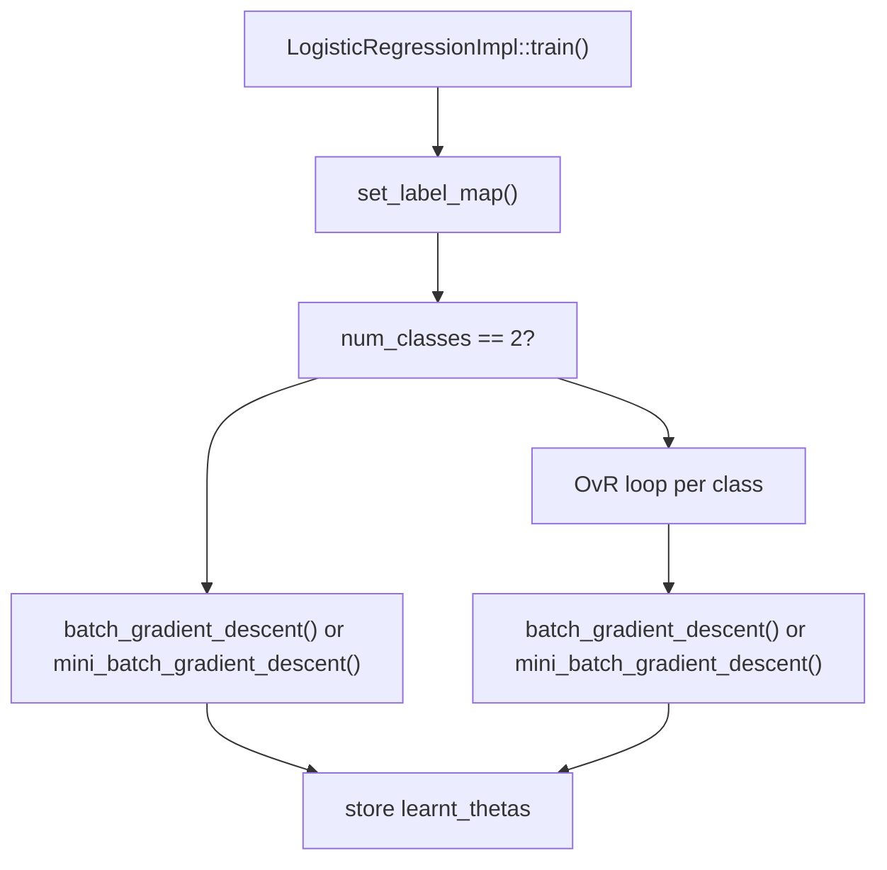
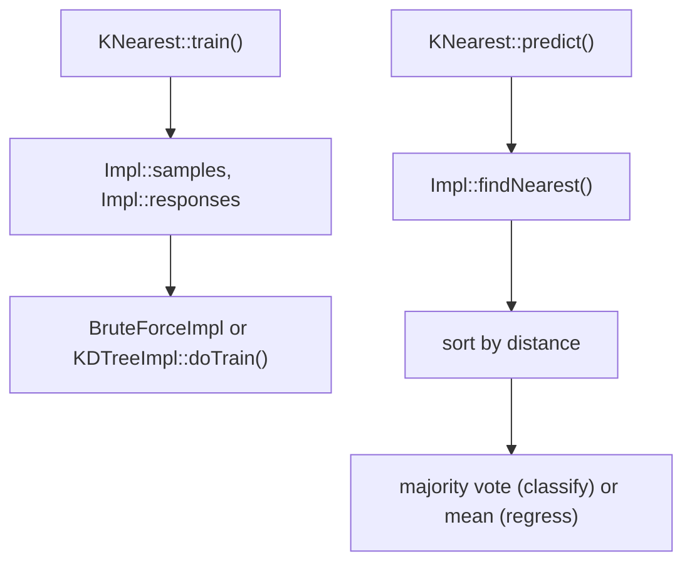
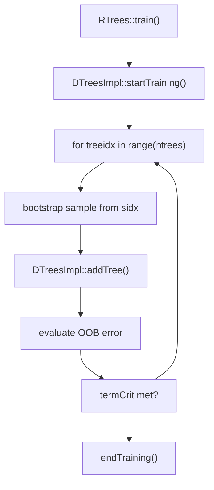
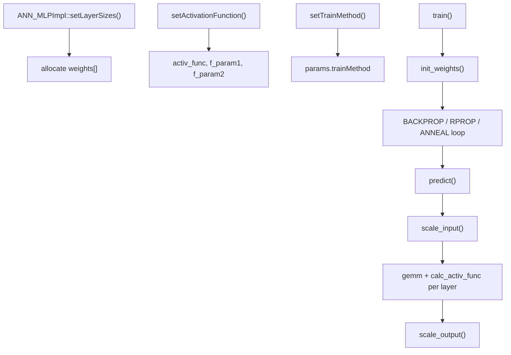

# Classifier and Regression Algorithms

Relevant source files

-   [modules/ml/include/opencv2/ml.hpp](https://github.com/opencv/opencv/blob/91c78f50/modules/ml/include/opencv2/ml.hpp)
-   [modules/ml/include/opencv2/ml/ml.hpp](https://github.com/opencv/opencv/blob/91c78f50/modules/ml/include/opencv2/ml/ml.hpp)
-   [modules/ml/include/opencv2/ml/ml.inl.hpp](https://github.com/opencv/opencv/blob/91c78f50/modules/ml/include/opencv2/ml/ml.inl.hpp)
-   [modules/ml/src/ann\_mlp.cpp](https://github.com/opencv/opencv/blob/91c78f50/modules/ml/src/ann_mlp.cpp)
-   [modules/ml/src/boost.cpp](https://github.com/opencv/opencv/blob/91c78f50/modules/ml/src/boost.cpp)
-   [modules/ml/src/data.cpp](https://github.com/opencv/opencv/blob/91c78f50/modules/ml/src/data.cpp)
-   [modules/ml/src/em.cpp](https://github.com/opencv/opencv/blob/91c78f50/modules/ml/src/em.cpp)
-   [modules/ml/src/gbt.cpp](https://github.com/opencv/opencv/blob/91c78f50/modules/ml/src/gbt.cpp)
-   [modules/ml/src/inner\_functions.cpp](https://github.com/opencv/opencv/blob/91c78f50/modules/ml/src/inner_functions.cpp)
-   [modules/ml/src/knearest.cpp](https://github.com/opencv/opencv/blob/91c78f50/modules/ml/src/knearest.cpp)
-   [modules/ml/src/lr.cpp](https://github.com/opencv/opencv/blob/91c78f50/modules/ml/src/lr.cpp)
-   [modules/ml/src/nbayes.cpp](https://github.com/opencv/opencv/blob/91c78f50/modules/ml/src/nbayes.cpp)
-   [modules/ml/src/precomp.hpp](https://github.com/opencv/opencv/blob/91c78f50/modules/ml/src/precomp.hpp)
-   [modules/ml/src/rtrees.cpp](https://github.com/opencv/opencv/blob/91c78f50/modules/ml/src/rtrees.cpp)
-   [modules/ml/src/svm.cpp](https://github.com/opencv/opencv/blob/91c78f50/modules/ml/src/svm.cpp)
-   [modules/ml/src/svmsgd.cpp](https://github.com/opencv/opencv/blob/91c78f50/modules/ml/src/svmsgd.cpp)
-   [modules/ml/src/tree.cpp](https://github.com/opencv/opencv/blob/91c78f50/modules/ml/src/tree.cpp)
-   [modules/ml/test/test\_lr.cpp](https://github.com/opencv/opencv/blob/91c78f50/modules/ml/test/test_lr.cpp)
-   [modules/ml/test/test\_precomp.hpp](https://github.com/opencv/opencv/blob/91c78f50/modules/ml/test/test_precomp.hpp)
-   [modules/ml/test/test\_rtrees.cpp](https://github.com/opencv/opencv/blob/91c78f50/modules/ml/test/test_rtrees.cpp)
-   [modules/ml/test/test\_save\_load.cpp](https://github.com/opencv/opencv/blob/91c78f50/modules/ml/test/test_save_load.cpp)
-   [modules/ml/test/test\_svmsgd.cpp](https://github.com/opencv/opencv/blob/91c78f50/modules/ml/test/test_svmsgd.cpp)
-   [samples/cpp/logistic\_regression.cpp](https://github.com/opencv/opencv/blob/91c78f50/samples/cpp/logistic_regression.cpp)
-   [samples/cpp/train\_svmsgd.cpp](https://github.com/opencv/opencv/blob/91c78f50/samples/cpp/train_svmsgd.cpp)
-   [samples/cpp/travelsalesman.cpp](https://github.com/opencv/opencv/blob/91c78f50/samples/cpp/travelsalesman.cpp)

This page documents each concrete algorithm class in the `cv::ml` module: their purposes, key parameters, training mechanics, and the code entities involved. All classes described here derive from `StatModel` and follow the common `train`/`predict` interface.

For background on the base class interface (`StatModel`, `TrainData`, `ParamGrid`, and cross-validation), see page [13.1](/opencv/opencv/13.1-statistical-models-and-training-interface).

---

## Algorithm Overview

The following table summarizes all algorithm classes exposed by `modules/ml/include/opencv2/ml.hpp`.

| Class | Type | Source File | Task |
| --- | --- | --- | --- |
| `SVM` | Classifier / Regressor | `modules/ml/src/svm.cpp` | Margin-maximizing hyperplane |
| `SVMSGD` | Classifier | `modules/ml/src/svmsgd.cpp` | Linear SVM via SGD |
| `LogisticRegression` | Classifier | `modules/ml/src/lr.cpp` | Logistic regression |
| `NormalBayesClassifier` | Classifier | `modules/ml/src/nbayes.cpp` | Gaussian Naive Bayes |
| `KNearest` | Classifier / Regressor | `modules/ml/src/knearest.cpp` | k-Nearest Neighbors |
| `DTrees` | Classifier / Regressor | `modules/ml/src/tree.cpp` | Decision tree (CART) |
| `RTrees` | Classifier / Regressor | `modules/ml/src/rtrees.cpp` | Random forest |
| `Boost` | Classifier | `modules/ml/src/boost.cpp` | Boosted decision stumps |
| `EM` | Classifier / Clustering | `modules/ml/src/em.cpp` | Gaussian mixture model |
| `ANN_MLP` | Classifier / Regressor | `modules/ml/src/ann_mlp.cpp` | Multi-layer perceptron |

**Class hierarchy:**


Sources: [modules/ml/include/opencv2/ml.hpp316-388](https://github.com/opencv/opencv/blob/91c78f50/modules/ml/include/opencv2/ml.hpp#L316-L388) [modules/ml/src/inner\_functions.cpp1-100](https://github.com/opencv/opencv/blob/91c78f50/modules/ml/src/inner_functions.cpp#L1-L100)

---

## Support Vector Machines — `SVM`

### What it does

`SVM` finds the hyperplane (or nonlinear decision surface via a kernel) that maximizes the margin between classes. For regression it minimizes the deviation from a tube around the fit. The implementation is derived from libsvm 2.6.

### Formulation types

The SVM type is selected via `SVM::setType(int)`. The `Types` enum in `ml.hpp` defines:

| Constant | Value | Use |
| --- | --- | --- |
| `C_SVC` | 100 | Multi-class classification; penalty `C` for misclassified points |
| `NU_SVC` | 101 | Classification using `ν` to bound fraction of support vectors |
| `ONE_CLASS` | 102 | Novelty detection; learns a boundary around training data |
| `EPS_SVR` | 103 | ε-insensitive regression; penalty `C` for points outside tube |
| `NU_SVR` | 104 | Regression using `ν` instead of ε |

### Kernel types

Set with `SVM::setKernel(int kernelType)`. The `KernelTypes` enum:

| Constant | Formula |
| --- | --- |
| `LINEAR` | `K(xi, xj) = xi·xj` |
| `POLY` | `K(xi, xj) = (γ xi·xj + coef0)^degree` |
| `RBF` | `K(xi, xj) = exp(-γ ‖xi - xj‖²)` |
| `SIGMOID` | `K(xi, xj) = tanh(γ xi·xj + coef0)` |
| `CHI2` | `K(xi, xj) = exp(-γ Σ (xi-xj)²/(xi+xj))` |
| `INTER` | `K(xi, xj) = Σ min(xi, xj)` |
| `CUSTOM` | User-supplied `SVM::Kernel` subclass |

Custom kernels must implement the `SVM::Kernel` abstract inner class (`calc` method).

### Parameters

| Getter/Setter | Role | Relevant types |
| --- | --- | --- |
| `getC` / `setC` | Misclassification penalty | `C_SVC`, `EPS_SVR`, `NU_SVR` |
| `getGamma` / `setGamma` | Kernel bandwidth γ | `POLY`, `RBF`, `SIGMOID`, `CHI2` |
| `getDegree` / `setDegree` | Polynomial degree | `POLY` |
| `getCoef0` / `setCoef0` | Kernel offset coef0 | `POLY`, `SIGMOID` |
| `getNu` / `setNu` | ν bound | `NU_SVC`, `ONE_CLASS`, `NU_SVR` |
| `getP` / `setP` | ε for SVR tube | `EPS_SVR` |
| `getClassWeights` / `setClassWeights` | Per-class C multipliers | `C_SVC` |
| `getTermCriteria` / `setTermCriteria` | Solver stop condition | all |

### Training

Standard training calls `StatModel::train`. Automatic hyperparameter search uses:

```
SVM::trainAuto(data, kFold, Cgrid, gammaGrid, pGrid, nuGrid, coeffGrid, degreeGrid, balanced)
```
`trainAuto` runs k-fold cross-validation over logarithmic grids (see `SVM::getDefaultGrid` / `SVM::getDefaultGridPtr` in [modules/ml/src/svm.cpp369-417](https://github.com/opencv/opencv/blob/91c78f50/modules/ml/src/svm.cpp#L369-L417)). The grid defaults are:

| Parameter | `minVal` | `maxVal` | `logStep` |
| --- | --- | --- | --- |
| C | 0.1 | 500 | 5 |
| GAMMA | 1e-5 | 0.6 | 15 |
| P | 0.01 | 100 | 7 |
| NU | 0.01 | 0.2 | 3 |
| COEF | 0.1 | 300 | 14 |
| DEGREE | 0.01 | 4 | 7 |

### Solver internals

The internal solver (`SVMImpl::Solver`) implements the SMO algorithm. It maintains a kernel cache as an LRU doubly-linked list of computed rows (40 MB minimum, 500 MB maximum), computing new rows via the kernel object when eviction occurs.

[modules/ml/src/svm.cpp420-800](https://github.com/opencv/opencv/blob/91c78f50/modules/ml/src/svm.cpp#L420-L800)

### Post-training access

| Method | Returns |
| --- | --- |
| `getSupportVectors()` | Matrix of support vectors (one per row) |
| `getUncompressedSupportVectors()` | Full uncompressed SVs (linear SVM only) |
| `getDecisionFunction(i, alpha, svidx)` | rho, alpha weights, SV indices for decision function i |

For N-class classification there are N(N-1)/2 decision functions.

Sources: [modules/ml/include/opencv2/ml.hpp518-826](https://github.com/opencv/opencv/blob/91c78f50/modules/ml/include/opencv2/ml.hpp#L518-L826) [modules/ml/src/svm.cpp91-420](https://github.com/opencv/opencv/blob/91c78f50/modules/ml/src/svm.cpp#L91-L420)

---

## SVM with Stochastic Gradient Descent — `SVMSGD`

### What it does

`SVMSGD` trains a linear binary SVM using stochastic gradient descent. It is faster than `SVM` for large datasets but supports only linear decision boundaries.

### Parameters

| Getter/Setter | Role |
| --- | --- |
| `getSvmsgdType` / `setSvmsgdType` | `SGD` or `ASGD` (averaged SGD) |
| `getMarginType` / `setMarginType` | `SOFT_MARGIN` or `HARD_MARGIN` |
| `getMarginRegularization` / `setMarginRegularization` | λ regularization strength |
| `getInitialStepSize` / `setInitialStepSize` | Initial learning rate |
| `getStepDecreasingPower` / `setStepDecreasingPower` | Rate at which step size decays |
| `getTermCriteria` / `setTermCriteria` | Stopping condition |

`setOptimalParameters(svmsgdType, marginType)` applies pre-tuned defaults.

### Output

After training, `getWeights()` returns the weight vector `w` and `getShift()` returns the bias `b`. The decision is `sign(w·x + b)`.

Sources: [modules/ml/include/opencv2/ml.hpp](https://github.com/opencv/opencv/blob/91c78f50/modules/ml/include/opencv2/ml.hpp) [modules/ml/src/svmsgd.cpp60-120](https://github.com/opencv/opencv/blob/91c78f50/modules/ml/src/svmsgd.cpp#L60-L120)

---

## Logistic Regression — `LogisticRegression`

### What it does

`LogisticRegression` learns a linear decision boundary by minimizing cross-entropy loss using gradient descent. Binary classification uses a single sigmoid output. Multiclass uses one-vs-rest (OvR): one set of weights per class.

### Parameters

| Getter/Setter | Role | Default |
| --- | --- | --- |
| `getLearningRate` / `setLearningRate` | Step size α | 0.001 |
| `getIterations` / `setIterations` | Max gradient steps | 1000 |
| `getRegularization` / `setRegularization` | `REG_DISABLE`, `REG_L1`, `REG_L2` | `REG_L2` |
| `getTrainMethod` / `setTrainMethod` | `BATCH` or `MINI_BATCH` | `BATCH` |
| `getMiniBatchSize` / `setMiniBatchSize` | Samples per mini-batch | 1 |
| `getTermCriteria` / `setTermCriteria` | Stop condition | COUNT+EPS |

### Training flow


### Predict flow

For binary output, applies `calc_sigmoid(data_t * thetas.t())` and thresholds at 0.5. For multiclass, applies sigmoid independently per class and picks the argmax. The flag `StatModel::RAW_OUTPUT` returns the raw sigmoid scores instead of class labels.

Sources: [modules/ml/src/lr.cpp1-280](https://github.com/opencv/opencv/blob/91c78f50/modules/ml/src/lr.cpp#L1-L280)

---

## Normal Bayes Classifier — `NormalBayesClassifier`

### What it does

`NormalBayesClassifier` implements Gaussian Naive Bayes. Each class has a per-feature Gaussian distribution estimated from training data. It can be updated incrementally using the `UPDATE_MODEL` flag on `train`.

### Key method

`predictProb(inputs, outputs, outputProbs, flags)` extends the base `predict` by also returning the probability of the predicted class for each input vector.

### Training

For each class and each feature, the classifier estimates the mean and variance. During prediction, it computes the log-likelihood under each class distribution and returns the class with the highest score.

Incremental updates (when `UPDATE_MODEL` is set) merge the new class-conditional statistics with existing statistics.

Sources: [modules/ml/include/opencv2/ml.hpp394-426](https://github.com/opencv/opencv/blob/91c78f50/modules/ml/include/opencv2/ml.hpp#L394-L426) [modules/ml/src/nbayes.cpp47-220](https://github.com/opencv/opencv/blob/91c78f50/modules/ml/src/nbayes.cpp#L47-L220)

---

## K-Nearest Neighbors — `KNearest`

### What it does

`KNearest` stores training samples and at prediction time finds the `k` nearest neighbors by Euclidean distance. In classification mode it returns the majority label. In regression mode it returns the mean response.

### Algorithm types

Set via `setAlgorithmType(int)`. Two backends:

| Constant | Backend |
| --- | --- |
| `BRUTE_FORCE` (1) | `BruteForceImpl` — scans all stored samples |
| `KDTREE` (2) | `KDTreeImpl` — builds a kd-tree for faster search; `Emax` controls maximum approximation error |

### Parameters

| Getter/Setter | Role | Default |
| --- | --- | --- |
| `getDefaultK` / `setDefaultK` | Number of neighbors for `predict` | 10 |
| `getIsClassifier` / `setIsClassifier` | Classification vs. regression mode | true |
| `getAlgorithmType` / `setAlgorithmType` | `BRUTE_FORCE` or `KDTREE` | `BRUTE_FORCE` |
| `getEmax` / `setEmax` | Max error for kd-tree approximation | INT\_MAX |

### Extended predict

`findNearest(samples, k, results, neighborResponses, dist)` returns the neighbor labels and distances in addition to the final prediction.

Training only stores the samples and responses. The algorithm is parallelized with TBB.

**Internal data flow:**


Sources: [modules/ml/include/opencv2/ml.hpp436-516](https://github.com/opencv/opencv/blob/91c78f50/modules/ml/include/opencv2/ml.hpp#L436-L516) [modules/ml/src/knearest.cpp50-300](https://github.com/opencv/opencv/blob/91c78f50/modules/ml/src/knearest.cpp#L50-L300)

---

## Decision Trees — `DTrees`

### What it does

`DTrees` builds a binary CART (Classification and Regression Tree). At each node it finds the variable and split threshold that maximally reduces impurity (Gini for classification, variance for regression). Optional cost-complexity pruning with cross-validation is supported.

### Key data structures

-   `DTrees::Node` — tree node holding `value`, `classIdx`, `parent`, `left`, `right`, `split`.
-   `DTrees::Split` — a split test: `varIdx`, threshold `c` (for numerical), `subsetOfs` (for categorical), `quality`.
-   `DTreesImpl` — internal implementation storing `nodes`, `splits`, `subsets`, `roots` vectors.

### `TreeParams` (parameters)

| Parameter | Role | Default |
| --- | --- | --- |
| `maxDepth` | Maximum tree depth | `INT_MAX` |
| `minSampleCount` | Minimum samples to split a node | 10 |
| `regressionAccuracy` | Stop splitting when variance drops below this | 0.01 |
| `useSurrogates` | Use surrogate splits for missing data | false |
| `maxCategories` | Max categories before collapsing | 10 |
| `CVFolds` | Cross-validation folds for pruning | 10 |
| `use1SERule` | Use 1-SE rule in pruning | true |
| `truncatePrunedTree` | Truncate pruned subtrees | true |
| `priors` | Per-class prior weights | (empty) |

### Training mechanics

The core recursive function is `DTreesImpl::addNodeAndTrySplit`, called by `DTreesImpl::addTree`. The tree is serialized into flat `nodes` / `splits` / `subsets` vectors with root index stored in `roots`.

Sources: [modules/ml/src/tree.cpp53-350](https://github.com/opencv/opencv/blob/91c78f50/modules/ml/src/tree.cpp#L53-L350) [modules/ml/include/opencv2/ml.hpp](https://github.com/opencv/opencv/blob/91c78f50/modules/ml/include/opencv2/ml.hpp)

---

## Random Forests — `RTrees`

### What it does

`RTrees` (implemented by `DTreesImplForRTrees`) builds an ensemble of `DTrees` by bagging. Each tree sees a bootstrap sample of the training data and at each split only a random subset of `m` features is considered. Prediction aggregates votes (classification) or averages (regression) across all trees.

### Additional parameters (`RTreeParams`)

| Parameter | Role | Default |
| --- | --- | --- |
| `nactiveVars` | Number of features per split; 0 means `sqrt(nvars)` | 0 |
| `calcVarImportance` | Whether to compute feature importance | false |
| `termCrit` | Stop by tree count or OOB error threshold | 50 trees, ε=0.1 |

### OOB error and variable importance

Each tree's out-of-bag samples are used to estimate error. When `calcVarImportance` is true, permutation importance is computed: each variable's values are shuffled in the OOB set, and the increase in OOB error is recorded as that variable's importance score. Access via `RTrees::getVarImportance()` and `RTrees::getVotes()`.

### Training flow


Sources: [modules/ml/src/rtrees.cpp50-300](https://github.com/opencv/opencv/blob/91c78f50/modules/ml/src/rtrees.cpp#L50-L300) [modules/ml/include/opencv2/ml.hpp](https://github.com/opencv/opencv/blob/91c78f50/modules/ml/include/opencv2/ml.hpp)

---

## Boosting — `Boost`

### What it does

`Boost` (implemented by `DTreesImplForBoost`) trains an ensemble of weak classifiers (shallow `DTrees`) in sequence. Each subsequent tree focuses on the examples the ensemble got wrong, weighted by the boost type's update rule. Binary classification only.

### Boost types

| Constant | Algorithm | Update rule |
| --- | --- | --- |
| `DISCRETE` | Discrete AdaBoost | Misclassification error; C = log((1−err)/err) |
| `REAL` | Real AdaBoost | Log-ratio of class probabilities at each leaf |
| `LOGIT` | LogitBoost | Regression on logistic residuals |
| `GENTLE` | Gentle AdaBoost | Regression with bounded weak learner response |

### Parameters (`BoostTreeParams`)

| Parameter | Role | Default |
| --- | --- | --- |
| `boostType` | Algorithm variant | `REAL` |
| `weakCount` | Number of weak learners | 100 |
| `weightTrimRate` | Fraction of total weight kept; pruning accelerator | 0.95 |

`Boost` inherits all `DTrees` parameters. The default tree depth is 1 (decision stumps) and `CVFolds` is 0 (no pruning).

### Weight update

After each tree, `updateWeightsAndTrim` re-weights samples based on the boosting rule and trims the lowest-weight samples to accelerate later iterations.

Sources: [modules/ml/src/boost.cpp46-320](https://github.com/opencv/opencv/blob/91c78f50/modules/ml/src/boost.cpp#L46-L320) [modules/ml/include/opencv2/ml.hpp](https://github.com/opencv/opencv/blob/91c78f50/modules/ml/include/opencv2/ml.hpp)

---

## Expectation-Maximization (Gaussian Mixture Models) — `EM`

### What it does

`EM` fits a Gaussian mixture model (GMM) using the EM algorithm. It assigns each sample a soft membership over `nclusters` Gaussian components and iterates E-step (compute posterior probabilities) / M-step (update means, covariances, weights).

### Covariance types

Controlled by `setCovarianceMatrixType(int)`:

| Constant | Structure | Storage |
| --- | --- | --- |
| `COV_MAT_SPHERICAL` | σ²I (one scalar per component) | Minimal |
| `COV_MAT_DIAGONAL` | Diagonal Σ | Medium |
| `COV_MAT_GENERIC` | Full Σ | Maximum |

### Parameters

| Getter/Setter | Role | Default |
| --- | --- | --- |
| `getClustersNumber` / `setClustersNumber` | Number of Gaussian components | 5 |
| `getCovarianceMatrixType` / `setCovarianceMatrixType` | Covariance structure | `COV_MAT_DIAGONAL` |
| `getTermCriteria` / `setTermCriteria` | EM convergence criteria | COUNT+EPS, 100 iters, ε=1e-6 |

### Training entry points

`EM` offers three ways to start the algorithm:

| Method | Starting condition |
| --- | --- |
| `trainEM(samples, ...)` | Full EM from random init via k-means |
| `trainE(samples, means0, covs0, weights0, ...)` | Start from E-step with provided parameters |
| `trainM(samples, probs0, ...)` | Start from M-step with provided posteriors |

When starting from scratch (`START_AUTO_STEP`), initial cluster assignments are computed by k-means using `cv::kmeans`.

### Prediction

`predict2(sample, probs)` returns a `Vec2d` where `[0]` is the log-likelihood and `[1]` is the most likely cluster index. `predict` loops over all samples and returns the cluster index of the first sample as a `float`.

The probability computation uses the log-sum-exp trick to avoid numerical overflow:

```
L_ik = log(weight_k) - 0.5*log|det(cov_k)| - 0.5*(x - mean_k)^T cov_k^{-1} (x - mean_k)
```
Sources: [modules/ml/src/em.cpp51-780](https://github.com/opencv/opencv/blob/91c78f50/modules/ml/src/em.cpp#L51-L780) [modules/ml/include/opencv2/ml.hpp](https://github.com/opencv/opencv/blob/91c78f50/modules/ml/include/opencv2/ml.hpp)

---

## Artificial Neural Network (MLP) — `ANN_MLP`

### What it does

`ANN_MLP` (implemented by `ANN_MLPImpl`) implements a fully-connected feed-forward neural network. The architecture is defined as a list of layer sizes. Training uses backpropagation, RPROP, or simulated annealing.

### Architecture

`setLayerSizes(InputArray)` accepts an integer vector where each element is the number of neurons in that layer. The first entry is the input size; the last is the output size.

### Activation functions

Set via `setActivationFunction(int activ_func, double f_param1, double f_param2)`:

| Constant | Function |
| --- | --- |
| `IDENTITY` | f(x) = x |
| `SIGMOID_SYM` | f(x) = β tanh(α x) (default: α=2/3, β=1.7159) |
| `GAUSSIAN` | f(x) = β exp(-α x²) |
| `RELU` | f(x) = max(0, x) |
| `LEAKYRELU` | f(x) = x if x≥0, else α·x |

### Training methods

Set via `setTrainMethod(int method, double param1, double param2)`:

| Constant | Algorithm | Key params |
| --- | --- | --- |
| `BACKPROP` | Gradient descent with momentum | `bpDWScale` (LR), `bpMomentScale` (momentum) |
| `RPROP` | Resilient backpropagation | `rpDW0`, `rpDWPlus`, `rpDWMinus`, `rpDWMin`, `rpDWMax` |
| `ANNEAL` | Simulated annealing (via `SimulatedAnnealingANN_MLP`) | `initialT`, `finalT`, `coolingRatio`, `itePerStep` |

The default method is `RPROP`.

### RPROP parameters

| Setter | Role | Default |
| --- | --- | --- |
| `setRpropDW0` | Initial weight step | 0.1 |
| `setRpropDWPlus` | Step increase factor | 1.2 |
| `setRpropDWMinus` | Step decrease factor | 0.5 |
| `setRpropDWMin` | Minimum step | FLT\_EPSILON |
| `setRpropDWMax` | Maximum step | 50.0 |

### Weight initialization

Weights are initialized using the Nguyen-Widrow algorithm in `init_weights()`. Stored in `ANN_MLPImpl::weights` — a vector of `Mat`, one per layer transition plus two scaling matrices for input/output normalization.

### Predict

`predict` applies the stored weights layer by layer. At each layer it computes a matrix multiply followed by `calc_activ_func`. Input and output are rescaled by `scale_input` / `scale_output` using the two extra weight matrices.

### Incremental training

Passing `UPDATE_MODEL` to `train` allows the network to continue training from its current weights rather than reinitializing.


Sources: [modules/ml/src/ann\_mlp.cpp44-700](https://github.com/opencv/opencv/blob/91c78f50/modules/ml/src/ann_mlp.cpp#L44-L700) [modules/ml/include/opencv2/ml.hpp](https://github.com/opencv/opencv/blob/91c78f50/modules/ml/include/opencv2/ml.hpp)

---

## Serialization

All algorithm classes implement `write(FileStorage&)` and `read(const FileNode&)` inherited from `Algorithm`. Each model has a default storage key:

| Class | `getDefaultName()` string |
| --- | --- |
| `SVM` | `opencv_ml_svm` |
| `SVMSGD` | `opencv_ml_svmsgd` |
| `LogisticRegression` | `opencv_ml_lr` |
| `NormalBayesClassifier` | `opencv_ml_nbayes` |
| `KNearest` (BF) | `opencv_ml_knn` |
| `KNearest` (KD) | `opencv_ml_knn_kd` |
| `DTrees` | `opencv_ml_dtrees` |
| `RTrees` | `opencv_ml_rtrees` |
| `Boost` | `opencv_ml_boost` |
| `EM` | `opencv_ml_em` |
| `ANN_MLP` | `opencv_ml_ann_mlp` |

Load a serialized model using the static `load` method on each class:

```
Ptr<SVM> svm = SVM::load("model.xml");
Ptr<RTrees> rf = RTrees::load("forest.xml");
```
Sources: [modules/ml/test/test\_save\_load.cpp47-95](https://github.com/opencv/opencv/blob/91c78f50/modules/ml/test/test_save_load.cpp#L47-L95) [modules/ml/src/svmsgd.cpp88](https://github.com/opencv/opencv/blob/91c78f50/modules/ml/src/svmsgd.cpp#L88-L88) [modules/ml/src/lr.cpp68](https://github.com/opencv/opencv/blob/91c78f50/modules/ml/src/lr.cpp#L68-L68)

---

## Algorithm-to-Implementation Map

```mermaid
flowchart TD
    SVM_h["SVM (ml.hpp)"]
    SVMImpl["SVMImpl (svm.cpp)"]
    Solver["SVMImpl::Solver (svm.cpp)"]
    SVMKernelImpl["SVMKernelImpl (svm.cpp)"]
    SVMSGD_h["SVMSGD (ml.hpp)"]
    SVMSGDImpl["SVMSGDImpl (svmsgd.cpp)"]
    LR_h["LogisticRegression (ml.hpp)"]
    LogisticRegressionImpl["LogisticRegressionImpl (lr.cpp)"]
    NB_h["NormalBayesClassifier (ml.hpp)"]
    NormalBayesClassifierImpl["NormalBayesClassifierImpl (nbayes.cpp)"]
    KNN_h["KNearest (ml.hpp)"]
    BruteForceImpl["BruteForceImpl (knearest.cpp)"]
    KDTreeImpl["KDTreeImpl (knearest.cpp)"]
    DTrees_h["DTrees (ml.hpp)"]
    DTreesImpl["DTreesImpl (tree.cpp)"]
    DTreesImplForRTrees["DTreesImplForRTrees (rtrees.cpp)"]
    DTreesImplForBoost["DTreesImplForBoost (boost.cpp)"]
    EM_h["EM (ml.hpp)"]
    EMImpl["EMImpl (em.cpp)"]
    ANN_h["ANN_MLP (ml.hpp)"]
    ANN_MLPImpl["ANN_MLPImpl (ann_mlp.cpp)"]
    SimulatedAnnealingANN_MLP["SimulatedAnnealingANN_MLP (ann_mlp.cpp)"]

    SVM --> h_SVMImpl
    SVMImpl --> Solver
    SVMImpl --> SVMKernelImpl
    SVMSGD --> h_SVMSGDImpl
    LR --> h_LogisticRegressionImpl
    NB --> h_NormalBayesClassifierImpl
    KNN --> h_BruteForceImpl
    KNN --> h_KDTreeImpl
    DTrees --> h_DTreesImpl
    DTreesImpl --> DTreesImplForRTrees
    DTreesImpl --> DTreesImplForBoost
    EM --> h_EMImpl
    ANN --> h_ANN_MLPImpl
    ANN --> h_SimulatedAnnealingANN_MLP
```


Sources: [modules/ml/src/svm.cpp420](https://github.com/opencv/opencv/blob/91c78f50/modules/ml/src/svm.cpp#L420-L420) [modules/ml/src/svmsgd.cpp60](https://github.com/opencv/opencv/blob/91c78f50/modules/ml/src/svmsgd.cpp#L60-L60) [modules/ml/src/lr.cpp39](https://github.com/opencv/opencv/blob/91c78f50/modules/ml/src/lr.cpp#L39-L39) [modules/ml/src/nbayes.cpp47](https://github.com/opencv/opencv/blob/91c78f50/modules/ml/src/nbayes.cpp#L47-L47) [modules/ml/src/knearest.cpp56-140](https://github.com/opencv/opencv/blob/91c78f50/modules/ml/src/knearest.cpp#L56-L140) [modules/ml/src/tree.cpp121](https://github.com/opencv/opencv/blob/91c78f50/modules/ml/src/tree.cpp#L121-L121) [modules/ml/src/rtrees.cpp69](https://github.com/opencv/opencv/blob/91c78f50/modules/ml/src/rtrees.cpp#L69-L69) [modules/ml/src/boost.cpp72](https://github.com/opencv/opencv/blob/91c78f50/modules/ml/src/boost.cpp#L72-L72) [modules/ml/src/em.cpp51](https://github.com/opencv/opencv/blob/91c78f50/modules/ml/src/em.cpp#L51-L51) [modules/ml/src/ann\_mlp.cpp83-144](https://github.com/opencv/opencv/blob/91c78f50/modules/ml/src/ann_mlp.cpp#L83-L144)
