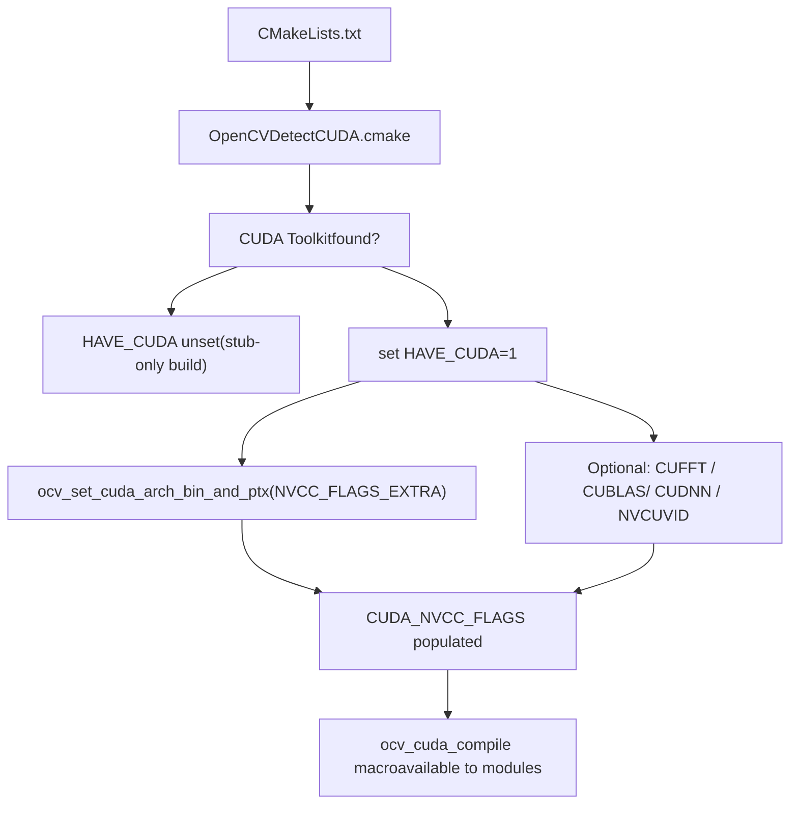
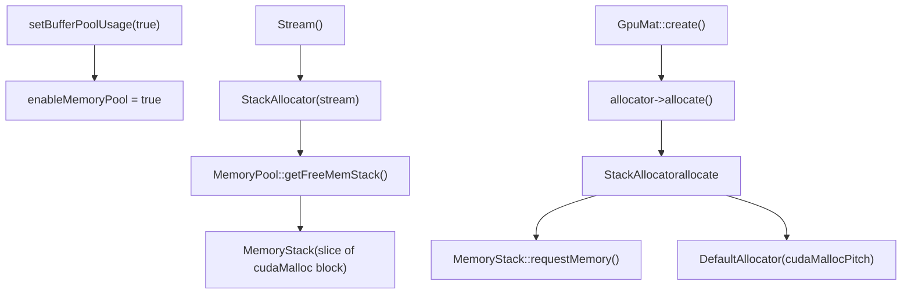
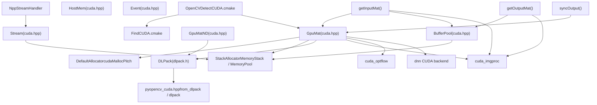

# CUDA and GPU Acceleration

Relevant source files

-   [3rdparty/dlpack/LICENSE](https://github.com/opencv/opencv/blob/91c78f50/3rdparty/dlpack/LICENSE)
-   [3rdparty/dlpack/include/dlpack/dlpack.h](https://github.com/opencv/opencv/blob/91c78f50/3rdparty/dlpack/include/dlpack/dlpack.h)
-   [cmake/FindCUDA.cmake](https://github.com/opencv/opencv/blob/91c78f50/cmake/FindCUDA.cmake)
-   [cmake/FindCUDA/make2cmake.cmake](https://github.com/opencv/opencv/blob/91c78f50/cmake/FindCUDA/make2cmake.cmake)
-   [cmake/FindCUDA/parse\_cubin.cmake](https://github.com/opencv/opencv/blob/91c78f50/cmake/FindCUDA/parse_cubin.cmake)
-   [cmake/FindCUDA/run\_nvcc.cmake](https://github.com/opencv/opencv/blob/91c78f50/cmake/FindCUDA/run_nvcc.cmake)
-   [cmake/OpenCVDetectCUDA.cmake](https://github.com/opencv/opencv/blob/91c78f50/cmake/OpenCVDetectCUDA.cmake)
-   [cmake/OpenCVDetectDLPack.cmake](https://github.com/opencv/opencv/blob/91c78f50/cmake/OpenCVDetectDLPack.cmake)
-   [modules/core/include/opencv2/core/cuda.hpp](https://github.com/opencv/opencv/blob/91c78f50/modules/core/include/opencv2/core/cuda.hpp)
-   [modules/core/include/opencv2/core/cuda.inl.hpp](https://github.com/opencv/opencv/blob/91c78f50/modules/core/include/opencv2/core/cuda.inl.hpp)
-   [modules/core/include/opencv2/core/cuda/utility.hpp](https://github.com/opencv/opencv/blob/91c78f50/modules/core/include/opencv2/core/cuda/utility.hpp)
-   [modules/core/include/opencv2/core/private.cuda.hpp](https://github.com/opencv/opencv/blob/91c78f50/modules/core/include/opencv2/core/private.cuda.hpp)
-   [modules/core/misc/python/pyopencv\_core.hpp](https://github.com/opencv/opencv/blob/91c78f50/modules/core/misc/python/pyopencv_core.hpp)
-   [modules/core/misc/python/pyopencv\_cuda.hpp](https://github.com/opencv/opencv/blob/91c78f50/modules/core/misc/python/pyopencv_cuda.hpp)
-   [modules/core/perf/cuda/perf\_gpumat.cpp](https://github.com/opencv/opencv/blob/91c78f50/modules/core/perf/cuda/perf_gpumat.cpp)
-   [modules/core/src/cuda/gpu\_mat.cu](https://github.com/opencv/opencv/blob/91c78f50/modules/core/src/cuda/gpu_mat.cu)
-   [modules/core/src/cuda/gpu\_mat\_nd.cu](https://github.com/opencv/opencv/blob/91c78f50/modules/core/src/cuda/gpu_mat_nd.cu)
-   [modules/core/src/cuda\_gpu\_mat.cpp](https://github.com/opencv/opencv/blob/91c78f50/modules/core/src/cuda_gpu_mat.cpp)
-   [modules/core/src/cuda\_gpu\_mat\_nd.cpp](https://github.com/opencv/opencv/blob/91c78f50/modules/core/src/cuda_gpu_mat_nd.cpp)
-   [modules/core/src/cuda\_host\_mem.cpp](https://github.com/opencv/opencv/blob/91c78f50/modules/core/src/cuda_host_mem.cpp)
-   [modules/core/src/cuda\_stream.cpp](https://github.com/opencv/opencv/blob/91c78f50/modules/core/src/cuda_stream.cpp)
-   [modules/core/test/test\_cuda.cpp](https://github.com/opencv/opencv/blob/91c78f50/modules/core/test/test_cuda.cpp)
-   [modules/python/test/test\_cuda.py](https://github.com/opencv/opencv/blob/91c78f50/modules/python/test/test_cuda.py)

This page covers OpenCV's CUDA support infrastructure: how the build system detects CUDA, the core GPU data structures (`GpuMat`, `GpuMatND`, `HostMem`), stream and event management, memory allocation strategies, and DLPack interoperability. It describes the primitives that all GPU-accelerated modules build on.

For details on GPU-accelerated image processing functions and optical flow, see [GPU-Accelerated Image Processing and Optical Flow](/opencv/opencv/14.2-gpu-accelerated-image-processing-and-optical-flow). For the OpenCL-based transparent GPU path (which uses `UMat` rather than `GpuMat`), see [OpenCL Acceleration and Transparent GPU Execution](/opencv/opencv/3.2-opencl-acceleration-and-transparent-gpu-execution). For the DNN module's CUDA backend, see [Network Execution and Backend Selection](/opencv/opencv/5.2-network-execution-and-backend-selection).

---

## Build-Time Detection

CUDA support is detected and configured by [cmake/OpenCVDetectCUDA.cmake](https://github.com/opencv/opencv/blob/91c78f50/cmake/OpenCVDetectCUDA.cmake) during CMake configuration. The script:

1.  Calls `find_host_package(CUDA)` (using either CMake's built-in module or OpenCV's patched [cmake/FindCUDA.cmake](https://github.com/opencv/opencv/blob/91c78f50/cmake/FindCUDA.cmake)) to locate the CUDA Toolkit.
2.  Sets `HAVE_CUDA 1` if found.
3.  Probes optional libraries and sets corresponding flags:

| CMake Option | Feature Flag | Library |
| --- | --- | --- |
| `WITH_CUFFT` | `HAVE_CUFFT` | `CUDA_cufft_LIBRARY` |
| `WITH_CUBLAS` | `HAVE_CUBLAS` | `CUDA_cublas_LIBRARY` |
| `WITH_CUDNN` | `HAVE_CUDNN` | `CUDNN_LIBRARIES` |
| `WITH_NVCUVID` / `WITH_NVCUVENC` | — | NVIDIA Video Codec SDK |

4.  Computes `-gencode` flags for each target GPU architecture via `ocv_set_cuda_arch_bin_and_ptx`, storing results in `CUDA_NVCC_FLAGS` and `OPENCV_CUDA_ARCH_BIN` / `OPENCV_CUDA_ARCH_PTX`.
5.  Exposes the `CUDA_FAST_MATH` option (`--use_fast_math`) and the `CUDA_ENABLE_DELAYLOAD` option (Windows only).

The minimum required CUDA runtime version is defined in [modules/core/include/opencv2/core/private.cuda.hpp80-84](https://github.com/opencv/opencv/blob/91c78f50/modules/core/include/opencv2/core/private.cuda.hpp#L80-L84) as `CUDART_MINIMUM_REQUIRED_VERSION 6050`.

Every source file guarded by `#ifdef HAVE_CUDA` is only compiled when the toolkit is found. When CUDA is absent, the same public API exists but all methods call `throw_no_cuda()`.

**CUDA Detection Flow**


Sources: [cmake/OpenCVDetectCUDA.cmake](https://github.com/opencv/opencv/blob/91c78f50/cmake/OpenCVDetectCUDA.cmake) [modules/core/include/opencv2/core/private.cuda.hpp](https://github.com/opencv/opencv/blob/91c78f50/modules/core/include/opencv2/core/private.cuda.hpp)

---

## Core Data Structures

All CUDA types live in the `cv::cuda` namespace. The public header is [modules/core/include/opencv2/core/cuda.hpp](https://github.com/opencv/opencv/blob/91c78f50/modules/core/include/opencv2/core/cuda.hpp)

### GpuMat

`GpuMat` is the 2D device-memory counterpart of `Mat`. Its layout mirrors `Mat`:

| Field | Type | Meaning |
| --- | --- | --- |
| `flags` | `int` | Magic signature + type encoding |
| `rows`, `cols` | `int` | Matrix dimensions |
| `step` | `size_t` | Row stride in bytes (aligned by hardware) |
| `data` | `uchar*` | Pointer to device memory |
| `refcount` | `int*` | Reference count (host-side pointer) |
| `datastart`, `dataend` | `uchar*` | Extent pointers for ROI tracking |
| `allocator` | `Allocator*` | Pluggable allocation strategy |

Key constraints compared to `Mat`:

-   Only 2D (no arbitrary dimensions).
-   `isContinuous()` is frequently `false` because rows are hardware-aligned via `cudaMallocPitch`.
-   No expression templates.

**GpuMat Class Relationships**

Sources: [modules/core/include/opencv2/core/cuda.hpp105-377](https://github.com/opencv/opencv/blob/91c78f50/modules/core/include/opencv2/core/cuda.hpp#L105-L377) [modules/core/src/cuda/gpu\_mat.cu106-141](https://github.com/opencv/opencv/blob/91c78f50/modules/core/src/cuda/gpu_mat.cu#L106-L141) [modules/core/src/cuda\_gpu\_mat.cpp](https://github.com/opencv/opencv/blob/91c78f50/modules/core/src/cuda_gpu_mat.cpp)

#### Memory Allocation

The default allocator (`DefaultAllocator` in [modules/core/src/cuda/gpu\_mat.cu107-141](https://github.com/opencv/opencv/blob/91c78f50/modules/core/src/cuda/gpu_mat.cu#L107-L141)) calls:

-   `cudaMallocPitch` for matrices with more than one row and one column (hardware-aligned rows).
-   `cudaMalloc` for single-row or single-column matrices (always continuous).

A custom allocator can be set process-wide with `GpuMat::setDefaultAllocator(Allocator*)` or per-instance by passing an `Allocator*` to the constructor.

#### Upload and Download

Both blocking and non-blocking (stream-based) variants exist:

| Method | Direction | Synchrony |
| --- | --- | --- |
| `upload(InputArray)` | CPU → GPU | Blocking (`cudaMemcpy2D`) |
| `upload(InputArray, Stream&)` | CPU → GPU | Non-blocking (`cudaMemcpy2DAsync`) |
| `download(OutputArray)` | GPU → CPU | Blocking |
| `download(OutputArray, Stream&)` | GPU → CPU | Non-blocking |

Implementations are in [modules/core/src/cuda/gpu\_mat.cu222-267](https://github.com/opencv/opencv/blob/91c78f50/modules/core/src/cuda/gpu_mat.cu#L222-L267)

### GpuMatND

`GpuMatND` extends GPU storage to N dimensions. Defined in [modules/core/include/opencv2/core/cuda.hpp394-581](https://github.com/opencv/opencv/blob/91c78f50/modules/core/include/opencv2/core/cuda.hpp#L394-L581) Memory is managed through a `std::shared_ptr<GpuData>` (reference-counted device allocation). Sub-matrices are tracked via an `offset` field. The `createGpuMatHeader()` method returns a non-owning `GpuMat` view of a 2D slice without copying.

### HostMem

`HostMem` wraps CUDA special host-memory types via `cudaHostAlloc`. Three allocation types are supported:

| Enum | CUDA Flag | Use Case |
| --- | --- | --- |
| `PAGE_LOCKED` | `cudaHostAllocDefault` | Fast asynchronous transfers |
| `SHARED` | `cudaHostAllocMapped` | Zero-copy for integrated GPUs |
| `WRITE_COMBINED` | `cudaHostAllocWriteCombined` | GPU-read-only upload buffers |

`SHARED` memory can be mapped to the GPU address space via `HostMem::createGpuMatHeader()`, which calls `cudaHostGetDevicePointer` ([modules/core/src/cuda\_host\_mem.cpp303-315](https://github.com/opencv/opencv/blob/91c78f50/modules/core/src/cuda_host_mem.cpp#L303-L315)).

For existing `Mat` allocations, `registerPageLocked(Mat&)` / `unregisterPageLocked(Mat&)` call `cudaHostRegister` / `cudaHostUnregister`.

Sources: [modules/core/include/opencv2/core/cuda.hpp798-857](https://github.com/opencv/opencv/blob/91c78f50/modules/core/include/opencv2/core/cuda.hpp#L798-L857) [modules/core/src/cuda\_host\_mem.cpp](https://github.com/opencv/opencv/blob/91c78f50/modules/core/src/cuda_host_mem.cpp)

---

## Stream and Event Management

### Stream

`cv::cuda::Stream` wraps a `cudaStream_t`. Its internal implementation is `Stream::Impl` in [modules/core/src/cuda\_stream.cpp287-337](https://github.com/opencv/opencv/blob/91c78f50/modules/core/src/cuda_stream.cpp#L287-L337)

Key methods:

| Method | Behavior |
| --- | --- |
| `Stream()` | Creates a new `cudaStream_t`, associates a `StackAllocator` |
| `Stream(size_t cudaFlags)` | Creates with `cudaStreamCreateWithFlags` (e.g., `cudaStreamNonBlocking`) |
| `queryIfComplete()` | Non-blocking poll via `cudaStreamQuery` |
| `waitForCompletion()` | Blocking sync via `cudaStreamSynchronize` |
| `waitEvent(Event&)` | Calls `cudaStreamWaitEvent` |
| `enqueueHostCallback(callback, data)` | Schedules a host callback via `cudaStreamAddCallback` |
| `Stream::Null()` | Returns the per-device null (default) stream |
| `cudaPtr()` | Returns the raw `cudaStream_t` as `void*` |

`StreamAccessor::getStream(Stream&)` and `StreamAccessor::wrapStream(cudaStream_t)` in [modules/core/src/cuda\_stream.cpp577-586](https://github.com/opencv/opencv/blob/91c78f50/modules/core/src/cuda_stream.cpp#L577-L586) allow C++ code inside OpenCV modules to cross the abstraction boundary.

### Event

`cv::cuda::Event` wraps a `cudaEvent_t`. Defined in [modules/core/include/opencv2/core/cuda.hpp](https://github.com/opencv/opencv/blob/91c78f50/modules/core/include/opencv2/core/cuda.hpp) and implemented in [modules/core/src/cuda\_stream.cpp769-878](https://github.com/opencv/opencv/blob/91c78f50/modules/core/src/cuda_stream.cpp#L769-L878)

| Method | CUDA call |
| --- | --- |
| `record(Stream&)` | `cudaEventRecord` |
| `queryIfComplete()` | `cudaEventQuery` |
| `waitForCompletion()` | `cudaEventSynchronize` |
| `Event::elapsedTime(start, end)` | `cudaEventElapsedTime` |

`EventAccessor` provides the same cross-boundary access pattern as `StreamAccessor`.

Sources: [modules/core/src/cuda\_stream.cpp](https://github.com/opencv/opencv/blob/91c78f50/modules/core/src/cuda_stream.cpp) [modules/core/include/opencv2/core/cuda.hpp](https://github.com/opencv/opencv/blob/91c78f50/modules/core/include/opencv2/core/cuda.hpp)

---

## Memory Pool and BufferPool

### StackAllocator and MemoryPool

When `setBufferPoolUsage(true)` is called, each `Stream` gets a `StackAllocator` backed by a `MemoryStack` drawn from a per-device `MemoryPool`. The pool is pre-allocated as a single contiguous `cudaMalloc` block divided into stacks.


Default configuration (per device): 10 MB per stack, 5 stacks. Override via `setBufferPoolConfig(deviceId, stackSize, stackCount)`.

**Deallocation rule:** `StackAllocator` enforces LIFO order. In debug builds, out-of-order deallocations trigger a `CV_Assert` failure ([modules/core/src/cuda\_stream.cpp98-109](https://github.com/opencv/opencv/blob/91c78f50/modules/core/src/cuda_stream.cpp#L98-L109)).

### BufferPool

`BufferPool` is the user-facing API for the pool. It is tied to a `Stream` and returns `GpuMat` instances backed by the stream's `StackAllocator`:

```
// Conceptual usage (from cuda.hpp documentation)setBufferPoolUsage(true);setBufferPoolConfig(getDevice(), 1024 * 1024 * 64, 2); // 64 MB, 2 stacksStream stream1;BufferPool pool1(stream1);GpuMat d_src = pool1.getBuffer(4096, 4096, CV_8UC1);
```
`BufferPool::getBuffer` internally calls `GpuMat::create` on a `GpuMat` constructed with the stream's allocator ([modules/core/src/cuda\_stream.cpp751-763](https://github.com/opencv/opencv/blob/91c78f50/modules/core/src/cuda_stream.cpp#L751-L763)).

Sources: [modules/core/src/cuda\_stream.cpp](https://github.com/opencv/opencv/blob/91c78f50/modules/core/src/cuda_stream.cpp) [modules/core/include/opencv2/core/cuda.hpp630-776](https://github.com/opencv/opencv/blob/91c78f50/modules/core/include/opencv2/core/cuda.hpp#L630-L776)

---

## Internal Helper Functions

[modules/core/include/opencv2/core/private.cuda.hpp](https://github.com/opencv/opencv/blob/91c78f50/modules/core/include/opencv2/core/private.cuda.hpp) provides internal utilities for CUDA module implementations:

| Symbol | Purpose |
| --- | --- |
| `getInputMat(InputArray, Stream&)` | Returns a `GpuMat`; if input is not already on GPU, uploads via `BufferPool` |
| `getOutputMat(OutputArray, rows, cols, type, Stream&)` | Returns a `GpuMat` output; uses `BufferPool` if output is not a `GpuMat` |
| `syncOutput(const GpuMat&, OutputArray, Stream&)` | Downloads result back to CPU if `OutputArray` is not a `GpuMat` |
| `NppStreamHandler` | RAII wrapper that sets/restores the NPP stream context |
| `NPPTypeTraits<N>` | Maps OpenCV depth constants to NPP pixel types |
| `nppSafeCall(expr)` | Checks NPP return code and throws on error |
| `cuSafeCall(expr)` | Checks CUDA Driver API return code and throws on error |

`NppStreamHandler` behavior depends on the NPP version: for NPP ≥ 12205 (CUDA 12.4+) it uses the `NppStreamContext` API; for older versions it uses the global `nppSetStream` / `nppGetStream` mechanism ([modules/core/include/opencv2/core/private.cuda.hpp133-201](https://github.com/opencv/opencv/blob/91c78f50/modules/core/include/opencv2/core/private.cuda.hpp#L133-L201)).

Sources: [modules/core/include/opencv2/core/private.cuda.hpp](https://github.com/opencv/opencv/blob/91c78f50/modules/core/include/opencv2/core/private.cuda.hpp) [modules/core/src/cuda\_gpu\_mat.cpp345-408](https://github.com/opencv/opencv/blob/91c78f50/modules/core/src/cuda_gpu_mat.cpp#L345-L408)

---

## DLPack Interoperability

OpenCV supports the DLPack tensor exchange protocol, allowing zero-copy sharing of `GpuMat` and `GpuMatND` with other frameworks (e.g., PyTorch, TensorFlow) that also support DLPack.

The DLPack header is bundled at [3rdparty/dlpack/include/dlpack/dlpack.h](https://github.com/opencv/opencv/blob/91c78f50/3rdparty/dlpack/include/dlpack/dlpack.h) (Apache 2.0 license) or found via `find_package(dlpack)` ([cmake/OpenCVDetectDLPack.cmake](https://github.com/opencv/opencv/blob/91c78f50/cmake/OpenCVDetectDLPack.cmake)).

**Python binding wiring** is in [modules/core/misc/python/pyopencv\_cuda.hpp](https://github.com/opencv/opencv/blob/91c78f50/modules/core/misc/python/pyopencv_cuda.hpp) The key functions:

| Function | Direction | Notes |
| --- | --- | --- |
| `fillDLPackTensor<GpuMat>` | `GpuMat` → `DLManagedTensor` | Sets `kDLCUDA` device type, maps `step1()` to strides |
| `fillDLPackTensor<GpuMatND>` | `GpuMatND` → `DLManagedTensor` | Handles N-dim shapes and strides |
| `parseDLPackTensor<GpuMat>` | `DLManagedTensor` → `GpuMat` | Validates 3D, CUDA device, contiguous channel stride |
| `parseDLPackTensor<GpuMatND>` | `DLManagedTensor` → `GpuMatND` | Wraps N-dim external memory |

From Python, the protocol is exposed as `cuda_GpuMat.__dlpack__` and `cuda_GpuMat.from_dlpack`. Tests are in [modules/python/test/test\_cuda.py146-157](https://github.com/opencv/opencv/blob/91c78f50/modules/python/test/test_cuda.py#L146-L157)

Type mapping between DLPack `DLDataType` and OpenCV depth codes:

| DLPack code | bits | OpenCV depth |
| --- | --- | --- |
| `kDLUInt` | 8 | `CV_8U` |
| `kDLUInt` | 16 | `CV_16U` |
| `kDLInt` | 8 | `CV_8S` |
| `kDLInt` | 16 | `CV_16S` |
| `kDLInt` | 32 | `CV_32S` |
| `kDLFloat` | 16 | `CV_16F` |
| `kDLFloat` | 32 | `CV_32F` |
| `kDLFloat` | 64 | `CV_64F` |

Sources: [modules/core/misc/python/pyopencv\_cuda.hpp](https://github.com/opencv/opencv/blob/91c78f50/modules/core/misc/python/pyopencv_cuda.hpp) [modules/core/misc/python/pyopencv\_core.hpp](https://github.com/opencv/opencv/blob/91c78f50/modules/core/misc/python/pyopencv_core.hpp) [cmake/OpenCVDetectDLPack.cmake](https://github.com/opencv/opencv/blob/91c78f50/cmake/OpenCVDetectDLPack.cmake)

---

## Module Architecture Overview

**How CUDA infrastructure components connect**


Sources: [modules/core/include/opencv2/core/cuda.hpp](https://github.com/opencv/opencv/blob/91c78f50/modules/core/include/opencv2/core/cuda.hpp) [modules/core/include/opencv2/core/private.cuda.hpp](https://github.com/opencv/opencv/blob/91c78f50/modules/core/include/opencv2/core/private.cuda.hpp) [cmake/OpenCVDetectCUDA.cmake](https://github.com/opencv/opencv/blob/91c78f50/cmake/OpenCVDetectCUDA.cmake) [modules/core/src/cuda\_stream.cpp](https://github.com/opencv/opencv/blob/91c78f50/modules/core/src/cuda_stream.cpp) [modules/core/src/cuda/gpu\_mat.cu](https://github.com/opencv/opencv/blob/91c78f50/modules/core/src/cuda/gpu_mat.cu)

---

## Python API Summary

The Python bindings expose the following types and utilities from `cv.cuda`:

| Python Name | C++ Type |
| --- | --- |
| `cv.cuda_GpuMat` | `cv::cuda::GpuMat` |
| `cv.cuda_GpuMatND` | `cv::cuda::GpuMatND` |
| `cv.cuda_Stream` | `cv::cuda::Stream` |
| `cv.cuda_Event` | `cv::cuda::Event` |
| `cv.cuda.HostMem` | `cv::cuda::HostMem` |
| `cv.cuda.BufferPool` | `cv::cuda::BufferPool` |
| `cv.cuda.setBufferPoolUsage(bool)` | `cv::cuda::setBufferPoolUsage` |
| `cv.cuda.setBufferPoolConfig(id, size, count)` | `cv::cuda::setBufferPoolConfig` |
| `cv.cuda.createGpuMatFromCudaMemory(...)` | `cv::cuda::createGpuMatFromCudaMemory` |
| `cv.cuda.wrapStream(ptr)` | `cv::cuda::wrapStream` |
| `cv.cuda.getCudaEnabledDeviceCount()` | `cv::cuda::getCudaEnabledDeviceCount` |

Tests covering upload/download, stream-based async transfers, buffer pool, DLPack, and `convertTo`/`copyTo` are in [modules/python/test/test\_cuda.py](https://github.com/opencv/opencv/blob/91c78f50/modules/python/test/test_cuda.py)

Sources: [modules/python/test/test\_cuda.py](https://github.com/opencv/opencv/blob/91c78f50/modules/python/test/test_cuda.py) [modules/core/misc/python/pyopencv\_cuda.hpp](https://github.com/opencv/opencv/blob/91c78f50/modules/core/misc/python/pyopencv_cuda.hpp)
