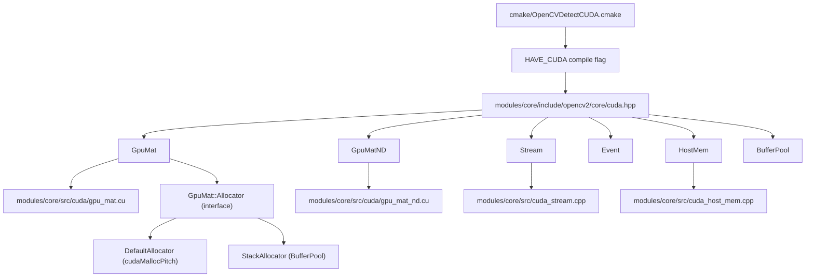
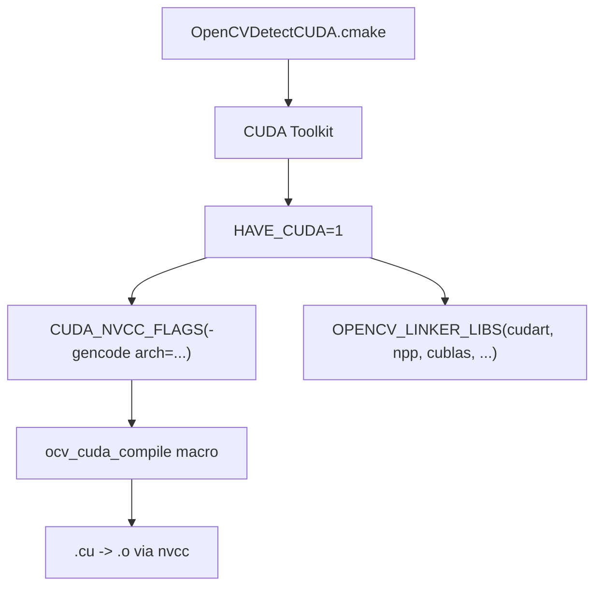
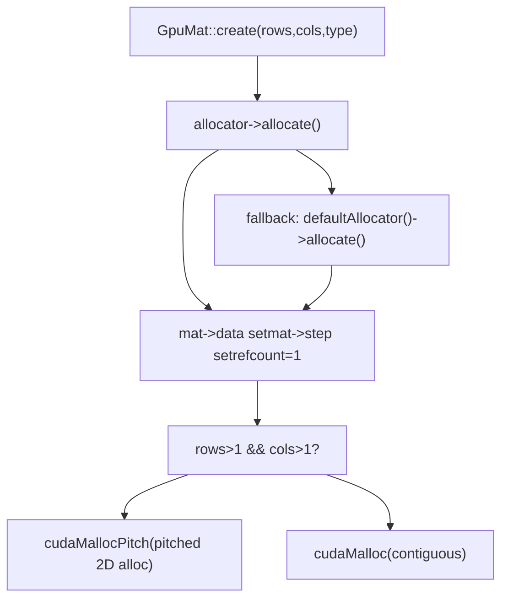
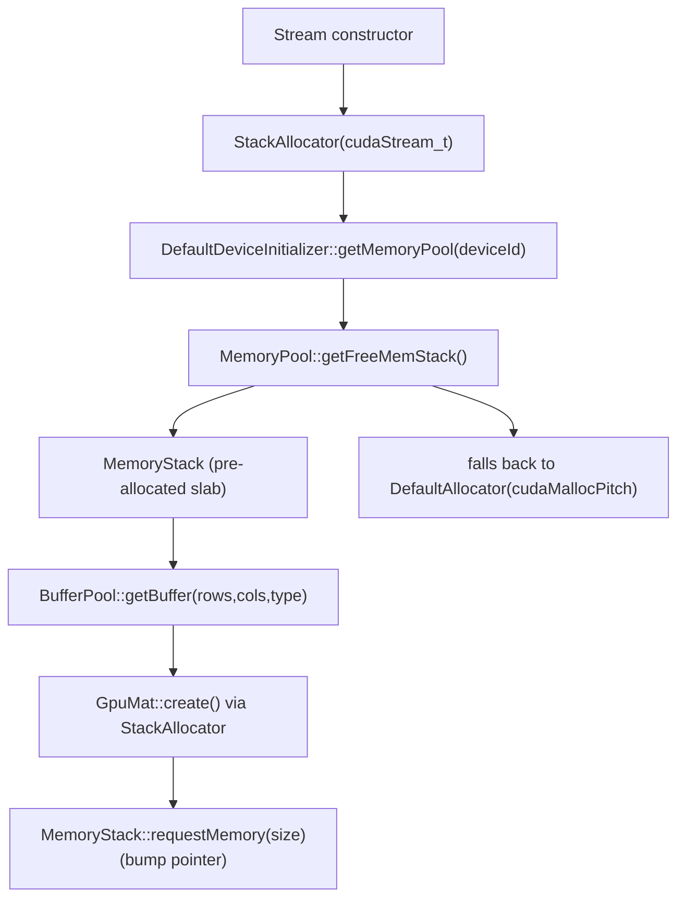

# GpuMat and CUDA Runtime Integration

Relevant source files

-   [3rdparty/dlpack/LICENSE](https://github.com/opencv/opencv/blob/91c78f50/3rdparty/dlpack/LICENSE)
-   [3rdparty/dlpack/include/dlpack/dlpack.h](https://github.com/opencv/opencv/blob/91c78f50/3rdparty/dlpack/include/dlpack/dlpack.h)
-   [cmake/FindCUDA.cmake](https://github.com/opencv/opencv/blob/91c78f50/cmake/FindCUDA.cmake)
-   [cmake/FindCUDA/make2cmake.cmake](https://github.com/opencv/opencv/blob/91c78f50/cmake/FindCUDA/make2cmake.cmake)
-   [cmake/FindCUDA/parse\_cubin.cmake](https://github.com/opencv/opencv/blob/91c78f50/cmake/FindCUDA/parse_cubin.cmake)
-   [cmake/FindCUDA/run\_nvcc.cmake](https://github.com/opencv/opencv/blob/91c78f50/cmake/FindCUDA/run_nvcc.cmake)
-   [cmake/OpenCVDetectCUDA.cmake](https://github.com/opencv/opencv/blob/91c78f50/cmake/OpenCVDetectCUDA.cmake)
-   [cmake/OpenCVDetectDLPack.cmake](https://github.com/opencv/opencv/blob/91c78f50/cmake/OpenCVDetectDLPack.cmake)
-   [modules/core/include/opencv2/core/cuda.hpp](https://github.com/opencv/opencv/blob/91c78f50/modules/core/include/opencv2/core/cuda.hpp)
-   [modules/core/include/opencv2/core/cuda.inl.hpp](https://github.com/opencv/opencv/blob/91c78f50/modules/core/include/opencv2/core/cuda.inl.hpp)
-   [modules/core/include/opencv2/core/cuda/utility.hpp](https://github.com/opencv/opencv/blob/91c78f50/modules/core/include/opencv2/core/cuda/utility.hpp)
-   [modules/core/include/opencv2/core/private.cuda.hpp](https://github.com/opencv/opencv/blob/91c78f50/modules/core/include/opencv2/core/private.cuda.hpp)
-   [modules/core/misc/python/pyopencv\_core.hpp](https://github.com/opencv/opencv/blob/91c78f50/modules/core/misc/python/pyopencv_core.hpp)
-   [modules/core/misc/python/pyopencv\_cuda.hpp](https://github.com/opencv/opencv/blob/91c78f50/modules/core/misc/python/pyopencv_cuda.hpp)
-   [modules/core/perf/cuda/perf\_gpumat.cpp](https://github.com/opencv/opencv/blob/91c78f50/modules/core/perf/cuda/perf_gpumat.cpp)
-   [modules/core/src/cuda/gpu\_mat.cu](https://github.com/opencv/opencv/blob/91c78f50/modules/core/src/cuda/gpu_mat.cu)
-   [modules/core/src/cuda/gpu\_mat\_nd.cu](https://github.com/opencv/opencv/blob/91c78f50/modules/core/src/cuda/gpu_mat_nd.cu)
-   [modules/core/src/cuda\_gpu\_mat.cpp](https://github.com/opencv/opencv/blob/91c78f50/modules/core/src/cuda_gpu_mat.cpp)
-   [modules/core/src/cuda\_gpu\_mat\_nd.cpp](https://github.com/opencv/opencv/blob/91c78f50/modules/core/src/cuda_gpu_mat_nd.cpp)
-   [modules/core/src/cuda\_host\_mem.cpp](https://github.com/opencv/opencv/blob/91c78f50/modules/core/src/cuda_host_mem.cpp)
-   [modules/core/src/cuda\_stream.cpp](https://github.com/opencv/opencv/blob/91c78f50/modules/core/src/cuda_stream.cpp)
-   [modules/core/test/test\_cuda.cpp](https://github.com/opencv/opencv/blob/91c78f50/modules/core/test/test_cuda.cpp)
-   [modules/python/test/test\_cuda.py](https://github.com/opencv/opencv/blob/91c78f50/modules/python/test/test_cuda.py)

This page documents the GPU memory management layer in OpenCV: the `GpuMat` and `GpuMatND` classes, CUDA stream and event abstractions, host-side pinned memory management, the buffer pool system, DLPack tensor interoperability, and the CMake-level CUDA detection mechanism. For GPU-accelerated image processing algorithms built on top of these primitives, see [GPU-Accelerated Image Processing and Optical Flow](/opencv/opencv/14.2-gpu-accelerated-image-processing-and-optical-flow). For the analogous OpenCL/CPU transparent acceleration path, see [OpenCL Acceleration and Transparent GPU Execution](/opencv/opencv/3.2-opencl-acceleration-and-transparent-gpu-execution).

---

## Architecture Overview

OpenCV's CUDA integration is split across three layers: CMake build detection, the C++ runtime API in `opencv_core`, and GPU kernel implementations in `opencv_cudev`/`opencv_cuda*` modules.

**Figure: CUDA integration layers**


Sources: [cmake/OpenCVDetectCUDA.cmake1-255](https://github.com/opencv/opencv/blob/91c78f50/cmake/OpenCVDetectCUDA.cmake#L1-L255) [modules/core/include/opencv2/core/cuda.hpp65-880](https://github.com/opencv/opencv/blob/91c78f50/modules/core/include/opencv2/core/cuda.hpp#L65-L880) [modules/core/src/cuda/gpu\_mat.cu1-100](https://github.com/opencv/opencv/blob/91c78f50/modules/core/src/cuda/gpu_mat.cu#L1-L100) [modules/core/src/cuda\_stream.cpp1-100](https://github.com/opencv/opencv/blob/91c78f50/modules/core/src/cuda_stream.cpp#L1-L100)

---

## Build-Time CUDA Detection (`OpenCVDetectCUDA.cmake`)

The file [cmake/OpenCVDetectCUDA.cmake](https://github.com/opencv/opencv/blob/91c78f50/cmake/OpenCVDetectCUDA.cmake) is the entry point for enabling CUDA support. It:

1.  Calls `find_host_package(CUDA ...)` to locate the CUDA Toolkit (via CMake's built-in module or OpenCV's patched `FindCUDA.cmake` for older CMake versions).
2.  Sets `HAVE_CUDA 1` when a compatible toolkit is found.
3.  Detects optional components and sets corresponding flags:

| CMake Option | Result Flag | Library |
| --- | --- | --- |
| `WITH_CUFFT` | `HAVE_CUFFT` | `CUDA_cufft_LIBRARY` |
| `WITH_CUBLAS` | `HAVE_CUBLAS` | `CUDA_cublas_LIBRARY` |
| `WITH_CUDNN` | `HAVE_CUDNN` | `CUDNN_LIBRARIES` |
| `WITH_NVCUVID` / `WITH_NVCUVENC` | — | NVIDIA Video Codec SDK |

4.  Determines target GPU architectures via `ocv_set_cuda_arch_bin_and_ptx`, which populates `CUDA_NVCC_FLAGS` with `-gencode arch=compute_XX,code=sm_XX` flags.
5.  Defines the `ocv_cuda_compile` macro used throughout module `CMakeLists.txt` files to compile `.cu` sources.

The minimum required CUDA runtime version is enforced in [modules/core/include/opencv2/core/private.cuda.hpp80-84](https://github.com/opencv/opencv/blob/91c78f50/modules/core/include/opencv2/core/private.cuda.hpp#L80-L84) as `CUDART_MINIMUM_REQUIRED_VERSION 6050`.

**Figure: CUDA detection and flag propagation**


Sources: [cmake/OpenCVDetectCUDA.cmake1-255](https://github.com/opencv/opencv/blob/91c78f50/cmake/OpenCVDetectCUDA.cmake#L1-L255) [modules/core/include/opencv2/core/private.cuda.hpp59-86](https://github.com/opencv/opencv/blob/91c78f50/modules/core/include/opencv2/core/private.cuda.hpp#L59-L86)

---

## `GpuMat`: Primary GPU Matrix Class

`GpuMat` is the 2D GPU memory container declared in [modules/core/include/opencv2/core/cuda.hpp105-377](https://github.com/opencv/opencv/blob/91c78f50/modules/core/include/opencv2/core/cuda.hpp#L105-L377) It mirrors the `Mat` API with the following key differences:

-   **2D only** — no arbitrary-dimension support.
-   **Row padding** — `isContinuous()` is usually `false`; rows are aligned to hardware boundaries using `cudaMallocPitch`.
-   **No expression templates** — arithmetic on `GpuMat` triggers actual allocation and kernel launch.
-   **Blocking vs. non-blocking** — most operations have both a synchronous overload and a `Stream&` overload for async execution.

### Memory Layout Fields

| Field | Type | Description |
| --- | --- | --- |
| `data` | `uchar*` | Pointer to device memory |
| `step` | `size_t` | Bytes per row (includes padding) |
| `rows`, `cols` | `int` | Matrix dimensions |
| `flags` | `int` | Encodes type, depth, channel count, continuity |
| `refcount` | `int*` | Reference counter (host-side) |
| `datastart`, `dataend` | `uchar*` / `const uchar*` | Bounds of the parent allocation |
| `allocator` | `Allocator*` | Strategy object for memory management |

### Key Operations

| Method | Transfer | Notes |
| --- | --- | --- |
| `upload(InputArray)` | Host → Device | Blocking; calls `cudaMemcpy2D` |
| `upload(InputArray, Stream&)` | Host → Device | Non-blocking; calls `cudaMemcpy2DAsync` |
| `download(OutputArray)` | Device → Host | Blocking |
| `download(OutputArray, Stream&)` | Device → Host | Non-blocking |
| `copyTo(OutputArray)` | Device → Device | Blocking; `cudaMemcpy2D` |
| `copyTo(OutputArray, Stream&)` | Device → Device | Non-blocking |
| `setTo(Scalar, Stream&)` | — | Uses `cudaMemset2DAsync` for zero/uniform fills |
| `convertTo(OutputArray, int, Stream&)` | — | Type conversion; dispatched via cudev grid transforms |
| `clone()` | — | Returns a deep copy |
| `cudaPtr()` | — | Returns raw device pointer as `void*` |

Sources: [modules/core/include/opencv2/core/cuda.hpp105-377](https://github.com/opencv/opencv/blob/91c78f50/modules/core/include/opencv2/core/cuda.hpp#L105-L377) [modules/core/src/cuda/gpu\_mat.cu160-603](https://github.com/opencv/opencv/blob/91c78f50/modules/core/src/cuda/gpu_mat.cu#L160-L603) [modules/core/src/cuda\_gpu\_mat.cpp49-343](https://github.com/opencv/opencv/blob/91c78f50/modules/core/src/cuda_gpu_mat.cpp#L49-L343)

### Allocator Interface

`GpuMat::Allocator` is a pure virtual interface with two methods:

```
virtual bool allocate(GpuMat* mat, int rows, int cols, size_t elemSize) = 0;
virtual void free(GpuMat* mat) = 0;
```
The default (`DefaultAllocator`) is defined in [modules/core/src/cuda/gpu\_mat.cu107-141](https://github.com/opencv/opencv/blob/91c78f50/modules/core/src/cuda/gpu_mat.cu#L107-L141) It calls `cudaMallocPitch` for 2D matrices and `cudaMalloc` for single-row/column matrices. The active default is stored in `g_defaultAllocator` and can be replaced globally via `GpuMat::setDefaultAllocator`.

**Figure: `GpuMat` memory allocation path**


Sources: [modules/core/src/cuda/gpu\_mat.cu107-201](https://github.com/opencv/opencv/blob/91c78f50/modules/core/src/cuda/gpu_mat.cu#L107-L201)

### Sub-matrix and ROI Views

`GpuMat` supports zero-copy sub-matrix views via the constructors taking `Range` or `Rect` arguments and via `row()`, `col()`, `rowRange()`, `colRange()`, and `operator()`. These share the same device pointer and increment `refcount`. The `locateROI` and `adjustROI` methods navigate within a parent allocation. Implementations are in [modules/core/src/cuda\_gpu\_mat.cpp104-254](https://github.com/opencv/opencv/blob/91c78f50/modules/core/src/cuda_gpu_mat.cpp#L104-L254)

### Wrapping External GPU Memory

Two free functions create a `GpuMat` header over externally allocated device memory without owning it (no `refcount`):

-   `GpuMat(int rows, int cols, int type, void* data, size_t step)` — constructor
-   `createGpuMatFromCudaMemory(...)` — Python-binding-friendly wrapper defined at [modules/core/include/opencv2/core/cuda.hpp615-628](https://github.com/opencv/opencv/blob/91c78f50/modules/core/include/opencv2/core/cuda.hpp#L615-L628)

---

## `GpuMatND`: N-Dimensional GPU Array

`GpuMatND` is defined in [modules/core/include/opencv2/core/cuda.hpp394-581](https://github.com/opencv/opencv/blob/91c78f50/modules/core/include/opencv2/core/cuda.hpp#L394-L581) and supports arbitrary dimensionality on the GPU. It uses `std::shared_ptr<GpuData>` for reference-counted memory management rather than a raw `int* refcount`.

`GpuData` ([modules/core/include/opencv2/core/cuda.hpp379-392](https://github.com/opencv/opencv/blob/91c78f50/modules/core/include/opencv2/core/cuda.hpp#L379-L392)) is a thin RAII wrapper: its constructor calls `cudaMalloc` and its destructor calls `cudaFree` ([modules/core/src/cuda/gpu\_mat\_nd.cu19-28](https://github.com/opencv/opencv/blob/91c78f50/modules/core/src/cuda/gpu_mat_nd.cu#L19-L28)).

### Key Differences from `GpuMat`

| Aspect | `GpuMat` | `GpuMatND` |
| --- | --- | --- |
| Dimensions | 2D only | N-dimensional |
| Memory management | `int* refcount` + `Allocator` | `shared_ptr<GpuData>` |
| External memory | `refcount == nullptr` | `data_` empty, `external()` returns true |
| Sub-matrix | `datastart`/`dataend` + `adjustROI` | `offset` field, `SUBMATRIX_FLAG` |
| 2D interop | — | `createGpuMatHeader()`, `operator GpuMat()` |

### Getting a 2D View

`GpuMatND::createGpuMatHeader()` returns a `GpuMat` header (no reference counting) pointing into the N-D data when the array is effectively 2D. `GpuMatND::operator GpuMat()` clones the data. Implementations are in [modules/core/src/cuda\_gpu\_mat\_nd.cpp49-84](https://github.com/opencv/opencv/blob/91c78f50/modules/core/src/cuda_gpu_mat_nd.cpp#L49-L84)

Sources: [modules/core/include/opencv2/core/cuda.hpp379-581](https://github.com/opencv/opencv/blob/91c78f50/modules/core/include/opencv2/core/cuda.hpp#L379-L581) [modules/core/src/cuda/gpu\_mat\_nd.cu19-170](https://github.com/opencv/opencv/blob/91c78f50/modules/core/src/cuda/gpu_mat_nd.cu#L19-L170) [modules/core/src/cuda\_gpu\_mat\_nd.cpp1-119](https://github.com/opencv/opencv/blob/91c78f50/modules/core/src/cuda_gpu_mat_nd.cpp#L1-L119)

---

## CUDA Stream and Event Management

### `Stream`

`Stream` wraps a `cudaStream_t` through the internal `Stream::Impl` class defined in [modules/core/src/cuda\_stream.cpp287-338](https://github.com/opencv/opencv/blob/91c78f50/modules/core/src/cuda_stream.cpp#L287-L338) Each `Stream` owns a `cudaStream_t` (created with `cudaStreamCreate`) and a `Ptr<GpuMat::Allocator>` that defaults to a `StackAllocator`.

Constructors:

| Constructor | Behavior |
| --- | --- |
| `Stream()` | Calls `cudaStreamCreate`, attaches `StackAllocator` |
| `Stream(Ptr<GpuMat::Allocator>)` | Custom allocator, still creates stream |
| `Stream(size_t cudaFlags)` | Passes flags to `cudaStreamCreateWithFlags` (e.g. `cudaStreamNonBlocking`) |

Key methods:

-   `waitForCompletion()` — calls `cudaStreamSynchronize`
-   `queryIfComplete()` — calls `cudaStreamQuery`
-   `waitEvent(Event&)` — calls `cudaStreamWaitEvent`
-   `enqueueHostCallback(callback, userData)` — calls `cudaStreamAddCallback`
-   `cudaPtr()` — exposes the underlying `cudaStream_t` as `void*`
-   `Stream::Null()` — returns the per-device null stream (device-global default)

`StreamAccessor::getStream(Stream&)` and `StreamAccessor::wrapStream(cudaStream_t)` provide the bridge between OpenCV's `Stream` type and raw CUDA stream handles, used internally by all CUDA-accelerated functions.

`wrapStream(size_t cudaStreamMemoryAddress)` provides a Python-friendly binding-level wrapper ([modules/core/src/cuda\_stream.cpp589-596](https://github.com/opencv/opencv/blob/91c78f50/modules/core/src/cuda_stream.cpp#L589-L596)).

### `Event`

`Event` wraps a `cudaEvent_t` via `Event::Impl`. Created with `cudaEventCreateWithFlags`. Supports:

-   `record(Stream&)` — `cudaEventRecord`
-   `queryIfComplete()` — `cudaEventQuery`
-   `waitForCompletion()` — `cudaEventSynchronize`
-   `Event::elapsedTime(start, end)` — `cudaEventElapsedTime`, returns milliseconds

`EventAccessor::getEvent` and `EventAccessor::wrapEvent` mirror `StreamAccessor` for internal use.

**Figure: Stream/Event object hierarchy**


Sources: [modules/core/src/cuda\_stream.cpp265-879](https://github.com/opencv/opencv/blob/91c78f50/modules/core/src/cuda_stream.cpp#L265-L879) [modules/core/include/opencv2/core/cuda.hpp880-1100](https://github.com/opencv/opencv/blob/91c78f50/modules/core/include/opencv2/core/cuda.hpp#L880-L1100)

---

## Host Memory (`HostMem`)

`HostMem` allocates CPU-side memory through CUDA's special allocators, enabling faster transfers. Declared in [modules/core/include/opencv2/core/cuda.hpp798-900](https://github.com/opencv/opencv/blob/91c78f50/modules/core/include/opencv2/core/cuda.hpp#L798-L900) implemented in [modules/core/src/cuda\_host\_mem.cpp](https://github.com/opencv/opencv/blob/91c78f50/modules/core/src/cuda_host_mem.cpp)

Three allocation types:

| `AllocType` | CUDA flag | Use case |
| --- | --- | --- |
| `PAGE_LOCKED` | `cudaHostAllocDefault` | Fast pinned transfers |
| `SHARED` | `cudaHostAllocMapped` | Zero-copy if hardware supports it |
| `WRITE_COMBINED` | `cudaHostAllocWriteCombined` | GPU reads; no CPU cache |

`HostMem::createGpuMatHeader()` maps `SHARED` memory into the GPU address space using `cudaHostGetDevicePointer`, returning a non-owning `GpuMat` header.

`HostMem::getAllocator(AllocType)` returns a `MatAllocator*` backed by `HostMemAllocator` ([modules/core/src/cuda\_host\_mem.cpp54-131](https://github.com/opencv/opencv/blob/91c78f50/modules/core/src/cuda_host_mem.cpp#L54-L131)). This allows a `cv::Mat` to be backed by pinned memory, which is required for asynchronous uploads/downloads.

The free functions `registerPageLocked(Mat&)` and `unregisterPageLocked(Mat&)` call `cudaHostRegister`/`cudaHostUnregister` to page-lock existing `Mat` buffers in place.

Sources: [modules/core/include/opencv2/core/cuda.hpp783-900](https://github.com/opencv/opencv/blob/91c78f50/modules/core/include/opencv2/core/cuda.hpp#L783-L900) [modules/core/src/cuda\_host\_mem.cpp1-336](https://github.com/opencv/opencv/blob/91c78f50/modules/core/src/cuda_host_mem.cpp#L1-L336)

---

## Buffer Pool and Stack Allocator

### Purpose

Repeated `cudaMalloc`/`cudaFree` calls within a tight loop are expensive. The `BufferPool` + `StackAllocator` system pre-allocates chunks of GPU memory and sub-allocates from them per-stream.

### Setup

Must be enabled before any `Stream` is created:

```
// Enable buffer pool globallycv::cuda::setBufferPoolUsage(true);// Configure per-device: 64 MB total, 2 stackscv::cuda::setBufferPoolConfig(deviceId, 1024*1024*64, 2);
```
The global flag `enableMemoryPool` is checked inside `StackAllocator`'s constructor ([modules/core/src/cuda\_stream.cpp605-634](https://github.com/opencv/opencv/blob/91c78f50/modules/core/src/cuda_stream.cpp#L605-L634)).

### How It Works

**Figure: BufferPool memory management**


-   `MemoryPool` holds a vector of `MemoryStack` objects, each backed by a contiguous `cudaMalloc` slab ([modules/core/src/cuda\_stream.cpp122-260](https://github.com/opencv/opencv/blob/91c78f50/modules/core/src/cuda_stream.cpp#L122-L260)).
-   `MemoryStack::requestMemory` is a bump-pointer allocator.
-   `MemoryStack::returnMemory` enforces LIFO order (asserted in debug mode).
-   When a `Stream::Impl` destructs, `StackAllocator` destructor calls `cudaStreamSynchronize` then returns its `MemoryStack` to the pool.

### `BufferPool` API

`BufferPool` is a thin wrapper that binds to a stream's allocator:

```
BufferPool pool(stream);GpuMat buf = pool.getBuffer(rows, cols, CV_8UC3);
```
Internally `getBuffer` calls `GpuMat::create` with the stream's `StackAllocator`, which draws from the pre-allocated slab ([modules/core/src/cuda\_stream.cpp751-763](https://github.com/opencv/opencv/blob/91c78f50/modules/core/src/cuda_stream.cpp#L751-L763)).

Sources: [modules/core/src/cuda\_stream.cpp56-763](https://github.com/opencv/opencv/blob/91c78f50/modules/core/src/cuda_stream.cpp#L56-L763) [modules/core/include/opencv2/core/cuda.hpp630-778](https://github.com/opencv/opencv/blob/91c78f50/modules/core/include/opencv2/core/cuda.hpp#L630-L778)

---

## Internal Helpers: `getInputMat`, `getOutputMat`, `syncOutput`

These three functions in [modules/core/include/opencv2/core/private.cuda.hpp94-103](https://github.com/opencv/opencv/blob/91c78f50/modules/core/include/opencv2/core/private.cuda.hpp#L94-L103) (implemented in [modules/core/src/cuda\_gpu\_mat.cpp345-408](https://github.com/opencv/opencv/blob/91c78f50/modules/core/src/cuda_gpu_mat.cpp#L345-L408)) are used uniformly by all CUDA-accelerated OpenCV functions to handle `InputArray`/`OutputArray` arguments transparently:

| Function | Behavior |
| --- | --- |
| `getInputMat(InputArray, Stream&)` | If already `GpuMat`, return it. Otherwise upload via `BufferPool`. |
| `getOutputMat(OutputArray, rows, cols, type, Stream&)` | If already `GpuMat`, create/resize it. Otherwise allocate via `BufferPool`. |
| `syncOutput(GpuMat, OutputArray, Stream&)` | If destination is not `GpuMat`, download result (async if stream is non-null). |

This pattern means callers can pass either CPU `Mat` or GPU `GpuMat` to most CUDA functions without explicit transfers.

Sources: [modules/core/src/cuda\_gpu\_mat.cpp345-408](https://github.com/opencv/opencv/blob/91c78f50/modules/core/src/cuda_gpu_mat.cpp#L345-L408) [modules/core/include/opencv2/core/private.cuda.hpp90-103](https://github.com/opencv/opencv/blob/91c78f50/modules/core/include/opencv2/core/private.cuda.hpp#L90-L103)

---

## DLPack Tensor Interoperability

OpenCV supports the DLPack tensor interchange format, enabling zero-copy sharing of GPU buffers between OpenCV and frameworks such as PyTorch and TensorFlow. The DLPack header is vendored at [3rdparty/dlpack/include/dlpack/dlpack.h](https://github.com/opencv/opencv/blob/91c78f50/3rdparty/dlpack/include/dlpack/dlpack.h) and detected by [cmake/OpenCVDetectDLPack.cmake](https://github.com/opencv/opencv/blob/91c78f50/cmake/OpenCVDetectDLPack.cmake)

### Python API

`GpuMat` and `GpuMatND` expose `__dlpack__` and `from_dlpack` in Python via [modules/core/misc/python/pyopencv\_cuda.hpp](https://github.com/opencv/opencv/blob/91c78f50/modules/core/misc/python/pyopencv_cuda.hpp)

| Method | Direction | Notes |
| --- | --- | --- |
| `cuda_GpuMat.__dlpack__(stream)` | OpenCV → DLPack | Wraps device pointer in `DLManagedTensor` |
| `cuda_GpuMat.from_dlpack(capsule)` | DLPack → OpenCV | Parses `DLManagedTensor`; expects 3D tensor (H, W, C) |
| `cuda_GpuMatND.__dlpack__(stream)` | OpenCV → DLPack | N-dimensional export |
| `cuda_GpuMatND.from_dlpack(capsule)` | DLPack → OpenCV | N-dimensional import |

Type mapping between DLPack `DLDataType` codes and OpenCV depth codes is handled by `GetDLPackType` and `DLPackTypeToCVType` in [modules/core/misc/python/pyopencv\_core.hpp156-218](https://github.com/opencv/opencv/blob/91c78f50/modules/core/misc/python/pyopencv_core.hpp#L156-L218)

**Constraints:**

-   `GpuMat.from_dlpack` expects exactly a 3D tensor (`ndim == 3`) on a `kDLCUDA` device with `device_id == 0`.
-   `byte_offset != 0` is not supported.
-   Strides must satisfy the contiguous HWC layout for `GpuMat`; use `GpuMatND` for arbitrary strides.

**Figure: DLPack exchange between GpuMat and external frameworks**

> **[Mermaid sequence]**
> *(图表结构无法解析)*

Sources: [modules/core/misc/python/pyopencv\_cuda.hpp41-157](https://github.com/opencv/opencv/blob/91c78f50/modules/core/misc/python/pyopencv_cuda.hpp#L41-L157) [modules/core/misc/python/pyopencv\_core.hpp25-218](https://github.com/opencv/opencv/blob/91c78f50/modules/core/misc/python/pyopencv_core.hpp#L25-L218) [modules/python/test/test\_cuda.py146-157](https://github.com/opencv/opencv/blob/91c78f50/modules/python/test/test_cuda.py#L146-L157)

---

## Utility Functions

| Function | Header | Description |
| --- | --- | --- |
| `createContinuous(rows, cols, type, arr)` | `cuda.hpp` | Allocates or reshapes `arr` to be a continuous 1×(rows\*cols) buffer reshaped to rows×cols |
| `ensureSizeIsEnough(rows, cols, type, arr)` | `cuda.hpp` | Grows existing buffer if needed, without reallocating if already large enough |
| `setBufferPoolUsage(bool)` | `cuda.hpp` | Globally enables/disables `StackAllocator` |
| `setBufferPoolConfig(deviceId, stackSize, stackCount)` | `cuda.hpp` | Configures pool size before first `Stream` creation |
| `wrapStream(size_t)` | `cuda.hpp` | Wraps a raw `cudaStream_t` (as address) into a `Stream` object |
| `createGpuMatFromCudaMemory(...)` | `cuda.hpp` | Creates a non-owning `GpuMat` from a raw device pointer |

Sources: [modules/core/include/opencv2/core/cuda.hpp583-778](https://github.com/opencv/opencv/blob/91c78f50/modules/core/include/opencv2/core/cuda.hpp#L583-L778) [modules/core/src/cuda\_gpu\_mat.cpp258-408](https://github.com/opencv/opencv/blob/91c78f50/modules/core/src/cuda_gpu_mat.cpp#L258-L408)

---

## NPP Integration

When building with CUDA, internal functions use NVIDIA Performance Primitives (NPP). The helper class `NppStreamHandler` in [modules/core/include/opencv2/core/private.cuda.hpp139-201](https://github.com/opencv/opencv/blob/91c78f50/modules/core/include/opencv2/core/private.cuda.hpp#L139-L201) bridges OpenCV's `Stream` with NPP's stream context:

-   For NPP ≥ 12205 (CUDA 12.4): `NppStreamHandler` populates an `NppStreamContext` struct from device properties and passes it to NPP functions directly, avoiding the global NPP stream state.
-   For older NPP: `NppStreamHandler` saves and restores the global NPP stream around each call using `nppGetStream`/`nppSetStream`.

The threshold is controlled by `USE_NPP_STREAM_CTX` defined at [modules/core/include/opencv2/core/private.cuda.hpp137](https://github.com/opencv/opencv/blob/91c78f50/modules/core/include/opencv2/core/private.cuda.hpp#L137-L137)

Type mapping between OpenCV depth constants and NPP types is handled by `NPPTypeTraits<N>` specializations at [modules/core/include/opencv2/core/private.cuda.hpp123-130](https://github.com/opencv/opencv/blob/91c78f50/modules/core/include/opencv2/core/private.cuda.hpp#L123-L130)

Sources: [modules/core/include/opencv2/core/private.cuda.hpp105-210](https://github.com/opencv/opencv/blob/91c78f50/modules/core/include/opencv2/core/private.cuda.hpp#L105-L210)

---

## Important Usage Notes

-   **Static/global `GpuMat` variables are discouraged.** The CUDA context may be destroyed before `GpuMat`'s destructor runs, causing `cudaFree` to fail with an error. See [modules/core/include/opencv2/core/cuda.hpp88-95](https://github.com/opencv/opencv/blob/91c78f50/modules/core/include/opencv2/core/cuda.hpp#L88-L95)
-   **`isContinuous()` is usually `false`** for multi-row `GpuMat` due to pitch alignment from `cudaMallocPitch`. Single-row matrices are always continuous.
-   **`StackAllocator` requires LIFO deallocation.** `GpuMat` objects allocated from the same pool must be destroyed in reverse order of creation. This is naturally satisfied when using C++ local variables in a single scope.
-   **`BufferPool` requires `setBufferPoolUsage(true)` before any `Stream` is constructed.** Enabling it after stream creation has no effect on existing streams.
-   **`HostMem::SHARED` requires hardware support.** Check `DeviceInfo::canMapHostMemory()` before using `createGpuMatHeader()`.
