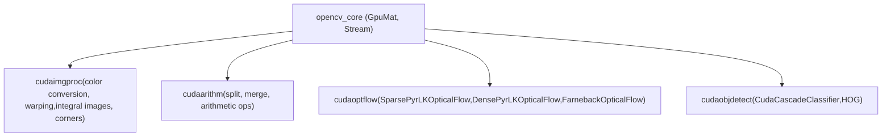

# GPU-Accelerated Image Processing and Optical Flow

Relevant source files

-   [samples/gpu/farneback\_optical\_flow.cpp](https://github.com/opencv/opencv/blob/91c78f50/samples/gpu/farneback_optical_flow.cpp)
-   [samples/gpu/pyrlk\_optical\_flow.cpp](https://github.com/opencv/opencv/blob/91c78f50/samples/gpu/pyrlk_optical_flow.cpp)

## Purpose and Scope

This page covers the CUDA-accelerated image processing and optical flow algorithms available in OpenCV's GPU modules. Specifically, it documents the `cudaimgproc`, `cudaoptflow`, `cudaarithm`, and `cudaobjdetect` modules, focusing on the class interfaces, data flow patterns, and behavioral differences from their CPU counterparts.

For background on `GpuMat`, CUDA stream management, and device memory allocation — the foundational types that all of these algorithms operate on — see [GpuMat and CUDA Runtime Integration](/opencv/opencv/14.1-gpumat-and-cuda-runtime-integration). For the CPU-side optical flow algorithms (`calcOpticalFlowPyrLK`, `calcOpticalFlowFarneback`) that share algorithm designs with these GPU implementations, see [Optical Flow and Object Tracking](/opencv/opencv/16.1-optical-flow-and-object-tracking).

---

## Module Organization

The GPU-accelerated functionality covered here is split across four dedicated CUDA modules, each corresponding to a functional domain:

**CUDA Module Map**


Sources: [samples/gpu/pyrlk\_optical\_flow.cpp1-16](https://github.com/opencv/opencv/blob/91c78f50/samples/gpu/pyrlk_optical_flow.cpp#L1-L16) [samples/gpu/farneback\_optical\_flow.cpp1-16](https://github.com/opencv/opencv/blob/91c78f50/samples/gpu/farneback_optical_flow.cpp#L1-L16)

| Module | Header | Primary Responsibility |
| --- | --- | --- |
| `cudaimgproc` | `opencv2/cudaimgproc.hpp` | Color conversion, warping, integral images, corner detection |
| `cudaarithm` | `opencv2/cudaarithm.hpp` | Arithmetic, logical, and channel-splitting operations |
| `cudaoptflow` | `opencv2/cudaoptflow.hpp` | Sparse and dense optical flow algorithms |
| `cudaobjdetect` | `opencv2/cudaobjdetect.hpp` | Cascade classifier, HOG-based person detection |

---

## Image Processing (`cudaimgproc`)

### Color Conversion

`cuda::cvtColor` mirrors the CPU `cv::cvtColor` signature but operates on `GpuMat` arguments. It accepts the same `ColorConversionCodes` constants (e.g., `COLOR_BGR2GRAY`, `COLOR_BGR2HSV`). The conversion is performed on-device without host round-trips.

Typical usage pattern: upload once, convert on device, feed into downstream GPU algorithms. For example, grayscale conversion before optical flow avoids a separate download-convert-upload cycle.

### Image Warping

`cuda::warpAffine` and `cuda::warpPerspective` accept a `GpuMat` source and destination along with the standard transformation matrices. Interpolation flags (`INTER_LINEAR`, `INTER_NEAREST`, `INTER_CUBIC`) and border modes behave identically to the CPU path. The CUDA kernel tiles the image into blocks and each thread computes the transformed pixel address.

`cuda::remap` applies arbitrary per-pixel map arrays (`map1`, `map2`) stored as `GpuMat`. This is the preferred path when a precomputed undistortion map (from `initUndistortRectifyMap`) is held on-device across many frames.

### Integral Images

`cuda::integral` computes the 2D integral image of a `GpuMat`, producing an output of type `CV_32SC1`. This is a standard prerequisite for the GPU cascade classifier (see below). The parallel prefix-sum implementation on CUDA provides significant throughput gains over the sequential CPU version for large images.

### Corner Detection (`CornersDetector`)

The `cuda::CornersDetector` interface wraps GPU-side Shi-Tomasi (Good Features to Track) and Harris corner detection. The factory function `cuda::createGoodFeaturesToTrackDetector` returns a `Ptr<cuda::CornersDetector>`:

[samples/gpu/pyrlk\_optical\_flow.cpp285-286](https://github.com/opencv/opencv/blob/91c78f50/samples/gpu/pyrlk_optical_flow.cpp#L285-L286)

```
Ptr<cuda::CornersDetector> detector = cuda::createGoodFeaturesToTrackDetector(
    d_frame0Gray.type(), points, 0.01, minDist);
detector->detect(d_frame0Gray, d_prevPts);
```
`detect` outputs keypoint locations as a `GpuMat` of type `CV_32FC2` (columns = number of detected points). This output is directly consumable by `SparsePyrLKOpticalFlow::calc` without any host transfer.

**Corner Detector Class Hierarchy**


Sources: [samples/gpu/pyrlk\_optical\_flow.cpp282-292](https://github.com/opencv/opencv/blob/91c78f50/samples/gpu/pyrlk_optical_flow.cpp#L282-L292)

---

## Optical Flow (`cudaoptflow`)

All three optical flow classes implement the common abstract interface `cuda::SparseOpticalFlow` or `cuda::DenseOpticalFlow`, both derived from `cv::Algorithm`. Each is instantiated via a static `create()` factory method.

**Optical Flow Class Hierarchy**


Sources: [samples/gpu/pyrlk\_optical\_flow.cpp295-326](https://github.com/opencv/opencv/blob/91c78f50/samples/gpu/pyrlk_optical_flow.cpp#L295-L326) [samples/gpu/farneback\_optical\_flow.cpp74-98](https://github.com/opencv/opencv/blob/91c78f50/samples/gpu/farneback_optical_flow.cpp#L74-L98)

---

### Sparse Pyramidal Lucas-Kanade (`SparsePyrLKOpticalFlow`)

`cuda::SparsePyrLKOpticalFlow` tracks a sparse set of points from a previous frame to a current frame. It operates over an image pyramid to handle large displacements.

**Key parameters** (set at creation time via `create`):

| Parameter | Default | Meaning |
| --- | --- | --- |
| `winSize` | `Size(21,21)` | Search window size at each pyramid level |
| `maxLevel` | 3 | Number of pyramid levels |
| `iters` | 30 | Max iterations per level |
| `useInitialFlow` | `false` | Whether `nextPts` is pre-initialized |

**Call signature:**

```
SparsePyrLKOpticalFlow::calc(prevImg, nextImg, prevPts, nextPts, status [, err])
```
-   `prevPts` / `nextPts`: `GpuMat` of type `CV_32FC2`, shape `1 × N`
-   `status`: `GpuMat` of type `CV_8UC1`, `1` if point was successfully tracked
-   Accepts both grayscale and color source images

[samples/gpu/pyrlk\_optical\_flow.cpp298-314](https://github.com/opencv/opencv/blob/91c78f50/samples/gpu/pyrlk_optical_flow.cpp#L298-L314)

After `calc`, results must be downloaded to host vectors before drawing or further CPU processing:

[samples/gpu/pyrlk\_optical\_flow.cpp17-29](https://github.com/opencv/opencv/blob/91c78f50/samples/gpu/pyrlk_optical_flow.cpp#L17-L29)

---

### Dense Pyramidal Lucas-Kanade (`DensePyrLKOpticalFlow`)

`cuda::DensePyrLKOpticalFlow` computes a flow vector for every pixel. It shares the same constructor parameters as the sparse variant. The output is a `GpuMat` of type `CV_32FC2` (two-channel: `(dx, dy)` per pixel).

[samples/gpu/pyrlk\_optical\_flow.cpp319-325](https://github.com/opencv/opencv/blob/91c78f50/samples/gpu/pyrlk_optical_flow.cpp#L319-L325)

To visualize, the two-channel flow matrix is split into X and Y planes using `cuda::split`, then downloaded for color-coding:

[samples/gpu/pyrlk\_optical\_flow.cpp182-194](https://github.com/opencv/opencv/blob/91c78f50/samples/gpu/pyrlk_optical_flow.cpp#L182-L194)

---

### Farneback Dense Optical Flow (`FarnebackOpticalFlow`)

`cuda::FarnebackOpticalFlow` implements the polynomial expansion method. It produces a dense two-channel flow field stored as `CV_32FC2`. The GPU implementation is API-compatible with the CPU `calcOpticalFlowFarneback` and exposes getter methods (`getPyrScale`, `getNumLevels`, `getWinSize`, `getNumIters`, `getPolyN`, `getPolySigma`, `getFlags`) so parameters can be read back and passed to the CPU fallback:

[samples/gpu/farneback\_optical\_flow.cpp74-111](https://github.com/opencv/opencv/blob/91c78f50/samples/gpu/farneback_optical_flow.cpp#L74-L111)

The `calc` method signature:

```
FarnebackOpticalFlow::calc(prevImg, nextImg, flow [, stream])
```
The optional `Stream` argument allows async execution; omitting it causes synchronous execution on the default stream.

**Farneback parameters:**

| Parameter | Default | Meaning |
| --- | --- | --- |
| `numLevels` | 5 | Pyramid depth |
| `pyrScale` | 0.5 | Scale between levels |
| `fastPyramids` | `false` | Use built-in fast pyramid downsampling |
| `winSize` | 13 | Averaging window size |
| `numIters` | 10 | Iterations per level |
| `polyN` | 5 | Neighborhood size for polynomial expansion |
| `polySigma` | 1.1 | Gaussian sigma for polynomial expansion |
| `flags` | 0 | `OPTFLOW_USE_INITIAL_FLOW`, `OPTFLOW_FARNEBACK_GAUSSIAN` |

Sources: [samples/gpu/farneback\_optical\_flow.cpp46-140](https://github.com/opencv/opencv/blob/91c78f50/samples/gpu/farneback_optical_flow.cpp#L46-L140)

---

## Typical Data Flow

The pattern across all GPU optical flow algorithms follows the same sequence:

**GPU Optical Flow Data Flow**

> **[Mermaid sequence]**
> *(图表结构无法解析)*

Sources: [samples/gpu/pyrlk\_optical\_flow.cpp281-326](https://github.com/opencv/opencv/blob/91c78f50/samples/gpu/pyrlk_optical_flow.cpp#L281-L326) [samples/gpu/farneback\_optical\_flow.cpp74-98](https://github.com/opencv/opencv/blob/91c78f50/samples/gpu/farneback_optical_flow.cpp#L74-L98)

---

## GPU Cascade Classifier (`cudaobjdetect`)

`cuda::CudaCascadeClassifier` is the GPU-accelerated counterpart to `cv::CascadeClassifier`. It loads the same Haar or LBP cascade XML files. Detection is typically preceded by `cuda::integral` to compute the integral image on-device.

The detection pipeline on the GPU side:

1.  Upload image → `GpuMat`
2.  Convert to grayscale with `cuda::cvtColor`
3.  Optionally compute integral image with `cuda::integral`
4.  Call `CudaCascadeClassifier::detectMultiScale(image, objects)`
5.  `objects` is a `GpuMat`; call `CudaCascadeClassifier::convert(objects, host_rects)` to produce a `std::vector<Rect>`

The class maintains its own scale pyramid internally. The `setScaleFactor`, `setMinNeighbors`, `setMinObjectSize`, and `setMaxObjectSize` methods control detection parameters, mirroring the CPU `detectMultiScale` arguments.

---

## HOG Descriptor (`cudaobjdetect`)

`cuda::HOG` performs Histogram of Oriented Gradients feature extraction and SVM-based detection on the GPU. It provides the same interface as `cv::HOGDescriptor`:

-   `setSVMDetector(detector)` — loads a precomputed SVM weight vector
-   `detect(img, found_locations [, confidences])` — returns bounding boxes
-   `detectMultiScale(img, found_locations)` — multi-scale detection
-   `getDefaultPeopleDetector()` — static method returning the pre-trained 64×128 people detector weights

The GPU implementation processes sliding windows in parallel, making it significantly faster than the CPU path for large images or many scales.

---

## CPU vs. GPU API Comparison

| Operation | CPU API | GPU API | Notes |
| --- | --- | --- | --- |
| Color conversion | `cv::cvtColor` | `cuda::cvtColor` | Same `ColorConversionCodes` |
| Affine warp | `cv::warpAffine` | `cuda::warpAffine` | Same flags |
| Perspective warp | `cv::warpPerspective` | `cuda::warpPerspective` | Same flags |
| Integral image | `cv::integral` | `cuda::integral` | Output type `CV_32SC1` |
| Good features | `cv::goodFeaturesToTrack` | `cuda::createGoodFeaturesToTrackDetector` | Factory + `detect()` |
| Sparse LK flow | `cv::calcOpticalFlowPyrLK` | `cuda::SparsePyrLKOpticalFlow::create` + `calc` | Factory pattern |
| Dense LK flow | — | `cuda::DensePyrLKOpticalFlow::create` + `calc` | No CPU equivalent |
| Farneback flow | `cv::calcOpticalFlowFarneback` | `cuda::FarnebackOpticalFlow::create` + `calc` | Compatible params |
| Cascade detect | `cv::CascadeClassifier` | `cuda::CudaCascadeClassifier` | Requires `convert` step |
| HOG detect | `cv::HOGDescriptor` | `cuda::HOG` | Same SVM weights |

---

## Stream Support

All `calc` and `detect` methods accept an optional `cuda::Stream` argument as the last parameter. Passing a non-default stream enables asynchronous dispatch, allowing CPU work or unrelated GPU operations to overlap with the optical flow computation. For synchronous behavior, omit the stream argument or pass `cuda::Stream::Null()`.

For stream management details, see [GpuMat and CUDA Runtime Integration](/opencv/opencv/14.1-gpumat-and-cuda-runtime-integration).

Sources: [samples/gpu/pyrlk\_optical\_flow.cpp1-331](https://github.com/opencv/opencv/blob/91c78f50/samples/gpu/pyrlk_optical_flow.cpp#L1-L331) [samples/gpu/farneback\_optical\_flow.cpp1-140](https://github.com/opencv/opencv/blob/91c78f50/samples/gpu/farneback_optical_flow.cpp#L1-L140)
