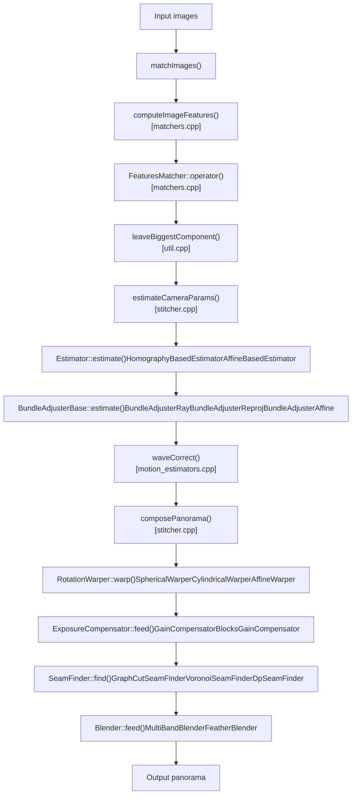
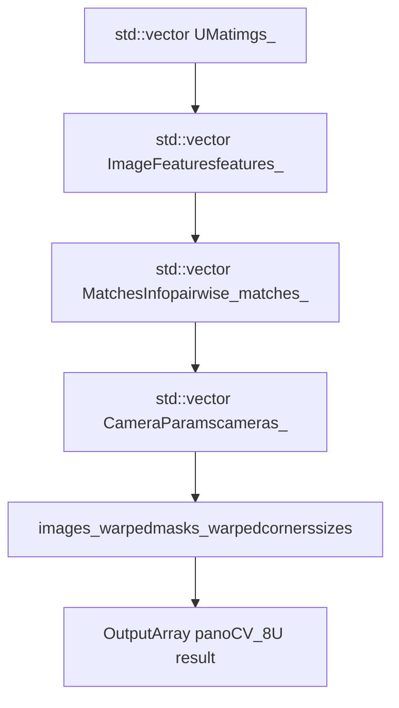

# Image Stitching

Relevant source files

-   [modules/stitching/CMakeLists.txt](https://github.com/opencv/opencv/blob/91c78f50/modules/stitching/CMakeLists.txt)
-   [modules/stitching/include/opencv2/stitching.hpp](https://github.com/opencv/opencv/blob/91c78f50/modules/stitching/include/opencv2/stitching.hpp)
-   [modules/stitching/include/opencv2/stitching/detail/autocalib.hpp](https://github.com/opencv/opencv/blob/91c78f50/modules/stitching/include/opencv2/stitching/detail/autocalib.hpp)
-   [modules/stitching/include/opencv2/stitching/detail/blenders.hpp](https://github.com/opencv/opencv/blob/91c78f50/modules/stitching/include/opencv2/stitching/detail/blenders.hpp)
-   [modules/stitching/include/opencv2/stitching/detail/camera.hpp](https://github.com/opencv/opencv/blob/91c78f50/modules/stitching/include/opencv2/stitching/detail/camera.hpp)
-   [modules/stitching/include/opencv2/stitching/detail/exposure\_compensate.hpp](https://github.com/opencv/opencv/blob/91c78f50/modules/stitching/include/opencv2/stitching/detail/exposure_compensate.hpp)
-   [modules/stitching/include/opencv2/stitching/detail/matchers.hpp](https://github.com/opencv/opencv/blob/91c78f50/modules/stitching/include/opencv2/stitching/detail/matchers.hpp)
-   [modules/stitching/include/opencv2/stitching/detail/motion\_estimators.hpp](https://github.com/opencv/opencv/blob/91c78f50/modules/stitching/include/opencv2/stitching/detail/motion_estimators.hpp)
-   [modules/stitching/include/opencv2/stitching/detail/seam\_finders.hpp](https://github.com/opencv/opencv/blob/91c78f50/modules/stitching/include/opencv2/stitching/detail/seam_finders.hpp)
-   [modules/stitching/include/opencv2/stitching/detail/util.hpp](https://github.com/opencv/opencv/blob/91c78f50/modules/stitching/include/opencv2/stitching/detail/util.hpp)
-   [modules/stitching/include/opencv2/stitching/detail/util\_inl.hpp](https://github.com/opencv/opencv/blob/91c78f50/modules/stitching/include/opencv2/stitching/detail/util_inl.hpp)
-   [modules/stitching/include/opencv2/stitching/detail/warpers.hpp](https://github.com/opencv/opencv/blob/91c78f50/modules/stitching/include/opencv2/stitching/detail/warpers.hpp)
-   [modules/stitching/include/opencv2/stitching/detail/warpers\_inl.hpp](https://github.com/opencv/opencv/blob/91c78f50/modules/stitching/include/opencv2/stitching/detail/warpers_inl.hpp)
-   [modules/stitching/include/opencv2/stitching/warpers.hpp](https://github.com/opencv/opencv/blob/91c78f50/modules/stitching/include/opencv2/stitching/warpers.hpp)
-   [modules/stitching/misc/python/test/test\_stitching.py](https://github.com/opencv/opencv/blob/91c78f50/modules/stitching/misc/python/test/test_stitching.py)
-   [modules/stitching/perf/opencl/perf\_stitch.cpp](https://github.com/opencv/opencv/blob/91c78f50/modules/stitching/perf/opencl/perf_stitch.cpp)
-   [modules/stitching/perf/perf\_estimators.cpp](https://github.com/opencv/opencv/blob/91c78f50/modules/stitching/perf/perf_estimators.cpp)
-   [modules/stitching/perf/perf\_main.cpp](https://github.com/opencv/opencv/blob/91c78f50/modules/stitching/perf/perf_main.cpp)
-   [modules/stitching/perf/perf\_matchers.cpp](https://github.com/opencv/opencv/blob/91c78f50/modules/stitching/perf/perf_matchers.cpp)
-   [modules/stitching/perf/perf\_precomp.hpp](https://github.com/opencv/opencv/blob/91c78f50/modules/stitching/perf/perf_precomp.hpp)
-   [modules/stitching/perf/perf\_stich.cpp](https://github.com/opencv/opencv/blob/91c78f50/modules/stitching/perf/perf_stich.cpp)
-   [modules/stitching/src/blenders.cpp](https://github.com/opencv/opencv/blob/91c78f50/modules/stitching/src/blenders.cpp)
-   [modules/stitching/src/exposure\_compensate.cpp](https://github.com/opencv/opencv/blob/91c78f50/modules/stitching/src/exposure_compensate.cpp)
-   [modules/stitching/src/matchers.cpp](https://github.com/opencv/opencv/blob/91c78f50/modules/stitching/src/matchers.cpp)
-   [modules/stitching/src/motion\_estimators.cpp](https://github.com/opencv/opencv/blob/91c78f50/modules/stitching/src/motion_estimators.cpp)
-   [modules/stitching/src/opencl/warpers.cl](https://github.com/opencv/opencv/blob/91c78f50/modules/stitching/src/opencl/warpers.cl)
-   [modules/stitching/src/precomp.hpp](https://github.com/opencv/opencv/blob/91c78f50/modules/stitching/src/precomp.hpp)
-   [modules/stitching/src/seam\_finders.cpp](https://github.com/opencv/opencv/blob/91c78f50/modules/stitching/src/seam_finders.cpp)
-   [modules/stitching/src/stitcher.cpp](https://github.com/opencv/opencv/blob/91c78f50/modules/stitching/src/stitcher.cpp)
-   [modules/stitching/src/util.cpp](https://github.com/opencv/opencv/blob/91c78f50/modules/stitching/src/util.cpp)
-   [modules/stitching/src/warpers.cpp](https://github.com/opencv/opencv/blob/91c78f50/modules/stitching/src/warpers.cpp)
-   [modules/stitching/test/test\_exposure\_compensate.cpp](https://github.com/opencv/opencv/blob/91c78f50/modules/stitching/test/test_exposure_compensate.cpp)
-   [modules/stitching/test/test\_main.cpp](https://github.com/opencv/opencv/blob/91c78f50/modules/stitching/test/test_main.cpp)
-   [modules/stitching/test/test\_matchers.cpp](https://github.com/opencv/opencv/blob/91c78f50/modules/stitching/test/test_matchers.cpp)
-   [modules/stitching/test/test\_precomp.hpp](https://github.com/opencv/opencv/blob/91c78f50/modules/stitching/test/test_precomp.hpp)
-   [modules/stitching/test/test\_wave\_correction.cpp](https://github.com/opencv/opencv/blob/91c78f50/modules/stitching/test/test_wave_correction.cpp)
-   [samples/cpp/stitching\_detailed.cpp](https://github.com/opencv/opencv/blob/91c78f50/samples/cpp/stitching_detailed.cpp)

This page documents the `opencv_stitching` module, which composites multiple overlapping images into seamless panoramas. It covers the `Stitcher` class, the two supported stitching modes, and the individual stages of the internal pipeline. For background on the feature detectors and descriptor types used at the matching stage, see [Feature Detection and Matching (features2d)](/opencv/opencv/6-feature-detection-and-matching-(features2d)). For camera calibration concepts underlying the rotation estimation stage, see [Camera Calibration and 3D Vision (calib3d)](/opencv/opencv/8-camera-calibration-and-3d-vision-(calib3d)).

---

## Module Layout

The stitching module lives in `modules/stitching/` and declares mandatory dependencies on `opencv_imgproc`, `opencv_features2d`, `opencv_calib3d`, and `opencv_flann`. CUDA acceleration for matching and warping is conditionally compiled when `opencv_cudafeatures2d`, `opencv_cudawarping`, `opencv_cudaarithm`, and related modules are available.

[modules/stitching/CMakeLists.txt1-13](https://github.com/opencv/opencv/blob/91c78f50/modules/stitching/CMakeLists.txt#L1-L13)

The public API is exposed through a single top-level header:

-   `modules/stitching/include/opencv2/stitching.hpp` — includes the `Stitcher` class and transitively pulls in all `detail/` headers.

The `detail` namespace headers expose every building block individually so they can be combined without going through `Stitcher`.

---

## The `Stitcher` Class

`Stitcher` is the primary entry point. It owns references to all pipeline components and exposes `stitch()` as a convenience method that runs the complete pipeline in one call.

**File:** [modules/stitching/src/stitcher.cpp](https://github.com/opencv/opencv/blob/91c78f50/modules/stitching/src/stitcher.cpp)
**Header:** [modules/stitching/include/opencv2/stitching.hpp96-300](https://github.com/opencv/opencv/blob/91c78f50/modules/stitching/include/opencv2/stitching.hpp#L96-L300)

### Modes

`Stitcher::create(Mode mode)` returns a fully pre-configured instance. Two modes are supported:

| Mode | Transformation | Matcher | Estimator | Bundle Adjuster | Warper |
| --- | --- | --- | --- | --- | --- |
| `PANORAMA` | Homography (rotation-only camera) | `BestOf2NearestMatcher` | `HomographyBasedEstimator` | `BundleAdjusterRay` | `SphericalWarper` |
| `SCANS` | Affine (translation + rotation) | `AffineBestOf2NearestMatcher` | `AffineBasedEstimator` | `BundleAdjusterAffinePartial` | `AffineWarper` |

[modules/stitching/src/stitcher.cpp53-99](https://github.com/opencv/opencv/blob/91c78f50/modules/stitching/src/stitcher.cpp#L53-L99)

### Key Methods

| Method | Purpose |
| --- | --- |
| `stitch(images, pano)` | Runs full pipeline (match + compose) |
| `estimateTransform(images, masks)` | Feature detection and camera parameter estimation only |
| `composePanorama(pano)` | Warping, compensation, seam finding, and blending only |
| `setTransform(images, cameras, component)` | Injects pre-computed camera parameters, skipping estimation |

`stitch()` delegates to `estimateTransform()` then `composePanorama()`.

[modules/stitching/src/stitcher.cpp379-393](https://github.com/opencv/opencv/blob/91c78f50/modules/stitching/src/stitcher.cpp#L379-L393)

### Resolution Scales

The pipeline operates at three distinct resolutions to control speed vs. quality:

| Parameter | Default | Method |
| --- | --- | --- |
| Registration resolution | 0.6 Mpx | `setRegistrationResol()` |
| Seam estimation resolution | 0.1 Mpx | `setSeamEstimationResol()` |
| Compositing resolution | original | `setCompositingResol()` |

Images are downscaled to registration resolution during feature detection. The final composite is produced at compositing resolution. Seam masks are computed at seam estimation resolution.

[modules/stitching/src/stitcher.cpp57-69](https://github.com/opencv/opencv/blob/91c78f50/modules/stitching/src/stitcher.cpp#L57-L69)

---

## Pipeline Stages

**Figure: Stitching pipeline — class names mapped to pipeline stages**


Sources: [modules/stitching/src/stitcher.cpp](https://github.com/opencv/opencv/blob/91c78f50/modules/stitching/src/stitcher.cpp) [modules/stitching/src/matchers.cpp](https://github.com/opencv/opencv/blob/91c78f50/modules/stitching/src/matchers.cpp) [modules/stitching/src/motion\_estimators.cpp](https://github.com/opencv/opencv/blob/91c78f50/modules/stitching/src/motion_estimators.cpp) [modules/stitching/src/blenders.cpp](https://github.com/opencv/opencv/blob/91c78f50/modules/stitching/src/blenders.cpp) [modules/stitching/src/seam\_finders.cpp](https://github.com/opencv/opencv/blob/91c78f50/modules/stitching/src/seam_finders.cpp) [modules/stitching/src/exposure\_compensate.cpp](https://github.com/opencv/opencv/blob/91c78f50/modules/stitching/src/exposure_compensate.cpp)

---

### Stage 1 — Feature Detection

**Internal method:** `Stitcher::matchImages()` calls `detail::computeImageFeatures()`.

`computeImageFeatures()` accepts any `Feature2D` subclass (ORB by default in `Stitcher::create`; SIFT, AKAZE, and SURF are also common). It stores results in `ImageFeatures` structs.

```
struct ImageFeatures {
    int img_idx;
    Size img_size;
    std::vector<KeyPoint> keypoints;
    UMat descriptors;
};
```
[modules/stitching/include/opencv2/stitching/detail/matchers.hpp57-65](https://github.com/opencv/opencv/blob/91c78f50/modules/stitching/include/opencv2/stitching/detail/matchers.hpp#L57-L65)
[modules/stitching/src/matchers.cpp282-315](https://github.com/opencv/opencv/blob/91c78f50/modules/stitching/src/matchers.cpp#L282-L315)

---

### Stage 2 — Pairwise Feature Matching

**Classes:**

| Class | Description |
| --- | --- |
| `FeaturesMatcher` | Abstract base; `operator()` dispatches to `match()` |
| `BestOf2NearestMatcher` | Cross-checks kNN matches (ratio test), then estimates homography via RANSAC |
| `BestOf2NearestRangeMatcher` | Like `BestOf2NearestMatcher` but only matches images within a sliding window of index distance `range_width` |
| `AffineBestOf2NearestMatcher` | Estimates affine transform instead of homography; used for SCANS mode |

Results are stored in `MatchesInfo`:

```
struct MatchesInfo {
    int src_img_idx, dst_img_idx;
    std::vector<DMatch> matches;
    std::vector<uchar> inliers_mask;
    int num_inliers;
    Mat H;          // Estimated homography or affine transform
    double confidence;
};
```
[modules/stitching/include/opencv2/stitching/detail/matchers.hpp99-114](https://github.com/opencv/opencv/blob/91c78f50/modules/stitching/include/opencv2/stitching/detail/matchers.hpp#L99-L114)

Matching runs in parallel using `parallel_for_` when `is_thread_safe_` is true (the `CpuMatcher` path sets this flag). GPU matching uses `cuda::DescriptorMatcher` when CUDA is available.

[modules/stitching/src/matchers.cpp338-363](https://github.com/opencv/opencv/blob/91c78f50/modules/stitching/src/matchers.cpp#L338-L363)
[modules/stitching/src/matchers.cpp368-480](https://github.com/opencv/opencv/blob/91c78f50/modules/stitching/src/matchers.cpp#L368-L480)

**Confidence formula** (from Brown & Lowe 2007):

```
confidence = num_inliers / (8 + 0.3 * num_matches)
```
Pairs with confidence above `matches_confindece_thresh` (default 3.0) are excluded (too close, not informative).

[modules/stitching/src/matchers.cpp437-443](https://github.com/opencv/opencv/blob/91c78f50/modules/stitching/src/matchers.cpp#L437-L443)

After matching, `leaveBiggestComponent()` removes images that do not share sufficient confidence with the main connected component, based on `pano_confid_thresh_` (default 1.0).

[modules/stitching/src/stitcher.cpp474-486](https://github.com/opencv/opencv/blob/91c78f50/modules/stitching/src/stitcher.cpp#L474-L486)

---

### Stage 3 — Rotation / Camera Parameter Estimation

**File:** [modules/stitching/src/motion\_estimators.cpp](https://github.com/opencv/opencv/blob/91c78f50/modules/stitching/src/motion_estimators.cpp)
**Header:** [modules/stitching/include/opencv2/stitching/detail/motion\_estimators.hpp](https://github.com/opencv/opencv/blob/91c78f50/modules/stitching/include/opencv2/stitching/detail/motion_estimators.hpp)

**Figure: Estimator class hierarchy**


Sources: [modules/stitching/include/opencv2/stitching/detail/motion\_estimators.hpp](https://github.com/opencv/opencv/blob/91c78f50/modules/stitching/include/opencv2/stitching/detail/motion_estimators.hpp) [modules/stitching/src/motion\_estimators.cpp](https://github.com/opencv/opencv/blob/91c78f50/modules/stitching/src/motion_estimators.cpp)

`HomographyBasedEstimator::estimate()` runs in two steps:

1.  Estimates per-image focal lengths with `estimateFocal()`.
2.  Builds a maximum spanning tree over the pairwise matches graph and walks it with `CalcRotation` to chain homographies into global rotation matrices.

[modules/stitching/src/motion\_estimators.cpp128-193](https://github.com/opencv/opencv/blob/91c78f50/modules/stitching/src/motion_estimators.cpp#L128-L193)

`AffineBasedEstimator` does the same spanning tree walk but chains affine transforms with `CalcAffineTransform`.

[modules/stitching/src/motion\_estimators.cpp199-219](https://github.com/opencv/opencv/blob/91c78f50/modules/stitching/src/motion_estimators.cpp#L199-L219)

#### Bundle Adjustment

`BundleAdjusterBase::estimate()` refines all camera parameters jointly using `CvLevMarq` (Levenberg-Marquardt). It computes the Jacobian numerically by perturbing each parameter by a small step and measuring the change in reprojection error.

-   `BundleAdjusterRay`: 4 parameters per camera (focal length + 3-component rotation vector). Error is the angular difference between rays.
-   `BundleAdjusterReproj`: 7 parameters per camera (focal, ppx, ppy, aspect, rvec). Error is 2D reprojection distance.
-   `BundleAdjusterAffine` / `BundleAdjusterAffinePartial`: 6 or 4 parameters per camera for affine models.

[modules/stitching/src/motion\_estimators.cpp224-329](https://github.com/opencv/opencv/blob/91c78f50/modules/stitching/src/motion_estimators.cpp#L224-L329)

#### Wave Correction

After bundle adjustment, `waveCorrect()` adjusts the set of rotation matrices so that the panorama horizon is level. Two modes are available: `WAVE_CORRECT_HORIZ` and `WAVE_CORRECT_VERT`.

[modules/stitching/src/stitcher.cpp530-538](https://github.com/opencv/opencv/blob/91c78f50/modules/stitching/src/stitcher.cpp#L530-L538)

---

### Stage 4 — Image Warping

**Files:** [modules/stitching/include/opencv2/stitching/detail/warpers.hpp](https://github.com/opencv/opencv/blob/91c78f50/modules/stitching/include/opencv2/stitching/detail/warpers.hpp) [modules/stitching/src/warpers.cpp](https://github.com/opencv/opencv/blob/91c78f50/modules/stitching/src/warpers.cpp)

**Figure: Warper class hierarchy**


Sources: [modules/stitching/include/opencv2/stitching/detail/warpers.hpp](https://github.com/opencv/opencv/blob/91c78f50/modules/stitching/include/opencv2/stitching/detail/warpers.hpp)

Each warper type implements `mapForward()` and `mapBackward()` in a `ProjectorBase`\-derived struct (e.g. `SphericalProjector`, `CylindricalProjector`). `RotationWarperBase<P>` implements `buildMaps()` generically by iterating destination pixels and applying `mapBackward()`.

[modules/stitching/include/opencv2/stitching/detail/warpers\_inl.hpp74-110](https://github.com/opencv/opencv/blob/91c78f50/modules/stitching/include/opencv2/stitching/detail/warpers_inl.hpp#L74-L110)

Available projection types:

| Warper | Best for |
| --- | --- |
| `SphericalWarper` | Full 360° panoramas |
| `CylindricalWarper` | Wide panoramas, less distortion near poles |
| `PlaneWarper` | Near-planar scenes |
| `AffineWarper` | Document/scan stitching |
| `FisheyeWarper`, `StereographicWarper` | Wide angle optics |
| `PaniniWarper` | Very wide panoramas with reduced wide-angle distortion |
| `MercatorWarper`, `TransverseMercatorWarper` | Cartographic-style output |

GPU-accelerated variants (`PlaneWarperGpu`, `CylindricalWarperGpu`, `SphericalWarperGpu`) are available when `opencv_cudawarping` is present.

The warper scale parameter is set to the median focal length of all cameras, computed after bundle adjustment.

[modules/stitching/src/stitcher.cpp517-528](https://github.com/opencv/opencv/blob/91c78f50/modules/stitching/src/stitcher.cpp#L517-L528)

OpenCL-accelerated warping is implemented in `modules/stitching/src/opencl/warpers.cl`.

---

### Stage 5 — Exposure Compensation

**File:** [modules/stitching/src/exposure\_compensate.cpp](https://github.com/opencv/opencv/blob/91c78f50/modules/stitching/src/exposure_compensate.cpp)
**Header:** [modules/stitching/include/opencv2/stitching/detail/exposure\_compensate.hpp](https://github.com/opencv/opencv/blob/91c78f50/modules/stitching/include/opencv2/stitching/detail/exposure_compensate.hpp)

Compensators equalize brightness differences between overlapping image regions.

| Class | Strategy |
| --- | --- |
| `NoExposureCompensator` | Passthrough, no adjustment |
| `GainCompensator` | Global per-image gain scalar, solved via least squares over overlap regions |
| `ChannelsCompensator` | Independent per-channel gains |
| `BlocksGainCompensator` | Spatially varying gains over a grid of blocks |
| `BlocksChannelsCompensator` | Spatially varying per-channel gains over a grid |

`ExposureCompensator::createDefault(int type)` constructs the appropriate subclass given a constant (`NO`, `GAIN`, `GAIN_BLOCKS`, `CHANNELS`, `CHANNELS_BLOCKS`).

[modules/stitching/src/exposure\_compensate.cpp52-70](https://github.com/opencv/opencv/blob/91c78f50/modules/stitching/src/exposure_compensate.cpp#L52-L70)

`GainCompensator` builds a linear system by comparing mean intensities in overlap areas, then solves it with SVD (or Eigen if available). Multiple feed iterations (`nr_feeds_`) can be used to converge a better solution.

[modules/stitching/src/exposure\_compensate.cpp83-113](https://github.com/opencv/opencv/blob/91c78f50/modules/stitching/src/exposure_compensate.cpp#L83-L113)

In `Stitcher`, exposure compensation is applied twice: once during seam estimation on downscaled images, and again per-image during final compositing.

[modules/stitching/src/stitcher.cpp203-207](https://github.com/opencv/opencv/blob/91c78f50/modules/stitching/src/stitcher.cpp#L203-L207) [modules/stitching/src/stitcher.cpp321-323](https://github.com/opencv/opencv/blob/91c78f50/modules/stitching/src/stitcher.cpp#L321-L323)

---

### Stage 6 — Seam Finding

**File:** [modules/stitching/src/seam\_finders.cpp](https://github.com/opencv/opencv/blob/91c78f50/modules/stitching/src/seam_finders.cpp)
**Header:** [modules/stitching/include/opencv2/stitching/detail/seam\_finders.hpp](https://github.com/opencv/opencv/blob/91c78f50/modules/stitching/include/opencv2/stitching/detail/seam_finders.hpp)

Seam finders determine which image "wins" each pixel in the overlap zone, updating the image masks to eliminate visible seams.

| Class | Algorithm |
| --- | --- |
| `NoSeamFinder` | No operation; raw overlap |
| `VoronoiSeamFinder` | Distance transform; assigns each pixel to the nearest image boundary |
| `DpSeamFinder` | Dynamic programming over overlap region components |
| `GraphCutSeamFinder` | Minimum-cost graph cut (optimal; default in `Stitcher::create`) |
| `GraphCutSeamFinderGpu` | GPU-accelerated graph cut via `opencv_cudalegacy` |

`GraphCutSeamFinder` uses the `imgproc` graph cut implementation (`gcgraph.hpp`). It minimizes a cost function over the overlap region that considers color difference and optionally color gradient.

[modules/stitching/src/seam\_finders.cpp44-58](https://github.com/opencv/opencv/blob/91c78f50/modules/stitching/src/seam_finders.cpp#L44-L58)

Seam finding runs at `seam_est_resol` (default 0.1 Mpx) for speed. The resulting masks are upscaled and dilated before compositing.

[modules/stitching/src/stitcher.cpp209-214](https://github.com/opencv/opencv/blob/91c78f50/modules/stitching/src/stitcher.cpp#L209-L214) [modules/stitching/src/stitcher.cpp333-337](https://github.com/opencv/opencv/blob/91c78f50/modules/stitching/src/stitcher.cpp#L333-L337)

---

### Stage 7 — Blending

**File:** [modules/stitching/src/blenders.cpp](https://github.com/opencv/opencv/blob/91c78f50/modules/stitching/src/blenders.cpp)
**Header:** [modules/stitching/include/opencv2/stitching/detail/blenders.hpp](https://github.com/opencv/opencv/blob/91c78f50/modules/stitching/include/opencv2/stitching/detail/blenders.hpp)

| Class | Algorithm |
| --- | --- |
| `Blender` | No blending; last image wins per pixel |
| `FeatherBlender` | Linear alpha falloff from image center; weighted average in overlaps |
| `MultiBandBlender` | Laplacian pyramid blending across configurable `num_bands_` frequency bands |

`MultiBandBlender` is the default in `Stitcher::create`. It decomposes each source image into a Laplacian pyramid, blends each frequency band separately using a Gaussian weight pyramid, then reconstructs the final image. This produces seamless blending that is robust to parallax misalignment.

[modules/stitching/src/blenders.cpp216-300](https://github.com/opencv/opencv/blob/91c78f50/modules/stitching/src/blenders.cpp#L216-L300)

`MultiBandBlender::feed()` constructs the Laplacian pyramid per image and accumulates it into `dst_pyr_laplace_`. `blend()` normalizes and collapses the pyramid.

[modules/stitching/src/blenders.cpp328-560](https://github.com/opencv/opencv/blob/91c78f50/modules/stitching/src/blenders.cpp#L328-L560)

An OpenCL kernel accelerates the `feed` accumulation step:

[modules/stitching/src/blenders.cpp303-326](https://github.com/opencv/opencv/blob/91c78f50/modules/stitching/src/blenders.cpp#L303-L326)

GPU paths via CUDA arithmetic and warping modules are also present for both pyramid construction and blending.

---

## Data Flow Summary

**Figure: Data structures flowing between pipeline stages**


Sources: [modules/stitching/src/stitcher.cpp](https://github.com/opencv/opencv/blob/91c78f50/modules/stitching/src/stitcher.cpp) [modules/stitching/include/opencv2/stitching/detail/camera.hpp](https://github.com/opencv/opencv/blob/91c78f50/modules/stitching/include/opencv2/stitching/detail/camera.hpp) [modules/stitching/include/opencv2/stitching/detail/matchers.hpp](https://github.com/opencv/opencv/blob/91c78f50/modules/stitching/include/opencv2/stitching/detail/matchers.hpp)

`CameraParams` stores intrinsics and extrinsics for each image:

```
struct CameraParams {
    double focal;   // Focal length in pixels
    double aspect;  // Pixel aspect ratio
    double ppx, ppy; // Principal point
    Mat R;          // 3x3 rotation matrix
    Mat t;          // 3x1 translation vector
    Mat K();        // Returns 3x3 intrinsic matrix
};
```
[modules/stitching/include/opencv2/stitching/detail/camera.hpp](https://github.com/opencv/opencv/blob/91c78f50/modules/stitching/include/opencv2/stitching/detail/camera.hpp)

---

## Customizing the Pipeline

Every component of `Stitcher` is replaceable via setter methods:

| Setter | Component type |
| --- | --- |
| `setFeaturesFinder(Ptr<Feature2D>)` | Feature detector |
| `setFeaturesMatcher(Ptr<FeaturesMatcher>)` | Pairwise matcher |
| `setEstimator(Ptr<Estimator>)` | Initial camera estimator |
| `setBundleAdjuster(Ptr<detail::BundleAdjusterBase>)` | Bundle adjuster |
| `setWarper(Ptr<WarperCreator>)` | Warper factory |
| `setExposureCompensator(Ptr<ExposureCompensator>)` | Exposure compensator |
| `setSeamFinder(Ptr<SeamFinder>)` | Seam finder |
| `setBlender(Ptr<Blender>)` | Blender |

For low-level access, all components in `cv::detail` can be used directly without `Stitcher`. See `samples/cpp/stitching_detailed.cpp` for a full example that constructs each stage manually.

[samples/cpp/stitching\_detailed.cpp](https://github.com/opencv/opencv/blob/91c78f50/samples/cpp/stitching_detailed.cpp)

---

## Python Bindings

The `Stitcher` class and core `detail` types including `ImageFeatures`, `MatchesInfo`, `BestOf2NearestMatcher`, and `PyRotationWarper` are wrapped for Python. The module is declared with `WRAP python` in CMakeLists.txt.

[modules/stitching/CMakeLists.txt11-13](https://github.com/opencv/opencv/blob/91c78f50/modules/stitching/CMakeLists.txt#L11-L13)
[modules/stitching/misc/python/test/test\_stitching.py](https://github.com/opencv/opencv/blob/91c78f50/modules/stitching/misc/python/test/test_stitching.py)

Basic usage pattern in Python:

```
stitcher = cv2.Stitcher.create(cv2.Stitcher_PANORAMA)status, pano = stitcher.stitch(images)
```
---

## Related Pages

-   [15.1 — Panorama Stitching Pipeline](/opencv/opencv/15.1-panorama-stitching-pipeline): Detailed documentation of each sub-step within the `Stitcher` pipeline.
-   [6 — Feature Detection and Matching (features2d)](/opencv/opencv/6-feature-detection-and-matching-(features2d)): The `Feature2D` and `DescriptorMatcher` interfaces used during feature detection and matching.
-   [8 — Camera Calibration and 3D Vision (calib3d)](/opencv/opencv/8-camera-calibration-and-3d-vision-(calib3d)): Camera models and homography estimation referenced by the motion estimation stage.
-   [14 — CUDA and GPU Acceleration](/opencv/opencv/14-cuda-and-gpu-acceleration): GpuMat and CUDA stream management used by the GPU warper, matcher, and blender paths.
