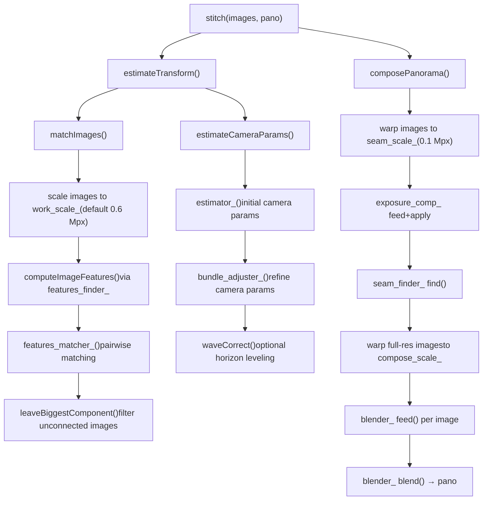
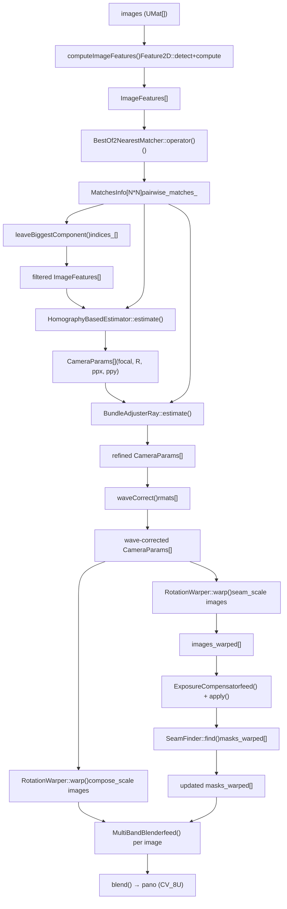

# Panorama Stitching Pipeline

Relevant source files

-   [modules/stitching/CMakeLists.txt](https://github.com/opencv/opencv/blob/91c78f50/modules/stitching/CMakeLists.txt)
-   [modules/stitching/include/opencv2/stitching.hpp](https://github.com/opencv/opencv/blob/91c78f50/modules/stitching/include/opencv2/stitching.hpp)
-   [modules/stitching/include/opencv2/stitching/detail/autocalib.hpp](https://github.com/opencv/opencv/blob/91c78f50/modules/stitching/include/opencv2/stitching/detail/autocalib.hpp)
-   [modules/stitching/include/opencv2/stitching/detail/blenders.hpp](https://github.com/opencv/opencv/blob/91c78f50/modules/stitching/include/opencv2/stitching/detail/blenders.hpp)
-   [modules/stitching/include/opencv2/stitching/detail/camera.hpp](https://github.com/opencv/opencv/blob/91c78f50/modules/stitching/include/opencv2/stitching/detail/camera.hpp)
-   [modules/stitching/include/opencv2/stitching/detail/exposure\_compensate.hpp](https://github.com/opencv/opencv/blob/91c78f50/modules/stitching/include/opencv2/stitching/detail/exposure_compensate.hpp)
-   [modules/stitching/include/opencv2/stitching/detail/matchers.hpp](https://github.com/opencv/opencv/blob/91c78f50/modules/stitching/include/opencv2/stitching/detail/matchers.hpp)
-   [modules/stitching/include/opencv2/stitching/detail/motion\_estimators.hpp](https://github.com/opencv/opencv/blob/91c78f50/modules/stitching/include/opencv2/stitching/detail/motion_estimators.hpp)
-   [modules/stitching/include/opencv2/stitching/detail/seam\_finders.hpp](https://github.com/opencv/opencv/blob/91c78f50/modules/stitching/include/opencv2/stitching/detail/seam_finders.hpp)
-   [modules/stitching/include/opencv2/stitching/detail/util.hpp](https://github.com/opencv/opencv/blob/91c78f50/modules/stitching/include/opencv2/stitching/detail/util.hpp)
-   [modules/stitching/include/opencv2/stitching/detail/util\_inl.hpp](https://github.com/opencv/opencv/blob/91c78f50/modules/stitching/include/opencv2/stitching/detail/util_inl.hpp)
-   [modules/stitching/include/opencv2/stitching/detail/warpers.hpp](https://github.com/opencv/opencv/blob/91c78f50/modules/stitching/include/opencv2/stitching/detail/warpers.hpp)
-   [modules/stitching/include/opencv2/stitching/detail/warpers\_inl.hpp](https://github.com/opencv/opencv/blob/91c78f50/modules/stitching/include/opencv2/stitching/detail/warpers_inl.hpp)
-   [modules/stitching/include/opencv2/stitching/warpers.hpp](https://github.com/opencv/opencv/blob/91c78f50/modules/stitching/include/opencv2/stitching/warpers.hpp)
-   [modules/stitching/misc/python/test/test\_stitching.py](https://github.com/opencv/opencv/blob/91c78f50/modules/stitching/misc/python/test/test_stitching.py)
-   [modules/stitching/perf/opencl/perf\_stitch.cpp](https://github.com/opencv/opencv/blob/91c78f50/modules/stitching/perf/opencl/perf_stitch.cpp)
-   [modules/stitching/perf/perf\_estimators.cpp](https://github.com/opencv/opencv/blob/91c78f50/modules/stitching/perf/perf_estimators.cpp)
-   [modules/stitching/perf/perf\_main.cpp](https://github.com/opencv/opencv/blob/91c78f50/modules/stitching/perf/perf_main.cpp)
-   [modules/stitching/perf/perf\_matchers.cpp](https://github.com/opencv/opencv/blob/91c78f50/modules/stitching/perf/perf_matchers.cpp)
-   [modules/stitching/perf/perf\_precomp.hpp](https://github.com/opencv/opencv/blob/91c78f50/modules/stitching/perf/perf_precomp.hpp)
-   [modules/stitching/perf/perf\_stich.cpp](https://github.com/opencv/opencv/blob/91c78f50/modules/stitching/perf/perf_stich.cpp)
-   [modules/stitching/src/blenders.cpp](https://github.com/opencv/opencv/blob/91c78f50/modules/stitching/src/blenders.cpp)
-   [modules/stitching/src/exposure\_compensate.cpp](https://github.com/opencv/opencv/blob/91c78f50/modules/stitching/src/exposure_compensate.cpp)
-   [modules/stitching/src/matchers.cpp](https://github.com/opencv/opencv/blob/91c78f50/modules/stitching/src/matchers.cpp)
-   [modules/stitching/src/motion\_estimators.cpp](https://github.com/opencv/opencv/blob/91c78f50/modules/stitching/src/motion_estimators.cpp)
-   [modules/stitching/src/opencl/warpers.cl](https://github.com/opencv/opencv/blob/91c78f50/modules/stitching/src/opencl/warpers.cl)
-   [modules/stitching/src/precomp.hpp](https://github.com/opencv/opencv/blob/91c78f50/modules/stitching/src/precomp.hpp)
-   [modules/stitching/src/seam\_finders.cpp](https://github.com/opencv/opencv/blob/91c78f50/modules/stitching/src/seam_finders.cpp)
-   [modules/stitching/src/stitcher.cpp](https://github.com/opencv/opencv/blob/91c78f50/modules/stitching/src/stitcher.cpp)
-   [modules/stitching/src/util.cpp](https://github.com/opencv/opencv/blob/91c78f50/modules/stitching/src/util.cpp)
-   [modules/stitching/src/warpers.cpp](https://github.com/opencv/opencv/blob/91c78f50/modules/stitching/src/warpers.cpp)
-   [modules/stitching/test/test\_exposure\_compensate.cpp](https://github.com/opencv/opencv/blob/91c78f50/modules/stitching/test/test_exposure_compensate.cpp)
-   [modules/stitching/test/test\_main.cpp](https://github.com/opencv/opencv/blob/91c78f50/modules/stitching/test/test_main.cpp)
-   [modules/stitching/test/test\_matchers.cpp](https://github.com/opencv/opencv/blob/91c78f50/modules/stitching/test/test_matchers.cpp)
-   [modules/stitching/test/test\_precomp.hpp](https://github.com/opencv/opencv/blob/91c78f50/modules/stitching/test/test_precomp.hpp)
-   [modules/stitching/test/test\_wave\_correction.cpp](https://github.com/opencv/opencv/blob/91c78f50/modules/stitching/test/test_wave_correction.cpp)
-   [samples/cpp/stitching\_detailed.cpp](https://github.com/opencv/opencv/blob/91c78f50/samples/cpp/stitching_detailed.cpp)

## Purpose and Scope

This page documents the internal mechanics of `opencv_stitching`, the module responsible for compositing multiple images into seamless panoramas. It covers the `Stitcher` class and every subordinate component: feature matching, motion estimation, bundle adjustment, image warping, exposure compensation, seam finding, and multi-band blending.

For context on how feature detectors and descriptor matchers work in general, see [Feature Detection and Matching (features2d)](/opencv/opencv/6-feature-detection-and-matching-(features2d)). For geometric transform primitives (homography, affine), see [Camera Calibration and 3D Vision (calib3d)](/opencv/opencv/8-camera-calibration-and-3d-vision-(calib3d)).

---

## Module Layout

The stitching module lives under `modules/stitching/`. Its mandatory dependencies are `opencv_imgproc`, `opencv_features2d`, `opencv_calib3d`, and `opencv_flann`. Optional GPU acceleration requires `opencv_cudaarithm`, `opencv_cudawarping`, `opencv_cudafeatures2d`, `opencv_cudalegacy`, and `opencv_cudaimgproc`.

[modules/stitching/CMakeLists.txt1-18](https://github.com/opencv/opencv/blob/91c78f50/modules/stitching/CMakeLists.txt#L1-L18)

The public API is declared in `modules/stitching/include/opencv2/stitching.hpp`. All pipeline building blocks live in `cv::detail` and are declared in the `detail/` sub-directory of the include tree.

---

## High-Level Pipeline

The `Stitcher` class is the single entry point for end-to-end stitching. It owns references to every pluggable component and invokes them in a fixed order. The `stitch()` method is a thin wrapper that calls `estimateTransform()` followed by `composePanorama()`.

**Pipeline phases:**


Sources: [modules/stitching/src/stitcher.cpp102-393](https://github.com/opencv/opencv/blob/91c78f50/modules/stitching/src/stitcher.cpp#L102-L393) [modules/stitching/include/opencv2/stitching.hpp62-96](https://github.com/opencv/opencv/blob/91c78f50/modules/stitching/include/opencv2/stitching.hpp#L62-L96)

---

## The `Stitcher` Class

`Stitcher` is created via the static factory `Stitcher::create(Mode mode)`. Two modes are predefined:

| Mode | Matcher | Estimator | Bundle Adjuster | Warper | Exposure Comp | Wave Correct |
| --- | --- | --- | --- | --- | --- | --- |
| `PANORAMA` | `BestOf2NearestMatcher` | `HomographyBasedEstimator` | `BundleAdjusterRay` | `SphericalWarper` | `BlocksGainCompensator` | `WAVE_CORRECT_HORIZ` |
| `SCANS` | `AffineBestOf2NearestMatcher` | `AffineBasedEstimator` | `BundleAdjusterAffinePartial` | `AffineWarper` | `NoExposureCompensator` | disabled |

Both modes use `GraphCutSeamFinder` and `MultiBandBlender` as defaults.

[modules/stitching/src/stitcher.cpp53-99](https://github.com/opencv/opencv/blob/91c78f50/modules/stitching/src/stitcher.cpp#L53-L99)

### Resolution Scales

The pipeline operates at three distinct resolutions, controlled by separate parameters:

| Parameter | Setter | Default | Purpose |
| --- | --- | --- | --- |
| `registr_resol_` | `setRegistrationResol()` | 0.6 Mpx | Feature detection and matching |
| `seam_est_resol_` | `setSeamEstimationResol()` | 0.1 Mpx | Seam estimation pass |
| `compose_resol_` | `setCompositingResol()` | `ORIG_RESOL` (-1) | Final composition (original) |

The work scale is derived as `work_scale = min(1.0, sqrt(registr_resol * 1e6 / image_area))`. Each image is independently resized before feature detection.

[modules/stitching/src/stitcher.cpp404-454](https://github.com/opencv/opencv/blob/91c78f50/modules/stitching/src/stitcher.cpp#L404-L454)

### Pluggable Components

Every stage can be replaced by calling the corresponding setter before `stitch()`:

```
setFeaturesFinder()      → Ptr<Feature2D>
setFeaturesMatcher()     → Ptr<detail::FeaturesMatcher>
setEstimator()           → Ptr<detail::Estimator>
setBundleAdjuster()      → Ptr<detail::BundleAdjusterBase>
setWarper()              → Ptr<WarperCreator>
setExposureCompensator() → Ptr<detail::ExposureCompensator>
setSeamFinder()          → Ptr<detail::SeamFinder>
setBlender()             → Ptr<detail::Blender>
```
---

## Stage 1: Feature Detection

`Stitcher::matchImages()` calls `detail::computeImageFeatures()`, which wraps any `Feature2D` implementation. Features are detected on the scaled-down `feature_find_imgs` copies.

`ImageFeatures` is the data container that travels through the pipeline:

```
struct ImageFeatures {
    int img_idx;
    Size img_size;
    vector<KeyPoint> keypoints;
    UMat descriptors;
};
```
[modules/stitching/include/opencv2/stitching/detail/matchers.hpp58-65](https://github.com/opencv/opencv/blob/91c78f50/modules/stitching/include/opencv2/stitching/detail/matchers.hpp#L58-L65) [modules/stitching/src/matchers.cpp282-315](https://github.com/opencv/opencv/blob/91c78f50/modules/stitching/src/matchers.cpp#L282-L315)

The default feature finder in both modes is `ORB::create()`. SURF (from `opencv_xfeatures2d`) and AKAZE are common alternatives used in the detailed sample.

[modules/stitching/src/stitcher.cpp63](https://github.com/opencv/opencv/blob/91c78f50/modules/stitching/src/stitcher.cpp#L63-L63) [samples/cpp/stitching\_detailed.cpp421-443](https://github.com/opencv/opencv/blob/91c78f50/samples/cpp/stitching_detailed.cpp#L421-L443)

---

## Stage 2: Feature Matching

### Class Hierarchy


Sources: [modules/stitching/include/opencv2/stitching/detail/matchers.hpp117-270](https://github.com/opencv/opencv/blob/91c78f50/modules/stitching/include/opencv2/stitching/detail/matchers.hpp#L117-L270)

### `BestOf2NearestMatcher` Logic

For each image pair, the matcher performs:

1.  **Bidirectional kNN matching** — finds the two nearest descriptors in each direction (1→2 and 2→1) using `FlannBasedMatcher` (KDTree for float, LSH for binary descriptors). GPU path uses `cuda::DescriptorMatcher`.
2.  **Ratio test** — a match is kept if `distance[0] < (1 - match_conf) * distance[1]`.
3.  **Homography estimation via RANSAC** — `findHomography()` is called on all matched points shifted to image center. Requires at least `num_matches_thresh1_` matches (default 6).
4.  **Inlier-based confidence** — confidence is `num_inliers / (8 + 0.3 * total_matches)`, from the Brown & Lowe (2007) paper. Matches whose confidence exceeds `matches_confindece_thresh_` (default 3.0) are discarded as too-close duplicates.
5.  **Refinement pass** — if inliers ≥ `num_matches_thresh2_` (default 6), homography is recomputed on inlier points only.

[modules/stitching/src/matchers.cpp149-212](https://github.com/opencv/opencv/blob/91c78f50/modules/stitching/src/matchers.cpp#L149-L212) [modules/stitching/src/matchers.cpp397-475](https://github.com/opencv/opencv/blob/91c78f50/modules/stitching/src/matchers.cpp#L397-L475)

`MatchesInfo` holds the result for each pair:

```
struct MatchesInfo {
    int src_img_idx, dst_img_idx;
    vector<DMatch> matches;
    vector<uchar> inliers_mask;
    int num_inliers;
    Mat H;           // estimated homography or affine transform
    double confidence;
};
```
[modules/stitching/include/opencv2/stitching/detail/matchers.hpp99-114](https://github.com/opencv/opencv/blob/91c78f50/modules/stitching/include/opencv2/stitching/detail/matchers.hpp#L99-L114)

The base `FeaturesMatcher::match()` iterates all pairs in parallel via `parallel_for_` using the `MatchPairsBody` functor. `BestOf2NearestRangeMatcher` limits matching to a sliding window of width `range_width` (useful for ordered sequences of images).

[modules/stitching/src/matchers.cpp65-111](https://github.com/opencv/opencv/blob/91c78f50/modules/stitching/src/matchers.cpp#L65-L111) [modules/stitching/src/matchers.cpp338-362](https://github.com/opencv/opencv/blob/91c78f50/modules/stitching/src/matchers.cpp#L338-L362)

After matching, `leaveBiggestComponent()` filters the image set to include only images that form a well-connected panorama above the confidence threshold (`conf_thresh_`, default 1.0).

[modules/stitching/src/stitcher.cpp474](https://github.com/opencv/opencv/blob/91c78f50/modules/stitching/src/stitcher.cpp#L474-L474)

---

## Stage 3: Camera Parameter Estimation

### Estimator Classes


Sources: [modules/stitching/include/opencv2/stitching/detail/motion\_estimators.hpp57-120](https://github.com/opencv/opencv/blob/91c78f50/modules/stitching/include/opencv2/stitching/detail/motion_estimators.hpp#L57-L120)

`HomographyBasedEstimator` recovers per-camera rotation and focal length:

1.  Calls `estimateFocal()` to derive per-image focal lengths from pairwise homographies.
2.  Builds a **maximum spanning tree** over the match graph (edge weight = number of inliers).
3.  Walks the tree breadth-first, chaining `R = K_from.inv() * H.inv() * K_to` via `CalcRotation`.

`AffineBasedEstimator` similarly chains the affine `H` matrices via `CalcAffineTransform`.

The output is a `vector<CameraParams>`, each holding `focal`, `ppx`, `ppy`, `aspect`, and `R`.

[modules/stitching/src/motion\_estimators.cpp128-219](https://github.com/opencv/opencv/blob/91c78f50/modules/stitching/src/motion_estimators.cpp#L128-L219)

---

## Stage 4: Bundle Adjustment

Bundle adjustment refines all camera parameters simultaneously by minimizing a reprojection error over all inlier correspondences. It uses `CvLevMarq` (Levenberg–Marquardt).

### Bundle Adjuster Classes

| Class | Parameters per Camera | Error Metric |
| --- | --- | --- |
| `BundleAdjusterReproj` | 7 (focal, ppx, ppy, aspect, rvec×3) | 2D reprojection distance |
| `BundleAdjusterRay` | 4 (focal, rvec×3) | Angular ray distance on unit sphere |
| `BundleAdjusterAffine` | 6 (full 2×3 affine) | 2D point difference |
| `BundleAdjusterAffinePartial` | 4 (partial affine) | 2D point difference |
| `NoBundleAdjuster` | — | no-op |

`BundleAdjusterRay` is the default for `PANORAMA` mode. It encodes camera rotation as a Rodrigues vector and minimizes cross-ray angular errors rather than pixel reprojection, making it more robust to degenerate configurations.

[modules/stitching/src/motion\_estimators.cpp224-329](https://github.com/opencv/opencv/blob/91c78f50/modules/stitching/src/motion_estimators.cpp#L224-L329) [modules/stitching/src/motion\_estimators.cpp515-651](https://github.com/opencv/opencv/blob/91c78f50/modules/stitching/src/motion_estimators.cpp#L515-L651)

After bundle adjustment, the median focal length across all cameras becomes `warped_image_scale_`, which is the sphere/cylinder radius used in the warper.

[modules/stitching/src/stitcher.cpp516-528](https://github.com/opencv/opencv/blob/91c78f50/modules/stitching/src/stitcher.cpp#L516-L528)

### Wave Correction

`waveCorrect()` applies a global rotation to all camera matrices so that the horizon is level. Mode `WAVE_CORRECT_HORIZ` (default for `PANORAMA`) aligns the dominant horizontal direction; `WAVE_CORRECT_VERT` aligns vertical. `SCANS` mode disables wave correction.

[modules/stitching/src/stitcher.cpp530-538](https://github.com/opencv/opencv/blob/91c78f50/modules/stitching/src/stitcher.cpp#L530-L538)

---

## Stage 5: Image Warping

### Warper Architecture


Sources: [modules/stitching/include/opencv2/stitching/detail/warpers.hpp57-385](https://github.com/opencv/opencv/blob/91c78f50/modules/stitching/include/opencv2/stitching/detail/warpers.hpp#L57-L385)

Each warper is parameterized by a `Projector` struct (e.g. `SphericalProjector`, `CylindricalProjector`) that implements `mapForward(x, y, u, v)` and `mapBackward(u, v, x, y)`. The template `RotationWarperBase<P>` uses these to build `(xmap, ymap)` via `remap()`.

Available projection types:

| `WarperCreator` | Projection Model |
| --- | --- |
| `SphericalWarper` | Unit sphere |
| `CylindricalWarper` | x² + z² = 1 cylinder |
| `PlaneWarper` | z = 1 plane |
| `AffineWarper` | Affine (rotation + translation) |
| `FisheyeWarper` | Fisheye lens |
| `StereographicWarper` | Stereographic projection |
| `CompressedRectilinearWarper` | Compressed rectilinear |
| `PaniniWarper` | Panini projection |
| `MercatorWarper` | Mercator |
| `TransverseMercatorWarper` | Transverse Mercator |

[samples/cpp/stitching\_detailed.cpp638-684](https://github.com/opencv/opencv/blob/91c78f50/samples/cpp/stitching_detailed.cpp#L638-L684)

During composition, `RotationWarper::warp()` is called twice per image: once at seam-estimation resolution and once at full compositing resolution. The `warpRoi()` method computes the bounding box of each warped image in the output canvas, which is used to position images during blending.

[modules/stitching/src/stitcher.cpp184-198](https://github.com/opencv/opencv/blob/91c78f50/modules/stitching/src/stitcher.cpp#L184-L198) [modules/stitching/src/stitcher.cpp259-282](https://github.com/opencv/opencv/blob/91c78f50/modules/stitching/src/stitcher.cpp#L259-L282)

---

## Stage 6: Exposure Compensation

Exposure compensation equalizes brightness across overlapping image regions before seam finding.

### `ExposureCompensator` Hierarchy


Sources: [modules/stitching/include/opencv2/stitching/detail/exposure\_compensate.hpp44-270](https://github.com/opencv/opencv/blob/91c78f50/modules/stitching/include/opencv2/stitching/detail/exposure_compensate.hpp#L44-L270) [modules/stitching/src/exposure\_compensate.cpp52-113](https://github.com/opencv/opencv/blob/91c78f50/modules/stitching/src/exposure_compensate.cpp#L52-L113)

`GainCompensator` solves a linear system over all overlapping image pairs to find a single scalar gain per image. `BlocksGainCompensator` (default for `PANORAMA`) divides each image into blocks and estimates per-block gains, then smooths them. `ChannelsCompensator` and `BlocksChannelsCompensator` do the same per color channel independently.

The `feed()` method accumulates statistics; `apply()` multiplies each image by its computed gain at composition time.

[modules/stitching/src/exposure\_compensate.cpp83-113](https://github.com/opencv/opencv/blob/91c78f50/modules/stitching/src/exposure_compensate.cpp#L83-L113)

---

## Stage 7: Seam Finding

Seam finding determines which pixel in each overlap region comes from which source image, producing updated binary masks.

### `SeamFinder` Hierarchy


Sources: [modules/stitching/include/opencv2/stitching/detail/seam\_finders.hpp58-260](https://github.com/opencv/opencv/blob/91c78f50/modules/stitching/include/opencv2/stitching/detail/seam_finders.hpp#L58-L260)

| Seam Finder | Algorithm |
| --- | --- |
| `NoSeamFinder` | No-op; mask boundaries are raw overlap edges |
| `VoronoiSeamFinder` | Distance transform; seam follows equidistant boundary |
| `DpSeamFinder` | Dynamic programming; minimizes color or color+gradient cost |
| `GraphCutSeamFinder` | Min-cut on a graph weighted by color difference (`COST_COLOR`) or color+gradient (`COST_COLOR_GRAD`); default for both modes |

`GraphCutSeamFinder` uses the `imgproc::detail::GCGraph` graph-cut implementation. Seam finding runs at `seam_scale_` (0.1 Mpx) for speed; the resulting masks are dilated and scaled up before compositing.

[modules/stitching/src/seam\_finders.cpp50-59](https://github.com/opencv/opencv/blob/91c78f50/modules/stitching/src/seam_finders.cpp#L50-L59) [modules/stitching/src/stitcher.cpp209-218](https://github.com/opencv/opencv/blob/91c78f50/modules/stitching/src/stitcher.cpp#L209-L218) [modules/stitching/src/stitcher.cpp333-337](https://github.com/opencv/opencv/blob/91c78f50/modules/stitching/src/stitcher.cpp#L333-L337)

---

## Stage 8: Blending

The blender composites all warped images into the final output.

### `Blender` Hierarchy


Sources: [modules/stitching/include/opencv2/stitching/detail/blenders.hpp60-200](https://github.com/opencv/opencv/blob/91c78f50/modules/stitching/include/opencv2/stitching/detail/blenders.hpp#L60-L200) [modules/stitching/src/blenders.cpp68-77](https://github.com/opencv/opencv/blob/91c78f50/modules/stitching/src/blenders.cpp#L68-L77)

**`FeatherBlender`** computes a weight map from the seam mask (`createWeightMap()`, using `sharpness_` to control falloff near the seam boundary) and blends images by weighted average.

**`MultiBandBlender`** (default) performs Laplacian pyramid blending:

1.  Each source image is decomposed into a Laplacian pyramid.
2.  The per-image mask is decomposed into a Gaussian pyramid.
3.  Pyramids are accumulated weighted by the Gaussian weight pyramid.
4.  The combined pyramid is collapsed into the final image.

The number of bands is bounded by `ceil(log2(max_dimension))`. OpenCL acceleration is available for the `feed()` inner loop via `ocl_MultiBandBlender_feed()`. A CUDA path is also available.

[modules/stitching/src/blenders.cpp216-600](https://github.com/opencv/opencv/blob/91c78f50/modules/stitching/src/blenders.cpp#L216-L600)

The final output of `blend()` is in `CV_16SC3` format internally but is immediately converted to `CV_8U` by `composePanorama()`.

[modules/stitching/src/stitcher.cpp365-373](https://github.com/opencv/opencv/blob/91c78f50/modules/stitching/src/stitcher.cpp#L365-L373)

---

## Data Flow Summary

**Pipeline data flow with class and function names:**


Sources: [modules/stitching/src/stitcher.cpp102-393](https://github.com/opencv/opencv/blob/91c78f50/modules/stitching/src/stitcher.cpp#L102-L393)

---

## Alternative: Split Execution

`Stitcher` exposes `estimateTransform()` and `composePanorama()` as independent public methods, allowing camera parameters to be estimated once and then applied to differently processed versions of the same images. The `setTransform()` method lets callers inject externally computed `CameraParams` entirely, bypassing the estimation phase.

[modules/stitching/src/stitcher.cpp543-638](https://github.com/opencv/opencv/blob/91c78f50/modules/stitching/src/stitcher.cpp#L543-L638)

---

## Component Reference Table

| Pipeline Stage | Interface Class | Default (PANORAMA) | Default (SCANS) | Header |
| --- | --- | --- | --- | --- |
| Feature detection | `Feature2D` | `ORB` | `ORB` | `features2d.hpp` |
| Feature matching | `FeaturesMatcher` | `BestOf2NearestMatcher` | `AffineBestOf2NearestMatcher` | `detail/matchers.hpp` |
| Motion estimation | `Estimator` | `HomographyBasedEstimator` | `AffineBasedEstimator` | `detail/motion_estimators.hpp` |
| Bundle adjustment | `BundleAdjusterBase` | `BundleAdjusterRay` | `BundleAdjusterAffinePartial` | `detail/motion_estimators.hpp` |
| Warping | `RotationWarper` / `WarperCreator` | `SphericalWarper` | `AffineWarper` | `detail/warpers.hpp` |
| Exposure comp. | `ExposureCompensator` | `BlocksGainCompensator` | `NoExposureCompensator` | `detail/exposure_compensate.hpp` |
| Seam finding | `SeamFinder` | `GraphCutSeamFinder` | `GraphCutSeamFinder` | `detail/seam_finders.hpp` |
| Blending | `Blender` | `MultiBandBlender` | `MultiBandBlender` | `detail/blenders.hpp` |

Sources: [modules/stitching/src/stitcher.cpp53-99](https://github.com/opencv/opencv/blob/91c78f50/modules/stitching/src/stitcher.cpp#L53-L99) [modules/stitching/include/opencv2/stitching.hpp44-200](https://github.com/opencv/opencv/blob/91c78f50/modules/stitching/include/opencv2/stitching.hpp#L44-L200)
