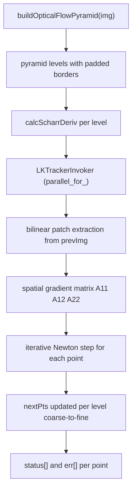
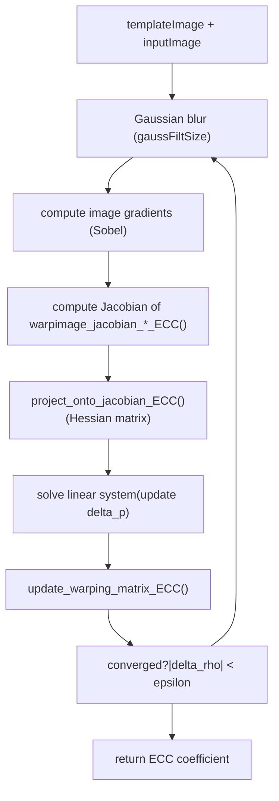

# Video Analysis

Relevant source files

-   [modules/features2d/src/precomp.hpp](https://github.com/opencv/opencv/blob/91c78f50/modules/features2d/src/precomp.hpp)
-   [modules/imgproc/src/floodfill.cpp](https://github.com/opencv/opencv/blob/91c78f50/modules/imgproc/src/floodfill.cpp)
-   [modules/imgproc/test/test\_floodfill.cpp](https://github.com/opencv/opencv/blob/91c78f50/modules/imgproc/test/test_floodfill.cpp)
-   [modules/video/include/opencv2/video/background\_segm.hpp](https://github.com/opencv/opencv/blob/91c78f50/modules/video/include/opencv2/video/background_segm.hpp)
-   [modules/video/include/opencv2/video/tracking.hpp](https://github.com/opencv/opencv/blob/91c78f50/modules/video/include/opencv2/video/tracking.hpp)
-   [modules/video/perf/opencl/perf\_bgfg\_knn.cpp](https://github.com/opencv/opencv/blob/91c78f50/modules/video/perf/opencl/perf_bgfg_knn.cpp)
-   [modules/video/perf/opencl/perf\_bgfg\_mog2.cpp](https://github.com/opencv/opencv/blob/91c78f50/modules/video/perf/opencl/perf_bgfg_mog2.cpp)
-   [modules/video/perf/opencl/perf\_optflow\_pyrlk.cpp](https://github.com/opencv/opencv/blob/91c78f50/modules/video/perf/opencl/perf_optflow_pyrlk.cpp)
-   [modules/video/perf/perf\_bgfg\_knn.cpp](https://github.com/opencv/opencv/blob/91c78f50/modules/video/perf/perf_bgfg_knn.cpp)
-   [modules/video/perf/perf\_bgfg\_mog2.cpp](https://github.com/opencv/opencv/blob/91c78f50/modules/video/perf/perf_bgfg_mog2.cpp)
-   [modules/video/perf/perf\_bgfg\_utils.hpp](https://github.com/opencv/opencv/blob/91c78f50/modules/video/perf/perf_bgfg_utils.hpp)
-   [modules/video/perf/perf\_ecc.cpp](https://github.com/opencv/opencv/blob/91c78f50/modules/video/perf/perf_ecc.cpp)
-   [modules/video/src/bgfg\_KNN.cpp](https://github.com/opencv/opencv/blob/91c78f50/modules/video/src/bgfg_KNN.cpp)
-   [modules/video/src/bgfg\_gaussmix2.cpp](https://github.com/opencv/opencv/blob/91c78f50/modules/video/src/bgfg_gaussmix2.cpp)
-   [modules/video/src/ecc.cpp](https://github.com/opencv/opencv/blob/91c78f50/modules/video/src/ecc.cpp)
-   [modules/video/src/lkpyramid.cpp](https://github.com/opencv/opencv/blob/91c78f50/modules/video/src/lkpyramid.cpp)
-   [modules/video/src/opencl/bgfg\_knn.cl](https://github.com/opencv/opencv/blob/91c78f50/modules/video/src/opencl/bgfg_knn.cl)
-   [modules/video/src/opencl/bgfg\_mog2.cl](https://github.com/opencv/opencv/blob/91c78f50/modules/video/src/opencl/bgfg_mog2.cl)
-   [modules/video/src/opencl/pyrlk.cl](https://github.com/opencv/opencv/blob/91c78f50/modules/video/src/opencl/pyrlk.cl)
-   [modules/video/src/precomp.hpp](https://github.com/opencv/opencv/blob/91c78f50/modules/video/src/precomp.hpp)
-   [modules/video/test/ocl/test\_bgfg\_mog2.cpp](https://github.com/opencv/opencv/blob/91c78f50/modules/video/test/ocl/test_bgfg_mog2.cpp)
-   [modules/video/test/ocl/test\_optflowpyrlk.cpp](https://github.com/opencv/opencv/blob/91c78f50/modules/video/test/ocl/test_optflowpyrlk.cpp)
-   [modules/video/test/test\_bgfg2.cpp](https://github.com/opencv/opencv/blob/91c78f50/modules/video/test/test_bgfg2.cpp)
-   [modules/video/test/test\_ecc.cpp](https://github.com/opencv/opencv/blob/91c78f50/modules/video/test/test_ecc.cpp)
-   [modules/video/test/test\_estimaterigid.cpp](https://github.com/opencv/opencv/blob/91c78f50/modules/video/test/test_estimaterigid.cpp)
-   [modules/videoio/perf/perf\_camera.impl.hpp](https://github.com/opencv/opencv/blob/91c78f50/modules/videoio/perf/perf_camera.impl.hpp)
-   [modules/videoio/perf/perf\_input.cpp](https://github.com/opencv/opencv/blob/91c78f50/modules/videoio/perf/perf_input.cpp)
-   [samples/cpp/image\_alignment.cpp](https://github.com/opencv/opencv/blob/91c78f50/samples/cpp/image_alignment.cpp)
-   [samples/python/background\_subtractor\_mask.py](https://github.com/opencv/opencv/blob/91c78f50/samples/python/background_subtractor_mask.py)

The `opencv_video` module provides algorithms for analyzing motion and appearance changes across video frames. It covers three main areas: **optical flow** (sparse and dense), **background/foreground segmentation**, and **object tracking** (mean-shift, CAMshift, Kalman filtering). It also includes the ECC image alignment algorithm for estimating geometric transformations between images.

This page covers the `modules/video` source tree. For GPU-accelerated optical flow implementations, see [GPU-Accelerated Image Processing and Optical Flow](/opencv/opencv/14.2-gpu-accelerated-image-processing-and-optical-flow). For video capture and decoding, see [Video Capture and Backend Architecture](/opencv/opencv/7.2-video-capture-and-backend-architecture).

---

## Module Structure

The module exposes two primary headers:

| Header | Contents |
| --- | --- |
| `modules/video/include/opencv2/video/tracking.hpp` | Optical flow, Kalman filter, ECC, meanShift, CamShift |
| `modules/video/include/opencv2/video/background_segm.hpp` | Background subtraction interfaces and factory functions |

Key source files:

| Source File | Purpose |
| --- | --- |
| `modules/video/src/lkpyramid.cpp` | Lucas-Kanade pyramidal optical flow |
| `modules/video/src/bgfg_gaussmix2.cpp` | MOG2 background subtractor |
| `modules/video/src/bgfg_KNN.cpp` | KNN background subtractor |
| `modules/video/src/ecc.cpp` | ECC image alignment |
| `modules/video/src/opencl/pyrlk.cl` | OpenCL kernel for LK optical flow |
| `modules/video/src/opencl/bgfg_mog2.cl` | OpenCL kernel for MOG2 |
| `modules/video/src/opencl/bgfg_knn.cl` | OpenCL kernel for KNN |

---

## Class Hierarchy

**Title: opencv\_video Public Class Hierarchy**


Sources: [modules/video/include/opencv2/video/tracking.hpp509-585](https://github.com/opencv/opencv/blob/91c78f50/modules/video/include/opencv2/video/tracking.hpp#L509-L585) [modules/video/include/opencv2/video/background\_segm.hpp55-339](https://github.com/opencv/opencv/blob/91c78f50/modules/video/include/opencv2/video/background_segm.hpp#L55-L339)

---

## Optical Flow

Optical flow estimates pixel motion between two consecutive frames. The module provides sparse (point-based) and dense (all-pixel) variants.

### Sparse: Lucas-Kanade Pyramidal (`calcOpticalFlowPyrLK`)

`calcOpticalFlowPyrLK` tracks a sparse set of points from frame to frame using the iterative Lucas-Kanade method in an image pyramid.

**Signature** ([modules/video/include/opencv2/video/tracking.hpp181-186](https://github.com/opencv/opencv/blob/91c78f50/modules/video/include/opencv2/video/tracking.hpp#L181-L186)):

```
calcOpticalFlowPyrLK(prevImg, nextImg, prevPts, nextPts,
                     status, err,
                     winSize=Size(21,21), maxLevel=3,
                     criteria=TermCriteria(...),
                     flags=0, minEigThreshold=1e-4)
```
**Key flags** (defined in [modules/video/include/opencv2/video/tracking.hpp59-62](https://github.com/opencv/opencv/blob/91c78f50/modules/video/include/opencv2/video/tracking.hpp#L59-L62)):

| Flag | Value | Meaning |
| --- | --- | --- |
| `OPTFLOW_USE_INITIAL_FLOW` | 4 | Use `nextPts` as initial estimate |
| `OPTFLOW_LK_GET_MIN_EIGENVALS` | 8 | Use minimum eigenvalue as error measure |

**Title: calcOpticalFlowPyrLK Internal Data Flow**


Sources: [modules/video/src/lkpyramid.cpp747-843](https://github.com/opencv/opencv/blob/91c78f50/modules/video/src/lkpyramid.cpp#L747-L843) [modules/video/src/lkpyramid.cpp157-745](https://github.com/opencv/opencv/blob/91c78f50/modules/video/src/lkpyramid.cpp#L157-L745)

#### Pyramid Construction: `buildOpticalFlowPyramid`

`buildOpticalFlowPyramid` ([modules/video/src/lkpyramid.cpp747-843](https://github.com/opencv/opencv/blob/91c78f50/modules/video/src/lkpyramid.cpp#L747-L843)) builds an image pyramid suitable for reuse across multiple calls to `calcOpticalFlowPyrLK`. Each pyramid level stores the downscaled image and optionally its Scharr derivatives, with a border of `winSize` pixels added to support valid patch lookups at the edges.

-   Returns the actual number of levels built (may be less than `maxLevel` if the image becomes too small).
-   Precomputed derivatives avoid redundant work when the same pyramid is used in successive frames.

#### `LKTrackerInvoker`

The core tracking logic lives in `LKTrackerInvoker::operator()` ([modules/video/src/lkpyramid.cpp187-745](https://github.com/opencv/opencv/blob/91c78f50/modules/video/src/lkpyramid.cpp#L187-L745)), which is dispatched via `parallel_for_`. For each tracked point:

1.  Extract the image patch and gradient patch from `prevImg` and `derivI` using bilinear interpolation.
2.  Accumulate the 2×2 spatial gradient matrix (`A11`, `A12`, `A22`).
3.  Check the minimum eigenvalue against `minEigThreshold`; mark the point failed if below threshold.
4.  Iterate: compute image difference `b1`, `b2`, solve the linear system, update the point position.
5.  Stop when displacement is smaller than `criteria.epsilon` or `criteria.maxCount` iterations are reached.

SIMD acceleration is applied via `CV_SIMD128` paths ([modules/video/src/lkpyramid.cpp83-155](https://github.com/opencv/opencv/blob/91c78f50/modules/video/src/lkpyramid.cpp#L83-L155)) and NEON paths for ARM ([modules/video/src/lkpyramid.cpp278-459](https://github.com/opencv/opencv/blob/91c78f50/modules/video/src/lkpyramid.cpp#L278-L459)).

#### OpenCL Path

`SparsePyrLKOpticalFlowImpl` ([modules/video/src/lkpyramid.cpp849](https://github.com/opencv/opencv/blob/91c78f50/modules/video/src/lkpyramid.cpp#L849-LNaN)), the concrete `Algorithm` subclass, contains an `#ifdef HAVE_OPENCL` branch. When OpenCL is active, each pyramid level is processed by the kernel in [modules/video/src/opencl/pyrlk.cl](https://github.com/opencv/opencv/blob/91c78f50/modules/video/src/opencl/pyrlk.cl) The kernel uses `cl_khr_image2d_from_buffer` for aligned pitched access and computes the LK iteration entirely on the device.

---

### Dense: Farneback (`calcOpticalFlowFarneback`)

`calcOpticalFlowFarneback` ([modules/video/include/opencv2/video/tracking.hpp226-229](https://github.com/opencv/opencv/blob/91c78f50/modules/video/include/opencv2/video/tracking.hpp#L226-L229)) computes a dense flow field for every pixel. It approximates the local image neighbourhood with a polynomial and minimizes the difference between polynomial coefficients across frames.

**Key parameters:**

| Parameter | Typical value | Effect |
| --- | --- | --- |
| `pyr_scale` | 0.5 | Scale between pyramid levels |
| `levels` | 3–5 | Number of pyramid levels |
| `winsize` | 13–25 | Averaging window; larger = more robust, more blur |
| `poly_n` | 5 or 7 | Polynomial neighbourhood size |
| `poly_sigma` | 1.1–1.5 | Gaussian sigma for polynomial basis |
| `OPTFLOW_FARNEBACK_GAUSSIAN` | flag | Use Gaussian instead of box filter |

Output is a `CV_32FC2` `Mat` where each pixel stores `(u, v)` displacement.

The `FarnebackOpticalFlow` class ([modules/video/include/opencv2/video/tracking.hpp549-585](https://github.com/opencv/opencv/blob/91c78f50/modules/video/include/opencv2/video/tracking.hpp#L549-L585)) provides an object-oriented wrapper with getter/setter properties, accessible from Python/Java bindings.

---

### Dense: DIS Optical Flow (`DISOpticalFlow`)

`DISOpticalFlow` ([modules/video/include/opencv2/video/tracking.hpp](https://github.com/opencv/opencv/blob/91c78f50/modules/video/include/opencv2/video/tracking.hpp)), created via `DISOpticalFlow::create(preset)`, implements the Dense Inverse Search algorithm. Three preset levels are provided:

| Preset | Speed/Quality |
| --- | --- |
| `PRESET_ULTRAFAST` | Fastest, least accurate |
| `PRESET_FAST` | Balanced |
| `PRESET_MEDIUM` | Default; best quality |

---

### Variational Refinement (`VariationalRefinement`)

`VariationalRefinement` refines a pre-computed dense flow field by minimizing a variational energy functional. It is typically chained after `FarnebackOpticalFlow` or `DISOpticalFlow`.

---

### Flow File I/O

The module provides two utility functions for the `.flo` file format used in optical flow benchmarks:

-   `readOpticalFlow(path)` → `Mat` (CV\_32FC2)
-   `writeOpticalFlow(path, flow)` → `bool`

Declared in [modules/video/include/opencv2/video/tracking.hpp494-505](https://github.com/opencv/opencv/blob/91c78f50/modules/video/include/opencv2/video/tracking.hpp#L494-L505)

---

## Background Subtraction

Background subtractors maintain a per-pixel model of the "background" and classify each new frame's pixels as foreground or background.

**Title: BackgroundSubtractor Interface and Implementations**


Sources: [modules/video/include/opencv2/video/background\_segm.hpp55-339](https://github.com/opencv/opencv/blob/91c78f50/modules/video/include/opencv2/video/background_segm.hpp#L55-L339) [modules/video/src/bgfg\_gaussmix2.cpp121-405](https://github.com/opencv/opencv/blob/91c78f50/modules/video/src/bgfg_gaussmix2.cpp#L121-L405) [modules/video/src/bgfg\_KNN.cpp67-278](https://github.com/opencv/opencv/blob/91c78f50/modules/video/src/bgfg_KNN.cpp#L67-L278)

### `BackgroundSubtractorMOG2`

Implements the Gaussian Mixture Model described in Zivkovic (2004, 2006). Created via:

```
Ptr<BackgroundSubtractorMOG2> createBackgroundSubtractorMOG2(
    int history=500, double varThreshold=16, bool detectShadows=true)
```
**Per-pixel model:** Up to `nmixtures` (default 5) Gaussian components, each described by weight, mean, and a single variance. The number of active components is adapted per pixel.

**Key parameters** ([modules/video/src/bgfg\_gaussmix2.cpp106-118](https://github.com/opencv/opencv/blob/91c78f50/modules/video/src/bgfg_gaussmix2.cpp#L106-L118)):

| Parameter | Default | Description |
| --- | --- | --- |
| `history` | 500 | Effective learning rate α = 1/history |
| `nmixtures` | 5 | Maximum Gaussian components per pixel |
| `varThreshold` | 16.0 | Mahalanobis distance threshold (Tb) |
| `backgroundRatio` | 0.9 | Weight sum threshold (TB) for background test |
| `varThresholdGen` | 9.0 | Threshold to generate a new component (Tg) |
| `varInit` | 15.0 | Initial variance for new components |
| `fCT` | 0.05 | Complexity reduction prior |
| `bShadowDetection` | true | Detect and mark shadows with value 127 |
| `fTau` | 0.5 | Shadow darkness threshold |

**Update mechanics** (`MOG2Invoker`, [modules/video/src/bgfg\_gaussmix2.cpp541](https://github.com/opencv/opencv/blob/91c78f50/modules/video/src/bgfg_gaussmix2.cpp#L541-LNaN)):

1.  For each pixel, test all active Gaussian components in weight-descending order.
2.  If the pixel fits a component (Mahalanobis distance² < `varThreshold`), update its weight and mean; mark as background if accumulated weight exceeds `backgroundRatio`.
3.  If no component matches, create a new one with `varInit`; prune the lowest-weight component if `nmixtures` is exceeded.
4.  Optionally classify shadows using `detectShadowGMM` ([modules/video/src/bgfg\_gaussmix2.cpp480-525](https://github.com/opencv/opencv/blob/91c78f50/modules/video/src/bgfg_gaussmix2.cpp#L480-L525)).

**OpenCL path:** When OpenCL is active, `ocl_apply` dispatches `mog2_kernel` from [modules/video/src/opencl/bgfg\_mog2.cl](https://github.com/opencv/opencv/blob/91c78f50/modules/video/src/opencl/bgfg_mog2.cl) The model arrays (`u_weight`, `u_variance`, `u_mean`, `u_bgmodelUsedModes`) are stored as `UMat` objects.

---

### `BackgroundSubtractorKNN`

Implements K-Nearest Neighbours background subtraction (Zivkovic & van der Heijden, 2006). Created via:

```
Ptr<BackgroundSubtractorKNN> createBackgroundSubtractorKNN(
    int history=500, double dist2Threshold=400.0, bool detectShadows=true)
```
Rather than fitting Gaussians, the KNN model stores `nN` raw pixel samples per pixel (default 7) at three temporal scales (short, mid, long). A pixel is classified as background if at least `nkNN` stored samples fall within squared distance `dist2Threshold`.

**Key parameters** ([modules/video/src/bgfg\_KNN.cpp58-66](https://github.com/opencv/opencv/blob/91c78f50/modules/video/src/bgfg_KNN.cpp#L58-L66)):

| Parameter | Default | Description |
| --- | --- | --- |
| `history` | 500 | Learning rate |
| `nN` | 7 | Samples stored per pixel per speed model |
| `nkNN` | ~2 | Required nearest neighbours for background |
| `dist2Threshold` | 400.0 | Squared distance threshold |
| `bShadowDetection` | true | Shadow detection |

Three circular sample buffers (short, mid, long) are maintained per pixel to capture motion at multiple temporal scales. OpenCL acceleration is handled via `bgfg_knn.cl`.

---

### `BackgroundSubtractor::apply` Semantics

The `apply` method is called once per frame and updates the internal model in-place:

-   `learningRate=-1`: automatically chosen (α = 1/history after warm-up).
-   `learningRate=0`: model frozen, no update.
-   `learningRate=1`: full reinitialisation from this frame.

The two-argument overload accepting `knownForegroundMask` allows callers to skip model updates for pixels already known to be foreground.

Output mask values:

-   `0` = background
-   `255` = foreground
-   `127` = shadow (default, when `detectShadows=true`)

---

## Object Tracking

### meanShift and CamShift

Both functions track an object based on its colour histogram back-projection.

-   `meanShift(probImage, window, criteria)` → iteration count
    Iteratively shifts `window` to the mean of the probability mass inside it. Window size and orientation are fixed.

-   `CamShift(probImage, window, criteria)` → `RotatedRect`
    Builds on `meanShift`, then adjusts window size and orientation to fit the object's distribution. Returns a `RotatedRect` encoding position, scale, and angle.


Declared in [modules/video/include/opencv2/video/tracking.hpp82-107](https://github.com/opencv/opencv/blob/91c78f50/modules/video/include/opencv2/video/tracking.hpp#L82-L107)

---

### KalmanFilter

`KalmanFilter` ([modules/video/include/opencv2/video/tracking.hpp434-484](https://github.com/opencv/opencv/blob/91c78f50/modules/video/include/opencv2/video/tracking.hpp#L434-L484)) implements the discrete-time linear Kalman filter. It supports standard linear filtering and can be adapted for extended Kalman filtering by modifying the transition and measurement matrices externally.

**State variables (all `Mat`):**

| Member | Symbol | Description |
| --- | --- | --- |
| `statePre` | x′(k) | Predicted state |
| `statePost` | x(k) | Corrected state |
| `transitionMatrix` | A | State transition |
| `controlMatrix` | B | Control input mapping |
| `measurementMatrix` | H | Observation model |
| `processNoiseCov` | Q | Process noise covariance |
| `measurementNoiseCov` | R | Measurement noise covariance |
| `errorCovPre` | P′(k) | Prior error covariance |
| `errorCovPost` | P(k) | Posterior error covariance |
| `gain` | K(k) | Kalman gain |

**Predict/correct cycle:**

```
const Mat& predict(control)   // x'(k) = A*x(k-1) + B*u
const Mat& correct(measurement)  // x(k) = x'(k) + K*(z - H*x'(k))
```
---

## ECC Image Alignment

`findTransformECC` estimates the geometric warp between two images by maximising the Enhanced Correlation Coefficient (ECC). Unlike feature-based methods, it operates directly on pixel intensities.

**Title: findTransformECC Computation Flow**


Sources: [modules/video/src/ecc.cpp337](https://github.com/opencv/opencv/blob/91c78f50/modules/video/src/ecc.cpp#L337-LNaN) [modules/video/include/opencv2/video/tracking.hpp314-420](https://github.com/opencv/opencv/blob/91c78f50/modules/video/include/opencv2/video/tracking.hpp#L314-L420)

**Motion types** ([modules/video/include/opencv2/video/tracking.hpp264-269](https://github.com/opencv/opencv/blob/91c78f50/modules/video/include/opencv2/video/tracking.hpp#L264-L269)):

| Constant | Value | DOF | `warpMatrix` size |
| --- | --- | --- | --- |
| `MOTION_TRANSLATION` | 0 | 2 | 2×3 |
| `MOTION_EUCLIDEAN` | 1 | 3 | 2×3 |
| `MOTION_AFFINE` | 2 | 6 | 2×3 |
| `MOTION_HOMOGRAPHY` | 3 | 8 | 3×3 |

The Jacobian computation is split into motion-type-specific helpers in [modules/video/src/ecc.cpp50-188](https://github.com/opencv/opencv/blob/91c78f50/modules/video/src/ecc.cpp#L50-L188):

-   `image_jacobian_homo_ECC` — homography (8 DOF)
-   `image_jacobian_euclidean_ECC` — Euclidean / rigid (3 DOF)
-   `image_jacobian_affine_ECC` — affine (6 DOF)
-   `image_jacobian_translation_ECC` — translation (2 DOF)

`computeECC` ([modules/video/src/ecc.cpp291-334](https://github.com/opencv/opencv/blob/91c78f50/modules/video/src/ecc.cpp#L291-L334)) is a standalone function that measures the ECC similarity between two already-aligned images. It handles unsigned integer types by upconverting to a signed type before computing the zero-mean dot product.

`findTransformECCWithMask` ([modules/video/include/opencv2/video/tracking.hpp377-420](https://github.com/opencv/opencv/blob/91c78f50/modules/video/include/opencv2/video/tracking.hpp#L377-L420)) extends `findTransformECC` by accepting separate validity masks for both the template and input images. On each iteration the input mask is warped into the template frame and intersected with the template mask.

---

## OpenCL Acceleration Summary

| Algorithm | OpenCL kernel | Activation |
| --- | --- | --- |
| LK optical flow | `modules/video/src/opencl/pyrlk.cl` | `SparsePyrLKOpticalFlowImpl::sparse()` when `ocl::isOpenCLActivated()` |
| MOG2 | `modules/video/src/opencl/bgfg_mog2.cl` | `BackgroundSubtractorMOG2Impl::ocl_apply()` |
| KNN | `modules/video/src/opencl/bgfg_knn.cl` | `BackgroundSubtractorKNNImpl::ocl_apply()` |

All three fall back to the CPU path if OpenCL is not available or if the kernel fails to compile. The MOG2 and KNN implementations store their model data as `UMat` objects (`u_weight`, `u_variance`, `u_mean`, etc.) to avoid host-device transfers when OpenCL is active.

---

## Subpage References

Detailed per-subsystem documentation is available in:

-   [Optical Flow and Object Tracking](/opencv/opencv/16.1-optical-flow-and-object-tracking) — deep dive into `calcOpticalFlowPyrLK`, `calcOpticalFlowFarneback`, `KalmanFilter`, meanShift, and CamShift internals.
-   [Background Subtraction](/opencv/opencv/16.2-background-subtraction) — detailed parameter descriptions and incremental update mechanics for MOG2 and KNN.
