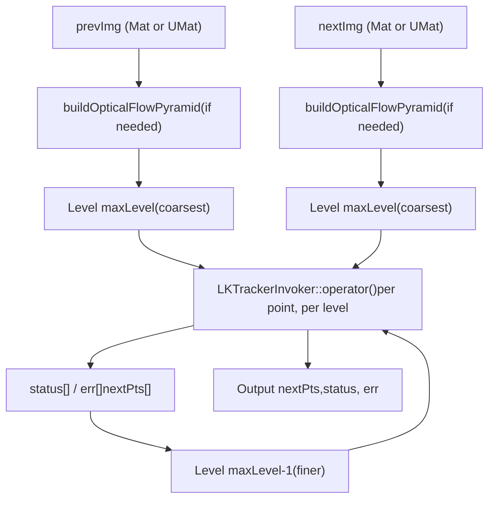
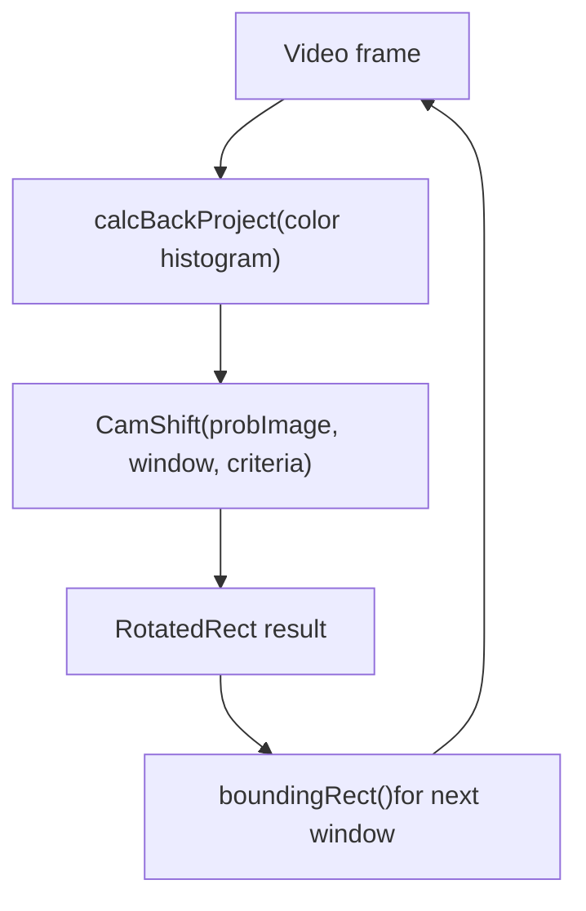
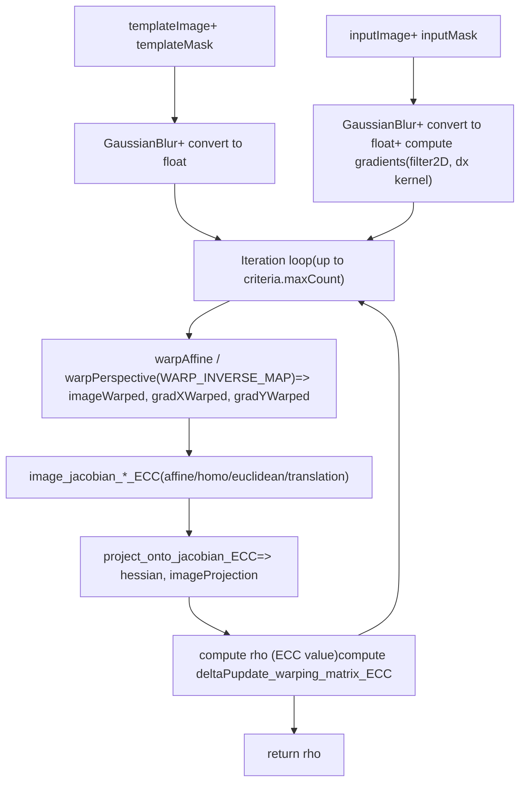
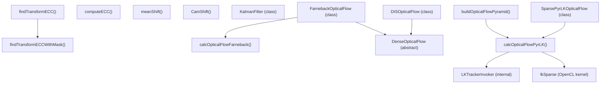

# Optical Flow and Object Tracking

Relevant source files

-   [modules/features2d/src/precomp.hpp](https://github.com/opencv/opencv/blob/91c78f50/modules/features2d/src/precomp.hpp)
-   [modules/video/include/opencv2/video/tracking.hpp](https://github.com/opencv/opencv/blob/91c78f50/modules/video/include/opencv2/video/tracking.hpp)
-   [modules/video/perf/opencl/perf\_optflow\_pyrlk.cpp](https://github.com/opencv/opencv/blob/91c78f50/modules/video/perf/opencl/perf_optflow_pyrlk.cpp)
-   [modules/video/perf/perf\_ecc.cpp](https://github.com/opencv/opencv/blob/91c78f50/modules/video/perf/perf_ecc.cpp)
-   [modules/video/src/ecc.cpp](https://github.com/opencv/opencv/blob/91c78f50/modules/video/src/ecc.cpp)
-   [modules/video/src/lkpyramid.cpp](https://github.com/opencv/opencv/blob/91c78f50/modules/video/src/lkpyramid.cpp)
-   [modules/video/src/opencl/pyrlk.cl](https://github.com/opencv/opencv/blob/91c78f50/modules/video/src/opencl/pyrlk.cl)
-   [modules/video/src/precomp.hpp](https://github.com/opencv/opencv/blob/91c78f50/modules/video/src/precomp.hpp)
-   [modules/video/test/ocl/test\_optflowpyrlk.cpp](https://github.com/opencv/opencv/blob/91c78f50/modules/video/test/ocl/test_optflowpyrlk.cpp)
-   [modules/video/test/test\_ecc.cpp](https://github.com/opencv/opencv/blob/91c78f50/modules/video/test/test_ecc.cpp)
-   [modules/video/test/test\_estimaterigid.cpp](https://github.com/opencv/opencv/blob/91c78f50/modules/video/test/test_estimaterigid.cpp)
-   [samples/cpp/image\_alignment.cpp](https://github.com/opencv/opencv/blob/91c78f50/samples/cpp/image_alignment.cpp)

## Purpose and Scope

This page documents the optical flow and object tracking facilities in the `opencv_video` module. It covers sparse and dense optical flow algorithms, the Kalman filter, meanShift/CAMShift trackers, and the Enhanced Correlation Coefficient (ECC) image alignment algorithm.

Background subtraction (also part of `opencv_video`) is covered separately in [Background Subtraction](/opencv/opencv/16.2-background-subtraction). GPU-accelerated variants of optical flow (CUDA PyrLK and Farneback) are documented in [GPU-Accelerated Image Processing and Optical Flow](/opencv/opencv/14.2-gpu-accelerated-image-processing-and-optical-flow). Feature detectors used to seed optical flow (e.g., `goodFeaturesToTrack`) belong to [Feature Detectors and Descriptors](/opencv/opencv/6.1-feature-detectors-and-descriptors).

---

## Public API Overview

All public declarations live in:

[modules/video/include/opencv2/video/tracking.hpp1-630](https://github.com/opencv/opencv/blob/91c78f50/modules/video/include/opencv2/video/tracking.hpp#L1-L630)

**Class hierarchy and free functions:**

Sources: [modules/video/include/opencv2/video/tracking.hpp509-630](https://github.com/opencv/opencv/blob/91c78f50/modules/video/include/opencv2/video/tracking.hpp#L509-L630)

**Free functions summary:**

| Function | Purpose |
| --- | --- |
| `buildOpticalFlowPyramid` | Pre-builds image pyramid for `calcOpticalFlowPyrLK` |
| `calcOpticalFlowPyrLK` | Sparse LK optical flow (pyramidal) |
| `calcOpticalFlowFarneback` | Dense optical flow (Farneback) |
| `meanShift` | Iterative mean-shift tracker |
| `CamShift` | Adaptive window mean-shift tracker |
| `findTransformECC` | ECC-based image alignment |
| `findTransformECCWithMask` | ECC alignment with per-image masks |
| `computeECC` | Compute enhanced correlation coefficient |
| `readOpticalFlow` / `writeOpticalFlow` | `.flo` file I/O |

Sources: [modules/video/include/opencv2/video/tracking.hpp59-506](https://github.com/opencv/opencv/blob/91c78f50/modules/video/include/opencv2/video/tracking.hpp#L59-L506)

---

## Sparse Optical Flow: Lucas-Kanade (PyrLK)

### Algorithm

The implementation follows the pyramidal Lucas-Kanade method (Bouguet 2000). For each tracked point, a 2×2 spatial gradient matrix is assembled over a search window in the previous frame's image. An iterative Newton-Raphson step then moves the corresponding window in the next frame until convergence or a maximum iteration count is reached. The pyramid allows large-displacement tracking by solving the problem coarse-to-fine.

**Data flow through `calcOpticalFlowPyrLK`:**


Sources: [modules/video/src/lkpyramid.cpp747-843](https://github.com/opencv/opencv/blob/91c78f50/modules/video/src/lkpyramid.cpp#L747-L843) [modules/video/src/lkpyramid.cpp187-745](https://github.com/opencv/opencv/blob/91c78f50/modules/video/src/lkpyramid.cpp#L187-L745)

### `buildOpticalFlowPyramid`

[modules/video/src/lkpyramid.cpp747-843](https://github.com/opencv/opencv/blob/91c78f50/modules/video/src/lkpyramid.cpp#L747-L843)

Signature:

```
int buildOpticalFlowPyramid(    InputArray img, OutputArrayOfArrays pyramid,    Size winSize, int maxLevel,    bool withDerivatives = true,    int pyrBorder = BORDER_REFLECT_101,    int derivBorder = BORDER_CONSTANT,    bool tryReuseInputImage = true);
```
-   Allocates a vector of `Mat` with `(maxLevel + 1) * pyrstep` slots, where `pyrstep = 2` when `withDerivatives = true` (image + derivative at each level), or `1` otherwise.
-   Each level is padded by `winSize` pixels on each side to avoid per-pixel boundary checks during tracking.
-   Scharr derivatives are computed via the file-local `calcScharrDeriv` function (also parallelized via `parallel_for_` with `ScharrDerivInvoker`).
-   Returns the number of levels actually built (may be less than `maxLevel` if the image becomes smaller than `winSize`).

Sources: [modules/video/src/lkpyramid.cpp747-843](https://github.com/opencv/opencv/blob/91c78f50/modules/video/src/lkpyramid.cpp#L747-L843)

### `calcOpticalFlowPyrLK`

[modules/video/include/opencv2/video/tracking.hpp181-186](https://github.com/opencv/opencv/blob/91c78f50/modules/video/include/opencv2/video/tracking.hpp#L181-L186)

Key parameters:

| Parameter | Default | Meaning |
| --- | --- | --- |
| `winSize` | `Size(21,21)` | Search window at each pyramid level |
| `maxLevel` | `3` | Maximum pyramid level (0 = no pyramid) |
| `criteria` | COUNT+EPS, 30, 0.01 | Iteration stop condition |
| `flags` | `0` | `OPTFLOW_USE_INITIAL_FLOW`, `OPTFLOW_LK_GET_MIN_EIGENVALS` |
| `minEigThreshold` | `1e-4` | Points with min eigenvalue below this are rejected |

Output `status[i]` is set to `0` (point rejected) when:

-   The point is outside the image bounds at any pyramid level.
-   The 2×2 spatial gradient matrix is nearly singular (min eigenvalue < `minEigThreshold`).

Output `err[i]` is either the L1 patch difference (default) or the minimum eigenvalue when `OPTFLOW_LK_GET_MIN_EIGENVALS` is set.

Sources: [modules/video/include/opencv2/video/tracking.hpp130-186](https://github.com/opencv/opencv/blob/91c78f50/modules/video/include/opencv2/video/tracking.hpp#L130-L186) [modules/video/src/lkpyramid.cpp187-745](https://github.com/opencv/opencv/blob/91c78f50/modules/video/src/lkpyramid.cpp#L187-L745)

### OOP Interface: `SparsePyrLKOpticalFlow`

`SparsePyrLKOpticalFlow` is the object-oriented wrapper around `calcOpticalFlowPyrLK`. Instantiate via its static factory:

```
auto lk = SparsePyrLKOpticalFlow::create(winSize, maxLevel, criteria, flags, minEigThreshold);lk->calc(prevImg, nextImg, prevPts, nextPts, status, err);
```
The concrete implementation is `SparsePyrLKOpticalFlowImpl` (anonymous namespace in `lkpyramid.cpp`). It selects either the OpenCL path or the CPU `parallel_for_` path depending on whether `UMat` inputs are provided and OpenCL is available.

Sources: [modules/video/src/lkpyramid.cpp849-867](https://github.com/opencv/opencv/blob/91c78f50/modules/video/src/lkpyramid.cpp#L849-L867) [modules/video/include/opencv2/video/tracking.hpp527-544](https://github.com/opencv/opencv/blob/91c78f50/modules/video/include/opencv2/video/tracking.hpp#L527-L544)

### OpenCL Acceleration

When `UMat` inputs are given, the OpenCL path uses the kernel `lkSparse` defined in:

[modules/video/src/opencl/pyrlk.cl301-558](https://github.com/opencv/opencv/blob/91c78f50/modules/video/src/opencl/pyrlk.cl#L301-L558)

The kernel assigns one work-group per tracked point. Each work-group reads the `(winSize × winSize)` patch from the previous frame into local memory, computes Scharr derivatives in local memory, assembles the 2×2 gradient matrix (A11, A12, A22), and iterates the Newton-Raphson step using the next-frame image accessed via a 2D sampler for sub-pixel linear interpolation.

The local memory tile is sized `LM_W × LM_H` (where `LM_W = LSx*GRIDSIZE+2`, `LSx = 8`) to provide border pixels needed for derivative computation without additional global reads.

Sources: [modules/video/src/opencl/pyrlk.cl48-558](https://github.com/opencv/opencv/blob/91c78f50/modules/video/src/opencl/pyrlk.cl#L48-L558)

### Internal Parallelism

For the CPU path, `LKTrackerInvoker` is a `ParallelLoopBody` subclass dispatched by `parallel_for_` over the range of tracked points. SIMD acceleration is included for both SSE/AVX (via `v_int16x8` universal intrinsics) and NEON paths.

[modules/video/src/lkpyramid.cpp157-177](https://github.com/opencv/opencv/blob/91c78f50/modules/video/src/lkpyramid.cpp#L157-L177)

Sources: [modules/video/src/lkpyramid.cpp157-745](https://github.com/opencv/opencv/blob/91c78f50/modules/video/src/lkpyramid.cpp#L157-L745)

---

## Dense Optical Flow: Farneback

### `calcOpticalFlowFarneback`

Computes per-pixel motion for every pixel in the input image, producing a `CV_32FC2` flow field where `flow(y,x)[0]` is the horizontal displacement and `flow(y,x)[1]` is the vertical displacement.

```
void calcOpticalFlowFarneback(    InputArray prev, InputArray next, InputOutputArray flow,    double pyr_scale, int levels, int winsize,    int iterations, int poly_n, double poly_sigma, int flags);
```
Key parameters:

| Parameter | Typical Values | Meaning |
| --- | --- | --- |
| `pyr_scale` | 0.5 | Scale between pyramid levels |
| `levels` | 3–5 | Number of pyramid levels |
| `winsize` | 13–25 | Averaging window (larger = more robust, blurrier) |
| `poly_n` | 5 or 7 | Neighborhood for polynomial expansion |
| `poly_sigma` | 1.1 (for n=5), 1.5 (for n=7) | Gaussian sigma for polynomial expansion |
| `OPTFLOW_FARNEBACK_GAUSSIAN` flag | — | Use Gaussian filter instead of box filter |

Sources: [modules/video/include/opencv2/video/tracking.hpp188-229](https://github.com/opencv/opencv/blob/91c78f50/modules/video/include/opencv2/video/tracking.hpp#L188-L229)

### `FarnebackOpticalFlow` Class

The object-oriented interface for the Farneback algorithm. Properties are exposed via getters/setters and a static `create()` factory:

```
auto farn = FarnebackOpticalFlow::create(5, 0.5, false, 13, 10, 5, 1.1, 0);farn->calc(prev, next, flow);
```
Sources: [modules/video/include/opencv2/video/tracking.hpp549-585](https://github.com/opencv/opencv/blob/91c78f50/modules/video/include/opencv2/video/tracking.hpp#L549-L585)

### DIS Optical Flow

`DISOpticalFlow` (Dense Inverse Search) is another `DenseOpticalFlow` subclass available via `DISOpticalFlow::create(preset)`, with presets `PRESET_ULTRAFAST`, `PRESET_FAST`, and `PRESET_MEDIUM`.

Sources: [modules/video/include/opencv2/video/tracking.hpp590-640](https://github.com/opencv/opencv/blob/91c78f50/modules/video/include/opencv2/video/tracking.hpp#L590-L640)

### Optical Flow File I/O

```
Mat readOpticalFlow(const String& path);         // reads .flo file -> CV_32FC2 Matbool writeOpticalFlow(const String& path, InputArray flow); // writes CV_32FC2 Mat -> .flo file
```
Sources: [modules/video/include/opencv2/video/tracking.hpp487-505](https://github.com/opencv/opencv/blob/91c78f50/modules/video/include/opencv2/video/tracking.hpp#L487-L505)

---

## MeanShift and CAMShift Trackers

Both functions operate on a probability (back-projection) image, typically produced by `calcBackProject` from a color histogram of the target region.

### `meanShift`

```
int meanShift(InputArray probImage, CV_IN_OUT Rect& window, TermCriteria criteria);
```
Iteratively shifts `window` to the centroid of the probability mass within it. Returns the number of iterations. The window size does not change.

### `CamShift`

```
RotatedRect CamShift(InputArray probImage, CV_IN_OUT Rect& window, TermCriteria criteria);
```
Calls `meanShift` internally to find the center, then adjusts the window's size and orientation to match the shape of the probability distribution. Returns a `RotatedRect` encoding position, size, and orientation. The bounding rectangle of the output `RotatedRect` can be used as the next window for the subsequent frame.

**Typical CamShift tracking loop:**


Sources: [modules/video/include/opencv2/video/tracking.hpp64-107](https://github.com/opencv/opencv/blob/91c78f50/modules/video/include/opencv2/video/tracking.hpp#L64-L107)

---

## Kalman Filter

### Class: `KalmanFilter`

[modules/video/include/opencv2/video/tracking.hpp434-484](https://github.com/opencv/opencv/blob/91c78f50/modules/video/include/opencv2/video/tracking.hpp#L434-L484)

Implements the standard discrete Kalman filter. It can also be used as an extended Kalman filter by modifying the matrix members directly between calls.

**Matrices and their roles:**

| Matrix Member | Symbol | Role |
| --- | --- | --- |
| `transitionMatrix` | A | State transition: `x'(k) = A·x(k-1) + B·u(k)` |
| `controlMatrix` | B | Control input mapping (optional) |
| `measurementMatrix` | H | Maps state to measurement space |
| `processNoiseCov` | Q | Process noise covariance |
| `measurementNoiseCov` | R | Measurement noise covariance |
| `errorCovPre` | P' | Priori error covariance |
| `errorCovPost` | P | Posteriori error covariance |
| `gain` | K | Kalman gain |
| `statePre` | x'(k) | Predicted state |
| `statePost` | x(k) | Corrected state |

**Two-step usage per frame:**

> **[Mermaid sequence]**
> *(图表结构无法解析)*

-   `predict()` computes `x'(k) = A·x(k-1) + B·u`, `P'(k) = A·P(k-1)·Aᵀ + Q`.
-   `correct(z)` computes gain `K = P'·Hᵀ·inv(H·P'·Hᵀ + R)`, then `x(k) = x'(k) + K·(z - H·x'(k))`, `P(k) = (I - K·H)·P'(k)`.

Sources: [modules/video/include/opencv2/video/tracking.hpp426-484](https://github.com/opencv/opencv/blob/91c78f50/modules/video/include/opencv2/video/tracking.hpp#L426-L484)

---

## ECC Image Alignment

### Overview

The Enhanced Correlation Coefficient (ECC) algorithm finds a geometric warp `W` that maximizes the normalized correlation between a template image and a warped version of the input image. Unlike feature-based methods, it is area-based and tolerates illumination changes.

Implemented in:

[modules/video/src/ecc.cpp1-629](https://github.com/opencv/opencv/blob/91c78f50/modules/video/src/ecc.cpp#L1-L629)

### Functions

```
double findTransformECC(    InputArray templateImage, InputArray inputImage,    InputOutputArray warpMatrix, int motionType,    TermCriteria criteria, InputArray inputMask, int gaussFiltSize); double findTransformECCWithMask(    InputArray templateImage, InputArray inputImage,    InputArray templateMask, InputArray inputMask,    InputOutputArray warpMatrix, int motionType,    TermCriteria criteria, int gaussFiltSize); double computeECC(    InputArray templateImage, InputArray inputImage,    InputArray inputMask = noArray());
```
`findTransformECC` returns the final ECC value (in `[-1, 1]`). It throws if the algorithm diverges (correlation being minimized).

### Motion Types

| Constant | `motionType` value | `warpMatrix` shape | Free parameters |
| --- | --- | --- | --- |
| `MOTION_TRANSLATION` | 0 | 2×3 | 2 |
| `MOTION_EUCLIDEAN` | 1 | 2×3 | 3 |
| `MOTION_AFFINE` | 2 | 2×3 | 6 |
| `MOTION_HOMOGRAPHY` | 3 | 3×3 | 8 |

Sources: [modules/video/include/opencv2/video/tracking.hpp263-376](https://github.com/opencv/opencv/blob/91c78f50/modules/video/include/opencv2/video/tracking.hpp#L263-L376)

### Internal Iteration Loop

**ECC algorithm data flow:**


The four `image_jacobian_*_ECC` static functions ([modules/video/src/ecc.cpp50-188](https://github.com/opencv/opencv/blob/91c78f50/modules/video/src/ecc.cpp#L50-L188)) compute the Jacobian of the warped image w.r.t. the warp parameters for each motion type. `project_onto_jacobian_ECC` ([modules/video/src/ecc.cpp190-228](https://github.com/opencv/opencv/blob/91c78f50/modules/video/src/ecc.cpp#L190-L228)) implements the inner products needed for both the Hessian and the error projection.

Sources: [modules/video/src/ecc.cpp337-612](https://github.com/opencv/opencv/blob/91c78f50/modules/video/src/ecc.cpp#L337-L612)

---

## Optical Flow Flags

Defined in `tracking.hpp`:

[modules/video/include/opencv2/video/tracking.hpp59-62](https://github.com/opencv/opencv/blob/91c78f50/modules/video/include/opencv2/video/tracking.hpp#L59-L62)

| Flag | Value | Effect |
| --- | --- | --- |
| `OPTFLOW_USE_INITIAL_FLOW` | 4 | Use `nextPts` as initial estimate in `calcOpticalFlowPyrLK` or `findTransformECC` |
| `OPTFLOW_LK_GET_MIN_EIGENVALS` | 8 | Report min eigenvalue of gradient matrix in `err` output |
| `OPTFLOW_FARNEBACK_GAUSSIAN` | 256 | Use Gaussian filter (not box) in `calcOpticalFlowFarneback` |

---

## Summary of Code Entities


Sources: [modules/video/include/opencv2/video/tracking.hpp1-630](https://github.com/opencv/opencv/blob/91c78f50/modules/video/include/opencv2/video/tracking.hpp#L1-L630) [modules/video/src/lkpyramid.cpp1-843](https://github.com/opencv/opencv/blob/91c78f50/modules/video/src/lkpyramid.cpp#L1-L843) [modules/video/src/ecc.cpp1-629](https://github.com/opencv/opencv/blob/91c78f50/modules/video/src/ecc.cpp#L1-L629) [modules/video/src/opencl/pyrlk.cl301-558](https://github.com/opencv/opencv/blob/91c78f50/modules/video/src/opencl/pyrlk.cl#L301-L558)
