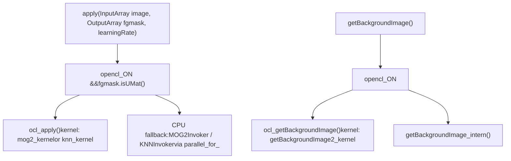
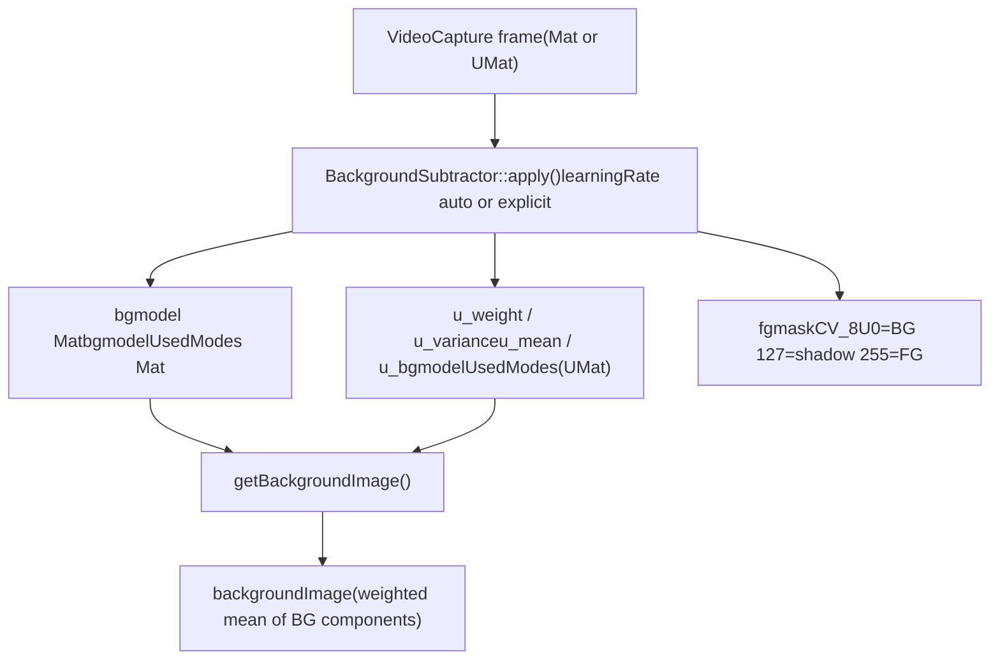

# Background Subtraction

Relevant source files

-   [modules/imgproc/src/floodfill.cpp](https://github.com/opencv/opencv/blob/91c78f50/modules/imgproc/src/floodfill.cpp)
-   [modules/imgproc/test/test\_floodfill.cpp](https://github.com/opencv/opencv/blob/91c78f50/modules/imgproc/test/test_floodfill.cpp)
-   [modules/video/include/opencv2/video/background\_segm.hpp](https://github.com/opencv/opencv/blob/91c78f50/modules/video/include/opencv2/video/background_segm.hpp)
-   [modules/video/perf/opencl/perf\_bgfg\_knn.cpp](https://github.com/opencv/opencv/blob/91c78f50/modules/video/perf/opencl/perf_bgfg_knn.cpp)
-   [modules/video/perf/opencl/perf\_bgfg\_mog2.cpp](https://github.com/opencv/opencv/blob/91c78f50/modules/video/perf/opencl/perf_bgfg_mog2.cpp)
-   [modules/video/perf/perf\_bgfg\_knn.cpp](https://github.com/opencv/opencv/blob/91c78f50/modules/video/perf/perf_bgfg_knn.cpp)
-   [modules/video/perf/perf\_bgfg\_mog2.cpp](https://github.com/opencv/opencv/blob/91c78f50/modules/video/perf/perf_bgfg_mog2.cpp)
-   [modules/video/perf/perf\_bgfg\_utils.hpp](https://github.com/opencv/opencv/blob/91c78f50/modules/video/perf/perf_bgfg_utils.hpp)
-   [modules/video/src/bgfg\_KNN.cpp](https://github.com/opencv/opencv/blob/91c78f50/modules/video/src/bgfg_KNN.cpp)
-   [modules/video/src/bgfg\_gaussmix2.cpp](https://github.com/opencv/opencv/blob/91c78f50/modules/video/src/bgfg_gaussmix2.cpp)
-   [modules/video/src/opencl/bgfg\_knn.cl](https://github.com/opencv/opencv/blob/91c78f50/modules/video/src/opencl/bgfg_knn.cl)
-   [modules/video/src/opencl/bgfg\_mog2.cl](https://github.com/opencv/opencv/blob/91c78f50/modules/video/src/opencl/bgfg_mog2.cl)
-   [modules/video/test/ocl/test\_bgfg\_mog2.cpp](https://github.com/opencv/opencv/blob/91c78f50/modules/video/test/ocl/test_bgfg_mog2.cpp)
-   [modules/video/test/test\_bgfg2.cpp](https://github.com/opencv/opencv/blob/91c78f50/modules/video/test/test_bgfg2.cpp)
-   [modules/videoio/perf/perf\_camera.impl.hpp](https://github.com/opencv/opencv/blob/91c78f50/modules/videoio/perf/perf_camera.impl.hpp)
-   [modules/videoio/perf/perf\_input.cpp](https://github.com/opencv/opencv/blob/91c78f50/modules/videoio/perf/perf_input.cpp)
-   [samples/python/background\_subtractor\_mask.py](https://github.com/opencv/opencv/blob/91c78f50/samples/python/background_subtractor_mask.py)

## Purpose and Scope

This page covers the background subtraction subsystem in the `opencv_video` module: the `BackgroundSubtractor` abstract interface and its two concrete implementations, `BackgroundSubtractorMOG2` and `BackgroundSubtractorKNN`. These algorithms classify each pixel in a video frame as foreground, background, or shadow by maintaining a per-pixel statistical model that is updated incrementally.

For optical flow, Kalman filtering, and mean-shift tracking, see page [16.1](/opencv/opencv/16.1-optical-flow-and-object-tracking). For the machine learning algorithms (SVM, EM, etc.) used in other parts of the library, see page [13](/opencv/opencv/13-machine-learning-(ml)).

---

## Class Hierarchy

The public API lives in [modules/video/include/opencv2/video/background\_segm.hpp](https://github.com/opencv/opencv/blob/91c78f50/modules/video/include/opencv2/video/background_segm.hpp)

**Class hierarchy diagram**

```mermaid
flowchart TD
    classId_Algorithm_208["«opencv_core»"]
    classId_BackgroundSubtractor_209["BackgroundSubtractor"]
    classId_BackgroundSubtractorMOG2_210["BackgroundSubtractorMOG2"]
    classId_BackgroundSubtractorKNN_211["BackgroundSubtractorKNN"]
    classId_BackgroundSubtractorMOG2Impl_212["BackgroundSubtractorMOG2Impl"]
    classId_BackgroundSubtractorKNNImpl_213["BackgroundSubtractorKNNImpl"]
```


Sources: [modules/video/include/opencv2/video/background\_segm.hpp60-338](https://github.com/opencv/opencv/blob/91c78f50/modules/video/include/opencv2/video/background_segm.hpp#L60-L338) [modules/video/src/bgfg\_gaussmix2.cpp121-405](https://github.com/opencv/opencv/blob/91c78f50/modules/video/src/bgfg_gaussmix2.cpp#L121-L405) [modules/video/src/bgfg\_KNN.cpp67-345](https://github.com/opencv/opencv/blob/91c78f50/modules/video/src/bgfg_KNN.cpp#L67-L345)

---

## BackgroundSubtractor Interface

`BackgroundSubtractor` extends `Algorithm` and defines three pure virtual methods:

| Method | Description |
| --- | --- |
| `apply(image, fgmask, learningRate=-1)` | Process one frame; write 8-bit foreground mask to `fgmask`. |
| `apply(image, knownForegroundMask, fgmask, learningRate=-1)` | Same, but pixels marked in `knownForegroundMask` are forced to foreground and excluded from model updates. |
| `getBackgroundImage(backgroundImage)` | Reconstruct a background image from the current model. |

**`learningRate` semantics:**

-   `< 0` — algorithm chooses an automatic rate (decreasing from 1 toward `1/history` as frames accumulate).
-   `0` — model is frozen; no update.
-   `1` — model is completely re-initialized from the current frame.
-   `(0, 1)` — explicit exponential decay rate α.

Sources: [modules/video/include/opencv2/video/background\_segm.hpp60-97](https://github.com/opencv/opencv/blob/91c78f50/modules/video/include/opencv2/video/background_segm.hpp#L60-L97)

---

## MOG2 — Gaussian Mixture Model Subtractor

### Algorithm Summary

`BackgroundSubtractorMOG2` implements the Zivkovic (2004, 2006) adaptive Gaussian mixture algorithm. Each pixel maintains up to `nmixtures` (default 5) Gaussian components. The components are kept sorted by descending `weight/sqrt(variance)` so that dominant background modes remain at the front.

**Per-frame update steps (CPU path — `MOG2Invoker`):**

1.  Convert pixel to float.
2.  Iterate over existing modes in weight-descending order.
3.  Compute squared Mahalanobis distance to each component.
4.  If `dist² < Tg * variance` → pixel fits that component → update weight, mean, variance; bubble the component upward.
5.  If `totalWeight < TB` and `dist² < Tb * variance` → pixel is background.
6.  If no component fits and `alphaT > 0` → create a new component (replacing weakest if at capacity).
7.  Prune components whose weight decays below `-prune`.
8.  If shadow detection is enabled and pixel is foreground, call `detectShadowGMM` — output `shadowVal` (default 127) instead of 255.

Sources: [modules/video/src/bgfg\_gaussmix2.cpp541-785](https://github.com/opencv/opencv/blob/91c78f50/modules/video/src/bgfg_gaussmix2.cpp#L541-L785)

### Factory Function

```
createBackgroundSubtractorMOG2(int history=500, double varThreshold=16, bool detectShadows=true)
```
Returns `Ptr<BackgroundSubtractorMOG2>`.

Sources: [modules/video/include/opencv2/video/background\_segm.hpp247-249](https://github.com/opencv/opencv/blob/91c78f50/modules/video/include/opencv2/video/background_segm.hpp#L247-L249)

### MOG2 Parameters

| Parameter | Default | Meaning |
| --- | --- | --- |
| `history` | 500 | Window length; learning rate α = 1/history |
| `nmixtures` | 5 | Max Gaussian components per pixel |
| `varThreshold` (Tb) | 16 | Squared Mahalanobis distance for background classification |
| `varThresholdGen` (Tg) | 9 | Squared Mahalanobis distance to assign pixel to existing component |
| `backgroundRatio` (TB) | 0.9 | Cumulative weight threshold defining "background" components |
| `fVarInit` | 15 | Initial variance for new components |
| `fVarMin` | 4 | Minimum variance clamp |
| `fVarMax` | 75 | Maximum variance clamp |
| `fCT` | 0.05 | Complexity reduction prior (set 0 for Stauffer–Grimson) |
| `detectShadows` | true | Enable shadow classification |
| `nShadowDetection` | 127 | Pixel value written for detected shadows |
| `fTau` | 0.5 | Shadow intensity threshold (Tau) |

Sources: [modules/video/src/bgfg\_gaussmix2.cpp106-118](https://github.com/opencv/opencv/blob/91c78f50/modules/video/src/bgfg_gaussmix2.cpp#L106-L118) [modules/video/include/opencv2/video/background\_segm.hpp105-236](https://github.com/opencv/opencv/blob/91c78f50/modules/video/include/opencv2/video/background_segm.hpp#L105-L236)

### Internal Data Layout (CPU)

The CPU model is stored in a single flat `Mat bgmodel` of type `CV_32F`:

```
[ GMM structs (weight + variance) ] [ mean values ]
  size: H * W * nmixtures * sizeof(GMM)  |  H * W * nmixtures * nchannels * sizeof(float)
```
A separate `Mat bgmodelUsedModes` (type `CV_8U`, size `H × W`) stores the count of active components for each pixel.

Sources: [modules/video/src/bgfg\_gaussmix2.cpp229-238](https://github.com/opencv/opencv/blob/91c78f50/modules/video/src/bgfg_gaussmix2.cpp#L229-L238)

### Shadow Detection

Shadow detection is implemented in the free function `detectShadowGMM` [modules/video/src/bgfg\_gaussmix2.cpp480-525](https://github.com/opencv/opencv/blob/91c78f50/modules/video/src/bgfg_gaussmix2.cpp#L480-L525) It checks background components for pixels that are a scaled (darker) version of the background mean. A pixel is classified as shadow if:

-   `tau * ||mean||² ≤ dot(pixel, mean) ≤ ||mean||²` (intensity in valid shadow range)
-   `dist²(a * mean, pixel) < Tb * variance * a²` (chromaticity close enough)

Where `a = dot(pixel, mean) / dot(mean, mean)`.

---

## KNN — K-Nearest Neighbour Subtractor

### Algorithm Summary

`BackgroundSubtractorKNN` stores a fixed set of raw pixel samples per pixel (rather than parametric Gaussians). Background classification is by k-nearest-neighbour vote. It is particularly efficient when the foreground pixel fraction is small.

Each pixel maintains `3 * nN` samples split across three circular buffers at different timescales:

| Tier | Description |
| --- | --- |
| Short | Fastest-updating; stores recent pixel values |
| Mid | Updated from Short at a lower rate |
| Long | Updated from Mid at the lowest rate |

This three-tier cascade provides both fast adaptation and long-term stability.

**Per-frame classification (`_cvCheckPixelBackgroundNP`):**

1.  Compute squared Euclidean distance to each of the `3 * nN` stored samples.
2.  Count `Pbf` (all samples within `fTb`) and `Pb` (background-flagged samples within `fTb`).
3.  If `Pb >= nkNN` → pixel is background; set `include = 1`.
4.  If `Pbf >= nkNN` → set `include = 1` (the sample is representative enough to be added to background even if classified as foreground this frame).
5.  Otherwise → foreground; optionally run shadow check using the same scalar projection as MOG2.

**Per-frame update (`_cvUpdatePixelBackgroundNP`):**

-   Each tier has a per-pixel counter; on a tick it copies the next sample from the tier below and advances the circular index.

Sources: [modules/video/src/bgfg\_KNN.cpp347-510](https://github.com/opencv/opencv/blob/91c78f50/modules/video/src/bgfg_KNN.cpp#L347-L510)

### Factory Function

```
createBackgroundSubtractorKNN(int history=500, double dist2Threshold=400.0, bool detectShadows=true)
```
Returns `Ptr<BackgroundSubtractorKNN>`.

Sources: [modules/video/include/opencv2/video/background\_segm.hpp336-338](https://github.com/opencv/opencv/blob/91c78f50/modules/video/include/opencv2/video/background_segm.hpp#L336-L338)

### KNN Parameters

| Parameter | Default | Meaning |
| --- | --- | --- |
| `history` | 500 | Controls update rates of tier counters |
| `nN` | 7 | Samples per tier (total 3 \* nN per pixel) |
| `nkNN` | 3 | k in kNN; number of close samples required for background |
| `dist2Threshold` (Tb) | 400 | Squared Euclidean distance threshold for sample matching |
| `detectShadows` | true | Enable shadow classification |
| `nShadowDetection` | 127 | Mask value for shadows |
| `fTau` | 0.5 | Shadow intensity ratio threshold |

Sources: [modules/video/src/bgfg\_KNN.cpp58-65](https://github.com/opencv/opencv/blob/91c78f50/modules/video/src/bgfg_KNN.cpp#L58-L65) [modules/video/include/opencv2/video/background\_segm.hpp256-326](https://github.com/opencv/opencv/blob/91c78f50/modules/video/include/opencv2/video/background_segm.hpp#L256-L326)

---

## Foreground Mask Encoding

Both algorithms produce an 8-bit mask with the same encoding:

| Value | Meaning |
| --- | --- |
| `0` | Background |
| `127` (default) | Shadow (when `detectShadows=true`) |
| `255` | Foreground |

The shadow value is configurable via `setShadowValue()`. Setting `detectShadows=false` skips shadow classification entirely, improving performance.

---

## OpenCL Acceleration

Both implementations have OpenCL-accelerated paths that activate transparently when a `UMat` is passed to `apply()` or when OpenCL is available.

**OpenCL execution flow diagram**


Sources: [modules/video/src/bgfg\_gaussmix2.cpp787-860](https://github.com/opencv/opencv/blob/91c78f50/modules/video/src/bgfg_gaussmix2.cpp#L787-L860) [modules/video/src/bgfg\_KNN.cpp647-750](https://github.com/opencv/opencv/blob/91c78f50/modules/video/src/bgfg_KNN.cpp#L647-L750)

**OpenCL kernel sources:**

| Algorithm | Kernel file | Kernel names |
| --- | --- | --- |
| MOG2 | [modules/video/src/opencl/bgfg\_mog2.cl](https://github.com/opencv/opencv/blob/91c78f50/modules/video/src/opencl/bgfg_mog2.cl) | `mog2_kernel`, `getBackgroundImage2_kernel` |
| KNN | [modules/video/src/opencl/bgfg\_knn.cl](https://github.com/opencv/opencv/blob/91c78f50/modules/video/src/opencl/bgfg_knn.cl) | `knn_kernel`, `getBackgroundImage2_kernel` |

Kernels are compiled with `-D CN=<n> -D NMIXTURES=<n>` (MOG2) or `-D CN=<n> -D NSAMPLES=<n>` (KNN) so the inner loops unroll at compile time. Shadow detection is conditionally compiled with `-D SHADOW_DETECT`.

The OpenCL UMat model buffers for MOG2 are:

| Buffer | Type | Layout |
| --- | --- | --- |
| `u_weight` | `CV_32FC1` | `(H * nmixtures) × W` |
| `u_variance` | `CV_32FC1` | `(H * nmixtures) × W` |
| `u_mean` | `CV_32FC(4)` | `(H * nmixtures) × W` |
| `u_bgmodelUsedModes` | `CV_8UC1` | `H × W` |

Sources: [modules/video/src/bgfg\_gaussmix2.cpp211-226](https://github.com/opencv/opencv/blob/91c78f50/modules/video/src/bgfg_gaussmix2.cpp#L211-L226) [modules/video/src/opencl/bgfg\_mog2.cl40-231](https://github.com/opencv/opencv/blob/91c78f50/modules/video/src/opencl/bgfg_mog2.cl#L40-L231)

---

## Parallel CPU Execution

Both CPU implementations use `parallel_for_` with row-range partitioning. The parallel body classes are:

-   `MOG2Invoker` — [modules/video/src/bgfg\_gaussmix2.cpp541-785](https://github.com/opencv/opencv/blob/91c78f50/modules/video/src/bgfg_gaussmix2.cpp#L541-L785)
-   `KNNInvoker` — [modules/video/src/bgfg\_KNN.cpp512-645](https://github.com/opencv/opencv/blob/91c78f50/modules/video/src/bgfg_KNN.cpp#L512-L645)

Each invoker row-slice operates on independent pixel rows and pointers into the flat model arrays, so no synchronization is needed.

---

## Known Foreground Mask

Both algorithms accept an optional `knownForegroundMask` (`CV_8UC1`, same size as the input frame). Any pixel with value `> 0` in this mask is:

1.  Written as `255` (foreground) in the output mask unconditionally.
2.  Excluded from the background model update.

This is useful when ground-truth foreground regions are known in advance (e.g., for evaluation or initialization).

Sources: [modules/video/src/bgfg\_gaussmix2.cpp595-606](https://github.com/opencv/opencv/blob/91c78f50/modules/video/src/bgfg_gaussmix2.cpp#L595-L606) [modules/video/src/bgfg\_KNN.cpp594-604](https://github.com/opencv/opencv/blob/91c78f50/modules/video/src/bgfg_KNN.cpp#L594-L604)

---

## Serialization

Both implementations support `read` / `write` via `FileStorage` (XML/YAML), inherited through `Algorithm`. All tunable parameters are serialized. The node name written is `"BackgroundSubtractor.MOG2"` or `"BackgroundSubtractor.KNN"`.

Sources: [modules/video/src/bgfg\_gaussmix2.cpp291-324](https://github.com/opencv/opencv/blob/91c78f50/modules/video/src/bgfg_gaussmix2.cpp#L291-L324) [modules/video/src/bgfg\_KNN.cpp254-277](https://github.com/opencv/opencv/blob/91c78f50/modules/video/src/bgfg_KNN.cpp#L254-L277)

---

## Algorithm Comparison

| Property | MOG2 | KNN |
| --- | --- | --- |
| Model type | Gaussian mixture (parametric) | Stored pixel samples (non-parametric) |
| Memory per pixel | `nmixtures * (2 floats + nchannels floats)` | `3 * nN * (nchannels + 1) bytes` |
| Adapts number of components | Yes (per pixel, up to `nmixtures`) | No (fixed `nN` per tier) |
| Best suited for | General scenes | Scenes with sparse foreground |
| Shadow detection | Yes (Prati et al. 2003 method) | Yes (same method) |
| OpenCL path | Yes | Yes |

---

## Usage Pattern

The typical frame loop (see [samples/python/background\_subtractor\_mask.py](https://github.com/opencv/opencv/blob/91c78f50/samples/python/background_subtractor_mask.py) for a Python example):

1.  Create the subtractor once with `createBackgroundSubtractorMOG2()` or `createBackgroundSubtractorKNN()`.
2.  Call `apply(frame, fgmask)` for each decoded video frame. The model updates automatically.
3.  Optionally call `getBackgroundImage(bg)` after enough frames to retrieve the estimated background.
4.  Inspect `fgmask`: pixels with value 255 are foreground; 127 (default) are shadow.

**Data flow diagram**


Sources: [modules/video/include/opencv2/video/background\_segm.hpp60-97](https://github.com/opencv/opencv/blob/91c78f50/modules/video/include/opencv2/video/background_segm.hpp#L60-L97) [modules/video/src/bgfg\_gaussmix2.cpp863-913](https://github.com/opencv/opencv/blob/91c78f50/modules/video/src/bgfg_gaussmix2.cpp#L863-L913) [modules/video/src/bgfg\_KNN.cpp750-850](https://github.com/opencv/opencv/blob/91c78f50/modules/video/src/bgfg_KNN.cpp#L750-L850)
