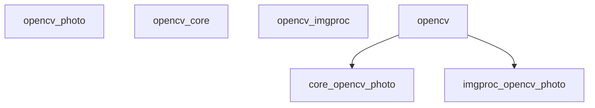
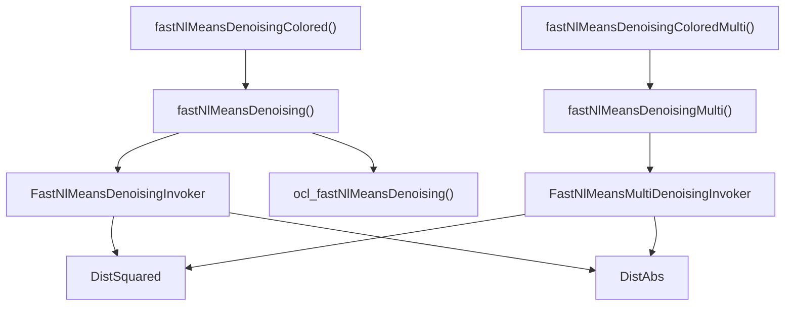
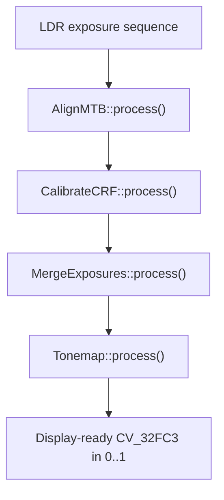
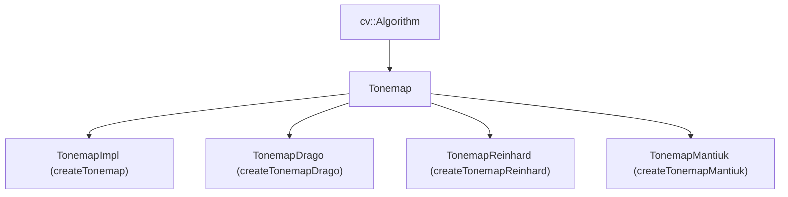
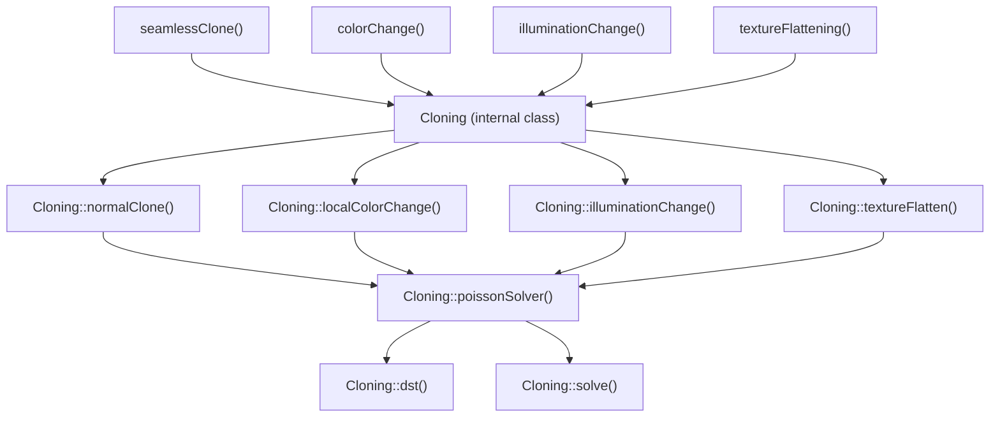

# Photo and Computational Photography

Relevant source files

-   [modules/flann/include/opencv2/flann/flann.hpp](https://github.com/opencv/opencv/blob/91c78f50/modules/flann/include/opencv2/flann/flann.hpp)
-   [modules/photo/include/opencv2/photo.hpp](https://github.com/opencv/opencv/blob/91c78f50/modules/photo/include/opencv2/photo.hpp)
-   [modules/photo/include/opencv2/photo/photo.hpp](https://github.com/opencv/opencv/blob/91c78f50/modules/photo/include/opencv2/photo/photo.hpp)
-   [modules/photo/perf/opencl/perf\_denoising.cpp](https://github.com/opencv/opencv/blob/91c78f50/modules/photo/perf/opencl/perf_denoising.cpp)
-   [modules/photo/src/align.cpp](https://github.com/opencv/opencv/blob/91c78f50/modules/photo/src/align.cpp)
-   [modules/photo/src/arrays.hpp](https://github.com/opencv/opencv/blob/91c78f50/modules/photo/src/arrays.hpp)
-   [modules/photo/src/calibrate.cpp](https://github.com/opencv/opencv/blob/91c78f50/modules/photo/src/calibrate.cpp)
-   [modules/photo/src/contrast\_preserve.cpp](https://github.com/opencv/opencv/blob/91c78f50/modules/photo/src/contrast_preserve.cpp)
-   [modules/photo/src/contrast\_preserve.hpp](https://github.com/opencv/opencv/blob/91c78f50/modules/photo/src/contrast_preserve.hpp)
-   [modules/photo/src/denoising.cpp](https://github.com/opencv/opencv/blob/91c78f50/modules/photo/src/denoising.cpp)
-   [modules/photo/src/fast\_nlmeans\_denoising\_invoker.hpp](https://github.com/opencv/opencv/blob/91c78f50/modules/photo/src/fast_nlmeans_denoising_invoker.hpp)
-   [modules/photo/src/fast\_nlmeans\_denoising\_invoker\_commons.hpp](https://github.com/opencv/opencv/blob/91c78f50/modules/photo/src/fast_nlmeans_denoising_invoker_commons.hpp)
-   [modules/photo/src/fast\_nlmeans\_denoising\_opencl.hpp](https://github.com/opencv/opencv/blob/91c78f50/modules/photo/src/fast_nlmeans_denoising_opencl.hpp)
-   [modules/photo/src/fast\_nlmeans\_multi\_denoising\_invoker.hpp](https://github.com/opencv/opencv/blob/91c78f50/modules/photo/src/fast_nlmeans_multi_denoising_invoker.hpp)
-   [modules/photo/src/hdr\_common.cpp](https://github.com/opencv/opencv/blob/91c78f50/modules/photo/src/hdr_common.cpp)
-   [modules/photo/src/hdr\_common.hpp](https://github.com/opencv/opencv/blob/91c78f50/modules/photo/src/hdr_common.hpp)
-   [modules/photo/src/merge.cpp](https://github.com/opencv/opencv/blob/91c78f50/modules/photo/src/merge.cpp)
-   [modules/photo/src/npr.cpp](https://github.com/opencv/opencv/blob/91c78f50/modules/photo/src/npr.cpp)
-   [modules/photo/src/npr.hpp](https://github.com/opencv/opencv/blob/91c78f50/modules/photo/src/npr.hpp)
-   [modules/photo/src/opencl/nlmeans.cl](https://github.com/opencv/opencv/blob/91c78f50/modules/photo/src/opencl/nlmeans.cl)
-   [modules/photo/src/precomp.hpp](https://github.com/opencv/opencv/blob/91c78f50/modules/photo/src/precomp.hpp)
-   [modules/photo/src/seamless\_cloning.cpp](https://github.com/opencv/opencv/blob/91c78f50/modules/photo/src/seamless_cloning.cpp)
-   [modules/photo/src/seamless\_cloning.hpp](https://github.com/opencv/opencv/blob/91c78f50/modules/photo/src/seamless_cloning.hpp)
-   [modules/photo/src/seamless\_cloning\_impl.cpp](https://github.com/opencv/opencv/blob/91c78f50/modules/photo/src/seamless_cloning_impl.cpp)
-   [modules/photo/src/tonemap.cpp](https://github.com/opencv/opencv/blob/91c78f50/modules/photo/src/tonemap.cpp)
-   [modules/photo/test/ocl/test\_denoising.cpp](https://github.com/opencv/opencv/blob/91c78f50/modules/photo/test/ocl/test_denoising.cpp)
-   [modules/photo/test/test\_cloning.cpp](https://github.com/opencv/opencv/blob/91c78f50/modules/photo/test/test_cloning.cpp)
-   [modules/photo/test/test\_decolor.cpp](https://github.com/opencv/opencv/blob/91c78f50/modules/photo/test/test_decolor.cpp)
-   [modules/photo/test/test\_denoising.cpp](https://github.com/opencv/opencv/blob/91c78f50/modules/photo/test/test_denoising.cpp)
-   [modules/photo/test/test\_hdr.cpp](https://github.com/opencv/opencv/blob/91c78f50/modules/photo/test/test_hdr.cpp)
-   [modules/photo/test/test\_npr.cpp](https://github.com/opencv/opencv/blob/91c78f50/modules/photo/test/test_npr.cpp)
-   [modules/video/include/opencv2/video/video.hpp](https://github.com/opencv/opencv/blob/91c78f50/modules/video/include/opencv2/video/video.hpp)
-   [samples/cpp/cloning\_demo.cpp](https://github.com/opencv/opencv/blob/91c78f50/samples/cpp/cloning_demo.cpp)
-   [samples/cpp/cloning\_gui.cpp](https://github.com/opencv/opencv/blob/91c78f50/samples/cpp/cloning_gui.cpp)
-   [samples/cpp/convexhull.cpp](https://github.com/opencv/opencv/blob/91c78f50/samples/cpp/convexhull.cpp)
-   [samples/cpp/create\_mask.cpp](https://github.com/opencv/opencv/blob/91c78f50/samples/cpp/create_mask.cpp)
-   [samples/cpp/intersectExample.cpp](https://github.com/opencv/opencv/blob/91c78f50/samples/cpp/intersectExample.cpp)
-   [samples/cpp/npr\_demo.cpp](https://github.com/opencv/opencv/blob/91c78f50/samples/cpp/npr_demo.cpp)
-   [samples/cpp/squares.cpp](https://github.com/opencv/opencv/blob/91c78f50/samples/cpp/squares.cpp)
-   [samples/cpp/tutorial\_code/photo/decolorization/decolor.cpp](https://github.com/opencv/opencv/blob/91c78f50/samples/cpp/tutorial_code/photo/decolorization/decolor.cpp)
-   [samples/cpp/tutorial\_code/photo/non\_photorealistic\_rendering/npr\_demo.cpp](https://github.com/opencv/opencv/blob/91c78f50/samples/cpp/tutorial_code/photo/non_photorealistic_rendering/npr_demo.cpp)
-   [samples/cpp/tutorial\_code/photo/seamless\_cloning/cloning\_demo.cpp](https://github.com/opencv/opencv/blob/91c78f50/samples/cpp/tutorial_code/photo/seamless_cloning/cloning_demo.cpp)
-   [samples/cpp/tutorial\_code/photo/seamless\_cloning/cloning\_gui.cpp](https://github.com/opencv/opencv/blob/91c78f50/samples/cpp/tutorial_code/photo/seamless_cloning/cloning_gui.cpp)

The `opencv_photo` module provides algorithms for image restoration and enhancement tasks that go beyond simple pixel-level filtering. It covers inpainting, non-local means denoising, HDR imaging (camera response calibration, exposure alignment, merge, and tonemapping), seamless cloning via Poisson solvers, contrast-preserving decolorization, and non-photorealistic rendering.

This page covers the `modules/photo/` directory. For general image filtering and color operations see [Image Processing (imgproc)](/opencv/opencv/4-image-processing-(imgproc)). For video-oriented temporal processing see [Video Analysis](/opencv/opencv/16-video-analysis).

---

## Module Structure

All public symbols are declared in [modules/photo/include/opencv2/photo.hpp](https://github.com/opencv/opencv/blob/91c78f50/modules/photo/include/opencv2/photo.hpp) organized into six doxygen groups:

| Doxygen Group | Description | Key Symbols |
| --- | --- | --- |
| `photo_inpaint` | Image region reconstruction | `inpaint` |
| `photo_denoise` | Non-local means denoising | `fastNlMeansDenoising`, `fastNlMeansDenoisingColored`, `denoise_TVL1` |
| `photo_hdr` | HDR pipeline | `Tonemap`, `AlignMTB`, `CalibrateCRF`, `MergeExposures` |
| `photo_decolor` | Color-to-grayscale with contrast preservation | `decolor` |
| `photo_clone` | Poisson-based seamless cloning | `seamlessClone`, `colorChange`, `illuminationChange`, `textureFlattening` |
| `photo_render` | Non-photorealistic rendering | `edgePreservingFilter`, `detailEnhance`, `pencilSketch`, `stylization` |

**Module dependency diagram:**


Sources: [modules/photo/include/opencv2/photo.hpp43-82](https://github.com/opencv/opencv/blob/91c78f50/modules/photo/include/opencv2/photo.hpp#L43-L82)

---

## Inpainting

`inpaint` reconstructs a masked region from its boundary neighborhood. Two methods are available, selected by the `flags` argument:

| Flag | Value | Algorithm |
| --- | --- | --- |
| `INPAINT_NS` | 0 | Navier-Stokes based |
| `INPAINT_TELEA` | 1 | Fast marching method (Telea 2004) |

**Signature:**

```
void inpaint(InputArray src, InputArray inpaintMask, OutputArray dst,
             double inpaintRadius, int flags)
```
-   `src`: 8-bit, 16-bit unsigned, or 32-bit float; 1-channel or 8-bit 3-channel.
-   `inpaintMask`: 8-bit 1-channel; non-zero pixels mark the area to reconstruct.
-   `inpaintRadius`: Radius of the neighborhood considered per inpainted point.

Sources: [modules/photo/include/opencv2/photo.hpp92-121](https://github.com/opencv/opencv/blob/91c78f50/modules/photo/include/opencv2/photo.hpp#L92-L121)

---

## Denoising

### Non-Local Means (NLM) Denoising

The NLM algorithm assigns each pixel a value that is a weighted average of similar patches found within a search window. Patch similarity is measured either by squared L2 distance (`NORM_L2`) or L1 distance (`NORM_L1`).

**Class/function map:**


Sources: [modules/photo/src/denoising.cpp](https://github.com/opencv/opencv/blob/91c78f50/modules/photo/src/denoising.cpp) [modules/photo/src/fast\_nlmeans\_denoising\_invoker.hpp](https://github.com/opencv/opencv/blob/91c78f50/modules/photo/src/fast_nlmeans_denoising_invoker.hpp) [modules/photo/src/fast\_nlmeans\_multi\_denoising\_invoker.hpp](https://github.com/opencv/opencv/blob/91c78f50/modules/photo/src/fast_nlmeans_multi_denoising_invoker.hpp) [modules/photo/src/fast\_nlmeans\_denoising\_opencl.hpp](https://github.com/opencv/opencv/blob/91c78f50/modules/photo/src/fast_nlmeans_denoising_opencl.hpp)

#### Single-Image Denoising

```
void fastNlMeansDenoising(InputArray src, OutputArray dst, float h = 3,
                           int templateWindowSize = 7, int searchWindowSize = 21)
```
| Parameter | Role |
| --- | --- |
| `h` | Filter strength. Larger values remove more noise but also blur details. |
| `templateWindowSize` | Patch size for similarity comparison. Must be odd; default 7. |
| `searchWindowSize` | Search window size. Must be odd; default 21. Affects runtime linearly. |

An overload accepts `const std::vector<float>& h` for per-channel strength control with a `normType` parameter (`NORM_L2` or `NORM_L1`).

#### Colored Image Denoising

`fastNlMeansDenoisingColored` converts the input to CIELAB, applies `fastNlMeansDenoising` separately to the L channel (using `h`) and the AB channels (using `hColor`), then converts back. The OpenCL path (`ocl_fastNlMeansDenoisingColored`) follows the same structure using `UMat`.

Sources: [modules/photo/src/denoising.cpp168-208](https://github.com/opencv/opencv/blob/91c78f50/modules/photo/src/denoising.cpp#L168-L208) [modules/photo/src/fast\_nlmeans\_denoising\_opencl.hpp182-212](https://github.com/opencv/opencv/blob/91c78f50/modules/photo/src/fast_nlmeans_denoising_opencl.hpp#L182-L212)

#### Temporal (Multi-Image) Denoising

`fastNlMeansDenoisingMulti` and `fastNlMeansDenoisingColoredMulti` operate on a sequence of frames. A `temporalWindowSize` parameter controls how many surrounding frames contribute to the denoised result. The invoker is `FastNlMeansMultiDenoisingInvoker`.

#### Implementation Details

The CPU invoker, `FastNlMeansDenoisingInvoker`, extends `ParallelLoopBody` and dispatches rows via `parallel_for_`. Patch distances are accumulated using sliding-window column sums to avoid redundant computation. A precomputed look-up table (`almost_dist2weight_`) maps discretized distances to integer-quantized weights, replacing floating-point exponential evaluations at runtime.

Distance metrics are policy classes:

-   `DistSquared` — L2 squared distance; used with `NORM_L2`.
-   `DistAbs` — L1 absolute distance; used with `NORM_L1`.

The OpenCL kernel is in [modules/photo/src/opencl/nlmeans.cl](https://github.com/opencv/opencv/blob/91c78f50/modules/photo/src/opencl/nlmeans.cl) and is compiled at runtime via `ocl::Kernel`.

Sources: [modules/photo/src/fast\_nlmeans\_denoising\_invoker.hpp53-146](https://github.com/opencv/opencv/blob/91c78f50/modules/photo/src/fast_nlmeans_denoising_invoker.hpp#L53-L146) [modules/photo/src/fast\_nlmeans\_denoising\_invoker\_commons.hpp92-314](https://github.com/opencv/opencv/blob/91c78f50/modules/photo/src/fast_nlmeans_denoising_invoker_commons.hpp#L92-L314)

### Total Variation (TV-L1) Denoising

```
void denoise_TVL1(const std::vector<Mat>& observations, Mat& result,
                  double lambda = 1.0, int niters = 30)
```
Implements a primal-dual variational solver that minimizes:

```
‖∇x‖ + λ Σᵢ ‖x - fᵢ‖
```
`lambda` trades off smoothness versus fidelity to the noisy observations. `niters` controls convergence iterations.

Sources: [modules/photo/include/opencv2/photo.hpp287-324](https://github.com/opencv/opencv/blob/91c78f50/modules/photo/include/opencv2/photo.hpp#L287-L324)

---

## HDR Imaging

The HDR pipeline proceeds in three stages: (optionally) align exposure brackets, calibrate the camera response function (CRF), merge into a linear HDR image, then tonemap to 8-bit display range.

**HDR pipeline flow:**


Sources: [modules/photo/include/opencv2/photo.hpp328-688](https://github.com/opencv/opencv/blob/91c78f50/modules/photo/include/opencv2/photo.hpp#L328-L688)

### Exposure Alignment — `AlignMTB`

`AlignMTB` (Median Threshold Bitmap) converts each image to a binary bitmap by thresholding at the median luminance value, then finds the integer pixel shift that maximizes XOR agreement between bitmaps. The search is hierarchical over `max_bits` pyramid levels (default 6, allowing up to 63-pixel shift).

Key methods on `AlignMTB`:

-   `computeBitmaps(img, tb, eb)` — produces threshold bitmap and exclusion bitmap.
-   `calculateShift(img0, img1)` — returns the pixel offset.
-   `shiftMat(src, dst, shift)` — applies integer shift, filling new regions with zeros.
-   `process(src, dst)` — convenience overload requiring no exposure times.

Sources: [modules/photo/include/opencv2/photo.hpp473-526](https://github.com/opencv/opencv/blob/91c78f50/modules/photo/include/opencv2/photo.hpp#L473-L526) [modules/photo/src/align.cpp](https://github.com/opencv/opencv/blob/91c78f50/modules/photo/src/align.cpp)

### Camera Response Calibration

The abstract base `CalibrateCRF` exposes `process(src, dst, times)`, which recovers a 256×1 (or 65536×1 for 16-bit) inverse CRF per channel.

| Class | Algorithm | Key Parameters |
| --- | --- | --- |
| `CalibrateDebevec` | Minimizes a linear system with a smoothness term (Debevec & Malik 1997) | `samples`, `lambda`, `random` |
| `CalibrateRobertson` | Iterative Gauss-Seidel (Robertson et al. 1999) | `max_iter`, `threshold` |

Factory functions: `createCalibrateDebevec()`, `createCalibrateRobertson()`.

Sources: [modules/photo/include/opencv2/photo.hpp528-593](https://github.com/opencv/opencv/blob/91c78f50/modules/photo/include/opencv2/photo.hpp#L528-L593) [modules/photo/src/calibrate.cpp](https://github.com/opencv/opencv/blob/91c78f50/modules/photo/src/calibrate.cpp)

### Exposure Merging

The abstract base `MergeExposures` exposes `process(src, dst, times, response)`.

| Class | Algorithm | Notes |
| --- | --- | --- |
| `MergeDebevec` | Weighted average in log-radiance domain using CRF (Debevec 1997) | Requires response; has short overload without response |
| `MergeRobertson` | Weighted average (Robertson 1999) | Has short overload |
| `MergeMertens` | Exposure fusion using Laplacian pyramids (Mertens 2007) | No CRF needed; output does not require tonemapping |

`MergeMertens` weights pixels by three quality measures: contrast, saturation, and well-exposedness. These are controlled by `contrastWeight`, `saturationWeight`, `exposureWeight`.

Factory functions: `createMergeDebevec()`, `createMergeRobertson()`, `createMergeMertens()`.

Sources: [modules/photo/include/opencv2/photo.hpp595-686](https://github.com/opencv/opencv/blob/91c78f50/modules/photo/include/opencv2/photo.hpp#L595-L686) [modules/photo/src/merge.cpp](https://github.com/opencv/opencv/blob/91c78f50/modules/photo/src/merge.cpp) [modules/photo/src/hdr\_common.cpp](https://github.com/opencv/opencv/blob/91c78f50/modules/photo/src/hdr_common.cpp)

### Tonemapping

All tonemap operators extend the abstract class `Tonemap` (which itself extends `Algorithm`) and implement:

```
virtual void process(InputArray src, OutputArray dst) = 0;
```
Input is `CV_32FC3`; output is `CV_32FC3` with values in `[0, 1]`.


| Class | Algorithm | Key Parameters |
| --- | --- | --- |
| `TonemapImpl` | Linear rescale + gamma | `gamma` |
| `TonemapDrago` | Adaptive logarithmic (Drago 2003) | `gamma`, `saturation`, `bias` (0.7–0.9) |
| `TonemapReinhard` | Human visual system model (Reinhard 2005) | `gamma`, `intensity`, `lightAdaptation`, `colorAdaptation` |
| `TonemapMantiuk` | Gradient-domain contrast scaling (Mantiuk 2006) | `gamma`, `scale` (0.6–0.9), `saturation` |

All four implementations in [modules/photo/src/tonemap.cpp](https://github.com/opencv/opencv/blob/91c78f50/modules/photo/src/tonemap.cpp) support `write`/`read` via `FileStorage` for serialization.

Sources: [modules/photo/include/opencv2/photo.hpp333-446](https://github.com/opencv/opencv/blob/91c78f50/modules/photo/include/opencv2/photo.hpp#L333-L446) [modules/photo/src/tonemap.cpp](https://github.com/opencv/opencv/blob/91c78f50/modules/photo/src/tonemap.cpp)

---

## Seamless Cloning

Seamless cloning composites a source region into a destination image by solving a Poisson equation, which smoothly interpolates the gradient field of the source through the destination boundary. The implementation uses a 2D Discrete Sine Transform (DST) as a fast Poisson solver.

**Seamless cloning internals:**


Sources: [modules/photo/src/seamless\_cloning.hpp](https://github.com/opencv/opencv/blob/91c78f50/modules/photo/src/seamless_cloning.hpp) [modules/photo/src/seamless\_cloning.cpp](https://github.com/opencv/opencv/blob/91c78f50/modules/photo/src/seamless_cloning.cpp) [modules/photo/src/seamless\_cloning\_impl.cpp](https://github.com/opencv/opencv/blob/91c78f50/modules/photo/src/seamless_cloning_impl.cpp)

### Public Functions

```
void seamlessClone(InputArray src, InputArray dst, InputArray mask,
                   Point p, OutputArray blend, int flags)
void colorChange(InputArray src, InputArray mask, OutputArray dst,
                 float red_mul, float green_mul, float blue_mul)
void illuminationChange(InputArray src, InputArray mask, OutputArray dst,
                        float alpha, float beta)
void textureFlattening(InputArray src, InputArray mask, OutputArray dst,
                       float low_threshold, float high_threshold, int kernel_size)
```
### Clone Modes (`SeamlessCloneFlags`)

| Flag | Value | Behavior |
| --- | --- | --- |
| `NORMAL_CLONE` | 1 | Source gradient field imported as-is |
| `MIXED_CLONE` | 2 | Pixel-wise max of source and destination gradient magnitudes |
| `MONOCHROME_TRANSFER` | 3 | Source gradient derived from grayscale version only |
| `NORMAL_CLONE_WIDE` | 9 | Like `NORMAL_CLONE` but ROI calculation uses full mask extent |
| `MIXED_CLONE_WIDE` | 10 | Like `MIXED_CLONE` but wider ROI |
| `MONOCHROME_TRANSFER_WIDE` | 11 | Like `MONOCHROME_TRANSFER` but wider ROI |

### `Cloning` Class

`Cloning` is an internal (non-public) class declared in [modules/photo/src/seamless\_cloning.hpp53-88](https://github.com/opencv/opencv/blob/91c78f50/modules/photo/src/seamless_cloning.hpp#L53-L88) Its key responsibilities:

-   `computeDerivatives` — computes gradient fields (X and Y) for destination and source patch via `filter2D` with a simple finite-difference kernel.
-   `poissonSolver(img, laplacianX, laplacianY, result)` — combines gradients, extracts boundary conditions, then calls `solve`.
-   `dst(src, dest, invert)` — implements the 2D DST using `dft` on a symmetrically extended signal.
-   `solve(img, mod_diff, result)` — divides in the DST domain using precomputed cosine filter coefficients (`filter_X`, `filter_Y`), then applies inverse DST.

Sources: [modules/photo/src/seamless\_cloning\_impl.cpp98-203](https://github.com/opencv/opencv/blob/91c78f50/modules/photo/src/seamless_cloning_impl.cpp#L98-L203)

---

## Contrast-Preserving Decolorization

```
void decolor(InputArray src, OutputArray grayscale, OutputArray color_boost)
```
Converts a color image to grayscale while maximizing preservation of perceptual contrast. The algorithm fits a polynomial combination of the RGB channels by iteratively minimizing an energy that penalizes loss of color gradient ordering.

The internal class `Decolor` (in [modules/photo/src/contrast\_preserve.hpp50-75](https://github.com/opencv/opencv/blob/91c78f50/modules/photo/src/contrast_preserve.hpp#L50-L75)) manages:

-   `grad_system` — builds a polynomial gradient basis (`polyGrad`) and a color gradient vector (`Cg`) from the CIELAB representation.
-   `weak_order` — estimates soft ordering constraints (`alf`) between pixels.
-   `wei_update_matrix` / `wei_inti` — initializes and iteratively updates polynomial weights.
-   `grayImContruct` — assembles the grayscale image from the final weight vector.

The `color_boost` output replaces the L channel of the LAB image with the decolored grayscale, producing a contrast-enhanced color version.

Sources: [modules/photo/src/contrast\_preserve.hpp](https://github.com/opencv/opencv/blob/91c78f50/modules/photo/src/contrast_preserve.hpp) [modules/photo/src/contrast\_preserve.cpp](https://github.com/opencv/opencv/blob/91c78f50/modules/photo/src/contrast_preserve.cpp)

---

## Non-Photorealistic Rendering

Four functions apply edge-preserving stylization effects, all declared in [modules/photo/include/opencv2/photo.hpp](https://github.com/opencv/opencv/blob/91c78f50/modules/photo/include/opencv2/photo.hpp) and implemented in [modules/photo/src/npr.cpp](https://github.com/opencv/opencv/blob/91c78f50/modules/photo/src/npr.cpp):

| Function | Effect |
| --- | --- |
| `edgePreservingFilter(src, dst, flags, sigma_s, sigma_r)` | Smooths while preserving edges; `flags` selects `RECURS_FILTER` (1) or `NORMCONV_FILTER` (2) |
| `detailEnhance(src, dst, sigma_s, sigma_r)` | Amplifies fine details |
| `pencilSketch(src, dst1, dst2, sigma_s, sigma_r, shade_factor)` | Gray and color pencil-sketch effect |
| `stylization(src, dst, sigma_s, sigma_r)` | Watercolor/cartoon style |

`sigma_s` controls spatial range (1–200); `sigma_r` controls color range (0–1). These functions use a domain-transform recursive filter internally (see [modules/photo/src/npr.hpp](https://github.com/opencv/opencv/blob/91c78f50/modules/photo/src/npr.hpp)).

Sources: [modules/photo/include/opencv2/photo.hpp833-960](https://github.com/opencv/opencv/blob/91c78f50/modules/photo/include/opencv2/photo.hpp#L833-L960) [modules/photo/src/npr.hpp](https://github.com/opencv/opencv/blob/91c78f50/modules/photo/src/npr.hpp) [modules/photo/src/npr.cpp](https://github.com/opencv/opencv/blob/91c78f50/modules/photo/src/npr.cpp)

---

## OpenCL Acceleration

The denoising path has explicit OpenCL acceleration. When the input or output is a `UMat`, `fastNlMeansDenoising` and `fastNlMeansDenoisingColored` dispatch to `ocl_fastNlMeansDenoising` and `ocl_fastNlMeansDenoisingColored` respectively, guarded by `CV_OCL_RUN`.

The OpenCL kernel in [modules/photo/src/opencl/nlmeans.cl](https://github.com/opencv/opencv/blob/91c78f50/modules/photo/src/opencl/nlmeans.cl) implements the same sliding-window patch distance accumulation as the CPU invoker, compiled with build-time defines for template size, search size, pixel type, and normalization mode. The kernel uses a shared-memory block tiling strategy with `BLOCK_ROWS=32`, `BLOCK_COLS=32`, and a configurable CTA size (64 for Intel devices, 256 otherwise).

Sources: [modules/photo/src/fast\_nlmeans\_denoising\_opencl.hpp79-180](https://github.com/opencv/opencv/blob/91c78f50/modules/photo/src/fast_nlmeans_denoising_opencl.hpp#L79-L180) [modules/photo/src/opencl/nlmeans.cl](https://github.com/opencv/opencv/blob/91c78f50/modules/photo/src/opencl/nlmeans.cl) [modules/photo/src/denoising.cpp123-126](https://github.com/opencv/opencv/blob/91c78f50/modules/photo/src/denoising.cpp#L123-L126)

---

## Testing

Tests are organized by subsystem:

| Test File | Coverage |
| --- | --- |
| [modules/photo/test/test\_hdr.cpp](https://github.com/opencv/opencv/blob/91c78f50/modules/photo/test/test_hdr.cpp) | Tonemap regression, AlignMTB shift accuracy, MergeMertens/Debevec/Robertson regression, CalibrateDebevec/Robertson regression |
| [modules/photo/test/test\_denoising.cpp](https://github.com/opencv/opencv/blob/91c78f50/modules/photo/test/test_denoising.cpp) | NLM denoising correctness against reference images |
| [modules/photo/test/ocl/test\_denoising.cpp](https://github.com/opencv/opencv/blob/91c78f50/modules/photo/test/ocl/test_denoising.cpp) | OCL vs CPU consistency for `fastNlMeansDenoising` and `fastNlMeansDenoisingColored` across 1–4 channel inputs |
| [modules/photo/test/test\_cloning.cpp](https://github.com/opencv/opencv/blob/91c78f50/modules/photo/test/test_cloning.cpp) | `seamlessClone` with all modes, `colorChange`, `illuminationChange`, `textureFlattening` regression |
| [modules/photo/test/test\_decolor.cpp](https://github.com/opencv/opencv/blob/91c78f50/modules/photo/test/test_decolor.cpp) | `decolor` output dimensions and type |
| [modules/photo/test/test\_npr.cpp](https://github.com/opencv/opencv/blob/91c78f50/modules/photo/test/test_npr.cpp) | NPR function smoke tests |
