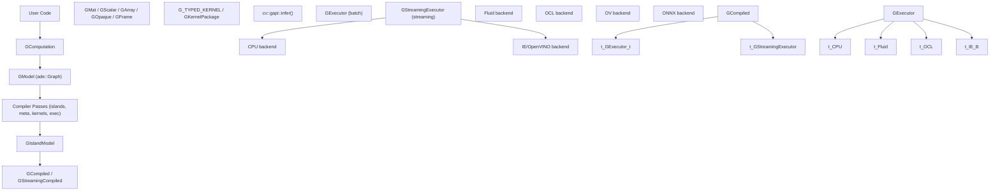
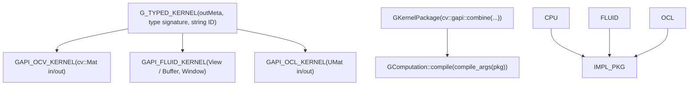
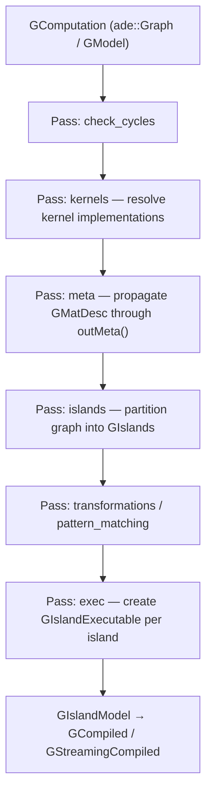
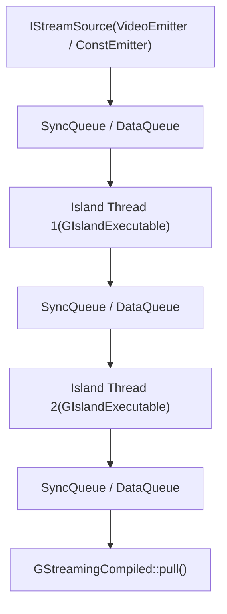
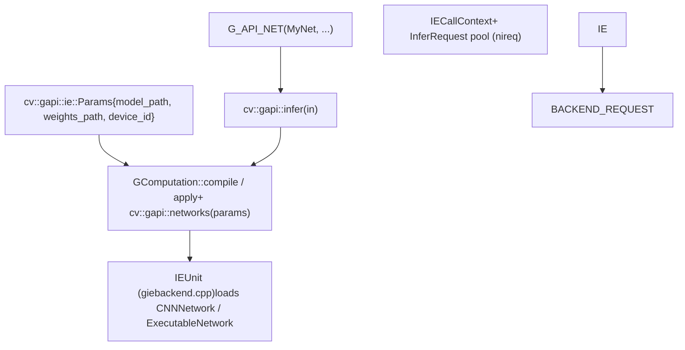

# Graph API (GAPI)

Relevant source files

-   [modules/gapi/CMakeLists.txt](https://github.com/opencv/opencv/blob/91c78f50/modules/gapi/CMakeLists.txt)
-   [modules/gapi/cmake/init.cmake](https://github.com/opencv/opencv/blob/91c78f50/modules/gapi/cmake/init.cmake)
-   [modules/gapi/cmake/standalone.cmake](https://github.com/opencv/opencv/blob/91c78f50/modules/gapi/cmake/standalone.cmake)
-   [modules/gapi/include/opencv2/gapi/core.hpp](https://github.com/opencv/opencv/blob/91c78f50/modules/gapi/include/opencv2/gapi/core.hpp)
-   [modules/gapi/include/opencv2/gapi/cpu/gcpukernel.hpp](https://github.com/opencv/opencv/blob/91c78f50/modules/gapi/include/opencv2/gapi/cpu/gcpukernel.hpp)
-   [modules/gapi/include/opencv2/gapi/cpu/ot.hpp](https://github.com/opencv/opencv/blob/91c78f50/modules/gapi/include/opencv2/gapi/cpu/ot.hpp)
-   [modules/gapi/include/opencv2/gapi/garg.hpp](https://github.com/opencv/opencv/blob/91c78f50/modules/gapi/include/opencv2/gapi/garg.hpp)
-   [modules/gapi/include/opencv2/gapi/garray.hpp](https://github.com/opencv/opencv/blob/91c78f50/modules/gapi/include/opencv2/gapi/garray.hpp)
-   [modules/gapi/include/opencv2/gapi/gcommon.hpp](https://github.com/opencv/opencv/blob/91c78f50/modules/gapi/include/opencv2/gapi/gcommon.hpp)
-   [modules/gapi/include/opencv2/gapi/gcompiled.hpp](https://github.com/opencv/opencv/blob/91c78f50/modules/gapi/include/opencv2/gapi/gcompiled.hpp)
-   [modules/gapi/include/opencv2/gapi/gcomputation.hpp](https://github.com/opencv/opencv/blob/91c78f50/modules/gapi/include/opencv2/gapi/gcomputation.hpp)
-   [modules/gapi/include/opencv2/gapi/gkernel.hpp](https://github.com/opencv/opencv/blob/91c78f50/modules/gapi/include/opencv2/gapi/gkernel.hpp)
-   [modules/gapi/include/opencv2/gapi/gmat.hpp](https://github.com/opencv/opencv/blob/91c78f50/modules/gapi/include/opencv2/gapi/gmat.hpp)
-   [modules/gapi/include/opencv2/gapi/gmetaarg.hpp](https://github.com/opencv/opencv/blob/91c78f50/modules/gapi/include/opencv2/gapi/gmetaarg.hpp)
-   [modules/gapi/include/opencv2/gapi/gopaque.hpp](https://github.com/opencv/opencv/blob/91c78f50/modules/gapi/include/opencv2/gapi/gopaque.hpp)
-   [modules/gapi/include/opencv2/gapi/gproto.hpp](https://github.com/opencv/opencv/blob/91c78f50/modules/gapi/include/opencv2/gapi/gproto.hpp)
-   [modules/gapi/include/opencv2/gapi/gpu/core.hpp](https://github.com/opencv/opencv/blob/91c78f50/modules/gapi/include/opencv2/gapi/gpu/core.hpp)
-   [modules/gapi/include/opencv2/gapi/gpu/imgproc.hpp](https://github.com/opencv/opencv/blob/91c78f50/modules/gapi/include/opencv2/gapi/gpu/imgproc.hpp)
-   [modules/gapi/include/opencv2/gapi/gscalar.hpp](https://github.com/opencv/opencv/blob/91c78f50/modules/gapi/include/opencv2/gapi/gscalar.hpp)
-   [modules/gapi/include/opencv2/gapi/gstreaming.hpp](https://github.com/opencv/opencv/blob/91c78f50/modules/gapi/include/opencv2/gapi/gstreaming.hpp)
-   [modules/gapi/include/opencv2/gapi/gtype\_traits.hpp](https://github.com/opencv/opencv/blob/91c78f50/modules/gapi/include/opencv2/gapi/gtype_traits.hpp)
-   [modules/gapi/include/opencv2/gapi/infer.hpp](https://github.com/opencv/opencv/blob/91c78f50/modules/gapi/include/opencv2/gapi/infer.hpp)
-   [modules/gapi/include/opencv2/gapi/infer/bindings\_ie.hpp](https://github.com/opencv/opencv/blob/91c78f50/modules/gapi/include/opencv2/gapi/infer/bindings_ie.hpp)
-   [modules/gapi/include/opencv2/gapi/infer/ie.hpp](https://github.com/opencv/opencv/blob/91c78f50/modules/gapi/include/opencv2/gapi/infer/ie.hpp)
-   [modules/gapi/include/opencv2/gapi/infer/parsers.hpp](https://github.com/opencv/opencv/blob/91c78f50/modules/gapi/include/opencv2/gapi/infer/parsers.hpp)
-   [modules/gapi/include/opencv2/gapi/ocl/goclkernel.hpp](https://github.com/opencv/opencv/blob/91c78f50/modules/gapi/include/opencv2/gapi/ocl/goclkernel.hpp)
-   [modules/gapi/include/opencv2/gapi/ot.hpp](https://github.com/opencv/opencv/blob/91c78f50/modules/gapi/include/opencv2/gapi/ot.hpp)
-   [modules/gapi/include/opencv2/gapi/rmat.hpp](https://github.com/opencv/opencv/blob/91c78f50/modules/gapi/include/opencv2/gapi/rmat.hpp)
-   [modules/gapi/include/opencv2/gapi/s11n.hpp](https://github.com/opencv/opencv/blob/91c78f50/modules/gapi/include/opencv2/gapi/s11n.hpp)
-   [modules/gapi/include/opencv2/gapi/s11n/base.hpp](https://github.com/opencv/opencv/blob/91c78f50/modules/gapi/include/opencv2/gapi/s11n/base.hpp)
-   [modules/gapi/include/opencv2/gapi/streaming/desync.hpp](https://github.com/opencv/opencv/blob/91c78f50/modules/gapi/include/opencv2/gapi/streaming/desync.hpp)
-   [modules/gapi/include/opencv2/gapi/streaming/format.hpp](https://github.com/opencv/opencv/blob/91c78f50/modules/gapi/include/opencv2/gapi/streaming/format.hpp)
-   [modules/gapi/include/opencv2/gapi/streaming/meta.hpp](https://github.com/opencv/opencv/blob/91c78f50/modules/gapi/include/opencv2/gapi/streaming/meta.hpp)
-   [modules/gapi/include/opencv2/gapi/streaming/onevpl/accel\_types.hpp](https://github.com/opencv/opencv/blob/91c78f50/modules/gapi/include/opencv2/gapi/streaming/onevpl/accel_types.hpp)
-   [modules/gapi/include/opencv2/gapi/streaming/onevpl/cfg\_params.hpp](https://github.com/opencv/opencv/blob/91c78f50/modules/gapi/include/opencv2/gapi/streaming/onevpl/cfg_params.hpp)
-   [modules/gapi/include/opencv2/gapi/streaming/onevpl/data\_provider\_interface.hpp](https://github.com/opencv/opencv/blob/91c78f50/modules/gapi/include/opencv2/gapi/streaming/onevpl/data_provider_interface.hpp)
-   [modules/gapi/include/opencv2/gapi/streaming/onevpl/device\_selector\_interface.hpp](https://github.com/opencv/opencv/blob/91c78f50/modules/gapi/include/opencv2/gapi/streaming/onevpl/device_selector_interface.hpp)
-   [modules/gapi/include/opencv2/gapi/streaming/onevpl/source.hpp](https://github.com/opencv/opencv/blob/91c78f50/modules/gapi/include/opencv2/gapi/streaming/onevpl/source.hpp)
-   [modules/gapi/misc/python/package/gapi/\_\_init\_\_.py](https://github.com/opencv/opencv/blob/91c78f50/modules/gapi/misc/python/package/gapi/__init__.py)
-   [modules/gapi/misc/python/pyopencv\_gapi.hpp](https://github.com/opencv/opencv/blob/91c78f50/modules/gapi/misc/python/pyopencv_gapi.hpp)
-   [modules/gapi/misc/python/python\_bridge.hpp](https://github.com/opencv/opencv/blob/91c78f50/modules/gapi/misc/python/python_bridge.hpp)
-   [modules/gapi/misc/python/shadow\_gapi.hpp](https://github.com/opencv/opencv/blob/91c78f50/modules/gapi/misc/python/shadow_gapi.hpp)
-   [modules/gapi/misc/python/test/test\_gapi\_core.py](https://github.com/opencv/opencv/blob/91c78f50/modules/gapi/misc/python/test/test_gapi_core.py)
-   [modules/gapi/misc/python/test/test\_gapi\_ot.py](https://github.com/opencv/opencv/blob/91c78f50/modules/gapi/misc/python/test/test_gapi_ot.py)
-   [modules/gapi/misc/python/test/test\_gapi\_sample\_pipelines.py](https://github.com/opencv/opencv/blob/91c78f50/modules/gapi/misc/python/test/test_gapi_sample_pipelines.py)
-   [modules/gapi/misc/python/test/test\_gapi\_streaming.py](https://github.com/opencv/opencv/blob/91c78f50/modules/gapi/misc/python/test/test_gapi_streaming.py)
-   [modules/gapi/misc/python/test/test\_gapi\_types.py](https://github.com/opencv/opencv/blob/91c78f50/modules/gapi/misc/python/test/test_gapi_types.py)
-   [modules/gapi/perf/common/gapi\_core\_perf\_tests.hpp](https://github.com/opencv/opencv/blob/91c78f50/modules/gapi/perf/common/gapi_core_perf_tests.hpp)
-   [modules/gapi/perf/common/gapi\_core\_perf\_tests\_inl.hpp](https://github.com/opencv/opencv/blob/91c78f50/modules/gapi/perf/common/gapi_core_perf_tests_inl.hpp)
-   [modules/gapi/perf/cpu/gapi\_core\_perf\_tests\_cpu.cpp](https://github.com/opencv/opencv/blob/91c78f50/modules/gapi/perf/cpu/gapi_core_perf_tests_cpu.cpp)
-   [modules/gapi/perf/cpu/gapi\_core\_perf\_tests\_fluid.cpp](https://github.com/opencv/opencv/blob/91c78f50/modules/gapi/perf/cpu/gapi_core_perf_tests_fluid.cpp)
-   [modules/gapi/perf/gpu/gapi\_core\_perf\_tests\_gpu.cpp](https://github.com/opencv/opencv/blob/91c78f50/modules/gapi/perf/gpu/gapi_core_perf_tests_gpu.cpp)
-   [modules/gapi/perf/perf\_precomp.hpp](https://github.com/opencv/opencv/blob/91c78f50/modules/gapi/perf/perf_precomp.hpp)
-   [modules/gapi/src/api/gbackend.cpp](https://github.com/opencv/opencv/blob/91c78f50/modules/gapi/src/api/gbackend.cpp)
-   [modules/gapi/src/api/gbackend\_priv.hpp](https://github.com/opencv/opencv/blob/91c78f50/modules/gapi/src/api/gbackend_priv.hpp)
-   [modules/gapi/src/api/gcomputation.cpp](https://github.com/opencv/opencv/blob/91c78f50/modules/gapi/src/api/gcomputation.cpp)
-   [modules/gapi/src/api/ginfer.cpp](https://github.com/opencv/opencv/blob/91c78f50/modules/gapi/src/api/ginfer.cpp)
-   [modules/gapi/src/api/gmat.cpp](https://github.com/opencv/opencv/blob/91c78f50/modules/gapi/src/api/gmat.cpp)
-   [modules/gapi/src/api/gproto.cpp](https://github.com/opencv/opencv/blob/91c78f50/modules/gapi/src/api/gproto.cpp)
-   [modules/gapi/src/api/grunarg.cpp](https://github.com/opencv/opencv/blob/91c78f50/modules/gapi/src/api/grunarg.cpp)
-   [modules/gapi/src/api/kernels\_core.cpp](https://github.com/opencv/opencv/blob/91c78f50/modules/gapi/src/api/kernels_core.cpp)
-   [modules/gapi/src/api/kernels\_nnparsers.cpp](https://github.com/opencv/opencv/blob/91c78f50/modules/gapi/src/api/kernels_nnparsers.cpp)
-   [modules/gapi/src/api/kernels\_ot.cpp](https://github.com/opencv/opencv/blob/91c78f50/modules/gapi/src/api/kernels_ot.cpp)
-   [modules/gapi/src/api/kernels\_streaming.cpp](https://github.com/opencv/opencv/blob/91c78f50/modules/gapi/src/api/kernels_streaming.cpp)
-   [modules/gapi/src/api/rmat.cpp](https://github.com/opencv/opencv/blob/91c78f50/modules/gapi/src/api/rmat.cpp)
-   [modules/gapi/src/api/s11n.cpp](https://github.com/opencv/opencv/blob/91c78f50/modules/gapi/src/api/s11n.cpp)
-   [modules/gapi/src/backends/common/gbackend.hpp](https://github.com/opencv/opencv/blob/91c78f50/modules/gapi/src/backends/common/gbackend.hpp)
-   [modules/gapi/src/backends/common/gmetabackend.cpp](https://github.com/opencv/opencv/blob/91c78f50/modules/gapi/src/backends/common/gmetabackend.cpp)
-   [modules/gapi/src/backends/common/gmetabackend.hpp](https://github.com/opencv/opencv/blob/91c78f50/modules/gapi/src/backends/common/gmetabackend.hpp)
-   [modules/gapi/src/backends/common/serialization.cpp](https://github.com/opencv/opencv/blob/91c78f50/modules/gapi/src/backends/common/serialization.cpp)
-   [modules/gapi/src/backends/common/serialization.hpp](https://github.com/opencv/opencv/blob/91c78f50/modules/gapi/src/backends/common/serialization.hpp)
-   [modules/gapi/src/backends/cpu/gcpubackend.cpp](https://github.com/opencv/opencv/blob/91c78f50/modules/gapi/src/backends/cpu/gcpubackend.cpp)
-   [modules/gapi/src/backends/cpu/gcpubackend.hpp](https://github.com/opencv/opencv/blob/91c78f50/modules/gapi/src/backends/cpu/gcpubackend.hpp)
-   [modules/gapi/src/backends/cpu/gcpucore.cpp](https://github.com/opencv/opencv/blob/91c78f50/modules/gapi/src/backends/cpu/gcpucore.cpp)
-   [modules/gapi/src/backends/cpu/gcpuot.cpp](https://github.com/opencv/opencv/blob/91c78f50/modules/gapi/src/backends/cpu/gcpuot.cpp)
-   [modules/gapi/src/backends/cpu/gnnparsers.cpp](https://github.com/opencv/opencv/blob/91c78f50/modules/gapi/src/backends/cpu/gnnparsers.cpp)
-   [modules/gapi/src/backends/cpu/gnnparsers.hpp](https://github.com/opencv/opencv/blob/91c78f50/modules/gapi/src/backends/cpu/gnnparsers.hpp)
-   [modules/gapi/src/backends/fluid/gfluidcore.cpp](https://github.com/opencv/opencv/blob/91c78f50/modules/gapi/src/backends/fluid/gfluidcore.cpp)
-   [modules/gapi/src/backends/fluid/gfluidcore\_func.dispatch.cpp](https://github.com/opencv/opencv/blob/91c78f50/modules/gapi/src/backends/fluid/gfluidcore_func.dispatch.cpp)
-   [modules/gapi/src/backends/fluid/gfluidcore\_func.hpp](https://github.com/opencv/opencv/blob/91c78f50/modules/gapi/src/backends/fluid/gfluidcore_func.hpp)
-   [modules/gapi/src/backends/fluid/gfluidcore\_func.simd.hpp](https://github.com/opencv/opencv/blob/91c78f50/modules/gapi/src/backends/fluid/gfluidcore_func.simd.hpp)
-   [modules/gapi/src/backends/ie/bindings\_ie.cpp](https://github.com/opencv/opencv/blob/91c78f50/modules/gapi/src/backends/ie/bindings_ie.cpp)
-   [modules/gapi/src/backends/ie/giebackend.cpp](https://github.com/opencv/opencv/blob/91c78f50/modules/gapi/src/backends/ie/giebackend.cpp)
-   [modules/gapi/src/backends/ie/giebackend.hpp](https://github.com/opencv/opencv/blob/91c78f50/modules/gapi/src/backends/ie/giebackend.hpp)
-   [modules/gapi/src/backends/ie/giebackend/giewrapper.cpp](https://github.com/opencv/opencv/blob/91c78f50/modules/gapi/src/backends/ie/giebackend/giewrapper.cpp)
-   [modules/gapi/src/backends/ie/giebackend/giewrapper.hpp](https://github.com/opencv/opencv/blob/91c78f50/modules/gapi/src/backends/ie/giebackend/giewrapper.hpp)
-   [modules/gapi/src/backends/ie/util.hpp](https://github.com/opencv/opencv/blob/91c78f50/modules/gapi/src/backends/ie/util.hpp)
-   [modules/gapi/src/backends/ocl/goclbackend.cpp](https://github.com/opencv/opencv/blob/91c78f50/modules/gapi/src/backends/ocl/goclbackend.cpp)
-   [modules/gapi/src/backends/ocl/goclcore.cpp](https://github.com/opencv/opencv/blob/91c78f50/modules/gapi/src/backends/ocl/goclcore.cpp)
-   [modules/gapi/src/backends/plaidml/gplaidmlbackend.cpp](https://github.com/opencv/opencv/blob/91c78f50/modules/gapi/src/backends/plaidml/gplaidmlbackend.cpp)
-   [modules/gapi/src/backends/streaming/gstreamingbackend.cpp](https://github.com/opencv/opencv/blob/91c78f50/modules/gapi/src/backends/streaming/gstreamingbackend.cpp)
-   [modules/gapi/src/backends/streaming/gstreamingbackend.hpp](https://github.com/opencv/opencv/blob/91c78f50/modules/gapi/src/backends/streaming/gstreamingbackend.hpp)
-   [modules/gapi/src/backends/streaming/gstreamingkernel.hpp](https://github.com/opencv/opencv/blob/91c78f50/modules/gapi/src/backends/streaming/gstreamingkernel.hpp)
-   [modules/gapi/src/compiler/gcompiled.cpp](https://github.com/opencv/opencv/blob/91c78f50/modules/gapi/src/compiler/gcompiled.cpp)
-   [modules/gapi/src/compiler/gcompiled\_priv.hpp](https://github.com/opencv/opencv/blob/91c78f50/modules/gapi/src/compiler/gcompiled_priv.hpp)
-   [modules/gapi/src/compiler/gcompiler.cpp](https://github.com/opencv/opencv/blob/91c78f50/modules/gapi/src/compiler/gcompiler.cpp)
-   [modules/gapi/src/compiler/gislandmodel.cpp](https://github.com/opencv/opencv/blob/91c78f50/modules/gapi/src/compiler/gislandmodel.cpp)
-   [modules/gapi/src/compiler/gislandmodel.hpp](https://github.com/opencv/opencv/blob/91c78f50/modules/gapi/src/compiler/gislandmodel.hpp)
-   [modules/gapi/src/compiler/gstreaming.cpp](https://github.com/opencv/opencv/blob/91c78f50/modules/gapi/src/compiler/gstreaming.cpp)
-   [modules/gapi/src/compiler/gstreaming\_priv.hpp](https://github.com/opencv/opencv/blob/91c78f50/modules/gapi/src/compiler/gstreaming_priv.hpp)
-   [modules/gapi/src/compiler/passes/exec.cpp](https://github.com/opencv/opencv/blob/91c78f50/modules/gapi/src/compiler/passes/exec.cpp)
-   [modules/gapi/src/executor/gexecutor.cpp](https://github.com/opencv/opencv/blob/91c78f50/modules/gapi/src/executor/gexecutor.cpp)
-   [modules/gapi/src/executor/gexecutor.hpp](https://github.com/opencv/opencv/blob/91c78f50/modules/gapi/src/executor/gexecutor.hpp)
-   [modules/gapi/src/executor/gstreamingexecutor.cpp](https://github.com/opencv/opencv/blob/91c78f50/modules/gapi/src/executor/gstreamingexecutor.cpp)
-   [modules/gapi/src/executor/gstreamingexecutor.hpp](https://github.com/opencv/opencv/blob/91c78f50/modules/gapi/src/executor/gstreamingexecutor.hpp)
-   [modules/gapi/src/streaming/onevpl/accelerators/accel\_policy\_va\_api.cpp](https://github.com/opencv/opencv/blob/91c78f50/modules/gapi/src/streaming/onevpl/accelerators/accel_policy_va_api.cpp)
-   [modules/gapi/src/streaming/onevpl/accelerators/accel\_policy\_va\_api.hpp](https://github.com/opencv/opencv/blob/91c78f50/modules/gapi/src/streaming/onevpl/accelerators/accel_policy_va_api.hpp)
-   [modules/gapi/src/streaming/onevpl/accelerators/dx11\_alloc\_resource.cpp](https://github.com/opencv/opencv/blob/91c78f50/modules/gapi/src/streaming/onevpl/accelerators/dx11_alloc_resource.cpp)
-   [modules/gapi/src/streaming/onevpl/cfg\_param\_device\_selector.cpp](https://github.com/opencv/opencv/blob/91c78f50/modules/gapi/src/streaming/onevpl/cfg_param_device_selector.cpp)
-   [modules/gapi/src/streaming/onevpl/cfg\_param\_device\_selector.hpp](https://github.com/opencv/opencv/blob/91c78f50/modules/gapi/src/streaming/onevpl/cfg_param_device_selector.hpp)
-   [modules/gapi/src/streaming/onevpl/cfg\_params.cpp](https://github.com/opencv/opencv/blob/91c78f50/modules/gapi/src/streaming/onevpl/cfg_params.cpp)
-   [modules/gapi/src/streaming/onevpl/data\_provider\_interface\_exception.cpp](https://github.com/opencv/opencv/blob/91c78f50/modules/gapi/src/streaming/onevpl/data_provider_interface_exception.cpp)
-   [modules/gapi/src/streaming/onevpl/default.cpp](https://github.com/opencv/opencv/blob/91c78f50/modules/gapi/src/streaming/onevpl/default.cpp)
-   [modules/gapi/src/streaming/onevpl/device\_selector\_interface.cpp](https://github.com/opencv/opencv/blob/91c78f50/modules/gapi/src/streaming/onevpl/device_selector_interface.cpp)
-   [modules/gapi/src/streaming/onevpl/file\_data\_provider.cpp](https://github.com/opencv/opencv/blob/91c78f50/modules/gapi/src/streaming/onevpl/file_data_provider.cpp)
-   [modules/gapi/src/streaming/onevpl/file\_data\_provider.hpp](https://github.com/opencv/opencv/blob/91c78f50/modules/gapi/src/streaming/onevpl/file_data_provider.hpp)
-   [modules/gapi/src/streaming/onevpl/source.cpp](https://github.com/opencv/opencv/blob/91c78f50/modules/gapi/src/streaming/onevpl/source.cpp)
-   [modules/gapi/src/streaming/onevpl/source\_priv.cpp](https://github.com/opencv/opencv/blob/91c78f50/modules/gapi/src/streaming/onevpl/source_priv.cpp)
-   [modules/gapi/src/streaming/onevpl/source\_priv.hpp](https://github.com/opencv/opencv/blob/91c78f50/modules/gapi/src/streaming/onevpl/source_priv.hpp)
-   [modules/gapi/test/common/gapi\_core\_tests.hpp](https://github.com/opencv/opencv/blob/91c78f50/modules/gapi/test/common/gapi_core_tests.hpp)
-   [modules/gapi/test/common/gapi\_core\_tests\_inl.hpp](https://github.com/opencv/opencv/blob/91c78f50/modules/gapi/test/common/gapi_core_tests_inl.hpp)
-   [modules/gapi/test/common/gapi\_parsers\_tests\_common.hpp](https://github.com/opencv/opencv/blob/91c78f50/modules/gapi/test/common/gapi_parsers_tests_common.hpp)
-   [modules/gapi/test/common/gapi\_tests\_common.hpp](https://github.com/opencv/opencv/blob/91c78f50/modules/gapi/test/common/gapi_tests_common.hpp)
-   [modules/gapi/test/cpu/gapi\_core\_tests\_cpu.cpp](https://github.com/opencv/opencv/blob/91c78f50/modules/gapi/test/cpu/gapi_core_tests_cpu.cpp)
-   [modules/gapi/test/cpu/gapi\_core\_tests\_fluid.cpp](https://github.com/opencv/opencv/blob/91c78f50/modules/gapi/test/cpu/gapi_core_tests_fluid.cpp)
-   [modules/gapi/test/cpu/gapi\_ocv\_stateful\_kernel\_test\_utils.hpp](https://github.com/opencv/opencv/blob/91c78f50/modules/gapi/test/cpu/gapi_ocv_stateful_kernel_test_utils.hpp)
-   [modules/gapi/test/cpu/gapi\_ot\_tests\_cpu.cpp](https://github.com/opencv/opencv/blob/91c78f50/modules/gapi/test/cpu/gapi_ot_tests_cpu.cpp)
-   [modules/gapi/test/gapi\_array\_tests.cpp](https://github.com/opencv/opencv/blob/91c78f50/modules/gapi/test/gapi_array_tests.cpp)
-   [modules/gapi/test/gapi\_desc\_tests.cpp](https://github.com/opencv/opencv/blob/91c78f50/modules/gapi/test/gapi_desc_tests.cpp)
-   [modules/gapi/test/gapi\_gcomputation\_tests.cpp](https://github.com/opencv/opencv/blob/91c78f50/modules/gapi/test/gapi_gcomputation_tests.cpp)
-   [modules/gapi/test/gapi\_opaque\_tests.cpp](https://github.com/opencv/opencv/blob/91c78f50/modules/gapi/test/gapi_opaque_tests.cpp)
-   [modules/gapi/test/gapi\_sample\_pipelines.cpp](https://github.com/opencv/opencv/blob/91c78f50/modules/gapi/test/gapi_sample_pipelines.cpp)
-   [modules/gapi/test/gpu/gapi\_core\_tests\_gpu.cpp](https://github.com/opencv/opencv/blob/91c78f50/modules/gapi/test/gpu/gapi_core_tests_gpu.cpp)
-   [modules/gapi/test/infer/gapi\_infer\_ie\_test.cpp](https://github.com/opencv/opencv/blob/91c78f50/modules/gapi/test/infer/gapi_infer_ie_test.cpp)
-   [modules/gapi/test/internal/gapi\_int\_garg\_test.cpp](https://github.com/opencv/opencv/blob/91c78f50/modules/gapi/test/internal/gapi_int_garg_test.cpp)
-   [modules/gapi/test/oak/gapi\_tests\_oak.cpp](https://github.com/opencv/opencv/blob/91c78f50/modules/gapi/test/oak/gapi_tests_oak.cpp)
-   [modules/gapi/test/rmat/rmat\_test\_common.hpp](https://github.com/opencv/opencv/blob/91c78f50/modules/gapi/test/rmat/rmat_test_common.hpp)
-   [modules/gapi/test/rmat/rmat\_tests.cpp](https://github.com/opencv/opencv/blob/91c78f50/modules/gapi/test/rmat/rmat_tests.cpp)
-   [modules/gapi/test/rmat/rmat\_view\_tests.cpp](https://github.com/opencv/opencv/blob/91c78f50/modules/gapi/test/rmat/rmat_view_tests.cpp)
-   [modules/gapi/test/s11n/gapi\_s11n\_tests.cpp](https://github.com/opencv/opencv/blob/91c78f50/modules/gapi/test/s11n/gapi_s11n_tests.cpp)
-   [modules/gapi/test/s11n/gapi\_sample\_pipelines\_s11n.cpp](https://github.com/opencv/opencv/blob/91c78f50/modules/gapi/test/s11n/gapi_sample_pipelines_s11n.cpp)
-   [modules/gapi/test/streaming/gapi\_streaming\_tests.cpp](https://github.com/opencv/opencv/blob/91c78f50/modules/gapi/test/streaming/gapi_streaming_tests.cpp)
-   [modules/gapi/test/streaming/gapi\_streaming\_vpl\_device\_selector.cpp](https://github.com/opencv/opencv/blob/91c78f50/modules/gapi/test/streaming/gapi_streaming_vpl_device_selector.cpp)
-   [modules/gapi/test/test\_precomp.hpp](https://github.com/opencv/opencv/blob/91c78f50/modules/gapi/test/test_precomp.hpp)

## Purpose and Scope

This page covers the `opencv_gapi` module — a lazy, graph-based execution framework that separates the *definition* of an image processing pipeline from its *execution*. Users declare a computation as a directed acyclic graph of typed operations; the framework compiles that graph and executes it on one or more backends (CPU, OpenCL, OpenVINO, ONNX, etc.).

This page covers the core API, the compilation and execution pipeline, the backend system, inference integration, and the streaming execution mode. For general OpenCV build configuration, see [Build System](/opencv/opencv/2-build-system). For the DNN module (a separate inference approach), see [Deep Neural Networks (DNN)](/opencv/opencv/5-deep-neural-networks-(dnn)).

---

## High-Level Architecture

GAPI separates concerns into three distinct layers: the **front-end** (graph construction API), the **compiler** (graph analysis and partitioning), and the **executor** (per-backend runtime).

**GAPI Layered Architecture**


Sources: [modules/gapi/CMakeLists.txt70-249](https://github.com/opencv/opencv/blob/91c78f50/modules/gapi/CMakeLists.txt#L70-L249) [modules/gapi/src/compiler/gcompiler.cpp1-50](https://github.com/opencv/opencv/blob/91c78f50/modules/gapi/src/compiler/gcompiler.cpp#L1-L50) [modules/gapi/src/executor/gexecutor.cpp1-65](https://github.com/opencv/opencv/blob/91c78f50/modules/gapi/src/executor/gexecutor.cpp#L1-L65) [modules/gapi/src/executor/gstreamingexecutor.cpp1-100](https://github.com/opencv/opencv/blob/91c78f50/modules/gapi/src/executor/gstreamingexecutor.cpp#L1-L100)

---

## Core Data Types (Front-End)

All GAPI graph operations work on *virtual* data handles — they describe what data flows through the graph without holding actual values until execution.

| Type | Header | Description |
| --- | --- | --- |
| `cv::GMat` | `gapi/gmat.hpp` | Lazy handle for a matrix (image or tensor) |
| `cv::GScalar` | `gapi/gscalar.hpp` | Lazy handle for a scalar value |
| `cv::GArray<T>` | `gapi/garray.hpp` | Lazy handle for a typed vector |
| `cv::GOpaque<T>` | `gapi/gopaque.hpp` | Lazy handle for an arbitrary value |
| `cv::GFrame` | `gapi/gframe.hpp` | Lazy handle for a media frame (NV12, BGR, GRAY) |
| `cv::GMatDesc` | (metadata) | Describes a `GMat` (depth, channels, size) |

`GMatDesc`, `GScalarDesc`, `GArrayDesc`, and `GOpaqueDesc` are the *metadata* types used during the compilation phase to infer output shapes without running any computation.

Sources: [modules/gapi/include/opencv2/gapi/core.hpp40-44](https://github.com/opencv/opencv/blob/91c78f50/modules/gapi/include/opencv2/gapi/core.hpp#L40-L44) [modules/gapi/misc/python/pyopencv\_gapi.hpp40-63](https://github.com/opencv/opencv/blob/91c78f50/modules/gapi/misc/python/pyopencv_gapi.hpp#L40-L63)

---

## Kernel Definition System

Kernels are the operations in the graph. GAPI separates kernel *API* (signature + metadata function) from kernel *implementation* (backend-specific).

### Kernel API Declaration

The `G_TYPED_KERNEL` macro declares a kernel's type signature and its `outMeta()` function. The `outMeta()` function is called at *compile time* to propagate descriptor information through the graph.

```
G_TYPED_KERNEL(GAdd, <GMat(GMat, GMat, int)>, "org.opencv.core.math.add") {
    static GMatDesc outMeta(GMatDesc a, GMatDesc b, int ddepth) { ... }
};
```
For kernels with multiple outputs, `G_TYPED_KERNEL_M` is used instead.

### Kernel Implementation

Backend-specific implementations use per-backend macros:

| Backend | Implementation Macro | Header |
| --- | --- | --- |
| CPU | `GAPI_OCV_KERNEL` | `cpu/gcpukernel.hpp` |
| Fluid | `GAPI_FLUID_KERNEL` | `fluid/gfluidkernel.hpp` |
| OCL | `GAPI_OCL_KERNEL` | `ocl/goclkernel.hpp` |

A `GAPI_OCV_KERNEL` receives plain `cv::Mat` arguments and writes to an output `cv::Mat`. A `GAPI_FLUID_KERNEL` receives `View` (input line buffer) and `Buffer` (output line buffer) objects and specifies a sliding-window `Window` size.

**Kernel API vs Implementation Relationship**


Sources: [modules/gapi/include/opencv2/gapi/gkernel.hpp44-200](https://github.com/opencv/opencv/blob/91c78f50/modules/gapi/include/opencv2/gapi/gkernel.hpp#L44-L200) [modules/gapi/include/opencv2/gapi/cpu/gcpukernel.hpp1-80](https://github.com/opencv/opencv/blob/91c78f50/modules/gapi/include/opencv2/gapi/cpu/gcpukernel.hpp#L1-L80) [modules/gapi/src/backends/fluid/gfluidcore.cpp271-291](https://github.com/opencv/opencv/blob/91c78f50/modules/gapi/src/backends/fluid/gfluidcore.cpp#L271-L291) [modules/gapi/include/opencv2/gapi/core.hpp45-59](https://github.com/opencv/opencv/blob/91c78f50/modules/gapi/include/opencv2/gapi/core.hpp#L45-L59)

---

## GComputation: Graph Construction and Execution

`cv::GComputation` is the primary user-facing object for defining and executing a pipeline.

**Construction from inputs/outputs:**

```
cv::GMat in;
cv::GMat blurred = cv::gapi::blur(in, cv::Size(3,3));
cv::GMat edges   = cv::gapi::Canny(blurred, 50, 150);
cv::GComputation comp(cv::GIn(in), cv::GOut(edges));
```
**Modes of execution:**

| Method | Returns | Description |
| --- | --- | --- |
| `comp.apply(gin(...), gout(...), compile_args(...))` | `void` | Compile + run immediately (batch) |
| `comp.compile(descr_of(...), compile_args(...))` | `GCompiled` | Ahead-of-time compilation; call `cc(gin, gout)` repeatedly |
| `comp.compileStreaming(compile_args(...))` | `GStreamingCompiled` | Compile for streaming mode |

`GCompiled` is a callable functor that can be reused across frames without re-compiling. `GStreamingCompiled` is the entry point for the pipelined streaming executor.

Sources: [modules/gapi/src/compiler/gcompiler.cpp1-80](https://github.com/opencv/opencv/blob/91c78f50/modules/gapi/src/compiler/gcompiler.cpp#L1-L80) [modules/gapi/perf/common/gapi\_core\_perf\_tests\_inl.hpp40-56](https://github.com/opencv/opencv/blob/91c78f50/modules/gapi/perf/common/gapi_core_perf_tests_inl.hpp#L40-L56) [modules/gapi/test/common/gapi\_core\_tests\_inl.hpp77-79](https://github.com/opencv/opencv/blob/91c78f50/modules/gapi/test/common/gapi_core_tests_inl.hpp#L77-L79)

---

## Compilation Pipeline

When a `GComputation` is compiled, the `GCompiler` runs a series of ADE graph passes.

**Compilation Pass Sequence**


Key source files under `src/compiler/passes/`:

| File | Role |
| --- | --- |
| `kernels.cpp` | Binds each graph operation to a backend kernel implementation |
| `meta.cpp` | Calls `outMeta()` on each node to resolve output descriptors |
| `islands.cpp` | Groups adjacent nodes that can run on the same backend into islands |
| `exec.cpp` | Instantiates `GIslandExecutable` objects for each island |
| `transformations.cpp` + `pattern_matching.cpp` | Graph substitution/rewrite rules |
| `streaming.cpp` | Streaming-specific passes (desync region tagging) |

The resulting `GIslandModel` contains islands with resolved `GIslandExecutable` instances that the executor drives at runtime.

Sources: [modules/gapi/src/compiler/gcompiler.cpp1-200](https://github.com/opencv/opencv/blob/91c78f50/modules/gapi/src/compiler/gcompiler.cpp#L1-L200) [modules/gapi/CMakeLists.txt101-117](https://github.com/opencv/opencv/blob/91c78f50/modules/gapi/CMakeLists.txt#L101-L117)

---

## Execution Modes

### Batch Executor (`GExecutor`)

`GExecutor` defined in [modules/gapi/src/executor/gexecutor.cpp](https://github.com/opencv/opencv/blob/91c78f50/modules/gapi/src/executor/gexecutor.cpp) performs a simple topological traversal of the `GIslandModel`. For each island, it prepares input and output descriptor vectors and calls the island's `GIslandExecutable`. This is a single-threaded, frame-at-a-time model.

### Streaming Executor (`GStreamingExecutor`)

`GStreamingExecutor` in [modules/gapi/src/executor/gstreamingexecutor.cpp](https://github.com/opencv/opencv/blob/91c78f50/modules/gapi/src/executor/gstreamingexecutor.cpp) runs each island in its own thread, connected by bounded `SyncQueue` (or `DesyncQueue`) instances.

**Streaming Pipeline Threading Model**


Thread synchronization is managed by the `QueueReader` helper class, which handles both normal data and `Stop` messages (hard stop vs. soft const-emitter stop). `GStreamingCompiled::start()` launches threads; `pull()` / `pull(GOptRunArgs)` retrieves results.

The `desync()` primitive ([modules/gapi/include/opencv2/gapi/streaming/desync.hpp](https://github.com/opencv/opencv/blob/91c78f50/modules/gapi/include/opencv2/gapi/streaming/desync.hpp)) allows a subgraph to run at a different rate than the main pipeline, using `DesyncQueue` instead of `SyncQueue`.

Sources: [modules/gapi/src/executor/gstreamingexecutor.cpp37-470](https://github.com/opencv/opencv/blob/91c78f50/modules/gapi/src/executor/gstreamingexecutor.cpp#L37-L470) [modules/gapi/test/streaming/gapi\_streaming\_tests.cpp57-116](https://github.com/opencv/opencv/blob/91c78f50/modules/gapi/test/streaming/gapi_streaming_tests.cpp#L57-L116)

---

## Backend System

Each backend provides a `cv::gapi::GBackend` singleton object and a set of kernel implementations packaged as a `GKernelPackage`.

**Backend Registry**


Kernel packages from multiple backends are merged with `cv::gapi::combine()`. The `cv::gapi::use_only{}` compile argument restricts execution to a specific package.

### Fluid Backend

The Fluid backend implements cache-friendly, line-by-line processing with a configurable sliding window. Each `GAPI_FLUID_KERNEL` declares a `Window` constant (number of input rows needed) and operates on `View`/`Buffer` objects rather than full `Mat` objects. SIMD-dispatched implementations exist for common operations (see `gfluidcore_func.dispatch.cpp`, `gfluidimgproc_func.dispatch.cpp`).

Sources: [modules/gapi/CMakeLists.txt129-197](https://github.com/opencv/opencv/blob/91c78f50/modules/gapi/CMakeLists.txt#L129-L197) [modules/gapi/src/backends/fluid/gfluidcore.cpp271-291](https://github.com/opencv/opencv/blob/91c78f50/modules/gapi/src/backends/fluid/gfluidcore.cpp#L271-L291) [modules/gapi/test/streaming/gapi\_streaming\_tests.cpp74-103](https://github.com/opencv/opencv/blob/91c78f50/modules/gapi/test/streaming/gapi_streaming_tests.cpp#L74-L103)

---

## Inference Integration

GAPI provides a typed neural network inference API that integrates with backends.

### Defining a Network Type

`G_API_NET` declares a typed network with its input and output signatures:

```
G_API_NET(AgeGender, <std::tuple<cv::GMat,cv::GMat>(cv::GMat)>, "test-age-gender");
```
This is analogous to `G_TYPED_KERNEL` for image ops.

### Using Inference in a Graph

```
cv::GMat in;
cv::GMat age, gender;
std::tie(age, gender) = cv::gapi::infer<AgeGender>(in);
cv::GComputation comp(cv::GIn(in), cv::GOut(age, gender));
```
`cv::gapi::infer<Net>()` is declared in [modules/gapi/include/opencv2/gapi/infer.hpp](https://github.com/opencv/opencv/blob/91c78f50/modules/gapi/include/opencv2/gapi/infer.hpp)

### Backend Parameters

Each inference backend provides a `Params<Net>` template class:

| Backend | Params class | Header |
| --- | --- | --- |
| OpenVINO (legacy IE) | `cv::gapi::ie::Params<Net>` | `gapi/infer/ie.hpp` |
| OpenVINO (new API) | `cv::gapi::ov::Params<Net>` | `gapi/infer/ov.hpp` |
| ONNX Runtime | `cv::gapi::onnx::Params<Net>` | `gapi/infer/onnx.hpp` |

These are passed as compile arguments via `cv::gapi::networks(pp)`.

**Inference Integration Data Flow**


The IE backend (`giebackend.cpp`) internally manages an `IEUnit` that holds the loaded network and an `IECallContext` that wraps inputs/outputs for each inference call. Asynchronous inference is supported via a configurable `nireq` (number of concurrent infer requests).

Sources: [modules/gapi/src/backends/ie/giebackend.cpp431-583](https://github.com/opencv/opencv/blob/91c78f50/modules/gapi/src/backends/ie/giebackend.cpp#L431-L583) [modules/gapi/include/opencv2/gapi/infer/ie.hpp73-127](https://github.com/opencv/opencv/blob/91c78f50/modules/gapi/include/opencv2/gapi/infer/ie.hpp#L73-L127) [modules/gapi/test/infer/gapi\_infer\_ie\_test.cpp199-248](https://github.com/opencv/opencv/blob/91c78f50/modules/gapi/test/infer/gapi_infer_ie_test.cpp#L199-L248)

---

## Streaming Sources

Streaming pipelines consume data from `cv::gapi::wip::IStreamSource` implementations.

| Source class | Description | Header |
| --- | --- | --- |
| `cv::gapi::wip::GCaptureSource` | Wraps `cv::VideoCapture` | `streaming/cap.hpp` |
| `cv::gapi::wip::GStreamerSource` | GStreamer pipeline input | `streaming/gstreamer/gstreamersource.hpp` |
| `cv::gapi::wip::onevpl::GSource` | Intel oneVPL hardware-accelerated decode | `streaming/onevpl/source.hpp` |
| `cv::gapi::wip::QueueSource<T>` | Manually push data into a pipeline | `streaming/queue_source.hpp` |

A source is passed as a `GRunArg` at `setSource()` time:

```
sc.setSource(cv::gin(src));
sc.start();
while (sc.pull(cv::gout(out_mat))) { ... }
```
`MediaFrame` / `cv::GFrame` is the abstraction for hardware-opaque frames (NV12, BGR, GRAY formats). Users implement `cv::MediaFrame::IAdapter` to wrap custom buffer types.

Sources: [modules/gapi/src/executor/gstreamingexecutor.cpp41-64](https://github.com/opencv/opencv/blob/91c78f50/modules/gapi/src/executor/gstreamingexecutor.cpp#L41-L64) [modules/gapi/test/streaming/gapi\_streaming\_tests.cpp128-210](https://github.com/opencv/opencv/blob/91c78f50/modules/gapi/test/streaming/gapi_streaming_tests.cpp#L128-L210) [modules/gapi/CMakeLists.txt199-243](https://github.com/opencv/opencv/blob/91c78f50/modules/gapi/CMakeLists.txt#L199-L243)

---

## Serialization

Compiled graph state can be serialized and deserialized for offline deployment:

-   `cv::gapi::serialize(GCompiled)` → `std::vector<char>`
-   `cv::gapi::deserialize<GCompiled>(data)` → `GCompiled`

Implemented in `src/backends/common/serialization.cpp` and `src/api/s11n.cpp`. The serialized format encodes the `GModel` nodes (`Data`, `Op`) and their metadata, as well as constant values (`ConstValue`).

Sources: [modules/gapi/src/backends/common/serialization.cpp1-43](https://github.com/opencv/opencv/blob/91c78f50/modules/gapi/src/backends/common/serialization.cpp#L1-L43) [modules/gapi/CMakeLists.txt185-188](https://github.com/opencv/opencv/blob/91c78f50/modules/gapi/CMakeLists.txt#L185-L188)

---

## Python Bindings

GAPI exposes a Python API through the standard OpenCV binding generator. Custom type mappings defined in [modules/gapi/misc/python/pyopencv\_gapi.hpp](https://github.com/opencv/opencv/blob/91c78f50/modules/gapi/misc/python/pyopencv_gapi.hpp) handle GAPI-specific types:

| Python type alias | C++ type |
| --- | --- |
| `cv.GKernelPackage` | `cv::GKernelPackage` |
| `cv.GOpaque_int`, `cv.GOpaque_Rect`, … | `cv::GOpaque<int>`, `cv::GOpaque<cv::Rect>`, … |
| `cv.GArray_Mat`, `cv.GArray_Rect`, … | `cv::GArray<cv::Mat>`, `cv::GArray<cv::Rect>`, … |
| `cv.gapi_ie_PyParams` | `cv::gapi::ie::PyParams` |
| `cv.gapi_onnx_PyParams` | `cv::gapi::onnx::PyParams` |
| `cv.gapi_ov_PyParams` | `cv::gapi::ov::PyParams` |

A Python-backend (`src/backends/python/gpythonbackend.cpp`) allows custom kernels to be written in Python and registered into a `GKernelPackage`.

Sources: [modules/gapi/misc/python/pyopencv\_gapi.hpp14-68](https://github.com/opencv/opencv/blob/91c78f50/modules/gapi/misc/python/pyopencv_gapi.hpp#L14-L68) [modules/gapi/CMakeLists.txt193-196](https://github.com/opencv/opencv/blob/91c78f50/modules/gapi/CMakeLists.txt#L193-L196)

---

## Build Configuration

The module is declared in `modules/gapi/CMakeLists.txt`. Key build-time flags:

| CMake Option | Default | Effect |
| --- | --- | --- |
| `OPENCV_GAPI_WITH_OPENVINO` | ON if `ocv.3rdparty.openvino` found | Enable OpenVINO/IE backend |
| `OPENCV_GAPI_GSTREAMER` | ON if GStreamer found | Enable GStreamer source |
| `OPENCV_GAPI_MSMF` | ON if MSMF found | Enable Windows Media Foundation source |
| `HAVE_ONNX` | auto-detected | Enable ONNX Runtime backend |
| `HAVE_GAPI_ONEVPL` | auto-detected | Enable Intel oneVPL streaming source |
| `HAVE_OAK` | auto-detected | Enable OAK (DepthAI) backend |
| `HAVE_PLAIDML` | auto-detected | Enable PlaidML backend |

The module unconditionally requires `ade` (the graph processing library). TBB is used for concurrent queues when available. The Fluid backend's inner loops have SSE4.1 and AVX2 dispatch variants generated by `ocv_add_dispatched_file`.

Required OpenCV module dependencies: `opencv_imgproc` (mandatory), `opencv_video`, `opencv_calib3d` (optional).

Sources: [modules/gapi/CMakeLists.txt1-451](https://github.com/opencv/opencv/blob/91c78f50/modules/gapi/CMakeLists.txt#L1-L451)
