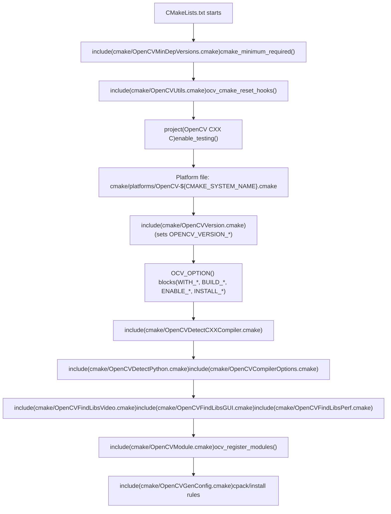
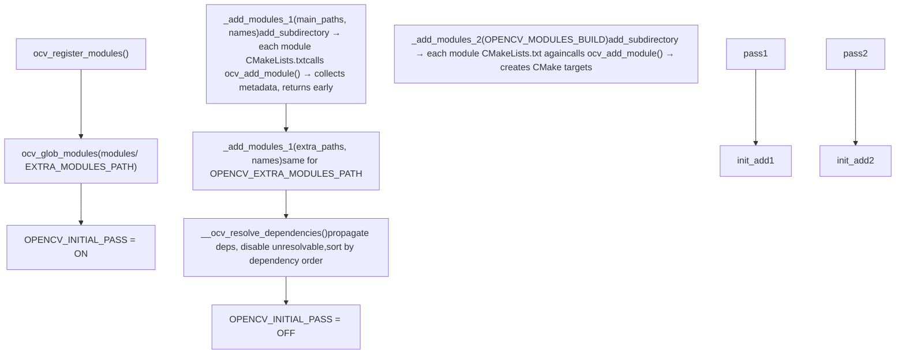
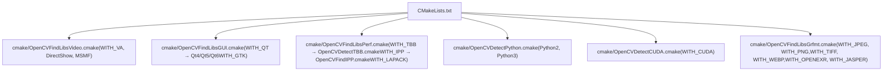
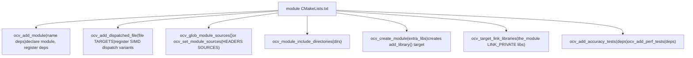

# Build System

Relevant source files

-   [3rdparty/fastcv/fastcv.cmake](https://github.com/opencv/opencv/blob/91c78f50/3rdparty/fastcv/fastcv.cmake)
-   [3rdparty/ippicv/CMakeLists.txt](https://github.com/opencv/opencv/blob/91c78f50/3rdparty/ippicv/CMakeLists.txt)
-   [CMakeLists.txt](https://github.com/opencv/opencv/blob/91c78f50/CMakeLists.txt)
-   [cmake/OpenCVCRTLinkage.cmake](https://github.com/opencv/opencv/blob/91c78f50/cmake/OpenCVCRTLinkage.cmake)
-   [cmake/OpenCVCompilerOptions.cmake](https://github.com/opencv/opencv/blob/91c78f50/cmake/OpenCVCompilerOptions.cmake)
-   [cmake/OpenCVDetectCXXCompiler.cmake](https://github.com/opencv/opencv/blob/91c78f50/cmake/OpenCVDetectCXXCompiler.cmake)
-   [cmake/OpenCVFindIPP.cmake](https://github.com/opencv/opencv/blob/91c78f50/cmake/OpenCVFindIPP.cmake)
-   [cmake/OpenCVFindIPPIW.cmake](https://github.com/opencv/opencv/blob/91c78f50/cmake/OpenCVFindIPPIW.cmake)
-   [cmake/OpenCVFindLibsGUI.cmake](https://github.com/opencv/opencv/blob/91c78f50/cmake/OpenCVFindLibsGUI.cmake)
-   [cmake/OpenCVFindLibsPerf.cmake](https://github.com/opencv/opencv/blob/91c78f50/cmake/OpenCVFindLibsPerf.cmake)
-   [cmake/OpenCVFindLibsVideo.cmake](https://github.com/opencv/opencv/blob/91c78f50/cmake/OpenCVFindLibsVideo.cmake)
-   [cmake/OpenCVGenConfig.cmake](https://github.com/opencv/opencv/blob/91c78f50/cmake/OpenCVGenConfig.cmake)
-   [cmake/OpenCVInstallLayout.cmake](https://github.com/opencv/opencv/blob/91c78f50/cmake/OpenCVInstallLayout.cmake)
-   [cmake/OpenCVModule.cmake](https://github.com/opencv/opencv/blob/91c78f50/cmake/OpenCVModule.cmake)
-   [cmake/OpenCVPCHSupport.cmake](https://github.com/opencv/opencv/blob/91c78f50/cmake/OpenCVPCHSupport.cmake)
-   [cmake/OpenCVUtils.cmake](https://github.com/opencv/opencv/blob/91c78f50/cmake/OpenCVUtils.cmake)
-   [cmake/templates/OpenCVConfig-version.cmake.in](https://github.com/opencv/opencv/blob/91c78f50/cmake/templates/OpenCVConfig-version.cmake.in)
-   [cmake/templates/OpenCVConfig.cmake.in](https://github.com/opencv/opencv/blob/91c78f50/cmake/templates/OpenCVConfig.cmake.in)
-   [cmake/templates/OpenCVConfig.root-WIN32.cmake.in](https://github.com/opencv/opencv/blob/91c78f50/cmake/templates/OpenCVConfig.root-WIN32.cmake.in)
-   [cmake/templates/cvconfig.h.in](https://github.com/opencv/opencv/blob/91c78f50/cmake/templates/cvconfig.h.in)
-   [modules/core/CMakeLists.txt](https://github.com/opencv/opencv/blob/91c78f50/modules/core/CMakeLists.txt)
-   [modules/highgui/CMakeLists.txt](https://github.com/opencv/opencv/blob/91c78f50/modules/highgui/CMakeLists.txt)
-   [modules/highgui/include/opencv2/highgui.hpp](https://github.com/opencv/opencv/blob/91c78f50/modules/highgui/include/opencv2/highgui.hpp)
-   [modules/highgui/include/opencv2/highgui/highgui.hpp](https://github.com/opencv/opencv/blob/91c78f50/modules/highgui/include/opencv2/highgui/highgui.hpp)
-   [modules/highgui/include/opencv2/highgui/highgui\_c.h](https://github.com/opencv/opencv/blob/91c78f50/modules/highgui/include/opencv2/highgui/highgui_c.h)
-   [modules/highgui/src/precomp.hpp](https://github.com/opencv/opencv/blob/91c78f50/modules/highgui/src/precomp.hpp)
-   [modules/highgui/src/window.cpp](https://github.com/opencv/opencv/blob/91c78f50/modules/highgui/src/window.cpp)
-   [modules/highgui/src/window\_QT.cpp](https://github.com/opencv/opencv/blob/91c78f50/modules/highgui/src/window_QT.cpp)
-   [modules/highgui/src/window\_QT.h](https://github.com/opencv/opencv/blob/91c78f50/modules/highgui/src/window_QT.h)
-   [modules/highgui/src/window\_cocoa.mm](https://github.com/opencv/opencv/blob/91c78f50/modules/highgui/src/window_cocoa.mm)
-   [modules/highgui/src/window\_gtk.cpp](https://github.com/opencv/opencv/blob/91c78f50/modules/highgui/src/window_gtk.cpp)
-   [modules/highgui/src/window\_w32.cpp](https://github.com/opencv/opencv/blob/91c78f50/modules/highgui/src/window_w32.cpp)
-   [modules/java/CMakeLists.txt](https://github.com/opencv/opencv/blob/91c78f50/modules/java/CMakeLists.txt)
-   [modules/videoio/CMakeLists.txt](https://github.com/opencv/opencv/blob/91c78f50/modules/videoio/CMakeLists.txt)

This page describes the CMake-based build system used to configure and compile OpenCV. It covers the root `CMakeLists.txt`, the major supporting scripts in the `cmake/` directory, how modules are discovered and their dependencies resolved, and how third-party libraries are detected. For details on how individual modules declare themselves and how `opencv_world` is assembled, see [Module Configuration and ocv\_add\_module](/opencv/opencv/2.2-module-configuration-and-ocv_add_module). For version numbering, packaging, and the Android SDK build script, see [Version Management, Packaging, and Platform Builds](/opencv/opencv/2.3-version-management-packaging-and-platform-builds).

---

## Overview

OpenCV uses CMake as its sole build system. A single root `CMakeLists.txt` drives the entire configure step, delegating compiler detection, option definition, module scanning, dependency resolution, and third-party library probing to a collection of scripts under `cmake/`.

**Top-level build script locations:**

| File / Directory | Role |
| --- | --- |
| `CMakeLists.txt` | Root entry point |
| `cmake/OpenCVUtils.cmake` | Shared utility macros (`OCV_OPTION`, `ocv_update`, flag checks) |
| `cmake/OpenCVModule.cmake` | Module registry, two-pass module scanning, dependency resolution |
| `cmake/OpenCVDetectCXXCompiler.cmake` | Compiler identification, CPU architecture detection |
| `cmake/OpenCVCompilerOptions.cmake` | Per-compiler flag configuration |
| `cmake/OpenCVCompilerOptimizations.cmake` | SIMD dispatch option setup |
| `cmake/OpenCVFindLibsVideo.cmake` | Video I/O third-party detection |
| `cmake/OpenCVFindLibsGUI.cmake` | GUI toolkit detection (Qt, GTK) |
| `cmake/OpenCVFindLibsPerf.cmake` | Performance library detection (TBB, IPP, LAPACK) |
| `cmake/OpenCVDetectPython.cmake` | Python interpreter and library detection |
| `cmake/OpenCVGenConfig.cmake` | Generates `OpenCVConfig.cmake` for downstream consumers |
| `cmake/templates/cvconfig.h.in` | Template for the generated `cvconfig.h` header |
| `cmake/templates/OpenCVConfig.cmake.in` | Template for the installed `OpenCVConfig.cmake` |
| `cmake/platforms/` | Platform-specific overrides (Android, iOS, etc.) |

Sources: [CMakeLists.txt1-200](https://github.com/opencv/opencv/blob/91c78f50/CMakeLists.txt#L1-L200) [cmake/OpenCVUtils.cmake1-50](https://github.com/opencv/opencv/blob/91c78f50/cmake/OpenCVUtils.cmake#L1-L50) [cmake/OpenCVModule.cmake1-55](https://github.com/opencv/opencv/blob/91c78f50/cmake/OpenCVModule.cmake#L1-L55)

---

## Root CMakeLists.txt Walkthrough

The root `CMakeLists.txt` performs the following steps in order:

**Configure-time execution flow in `CMakeLists.txt`:**


Sources: [CMakeLists.txt16-800](https://github.com/opencv/opencv/blob/91c78f50/CMakeLists.txt#L16-L800)

### CMake Policy Configuration

The root file explicitly sets CMake policies `CMP0026` through `CMP0148` to resolve behavior differences across CMake versions. Notably, `CMP0146` and `CMP0148` are set to `OLD` to preserve the legacy `FindCUDA` and `FindPythonInterp` modules rather than using newer CMake-provided replacements.

Sources: [CMakeLists.txt31-93](https://github.com/opencv/opencv/blob/91c78f50/CMakeLists.txt#L31-L93)

### In-source Build Prevention

```
if(" ${CMAKE_SOURCE_DIR}" STREQUAL " ${CMAKE_BINARY_DIR}")  message(FATAL_ERROR ...)endif()
```
[CMakeLists.txt9-14](https://github.com/opencv/opencv/blob/91c78f50/CMakeLists.txt#L9-L14)

The leading space in the string comparison is intentional — it avoids a CMake bug where an empty `CMAKE_SOURCE_DIR` could make the condition pass unexpectedly.

---

## Compiler and Platform Detection

`cmake/OpenCVDetectCXXCompiler.cmake` runs immediately after `project()` and sets boolean variables used throughout the rest of the build.

**Compiler identification variables:**

| Variable | Condition |
| --- | --- |
| `CV_GCC` | `CMAKE_CXX_COMPILER_ID MATCHES "GNU"` |
| `CV_CLANG` | `CMAKE_CXX_COMPILER_ID MATCHES "Clang"` (including AppleClang) |
| `CV_ICC` | Intel Classic compiler detected |
| `CV_ICX` | Intel LLVM-based compiler (`icx`/`icpx`) |
| `MSVC` | Set by CMake natively |

**CPU architecture variables:**

| Variable | Processor pattern matched |
| --- | --- |
| `X86_64` | `amd64.*`, `x86_64.*`, `AMD64.*` |
| `X86` | `i686.*`, `i386.*`, `x86.*` |
| `AARCH64` | `aarch64.*`, `arm64.*` |
| `ARM` | `arm.*` (32-bit) |
| `PPC64LE` | `powerpc.*64le`, `ppc.*64le` |
| `RISCV` | `riscv.*` |
| `LOONGARCH64` | `loongarch64.*` |

A `sizeof(void*)` check corrects the architecture variable when a 32-bit OS runs on a 64-bit CPU (e.g., `X86_64` → `X86`).

Sources: [cmake/OpenCVDetectCXXCompiler.cmake1-230](https://github.com/opencv/opencv/blob/91c78f50/cmake/OpenCVDetectCXXCompiler.cmake#L1-L230)

---

## Build Options

The macro `OCV_OPTION` (defined in `cmake/OpenCVUtils.cmake`) wraps CMake's `option()` with support for conditional visibility and post-build verification:

```
OCV_OPTION(<name> <description> <default>  [VISIBLE_IF <condition>]  [VERIFY <HAVE_variable>])
```
The `VERIFY` field checks at the end of configuration that, when `WITH_<FEATURE>=ON`, `HAVE_<FEATURE>` was actually set. This is enabled by `ENABLE_CONFIG_VERIFICATION`.

Major option groups in `CMakeLists.txt`:

| Prefix | Purpose | Examples |
| --- | --- | --- |
| `WITH_*` | Enable optional third-party features | `WITH_CUDA`, `WITH_TBB`, `WITH_QT`, `WITH_FFMPEG` |
| `BUILD_*` | Control what gets built | `BUILD_SHARED_LIBS`, `BUILD_TESTS`, `BUILD_opencv_world` |
| `ENABLE_*` | Compiler / code generation options | `ENABLE_LTO`, `ENABLE_PROFILING`, `ENABLE_CCACHE` |
| `INSTALL_*` | Installation layout control | `INSTALL_CREATE_DISTRIB`, `INSTALL_TESTS` |

Sources: [CMakeLists.txt195-555](https://github.com/opencv/opencv/blob/91c78f50/CMakeLists.txt#L195-L555) [cmake/OpenCVUtils.cmake715-800](https://github.com/opencv/opencv/blob/91c78f50/cmake/OpenCVUtils.cmake#L715-L800)

---

## Module System

The OpenCV module system is entirely implemented in `cmake/OpenCVModule.cmake`. It uses a **two-pass** design: the first pass collects metadata about every module; the second pass creates CMake targets.

### Module Global State

Each module `opencv_<name>` populates a set of cache variables:

| Variable | Meaning |
| --- | --- |
| `OPENCV_MODULE_<m>_LOCATION` | Source directory of the module |
| `OPENCV_MODULE_<m>_DESCRIPTION` | Short description |
| `OPENCV_MODULE_<m>_CLASS` | `PUBLIC`, `INTERNAL`, or `BINDINGS` |
| `OPENCV_MODULE_<m>_REQ_DEPS` | Required module/library dependencies |
| `OPENCV_MODULE_<m>_OPT_DEPS` | Optional dependencies |
| `OPENCV_MODULE_<m>_DEPS` | Final flattened dependency set (after propagation) |
| `OPENCV_MODULE_<m>_IS_PART_OF_WORLD` | Whether it's included in `opencv_world` |
| `HAVE_<m>` | `ON`/`OFF` quick availability flag |

Module build-status lists:

| List Variable | Meaning |
| --- | --- |
| `OPENCV_MODULES_BUILD` | Modules scheduled to be compiled |
| `OPENCV_MODULES_DISABLED_USER` | Explicitly disabled via `BUILD_<m>=OFF` |
| `OPENCV_MODULES_DISABLED_AUTO` | Disabled because a required dependency is absent |
| `OPENCV_MODULES_DISABLED_FORCE` | Disabled unconditionally by `ocv_module_disable()` |

Sources: [cmake/OpenCVModule.cmake1-75](https://github.com/opencv/opencv/blob/91c78f50/cmake/OpenCVModule.cmake#L1-L75)

### Two-Pass Module Scanning

**Module scanning and target creation flow:**


Sources: [cmake/OpenCVModule.cmake347-399](https://github.com/opencv/opencv/blob/91c78f50/cmake/OpenCVModule.cmake#L347-L399)

### Dependency Resolution

`__ocv_resolve_dependencies()` performs the following steps in order:

1.  **Whitelist filtering** — If `BUILD_LIST` is set, modules not in the list (or their required transitive deps) are disabled.
2.  **Wrapper dependency injection** — For modules declaring `WRAP python`, optional deps on `opencv_python2`/`opencv_python3` are added.
3.  **Iterative disabling** — Modules with unresolvable required dependencies are moved from `OPENCV_MODULES_BUILD` to `OPENCV_MODULES_DISABLED_AUTO`. This loop repeats until stable.
4.  **Dependency propagation** — Each module's dep set is expanded to include transitive deps (all deps of each dep).
5.  **World substitution** — When `BUILD_opencv_world=ON`, deps on world-member modules are replaced by a dep on `opencv_world`.
6.  **Topological sort** — `__ocv_sort_modules_by_deps()` sorts `OPENCV_MODULES_BUILD` so each module appears after all its dependencies.

Sources: [cmake/OpenCVModule.cmake500-695](https://github.com/opencv/opencv/blob/91c78f50/cmake/OpenCVModule.cmake#L500-L695)

### ocv\_add\_module Usage Pattern

A typical module `CMakeLists.txt` (e.g., `modules/core/CMakeLists.txt`) follows this structure:

```
ocv_add_module(core    OPTIONAL opencv_cudev    WRAP java objc python js) ocv_glob_module_sources(...)ocv_module_include_directories(...)ocv_create_module(${extra_libs})ocv_add_accuracy_tests()ocv_add_perf_tests()
```
`ocv_add_module` accepts:

-   `INTERNAL` or `BINDINGS` class specifier (default is `PUBLIC`)
-   `REQUIRED` dependencies (hard — module is disabled if missing)
-   `OPTIONAL` dependencies (soft — included if available)
-   `PRIVATE_REQUIRED` / `PRIVATE_OPTIONAL` — not propagated to dependents
-   `WRAP <lang>` — registers language binding support

Sources: [cmake/OpenCVModule.cmake119-223](https://github.com/opencv/opencv/blob/91c78f50/cmake/OpenCVModule.cmake#L119-L223) [modules/core/CMakeLists.txt35-38](https://github.com/opencv/opencv/blob/91c78f50/modules/core/CMakeLists.txt#L35-L38)

---

## Third-Party Library Detection

Third-party detection follows a consistent pattern: the root `CMakeLists.txt` checks a `WITH_<FEATURE>` option, then includes the corresponding detection script. Each script either sets `HAVE_<FEATURE>=ON` (and the relevant include/library variables) or leaves it unset.

**Third-party detection script mapping:**


Sources: [CMakeLists.txt640-810](https://github.com/opencv/opencv/blob/91c78f50/CMakeLists.txt#L640-L810) [cmake/OpenCVFindLibsVideo.cmake1-12](https://github.com/opencv/opencv/blob/91c78f50/cmake/OpenCVFindLibsVideo.cmake#L1-L12) [cmake/OpenCVFindLibsGUI.cmake1-50](https://github.com/opencv/opencv/blob/91c78f50/cmake/OpenCVFindLibsGUI.cmake#L1-L50) [cmake/OpenCVFindLibsPerf.cmake1-80](https://github.com/opencv/opencv/blob/91c78f50/cmake/OpenCVFindLibsPerf.cmake#L1-L80)

### Bundled Third-Party Libraries

When a system library is absent or `BUILD_<LIB>=ON` is forced, OpenCV can build its own copy from source. The defaults by platform:

| Library | Windows | macOS | Android | Linux (system) |
| --- | --- | --- | --- | --- |
| `zlib` | bundled | bundled | bundled | system |
| `libjpeg` | bundled | bundled | bundled | system |
| `libpng` | bundled | bundled | bundled | system |
| `libtiff` | bundled | bundled | bundled | system |
| `OpenJPEG` | bundled | bundled | bundled | system |
| `TBB` | system | system | bundled | system |

The global flag `OPENCV_FORCE_3RDPARTY_BUILD=ON` forces bundled builds everywhere.

Sources: [CMakeLists.txt199-213](https://github.com/opencv/opencv/blob/91c78f50/CMakeLists.txt#L199-L213)

### IPP (Intel Performance Primitives)

`cmake/OpenCVFindIPP.cmake` searches for the ICV (redistributable subset) first, then a standalone IPP installation. When found, `HAVE_IPP=ON` and `IPP_LIBRARIES` / `IPP_INCLUDE_DIRS` are set. The companion script `cmake/OpenCVFindIPPIW.cmake` locates the IPP Integration Wrappers (`ipp_iw`).

Sources: [cmake/OpenCVFindIPP.cmake1-50](https://github.com/opencv/opencv/blob/91c78f50/cmake/OpenCVFindIPP.cmake#L1-L50) [cmake/OpenCVFindLibsPerf.cmake10-40](https://github.com/opencv/opencv/blob/91c78f50/cmake/OpenCVFindLibsPerf.cmake#L10-L40)

---

## Compiler Options

`cmake/OpenCVCompilerOptions.cmake` runs after compiler detection and configures flags into `OPENCV_EXTRA_CXX_FLAGS` and `OPENCV_EXTRA_C_FLAGS`. It uses `ocv_check_flag_support` (defined in `cmake/OpenCVUtils.cmake`) to probe whether a flag is accepted before adding it.

Key configuration outcomes:

| Setting | GCC/Clang | MSVC |
| --- | --- | --- |
| High warning level | `-Wall -W -Wreturn-type ...` | `/W4` (via defaults) |
| Floating point model | (default) or `-ffast-math` | `/fp:precise` or `/fp:fast` |
| Frame pointer | `-fomit-frame-pointer` (opt-in) | N/A |
| Symbol visibility | `-fvisibility=hidden -fvisibility-inlines-hidden` | N/A |
| Function sections | `-ffunction-sections -fdata-sections` | `/Gy` |
| Dead code stripping | `-Wl,--gc-sections` (Linux) or `-Wl,-dead_strip` (macOS) | N/A |
| LTO | `-flto` or `-flto=auto` | `/GL` + `/LTCG` |
| Precompiled headers | Controlled by `ENABLE_PRECOMPILED_HEADERS` | `MSVC` default ON |
| ccache | Via `RULE_LAUNCH_COMPILE` or Xcode project attributes | N/A |

SIMD dispatch options are set up by `cmake/OpenCVCompilerOptimizations.cmake`, which is included at the end of `OpenCVCompilerOptions.cmake`. This creates per-file dispatch targets for SSE2/SSE4/AVX2/NEON etc. (detailed in [SIMD Intrinsics and CPU Dispatching](/opencv/opencv/3.5-simd-intrinsics-and-cpu-dispatching)).

Sources: [cmake/OpenCVCompilerOptions.cmake1-400](https://github.com/opencv/opencv/blob/91c78f50/cmake/OpenCVCompilerOptions.cmake#L1-L400)

---

## Configuration Output Files

The build generates two kinds of configuration output consumed by OpenCV's own sources and by downstream CMake projects.

### cvconfig.h

Templated from `cmake/templates/cvconfig.h.in`, written to `${CMAKE_BINARY_DIR}/cvconfig.h`. It contains `#define` / `#cmakedefine` guards for every detected feature:

```
#cmakedefine BUILD_SHARED_LIBS#cmakedefine CV_ENABLE_INTRINSICS#cmakedefine HAVE_JPEG#cmakedefine HAVE_PNG#cmakedefine HAVE_TBB/* ... */
```
This header is included by OpenCV's own source files via the `OPENCV_CONFIG_FILE_INCLUDE_DIR` include path.

Sources: [cmake/templates/cvconfig.h.in1-80](https://github.com/opencv/opencv/blob/91c78f50/cmake/templates/cvconfig.h.in#L1-L80) [CMakeLists.txt626-627](https://github.com/opencv/opencv/blob/91c78f50/CMakeLists.txt#L626-L627)

### OpenCVConfig.cmake

Generated by `cmake/OpenCVGenConfig.cmake` from the template `cmake/templates/OpenCVConfig.cmake.in`. Three variants are produced:

| Variant | Location | Use case |
| --- | --- | --- |
| Build-tree | `${CMAKE_BINARY_DIR}/OpenCVConfig.cmake` | Using OpenCV without install |
| Unix install | `${CMAKE_BINARY_DIR}/unix-install/OpenCVConfig.cmake` | After `make install` |
| Win install | `${CMAKE_BINARY_DIR}/win-install/OpenCVConfig.cmake` | Binary package distribution |

Downstream projects use it as:

```
find_package(OpenCV REQUIRED core imgproc)target_link_libraries(my_app ${OpenCV_LIBS})
```
The config file exports `OpenCV_LIBS`, `OpenCV_INCLUDE_DIRS`, `OpenCV_VERSION`, and per-module `OPENCV_<MODULE>_FOUND` variables.

Sources: [cmake/OpenCVGenConfig.cmake1-80](https://github.com/opencv/opencv/blob/91c78f50/cmake/OpenCVGenConfig.cmake#L1-L80) [cmake/templates/OpenCVConfig.cmake.in1-100](https://github.com/opencv/opencv/blob/91c78f50/cmake/templates/OpenCVConfig.cmake.in#L1-L100)

---

## CMake Hook System

`cmake/OpenCVUtils.cmake` implements an extension hook system via `ocv_cmake_hook()` and `ocv_cmake_hook_append()`. External integrators can inject custom `.cmake` scripts at named points in the configure sequence by setting `OPENCV_CMAKE_HOOKS_DIR`.

Named hook points (selected):

| Hook Name | Fires at |
| --- | --- |
| `CMAKE_INIT` | Very start, after loading utilities |
| `POST_DETECT_COMPILER` | After `OpenCVDetectCXXCompiler.cmake` |
| `POST_OPTIONS` | After all `OCV_OPTION()` declarations |
| `PRE_MODULES_SCAN` | Before the first pass over main modules |
| `PRE_MODULES_SCAN_EXTRA` | Before the first pass over extra modules |
| `POST_MODULES_SCAN` | After first pass, before dependency resolution |
| `PRE_MODULES_CREATE` | Before second pass target creation |
| `POST_MODULES_CREATE` | After second pass |
| `PRE_ADD_MODULE_<name>` | Before a specific module is processed |

Sources: [cmake/OpenCVUtils.cmake44-87](https://github.com/opencv/opencv/blob/91c78f50/cmake/OpenCVUtils.cmake#L44-L87) [CMakeLists.txt98-108](https://github.com/opencv/opencv/blob/91c78f50/CMakeLists.txt#L98-L108)

---

## Module CMakeLists.txt Structure

Each module directory contains a `CMakeLists.txt` that is processed twice (once per pass). The macros used are all defined in `cmake/OpenCVModule.cmake`.

**Macros available inside a module's CMakeLists.txt:**


Sources: [cmake/OpenCVModule.cmake33-46](https://github.com/opencv/opencv/blob/91c78f50/cmake/OpenCVModule.cmake#L33-L46) [modules/core/CMakeLists.txt1-220](https://github.com/opencv/opencv/blob/91c78f50/modules/core/CMakeLists.txt#L1-L220) [modules/highgui/CMakeLists.txt1-50](https://github.com/opencv/opencv/blob/91c78f50/modules/highgui/CMakeLists.txt#L1-L50)

### Example: highgui Backend Selection

`modules/highgui/CMakeLists.txt` demonstrates conditional backend selection at build time. It sets `OPENCV_HIGHGUI_BUILTIN_BACKEND` to the first available backend detected and generates a header:

```
Qt (HAVE_QT) > Wayland (HAVE_WAYLAND) > Cocoa (HAVE_COCOA) > Win32UI > GTK3/GTK2 > FB > NONE
```
The result is written to `opencv_highgui_config.hpp` via `ocv_update_file()`.

Sources: [modules/highgui/CMakeLists.txt50-270](https://github.com/opencv/opencv/blob/91c78f50/modules/highgui/CMakeLists.txt#L50-L270)

---

## Summary: Script Dependency Map

The diagram below maps the concrete CMake script files to their roles, reflecting actual include relationships.

```mermaid
flowchart TD
    ROOT["CMakeLists.txt"]
    UTILS["cmake/OpenCVUtils.cmakeocv_update, OCV_OPTION,ocv_check_compiler_flag,ocv_cmake_hook"]
    VER["cmake/OpenCVVersion.cmakeOPENCV_VERSION_MAJOR/MINOR/PATCH"]
    COMPILER["cmake/OpenCVDetectCXXCompiler.cmakeCV_GCC, CV_CLANG, X86_64,AARCH64, ARM, RISCV"]
    COPTS["cmake/OpenCVCompilerOptions.cmakeOPENCV_EXTRA_CXX_FLAGSadd_extra_compiler_option()"]
    COPTIMIZE["cmake/OpenCVCompilerOptimizations.cmakeocv_add_dispatched_file()"]
    MODULE["cmake/OpenCVModule.cmakeocv_add_module()ocv_glob_modules()__ocv_resolve_dependencies()"]
    LIBVIDEO["cmake/OpenCVFindLibsVideo.cmakeHAVE_FFMPEG, HAVE_GSTREAMER,HAVE_MSMF, HAVE_V4L2"]
    LIBGUI["cmake/OpenCVFindLibsGUI.cmakeHAVE_QT, HAVE_GTK"]
    LIBPERF["cmake/OpenCVFindLibsPerf.cmakeHAVE_TBB, HAVE_IPP, HAVE_LAPACK"]
    PYTHON["cmake/OpenCVDetectPython.cmakePYTHON_DEFAULT_AVAILABLE"]
    GENCONF["cmake/OpenCVGenConfig.cmakeOpenCVConfig.cmake (3 variants)"]
    CONFTEMPL["cmake/templates/OpenCVConfig.cmake.inOpenCV_LIBS, OpenCV_INCLUDE_DIRS"]
    CVCONFIG["cmake/templates/cvconfig.h.in→ cvconfig.h (HAVE_* defines)"]

    ROOT --> UTILS
    ROOT --> VER
    ROOT --> COMPILER
    ROOT --> COPTS
    COPTS --> COPTIMIZE
    ROOT --> MODULE
    ROOT --> LIBVIDEO
    ROOT --> LIBGUI
    ROOT --> LIBPERF
    ROOT --> PYTHON
    ROOT --> GENCONF
    GENCONF --> CONFTEMPL
    ROOT --> CVCONFIG
```


Sources: [CMakeLists.txt16-800](https://github.com/opencv/opencv/blob/91c78f50/CMakeLists.txt#L16-L800) [cmake/OpenCVModule.cmake1-10](https://github.com/opencv/opencv/blob/91c78f50/cmake/OpenCVModule.cmake#L1-L10) [cmake/OpenCVGenConfig.cmake1-80](https://github.com/opencv/opencv/blob/91c78f50/cmake/OpenCVGenConfig.cmake#L1-L80)
