# Cross-Platform Build Configuration

Relevant source files

-   [CMakeLists.txt](https://github.com/opencv/opencv/blob/91c78f50/CMakeLists.txt)
-   [cmake/OpenCVCRTLinkage.cmake](https://github.com/opencv/opencv/blob/91c78f50/cmake/OpenCVCRTLinkage.cmake)
-   [cmake/OpenCVCompilerOptions.cmake](https://github.com/opencv/opencv/blob/91c78f50/cmake/OpenCVCompilerOptions.cmake)
-   [cmake/OpenCVDetectCXXCompiler.cmake](https://github.com/opencv/opencv/blob/91c78f50/cmake/OpenCVDetectCXXCompiler.cmake)
-   [cmake/OpenCVFindLibsGUI.cmake](https://github.com/opencv/opencv/blob/91c78f50/cmake/OpenCVFindLibsGUI.cmake)
-   [cmake/OpenCVFindLibsVideo.cmake](https://github.com/opencv/opencv/blob/91c78f50/cmake/OpenCVFindLibsVideo.cmake)
-   [cmake/OpenCVModule.cmake](https://github.com/opencv/opencv/blob/91c78f50/cmake/OpenCVModule.cmake)
-   [cmake/OpenCVPCHSupport.cmake](https://github.com/opencv/opencv/blob/91c78f50/cmake/OpenCVPCHSupport.cmake)
-   [cmake/OpenCVUtils.cmake](https://github.com/opencv/opencv/blob/91c78f50/cmake/OpenCVUtils.cmake)
-   [cmake/templates/OpenCVConfig.root-WIN32.cmake.in](https://github.com/opencv/opencv/blob/91c78f50/cmake/templates/OpenCVConfig.root-WIN32.cmake.in)
-   [cmake/templates/cvconfig.h.in](https://github.com/opencv/opencv/blob/91c78f50/cmake/templates/cvconfig.h.in)
-   [modules/core/CMakeLists.txt](https://github.com/opencv/opencv/blob/91c78f50/modules/core/CMakeLists.txt)
-   [modules/highgui/CMakeLists.txt](https://github.com/opencv/opencv/blob/91c78f50/modules/highgui/CMakeLists.txt)
-   [modules/highgui/include/opencv2/highgui.hpp](https://github.com/opencv/opencv/blob/91c78f50/modules/highgui/include/opencv2/highgui.hpp)
-   [modules/highgui/include/opencv2/highgui/highgui.hpp](https://github.com/opencv/opencv/blob/91c78f50/modules/highgui/include/opencv2/highgui/highgui.hpp)
-   [modules/highgui/include/opencv2/highgui/highgui\_c.h](https://github.com/opencv/opencv/blob/91c78f50/modules/highgui/include/opencv2/highgui/highgui_c.h)
-   [modules/highgui/src/precomp.hpp](https://github.com/opencv/opencv/blob/91c78f50/modules/highgui/src/precomp.hpp)
-   [modules/highgui/src/window.cpp](https://github.com/opencv/opencv/blob/91c78f50/modules/highgui/src/window.cpp)
-   [modules/highgui/src/window\_QT.cpp](https://github.com/opencv/opencv/blob/91c78f50/modules/highgui/src/window_QT.cpp)
-   [modules/highgui/src/window\_QT.h](https://github.com/opencv/opencv/blob/91c78f50/modules/highgui/src/window_QT.h)
-   [modules/highgui/src/window\_cocoa.mm](https://github.com/opencv/opencv/blob/91c78f50/modules/highgui/src/window_cocoa.mm)
-   [modules/highgui/src/window\_gtk.cpp](https://github.com/opencv/opencv/blob/91c78f50/modules/highgui/src/window_gtk.cpp)
-   [modules/highgui/src/window\_w32.cpp](https://github.com/opencv/opencv/blob/91c78f50/modules/highgui/src/window_w32.cpp)
-   [modules/java/CMakeLists.txt](https://github.com/opencv/opencv/blob/91c78f50/modules/java/CMakeLists.txt)
-   [modules/videoio/CMakeLists.txt](https://github.com/opencv/opencv/blob/91c78f50/modules/videoio/CMakeLists.txt)

## Purpose and Scope

This document explains OpenCV's cross-platform build configuration system covering platform detection, compiler configuration, and third-party library integration. The build system uses CMake to detect target platforms, configure compilers, and locate dependencies. For module-specific configuration, see page 2.2.

## Platform Detection and Configuration

OpenCV employs CMake to detect the target platform and automatically apply appropriate configurations. The process begins in the main `CMakeLists.txt` file where system information is gathered and platform-specific files are loaded.

### Build System Initialization Flow

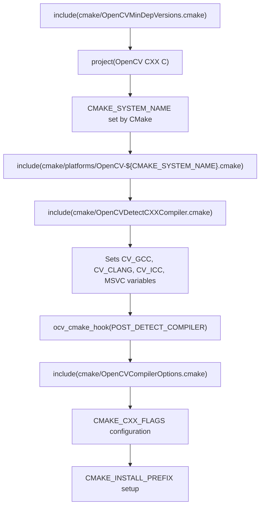
Sources: [CMakeLists.txt16](https://github.com/opencv/opencv/blob/91c78f50/CMakeLists.txt#L16-L16) [CMakeLists.txt134](https://github.com/opencv/opencv/blob/91c78f50/CMakeLists.txt#L134-L134) [CMakeLists.txt144-149](https://github.com/opencv/opencv/blob/91c78f50/CMakeLists.txt#L144-L149) [CMakeLists.txt189](https://github.com/opencv/opencv/blob/91c78f50/CMakeLists.txt#L189-L189) [CMakeLists.txt646](https://github.com/opencv/opencv/blob/91c78f50/CMakeLists.txt#L646-L646) [cmake/OpenCVUtils.cmake104-114](https://github.com/opencv/opencv/blob/91c78f50/cmake/OpenCVUtils.cmake#L104-L114)

### Platform-Specific Configuration Loading

OpenCV loads platform-specific configuration files based on `CMAKE_SYSTEM_NAME`:

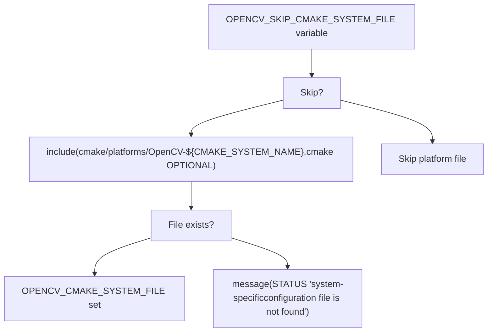
Platform files may set:

-   `OPENCV_EXTRA_FLAGS` - compiler flags
-   `OPENCV_LINKER_LIBS` - system libraries to link
-   `CMAKE_INSTALL_PREFIX` - installation path
-   Platform-specific `OCV_OPTION` defaults

Sources: [CMakeLists.txt144-149](https://github.com/opencv/opencv/blob/91c78f50/CMakeLists.txt#L144-L149)

### Default Installation Paths

`CMAKE_INSTALL_PREFIX` is configured based on platform and cross-compilation status:

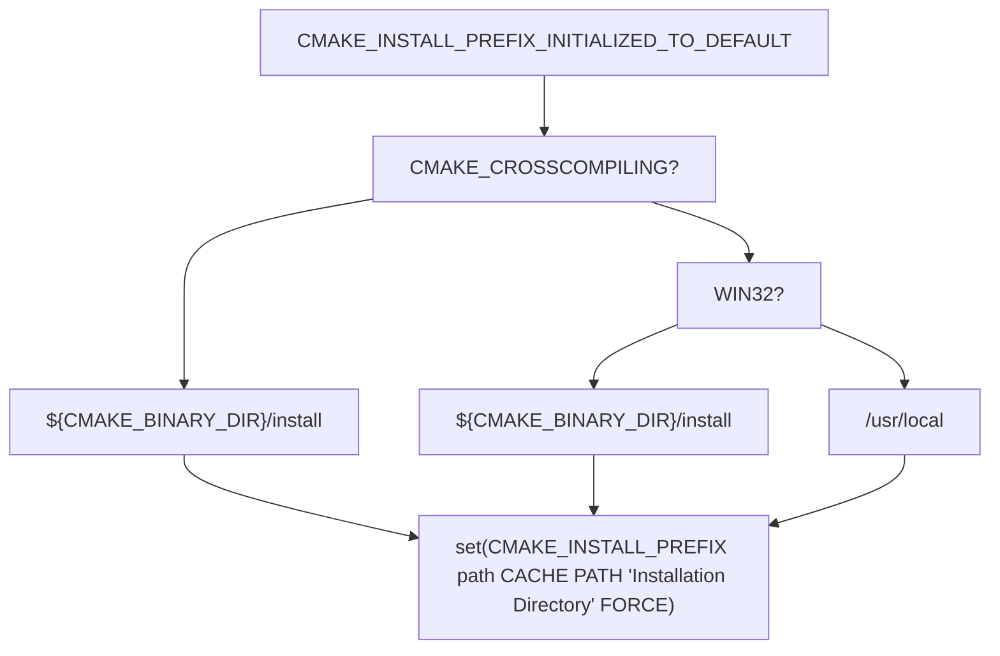
Sources: [CMakeLists.txt151-162](https://github.com/opencv/opencv/blob/91c78f50/CMakeLists.txt#L151-L162)

## Compiler Detection and Configuration

OpenCV detects the compiler type and applies appropriate flags through macros defined in `cmake/OpenCVCompilerOptions.cmake`.

### Compiler Detection and Flag Application

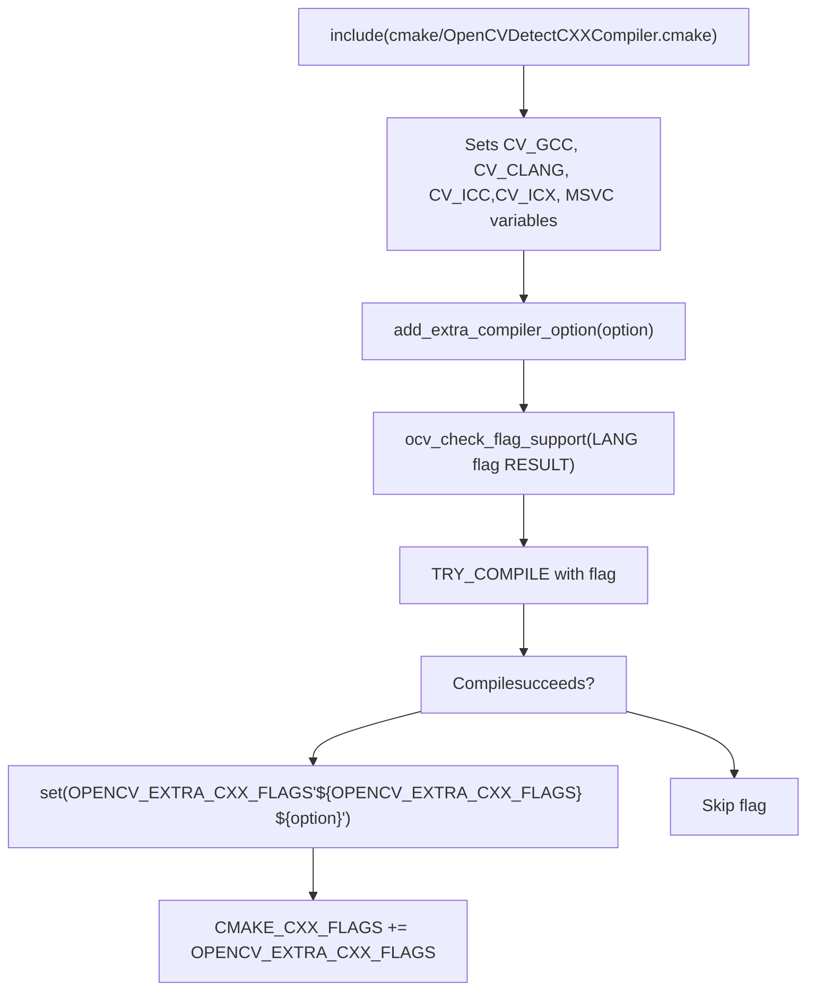
Sources: [cmake/OpenCVCompilerOptions.cmake50-65](https://github.com/opencv/opencv/blob/91c78f50/cmake/OpenCVCompilerOptions.cmake#L50-L65) [cmake/OpenCVUtils.cmake455-559](https://github.com/opencv/opencv/blob/91c78f50/cmake/OpenCVUtils.cmake#L455-L559)

### Platform-Specific Compiler Configuration

Compiler flags are configured based on detected compiler type:

| Compiler | Key Flags | Source |
| --- | --- | --- |
| GCC/Clang | `-W`, `-Wall`, `-Werror` (if `OPENCV_WARNINGS_ARE_ERRORS`), `-fvisibility=hidden` | [cmake/OpenCVCompilerOptions.cmake132-214](https://github.com/opencv/opencv/blob/91c78f50/cmake/OpenCVCompilerOptions.cmake#L132-L214) |
| MSVC | `/D _CRT_SECURE_NO_DEPRECATE`, `/Gy`, `/bigobj`, `/WX` (if `OPENCV_WARNINGS_ARE_ERRORS`) | [cmake/OpenCVCompilerOptions.cmake302-338](https://github.com/opencv/opencv/blob/91c78f50/cmake/OpenCVCompilerOptions.cmake#L302-L338) |
| ICC/ICX | `-fp-model precise` (if not `ENABLE_FAST_MATH`) | [cmake/OpenCVCompilerOptions.cmake104-124](https://github.com/opencv/opencv/blob/91c78f50/cmake/OpenCVCompilerOptions.cmake#L104-L124) |

Fast Math Configuration:

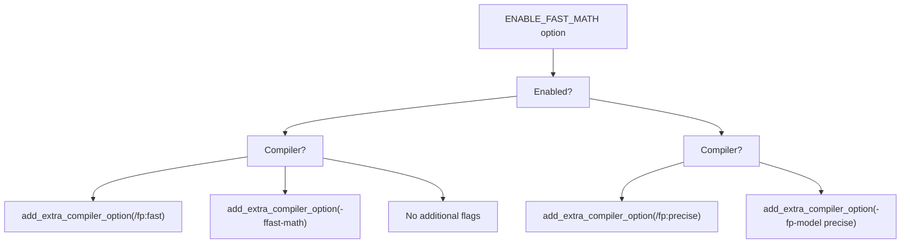
Sources: [cmake/OpenCVCompilerOptions.cmake96-130](https://github.com/opencv/opencv/blob/91c78f50/cmake/OpenCVCompilerOptions.cmake#L96-L130)

### MSVC Runtime Library Linkage

The `BUILD_WITH_STATIC_CRT` option controls C Runtime Library linkage for MSVC builds:

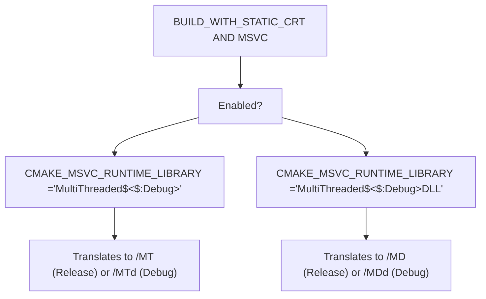
Sources: [CMakeLists.txt497](https://github.com/opencv/opencv/blob/91c78f50/CMakeLists.txt#L497-L497) [cmake/OpenCVCRTLinkage.cmake40-60](https://github.com/opencv/opencv/blob/91c78f50/cmake/OpenCVCRTLinkage.cmake#L40-L60)

## Third-Party Library Integration

OpenCV integrates numerous third-party libraries through the `OCV_OPTION` macro and dedicated find modules in `cmake/`.

### OCV\_OPTION Dependency Configuration

The `OCV_OPTION` macro declares optional dependencies with platform constraints and verification:

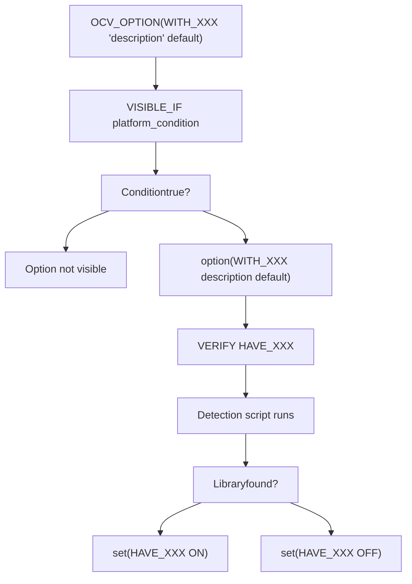
Sources: [CMakeLists.txt196-482](https://github.com/opencv/opencv/blob/91c78f50/CMakeLists.txt#L196-L482) [cmake/OpenCVUtils.cmake715-780](https://github.com/opencv/opencv/blob/91c78f50/cmake/OpenCVUtils.cmake#L715-L780)

### Third-Party Library Categories

OpenCV integrates libraries in several categories:

| Category | Libraries | Detection Script |
| --- | --- | --- |
| Image Codecs | JPEG, PNG, TIFF, WebP, OpenJPEG, AVIF | [cmake/OpenCVFindLibsGrfmt.cmake](https://github.com/opencv/opencv/blob/91c78f50/cmake/OpenCVFindLibsGrfmt.cmake) |
| Video I/O | FFmpeg, GStreamer, V4L2, MSMF | [cmake/OpenCVFindLibsVideo.cmake](https://github.com/opencv/opencv/blob/91c78f50/cmake/OpenCVFindLibsVideo.cmake) |
| GUI | Qt, GTK, Win32, Cocoa, Wayland | [cmake/OpenCVFindLibsGUI.cmake](https://github.com/opencv/opencv/blob/91c78f50/cmake/OpenCVFindLibsGUI.cmake) |
| Acceleration | CUDA, OpenCL, TBB, OpenMP | [cmake/OpenCVDetectCUDA.cmake](https://github.com/opencv/opencv/blob/91c78f50/cmake/OpenCVDetectCUDA.cmake) [CMakeLists.txt351-359](https://github.com/opencv/opencv/blob/91c78f50/CMakeLists.txt#L351-L359) |
| Math | Eigen, LAPACK, IPP | [CMakeLists.txt262-264](https://github.com/opencv/opencv/blob/91c78f50/CMakeLists.txt#L262-L264) [CMakeLists.txt429-431](https://github.com/opencv/opencv/blob/91c78f50/CMakeLists.txt#L429-L431) |

### Image Codec Detection Example

Image codec detection in `cmake/OpenCVFindLibsGrfmt.cmake`:

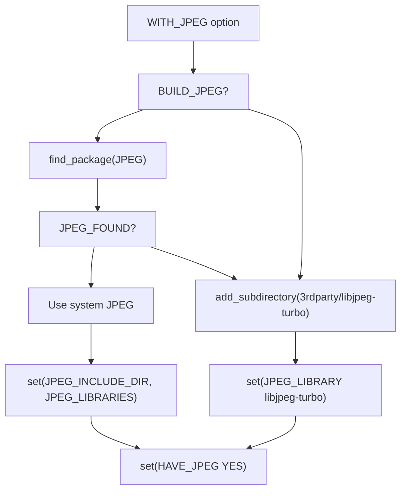
Sources: [cmake/OpenCVFindLibsGrfmt.cmake71-120](https://github.com/opencv/opencv/blob/91c78f50/cmake/OpenCVFindLibsGrfmt.cmake#L71-L120)

### GUI Backend Selection

GUI backends are selected in priority order in `modules/highgui/CMakeLists.txt`:

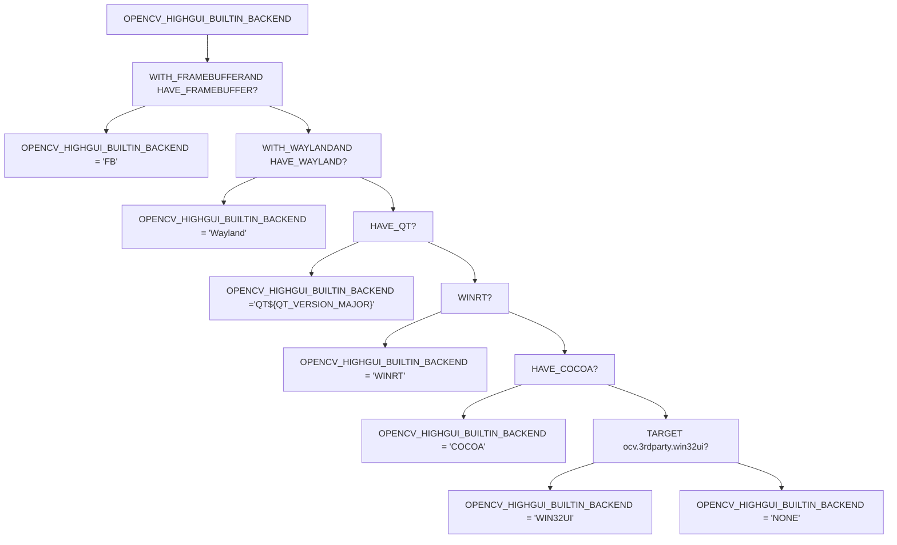
Sources: [modules/highgui/CMakeLists.txt52-268](https://github.com/opencv/opencv/blob/91c78f50/modules/highgui/CMakeLists.txt#L52-L268)

### CUDA Detection Example

CUDA detection process in `cmake/OpenCVDetectCUDA.cmake`:

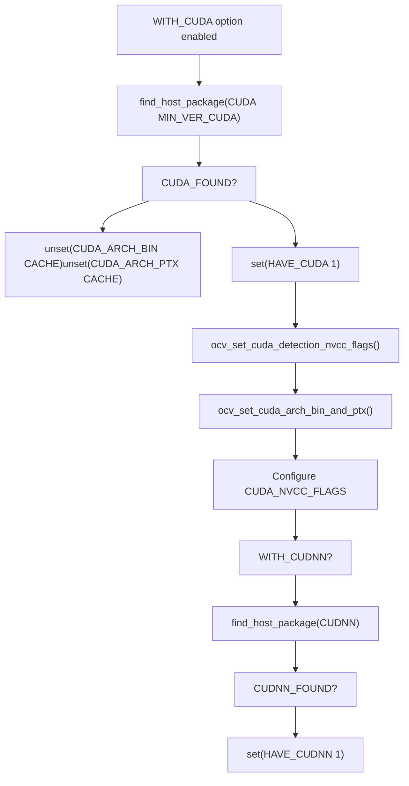
Sources: [cmake/OpenCVDetectCUDA.cmake1-76](https://github.com/opencv/opencv/blob/91c78f50/cmake/OpenCVDetectCUDA.cmake#L1-L76) [CMakeLists.txt244-246](https://github.com/opencv/opencv/blob/91c78f50/CMakeLists.txt#L244-L246)

## Cross-Compilation Support

OpenCV supports cross-compilation through CMake toolchain files and platform detection.

### Cross-Compilation Detection and Configuration

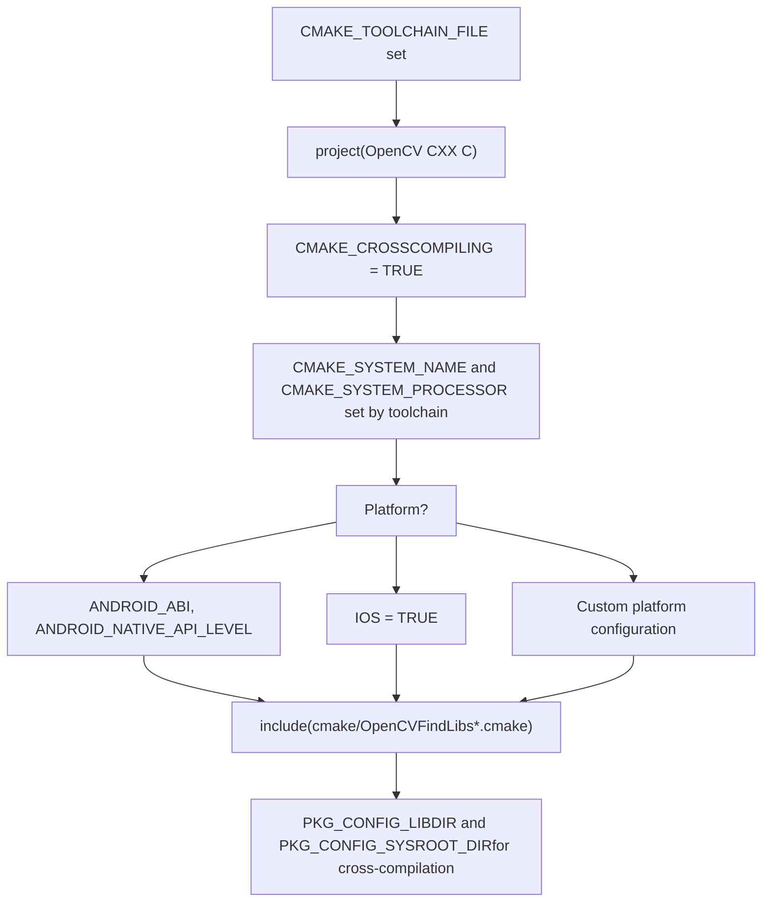
Sources: [CMakeLists.txt705-722](https://github.com/opencv/opencv/blob/91c78f50/CMakeLists.txt#L705-L722) [CMakeLists.txt151-162](https://github.com/opencv/opencv/blob/91c78f50/CMakeLists.txt#L151-L162)

### Cross-Compilation Adjustments

When `CMAKE_CROSSCOMPILING` is true:

| Adjustment | Configuration |
| --- | --- |
| Installation Path | `CMAKE_INSTALL_PREFIX = ${CMAKE_BINARY_DIR}/install` |
| pkg-config | Disabled unless `PKG_CONFIG_LIBDIR` or `PKG_CONFIG_SYSROOT_DIR` set |
| System Libraries | Limited library detection, primarily using bundled 3rdparty |
| Module Selection | Some modules disabled based on target platform |

Sources: [CMakeLists.txt151-162](https://github.com/opencv/opencv/blob/91c78f50/CMakeLists.txt#L151-L162) [CMakeLists.txt707-722](https://github.com/opencv/opencv/blob/91c78f50/CMakeLists.txt#L707-L722)

## System Libraries and Linking

OpenCV detects and links system libraries based on platform in [CMakeLists.txt705-778](https://github.com/opencv/opencv/blob/91c78f50/CMakeLists.txt#L705-L778)

### UNIX/MinGW System Library Detection

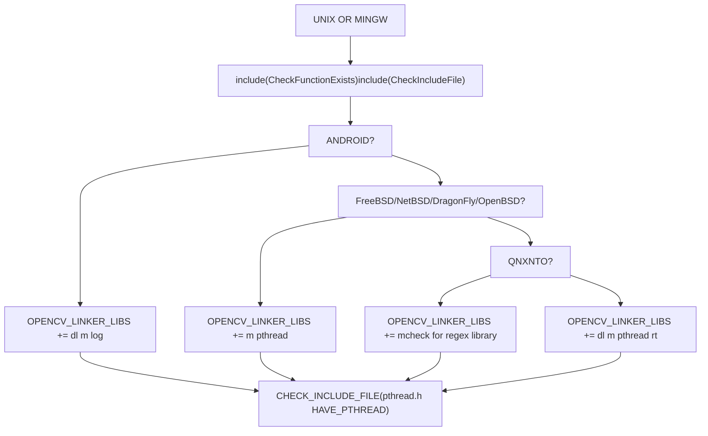
Sources: [CMakeLists.txt705-778](https://github.com/opencv/opencv/blob/91c78f50/CMakeLists.txt#L705-L778)

### Memory Alignment Function Detection

OpenCV detects available memory alignment functions:

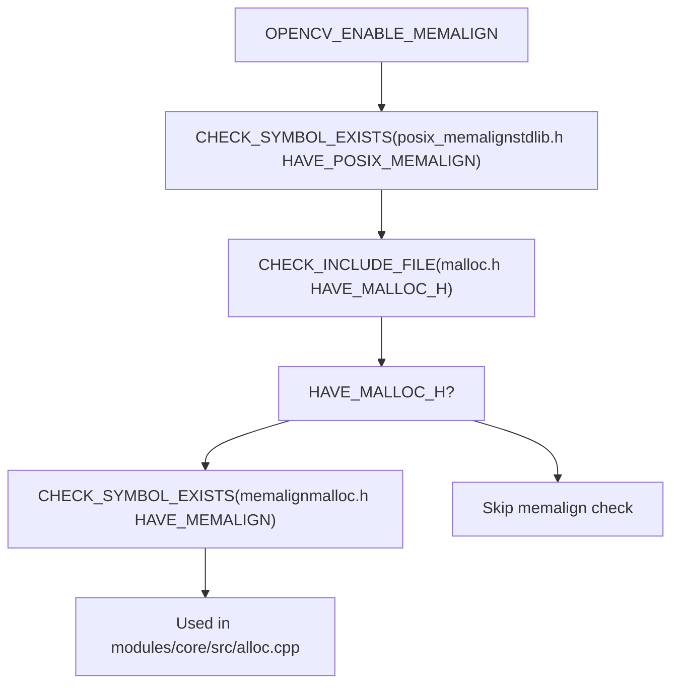
Sources: [CMakeLists.txt756-777](https://github.com/opencv/opencv/blob/91c78f50/CMakeLists.txt#L756-L777) [modules/core/CMakeLists.txt107-118](https://github.com/opencv/opencv/blob/91c78f50/modules/core/CMakeLists.txt#L107-L118)

## Build Customization Mechanisms

OpenCV supports build customization through CMake hooks and environment variables.

### CMake Hook System

The hook system allows injecting custom CMake scripts at specific build stages:

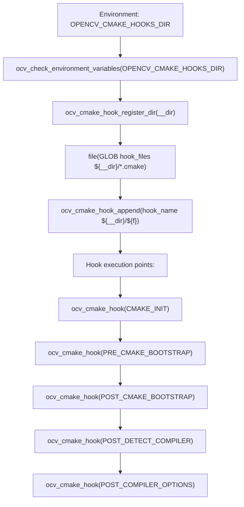
Hook files are named after the hook point (e.g., `POST_DETECT_COMPILER.cmake`) and automatically registered.

Sources: [cmake/OpenCVUtils.cmake69-86](https://github.com/opencv/opencv/blob/91c78f50/cmake/OpenCVUtils.cmake#L69-L86) [CMakeLists.txt98-108](https://github.com/opencv/opencv/blob/91c78f50/CMakeLists.txt#L98-L108)

### Environment Variable Integration

`ocv_check_environment_variables()` imports paths from environment:

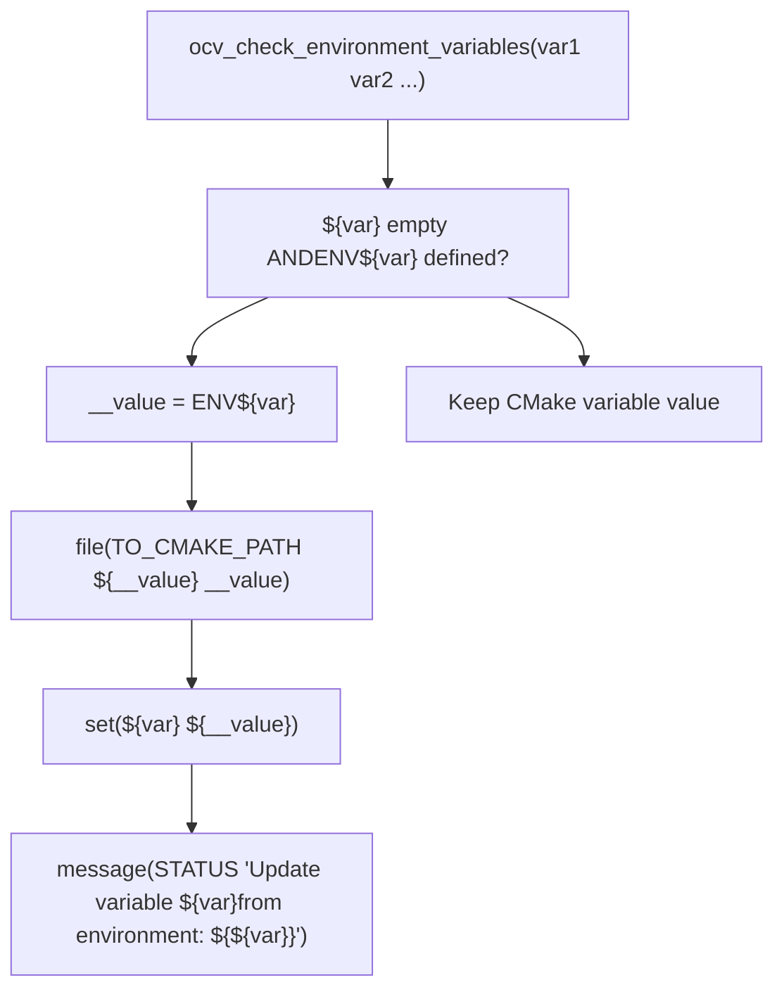
Common variables: `OPENCV_EXTRA_MODULES_PATH`, `OPENCV_CMAKE_HOOKS_DIR`

Sources: [cmake/OpenCVUtils.cmake172-181](https://github.com/opencv/opencv/blob/91c78f50/cmake/OpenCVUtils.cmake#L172-L181) [CMakeLists.txt100](https://github.com/opencv/opencv/blob/91c78f50/CMakeLists.txt#L100-L100)

## Platform-Specific Configuration Examples

### Windows Configuration

| Component | Configuration | Source |
| --- | --- | --- |
| Compiler Flags | `/D _CRT_SECURE_NO_DEPRECATE`, `/Gy`, `/bigobj` | [cmake/OpenCVCompilerOptions.cmake302-338](https://github.com/opencv/opencv/blob/91c78f50/cmake/OpenCVCompilerOptions.cmake#L302-L338) |
| System Libraries | `comctl32`, `gdi32`, `ole32`, `setupapi`, `ws2_32` | [cmake/OpenCVFindLibsVideo.cmake2-4](https://github.com/opencv/opencv/blob/91c78f50/cmake/OpenCVFindLibsVideo.cmake#L2-L4) |
| GUI Backend | Win32 UI via `ocv.3rdparty.win32ui` target | [modules/highgui/CMakeLists.txt194-205](https://github.com/opencv/opencv/blob/91c78f50/modules/highgui/CMakeLists.txt#L194-L205) |
| Video I/O | DirectShow (`WITH_DSHOW`) or Media Foundation (`WITH_MSMF`) | [CMakeLists.txt369-377](https://github.com/opencv/opencv/blob/91c78f50/CMakeLists.txt#L369-L377) |

### Linux Configuration

| Component | Configuration | Source |
| --- | --- | --- |
| Compiler Flags | `-W`, `-Wall`, `-pthread`, `-fvisibility=hidden` | [cmake/OpenCVCompilerOptions.cmake132-206](https://github.com/opencv/opencv/blob/91c78f50/cmake/OpenCVCompilerOptions.cmake#L132-L206) |
| System Libraries | `dl`, `m`, `pthread`, `rt` | [CMakeLists.txt745](https://github.com/opencv/opencv/blob/91c78f50/CMakeLists.txt#L745-L745) |
| GUI Backend | GTK2/GTK3 or Qt | [cmake/OpenCVFindLibsGUI.cmake](https://github.com/opencv/opencv/blob/91c78f50/cmake/OpenCVFindLibsGUI.cmake) |
| Video Capture | V4L2 (`WITH_V4L`) | [CMakeLists.txt366-368](https://github.com/opencv/opencv/blob/91c78f50/CMakeLists.txt#L366-L368) |

### Android Configuration

| Component | Configuration | Source |
| --- | --- | --- |
| ABI | `ANDROID_ABI` (armeabi-v7a, arm64-v8a, x86, x86\_64) | [cmake/OpenCVGenAndroidMK.cmake14-20](https://github.com/opencv/opencv/blob/91c78f50/cmake/OpenCVGenAndroidMK.cmake#L14-L20) |
| System Libraries | `dl`, `m`, `log` | [CMakeLists.txt731](https://github.com/opencv/opencv/blob/91c78f50/CMakeLists.txt#L731-L731) |
| Java Bindings | Enabled if `BUILD_JAVA` and JNI available | [modules/java/CMakeLists.txt6-16](https://github.com/opencv/opencv/blob/91c78f50/modules/java/CMakeLists.txt#L6-L16) |
| Build Output | `.aar` package via `build_sdk.py` | [platforms/android/build\_sdk.py](https://github.com/opencv/opencv/blob/91c78f50/platforms/android/build_sdk.py) |

### macOS/iOS Configuration

| Component | Configuration | Source |
| --- | --- | --- |
| GUI Backend | Cocoa (`HAVE_COCOA`) | [modules/highgui/CMakeLists.txt187-192](https://github.com/opencv/opencv/blob/91c78f50/modules/highgui/CMakeLists.txt#L187-L192) |
| Video Capture | AVFoundation (`WITH_AVFOUNDATION`) | [CMakeLists.txt220-222](https://github.com/opencv/opencv/blob/91c78f50/CMakeLists.txt#L220-L222) |
| Framework | `APPLE_FRAMEWORK` builds single framework | [CMakeLists.txt617-619](https://github.com/opencv/opencv/blob/91c78f50/CMakeLists.txt#L617-L619) |
| System Libraries | `-framework Cocoa`, `-framework Accelerate` | [modules/highgui/CMakeLists.txt191](https://github.com/opencv/opencv/blob/91c78f50/modules/highgui/CMakeLists.txt#L191-L191) |

## Conclusion

OpenCV's cross-platform build configuration system is a sophisticated mechanism that enables the library to be compiled and used effectively across a diverse range of hardware and software environments. The system intelligently detects platform characteristics and available dependencies to provide an optimized build for each target environment.

Understanding this configuration system is essential for developers who need to customize OpenCV builds for specific platforms or incorporate OpenCV into cross-platform projects.
