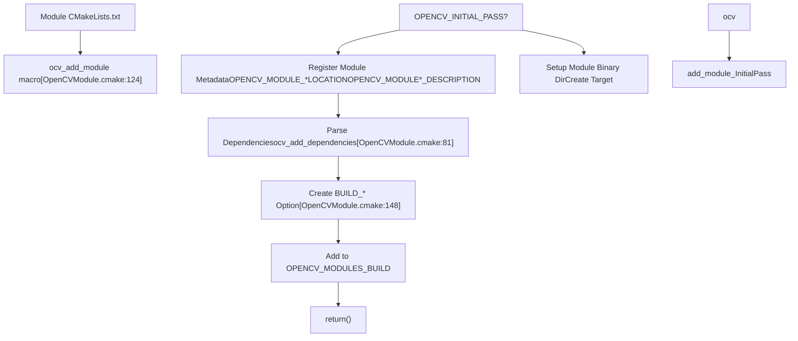
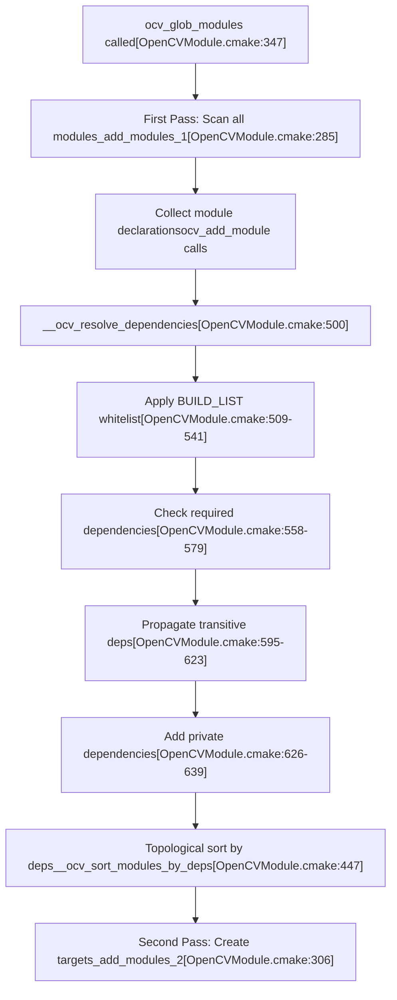
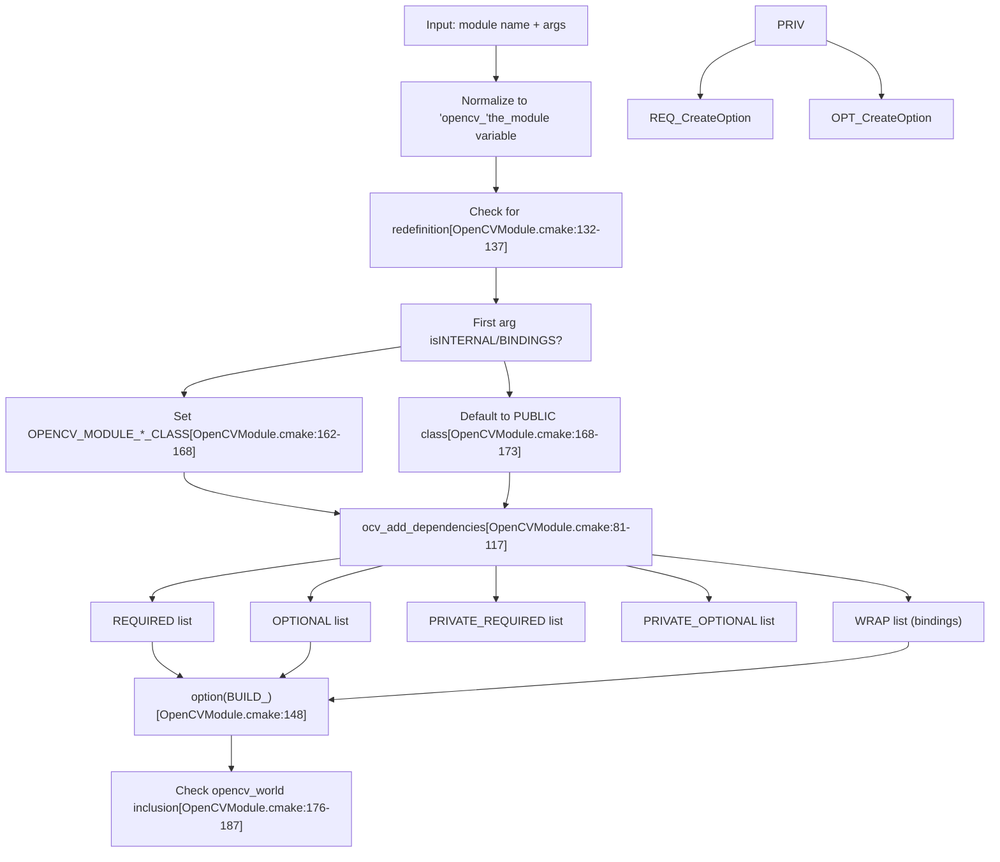
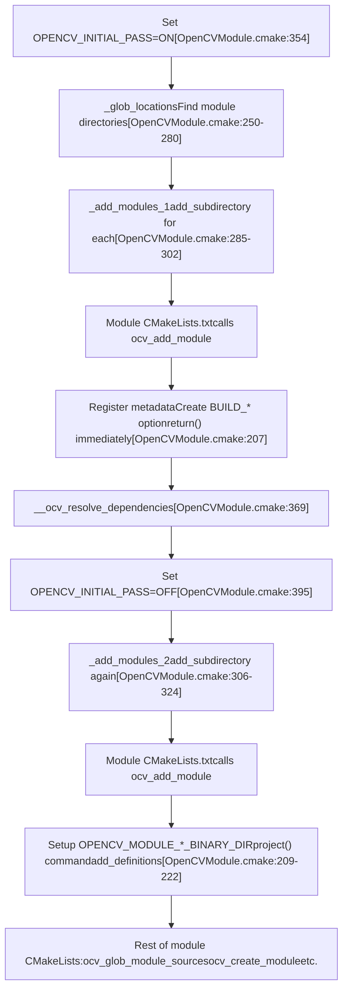
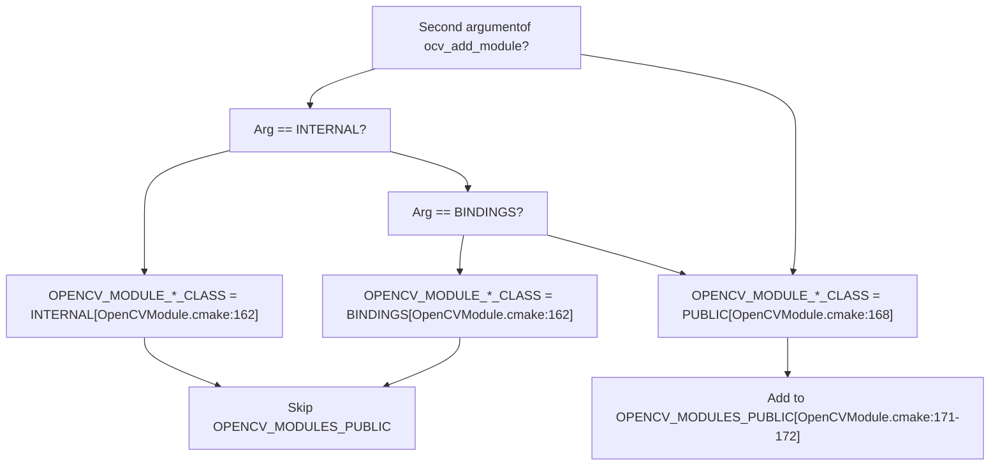
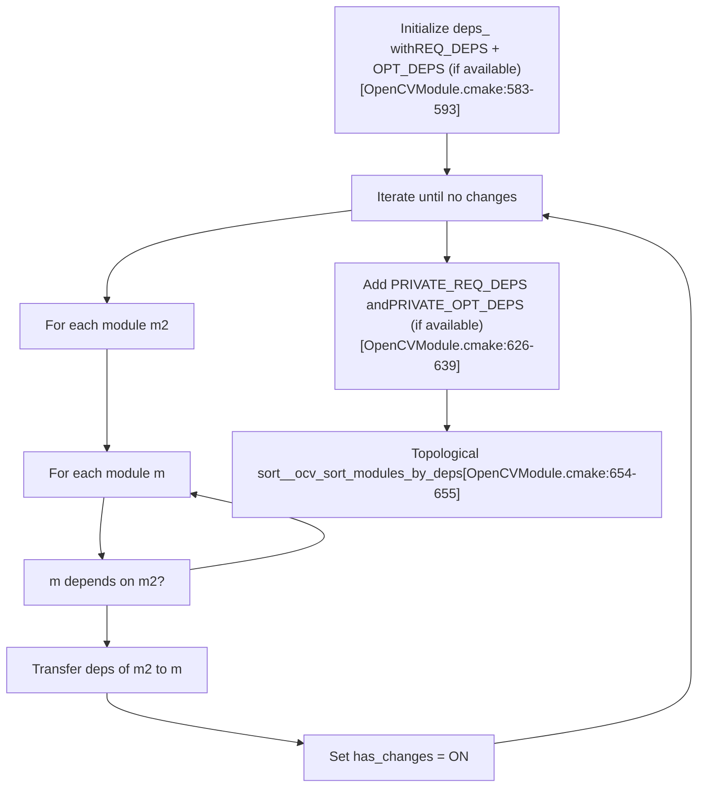
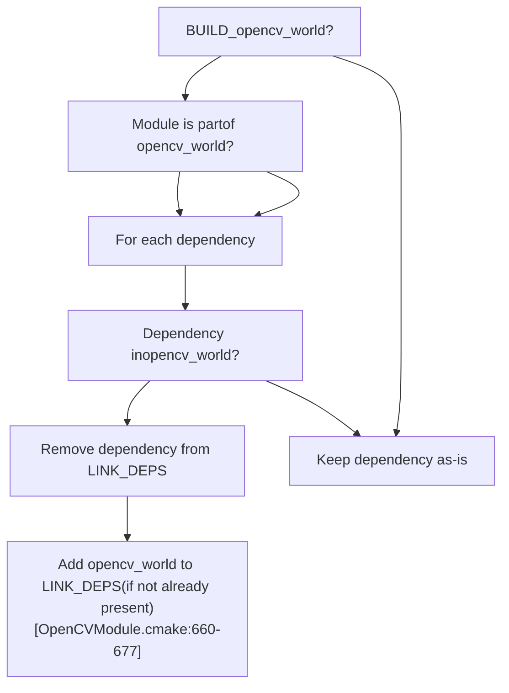
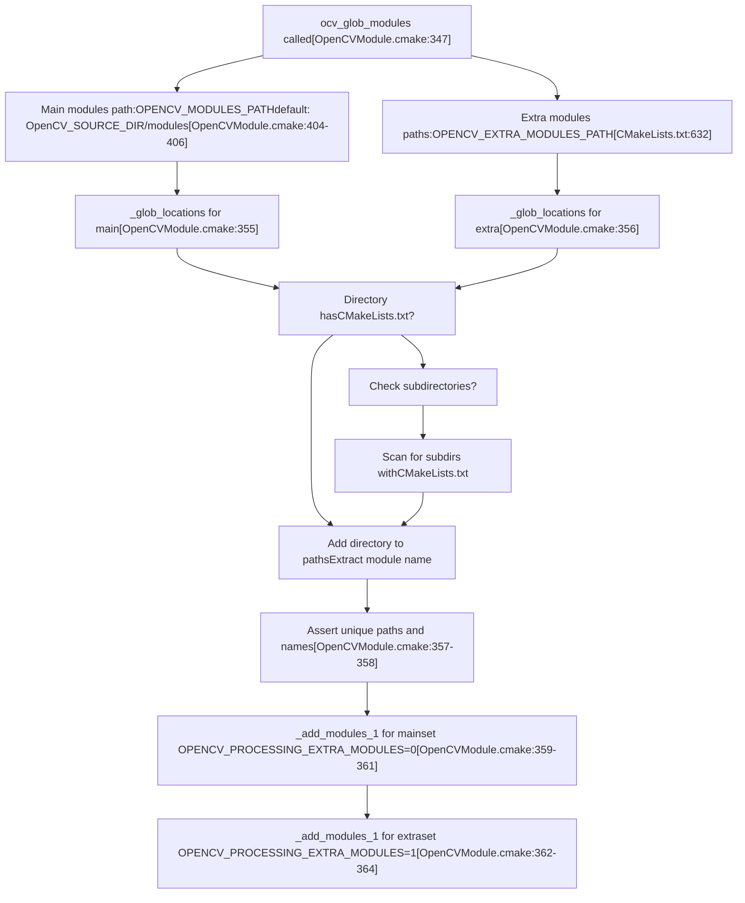

# Module Configuration and ocv\_add\_module

Relevant source files

-   [3rdparty/fastcv/fastcv.cmake](https://github.com/opencv/opencv/blob/91c78f50/3rdparty/fastcv/fastcv.cmake)
-   [3rdparty/ippicv/CMakeLists.txt](https://github.com/opencv/opencv/blob/91c78f50/3rdparty/ippicv/CMakeLists.txt)
-   [CMakeLists.txt](https://github.com/opencv/opencv/blob/91c78f50/CMakeLists.txt)
-   [cmake/OpenCVCRTLinkage.cmake](https://github.com/opencv/opencv/blob/91c78f50/cmake/OpenCVCRTLinkage.cmake)
-   [cmake/OpenCVCompilerOptions.cmake](https://github.com/opencv/opencv/blob/91c78f50/cmake/OpenCVCompilerOptions.cmake)
-   [cmake/OpenCVDetectCXXCompiler.cmake](https://github.com/opencv/opencv/blob/91c78f50/cmake/OpenCVDetectCXXCompiler.cmake)
-   [cmake/OpenCVFindIPP.cmake](https://github.com/opencv/opencv/blob/91c78f50/cmake/OpenCVFindIPP.cmake)
-   [cmake/OpenCVFindIPPIW.cmake](https://github.com/opencv/opencv/blob/91c78f50/cmake/OpenCVFindIPPIW.cmake)
-   [cmake/OpenCVFindLibsGUI.cmake](https://github.com/opencv/opencv/blob/91c78f50/cmake/OpenCVFindLibsGUI.cmake)
-   [cmake/OpenCVFindLibsPerf.cmake](https://github.com/opencv/opencv/blob/91c78f50/cmake/OpenCVFindLibsPerf.cmake)
-   [cmake/OpenCVFindLibsVideo.cmake](https://github.com/opencv/opencv/blob/91c78f50/cmake/OpenCVFindLibsVideo.cmake)
-   [cmake/OpenCVGenConfig.cmake](https://github.com/opencv/opencv/blob/91c78f50/cmake/OpenCVGenConfig.cmake)
-   [cmake/OpenCVInstallLayout.cmake](https://github.com/opencv/opencv/blob/91c78f50/cmake/OpenCVInstallLayout.cmake)
-   [cmake/OpenCVModule.cmake](https://github.com/opencv/opencv/blob/91c78f50/cmake/OpenCVModule.cmake)
-   [cmake/OpenCVPCHSupport.cmake](https://github.com/opencv/opencv/blob/91c78f50/cmake/OpenCVPCHSupport.cmake)
-   [cmake/OpenCVUtils.cmake](https://github.com/opencv/opencv/blob/91c78f50/cmake/OpenCVUtils.cmake)
-   [cmake/templates/OpenCVConfig-version.cmake.in](https://github.com/opencv/opencv/blob/91c78f50/cmake/templates/OpenCVConfig-version.cmake.in)
-   [cmake/templates/OpenCVConfig.cmake.in](https://github.com/opencv/opencv/blob/91c78f50/cmake/templates/OpenCVConfig.cmake.in)
-   [cmake/templates/OpenCVConfig.root-WIN32.cmake.in](https://github.com/opencv/opencv/blob/91c78f50/cmake/templates/OpenCVConfig.root-WIN32.cmake.in)
-   [cmake/templates/cvconfig.h.in](https://github.com/opencv/opencv/blob/91c78f50/cmake/templates/cvconfig.h.in)
-   [modules/core/CMakeLists.txt](https://github.com/opencv/opencv/blob/91c78f50/modules/core/CMakeLists.txt)
-   [modules/highgui/CMakeLists.txt](https://github.com/opencv/opencv/blob/91c78f50/modules/highgui/CMakeLists.txt)
-   [modules/highgui/include/opencv2/highgui.hpp](https://github.com/opencv/opencv/blob/91c78f50/modules/highgui/include/opencv2/highgui.hpp)
-   [modules/highgui/include/opencv2/highgui/highgui.hpp](https://github.com/opencv/opencv/blob/91c78f50/modules/highgui/include/opencv2/highgui/highgui.hpp)
-   [modules/highgui/include/opencv2/highgui/highgui\_c.h](https://github.com/opencv/opencv/blob/91c78f50/modules/highgui/include/opencv2/highgui/highgui_c.h)
-   [modules/highgui/src/precomp.hpp](https://github.com/opencv/opencv/blob/91c78f50/modules/highgui/src/precomp.hpp)
-   [modules/highgui/src/window.cpp](https://github.com/opencv/opencv/blob/91c78f50/modules/highgui/src/window.cpp)
-   [modules/highgui/src/window\_QT.cpp](https://github.com/opencv/opencv/blob/91c78f50/modules/highgui/src/window_QT.cpp)
-   [modules/highgui/src/window\_QT.h](https://github.com/opencv/opencv/blob/91c78f50/modules/highgui/src/window_QT.h)
-   [modules/highgui/src/window\_cocoa.mm](https://github.com/opencv/opencv/blob/91c78f50/modules/highgui/src/window_cocoa.mm)
-   [modules/highgui/src/window\_gtk.cpp](https://github.com/opencv/opencv/blob/91c78f50/modules/highgui/src/window_gtk.cpp)
-   [modules/highgui/src/window\_w32.cpp](https://github.com/opencv/opencv/blob/91c78f50/modules/highgui/src/window_w32.cpp)
-   [modules/java/CMakeLists.txt](https://github.com/opencv/opencv/blob/91c78f50/modules/java/CMakeLists.txt)
-   [modules/videoio/CMakeLists.txt](https://github.com/opencv/opencv/blob/91c78f50/modules/videoio/CMakeLists.txt)

## Purpose and Scope

This document explains OpenCV's module system, focusing on how modules are declared, configured, and built. It covers the `ocv_add_module` macro, dependency resolution, module metadata management, and the two-pass configuration system that enables modular compilation.

For information about cross-platform build configuration and third-party library detection, see [Cross-Platform Build Configuration](/opencv/opencv/2.1-cross-platform-build-configuration). For package generation and version management, see [Version Management and Platform Builds](/opencv/opencv/2.3-version-management-packaging-and-platform-builds).

## Module Declaration Overview

OpenCV modules are defined using the `ocv_add_module` macro, which registers a module with the build system and declares its dependencies. Each module contains a `CMakeLists.txt` file that invokes this macro as its first significant action.

**Typical Module Declaration Pattern**

```
ocv_add_module(module_name     [INTERNAL|BINDINGS]    [REQUIRED] dependency1 dependency2    [OPTIONAL] optional_dep1    [PRIVATE_REQUIRED] private_dep    [WRAP] python java)
```
**Module Declaration Flow**


Sources: [cmake/OpenCVModule.cmake124-223](https://github.com/opencv/opencv/blob/91c78f50/cmake/OpenCVModule.cmake#L124-L223)

## Module System Architecture

The module system uses a centralized registry that tracks all modules, their locations, dependencies, and build status. Global CMake cache variables maintain this state across configuration runs.

**Module Registry Structure**


Sources: [cmake/OpenCVModule.cmake1-25](https://github.com/opencv/opencv/blob/91c78f50/cmake/OpenCVModule.cmake#L1-L25) [cmake/OpenCVModule.cmake69-74](https://github.com/opencv/opencv/blob/91c78f50/cmake/OpenCVModule.cmake#L69-L74)

## Dependency Specification

Dependencies are specified through the `ocv_add_module` and `ocv_add_dependencies` macros. The system supports four dependency types with different visibility and requirement levels.

**Dependency Types and Resolution**

| Dependency Type | Keyword | Visibility | Effect if Missing |
| --- | --- | --- | --- |
| Public Required | `REQUIRED` | Exported in CMake config | Module disabled |
| Public Optional | `OPTIONAL` | Exported if available | Ignored |
| Private Required | `PRIVATE_REQUIRED` | Internal only | Module disabled |
| Private Optional | `PRIVATE_OPTIONAL` | Internal only | Ignored |

**Example: core Module Dependencies**

```
# From modules/core/CMakeLists.txtocv_add_module(core    OPTIONAL opencv_cudev    WRAP java objc python js)
```
**Example: imgcodecs Module Dependencies**

```
# From modules/imgcodecs/CMakeLists.txtocv_add_module(imgcodecs opencv_imgproc     WRAP java objc python)
```
**Dependency Resolution Process**


Sources: [cmake/OpenCVModule.cmake347-399](https://github.com/opencv/opencv/blob/91c78f50/cmake/OpenCVModule.cmake#L347-L399) [cmake/OpenCVModule.cmake500-695](https://github.com/opencv/opencv/blob/91c78f50/cmake/OpenCVModule.cmake#L500-L695)

## The ocv\_add\_module Macro

The `ocv_add_module` macro is the primary interface for module registration. It processes dependency declarations, creates build options, and initializes module metadata.

**Macro Signature and Parameters**

[cmake/OpenCVModule.cmake119-223](https://github.com/opencv/opencv/blob/91c78f50/cmake/OpenCVModule.cmake#L119-L223)

```
ocv_add_module(<name>
    [INTERNAL|BINDINGS]
    [REQUIRED] <dep1> <dep2> ...
    [OPTIONAL] <opt_dep1> ...
    [PRIVATE_REQUIRED] <priv_dep1> ...
    [PRIVATE_OPTIONAL] <priv_opt1> ...
    [WRAP] <wrapper1> <wrapper2> ...)
```
**Parameter Processing**


Sources: [cmake/OpenCVModule.cmake124-223](https://github.com/opencv/opencv/blob/91c78f50/cmake/OpenCVModule.cmake#L124-L223)

## Two-Pass Configuration System

OpenCV uses a two-pass system: the first pass discovers and registers all modules, while the second pass creates build targets after dependency resolution.

**Two-Pass Execution Model**


Sources: [cmake/OpenCVModule.cmake347-399](https://github.com/opencv/opencv/blob/91c78f50/cmake/OpenCVModule.cmake#L347-L399) [cmake/OpenCVModule.cmake130-223](https://github.com/opencv/opencv/blob/91c78f50/cmake/OpenCVModule.cmake#L130-L223)

## Module Classes and Visibility

Modules are categorized into three classes that affect their visibility in the public API and installation packages.

**Module Classification System**

| Class | Declaration | Public API | Installed | Examples |
| --- | --- | --- | --- | --- |
| `PUBLIC` | Default or explicit | Yes | Yes | `core`, `imgproc`, `dnn` |
| `INTERNAL` | `ocv_add_module(name INTERNAL ...)` | No | No | Test utilities, internal tools |
| `BINDINGS` | `ocv_add_module(name BINDINGS ...)` | No | Yes | `python`, `java` binding generators |

**Class Determination Logic**


Sources: [cmake/OpenCVModule.cmake161-173](https://github.com/opencv/opencv/blob/91c78f50/cmake/OpenCVModule.cmake#L161-L173)

## Module-Specific Variables

The build system maintains numerous CMake cache variables for each module, prefixed with `OPENCV_MODULE_<module_name>_`.

**Key Module Variables**


Sources: [cmake/OpenCVModule.cmake1-25](https://github.com/opencv/opencv/blob/91c78f50/cmake/OpenCVModule.cmake#L1-L25)

## Dependency Resolution Details

The dependency resolution algorithm ensures that all required dependencies are available and propagates transitive dependencies through the module graph.

**Whitelist Filtering**

When `BUILD_LIST` is set, only specified modules and their dependencies are built.

[cmake/OpenCVModule.cmake509-541](https://github.com/opencv/opencv/blob/91c78f50/cmake/OpenCVModule.cmake#L509-L541)

```
if(BUILD_LIST)    # Prepare the list    string(REGEX REPLACE "[ ,:]+" ";" whitelist "${BUILD_LIST}")    ocv_list_add_prefix(whitelist "opencv_")        # Expand the list to include dependencies    foreach(depth RANGE 10)        foreach(m ${whitelist})            list(APPEND new_whitelist ${OPENCV_MODULE_${m}_REQ_DEPS})            list(APPEND new_whitelist ${OPENCV_MODULE_${m}_PRIVATE_REQ_DEPS})        endforeach()    endforeach()        # Disable modules not in whitelist    foreach(m ${OPENCV_MODULES_BUILD})        if(m NOT IN whitelist)            __ocv_module_turn_off(${m})        endif()    endforeach()endif()
```
**Transitive Dependency Propagation**


**Topological Sorting Algorithm**

The `__ocv_sort_modules_by_deps` function orders modules so dependencies come before dependents.

[cmake/OpenCVModule.cmake447-497](https://github.com/opencv/opencv/blob/91c78f50/cmake/OpenCVModule.cmake#L447-L497)

```
Algorithm:
1. Start with unsorted module list
2. For each module:
   - Check if all its dependencies are already in result
   - If yes, add module to result and remove from input
   - If no, skip and try next module
3. Repeat until all modules processed
4. If stuck (no progress), check for cycles or unresolved deps
```
Sources: [cmake/OpenCVModule.cmake447-497](https://github.com/opencv/opencv/blob/91c78f50/cmake/OpenCVModule.cmake#L447-L497)

## Integration with opencv\_world

The `opencv_world` module is a special aggregated module that combines multiple OpenCV modules into a single shared library.

**opencv\_world Inclusion Logic**

[cmake/OpenCVModule.cmake176-187](https://github.com/opencv/opencv/blob/91c78f50/cmake/OpenCVModule.cmake#L176-L187)

A module is included in `opencv_world` if:

-   `OPENCV_MODULE_IS_PART_OF_WORLD` is not explicitly set to OFF, AND
-   Module class is not `BINDINGS`, AND
-   Either building shared libs OR module type is not explicitly `STATIC`, AND
-   Not processing extra modules when `OPENCV_WORLD_EXCLUDE_EXTRA_MODULES` is ON

**Dependency Link Adjustment for opencv\_world**


Sources: [cmake/OpenCVModule.cmake660-677](https://github.com/opencv/opencv/blob/91c78f50/cmake/OpenCVModule.cmake#L660-L677)

## Module Discovery Process

The build system automatically discovers modules by scanning specified directories.

**Module Discovery Flow**


Sources: [cmake/OpenCVModule.cmake347-399](https://github.com/opencv/opencv/blob/91c78f50/cmake/OpenCVModule.cmake#L347-L399) [cmake/OpenCVModule.cmake250-280](https://github.com/opencv/opencv/blob/91c78f50/cmake/OpenCVModule.cmake#L250-L280)

## Practical Examples

**Example 1: Simple Module with Dependencies**

The `imgcodecs` module depends on `imgproc` and provides Python/Java bindings:

[modules/imgcodecs/CMakeLists.txt1-2](https://github.com/opencv/opencv/blob/91c78f50/modules/imgcodecs/CMakeLists.txt#L1-L2)

```
set(the_description "Image I/O")ocv_add_module(imgcodecs opencv_imgproc WRAP java objc python)
```
**Example 2: Module with Optional Dependencies**

The `core` module optionally uses CUDA if available:

[modules/core/CMakeLists.txt35-37](https://github.com/opencv/opencv/blob/91c78f50/modules/core/CMakeLists.txt#L35-L37)

```
ocv_add_module(core               OPTIONAL opencv_cudev               WRAP java objc python js)
```
**Example 3: Complex Module with Multiple Dependency Types**

The `highgui` module has a mix of required, optional, and binding dependencies:

[modules/highgui/CMakeLists.txt3-7](https://github.com/opencv/opencv/blob/91c78f50/modules/highgui/CMakeLists.txt#L3-L7)

```
if(ANDROID)  ocv_add_module(highgui opencv_imgproc OPTIONAL opencv_imgcodecs opencv_videoio WRAP python)else()  ocv_add_module(highgui opencv_imgproc OPTIONAL opencv_imgcodecs opencv_videoio WRAP python java)endif()
```
**Example 4: Java Bindings Module**

The `java` module is a BINDINGS class module with private dependencies:

[modules/java/CMakeLists.txt16](https://github.com/opencv/opencv/blob/91c78f50/modules/java/CMakeLists.txt#L16-L16)

```
ocv_add_module(java BINDINGS opencv_core opencv_imgproc     PRIVATE_REQUIRED opencv_java_bindings_generator)
```
## Module Helper Macros

Beyond `ocv_add_module`, several helper macros support module configuration.

**Module Disabling**

```
# Disable module if requirements not metocv_module_disable(module_name)# Or use underscore variant without automatic returnocv_module_disable_(module_name)
```
[cmake/OpenCVModule.cmake226-244](https://github.com/opencv/opencv/blob/91c78f50/cmake/OpenCVModule.cmake#L226-L244)

**Include Directories for Dependencies**

```
# Include headers from specified modulesocv_include_modules(opencv_core opencv_imgproc) # Include headers from modules and their dependencies (recursive)ocv_include_modules_recurse(opencv_core) # Target-specific includesocv_target_include_modules(target_name opencv_core opencv_imgproc)
```
[cmake/OpenCVModule.cmake699-752](https://github.com/opencv/opencv/blob/91c78f50/cmake/OpenCVModule.cmake#L699-L752)

**Module-Specific Include Directories**

```
# Add include directories for current moduleocv_module_include_directories([paths...])
```
[cmake/OpenCVModule.cmake755-772](https://github.com/opencv/opencv/blob/91c78f50/cmake/OpenCVModule.cmake#L755-L772)

Sources: [cmake/OpenCVModule.cmake226-772](https://github.com/opencv/opencv/blob/91c78f50/cmake/OpenCVModule.cmake#L226-L772)

## Build Hooks and Customization

The module system provides hooks at various stages for customization.

**Available Hook Points**

| Hook Name | Invocation Point | Use Case |
| --- | --- | --- |
| `PRE_ADD_MODULE` | Before processing module args | Global preprocessing |
| `PRE_ADD_MODULE_${the_module}` | Before specific module | Module-specific setup |
| `POST_ADD_MODULE` | After module registration | Global postprocessing |
| `POST_ADD_MODULE_${the_module}` | After specific module | Module-specific finalization |
| `PRE_MODULES_CREATE_${the_module}` | Before target creation | Pre-build setup |
| `POST_MODULES_CREATE_${the_module}` | After target creation | Post-build setup |

[cmake/OpenCVModule.cmake157-158](https://github.com/opencv/opencv/blob/91c78f50/cmake/OpenCVModule.cmake#L157-L158) [cmake/OpenCVModule.cmake205-206](https://github.com/opencv/opencv/blob/91c78f50/cmake/OpenCVModule.cmake#L205-L206) [cmake/OpenCVModule.cmake310-321](https://github.com/opencv/opencv/blob/91c78f50/cmake/OpenCVModule.cmake#L310-L321)

Hooks are registered via `ocv_cmake_hook_append` and executed via `ocv_cmake_hook`.

Sources: [cmake/OpenCVUtils.cmake48-87](https://github.com/opencv/opencv/blob/91c78f50/cmake/OpenCVUtils.cmake#L48-L87) [cmake/OpenCVModule.cmake157-158](https://github.com/opencv/opencv/blob/91c78f50/cmake/OpenCVModule.cmake#L157-L158) [cmake/OpenCVModule.cmake205-206](https://github.com/opencv/opencv/blob/91c78f50/cmake/OpenCVModule.cmake#L205-L206) [cmake/OpenCVModule.cmake310-321](https://github.com/opencv/opencv/blob/91c78f50/cmake/OpenCVModule.cmake#L310-L321)

## Summary

The OpenCV module system provides a robust framework for declaring and building modular components:

1.  **Declarative API**: The `ocv_add_module` macro provides a clean interface for module registration
2.  **Flexible Dependencies**: Four dependency types (public/private × required/optional) enable precise control
3.  **Two-Pass Design**: Discovery and target creation are separated for proper dependency resolution
4.  **Automatic Resolution**: Transitive dependencies are computed and modules are topologically sorted
5.  **Classification System**: PUBLIC, INTERNAL, and BINDINGS classes control visibility and installation
6.  **World Integration**: Automatic handling of the aggregated `opencv_world` library
7.  **Extensibility**: Hook points and helper macros support customization at multiple stages

This architecture enables OpenCV to maintain a large codebase with complex interdependencies while supporting selective builds, multiple platforms, and various language bindings.
