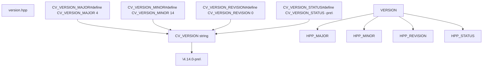

# Version Management, Packaging, and Platform Builds

Relevant source files

-   [3rdparty/fastcv/fastcv.cmake](https://github.com/opencv/opencv/blob/91c78f50/3rdparty/fastcv/fastcv.cmake)
-   [3rdparty/ippicv/CMakeLists.txt](https://github.com/opencv/opencv/blob/91c78f50/3rdparty/ippicv/CMakeLists.txt)
-   [README.md](https://github.com/opencv/opencv/blob/91c78f50/README.md?plain=1)
-   [cmake/OpenCVFindIPP.cmake](https://github.com/opencv/opencv/blob/91c78f50/cmake/OpenCVFindIPP.cmake)
-   [cmake/OpenCVFindIPPIW.cmake](https://github.com/opencv/opencv/blob/91c78f50/cmake/OpenCVFindIPPIW.cmake)
-   [cmake/OpenCVFindLibsPerf.cmake](https://github.com/opencv/opencv/blob/91c78f50/cmake/OpenCVFindLibsPerf.cmake)
-   [cmake/OpenCVGenConfig.cmake](https://github.com/opencv/opencv/blob/91c78f50/cmake/OpenCVGenConfig.cmake)
-   [cmake/OpenCVInstallLayout.cmake](https://github.com/opencv/opencv/blob/91c78f50/cmake/OpenCVInstallLayout.cmake)
-   [cmake/OpenCVPackaging.cmake](https://github.com/opencv/opencv/blob/91c78f50/cmake/OpenCVPackaging.cmake)
-   [cmake/templates/OpenCVConfig-version.cmake.in](https://github.com/opencv/opencv/blob/91c78f50/cmake/templates/OpenCVConfig-version.cmake.in)
-   [cmake/templates/OpenCVConfig.cmake.in](https://github.com/opencv/opencv/blob/91c78f50/cmake/templates/OpenCVConfig.cmake.in)
-   [data/CMakeLists.txt](https://github.com/opencv/opencv/blob/91c78f50/data/CMakeLists.txt)
-   [doc/tutorials/dnn/dnn\_android/dnn\_android.markdown](https://github.com/opencv/opencv/blob/91c78f50/doc/tutorials/dnn/dnn_android/dnn_android.markdown?plain=1)
-   [doc/tutorials/introduction/cross\_referencing/tutorial\_cross\_referencing.markdown](https://github.com/opencv/opencv/blob/91c78f50/doc/tutorials/introduction/cross_referencing/tutorial_cross_referencing.markdown?plain=1)
-   [modules/core/include/opencv2/core/version.hpp](https://github.com/opencv/opencv/blob/91c78f50/modules/core/include/opencv2/core/version.hpp)
-   [modules/dnn/include/opencv2/dnn/version.hpp](https://github.com/opencv/opencv/blob/91c78f50/modules/dnn/include/opencv2/dnn/version.hpp)
-   [modules/python/package/setup.py](https://github.com/opencv/opencv/blob/91c78f50/modules/python/package/setup.py)
-   [platforms/android/build\_sdk.py](https://github.com/opencv/opencv/blob/91c78f50/platforms/android/build_sdk.py)
-   [platforms/android/ndk-10.config.py](https://github.com/opencv/opencv/blob/91c78f50/platforms/android/ndk-10.config.py)
-   [platforms/android/ndk-16.config.py](https://github.com/opencv/opencv/blob/91c78f50/platforms/android/ndk-16.config.py)
-   [platforms/maven/opencv-it/pom.xml](https://github.com/opencv/opencv/blob/91c78f50/platforms/maven/opencv-it/pom.xml)
-   [platforms/maven/opencv/pom.xml](https://github.com/opencv/opencv/blob/91c78f50/platforms/maven/opencv/pom.xml)
-   [platforms/maven/pom.xml](https://github.com/opencv/opencv/blob/91c78f50/platforms/maven/pom.xml)
-   [samples/CMakeLists.txt](https://github.com/opencv/opencv/blob/91c78f50/samples/CMakeLists.txt)
-   [samples/cpp/CMakeLists.txt](https://github.com/opencv/opencv/blob/91c78f50/samples/cpp/CMakeLists.txt)
-   [samples/gpu/CMakeLists.txt](https://github.com/opencv/opencv/blob/91c78f50/samples/gpu/CMakeLists.txt)

## Purpose and Scope

This document describes OpenCV's version management system, CPack-based packaging, and platform-specific build processes. It covers:

-   Version numbering scheme and `version.hpp` header
-   How version numbers propagate to CMake, Python, Maven, and the Android build script
-   CPack generation of DEB, RPM, and ZIP packages via `cmake/OpenCVPackaging.cmake`
-   `build_sdk.py` orchestration of multi-ABI Android SDK builds
-   Maven artifact generation for Java/JVM platforms
-   Python package distribution (`setup.py`)

For general build system configuration, see page 2.1. For module-level build details, see page 2.2. </old\_str> <new\_str>

## Purpose and Scope

This document describes OpenCV's version management system, CPack-based packaging, and platform-specific build processes. It covers:

-   Version numbering scheme and `version.hpp` header
-   How version numbers propagate to CMake, Python, Maven, and the Android build script
-   CPack generation of DEB, RPM, and ZIP packages via `cmake/OpenCVPackaging.cmake`
-   `build_sdk.py` orchestration of multi-ABI Android SDK builds
-   Maven artifact generation for Java/JVM platforms
-   Python package distribution (`setup.py`)

For general build system configuration, see page 2.1. For module-level build details, see page 2.2.

---

## Version Numbering Scheme

OpenCV uses a four-component version scheme defined in [modules/core/include/opencv2/core/version.hpp1-27](https://github.com/opencv/opencv/blob/91c78f50/modules/core/include/opencv2/core/version.hpp#L1-L27):

```
CV_VERSION_MAJOR.CV_VERSION_MINOR.CV_VERSION_REVISION[CV_VERSION_STATUS]
```
### Version Components

| Component | Macro | Purpose | Example |
| --- | --- | --- | --- |
| Major | `CV_VERSION_MAJOR` | API-breaking changes | 4 |
| Minor | `CV_VERSION_MINOR` | Feature releases | 14 |
| Revision | `CV_VERSION_REVISION` | Bug fixes | 0 |
| Status | `CV_VERSION_STATUS` | Development stage | "-pre" |

The version status is optional and typically contains values like `"-pre"`, `"-dev"`, `"-rc1"`, or empty string for release versions.

**Version Header Structure**


**Sources:** [modules/core/include/opencv2/core/version.hpp1-27](https://github.com/opencv/opencv/blob/91c78f50/modules/core/include/opencv2/core/version.hpp#L1-L27)

---

## Version Propagation Through Build System

The version information flows from the source header through CMake configuration to platform-specific build artifacts.

```mermaid
flowchart TD
    VER_HPP["version.hppCV_VERSION_MAJOR=4CV_VERSION_MINOR=14CV_VERSION_REVISION=0CV_VERSION_STATUS=-pre\"]
    CMAKE["CMakeLists.txtdetermine_opencv_version()"]
    VER_CMAKE["OpenCVVersion.cmakeOPENCV_VERSION variable"]
    WIN_DLL["Windows DLLopencv_core4140.dll"]
    LINUX_SO["Linux Shared Liblibopencv_core.so.4.14.0"]
    ANDROID_AAR["Android AAROpenCV-4.14.0-android-sdk.zip"]
    MAVEN_JAR["Maven Artifactopencv-4.13.0.jar"]
    PYTHON_WHL["Python Wheelopencv-4.13.0-py3-none-any.whl"]

    CMAKE --> VER_CMAKE
    VER --> HPP_CMAKE
    VER --> CMAKE_WIN_DLL
    VER --> CMAKE_LINUX_SO
    VER --> CMAKE_ANDROID_AAR
    VER --> CMAKE_MAVEN_JAR
    VER --> CMAKE_PYTHON_WHL
```


**Sources:** [modules/core/include/opencv2/core/version.hpp1-27](https://github.com/opencv/opencv/blob/91c78f50/modules/core/include/opencv2/core/version.hpp#L1-L27) [CMakeLists.txt569-621](https://github.com/opencv/opencv/blob/91c78f50/CMakeLists.txt#L569-L621) [platforms/android/build\_sdk.py70-79](https://github.com/opencv/opencv/blob/91c78f50/platforms/android/build_sdk.py#L70-L79)

### DLL Version Postfix (Windows)

On Windows, OpenCV appends a version string to DLL names to allow side-by-side installation of multiple versions:

-   **Release DLLs**: `opencv_<module><MAJOR><MINOR><REVISION>.dll` (e.g., `opencv_core4140.dll`)
-   **Debug DLLs**: `opencv_<module><MAJOR><MINOR><REVISION>d.dll` (e.g., `opencv_core4140d.dll`)

The postfix is configured at [CMakeLists.txt604-611](https://github.com/opencv/opencv/blob/91c78f50/CMakeLists.txt#L604-L611):

```
if(WIN32)  # Postfix of DLLs:  ocv_update(OPENCV_DLLVERSION "${OPENCV_VERSION_MAJOR}${OPENCV_VERSION_MINOR}${OPENCV_VERSION_PATCH}")  ocv_update(OPENCV_DEBUG_POSTFIX d)else()  # Postfix of so's:  ocv_update(OPENCV_DLLVERSION "")  ocv_update(OPENCV_DEBUG_POSTFIX "")endif()
```
**Sources:** [CMakeLists.txt604-615](https://github.com/opencv/opencv/blob/91c78f50/CMakeLists.txt#L604-L615)

---

## Android SDK Build System

The Android SDK is built using the Python script `build_sdk.py`, which orchestrates CMake builds for multiple ABIs and packages them into an AAR archive.

### Android Build Pipeline

```mermaid
flowchart TD
    BUILD_SDK_PY["build_sdk.py--config ndk-XX.config.py"]
    NDK_CONFIG["ndk-XX.config.pyABI definitions"]
    ANDROID_NDK["ANDROID_NDKenvironment variable"]
    ANDROID_SDK["ANDROID_SDKenvironment variable"]
    ABI_ARMV7["armeabi-v7a Buildplatform_id=2toolchain=clang"]
    ABI_ARM64["arm64-v8a Buildplatform_id=3toolchain=clang"]
    ABI_X86["x86 Buildplatform_id=5toolchain=clang"]
    ABI_X86_64["x86_64 Buildplatform_id=6toolchain=clang"]
    CMAKE_CONF["CMake Configure-DANDROID_ABI=...-DANDROID_PLATFORM=..."]
    NINJA_BUILD["Ninja Buildlibopencv_java4.so"]
    INSTALL["Install too4a/sdk/native/libs/"]
    COPY_LIBS["Copy Native Libslibs//libopencv_java4.so"]
    COPY_JAVA["Copy Java Classessrc/org/opencv/**/*.java"]
    COPY_HEADERS["Copy C++ Headerssdk/native/jni/include/"]
    GEN_AAR["Generate AAROpenCV-android-sdk/"]
    AAR_PKG["OpenCV-4.14.0-android-sdk.zip"]
    AAR_STRUCTURE["sdk/  native/libs//.so  native/jni/include/  java/src//.java  samples/"]

    BUILD --> SDK_PY_NDK_CONFIG
    BUILD --> SDK_PY_ANDROID_NDK
    BUILD --> SDK_PY_ANDROID_SDK
    NDK --> CONFIG_ABI_ARMV7
    NDK --> CONFIG_ABI_ARM64
    NDK --> CONFIG_ABI_X86
    NDK --> CONFIG_ABI_X86_64
    ABI --> ARMV7_CMAKE_CONF
    ABI --> ARM64_CMAKE_CONF
    ABI --> X86_CMAKE_CONF
    ABI --> X86_64_CMAKE_CONF
    CMAKE --> CONF_NINJA_BUILD
    NINJA --> BUILD_INSTALL
    INSTALL --> COPY_LIBS
    INSTALL --> COPY_JAVA
    INSTALL --> COPY_HEADERS
    COPY --> LIBS_GEN_AAR
    COPY --> JAVA_GEN_AAR
    COPY --> HEADERS_GEN_AAR
    GEN --> AAR_AAR_PKG
    AAR --> PKG_AAR_STRUCTURE
```


**Sources:** [platforms/android/build\_sdk.py1-650](https://github.com/opencv/opencv/blob/91c78f50/platforms/android/build_sdk.py#L1-L650) [cmake/OpenCVGenAndroidMK.cmake1-100](https://github.com/opencv/opencv/blob/91c78f50/cmake/OpenCVGenAndroidMK.cmake#L1-L100)

### ABI Configuration

Each Android ABI is defined with specific build parameters in configuration files like `ndk-XX.config.py`:

| ABI | Platform ID | Architecture | Typical Uses |
| --- | --- | --- | --- |
| armeabi-v7a | 2 | ARMv7 32-bit with NEON | Older phones, low-end devices |
| arm64-v8a | 3 | ARMv8 64-bit | Modern phones, primary target |
| x86 | 5 | Intel 32-bit | Emulators, tablets |
| x86\_64 | 6 | Intel 64-bit | High-end tablets, ChromeOS |

The `ABI` class at [platforms/android/build\_sdk.py120-143](https://github.com/opencv/opencv/blob/91c78f50/platforms/android/build_sdk.py#L120-L143) encapsulates per-ABI configuration:

```
class ABI:    def __init__(self, platform_id, name, toolchain, ndk_api_level = None, cmake_vars = dict()):        self.platform_id = platform_id  # platform code for apk version        self.name = name                # official Android ABI identifier        self.toolchain = toolchain      # toolchain identifier for cmake        self.cmake_vars = dict(            ANDROID_STL="c++_shared",            ANDROID_ABI=self.name,            ANDROID_PLATFORM_ID=platform_id,        )
```
**Sources:** [platforms/android/build\_sdk.py120-143](https://github.com/opencv/opencv/blob/91c78f50/platforms/android/build_sdk.py#L120-L143) [platforms/android/ndk-10.config.py1-11](https://github.com/opencv/opencv/blob/91c78f50/platforms/android/ndk-10.config.py#L1-L11)

### Builder Class Responsibilities

The `Builder` class at [platforms/android/build\_sdk.py147-245](https://github.com/opencv/opencv/blob/91c78f50/platforms/android/build_sdk.py#L147-L245) manages the entire Android SDK build:

| Method | Location | Responsibility |
| --- | --- | --- |
| `get_cmake()` | [platforms/android/build\_sdk.py169-182](https://github.com/opencv/opencv/blob/91c78f50/platforms/android/build_sdk.py#L169-L182) | Locate CMake (system PATH or Android SDK) |
| `get_ninja()` | [platforms/android/build\_sdk.py184-197](https://github.com/opencv/opencv/blob/91c78f50/platforms/android/build_sdk.py#L184-L197) | Locate Ninja (system PATH or Android SDK) |
| `get_toolchain_file()` | [platforms/android/build\_sdk.py199-208](https://github.com/opencv/opencv/blob/91c78f50/platforms/android/build_sdk.py#L199-L208) | Select `android.toolchain.cmake` (NDK or OpenCV fallback) |
| `build_library(abi, do_install, no_media_ndk)` | [platforms/android/build\_sdk.py222-298](https://github.com/opencv/opencv/blob/91c78f50/platforms/android/build_sdk.py#L222-L298) | Configure CMake and run Ninja for one ABI |
| `build_javadoc()` | [platforms/android/build\_sdk.py300-345](https://github.com/opencv/opencv/blob/91c78f50/platforms/android/build_sdk.py#L300-L345) | Generate Javadoc from Java sources |
| `gather_results()` | [platforms/android/build\_sdk.py350-368](https://github.com/opencv/opencv/blob/91c78f50/platforms/android/build_sdk.py#L350-L368) | Copy/move install outputs into the final SDK directory |

Sources: [platforms/android/build\_sdk.py147-368](https://github.com/opencv/opencv/blob/91c78f50/platforms/android/build_sdk.py#L147-L368)

---

## Maven Artifact Generation

OpenCV publishes Java artifacts to Maven Central for JVM-based applications. The Maven build is configured using POM files in `platforms/maven/`.

### Maven Project Structure

```mermaid
flowchart TD
    PARENT["opencv-parentpom.xmlgroupId: org.opencvversion: 4.13.0"]
    OPENCV_MODULE["opencvpom.xmlpackaging: bundleOSGi support"]
    OPENCV_IT["opencv-itpom.xmlIntegration testsPax Exam"]
    CMAKE_BUILD["CMake BuildBUILD_JAVA=ON"]
    JAVA_GEN["Java Code Generationgen2.py / gen_java.py"]
    JAR_BUILD["JAR Creationopencv-4130.jar"]
    NATIVE_LIB["Native Librarylibopencv_java4.so"]
    JAR_ARTIFACT["opencv-4.13.0.jarorg/opencv/**/*.class"]
    NATIVE_ARTIFACT["opencv-4.13.0-natives--.jarContains .so/.dylib/.dll"]
    POM_ARTIFACT["opencv-4.13.0.pomDependency metadata"]
    OSSRH["OSSRH Stagingoss.sonatype.org"]
    MAVEN_CENTRAL["Maven Centralrepo.maven.apache.org"]

    PARENT --> OPENCV_MODULE
    PARENT --> OPENCV_IT
    CMAKE --> BUILD_JAVA_GEN
    JAVA --> GEN_JAR_BUILD
    CMAKE --> BUILD_NATIVE_LIB
    JAR --> BUILD_JAR_ARTIFACT
    NATIVE --> LIB_NATIVE_ARTIFACT
    OPENCV --> MODULE_POM_ARTIFACT
    JAR --> ARTIFACT_OSSRH
    NATIVE --> ARTIFACT_OSSRH
    POM --> ARTIFACT_OSSRH
    OSSRH --> MAVEN_CENTRAL
```


**Sources:** [platforms/maven/pom.xml1-58](https://github.com/opencv/opencv/blob/91c78f50/platforms/maven/pom.xml#L1-L58) [platforms/maven/opencv/pom.xml1-150](https://github.com/opencv/opencv/blob/91c78f50/platforms/maven/opencv/pom.xml#L1-L150)

### Maven Coordinates and Versioning

The parent POM at [platforms/maven/pom.xml1-58](https://github.com/opencv/opencv/blob/91c78f50/platforms/maven/pom.xml#L1-L58) defines:

```
<groupId>org.opencv</groupId><artifactId>opencv-parent</artifactId><version>4.13.0</version>
```
Applications depend on OpenCV using:

```
<dependency>    <groupId>org.opencv</groupId>    <artifactId>opencv</artifactId>    <version>4.13.0</version></dependency>
```
The version must be manually synchronized with the C++ version defined in [modules/core/include/opencv2/core/version.hpp8-11](https://github.com/opencv/opencv/blob/91c78f50/modules/core/include/opencv2/core/version.hpp#L8-L11) This is typically done during release preparation.

**Sources:** [platforms/maven/pom.xml4-7](https://github.com/opencv/opencv/blob/91c78f50/platforms/maven/pom.xml#L4-L7) [platforms/maven/opencv/pom.xml4-12](https://github.com/opencv/opencv/blob/91c78f50/platforms/maven/opencv/pom.xml#L4-L12)

### Maven Build Properties

Key properties defined in [platforms/maven/opencv/pom.xml14-19](https://github.com/opencv/opencv/blob/91c78f50/platforms/maven/opencv/pom.xml#L14-L19):

| Property | Value | Purpose |
| --- | --- | --- |
| `source.path` | `../../..` | Path to OpenCV source root |
| `build.directory` | `<source>/build` | CMake build directory |
| `nativelibrary.name` | `libopencv_java${lib.version.string}.so` | Native lib filename |
| `resources.directory` | `<build>/src` | Generated Java sources |

**Sources:** [platforms/maven/opencv/pom.xml14-19](https://github.com/opencv/opencv/blob/91c78f50/platforms/maven/opencv/pom.xml#L14-L19)

---

## Python Package Distribution

OpenCV provides Python bindings distributed via PyPI (pip). The package is built using setuptools configuration in [modules/python/package/setup.py1-52](https://github.com/opencv/opencv/blob/91c78f50/modules/python/package/setup.py#L1-L52)

### Python Package Structure

```mermaid
flowchart TD
    CPP_HEADERS["C++ Headersopencv2/*.hpp"]
    HDR_PARSER["hdr_parser.pyParse headers"]
    GEN2["gen2.pyGenerate bindings"]
    GENERATED["pyopencv_generated_*.hcv2.pyi stubs"]
    CV2_PKG["cv2/  init.py  cv2.so  *.pyi  py.typed"]
    SETUP_PY["setup.pyversion: 4.13.0name: opencv"]
    PYPROJECT["pyproject.tomlbuild-backend: setuptools"]
    CMAKE_PY["CMakeBUILD_opencv_python3=ON"]
    BUILD_EXT["build_extCompile cv2.so"]
    BDIST_WHEEL["bdist_wheelCreate .whl"]
    WHEEL["opencv-4.13.0-cp39-cp39-linux_x86_64.whl"]
    PYPI["PyPIpip install opencv"]
    CONDA["Conda Forgeconda install opencv"]

    CPP --> HEADERS_HDR_PARSER
    HDR --> PARSER_GEN2
    GEN2 --> GENERATED
    GENERATED --> CV2_PKG
    CV2 --> PKG_SETUP_PY
    SETUP --> PY_PYPROJECT
    CMAKE --> PY_BUILD_EXT
    SETUP --> PY_BUILD_EXT
    BUILD --> EXT_BDIST_WHEEL
    BDIST --> WHEEL_WHEEL
    WHEEL --> PYPI
    WHEEL --> CONDA
```


**Sources:** [modules/python/package/setup.py1-52](https://github.com/opencv/opencv/blob/91c78f50/modules/python/package/setup.py#L1-L52) Diagram 2 from high-level overview

### Setup.py Configuration

The setup script at [modules/python/package/setup.py18-45](https://github.com/opencv/opencv/blob/91c78f50/modules/python/package/setup.py#L18-L45) defines:

```
def main():    package_name = 'opencv'    package_version = os.environ.get('OPENCV_VERSION', '4.13.0')        setuptools.setup(        name=package_name,        version=package_version,        url='https://github.com/opencv/opencv',        license='Apache 2.0',        description='OpenCV python bindings',        packages=setuptools.find_packages(),        package_data={            "cv2": typing_stub_files        },        # ...    )
```
The version is controlled by the `OPENCV_VERSION` environment variable, typically set by CMake during the build process.

**Sources:** [modules/python/package/setup.py18-45](https://github.com/opencv/opencv/blob/91c78f50/modules/python/package/setup.py#L18-L45)

### Typing Stub Files

OpenCV includes Python typing stubs (`.pyi` files) for IDE autocomplete and type checking. The setup script collects these at [modules/python/package/setup.py8-15](https://github.com/opencv/opencv/blob/91c78f50/modules/python/package/setup.py#L8-L15):

```
def collect_module_typing_stub_files(root_module_path):    stub_files = []    for module_path, _, files in os.walk(root_module_path):        stub_files.extend(            map(lambda p: os.path.join(module_path, p),                filter(lambda f: f.endswith(".pyi"), files))        )    return stub_files
```
When `cv2/py.typed` exists, the package is marked as PEP 561 compliant, enabling type checkers to use the stubs.

**Sources:** [modules/python/package/setup.py8-33](https://github.com/opencv/opencv/blob/91c78f50/modules/python/package/setup.py#L8-L33)

---

## Version-Dependent Build Artifacts Summary

Different platforms use the version information in different ways:

| Platform | Version Source | Update Method | Example Artifact |
| --- | --- | --- | --- |
| **Windows DLL** | `OPENCV_DLLVERSION` CMake var | Automatic (CMake) | `opencv_core4140.dll` |
| **Linux Shared Lib** | CMake `SOVERSION` | Automatic (CMake) | `libopencv_core.so.4.14.0` |
| **CPack DEB/RPM** | `OPENCV_VCSVERSION` CMake var | Automatic (CMake) | `opencv-4.14.0-amd64.deb` |
| **Android SDK ZIP** | `determine_opencv_version()` in `build_sdk.py` | Automatic (reads `version.hpp`) | `OpenCV-4.14.0-android-sdk.zip` |
| **Maven JAR** | `<version>` in `pom.xml` | Manual (release process) | `opencv-4.13.0.jar` |
| **Python Wheel** | `OPENCV_VERSION` env var or fallback literal | Semi-automatic (set by CI) | `opencv-4.13.0-cp39-cp39-linux_x86_64.whl` |

Sources: [platforms/android/build\_sdk.py156-157](https://github.com/opencv/opencv/blob/91c78f50/platforms/android/build_sdk.py#L156-L157) [cmake/OpenCVPackaging.cmake20-23](https://github.com/opencv/opencv/blob/91c78f50/cmake/OpenCVPackaging.cmake#L20-L23) [platforms/maven/pom.xml6](https://github.com/opencv/opencv/blob/91c78f50/platforms/maven/pom.xml#L6-L6) [modules/python/package/setup.py22](https://github.com/opencv/opencv/blob/91c78f50/modules/python/package/setup.py#L22-L22)

### Cross-Platform Version Consistency

**Version source and consumer mapping**

```mermaid
flowchart TD
    MAVEN["platforms/maven/pom.xmlversion: 4.13.0"]
    PYTHON_FALLBACK["modules/python/package/setup.pyfallback literal '4.13.0'"]
    VER_HPP["modules/core/include/opencv2/core/version.hppCV_VERSION_MAJOR / MINOR / REVISION / STATUS"]
    CMAKE_VARS["CMake variablesOPENCV_VERSION_MAJOR/MINOR/PATCHOPENCV_VCSVERSION"]
    BUILD_SDK["build_sdk.pydetermine_opencv_version()lines 70-79"]
    CPACK["cmake/OpenCVPackaging.cmakeCPACK_PACKAGE_VERSION_*"]
    OPENCVCFG["cmake/templates/OpenCVConfig.cmake.inOpenCV_VERSION_MAJOR/MINOR/PATCH"]

    VER --> HPP_CMAKE_VARS
    CMAKE --> VARS_CPACK
    CMAKE --> VARS_OPENCVCFG
    VER --> HPP_BUILD_SDK
```


Sources: [modules/core/include/opencv2/core/version.hpp1-27](https://github.com/opencv/opencv/blob/91c78f50/modules/core/include/opencv2/core/version.hpp#L1-L27) [platforms/android/build\_sdk.py70-79](https://github.com/opencv/opencv/blob/91c78f50/platforms/android/build_sdk.py#L70-L79) [cmake/OpenCVPackaging.cmake20-23](https://github.com/opencv/opencv/blob/91c78f50/cmake/OpenCVPackaging.cmake#L20-L23) [cmake/templates/OpenCVConfig.cmake.in48-53](https://github.com/opencv/opencv/blob/91c78f50/cmake/templates/OpenCVConfig.cmake.in#L48-L53) [platforms/maven/pom.xml6](https://github.com/opencv/opencv/blob/91c78f50/platforms/maven/pom.xml#L6-L6) [modules/python/package/setup.py22](https://github.com/opencv/opencv/blob/91c78f50/modules/python/package/setup.py#L22-L22)

Key points:

1.  **Single source of truth**: `version.hpp` defines all four version components.
2.  **CMake reads it at configure time** and stores the values in `OPENCV_VERSION_*` variables, which are substituted into `OpenCVConfig.cmake` and fed to CPack.
3.  **`build_sdk.py` reads it independently** via `determine_opencv_version()`, using regular-expression parsing rather than CMake, so it works without running CMake first.
4.  **Maven and Python fallbacks are manual**: the version literal in `platforms/maven/pom.xml` and the fallback in `setup.py` must be updated during the release process. `pom.xml` includes an enforcer rule that validates the POM version matches the extracted OpenCV version [platforms/maven/opencv/pom.xml197-215](https://github.com/opencv/opencv/blob/91c78f50/platforms/maven/opencv/pom.xml#L197-L215)

---

## DNN Module API Versioning

The DNN module maintains its own API version independently from OpenCV's main version. This is defined in [modules/dnn/include/opencv2/dnn/version.hpp9](https://github.com/opencv/opencv/blob/91c78f50/modules/dnn/include/opencv2/dnn/version.hpp#L9-L9):

```
#define OPENCV_DNN_API_VERSION 20251223
```
The DNN API version uses a date-based scheme (YYYYMMDD) to track API compatibility separately from OpenCV releases. This allows the DNN module to evolve its API independently while maintaining overall OpenCV version compatibility.

**Sources:** [modules/dnn/include/opencv2/dnn/version.hpp1-18](https://github.com/opencv/opencv/blob/91c78f50/modules/dnn/include/opencv2/dnn/version.hpp#L1-L18)
