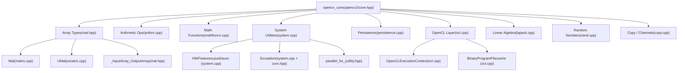
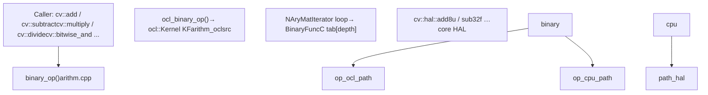
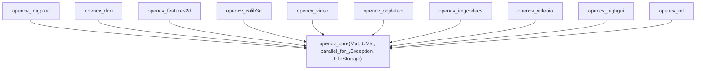

# Core Module

Relevant source files

-   [3rdparty/libjpeg/jquant2.c](https://github.com/opencv/opencv/blob/91c78f50/3rdparty/libjpeg/jquant2.c)
-   [cmake/OpenCVCompilerOptimizations.cmake](https://github.com/opencv/opencv/blob/91c78f50/cmake/OpenCVCompilerOptimizations.cmake)
-   [modules/calib3d/src/rho.cpp](https://github.com/opencv/opencv/blob/91c78f50/modules/calib3d/src/rho.cpp)
-   [modules/calib3d/src/rho.h](https://github.com/opencv/opencv/blob/91c78f50/modules/calib3d/src/rho.h)
-   [modules/core/include/opencv2/core.hpp](https://github.com/opencv/opencv/blob/91c78f50/modules/core/include/opencv2/core.hpp)
-   [modules/core/include/opencv2/core/base.hpp](https://github.com/opencv/opencv/blob/91c78f50/modules/core/include/opencv2/core/base.hpp)
-   [modules/core/include/opencv2/core/core.hpp](https://github.com/opencv/opencv/blob/91c78f50/modules/core/include/opencv2/core/core.hpp)
-   [modules/core/include/opencv2/core/core\_c.h](https://github.com/opencv/opencv/blob/91c78f50/modules/core/include/opencv2/core/core_c.h)
-   [modules/core/include/opencv2/core/cv\_cpu\_dispatch.h](https://github.com/opencv/opencv/blob/91c78f50/modules/core/include/opencv2/core/cv_cpu_dispatch.h)
-   [modules/core/include/opencv2/core/cv\_cpu\_helper.h](https://github.com/opencv/opencv/blob/91c78f50/modules/core/include/opencv2/core/cv_cpu_helper.h)
-   [modules/core/include/opencv2/core/cvdef.h](https://github.com/opencv/opencv/blob/91c78f50/modules/core/include/opencv2/core/cvdef.h)
-   [modules/core/include/opencv2/core/cvstd.hpp](https://github.com/opencv/opencv/blob/91c78f50/modules/core/include/opencv2/core/cvstd.hpp)
-   [modules/core/include/opencv2/core/cvstd.inl.hpp](https://github.com/opencv/opencv/blob/91c78f50/modules/core/include/opencv2/core/cvstd.inl.hpp)
-   [modules/core/include/opencv2/core/cvstd\_wrapper.hpp](https://github.com/opencv/opencv/blob/91c78f50/modules/core/include/opencv2/core/cvstd_wrapper.hpp)
-   [modules/core/include/opencv2/core/mat.hpp](https://github.com/opencv/opencv/blob/91c78f50/modules/core/include/opencv2/core/mat.hpp)
-   [modules/core/include/opencv2/core/mat.inl.hpp](https://github.com/opencv/opencv/blob/91c78f50/modules/core/include/opencv2/core/mat.inl.hpp)
-   [modules/core/include/opencv2/core/matx.hpp](https://github.com/opencv/opencv/blob/91c78f50/modules/core/include/opencv2/core/matx.hpp)
-   [modules/core/include/opencv2/core/ocl.hpp](https://github.com/opencv/opencv/blob/91c78f50/modules/core/include/opencv2/core/ocl.hpp)
-   [modules/core/include/opencv2/core/opencl/ocl\_defs.hpp](https://github.com/opencv/opencv/blob/91c78f50/modules/core/include/opencv2/core/opencl/ocl_defs.hpp)
-   [modules/core/include/opencv2/core/operations.hpp](https://github.com/opencv/opencv/blob/91c78f50/modules/core/include/opencv2/core/operations.hpp)
-   [modules/core/include/opencv2/core/persistence.hpp](https://github.com/opencv/opencv/blob/91c78f50/modules/core/include/opencv2/core/persistence.hpp)
-   [modules/core/include/opencv2/core/private.hpp](https://github.com/opencv/opencv/blob/91c78f50/modules/core/include/opencv2/core/private.hpp)
-   [modules/core/include/opencv2/core/softfloat.hpp](https://github.com/opencv/opencv/blob/91c78f50/modules/core/include/opencv2/core/softfloat.hpp)
-   [modules/core/include/opencv2/core/types.hpp](https://github.com/opencv/opencv/blob/91c78f50/modules/core/include/opencv2/core/types.hpp)
-   [modules/core/include/opencv2/core/types\_c.h](https://github.com/opencv/opencv/blob/91c78f50/modules/core/include/opencv2/core/types_c.h)
-   [modules/core/include/opencv2/core/utility.hpp](https://github.com/opencv/opencv/blob/91c78f50/modules/core/include/opencv2/core/utility.hpp)
-   [modules/core/include/opencv2/core/utils/buffer\_area.private.hpp](https://github.com/opencv/opencv/blob/91c78f50/modules/core/include/opencv2/core/utils/buffer_area.private.hpp)
-   [modules/core/perf/opencl/perf\_arithm.cpp](https://github.com/opencv/opencv/blob/91c78f50/modules/core/perf/opencl/perf_arithm.cpp)
-   [modules/core/perf/perf\_io\_base64.cpp](https://github.com/opencv/opencv/blob/91c78f50/modules/core/perf/perf_io_base64.cpp)
-   [modules/core/src/algorithm.cpp](https://github.com/opencv/opencv/blob/91c78f50/modules/core/src/algorithm.cpp)
-   [modules/core/src/arithm.cpp](https://github.com/opencv/opencv/blob/91c78f50/modules/core/src/arithm.cpp)
-   [modules/core/src/array.cpp](https://github.com/opencv/opencv/blob/91c78f50/modules/core/src/array.cpp)
-   [modules/core/src/buffer\_area.cpp](https://github.com/opencv/opencv/blob/91c78f50/modules/core/src/buffer_area.cpp)
-   [modules/core/src/command\_line\_parser.cpp](https://github.com/opencv/opencv/blob/91c78f50/modules/core/src/command_line_parser.cpp)
-   [modules/core/src/copy.cpp](https://github.com/opencv/opencv/blob/91c78f50/modules/core/src/copy.cpp)
-   [modules/core/src/lapack.cpp](https://github.com/opencv/opencv/blob/91c78f50/modules/core/src/lapack.cpp)
-   [modules/core/src/mathfuncs.cpp](https://github.com/opencv/opencv/blob/91c78f50/modules/core/src/mathfuncs.cpp)
-   [modules/core/src/matrix.cpp](https://github.com/opencv/opencv/blob/91c78f50/modules/core/src/matrix.cpp)
-   [modules/core/src/matrix\_wrap.cpp](https://github.com/opencv/opencv/blob/91c78f50/modules/core/src/matrix_wrap.cpp)
-   [modules/core/src/ocl.cpp](https://github.com/opencv/opencv/blob/91c78f50/modules/core/src/ocl.cpp)
-   [modules/core/src/ocl\_disabled.impl.hpp](https://github.com/opencv/opencv/blob/91c78f50/modules/core/src/ocl_disabled.impl.hpp)
-   [modules/core/src/opencl/arithm.cl](https://github.com/opencv/opencv/blob/91c78f50/modules/core/src/opencl/arithm.cl)
-   [modules/core/src/opencl/gemm.cl](https://github.com/opencv/opencv/blob/91c78f50/modules/core/src/opencl/gemm.cl)
-   [modules/core/src/opencl/meanstddev.cl](https://github.com/opencv/opencv/blob/91c78f50/modules/core/src/opencl/meanstddev.cl)
-   [modules/core/src/opencl/minmaxloc.cl](https://github.com/opencv/opencv/blob/91c78f50/modules/core/src/opencl/minmaxloc.cl)
-   [modules/core/src/opencl/reduce.cl](https://github.com/opencv/opencv/blob/91c78f50/modules/core/src/opencl/reduce.cl)
-   [modules/core/src/persistence.cpp](https://github.com/opencv/opencv/blob/91c78f50/modules/core/src/persistence.cpp)
-   [modules/core/src/persistence.hpp](https://github.com/opencv/opencv/blob/91c78f50/modules/core/src/persistence.hpp)
-   [modules/core/src/persistence\_base64\_encoding.cpp](https://github.com/opencv/opencv/blob/91c78f50/modules/core/src/persistence_base64_encoding.cpp)
-   [modules/core/src/persistence\_base64\_encoding.hpp](https://github.com/opencv/opencv/blob/91c78f50/modules/core/src/persistence_base64_encoding.hpp)
-   [modules/core/src/persistence\_impl.hpp](https://github.com/opencv/opencv/blob/91c78f50/modules/core/src/persistence_impl.hpp)
-   [modules/core/src/persistence\_json.cpp](https://github.com/opencv/opencv/blob/91c78f50/modules/core/src/persistence_json.cpp)
-   [modules/core/src/persistence\_types.cpp](https://github.com/opencv/opencv/blob/91c78f50/modules/core/src/persistence_types.cpp)
-   [modules/core/src/persistence\_xml.cpp](https://github.com/opencv/opencv/blob/91c78f50/modules/core/src/persistence_xml.cpp)
-   [modules/core/src/persistence\_yml.cpp](https://github.com/opencv/opencv/blob/91c78f50/modules/core/src/persistence_yml.cpp)
-   [modules/core/src/precomp.hpp](https://github.com/opencv/opencv/blob/91c78f50/modules/core/src/precomp.hpp)
-   [modules/core/src/rand.cpp](https://github.com/opencv/opencv/blob/91c78f50/modules/core/src/rand.cpp)
-   [modules/core/src/softfloat.cpp](https://github.com/opencv/opencv/blob/91c78f50/modules/core/src/softfloat.cpp)
-   [modules/core/src/system.cpp](https://github.com/opencv/opencv/blob/91c78f50/modules/core/src/system.cpp)
-   [modules/core/src/umatrix.cpp](https://github.com/opencv/opencv/blob/91c78f50/modules/core/src/umatrix.cpp)
-   [modules/core/test/ocl/test\_arithm.cpp](https://github.com/opencv/opencv/blob/91c78f50/modules/core/test/ocl/test_arithm.cpp)
-   [modules/core/test/ocl/test\_opencl.cpp](https://github.com/opencv/opencv/blob/91c78f50/modules/core/test/ocl/test_opencl.cpp)
-   [modules/core/test/test\_arithm.cpp](https://github.com/opencv/opencv/blob/91c78f50/modules/core/test/test_arithm.cpp)
-   [modules/core/test/test\_io.cpp](https://github.com/opencv/opencv/blob/91c78f50/modules/core/test/test_io.cpp)
-   [modules/core/test/test\_mat.cpp](https://github.com/opencv/opencv/blob/91c78f50/modules/core/test/test_mat.cpp)
-   [modules/core/test/test\_math.cpp](https://github.com/opencv/opencv/blob/91c78f50/modules/core/test/test_math.cpp)
-   [modules/core/test/test\_operations.cpp](https://github.com/opencv/opencv/blob/91c78f50/modules/core/test/test_operations.cpp)
-   [modules/core/test/test\_precomp.hpp](https://github.com/opencv/opencv/blob/91c78f50/modules/core/test/test_precomp.hpp)
-   [modules/core/test/test\_rand.cpp](https://github.com/opencv/opencv/blob/91c78f50/modules/core/test/test_rand.cpp)
-   [modules/core/test/test\_umat.cpp](https://github.com/opencv/opencv/blob/91c78f50/modules/core/test/test_umat.cpp)
-   [modules/core/test/test\_utils.cpp](https://github.com/opencv/opencv/blob/91c78f50/modules/core/test/test_utils.cpp)
-   [modules/dnn/include/opencv2/dnn/shape\_utils.hpp](https://github.com/opencv/opencv/blob/91c78f50/modules/dnn/include/opencv2/dnn/shape_utils.hpp)
-   [modules/python/test/test\_algorithm\_rw.py](https://github.com/opencv/opencv/blob/91c78f50/modules/python/test/test_algorithm_rw.py)
-   [modules/python/test/test\_filestorage\_io.py](https://github.com/opencv/opencv/blob/91c78f50/modules/python/test/test_filestorage_io.py)
-   [modules/python/test/test\_persistence.py](https://github.com/opencv/opencv/blob/91c78f50/modules/python/test/test_persistence.py)
-   [modules/ts/include/opencv2/ts/ocl\_perf.hpp](https://github.com/opencv/opencv/blob/91c78f50/modules/ts/include/opencv2/ts/ocl_perf.hpp)
-   [modules/ts/src/ocl\_perf.cpp](https://github.com/opencv/opencv/blob/91c78f50/modules/ts/src/ocl_perf.cpp)
-   [modules/ts/src/ocl\_test.cpp](https://github.com/opencv/opencv/blob/91c78f50/modules/ts/src/ocl_test.cpp)
-   [platforms/linux/riscv64-071-gcc.toolchain.cmake](https://github.com/opencv/opencv/blob/91c78f50/platforms/linux/riscv64-071-gcc.toolchain.cmake)

The `opencv_core` module (`modules/core/`) is the foundational dependency for every other OpenCV module. It defines the primary array types, the abstraction layer used for function parameters, arithmetic and mathematical operations on arrays, platform utilities, OpenCL acceleration infrastructure, and data persistence. This page provides an overview of those subsystems and how they connect.

For the detailed treatment of specific subsystems, see:

-   [Mat and UMat Data Structures](/opencv/opencv/3.1-mat-and-umat-data-structures)
-   [OpenCL Acceleration and Transparent GPU Execution](/opencv/opencv/3.2-opencl-acceleration-and-transparent-gpu-execution)
-   [System Utilities and Parallel Processing](/opencv/opencv/3.3-system-utilities-and-parallel-processing)
-   [Persistence and Serialization (FileStorage)](/opencv/opencv/3.4-persistence-and-serialization-(filestorage))
-   [SIMD Intrinsics and CPU Dispatching](/opencv/opencv/3.5-simd-intrinsics-and-cpu-dispatching)

---

## Module Layout

The module is organized around a small set of public headers in `modules/core/include/opencv2/core/` and corresponding implementation files in `modules/core/src/`. Downstream code includes the top-level umbrella header `modules/core/include/opencv2/core.hpp`, which chains together all individual component headers.

**Primary public headers**

| Header | Purpose |
| --- | --- |
| `opencv2/core.hpp` | Umbrella; includes all headers below |
| `opencv2/core/cvdef.h` | Compiler/platform macros, type aliases |
| `opencv2/core/base.hpp` | Error codes, `CV_Error`, `CV_Assert` macros |
| `opencv2/core/types.hpp` | Geometric primitives: `Point`, `Size`, `Rect`, `Scalar` |
| `opencv2/core/mat.hpp` | `Mat`, `UMat`, `_InputArray`, `_OutputArray` |
| `opencv2/core/mat.inl.hpp` | Inline implementations of `Mat`/`UMat` methods |
| `opencv2/core/persistence.hpp` | `FileStorage`, `FileNode` |
| `opencv2/core/utility.hpp` | `parallel_for_`, `AutoBuffer`, `TickMeter`, `RNG` |
| `opencv2/core/ocl.hpp` | OpenCL `Context`, `Device`, `Kernel`, `Queue` |
| `opencv2/core/operations.hpp` | Operator overloads for `Mat`, `Matx`, augmented assign |

Sources: [modules/core/include/opencv2/core.hpp1-106](https://github.com/opencv/opencv/blob/91c78f50/modules/core/include/opencv2/core.hpp#L1-L106) [modules/core/include/opencv2/core/mat.hpp44-272](https://github.com/opencv/opencv/blob/91c78f50/modules/core/include/opencv2/core/mat.hpp#L44-L272) [modules/core/include/opencv2/core/cvdef.h45-120](https://github.com/opencv/opencv/blob/91c78f50/modules/core/include/opencv2/core/cvdef.h#L45-L120)

---

## High-Level Component Map

The following diagram maps the major runtime components of `opencv_core` to the primary code entities that implement them.

**Core Module Component Relationships**

Sources: [modules/core/include/opencv2/core.hpp52-105](https://github.com/opencv/opencv/blob/91c78f50/modules/core/include/opencv2/core.hpp#L52-L105) [modules/core/src/matrix.cpp1-200](https://github.com/opencv/opencv/blob/91c78f50/modules/core/src/matrix.cpp#L1-L200) [modules/core/src/umatrix.cpp1-60](https://github.com/opencv/opencv/blob/91c78f50/modules/core/src/umatrix.cpp#L1-L60) [modules/core/src/ocl.cpp846-1037](https://github.com/opencv/opencv/blob/91c78f50/modules/core/src/ocl.cpp#L846-L1037) [modules/core/src/system.cpp370-574](https://github.com/opencv/opencv/blob/91c78f50/modules/core/src/system.cpp#L370-L574)

---

## Primary Data Structures

### Mat

`Mat`, declared in `modules/core/include/opencv2/core/mat.hpp` and implemented in `modules/core/src/matrix.cpp`, is the central N-dimensional dense array type. Key fields:

| Field | Type | Meaning |
| --- | --- | --- |
| `flags` | `int` | Magic value, type code, continuity flags |
| `dims` | `int` | Number of dimensions (≥ 2 internally) |
| `rows`, `cols` | `int` | Valid when `dims == 2` |
| `data` | `uchar*` | Pointer to current view start |
| `datastart`, `dataend` | `uchar*` | Bounds of underlying allocation |
| `u` | `UMatData*` | Shared reference-counted storage block |
| `allocator` | `MatAllocator*` | Pluggable allocator |
| `step` | `MatStep` | Per-dimension byte strides |
| `size` | `MatSize` | Per-dimension element counts |

Copying a `Mat` is a shallow operation: it increments the reference count in `UMatData` via `CV_XADD`. Deep copies use `Mat::clone()` or `Mat::copyTo()`.

The default allocator `StdMatAllocator` is registered at [modules/core/src/matrix.cpp126-199](https://github.com/opencv/opencv/blob/91c78f50/modules/core/src/matrix.cpp#L126-L199) and allocates raw memory via `fastMalloc`. Custom allocators can be plugged in with `Mat::setDefaultAllocator`.

Sub-matrices (ROI) are created by adjusting `data` and setting the `SUBMATRIX_FLAG` in `flags` without copying data. The `CONTINUOUS_FLAG` is maintained by `updateContinuityFlag` [modules/core/src/matrix.cpp283-308](https://github.com/opencv/opencv/blob/91c78f50/modules/core/src/matrix.cpp#L283-L308)

### UMat

`UMat` (in `modules/core/src/umatrix.cpp`) is a parallel array type whose backing storage can reside in OpenCL device memory. It shares `UMatData` with `Mat` but adds an `offset` field and uses an OpenCL-aware allocator. Data moves between CPU and device implicitly when a `UMat` is passed to a CPU function (via `getMat()`) or to an OpenCL kernel. For full detail, see [Mat and UMat Data Structures](/opencv/opencv/3.1-mat-and-umat-data-structures).

### Geometric Primitive Types

Declared in `modules/core/include/opencv2/core/types.hpp`. These are template types aliased to common instantiations:

| Template | Common Aliases |
| --- | --- |
| `Point_<T>` | `Point2i`, `Point2f`, `Point2d` |
| `Size_<T>` | `Size`, `Size2f` |
| `Rect_<T>` | `Rect`, `Rect2f` |
| `Scalar_<T>` | `Scalar` (4-element double vector) |
| `Vec<T, N>` | `Vec2f`, `Vec3b`, `Vec4i`, … |
| `Matx<T, M, N>` | `Matx33f`, `Matx44d`, … |

Sources: [modules/core/include/opencv2/core/types.hpp1-60](https://github.com/opencv/opencv/blob/91c78f50/modules/core/include/opencv2/core/types.hpp#L1-L60) [modules/core/include/opencv2/core/mat.hpp160-394](https://github.com/opencv/opencv/blob/91c78f50/modules/core/include/opencv2/core/mat.hpp#L160-L394) [modules/core/src/matrix.cpp126-200](https://github.com/opencv/opencv/blob/91c78f50/modules/core/src/matrix.cpp#L126-L200) [modules/core/src/umatrix.cpp1-60](https://github.com/opencv/opencv/blob/91c78f50/modules/core/src/umatrix.cpp#L1-L60)

---

## InputArray / OutputArray Abstraction

Nearly every public OpenCV function accepts `InputArray`, `OutputArray`, or `InputOutputArray` rather than `Mat` directly. These are reference types defined in `mat.hpp` that can bind to `Mat`, `UMat`, `Matx`, `std::vector<T>`, `cuda::GpuMat`, or `cuda::GpuMatND` without a copy.

**Parameter Abstraction Type Hierarchy**

`_InputArray::kind()` returns a `KindFlag` enum (`MAT`, `UMAT`, `CUDA_GPU_MAT`, `STD_VECTOR`, etc.) allowing function implementations to branch on the actual backing type. In most functions this is not needed; the function calls `getMat()` or `getUMat()` and receives a lightweight header.

Sources: [modules/core/include/opencv2/core/mat.hpp64-393](https://github.com/opencv/opencv/blob/91c78f50/modules/core/include/opencv2/core/mat.hpp#L64-L393)

---

## Type System and Depth Codes

The element type of a `Mat` is encoded in a compact integer using macros from `cvdef.h` and `types_c.h`.

| Depth Constant | C type | Bits |
| --- | --- | --- |
| `CV_8U` | `uint8_t` | 8 |
| `CV_8S` | `int8_t` | 8 |
| `CV_16U` | `uint16_t` | 16 |
| `CV_16S` | `int16_t` | 16 |
| `CV_32S` | `int32_t` | 32 |
| `CV_32F` | `float` | 32 |
| `CV_64F` | `double` | 64 |
| `CV_16F` | `hfloat` | 16 (half) |

The full type including channel count is composed with `CV_MAKETYPE(depth, cn)` and decomposed with `CV_MAT_DEPTH(type)` and `CV_MAT_CN(type)`.

Sources: [modules/core/include/opencv2/core/cvdef.h1-120](https://github.com/opencv/opencv/blob/91c78f50/modules/core/include/opencv2/core/cvdef.h#L1-L120) [modules/core/include/opencv2/core/types\_c.h1-100](https://github.com/opencv/opencv/blob/91c78f50/modules/core/include/opencv2/core/types_c.h#L1-L100)

---

## Arithmetic Operations

Implemented in `modules/core/src/arithm.cpp`. Every arithmetic function follows a common dual-path pattern:

1.  **OpenCL path** — if any input is a `UMat`, dispatch to an OpenCL kernel via `CV_OCL_RUN`.
2.  **CPU path** — iterate over planes using `NAryMatIterator`, calling a type-indexed function table entry (e.g., from `getMaxTab()`, `getMinTab()`).

**Arithmetic Function Call Flow**

Functions exposed at the public API level:

| Function | Operation |
| --- | --- |
| `cv::add` | element-wise addition |
| `cv::subtract` | element-wise subtraction |
| `cv::multiply` | element-wise multiplication (with optional scale) |
| `cv::divide` | element-wise division |
| `cv::addWeighted` | weighted blend of two arrays |
| `cv::absdiff` | absolute difference |
| `cv::bitwise_and/or/xor/not` | bitwise logical ops |
| `cv::min`, `cv::max` | element-wise min/max |
| `cv::compare` | element-wise comparison to scalar or array |

Sources: [modules/core/src/arithm.cpp50-436](https://github.com/opencv/opencv/blob/91c78f50/modules/core/src/arithm.cpp#L50-L436)

---

## Mathematical Functions

Implemented in `modules/core/src/mathfuncs.cpp`. These operate element-wise on `Mat` or `UMat` arrays and use the same dual-path OpenCL/CPU structure as arithmetic.

| Function | Notes |
| --- | --- |
| `cv::sqrt` | element-wise square root |
| `cv::pow` | element-wise power |
| `cv::exp` | element-wise exponential |
| `cv::log` | element-wise natural log |
| `cv::magnitude` | √(x²+y²) from two planes |
| `cv::phase` | atan2(y,x), degrees or radians |
| `cv::cartToPolar` / `cv::polarToCart` | combined magnitude+phase |
| `cv::dct` / `cv::dft` / `cv::idft` | discrete cosine/Fourier transform |

The `cubeRoot` function at [modules/core/src/mathfuncs.cpp106-143](https://github.com/opencv/opencv/blob/91c78f50/modules/core/src/mathfuncs.cpp#L106-L143) is a fast bit-manipulation approximation.

Sources: [modules/core/src/mathfuncs.cpp50-100](https://github.com/opencv/opencv/blob/91c78f50/modules/core/src/mathfuncs.cpp#L50-L100)

---

## Linear Algebra

`modules/core/src/lapack.cpp` wraps the core linear algebra operations. These functions accept `InputArray`/`OutputArray` and internally call into a HAL implementation (or a bundled lapack):

| Function | Description |
| --- | --- |
| `cv::solve` | Solve `Ax = b` |
| `cv::invert` | Matrix inversion via LU, SVD, or Cholesky |
| `cv::determinant` | Matrix determinant |
| `cv::eigen` | Eigenvalues/eigenvectors of symmetric matrix |
| `cv::SVD::compute` | Full SVD |
| `cv::PCA` | Principal component analysis |
| `cv::gemm` | Generalized matrix multiply |

Sources: [modules/core/src/lapack.cpp1-60](https://github.com/opencv/opencv/blob/91c78f50/modules/core/src/lapack.cpp#L1-L60)

---

## Error Handling

The `cv::Exception` class defined in `modules/core/include/opencv2/core.hpp` and implemented in `modules/core/src/system.cpp` carries a numeric error code, a human-readable message, and the source location where the error was raised.

The principal reporting macros are:

-   `CV_Error(code, msg)` — throws `cv::Exception`
-   `CV_Error_(code, args)` — printf-style message
-   `CV_Assert(cond)` — throws if `cond` is false
-   `CV_DbgAssert(cond)` — assert only in debug builds

Error codes are defined in `modules/core/include/opencv2/core/base.hpp` under the `cv::Error` namespace (e.g., `cv::Error::StsOk`, `cv::Error::BadArgument`, `cv::Error::StsOutOfRange`).

Sources: [modules/core/include/opencv2/core.hpp119-156](https://github.com/opencv/opencv/blob/91c78f50/modules/core/include/opencv2/core.hpp#L119-L156) [modules/core/src/system.cpp323-368](https://github.com/opencv/opencv/blob/91c78f50/modules/core/src/system.cpp#L323-L368) [modules/core/include/opencv2/core/base.hpp1-80](https://github.com/opencv/opencv/blob/91c78f50/modules/core/include/opencv2/core/base.hpp#L1-L80)

---

## CPU Feature Detection

`modules/core/src/system.cpp` contains the `HWFeatures` struct which runs at static initialization time to probe CPU capabilities. On x86 it uses `CPUID` instructions; on ARM it reads `/proc/self/auxv` or calls Android's `android_getCpuFeatures`.

The detected feature flags (e.g., `CV_CPU_SSE2`, `CV_CPU_AVX2`, `CV_CPU_NEON`) are queried at runtime by `cv::checkHardwareSupport(feature)`. This information drives the CPU dispatch mechanism (see [SIMD Intrinsics and CPU Dispatching](/opencv/opencv/3.5-simd-intrinsics-and-cpu-dispatching)).

Detected feature groups include:

| Architecture | Features detected |
| --- | --- |
| x86 | MMX, SSE–SSE4.2, AVX, AVX2, FMA3, AVX-512 variants |
| ARM | NEON, FP16, NEON\_DOTPROD, BF16, SVE |
| PowerPC | VSX, VSX3 |
| RISC-V | RVV |
| LoongArch | LSX, LASX |

Sources: [modules/core/src/system.cpp382-574](https://github.com/opencv/opencv/blob/91c78f50/modules/core/src/system.cpp#L382-L574)

---

## OpenCL Integration

The OpenCL subsystem lives in `modules/core/src/ocl.cpp` and is exposed through `modules/core/include/opencv2/core/ocl.hpp`. Its key types:

| Class | Role |
| --- | --- |
| `cv::ocl::Context` | Wraps a `cl_context`; manages device list |
| `cv::ocl::Device` | Wraps a `cl_device_id`; queries capabilities |
| `cv::ocl::Queue` | Wraps a `cl_command_queue` |
| `cv::ocl::Kernel` | Wraps a compiled `cl_kernel`; sets args, runs |
| `cv::ocl::Program` | Wraps a compiled `cl_program`; caches binaries |
| `OpenCLExecutionContext` | Per-thread context+device+queue triple |

`OpenCLExecutionContext::getCurrent()` returns the thread-local active context (lazy-initialised from `Impl::getInitializedExecutionContext()`). Binary kernel caching uses `BinaryProgramFile` at [modules/core/src/ocl.cpp520-841](https://github.com/opencv/opencv/blob/91c78f50/modules/core/src/ocl.cpp#L520-L841) keyed on a CRC-64 hash of the source signature.

Functions in `arithm.cpp` and `mathfuncs.cpp` gate the OpenCL path with `CV_OCL_RUN(condition, expr)`, which evaluates `expr` only when `condition` is true and OpenCL is enabled. For full detail, see [OpenCL Acceleration and Transparent GPU Execution](/opencv/opencv/3.2-opencl-acceleration-and-transparent-gpu-execution).

Sources: [modules/core/src/ocl.cpp846-1037](https://github.com/opencv/opencv/blob/91c78f50/modules/core/src/ocl.cpp#L846-L1037) [modules/core/include/opencv2/core/ocl.hpp1-100](https://github.com/opencv/opencv/blob/91c78f50/modules/core/include/opencv2/core/ocl.hpp#L1-L100) [modules/core/src/arithm.cpp60-148](https://github.com/opencv/opencv/blob/91c78f50/modules/core/src/arithm.cpp#L60-L148)

---

## Persistence (FileStorage)

`FileStorage` (declared in `modules/core/include/opencv2/core/persistence.hpp`, implemented in `modules/core/src/persistence.cpp`) reads and writes structured data in XML, YAML, and JSON formats. It supports scalar primitives, `Mat`, `SparseMat`, and user-defined types that implement the `<<`/`>>` streaming operators.

Key classes:

| Class | Role |
| --- | --- |
| `FileStorage` | File/stream handle; `open()`, `<<`, `release()` |
| `FileNode` | Cursor into a parsed document; typed access |
| `FileNodeIterator` | Iteration over sequences and maps |

For full detail, see [Persistence and Serialization (FileStorage)](/opencv/opencv/3.4-persistence-and-serialization-(filestorage)).

Sources: [modules/core/src/persistence.cpp415-432](https://github.com/opencv/opencv/blob/91c78f50/modules/core/src/persistence.cpp#L415-L432) [modules/core/include/opencv2/core/persistence.hpp1-60](https://github.com/opencv/opencv/blob/91c78f50/modules/core/include/opencv2/core/persistence.hpp#L1-L60)

---

## Parallel Processing

`cv::parallel_for_` in `modules/core/include/opencv2/core/utility.hpp` is the primary parallel loop primitive. It accepts a `Range` and a `ParallelLoopBody` functor. The backend is selected at build time from TBB, OpenMP, pthreads, or GCD. For detail, see [System Utilities and Parallel Processing](/opencv/opencv/3.3-system-utilities-and-parallel-processing).

---

## How Other Modules Depend on Core

Every other OpenCV module links against `opencv_core` and uses `Mat`/`UMat` as the universal image carrier, `InputArray`/`OutputArray` as function parameters, `cv::Exception` for error propagation, and `parallel_for_` for multi-threading. The dependency is enforced at the CMake level via `ocv_add_module` (see [Module Configuration and ocv\_add\_module](/opencv/opencv/2.2-module-configuration-and-ocv_add_module)).

**Inter-Module Dependency on Core**

Sources: [modules/core/include/opencv2/core.hpp52-105](https://github.com/opencv/opencv/blob/91c78f50/modules/core/include/opencv2/core.hpp#L52-L105)
