# Mat and UMat Data Structures

Relevant source files

-   [3rdparty/libjpeg/jquant2.c](https://github.com/opencv/opencv/blob/91c78f50/3rdparty/libjpeg/jquant2.c)
-   [cmake/OpenCVCompilerOptimizations.cmake](https://github.com/opencv/opencv/blob/91c78f50/cmake/OpenCVCompilerOptimizations.cmake)
-   [modules/calib3d/src/rho.cpp](https://github.com/opencv/opencv/blob/91c78f50/modules/calib3d/src/rho.cpp)
-   [modules/calib3d/src/rho.h](https://github.com/opencv/opencv/blob/91c78f50/modules/calib3d/src/rho.h)
-   [modules/core/include/opencv2/core.hpp](https://github.com/opencv/opencv/blob/91c78f50/modules/core/include/opencv2/core.hpp)
-   [modules/core/include/opencv2/core/base.hpp](https://github.com/opencv/opencv/blob/91c78f50/modules/core/include/opencv2/core/base.hpp)
-   [modules/core/include/opencv2/core/core.hpp](https://github.com/opencv/opencv/blob/91c78f50/modules/core/include/opencv2/core/core.hpp)
-   [modules/core/include/opencv2/core/cv\_cpu\_dispatch.h](https://github.com/opencv/opencv/blob/91c78f50/modules/core/include/opencv2/core/cv_cpu_dispatch.h)
-   [modules/core/include/opencv2/core/cv\_cpu\_helper.h](https://github.com/opencv/opencv/blob/91c78f50/modules/core/include/opencv2/core/cv_cpu_helper.h)
-   [modules/core/include/opencv2/core/cvdef.h](https://github.com/opencv/opencv/blob/91c78f50/modules/core/include/opencv2/core/cvdef.h)
-   [modules/core/include/opencv2/core/mat.hpp](https://github.com/opencv/opencv/blob/91c78f50/modules/core/include/opencv2/core/mat.hpp)
-   [modules/core/include/opencv2/core/mat.inl.hpp](https://github.com/opencv/opencv/blob/91c78f50/modules/core/include/opencv2/core/mat.inl.hpp)
-   [modules/core/include/opencv2/core/matx.hpp](https://github.com/opencv/opencv/blob/91c78f50/modules/core/include/opencv2/core/matx.hpp)
-   [modules/core/include/opencv2/core/ocl.hpp](https://github.com/opencv/opencv/blob/91c78f50/modules/core/include/opencv2/core/ocl.hpp)
-   [modules/core/include/opencv2/core/opencl/ocl\_defs.hpp](https://github.com/opencv/opencv/blob/91c78f50/modules/core/include/opencv2/core/opencl/ocl_defs.hpp)
-   [modules/core/include/opencv2/core/operations.hpp](https://github.com/opencv/opencv/blob/91c78f50/modules/core/include/opencv2/core/operations.hpp)
-   [modules/core/include/opencv2/core/private.hpp](https://github.com/opencv/opencv/blob/91c78f50/modules/core/include/opencv2/core/private.hpp)
-   [modules/core/include/opencv2/core/softfloat.hpp](https://github.com/opencv/opencv/blob/91c78f50/modules/core/include/opencv2/core/softfloat.hpp)
-   [modules/core/include/opencv2/core/types.hpp](https://github.com/opencv/opencv/blob/91c78f50/modules/core/include/opencv2/core/types.hpp)
-   [modules/core/include/opencv2/core/types\_c.h](https://github.com/opencv/opencv/blob/91c78f50/modules/core/include/opencv2/core/types_c.h)
-   [modules/core/include/opencv2/core/utility.hpp](https://github.com/opencv/opencv/blob/91c78f50/modules/core/include/opencv2/core/utility.hpp)
-   [modules/core/include/opencv2/core/utils/buffer\_area.private.hpp](https://github.com/opencv/opencv/blob/91c78f50/modules/core/include/opencv2/core/utils/buffer_area.private.hpp)
-   [modules/core/perf/opencl/perf\_arithm.cpp](https://github.com/opencv/opencv/blob/91c78f50/modules/core/perf/opencl/perf_arithm.cpp)
-   [modules/core/src/algorithm.cpp](https://github.com/opencv/opencv/blob/91c78f50/modules/core/src/algorithm.cpp)
-   [modules/core/src/arithm.cpp](https://github.com/opencv/opencv/blob/91c78f50/modules/core/src/arithm.cpp)
-   [modules/core/src/array.cpp](https://github.com/opencv/opencv/blob/91c78f50/modules/core/src/array.cpp)
-   [modules/core/src/buffer\_area.cpp](https://github.com/opencv/opencv/blob/91c78f50/modules/core/src/buffer_area.cpp)
-   [modules/core/src/command\_line\_parser.cpp](https://github.com/opencv/opencv/blob/91c78f50/modules/core/src/command_line_parser.cpp)
-   [modules/core/src/copy.cpp](https://github.com/opencv/opencv/blob/91c78f50/modules/core/src/copy.cpp)
-   [modules/core/src/lapack.cpp](https://github.com/opencv/opencv/blob/91c78f50/modules/core/src/lapack.cpp)
-   [modules/core/src/mathfuncs.cpp](https://github.com/opencv/opencv/blob/91c78f50/modules/core/src/mathfuncs.cpp)
-   [modules/core/src/matrix.cpp](https://github.com/opencv/opencv/blob/91c78f50/modules/core/src/matrix.cpp)
-   [modules/core/src/matrix\_wrap.cpp](https://github.com/opencv/opencv/blob/91c78f50/modules/core/src/matrix_wrap.cpp)
-   [modules/core/src/ocl.cpp](https://github.com/opencv/opencv/blob/91c78f50/modules/core/src/ocl.cpp)
-   [modules/core/src/ocl\_disabled.impl.hpp](https://github.com/opencv/opencv/blob/91c78f50/modules/core/src/ocl_disabled.impl.hpp)
-   [modules/core/src/opencl/arithm.cl](https://github.com/opencv/opencv/blob/91c78f50/modules/core/src/opencl/arithm.cl)
-   [modules/core/src/opencl/gemm.cl](https://github.com/opencv/opencv/blob/91c78f50/modules/core/src/opencl/gemm.cl)
-   [modules/core/src/opencl/meanstddev.cl](https://github.com/opencv/opencv/blob/91c78f50/modules/core/src/opencl/meanstddev.cl)
-   [modules/core/src/opencl/minmaxloc.cl](https://github.com/opencv/opencv/blob/91c78f50/modules/core/src/opencl/minmaxloc.cl)
-   [modules/core/src/opencl/reduce.cl](https://github.com/opencv/opencv/blob/91c78f50/modules/core/src/opencl/reduce.cl)
-   [modules/core/src/precomp.hpp](https://github.com/opencv/opencv/blob/91c78f50/modules/core/src/precomp.hpp)
-   [modules/core/src/rand.cpp](https://github.com/opencv/opencv/blob/91c78f50/modules/core/src/rand.cpp)
-   [modules/core/src/softfloat.cpp](https://github.com/opencv/opencv/blob/91c78f50/modules/core/src/softfloat.cpp)
-   [modules/core/src/system.cpp](https://github.com/opencv/opencv/blob/91c78f50/modules/core/src/system.cpp)
-   [modules/core/src/umatrix.cpp](https://github.com/opencv/opencv/blob/91c78f50/modules/core/src/umatrix.cpp)
-   [modules/core/test/ocl/test\_arithm.cpp](https://github.com/opencv/opencv/blob/91c78f50/modules/core/test/ocl/test_arithm.cpp)
-   [modules/core/test/ocl/test\_opencl.cpp](https://github.com/opencv/opencv/blob/91c78f50/modules/core/test/ocl/test_opencl.cpp)
-   [modules/core/test/test\_arithm.cpp](https://github.com/opencv/opencv/blob/91c78f50/modules/core/test/test_arithm.cpp)
-   [modules/core/test/test\_mat.cpp](https://github.com/opencv/opencv/blob/91c78f50/modules/core/test/test_mat.cpp)
-   [modules/core/test/test\_math.cpp](https://github.com/opencv/opencv/blob/91c78f50/modules/core/test/test_math.cpp)
-   [modules/core/test/test\_operations.cpp](https://github.com/opencv/opencv/blob/91c78f50/modules/core/test/test_operations.cpp)
-   [modules/core/test/test\_precomp.hpp](https://github.com/opencv/opencv/blob/91c78f50/modules/core/test/test_precomp.hpp)
-   [modules/core/test/test\_rand.cpp](https://github.com/opencv/opencv/blob/91c78f50/modules/core/test/test_rand.cpp)
-   [modules/core/test/test\_umat.cpp](https://github.com/opencv/opencv/blob/91c78f50/modules/core/test/test_umat.cpp)
-   [modules/core/test/test\_utils.cpp](https://github.com/opencv/opencv/blob/91c78f50/modules/core/test/test_utils.cpp)
-   [modules/ts/include/opencv2/ts/ocl\_perf.hpp](https://github.com/opencv/opencv/blob/91c78f50/modules/ts/include/opencv2/ts/ocl_perf.hpp)
-   [modules/ts/src/ocl\_perf.cpp](https://github.com/opencv/opencv/blob/91c78f50/modules/ts/src/ocl_perf.cpp)
-   [modules/ts/src/ocl\_test.cpp](https://github.com/opencv/opencv/blob/91c78f50/modules/ts/src/ocl_test.cpp)
-   [platforms/linux/riscv64-071-gcc.toolchain.cmake](https://github.com/opencv/opencv/blob/91c78f50/platforms/linux/riscv64-071-gcc.toolchain.cmake)

## Purpose and Scope

This document describes the internal architecture and memory management of OpenCV's two primary data structures: `Mat` (CPU matrix) and `UMat` (unified memory matrix). It covers memory layout, reference counting mechanisms, allocator design, and the relationship between these structures. For OpenCL-specific acceleration mechanisms, see [OpenCL Acceleration and Transparent GPU Execution](/opencv/opencv/3.2-opencl-acceleration-and-transparent-gpu-execution). </old\_str> <new\_str>

## Purpose and Scope

This document describes the internal architecture and memory management of OpenCV's two primary data structures: `Mat` (CPU matrix) and `UMat` (unified memory matrix). It covers memory layout, reference counting mechanisms, allocator design, and the relationship between these structures. For OpenCL-specific acceleration mechanisms, see [OpenCL Acceleration and Transparent GPU Execution](/opencv/opencv/3.2-opencl-acceleration-and-transparent-gpu-execution).

## Overview

OpenCV provides two fundamental multi-dimensional array types:

| Type | Purpose | Memory Location | Primary Use Case |
| --- | --- | --- | --- |
| `cv::Mat` | General-purpose matrix | CPU only | Standard CPU-based processing |
| `cv::UMat` | Unified memory matrix | CPU and/or GPU | Transparent hardware acceleration via OpenCL |

Both structures share the same underlying memory management infrastructure (`UMatData`) and allocator interface (`MatAllocator`), enabling efficient memory handling and interoperability.

Sources: [modules/core/include/opencv2/core/mat.hpp59-393](https://github.com/opencv/opencv/blob/91c78f50/modules/core/include/opencv2/core/mat.hpp#L59-L393) [modules/core/src/matrix.cpp126-200](https://github.com/opencv/opencv/blob/91c78f50/modules/core/src/matrix.cpp#L126-L200) [modules/core/src/umatrix.cpp1-100](https://github.com/opencv/opencv/blob/91c78f50/modules/core/src/umatrix.cpp#L1-L100)

## Mat Class Architecture

### Core Components

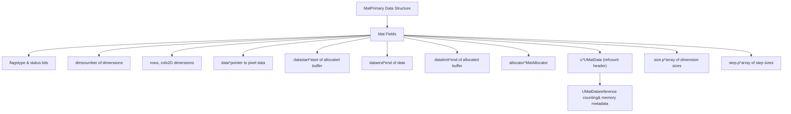
Sources: [modules/core/include/opencv2/core/mat.hpp796-900](https://github.com/opencv/opencv/blob/91c78f50/modules/core/include/opencv2/core/mat.hpp#L796-L900) [modules/core/src/matrix.cpp336-444](https://github.com/opencv/opencv/blob/91c78f50/modules/core/src/matrix.cpp#L336-L444)

### Typed Wrapper: `Mat_<T>`

`Mat_<_Tp>` is a template subclass of `Mat` that associates a compile-time element type with the matrix. It provides type-safe `operator()` element access and automatically calls `create()` with the appropriate type code. It shares the same memory layout and reference-counting infrastructure as plain `Mat`. Declared in [modules/core/include/opencv2/core/mat.hpp](https://github.com/opencv/opencv/blob/91c78f50/modules/core/include/opencv2/core/mat.hpp)

### Memory Layout

Mat stores multi-dimensional data with a flexible memory layout system:

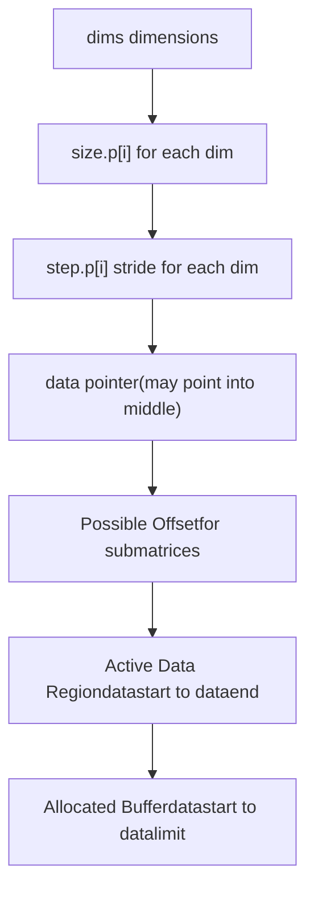
**Key Layout Properties:**

-   **datastart**: Beginning of allocated memory buffer
-   **data**: Current data pointer (may be offset for submatrices)
-   **dataend**: End of valid data
-   **datalimit**: End of allocated buffer
-   **step.p\[i\]**: Number of bytes to skip to move to next element in dimension i
-   **size.p\[i\]**: Number of elements in dimension i

Sources: [modules/core/include/opencv2/core/mat.hpp796-900](https://github.com/opencv/opencv/blob/91c78f50/modules/core/include/opencv2/core/mat.hpp#L796-L900) [modules/core/src/matrix.cpp218-281](https://github.com/opencv/opencv/blob/91c78f50/modules/core/src/matrix.cpp#L218-L281)

### Continuous vs Non-Continuous Memory

Mat tracks whether data is stored continuously in memory via the `CONTINUOUS_FLAG`:

| Layout Type | Description | Flag Status | Access Performance |
| --- | --- | --- | --- |
| Continuous | All elements stored sequentially | `flags & CONTINUOUS_FLAG` | Optimal - single block operations |
| Non-continuous | Row/slice padding or submatrix | Flag not set | Slower - requires stride handling |

The continuity flag is computed by `updateContinuityFlag()` based on whether `step[j] * size[j] == step[j-1]` for all dimensions.

Sources: [modules/core/src/matrix.cpp283-308](https://github.com/opencv/opencv/blob/91c78f50/modules/core/src/matrix.cpp#L283-L308) [modules/core/src/matrix.cpp305-308](https://github.com/opencv/opencv/blob/91c78f50/modules/core/src/matrix.cpp#L305-L308)

## UMat Class Architecture

### Unified Memory Model

UMat extends Mat's design to support transparent GPU execution:

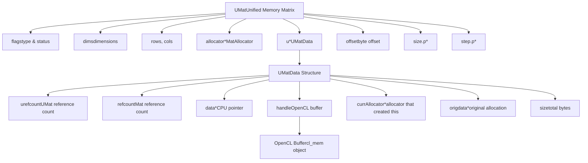
Sources: [modules/core/include/opencv2/core/mat.hpp2533-2700](https://github.com/opencv/opencv/blob/91c78f50/modules/core/include/opencv2/core/mat.hpp#L2533-L2700) [modules/core/src/umatrix.cpp1-500](https://github.com/opencv/opencv/blob/91c78f50/modules/core/src/umatrix.cpp#L1-L500)

### OpenCL Integration

UMat automatically migrates data between CPU and GPU as needed:

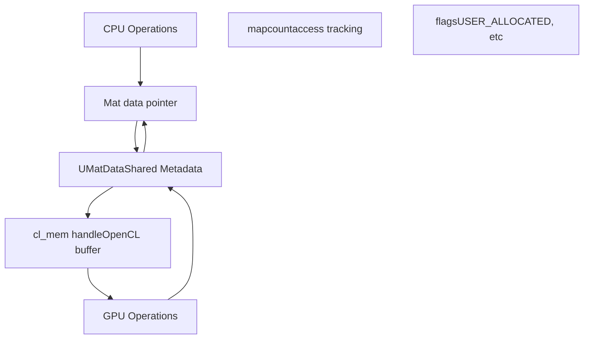
The OpenCL context, device, and queue are managed through `OpenCLExecutionContext` (see [OpenCL Acceleration and Transparent GPU Execution](/opencv/opencv/3.2-opencl-acceleration-and-transparent-gpu-execution)).

Sources: [modules/core/src/ocl.cpp846-1037](https://github.com/opencv/opencv/blob/91c78f50/modules/core/src/ocl.cpp#L846-L1037) [modules/core/src/umatrix.cpp1-500](https://github.com/opencv/opencv/blob/91c78f50/modules/core/src/umatrix.cpp#L1-L500)

## Memory Management Infrastructure

### UMatData Structure

`UMatData` is the shared reference-counted header for both Mat and UMat:

```mermaid
flowchart TD
    UMatData["UMatDataReference-counted header"]
    Pointers["Memory Pointers"]
    Refcounts["Reference Counts"]
    Allocators["Allocator Links"]
    Status["Status Flags"]
    OpenCL["OpenCL Handles"]
    data["data*CPU pointer"]
    origdata["origdata*original allocation"]
    refcount["refcountMat instances"]
    urefcount["urefcountUMat instances"]
    mapcount["mapcountactive mappings"]
    allocatorFlags["allocatorFlags_"]
    currAllocator["currAllocator*"]
    flags["flagsUSER_ALLOCATED, etc"]
    size["sizetotal bytes"]
    handle["handleOpenCL cl_mem"]
    devMemOffset["devMemOffset_"]
    deviceCopyObsolete["deviceCopyObsolete_"]
    hostCopyObsolete["hostCopyObsolete_"]

    UMatData --> Pointers
    UMatData --> Refcounts
    UMatData --> Allocators
    UMatData --> Status
    UMatData --> OpenCL
    Pointers --> data
    Pointers --> origdata
    Refcounts --> refcount
    Refcounts --> urefcount
    Refcounts --> mapcount
    Allocators --> allocatorFlags
    Allocators --> currAllocator
    Status --> flags
    Status --> size
    OpenCL --> handle
    OpenCL --> devMemOffset
    OpenCL --> deviceCopyObsolete
    OpenCL --> hostCopyObsolete
```
**Reference Counting Rules:**

-   `refcount`: Incremented for each `Mat` sharing this data
-   `urefcount`: Incremented for each `UMat` sharing this data
-   Memory deallocated when both `refcount == 0` and `urefcount == 0`

Sources: [modules/core/include/opencv2/core/mat.hpp661-746](https://github.com/opencv/opencv/blob/91c78f50/modules/core/include/opencv2/core/mat.hpp#L661-L746) [modules/core/src/matrix.cpp10-21](https://github.com/opencv/opencv/blob/91c78f50/modules/core/src/matrix.cpp#L10-L21)

### MatAllocator Hierarchy

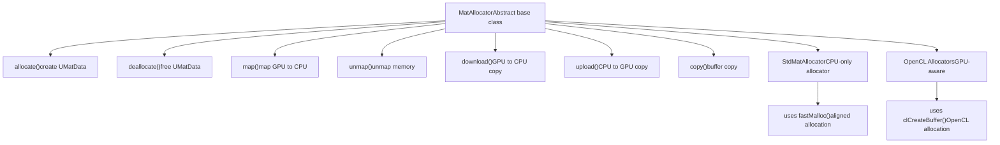
**Default Allocator:**

-   `Mat::getStdAllocator()` returns singleton `StdMatAllocator`
-   Custom allocators can be set via `Mat::setDefaultAllocator()`
-   UMat uses OpenCL allocators when available

Sources: [modules/core/src/matrix.cpp126-199](https://github.com/opencv/opencv/blob/91c78f50/modules/core/src/matrix.cpp#L126-L199) [modules/core/include/opencv2/core/mat.hpp634-660](https://github.com/opencv/opencv/blob/91c78f50/modules/core/include/opencv2/core/mat.hpp#L634-L660)

### Reference Counting Mechanism

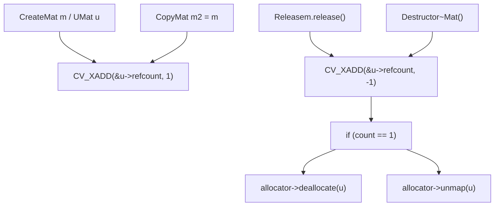
**Thread-safe atomic operations:**

-   `CV_XADD(addr, delta)` - atomic increment/decrement
-   Implemented via `std::atomic` or platform intrinsics
-   See [modules/core/include/opencv2/core/cvdef.h1-1200](https://github.com/opencv/opencv/blob/91c78f50/modules/core/include/opencv2/core/cvdef.h#L1-L1200) for definitions

Sources: [modules/core/src/matrix.cpp541-565](https://github.com/opencv/opencv/blob/91c78f50/modules/core/src/matrix.cpp#L541-L565) [modules/core/src/matrix.cpp733-741](https://github.com/opencv/opencv/blob/91c78f50/modules/core/src/matrix.cpp#L733-L741)

## Data Layout and Addressing

### Multi-Dimensional Indexing

Mat supports up to `CV_MAX_DIM` dimensions (typically 32):

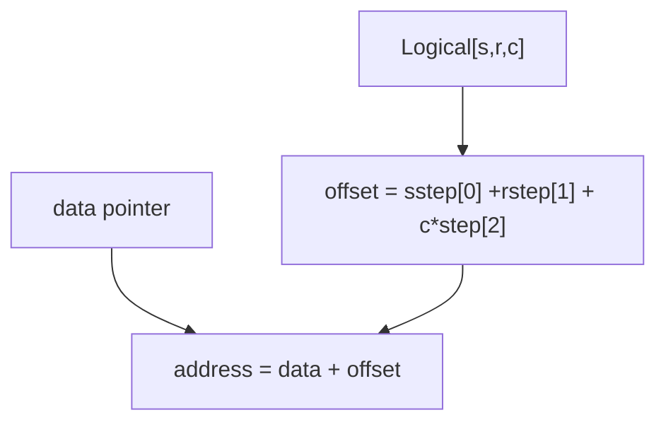
**Step Array Layout:**

-   `step[0]`: Bytes per slice (outermost dimension)
-   `step[1]`: Bytes per row
-   `step[2]`: Bytes per column (usually elemSize)
-   For 2D: `step[0]` is row step, `step[1]` is element size

**Dimensions 1-2 Optimization:**

-   1D/2D arrays use embedded `step.buf[2]` instead of heap allocation
-   `size.p` points to `&rows` for efficiency
-   Higher dimensions allocate `step.p` and `size.p` dynamically

Sources: [modules/core/src/matrix.cpp218-281](https://github.com/opencv/opencv/blob/91c78f50/modules/core/src/matrix.cpp#L218-L281) [modules/core/include/opencv2/core/mat.hpp796-900](https://github.com/opencv/opencv/blob/91c78f50/modules/core/include/opencv2/core/mat.hpp#L796-L900)

### Submatrix and ROI Implementation

Creating a submatrix or ROI shares the underlying data:

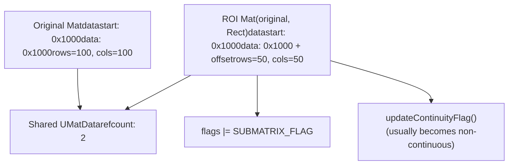
**Implementation Details:**

-   Constructor `Mat(const Mat& m, const Rect& roi)`
-   Increments reference count: `CV_XADD(&u->refcount, 1)`
-   Adjusts `data` pointer: `data += roi.y*step[0] + roi.x*elemSize()`
-   Sets `SUBMATRIX_FLAG` in flags
-   Maintains same `datastart` and `datalimit`

Sources: [modules/core/src/matrix.cpp796-820](https://github.com/opencv/opencv/blob/91c78f50/modules/core/src/matrix.cpp#L796-L820) [modules/core/src/matrix.cpp743-793](https://github.com/opencv/opencv/blob/91c78f50/modules/core/src/matrix.cpp#L743-L793)

## Mat and UMat Interoperability

### Conversion Between Mat and UMat

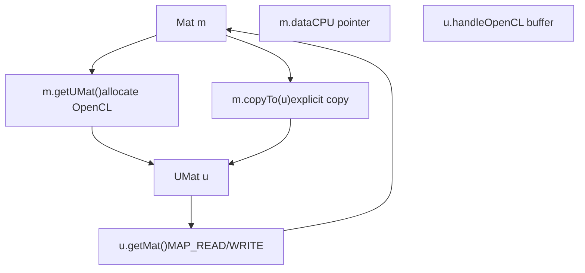
**Conversion Methods:**

| Method | Direction | Data Copy | Use Case |
| --- | --- | --- | --- |
| `UMat::getMat(AccessFlag)` | UMat → Mat | Lazy (on access) | Access GPU data on CPU |
| `Mat::getUMat(AccessFlag)` | Mat → UMat | Lazy | Upload CPU data to GPU |
| `Mat::copyTo(UMat)` | Mat → UMat | Immediate | Explicit copy |
| `UMat::copyTo(Mat)` | UMat → Mat | Immediate | Explicit copy |

**Access Flags:**

-   `ACCESS_READ`: Read-only access (1<<24)
-   `ACCESS_WRITE`: Write-only access (1<<25)
-   `ACCESS_RW`: Read-write access
-   `ACCESS_FAST`: Hint for fast mapping

Sources: [modules/core/include/opencv2/core/mat.hpp65-68](https://github.com/opencv/opencv/blob/91c78f50/modules/core/include/opencv2/core/mat.hpp#L65-L68) [modules/core/src/matrix.cpp1-200](https://github.com/opencv/opencv/blob/91c78f50/modules/core/src/matrix.cpp#L1-L200)

### InputArray/OutputArray Abstraction

OpenCV functions use polymorphic array wrappers to accept both Mat and UMat:

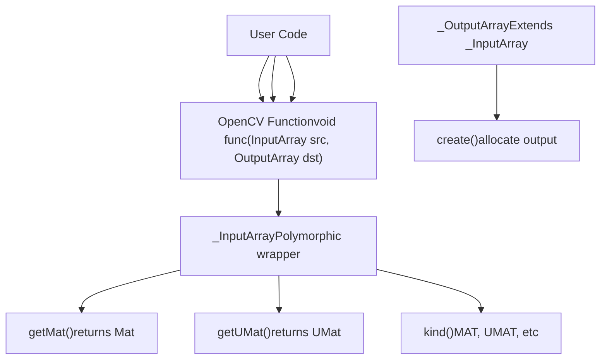
**Kind Flags:**

-   `MAT = 1 << KIND_SHIFT`
-   `UMAT = 10 << KIND_SHIFT`
-   `STD_VECTOR_MAT = 5 << KIND_SHIFT`
-   And others for various container types

Sources: [modules/core/include/opencv2/core/mat.hpp160-272](https://github.com/opencv/opencv/blob/91c78f50/modules/core/include/opencv2/core/mat.hpp#L160-L272) [modules/core/include/opencv2/core/mat.hpp301-393](https://github.com/opencv/opencv/blob/91c78f50/modules/core/include/opencv2/core/mat.hpp#L301-L393)

### Transparent GPU Execution

The T-API (Transparent API) automatically selects CPU or GPU execution:

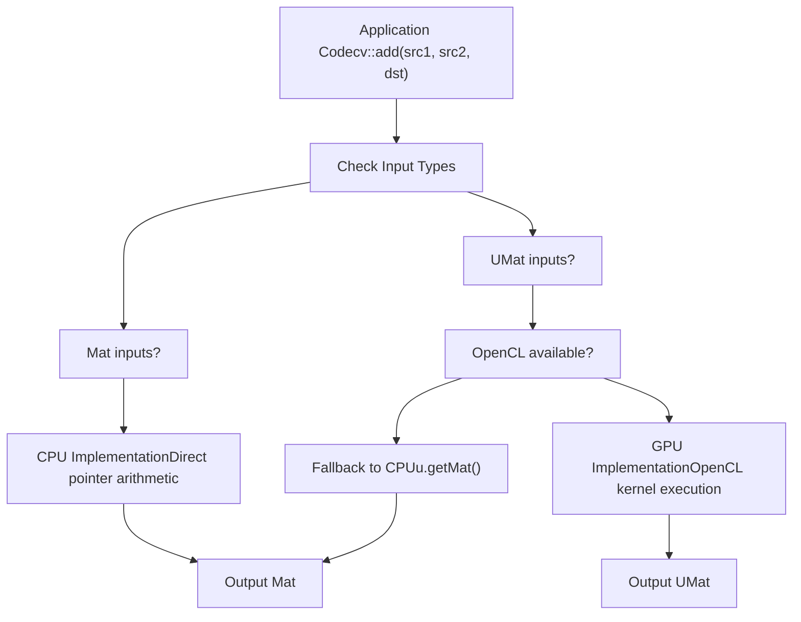
**Execution Decision:**

Functions like `binary_op` in `arithm.cpp` follow this pattern:

1.  Compute `use_opencl = (kind1 == _InputArray::UMAT || kind2 == _InputArray::UMAT) && dims <= 2`
2.  Call `CV_OCL_RUN(use_opencl, ocl_binary_op(...))` — if the OpenCL implementation returns `false`, execution falls through
3.  Otherwise call `getMat()` on all inputs and run the CPU path

The `CV_OCL_RUN` macro evaluates to a no-op when `HAVE_OPENCL` is not defined at build time, so the entire dispatch path compiles away on platforms without OpenCL.

Sources: [modules/core/src/arithm.cpp151-246](https://github.com/opencv/opencv/blob/91c78f50/modules/core/src/arithm.cpp#L151-L246) [modules/core/src/arithm.cpp60-147](https://github.com/opencv/opencv/blob/91c78f50/modules/core/src/arithm.cpp#L60-L147)

---

This page documents the core data structures that underpin all of OpenCV's operations. Understanding Mat and UMat memory layout, reference counting, and interoperability is essential for efficient OpenCV usage and for understanding the acceleration mechanisms described in [OpenCL Acceleration and Transparent GPU Execution](/opencv/opencv/3.2-opencl-acceleration-and-transparent-gpu-execution).
