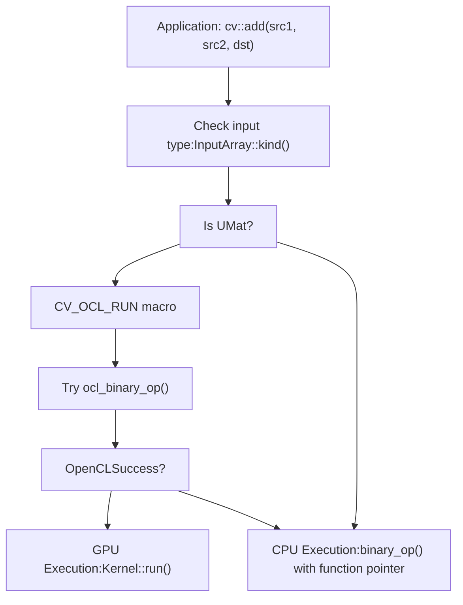
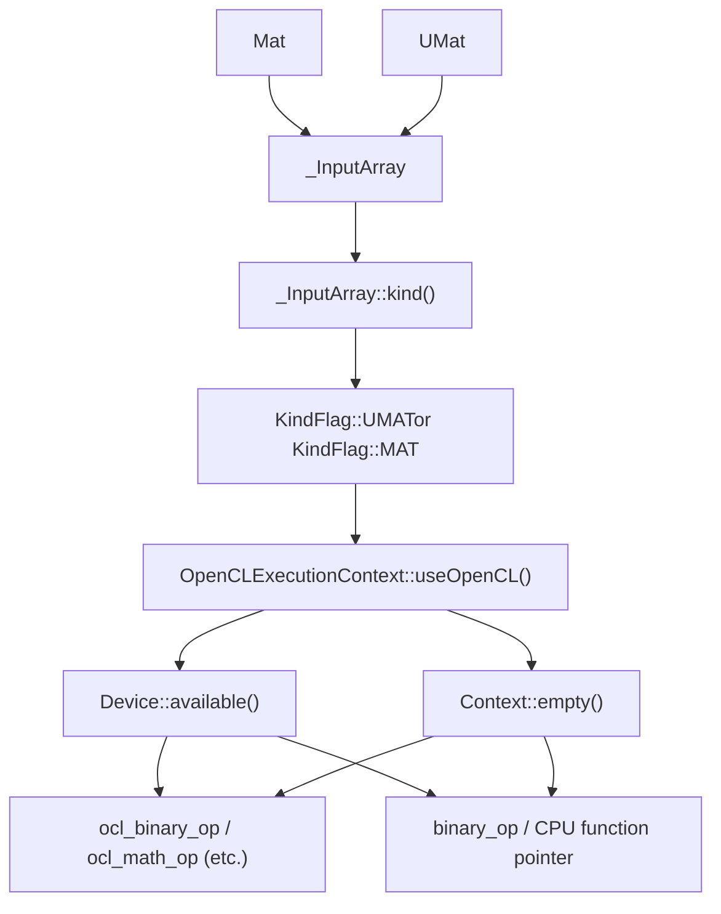
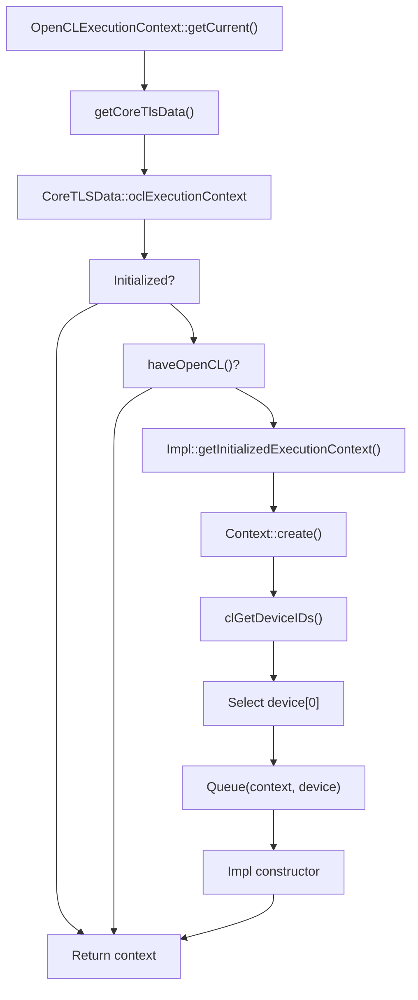
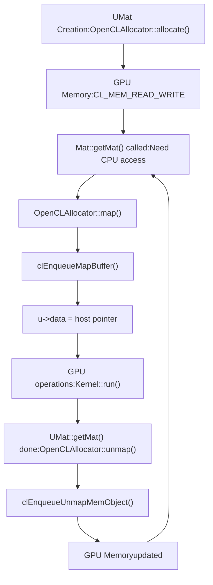
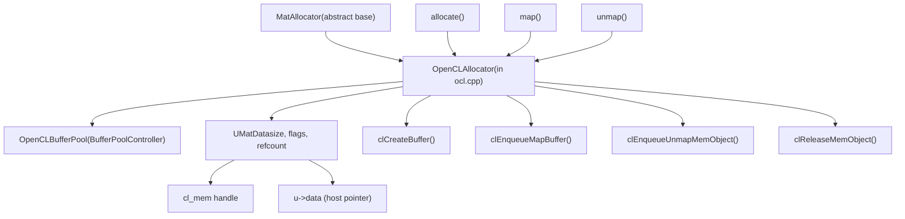
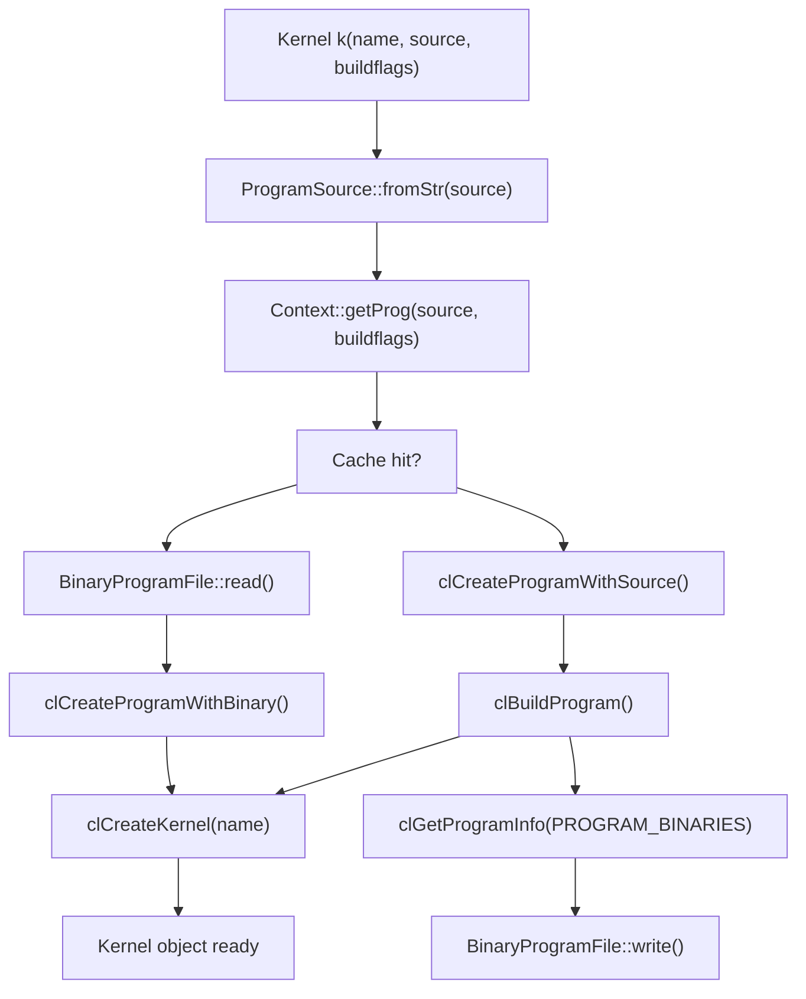
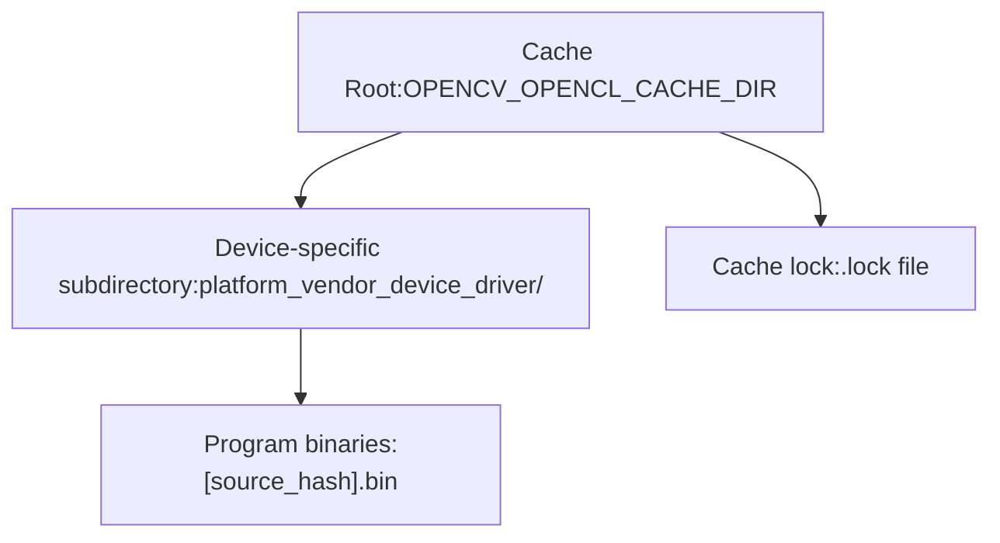
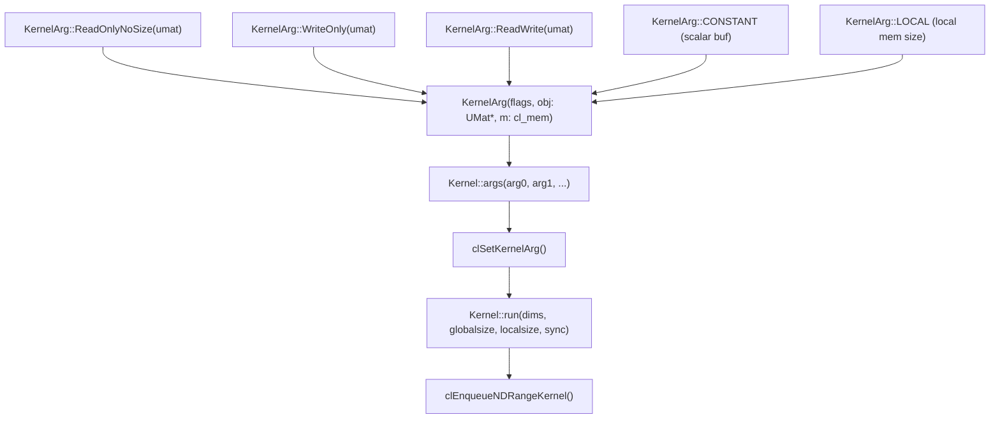
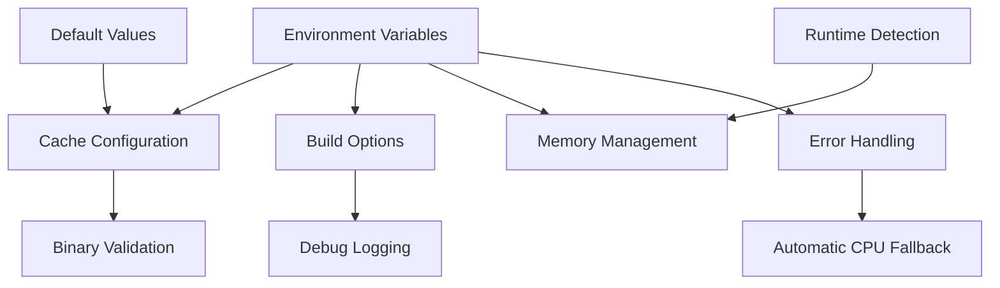

# OpenCL Acceleration and Transparent GPU Execution

Relevant source files

-   [3rdparty/libjpeg/jquant2.c](https://github.com/opencv/opencv/blob/91c78f50/3rdparty/libjpeg/jquant2.c)
-   [cmake/OpenCVCompilerOptimizations.cmake](https://github.com/opencv/opencv/blob/91c78f50/cmake/OpenCVCompilerOptimizations.cmake)
-   [modules/calib3d/src/rho.cpp](https://github.com/opencv/opencv/blob/91c78f50/modules/calib3d/src/rho.cpp)
-   [modules/calib3d/src/rho.h](https://github.com/opencv/opencv/blob/91c78f50/modules/calib3d/src/rho.h)
-   [modules/core/include/opencv2/core.hpp](https://github.com/opencv/opencv/blob/91c78f50/modules/core/include/opencv2/core.hpp)
-   [modules/core/include/opencv2/core/base.hpp](https://github.com/opencv/opencv/blob/91c78f50/modules/core/include/opencv2/core/base.hpp)
-   [modules/core/include/opencv2/core/core.hpp](https://github.com/opencv/opencv/blob/91c78f50/modules/core/include/opencv2/core/core.hpp)
-   [modules/core/include/opencv2/core/cv\_cpu\_dispatch.h](https://github.com/opencv/opencv/blob/91c78f50/modules/core/include/opencv2/core/cv_cpu_dispatch.h)
-   [modules/core/include/opencv2/core/cv\_cpu\_helper.h](https://github.com/opencv/opencv/blob/91c78f50/modules/core/include/opencv2/core/cv_cpu_helper.h)
-   [modules/core/include/opencv2/core/cvdef.h](https://github.com/opencv/opencv/blob/91c78f50/modules/core/include/opencv2/core/cvdef.h)
-   [modules/core/include/opencv2/core/mat.hpp](https://github.com/opencv/opencv/blob/91c78f50/modules/core/include/opencv2/core/mat.hpp)
-   [modules/core/include/opencv2/core/mat.inl.hpp](https://github.com/opencv/opencv/blob/91c78f50/modules/core/include/opencv2/core/mat.inl.hpp)
-   [modules/core/include/opencv2/core/matx.hpp](https://github.com/opencv/opencv/blob/91c78f50/modules/core/include/opencv2/core/matx.hpp)
-   [modules/core/include/opencv2/core/ocl.hpp](https://github.com/opencv/opencv/blob/91c78f50/modules/core/include/opencv2/core/ocl.hpp)
-   [modules/core/include/opencv2/core/opencl/ocl\_defs.hpp](https://github.com/opencv/opencv/blob/91c78f50/modules/core/include/opencv2/core/opencl/ocl_defs.hpp)
-   [modules/core/include/opencv2/core/operations.hpp](https://github.com/opencv/opencv/blob/91c78f50/modules/core/include/opencv2/core/operations.hpp)
-   [modules/core/include/opencv2/core/private.hpp](https://github.com/opencv/opencv/blob/91c78f50/modules/core/include/opencv2/core/private.hpp)
-   [modules/core/include/opencv2/core/softfloat.hpp](https://github.com/opencv/opencv/blob/91c78f50/modules/core/include/opencv2/core/softfloat.hpp)
-   [modules/core/include/opencv2/core/types.hpp](https://github.com/opencv/opencv/blob/91c78f50/modules/core/include/opencv2/core/types.hpp)
-   [modules/core/include/opencv2/core/types\_c.h](https://github.com/opencv/opencv/blob/91c78f50/modules/core/include/opencv2/core/types_c.h)
-   [modules/core/include/opencv2/core/utility.hpp](https://github.com/opencv/opencv/blob/91c78f50/modules/core/include/opencv2/core/utility.hpp)
-   [modules/core/include/opencv2/core/utils/buffer\_area.private.hpp](https://github.com/opencv/opencv/blob/91c78f50/modules/core/include/opencv2/core/utils/buffer_area.private.hpp)
-   [modules/core/perf/opencl/perf\_arithm.cpp](https://github.com/opencv/opencv/blob/91c78f50/modules/core/perf/opencl/perf_arithm.cpp)
-   [modules/core/src/algorithm.cpp](https://github.com/opencv/opencv/blob/91c78f50/modules/core/src/algorithm.cpp)
-   [modules/core/src/arithm.cpp](https://github.com/opencv/opencv/blob/91c78f50/modules/core/src/arithm.cpp)
-   [modules/core/src/array.cpp](https://github.com/opencv/opencv/blob/91c78f50/modules/core/src/array.cpp)
-   [modules/core/src/buffer\_area.cpp](https://github.com/opencv/opencv/blob/91c78f50/modules/core/src/buffer_area.cpp)
-   [modules/core/src/command\_line\_parser.cpp](https://github.com/opencv/opencv/blob/91c78f50/modules/core/src/command_line_parser.cpp)
-   [modules/core/src/copy.cpp](https://github.com/opencv/opencv/blob/91c78f50/modules/core/src/copy.cpp)
-   [modules/core/src/lapack.cpp](https://github.com/opencv/opencv/blob/91c78f50/modules/core/src/lapack.cpp)
-   [modules/core/src/mathfuncs.cpp](https://github.com/opencv/opencv/blob/91c78f50/modules/core/src/mathfuncs.cpp)
-   [modules/core/src/matrix.cpp](https://github.com/opencv/opencv/blob/91c78f50/modules/core/src/matrix.cpp)
-   [modules/core/src/matrix\_wrap.cpp](https://github.com/opencv/opencv/blob/91c78f50/modules/core/src/matrix_wrap.cpp)
-   [modules/core/src/ocl.cpp](https://github.com/opencv/opencv/blob/91c78f50/modules/core/src/ocl.cpp)
-   [modules/core/src/ocl\_disabled.impl.hpp](https://github.com/opencv/opencv/blob/91c78f50/modules/core/src/ocl_disabled.impl.hpp)
-   [modules/core/src/opencl/arithm.cl](https://github.com/opencv/opencv/blob/91c78f50/modules/core/src/opencl/arithm.cl)
-   [modules/core/src/opencl/gemm.cl](https://github.com/opencv/opencv/blob/91c78f50/modules/core/src/opencl/gemm.cl)
-   [modules/core/src/opencl/meanstddev.cl](https://github.com/opencv/opencv/blob/91c78f50/modules/core/src/opencl/meanstddev.cl)
-   [modules/core/src/opencl/minmaxloc.cl](https://github.com/opencv/opencv/blob/91c78f50/modules/core/src/opencl/minmaxloc.cl)
-   [modules/core/src/opencl/reduce.cl](https://github.com/opencv/opencv/blob/91c78f50/modules/core/src/opencl/reduce.cl)
-   [modules/core/src/precomp.hpp](https://github.com/opencv/opencv/blob/91c78f50/modules/core/src/precomp.hpp)
-   [modules/core/src/rand.cpp](https://github.com/opencv/opencv/blob/91c78f50/modules/core/src/rand.cpp)
-   [modules/core/src/softfloat.cpp](https://github.com/opencv/opencv/blob/91c78f50/modules/core/src/softfloat.cpp)
-   [modules/core/src/system.cpp](https://github.com/opencv/opencv/blob/91c78f50/modules/core/src/system.cpp)
-   [modules/core/src/umatrix.cpp](https://github.com/opencv/opencv/blob/91c78f50/modules/core/src/umatrix.cpp)
-   [modules/core/test/ocl/test\_arithm.cpp](https://github.com/opencv/opencv/blob/91c78f50/modules/core/test/ocl/test_arithm.cpp)
-   [modules/core/test/ocl/test\_opencl.cpp](https://github.com/opencv/opencv/blob/91c78f50/modules/core/test/ocl/test_opencl.cpp)
-   [modules/core/test/test\_arithm.cpp](https://github.com/opencv/opencv/blob/91c78f50/modules/core/test/test_arithm.cpp)
-   [modules/core/test/test\_mat.cpp](https://github.com/opencv/opencv/blob/91c78f50/modules/core/test/test_mat.cpp)
-   [modules/core/test/test\_math.cpp](https://github.com/opencv/opencv/blob/91c78f50/modules/core/test/test_math.cpp)
-   [modules/core/test/test\_operations.cpp](https://github.com/opencv/opencv/blob/91c78f50/modules/core/test/test_operations.cpp)
-   [modules/core/test/test\_precomp.hpp](https://github.com/opencv/opencv/blob/91c78f50/modules/core/test/test_precomp.hpp)
-   [modules/core/test/test\_rand.cpp](https://github.com/opencv/opencv/blob/91c78f50/modules/core/test/test_rand.cpp)
-   [modules/core/test/test\_umat.cpp](https://github.com/opencv/opencv/blob/91c78f50/modules/core/test/test_umat.cpp)
-   [modules/core/test/test\_utils.cpp](https://github.com/opencv/opencv/blob/91c78f50/modules/core/test/test_utils.cpp)
-   [modules/ts/include/opencv2/ts/ocl\_perf.hpp](https://github.com/opencv/opencv/blob/91c78f50/modules/ts/include/opencv2/ts/ocl_perf.hpp)
-   [modules/ts/src/ocl\_perf.cpp](https://github.com/opencv/opencv/blob/91c78f50/modules/ts/src/ocl_perf.cpp)
-   [modules/ts/src/ocl\_test.cpp](https://github.com/opencv/opencv/blob/91c78f50/modules/ts/src/ocl_test.cpp)
-   [platforms/linux/riscv64-071-gcc.toolchain.cmake](https://github.com/opencv/opencv/blob/91c78f50/platforms/linux/riscv64-071-gcc.toolchain.cmake)

OpenCV's OpenCL acceleration system provides transparent GPU computing through the OpenCL framework. The system's key feature is **transparent execution**: algorithms automatically execute on GPU when UMat is used, with automatic fallback to CPU when OpenCL is unavailable or disabled. This transparency allows writing device-agnostic code that automatically leverages available hardware acceleration.

The system consists of three main components:

-   **UMat data structure** - GPU-aware matrix that triggers OpenCL execution paths
-   **OpenCL runtime wrappers** - C++ classes wrapping OpenCL API (Device, Context, Queue, Program, Kernel)
-   **Binary program cache** - Persistent storage of compiled kernels for fast startup

For information about Mat and UMat data structures, see page 3.1. For broader system utilities, see page 3.3. For parallel processing abstractions, see page 3.3.

Sources: [modules/core/src/ocl.cpp44-130](https://github.com/opencv/opencv/blob/91c78f50/modules/core/src/ocl.cpp#L44-L130) [modules/core/include/opencv2/core/ocl.hpp1-100](https://github.com/opencv/opencv/blob/91c78f50/modules/core/include/opencv2/core/ocl.hpp#L1-L100)

## Transparent Execution Mechanism

The transparent execution mechanism allows algorithms to automatically choose between CPU and GPU execution based on input data types. When functions receive UMat inputs, they attempt OpenCL execution; when they receive Mat inputs, they execute on CPU.

**Transparent Execution Flow**

The `CV_OCL_RUN` macro (defined in [modules/core/include/opencv2/core/private.hpp](https://github.com/opencv/opencv/blob/91c78f50/modules/core/include/opencv2/core/private.hpp)) provides the execution switch. When OpenCL execution is unavailable or fails, the code automatically falls through to CPU execution paths.

**Code Entity Mapping: Execution Path Selection**

Key classes and functions for execution control:

| Symbol | Role | Location |
| --- | --- | --- |
| `_InputArray::kind()` | Returns `MAT` or `UMAT` flag | [modules/core/include/opencv2/core/mat.hpp163-190](https://github.com/opencv/opencv/blob/91c78f50/modules/core/include/opencv2/core/mat.hpp#L163-L190) |
| `CV_OCL_RUN` macro | Guards each OpenCL attempt | [modules/core/include/opencv2/core/private.hpp](https://github.com/opencv/opencv/blob/91c78f50/modules/core/include/opencv2/core/private.hpp) |
| `OpenCLExecutionContext::useOpenCL()` | Per-context enable/disable switch | [modules/core/src/ocl.cpp947-969](https://github.com/opencv/opencv/blob/91c78f50/modules/core/src/ocl.cpp#L947-L969) |
| `Device::available()` | Queries `CL_DEVICE_AVAILABLE` | [modules/core/src/ocl.cpp955-959](https://github.com/opencv/opencv/blob/91c78f50/modules/core/src/ocl.cpp#L955-L959) |
| `Context::empty()` | True if no valid cl\_context | [modules/core/src/ocl.cpp](https://github.com/opencv/opencv/blob/91c78f50/modules/core/src/ocl.cpp) |

Sources: [modules/core/src/arithm.cpp151-328](https://github.com/opencv/opencv/blob/91c78f50/modules/core/src/arithm.cpp#L151-L328) [modules/core/src/ocl.cpp846-1080](https://github.com/opencv/opencv/blob/91c78f50/modules/core/src/ocl.cpp#L846-L1080) [modules/core/include/opencv2/core/mat.hpp160-272](https://github.com/opencv/opencv/blob/91c78f50/modules/core/include/opencv2/core/mat.hpp#L160-L272)

## OpenCL Context and Device Management

OpenCL resources are managed through thread-local execution contexts initialized lazily on first use.

**Execution Context Initialization**

The `OpenCLExecutionContext::Impl` class encapsulates OpenCL state:

-   `context_` - ocl::Context wrapping cl\_context
-   `device_` - Index of selected device in context
-   `queue_` - ocl::Queue wrapping cl\_command\_queue
-   `useOpenCL_` - Cached availability flag

Sources: [modules/core/src/ocl.cpp979-1037](https://github.com/opencv/opencv/blob/91c78f50/modules/core/src/ocl.cpp#L979-L1037) [modules/core/src/ocl.cpp846-978](https://github.com/opencv/opencv/blob/91c78f50/modules/core/src/ocl.cpp#L846-L978) [modules/core/src/ocl.cpp1068-1080](https://github.com/opencv/opencv/blob/91c78f50/modules/core/src/ocl.cpp#L1068-L1080)

## Transparent Execution in Practice

The transparent execution model requires no code changes to switch between CPU and GPU. Passing `UMat` to any OpenCV function that supports OpenCL causes it to execute on GPU; passing `Mat` causes CPU execution. Data migration between CPU and GPU memory is handled automatically by the `UMat`/`UMatData` system.

**Execution Flow in `cv::add()`**

The internal dispatch function `binary_op()` in [modules/core/src/arithm.cpp151-328](https://github.com/opencv/opencv/blob/91c78f50/modules/core/src/arithm.cpp#L151-L328) follows this pattern:

1.  Inspect input kinds via `_InputArray::kind()` — checks for `UMAT` flag
2.  If UMat detected: invoke `CV_OCL_RUN(use_opencl, ocl_binary_op(...))`
3.  `ocl_binary_op()` compiles or retrieves a cached kernel, sets arguments via `KernelArg`, and calls `Kernel::run()`
4.  If OpenCL path returns `false` (unavailable, device mismatch, build error): execution falls through to the CPU `binary_op()` path using function pointers

The `CV_OCL_RUN` macro in [modules/core/include/opencv2/core/private.hpp](https://github.com/opencv/opencv/blob/91c78f50/modules/core/include/opencv2/core/private.hpp) guards every OpenCL attempt: it evaluates the condition, runs the OCL function, and on `true` return exits the enclosing function immediately.

**Algorithm Support for OpenCL**

The `CV_OCL_RUN` / `ocl_*` pattern is used throughout the library. The following table summarizes where it appears:

| Module | Example functions | Source location |
| --- | --- | --- |
| core | `add`, `subtract`, `multiply`, `bitwise_and` | [modules/core/src/arithm.cpp60-404](https://github.com/opencv/opencv/blob/91c78f50/modules/core/src/arithm.cpp#L60-L404) |
| core | `magnitude`, `phase`, `log`, `exp` | [modules/core/src/mathfuncs.cpp58-100](https://github.com/opencv/opencv/blob/91c78f50/modules/core/src/mathfuncs.cpp#L58-L100) |
| core | `copyTo`, `setTo` | [modules/core/src/copy.cpp](https://github.com/opencv/opencv/blob/91c78f50/modules/core/src/copy.cpp) |
| imgproc | `GaussianBlur`, `filter2D`, morphological ops | `modules/imgproc/src/` |
| imgproc | `resize`, `warpAffine`, `warpPerspective` | `modules/imgproc/src/` |
| imgproc | `cvtColor` | `modules/imgproc/src/color.cpp` |
| features2d | `ORB`, `FAST` | `modules/features2d/src/` |

Functions without an OpenCL implementation receive UMat inputs, fall back to CPU, and use the `UMatData` allocator to perform the required CPU↔GPU data transfer transparently.

Sources: [modules/core/src/arithm.cpp60-404](https://github.com/opencv/opencv/blob/91c78f50/modules/core/src/arithm.cpp#L60-L404) [modules/core/src/mathfuncs.cpp58-100](https://github.com/opencv/opencv/blob/91c78f50/modules/core/src/mathfuncs.cpp#L58-L100) [modules/core/src/copy.cpp1-200](https://github.com/opencv/opencv/blob/91c78f50/modules/core/src/copy.cpp#L1-L200)

## UMat and Memory Management

UMat provides GPU-aware memory management with automatic data migration between CPU and GPU memory spaces. The system uses `UMatData` to track memory state and trigger migrations when needed.

**UMat Memory State Machine**

**UMatData Structure and Flags**

The `UMatData` class tracks memory state through flags:

-   `COPY_ON_MAP` - Data must be copied to host before mapping
-   `HOST_COPY_OBSOLETE` - CPU copy is stale, GPU has newer data
-   `DEVICE_COPY_OBSOLETE` - GPU copy is stale, CPU has newer data
-   `TEMP_UMAT` - Temporary buffer for operations
-   `TEMP_COPIED_UMAT` - Temporary buffer with copied data
-   `USER_ALLOCATED` - Memory managed by user, not OpenCV

**Memory Allocation Strategies**

The system supports different allocation modes through `UMatUsageFlags`:

| Flag | Behavior | Use Case |
| --- | --- | --- |
| `USAGE_ALLOCATE_HOST_MEMORY` | CPU-only allocation | CPU-bound operations |
| `USAGE_ALLOCATE_DEVICE_MEMORY` | GPU-only allocation | GPU-bound operations |
| `USAGE_ALLOCATE_SHARED_MEMORY` | OpenCL SVM (Shared Virtual Memory) | Zero-copy when available |
| `USAGE_DEFAULT` | Automatic selection | General use |

The allocator decides memory placement based on:

-   Device capabilities (SVM support, host pointer alignment)
-   Configuration flags (`CV_OPENCL_ENABLE_MEM_USE_HOST_PTR`)
-   Size thresholds (`CV_OPENCL_ALIGNMENT_MEM_USE_HOST_PTR`)

**Code Entity: OpenCL Memory Allocator**

Key implementation details:

-   `OpenCLAllocator::allocate()` creates cl\_mem objects [modules/core/src/ocl.cpp1480-1630](https://github.com/opencv/opencv/blob/91c78f50/modules/core/src/ocl.cpp#L1480-L1630)
-   Buffer pooling reuses memory to reduce allocation overhead [modules/core/include/opencv2/core/bufferpool.hpp](https://github.com/opencv/opencv/blob/91c78f50/modules/core/include/opencv2/core/bufferpool.hpp)
-   Memory migration uses `CV_OPENCL_DISABLE_BUFFER_RECT_OPERATIONS` to control clEnqueueReadBufferRect usage [modules/core/src/ocl.cpp224-231](https://github.com/opencv/opencv/blob/91c78f50/modules/core/src/ocl.cpp#L224-L231)

Sources: [modules/core/src/ocl.cpp1080-1900](https://github.com/opencv/opencv/blob/91c78f50/modules/core/src/ocl.cpp#L1080-L1900) [modules/core/src/matrix.cpp10-125](https://github.com/opencv/opencv/blob/91c78f50/modules/core/src/matrix.cpp#L10-L125) [modules/core/src/umatrix.cpp1-1000](https://github.com/opencv/opencv/blob/91c78f50/modules/core/src/umatrix.cpp#L1-L1000)

## Kernel Compilation and Binary Caching

OpenCL kernels are compiled at runtime and cached as binary programs to eliminate recompilation overhead across program runs.

**Kernel Compilation Pipeline**

**Binary Cache File Structure**

The `BinaryProgramFile` class implements a hash table structure stored on disk:

| Component | Description |
| --- | --- |
| FileHeader | Source signature size + signature (CRC64) |
| FileTable | Number of entries (64) + entry offset array |
| FileEntry | Next entry offset + key size + data size + key + binary data |

Hash collision handling uses chaining within the file. Each entry contains:

-   `nextEntryFileOffset` - Offset to next entry in chain (0 if last)
-   `keySize` - Size of build options key
-   `dataSize` - Size of compiled binary
-   Key string - Build options used for compilation
-   Binary data - Compiled program binary

**Cache Directory Organization**

Cache directory structure:

-   Root: Set by `OPENCV_OPENCL_CACHE_DIR` environment variable [modules/core/src/ocl.cpp329-333](https://github.com/opencv/opencv/blob/91c78f50/modules/core/src/ocl.cpp#L329-L333)
-   Per-device subdirectories: Created using device properties to ensure binary compatibility
-   Lock file: Prevents concurrent writes in multi-process scenarios [modules/core/src/ocl.cpp349-392](https://github.com/opencv/opencv/blob/91c78f50/modules/core/src/ocl.cpp#L349-L392)

**Code Entity Mapping: Kernel Argument and Execution Pipeline**

Key kernel execution steps:

1.  `KernelArg` constructors extract `cl_mem` from `UMat` — [modules/core/include/opencv2/core/ocl.hpp400-450](https://github.com/opencv/opencv/blob/91c78f50/modules/core/include/opencv2/core/ocl.hpp#L400-L450)
2.  `Kernel::args()` accepts variadic `KernelArg` values and calls `clSetKernelArg()` for each
3.  `Kernel::run(dims, globalsize, localsize, sync)` enqueues the kernel via `clEnqueueNDRangeKernel()` — [modules/core/src/ocl.cpp4200-4400](https://github.com/opencv/opencv/blob/91c78f50/modules/core/src/ocl.cpp#L4200-L4400)

Sources: [modules/core/src/ocl.cpp520-841](https://github.com/opencv/opencv/blob/91c78f50/modules/core/src/ocl.cpp#L520-L841) [modules/core/src/ocl.cpp310-519](https://github.com/opencv/opencv/blob/91c78f50/modules/core/src/ocl.cpp#L310-L519) [modules/core/src/ocl.cpp3900-4500](https://github.com/opencv/opencv/blob/91c78f50/modules/core/src/ocl.cpp#L3900-L4500) [modules/core/include/opencv2/core/ocl.hpp400-450](https://github.com/opencv/opencv/blob/91c78f50/modules/core/include/opencv2/core/ocl.hpp#L400-L450)

## Runtime Configuration

OpenCL behavior is controlled through environment variables and runtime configuration:

| Configuration Option | Environment Variable | Purpose |
| --- | --- | --- |
| Cache Enable | `OPENCV_OPENCL_CACHE_ENABLE` | Enable/disable binary caching |
| Cache Directory | `OPENCV_OPENCL_CACHE_DIR` | Set cache storage location |
| Cache Locking | `OPENCV_OPENCL_CACHE_LOCK_ENABLE` | Enable file locking for cache |
| Build Options | `OPENCV_OPENCL_BUILD_EXTRA_OPTIONS` | Additional compiler flags |
| Error Handling | `OPENCV_OPENCL_RAISE_ERROR` | Control error behavior |
| Buffer Operations | `OPENCV_OPENCL_DISABLE_BUFFER_RECT_OPERATIONS` | Disable rect operations |

The configuration system initializes static variables on first access and provides thread-safe access to configuration parameters through the `cv::utils::getConfigurationParameter*` family of functions.

Sources: [modules/core/src/ocl.cpp215-249](https://github.com/opencv/opencv/blob/91c78f50/modules/core/src/ocl.cpp#L215-L249) [modules/core/src/ocl.cpp142-164](https://github.com/opencv/opencv/blob/91c78f50/modules/core/src/ocl.cpp#L142-L164)
