# System Utilities and Parallel Processing

Relevant source files

-   [3rdparty/libjpeg/jquant2.c](https://github.com/opencv/opencv/blob/91c78f50/3rdparty/libjpeg/jquant2.c)
-   [cmake/OpenCVCompilerOptimizations.cmake](https://github.com/opencv/opencv/blob/91c78f50/cmake/OpenCVCompilerOptimizations.cmake)
-   [modules/calib3d/src/rho.cpp](https://github.com/opencv/opencv/blob/91c78f50/modules/calib3d/src/rho.cpp)
-   [modules/calib3d/src/rho.h](https://github.com/opencv/opencv/blob/91c78f50/modules/calib3d/src/rho.h)
-   [modules/core/include/opencv2/core.hpp](https://github.com/opencv/opencv/blob/91c78f50/modules/core/include/opencv2/core.hpp)
-   [modules/core/include/opencv2/core/base.hpp](https://github.com/opencv/opencv/blob/91c78f50/modules/core/include/opencv2/core/base.hpp)
-   [modules/core/include/opencv2/core/core.hpp](https://github.com/opencv/opencv/blob/91c78f50/modules/core/include/opencv2/core/core.hpp)
-   [modules/core/include/opencv2/core/cv\_cpu\_dispatch.h](https://github.com/opencv/opencv/blob/91c78f50/modules/core/include/opencv2/core/cv_cpu_dispatch.h)
-   [modules/core/include/opencv2/core/cv\_cpu\_helper.h](https://github.com/opencv/opencv/blob/91c78f50/modules/core/include/opencv2/core/cv_cpu_helper.h)
-   [modules/core/include/opencv2/core/cvdef.h](https://github.com/opencv/opencv/blob/91c78f50/modules/core/include/opencv2/core/cvdef.h)
-   [modules/core/include/opencv2/core/mat.hpp](https://github.com/opencv/opencv/blob/91c78f50/modules/core/include/opencv2/core/mat.hpp)
-   [modules/core/include/opencv2/core/mat.inl.hpp](https://github.com/opencv/opencv/blob/91c78f50/modules/core/include/opencv2/core/mat.inl.hpp)
-   [modules/core/include/opencv2/core/matx.hpp](https://github.com/opencv/opencv/blob/91c78f50/modules/core/include/opencv2/core/matx.hpp)
-   [modules/core/include/opencv2/core/ocl.hpp](https://github.com/opencv/opencv/blob/91c78f50/modules/core/include/opencv2/core/ocl.hpp)
-   [modules/core/include/opencv2/core/opencl/ocl\_defs.hpp](https://github.com/opencv/opencv/blob/91c78f50/modules/core/include/opencv2/core/opencl/ocl_defs.hpp)
-   [modules/core/include/opencv2/core/operations.hpp](https://github.com/opencv/opencv/blob/91c78f50/modules/core/include/opencv2/core/operations.hpp)
-   [modules/core/include/opencv2/core/private.hpp](https://github.com/opencv/opencv/blob/91c78f50/modules/core/include/opencv2/core/private.hpp)
-   [modules/core/include/opencv2/core/softfloat.hpp](https://github.com/opencv/opencv/blob/91c78f50/modules/core/include/opencv2/core/softfloat.hpp)
-   [modules/core/include/opencv2/core/types.hpp](https://github.com/opencv/opencv/blob/91c78f50/modules/core/include/opencv2/core/types.hpp)
-   [modules/core/include/opencv2/core/types\_c.h](https://github.com/opencv/opencv/blob/91c78f50/modules/core/include/opencv2/core/types_c.h)
-   [modules/core/include/opencv2/core/utility.hpp](https://github.com/opencv/opencv/blob/91c78f50/modules/core/include/opencv2/core/utility.hpp)
-   [modules/core/include/opencv2/core/utils/buffer\_area.private.hpp](https://github.com/opencv/opencv/blob/91c78f50/modules/core/include/opencv2/core/utils/buffer_area.private.hpp)
-   [modules/core/perf/opencl/perf\_arithm.cpp](https://github.com/opencv/opencv/blob/91c78f50/modules/core/perf/opencl/perf_arithm.cpp)
-   [modules/core/src/algorithm.cpp](https://github.com/opencv/opencv/blob/91c78f50/modules/core/src/algorithm.cpp)
-   [modules/core/src/arithm.cpp](https://github.com/opencv/opencv/blob/91c78f50/modules/core/src/arithm.cpp)
-   [modules/core/src/array.cpp](https://github.com/opencv/opencv/blob/91c78f50/modules/core/src/array.cpp)
-   [modules/core/src/buffer\_area.cpp](https://github.com/opencv/opencv/blob/91c78f50/modules/core/src/buffer_area.cpp)
-   [modules/core/src/command\_line\_parser.cpp](https://github.com/opencv/opencv/blob/91c78f50/modules/core/src/command_line_parser.cpp)
-   [modules/core/src/copy.cpp](https://github.com/opencv/opencv/blob/91c78f50/modules/core/src/copy.cpp)
-   [modules/core/src/lapack.cpp](https://github.com/opencv/opencv/blob/91c78f50/modules/core/src/lapack.cpp)
-   [modules/core/src/mathfuncs.cpp](https://github.com/opencv/opencv/blob/91c78f50/modules/core/src/mathfuncs.cpp)
-   [modules/core/src/matrix.cpp](https://github.com/opencv/opencv/blob/91c78f50/modules/core/src/matrix.cpp)
-   [modules/core/src/matrix\_wrap.cpp](https://github.com/opencv/opencv/blob/91c78f50/modules/core/src/matrix_wrap.cpp)
-   [modules/core/src/ocl.cpp](https://github.com/opencv/opencv/blob/91c78f50/modules/core/src/ocl.cpp)
-   [modules/core/src/ocl\_disabled.impl.hpp](https://github.com/opencv/opencv/blob/91c78f50/modules/core/src/ocl_disabled.impl.hpp)
-   [modules/core/src/opencl/arithm.cl](https://github.com/opencv/opencv/blob/91c78f50/modules/core/src/opencl/arithm.cl)
-   [modules/core/src/opencl/gemm.cl](https://github.com/opencv/opencv/blob/91c78f50/modules/core/src/opencl/gemm.cl)
-   [modules/core/src/opencl/meanstddev.cl](https://github.com/opencv/opencv/blob/91c78f50/modules/core/src/opencl/meanstddev.cl)
-   [modules/core/src/opencl/minmaxloc.cl](https://github.com/opencv/opencv/blob/91c78f50/modules/core/src/opencl/minmaxloc.cl)
-   [modules/core/src/opencl/reduce.cl](https://github.com/opencv/opencv/blob/91c78f50/modules/core/src/opencl/reduce.cl)
-   [modules/core/src/parallel.cpp](https://github.com/opencv/opencv/blob/91c78f50/modules/core/src/parallel.cpp)
-   [modules/core/src/precomp.hpp](https://github.com/opencv/opencv/blob/91c78f50/modules/core/src/precomp.hpp)
-   [modules/core/src/rand.cpp](https://github.com/opencv/opencv/blob/91c78f50/modules/core/src/rand.cpp)
-   [modules/core/src/softfloat.cpp](https://github.com/opencv/opencv/blob/91c78f50/modules/core/src/softfloat.cpp)
-   [modules/core/src/system.cpp](https://github.com/opencv/opencv/blob/91c78f50/modules/core/src/system.cpp)
-   [modules/core/src/umatrix.cpp](https://github.com/opencv/opencv/blob/91c78f50/modules/core/src/umatrix.cpp)
-   [modules/core/test/ocl/test\_arithm.cpp](https://github.com/opencv/opencv/blob/91c78f50/modules/core/test/ocl/test_arithm.cpp)
-   [modules/core/test/ocl/test\_opencl.cpp](https://github.com/opencv/opencv/blob/91c78f50/modules/core/test/ocl/test_opencl.cpp)
-   [modules/core/test/test\_arithm.cpp](https://github.com/opencv/opencv/blob/91c78f50/modules/core/test/test_arithm.cpp)
-   [modules/core/test/test\_mat.cpp](https://github.com/opencv/opencv/blob/91c78f50/modules/core/test/test_mat.cpp)
-   [modules/core/test/test\_math.cpp](https://github.com/opencv/opencv/blob/91c78f50/modules/core/test/test_math.cpp)
-   [modules/core/test/test\_operations.cpp](https://github.com/opencv/opencv/blob/91c78f50/modules/core/test/test_operations.cpp)
-   [modules/core/test/test\_precomp.hpp](https://github.com/opencv/opencv/blob/91c78f50/modules/core/test/test_precomp.hpp)
-   [modules/core/test/test\_rand.cpp](https://github.com/opencv/opencv/blob/91c78f50/modules/core/test/test_rand.cpp)
-   [modules/core/test/test\_umat.cpp](https://github.com/opencv/opencv/blob/91c78f50/modules/core/test/test_umat.cpp)
-   [modules/core/test/test\_utils.cpp](https://github.com/opencv/opencv/blob/91c78f50/modules/core/test/test_utils.cpp)
-   [modules/ts/CMakeLists.txt](https://github.com/opencv/opencv/blob/91c78f50/modules/ts/CMakeLists.txt)
-   [modules/ts/include/opencv2/ts.hpp](https://github.com/opencv/opencv/blob/91c78f50/modules/ts/include/opencv2/ts.hpp)
-   [modules/ts/include/opencv2/ts/ocl\_perf.hpp](https://github.com/opencv/opencv/blob/91c78f50/modules/ts/include/opencv2/ts/ocl_perf.hpp)
-   [modules/ts/include/opencv2/ts/ts\_ext.hpp](https://github.com/opencv/opencv/blob/91c78f50/modules/ts/include/opencv2/ts/ts_ext.hpp)
-   [modules/ts/include/opencv2/ts/ts\_gtest.h](https://github.com/opencv/opencv/blob/91c78f50/modules/ts/include/opencv2/ts/ts_gtest.h)
-   [modules/ts/include/opencv2/ts/ts\_perf.hpp](https://github.com/opencv/opencv/blob/91c78f50/modules/ts/include/opencv2/ts/ts_perf.hpp)
-   [modules/ts/src/ocl\_perf.cpp](https://github.com/opencv/opencv/blob/91c78f50/modules/ts/src/ocl_perf.cpp)
-   [modules/ts/src/ocl\_test.cpp](https://github.com/opencv/opencv/blob/91c78f50/modules/ts/src/ocl_test.cpp)
-   [modules/ts/src/precomp.hpp](https://github.com/opencv/opencv/blob/91c78f50/modules/ts/src/precomp.hpp)
-   [modules/ts/src/ts.cpp](https://github.com/opencv/opencv/blob/91c78f50/modules/ts/src/ts.cpp)
-   [modules/ts/src/ts\_arrtest.cpp](https://github.com/opencv/opencv/blob/91c78f50/modules/ts/src/ts_arrtest.cpp)
-   [modules/ts/src/ts\_func.cpp](https://github.com/opencv/opencv/blob/91c78f50/modules/ts/src/ts_func.cpp)
-   [modules/ts/src/ts\_gtest.cpp](https://github.com/opencv/opencv/blob/91c78f50/modules/ts/src/ts_gtest.cpp)
-   [modules/ts/src/ts\_perf.cpp](https://github.com/opencv/opencv/blob/91c78f50/modules/ts/src/ts_perf.cpp)
-   [platforms/linux/riscv64-071-gcc.toolchain.cmake](https://github.com/opencv/opencv/blob/91c78f50/platforms/linux/riscv64-071-gcc.toolchain.cmake)

This document covers OpenCV's system-level infrastructure including error handling, CPU feature detection, parallel processing framework, configuration parameters, and timing utilities. These components provide cross-platform system services that support the entire OpenCV library.

For information about memory management and data structures, see page 3.1. For details about OpenCL acceleration, see page 3.2. For persistence and serialization, see page 3.4.

## Overview

The core module provides essential system utilities that enable:

-   **Error Handling**: Exception-based error reporting with customizable callbacks
-   **CPU Feature Detection**: Runtime detection of SIMD capabilities (SSE, AVX, NEON, etc.)
-   **Parallel Processing**: Unified abstraction over multiple threading backends
-   **Memory Allocation**: Cache-aligned `fastMalloc`/`fastFree` and stack-buffered `AutoBuffer`
-   **Random Number Generation**: `RNG` class with multiple distributions and thread-local state
-   **Configuration**: Environment variable-based runtime configuration
-   **Timing**: High-resolution performance measurement utilities
-   **System Information**: Build configuration and version queries

These utilities are foundational for the entire OpenCV library, enabling performance optimization, error diagnostics, and cross-platform compatibility.

Sources: [modules/core/src/system.cpp1-1046](https://github.com/opencv/opencv/blob/91c78f50/modules/core/src/system.cpp#L1-L1046) [modules/core/src/parallel.cpp1-778](https://github.com/opencv/opencv/blob/91c78f50/modules/core/src/parallel.cpp#L1-L778) [modules/core/include/opencv2/core/utility.hpp1-800](https://github.com/opencv/opencv/blob/91c78f50/modules/core/include/opencv2/core/utility.hpp#L1-L800)

## Error Handling and Exceptions

OpenCV uses a comprehensive exception-based error handling system centered around the `Exception` class and customizable error callbacks.

### Exception Class Structure

The `cv::Exception` class extends `std::exception` and provides detailed error context:

| Field | Type | Description |
| --- | --- | --- |
| `code` | `int` | Error code from `CVStatus` enum |
| `err` | `String` | Error description message |
| `func` | `String` | Function name where error occurred |
| `file` | `String` | Source file name |
| `line` | `int` | Line number in source file |
| `msg` | `String` | Formatted error message |

Sources: [modules/core/src/system.cpp323-367](https://github.com/opencv/opencv/blob/91c78f50/modules/core/src/system.cpp#L323-L367) [modules/core/include/opencv2/core.hpp119-146](https://github.com/opencv/opencv/blob/91c78f50/modules/core/include/opencv2/core.hpp#L119-L146)

### Error Generation and Handling

**Error macro and function flow**

```mermaid
flowchart TD
    CV_Error["CV_Error(code, msg)"]
    CV_Error_["CV_Error_(code, fmt, args)"]
    CV_Assert["CV_Assert(expr)"]
    CV_DbgAssert["CV_DbgAssert(expr)"]
    CV_CheckEQ["CV_CheckEQ / CV_CheckNE / CV_CheckLT / CV_CheckGE"]
    Exception_ctor["Exception(code, err, func, file, line)"]
    formatMessage["formatMessage()"]
    msg_field["msg: string"]
    what_method["what() -> msg.c_str()"]
    error_func["error(const Exception& exc)"]
    param_dumpErrors["param_dumpErrors flag"]
    getUserErrorCallback["getUserErrorCallback()"]
    ErrorCallback["ErrorCallback (function ptr)"]
    setBreakOnError["setBreakOnError()"]
    redirectError["redirectError(errCallback, userdata)"]
    PrintStderr["fprintf(stderr, ...)"]
    InvokeCallback["callback(status, func, msg, file, line, userdata)"]
    BreakDebugger["CV_DBG_BREAK()"]
    ThrowExc["throw exc"]

    CV --> Error_Exception_ctor
    CV --> Error__Exception_ctor
    CV --> Assert_Exception_ctor
    CV --> DbgAssert_Exception_ctor
    CV --> CheckEQ_Exception_ctor
    Exception --> ctor_formatMessage
    formatMessage --> msg_field
    msg --> field_what_method
    Exception --> ctor_error_func
    error --> func_param_dumpErrors
    param --> dumpErrors_PrintStderr
    error --> func_getUserErrorCallback
    getUserErrorCallback --> ErrorCallback
    ErrorCallback --> InvokeCallback
    error --> func_setBreakOnError
    setBreakOnError --> BreakDebugger
    error --> func_ThrowExc
    redirectError --> ErrorCallback
```


Sources: [modules/core/src/system.cpp323-367](https://github.com/opencv/opencv/blob/91c78f50/modules/core/src/system.cpp#L323-L367) [modules/core/include/opencv2/core/base.hpp223-403](https://github.com/opencv/opencv/blob/91c78f50/modules/core/include/opencv2/core/base.hpp#L223-L403) [modules/core/include/opencv2/core.hpp119-156](https://github.com/opencv/opencv/blob/91c78f50/modules/core/include/opencv2/core.hpp#L119-L156)

The `Exception::formatMessage()` method creates detailed error messages in the format:

```
OpenCV(version) file:line: error: (code:description) message text in function 'function_name'
```
For multiline error messages, each line is prefixed with `>` for clarity.

### Custom Error Callbacks

Applications can customize error handling using `redirectError()`:

```
typedef int (*ErrorCallback)(int status, const char* func_name,                             const char* err_msg, const char* file_name,                             int line, void* userdata); ErrorCallback redirectError(ErrorCallback errCallback,                             void* userdata = 0,                            void** prevUserdata = 0);
```
The callback returns:

-   `0` to continue normal exception throwing
-   Non-zero to suppress exception

Sources: [modules/core/include/opencv2/core/utility.hpp160-177](https://github.com/opencv/opencv/blob/91c78f50/modules/core/include/opencv2/core/utility.hpp#L160-L177)

## CPU Feature Detection

OpenCV performs runtime detection of CPU features to enable optimized code paths via SIMD instructions. The `HWFeatures` struct (internal) maintains feature availability flags, while the public API provides querying capabilities.

### Platform-Specific Detection Methods

**`HWFeatures` initialization and public query API**

```mermaid
flowchart TD
    initializeNames["initializeNames()"]
    initialize["initialize()"]
    have_array["have[CV_HARDWARE_MAX_FEATURE]"]
    featuresEnabled["featuresEnabled (global)"]
    featuresDisabled["featuresDisabled (global)"]
    currentFeatures["currentFeatures (ptr)"]
    env_disable["OPENCV_CPU_DISABLE env var"]
    CV_CPUID_X86["CV_CPUID_X86 macro (x86/x64)"]
    auxv_file["/proc/self/auxv (ARM Linux/QNX)"]
    android_getCpuFeatures["android_getCpuFeatures() (ARM Android)"]
    sysctlbyname["sysctlbyname() (ARM macOS)"]
    getauxval_ppc["getauxval(AT_HWCAP/AT_HWCAP2) (PowerPC)"]
    getauxval_la["getauxval(AT_HWCAP) (LoongArch)"]
    CPU_SSE2["CPU_SSE2"]
    CPU_AVX2["CPU_AVX2"]
    CPU_AVX_512F["CPU_AVX_512F"]
    CPU_NEON["CPU_NEON"]
    CPU_SVE["CPU_SVE"]
    CPU_VSX["CPU_VSX"]
    CPU_RVV["CPU_RVV"]
    CPU_LSX["CPU_LSX"]
    checkHardwareSupport["checkHardwareSupport(int feature)"]
    getCPUFeaturesLine["getCPUFeaturesLine()"]
    setUseOptimized["setUseOptimized(bool onoff)"]
    useOptimized["useOptimized()"]

    CV --> CPUID_X86_initialize
    auxv --> file_initialize
    android --> getCpuFeatures_initialize
    sysctlbyname --> initialize
    getauxval --> ppc_initialize
    getauxval --> la_initialize
    initialize --> have_array
    initialize --> initializeNames
    env --> disable_featuresDisabled
    have --> array_featuresEnabled
    featuresEnabled --> currentFeatures
    featuresDisabled --> currentFeatures
    currentFeatures --> checkHardwareSupport
    currentFeatures --> getCPUFeaturesLine
    CPU --> SSE2_checkHardwareSupport
    CPU --> AVX2_checkHardwareSupport
    CPU --> AVX_512F_checkHardwareSupport
    CPU --> NEON_checkHardwareSupport
    CPU --> SVE_checkHardwareSupport
    CPU --> VSX_checkHardwareSupport
    CPU --> RVV_checkHardwareSupport
    CPU --> LSX_checkHardwareSupport
```


Sources: [modules/core/src/system.cpp382-753](https://github.com/opencv/opencv/blob/91c78f50/modules/core/src/system.cpp#L382-L753) [modules/core/include/opencv2/core/cvdef.h307-366](https://github.com/opencv/opencv/blob/91c78f50/modules/core/include/opencv2/core/cvdef.h#L307-L366)

### Feature Detection Implementation Details

| Platform | Detection Method | Example Features |
| --- | --- | --- |
| x86/x64 | `CV_CPUID_X86` macro | SSE2, AVX2, AVX512F |
| ARM Linux | `/proc/self/auxv` (Elf64\_auxv\_t) | NEON, FP16, DOTPROD, SVE |
| ARM Android | `android_getCpuFeatures()` | NEON, VFP\_FP16 |
| ARM macOS | `sysctlbyname()` | NEON (always on arm64) |
| PowerPC | `getauxval(AT_HWCAP/AT_HWCAP2)` | VSX, VSX3 |
| LoongArch | `getauxval(AT_HWCAP)` | LSX, LASX |

The detection flow checks for OS support (e.g., xgetbv for AVX on x86), reads environment variable `OPENCV_CPU_DISABLE` to allow manual feature disabling, and maintains three global feature sets: `featuresEnabled`, `featuresDisabled`, and `currentFeatures` (pointer to active set).

Key API functions:

-   `bool checkHardwareSupport(int feature)` - Query if feature is available
-   `String getCPUFeaturesLine()` - Get human-readable feature list with markers: baseline features (no marker), dispatch features (`*`), unavailable (`?`)
-   `void setUseOptimized(bool onoff)` - Enable/disable optimized code paths globally

Sources: [modules/core/src/system.cpp463-574](https://github.com/opencv/opencv/blob/91c78f50/modules/core/src/system.cpp#L463-L574) [modules/core/src/system.cpp576-753](https://github.com/opencv/opencv/blob/91c78f50/modules/core/src/system.cpp#L576-L753) [modules/core/src/system.cpp854-906](https://github.com/opencv/opencv/blob/91c78f50/modules/core/src/system.cpp#L854-L906)

## Parallel Processing Framework

OpenCV provides a unified parallel processing abstraction that works with multiple threading backends. The framework centers on `parallel_for_()` and the `ParallelLoopBody` interface.

### Supported Parallel Backends

OpenCV selects a parallel backend at build time or runtime:

| Backend | CMake Flag / Macro | Description |
| --- | --- | --- |
| Intel TBB | `WITH_TBB` / `HAVE_TBB` | Thread Building Blocks |
| OpenMP | `WITH_OPENMP` / `_OPENMP` | Compiler-based parallelism |
| Grand Central Dispatch | `WITH_GCD` / `HAVE_GCD` | Apple's `libdispatch` |
| Windows Concurrency | `WINRT` | Windows Runtime concurrency |
| PThreads pool | default fallback | POSIX threads |

The active backend is determined by the `CV_PARALLEL_FRAMEWORK` compile-time macro and can be queried at runtime via `cv::getParallelFramework()`. A custom backend can be registered at runtime via `setParallelForBackend()`.

Sources: [modules/core/src/parallel.cpp1-166](https://github.com/opencv/opencv/blob/91c78f50/modules/core/src/parallel.cpp#L1-L166) [modules/core/include/opencv2/core/utility.hpp689-791](https://github.com/opencv/opencv/blob/91c78f50/modules/core/include/opencv2/core/utility.hpp#L689-L791)

### Parallel Loop Interface

**`parallel_for_` call chain through `parallel.cpp`**

```mermaid
flowchart TD
    UserBody["class Body : public ParallelLoopBody"]
    op["operator()(const Range& r) const"]
    parallel_for["parallel_for_(Range, ParallelLoopBody, double nstripes)"]
    nstripes_calc["nstripes / grain calculation"]
    CreateCtx["ParallelLoopBodyWrapperContext ctor"]
    ProxyBody["ProxyLoopBody : public ParallelLoopBody"]
    WrapCtx["body, range, nstripes"]
    RNG_capture["theRNG() state snapshot"]
    FP_capture["FP denormal state (fp_control_utils.hpp)"]
    Trace_capture["CV_TRACE_REGION context"]
    Instr_capture["cv::instr context"]
    exc_storage["stored_exception ptr"]
    api_ptr["ParallelForAPI* api"]
    parallel_for_virtual["virtual void parallel_for(Range, FN, nstripes)"]
    TBB["tbb::parallel_for (HAVE_TBB)"]
    OMP["#pragma omp parallel for (_OPENMP)"]
    GCD["dispatch_apply (HAVE_GCD)"]
    Pthreads["WorkerThread pool"]

    UserBody --> parallel_for
    parallel --> for_nstripes_calc
    parallel --> for_CreateCtx
    CreateCtx --> WrapCtx
    WrapCtx --> RNG_capture
    WrapCtx --> FP_capture
    WrapCtx --> Trace_capture
    WrapCtx --> Instr_capture
    WrapCtx --> exc_storage
    parallel --> for_ProxyBody
    ProxyBody --> api_ptr
    api --> ptr_parallel_for_virtual
    parallel --> for_virtual_TBB
    parallel --> for_virtual_OMP
    parallel --> for_virtual_GCD
    parallel --> for_virtual_Pthreads
    TBB --> op
    OMP --> op
    GCD --> op
    Pthreads --> op
```


Sources: [modules/core/src/parallel.cpp201-389](https://github.com/opencv/opencv/blob/91c78f50/modules/core/src/parallel.cpp#L201-L389) [modules/core/src/parallel.cpp634-778](https://github.com/opencv/opencv/blob/91c78f50/modules/core/src/parallel.cpp#L634-L778) [modules/core/include/opencv2/core/utility.hpp689-791](https://github.com/opencv/opencv/blob/91c78f50/modules/core/include/opencv2/core/utility.hpp#L689-L791)

### Thread Management API

```
// Thread count controlvoid setNumThreads(int nthreads);  // Set max threads for parallel regionsint getNumThreads();                // Get current thread limitint getThreadNum();                 // Get current thread index (0-based) // Thread affinity (Linux only)bool setThreadAffinityMask(const vector<unsigned char>& mask); // Query parallel frameworkint getParallelFramework();  // Returns CV_PARALLEL_FRAMEWORK_* constant
```
The `setNumThreads()` function affects subsequent `parallel_for_()` calls. Setting to 0 or 1 disables parallelism. The actual thread count may be limited by the backend or system.

Sources: [modules/core/src/parallel.cpp391-579](https://github.com/opencv/opencv/blob/91c78f50/modules/core/src/parallel.cpp#L391-L579)

### Context Propagation in Parallel Loops

`ParallelLoopBodyWrapperContext` ensures state is correctly captured from the calling thread and restored in each worker thread before the user body is invoked.

> **[Mermaid sequence]**
> *(图表结构无法解析)*

Sources: [modules/core/src/parallel.cpp201-308](https://github.com/opencv/opencv/blob/91c78f50/modules/core/src/parallel.cpp#L201-L308) [modules/core/src/parallel.cpp310-389](https://github.com/opencv/opencv/blob/91c78f50/modules/core/src/parallel.cpp#L310-L389)

Key guarantees:

-   **RNG independence**: Each worker thread is seeded from the main thread's RNG state XOR the thread ID, making results reproducible per-iteration.
-   **FP consistency**: Denormal handling flags (`fp_control_utils.hpp`) are propagated to worker threads.
-   **Exception safety**: The first exception thrown in any worker is stored atomically and re-thrown in the calling thread after all workers finish.
-   **Instrumentation**: `CV_TRACE_REGION` and `cv::instr` contexts are propagated so profiling tools work correctly inside parallel bodies.

## Memory Allocation

OpenCV provides cache-aligned allocation primitives used internally throughout the library for performance-critical buffers.

### `fastMalloc` and `fastFree`

`fastMalloc(size_t bufSize)` allocates memory aligned to at least 16 bytes (and typically to the cache line size, e.g. 64 bytes) by over-allocating and storing the original pointer just before the returned aligned address. `fastFree(void* ptr)` recovers the original pointer and calls the system `free`.

These functions are used directly in `StdMatAllocator::allocate` in `modules/core/src/matrix.cpp` and throughout the core module wherever temporary aligned buffers are needed.

### `AutoBuffer<_Tp, fixed_size>`

`AutoBuffer` (declared in `modules/core/include/opencv2/core/utility.hpp`) is a fixed-capacity stack buffer that automatically falls back to heap allocation when the requested size exceeds `fixed_size`.

| Member | Description |
| --- | --- |
| `allocate(size_t sz)` | Use stack storage if `sz <= fixed_size`, else `fastMalloc` |
| `deallocate()` | Free heap storage if allocated |
| `data()` | Pointer to the buffer |
| `size()` | Current allocated size |

`AutoBuffer` avoids heap allocation for small, short-lived buffers (e.g., per-row scratch buffers in filter kernels). The default `fixed_size` is 1024 bytes. The `resize(sz)` method can grow the allocation.

Sources: [modules/core/src/system.cpp107-108](https://github.com/opencv/opencv/blob/91c78f50/modules/core/src/system.cpp#L107-L108) [modules/core/src/matrix.cpp126-177](https://github.com/opencv/opencv/blob/91c78f50/modules/core/src/matrix.cpp#L126-L177) [modules/core/include/opencv2/core/utility.hpp1-150](https://github.com/opencv/opencv/blob/91c78f50/modules/core/include/opencv2/core/utility.hpp#L1-L150)

---

## Random Number Generation

OpenCV's `RNG` class (declared in `modules/core/include/opencv2/core/utility.hpp`) implements a 64-bit Multiply-With-Carry pseudo-random number generator. A thread-local instance is accessible via `theRNG()`.

### `RNG` Class API

| Method | Description |
| --- | --- |
| `RNG(uint64 state)` | Construct with seed (default: `0xffffffffffffffff`) |
| `next()` | Advance state, return next `uint32` |
| `uniform(a, b)` | Uniform distribution over `<FileRef file-url="https://github.com/opencv/opencv/blob/91c78f50/a, b)` (int, float, double) |

---

## Configuration Parameters

OpenCV uses environment variables for runtime configuration. The system provides type-safe accessors for common parameter types.

### Configuration Parameter API

```
namespace cv { namespace utils { // Query configuration parametersbool getConfigurationParameterBool(const char* name, bool defaultValue);size_t getConfigurationParameterSizeT(const char* name, size_t defaultValue);String getConfigurationParameterString(const char* name, const String& defaultValue); }}
```
Parameters are read once at first access and cached. The system checks environment variables in the order: exact name, then with `OPENCV_` prefix if not already present.

Sources: [modules/core/include/opencv2/core/utils/configuration.private.hpp1-50](https://github.com/opencv/opencv/blob/91c78f50/modules/core/include/opencv2/core/utils/configuration.private.hpp#L1-L50) [modules/core/src/system.cpp99-105](https://github.com/opencv/opencv/blob/91c78f50/modules/core/src/system.cpp#L99-L105)

### Common Configuration Parameters

| Parameter | Type | Purpose | Example |
| --- | --- | --- | --- |
| `OPENCV_DUMP_CONFIG` | bool | Print build config at startup | `OPENCV_DUMP_CONFIG=1` |
| `OPENCV_DUMP_ERRORS` | bool | Print errors to stderr | Default: true in debug |
| `OPENCV_CPU_DISABLE` | string | Disable CPU features | `AVX2,AVX512F` |
| `OPENCV_OPENCL_DEVICE` | string | Select OpenCL device | `Intel:GPU:0` |
| `OPENCV_OPENCL_CACHE_DIR` | string | OpenCL binary cache directory | `/tmp/opencv_cache` |
| `OPENCV_OPENCL_CACHE_ENABLE` | bool | Enable OpenCL program cache | Default: true |
| `OPENCV_OPENCL_CACHE_WRITE` | bool | Allow writing to cache | Default: true |
| `OPENCV_OPENCL_CACHE_LOCK_ENABLE` | bool | Use file locking for cache | Default: true |

Additional OpenCL-specific parameters are documented in page 3.2.

Sources: [modules/core/src/ocl.cpp215-248](https://github.com/opencv/opencv/blob/91c78f50/modules/core/src/ocl.cpp#L215-L248) [modules/core/src/system.cpp99-105](https://github.com/opencv/opencv/blob/91c78f50/modules/core/src/system.cpp#L99-L105) [modules/core/src/system.cpp455-459](https://github.com/opencv/opencv/blob/91c78f50/modules/core/src/system.cpp#L455-L459)

## Timing and Performance Utilities

OpenCV provides high-resolution timing for performance measurement and profiling.

### Timing Functions

**Timing primitives and `TickMeter` composition**

```mermaid
flowchart TD
    getTickCount["getTickCount() -> int64"]
    getTickFrequency["getTickFrequency() -> double"]
    getCPUTickCount["getCPUTickCount() -> int64"]
    getTimestampNS["getTimestampNS() -> uint64_t"]
    steady_clock["std::chrono::steady_clock (default)"]
    mach_time["mach_absolute_time() (macOS)"]
    rdtsc["__rdtsc() / RDTSC asm (x86)"]
    cntvct["CNTVCT_EL0 (ARM64)"]
    tm_start["start()"]
    tm_stop["stop()"]
    tm_reset["reset()"]
    tm_getTimeTicks["getTimeTicks() -> int64"]
    tm_getTimeMicro["getTimeMicro() -> double"]
    tm_getTimeMilli["getTimeMilli() -> double"]
    tm_getTimeSec["getTimeSec() -> double"]
    tm_getFPS["getFPS() -> double"]
    tm_counter["counter (iteration count)"]

    getTickCount --> steady_clock
    getTickCount --> mach_time
    getCPUTickCount --> rdtsc
    getCPUTickCount --> cntvct
    getTimestampNS --> steady_clock
    tm --> start_getTickCount
    tm --> stop_getTickCount
    tm --> getTimeSec_getTickFrequency
    tm --> getFPS_tm_counter
    tm --> getFPS_tm_getTimeSec
```


Sources: [modules/core/src/system.cpp908-984](https://github.com/opencv/opencv/blob/91c78f50/modules/core/src/system.cpp#L908-L984) [modules/core/include/opencv2/core/utility.hpp292-357](https://github.com/opencv/opencv/blob/91c78f50/modules/core/include/opencv2/core/utility.hpp#L292-L357)

### Timing API Details

| Function | Returns | Resolution | Use Case |
| --- | --- | --- | --- |
| `getTickCount()` | `int64` | ~1 ns | General timing |
| `getTickFrequency()` | `double` | \- | Convert ticks to seconds |
| `getCPUTickCount()` | `int64` | 1 CPU cycle | Micro-benchmarking |
| `getTimestampNS()` | `uint64_t` | 1 ns | Absolute timestamps |

The `TickMeter` class provides convenient interval timing with multiple time unit accessors:

```
cv::TickMeter tm;tm.start();// ... code to measure ...tm.stop();std::cout << "Time: " << tm.getTimeMilli() << " ms" << std::endl;std::cout << "FPS: " << tm.getFPS() << std::endl;
```
Multiple start/stop cycles are supported, with `TickMeter` accumulating total time and counting iterations.

Sources: [modules/core/include/opencv2/core/utility.hpp292-443](https://github.com/opencv/opencv/blob/91c78f50/modules/core/include/opencv2/core/utility.hpp#L292-L443) [modules/core/src/system.cpp908-1028](https://github.com/opencv/opencv/blob/91c78f50/modules/core/src/system.cpp#L908-L1028)

## Logging and Diagnostics

OpenCV provides a comprehensive logging system with multiple severity levels and customizable output.

### Logging Infrastructure

The logging system uses compile-time log level filtering and runtime message formatting:

```mermaid
flowchart TD
    SILENT["CV_LOG_LEVEL_SILENT"]
    FATAL["CV_LOG_LEVEL_FATAL"]
    ERROR["CV_LOG_LEVEL_ERROR"]
    WARNING["CV_LOG_LEVEL_WARN"]
    INFO["CV_LOG_LEVEL_INFO"]
    DEBUG["CV_LOG_LEVEL_DEBUG"]
    VERBOSE["CV_LOG_LEVEL_VERBOSE"]
    CV_LOG_FATAL["CV_LOG_FATAL(tag, msg)"]
    CV_LOG_ERROR["CV_LOG_ERROR(tag, msg)"]
    CV_LOG_WARNING["CV_LOG_WARNING(tag, msg)"]
    CV_LOG_INFO["CV_LOG_INFO(tag, msg)"]
    CV_LOG_DEBUG["CV_LOG_DEBUG(tag, msg)"]
    CV_LOG_VERBOSE["CV_LOG_VERBOSE(tag, level, msg)"]
    WriteLogMessage["utils::logging::internal::writeLogMessage()"]
    LogTagManager["LogTagManager - tag-based filtering"]
    LogMessageFormatting["Format with timestamp, tag, level"]
    OutputDestination["stderr / custom handler"]

    CV --> LOG_FATAL_WriteLogMessage
    CV --> LOG_ERROR_WriteLogMessage
    CV --> LOG_WARNING_WriteLogMessage
    CV --> LOG_INFO_WriteLogMessage
    CV --> LOG_DEBUG_WriteLogMessage
    CV --> LOG_VERBOSE_WriteLogMessage
    WriteLogMessage --> LogTagManager
    WriteLogMessage --> LogMessageFormatting
    LogMessageFormatting --> OutputDestination
```


Sources: [modules/core/include/opencv2/core/utils/logger.hpp1-200](https://github.com/opencv/opencv/blob/91c78f50/modules/core/include/opencv2/core/utils/logger.hpp#L1-L200)

### Log Level Configuration

Log levels can be controlled via:

1.  **Compile time**: `CV_LOG_STRIP_LEVEL` macro strips all logs above specified level
2.  **Runtime**: `OPENCV_LOG_LEVEL` environment variable sets global level
3.  **Per-tag**: `registerLogTag()` allows per-component filtering

Example usage:

```
CV_LOG_INFO("MyModule", "Processing started");CV_LOG_DEBUG("MyModule", "Intermediate value: " << value);CV_LOG_VERBOSE("MyModule", 1, "Detailed debug info");
```
Sources: [modules/core/include/opencv2/core/utils/logger.hpp100-200](https://github.com/opencv/opencv/blob/91c78f50/modules/core/include/opencv2/core/utils/logger.hpp#L100-L200)

## System Information and Version Queries

OpenCV provides comprehensive system information including build configuration, version details, and runtime capabilities.

### Build Information System


Sources: [modules/core/src/system.cpp1031-1046](https://github.com/opencv/opencv/blob/91c78f50/modules/core/src/system.cpp#L1031-L1046) [modules/core/src/system.cpp869-888](https://github.com/opencv/opencv/blob/91c78f50/modules/core/src/system.cpp#L869-L888)

The `getBuildInformation()` function returns a comprehensive build report including:

-   OpenCV version and build timestamp
-   Compiler version and flags
-   CPU baseline and dispatch features
-   Enabled modules and third-party libraries
-   Platform-specific build options

The build information is generated at compile time and embedded in `version_string.inc`.

### CPU Feature Reporting Format

The `getCPUFeaturesLine()` function formats CPU capabilities with specific markers:

| Marker | Meaning | Example |
| --- | --- | --- |
| (none) | Baseline feature | `SSE2` |
| `*` | Dispatch feature | `*AVX2` |
| `?` | Available but not in HW | `*AVX512-SKX?` |

This format enables users to quickly understand which optimizations are active and which are available for dispatch.

Sources: [modules/core/src/system.cpp869-888](https://github.com/opencv/opencv/blob/91c78f50/modules/core/src/system.cpp#L869-L888)
