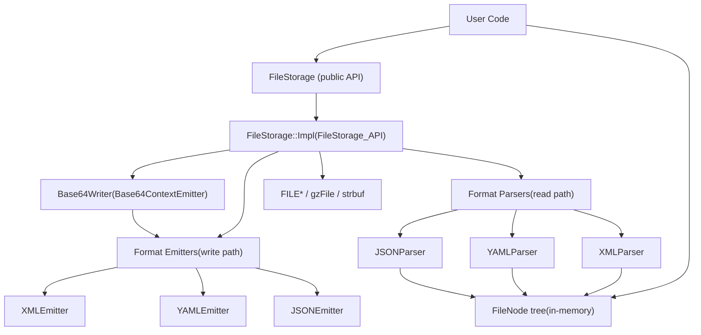

# Persistence and Serialization (FileStorage)

Relevant source files

-   [modules/core/include/opencv2/core/core\_c.h](https://github.com/opencv/opencv/blob/91c78f50/modules/core/include/opencv2/core/core_c.h)
-   [modules/core/include/opencv2/core/cvstd.hpp](https://github.com/opencv/opencv/blob/91c78f50/modules/core/include/opencv2/core/cvstd.hpp)
-   [modules/core/include/opencv2/core/cvstd.inl.hpp](https://github.com/opencv/opencv/blob/91c78f50/modules/core/include/opencv2/core/cvstd.inl.hpp)
-   [modules/core/include/opencv2/core/cvstd\_wrapper.hpp](https://github.com/opencv/opencv/blob/91c78f50/modules/core/include/opencv2/core/cvstd_wrapper.hpp)
-   [modules/core/include/opencv2/core/persistence.hpp](https://github.com/opencv/opencv/blob/91c78f50/modules/core/include/opencv2/core/persistence.hpp)
-   [modules/core/perf/perf\_io\_base64.cpp](https://github.com/opencv/opencv/blob/91c78f50/modules/core/perf/perf_io_base64.cpp)
-   [modules/core/src/persistence.cpp](https://github.com/opencv/opencv/blob/91c78f50/modules/core/src/persistence.cpp)
-   [modules/core/src/persistence.hpp](https://github.com/opencv/opencv/blob/91c78f50/modules/core/src/persistence.hpp)
-   [modules/core/src/persistence\_base64\_encoding.cpp](https://github.com/opencv/opencv/blob/91c78f50/modules/core/src/persistence_base64_encoding.cpp)
-   [modules/core/src/persistence\_base64\_encoding.hpp](https://github.com/opencv/opencv/blob/91c78f50/modules/core/src/persistence_base64_encoding.hpp)
-   [modules/core/src/persistence\_impl.hpp](https://github.com/opencv/opencv/blob/91c78f50/modules/core/src/persistence_impl.hpp)
-   [modules/core/src/persistence\_json.cpp](https://github.com/opencv/opencv/blob/91c78f50/modules/core/src/persistence_json.cpp)
-   [modules/core/src/persistence\_types.cpp](https://github.com/opencv/opencv/blob/91c78f50/modules/core/src/persistence_types.cpp)
-   [modules/core/src/persistence\_xml.cpp](https://github.com/opencv/opencv/blob/91c78f50/modules/core/src/persistence_xml.cpp)
-   [modules/core/src/persistence\_yml.cpp](https://github.com/opencv/opencv/blob/91c78f50/modules/core/src/persistence_yml.cpp)
-   [modules/core/test/test\_io.cpp](https://github.com/opencv/opencv/blob/91c78f50/modules/core/test/test_io.cpp)
-   [modules/dnn/include/opencv2/dnn/shape\_utils.hpp](https://github.com/opencv/opencv/blob/91c78f50/modules/dnn/include/opencv2/dnn/shape_utils.hpp)
-   [modules/python/test/test\_algorithm\_rw.py](https://github.com/opencv/opencv/blob/91c78f50/modules/python/test/test_algorithm_rw.py)
-   [modules/python/test/test\_filestorage\_io.py](https://github.com/opencv/opencv/blob/91c78f50/modules/python/test/test_filestorage_io.py)
-   [modules/python/test/test\_persistence.py](https://github.com/opencv/opencv/blob/91c78f50/modules/python/test/test_persistence.py)

This page documents OpenCV's file persistence system: the `FileStorage` class and the supporting `FileNode` / `FileNodeIterator` API used to read and write structured data in XML, YAML, and JSON formats, including Base64 encoding for binary arrays. The system lives entirely in the `opencv_core` module. For information about the broader `core` module data structures such as `Mat`, see [3.1](/opencv/opencv/3.1-mat-and-umat-data-structures).

---

## Purpose and Scope

`FileStorage` provides a single, uniform API to serialize and deserialize:

-   Primitive scalars (int, int64, float, double, string)
-   OpenCV matrices (`Mat`, `SparseMat`, N-dimensional `MatND`)
-   User-defined types via free-function overloads of `write()` / `read()`
-   Arbitrarily nested maps (key-value) and sequences (ordered lists)

The format (XML, YAML, or JSON) is selected either by file extension or by an explicit flag. Binary matrix data can be embedded as Base64 text using the `BASE64` flag, enabling lossless round-trips inside text files.

---

## Core Classes

### Class Overview

| Class | Role | Header |
| --- | --- | --- |
| `FileStorage` | Public API: open/close file, write data | `modules/core/include/opencv2/core/persistence.hpp` |
| `FileNode` | Read-only node in the parsed tree | `modules/core/include/opencv2/core/persistence.hpp` |
| `FileNodeIterator` | STL-style iterator over `FileNode` children | `modules/core/include/opencv2/core/persistence.hpp` |
| `FileStorage::Impl` | Internal state and I/O implementation | `modules/core/src/persistence_impl.hpp` |
| `FileStorage_API` | Abstract interface used by emitters and parsers | `modules/core/src/persistence.hpp` |
| `FileStorageEmitter` | Abstract write-side interface | `modules/core/src/persistence.hpp` |
| `FileStorageParser` | Abstract read-side interface | `modules/core/src/persistence.hpp` |
| `XMLEmitter` / `XMLParser` | XML format | `modules/core/src/persistence_xml.cpp` |
| `YAMLEmitter` / `YAMLParser` | YAML format | `modules/core/src/persistence_yml.cpp` |
| `JSONEmitter` / `JSONParser` | JSON format | `modules/core/src/persistence_json.cpp` |
| `Base64Writer` | Buffered Base64 encoding of raw binary | `modules/core/src/persistence_base64_encoding.hpp` |

Sources: [modules/core/include/opencv2/core/persistence.hpp254-440](https://github.com/opencv/opencv/blob/91c78f50/modules/core/include/opencv2/core/persistence.hpp#L254-L440) [modules/core/src/persistence.hpp115-220](https://github.com/opencv/opencv/blob/91c78f50/modules/core/src/persistence.hpp#L115-L220) [modules/core/src/persistence\_impl.hpp23-180](https://github.com/opencv/opencv/blob/91c78f50/modules/core/src/persistence_impl.hpp#L23-L180)

---

### `FileStorage`

Defined in [modules/core/include/opencv2/core/persistence.hpp260-426](https://github.com/opencv/opencv/blob/91c78f50/modules/core/include/opencv2/core/persistence.hpp#L260-L426)

**Open modes** (the `Mode` enum):

| Flag | Value | Meaning |
| --- | --- | --- |
| `READ` | 0 | Open for reading; entire file is parsed into memory |
| `WRITE` | 1 | Open for writing; creates or truncates |
| `APPEND` | 2 | Append to an existing file |
| `MEMORY` | 4 | Read from / write to an in-memory string buffer |
| `FORMAT_XML` | `1<<3` | Force XML format |
| `FORMAT_YAML` | `2<<3` | Force YAML format |
| `FORMAT_JSON` | `3<<3` | Force JSON format |
| `FORMAT_AUTO` | 0 | Detect from file extension |
| `BASE64` | 64 | Embed binary arrays as Base64 text |
| `WRITE_BASE64` | `BASE64|WRITE` | Convenience alias |

**Key methods:**

| Method | Purpose |
| --- | --- |
| `open(filename, flags, encoding)` | Opens or re-opens a file |
| `isOpened()` | True once the file is successfully opened |
| `release()` | Flushes and closes; also writes closing tags |
| `releaseAndGetString()` | Like `release()`, returns buffer content when `MEMORY` flag is set |
| `operator[](name)` | Returns a top-level `FileNode` by name |
| `root(streamidx)` | Returns the root mapping node (YAML supports multiple streams) |
| `getFirstTopLevelNode()` | Returns the first child of the root |
| `write(name, value)` | Write a named scalar (int, int64, double, String, Mat) |
| `writeRaw(fmt, vec, len)` | Write a typed binary array using a format spec string |
| `writeComment(comment, append)` | Embed a comment (skipped on read) |
| `startWriteStruct(name, flags, typeName)` | Begin a nested map or sequence |
| `endWriteStruct()` | End the current nested structure |
| `getFormat()` | Returns the current `Mode` format flag |

Sources: [modules/core/include/opencv2/core/persistence.hpp260-426](https://github.com/opencv/opencv/blob/91c78f50/modules/core/include/opencv2/core/persistence.hpp#L260-L426)

---

### `FileNode`

Defined in [modules/core/include/opencv2/core/persistence.hpp440-580](https://github.com/opencv/opencv/blob/91c78f50/modules/core/include/opencv2/core/persistence.hpp#L440-L580)

When a file is opened for reading the entire document is parsed into a tree of `FileNode` objects held inside `FileStorage::Impl`. `FileNode` is a lightweight handle (block index + byte offset) into that storage.

**Node type flags:**

| Constant | Value | Meaning |
| --- | --- | --- |
| `NONE` | 0 | Empty / missing node |
| `INT` | 1 | Integer scalar |
| `REAL` / `FLOAT` | 2 | Floating-point scalar |
| `STR` / `STRING` | 3 | UTF-8 text string |
| `SEQ` | 4 | Ordered sequence |
| `MAP` | 5 | Named mapping |
| `FLOW` | 8 | Written in compact inline style (YAML/JSON) |
| `EMPTY` | 16 | Empty collection |
| `NAMED` | 32 | Node has a key (is inside a map) |

**Key methods:**

| Method | Purpose |
| --- | --- |
| `type()` | Returns one of the node-type constants above |
| `empty()` / `isNone()` | Checks for absence |
| `isInt()`, `isReal()`, `isString()`, `isSeq()`, `isMap()` | Type predicates |
| `operator int()`, `operator double()`, `operator std::string()` | Scalar extraction |
| `operator[](name)` | Look up child by key (map) |
| `operator[](i)` | Look up child by index (sequence) |
| `size()` | Number of elements in collection |
| `keys()` | All keys of a mapping node |
| `begin()` / `end()` | Returns `FileNodeIterator` |
| `readRaw(fmt, vec, len)` | Bulk-read typed binary array |
| `real()` / `string()` / `mat()` | Simplified binding-friendly accessors |

Sources: [modules/core/include/opencv2/core/persistence.hpp440-580](https://github.com/opencv/opencv/blob/91c78f50/modules/core/include/opencv2/core/persistence.hpp#L440-L580)

---

### `FileNodeIterator`

An STL-style forward iterator returned by `FileNode::begin()` and `FileNode::end()`. Supports `++`, `+= n`, `*`, and comparison with `==` / `!=`. Used to iterate over both `SEQ` and `MAP` nodes.

---

## Architecture

**Architecture of the FileStorage System**


Sources: [modules/core/src/persistence.hpp115-220](https://github.com/opencv/opencv/blob/91c78f50/modules/core/src/persistence.hpp#L115-L220) [modules/core/src/persistence\_impl.hpp23-100](https://github.com/opencv/opencv/blob/91c78f50/modules/core/src/persistence_impl.hpp#L23-L100) [modules/core/src/persistence.cpp415-820](https://github.com/opencv/opencv/blob/91c78f50/modules/core/src/persistence.cpp#L415-L820)

---

**Class relationships and file locations**


Sources: [modules/core/src/persistence\_impl.hpp23-200](https://github.com/opencv/opencv/blob/91c78f50/modules/core/src/persistence_impl.hpp#L23-L200) [modules/core/src/persistence.hpp115-220](https://github.com/opencv/opencv/blob/91c78f50/modules/core/src/persistence.hpp#L115-L220) [modules/core/include/opencv2/core/persistence.hpp440-580](https://github.com/opencv/opencv/blob/91c78f50/modules/core/include/opencv2/core/persistence.hpp#L440-L580)

---

## Open and Format Detection

`FileStorage::Impl::open()` ([modules/core/src/persistence.cpp514-818](https://github.com/opencv/opencv/blob/91c78f50/modules/core/src/persistence.cpp#L514-L818)) performs:

1.  **Mode parsing** — reads `flags` for `READ`, `WRITE`, `APPEND`, `MEMORY`, `BASE64`.
2.  **Filename analysis** — `analyze_file_name()` strips query parameters (e.g., `file.json?base64`) to separate the real path from options.
3.  **GZ detection** — if the filename ends in `.gz`, `gzopen()` is used instead of `fopen()`.
4.  **Format selection for writing** — if `FORMAT_AUTO`, the extension is matched case-insensitively:
    -   `.xml` → `FORMAT_XML`
    -   `.json` → `FORMAT_JSON`
    -   anything else (`.yml`, `.yaml`) → `FORMAT_YAML`
5.  **Emitter creation** — one of `createXMLEmitter()`, `createYAMLEmitter()`, `createJSONEmitter()` is called.
6.  **Format detection for reading** — the first 16 bytes are peeked. The signature `%YAML` → YAML, `{` → JSON, `<?xml` → XML.
7.  **Parsing** — the appropriate parser's `parse()` method builds the in-memory `FileNode` tree. The file handle is then closed and the buffer released; thereafter, only the `FileNode` tree is used.

Sources: [modules/core/src/persistence.cpp514-818](https://github.com/opencv/opencv/blob/91c78f50/modules/core/src/persistence.cpp#L514-L818)

---

## Writing Data

### Streaming Operator

The `<<` operator is the primary write interface. When writing a key-value pair into a map:

```
fs << "frameCount" << 5;
```
This calls `FileStorage::Impl::write(key, value)`, which delegates to `getEmitter().write(key, value)`.

### Nested Structures

Sequences are opened with `"["` and closed with `"]"`. Maps use `"{"` and `"}"`. The compact (flow) variants are `"[:"` and `"{:"`.

```
fs << "features" << "[";     // begin sequence
fs << "{:" << "x" << x << "y" << y << "}";  // compact map element
fs << "]";                   // end sequence
```
Sources: [modules/core/include/opencv2/core/persistence.hpp62-172](https://github.com/opencv/opencv/blob/91c78f50/modules/core/include/opencv2/core/persistence.hpp#L62-L172)

### `writeRaw` and Format Specification

`FileStorage::writeRaw(fmt, vec, len)` writes a packed binary array element-by-element as text scalars, or as Base64 when the `BASE64` flag is active.

The `fmt` string is a compact type descriptor. Each letter maps to a C++ type:

| Char | Type |
| --- | --- |
| `u` | `uint8_t` |
| `c` | `int8_t` |
| `w` | `uint16_t` |
| `s` | `int16_t` |
| `i` | `int32_t` |
| `f` | `float` |
| `d` | `double` |
| `h` | `hfloat` (16-bit) |
| `r` | pointer (32 lower bits) |

A count prefix multiplies the type: `2if` means two ints followed by one float per element.

Format encoding and decoding is handled by `fs::encodeFormat()`, `fs::decodeFormat()`, `fs::calcStructSize()`, and `fs::calcElemSize()` in [modules/core/src/persistence.cpp198-328](https://github.com/opencv/opencv/blob/91c78f50/modules/core/src/persistence.cpp#L198-L328)

Sources: [modules/core/include/opencv2/core/persistence.hpp224-242](https://github.com/opencv/opencv/blob/91c78f50/modules/core/include/opencv2/core/persistence.hpp#L224-L242) [modules/core/src/persistence.cpp198-328](https://github.com/opencv/opencv/blob/91c78f50/modules/core/src/persistence.cpp#L198-L328)

### Writing Built-in OpenCV Types

`Mat`, `SparseMat`, and `MatND` have dedicated `write()` free functions in [modules/core/src/persistence\_types.cpp](https://github.com/opencv/opencv/blob/91c78f50/modules/core/src/persistence_types.cpp)

For a 2-D `Mat`, the serialized structure is:

```
my_matrix: !!opencv-matrix   rows: 3   cols: 3   dt: d   data: [ 1., 0., 0., 0., 1., 0., 0., 0., 1. ]
```
The `type_id` / `!!type_name` tag is written by `startWriteStruct()` when a `typeName` is provided.

Sources: [modules/core/src/persistence\_types.cpp11-115](https://github.com/opencv/opencv/blob/91c78f50/modules/core/src/persistence_types.cpp#L11-L115)

---

## Reading Data

### Node Lookup

After `FileStorage::open()` in `READ` mode, the parsed document is a `FileNode` tree accessible through:

-   `fs["key"]` — returns a top-level `FileNode`
-   `node["childKey"]` — descends into a map
-   `node[i]` — descends into a sequence by index

### Value Extraction

Two patterns are supported:

```
int n = (int)fs["count"];          // cast operatorfs["matrix"] >> mat;               // >> operator
```
The cast and `>>` operators are defined for `int`, `int64_t`, `float`, `double`, and `std::string`.

### Iterating a Sequence

```
FileNodeIterator it = fs["features"].begin();FileNodeIterator it_end = fs["features"].end();for (; it != it_end; ++it) {    int x = (int)(*it)["x"];}
```
### `readRaw`

`FileNode::readRaw(fmt, vec, len)` is the inverse of `writeRaw`. It reads the sequence of scalars under the node back into a typed buffer using the same format-spec string.

Sources: [modules/core/include/opencv2/core/persistence.hpp173-222](https://github.com/opencv/opencv/blob/91c78f50/modules/core/include/opencv2/core/persistence.hpp#L173-L222) [modules/core/test/test\_io.cpp181-304](https://github.com/opencv/opencv/blob/91c78f50/modules/core/test/test_io.cpp#L181-L304)

---

## Base64 Binary Encoding

When the `BASE64` (or `WRITE_BASE64`) flag is set, binary arrays stored via `writeRaw` are embedded as Base64-encoded ASCII strings rather than decimal numbers. This makes large matrix data substantially more compact.

**Write path:**

1.  `FileStorage::Impl::writeRawData()` detects that `is_using_base64` is true.
2.  It delegates to `writeRawDataBase64()`, which creates a `Base64Writer`.
3.  `Base64Writer` uses `Base64ContextEmitter` (internal to `persistence_base64_encoding.cpp`) to buffer incoming bytes, encode them 48 bytes at a time, and emit lines of Base64 text.
4.  A 24-byte header (padded to 32 encoded chars) encodes the element type descriptor `dt`, enabling correct decoding.

**Read path:**

Each format parser calls `parseBase64()` on `FileStorage_API` when it encounters a Base64-tagged value. The decoder reverses the header, type-checks, and streams decoded binary into allocated `FileNode` storage.

The Base64 alphabet, encoding function, and `Base64Writer` class are in [modules/core/src/persistence\_base64\_encoding.hpp](https://github.com/opencv/opencv/blob/91c78f50/modules/core/src/persistence_base64_encoding.hpp) and [modules/core/src/persistence\_base64\_encoding.cpp](https://github.com/opencv/opencv/blob/91c78f50/modules/core/src/persistence_base64_encoding.cpp)

**Base64 encoding flow**

> **[Mermaid sequence]**
> *(图表结构无法解析)*

Sources: [modules/core/src/persistence\_base64\_encoding.hpp](https://github.com/opencv/opencv/blob/91c78f50/modules/core/src/persistence_base64_encoding.hpp) [modules/core/src/persistence\_base64\_encoding.cpp](https://github.com/opencv/opencv/blob/91c78f50/modules/core/src/persistence_base64_encoding.cpp) [modules/core/src/persistence.cpp1109-1200](https://github.com/opencv/opencv/blob/91c78f50/modules/core/src/persistence.cpp#L1109-L1200)

---

## Format-Specific Details

### XML

Implemented in [modules/core/src/persistence\_xml.cpp](https://github.com/opencv/opencv/blob/91c78f50/modules/core/src/persistence_xml.cpp) via `XMLEmitter` and `XMLParser`.

-   Top-level wrapper: `<opencv_storage> … </opencv_storage>`
-   Map entries are wrapped in `<key>value</key>` tags.
-   Sequence entries use `<_>value</_>` (anonymous tag).
-   Special XML characters (`<`, `>`, `&`, `'`, `"`) are escaped as entities.
-   `type_id` attributes carry type names (e.g., `type_id="opencv-matrix"`).
-   Comments use `<!-- … -->` syntax.
-   Append mode seeks to the last `</opencv_storage>` and replaces it with `<!-- resumed -->`.

### YAML

Implemented in [modules/core/src/persistence\_yml.cpp](https://github.com/opencv/opencv/blob/91c78f50/modules/core/src/persistence_yml.cpp) via `YAMLEmitter` and `YAMLParser`.

-   Header: `%YAML:1.0\n---\n`
-   Type tags use the YAML `!!typename` notation.
-   Indent step: 3 spaces (`CV_YML_INDENT`).
-   Flow (compact) collections use `{…}` and `[…]` inline.
-   Binary data is tagged `!!binary |` with Base64 content on continuation lines.
-   Supports multiple documents in one file (multiple streams separated by `---`).

### JSON

Implemented in [modules/core/src/persistence\_json.cpp](https://github.com/opencv/opencv/blob/91c78f50/modules/core/src/persistence_json.cpp) via `JSONEmitter` and `JSONParser`.

-   Outer wrapper: `{ … }`.
-   Map keys must start with a letter or `_` and consist of `[a-zA-Z0-9_-\s]`.
-   Type names are stored as an explicit `"type_id": "typename"` key inside the map.
-   Comments are written as `// …` (non-standard, tolerated on read).
-   Floating-point zero is always written as `0.0` (explicit zero mode enabled).
-   Append mode seeks to the last `}`, inserts a comma, then continues.

Sources: [modules/core/src/persistence\_xml.cpp](https://github.com/opencv/opencv/blob/91c78f50/modules/core/src/persistence_xml.cpp) [modules/core/src/persistence\_yml.cpp](https://github.com/opencv/opencv/blob/91c78f50/modules/core/src/persistence_yml.cpp) [modules/core/src/persistence\_json.cpp](https://github.com/opencv/opencv/blob/91c78f50/modules/core/src/persistence_json.cpp) [modules/core/src/persistence.cpp590-728](https://github.com/opencv/opencv/blob/91c78f50/modules/core/src/persistence.cpp#L590-L728)

---

## In-Memory Mode

Passing `FileStorage::MEMORY` skips all file I/O. For writing, output accumulates in `Impl::outbuf` (a `std::vector<char>`). `releaseAndGetString()` returns it as a `cv::String`. For reading, the string passed as the "filename" argument is used directly as the input buffer via `strbuf` / `strbufsize` / `strbufpos`.

```
// Write to stringFileStorage fs(".yml", FileStorage::WRITE | FileStorage::MEMORY);fs << "x" << 42;std::string s = fs.releaseAndGetString(); // Read from stringFileStorage fs2(s, FileStorage::READ | FileStorage::MEMORY);int x = (int)fs2["x"];
```
Sources: [modules/core/src/persistence.cpp519-520](https://github.com/opencv/opencv/blob/91c78f50/modules/core/src/persistence.cpp#L519-L520) [modules/core/src/persistence.cpp732-737](https://github.com/opencv/opencv/blob/91c78f50/modules/core/src/persistence.cpp#L732-L737) [modules/core/src/persistence.cpp480-482](https://github.com/opencv/opencv/blob/91c78f50/modules/core/src/persistence.cpp#L480-L482)

---

## User-Defined Type Serialization

Any type can be made serializable by overloading two free functions in the `cv` namespace (or a namespace found by ADL):

```
void write(FileStorage& fs, const String& name, const MyType& value);void read(const FileNode& node, MyType& value, const MyType& default_value);
```
Then `fs << "key" << value` and `node >> value` work automatically.

The `Algorithm` base class (used by `AKAZE`, `ORB`, etc.) exposes `write(FileStorage&, String)` and `read(FileNode)` virtual methods that are implemented by each concrete algorithm. This is how detector parameters are saved and restored (see [modules/python/test/test\_algorithm\_rw.py](https://github.com/opencv/opencv/blob/91c78f50/modules/python/test/test_algorithm_rw.py)).

Sources: [modules/core/test/test\_io.cpp316-347](https://github.com/opencv/opencv/blob/91c78f50/modules/core/test/test_io.cpp#L316-L347) [modules/python/test/test\_algorithm\_rw.py](https://github.com/opencv/opencv/blob/91c78f50/modules/python/test/test_algorithm_rw.py)

---

## Compressed File Support

If the filename ends with `.gz` (e.g., `data.xml.gz`), OpenCV opens it with `gzopen()` from the zlib library (`USE_ZLIB=1`). `puts()` and `gets()` transparently call `gzputs()` / `gzgets()`. Append mode is not supported for compressed files.

Sources: [modules/core/src/persistence.cpp548-581](https://github.com/opencv/opencv/blob/91c78f50/modules/core/src/persistence.cpp#L548-L581) [modules/core/src/persistence.hpp14-25](https://github.com/opencv/opencv/blob/91c78f50/modules/core/src/persistence.hpp#L14-L25)

---

## Internal Memory Layout for Read Nodes

When parsing, `FileStorage::Impl` allocates `FileNode` data in a pool of fixed-size blocks (`fs_data`, `fs_data_ptrs`, `fs_data_blksz`). Each node occupies a compact binary record:

-   1 byte: type tag
-   4 bytes: name offset into the string hash table, or inline integer
-   4 bytes: child count or value

Strings are deduplicated through `str_hash` / `str_hash_data`. `reserveNodeSpace()` allocates from the current block or adds a new one. After parsing, `finalizeCollection()` fixes up child counts.

Sources: [modules/core/src/persistence\_impl.hpp115-180](https://github.com/opencv/opencv/blob/91c78f50/modules/core/src/persistence_impl.hpp#L115-L180) [modules/core/src/persistence.cpp760-810](https://github.com/opencv/opencv/blob/91c78f50/modules/core/src/persistence.cpp#L760-L810)

---

## Testing

The primary test file is [modules/core/test/test\_io.cpp](https://github.com/opencv/opencv/blob/91c78f50/modules/core/test/test_io.cpp) Key test cases:

-   `Core_IOTest` — write and re-read integers, doubles, strings, `Mat`, `MatND`, `SparseMat`, sequences, and maps in all three formats and in-memory mode.
-   `CV_MiscIOTest` — round-trip for STL vectors, OpenCV geometry types (`Point`, `Size`, `Rect`, `Vec`, `Scalar`, `Range`), and user-defined types.
-   `filestorage_base64_*` — write with `WRITE_BASE64`, compare byte-for-byte against reference files in `opencv_extra`.
-   `filestorage_heap_overflow` — ensures malformed input throws rather than segfaults.

Performance benchmarks (disabled by default) are in [modules/core/perf/perf\_io\_base64.cpp](https://github.com/opencv/opencv/blob/91c78f50/modules/core/perf/perf_io_base64.cpp) testing text vs Base64 write/read throughput for large `Mat` objects.

Python binding tests are in [modules/python/test/test\_persistence.py](https://github.com/opencv/opencv/blob/91c78f50/modules/python/test/test_persistence.py) and [modules/python/test/test\_filestorage\_io.py](https://github.com/opencv/opencv/blob/91c78f50/modules/python/test/test_filestorage_io.py)

Sources: [modules/core/test/test\_io.cpp](https://github.com/opencv/opencv/blob/91c78f50/modules/core/test/test_io.cpp) [modules/core/perf/perf\_io\_base64.cpp](https://github.com/opencv/opencv/blob/91c78f50/modules/core/perf/perf_io_base64.cpp) [modules/python/test/test\_persistence.py](https://github.com/opencv/opencv/blob/91c78f50/modules/python/test/test_persistence.py) [modules/python/test/test\_filestorage\_io.py](https://github.com/opencv/opencv/blob/91c78f50/modules/python/test/test_filestorage_io.py)
