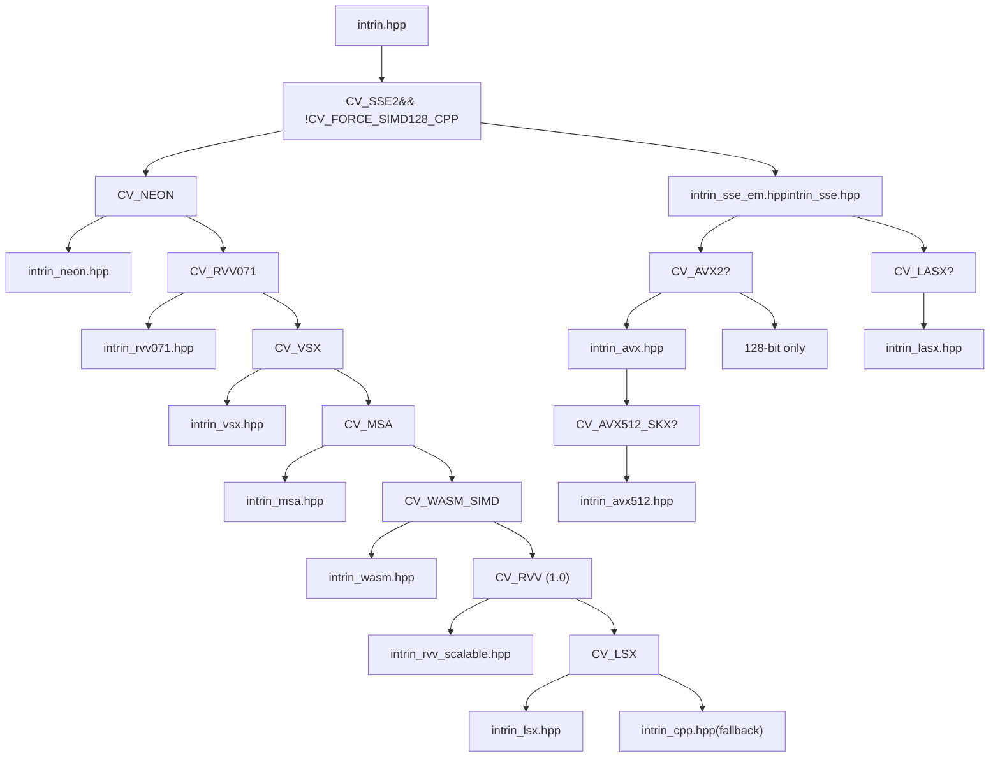
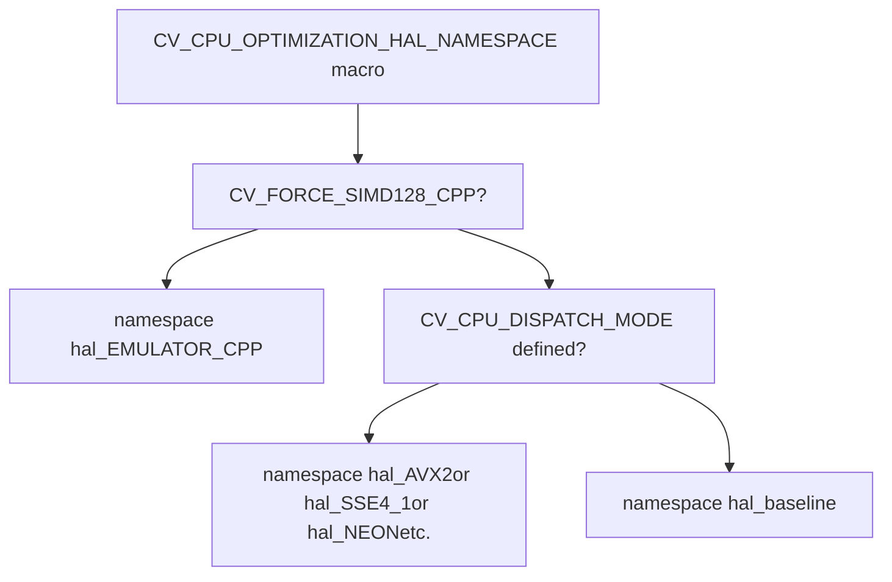
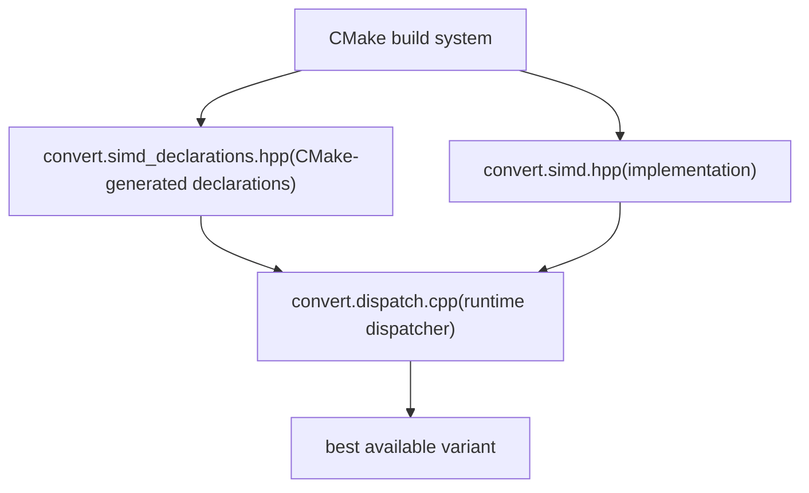
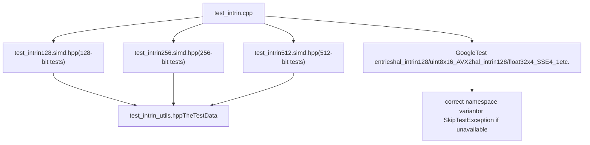
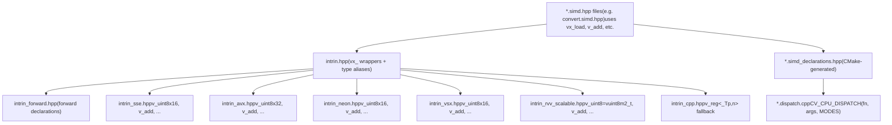

# SIMD Intrinsics and CPU Dispatching

Relevant source files

-   [cmake/checks/cpu\_rvv.cpp](https://github.com/opencv/opencv/blob/91c78f50/cmake/checks/cpu_rvv.cpp)
-   [cmake/checks/cpu\_vsx\_asm.cpp](https://github.com/opencv/opencv/blob/91c78f50/cmake/checks/cpu_vsx_asm.cpp)
-   [modules/core/include/opencv2/core/hal/intrin.hpp](https://github.com/opencv/opencv/blob/91c78f50/modules/core/include/opencv2/core/hal/intrin.hpp)
-   [modules/core/include/opencv2/core/hal/intrin\_avx.hpp](https://github.com/opencv/opencv/blob/91c78f50/modules/core/include/opencv2/core/hal/intrin_avx.hpp)
-   [modules/core/include/opencv2/core/hal/intrin\_avx512.hpp](https://github.com/opencv/opencv/blob/91c78f50/modules/core/include/opencv2/core/hal/intrin_avx512.hpp)
-   [modules/core/include/opencv2/core/hal/intrin\_cpp.hpp](https://github.com/opencv/opencv/blob/91c78f50/modules/core/include/opencv2/core/hal/intrin_cpp.hpp)
-   [modules/core/include/opencv2/core/hal/intrin\_lasx.hpp](https://github.com/opencv/opencv/blob/91c78f50/modules/core/include/opencv2/core/hal/intrin_lasx.hpp)
-   [modules/core/include/opencv2/core/hal/intrin\_lsx.hpp](https://github.com/opencv/opencv/blob/91c78f50/modules/core/include/opencv2/core/hal/intrin_lsx.hpp)
-   [modules/core/include/opencv2/core/hal/intrin\_math.hpp](https://github.com/opencv/opencv/blob/91c78f50/modules/core/include/opencv2/core/hal/intrin_math.hpp)
-   [modules/core/include/opencv2/core/hal/intrin\_msa.hpp](https://github.com/opencv/opencv/blob/91c78f50/modules/core/include/opencv2/core/hal/intrin_msa.hpp)
-   [modules/core/include/opencv2/core/hal/intrin\_neon.hpp](https://github.com/opencv/opencv/blob/91c78f50/modules/core/include/opencv2/core/hal/intrin_neon.hpp)
-   [modules/core/include/opencv2/core/hal/intrin\_rvv071.hpp](https://github.com/opencv/opencv/blob/91c78f50/modules/core/include/opencv2/core/hal/intrin_rvv071.hpp)
-   [modules/core/include/opencv2/core/hal/intrin\_rvv\_scalable.hpp](https://github.com/opencv/opencv/blob/91c78f50/modules/core/include/opencv2/core/hal/intrin_rvv_scalable.hpp)
-   [modules/core/include/opencv2/core/hal/intrin\_sse.hpp](https://github.com/opencv/opencv/blob/91c78f50/modules/core/include/opencv2/core/hal/intrin_sse.hpp)
-   [modules/core/include/opencv2/core/hal/intrin\_vsx.hpp](https://github.com/opencv/opencv/blob/91c78f50/modules/core/include/opencv2/core/hal/intrin_vsx.hpp)
-   [modules/core/include/opencv2/core/hal/intrin\_wasm.hpp](https://github.com/opencv/opencv/blob/91c78f50/modules/core/include/opencv2/core/hal/intrin_wasm.hpp)
-   [modules/core/include/opencv2/core/vsx\_utils.hpp](https://github.com/opencv/opencv/blob/91c78f50/modules/core/include/opencv2/core/vsx_utils.hpp)
-   [modules/core/src/convert.dispatch.cpp](https://github.com/opencv/opencv/blob/91c78f50/modules/core/src/convert.dispatch.cpp)
-   [modules/core/src/convert.simd.hpp](https://github.com/opencv/opencv/blob/91c78f50/modules/core/src/convert.simd.hpp)
-   [modules/core/src/convert\_scale.simd.hpp](https://github.com/opencv/opencv/blob/91c78f50/modules/core/src/convert_scale.simd.hpp)
-   [modules/core/src/count\_non\_zero.simd.hpp](https://github.com/opencv/opencv/blob/91c78f50/modules/core/src/count_non_zero.simd.hpp)
-   [modules/core/src/sum.simd.hpp](https://github.com/opencv/opencv/blob/91c78f50/modules/core/src/sum.simd.hpp)
-   [modules/core/test/test\_intrin.cpp](https://github.com/opencv/opencv/blob/91c78f50/modules/core/test/test_intrin.cpp)
-   [modules/core/test/test\_intrin256.simd.hpp](https://github.com/opencv/opencv/blob/91c78f50/modules/core/test/test_intrin256.simd.hpp)
-   [modules/core/test/test\_intrin\_utils.hpp](https://github.com/opencv/opencv/blob/91c78f50/modules/core/test/test_intrin_utils.hpp)
-   [platforms/linux/riscv64-clang.toolchain.cmake](https://github.com/opencv/opencv/blob/91c78f50/platforms/linux/riscv64-clang.toolchain.cmake)
-   [platforms/linux/riscv64-gcc.toolchain.cmake](https://github.com/opencv/opencv/blob/91c78f50/platforms/linux/riscv64-gcc.toolchain.cmake)

## Purpose and Scope

This page covers two related systems in the OpenCV core module:

1.  **Universal Intrinsics** — a C++ API (`v_*` / `vx_*` functions and types) that abstracts over platform SIMD instruction sets (SSE, AVX2, NEON, VSX, RVV, etc.) under a single interface.
2.  **CPU Dispatch** — a build-time and runtime mechanism that compiles multiple SIMD-specialized code paths into a single binary and selects the best one at runtime based on CPUID.

For runtime CPU feature detection (`cv::checkHardwareSupport`, `cv::getCPUFeaturesLine`) see [System Utilities and Parallel Processing](/opencv/opencv/3.3-system-utilities-and-parallel-processing). For OpenCL GPU acceleration see [OpenCL Acceleration](/opencv/opencv/3.2-opencl-acceleration-and-transparent-gpu-execution).

---

## File Organization

All universal intrinsics headers live under `modules/core/include/opencv2/core/hal/`. The entry point is `intrin.hpp`, which selects the correct backend for the target architecture.

```
modules/core/include/opencv2/core/hal/
├── intrin.hpp              ← top-level include; backend selector
├── intrin_forward.hpp      ← forward declarations for vx_ wrappers
├── intrin_cpp.hpp          ← portable C++ fallback (scalar emulation)
├── intrin_sse.hpp          ← x86 SSE/SSE2/SSE4.x (128-bit)
├── intrin_sse_em.hpp       ← SSE emulation helpers
├── intrin_avx.hpp          ← x86 AVX2 (256-bit)
├── intrin_avx512.hpp       ← x86 AVX-512 (512-bit)
├── intrin_neon.hpp         ← ARM NEON (128-bit)
├── intrin_vsx.hpp          ← PowerPC VSX (128-bit)
├── intrin_msa.hpp          ← MIPS MSA (128-bit)
├── intrin_wasm.hpp         ← WebAssembly SIMD (128-bit)
├── intrin_rvv071.hpp       ← RISC-V RVV 0.7.1 fixed-length (128-bit)
├── intrin_rvv_scalable.hpp ← RISC-V RVV 1.0 scalable
├── intrin_lsx.hpp          ← LoongArch LSX (128-bit)
├── intrin_lasx.hpp         ← LoongArch LASX (256-bit)
└── intrin_math.hpp         ← transcendental math (exp, log, sin, cos)
```
Sources: [modules/core/include/opencv2/core/hal/intrin.hpp1-300](https://github.com/opencv/opencv/blob/91c78f50/modules/core/include/opencv2/core/hal/intrin.hpp#L1-L300)

---

## Universal Intrinsics Layer

### Backend Selection

`intrin.hpp` selects exactly one 128-bit backend through a chain of `#if` preprocessor guards, then optionally layers 256-bit (AVX2 / LASX) and 512-bit (AVX-512) support on top.

**Diagram: intrin.hpp backend selection logic**


Sources: [modules/core/include/opencv2/core/hal/intrin.hpp222-298](https://github.com/opencv/opencv/blob/91c78f50/modules/core/include/opencv2/core/hal/intrin.hpp#L222-L298)

---

### Backend Summary

| Backend File | Architecture | Register Width | Guard Macro |
| --- | --- | --- | --- |
| `intrin_sse.hpp` | x86 SSE/SSE4.x | 128-bit | `CV_SSE2` |
| `intrin_avx.hpp` | x86 AVX2 | 256-bit | `CV_AVX2` |
| `intrin_avx512.hpp` | x86 AVX-512 | 512-bit | `CV_AVX512_SKX` |
| `intrin_neon.hpp` | ARM (AArch32/AArch64) | 128-bit | `CV_NEON` |
| `intrin_vsx.hpp` | PowerPC VSX | 128-bit | `CV_VSX` |
| `intrin_msa.hpp` | MIPS MSA | 128-bit | `CV_MSA` |
| `intrin_wasm.hpp` | WebAssembly SIMD | 128-bit | `CV_WASM_SIMD` |
| `intrin_rvv071.hpp` | RISC-V RVV 0.7.1 | 128-bit (fixed) | `CV_RVV071` |
| `intrin_rvv_scalable.hpp` | RISC-V RVV 1.0 | Scalable (VLA) | `CV_RVV` |
| `intrin_lsx.hpp` | LoongArch LSX | 128-bit | `CV_LSX` |
| `intrin_lasx.hpp` | LoongArch LASX | 256-bit | `CV_LASX` |
| `intrin_cpp.hpp` | All (scalar emulation) | 128-bit emulated | fallback |

Sources: [modules/core/include/opencv2/core/hal/intrin.hpp222-298](https://github.com/opencv/opencv/blob/91c78f50/modules/core/include/opencv2/core/hal/intrin.hpp#L222-L298) [modules/core/include/opencv2/core/hal/intrin\_cpp.hpp84-105](https://github.com/opencv/opencv/blob/91c78f50/modules/core/include/opencv2/core/hal/intrin_cpp.hpp#L84-L105)

---

## Vector Register Types

### Fixed-Width Types

Each backend defines a set of fixed-width structs. For 128-bit registers these are named `v_<signedness><element_bits>x<lanes>`.

| Type | Element | Lanes (128-bit) | SSE backing field | NEON backing field |
| --- | --- | --- | --- | --- |
| `v_uint8x16` | `uchar` | 16 | `__m128i` | `uint8x16_t` |
| `v_int8x16` | `schar` | 16 | `__m128i` | `int8x16_t` |
| `v_uint16x8` | `ushort` | 8 | `__m128i` | `uint16x8_t` |
| `v_int16x8` | `short` | 8 | `__m128i` | `int16x8_t` |
| `v_uint32x4` | `unsigned` | 4 | `__m128i` | `uint32x4_t` |
| `v_int32x4` | `int` | 4 | `__m128i` | `int32x4_t` |
| `v_uint64x2` | `uint64` | 2 | `__m128i` | `uint64x2_t` |
| `v_int64x2` | `int64` | 2 | `__m128i` | `int64x2_t` |
| `v_float32x4` | `float` | 4 | `__m128` | `float32x4_t` |
| `v_float64x2` | `double` | 2 | `__m128d` | `float64x2_t` |

256-bit AVX2 types follow the `v_<type>x<lanes>` pattern as well: `v_uint8x32`, `v_float32x8`, etc. 512-bit AVX-512 types: `v_uint8x64`, `v_float32x16`, etc.

The pure C++ fallback defines all types through the generic `v_reg<_Tp, n>` template.

Sources: [modules/core/include/opencv2/core/hal/intrin\_cpp.hpp388-456](https://github.com/opencv/opencv/blob/91c78f50/modules/core/include/opencv2/core/hal/intrin_cpp.hpp#L388-L456) [modules/core/include/opencv2/core/hal/intrin\_sse.hpp72-324](https://github.com/opencv/opencv/blob/91c78f50/modules/core/include/opencv2/core/hal/intrin_sse.hpp#L72-L324) [modules/core/include/opencv2/core/hal/intrin\_neon.hpp148-379](https://github.com/opencv/opencv/blob/91c78f50/modules/core/include/opencv2/core/hal/intrin_neon.hpp#L148-L379)

### Width-Agnostic Type Aliases

`intrin.hpp` defines unqualified short names (`v_uint8`, `v_float32`, etc.) as `typedef` aliases to the widest available fixed-width type:

| Alias | On SSE2 only | On AVX2 | On AVX-512 | On RVV scalable |
| --- | --- | --- | --- | --- |
| `v_uint8` | `v_uint8x16` | `v_uint8x32` | `v_uint8x64` | `vuint8m2_t` |
| `v_float32` | `v_float32x4` | `v_float32x8` | `v_float32x16` | `vfloat32m2_t` |
| `v_int32` | `v_int32x4` | `v_int32x8` | `v_int32x16` | `vint32m2_t` |

On scalable RISC-V (RVV 1.0), these are raw RVV types (`vuint8m2_t`, etc.) and the lane count is determined at runtime.

Sources: [modules/core/include/opencv2/core/hal/intrin.hpp300-450](https://github.com/opencv/opencv/blob/91c78f50/modules/core/include/opencv2/core/hal/intrin.hpp#L300-L450) [modules/core/include/opencv2/core/hal/intrin\_rvv\_scalable.hpp35-48](https://github.com/opencv/opencv/blob/91c78f50/modules/core/include/opencv2/core/hal/intrin_rvv_scalable.hpp#L35-L48)

### The `VTraits<R>` Template

`VTraits<R>` provides type metadata for any vector register type `R`. It is the primary way to write generic SIMD code that works across both fixed-width and scalable types.

| Member | Meaning |
| --- | --- |
| `VTraits<R>::lane_type` | Scalar element type (e.g., `uchar`, `float`) |
| `VTraits<R>::vlanes()` | Number of active lanes (runtime value for scalable types) |
| `VTraits<R>::max_nlanes` | Compile-time maximum possible lane count |

For fixed-width types `vlanes()` always equals `max_nlanes`. For RVV scalable types `vlanes()` calls `__riscv_vsetvlmax_*()`.

The test harness in `modules/core/test/test_intrin_utils.hpp` uses `VTraits<R>::vlanes()` and `VTraits<R>::lane_type` extensively to write backend-agnostic tests.

### The `V_TypeTraits<_Tp>` Scalar Traits

`V_TypeTraits<_Tp>` (defined in `intrin.hpp`) maps a scalar C++ type to related types: its signed integer equivalent (`int_type`), its unsigned form (`uint_type`), the next-wider type (`w_type`), and the accumulation type (`sum_type`). This is used by operations like `v_dotprod` and `v_absdiff`.

Sources: [modules/core/include/opencv2/core/hal/intrin.hpp109-173](https://github.com/opencv/opencv/blob/91c78f50/modules/core/include/opencv2/core/hal/intrin.hpp#L109-L173) [modules/core/test/test\_intrin\_utils.hpp40-161](https://github.com/opencv/opencv/blob/91c78f50/modules/core/test/test_intrin_utils.hpp#L40-L161)

---

## API Overview

**Diagram: Universal Intrinsics API Categories and Key Functions**

```mermaid
flowchart TD
    API["Universal Intrinsics API"]
    LS["Load / Store"]
    ARITH["Arithmetic"]
    CMP["Comparison"]
    LOGIC["Bitwise Logic"]
    REDUCE["Reduce"]
    REORDER["Value Reordering"]
    CONV["Conversions"]
    MATH["Float Math"]
    LS1["vx_loadvx_load_alignedvx_load_lowvx_load_halvesvx_load_expandv_storev_store_alignedv_store_highv_store_low"]
    A1["v_add / v_sub / v_mul / v_divv_add_wrap / v_sub_wrap / v_mul_wrapv_mul_expandv_dotprod / v_dotprod_fastv_dotprod_expand"]
    C1["v_eq / v_nev_gt / v_gev_lt / v_le"]
    L1["v_and / v_orv_xor / v_notv_shl / v_shr"]
    R1["v_reduce_minv_reduce_maxv_reduce_sumv_reduce_sadv_signmaskv_check_all / v_check_any"]
    RO1["v_expand / v_expand_low / v_expand_highv_pack / v_pack_uv_zip / v_recombinev_load_deinterleavev_store_interleavev_reverse / v_extractv_select"]
    CV1["v_round / v_floor / v_ceil / v_truncv_cvt_f32 / v_cvt_f64v_reinterpret_as_u8v_reinterpret_as_f32 ..."]
    M1["v_sqrt / v_invsqrtv_abs / v_absdiff / v_absdiffsv_min / v_maxv_exp / v_logv_sin / v_cos / v_erfv_matmul / v_transpose4x4"]

    API --> LS
    API --> ARITH
    API --> CMP
    API --> LOGIC
    API --> REDUCE
    API --> REORDER
    API --> CONV
    API --> MATH
    LS --> LS1
    ARITH --> A1
    CMP --> C1
    LOGIC --> L1
    REDUCE --> R1
    REORDER --> RO1
    CONV --> CV1
    MATH --> M1
```


Sources: [modules/core/include/opencv2/core/hal/intrin\_cpp.hpp168-385](https://github.com/opencv/opencv/blob/91c78f50/modules/core/include/opencv2/core/hal/intrin_cpp.hpp#L168-L385) [modules/core/include/opencv2/core/hal/intrin\_math.hpp1-100](https://github.com/opencv/opencv/blob/91c78f50/modules/core/include/opencv2/core/hal/intrin_math.hpp#L1-L100)

### Load and Store

| Function | Behavior |
| --- | --- |
| `vx_load(ptr)` | Unaligned load into widest available register |
| `vx_load_aligned(ptr)` | Aligned load |
| `vx_load_low(ptr)` | Load lower half, zero-fill upper |
| `vx_load_halves(ptr0, ptr1)` | Load lower half from `ptr0`, upper from `ptr1` |
| `vx_load_expand(ptr)` | Load narrower type, widen each element |
| `vx_load_expand_q(ptr)` | Load narrowest, expand to 4× width |
| `v_store(ptr, v)` | Unaligned store |
| `v_store_aligned(ptr, v)` | Aligned store |
| `v_store_aligned_nocache(ptr, v)` | Non-temporal store |
| `v_store_low(ptr, v)` | Store lower half |
| `v_store_high(ptr, v)` | Store upper half |

`v_store` also accepts a `hal::StoreMode` parameter (`STORE_UNALIGNED`, `STORE_ALIGNED`, `STORE_ALIGNED_NOCACHE`) defined in `intrin.hpp`.

### Interleave / Deinterleave

`v_load_deinterleave` and `v_store_interleave` handle 2-, 3-, and 4-channel packed memory (e.g., RGB or RGBA pixel data). This directly maps to `vld2q_*`/`vst2q_*` on NEON and emulated equivalents on other platforms.

### Operation Applicability Matrix

Not all operations are available for all element types. The key constraints:

-   **Shifts** (`v_shl`, `v_shr`): integers 16-bit and wider only
-   **`dotprod`**: signed 16-bit → int32, signed 32-bit → int64
-   **`mul_expand`**: integers up to 32-bit
-   **`v_sqrt`, `v_abs`**: float types only; integer abs uses `v_abs`
-   **`v_float64`**: requires `CV_SIMD128_64F` or `CV_SIMD_SCALABLE_64F` (not available on 32-bit ARM NEON or WASM)

Sources: [modules/core/include/opencv2/core/hal/intrin\_cpp.hpp300-386](https://github.com/opencv/opencv/blob/91c78f50/modules/core/include/opencv2/core/hal/intrin_cpp.hpp#L300-L386) [modules/core/test/test\_intrin\_utils.hpp503-1090](https://github.com/opencv/opencv/blob/91c78f50/modules/core/test/test_intrin_utils.hpp#L503-L1090)

---

## HAL Namespaces and Multi-Width Coexistence

Each SIMD backend wraps its definitions in a namespace tied to the SIMD mode being compiled. This is managed by the `CV_CPU_OPTIMIZATION_HAL_NAMESPACE` and `CV_CPU_OPTIMIZATION_HAL_NAMESPACE_BEGIN/END` macros.

**Diagram: HAL namespace assignment by compile mode**


When a `.simd.hpp` file is compiled for AVX2, all its types and functions go into `cv::hal_AVX2`. When compiled for SSE4\_1 they go into `cv::hal_SSE4_1`. Both sets can coexist in the same binary because they occupy different namespaces. The `vx_load`, `v_store`, etc. functions inside user code always resolve to the current compilation namespace via `using namespace CV_CPU_OPTIMIZATION_HAL_NAMESPACE`.

Sources: [modules/core/include/opencv2/core/hal/intrin.hpp177-209](https://github.com/opencv/opencv/blob/91c78f50/modules/core/include/opencv2/core/hal/intrin.hpp#L177-L209)

---

## CPU Dispatch Mechanism

CPU dispatch lets a single binary contain multiple SIMD implementations of the same function and call the best one the hardware supports at runtime.

### The Three-File Pattern

| File | Role |
| --- | --- |
| `*.simd.hpp` | Contains the SIMD implementation; uses `CV_CPU_OPTIMIZATION_NAMESPACE_BEGIN/END` |
| `*.simd_declarations.hpp` | CMake-generated; declares each compiled variant's function signature |
| `*.dispatch.cpp` | Includes both headers; calls `CV_CPU_DISPATCH` to select at runtime |

**Diagram: CPU dispatch file relationships**


### Implementation File (`*.simd.hpp`)

The implementation is wrapped in `CV_CPU_OPTIMIZATION_NAMESPACE_BEGIN` and `CV_CPU_OPTIMIZATION_NAMESPACE_END`. CMake compiles this file multiple times, once per SIMD target listed in `CMakeLists.txt`. Each compilation defines `CV_CPU_DISPATCH_MODE` to a different value (e.g., `AVX2`, `SSE4_1`), causing functions to land in different namespaces.

From `modules/core/src/convert.simd.hpp`:

```
CV_CPU_OPTIMIZATION_NAMESPACE_BEGIN

void cvt16f32f(const hfloat* src, float* dst, int len);
void cvt32f16f(const float* src, hfloat* dst, int len);
// ... implementations using universal intrinsics ...

CV_CPU_OPTIMIZATION_NAMESPACE_END
```
### Dispatcher File (`*.dispatch.cpp`)

The dispatcher includes the auto-generated declarations header and uses the `CV_CPU_DISPATCH` macro to produce a runtime dispatch chain. `CV_CPU_DISPATCH_MODES_ALL` is defined by CMake based on what SIMD modes were compiled.

From `modules/core/src/convert.dispatch.cpp`:

```
#include "convert.simd.hpp"
#include "convert.simd_declarations.hpp"
// CV_CPU_DISPATCH_MODES_ALL = AVX2, BASELINE (set by CMake)

namespace cv { namespace hal {

void cvt16f32f(const hfloat* src, float* dst, int len)
{
    CV_CPU_DISPATCH(cvt16f32f, (src, dst, len), CV_CPU_DISPATCH_MODES_ALL);
}
```
`CV_CPU_DISPATCH` expands to a series of runtime CPUID checks: it tries each mode in the list in order and calls the first one whose requirements are met. The last entry in the list is always `BASELINE`, which is always safe to call.

Sources: [modules/core/src/convert.dispatch.cpp1-30](https://github.com/opencv/opencv/blob/91c78f50/modules/core/src/convert.dispatch.cpp#L1-L30) [modules/core/src/convert.simd.hpp1-35](https://github.com/opencv/opencv/blob/91c78f50/modules/core/src/convert.simd.hpp#L1-L35)

### Compile-Time Feature Guards

Inside a `.simd.hpp` file, finer-grained feature guards are available:

| Macro | Meaning |
| --- | --- |
| `CV_SIMD128` | Any 128-bit SIMD available |
| `CV_SIMD128_64F` | 64-bit float lanes available in 128-bit registers |
| `CV_SIMD256` | 256-bit (AVX2) available |
| `CV_SIMD512` | 512-bit (AVX-512) available |
| `CV_SIMD_SCALABLE` | Scalable vector length (RVV 1.0) |
| `CV_SIMD_SCALABLE_64F` | 64-bit floats in scalable registers |

Sources: [modules/core/include/opencv2/core/hal/intrin\_cpp.hpp55-70](https://github.com/opencv/opencv/blob/91c78f50/modules/core/include/opencv2/core/hal/intrin_cpp.hpp#L55-L70) [modules/core/include/opencv2/core/hal/intrin\_sse.hpp51-53](https://github.com/opencv/opencv/blob/91c78f50/modules/core/include/opencv2/core/hal/intrin_sse.hpp#L51-L53) [modules/core/include/opencv2/core/hal/intrin\_rvv\_scalable.hpp32-33](https://github.com/opencv/opencv/blob/91c78f50/modules/core/include/opencv2/core/hal/intrin_rvv_scalable.hpp#L32-L33)

### Practical Example: `count_non_zero`

`modules/core/src/count_non_zero.simd.hpp` is a simpler real example of a function that uses `v_eq`, `v_check_any`, and `v_reduce_sum` wrapped in `CV_CPU_OPTIMIZATION_NAMESPACE_BEGIN`.

Sources: [modules/core/src/count\_non\_zero.simd.hpp1-50](https://github.com/opencv/opencv/blob/91c78f50/modules/core/src/count_non_zero.simd.hpp#L1-L50)

---

## Platform-Specific Utilities

### VSX (PowerPC)

`modules/core/include/opencv2/core/vsx_utils.hpp` provides PowerPC-specific `typedef`s (e.g., `vec_uchar16`, `vec_float4`, `vec_dword2`) and compiler compatibility macros needed before `intrin_vsx.hpp` can be included. It also works around GCC < 8 VSX bugs with inline assembly fallbacks.

### RISC-V RVV Toolchain

Cross-compilation for RISC-V with RVV requires a specific LLVM or GCC toolchain. Toolchain files are provided at:

-   `platforms/linux/riscv64-clang.toolchain.cmake`
-   `platforms/linux/riscv64-gcc.toolchain.cmake`

CMake uses `cmake/checks/cpu_rvv.cpp` to probe whether the compiler supports RVV intrinsics.

Sources: [modules/core/include/opencv2/core/vsx\_utils.hpp1-130](https://github.com/opencv/opencv/blob/91c78f50/modules/core/include/opencv2/core/vsx_utils.hpp#L1-L130) [platforms/linux/riscv64-clang.toolchain.cmake1-20](https://github.com/opencv/opencv/blob/91c78f50/platforms/linux/riscv64-clang.toolchain.cmake#L1-L20) [cmake/checks/cpu\_rvv.cpp1-30](https://github.com/opencv/opencv/blob/91c78f50/cmake/checks/cpu_rvv.cpp#L1-L30)

---

## Testing the Intrinsics

### Test Structure

`modules/core/test/test_intrin.cpp` is the main test driver. It compiles multiple variants of `test_intrin128.simd.hpp`, `test_intrin256.simd.hpp`, and `test_intrin512.simd.hpp` using the dispatch mechanism, then runs each as a separate GoogleTest.

`modules/core/test/test_intrin_utils.hpp` contains the backend-agnostic `TheTest<R>` template struct with test methods for every operation category. Each test method uses `VTraits<R>::vlanes()` and `Data<R>` (a helper holding a `lane_type` array) to stay portable across all backends.

**Diagram: test\_intrin.cpp dispatch and test structure**


### `Data<R>` and `TheTest<R>`

`Data<R>` is a thin array wrapper that:

-   Converts to/from register type `R` via `vx_load` / `v_store`
-   Provides element access via `operator[]`
-   Uses `VTraits<R>::max_nlanes` as the compile-time storage size
-   Uses `VTraits<R>::vlanes()` for iteration bounds (correct for scalable types)

`TheTest<R>` has one method per operation category: `test_loadstore()`, `test_addsub()`, `test_mul()`, `test_interleave()`, `test_pack()`, `test_reduce()`, `test_mask()`, `test_dotprod()`, etc. Each method constructs `Data<R>` values, calls the corresponding `v_*` intrinsic, and checks results with `EXPECT_EQ`.

Tests for scalable-width (RVV) intrinsics use the same `TheTest<R>` infrastructure, gated by `#if CV_SIMD_SCALABLE`.

Sources: [modules/core/test/test\_intrin.cpp1-130](https://github.com/opencv/opencv/blob/91c78f50/modules/core/test/test_intrin.cpp#L1-L130) [modules/core/test/test\_intrin\_utils.hpp40-500](https://github.com/opencv/opencv/blob/91c78f50/modules/core/test/test_intrin_utils.hpp#L40-L500)

---

## Summary: Layer Relationships


Sources: [modules/core/include/opencv2/core/hal/intrin.hpp1-500](https://github.com/opencv/opencv/blob/91c78f50/modules/core/include/opencv2/core/hal/intrin.hpp#L1-L500) [modules/core/src/convert.dispatch.cpp1-50](https://github.com/opencv/opencv/blob/91c78f50/modules/core/src/convert.dispatch.cpp#L1-L50) [modules/core/src/convert.simd.hpp1-35](https://github.com/opencv/opencv/blob/91c78f50/modules/core/src/convert.simd.hpp#L1-L35)
