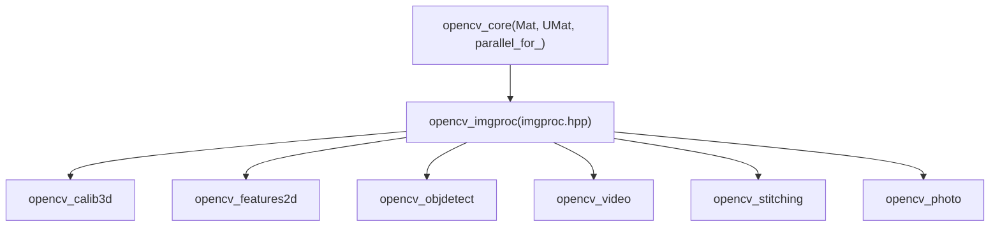
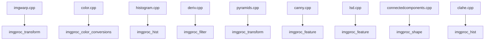
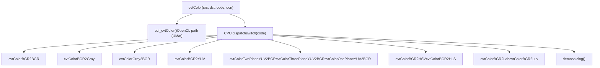

# Image Processing (imgproc)

Relevant source files

-   [cmake/vars/EnableModeVars.cmake](https://github.com/opencv/opencv/blob/91c78f50/cmake/vars/EnableModeVars.cmake)
-   [cmake/vars/OPENCV\_SEMIHOSTING.cmake](https://github.com/opencv/opencv/blob/91c78f50/cmake/vars/OPENCV_SEMIHOSTING.cmake)
-   [doc/opencv.bib](https://github.com/opencv/opencv/blob/91c78f50/doc/opencv.bib)
-   [modules/calib3d/doc/calib3d.bib](https://github.com/opencv/opencv/blob/91c78f50/modules/calib3d/doc/calib3d.bib)
-   [modules/calib3d/doc/solvePnP.markdown](https://github.com/opencv/opencv/blob/91c78f50/modules/calib3d/doc/solvePnP.markdown?plain=1)
-   [modules/calib3d/include/opencv2/calib3d.hpp](https://github.com/opencv/opencv/blob/91c78f50/modules/calib3d/include/opencv2/calib3d.hpp)
-   [modules/calib3d/perf/perf\_pnp.cpp](https://github.com/opencv/opencv/blob/91c78f50/modules/calib3d/perf/perf_pnp.cpp)
-   [modules/calib3d/perf/perf\_stereosgbm.cpp](https://github.com/opencv/opencv/blob/91c78f50/modules/calib3d/perf/perf_stereosgbm.cpp)
-   [modules/calib3d/src/ap3p.cpp](https://github.com/opencv/opencv/blob/91c78f50/modules/calib3d/src/ap3p.cpp)
-   [modules/calib3d/src/ap3p.h](https://github.com/opencv/opencv/blob/91c78f50/modules/calib3d/src/ap3p.h)
-   [modules/calib3d/src/dls.cpp](https://github.com/opencv/opencv/blob/91c78f50/modules/calib3d/src/dls.cpp)
-   [modules/calib3d/src/dls.h](https://github.com/opencv/opencv/blob/91c78f50/modules/calib3d/src/dls.h)
-   [modules/calib3d/src/epnp.cpp](https://github.com/opencv/opencv/blob/91c78f50/modules/calib3d/src/epnp.cpp)
-   [modules/calib3d/src/epnp.h](https://github.com/opencv/opencv/blob/91c78f50/modules/calib3d/src/epnp.h)
-   [modules/calib3d/src/ippe.cpp](https://github.com/opencv/opencv/blob/91c78f50/modules/calib3d/src/ippe.cpp)
-   [modules/calib3d/src/p3p.cpp](https://github.com/opencv/opencv/blob/91c78f50/modules/calib3d/src/p3p.cpp)
-   [modules/calib3d/src/p3p.h](https://github.com/opencv/opencv/blob/91c78f50/modules/calib3d/src/p3p.h)
-   [modules/calib3d/src/solvepnp.cpp](https://github.com/opencv/opencv/blob/91c78f50/modules/calib3d/src/solvepnp.cpp)
-   [modules/calib3d/test/test\_solvepnp\_ransac.cpp](https://github.com/opencv/opencv/blob/91c78f50/modules/calib3d/test/test_solvepnp_ransac.cpp)
-   [modules/core/perf/perf\_mat.cpp](https://github.com/opencv/opencv/blob/91c78f50/modules/core/perf/perf_mat.cpp)
-   [modules/core/src/opencl/copyset.cl](https://github.com/opencv/opencv/blob/91c78f50/modules/core/src/opencl/copyset.cl)
-   [modules/features2d/perf/perf\_batchDistance.cpp](https://github.com/opencv/opencv/blob/91c78f50/modules/features2d/perf/perf_batchDistance.cpp)
-   [modules/imgcodecs/test/test\_main.cpp](https://github.com/opencv/opencv/blob/91c78f50/modules/imgcodecs/test/test_main.cpp)
-   [modules/imgproc/doc/colors.markdown](https://github.com/opencv/opencv/blob/91c78f50/modules/imgproc/doc/colors.markdown?plain=1)
-   [modules/imgproc/doc/pics/Bayer\_patterns.png](https://github.com/opencv/opencv/blob/91c78f50/modules/imgproc/doc/pics/Bayer_patterns.png)
-   [modules/imgproc/include/opencv2/imgproc.hpp](https://github.com/opencv/opencv/blob/91c78f50/modules/imgproc/include/opencv2/imgproc.hpp)
-   [modules/imgproc/perf/opencl/perf\_color.cpp](https://github.com/opencv/opencv/blob/91c78f50/modules/imgproc/perf/opencl/perf_color.cpp)
-   [modules/imgproc/perf/opencl/perf\_imgwarp.cpp](https://github.com/opencv/opencv/blob/91c78f50/modules/imgproc/perf/opencl/perf_imgwarp.cpp)
-   [modules/imgproc/perf/opencl/perf\_moments.cpp](https://github.com/opencv/opencv/blob/91c78f50/modules/imgproc/perf/opencl/perf_moments.cpp)
-   [modules/imgproc/perf/opencl/perf\_pyramid.cpp](https://github.com/opencv/opencv/blob/91c78f50/modules/imgproc/perf/opencl/perf_pyramid.cpp)
-   [modules/imgproc/src/canny.cpp](https://github.com/opencv/opencv/blob/91c78f50/modules/imgproc/src/canny.cpp)
-   [modules/imgproc/src/ccl\_bolelli\_forest.inc.hpp](https://github.com/opencv/opencv/blob/91c78f50/modules/imgproc/src/ccl_bolelli_forest.inc.hpp)
-   [modules/imgproc/src/ccl\_bolelli\_forest\_firstline.inc.hpp](https://github.com/opencv/opencv/blob/91c78f50/modules/imgproc/src/ccl_bolelli_forest_firstline.inc.hpp)
-   [modules/imgproc/src/ccl\_bolelli\_forest\_lastline.inc.hpp](https://github.com/opencv/opencv/blob/91c78f50/modules/imgproc/src/ccl_bolelli_forest_lastline.inc.hpp)
-   [modules/imgproc/src/ccl\_bolelli\_forest\_singleline.inc.hpp](https://github.com/opencv/opencv/blob/91c78f50/modules/imgproc/src/ccl_bolelli_forest_singleline.inc.hpp)
-   [modules/imgproc/src/clahe.cpp](https://github.com/opencv/opencv/blob/91c78f50/modules/imgproc/src/clahe.cpp)
-   [modules/imgproc/src/color.cpp](https://github.com/opencv/opencv/blob/91c78f50/modules/imgproc/src/color.cpp)
-   [modules/imgproc/src/connectedcomponents.cpp](https://github.com/opencv/opencv/blob/91c78f50/modules/imgproc/src/connectedcomponents.cpp)
-   [modules/imgproc/src/deriv.cpp](https://github.com/opencv/opencv/blob/91c78f50/modules/imgproc/src/deriv.cpp)
-   [modules/imgproc/src/histogram.cpp](https://github.com/opencv/opencv/blob/91c78f50/modules/imgproc/src/histogram.cpp)
-   [modules/imgproc/src/imgwarp.cpp](https://github.com/opencv/opencv/blob/91c78f50/modules/imgproc/src/imgwarp.cpp)
-   [modules/imgproc/src/lsd.cpp](https://github.com/opencv/opencv/blob/91c78f50/modules/imgproc/src/lsd.cpp)
-   [modules/imgproc/src/min\_enclosing\_convex\_polygon.cpp](https://github.com/opencv/opencv/blob/91c78f50/modules/imgproc/src/min_enclosing_convex_polygon.cpp)
-   [modules/imgproc/src/opencl/bilateral.cl](https://github.com/opencv/opencv/blob/91c78f50/modules/imgproc/src/opencl/bilateral.cl)
-   [modules/imgproc/src/opencl/clahe.cl](https://github.com/opencv/opencv/blob/91c78f50/modules/imgproc/src/opencl/clahe.cl)
-   [modules/imgproc/src/opencl/covardata.cl](https://github.com/opencv/opencv/blob/91c78f50/modules/imgproc/src/opencl/covardata.cl)
-   [modules/imgproc/src/opencl/filter2DSmall.cl](https://github.com/opencv/opencv/blob/91c78f50/modules/imgproc/src/opencl/filter2DSmall.cl)
-   [modules/imgproc/src/opencl/filterSepCol.cl](https://github.com/opencv/opencv/blob/91c78f50/modules/imgproc/src/opencl/filterSepCol.cl)
-   [modules/imgproc/src/opencl/filterSepRow.cl](https://github.com/opencv/opencv/blob/91c78f50/modules/imgproc/src/opencl/filterSepRow.cl)
-   [modules/imgproc/src/opencl/filterSep\_singlePass.cl](https://github.com/opencv/opencv/blob/91c78f50/modules/imgproc/src/opencl/filterSep_singlePass.cl)
-   [modules/imgproc/src/opencl/filterSmall.cl](https://github.com/opencv/opencv/blob/91c78f50/modules/imgproc/src/opencl/filterSmall.cl)
-   [modules/imgproc/src/opencl/histogram.cl](https://github.com/opencv/opencv/blob/91c78f50/modules/imgproc/src/opencl/histogram.cl)
-   [modules/imgproc/src/opencl/laplacian5.cl](https://github.com/opencv/opencv/blob/91c78f50/modules/imgproc/src/opencl/laplacian5.cl)
-   [modules/imgproc/src/opencl/morph.cl](https://github.com/opencv/opencv/blob/91c78f50/modules/imgproc/src/opencl/morph.cl)
-   [modules/imgproc/src/opencl/pyr\_down.cl](https://github.com/opencv/opencv/blob/91c78f50/modules/imgproc/src/opencl/pyr_down.cl)
-   [modules/imgproc/src/opencl/pyr\_up.cl](https://github.com/opencv/opencv/blob/91c78f50/modules/imgproc/src/opencl/pyr_up.cl)
-   [modules/imgproc/src/opencl/pyramid\_up.cl](https://github.com/opencv/opencv/blob/91c78f50/modules/imgproc/src/opencl/pyramid_up.cl)
-   [modules/imgproc/src/opencl/remap.cl](https://github.com/opencv/opencv/blob/91c78f50/modules/imgproc/src/opencl/remap.cl)
-   [modules/imgproc/src/opencl/resize.cl](https://github.com/opencv/opencv/blob/91c78f50/modules/imgproc/src/opencl/resize.cl)
-   [modules/imgproc/src/opencl/warp\_affine.cl](https://github.com/opencv/opencv/blob/91c78f50/modules/imgproc/src/opencl/warp_affine.cl)
-   [modules/imgproc/src/opencl/warp\_perspective.cl](https://github.com/opencv/opencv/blob/91c78f50/modules/imgproc/src/opencl/warp_perspective.cl)
-   [modules/imgproc/src/opencl/warp\_transform.cl](https://github.com/opencv/opencv/blob/91c78f50/modules/imgproc/src/opencl/warp_transform.cl)
-   [modules/imgproc/src/phasecorr\_iterative.cpp](https://github.com/opencv/opencv/blob/91c78f50/modules/imgproc/src/phasecorr_iterative.cpp)
-   [modules/imgproc/src/pyramids.cpp](https://github.com/opencv/opencv/blob/91c78f50/modules/imgproc/src/pyramids.cpp)
-   [modules/imgproc/test/ocl/test\_color.cpp](https://github.com/opencv/opencv/blob/91c78f50/modules/imgproc/test/ocl/test_color.cpp)
-   [modules/imgproc/test/ocl/test\_filters.cpp](https://github.com/opencv/opencv/blob/91c78f50/modules/imgproc/test/ocl/test_filters.cpp)
-   [modules/imgproc/test/ocl/test\_pyramids.cpp](https://github.com/opencv/opencv/blob/91c78f50/modules/imgproc/test/ocl/test_pyramids.cpp)
-   [modules/imgproc/test/ocl/test\_warp.cpp](https://github.com/opencv/opencv/blob/91c78f50/modules/imgproc/test/ocl/test_warp.cpp)
-   [modules/imgproc/test/test\_connectedcomponents.cpp](https://github.com/opencv/opencv/blob/91c78f50/modules/imgproc/test/test_connectedcomponents.cpp)
-   [modules/imgproc/test/test\_histograms.cpp](https://github.com/opencv/opencv/blob/91c78f50/modules/imgproc/test/test_histograms.cpp)
-   [modules/imgproc/test/test\_imgproc\_umat.cpp](https://github.com/opencv/opencv/blob/91c78f50/modules/imgproc/test/test_imgproc_umat.cpp)
-   [modules/imgproc/test/test\_imgwarp.cpp](https://github.com/opencv/opencv/blob/91c78f50/modules/imgproc/test/test_imgwarp.cpp)
-   [modules/imgproc/test/test\_imgwarp\_strict.cpp](https://github.com/opencv/opencv/blob/91c78f50/modules/imgproc/test/test_imgwarp_strict.cpp)
-   [modules/imgproc/test/test\_ipc.cpp](https://github.com/opencv/opencv/blob/91c78f50/modules/imgproc/test/test_ipc.cpp)
-   [modules/imgproc/test/test\_lsd.cpp](https://github.com/opencv/opencv/blob/91c78f50/modules/imgproc/test/test_lsd.cpp)
-   [modules/imgproc/test/test\_pyramid.cpp](https://github.com/opencv/opencv/blob/91c78f50/modules/imgproc/test/test_pyramid.cpp)
-   [modules/ts/include/opencv2/ts/ocl\_test.hpp](https://github.com/opencv/opencv/blob/91c78f50/modules/ts/include/opencv2/ts/ocl_test.hpp)
-   [modules/videoio/test/test\_main.cpp](https://github.com/opencv/opencv/blob/91c78f50/modules/videoio/test/test_main.cpp)
-   [platforms/semihosting/aarch64-semihosting.toolchain.cmake](https://github.com/opencv/opencv/blob/91c78f50/platforms/semihosting/aarch64-semihosting.toolchain.cmake)
-   [platforms/semihosting/include/aarch64\_semihosting\_port.hpp](https://github.com/opencv/opencv/blob/91c78f50/platforms/semihosting/include/aarch64_semihosting_port.hpp)
-   [samples/cpp/lsd\_lines.cpp](https://github.com/opencv/opencv/blob/91c78f50/samples/cpp/lsd_lines.cpp)

This page gives an overview of the `opencv_imgproc` module: its functional scope, major API groups, key enumerations, and implementation structure. It covers operations from pixel-level filtering through structural shape analysis.

For geometric transforms in detail, see [Geometric Transformations and Image Warping](/opencv/opencv/4.1-geometric-transformations-and-image-warping). For filtering and color conversion specifics, see [Filtering and Color Conversion](/opencv/opencv/4.2-filtering-and-color-conversion). For thresholding, template matching, and moments, see [Thresholding, Template Matching, and Moments](/opencv/opencv/4.3-thresholding-template-matching-and-moments). For drawing and structural analysis, see [Drawing, Contours, and Structural Analysis](/opencv/opencv/4.4-drawing-contours-and-structural-analysis).

---

## Module Structure

The `opencv_imgproc` module is declared in [modules/imgproc/include/opencv2/imgproc.hpp](https://github.com/opencv/opencv/blob/91c78f50/modules/imgproc/include/opencv2/imgproc.hpp) and divided into named functional groups using Doxygen `@defgroup` annotations. All public APIs live in the `cv` namespace.

**Functional Groups (from `imgproc.hpp`):**

| Group Tag | Description |
| --- | --- |
| `imgproc_filter` | Linear and nonlinear 2D filters, morphological ops |
| `imgproc_transform` | Geometric transforms: resize, warp, remap, pyramids |
| `imgproc_misc` | Threshold, distance transform, flood fill, GrabCut |
| `imgproc_color_conversions` | `cvtColor` and all `ColorConversionCodes` |
| `imgproc_colormap` | `applyColorMap` with `ColormapTypes` |
| `imgproc_hist` | Histogram calculation, equalization, CLAHE, backprojection |
| `imgproc_shape` | Contours, connected components, convex hull, shape matching |
| `imgproc_feature` | Hough transforms, Line Segment Detector |
| `imgproc_draw` | Lines, rectangles, circles, ellipses, text rendering |
| `imgproc_object` | Template matching |
| `imgproc_subdiv2d` | `Subdiv2D` – Delaunay triangulation / Voronoi diagram |
| `imgproc_motion` | `accumulate` family for motion analysis |
| `imgproc_segmentation` | `watershed`, `grabCut` |
| `imgproc_hal` | HAL function and interface definitions |

Sources: [modules/imgproc/include/opencv2/imgproc.hpp48-199](https://github.com/opencv/opencv/blob/91c78f50/modules/imgproc/include/opencv2/imgproc.hpp#L48-L199)

---

## Dependency and Data Flow

The module depends only on `opencv_core` (for `Mat`, `UMat`, `InputArray`/`OutputArray`). It is a foundational dependency of most other OpenCV modules.

**Module Dependency Diagram**


Sources: [modules/imgproc/include/opencv2/imgproc.hpp46-47](https://github.com/opencv/opencv/blob/91c78f50/modules/imgproc/include/opencv2/imgproc.hpp#L46-L47)

---

## Key Source Files

**Functional Area to Source File Map**


Sources: [modules/imgproc/src/imgwarp.cpp1-60](https://github.com/opencv/opencv/blob/91c78f50/modules/imgproc/src/imgwarp.cpp#L1-L60) [modules/imgproc/src/color.cpp1-15](https://github.com/opencv/opencv/blob/91c78f50/modules/imgproc/src/color.cpp#L1-L15) [modules/imgproc/src/histogram.cpp1-50](https://github.com/opencv/opencv/blob/91c78f50/modules/imgproc/src/histogram.cpp#L1-L50) [modules/imgproc/src/deriv.cpp1-50](https://github.com/opencv/opencv/blob/91c78f50/modules/imgproc/src/deriv.cpp#L1-L50) [modules/imgproc/src/pyramids.cpp1-50](https://github.com/opencv/opencv/blob/91c78f50/modules/imgproc/src/pyramids.cpp#L1-L50) [modules/imgproc/src/canny.cpp1-50](https://github.com/opencv/opencv/blob/91c78f50/modules/imgproc/src/canny.cpp#L1-L50) [modules/imgproc/src/lsd.cpp1-60](https://github.com/opencv/opencv/blob/91c78f50/modules/imgproc/src/lsd.cpp#L1-L60) [modules/imgproc/src/connectedcomponents.cpp1-46](https://github.com/opencv/opencv/blob/91c78f50/modules/imgproc/src/connectedcomponents.cpp#L1-L46) [modules/imgproc/src/clahe.cpp1-30](https://github.com/opencv/opencv/blob/91c78f50/modules/imgproc/src/clahe.cpp#L1-L30)

---

## Interpolation Methods

Geometric transform functions (resize, remap, warpAffine, warpPerspective) share the `InterpolationFlags` enum. All functions map from destination to source (reverse mapping) to avoid gaps.

| Flag | Value | Description |
| --- | --- | --- |
| `INTER_NEAREST` | 0 | Nearest neighbor |
| `INTER_LINEAR` | 1 | Bilinear |
| `INTER_CUBIC` | 2 | Bicubic (4×4 neighborhood) |
| `INTER_AREA` | 3 | Pixel area relation (preferred for decimation) |
| `INTER_LANCZOS4` | 4 | Lanczos over 8×8 neighborhood |
| `INTER_LINEAR_EXACT` | 5 | Bit-exact bilinear |
| `INTER_NEAREST_EXACT` | 6 | Bit-exact nearest neighbor |
| `WARP_FILL_OUTLIERS` | 8 | Fill destination pixels with zeros for out-of-range source |
| `WARP_INVERSE_MAP` | 16 | Map argument is already the inverse map |
| `WARP_RELATIVE_MAP` | 32 | Map values are relative offsets |

Coefficient lookup tables for bilinear, bicubic, and Lanczos are precomputed at startup in `initInterTab2D` in [modules/imgproc/src/imgwarp.cpp152-226](https://github.com/opencv/opencv/blob/91c78f50/modules/imgproc/src/imgwarp.cpp#L152-L226) The tables are indexed by sub-pixel fractional position using `INTER_TAB_SIZE = 32` subdivisions per pixel.

Sources: [modules/imgproc/include/opencv2/imgproc.hpp249-296](https://github.com/opencv/opencv/blob/91c78f50/modules/imgproc/include/opencv2/imgproc.hpp#L249-L296) [modules/imgproc/src/imgwarp.cpp64-84](https://github.com/opencv/opencv/blob/91c78f50/modules/imgproc/src/imgwarp.cpp#L64-L84)

---

## Border Handling

All filter and warp functions accept a `borderType` parameter from `cv::BorderTypes` (defined in `opencv_core`). The imgproc module adds `BORDER_TRANSPARENT` for warp functions: destination pixels are left unchanged when the source coordinate falls outside the image.

Common border types used across imgproc:

| Type | Behavior |
| --- | --- |
| `BORDER_CONSTANT` | Pad with a constant value |
| `BORDER_REPLICATE` | Repeat edge pixels |
| `BORDER_REFLECT` | Mirror without repeating the edge pixel |
| `BORDER_REFLECT_101` | Mirror, excluding the edge pixel (default for most filters) |
| `BORDER_WRAP` | Tile the image |
| `BORDER_TRANSPARENT` | Leave destination unchanged (warp functions only) |

Sources: [modules/imgproc/include/opencv2/imgproc.hpp90-128](https://github.com/opencv/opencv/blob/91c78f50/modules/imgproc/include/opencv2/imgproc.hpp#L90-L128)

---

## Filtering

### Linear Filters

| Function | Description |
| --- | --- |
| `filter2D` | General 2D convolution with arbitrary kernel |
| `sepFilter2D` | Separable filter (row kernel × column kernel) |
| `GaussianBlur` | Gaussian smoothing |
| `blur` | Box (mean) filter |
| `medianBlur` | Non-linear median filter |
| `bilateralFilter` | Edge-preserving bilateral filter |

### Derivative Filters

The functions `Sobel`, `Scharr`, and `Laplacian` are implemented in `deriv.cpp`. `getDerivKernels` produces the separable Sobel or Scharr kernel pair. When `ksize <= 0`, `Scharr` kernels `[3, 10, 3]` / `[-1, 0, 1]` are used.

```
getScharrKernels → [3, 10, 3] smoothing kernel, [-1, 0, 1] derivative kernel
getSobelKernels  → Pascal triangle rows for smoothing, differences for derivative
getDerivKernels  → routes to getScharrKernels or getSobelKernels
```
`createDerivFilter` wraps the kernels in a `FilterEngine` via `createSeparableLinearFilter`.

Sources: [modules/imgproc/src/deriv.cpp55-182](https://github.com/opencv/opencv/blob/91c78f50/modules/imgproc/src/deriv.cpp#L55-L182)

### Morphological Operations

Structuring elements are created with `getStructuringElement` using `MorphShapes`:

| Shape | Description |
| --- | --- |
| `MORPH_RECT` | Filled rectangle |
| `MORPH_CROSS` | Cross (anchor row and column are 1) |
| `MORPH_ELLIPSE` | Filled ellipse inscribed in the bounding rect |
| `MORPH_DIAMOND` | Diamond (Manhattan distance ≤ radius) |

Higher-level compound operations are exposed through `morphologyEx` using `MorphTypes`:

| Type | Operation |
| --- | --- |
| `MORPH_ERODE` | Erosion |
| `MORPH_DILATE` | Dilation |
| `MORPH_OPEN` | Erode then dilate |
| `MORPH_CLOSE` | Dilate then erode |
| `MORPH_GRADIENT` | Dilate − erode |
| `MORPH_TOPHAT` | src − open(src) |
| `MORPH_BLACKHAT` | close(src) − src |
| `MORPH_HITMISS` | Hit-or-miss (binary CV\_8UC1 only) |

Sources: [modules/imgproc/include/opencv2/imgproc.hpp216-241](https://github.com/opencv/opencv/blob/91c78f50/modules/imgproc/include/opencv2/imgproc.hpp#L216-L241)

---

## Color Conversion

`cvtColor(src, dst, code, dcn)` dispatches to per-conversion functions based on the `ColorConversionCodes` enum. The dual-plane variant `cvtColorTwoPlane(ysrc, uvsrc, dst, code)` handles NV12/NV21 YUV input split across two planes.

**Color Conversion Dispatch (from `color.cpp`)**


Sources: [modules/imgproc/src/color.cpp14-388](https://github.com/opencv/opencv/blob/91c78f50/modules/imgproc/src/color.cpp#L14-L388)

**Supported color space families:**

| Family | Representative Codes |
| --- | --- |
| BGR ↔ RGB ↔ BGRA ↔ RGBA | `COLOR_BGR2BGRA`, `COLOR_RGB2BGR`, … |
| BGR ↔ Grayscale | `COLOR_BGR2GRAY`, `COLOR_GRAY2BGR` |
| BGR/RGB ↔ HSV | `COLOR_BGR2HSV`, `COLOR_BGR2HSV_FULL` |
| BGR/RGB ↔ HLS | `COLOR_BGR2HLS`, `COLOR_BGR2HLS_FULL` |
| BGR/RGB ↔ YCrCb / YUV | `COLOR_BGR2YCrCb`, `COLOR_BGR2YUV` |
| YUV 4:2:0 (NV12/NV21/I420/YV12) | `COLOR_YUV2BGR_NV12`, `COLOR_YUV2BGR_IYUV`, … |
| YUV 4:2:2 (UYVY/YUY2/YVYU) | `COLOR_YUV2BGR_UYVY`, `COLOR_YUV2BGR_YUY2`, … |
| BGR/RGB ↔ CIE XYZ | `COLOR_BGR2XYZ` |
| BGR/RGB ↔ CIE Lab | `COLOR_BGR2Lab`, `COLOR_LBGR2Lab` |
| BGR/RGB ↔ CIE Luv | `COLOR_BGR2Luv` |
| Bayer → BGR/Gray | `COLOR_BayerBG2BGR`, `COLOR_BayerBG2BGR_VNG`, … |
| Packed 16-bit (BGR565/BGR555) | `COLOR_BGR2BGR565`, … |

Sources: [modules/imgproc/include/opencv2/imgproc.hpp542-880](https://github.com/opencv/opencv/blob/91c78f50/modules/imgproc/include/opencv2/imgproc.hpp#L542-L880) [modules/imgproc/src/color.cpp192-387](https://github.com/opencv/opencv/blob/91c78f50/modules/imgproc/src/color.cpp#L192-L387)

---

## Thresholding

`threshold(src, dst, thresh, maxval, type)` supports the following via `ThresholdTypes`:

| Type | Behavior |
| --- | --- |
| `THRESH_BINARY` | dst = maxval if src > thresh, else 0 |
| `THRESH_BINARY_INV` | Inverted binary |
| `THRESH_TRUNC` | dst = thresh if src > thresh, else src |
| `THRESH_TOZERO` | dst = src if src > thresh, else 0 |
| `THRESH_TOZERO_INV` | Inverted to-zero |
| `THRESH_OTSU` | Flag: auto-determine threshold using Otsu's method |
| `THRESH_TRIANGLE` | Flag: auto-determine threshold using triangle algorithm |
| `THRESH_DRYRUN` | Flag: compute optimal threshold but do not apply it |

`adaptiveThreshold` uses `AdaptiveThresholdTypes`:

-   `ADAPTIVE_THRESH_MEAN_C` – local mean of block neighborhood minus C
-   `ADAPTIVE_THRESH_GAUSSIAN_C` – Gaussian-weighted sum minus C

Sources: [modules/imgproc/include/opencv2/imgproc.hpp325-348](https://github.com/opencv/opencv/blob/91c78f50/modules/imgproc/include/opencv2/imgproc.hpp#L325-L348)

---

## Histograms

| Function | Description |
| --- | --- |
| `calcHist` | Compute N-dimensional histogram for one or more images/channels |
| `calcBackProject` | Project histogram back onto image (probability map) |
| `compareHist` | Compare two histograms using a `HistCompMethods` metric |
| `equalizeHist` | Global histogram equalization (8-bit single-channel) |
| `createCLAHE` | Returns a `CLAHE` object for contrast-limited adaptive histogram equalization |

`calcHist` in [modules/imgproc/src/histogram.cpp](https://github.com/opencv/opencv/blob/91c78f50/modules/imgproc/src/histogram.cpp) handles uniform and non-uniform binning. For 8U images with uniform ranges it builds a fast per-pixel lookup table in `calcHistLookupTables_8u`. For multi-dimensional histograms it iterates over all channel combinations.

**Histogram comparison metrics (`HistCompMethods`):**

| Method | Formula |
| --- | --- |
| `HISTCMP_CORREL` | Normalized cross-correlation |
| `HISTCMP_CHISQR` | Chi-square |
| `HISTCMP_CHISQR_ALT` | Alternative chi-square (texture comparison) |
| `HISTCMP_INTERSECT` | Histogram intersection (sum of minimums) |
| `HISTCMP_BHATTACHARYYA` / `HISTCMP_HELLINGER` | Hellinger distance |
| `HISTCMP_KL_DIV` | Kullback-Leibler divergence |

Sources: [modules/imgproc/src/histogram.cpp59-222](https://github.com/opencv/opencv/blob/91c78f50/modules/imgproc/src/histogram.cpp#L59-L222) [modules/imgproc/src/clahe.cpp1-30](https://github.com/opencv/opencv/blob/91c78f50/modules/imgproc/src/clahe.cpp#L1-L30) [modules/imgproc/include/opencv2/imgproc.hpp507-532](https://github.com/opencv/opencv/blob/91c78f50/modules/imgproc/include/opencv2/imgproc.hpp#L507-L532)

---

## Image Pyramids

`pyrDown` and `pyrUp` in [modules/imgproc/src/pyramids.cpp](https://github.com/opencv/opencv/blob/91c78f50/modules/imgproc/src/pyramids.cpp) implement Gaussian and Laplacian pyramid operations. The Gaussian kernel used is `[1, 4, 6, 4, 1] / 16` applied separably. SIMD-accelerated horizontal pass functions (`PyrDownVecH`, `PyrUpVecH`) are specialized for `uchar`/`short` types at 1–4 channels using the `CV_SIMD` intrinsics layer.

`buildPyramid` constructs a multi-scale pyramid by iteratively calling `pyrDown`.

Sources: [modules/imgproc/src/pyramids.cpp65-160](https://github.com/opencv/opencv/blob/91c78f50/modules/imgproc/src/pyramids.cpp#L65-L160)

---

## Edge Detection (Canny)

`Canny` in [modules/imgproc/src/canny.cpp](https://github.com/opencv/opencv/blob/91c78f50/modules/imgproc/src/canny.cpp) implements the Canny edge detector. The processing steps are:

1.  Apply Sobel (aperture 3, 5, or 7) to compute gradient magnitude and direction.
2.  Non-maximum suppression along gradient direction.
3.  Double threshold hysteresis linking (low threshold → candidate, high threshold → confirmed edge).

The OpenCL path (`ocl_Canny`) compiles a kernel dispatching the same three stages on GPU when `_dst.isUMat()`.

Sources: [modules/imgproc/src/canny.cpp52-170](https://github.com/opencv/opencv/blob/91c78f50/modules/imgproc/src/canny.cpp#L52-L170)

---

## Line Segment Detector (LSD)

`createLineSegmentDetector(mode, ...)` returns a `LineSegmentDetector` object. The `detect` method implements the LSD algorithm:

1.  Gaussian downsample and compute gradient magnitude/angle.
2.  Pseudo-order pixels by gradient magnitude using `N_BINS = 1024` bins.
3.  Grow line-support regions from high-gradient seed pixels.
4.  Fit rectangles; validate via NFA (number of false alarms) criterion.

Mode flags via `LineSegmentDetectorModes`:

-   `LSD_REFINE_NONE` – no post-refinement
-   `LSD_REFINE_STD` – standard refinement (arc breaking)
-   `LSD_REFINE_ADV` – advanced refinement (precision increase, size decrement)

Sources: [modules/imgproc/src/lsd.cpp46-60](https://github.com/opencv/opencv/blob/91c78f50/modules/imgproc/src/lsd.cpp#L46-L60)

---

## Hough Transforms

`HoughLines`, `HoughLinesP`, and `HoughCircles` share the `HoughModes` enum:

| Mode | Function | Output |
| --- | --- | --- |
| `HOUGH_STANDARD` | `HoughLines` | `(ρ, θ)` pairs in `CV_32FC2` |
| `HOUGH_PROBABILISTIC` | `HoughLinesP` | Line segments `(x1, y1, x2, y2)` in `CV_32SC4` |
| `HOUGH_MULTI_SCALE` | `HoughLines` with `HOUGH_MULTI_SCALE` | Like standard, multi-resolution |
| `HOUGH_GRADIENT` | `HoughCircles` | Centers and radii |
| `HOUGH_GRADIENT_ALT` | `HoughCircles` | Higher-accuracy variant |

Sources: [modules/imgproc/include/opencv2/imgproc.hpp475-492](https://github.com/opencv/opencv/blob/91c78f50/modules/imgproc/include/opencv2/imgproc.hpp#L475-L492)

---

## Connected Components

`connectedComponents` and `connectedComponentsWithStats` in [modules/imgproc/src/connectedcomponents.cpp](https://github.com/opencv/opencv/blob/91c78f50/modules/imgproc/src/connectedcomponents.cpp) label connected pixel regions in a binary image.

**Algorithm options (`ConnectedComponentsAlgorithmsTypes`):**

| Flag | Algorithm |
| --- | --- |
| `CCL_DEFAULT` / `CCL_SPAGHETTI` / `CCL_BOLELLI` | Spaghetti (8-way), Spaghetti4C (4-way) |
| `CCL_WU` / `CCL_SAUF` | SAUF (8-way), with parallel option |
| `CCL_GRANA` / `CCL_BBDT` | BBDT (8-way) + SAUF (4-way), with parallel option |

`connectedComponentsWithStats` outputs per-component statistics via `ConnectedComponentsTypes`:

-   `CC_STAT_LEFT`, `CC_STAT_TOP`, `CC_STAT_WIDTH`, `CC_STAT_HEIGHT` – bounding box
-   `CC_STAT_AREA` – pixel count

Sources: [modules/imgproc/include/opencv2/imgproc.hpp399-421](https://github.com/opencv/opencv/blob/91c78f50/modules/imgproc/include/opencv2/imgproc.hpp#L399-L421) [modules/imgproc/src/connectedcomponents.cpp40-46](https://github.com/opencv/opencv/blob/91c78f50/modules/imgproc/src/connectedcomponents.cpp#L40-L46)

---

## Contour Analysis

`findContours(image, contours, hierarchy, mode, method)` retrieves contours from a binary image.

**Retrieval modes (`RetrievalModes`):**

| Mode | Description |
| --- | --- |
| `RETR_EXTERNAL` | Only outermost contours |
| `RETR_LIST` | All contours, no hierarchy |
| `RETR_CCOMP` | Two-level hierarchy: outer + holes |
| `RETR_TREE` | Full nested hierarchy |

**Approximation modes (`ContourApproximationModes`):**

| Mode | Description |
| --- | --- |
| `CHAIN_APPROX_NONE` | All boundary points stored |
| `CHAIN_APPROX_SIMPLE` | Endpoints of horizontal/vertical/diagonal runs |
| `CHAIN_APPROX_TC89_L1` / `CHAIN_APPROX_TC89_KCOS` | Teh-Chin chain approximation |

Shape matching between contours uses `matchShapes` with `ShapeMatchModes` (`CONTOURS_MATCH_I1`, `I2`, `I3`) computed from Hu moments.

Sources: [modules/imgproc/include/opencv2/imgproc.hpp423-467](https://github.com/opencv/opencv/blob/91c78f50/modules/imgproc/include/opencv2/imgproc.hpp#L423-L467)

---

## Miscellaneous Transforms

| Function | Group | Description |
| --- | --- | --- |
| `distanceTransform` | `imgproc_misc` | Per-pixel distance to nearest zero pixel. Metrics: `DIST_L1`, `DIST_L2`, `DIST_C` |
| `floodFill` | `imgproc_misc` | Flood-fill from seed point. `FLOODFILL_FIXED_RANGE` compares to seed; `FLOODFILL_MASK_ONLY` writes mask only |
| `grabCut` | `imgproc_misc` / `imgproc_segmentation` | Iterative foreground/background segmentation. Init with `GC_INIT_WITH_RECT` or `GC_INIT_WITH_MASK`; resume with `GC_EVAL` |
| `watershed` | `imgproc_segmentation` | Marker-based watershed segmentation |
| `inpaint` | — (in `photo` module) | — |

Sources: [modules/imgproc/include/opencv2/imgproc.hpp303-392](https://github.com/opencv/opencv/blob/91c78f50/modules/imgproc/include/opencv2/imgproc.hpp#L303-L392)

---

## Drawing Functions

All drawing functions operate in-place on the destination `Mat`. Coordinates are in pixels unless the `shift` parameter specifies fixed-point sub-pixel coordinates: a point `(x, y)` is interpreted as `(x * 2^-shift, y * 2^-shift)`.

| Function | Draws |
| --- | --- |
| `line` | Anti-aliased or non-aliased line segment |
| `rectangle` | Rectangle outline or filled |
| `circle` | Circle outline or filled |
| `ellipse` | Ellipse or ellipse arc |
| `fillPoly` / `polylines` | Polygon outline or filled |
| `putText` | Rasterized text using built-in Hershey fonts |
| `arrowedLine` | Arrow from pt1 to pt2 with arrowhead |
| `drawMarker` | Predefined marker shape at a point |

Line type options: `LINE_4` (4-connected), `LINE_8` (8-connected), `LINE_AA` (anti-aliased, 8-bit images only).

Color for drawing functions is passed as `Scalar(B, G, R[, A])` following OpenCV's default BGR channel order.

Sources: [modules/imgproc/include/opencv2/imgproc.hpp129-157](https://github.com/opencv/opencv/blob/91c78f50/modules/imgproc/include/opencv2/imgproc.hpp#L129-L157)

---

## Hardware Acceleration

### OpenCL

Most imgproc functions include an OpenCL code path guarded by `CV_OCL_RUN(...)`. The macro checks that the output is a `UMat` and delegates to an `ocl_*` function (e.g., `ocl_cvtColor`, `ocl_Canny`, `ocl_sepFilter3x3_8UC1`). OpenCL kernels are stored under `modules/imgproc/src/opencl/` and compiled on demand via the `opencl_kernels_imgproc` header.

### SIMD

Hot loops in `imgwarp.cpp` (e.g., `RemapVec_8u`), `pyramids.cpp` (`PyrDownVecH`, `PyrUpVecH`), and `deriv.cpp` use the universal SIMD intrinsics layer (`opencv2/core/hal/intrin.hpp`) with `v_int16x8`, `v_int32x4`, etc. These compile to SSE, AVX, NEON, or RVV depending on detected CPU features. See [SIMD Intrinsics and CPU Dispatching](/opencv/opencv/3.5-simd-intrinsics-and-cpu-dispatching) for the underlying mechanism.

### HAL (Hardware Acceleration Layer)

The `imgproc_hal` group defines replacement hooks in `hal_replacement.hpp` that allow integrators to substitute platform-optimized implementations for core operations without modifying OpenCV source.

Sources: [modules/imgproc/src/imgwarp.cpp50-57](https://github.com/opencv/opencv/blob/91c78f50/modules/imgproc/src/imgwarp.cpp#L50-L57) [modules/imgproc/src/canny.cpp130-170](https://github.com/opencv/opencv/blob/91c78f50/modules/imgproc/src/canny.cpp#L130-L170) [modules/imgproc/src/deriv.cpp276-370](https://github.com/opencv/opencv/blob/91c78f50/modules/imgproc/src/deriv.cpp#L276-L370) [modules/imgproc/src/opencl/filterSep\_singlePass.cl1-30](https://github.com/opencv/opencv/blob/91c78f50/modules/imgproc/src/opencl/filterSep_singlePass.cl#L1-L30)

---

## Depth Compatibility

Filters in `imgproc_filter` follow a fixed set of allowed depth combinations:

| Input depth | Allowed output depths |
| --- | --- |
| `CV_8U` | `-1` (same), `CV_16S`, `CV_32F`, `CV_64F` |
| `CV_16U`, `CV_16S` | `-1`, `CV_32F`, `CV_64F` |
| `CV_32F` | `-1`, `CV_32F` |
| `CV_64F` | `-1`, `CV_64F` |

Passing `ddepth = -1` keeps the output at the same depth as the source. Geometric transforms (`imgproc_transform`) do not support `CV_8S` or `CV_32S` images.

Sources: [modules/imgproc/include/opencv2/imgproc.hpp76-88](https://github.com/opencv/opencv/blob/91c78f50/modules/imgproc/include/opencv2/imgproc.hpp#L76-L88) [modules/imgproc/include/opencv2/imgproc.hpp127](https://github.com/opencv/opencv/blob/91c78f50/modules/imgproc/include/opencv2/imgproc.hpp#L127-L127)
