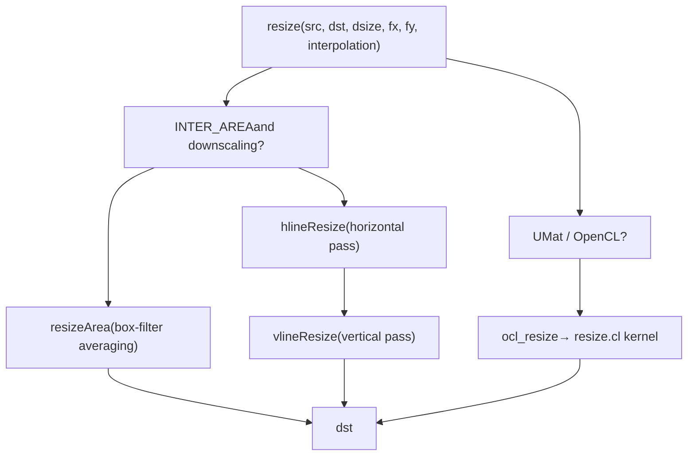
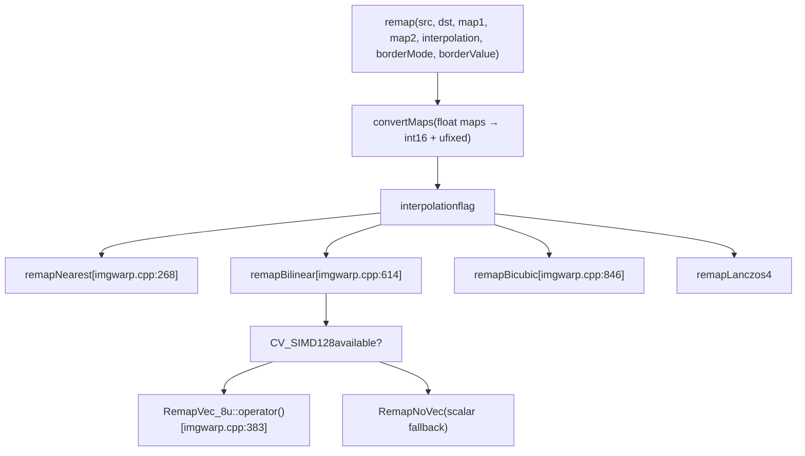
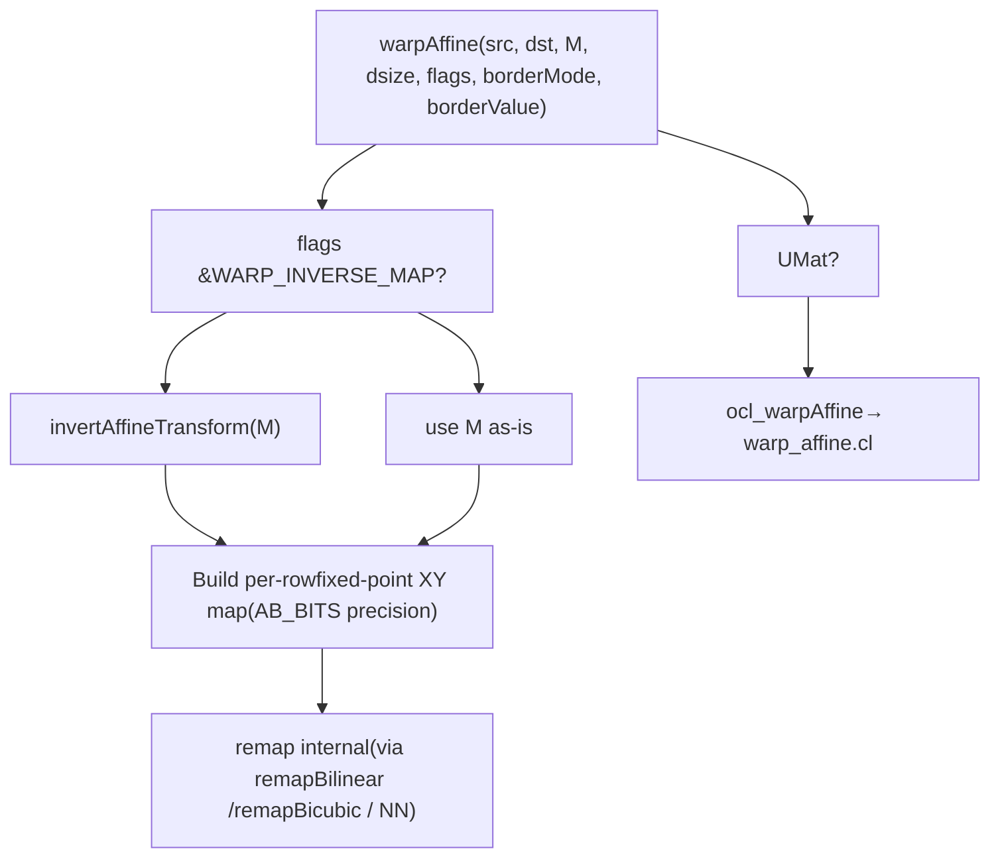
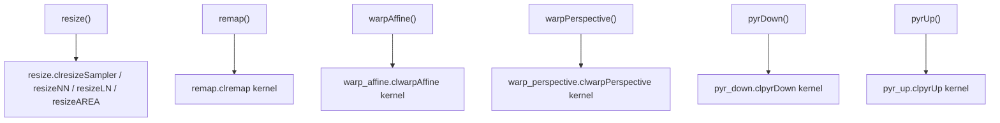
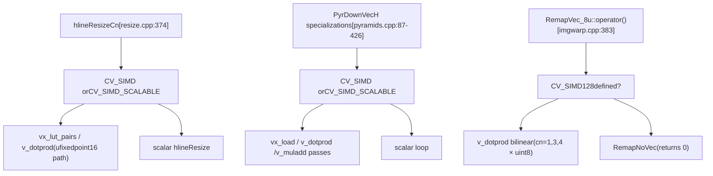

# Geometric Transformations and Image Warping

Relevant source files

-   [modules/core/include/opencv2/core/utils/trace.private.hpp](https://github.com/opencv/opencv/blob/91c78f50/modules/core/include/opencv2/core/utils/trace.private.hpp)
-   [modules/core/src/opencl/copyset.cl](https://github.com/opencv/opencv/blob/91c78f50/modules/core/src/opencl/copyset.cl)
-   [modules/core/src/parallel/parallel.cpp](https://github.com/opencv/opencv/blob/91c78f50/modules/core/src/parallel/parallel.cpp)
-   [modules/core/src/parallel/registry\_parallel.impl.hpp](https://github.com/opencv/opencv/blob/91c78f50/modules/core/src/parallel/registry_parallel.impl.hpp)
-   [modules/features2d/src/fast.avx2.cpp](https://github.com/opencv/opencv/blob/91c78f50/modules/features2d/src/fast.avx2.cpp)
-   [modules/features2d/src/fast.hpp](https://github.com/opencv/opencv/blob/91c78f50/modules/features2d/src/fast.hpp)
-   [modules/imgproc/doc/colors.markdown](https://github.com/opencv/opencv/blob/91c78f50/modules/imgproc/doc/colors.markdown?plain=1)
-   [modules/imgproc/doc/pics/Bayer\_patterns.png](https://github.com/opencv/opencv/blob/91c78f50/modules/imgproc/doc/pics/Bayer_patterns.png)
-   [modules/imgproc/perf/opencl/perf\_color.cpp](https://github.com/opencv/opencv/blob/91c78f50/modules/imgproc/perf/opencl/perf_color.cpp)
-   [modules/imgproc/perf/opencl/perf\_imgwarp.cpp](https://github.com/opencv/opencv/blob/91c78f50/modules/imgproc/perf/opencl/perf_imgwarp.cpp)
-   [modules/imgproc/perf/opencl/perf\_moments.cpp](https://github.com/opencv/opencv/blob/91c78f50/modules/imgproc/perf/opencl/perf_moments.cpp)
-   [modules/imgproc/perf/opencl/perf\_pyramid.cpp](https://github.com/opencv/opencv/blob/91c78f50/modules/imgproc/perf/opencl/perf_pyramid.cpp)
-   [modules/imgproc/src/color.cpp](https://github.com/opencv/opencv/blob/91c78f50/modules/imgproc/src/color.cpp)
-   [modules/imgproc/src/imgwarp.avx2.cpp](https://github.com/opencv/opencv/blob/91c78f50/modules/imgproc/src/imgwarp.avx2.cpp)
-   [modules/imgproc/src/imgwarp.cpp](https://github.com/opencv/opencv/blob/91c78f50/modules/imgproc/src/imgwarp.cpp)
-   [modules/imgproc/src/imgwarp.hpp](https://github.com/opencv/opencv/blob/91c78f50/modules/imgproc/src/imgwarp.hpp)
-   [modules/imgproc/src/imgwarp.sse4\_1.cpp](https://github.com/opencv/opencv/blob/91c78f50/modules/imgproc/src/imgwarp.sse4_1.cpp)
-   [modules/imgproc/src/opencl/pyr\_down.cl](https://github.com/opencv/opencv/blob/91c78f50/modules/imgproc/src/opencl/pyr_down.cl)
-   [modules/imgproc/src/opencl/pyr\_up.cl](https://github.com/opencv/opencv/blob/91c78f50/modules/imgproc/src/opencl/pyr_up.cl)
-   [modules/imgproc/src/opencl/pyramid\_up.cl](https://github.com/opencv/opencv/blob/91c78f50/modules/imgproc/src/opencl/pyramid_up.cl)
-   [modules/imgproc/src/opencl/remap.cl](https://github.com/opencv/opencv/blob/91c78f50/modules/imgproc/src/opencl/remap.cl)
-   [modules/imgproc/src/opencl/resize.cl](https://github.com/opencv/opencv/blob/91c78f50/modules/imgproc/src/opencl/resize.cl)
-   [modules/imgproc/src/opencl/warp\_affine.cl](https://github.com/opencv/opencv/blob/91c78f50/modules/imgproc/src/opencl/warp_affine.cl)
-   [modules/imgproc/src/opencl/warp\_perspective.cl](https://github.com/opencv/opencv/blob/91c78f50/modules/imgproc/src/opencl/warp_perspective.cl)
-   [modules/imgproc/src/opencl/warp\_transform.cl](https://github.com/opencv/opencv/blob/91c78f50/modules/imgproc/src/opencl/warp_transform.cl)
-   [modules/imgproc/src/pyramids.cpp](https://github.com/opencv/opencv/blob/91c78f50/modules/imgproc/src/pyramids.cpp)
-   [modules/imgproc/src/resize.avx2.cpp](https://github.com/opencv/opencv/blob/91c78f50/modules/imgproc/src/resize.avx2.cpp)
-   [modules/imgproc/src/resize.cpp](https://github.com/opencv/opencv/blob/91c78f50/modules/imgproc/src/resize.cpp)
-   [modules/imgproc/src/resize.hpp](https://github.com/opencv/opencv/blob/91c78f50/modules/imgproc/src/resize.hpp)
-   [modules/imgproc/src/resize.sse4\_1.cpp](https://github.com/opencv/opencv/blob/91c78f50/modules/imgproc/src/resize.sse4_1.cpp)
-   [modules/imgproc/test/ocl/test\_color.cpp](https://github.com/opencv/opencv/blob/91c78f50/modules/imgproc/test/ocl/test_color.cpp)
-   [modules/imgproc/test/ocl/test\_pyramids.cpp](https://github.com/opencv/opencv/blob/91c78f50/modules/imgproc/test/ocl/test_pyramids.cpp)
-   [modules/imgproc/test/ocl/test\_warp.cpp](https://github.com/opencv/opencv/blob/91c78f50/modules/imgproc/test/ocl/test_warp.cpp)
-   [modules/imgproc/test/test\_imgwarp.cpp](https://github.com/opencv/opencv/blob/91c78f50/modules/imgproc/test/test_imgwarp.cpp)
-   [modules/imgproc/test/test\_imgwarp\_strict.cpp](https://github.com/opencv/opencv/blob/91c78f50/modules/imgproc/test/test_imgwarp_strict.cpp)
-   [modules/imgproc/test/test\_pyramid.cpp](https://github.com/opencv/opencv/blob/91c78f50/modules/imgproc/test/test_pyramid.cpp)
-   [modules/imgproc/test/test\_resize\_bitexact.cpp](https://github.com/opencv/opencv/blob/91c78f50/modules/imgproc/test/test_resize_bitexact.cpp)
-   [modules/ts/include/opencv2/ts/ocl\_test.hpp](https://github.com/opencv/opencv/blob/91c78f50/modules/ts/include/opencv2/ts/ocl_test.hpp)

This page documents the geometric transformation and image warping functions in the `opencv_imgproc` module: `resize`, `remap`, `warpAffine`, `warpPerspective`, and the image pyramid functions `pyrDown`/`pyrUp`. It covers interpolation methods, border extrapolation modes, internal implementation structure, and OpenCL/SIMD acceleration paths.

For color space conversions (e.g., `cvtColor`), see page [4.2](/opencv/opencv/4.2-filtering-and-color-conversion). For camera undistortion and perspective transforms derived from calibration, see page [8.1](/opencv/opencv/8.1-camera-models-and-calibration-algorithms) and [8.2](/opencv/opencv/8.2-pose-estimation-(solvepnp)-and-geometric-transforms). For GPU (CUDA) variants of these operations, see page [14.2](/opencv/opencv/14.2-gpu-accelerated-image-processing-and-optical-flow).

---

## Public API Overview

All functions live in the `cv` namespace. Their declarations appear in `modules/imgproc/include/opencv2/imgproc.hpp`.

| Function | Purpose | Transform type |
| --- | --- | --- |
| `resize` | Scale an image to a new size | Scale (separable) |
| `remap` | Apply an arbitrary pixel map | Free-form per-pixel |
| `warpAffine` | Apply a 2×3 affine matrix | Affine |
| `warpPerspective` | Apply a 3×3 homography | Projective |
| `pyrDown` | Gaussian downsample by 2× | Fixed pyramid kernel |
| `pyrUp` | Upsample by 2× | Fixed pyramid kernel |
| `getRotationMatrix2D` | Compute a rotation/scale 2×3 matrix | Helper |
| `getPerspectiveTransform` | Compute a 3×3 homography from point correspondences | Helper |
| `getAffineTransform` | Compute a 2×3 affine matrix from point correspondences | Helper |

---

## Interpolation Methods

The interpolation mode is passed as an integer flag, defined in the `InterpolationFlags` enum.

| Flag | Value | Kernel size | Notes |
| --- | --- | --- | --- |
| `INTER_NEAREST` | 0 | 1×1 | No blending, snap to nearest |
| `INTER_LINEAR` | 1 | 2×2 | Bilinear; default for most functions |
| `INTER_CUBIC` | 2 | 4×4 | Bicubic with `A = -0.75` |
| `INTER_AREA` | 3 | varies | Area averaging; preferred for downscaling |
| `INTER_LANCZOS4` | 4 | 8×8 | Lanczos with window size 4 |
| `INTER_LINEAR_EXACT` | 5 | 2×2 | Bit-exact bilinear; integer-only |
| `INTER_NEAREST_EXACT` | 6 | 1×1 | Bit-exact nearest; matches PIL |

An additional flag `WARP_INVERSE_MAP` may be OR-ed with the interpolation flag for `warpAffine` and `warpPerspective` to indicate the matrix maps destination→source instead of source→destination.

### Interpolation Coefficient Tables

All non-nearest interpolation modes pre-compute lookup tables at startup. These tables cache fractional-position weights at sub-pixel resolution `INTER_TAB_SIZE = 32` (5 bits).

Tables declared in [modules/imgproc/src/imgwarp.cpp64-83](https://github.com/opencv/opencv/blob/91c78f50/modules/imgproc/src/imgwarp.cpp#L64-L83):

| Table | Type | Shape | Used for |
| --- | --- | --- | --- |
| `NNDeltaTab_i` | `uchar[1024][2]` | `INTER_TAB_SIZE²×2` | Nearest-neighbor snapping |
| `BilinearTab_f` | `float[1024][2][2]` | `INTER_TAB_SIZE²×2×2` | Bilinear (float) |
| `BilinearTab_i` | `short[1024][2][2]` | `INTER_TAB_SIZE²×2×2` | Bilinear (fixed-point) |
| `BilinearTab_iC4` | `short[...][2][8]` | SIMD-padded | Bilinear for 4-channel SIMD |
| `BicubicTab_f/i` | `float/short[1024][4][4]` | `INTER_TAB_SIZE²×4×4` | Bicubic |
| `Lanczos4Tab_f/i` | `float/short[1024][8][8]` | `INTER_TAB_SIZE²×8×8` | Lanczos4 |

The table initialization functions are:

-   `interpolateLinear(float x, float* coeffs)` – [modules/imgproc/src/imgwarp.cpp85-89](https://github.com/opencv/opencv/blob/91c78f50/modules/imgproc/src/imgwarp.cpp#L85-L89)
-   `interpolateCubic(float x, float* coeffs)` – [modules/imgproc/src/imgwarp.cpp91-99](https://github.com/opencv/opencv/blob/91c78f50/modules/imgproc/src/imgwarp.cpp#L91-L99)
-   `interpolateLanczos4(float x, float* coeffs)` – [modules/imgproc/src/imgwarp.cpp101-127](https://github.com/opencv/opencv/blob/91c78f50/modules/imgproc/src/imgwarp.cpp#L101-L127)
-   `initInterTab1D(int method, float* tab, int tabsz)` – [modules/imgproc/src/imgwarp.cpp129-149](https://github.com/opencv/opencv/blob/91c78f50/modules/imgproc/src/imgwarp.cpp#L129-L149)
-   `initInterTab2D(int method, bool fixpt)` – [modules/imgproc/src/imgwarp.cpp152-226](https://github.com/opencv/opencv/blob/91c78f50/modules/imgproc/src/imgwarp.cpp#L152-L226)

Fixed-point arithmetic uses `INTER_REMAP_COEF_BITS = 15` and `INTER_REMAP_COEF_SCALE = 32768` ([modules/imgproc/src/imgwarp.cpp66-67](https://github.com/opencv/opencv/blob/91c78f50/modules/imgproc/src/imgwarp.cpp#L66-L67)).

---

## Border Extrapolation Modes

When a mapped pixel falls outside the source image, the border mode determines what value to use.

| Flag | Behavior | Example (border is `|`) | |---|---|---| | `BORDER_CONSTANT` | Fill with a fixed value (default: 0) | `000|abcdef|000` | | `BORDER_REPLICATE` | Repeat the edge pixel | `aaa|abcdef|fff` | | `BORDER_REFLECT` | Mirror across the edge | `cba|abcdef|fed` | | `BORDER_REFLECT_101` | Mirror, excluding the edge pixel | `dcb|abcdef|edc` | | `BORDER_WRAP` | Tile the image | `cde|abcdef|abc` | | `BORDER_TRANSPARENT` | Leave destination pixels unchanged | (no fill) |

The `borderInterpolate` function (from `core`) maps an out-of-bounds coordinate to a valid one. It is called in the scalar fallback paths in [modules/imgproc/src/imgwarp.cpp314-315](https://github.com/opencv/opencv/blob/91c78f50/modules/imgproc/src/imgwarp.cpp#L314-L315) and similar locations.

---

## `resize`

**Source:** [modules/imgproc/src/resize.cpp](https://github.com/opencv/opencv/blob/91c78f50/modules/imgproc/src/resize.cpp)

`resize` scales an image to a new `Size` or by `fx`/`fy` scale factors. Internally it decomposes the 2D resampling into separable horizontal and vertical passes.

### Internal Pipeline

**Figure: resize internal data flow**


Sources: [modules/imgproc/src/resize.cpp](https://github.com/opencv/opencv/blob/91c78f50/modules/imgproc/src/resize.cpp) [modules/imgproc/src/opencl/resize.cl](https://github.com/opencv/opencv/blob/91c78f50/modules/imgproc/src/opencl/resize.cl)

### Key Internal Functions

-   `hlineResize<ET, FT, n, mulall>` – Applies a 1D resampling filter of kernel width `n` along each source row into a temporary buffer. Specialized for cn=1,2,3,4. [modules/imgproc/src/resize.cpp76-110](https://github.com/opencv/opencv/blob/91c78f50/modules/imgproc/src/resize.cpp#L76-L110)
-   `hlineResizeCn` – Dispatcher that selects the appropriate `hline<...>::ResizeCn` specialization. [modules/imgproc/src/resize.cpp374-378](https://github.com/opencv/opencv/blob/91c78f50/modules/imgproc/src/resize.cpp#L374-L378)
-   SIMD specializations for `uint8_t`/`ufixedpoint16` in [modules/imgproc/src/resize.cpp380](https://github.com/opencv/opencv/blob/91c78f50/modules/imgproc/src/resize.cpp#L380-LNaN) and SSE4.1 variants in [modules/imgproc/src/resize.sse4\_1.cpp](https://github.com/opencv/opencv/blob/91c78f50/modules/imgproc/src/resize.sse4_1.cpp)

For `INTER_AREA`, when the scale factors are exact integers, a fast path uses pixel averaging directly without the general coefficient table.

---

## `remap`

**Source:** [modules/imgproc/src/imgwarp.cpp](https://github.com/opencv/opencv/blob/91c78f50/modules/imgproc/src/imgwarp.cpp)

`remap` applies a free-form geometric map. The caller provides two floating-point maps `map1` and `map2` specifying where each destination pixel samples from in the source image.

```
dst(x, y) = src(map1(x, y), map2(x, y))
```
Internally, maps are converted to a compact representation (integer pixel coordinates + fixed-point fractional offsets) via `convertMaps`.

### Remap Dispatch Architecture

**Figure: remap CPU dispatch to typed kernel functions**


Sources: [modules/imgproc/src/imgwarp.cpp268-843](https://github.com/opencv/opencv/blob/91c78f50/modules/imgproc/src/imgwarp.cpp#L268-L843) [modules/imgproc/src/opencl/remap.cl](https://github.com/opencv/opencv/blob/91c78f50/modules/imgproc/src/opencl/remap.cl)

### `remapBilinear` Inlier/Outlier Split

`remapBilinear` partitions each destination row into contiguous inlier segments (all 4 bilinear neighbors inside the source) and outlier segments (some neighbors outside). The SIMD vector operator `RemapVec_8u` is invoked only for inlier runs; outliers fall back to scalar code that calls `borderInterpolate`. See [modules/imgproc/src/imgwarp.cpp640-843](https://github.com/opencv/opencv/blob/91c78f50/modules/imgproc/src/imgwarp.cpp#L640-L843)

The SIMD path `RemapVec_8u` supports `cn = 1, 3, 4` for `uint8_t` images, using `v_dotprod` to compute the bilinear sum in 128-bit vectors [modules/imgproc/src/imgwarp.cpp383-612](https://github.com/opencv/opencv/blob/91c78f50/modules/imgproc/src/imgwarp.cpp#L383-L612)

---

## `warpAffine`

**Source:** [modules/imgproc/src/imgwarp.cpp](https://github.com/opencv/opencv/blob/91c78f50/modules/imgproc/src/imgwarp.cpp) [modules/imgproc/src/opencl/warp\_affine.cl](https://github.com/opencv/opencv/blob/91c78f50/modules/imgproc/src/opencl/warp_affine.cl)

`warpAffine` applies a 2×3 affine matrix `M`:

```
dst(x, y) = src(M[0,0]*x + M[0,1]*y + M[0,2],
                M[1,0]*x + M[1,1]*y + M[1,2])
```
Unless `WARP_INVERSE_MAP` is set, the matrix is inverted before use so that it maps destination coordinates back to source coordinates (inverse mapping).

### Processing Pipeline

**Figure: warpAffine execution paths**


Sources: [modules/imgproc/src/imgwarp.cpp](https://github.com/opencv/opencv/blob/91c78f50/modules/imgproc/src/imgwarp.cpp) [modules/imgproc/src/opencl/warp\_affine.cl](https://github.com/opencv/opencv/blob/91c78f50/modules/imgproc/src/opencl/warp_affine.cl)

The OpenCL kernel `warp_affine.cl` uses fixed-point arithmetic with `AB_BITS = max(10, INTER_BITS)` precision for coordinate computation and `INTER_REMAP_COEF_BITS` for interpolation weights ([modules/imgproc/src/opencl/warp\_affine.cl54-59](https://github.com/opencv/opencv/blob/91c78f50/modules/imgproc/src/opencl/warp_affine.cl#L54-L59)).

---

## `warpPerspective`

**Source:** [modules/imgproc/src/imgwarp.cpp](https://github.com/opencv/opencv/blob/91c78f50/modules/imgproc/src/imgwarp.cpp) [modules/imgproc/src/opencl/warp\_perspective.cl](https://github.com/opencv/opencv/blob/91c78f50/modules/imgproc/src/opencl/warp_perspective.cl)

`warpPerspective` applies a full 3×3 homography `M`:

```
(x', y', w') = M * (x, y, 1)^T
dst(x, y) = src(x'/w', y'/w')
```
The homogeneous division is computed per-pixel. Unless `WARP_INVERSE_MAP` is set, the 3×3 matrix is inverted via `invert(M, iM, DECOMP_LU)`.

Internally, for each output row `y`, the code pre-computes the row's contribution to `X`, `Y`, `W` and increments them along `x`. This avoids repeated matrix multiplications. The resulting fractional coordinates are quantized to `INTER_TAB_SIZE` steps and stored in the same `short` + `ushort` maps used by `remap`. The actual pixel interpolation then follows the same code paths as `remap`.

---

## Image Pyramids (`pyrDown` / `pyrUp`)

**Source:** [modules/imgproc/src/pyramids.cpp](https://github.com/opencv/opencv/blob/91c78f50/modules/imgproc/src/pyramids.cpp) [modules/imgproc/src/opencl/pyr\_down.cl](https://github.com/opencv/opencv/blob/91c78f50/modules/imgproc/src/opencl/pyr_down.cl) [modules/imgproc/src/opencl/pyr\_up.cl](https://github.com/opencv/opencv/blob/91c78f50/modules/imgproc/src/opencl/pyr_up.cl)

Both functions use a fixed 5-tap binomial (Gaussian) kernel `[1 4 6 4 1] / 16`.

### `pyrDown`

Smooths with the 5-tap kernel then sub-samples by 2×. Output size defaults to `⌈(src.rows+1)/2⌉ × ⌈(src.cols+1)/2⌉`.

Implemented in two separable passes:

-   **Horizontal**: `PyrDownVecH<T1, T2, cn>` – SIMD-specialized for `uchar`, `ushort`, `short`, `float`, `double` with cn=1,2,3,4. [modules/imgproc/src/pyramids.cpp87-426](https://github.com/opencv/opencv/blob/91c78f50/modules/imgproc/src/pyramids.cpp#L87-L426)
-   **Vertical**: `PyrDownVecV<T1, T2>` – SIMD-specialized. [modules/imgproc/src/pyramids.cpp428-514](https://github.com/opencv/opencv/blob/91c78f50/modules/imgproc/src/pyramids.cpp#L428-L514)

The horizontal pass operates on every other source column (stride 2) and accumulates into an integer row buffer. The vertical pass reads 5 such row buffers and applies the 5-tap kernel, then writes the output row.

### `pyrUp`

Upsamples by inserting zeros between pixels, then convolves with `4 × [1 4 6 4 1] / 16`. Output size defaults to `2*src.rows × 2*src.cols`, but a custom `dstsize` can be specified within ±1 pixel of the default.

-   **Horizontal**: `PyrUpVecH<T1, T2, cn>` [modules/imgproc/src/pyramids.cpp74-77](https://github.com/opencv/opencv/blob/91c78f50/modules/imgproc/src/pyramids.cpp#L74-L77)
-   **Vertical**: `PyrUpVecV<T1, T2>`, `PyrUpVecVOneRow<T1, T2>` [modules/imgproc/src/pyramids.cpp81-83](https://github.com/opencv/opencv/blob/91c78f50/modules/imgproc/src/pyramids.cpp#L81-L83)

### Border Handling in Pyramids

The OpenCL kernel `pyr_down.cl` supports `BORDER_REPLICATE`, `BORDER_WRAP`, `BORDER_REFLECT`, and `BORDER_REFLECT_101` via the `EXTRAPOLATE(x, maxV)` macro [modules/imgproc/src/opencl/pyr\_down.cl54-66](https://github.com/opencv/opencv/blob/91c78f50/modules/imgproc/src/opencl/pyr_down.cl#L54-L66) The CPU path uses `borderInterpolate` for out-of-bounds coordinates.

---

## OpenCL Acceleration

All major warping functions have OpenCL-accelerated paths that are invoked transparently when the input or output is a `UMat` (see page [3.2](/opencv/opencv/3.2-opencl-acceleration-and-transparent-gpu-execution)). The entry point pattern uses the `CV_OCL_RUN` macro.

**Figure: OpenCL acceleration dispatch (mapping functions to .cl kernels)**


Sources: [modules/imgproc/src/resize.cpp](https://github.com/opencv/opencv/blob/91c78f50/modules/imgproc/src/resize.cpp) [modules/imgproc/src/imgwarp.cpp](https://github.com/opencv/opencv/blob/91c78f50/modules/imgproc/src/imgwarp.cpp) [modules/imgproc/src/pyramids.cpp](https://github.com/opencv/opencv/blob/91c78f50/modules/imgproc/src/pyramids.cpp) [modules/imgproc/src/opencl/resize.cl](https://github.com/opencv/opencv/blob/91c78f50/modules/imgproc/src/opencl/resize.cl) [modules/imgproc/src/opencl/remap.cl](https://github.com/opencv/opencv/blob/91c78f50/modules/imgproc/src/opencl/remap.cl) [modules/imgproc/src/opencl/warp\_affine.cl](https://github.com/opencv/opencv/blob/91c78f50/modules/imgproc/src/opencl/warp_affine.cl) [modules/imgproc/src/opencl/warp\_perspective.cl](https://github.com/opencv/opencv/blob/91c78f50/modules/imgproc/src/opencl/warp_perspective.cl) [modules/imgproc/src/opencl/pyr\_down.cl](https://github.com/opencv/opencv/blob/91c78f50/modules/imgproc/src/opencl/pyr_down.cl) [modules/imgproc/src/opencl/pyr\_up.cl](https://github.com/opencv/opencv/blob/91c78f50/modules/imgproc/src/opencl/pyr_up.cl)

### `resize.cl` Details

The resize OpenCL kernel has two modes selected at compile time:

-   `USE_SAMPLER`: Uses the GPU hardware texture sampler for bilinear interpolation. The source image is uploaded as an `image2d_t`. Kernel: `resizeSampler`. [modules/imgproc/src/opencl/resize.cl101](https://github.com/opencv/opencv/blob/91c78f50/modules/imgproc/src/opencl/resize.cl#L101-LNaN)
-   Non-sampler: Performs explicit bilinear or nearest-neighbor interpolation using global memory. Kernels: `resizeNN`, `resizeLN`, `resizeAREA`.

### `warp_affine.cl` Details

The kernel computes per-thread destination coordinates, applies the inverted affine transform using fixed-point arithmetic, and performs bilinear or nearest-neighbor interpolation. The interpolation sub-pixel index is stored in the low `INTER_BITS = 5` bits, and the table lookup uses pre-computed coefficients. [modules/imgproc/src/opencl/warp\_affine.cl54-59](https://github.com/opencv/opencv/blob/91c78f50/modules/imgproc/src/opencl/warp_affine.cl#L54-L59)

---

## SIMD Acceleration

CPU-side hot paths are accelerated using OpenCV's universal SIMD intrinsics (see page [3.5](/opencv/opencv/3.5-simd-intrinsics-and-cpu-dispatching)).

**Figure: SIMD dispatch paths for imgwarp and resize**


Sources: [modules/imgproc/src/imgwarp.cpp378-612](https://github.com/opencv/opencv/blob/91c78f50/modules/imgproc/src/imgwarp.cpp#L378-L612) [modules/imgproc/src/pyramids.cpp85-514](https://github.com/opencv/opencv/blob/91c78f50/modules/imgproc/src/pyramids.cpp#L85-L514) [modules/imgproc/src/resize.cpp380](https://github.com/opencv/opencv/blob/91c78f50/modules/imgproc/src/resize.cpp#L380-LNaN) [modules/imgproc/src/imgwarp.sse4\_1.cpp](https://github.com/opencv/opencv/blob/91c78f50/modules/imgproc/src/imgwarp.sse4_1.cpp) [modules/imgproc/src/imgwarp.avx2.cpp](https://github.com/opencv/opencv/blob/91c78f50/modules/imgproc/src/imgwarp.avx2.cpp) [modules/imgproc/src/resize.sse4\_1.cpp](https://github.com/opencv/opencv/blob/91c78f50/modules/imgproc/src/resize.sse4_1.cpp)

Specific CPU dispatch files:

| File | Dispatch baseline |
| --- | --- |
| `modules/imgproc/src/imgwarp.sse4_1.cpp` | SSE4.1 |
| `modules/imgproc/src/imgwarp.avx2.cpp` | AVX2 |
| `modules/imgproc/src/resize.sse4_1.cpp` | SSE4.1 |

---

## `convertMaps`

`convertMaps` converts a pair of floating-point maps (`CV_32FC1` or `CV_32FC2`) to the compact `(int16, uint16)` format used internally:

-   `map1` → `short` array storing truncated pixel coordinates (interleaved x, y)
-   `map2` → `ushort` array storing the fractional part as an index into the interpolation coefficient table (in range `<FileRef file-url="https://github.com/opencv/opencv/blob/91c78f50/0, INTER_TAB_SIZE²)`)\\n\\nThis conversion is shared by `remap`, `warpAffine`, and `warpPerspective`.\\n\\n---\\n\\n## Testing\\n\\nTests are organized in three files#LNaN-LNaN" NaN file-path="0, INTER\_TAB\_SIZE²)`)\n\nThis conversion is shared by` remap`,` warpAffine`, and` warpPerspective\`.\\n\\n---\\n\\n## Testing\\n\\nTests are organized in three files">Hii

Performance benchmarks for the OpenCL paths are in `modules/imgproc/perf/opencl/perf_imgwarp.cpp` and `modules/imgproc/perf/opencl/perf_pyramid.cpp`.
