# Filtering, Color Conversion, and Thresholding

Relevant source files

-   [modules/core/src/opencl/copyset.cl](https://github.com/opencv/opencv/blob/91c78f50/modules/core/src/opencl/copyset.cl)
-   [modules/imgcodecs/test/test\_main.cpp](https://github.com/opencv/opencv/blob/91c78f50/modules/imgcodecs/test/test_main.cpp)
-   [modules/imgproc/doc/colors.markdown](https://github.com/opencv/opencv/blob/91c78f50/modules/imgproc/doc/colors.markdown?plain=1)
-   [modules/imgproc/doc/pics/Bayer\_patterns.png](https://github.com/opencv/opencv/blob/91c78f50/modules/imgproc/doc/pics/Bayer_patterns.png)
-   [modules/imgproc/perf/opencl/perf\_color.cpp](https://github.com/opencv/opencv/blob/91c78f50/modules/imgproc/perf/opencl/perf_color.cpp)
-   [modules/imgproc/perf/opencl/perf\_imgwarp.cpp](https://github.com/opencv/opencv/blob/91c78f50/modules/imgproc/perf/opencl/perf_imgwarp.cpp)
-   [modules/imgproc/perf/opencl/perf\_moments.cpp](https://github.com/opencv/opencv/blob/91c78f50/modules/imgproc/perf/opencl/perf_moments.cpp)
-   [modules/imgproc/perf/opencl/perf\_pyramid.cpp](https://github.com/opencv/opencv/blob/91c78f50/modules/imgproc/perf/opencl/perf_pyramid.cpp)
-   [modules/imgproc/src/canny.cpp](https://github.com/opencv/opencv/blob/91c78f50/modules/imgproc/src/canny.cpp)
-   [modules/imgproc/src/clahe.cpp](https://github.com/opencv/opencv/blob/91c78f50/modules/imgproc/src/clahe.cpp)
-   [modules/imgproc/src/color.cpp](https://github.com/opencv/opencv/blob/91c78f50/modules/imgproc/src/color.cpp)
-   [modules/imgproc/src/deriv.cpp](https://github.com/opencv/opencv/blob/91c78f50/modules/imgproc/src/deriv.cpp)
-   [modules/imgproc/src/histogram.cpp](https://github.com/opencv/opencv/blob/91c78f50/modules/imgproc/src/histogram.cpp)
-   [modules/imgproc/src/imgwarp.cpp](https://github.com/opencv/opencv/blob/91c78f50/modules/imgproc/src/imgwarp.cpp)
-   [modules/imgproc/src/opencl/bilateral.cl](https://github.com/opencv/opencv/blob/91c78f50/modules/imgproc/src/opencl/bilateral.cl)
-   [modules/imgproc/src/opencl/clahe.cl](https://github.com/opencv/opencv/blob/91c78f50/modules/imgproc/src/opencl/clahe.cl)
-   [modules/imgproc/src/opencl/covardata.cl](https://github.com/opencv/opencv/blob/91c78f50/modules/imgproc/src/opencl/covardata.cl)
-   [modules/imgproc/src/opencl/filter2DSmall.cl](https://github.com/opencv/opencv/blob/91c78f50/modules/imgproc/src/opencl/filter2DSmall.cl)
-   [modules/imgproc/src/opencl/filterSepCol.cl](https://github.com/opencv/opencv/blob/91c78f50/modules/imgproc/src/opencl/filterSepCol.cl)
-   [modules/imgproc/src/opencl/filterSepRow.cl](https://github.com/opencv/opencv/blob/91c78f50/modules/imgproc/src/opencl/filterSepRow.cl)
-   [modules/imgproc/src/opencl/filterSep\_singlePass.cl](https://github.com/opencv/opencv/blob/91c78f50/modules/imgproc/src/opencl/filterSep_singlePass.cl)
-   [modules/imgproc/src/opencl/filterSmall.cl](https://github.com/opencv/opencv/blob/91c78f50/modules/imgproc/src/opencl/filterSmall.cl)
-   [modules/imgproc/src/opencl/histogram.cl](https://github.com/opencv/opencv/blob/91c78f50/modules/imgproc/src/opencl/histogram.cl)
-   [modules/imgproc/src/opencl/laplacian5.cl](https://github.com/opencv/opencv/blob/91c78f50/modules/imgproc/src/opencl/laplacian5.cl)
-   [modules/imgproc/src/opencl/morph.cl](https://github.com/opencv/opencv/blob/91c78f50/modules/imgproc/src/opencl/morph.cl)
-   [modules/imgproc/src/opencl/pyr\_down.cl](https://github.com/opencv/opencv/blob/91c78f50/modules/imgproc/src/opencl/pyr_down.cl)
-   [modules/imgproc/src/opencl/pyr\_up.cl](https://github.com/opencv/opencv/blob/91c78f50/modules/imgproc/src/opencl/pyr_up.cl)
-   [modules/imgproc/src/opencl/pyramid\_up.cl](https://github.com/opencv/opencv/blob/91c78f50/modules/imgproc/src/opencl/pyramid_up.cl)
-   [modules/imgproc/src/opencl/remap.cl](https://github.com/opencv/opencv/blob/91c78f50/modules/imgproc/src/opencl/remap.cl)
-   [modules/imgproc/src/opencl/resize.cl](https://github.com/opencv/opencv/blob/91c78f50/modules/imgproc/src/opencl/resize.cl)
-   [modules/imgproc/src/opencl/warp\_affine.cl](https://github.com/opencv/opencv/blob/91c78f50/modules/imgproc/src/opencl/warp_affine.cl)
-   [modules/imgproc/src/opencl/warp\_perspective.cl](https://github.com/opencv/opencv/blob/91c78f50/modules/imgproc/src/opencl/warp_perspective.cl)
-   [modules/imgproc/src/opencl/warp\_transform.cl](https://github.com/opencv/opencv/blob/91c78f50/modules/imgproc/src/opencl/warp_transform.cl)
-   [modules/imgproc/src/pyramids.cpp](https://github.com/opencv/opencv/blob/91c78f50/modules/imgproc/src/pyramids.cpp)
-   [modules/imgproc/test/ocl/test\_color.cpp](https://github.com/opencv/opencv/blob/91c78f50/modules/imgproc/test/ocl/test_color.cpp)
-   [modules/imgproc/test/ocl/test\_filters.cpp](https://github.com/opencv/opencv/blob/91c78f50/modules/imgproc/test/ocl/test_filters.cpp)
-   [modules/imgproc/test/ocl/test\_pyramids.cpp](https://github.com/opencv/opencv/blob/91c78f50/modules/imgproc/test/ocl/test_pyramids.cpp)
-   [modules/imgproc/test/ocl/test\_warp.cpp](https://github.com/opencv/opencv/blob/91c78f50/modules/imgproc/test/ocl/test_warp.cpp)
-   [modules/imgproc/test/test\_histograms.cpp](https://github.com/opencv/opencv/blob/91c78f50/modules/imgproc/test/test_histograms.cpp)
-   [modules/imgproc/test/test\_imgproc\_umat.cpp](https://github.com/opencv/opencv/blob/91c78f50/modules/imgproc/test/test_imgproc_umat.cpp)
-   [modules/imgproc/test/test\_imgwarp.cpp](https://github.com/opencv/opencv/blob/91c78f50/modules/imgproc/test/test_imgwarp.cpp)
-   [modules/imgproc/test/test\_imgwarp\_strict.cpp](https://github.com/opencv/opencv/blob/91c78f50/modules/imgproc/test/test_imgwarp_strict.cpp)
-   [modules/imgproc/test/test\_pyramid.cpp](https://github.com/opencv/opencv/blob/91c78f50/modules/imgproc/test/test_pyramid.cpp)
-   [modules/ts/include/opencv2/ts/ocl\_test.hpp](https://github.com/opencv/opencv/blob/91c78f50/modules/ts/include/opencv2/ts/ocl_test.hpp)
-   [modules/videoio/test/test\_main.cpp](https://github.com/opencv/opencv/blob/91c78f50/modules/videoio/test/test_main.cpp)

This document covers three fundamental categories of image processing operations in OpenCV's `imgproc` module: filtering operations for image smoothing and edge detection, color space conversions for transforming between different color representations, and thresholding techniques for image binarization and segmentation.

For geometric transformations such as resizing and warping, see page [4.1](https://github.com/opencv/opencv/blob/91c78f50/4.1) For details about the overall module architecture, see page [4](https://github.com/opencv/opencv/blob/91c78f50/4)

## Operation Categories Overview

The filtering, color conversion, and thresholding operations form the foundation of most image processing pipelines. These operations are implemented across multiple source files and support hardware acceleration through OpenCL.


**Filtering, Color Conversion, and Thresholding Architecture**

Sources: [modules/imgproc/src/filter.cpp](https://github.com/opencv/opencv/blob/91c78f50/modules/imgproc/src/filter.cpp) [modules/imgproc/src/color.cpp1-403](https://github.com/opencv/opencv/blob/91c78f50/modules/imgproc/src/color.cpp#L1-L403) [modules/imgproc/src/thresh.cpp1-120](https://github.com/opencv/opencv/blob/91c78f50/modules/imgproc/src/thresh.cpp#L1-L120) [modules/imgproc/src/deriv.cpp1-436](https://github.com/opencv/opencv/blob/91c78f50/modules/imgproc/src/deriv.cpp#L1-L436)

## Filtering Operations

Filtering operations modify pixel values based on their neighborhood, enabling smoothing, sharpening, edge detection, and morphological transformations. OpenCV provides both linear and non-linear filtering primitives with optimized implementations.

### Linear Filtering System

Linear filters apply convolution with a kernel to compute output pixels as weighted sums of input neighborhoods.

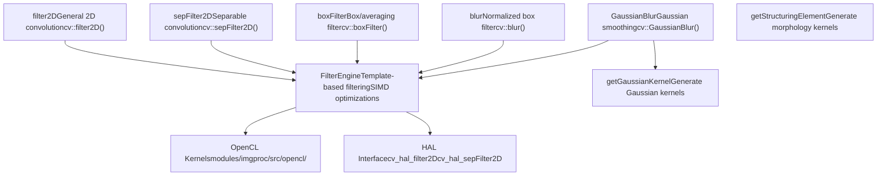
**Linear Filtering Architecture**

| Function | Signature | Key Parameters |
| --- | --- | --- |
| `filter2D` | `(src, dst, ddepth, kernel, anchor, delta, borderType)` | `ddepth`: output depth; `kernel`: convolution kernel |
| `sepFilter2D` | `(src, dst, ddepth, kernelX, kernelY, anchor, delta, borderType)` | Separable kernels for X and Y directions |
| `GaussianBlur` | `(src, dst, ksize, sigmaX, sigmaY, borderType)` | `ksize`: kernel size; `sigmaX/Y`: Gaussian sigma |
| `blur` | `(src, dst, ksize, anchor, borderType)` | Simple box averaging filter |

Sources: [modules/imgproc/src/filter.cpp](https://github.com/opencv/opencv/blob/91c78f50/modules/imgproc/src/filter.cpp) [modules/imgproc/src/opencl/filterSepRow.cl1-28](https://github.com/opencv/opencv/blob/91c78f50/modules/imgproc/src/opencl/filterSepRow.cl#L1-L28) [modules/imgproc/src/opencl/filterSepCol.cl1-28](https://github.com/opencv/opencv/blob/91c78f50/modules/imgproc/src/opencl/filterSepCol.cl#L1-L28)

### Non-Linear Filters

Non-linear filters cannot be expressed as convolution operations and require specialized algorithms.

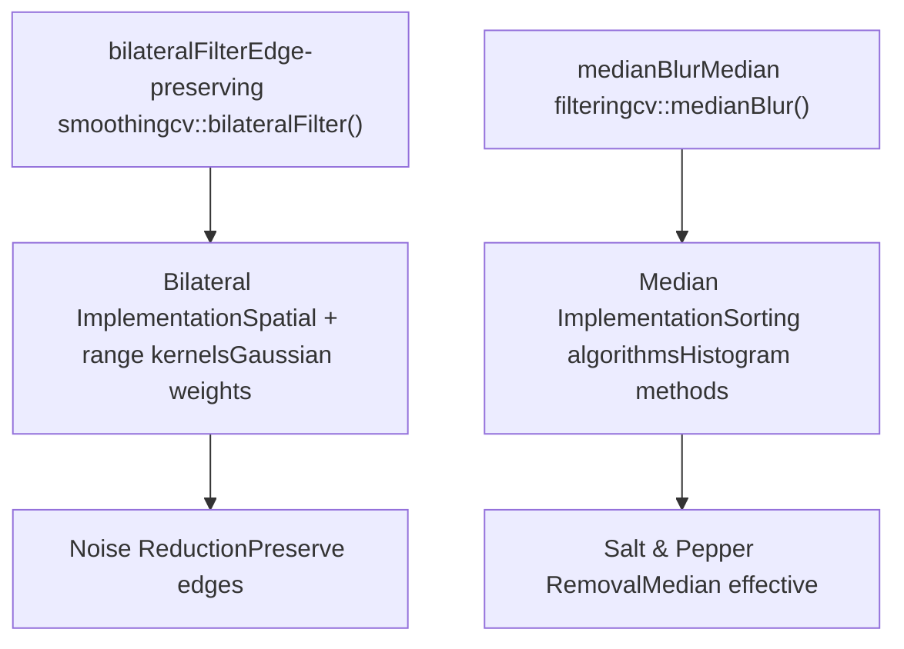
**Non-Linear Filtering Methods**

**Bilateral Filter**: Combines spatial proximity with intensity similarity to preserve edges while smoothing.

```
bilateralFilter(src, dst, d, sigmaColor, sigmaSpace, borderType)
```
-   `d`: Diameter of pixel neighborhood
-   `sigmaColor`: Filter sigma in color space
-   `sigmaSpace`: Filter sigma in coordinate space

**Median Filter**: Replaces each pixel with the median of its neighborhood, effective for impulse noise.

```
medianBlur(src, dst, ksize)
```
-   `ksize`: Aperture linear size (odd, greater than 1)

Sources: [modules/imgproc/src/filter.cpp](https://github.com/opencv/opencv/blob/91c78f50/modules/imgproc/src/filter.cpp)

### Morphological Operations

Morphological operations process images based on shapes, using structuring elements to probe the input image.

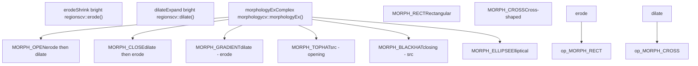
**Morphological Operations**

| Function | Purpose | Common Use |
| --- | --- | --- |
| `erode()` | Erodes bright regions | Remove small bright spots, separate objects |
| `dilate()` | Expands bright regions | Fill holes, connect nearby objects |
| `morphologyEx(MORPH_OPEN)` | Opening operation | Remove noise while preserving shapes |
| `morphologyEx(MORPH_CLOSE)` | Closing operation | Fill small holes in objects |
| `morphologyEx(MORPH_GRADIENT)` | Morphological gradient | Edge detection |

Sources: [modules/imgproc/src/opencl/morph.cl1-28](https://github.com/opencv/opencv/blob/91c78f50/modules/imgproc/src/opencl/morph.cl#L1-L28)

### Derivative Filters

Derivative filters compute gradients and edges by convolving with derivative kernels.

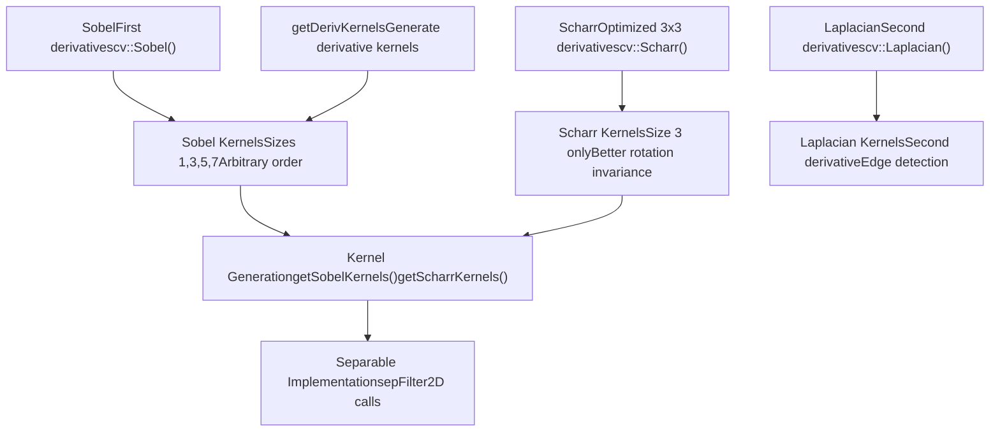
**Derivative Filtering Functions**

**Sobel Operator**: Computes image gradients using derivative of Gaussian approximation.

```
void Sobel(InputArray src, OutputArray dst, int ddepth,            int dx, int dy, int ksize=3, double scale=1,            double delta=0, int borderType=BORDER_DEFAULT)
```
-   `dx, dy`: Order of derivative (0, 1, or 2)
-   `ksize`: Kernel size (1, 3, 5, 7, or special -1 for Scharr)

**Scharr Operator**: 3×3 derivative filter with better rotational symmetry than Sobel.

```
void Scharr(InputArray src, OutputArray dst, int ddepth,            int dx, int dy, double scale=1, double delta=0,            int borderType=BORDER_DEFAULT)
```
**Laplacian Operator**: Second derivative filter for edge detection.

```
void Laplacian(InputArray src, OutputArray dst, int ddepth,               int ksize=1, double scale=1, double delta=0,               int borderType=BORDER_DEFAULT)
```
Sources: [modules/imgproc/src/deriv.cpp55-172](https://github.com/opencv/opencv/blob/91c78f50/modules/imgproc/src/deriv.cpp#L55-L172) [modules/imgproc/src/opencl/laplacian5.cl1-50](https://github.com/opencv/opencv/blob/91c78f50/modules/imgproc/src/opencl/laplacian5.cl#L1-L50)

## Color Space Conversions

Color space conversion transforms pixel representations between different color models. The `cvtColor` function provides a unified interface for all conversions, with the operation specified by a `ColorConversionCodes` enumeration.

### Color Conversion System Architecture

```mermaid
flowchart TD
    cvtColor["cvtColorcv::cvtColor()Unified conversion function"]
    cvtColorTwoPlane["cvtColorTwoPlanecv::cvtColorTwoPlane()YUV 4:2:0 formats"]
    RGB_Conversions["RGB/BGR FamilyCOLOR_BGR2RGBCOLOR_BGR2BGRACOLOR_BGR2GRAY"]
    HSV_Conversions["HSV/HLS FamilyCOLOR_BGR2HSVCOLOR_BGR2HLSCOLOR_HSV2BGR"]
    Lab_Conversions["Lab/Luv FamilyCOLOR_BGR2LabCOLOR_BGR2LuvCOLOR_Lab2BGR"]
    YUV_Conversions["YUV/YCrCb FamilyCOLOR_BGR2YUVCOLOR_BGR2YCrCbCOLOR_YUV2BGR"]
    XYZ_Conversions["XYZ FamilyCOLOR_BGR2XYZCOLOR_XYZ2BGR"]
    cvtColorBGR2BGR["cvtColorBGR2BGRRGB channel reordering"]
    cvtColorBGR2Gray["cvtColorBGR2GrayGrayscale conversion"]
    cvtColorBGR2HSV["cvtColorBGR2HSVHSV transformation"]
    cvtColorBGR2Lab["cvtColorBGR2LabLab transformation"]
    cvtColorBGR2YUV["cvtColorBGR2YUVYUV transformation"]

    cvtColor --> RGB_Conversions
    cvtColor --> HSV_Conversions
    cvtColor --> Lab_Conversions
    cvtColor --> YUV_Conversions
    cvtColor --> XYZ_Conversions
    RGB --> Conversions_cvtColorBGR2BGR
    RGB --> Conversions_cvtColorBGR2Gray
    HSV --> Conversions_cvtColorBGR2HSV
    Lab --> Conversions_cvtColorBGR2Lab
    YUV --> Conversions_cvtColorBGR2YUV
```
**Color Conversion Architecture**

The main conversion function signature:

```
void cvtColor(InputArray src, OutputArray dst, int code,               int dstCn=0, AlgorithmHint hint=cv::ALGO_HINT_DEFAULT)
```
Sources: [modules/imgproc/src/color.cpp192-387](https://github.com/opencv/opencv/blob/91c78f50/modules/imgproc/src/color.cpp#L192-L387)

### RGB and Grayscale Conversions

RGB/BGR conversions handle channel reordering and grayscale transformations.

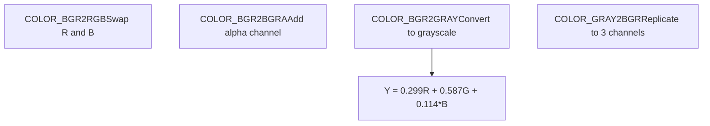
**RGB/Grayscale Conversion Codes**

| Conversion Code | Operation | Notes |
| --- | --- | --- |
| `COLOR_BGR2RGB` | Swap red and blue channels | No computation, just reordering |
| `COLOR_BGR2BGRA` | Add alpha channel | Sets alpha to 255 |
| `COLOR_BGR2GRAY` | Convert to grayscale | Uses ITU-R BT.601 coefficients |
| `COLOR_GRAY2BGR` | Replicate to RGB | Copies gray to all channels |

**Grayscale Conversion Formula**:

```
Y = 0.299 * R + 0.587 * G + 0.114 * B
```
Sources: [modules/imgproc/src/color.cpp208-241](https://github.com/opencv/opencv/blob/91c78f50/modules/imgproc/src/color.cpp#L208-L241)

### HSV and HLS Color Spaces

HSV (Hue, Saturation, Value) and HLS (Hue, Lightness, Saturation) are cylindrical color spaces useful for color-based segmentation.

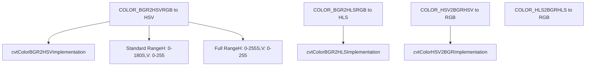
**HSV/HLS Conversion Codes**

| Conversion | Code | Hue Range | Notes |
| --- | --- | --- | --- |
| BGR to HSV | `COLOR_BGR2HSV` | 0-180 | Standard range |
| BGR to HSV | `COLOR_BGR2HSV_FULL` | 0-255 | Full range |
| BGR to HLS | `COLOR_BGR2HLS` | 0-180 | Standard range |
| HSV to BGR | `COLOR_HSV2BGR` | 0-180 | Inverse transform |

**HSV Color Space**: Separates chromatic content from intensity, with H representing hue angle, S saturation, and V brightness.

**HLS Color Space**: Similar to HSV but with L (lightness) instead of V (value), providing different perceptual properties.

Sources: [modules/imgproc/src/color.cpp268-286](https://github.com/opencv/opencv/blob/91c78f50/modules/imgproc/src/color.cpp#L268-L286)

### Lab and Luv Color Spaces

Lab and Luv are perceptually uniform color spaces designed to approximate human color perception.

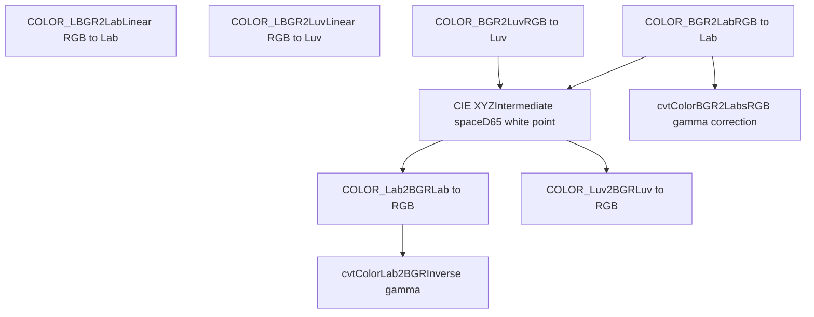
**Lab/Luv Conversion Codes**

| Conversion | Code | Color Space | Use Case |
| --- | --- | --- | --- |
| BGR to Lab | `COLOR_BGR2Lab` | CIE L*a*b\* | Perceptual color differences |
| BGR to Luv | `COLOR_BGR2Luv` | CIE L*u*v\* | Alternative perceptual space |
| Lab to BGR | `COLOR_Lab2BGR` | Inverse | Convert back to RGB |

**Lab Color Space**: L\* represents lightness (0-100), a\* green-red axis, b\* blue-yellow axis. Euclidean distance approximates perceptual difference.

**sRGB Variants**: The `LBGR` prefix indicates linear RGB input (no gamma correction applied).

Sources: [modules/imgproc/src/color.cpp288-306](https://github.com/opencv/opencv/blob/91c78f50/modules/imgproc/src/color.cpp#L288-L306)

### YUV and YCrCb Color Spaces

YUV and YCrCb separate luminance from chrominance, commonly used in video compression and broadcasting.


**YUV/YCrCb Conversion Codes**

| Conversion | Code | Format | Subsampling |
| --- | --- | --- | --- |
| BGR to YUV | `COLOR_BGR2YUV` | Packed | 4:4:4 |
| BGR to YCrCb | `COLOR_BGR2YCrCb` | Packed | 4:4:4 |
| YUV420p to BGR | `COLOR_YUV2BGR_I420` | Planar | 4:2:0 |
| YUV420sp to BGR | `COLOR_YUV2BGR_NV12` | Semi-planar | 4:2:0 |

**YCrCb Transformation**:

```
Y  = 0.299*R + 0.587*G + 0.114*B
Cr = (R-Y) * 0.713 + 128
Cb = (B-Y) * 0.564 + 128
```
**Multi-Plane Formats**: I420/YV12 store Y, U, and V in separate planes. NV12/NV21 store Y in one plane and interleaved UV in another.

Sources: [modules/imgproc/src/color.cpp248-375](https://github.com/opencv/opencv/blob/91c78f50/modules/imgproc/src/color.cpp#L248-L375)

### OpenCL Acceleration for Color Conversion

Color conversions can be accelerated using OpenCL when UMat inputs are used.

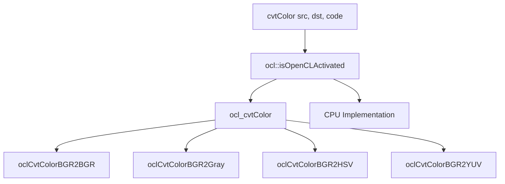
**OpenCL Color Conversion Acceleration**

When `_src` and `_dst` are UMat objects and OpenCL is available, conversions are accelerated on the GPU. The `ocl_cvtColor` function handles dispatch to specialized OpenCL kernels.

Sources: [modules/imgproc/src/color.cpp14-164](https://github.com/opencv/opencv/blob/91c78f50/modules/imgproc/src/color.cpp#L14-L164)

## Thresholding Operations

Thresholding converts grayscale or color images to binary images by comparing pixel values against threshold values. OpenCV provides basic, adaptive, and automatic thresholding methods.

### Thresholding System Architecture

```mermaid
flowchart TD
    threshold["thresholdcv::threshold()Basic thresholding"]
    adaptiveThreshold["adaptiveThresholdcv::adaptiveThreshold()Local adaptive threshold"]
    THRESH_BINARY["THRESH_BINARYval > thresh : maxval : 0"]
    THRESH_BINARY_INV["THRESH_BINARY_INVval > thresh : 0 : maxval"]
    THRESH_TRUNC["THRESH_TRUNCval > thresh : thresh : val"]
    THRESH_TOZERO["THRESH_TOZEROval > thresh : val : 0"]
    THRESH_TOZERO_INV["THRESH_TOZERO_INVval > thresh : 0 : val"]
    THRESH_OTSU["THRESH_OTSUOtsu's methodMinimize intra-class variance"]
    THRESH_TRIANGLE["THRESH_TRIANGLETriangle methodGeometric approach"]
    ADAPTIVE_THRESH_MEAN_C["ADAPTIVE_THRESH_MEAN_CMean of neighborhood"]
    ADAPTIVE_THRESH_GAUSSIAN_C["ADAPTIVE_THRESH_GAUSSIAN_CGaussian-weighted mean"]

    threshold --> THRESH_BINARY
    threshold --> THRESH_BINARY_INV
    threshold --> THRESH_TRUNC
    threshold --> THRESH_TOZERO
    threshold --> THRESH_TOZERO_INV
    threshold --> THRESH_OTSU
    threshold --> THRESH_TRIANGLE
    adaptiveThreshold --> ADAPTIVE_THRESH_MEAN_C
    adaptiveThreshold --> ADAPTIVE_THRESH_GAUSSIAN_C
```
**Thresholding Architecture**

Sources: [modules/imgproc/src/thresh.cpp50-178](https://github.com/opencv/opencv/blob/91c78f50/modules/imgproc/src/thresh.cpp#L50-L178)

### Basic Thresholding

The `threshold` function applies a fixed threshold to each pixel.

```
double threshold(InputArray src, OutputArray dst, double thresh,                 double maxval, int type)
```
**Threshold Type Operations**:

| Type | Formula | Description |
| --- | --- | --- |
| `THRESH_BINARY` | `dst(x,y) = src(x,y) > thresh ? maxval : 0` | Standard binary threshold |
| `THRESH_BINARY_INV` | `dst(x,y) = src(x,y) > thresh ? 0 : maxval` | Inverted binary threshold |
| `THRESH_TRUNC` | `dst(x,y) = src(x,y) > thresh ? thresh : src(x,y)` | Truncate at threshold |
| `THRESH_TOZERO` | `dst(x,y) = src(x,y) > thresh ? src(x,y) : 0` | Set to zero below threshold |
| `THRESH_TOZERO_INV` | `dst(x,y) = src(x,y) > thresh ? 0 : src(x,y)` | Set to zero above threshold |

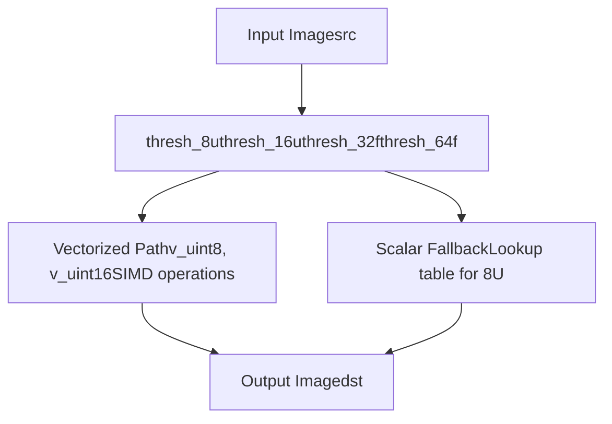
**Basic Threshold Implementation**

The implementation uses SIMD instructions when available for performance:

-   For `CV_8U`: Vectorized operations with lookup table fallback
-   For `CV_16U`: SIMD vectorization with 16-bit operations
-   For floating-point: Template-based generic implementation

Sources: [modules/imgproc/src/thresh.cpp182-390](https://github.com/opencv/opencv/blob/91c78f50/modules/imgproc/src/thresh.cpp#L182-L390)

### Automatic Threshold Selection

Automatic methods compute the optimal threshold value from the image histogram.

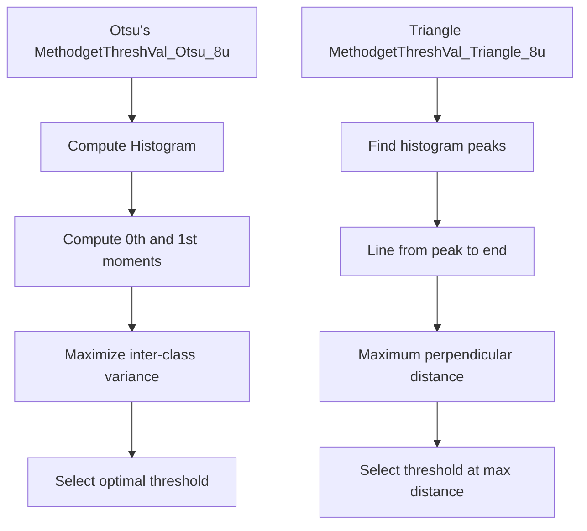
**Automatic Threshold Selection**

**Otsu's Method** (`THRESH_OTSU`): Finds the threshold that minimizes intra-class variance (equivalently, maximizes inter-class variance). Optimal for bimodal histograms.

**Triangle Method** (`THRESH_TRIANGLE`): Finds threshold by constructing a line from the histogram peak to the farthest end, selecting the point of maximum perpendicular distance.

Usage with automatic methods:

```
// Combine with threshold type using bitwise ORdouble otsu_thresh = threshold(src, dst, 0, 255, THRESH_BINARY | THRESH_OTSU);double tri_thresh = threshold(src, dst, 0, 255, THRESH_BINARY | THRESH_TRIANGLE);
```
Sources: [modules/imgproc/src/thresh.cpp690-890](https://github.com/opencv/opencv/blob/91c78f50/modules/imgproc/src/thresh.cpp#L690-L890)

### Adaptive Thresholding

Adaptive thresholding computes local thresholds for different regions of the image, handling varying illumination.

```
void adaptiveThreshold(InputArray src, OutputArray dst, double maxValue,                       int adaptiveMethod, int thresholdType,                       int blockSize, double C)
```
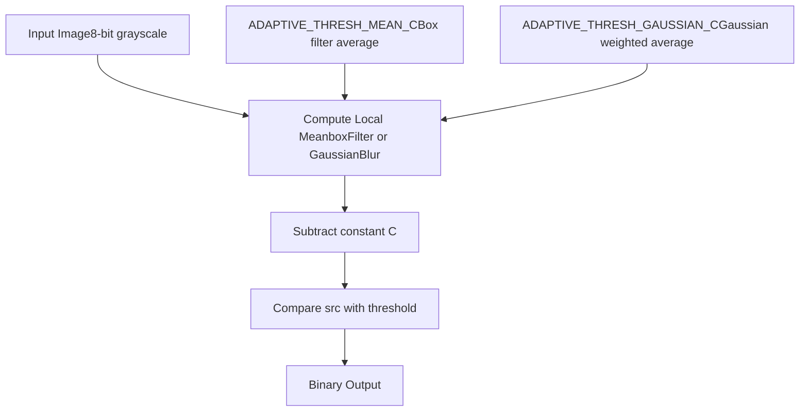
**Adaptive Threshold Methods**

| Method | Description | Computation |
| --- | --- | --- |
| `ADAPTIVE_THRESH_MEAN_C` | Mean of block | `T(x,y) = mean(neighborhood) - C` |
| `ADAPTIVE_THRESH_GAUSSIAN_C` | Gaussian-weighted mean | `T(x,y) = gaussian_mean(neighborhood) - C` |

**Parameters**:

-   `blockSize`: Size of pixel neighborhood (odd number)
-   `C`: Constant subtracted from computed mean

**Use Case**: Adaptive thresholding is essential for images with non-uniform illumination, where a single global threshold fails.

Sources: [modules/imgproc/src/thresh.cpp890-1000](https://github.com/opencv/opencv/blob/91c78f50/modules/imgproc/src/thresh.cpp#L890-L1000)

### Implementation Optimizations

Thresholding implementations use various optimization techniques for performance.

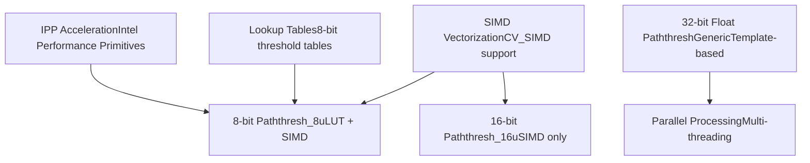
**Threshold Optimization Techniques**

**SIMD Vectorization**: Uses vector instructions (SSE, AVX, NEON) to process multiple pixels simultaneously. Implemented in [modules/imgproc/src/thresh.cpp250-323](https://github.com/opencv/opencv/blob/91c78f50/modules/imgproc/src/thresh.cpp#L250-L323)

**Lookup Tables**: For 8-bit images, precomputes threshold results in a 256-entry table for scalar fallback path.

**IPP Integration**: Uses Intel IPP library functions when available for maximum performance on Intel CPUs.

Sources: [modules/imgproc/src/thresh.cpp196-244](https://github.com/opencv/opencv/blob/91c78f50/modules/imgproc/src/thresh.cpp#L196-L244) [modules/imgproc/src/thresh.cpp392-520](https://github.com/opencv/opencv/blob/91c78f50/modules/imgproc/src/thresh.cpp#L392-L520)

## Integration with OpenCV Acceleration Systems

Filtering, color conversion, and thresholding operations integrate with OpenCV's acceleration infrastructure for optimal performance across different hardware platforms.

### Hardware Acceleration Layer Integration

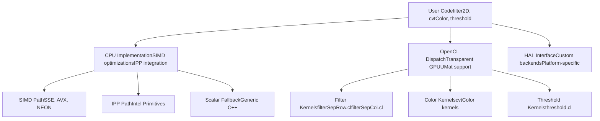
**Hardware Acceleration Integration**

Sources: [modules/imgproc/src/opencl/filterSepRow.cl1-28](https://github.com/opencv/opencv/blob/91c78f50/modules/imgproc/src/opencl/filterSepRow.cl#L1-L28) [modules/imgproc/src/opencl/filterSepCol.cl1-28](https://github.com/opencv/opencv/blob/91c78f50/modules/imgproc/src/opencl/filterSepCol.cl#L1-L28) [modules/imgproc/src/color.cpp14-164](https://github.com/opencv/opencv/blob/91c78f50/modules/imgproc/src/color.cpp#L14-L164)

### Performance Characteristics

Different operations have varying performance characteristics based on the implementation path.

| Operation Category | CPU Performance | OpenCL Benefit | Notes |
| --- | --- | --- | --- |
| **Linear Filtering** | High (SIMD) | High | Large kernels benefit most from GPU |
| **Separable Filters** | Very High | Medium | CPU SIMD very effective |
| **Color Conversion** | High | Medium | Memory bandwidth limited |
| **Thresholding** | Very High | Low | Simple operation, CPU sufficient |
| **Morphology** | Medium | High | Structuring element dependent |
| **Bilateral Filter** | Low | High | Computationally intensive |

**Optimization Guidelines**:

-   Use separable filters when possible (e.g., Gaussian)
-   For large images and complex operations, UMat enables transparent GPU acceleration
-   Simple operations (thresholding, channel operations) are often faster on CPU
-   Batch multiple operations to minimize CPU-GPU transfers

Sources: [modules/imgproc/src/filter.cpp](https://github.com/opencv/opencv/blob/91c78f50/modules/imgproc/src/filter.cpp) [modules/imgproc/src/thresh.cpp196-390](https://github.com/opencv/opencv/blob/91c78f50/modules/imgproc/src/thresh.cpp#L196-L390)

### Testing and Validation

The `imgproc` module includes comprehensive test suites for filtering, color conversion, and thresholding operations.

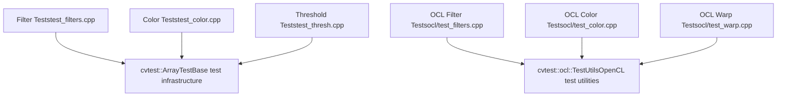
**Test Infrastructure**

The test suite validates:

-   **Correctness**: Output accuracy compared to reference implementations
-   **Border handling**: Correct behavior at image boundaries
-   **Data type support**: All supported depths and channel counts
-   **OpenCL parity**: GPU results match CPU results
-   **Performance**: Regression testing for optimization changes

Sources: [modules/imgproc/test/ocl/test\_filters.cpp1-126](https://github.com/opencv/opencv/blob/91c78f50/modules/imgproc/test/ocl/test_filters.cpp#L1-L126) [modules/imgproc/test/ocl/test\_color.cpp1-127](https://github.com/opencv/opencv/blob/91c78f50/modules/imgproc/test/ocl/test_color.cpp#L1-L127) [modules/imgproc/test/test\_thresh.cpp1-62](https://github.com/opencv/opencv/blob/91c78f50/modules/imgproc/test/test_thresh.cpp#L1-L62)

## Hardware Acceleration Integration

The `imgproc` module integrates with OpenCV's Hardware Acceleration Layer (HAL), providing transparent acceleration for supported operations while maintaining API consistency.

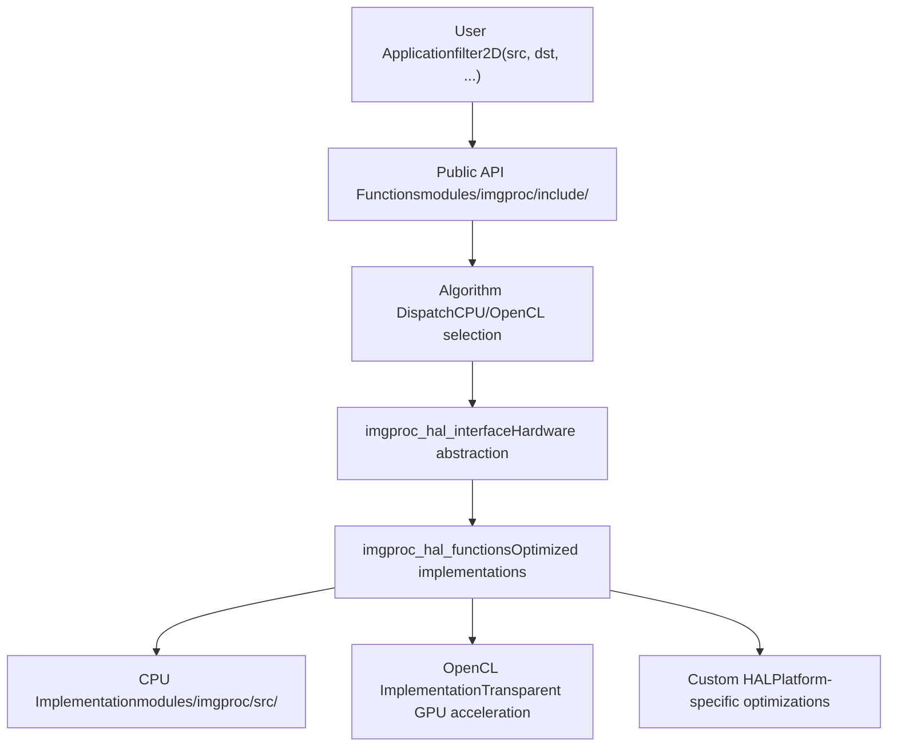
**Hardware Acceleration Architecture**

### HAL Integration Points

| Component | Purpose | Location |
| --- | --- | --- |
| `imgproc_hal_interface` | Hardware abstraction definitions | [modules/imgproc/include/opencv2/imgproc.hpp196](https://github.com/opencv/opencv/blob/91c78f50/modules/imgproc/include/opencv2/imgproc.hpp#L196-L196) |
| `imgproc_hal_functions` | Optimized function implementations | Implementation files |
| **Dispatch Logic** | Runtime backend selection | Internal algorithm routing |
| **Fallback System** | CPU implementation guarantee | Always available baseline |

The HAL system allows the same API calls to transparently utilize:

-   **CPU optimizations** (SIMD, vectorization)
-   **OpenCL acceleration** (GPU computing)
-   **Custom HAL implementations** (vendor-specific optimizations)

Sources: [modules/imgproc/include/opencv2/imgproc.hpp193-197](https://github.com/opencv/opencv/blob/91c78f50/modules/imgproc/include/opencv2/imgproc.hpp#L193-L197) [modules/core/include/opencv2/core.hpp](https://github.com/opencv/opencv/blob/91c78f50/modules/core/include/opencv2/core.hpp)
