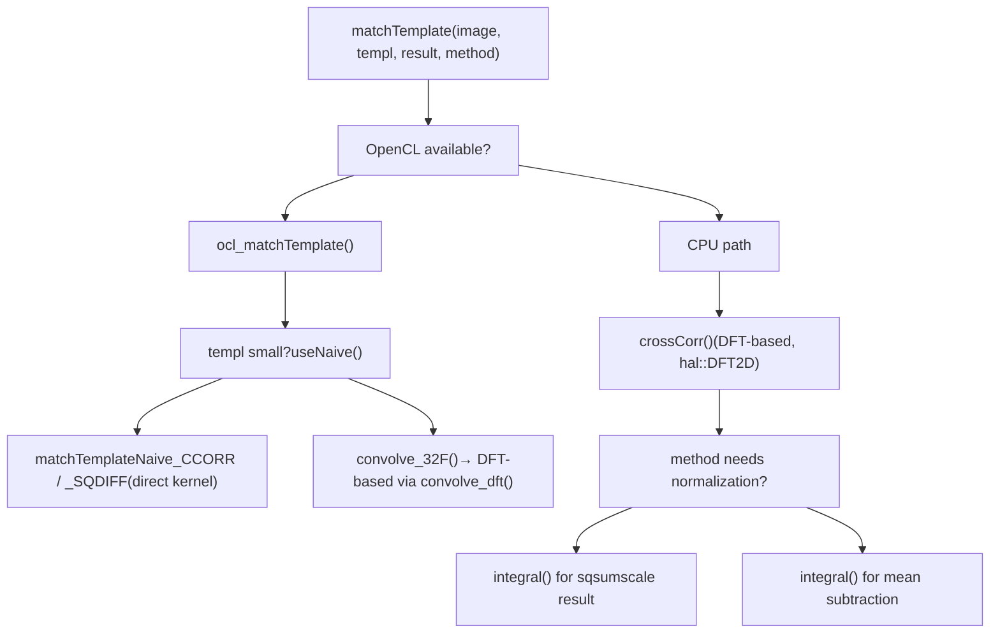
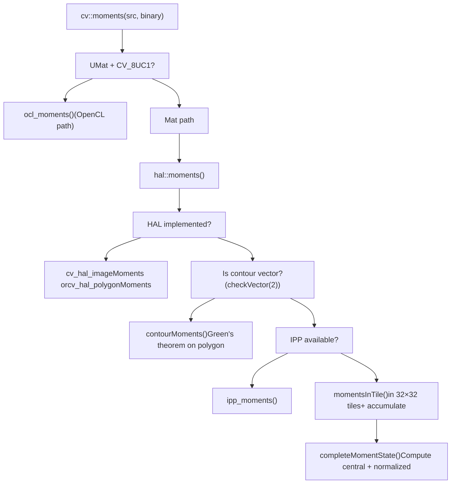
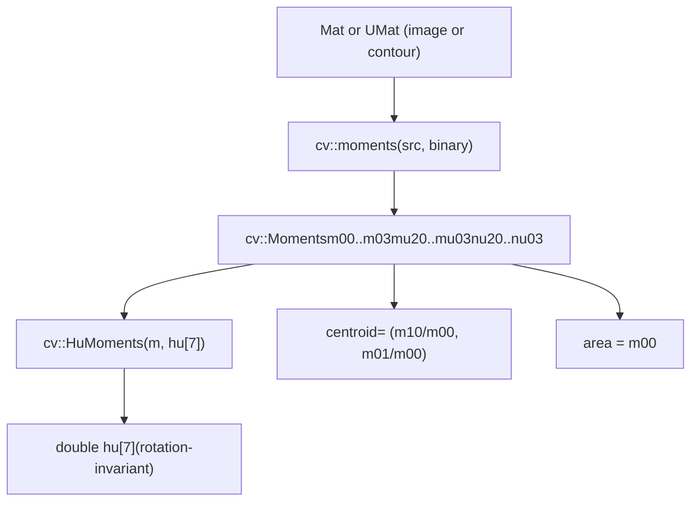
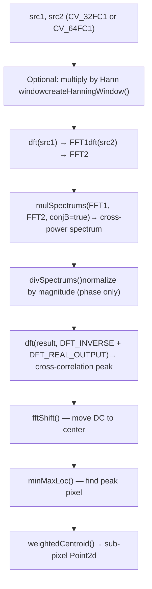

# Thresholding, Template Matching, and Moments

Relevant source files

-   [modules/core/src/opencl/convert.cl](https://github.com/opencv/opencv/blob/91c78f50/modules/core/src/opencl/convert.cl)
-   [modules/core/src/opencl/copymakeborder.cl](https://github.com/opencv/opencv/blob/91c78f50/modules/core/src/opencl/copymakeborder.cl)
-   [modules/core/test/ocl/test\_matrix\_operation.cpp](https://github.com/opencv/opencv/blob/91c78f50/modules/core/test/ocl/test_matrix_operation.cpp)
-   [modules/imgproc/perf/opencl/perf\_blend.cpp](https://github.com/opencv/opencv/blob/91c78f50/modules/imgproc/perf/opencl/perf_blend.cpp)
-   [modules/imgproc/perf/opencl/perf\_filters.cpp](https://github.com/opencv/opencv/blob/91c78f50/modules/imgproc/perf/opencl/perf_filters.cpp)
-   [modules/imgproc/perf/opencl/perf\_imgproc.cpp](https://github.com/opencv/opencv/blob/91c78f50/modules/imgproc/perf/opencl/perf_imgproc.cpp)
-   [modules/imgproc/perf/opencl/perf\_matchTemplate.cpp](https://github.com/opencv/opencv/blob/91c78f50/modules/imgproc/perf/opencl/perf_matchTemplate.cpp)
-   [modules/imgproc/perf/perf\_phasecorr.cpp](https://github.com/opencv/opencv/blob/91c78f50/modules/imgproc/perf/perf_phasecorr.cpp)
-   [modules/imgproc/src/blend.cpp](https://github.com/opencv/opencv/blob/91c78f50/modules/imgproc/src/blend.cpp)
-   [modules/imgproc/src/filterengine.hpp](https://github.com/opencv/opencv/blob/91c78f50/modules/imgproc/src/filterengine.hpp)
-   [modules/imgproc/src/moments.cpp](https://github.com/opencv/opencv/blob/91c78f50/modules/imgproc/src/moments.cpp)
-   [modules/imgproc/src/opencl/accumulate.cl](https://github.com/opencv/opencv/blob/91c78f50/modules/imgproc/src/opencl/accumulate.cl)
-   [modules/imgproc/src/opencl/blend\_linear.cl](https://github.com/opencv/opencv/blob/91c78f50/modules/imgproc/src/opencl/blend_linear.cl)
-   [modules/imgproc/src/opencl/boxFilter.cl](https://github.com/opencv/opencv/blob/91c78f50/modules/imgproc/src/opencl/boxFilter.cl)
-   [modules/imgproc/src/opencl/boxFilter3x3.cl](https://github.com/opencv/opencv/blob/91c78f50/modules/imgproc/src/opencl/boxFilter3x3.cl)
-   [modules/imgproc/src/opencl/calc\_back\_project.cl](https://github.com/opencv/opencv/blob/91c78f50/modules/imgproc/src/opencl/calc_back_project.cl)
-   [modules/imgproc/src/opencl/canny.cl](https://github.com/opencv/opencv/blob/91c78f50/modules/imgproc/src/opencl/canny.cl)
-   [modules/imgproc/src/opencl/filter2D.cl](https://github.com/opencv/opencv/blob/91c78f50/modules/imgproc/src/opencl/filter2D.cl)
-   [modules/imgproc/src/opencl/integral\_sum.cl](https://github.com/opencv/opencv/blob/91c78f50/modules/imgproc/src/opencl/integral_sum.cl)
-   [modules/imgproc/src/opencl/match\_template.cl](https://github.com/opencv/opencv/blob/91c78f50/modules/imgproc/src/opencl/match_template.cl)
-   [modules/imgproc/src/opencl/medianFilter.cl](https://github.com/opencv/opencv/blob/91c78f50/modules/imgproc/src/opencl/medianFilter.cl)
-   [modules/imgproc/src/opencl/moments.cl](https://github.com/opencv/opencv/blob/91c78f50/modules/imgproc/src/opencl/moments.cl)
-   [modules/imgproc/src/phasecorr.cpp](https://github.com/opencv/opencv/blob/91c78f50/modules/imgproc/src/phasecorr.cpp)
-   [modules/imgproc/src/templmatch.cpp](https://github.com/opencv/opencv/blob/91c78f50/modules/imgproc/src/templmatch.cpp)
-   [modules/imgproc/src/thresh.cpp](https://github.com/opencv/opencv/blob/91c78f50/modules/imgproc/src/thresh.cpp)
-   [modules/imgproc/test/ocl/test\_accumulate.cpp](https://github.com/opencv/opencv/blob/91c78f50/modules/imgproc/test/ocl/test_accumulate.cpp)
-   [modules/imgproc/test/ocl/test\_blend.cpp](https://github.com/opencv/opencv/blob/91c78f50/modules/imgproc/test/ocl/test_blend.cpp)
-   [modules/imgproc/test/ocl/test\_boxfilter.cpp](https://github.com/opencv/opencv/blob/91c78f50/modules/imgproc/test/ocl/test_boxfilter.cpp)
-   [modules/imgproc/test/ocl/test\_canny.cpp](https://github.com/opencv/opencv/blob/91c78f50/modules/imgproc/test/ocl/test_canny.cpp)
-   [modules/imgproc/test/ocl/test\_filter2d.cpp](https://github.com/opencv/opencv/blob/91c78f50/modules/imgproc/test/ocl/test_filter2d.cpp)
-   [modules/imgproc/test/ocl/test\_histogram.cpp](https://github.com/opencv/opencv/blob/91c78f50/modules/imgproc/test/ocl/test_histogram.cpp)
-   [modules/imgproc/test/ocl/test\_imgproc.cpp](https://github.com/opencv/opencv/blob/91c78f50/modules/imgproc/test/ocl/test_imgproc.cpp)
-   [modules/imgproc/test/ocl/test\_match\_template.cpp](https://github.com/opencv/opencv/blob/91c78f50/modules/imgproc/test/ocl/test_match_template.cpp)
-   [modules/imgproc/test/ocl/test\_medianfilter.cpp](https://github.com/opencv/opencv/blob/91c78f50/modules/imgproc/test/ocl/test_medianfilter.cpp)
-   [modules/imgproc/test/ocl/test\_sepfilter2d.cpp](https://github.com/opencv/opencv/blob/91c78f50/modules/imgproc/test/ocl/test_sepfilter2d.cpp)
-   [modules/imgproc/test/test\_canny.cpp](https://github.com/opencv/opencv/blob/91c78f50/modules/imgproc/test/test_canny.cpp)
-   [modules/imgproc/test/test\_moments.cpp](https://github.com/opencv/opencv/blob/91c78f50/modules/imgproc/test/test_moments.cpp)
-   [modules/imgproc/test/test\_pc.cpp](https://github.com/opencv/opencv/blob/91c78f50/modules/imgproc/test/test_pc.cpp)
-   [modules/imgproc/test/test\_templmatch.cpp](https://github.com/opencv/opencv/blob/91c78f50/modules/imgproc/test/test_templmatch.cpp)
-   [modules/imgproc/test/test\_templmatchmask.cpp](https://github.com/opencv/opencv/blob/91c78f50/modules/imgproc/test/test_templmatchmask.cpp)
-   [modules/imgproc/test/test\_thresh.cpp](https://github.com/opencv/opencv/blob/91c78f50/modules/imgproc/test/test_thresh.cpp)

This page covers three related pixel-level and region-level analysis subsystems in `opencv_imgproc`: the `threshold` function (including Otsu automatic threshold selection), the `matchTemplate` function (all six comparison methods), the `moments` and `HuMoments` functions, and `phaseCorrelate` for sub-pixel image registration. All are part of the `imgproc` module.

For filtering and color conversion (Canny, Gaussian blur, etc.), see [4.2](/opencv/opencv/4.2-filtering-and-color-conversion). For contour finding and structural analysis that consumes moment output, see [4.4](/opencv/opencv/4.4-drawing-contours-and-structural-analysis).

---

## Thresholding

### Overview

The entry point is `cv::threshold`, implemented in [modules/imgproc/src/thresh.cpp](https://github.com/opencv/opencv/blob/91c78f50/modules/imgproc/src/thresh.cpp) It classifies every pixel in a source image against a scalar threshold value and writes the result to a destination image of the same type.

The function signature is:

```
double cv::threshold(InputArray src, OutputArray dst,
                     double thresh, double maxval, int type)
```
The `type` parameter is a combination of a base threshold type and optional flags (`THRESH_OTSU`, `THRESH_TRIANGLE`). The return value is the computed threshold when Otsu or Triangle mode is active; otherwise it echoes the input `thresh`.

### Threshold Types

| Constant | Pixel rule | Applies to |
| --- | --- | --- |
| `THRESH_BINARY` | `dst = src > thresh ? maxval : 0` | All supported depths |
| `THRESH_BINARY_INV` | `dst = src <= thresh ? maxval : 0` | All supported depths |
| `THRESH_TRUNC` | `dst = min(src, thresh)` | All supported depths |
| `THRESH_TOZERO` | `dst = src > thresh ? src : 0` | All supported depths |
| `THRESH_TOZERO_INV` | `dst = src <= thresh ? src : 0` | All supported depths |

The per-pixel logic is implemented by the inline templates `threshBinary`, `threshBinaryInv`, `threshTrunc`, `threshToZero`, and `threshToZeroInv` at [modules/imgproc/src/thresh.cpp51-78](https://github.com/opencv/opencv/blob/91c78f50/modules/imgproc/src/thresh.cpp#L51-L78)

### Supported Data Types and Dispatch

The top-level dispatcher (around [modules/imgproc/src/thresh.cpp1040-1130](https://github.com/opencv/opencv/blob/91c78f50/modules/imgproc/src/thresh.cpp#L1040-L1130)) routes to one of five type-specific internal functions:

-   `thresh_8u` — `uchar`, uses a 256-entry lookup table for scalar fallback; SIMD-accelerated
-   `thresh_16u` — `ushort`, SIMD-accelerated
-   `thresh_16s` — `short`, SIMD-accelerated with IPP fast path
-   `thresh_32f` — `float`, SIMD-accelerated with IPP fast path
-   `thresh_64f` — `double`, SIMD-accelerated where available

For `uchar`, the scalar fallback precomputes a 256-entry lookup table (see [modules/imgproc/src/thresh.cpp328-389](https://github.com/opencv/opencv/blob/91c78f50/modules/imgproc/src/thresh.cpp#L328-L389)), allowing a single table lookup per pixel without a branch.

SIMD paths use the universal intrinsics layer (`v_uint8`, `v_int16`, `v_float32`, etc.) so the same source compiles to SSE, AVX, NEON, or RVV depending on the build target. See page [3.5](/opencv/opencv/3.5-simd-intrinsics-and-cpu-dispatching) for the intrinsics abstraction.

### Otsu Automatic Threshold Selection

When `type` includes `THRESH_OTSU`, the threshold value is computed automatically from the image histogram before applying the threshold operation. This mode is restricted to `CV_8U` and `CV_16U` single-channel inputs.

The Otsu algorithm maximizes the inter-class variance between the foreground and background pixel classes. The implementation scans the histogram and finds the intensity `t` that maximizes:

```
sigma²_B(t) = q1(t) * q2(t) * (mu1(t) - mu2(t))²
```
The computed `t` is returned as the function's return value and is then applied with the selected base threshold type.

**Triangle method** (`THRESH_TRIANGLE`) is an alternative automatic mode for unimodal histograms, selecting the threshold by maximum perpendicular distance from the histogram curve to the line connecting histogram ends.

Sources: [modules/imgproc/src/thresh.cpp1040-1400](https://github.com/opencv/opencv/blob/91c78f50/modules/imgproc/src/thresh.cpp#L1040-L1400) [modules/imgproc/test/test\_thresh.cpp142-189](https://github.com/opencv/opencv/blob/91c78f50/modules/imgproc/test/test_thresh.cpp#L142-L189)

### OpenCL Acceleration

When the input is a `UMat`, the function attempts an OpenCL path before falling back to CPU. The OpenCL kernel is compiled from `thresh.cl` (referenced as `opencl_kernels_imgproc.hpp`) and handles the same five threshold types in parallel across work items.

---

## Template Matching

### Overview

`cv::matchTemplate` slides a template image over a source image and computes a comparison score at every valid position. The result is a single-channel `CV_32F` matrix of size `(W - w + 1) × (H - h + 1)` where `W×H` is the image size and `w×h` is the template size.

Implementation: [modules/imgproc/src/templmatch.cpp](https://github.com/opencv/opencv/blob/91c78f50/modules/imgproc/src/templmatch.cpp)

```
void cv::matchTemplate(InputArray image, InputArray templ,
                       OutputArray result, int method,
                       InputArray mask = noArray())
```
### Comparison Methods

| Constant | Value | Formula | Best match |
| --- | --- | --- | --- |
| `TM_SQDIFF` | 0 | `Σ(I(x,y) - T(x,y))²` | Minimum |
| `TM_SQDIFF_NORMED` | 1 | normalized squared difference | Minimum → 0 |
| `TM_CCORR` | 2 | `Σ I(x,y)·T(x,y)` | Maximum |
| `TM_CCORR_NORMED` | 3 | normalized cross-correlation | Maximum → 1 |
| `TM_CCOEFF` | 4 | `Σ (I - Ī)·(T - T̄)` | Maximum |
| `TM_CCOEFF_NORMED` | 5 | normalized coefficient | Maximum → 1 |

### Computation Strategy: DFT vs. Naive

**Diagram: matchTemplate computation flow**


Sources: [modules/imgproc/src/templmatch.cpp111-560](https://github.com/opencv/opencv/blob/91c78f50/modules/imgproc/src/templmatch.cpp#L111-L560)

The core DFT-based convolution function is `crossCorr` ([modules/imgproc/src/templmatch.cpp566-760](https://github.com/opencv/opencv/blob/91c78f50/modules/imgproc/src/templmatch.cpp#L566-L760)). It:

1.  Computes the DFT of the template (per channel).
2.  Processes the image in tiles using `hal::DFT2D` objects (`cF` for forward, `cR` for inverse).
3.  Multiplies spectra with `mulSpectrums` (conjugate multiplication gives cross-correlation).
4.  Accumulates the real output into the result matrix.

The block size is derived from the template size scaled by `blockScale = 4.5` with a minimum of 256 pixels, rounded to an optimal DFT size via `getOptimalDFTSize`.

### Normalization via Integral Images

Normed methods require computing `Σ I²` under each template window. This is done once using `integral()` to build a squared-sum integral image. For any window position `(x, y)`, the window sum of squares is retrieved via four lookups into the integral image.

For `TM_CCOEFF` and its normed variant, the image mean under the window is also subtracted using the sum integral image.

### Masked Template Matching

When a `mask` is provided, `matchTemplateMask` ([modules/imgproc/src/templmatch.cpp762-870](https://github.com/opencv/opencv/blob/91c78f50/modules/imgproc/src/templmatch.cpp#L762-L870)) handles the computation separately. Masked matching:

-   Converts all inputs to `CV_32F`.
-   Applies element-wise masking to both the image patch and the template before computing per-method scores.
-   Does not use the OpenCL path (falls back to CPU).

### OpenCL Kernel Details

The OpenCL kernels are in [modules/imgproc/src/opencl/match\_template.cl](https://github.com/opencv/opencv/blob/91c78f50/modules/imgproc/src/opencl/match_template.cl) They are compiled conditionally using preprocessor flags:

| Compile flag | Kernel | Purpose |
| --- | --- | --- |
| `CCORR` | `matchTemplate_Naive_CCORR` | Direct CCORR for small templates |
| `CCORR_NORMED` | `matchTemplate_CCORR_NORMED` | Normalize via sqsum lookup |
| `SQDIFF` | `matchTemplate_Naive_SQDIFF` | Direct SQDIFF for small templates |
| `SQDIFF_PREPARED` | `matchTemplate_Prepared_SQDIFF` | SQDIFF from precomputed CCORR |
| `SQDIFF_NORMED` | `matchTemplate_SQDIFF_NORMED` | Normalize SQDIFF |
| `CCOEFF` | `matchTemplate_Prepared_CCOEFF` | Subtract mean from CCORR |
| `CCOEFF_NORMED` | `matchTemplate_CCOEFF_NORMED` | Full normalized CCOEFF |
| `CALC_SUM` | `calcSum` | Sum template pixels (for sqsum) |

For non-naive methods, the GPU path first calls `matchTemplate(..., TM_CCORR)` to compute the cross-correlation, then applies a second kernel to perform normalization or mean subtraction.

Sources: [modules/imgproc/src/templmatch.cpp543-560](https://github.com/opencv/opencv/blob/91c78f50/modules/imgproc/src/templmatch.cpp#L543-L560) [modules/imgproc/src/opencl/match\_template.cl77-450](https://github.com/opencv/opencv/blob/91c78f50/modules/imgproc/src/opencl/match_template.cl#L77-L450)

---

## Image Moments

### The `Moments` Struct

`cv::Moments` ([modules/imgproc/src/moments.cpp360-395](https://github.com/opencv/opencv/blob/91c78f50/modules/imgproc/src/moments.cpp#L360-L395)) holds:

-   **Spatial moments** `m00`, `m10`, `m01`, `m20`, `m11`, `m02`, `m30`, `m21`, `m12`, `m03`
-   **Central moments** `mu20`, `mu11`, `mu02`, `mu30`, `mu21`, `mu12`, `mu03`
-   **Normalized central moments** `nu20`, `nu11`, `nu02`, `nu30`, `nu21`, `nu12`, `nu03`

Spatial moment of order `(p, q)` is defined as:

```
m_pq = Σ_x Σ_y x^p · y^q · I(x, y)
```
Central moments are translation-invariant, computed relative to the centroid `(cx, cy) = (m10/m00, m01/m00)`. Normalized central moments are additionally scale-invariant, divided by `m00^((p+q)/2+1)`.

### `cv::moments()` — Dispatch Chain

**Diagram: moments() execution dispatch**


Sources: [modules/imgproc/src/moments.cpp595-706](https://github.com/opencv/opencv/blob/91c78f50/modules/imgproc/src/moments.cpp#L595-L706)

### Tiled Raster Computation

For raster images, `cv::moments` processes the image in 32×32 pixel tiles to keep intermediate values in cache. The `momentsInTile` template function ([modules/imgproc/src/moments.cpp314-356](https://github.com/opencv/opencv/blob/91c78f50/modules/imgproc/src/moments.cpp#L314-L356)) computes the 10 raw spatial moments within each tile using row-by-row summation, with `MomentsInTile_SIMD` specializations providing SIMD acceleration for `uchar` and `ushort` inputs.

After each tile, the per-tile moments are accumulated into global moments using polynomial offsets to account for the tile's `(x, y)` origin. The accumulation formulas (e.g., `m10_global = m10_tile + x * m00_tile`) are applied for all 10 moments at [modules/imgproc/src/moments.cpp668-700](https://github.com/opencv/opencv/blob/91c78f50/modules/imgproc/src/moments.cpp#L668-L700)

The function `completeMomentState` ([modules/imgproc/src/moments.cpp50-91](https://github.com/opencv/opencv/blob/91c78f50/modules/imgproc/src/moments.cpp#L50-L91)) derives the central and normalized moments from the spatial moments once all tiles are accumulated.

### Contour Moments

When the input to `cv::moments` is a contour (a vector of 2D points, detected via `checkVector(2)`), the function calls `contourMoments` ([modules/imgproc/src/moments.cpp95-200](https://github.com/opencv/opencv/blob/91c78f50/modules/imgproc/src/moments.cpp#L95-L200)). This applies Green's theorem to compute exact moments from the polygon boundary without rasterization. Both integer (`CV_32S`) and float (`CV_32F`) point types are handled.

### OpenCL Moments

The OpenCL path (`ocl_moments`, [modules/imgproc/src/moments.cpp399-472](https://github.com/opencv/opencv/blob/91c78f50/modules/imgproc/src/moments.cpp#L399-L472)) divides the image into 32×32 tiles, each processed by a single work group in the kernel at [modules/imgproc/src/opencl/moments.cl](https://github.com/opencv/opencv/blob/91c78f50/modules/imgproc/src/opencl/moments.cl) Each group writes 10 `int` accumulator values to a buffer. The CPU then reads the buffer and accumulates the per-tile contributions with the same polynomial offset logic used in the CPU tiled path.

### `cv::HuMoments`

`HuMoments` ([modules/imgproc/src/moments.cpp709-746](https://github.com/opencv/opencv/blob/91c78f50/modules/imgproc/src/moments.cpp#L709-L746)) derives seven rotation-invariant descriptors from the normalized central moments. These are the classical Hu invariant moments. The function accepts a `Moments` struct and writes to a `double[7]` array or `OutputArray`.

The seven Hu moments are computed from combinations of `nu20`, `nu11`, `nu02`, `nu30`, `nu21`, `nu12`, `nu03`. They are invariant to translation, scale, and rotation, making them useful for shape recognition regardless of pose.

**Diagram: Moments API and data flow**


Sources: [modules/imgproc/src/moments.cpp709-746](https://github.com/opencv/opencv/blob/91c78f50/modules/imgproc/src/moments.cpp#L709-L746) [modules/imgproc/src/moments.cpp360-395](https://github.com/opencv/opencv/blob/91c78f50/modules/imgproc/src/moments.cpp#L360-L395)

---

## Phase Correlation

### Overview

`cv::phaseCorrelate` ([modules/imgproc/src/phasecorr.cpp519-620](https://github.com/opencv/opencv/blob/91c78f50/modules/imgproc/src/phasecorr.cpp#L519-L620)) estimates the translational shift between two images at sub-pixel precision using the phase correlation algorithm.

```
Point2d cv::phaseCorrelate(InputArray src1, InputArray src2,
                            InputArray window = noArray(),
                            double* response = nullptr)
```
Both inputs must be `CV_32FC1` or `CV_64FC1`. An optional Hann window can be pre-computed with `createHanningWindow` and passed as `window` to suppress spectral leakage.

### Algorithm

**Diagram: phaseCorrelate pipeline**


Sources: [modules/imgproc/src/phasecorr.cpp519-620](https://github.com/opencv/opencv/blob/91c78f50/modules/imgproc/src/phasecorr.cpp#L519-L620)

### Key Helper Functions

| Function | File | Purpose |
| --- | --- | --- |
| `divSpectrums` | [phasecorr.cpp162-357](https://github.com/opencv/opencv/blob/91c78f50/phasecorr.cpp#L162-L357) | Element-wise complex division; normalizes cross-power spectrum to unit magnitude |
| `fftShift` | [phasecorr.cpp360-435](https://github.com/opencv/opencv/blob/91c78f50/phasecorr.cpp#L360-L435) | Rearranges quadrants to put DC at center of the spectrum array |
| `weightedCentroid` | [phasecorr.cpp437-515](https://github.com/opencv/opencv/blob/91c78f50/phasecorr.cpp#L437-L515) | Computes intensity-weighted centroid in a neighborhood around the peak; returns sub-pixel location and optional response strength |
| `magSpectrums` | [phasecorr.cpp46-160](https://github.com/opencv/opencv/blob/91c78f50/phasecorr.cpp#L46-L160) | Computes magnitude of a complex spectrum (used internally) |

`divSpectrums` adds `FLT_EPSILON` or `DBL_EPSILON` to the denominator to prevent division by zero. For the conjugate case (`conjB=true`), which is used in phase correlation, it computes `(A · conj(B)) / |A · conj(B)|`.

The `weightedCentroid` function clips the search box to image bounds and computes:

```
centroid.x = Σ x·I(x,y) / Σ I(x,y)
centroid.y = Σ y·I(x,y) / Σ I(x,y)
```
over a small neighborhood around the detected peak, providing the sub-pixel shift estimate.

---

## Acceleration Summary

| Function | CPU SIMD | IPP | OpenCL |
| --- | --- | --- | --- |
| `threshold` (8u) | Yes — `thresh_8u` | Partial (TRUNC, TOZERO) | Yes |
| `threshold` (16s/32f) | Yes | Partial | Yes |
| `matchTemplate` (all methods) | No (uses DFT) | No | Yes — 6 kernels in `match_template.cl` |
| `moments` (CV\_8UC1) | Yes (SIMD tile) | Yes | Yes — `moments.cl` |
| `moments` (other) | Yes (SIMD tile) | Partial | No |
| `phaseCorrelate` | Inherits from `dft` | Inherits | No direct kernel |

Sources: [modules/imgproc/src/thresh.cpp196-244](https://github.com/opencv/opencv/blob/91c78f50/modules/imgproc/src/thresh.cpp#L196-L244) [modules/imgproc/src/templmatch.cpp543-560](https://github.com/opencv/opencv/blob/91c78f50/modules/imgproc/src/templmatch.cpp#L543-L560) [modules/imgproc/src/moments.cpp609-637](https://github.com/opencv/opencv/blob/91c78f50/modules/imgproc/src/moments.cpp#L609-L637)
