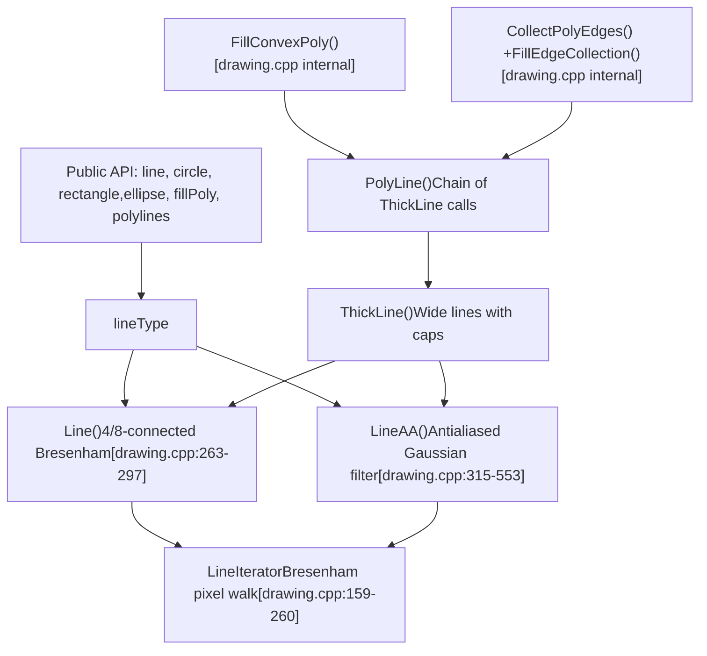
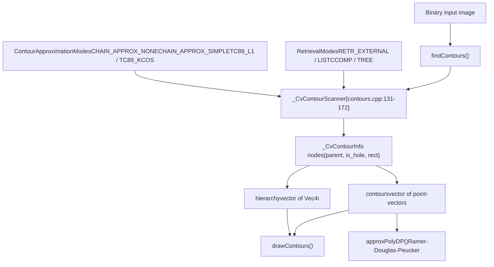
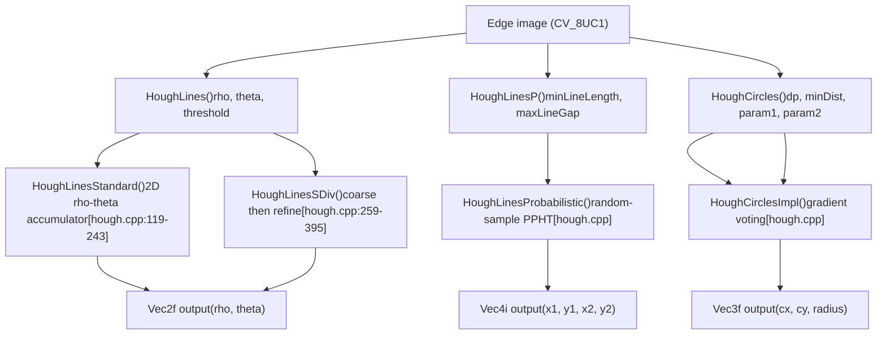
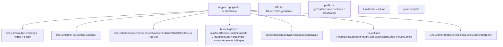

# Drawing, Contours, and Structural Analysis

Relevant source files

-   [cmake/OpenCVBindingsPreprocessorDefinitions.cmake](https://github.com/opencv/opencv/blob/91c78f50/cmake/OpenCVBindingsPreprocessorDefinitions.cmake)
-   [cmake/platforms/OpenCV-Emscripten.cmake](https://github.com/opencv/opencv/blob/91c78f50/cmake/platforms/OpenCV-Emscripten.cmake)
-   [cmake/vars/EnableModeVars.cmake](https://github.com/opencv/opencv/blob/91c78f50/cmake/vars/EnableModeVars.cmake)
-   [cmake/vars/OPENCV\_SEMIHOSTING.cmake](https://github.com/opencv/opencv/blob/91c78f50/cmake/vars/OPENCV_SEMIHOSTING.cmake)
-   [doc/js\_tutorials/js\_setup/js\_setup/js\_setup.markdown](https://github.com/opencv/opencv/blob/91c78f50/doc/js_tutorials/js_setup/js_setup/js_setup.markdown?plain=1)
-   [doc/opencv.bib](https://github.com/opencv/opencv/blob/91c78f50/doc/opencv.bib)
-   [modules/calib3d/doc/calib3d.bib](https://github.com/opencv/opencv/blob/91c78f50/modules/calib3d/doc/calib3d.bib)
-   [modules/calib3d/doc/solvePnP.markdown](https://github.com/opencv/opencv/blob/91c78f50/modules/calib3d/doc/solvePnP.markdown?plain=1)
-   [modules/calib3d/include/opencv2/calib3d.hpp](https://github.com/opencv/opencv/blob/91c78f50/modules/calib3d/include/opencv2/calib3d.hpp)
-   [modules/calib3d/misc/js/gen\_dict.json](https://github.com/opencv/opencv/blob/91c78f50/modules/calib3d/misc/js/gen_dict.json)
-   [modules/calib3d/perf/perf\_pnp.cpp](https://github.com/opencv/opencv/blob/91c78f50/modules/calib3d/perf/perf_pnp.cpp)
-   [modules/calib3d/perf/perf\_stereosgbm.cpp](https://github.com/opencv/opencv/blob/91c78f50/modules/calib3d/perf/perf_stereosgbm.cpp)
-   [modules/calib3d/src/ap3p.cpp](https://github.com/opencv/opencv/blob/91c78f50/modules/calib3d/src/ap3p.cpp)
-   [modules/calib3d/src/ap3p.h](https://github.com/opencv/opencv/blob/91c78f50/modules/calib3d/src/ap3p.h)
-   [modules/calib3d/src/dls.cpp](https://github.com/opencv/opencv/blob/91c78f50/modules/calib3d/src/dls.cpp)
-   [modules/calib3d/src/dls.h](https://github.com/opencv/opencv/blob/91c78f50/modules/calib3d/src/dls.h)
-   [modules/calib3d/src/epnp.cpp](https://github.com/opencv/opencv/blob/91c78f50/modules/calib3d/src/epnp.cpp)
-   [modules/calib3d/src/epnp.h](https://github.com/opencv/opencv/blob/91c78f50/modules/calib3d/src/epnp.h)
-   [modules/calib3d/src/ippe.cpp](https://github.com/opencv/opencv/blob/91c78f50/modules/calib3d/src/ippe.cpp)
-   [modules/calib3d/src/p3p.cpp](https://github.com/opencv/opencv/blob/91c78f50/modules/calib3d/src/p3p.cpp)
-   [modules/calib3d/src/p3p.h](https://github.com/opencv/opencv/blob/91c78f50/modules/calib3d/src/p3p.h)
-   [modules/calib3d/src/solvepnp.cpp](https://github.com/opencv/opencv/blob/91c78f50/modules/calib3d/src/solvepnp.cpp)
-   [modules/calib3d/test/test\_solvepnp\_ransac.cpp](https://github.com/opencv/opencv/blob/91c78f50/modules/calib3d/test/test_solvepnp_ransac.cpp)
-   [modules/core/misc/js/gen\_dict.json](https://github.com/opencv/opencv/blob/91c78f50/modules/core/misc/js/gen_dict.json)
-   [modules/core/perf/perf\_mat.cpp](https://github.com/opencv/opencv/blob/91c78f50/modules/core/perf/perf_mat.cpp)
-   [modules/dnn/misc/js/gen\_dict.json](https://github.com/opencv/opencv/blob/91c78f50/modules/dnn/misc/js/gen_dict.json)
-   [modules/features2d/misc/js/gen\_dict.json](https://github.com/opencv/opencv/blob/91c78f50/modules/features2d/misc/js/gen_dict.json)
-   [modules/features2d/perf/perf\_batchDistance.cpp](https://github.com/opencv/opencv/blob/91c78f50/modules/features2d/perf/perf_batchDistance.cpp)
-   [modules/imgproc/include/opencv2/imgproc.hpp](https://github.com/opencv/opencv/blob/91c78f50/modules/imgproc/include/opencv2/imgproc.hpp)
-   [modules/imgproc/include/opencv2/imgproc/imgproc\_c.h](https://github.com/opencv/opencv/blob/91c78f50/modules/imgproc/include/opencv2/imgproc/imgproc_c.h)
-   [modules/imgproc/misc/java/test/ImgprocTest.java](https://github.com/opencv/opencv/blob/91c78f50/modules/imgproc/misc/java/test/ImgprocTest.java)
-   [modules/imgproc/misc/js/gen\_dict.json](https://github.com/opencv/opencv/blob/91c78f50/modules/imgproc/misc/js/gen_dict.json)
-   [modules/imgproc/perf/perf\_blur.cpp](https://github.com/opencv/opencv/blob/91c78f50/modules/imgproc/perf/perf_blur.cpp)
-   [modules/imgproc/perf/perf\_houghcircles.cpp](https://github.com/opencv/opencv/blob/91c78f50/modules/imgproc/perf/perf_houghcircles.cpp)
-   [modules/imgproc/perf/perf\_houghlines.cpp](https://github.com/opencv/opencv/blob/91c78f50/modules/imgproc/perf/perf_houghlines.cpp)
-   [modules/imgproc/src/\_geom.h](https://github.com/opencv/opencv/blob/91c78f50/modules/imgproc/src/_geom.h)
-   [modules/imgproc/src/ccl\_bolelli\_forest.inc.hpp](https://github.com/opencv/opencv/blob/91c78f50/modules/imgproc/src/ccl_bolelli_forest.inc.hpp)
-   [modules/imgproc/src/ccl\_bolelli\_forest\_firstline.inc.hpp](https://github.com/opencv/opencv/blob/91c78f50/modules/imgproc/src/ccl_bolelli_forest_firstline.inc.hpp)
-   [modules/imgproc/src/ccl\_bolelli\_forest\_lastline.inc.hpp](https://github.com/opencv/opencv/blob/91c78f50/modules/imgproc/src/ccl_bolelli_forest_lastline.inc.hpp)
-   [modules/imgproc/src/ccl\_bolelli\_forest\_singleline.inc.hpp](https://github.com/opencv/opencv/blob/91c78f50/modules/imgproc/src/ccl_bolelli_forest_singleline.inc.hpp)
-   [modules/imgproc/src/connectedcomponents.cpp](https://github.com/opencv/opencv/blob/91c78f50/modules/imgproc/src/connectedcomponents.cpp)
-   [modules/imgproc/src/contours.cpp](https://github.com/opencv/opencv/blob/91c78f50/modules/imgproc/src/contours.cpp)
-   [modules/imgproc/src/convhull.cpp](https://github.com/opencv/opencv/blob/91c78f50/modules/imgproc/src/convhull.cpp)
-   [modules/imgproc/src/drawing.cpp](https://github.com/opencv/opencv/blob/91c78f50/modules/imgproc/src/drawing.cpp)
-   [modules/imgproc/src/geometry.cpp](https://github.com/opencv/opencv/blob/91c78f50/modules/imgproc/src/geometry.cpp)
-   [modules/imgproc/src/hough.cpp](https://github.com/opencv/opencv/blob/91c78f50/modules/imgproc/src/hough.cpp)
-   [modules/imgproc/src/linefit.cpp](https://github.com/opencv/opencv/blob/91c78f50/modules/imgproc/src/linefit.cpp)
-   [modules/imgproc/src/lsd.cpp](https://github.com/opencv/opencv/blob/91c78f50/modules/imgproc/src/lsd.cpp)
-   [modules/imgproc/src/matchcontours.cpp](https://github.com/opencv/opencv/blob/91c78f50/modules/imgproc/src/matchcontours.cpp)
-   [modules/imgproc/src/min\_enclosing\_convex\_polygon.cpp](https://github.com/opencv/opencv/blob/91c78f50/modules/imgproc/src/min_enclosing_convex_polygon.cpp)
-   [modules/imgproc/src/min\_enclosing\_triangle.cpp](https://github.com/opencv/opencv/blob/91c78f50/modules/imgproc/src/min_enclosing_triangle.cpp)
-   [modules/imgproc/src/opencl/hough\_lines.cl](https://github.com/opencv/opencv/blob/91c78f50/modules/imgproc/src/opencl/hough_lines.cl)
-   [modules/imgproc/src/phasecorr\_iterative.cpp](https://github.com/opencv/opencv/blob/91c78f50/modules/imgproc/src/phasecorr_iterative.cpp)
-   [modules/imgproc/src/precomp.hpp](https://github.com/opencv/opencv/blob/91c78f50/modules/imgproc/src/precomp.hpp)
-   [modules/imgproc/src/rotcalipers.cpp](https://github.com/opencv/opencv/blob/91c78f50/modules/imgproc/src/rotcalipers.cpp)
-   [modules/imgproc/src/shapedescr.cpp](https://github.com/opencv/opencv/blob/91c78f50/modules/imgproc/src/shapedescr.cpp)
-   [modules/imgproc/src/stackblur.cpp](https://github.com/opencv/opencv/blob/91c78f50/modules/imgproc/src/stackblur.cpp)
-   [modules/imgproc/test/ocl/test\_houghlines.cpp](https://github.com/opencv/opencv/blob/91c78f50/modules/imgproc/test/ocl/test_houghlines.cpp)
-   [modules/imgproc/test/test\_connectedcomponents.cpp](https://github.com/opencv/opencv/blob/91c78f50/modules/imgproc/test/test_connectedcomponents.cpp)
-   [modules/imgproc/test/test\_contours.cpp](https://github.com/opencv/opencv/blob/91c78f50/modules/imgproc/test/test_contours.cpp)
-   [modules/imgproc/test/test\_convhull.cpp](https://github.com/opencv/opencv/blob/91c78f50/modules/imgproc/test/test_convhull.cpp)
-   [modules/imgproc/test/test\_drawing.cpp](https://github.com/opencv/opencv/blob/91c78f50/modules/imgproc/test/test_drawing.cpp)
-   [modules/imgproc/test/test\_fitellipse.cpp](https://github.com/opencv/opencv/blob/91c78f50/modules/imgproc/test/test_fitellipse.cpp)
-   [modules/imgproc/test/test\_fitellipse\_ams.cpp](https://github.com/opencv/opencv/blob/91c78f50/modules/imgproc/test/test_fitellipse_ams.cpp)
-   [modules/imgproc/test/test\_fitellipse\_direct.cpp](https://github.com/opencv/opencv/blob/91c78f50/modules/imgproc/test/test_fitellipse_direct.cpp)
-   [modules/imgproc/test/test\_houghcircles.cpp](https://github.com/opencv/opencv/blob/91c78f50/modules/imgproc/test/test_houghcircles.cpp)
-   [modules/imgproc/test/test\_houghlines.cpp](https://github.com/opencv/opencv/blob/91c78f50/modules/imgproc/test/test_houghlines.cpp)
-   [modules/imgproc/test/test\_intersectconvexconvex.cpp](https://github.com/opencv/opencv/blob/91c78f50/modules/imgproc/test/test_intersectconvexconvex.cpp)
-   [modules/imgproc/test/test\_ipc.cpp](https://github.com/opencv/opencv/blob/91c78f50/modules/imgproc/test/test_ipc.cpp)
-   [modules/imgproc/test/test\_lsd.cpp](https://github.com/opencv/opencv/blob/91c78f50/modules/imgproc/test/test_lsd.cpp)
-   [modules/imgproc/test/test\_stackblur.cpp](https://github.com/opencv/opencv/blob/91c78f50/modules/imgproc/test/test_stackblur.cpp)
-   [modules/js/CMakeLists.txt](https://github.com/opencv/opencv/blob/91c78f50/modules/js/CMakeLists.txt)
-   [modules/js/common.cmake](https://github.com/opencv/opencv/blob/91c78f50/modules/js/common.cmake)
-   [modules/js/generator/CMakeLists.txt](https://github.com/opencv/opencv/blob/91c78f50/modules/js/generator/CMakeLists.txt)
-   [modules/js/generator/embindgen.py](https://github.com/opencv/opencv/blob/91c78f50/modules/js/generator/embindgen.py)
-   [modules/js/generator/templates.py](https://github.com/opencv/opencv/blob/91c78f50/modules/js/generator/templates.py)
-   [modules/js/src/core\_bindings.cpp](https://github.com/opencv/opencv/blob/91c78f50/modules/js/src/core_bindings.cpp)
-   [modules/js/src/helpers.js](https://github.com/opencv/opencv/blob/91c78f50/modules/js/src/helpers.js)
-   [modules/js/test/init\_cv.js](https://github.com/opencv/opencv/blob/91c78f50/modules/js/test/init_cv.js)
-   [modules/js/test/package.json](https://github.com/opencv/opencv/blob/91c78f50/modules/js/test/package.json)
-   [modules/js/test/run\_puppeteer.js](https://github.com/opencv/opencv/blob/91c78f50/modules/js/test/run_puppeteer.js)
-   [modules/js/test/test\_calib3d.js](https://github.com/opencv/opencv/blob/91c78f50/modules/js/test/test_calib3d.js)
-   [modules/js/test/test\_core.js](https://github.com/opencv/opencv/blob/91c78f50/modules/js/test/test_core.js)
-   [modules/js/test/test\_features2d.js](https://github.com/opencv/opencv/blob/91c78f50/modules/js/test/test_features2d.js)
-   [modules/js/test/test\_imgproc.js](https://github.com/opencv/opencv/blob/91c78f50/modules/js/test/test_imgproc.js)
-   [modules/js/test/test\_mat.js](https://github.com/opencv/opencv/blob/91c78f50/modules/js/test/test_mat.js)
-   [modules/js/test/test\_objdetect.js](https://github.com/opencv/opencv/blob/91c78f50/modules/js/test/test_objdetect.js)
-   [modules/js/test/test\_photo.js](https://github.com/opencv/opencv/blob/91c78f50/modules/js/test/test_photo.js)
-   [modules/js/test/test\_utils.js](https://github.com/opencv/opencv/blob/91c78f50/modules/js/test/test_utils.js)
-   [modules/js/test/test\_video.js](https://github.com/opencv/opencv/blob/91c78f50/modules/js/test/test_video.js)
-   [modules/js/test/tests.html](https://github.com/opencv/opencv/blob/91c78f50/modules/js/test/tests.html)
-   [modules/js/test/tests.js](https://github.com/opencv/opencv/blob/91c78f50/modules/js/test/tests.js)
-   [modules/objc/generator/CMakeLists.txt](https://github.com/opencv/opencv/blob/91c78f50/modules/objc/generator/CMakeLists.txt)
-   [modules/objdetect/misc/js/gen\_dict.json](https://github.com/opencv/opencv/blob/91c78f50/modules/objdetect/misc/js/gen_dict.json)
-   [modules/photo/misc/js/gen\_dict.json](https://github.com/opencv/opencv/blob/91c78f50/modules/photo/misc/js/gen_dict.json)
-   [modules/python/test/test\_legacy.py](https://github.com/opencv/opencv/blob/91c78f50/modules/python/test/test_legacy.py)
-   [modules/video/misc/js/gen\_dict.json](https://github.com/opencv/opencv/blob/91c78f50/modules/video/misc/js/gen_dict.json)
-   [platforms/js/build\_js.py](https://github.com/opencv/opencv/blob/91c78f50/platforms/js/build_js.py)
-   [platforms/js/opencv\_js.config.py](https://github.com/opencv/opencv/blob/91c78f50/platforms/js/opencv_js.config.py)
-   [platforms/semihosting/aarch64-semihosting.toolchain.cmake](https://github.com/opencv/opencv/blob/91c78f50/platforms/semihosting/aarch64-semihosting.toolchain.cmake)
-   [platforms/semihosting/include/aarch64\_semihosting\_port.hpp](https://github.com/opencv/opencv/blob/91c78f50/platforms/semihosting/include/aarch64_semihosting_port.hpp)
-   [samples/cpp/digits\_svm.cpp](https://github.com/opencv/opencv/blob/91c78f50/samples/cpp/digits_svm.cpp)
-   [samples/cpp/lsd\_lines.cpp](https://github.com/opencv/opencv/blob/91c78f50/samples/cpp/lsd_lines.cpp)
-   [samples/cpp/minarea.cpp](https://github.com/opencv/opencv/blob/91c78f50/samples/cpp/minarea.cpp)
-   [samples/cpp/tutorial\_code/snippets/imgproc\_HoughLinesPointSet.cpp](https://github.com/opencv/opencv/blob/91c78f50/samples/cpp/tutorial_code/snippets/imgproc_HoughLinesPointSet.cpp)

This page covers the drawing primitives, contour detection, connected components labeling, convex hull computation, shape fitting, Hough line and circle transforms, and the Line Segment Detector — all implemented in the `opencv_imgproc` module under `modules/imgproc/`.

For image filtering, edge detection, and color conversion, see page [4.2](/opencv/opencv/4.2-filtering-and-color-conversion). For thresholding, moments, and template matching, see page [4.3](/opencv/opencv/4.3-thresholding-template-matching-and-moments). For geometric image transforms, see page [4.1](/opencv/opencv/4.1-geometric-transformations-and-image-warping).

---

## Drawing Primitives

### Overview

All drawing functions take a `Mat` image as `InputOutputArray` and write to it directly. Key shared parameters:

| Parameter | Description |
| --- | --- |
| `color` | `Scalar` in BGR order; for grayscale only the first element is used |
| `thickness` | Positive = outline width; `FILLED` (-1) = solid fill |
| `lineType` | Controls rendering quality (see table below) |
| `shift` | Fixed-point fractional bits in coordinates (sub-pixel precision) |

**Line type constants** (defined in `imgproc.hpp`):

| Constant | Value | Description |
| --- | --- | --- |
| `LINE_4` | 4 | 4-connected Bresenham |
| `LINE_8` | 8 | 8-connected Bresenham (default) |
| `LINE_AA` | 16 | Antialiased (8-bit images only) |
| `FILLED` | \-1 | Filled solid shape |

### Core Drawing Functions

| Function | Output |
| --- | --- |
| `line` | Segment between two `Point`s |
| `arrowedLine` | Segment with arrowhead tip |
| `rectangle` | Axis-aligned rectangle |
| `circle` | Circle |
| `ellipse` | Full or partial ellipse / arc |
| `fillConvexPoly` | Filled convex polygon (fast path) |
| `fillPoly` | Filled arbitrary polygon |
| `polylines` | Open or closed polyline outline |
| `drawMarker` | Predefined marker shapes (cross, star, etc.) |
| `drawContours` | Renders contours from `findContours` output |
| `putText` | Hershey-font rasterized text |
| `getTextSize` | Computes text bounding box without drawing |

### Sub-pixel Coordinate Encoding

The drawing engine uses a 16-bit fixed-point internal representation. The constant `XY_SHIFT = 16` is set at [modules/imgproc/src/drawing.cpp46](https://github.com/opencv/opencv/blob/91c78f50/modules/imgproc/src/drawing.cpp#L46-L46) and `XY_ONE = 1 << XY_SHIFT`. When a caller passes `shift = s`, a logical coordinate `x` is passed as `x << s`. This allows antialiased shapes to be drawn at sub-pixel positions without floating-point coordinates.

### Internal Rendering Pipeline

**Drawing Primitive Rendering Pipeline**


Sources: [modules/imgproc/src/drawing.cpp46-297](https://github.com/opencv/opencv/blob/91c78f50/modules/imgproc/src/drawing.cpp#L46-L297) [modules/imgproc/src/drawing.cpp314-553](https://github.com/opencv/opencv/blob/91c78f50/modules/imgproc/src/drawing.cpp#L314-L553)

### `LineIterator`

`LineIterator` is a public class that iterates over all pixel addresses between two points using Bresenham's algorithm. It is used internally by all line-drawing routines and is also available directly:

[modules/imgproc/src/drawing.cpp159-260](https://github.com/opencv/opencv/blob/91c78f50/modules/imgproc/src/drawing.cpp#L159-L260)

It supports both 4-connected and 8-connected traversal. When constructed with a `Mat`, it operates in pointer mode (the `++` operator advances an internal `uchar*`). When constructed without a `Mat`, it returns `Point` values only.

### Antialiased Lines

`LineAA` [modules/imgproc/src/drawing.cpp315-553](https://github.com/opencv/opencv/blob/91c78f50/modules/imgproc/src/drawing.cpp#L315-L553) blends two neighboring pixels per step using a pre-computed Gaussian-shaped filter:

-   `SlopeCorrTable[32]` — correction weights indexed by slope category [drawing.cpp301-303](https://github.com/opencv/opencv/blob/91c78f50/drawing.cpp#L301-L303)
-   `FilterTable[64]` — Gaussian-shaped alpha weights for perpendicular distance [drawing.cpp307-312](https://github.com/opencv/opencv/blob/91c78f50/drawing.cpp#L307-L312)

Antialiasing is only applied to 1-, 3-, and 4-channel `CV_8U` images. For other types, `LineAA` falls back to the non-antialiased `Line`.

### Text Rendering

`putText` uses Hershey vector fonts. Available face constants:

| Constant | Style |
| --- | --- |
| `FONT_HERSHEY_SIMPLEX` | Normal-weight sans-serif |
| `FONT_HERSHEY_PLAIN` | Small sans-serif |
| `FONT_HERSHEY_DUPLEX` | Double-stroke sans-serif |
| `FONT_HERSHEY_COMPLEX` | Serif |
| `FONT_HERSHEY_TRIPLEX` | Triple-stroke serif |
| `FONT_HERSHEY_SCRIPT_SIMPLEX` | Cursive |
| `FONT_ITALIC` | Italic modifier (bitwise OR with any face) |

`getTextSize` computes the bounding box and baseline of a string without drawing.

---

## Contour Finding and Approximation

### `findContours`

`findContours` implements the Suzuki-Abe border-following algorithm. It scans a binary image, modifying pixel values in place (replacing them with border index labels), and outputs contours as vectors of `Point`.

```
findContours(InputArray image,
             OutputArrayOfArrays contours,
             OutputArray hierarchy,
             int mode,
             int method,
             Point offset = Point())
```
The internal scanner state is held in `_CvContourScanner` [modules/imgproc/src/contours.cpp131-172](https://github.com/opencv/opencv/blob/91c78f50/modules/imgproc/src/contours.cpp#L131-L172) which tracks:

-   `cinfo_storage` / `cinfo_set` — pool of `_CvContourInfo` nodes holding parent, child, and hole relationships
-   `approx_method1` / `approx_method2` — first-pass and final approximation codes
-   `mode` — controls hierarchy depth and which borders are stored

### Retrieval Modes (`RetrievalModes`)

[modules/imgproc/include/opencv2/imgproc.hpp424-438](https://github.com/opencv/opencv/blob/91c78f50/modules/imgproc/include/opencv2/imgproc.hpp#L424-L438)

| Constant | Value | Effect |
| --- | --- | --- |
| `RETR_EXTERNAL` | 0 | Outermost contours only; no hierarchy |
| `RETR_LIST` | 1 | All contours, flat list, no hierarchy |
| `RETR_CCOMP` | 2 | Two-level: outer boundary and holes |
| `RETR_TREE` | 3 | Full recursive hierarchy |
| `RETR_FLOODFILL` | 4 | For `CV_32SC1` flood-fill input |

### Approximation Modes (`ContourApproximationModes`)

[modules/imgproc/include/opencv2/imgproc.hpp441-453](https://github.com/opencv/opencv/blob/91c78f50/modules/imgproc/include/opencv2/imgproc.hpp#L441-L453)

| Constant | Value | Effect |
| --- | --- | --- |
| `CHAIN_APPROX_NONE` | 1 | Store every border pixel |
| `CHAIN_APPROX_SIMPLE` | 2 | Compress horizontal/vertical/diagonal runs; keep endpoints only |
| `CHAIN_APPROX_TC89_L1` | 3 | Teh-Chin L1 chain approximation |
| `CHAIN_APPROX_TC89_KCOS` | 4 | Teh-Chin k-cosine chain approximation |

### Contour Hierarchy

When `mode` is `RETR_CCOMP` or `RETR_TREE`, a `hierarchy` vector of `Vec4i` is populated. For contour index `i`:

| `hierarchy[i]` index | Meaning |
| --- | --- |
| `[0]` | Index of next sibling |
| `[1]` | Index of previous sibling |
| `[2]` | Index of first child |
| `[3]` | Index of parent |

A value of `-1` means no such entry exists.

### `approxPolyDP`

Applies the Ramer-Douglas-Peucker algorithm to a contour. The `epsilon` parameter is the maximum perpendicular deviation permitted. Used to simplify contours before geometric fitting.

### Contour Finding Data Flow

**Contour API and Internal Flow**


Sources: [modules/imgproc/src/contours.cpp110-308](https://github.com/opencv/opencv/blob/91c78f50/modules/imgproc/src/contours.cpp#L110-L308) [modules/imgproc/include/opencv2/imgproc.hpp424-453](https://github.com/opencv/opencv/blob/91c78f50/modules/imgproc/include/opencv2/imgproc.hpp#L424-L453)

---

## Connected Components Labeling

### API

```
connectedComponents(InputArray image, OutputArray labels,
                    int connectivity = 8, int ltype = CV_32S)

connectedComponentsWithStats(InputArray image, OutputArray labels,
                             OutputArray stats, OutputArray centroids,
                             int connectivity = 8, int ltype = CV_32S,
                             int ccltype = CCL_DEFAULT)
```
`labels` is an integer image of the same size as input with each pixel assigned a component index. Label `0` is always the background.

`connectedComponentsWithStats` additionally fills:

-   `stats`: N-row matrix of `int`, one row per label, with columns defined by `ConnectedComponentsTypes`
-   `centroids`: N-row matrix of `double`, columns are (x, y)

### Statistics Columns (`ConnectedComponentsTypes`)

[modules/imgproc/include/opencv2/imgproc.hpp399-410](https://github.com/opencv/opencv/blob/91c78f50/modules/imgproc/include/opencv2/imgproc.hpp#L399-L410)

| Constant | Column | Meaning |
| --- | --- | --- |
| `CC_STAT_LEFT` | 0 | Left edge of bounding box (x) |
| `CC_STAT_TOP` | 1 | Top edge of bounding box (y) |
| `CC_STAT_WIDTH` | 2 | Bounding box width |
| `CC_STAT_HEIGHT` | 3 | Bounding box height |
| `CC_STAT_AREA` | 4 | Pixel count |

### Algorithm Selection (`ConnectedComponentsAlgorithmsTypes`)

[modules/imgproc/include/opencv2/imgproc.hpp412-421](https://github.com/opencv/opencv/blob/91c78f50/modules/imgproc/include/opencv2/imgproc.hpp#L412-L421)

| Constant | Algorithm | Connectivity |
| --- | --- | --- |
| `CCL_DEFAULT` | Spaghetti (8-way) / Spaghetti4C (4-way) | Both |
| `CCL_SPAGHETTI` / `CCL_BOLELLI` | Spaghetti family | Both |
| `CCL_BBDT` / `CCL_GRANA` | BBDT | 8-way; falls back to SAUF for 4-way |
| `CCL_SAUF` / `CCL_WU` | SAUF | Both |

All three families support an optional parallel merge step (Bolelli 2017).

### Internal Statistics Accumulation

The `CCStatsOp` struct [modules/imgproc/src/connectedcomponents.cpp91-120](https://github.com/opencv/opencv/blob/91c78f50/modules/imgproc/src/connectedcomponents.cpp#L91-L120) accumulates per-component bounding-box limits and centroid sums during labeling passes. A `NoOp` struct is used as a zero-cost policy when only labels are needed (no stats). Both are template parameters to the algorithm specializations.

Sources: [modules/imgproc/src/connectedcomponents.cpp52-120](https://github.com/opencv/opencv/blob/91c78f50/modules/imgproc/src/connectedcomponents.cpp#L52-L120) [modules/imgproc/include/opencv2/imgproc.hpp399-421](https://github.com/opencv/opencv/blob/91c78f50/modules/imgproc/include/opencv2/imgproc.hpp#L399-L421)

---

## Shape Descriptors and Geometric Fitting

These functions accept a contour (vector of `Point` or `Point2f`) as input.

### Bounding and Enclosing Shapes

| Function | Return Type | Notes |
| --- | --- | --- |
| `boundingRect` | `Rect` | Axis-aligned bounding rectangle |
| `minAreaRect` | `RotatedRect` | Minimum-area rotated rectangle |
| `minEnclosingCircle` | `Point2f` center + `float` radius | Welzl-based |
| `minEnclosingTriangle` | Triangle vertices | O(n) algorithm [min\_enclosing\_triangle.cpp](https://github.com/opencv/opencv/blob/91c78f50/min_enclosing_triangle.cpp) |
| `fitEllipse` | `RotatedRect` | Algebraic least-squares |
| `fitEllipseAMS` | `RotatedRect` | Approximate Mean Square |
| `fitEllipseDirect` | `RotatedRect` | Direct least-squares |
| `fitLine` | 4/6-element `Vec` | Multiple distance metrics (`DistanceTypes`) |

`minEnclosingCircle` is implemented in [modules/imgproc/src/shapedescr.cpp](https://github.com/opencv/opencv/blob/91c78f50/modules/imgproc/src/shapedescr.cpp) using an incremental method with the helper `findCircle3pts` [modules/imgproc/src/shapedescr.cpp49-75](https://github.com/opencv/opencv/blob/91c78f50/modules/imgproc/src/shapedescr.cpp#L49-L75) for the 3-point circumcircle case.

### Contour Measurements

| Function | Returns | Notes |
| --- | --- | --- |
| `contourArea` | `double` | Shoelace formula; signed if `oriented=true` |
| `arcLength` | `double` | Sum of Euclidean segment lengths |
| `pointPolygonTest` | `double` | Signed distance to contour (positive = inside) |

### Shape Matching (`ShapeMatchModes`)

`matchShapes(contour1, contour2, method, parameter)` compares two shapes via their Hu moments.

[modules/imgproc/include/opencv2/imgproc.hpp463-467](https://github.com/opencv/opencv/blob/91c78f50/modules/imgproc/include/opencv2/imgproc.hpp#L463-L467)

| Constant | Formula variant |
| --- | --- |
| `CONTOURS_MATCH_I1` | Sum of reciprocal Hu moment differences |
| `CONTOURS_MATCH_I2` | Sum of absolute Hu moment differences |
| `CONTOURS_MATCH_I3` | Maximum relative Hu moment difference |

### Convex Hull

`convexHull(InputArray points, OutputArray hull, bool clockwise=false, bool returnPoints=true)`

Implemented in [modules/imgproc/src/convhull.cpp](https://github.com/opencv/opencv/blob/91c78f50/modules/imgproc/src/convhull.cpp) using Andrew's monotone chain algorithm. When `returnPoints=false`, outputs indices into the original point array rather than the points themselves.

`convexityDefects(contour, convexhull, convexityDefects)` computes the deepest points lying between the contour and its hull. Each defect is `Vec4i(start_idx, end_idx, farthest_idx, depth)` where `depth` is in Q8 fixed-point (divide by 256 for pixels).

`isContourConvex` tests all consecutive cross-products for sign consistency.

Additional geometry utilities:

| Function | Description |
| --- | --- |
| `intersectConvexConvex` | Intersection polygon of two convex hulls |
| `rotatedRectangleIntersection` | Check and compute intersection of two `RotatedRect`s |
| `clipLine` | Cohen-Sutherland segment clipping to image rect |

Sources: [modules/imgproc/src/shapedescr.cpp](https://github.com/opencv/opencv/blob/91c78f50/modules/imgproc/src/shapedescr.cpp) [modules/imgproc/src/convhull.cpp](https://github.com/opencv/opencv/blob/91c78f50/modules/imgproc/src/convhull.cpp) [modules/imgproc/src/geometry.cpp](https://github.com/opencv/opencv/blob/91c78f50/modules/imgproc/src/geometry.cpp) [modules/imgproc/src/min\_enclosing\_triangle.cpp](https://github.com/opencv/opencv/blob/91c78f50/modules/imgproc/src/min_enclosing_triangle.cpp)

---

## Hough Transforms

Both line and circle variants require a binary edge map as input (typically produced by Canny edge detection; see page [4.2](/opencv/opencv/4.2-filtering-and-color-conversion)).

### Hough Line Transform

**Standard Hough (`HOUGH_STANDARD`)** — `HoughLines`
Votes each edge pixel into a 2D `(rho, theta)` accumulator. Local maxima above `threshold` are returned as `Vec2f(rho, theta)`. The accumulator and trig tables are built in `HoughLinesStandard` [modules/imgproc/src/hough.cpp119-243](https://github.com/opencv/opencv/blob/91c78f50/modules/imgproc/src/hough.cpp#L119-L243)

**Probabilistic Hough (`HOUGH_PROBABILISTIC`)** — `HoughLinesP`
Returns line *segments* as `Vec4i(x1, y1, x2, y2)`. Uses `minLineLength` and `maxLineGap` to filter and merge collinear fragments. More efficient than standard Hough when the image contains a few long segments.

**Multi-scale Hough (`HOUGH_MULTI_SCALE`)** — `HoughLines` with `srn`, `stn`
Hierarchical variant. Performs a coarse pass first, then refines candidate peaks. Implemented in `HoughLinesSDiv` [modules/imgproc/src/hough.cpp259-395](https://github.com/opencv/opencv/blob/91c78f50/modules/imgproc/src/hough.cpp#L259-L395)

### Hough Circle Transform

`HoughCircles(InputArray image, OutputArray circles, int method, double dp, double minDist, double param1=100, double param2=100, int minRadius=0, int maxRadius=0)`

| Mode | Description | `param1` | `param2` |
| --- | --- | --- | --- |
| `HOUGH_GRADIENT` | 21HT gradient method (Yuen 1990) | Canny high threshold | Accumulator threshold |
| `HOUGH_GRADIENT_ALT` | Improved gradient method | Canny high threshold | Circle "perfectness" (0–1) |

Output format: `Vec3f(cx, cy, radius)` by default; `HOUGH_GRADIENT_ALT` can return `Vec4f` including a vote count.

`dp` is the inverse accumulator resolution ratio (e.g., `dp=1` means same resolution as input; `dp=2` means half resolution).

### Hough Transform Data Flow

**Hough API to Implementation Map**


Sources: [modules/imgproc/src/hough.cpp1-395](https://github.com/opencv/opencv/blob/91c78f50/modules/imgproc/src/hough.cpp#L1-L395) [modules/imgproc/include/opencv2/imgproc.hpp475-492](https://github.com/opencv/opencv/blob/91c78f50/modules/imgproc/include/opencv2/imgproc.hpp#L475-L492)

---

## Line Segment Detector (LSD)

The LSD algorithm (Grompone von Gioi et al.) detects line segments by grouping gradient-aligned pixels into rectangular regions. It computes a statistical Number of False Alarms (NFA) to decide validity without manual threshold tuning.

### Class Structure

`LineSegmentDetector` is an abstract class extending `Algorithm`. The concrete implementation is `LineSegmentDetectorImpl` [modules/imgproc/src/lsd.cpp167](https://github.com/opencv/opencv/blob/91c78f50/modules/imgproc/src/lsd.cpp#L167-L167)

Factory function:

```
createLineSegmentDetector(int refine = LSD_REFINE_STD,
                          double scale = 0.8,
                          double sigma_scale = 0.6,
                          double quant = 2.0,
                          double ang_th = 22.5,
                          double log_eps = 0.0,
                          double density_th = 0.7,
                          int n_bins = 1024)
```
### Refinement Modes (`LineSegmentDetectorModes`)

[modules/imgproc/include/opencv2/imgproc.hpp495-500](https://github.com/opencv/opencv/blob/91c78f50/modules/imgproc/include/opencv2/imgproc.hpp#L495-L500)

| Constant | Value | Description |
| --- | --- | --- |
| `LSD_REFINE_NONE` | 0 | No post-processing |
| `LSD_REFINE_STD` | 1 | Break arc-shaped detections into straighter sub-segments |
| `LSD_REFINE_ADV` | 2 | NFA-based false alarm filtering and precision refinement |

### Key Parameters

| Parameter | Default | Role |
| --- | --- | --- |
| `scale` | 0.8 | Downscale factor applied before detection |
| `sigma_scale` | 0.6 | Gaussian blur sigma = `sigma_scale / scale` |
| `quant` | 2.0 | Quantization bound on gradient magnitude |
| `ang_th` | 22.5 | Gradient angle tolerance (degrees) for region membership |
| `log_eps` | 0.0 | Detection threshold: accept if −log₁₀(NFA) > `log_eps` |
| `density_th` | 0.7 | Minimum ratio of aligned pixels within a candidate rectangle |
| `n_bins` | 1024 | Gradient magnitude bins for pseudo-ordering |

### API Methods

`LineSegmentDetector::detect(InputArray image, OutputArray lines, OutputArray width, OutputArray prec, OutputArray nfa)` — `lines` is `CV_32FC4` where each row holds `(x1, y1, x2, y2)`. Optional outputs provide per-segment width, precision, and NFA values.

`LineSegmentDetector::drawSegments(InputOutputArray image, InputArray lines)` — renders detected segments.

`LineSegmentDetector::compareSegments(const Size& size, InputArray lines1, InputArray lines2, InputOutputArray image)` — computes precision/recall between two segment sets.

Sources: [modules/imgproc/src/lsd.cpp41-170](https://github.com/opencv/opencv/blob/91c78f50/modules/imgproc/src/lsd.cpp#L41-L170) [modules/imgproc/include/opencv2/imgproc.hpp494-500](https://github.com/opencv/opencv/blob/91c78f50/modules/imgproc/include/opencv2/imgproc.hpp#L494-L500)

---

## Module Function Map

The following diagram maps functional groups to their primary source files and main API entry points as declared in `imgproc.hpp`.

**imgproc Module: Drawing and Structural Analysis — Source Map**


Sources: [modules/imgproc/include/opencv2/imgproc.hpp129-502](https://github.com/opencv/opencv/blob/91c78f50/modules/imgproc/include/opencv2/imgproc.hpp#L129-L502) [modules/imgproc/src/drawing.cpp](https://github.com/opencv/opencv/blob/91c78f50/modules/imgproc/src/drawing.cpp) [modules/imgproc/src/contours.cpp](https://github.com/opencv/opencv/blob/91c78f50/modules/imgproc/src/contours.cpp) [modules/imgproc/src/connectedcomponents.cpp](https://github.com/opencv/opencv/blob/91c78f50/modules/imgproc/src/connectedcomponents.cpp) [modules/imgproc/src/shapedescr.cpp](https://github.com/opencv/opencv/blob/91c78f50/modules/imgproc/src/shapedescr.cpp) [modules/imgproc/src/convhull.cpp](https://github.com/opencv/opencv/blob/91c78f50/modules/imgproc/src/convhull.cpp) [modules/imgproc/src/hough.cpp](https://github.com/opencv/opencv/blob/91c78f50/modules/imgproc/src/hough.cpp) [modules/imgproc/src/lsd.cpp](https://github.com/opencv/opencv/blob/91c78f50/modules/imgproc/src/lsd.cpp)
