# Deep Neural Networks (DNN)

Relevant source files

-   [cmake/OpenCVDetectInferenceEngine.cmake](https://github.com/opencv/opencv/blob/91c78f50/cmake/OpenCVDetectInferenceEngine.cmake)
-   [modules/dnn/CMakeLists.txt](https://github.com/opencv/opencv/blob/91c78f50/modules/dnn/CMakeLists.txt)
-   [modules/dnn/include/opencv2/dnn/all\_layers.hpp](https://github.com/opencv/opencv/blob/91c78f50/modules/dnn/include/opencv2/dnn/all_layers.hpp)
-   [modules/dnn/include/opencv2/dnn/dnn.hpp](https://github.com/opencv/opencv/blob/91c78f50/modules/dnn/include/opencv2/dnn/dnn.hpp)
-   [modules/dnn/misc/python/pyopencv\_dnn.hpp](https://github.com/opencv/opencv/blob/91c78f50/modules/dnn/misc/python/pyopencv_dnn.hpp)
-   [modules/dnn/misc/python/test/test\_dnn.py](https://github.com/opencv/opencv/blob/91c78f50/modules/dnn/misc/python/test/test_dnn.py)
-   [modules/dnn/perf/perf\_net.cpp](https://github.com/opencv/opencv/blob/91c78f50/modules/dnn/perf/perf_net.cpp)
-   [modules/dnn/perf/perf\_utils.cpp](https://github.com/opencv/opencv/blob/91c78f50/modules/dnn/perf/perf_utils.cpp)
-   [modules/dnn/src/caffe/caffe\_importer.cpp](https://github.com/opencv/opencv/blob/91c78f50/modules/dnn/src/caffe/caffe_importer.cpp)
-   [modules/dnn/src/cuda/activations.cu](https://github.com/opencv/opencv/blob/91c78f50/modules/dnn/src/cuda/activations.cu)
-   [modules/dnn/src/cuda/functors.hpp](https://github.com/opencv/opencv/blob/91c78f50/modules/dnn/src/cuda/functors.hpp)
-   [modules/dnn/src/cuda4dnn/kernels/activations.hpp](https://github.com/opencv/opencv/blob/91c78f50/modules/dnn/src/cuda4dnn/kernels/activations.hpp)
-   [modules/dnn/src/cuda4dnn/primitives/activation.hpp](https://github.com/opencv/opencv/blob/91c78f50/modules/dnn/src/cuda4dnn/primitives/activation.hpp)
-   [modules/dnn/src/cuda4dnn/primitives/matmul\_broadcast.hpp](https://github.com/opencv/opencv/blob/91c78f50/modules/dnn/src/cuda4dnn/primitives/matmul_broadcast.hpp)
-   [modules/dnn/src/darknet/darknet\_importer.cpp](https://github.com/opencv/opencv/blob/91c78f50/modules/dnn/src/darknet/darknet_importer.cpp)
-   [modules/dnn/src/darknet/darknet\_io.cpp](https://github.com/opencv/opencv/blob/91c78f50/modules/dnn/src/darknet/darknet_io.cpp)
-   [modules/dnn/src/darknet/darknet\_io.hpp](https://github.com/opencv/opencv/blob/91c78f50/modules/dnn/src/darknet/darknet_io.hpp)
-   [modules/dnn/src/dnn.cpp](https://github.com/opencv/opencv/blob/91c78f50/modules/dnn/src/dnn.cpp)
-   [modules/dnn/src/dnn\_common.hpp](https://github.com/opencv/opencv/blob/91c78f50/modules/dnn/src/dnn_common.hpp)
-   [modules/dnn/src/dnn\_utils.cpp](https://github.com/opencv/opencv/blob/91c78f50/modules/dnn/src/dnn_utils.cpp)
-   [modules/dnn/src/graph\_simplifier.cpp](https://github.com/opencv/opencv/blob/91c78f50/modules/dnn/src/graph_simplifier.cpp)
-   [modules/dnn/src/graph\_simplifier.hpp](https://github.com/opencv/opencv/blob/91c78f50/modules/dnn/src/graph_simplifier.hpp)
-   [modules/dnn/src/ie\_ngraph.cpp](https://github.com/opencv/opencv/blob/91c78f50/modules/dnn/src/ie_ngraph.cpp)
-   [modules/dnn/src/ie\_ngraph.hpp](https://github.com/opencv/opencv/blob/91c78f50/modules/dnn/src/ie_ngraph.hpp)
-   [modules/dnn/src/init.cpp](https://github.com/opencv/opencv/blob/91c78f50/modules/dnn/src/init.cpp)
-   [modules/dnn/src/layers/convolution\_layer.cpp](https://github.com/opencv/opencv/blob/91c78f50/modules/dnn/src/layers/convolution_layer.cpp)
-   [modules/dnn/src/layers/elementwise\_layers.cpp](https://github.com/opencv/opencv/blob/91c78f50/modules/dnn/src/layers/elementwise_layers.cpp)
-   [modules/dnn/src/layers/fully\_connected\_layer.cpp](https://github.com/opencv/opencv/blob/91c78f50/modules/dnn/src/layers/fully_connected_layer.cpp)
-   [modules/dnn/src/layers/layers\_common.simd.hpp](https://github.com/opencv/opencv/blob/91c78f50/modules/dnn/src/layers/layers_common.simd.hpp)
-   [modules/dnn/src/layers/pooling\_layer.cpp](https://github.com/opencv/opencv/blob/91c78f50/modules/dnn/src/layers/pooling_layer.cpp)
-   [modules/dnn/src/layers/recurrent\_layers.cpp](https://github.com/opencv/opencv/blob/91c78f50/modules/dnn/src/layers/recurrent_layers.cpp)
-   [modules/dnn/src/layers/region\_layer.cpp](https://github.com/opencv/opencv/blob/91c78f50/modules/dnn/src/layers/region_layer.cpp)
-   [modules/dnn/src/model.cpp](https://github.com/opencv/opencv/blob/91c78f50/modules/dnn/src/model.cpp)
-   [modules/dnn/src/net\_openvino.cpp](https://github.com/opencv/opencv/blob/91c78f50/modules/dnn/src/net_openvino.cpp)
-   [modules/dnn/src/onnx/onnx\_graph\_simplifier.cpp](https://github.com/opencv/opencv/blob/91c78f50/modules/dnn/src/onnx/onnx_graph_simplifier.cpp)
-   [modules/dnn/src/onnx/onnx\_graph\_simplifier.hpp](https://github.com/opencv/opencv/blob/91c78f50/modules/dnn/src/onnx/onnx_graph_simplifier.hpp)
-   [modules/dnn/src/onnx/onnx\_importer.cpp](https://github.com/opencv/opencv/blob/91c78f50/modules/dnn/src/onnx/onnx_importer.cpp)
-   [modules/dnn/src/op\_inf\_engine.cpp](https://github.com/opencv/opencv/blob/91c78f50/modules/dnn/src/op_inf_engine.cpp)
-   [modules/dnn/src/op\_inf\_engine.hpp](https://github.com/opencv/opencv/blob/91c78f50/modules/dnn/src/op_inf_engine.hpp)
-   [modules/dnn/src/opencl/activations.cl](https://github.com/opencv/opencv/blob/91c78f50/modules/dnn/src/opencl/activations.cl)
-   [modules/dnn/src/tensorflow/tf\_graph\_simplifier.cpp](https://github.com/opencv/opencv/blob/91c78f50/modules/dnn/src/tensorflow/tf_graph_simplifier.cpp)
-   [modules/dnn/src/tensorflow/tf\_graph\_simplifier.hpp](https://github.com/opencv/opencv/blob/91c78f50/modules/dnn/src/tensorflow/tf_graph_simplifier.hpp)
-   [modules/dnn/src/tensorflow/tf\_importer.cpp](https://github.com/opencv/opencv/blob/91c78f50/modules/dnn/src/tensorflow/tf_importer.cpp)
-   [modules/dnn/src/torch/torch\_importer.cpp](https://github.com/opencv/opencv/blob/91c78f50/modules/dnn/src/torch/torch_importer.cpp)
-   [modules/dnn/test/test\_backends.cpp](https://github.com/opencv/opencv/blob/91c78f50/modules/dnn/test/test_backends.cpp)
-   [modules/dnn/test/test\_caffe\_importer.cpp](https://github.com/opencv/opencv/blob/91c78f50/modules/dnn/test/test_caffe_importer.cpp)
-   [modules/dnn/test/test\_common.hpp](https://github.com/opencv/opencv/blob/91c78f50/modules/dnn/test/test_common.hpp)
-   [modules/dnn/test/test\_common.impl.hpp](https://github.com/opencv/opencv/blob/91c78f50/modules/dnn/test/test_common.impl.hpp)
-   [modules/dnn/test/test\_darknet\_importer.cpp](https://github.com/opencv/opencv/blob/91c78f50/modules/dnn/test/test_darknet_importer.cpp)
-   [modules/dnn/test/test\_graph\_simplifier.cpp](https://github.com/opencv/opencv/blob/91c78f50/modules/dnn/test/test_graph_simplifier.cpp)
-   [modules/dnn/test/test\_ie\_models.cpp](https://github.com/opencv/opencv/blob/91c78f50/modules/dnn/test/test_ie_models.cpp)
-   [modules/dnn/test/test\_layers.cpp](https://github.com/opencv/opencv/blob/91c78f50/modules/dnn/test/test_layers.cpp)
-   [modules/dnn/test/test\_misc.cpp](https://github.com/opencv/opencv/blob/91c78f50/modules/dnn/test/test_misc.cpp)
-   [modules/dnn/test/test\_model.cpp](https://github.com/opencv/opencv/blob/91c78f50/modules/dnn/test/test_model.cpp)
-   [modules/dnn/test/test\_onnx\_importer.cpp](https://github.com/opencv/opencv/blob/91c78f50/modules/dnn/test/test_onnx_importer.cpp)
-   [modules/dnn/test/test\_tf\_importer.cpp](https://github.com/opencv/opencv/blob/91c78f50/modules/dnn/test/test_tf_importer.cpp)
-   [modules/dnn/test/test\_torch\_importer.cpp](https://github.com/opencv/opencv/blob/91c78f50/modules/dnn/test/test_torch_importer.cpp)
-   [modules/flann/misc/python/pyopencv\_flann.hpp](https://github.com/opencv/opencv/blob/91c78f50/modules/flann/misc/python/pyopencv_flann.hpp)
-   [modules/ml/misc/python/pyopencv\_ml.hpp](https://github.com/opencv/opencv/blob/91c78f50/modules/ml/misc/python/pyopencv_ml.hpp)

## Purpose and Scope

The DNN module provides a unified interface for loading and executing deep neural network models from multiple frameworks. It enables inference (forward pass) for pre-trained models in formats including ONNX, TensorFlow, Caffe, Darknet, and Torch. The module abstracts hardware acceleration through a backend/target system that supports CPU, OpenCL, CUDA, Intel OpenVINO, and other execution engines.

This page focuses on the DNN module's architecture, model import pipeline, and execution system. For information about individual layer types and their operations, see the layer implementation classes in [modules/dnn/include/opencv2/dnn/all\_layers.hpp](https://github.com/opencv/opencv/blob/91c78f50/modules/dnn/include/opencv2/dnn/all_layers.hpp)

**Sources:** [modules/dnn/include/opencv2/dnn/dnn.hpp42-109](https://github.com/opencv/opencv/blob/91c78f50/modules/dnn/include/opencv2/dnn/dnn.hpp#L42-L109) [modules/dnn/src/dnn.cpp1-11](https://github.com/opencv/opencv/blob/91c78f50/modules/dnn/src/dnn.cpp#L1-L11) (stub — content was split into multiple files in a refactor)

## Core Architecture

### Network Representation: cv::dnn::Net

The `cv::dnn::Net` class represents a loaded neural network as a directed acyclic graph (DAG) of layers. Each network maintains:

-   A graph of `Layer` instances connected by data dependencies
-   Input/output blob shapes and data layouts
-   Backend and target preferences for execution
-   Internal state for forward pass computation

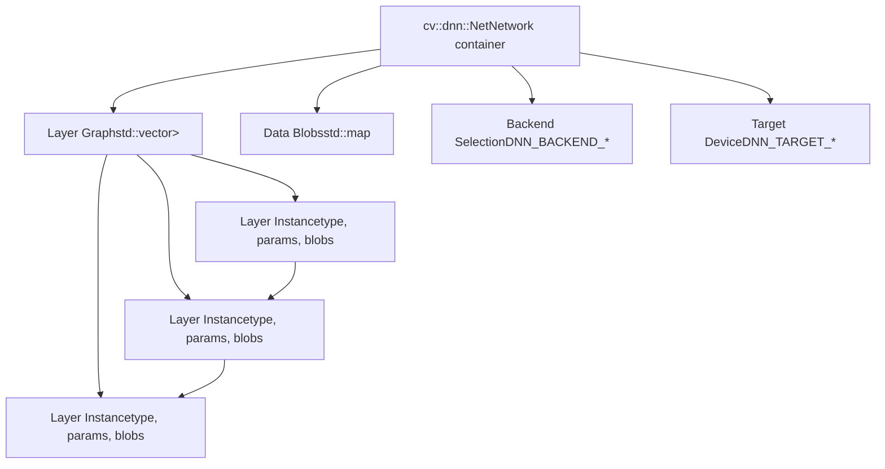
**Key Methods:**

-   `Net::setInput()` - Sets input data for the network
-   `Net::forward()` - Executes forward pass and returns output
-   `Net::setPreferableBackend()` - Selects execution backend
-   `Net::setPreferableTarget()` - Selects target device
-   `Net::getLayerNames()` - Returns all layer names in the network

**Sources:** [modules/dnn/include/opencv2/dnn/dnn.hpp567-892](https://github.com/opencv/opencv/blob/91c78f50/modules/dnn/include/opencv2/dnn/dnn.hpp#L567-L892)

### Layer Abstraction

The `cv::dnn::Layer` class provides a common interface for all layer types. Each layer implements:

-   `finalize()` - Computes output shapes and initializes internal state
-   `forward()` - Executes the layer's computation on input data
-   `supportBackend()` - Indicates which backends the layer supports
-   Backend-specific initialization methods (`initHalide()`, `initNgraph()`, `initCUDA()`, etc.)

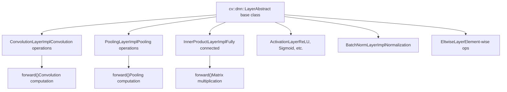
**Common Layer Members:**

-   `blobs` - Learned parameters (weights, biases)
-   `name` - Layer instance name
-   `type` - Layer type identifier
-   `preferableTarget` - Preferred execution target

**Sources:** [modules/dnn/include/opencv2/dnn/dnn.hpp220-403](https://github.com/opencv/opencv/blob/91c78f50/modules/dnn/include/opencv2/dnn/dnn.hpp#L220-L403) [modules/dnn/include/opencv2/dnn/all\_layers.hpp49-73](https://github.com/opencv/opencv/blob/91c78f50/modules/dnn/include/opencv2/dnn/all_layers.hpp#L49-L73)

### Backend and Target System

The DNN module uses a two-level abstraction for hardware acceleration:

**Backend** (`cv::dnn::Backend` enum):

-   `DNN_BACKEND_OPENCV` - OpenCV's native CPU/OpenCL implementation
-   `DNN_BACKEND_INFERENCE_ENGINE` - Intel OpenVINO inference engine (see also `DNN_BACKEND_INFERENCE_ENGINE_NGRAPH` internal alias)
-   `DNN_BACKEND_CUDA` - NVIDIA CUDA with cuDNN
-   `DNN_BACKEND_HALIDE` - Halide JIT backend (experimental)
-   `DNN_BACKEND_VKCOM` - Vulkan compute backend
-   `DNN_BACKEND_WEBNN` - Web Neural Network API
-   `DNN_BACKEND_TIMVX` - TIM-VX NPU backend (for embedded accelerators)
-   `DNN_BACKEND_CANN` - Huawei CANN (Compute Architecture for Neural Networks)

**Target** (`cv::dnn::Target` enum):

-   `DNN_TARGET_CPU` - CPU execution
-   `DNN_TARGET_OPENCL` - OpenCL (GPU) FP32
-   `DNN_TARGET_OPENCL_FP16` - OpenCL FP16 (half precision)
-   `DNN_TARGET_MYRIAD` - Intel Movidius VPU
-   `DNN_TARGET_CUDA` - NVIDIA GPU FP32
-   `DNN_TARGET_CUDA_FP16` - NVIDIA GPU FP16
-   `DNN_TARGET_FPGA` - FPGA with CPU fallback

```mermaid
flowchart TD
    APP["Application Code"]
    NET["cv::dnn::Net"]
    BACKEND_SEL["Backend Selection"]
    TARGET_SEL["Target Selection"]
    OPENCV["DNN_BACKEND_OPENCV"]
    OPENVINO["DNN_BACKEND_INFERENCE_ENGINE"]
    CUDA["DNN_BACKEND_CUDA"]
    CPU["DNN_TARGET_CPU"]
    OPENCL["DNN_TARGET_OPENCL"]
    GPU_CUDA["DNN_TARGET_CUDA"]
    VPU["DNN_TARGET_MYRIAD"]

    APP --> BACKEND_SEL
    APP --> TARGET_SEL
    BACKEND --> SEL_OPENCV
    BACKEND --> SEL_OPENVINO
    BACKEND --> SEL_CUDA
    TARGET --> SEL_CPU
    TARGET --> SEL_OPENCL
    TARGET --> SEL_GPU_CUDA
    TARGET --> SEL_VPU
    OPENCV --> CPU
    OPENCV --> OPENCL
    OPENVINO --> CPU
    OPENVINO --> OPENCL
    OPENVINO --> VPU
    CUDA --> GPU_CUDA
```
Use `getAvailableBackends()` to query which backend/target pairs are compiled in and available at runtime. Use `getAvailableTargets(backend)` to list targets for a specific backend.

**Sources:** [modules/dnn/include/opencv2/dnn/dnn.hpp70-127](https://github.com/opencv/opencv/blob/91c78f50/modules/dnn/include/opencv2/dnn/dnn.hpp#L70-L127) [modules/dnn/CMakeLists.txt20-56](https://github.com/opencv/opencv/blob/91c78f50/modules/dnn/CMakeLists.txt#L20-L56)

## Model Import Pipeline

### Importer Architecture

Each supported framework has a dedicated importer class that parses model files and constructs the internal `Net` representation:

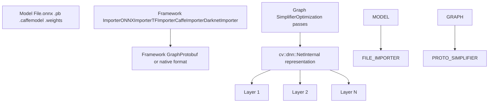
**Framework-Specific Importers:**

| Importer Class | File | Framework | Load Function | Format |
| --- | --- | --- | --- | --- |
| `ONNXImporter` | [modules/dnn/src/onnx/onnx\_importer.cpp](https://github.com/opencv/opencv/blob/91c78f50/modules/dnn/src/onnx/onnx_importer.cpp) | ONNX | `readNetFromONNX()` | `.onnx` (Protocol Buffers) |
| `TFImporter` | [modules/dnn/src/tensorflow/tf\_importer.cpp](https://github.com/opencv/opencv/blob/91c78f50/modules/dnn/src/tensorflow/tf_importer.cpp) | TensorFlow | `readNetFromTensorflow()` | `.pb` `.pbtxt` |
| `CaffeImporter` | [modules/dnn/src/caffe/caffe\_importer.cpp](https://github.com/opencv/opencv/blob/91c78f50/modules/dnn/src/caffe/caffe_importer.cpp) | Caffe | `readNetFromCaffe()` | `.prototxt` `.caffemodel` |
| `DarknetImporter` | [modules/dnn/src/darknet/darknet\_io.cpp](https://github.com/opencv/opencv/blob/91c78f50/modules/dnn/src/darknet/darknet_io.cpp) | Darknet/YOLO | `readNetFromDarknet()` | `.cfg` `.weights` |
| Torch importer | [modules/dnn/src/torch/torch\_importer.cpp](https://github.com/opencv/opencv/blob/91c78f50/modules/dnn/src/torch/torch_importer.cpp) | Torch7 | `readNetFromTorch()` | `.t7` `.net` |

All formats are also accessible through the unified `readNet()` function, which dispatches to the appropriate importer based on the file extension. The `readNetFromONNX()`, `readNetFromTensorflow()`, etc. variants accept both file paths and in-memory byte buffers.

**Sources:** [modules/dnn/src/onnx/onnx\_importer.cpp65-233](https://github.com/opencv/opencv/blob/91c78f50/modules/dnn/src/onnx/onnx_importer.cpp#L65-L233) [modules/dnn/src/tensorflow/tf\_importer.cpp512-556](https://github.com/opencv/opencv/blob/91c78f50/modules/dnn/src/tensorflow/tf_importer.cpp#L512-L556) [modules/dnn/test/test\_darknet\_importer.cpp56-99](https://github.com/opencv/opencv/blob/91c78f50/modules/dnn/test/test_darknet_importer.cpp#L56-L99) [modules/dnn/test/test\_torch\_importer.cpp1-40](https://github.com/opencv/opencv/blob/91c78f50/modules/dnn/test/test_torch_importer.cpp#L1-L40)

### ONNX Import Pipeline

The ONNX importer is the most actively developed path, supporting the ONNX standard for model interchange:

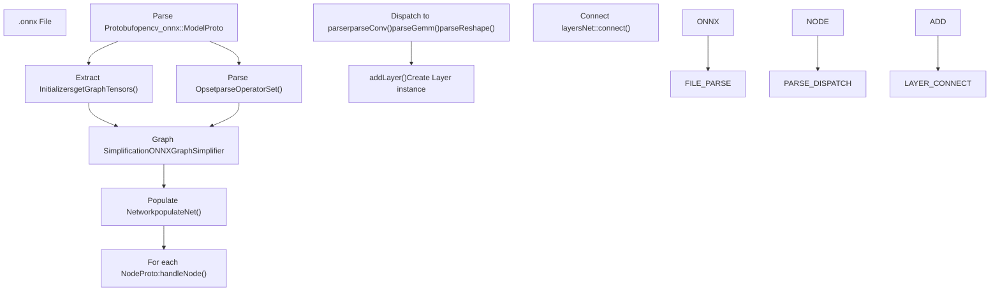
**Key ONNX Import Components:**

**`ONNXImporter` class** [modules/dnn/src/onnx/onnx\_importer.cpp65-233](https://github.com/opencv/opencv/blob/91c78f50/modules/dnn/src/onnx/onnx_importer.cpp#L65-L233):

-   `parseOperatorSet()` - Determines ONNX opset version to use correct operation semantics
-   `getGraphTensors()` - Extracts weight tensors from the model's initializer list
-   `handleNode()` - Processes each operation node in the graph
-   `buildDispatchMap_ONNX_AI()` - Maps ONNX operation types to parser methods

**Parser Methods** (selected examples):

-   `parseConv()` - Convolution and ConvTranspose operations
-   `parseGemm()` / `parseMatMul()` - Matrix multiplication operations
-   `parseReshape()` / `parseFlatten()` - Shape manipulation
-   `parseBatchNormalization()` - Batch normalization
-   `parseReduce()` - Reduction operations (sum, mean, max, etc.)

**Sources:** [modules/dnn/src/onnx/onnx\_importer.cpp266-315](https://github.com/opencv/opencv/blob/91c78f50/modules/dnn/src/onnx/onnx_importer.cpp#L266-L315) [modules/dnn/src/onnx/onnx\_importer.cpp673-685](https://github.com/opencv/opencv/blob/91c78f50/modules/dnn/src/onnx/onnx_importer.cpp#L673-L685)

### Graph Simplification

Before constructing the final `Net`, importers apply optimization passes to simplify the computational graph:

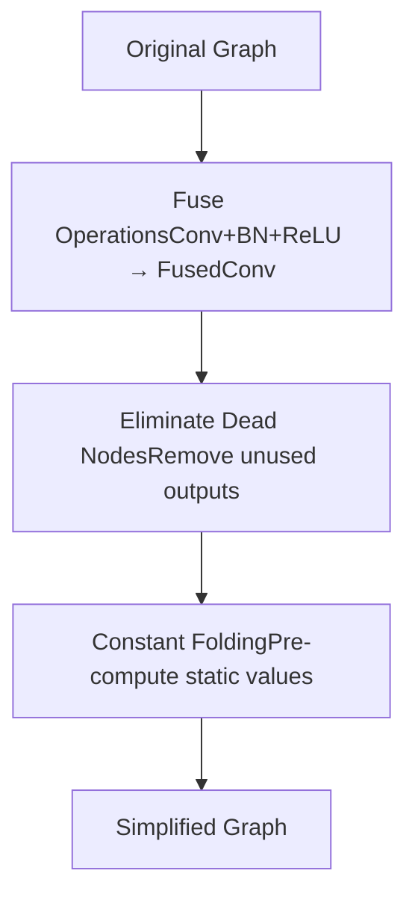
**Common Simplifications:**

1.  **Layer Fusion** - Combines consecutive operations:

    -   Convolution + BatchNorm + Activation → Single fused layer
    -   Reduces memory traffic and improves cache locality
2.  **Constant Folding** - Pre-computes operations with constant inputs:

    -   Shape operations that don't depend on runtime data
    -   Reduces graph complexity
3.  **Dead Code Elimination** - Removes unused computations:

    -   Layers with no consumers
    -   Unreachable branches

**Implementation Files:**

-   ONNX: [modules/dnn/src/onnx/onnx\_graph\_simplifier.cpp](https://github.com/opencv/opencv/blob/91c78f50/modules/dnn/src/onnx/onnx_graph_simplifier.cpp)
-   TensorFlow: [modules/dnn/src/tensorflow/tf\_graph\_simplifier.cpp](https://github.com/opencv/opencv/blob/91c78f50/modules/dnn/src/tensorflow/tf_graph_simplifier.cpp)

**Sources:** [modules/dnn/src/onnx/onnx\_graph\_simplifier.cpp1-79](https://github.com/opencv/opencv/blob/91c78f50/modules/dnn/src/onnx/onnx_graph_simplifier.cpp#L1-L79) [modules/dnn/src/tensorflow/tf\_graph\_simplifier.cpp1-19](https://github.com/opencv/opencv/blob/91c78f50/modules/dnn/src/tensorflow/tf_graph_simplifier.cpp#L1-L19)

## Execution Backends

### OpenCV Native Backend

The default `DNN_BACKEND_OPENCV` provides CPU and OpenCL implementations:

**CPU Execution Path:**

-   SIMD-optimized kernels for x86 (AVX2, AVX-512), ARM (NEON), RISC-V
-   Optimized GEMM (General Matrix Multiply) routines
-   Fast convolution implementations: direct, im2col, Winograd
-   Multi-threading via `cv::parallel_for_()` using TBB/OpenMP/pthreads

**OpenCL Execution Path:**

-   Enabled when `OPENCV_DNN_OPENCL=ON` and `HAVE_OPENCL` is defined
-   Transparent UMat usage for GPU memory management
-   Specialized kernels in [modules/dnn/src/opencl/](https://github.com/opencv/opencv/blob/91c78f50/modules/dnn/src/opencl/)
-   Supports FP32 and FP16 precision

```mermaid
flowchart TD
    LAYER_FWD["Layer::forward()"]
    BACKEND_CHECK["Check preferableTarget"]
    CPU_PATH["CPU PathSIMD kernels"]
    OPENCL_PATH["OpenCL PathGPU kernels"]
    CPU_SIMD["Dispatch SIMDAVX2/NEON/RVV"]
    CPU_PARALLEL["parallel_for_Multi-threading"]
    OCL_KERNEL["Launch OCL kernelocl::Kernel::run()"]
    OCL_UMAT["UMat data transfer"]

    LAYER --> FWD_BACKEND_CHECK
    BACKEND --> CHECK_CPU_PATH
    BACKEND --> CHECK_OPENCL_PATH
    CPU --> PATH_CPU_SIMD
    CPU --> PATH_CPU_PARALLEL
    OPENCL --> PATH_OCL_KERNEL
    OPENCL --> PATH_OCL_UMAT
```
**Key CPU Implementation Files:**

-   [modules/dnn/src/layers/cpu\_kernels/convolution.hpp](https://github.com/opencv/opencv/blob/91c78f50/modules/dnn/src/layers/cpu_kernels/convolution.hpp) - Convolution kernels
-   [modules/dnn/src/layers/cpu\_kernels/conv\_winograd\_f63.simd.hpp](https://github.com/opencv/opencv/blob/91c78f50/modules/dnn/src/layers/cpu_kernels/conv_winograd_f63.simd.hpp) - Winograd convolution
-   [modules/dnn/src/layers/cpu\_kernels/fast\_gemm\_kernels.simd.hpp](https://github.com/opencv/opencv/blob/91c78f50/modules/dnn/src/layers/cpu_kernels/fast_gemm_kernels.simd.hpp) - Matrix multiplication

**Sources:** [modules/dnn/src/layers/convolution\_layer.cpp79-242](https://github.com/opencv/opencv/blob/91c78f50/modules/dnn/src/layers/convolution_layer.cpp#L79-L242) [modules/dnn/CMakeLists.txt20-24](https://github.com/opencv/opencv/blob/91c78f50/modules/dnn/CMakeLists.txt#L20-L24)

### Intel OpenVINO Backend

The `DNN_BACKEND_INFERENCE_ENGINE` backend delegates execution to Intel OpenVINO (formerly Inference Engine):

**Architecture:**

-   Converts OpenCV's internal graph to OpenVINO's `ov::Model` representation
-   Uses OpenVINO's optimized execution on Intel hardware (CPU, GPU, VPU, FPGA)
-   Supports heterogeneous execution across multiple devices

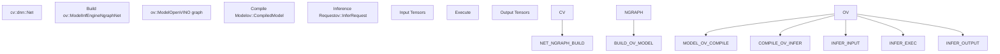
**Key Classes:**

**`InfEngineNgraphNet`** [modules/dnn/src/ie\_ngraph.cpp](https://github.com/opencv/opencv/blob/91c78f50/modules/dnn/src/ie_ngraph.cpp):

-   Converts cv::dnn layers to OpenVINO operations
-   Manages model compilation and inference requests
-   Handles asynchronous execution

**Layer Backend Methods:**

-   `Layer::initNgraph()` - Creates OpenVINO operation for the layer
-   Returns `Ptr<BackendNode>` containing OpenVINO operation

**Configuration:**

-   Detected via CMake: [cmake/OpenCVDetectInferenceEngine.cmake](https://github.com/opencv/opencv/blob/91c78f50/cmake/OpenCVDetectInferenceEngine.cmake)
-   Requires OpenVINO runtime installation
-   Sets `HAVE_INF_ENGINE` and `HAVE_DNN_NGRAPH` preprocessor flags

**Sources:** [modules/dnn/src/op\_inf\_engine.hpp1-62](https://github.com/opencv/opencv/blob/91c78f50/modules/dnn/src/op_inf_engine.hpp#L1-L62) [modules/dnn/src/ie\_ngraph.cpp1-42](https://github.com/opencv/opencv/blob/91c78f50/modules/dnn/src/ie_ngraph.cpp#L1-L42) [cmake/OpenCVDetectInferenceEngine.cmake1-16](https://github.com/opencv/opencv/blob/91c78f50/cmake/OpenCVDetectInferenceEngine.cmake#L1-L16)

### CUDA Backend

The `DNN_BACKEND_CUDA` backend uses NVIDIA CUDA and cuDNN for GPU acceleration:

**Requirements:**

-   CUDA Toolkit (compute capability >= 3.0)
-   cuDNN library
-   cuBLAS and cuBLAS-Lt for matrix operations
-   Enabled with `OPENCV_DNN_CUDA=ON` CMake option

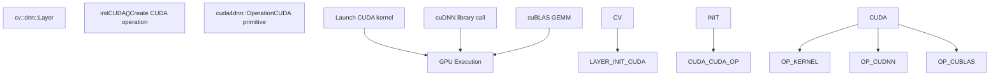
**CUDA Implementation Structure:**

-   CUDA operations: [modules/dnn/src/cuda4dnn/primitives/](https://github.com/opencv/opencv/blob/91c78f50/modules/dnn/src/cuda4dnn/primitives/)
-   Kernel implementations: [modules/dnn/src/cuda4dnn/kernels/](https://github.com/opencv/opencv/blob/91c78f50/modules/dnn/src/cuda4dnn/kernels/)
-   Common CUDA utilities: [modules/dnn/src/cuda4dnn/csl/](https://github.com/opencv/opencv/blob/91c78f50/modules/dnn/src/cuda4dnn/csl/) (CSL = CUDA Support Library)

**Example CUDA Primitives:**

-   `cuda4dnn::ConvolutionOp` - Convolution using cuDNN
-   `cuda4dnn::PoolingOp` - Pooling operations
-   `cuda4dnn::FullyConnectedOp` - Matrix multiplication via cuBLAS
-   `cuda4dnn::ActivationOp` - Element-wise activations

**Sources:** [modules/dnn/CMakeLists.txt38-56](https://github.com/opencv/opencv/blob/91c78f50/modules/dnn/CMakeLists.txt#L38-L56) [modules/dnn/src/layers/convolution\_layer.cpp304-311](https://github.com/opencv/opencv/blob/91c78f50/modules/dnn/src/layers/convolution_layer.cpp#L304-L311)

## Layer Implementation Deep Dive

### Convolution Layer

The `ConvolutionLayerImpl` class implements 2D and 3D convolution operations, the backbone of most CNNs:

**Implementation Strategies:**

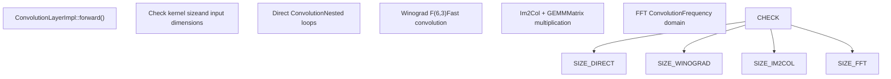
**Key Implementation Details:**

**Im2Col Algorithm:**

1.  Transform input image into column matrix where each column contains kernel-sized patch
2.  Perform batched matrix multiplication: `output = weights × im2col_matrix`
3.  Reshape result back to output tensor dimensions

**Winograd Convolution:**

-   Used for 3×3 kernels with stride=1, dilation=1
-   Reduces multiplication count vs. direct convolution
-   Implementation: [modules/dnn/src/layers/cpu\_kernels/conv\_winograd\_f63.simd.hpp](https://github.com/opencv/opencv/blob/91c78f50/modules/dnn/src/layers/cpu_kernels/conv_winograd_f63.simd.hpp)
-   Controlled by `Net::enableWinograd()` / `useWinograd` parameter

**Fusion Optimizations:**

-   `tryFuse()` method merges BatchNorm, Scale, and Activation layers into convolution
-   Reduces memory bandwidth and kernel launch overhead
-   Implemented in `BaseConvolutionLayerImpl::tryFuse()` [modules/dnn/src/layers/convolution\_layer.cpp180-199](https://github.com/opencv/opencv/blob/91c78f50/modules/dnn/src/layers/convolution_layer.cpp#L180-L199)

**Sources:** [modules/dnn/src/layers/convolution\_layer.cpp246-285](https://github.com/opencv/opencv/blob/91c78f50/modules/dnn/src/layers/convolution_layer.cpp#L246-L285) [modules/dnn/src/layers/cpu\_kernels/convolution.hpp](https://github.com/opencv/opencv/blob/91c78f50/modules/dnn/src/layers/cpu_kernels/convolution.hpp)

### Pooling Layer

The `PoolingLayerImpl` class implements various pooling operations:

**Pooling Types:**

-   `MAX` - Maximum pooling (most common in CNNs)
-   `AVE` - Average pooling
-   `SUM` - Sum pooling
-   `ROI` - Region of Interest pooling (for object detection)
-   `PSROI` - Position-Sensitive ROI pooling

**Max Pooling Implementation:**

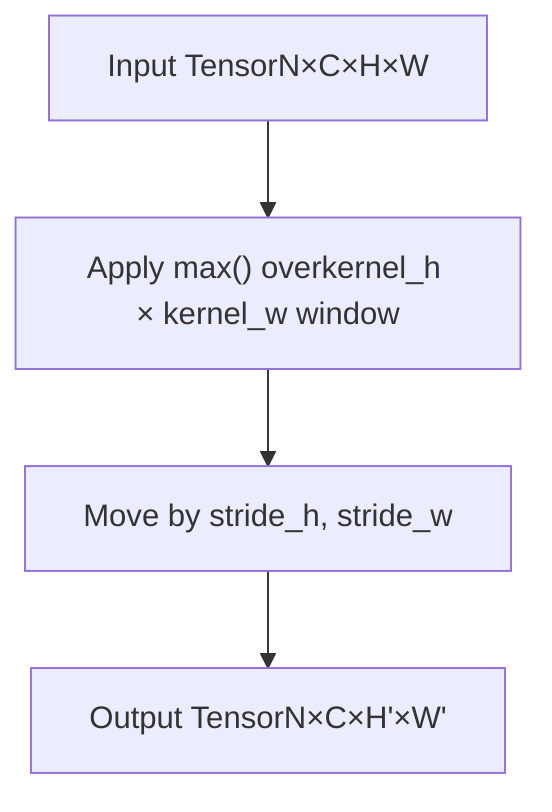
**Global Pooling:**

-   When `global_pooling=true`, pools entire spatial dimensions
-   Kernel size automatically set to input spatial size
-   Common in classification networks before final FC layer

**Sources:** [modules/dnn/src/layers/pooling\_layer.cpp98-137](https://github.com/opencv/opencv/blob/91c78f50/modules/dnn/src/layers/pooling_layer.cpp#L98-L137)

### Fully Connected (InnerProduct) Layer

The `InnerProductLayerImpl` implements dense/fully-connected layers:

**Operation:** `output = weights × input + bias`

**Optimizations:**

-   Uses optimized BLAS implementations (OpenBLAS, MKL, Eigen, or built-in)
-   Supports transposed weight matrices for cache efficiency
-   Fuses with activation functions (ReLU, etc.)

**Weight Storage:**

-   Weights stored as `numOutput × numInput` matrix
-   Bias stored as `numOutput` vector
-   Both in `LayerParams::blobs` vector

**Sources:** [modules/dnn/src/layers/fully\_connected\_layer.cpp1-41](https://github.com/opencv/opencv/blob/91c78f50/modules/dnn/src/layers/fully_connected_layer.cpp#L1-L41)

### Activation Layers

Element-wise activation functions inherit from `ActivationLayer`:

**Common Activations:**

-   `ReLULayer` - Rectified Linear Unit: `f(x) = max(0, x)`
-   `ReLU6Layer` - Capped ReLU: `f(x) = min(max(0, x), 6)`
-   `SigmoidLayer` - Sigmoid: `f(x) = 1 / (1 + exp(-x))`
-   `TanHLayer` - Hyperbolic tangent
-   `ELULayer` - Exponential Linear Unit
-   `SwishLayer` - Swish/SiLU: `f(x) = x * sigmoid(x)`

**Layer Fusion:**

-   Activation layers are frequently fused into preceding Conv or FC layers
-   Reduces memory round-trips
-   Implemented via `Layer::tryFuse()`

**Sources:** [modules/dnn/src/layers/elementwise\_layers.cpp1-47](https://github.com/opencv/opencv/blob/91c78f50/modules/dnn/src/layers/elementwise_layers.cpp#L1-L47) [modules/dnn/include/opencv2/dnn/all\_layers.hpp241-328](https://github.com/opencv/opencv/blob/91c78f50/modules/dnn/include/opencv2/dnn/all_layers.hpp#L241-L328)

## Preprocessing Utilities

### blobFromImage / blobFromImages

Before passing images to a network, pixel data must be converted from a `cv::Mat` (HWC, uint8) to a 4D blob (NCHW, float32). The DNN module provides helpers for this:

-   `blobFromImage(image, scalefactor, size, mean, swapRB, crop)` — Returns a 4D blob from a single image.
-   `blobFromImages(images, ...)` — Returns a batched blob from a vector of images.
-   `imagesFromBlob(blob, images)` — Inverse: converts a blob back to a vector of images.

`Image2BlobParams` encapsulates all preprocessing parameters (scale, size, mean, swapRB, crop, data layout, padding mode) and can be passed to `blobFromImageWithParams()` for more control.

The `DataLayout` enum controls output memory layout:

| Value | Layout | Typical Use |
| --- | --- | --- |
| `DNN_LAYOUT_NCHW` | N×C×H×W | OpenCV default |
| `DNN_LAYOUT_NHWC` | N×H×W×C | TensorFlow/TFLite |
| `DNN_LAYOUT_NCDHW` | N×C×D×H×W | 3D (video) |

**Sources:** [modules/dnn/include/opencv2/dnn/dnn.hpp114-123](https://github.com/opencv/opencv/blob/91c78f50/modules/dnn/include/opencv2/dnn/dnn.hpp#L114-L123) [modules/dnn/include/opencv2/dnn/dnn.hpp880-953](https://github.com/opencv/opencv/blob/91c78f50/modules/dnn/include/opencv2/dnn/dnn.hpp#L880-L953)

## Custom Layer Registration

New layer types can be registered with the `LayerFactory` at runtime using the `CV_DNN_REGISTER_LAYER_CLASS` macro or by calling `LayerFactory::registerLayer(type, creator)`. The factory maps string type names to creator functions that produce `Ptr<Layer>` instances.

-   `LayerFactory::registerLayer(typeName, creator)` — Register a new layer type.
-   `LayerFactory::createLayerInstance(type, params)` — Instantiate a layer by type name; used during import.

`LayerParams` carries all data needed to construct a layer:

-   Inherits from `Dict` for named scalar/string/array parameters.
-   `blobs` — `std::vector<Mat>` of learned weight tensors.
-   `name`, `type` — Instance name and type string.

**Sources:** [modules/dnn/include/opencv2/dnn/dnn.hpp145-153](https://github.com/opencv/opencv/blob/91c78f50/modules/dnn/include/opencv2/dnn/dnn.hpp#L145-L153) [modules/dnn/test/test\_layers.cpp47](https://github.com/opencv/opencv/blob/91c78f50/modules/dnn/test/test_layers.cpp#L47-L47)

## Network Inference Flow

### Forward Pass Execution

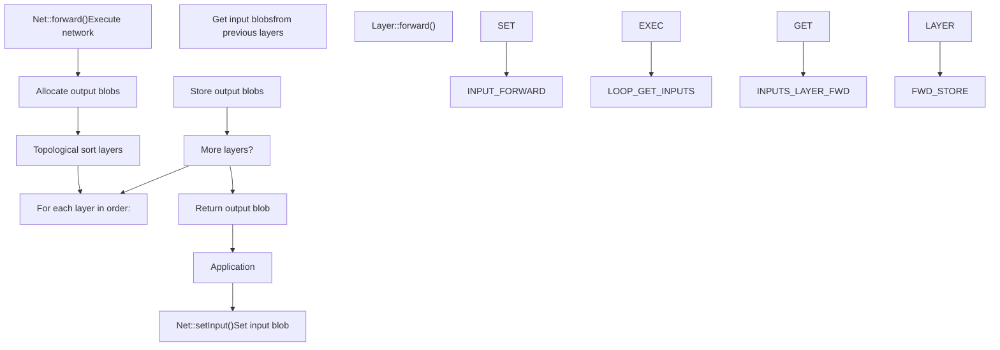
**Execution Steps:**

1.  **Input Setup:**

    -   `Net::setInput(blob, name)` associates input data with input layer
    -   Multiple inputs supported for networks with multiple input nodes
    -   Input blobs stored in internal map: `std::map<int, Mat>`
2.  **Layer Scheduling:**

    -   Network maintains topological order of layers
    -   Each layer depends on outputs of previous layers
    -   Execution order ensures all dependencies are satisfied
3.  **Memory Management:**

    -   Output blobs allocated based on `Layer::getMemoryShapes()`
    -   Memory reused when possible (in-place operations)
    -   Internal blobs allocated for layer-specific needs
4.  **Backend Dispatch:**

    -   Each layer checks `preferableBackend` and `preferableTarget`
    -   Calls appropriate backend-specific code path
    -   Falls back to OpenCV implementation if backend unsupported

**Sources:** [modules/dnn/include/opencv2/dnn/dnn.hpp745-807](https://github.com/opencv/opencv/blob/91c78f50/modules/dnn/include/opencv2/dnn/dnn.hpp#L745-L807)

### Asynchronous Execution

For backends supporting async execution (OpenVINO, CUDA), the DNN module provides non-blocking inference:

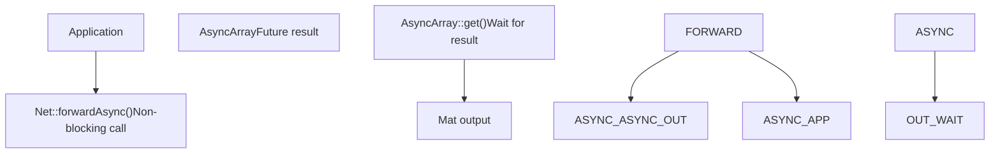
**Usage Pattern:**

```
net.setInput(input);AsyncArray async_result = net.forwardAsync();// Do other work...Mat output = async_result.get(); // Block until complete
```
**Sources:** [modules/dnn/include/opencv2/dnn/dnn.hpp792-807](https://github.com/opencv/opencv/blob/91c78f50/modules/dnn/include/opencv2/dnn/dnn.hpp#L792-L807)

### Batch Processing

The DNN module supports batch inference to amortize overhead:

**Batch Dimensions:**

-   Input shape: `[batch_size, channels, height, width]` for 2D
-   Input shape: `[batch_size, channels, depth, height, width]` for 3D
-   First dimension is the batch axis

**Batch Processing:**

-   All layers process the batch dimension transparently
-   GEMM operations handle batches via matrix dimensions
-   Convolutions process batches in parallel

**Memory Layout:**

-   NCHW (batch, channels, height, width) — OpenCV default
-   NHWC (batch, height, width, channels) — TensorFlow/TFLite option
-   Controlled by `DataLayout` enum; see also preprocessing section above

**Sources:** [modules/dnn/include/opencv2/dnn/dnn.hpp114-123](https://github.com/opencv/opencv/blob/91c78f50/modules/dnn/include/opencv2/dnn/dnn.hpp#L114-L123)

## Testing and Validation

### Test Infrastructure

The DNN module includes comprehensive tests for:

-   Model import correctness
-   Layer implementations
-   Backend compatibility
-   Numerical accuracy

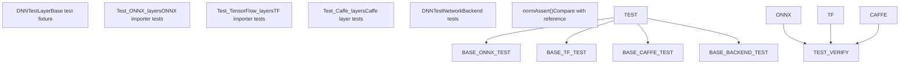
**Key Test Classes:**

**`DNNTestLayer`** [modules/dnn/test/test\_common.hpp](https://github.com/opencv/opencv/blob/91c78f50/modules/dnn/test/test_common.hpp):

-   Base class providing common test utilities
-   `checkBackend()` - Validates backend/target support
-   `normAssert()` - Compares output with reference using L1/Linf metrics
-   Backend/target parameterization via `GetParam()`

**Test Data Format:**

-   Input/output stored as NumPy `.npy` files
-   Reference outputs generated by original frameworks
-   Helper: `blobFromNPY()` loads test data

**Backend Compatibility Testing:**

-   Each test runs on multiple backend/target combinations
-   Skip tags applied for unsupported configurations
-   Example: `applyTestTag(CV_TEST_TAG_DNN_SKIP_CUDA)`

**Sources:** [modules/dnn/test/test\_common.hpp1-55](https://github.com/opencv/opencv/blob/91c78f50/modules/dnn/test/test_common.hpp#L1-L55) [modules/dnn/test/test\_onnx\_importer.cpp31-128](https://github.com/opencv/opencv/blob/91c78f50/modules/dnn/test/test_onnx_importer.cpp#L31-L128) [modules/dnn/test/test\_backends.cpp13-73](https://github.com/opencv/opencv/blob/91c78f50/modules/dnn/test/test_backends.cpp#L13-L73)

### Diagnostic Mode

The DNN module provides a diagnostic mode for debugging model loading issues:

**Activation:**

```
cv::dnn::enableModelDiagnostics(true);
```
**Functionality:**

-   Detailed logging of model parsing
-   Reports unsupported layer types
-   Continues loading despite errors to report all issues
-   Helps identify missing layer implementations

**Implementation:**

-   Global flag: `DNN_DIAGNOSTICS_RUN` [modules/dnn/src/onnx/onnx\_importer.cpp53](https://github.com/opencv/opencv/blob/91c78f50/modules/dnn/src/onnx/onnx_importer.cpp#L53-L53)
-   Layer handlers track missing operations
-   Output via `CV_LOG_*` macros

**Sources:** [modules/dnn/include/opencv2/dnn/dnn.hpp128-138](https://github.com/opencv/opencv/blob/91c78f50/modules/dnn/include/opencv2/dnn/dnn.hpp#L128-L138)

## Build Configuration

### CMake Options

Key CMake variables controlling DNN module features:

| Option | Description | Default |
| --- | --- | --- |
| `OPENCV_DNN_OPENCL` | Enable OpenCL backend | `HAVE_OPENCL AND NOT APPLE` |
| `OPENCV_DNN_CUDA` | Enable CUDA backend | `OFF` (requires CUDA+cuDNN) |
| `WITH_OPENVINO` | Enable OpenVINO backend | `OFF` (auto-detected if installed) |
| `BUILD_PROTOBUF` | Build bundled protobuf | `ON` |
| `PROTOBUF_UPDATE_FILES` | Regenerate .pb files | `OFF` |
| `OPENCV_DNN_TFLITE` | Enable TFLite import | `ON` (if flatbuffers available) |

**Configuration Detection:**

-   OpenVINO: [cmake/OpenCVDetectInferenceEngine.cmake](https://github.com/opencv/opencv/blob/91c78f50/cmake/OpenCVDetectInferenceEngine.cmake)
-   CUDA/cuDNN: Standard OpenCV CUDA detection
-   Protobuf: FindProtobuf.cmake or bundled version

**Generated Files:**

-   Protocol buffer sources in `misc/` directory (pre-generated)
-   Or regenerated from `.proto` files if `PROTOBUF_UPDATE_FILES=ON`

**Sources:** [modules/dnn/CMakeLists.txt1-230](https://github.com/opencv/opencv/blob/91c78f50/modules/dnn/CMakeLists.txt#L1-L230) [cmake/OpenCVDetectInferenceEngine.cmake1-16](https://github.com/opencv/opencv/blob/91c78f50/cmake/OpenCVDetectInferenceEngine.cmake#L1-L16)

### Preprocessor Definitions

Key compile-time flags:

-   `HAVE_PROTOBUF` - Enables ONNX/TensorFlow/Caffe import
-   `CV_OCL4DNN` - Enables OpenCL optimized kernels
-   `CV_CUDA4DNN` - Enables CUDA backend
-   `HAVE_INF_ENGINE` / `HAVE_DNN_NGRAPH` - OpenVINO support
-   `HAVE_WEBNN` - WebNN backend support
-   `HAVE_TIMVX` - TIM-VX NPU backend
-   `HAVE_CANN` - Huawei CANN backend

**Sources:** [modules/dnn/CMakeLists.txt22-36](https://github.com/opencv/opencv/blob/91c78f50/modules/dnn/CMakeLists.txt#L22-L36)
