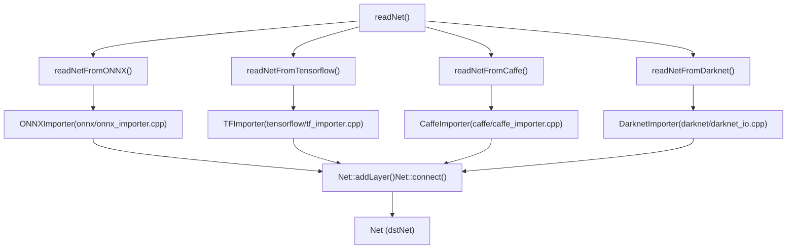
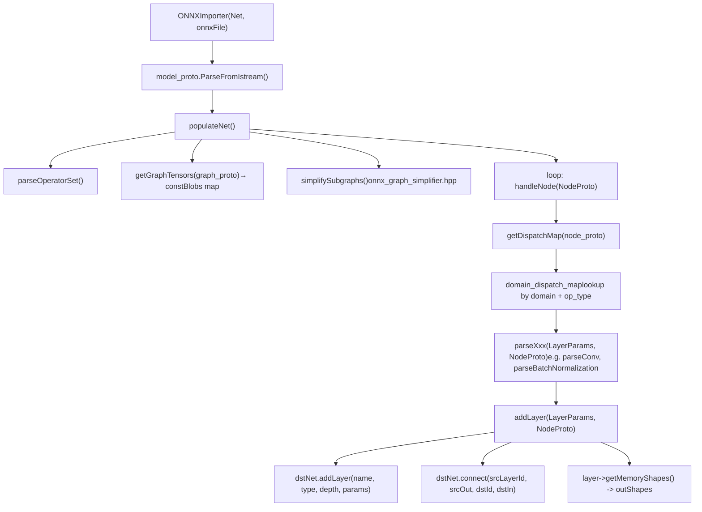
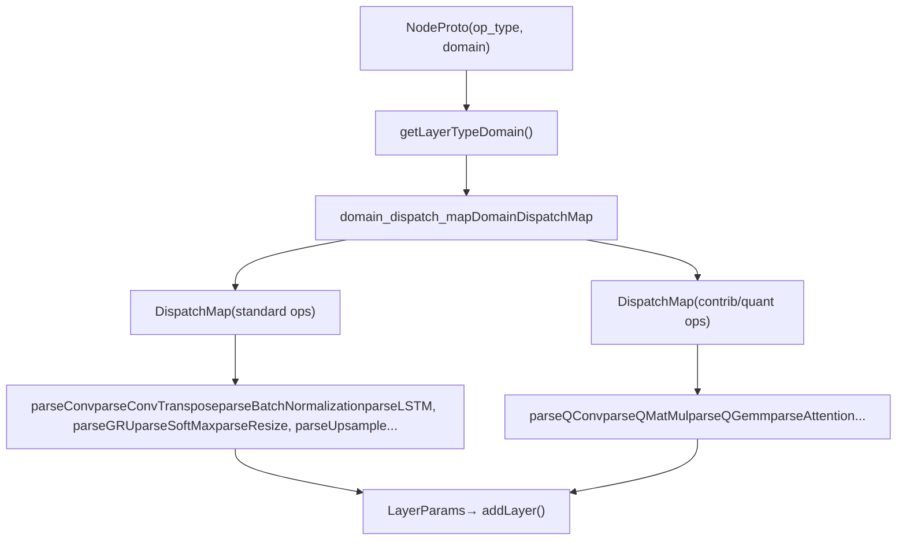
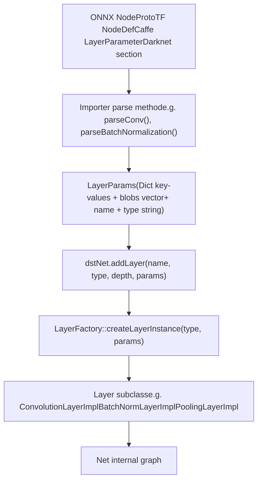

# Model Importers (ONNX, TensorFlow, Caffe, Darknet)

Relevant source files

-   [cmake/OpenCVDetectInferenceEngine.cmake](https://github.com/opencv/opencv/blob/91c78f50/cmake/OpenCVDetectInferenceEngine.cmake)
-   [modules/dnn/CMakeLists.txt](https://github.com/opencv/opencv/blob/91c78f50/modules/dnn/CMakeLists.txt)
-   [modules/dnn/include/opencv2/dnn/all\_layers.hpp](https://github.com/opencv/opencv/blob/91c78f50/modules/dnn/include/opencv2/dnn/all_layers.hpp)
-   [modules/dnn/include/opencv2/dnn/dnn.hpp](https://github.com/opencv/opencv/blob/91c78f50/modules/dnn/include/opencv2/dnn/dnn.hpp)
-   [modules/dnn/misc/python/pyopencv\_dnn.hpp](https://github.com/opencv/opencv/blob/91c78f50/modules/dnn/misc/python/pyopencv_dnn.hpp)
-   [modules/dnn/misc/python/test/test\_dnn.py](https://github.com/opencv/opencv/blob/91c78f50/modules/dnn/misc/python/test/test_dnn.py)
-   [modules/dnn/perf/perf\_net.cpp](https://github.com/opencv/opencv/blob/91c78f50/modules/dnn/perf/perf_net.cpp)
-   [modules/dnn/perf/perf\_utils.cpp](https://github.com/opencv/opencv/blob/91c78f50/modules/dnn/perf/perf_utils.cpp)
-   [modules/dnn/src/caffe/caffe\_importer.cpp](https://github.com/opencv/opencv/blob/91c78f50/modules/dnn/src/caffe/caffe_importer.cpp)
-   [modules/dnn/src/cuda/activations.cu](https://github.com/opencv/opencv/blob/91c78f50/modules/dnn/src/cuda/activations.cu)
-   [modules/dnn/src/cuda/functors.hpp](https://github.com/opencv/opencv/blob/91c78f50/modules/dnn/src/cuda/functors.hpp)
-   [modules/dnn/src/cuda4dnn/kernels/activations.hpp](https://github.com/opencv/opencv/blob/91c78f50/modules/dnn/src/cuda4dnn/kernels/activations.hpp)
-   [modules/dnn/src/cuda4dnn/primitives/activation.hpp](https://github.com/opencv/opencv/blob/91c78f50/modules/dnn/src/cuda4dnn/primitives/activation.hpp)
-   [modules/dnn/src/cuda4dnn/primitives/matmul\_broadcast.hpp](https://github.com/opencv/opencv/blob/91c78f50/modules/dnn/src/cuda4dnn/primitives/matmul_broadcast.hpp)
-   [modules/dnn/src/darknet/darknet\_importer.cpp](https://github.com/opencv/opencv/blob/91c78f50/modules/dnn/src/darknet/darknet_importer.cpp)
-   [modules/dnn/src/darknet/darknet\_io.cpp](https://github.com/opencv/opencv/blob/91c78f50/modules/dnn/src/darknet/darknet_io.cpp)
-   [modules/dnn/src/darknet/darknet\_io.hpp](https://github.com/opencv/opencv/blob/91c78f50/modules/dnn/src/darknet/darknet_io.hpp)
-   [modules/dnn/src/dnn.cpp](https://github.com/opencv/opencv/blob/91c78f50/modules/dnn/src/dnn.cpp)
-   [modules/dnn/src/dnn\_common.hpp](https://github.com/opencv/opencv/blob/91c78f50/modules/dnn/src/dnn_common.hpp)
-   [modules/dnn/src/dnn\_utils.cpp](https://github.com/opencv/opencv/blob/91c78f50/modules/dnn/src/dnn_utils.cpp)
-   [modules/dnn/src/graph\_simplifier.cpp](https://github.com/opencv/opencv/blob/91c78f50/modules/dnn/src/graph_simplifier.cpp)
-   [modules/dnn/src/graph\_simplifier.hpp](https://github.com/opencv/opencv/blob/91c78f50/modules/dnn/src/graph_simplifier.hpp)
-   [modules/dnn/src/ie\_ngraph.cpp](https://github.com/opencv/opencv/blob/91c78f50/modules/dnn/src/ie_ngraph.cpp)
-   [modules/dnn/src/ie\_ngraph.hpp](https://github.com/opencv/opencv/blob/91c78f50/modules/dnn/src/ie_ngraph.hpp)
-   [modules/dnn/src/init.cpp](https://github.com/opencv/opencv/blob/91c78f50/modules/dnn/src/init.cpp)
-   [modules/dnn/src/layers/convolution\_layer.cpp](https://github.com/opencv/opencv/blob/91c78f50/modules/dnn/src/layers/convolution_layer.cpp)
-   [modules/dnn/src/layers/elementwise\_layers.cpp](https://github.com/opencv/opencv/blob/91c78f50/modules/dnn/src/layers/elementwise_layers.cpp)
-   [modules/dnn/src/layers/fully\_connected\_layer.cpp](https://github.com/opencv/opencv/blob/91c78f50/modules/dnn/src/layers/fully_connected_layer.cpp)
-   [modules/dnn/src/layers/layers\_common.simd.hpp](https://github.com/opencv/opencv/blob/91c78f50/modules/dnn/src/layers/layers_common.simd.hpp)
-   [modules/dnn/src/layers/pooling\_layer.cpp](https://github.com/opencv/opencv/blob/91c78f50/modules/dnn/src/layers/pooling_layer.cpp)
-   [modules/dnn/src/layers/recurrent\_layers.cpp](https://github.com/opencv/opencv/blob/91c78f50/modules/dnn/src/layers/recurrent_layers.cpp)
-   [modules/dnn/src/layers/region\_layer.cpp](https://github.com/opencv/opencv/blob/91c78f50/modules/dnn/src/layers/region_layer.cpp)
-   [modules/dnn/src/model.cpp](https://github.com/opencv/opencv/blob/91c78f50/modules/dnn/src/model.cpp)
-   [modules/dnn/src/net\_openvino.cpp](https://github.com/opencv/opencv/blob/91c78f50/modules/dnn/src/net_openvino.cpp)
-   [modules/dnn/src/onnx/onnx\_graph\_simplifier.cpp](https://github.com/opencv/opencv/blob/91c78f50/modules/dnn/src/onnx/onnx_graph_simplifier.cpp)
-   [modules/dnn/src/onnx/onnx\_graph\_simplifier.hpp](https://github.com/opencv/opencv/blob/91c78f50/modules/dnn/src/onnx/onnx_graph_simplifier.hpp)
-   [modules/dnn/src/onnx/onnx\_importer.cpp](https://github.com/opencv/opencv/blob/91c78f50/modules/dnn/src/onnx/onnx_importer.cpp)
-   [modules/dnn/src/op\_inf\_engine.cpp](https://github.com/opencv/opencv/blob/91c78f50/modules/dnn/src/op_inf_engine.cpp)
-   [modules/dnn/src/op\_inf\_engine.hpp](https://github.com/opencv/opencv/blob/91c78f50/modules/dnn/src/op_inf_engine.hpp)
-   [modules/dnn/src/opencl/activations.cl](https://github.com/opencv/opencv/blob/91c78f50/modules/dnn/src/opencl/activations.cl)
-   [modules/dnn/src/tensorflow/tf\_graph\_simplifier.cpp](https://github.com/opencv/opencv/blob/91c78f50/modules/dnn/src/tensorflow/tf_graph_simplifier.cpp)
-   [modules/dnn/src/tensorflow/tf\_graph\_simplifier.hpp](https://github.com/opencv/opencv/blob/91c78f50/modules/dnn/src/tensorflow/tf_graph_simplifier.hpp)
-   [modules/dnn/src/tensorflow/tf\_importer.cpp](https://github.com/opencv/opencv/blob/91c78f50/modules/dnn/src/tensorflow/tf_importer.cpp)
-   [modules/dnn/src/torch/torch\_importer.cpp](https://github.com/opencv/opencv/blob/91c78f50/modules/dnn/src/torch/torch_importer.cpp)
-   [modules/dnn/test/test\_backends.cpp](https://github.com/opencv/opencv/blob/91c78f50/modules/dnn/test/test_backends.cpp)
-   [modules/dnn/test/test\_caffe\_importer.cpp](https://github.com/opencv/opencv/blob/91c78f50/modules/dnn/test/test_caffe_importer.cpp)
-   [modules/dnn/test/test\_common.hpp](https://github.com/opencv/opencv/blob/91c78f50/modules/dnn/test/test_common.hpp)
-   [modules/dnn/test/test\_common.impl.hpp](https://github.com/opencv/opencv/blob/91c78f50/modules/dnn/test/test_common.impl.hpp)
-   [modules/dnn/test/test\_darknet\_importer.cpp](https://github.com/opencv/opencv/blob/91c78f50/modules/dnn/test/test_darknet_importer.cpp)
-   [modules/dnn/test/test\_graph\_simplifier.cpp](https://github.com/opencv/opencv/blob/91c78f50/modules/dnn/test/test_graph_simplifier.cpp)
-   [modules/dnn/test/test\_ie\_models.cpp](https://github.com/opencv/opencv/blob/91c78f50/modules/dnn/test/test_ie_models.cpp)
-   [modules/dnn/test/test\_layers.cpp](https://github.com/opencv/opencv/blob/91c78f50/modules/dnn/test/test_layers.cpp)
-   [modules/dnn/test/test\_misc.cpp](https://github.com/opencv/opencv/blob/91c78f50/modules/dnn/test/test_misc.cpp)
-   [modules/dnn/test/test\_model.cpp](https://github.com/opencv/opencv/blob/91c78f50/modules/dnn/test/test_model.cpp)
-   [modules/dnn/test/test\_onnx\_importer.cpp](https://github.com/opencv/opencv/blob/91c78f50/modules/dnn/test/test_onnx_importer.cpp)
-   [modules/dnn/test/test\_tf\_importer.cpp](https://github.com/opencv/opencv/blob/91c78f50/modules/dnn/test/test_tf_importer.cpp)
-   [modules/dnn/test/test\_torch\_importer.cpp](https://github.com/opencv/opencv/blob/91c78f50/modules/dnn/test/test_torch_importer.cpp)
-   [modules/flann/misc/python/pyopencv\_flann.hpp](https://github.com/opencv/opencv/blob/91c78f50/modules/flann/misc/python/pyopencv_flann.hpp)
-   [modules/ml/misc/python/pyopencv\_ml.hpp](https://github.com/opencv/opencv/blob/91c78f50/modules/ml/misc/python/pyopencv_ml.hpp)

## Purpose and Scope

This page describes the four framework-specific importers in OpenCV's `opencv_dnn` module that translate external model formats into OpenCV's internal `Net` representation. It covers the `readNet` family of public API functions, the internal importer classes, graph simplification passes, operator dispatch mechanisms, and data-layout handling.

For details on the `Net` class itself, layer execution, and backend selection after a model is loaded, see page [5.2](https://github.com/opencv/opencv/blob/91c78f50/5.2)

---

## Build Requirements

All four importers are compiled only when **Protocol Buffers** (`HAVE_PROTOBUF`) is available at build time. The CMake variable is set in [modules/dnn/CMakeLists.txt113-138](https://github.com/opencv/opencv/blob/91c78f50/modules/dnn/CMakeLists.txt#L113-L138) Pre-generated protobuf sources are kept in:

| Importer | Proto schema | Generated sources |
| --- | --- | --- |
| ONNX | `src/onnx/opencv-onnx.proto` | `misc/onnx/opencv-onnx.pb.cc` |
| TensorFlow | `src/tensorflow/*.proto` | `misc/tensorflow/*.cc` |
| Caffe | `src/caffe/opencv-caffe.proto` | `misc/caffe/opencv-caffe.pb.cc` |
| Darknet | — (custom text parser) | — |

TFLite support is a separate conditional feature gated on `HAVE_FLATBUFFERS` and is not part of this page.

---

## Public API

All importers are surfaced through free functions declared in [modules/dnn/include/opencv2/dnn/dnn.hpp](https://github.com/opencv/opencv/blob/91c78f50/modules/dnn/include/opencv2/dnn/dnn.hpp)

### Format-specific functions

| Function | Architecture file | Secondary (weights) file |
| --- | --- | --- |
| `readNetFromONNX(onnxFile)` | `.onnx` (protobuf binary) | — |
| `readNetFromTensorflow(model, config)` | `.pb` (binary GraphDef) | `.pbtxt` optional text GraphDef |
| `readNetFromCaffe(prototxt, caffeModel)` | `.prototxt` (text NetDef) | `.caffemodel` optional |
| `readNetFromDarknet(cfgFile, weights)` | `.cfg` (INI-like text) | `.weights` optional binary |

Each also has an in-memory buffer overload:

```
readNetFromONNX(const char* buffer, size_t sizeBuffer)
readNetFromTensorflow(const char* bufferModel, size_t lenModel, ...)
readNetFromCaffe(const char* bufferProto, size_t lenProto, ...)
readNetFromDarknet(const char* bufferCfg, size_t lenCfg, ...)
```
### Universal reader

`readNet(model, config, framework)` auto-detects the format by file extension and delegates to the appropriate importer. Used in tests as `readNet(weights, proto)`.

---

## Architecture Overview

**Diagram: Public API to Importer Classes to Net**


Sources: [modules/dnn/src/onnx/onnx\_importer.cpp106-110](https://github.com/opencv/opencv/blob/91c78f50/modules/dnn/src/onnx/onnx_importer.cpp#L106-L110) [modules/dnn/src/tensorflow/tf\_importer.cpp516-518](https://github.com/opencv/opencv/blob/91c78f50/modules/dnn/src/tensorflow/tf_importer.cpp#L516-L518) [modules/dnn/src/caffe/caffe\_importer.cpp](https://github.com/opencv/opencv/blob/91c78f50/modules/dnn/src/caffe/caffe_importer.cpp) [modules/dnn/src/darknet/darknet\_io.cpp](https://github.com/opencv/opencv/blob/91c78f50/modules/dnn/src/darknet/darknet_io.cpp)

---

## ONNX Importer

### Class structure

`ONNXImporter` is defined in [modules/dnn/src/onnx/onnx\_importer.cpp65-233](https://github.com/opencv/opencv/blob/91c78f50/modules/dnn/src/onnx/onnx_importer.cpp#L65-L233)

Key member fields:

| Field | Type | Role |
| --- | --- | --- |
| `model_proto` | `opencv_onnx::ModelProto` | Parsed protobuf model |
| `constBlobs` | `std::map<string, Mat>` | Initializer tensors (weights/biases) |
| `constBlobsExtraInfo` | `std::map<string, TensorInfo>` | Tracks original tensor ndims |
| `layer_id` | `std::map<string, LayerInfo>` | Maps output tensor names to `(layerId, outputId, depth)` |
| `outShapes` | `std::map<string, MatShape>` | Computed output shape per tensor name |
| `domain_dispatch_map` | `DomainDispatchMap` | Op-type → handler method pointer |
| `onnx_opset` | `int` | Parsed opset version for `ai.onnx` domain |
| `hasDynamicShapes` | `bool` | Whether any input has a symbolic dimension |

The `LayerInfo` struct [modules/dnn/src/onnx/onnx\_importer.cpp70-76](https://github.com/opencv/opencv/blob/91c78f50/modules/dnn/src/onnx/onnx_importer.cpp#L70-L76) holds `(layerId, outputId, depth)` — this is what allows `addLayer()` to call `dstNet.connect()` with correct source/destination indices.

### Import flow

**Diagram: ONNXImporter Internal Flow**


Sources: [modules/dnn/src/onnx/onnx\_importer.cpp266-315](https://github.com/opencv/opencv/blob/91c78f50/modules/dnn/src/onnx/onnx_importer.cpp#L266-L315) [modules/dnn/src/onnx/onnx\_importer.cpp622-664](https://github.com/opencv/opencv/blob/91c78f50/modules/dnn/src/onnx/onnx_importer.cpp#L622-L664)

### Operator dispatch

`buildDispatchMap_ONNX_AI()` registers handlers for the `ai.onnx` domain. `buildDispatchMap_COM_MICROSOFT()` registers handlers for the `com.microsoft` domain (quantized contrib ops). Each handler is a member function pointer of type:

```
typedef void (ONNXImporter::*ONNXImporterNodeParser)(LayerParams&, const opencv_onnx::NodeProto&);
```
**Diagram: ONNX Dispatch Mechanism**


Sources: [modules/dnn/src/onnx/onnx\_importer.cpp134-218](https://github.com/opencv/opencv/blob/91c78f50/modules/dnn/src/onnx/onnx_importer.cpp#L134-L218) [modules/dnn/src/onnx/onnx\_importer.cpp136-137](https://github.com/opencv/opencv/blob/91c78f50/modules/dnn/src/onnx/onnx_importer.cpp#L136-L137)

The standard `ai.onnx` ops handled include convolution, pooling, batch/instance normalization, activations (ReLU, PReLU, Clip, ELU, Tanh), LSTM, GRU, Gemm, MatMul, Reshape/Flatten/Squeeze/Unsqueeze, Transpose, Gather, Concat, Resize/Upsample, Softmax, Slice, Split, Pad, Cast, Shape, Reduce (Mean/Sum/Max), CumSum, Scatter, Tile, LayerNorm, TopK, Einsum, DepthToSpace/SpaceToDepth, and many more.

For unrecognised ops in diagnostic mode, `ONNXLayerHandler` [modules/dnn/src/onnx/onnx\_importer.cpp236-264](https://github.com/opencv/opencv/blob/91c78f50/modules/dnn/src/onnx/onnx_importer.cpp#L236-L264) collects a missing-op report via `addMissing()` and `printMissing()`.

### Attribute translation (`getLayerParams`)

`getLayerParams()` [modules/dnn/src/onnx/onnx\_importer.cpp444-586](https://github.com/opencv/opencv/blob/91c78f50/modules/dnn/src/onnx/onnx_importer.cpp#L444-L586) converts `NodeProto.attribute` entries into `LayerParams` key-value pairs. Notable mappings:

| ONNX attribute | LayerParams key |
| --- | --- |
| `kernel_shape` | `kernel_size` |
| `strides` | `stride` |
| `pads` | `pad` (conv/pool) or `paddings` (Pad layer) |
| `auto_pad = SAME_UPPER/SAME_LOWER` | `pad_mode = SAME` |
| `dilations` | `dilation` |
| `activations` (LSTM) | `activations` |
| scalar `i` attribute | 32-bit int param |
| `t` attribute (inline tensor) | appended to `blobs` |

### Graph simplifier

`simplifySubgraphs()` in [modules/dnn/src/onnx/onnx\_graph\_simplifier.cpp](https://github.com/opencv/opencv/blob/91c78f50/modules/dnn/src/onnx/onnx_graph_simplifier.cpp) runs pattern-matching passes before node iteration. It works via `ONNXNodeWrapper` and `ONNXGraphWrapper` that implement `ImportNodeWrapper` / `ImportGraphWrapper` from `graph_simplifier.hpp`. Patterns simplify sequences such as resize preprocessing, LSTM reformatting, and fused batch-norm subgraphs into single canonical nodes.

### Configuration parameters

| Environment / config key | Effect |
| --- | --- |
| `OPENCV_DNN_ONNX_USE_LEGACY_NAMES` | Use pre-4.x layer naming scheme |
| `DNN_DIAGNOSTICS_RUN` (set by `enableModelDiagnostics()`) | Skip assertion failures; collect missing-op list |

---

## TensorFlow Importer

### Class structure

`TFImporter` is defined in [modules/dnn/src/tensorflow/tf\_importer.cpp512-566](https://github.com/opencv/opencv/blob/91c78f50/modules/dnn/src/tensorflow/tf_importer.cpp#L512-L566)

Key fields:

| Field | Type | Role |
| --- | --- | --- |
| `netBin` | `tensorflow::GraphDef` | Binary serialized graph with weights |
| `netTxt` | `tensorflow::GraphDef` | Optional text-format graph structure |
| `data_layouts` | `std::map<String, DataLayout>` | Per-node layout tracking |
| `value_id` | `std::map<String, int>` | Indices of constant `Const` nodes |
| `sharedWeights` | `std::map<String, Mat>` | Constant blobs shared across layers |
| `layer_id` | `std::map<String, int>` | Maps node names to Net layer IDs |

The two-file loading pattern mirrors Caffe: `netBin` (`.pb`) provides weights while `netTxt` (`.pbtxt`) provides graph topology. When only a binary file is given, both are loaded from it.

### NHWC → NCHW conversion

TensorFlow uses NHWC layout; OpenCV DNN works in NCHW. `TFImporter` tracks per-layer layouts through the `data_layouts` map and inserts `Permute` layers where needed. Helper functions:

-   `toNCHW(idx)` [modules/dnn/src/tensorflow/tf\_importer.cpp52-57](https://github.com/opencv/opencv/blob/91c78f50/modules/dnn/src/tensorflow/tf_importer.cpp#L52-L57) — remaps 4D tensor axis indices
-   `toNCDHW(idx)` [modules/dnn/src/tensorflow/tf\_importer.cpp59-65](https://github.com/opencv/opencv/blob/91c78f50/modules/dnn/src/tensorflow/tf_importer.cpp#L59-L65) — remaps 5D tensor axis indices
-   `getDataLayout(layer)` [modules/dnn/src/tensorflow/tf\_importer.cpp269-283](https://github.com/opencv/opencv/blob/91c78f50/modules/dnn/src/tensorflow/tf_importer.cpp#L269-L283) — reads `data_format` attribute (e.g. `NHWC`, `NCHW`, `NDHWC`)
-   Weight tensors (filter kernels) stored in HWIO are re-ordered to OIHW via `kernelFromTensor()` using `parseTensor<T>()` which manually transposes 4D blobs

### Operator dispatch

`buildDispatchMap()` [modules/dnn/src/tensorflow/tf\_importer.cpp567](https://github.com/opencv/opencv/blob/91c78f50/modules/dnn/src/tensorflow/tf_importer.cpp#L567-L567) returns a static `DispatchMap` mapping TF op strings (e.g. `"Conv2D"`, `"MatMul"`, `"MaxPool"`) to `TFImporterNodeParser` method pointers. The calling convention is:

```
typedef void (TFImporter::*TFImporterNodeParser)(tensorflow::GraphDef&, const tensorflow::NodeDef&, LayerParams&);
```
Handled ops include: `Conv2D`, `DepthwiseConv2dNative`, `Conv2DBackpropInput`, `BiasAdd`, `MatMul`, `Reshape`, `Flatten`, `Transpose`, `Const`, `LRN`, `ConcatV2`, `MaxPool`, `AvgPool`, `MaxPool3D`, `AvgPool3D`, `MaxPoolGrad`, `Placeholder`, `Split`, `Slice`, `StridedSlice`, `Mul`, batch norm variants, activation functions, reshape ops, and element-wise ops.

### Graph simplifier

`simplifySubgraphs()` in [modules/dnn/src/tensorflow/tf\_graph\_simplifier.cpp](https://github.com/opencv/opencv/blob/91c78f50/modules/dnn/src/tensorflow/tf_graph_simplifier.cpp) applies pattern passes before node dispatch. It uses the same `graph_simplifier.hpp` framework. Patterns collapse common TF idioms like pre/post-processing around batch normalization, resize operations, and LSTM cells.

### TFLayerHandler

Analogous to `ONNXLayerHandler`, `TFLayerHandler` collects diagnostics for missing ops when `DNN_DIAGNOSTICS_RUN` is active.

---

## Caffe Importer

Source: [modules/dnn/src/caffe/caffe\_importer.cpp](https://github.com/opencv/opencv/blob/91c78f50/modules/dnn/src/caffe/caffe_importer.cpp)

The Caffe importer reads:

-   `.prototxt` — text-format `caffe::NetParameter` describing layer topology and types
-   `.caffemodel` (optional) — binary-format `caffe::NetParameter` containing learned blob data

Layer types handled include: `Convolution`, `Deconvolution`, `InnerProduct`, `Pooling`, `LRN`, `MVN`, `BatchNorm`, `Scale`, `ReLU`, `PReLU`, `Sigmoid`, `TanH`, `AbsVal`, `Power`, `BNLL`, `Dropout`, `Softmax`, `Concat`, `Eltwise`, `Reshape`, `Flatten`, `Slice`, `Split`, and `Crop`.

For each layer in the prototxt, layer-type-specific attribute extraction fills a `LayerParams` which is then passed to `dstNet.addLayer()`.

---

## Darknet Importer

Source: [modules/dnn/src/darknet/darknet\_io.cpp](https://github.com/opencv/opencv/blob/91c78f50/modules/dnn/src/darknet/darknet_io.cpp)

The Darknet importer reads:

-   `.cfg` — INI-style text file with `[net]`, `[convolutional]`, `[yolo]`, etc. sections
-   `.weights` (optional) — custom binary format with sequential float32 blobs

Handled section types include: `convolutional`, `maxpool`, `avgpool`, `route`, `shortcut`, `upsample`, `dropout`, `region`, and `yolo`.

The `.weights` binary format stores filter counts and biases sequentially per layer in a fixed order. The importer tracks accumulated offsets to extract each layer's weights.

---

## Common Import Mechanism: `LayerParams`

All importers translate framework-specific operators into `LayerParams` objects, which are the universal currency for layer creation in OpenCV DNN.

**Diagram: LayerParams as the Bridge between Importers and Layer Registry**


Sources: [modules/dnn/include/opencv2/dnn/dnn.hpp145-153](https://github.com/opencv/opencv/blob/91c78f50/modules/dnn/include/opencv2/dnn/dnn.hpp#L145-L153) [modules/dnn/src/onnx/onnx\_importer.cpp622-664](https://github.com/opencv/opencv/blob/91c78f50/modules/dnn/src/onnx/onnx_importer.cpp#L622-L664)

`LayerParams` extends `Dict` and carries:

-   Scalar/string parameters accessible via `get<T>(key)`
-   `blobs` — learned parameters (weights, biases) as `std::vector<Mat>`
-   `name` and `type` strings used by `LayerFactory`

---

## Diagnostic Mode

`enableModelDiagnostics(true)` sets the global `DNN_DIAGNOSTICS_RUN` flag. In this mode:

-   `ONNXLayerHandler` and `TFLayerHandler` pre-scan the graph before import and call `printMissing()` to list unrecognised op types
-   CV assertions are relaxed to allow loading to continue past unsupported ops
-   Each importer constructs its `LayerHandler` only when diagnostics are active [modules/dnn/src/onnx/onnx\_importer.cpp267](https://github.com/opencv/opencv/blob/91c78f50/modules/dnn/src/onnx/onnx_importer.cpp#L267-L267)

Diagnostic mode is intended for exploration only; the resulting `Net` may be incomplete.

---

## FP Denormals Suppression

Both `ONNXImporter` and `TFImporter` hold a `FPDenormalsIgnoreHintScope` member [modules/dnn/src/onnx/onnx\_importer.cpp67](https://github.com/opencv/opencv/blob/91c78f50/modules/dnn/src/onnx/onnx_importer.cpp#L67-L67) [modules/dnn/src/tensorflow/tf\_importer.cpp514](https://github.com/opencv/opencv/blob/91c78f50/modules/dnn/src/tensorflow/tf_importer.cpp#L514-L514) This suppresses floating-point denormal handling during the import phase to avoid performance anomalies when processing small weight values from the protobuf.

---

## Supported ONNX Opsets

`parseOperatorSet()` [modules/dnn/src/onnx/onnx\_importer.cpp673-700](https://github.com/opencv/opencv/blob/91c78f50/modules/dnn/src/onnx/onnx_importer.cpp#L673-L700) reads `model_proto.opset_import` and stores the `ai.onnx` version in `onnx_opset`. Several parser methods check `onnx_opset` to choose between opset-compatible behaviors (e.g., `Squeeze`/`Unsqueeze` changed their axis specification between opset 11 and 13).

The `com.microsoft` domain opset is stored in `onnx_opset_map` and used to dispatch quantized operator handlers registered by `buildDispatchMap_COM_MICROSOFT()`.

---

## Summary Table

| Importer | Class | Source | Graph Simplifier | Protobuf Schema |
| --- | --- | --- | --- | --- |
| ONNX | `ONNXImporter` | `onnx/onnx_importer.cpp` | `onnx/onnx_graph_simplifier.cpp` | `misc/onnx/opencv-onnx.pb.cc` |
| TensorFlow | `TFImporter` | `tensorflow/tf_importer.cpp` | `tensorflow/tf_graph_simplifier.cpp` | `misc/tensorflow/*.cc` |
| Caffe | `CaffeImporter` | `caffe/caffe_importer.cpp` | — | `misc/caffe/opencv-caffe.pb.cc` |
| Darknet | (free functions) | `darknet/darknet_io.cpp` | — | — (custom text parser) |

Sources: [modules/dnn/src/onnx/onnx\_importer.cpp](https://github.com/opencv/opencv/blob/91c78f50/modules/dnn/src/onnx/onnx_importer.cpp) [modules/dnn/src/tensorflow/tf\_importer.cpp](https://github.com/opencv/opencv/blob/91c78f50/modules/dnn/src/tensorflow/tf_importer.cpp) [modules/dnn/src/caffe/caffe\_importer.cpp](https://github.com/opencv/opencv/blob/91c78f50/modules/dnn/src/caffe/caffe_importer.cpp) [modules/dnn/src/darknet/darknet\_io.cpp](https://github.com/opencv/opencv/blob/91c78f50/modules/dnn/src/darknet/darknet_io.cpp) [modules/dnn/CMakeLists.txt113-138](https://github.com/opencv/opencv/blob/91c78f50/modules/dnn/CMakeLists.txt#L113-L138)
