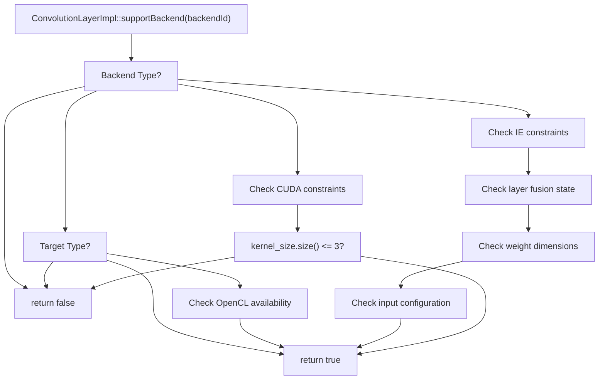
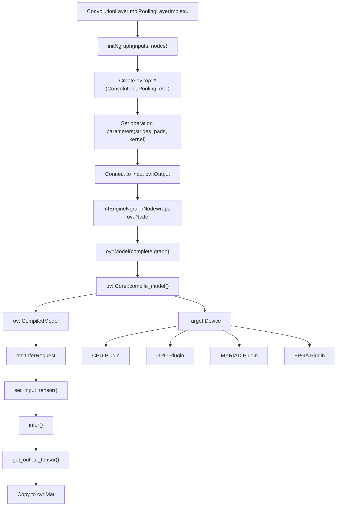
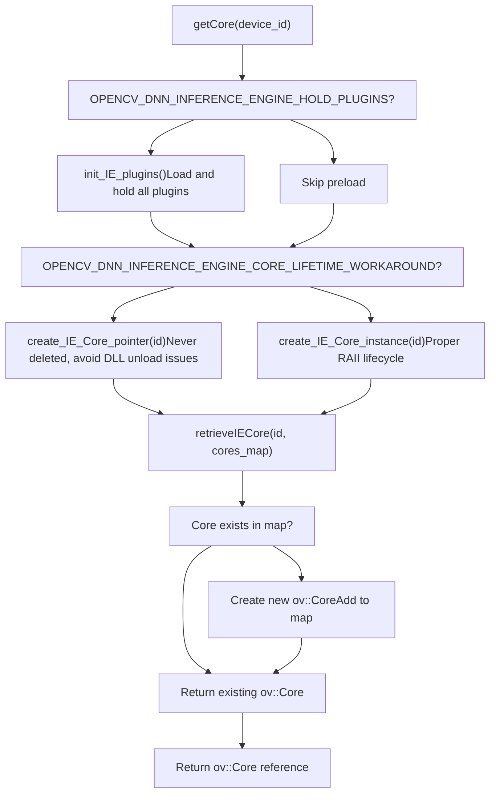
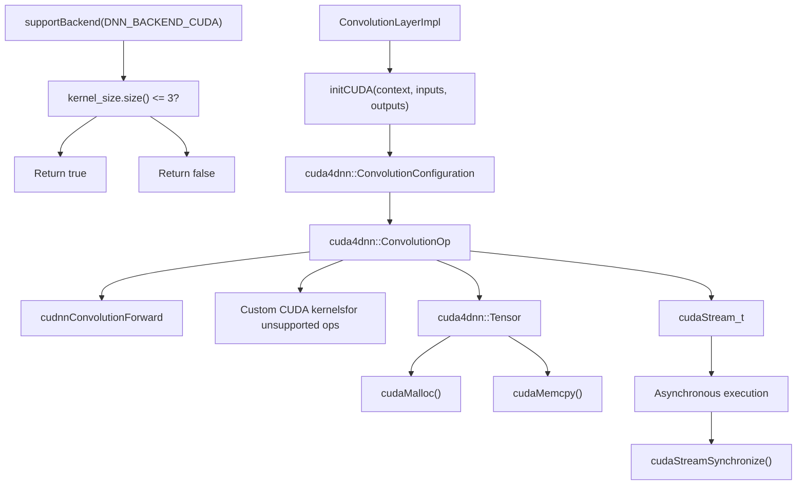
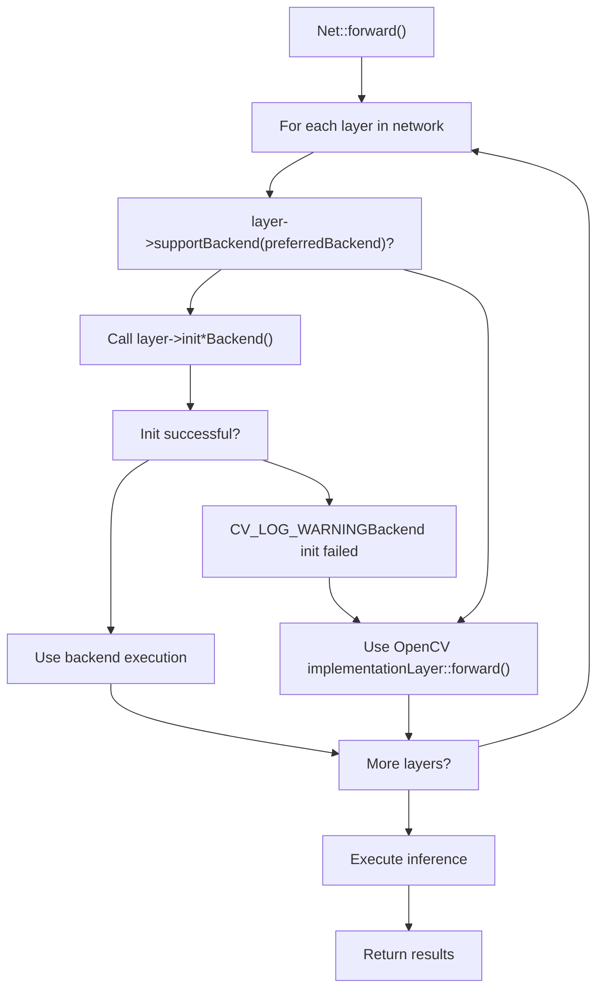
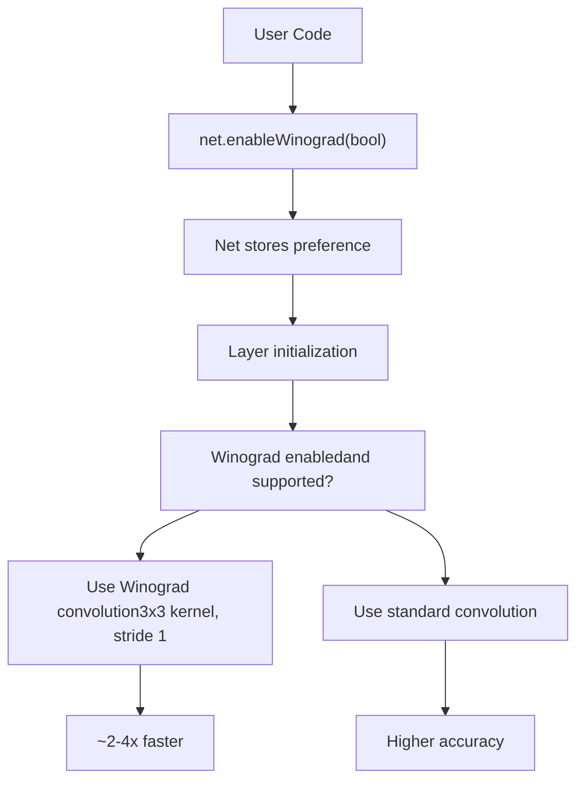
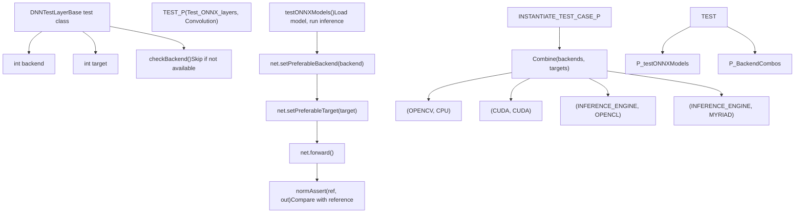

# Network Execution and Backend Selection

Relevant source files

-   [cmake/OpenCVDetectInferenceEngine.cmake](https://github.com/opencv/opencv/blob/91c78f50/cmake/OpenCVDetectInferenceEngine.cmake)
-   [modules/dnn/CMakeLists.txt](https://github.com/opencv/opencv/blob/91c78f50/modules/dnn/CMakeLists.txt)
-   [modules/dnn/include/opencv2/dnn/all\_layers.hpp](https://github.com/opencv/opencv/blob/91c78f50/modules/dnn/include/opencv2/dnn/all_layers.hpp)
-   [modules/dnn/include/opencv2/dnn/dnn.hpp](https://github.com/opencv/opencv/blob/91c78f50/modules/dnn/include/opencv2/dnn/dnn.hpp)
-   [modules/dnn/misc/python/pyopencv\_dnn.hpp](https://github.com/opencv/opencv/blob/91c78f50/modules/dnn/misc/python/pyopencv_dnn.hpp)
-   [modules/dnn/misc/python/test/test\_dnn.py](https://github.com/opencv/opencv/blob/91c78f50/modules/dnn/misc/python/test/test_dnn.py)
-   [modules/dnn/perf/perf\_net.cpp](https://github.com/opencv/opencv/blob/91c78f50/modules/dnn/perf/perf_net.cpp)
-   [modules/dnn/perf/perf\_utils.cpp](https://github.com/opencv/opencv/blob/91c78f50/modules/dnn/perf/perf_utils.cpp)
-   [modules/dnn/src/caffe/caffe\_importer.cpp](https://github.com/opencv/opencv/blob/91c78f50/modules/dnn/src/caffe/caffe_importer.cpp)
-   [modules/dnn/src/cuda/activations.cu](https://github.com/opencv/opencv/blob/91c78f50/modules/dnn/src/cuda/activations.cu)
-   [modules/dnn/src/cuda/functors.hpp](https://github.com/opencv/opencv/blob/91c78f50/modules/dnn/src/cuda/functors.hpp)
-   [modules/dnn/src/cuda/mvn.cu](https://github.com/opencv/opencv/blob/91c78f50/modules/dnn/src/cuda/mvn.cu)
-   [modules/dnn/src/cuda4dnn/kernels/activations.hpp](https://github.com/opencv/opencv/blob/91c78f50/modules/dnn/src/cuda4dnn/kernels/activations.hpp)
-   [modules/dnn/src/cuda4dnn/kernels/mvn.hpp](https://github.com/opencv/opencv/blob/91c78f50/modules/dnn/src/cuda4dnn/kernels/mvn.hpp)
-   [modules/dnn/src/cuda4dnn/primitives/activation.hpp](https://github.com/opencv/opencv/blob/91c78f50/modules/dnn/src/cuda4dnn/primitives/activation.hpp)
-   [modules/dnn/src/cuda4dnn/primitives/group\_norm.hpp](https://github.com/opencv/opencv/blob/91c78f50/modules/dnn/src/cuda4dnn/primitives/group_norm.hpp)
-   [modules/dnn/src/cuda4dnn/primitives/matmul\_broadcast.hpp](https://github.com/opencv/opencv/blob/91c78f50/modules/dnn/src/cuda4dnn/primitives/matmul_broadcast.hpp)
-   [modules/dnn/src/cuda4dnn/primitives/mvn.hpp](https://github.com/opencv/opencv/blob/91c78f50/modules/dnn/src/cuda4dnn/primitives/mvn.hpp)
-   [modules/dnn/src/darknet/darknet\_importer.cpp](https://github.com/opencv/opencv/blob/91c78f50/modules/dnn/src/darknet/darknet_importer.cpp)
-   [modules/dnn/src/darknet/darknet\_io.cpp](https://github.com/opencv/opencv/blob/91c78f50/modules/dnn/src/darknet/darknet_io.cpp)
-   [modules/dnn/src/darknet/darknet\_io.hpp](https://github.com/opencv/opencv/blob/91c78f50/modules/dnn/src/darknet/darknet_io.hpp)
-   [modules/dnn/src/dnn.cpp](https://github.com/opencv/opencv/blob/91c78f50/modules/dnn/src/dnn.cpp)
-   [modules/dnn/src/dnn\_common.hpp](https://github.com/opencv/opencv/blob/91c78f50/modules/dnn/src/dnn_common.hpp)
-   [modules/dnn/src/dnn\_utils.cpp](https://github.com/opencv/opencv/blob/91c78f50/modules/dnn/src/dnn_utils.cpp)
-   [modules/dnn/src/graph\_simplifier.cpp](https://github.com/opencv/opencv/blob/91c78f50/modules/dnn/src/graph_simplifier.cpp)
-   [modules/dnn/src/graph\_simplifier.hpp](https://github.com/opencv/opencv/blob/91c78f50/modules/dnn/src/graph_simplifier.hpp)
-   [modules/dnn/src/ie\_ngraph.cpp](https://github.com/opencv/opencv/blob/91c78f50/modules/dnn/src/ie_ngraph.cpp)
-   [modules/dnn/src/ie\_ngraph.hpp](https://github.com/opencv/opencv/blob/91c78f50/modules/dnn/src/ie_ngraph.hpp)
-   [modules/dnn/src/init.cpp](https://github.com/opencv/opencv/blob/91c78f50/modules/dnn/src/init.cpp)
-   [modules/dnn/src/layers/batch\_norm\_layer.cpp](https://github.com/opencv/opencv/blob/91c78f50/modules/dnn/src/layers/batch_norm_layer.cpp)
-   [modules/dnn/src/layers/blank\_layer.cpp](https://github.com/opencv/opencv/blob/91c78f50/modules/dnn/src/layers/blank_layer.cpp)
-   [modules/dnn/src/layers/concat\_layer.cpp](https://github.com/opencv/opencv/blob/91c78f50/modules/dnn/src/layers/concat_layer.cpp)
-   [modules/dnn/src/layers/convolution\_layer.cpp](https://github.com/opencv/opencv/blob/91c78f50/modules/dnn/src/layers/convolution_layer.cpp)
-   [modules/dnn/src/layers/cpu\_kernels/fast\_norm.cpp](https://github.com/opencv/opencv/blob/91c78f50/modules/dnn/src/layers/cpu_kernels/fast_norm.cpp)
-   [modules/dnn/src/layers/cpu\_kernels/fast\_norm.hpp](https://github.com/opencv/opencv/blob/91c78f50/modules/dnn/src/layers/cpu_kernels/fast_norm.hpp)
-   [modules/dnn/src/layers/detection\_output\_layer.cpp](https://github.com/opencv/opencv/blob/91c78f50/modules/dnn/src/layers/detection_output_layer.cpp)
-   [modules/dnn/src/layers/elementwise\_layers.cpp](https://github.com/opencv/opencv/blob/91c78f50/modules/dnn/src/layers/elementwise_layers.cpp)
-   [modules/dnn/src/layers/fully\_connected\_layer.cpp](https://github.com/opencv/opencv/blob/91c78f50/modules/dnn/src/layers/fully_connected_layer.cpp)
-   [modules/dnn/src/layers/group\_norm\_layer.cpp](https://github.com/opencv/opencv/blob/91c78f50/modules/dnn/src/layers/group_norm_layer.cpp)
-   [modules/dnn/src/layers/layers\_common.simd.hpp](https://github.com/opencv/opencv/blob/91c78f50/modules/dnn/src/layers/layers_common.simd.hpp)
-   [modules/dnn/src/layers/lrn\_layer.cpp](https://github.com/opencv/opencv/blob/91c78f50/modules/dnn/src/layers/lrn_layer.cpp)
-   [modules/dnn/src/layers/mvn\_layer.cpp](https://github.com/opencv/opencv/blob/91c78f50/modules/dnn/src/layers/mvn_layer.cpp)
-   [modules/dnn/src/layers/normalize\_bbox\_layer.cpp](https://github.com/opencv/opencv/blob/91c78f50/modules/dnn/src/layers/normalize_bbox_layer.cpp)
-   [modules/dnn/src/layers/permute\_layer.cpp](https://github.com/opencv/opencv/blob/91c78f50/modules/dnn/src/layers/permute_layer.cpp)
-   [modules/dnn/src/layers/pooling\_layer.cpp](https://github.com/opencv/opencv/blob/91c78f50/modules/dnn/src/layers/pooling_layer.cpp)
-   [modules/dnn/src/layers/prior\_box\_layer.cpp](https://github.com/opencv/opencv/blob/91c78f50/modules/dnn/src/layers/prior_box_layer.cpp)
-   [modules/dnn/src/layers/proposal\_layer.cpp](https://github.com/opencv/opencv/blob/91c78f50/modules/dnn/src/layers/proposal_layer.cpp)
-   [modules/dnn/src/layers/recurrent\_layers.cpp](https://github.com/opencv/opencv/blob/91c78f50/modules/dnn/src/layers/recurrent_layers.cpp)
-   [modules/dnn/src/layers/region\_layer.cpp](https://github.com/opencv/opencv/blob/91c78f50/modules/dnn/src/layers/region_layer.cpp)
-   [modules/dnn/src/layers/reorg\_layer.cpp](https://github.com/opencv/opencv/blob/91c78f50/modules/dnn/src/layers/reorg_layer.cpp)
-   [modules/dnn/src/layers/reshape\_layer.cpp](https://github.com/opencv/opencv/blob/91c78f50/modules/dnn/src/layers/reshape_layer.cpp)
-   [modules/dnn/src/layers/scale\_layer.cpp](https://github.com/opencv/opencv/blob/91c78f50/modules/dnn/src/layers/scale_layer.cpp)
-   [modules/dnn/src/layers/slice\_layer.cpp](https://github.com/opencv/opencv/blob/91c78f50/modules/dnn/src/layers/slice_layer.cpp)
-   [modules/dnn/src/layers/softmax\_layer.cpp](https://github.com/opencv/opencv/blob/91c78f50/modules/dnn/src/layers/softmax_layer.cpp)
-   [modules/dnn/src/model.cpp](https://github.com/opencv/opencv/blob/91c78f50/modules/dnn/src/model.cpp)
-   [modules/dnn/src/net\_openvino.cpp](https://github.com/opencv/opencv/blob/91c78f50/modules/dnn/src/net_openvino.cpp)
-   [modules/dnn/src/onnx/onnx\_graph\_simplifier.cpp](https://github.com/opencv/opencv/blob/91c78f50/modules/dnn/src/onnx/onnx_graph_simplifier.cpp)
-   [modules/dnn/src/onnx/onnx\_graph\_simplifier.hpp](https://github.com/opencv/opencv/blob/91c78f50/modules/dnn/src/onnx/onnx_graph_simplifier.hpp)
-   [modules/dnn/src/onnx/onnx\_importer.cpp](https://github.com/opencv/opencv/blob/91c78f50/modules/dnn/src/onnx/onnx_importer.cpp)
-   [modules/dnn/src/op\_inf\_engine.cpp](https://github.com/opencv/opencv/blob/91c78f50/modules/dnn/src/op_inf_engine.cpp)
-   [modules/dnn/src/op\_inf\_engine.hpp](https://github.com/opencv/opencv/blob/91c78f50/modules/dnn/src/op_inf_engine.hpp)
-   [modules/dnn/src/opencl/activations.cl](https://github.com/opencv/opencv/blob/91c78f50/modules/dnn/src/opencl/activations.cl)
-   [modules/dnn/src/opencl/mvn.cl](https://github.com/opencv/opencv/blob/91c78f50/modules/dnn/src/opencl/mvn.cl)
-   [modules/dnn/src/opencl/prior\_box.cl](https://github.com/opencv/opencv/blob/91c78f50/modules/dnn/src/opencl/prior_box.cl)
-   [modules/dnn/src/opencl/region.cl](https://github.com/opencv/opencv/blob/91c78f50/modules/dnn/src/opencl/region.cl)
-   [modules/dnn/src/tensorflow/tf\_graph\_simplifier.cpp](https://github.com/opencv/opencv/blob/91c78f50/modules/dnn/src/tensorflow/tf_graph_simplifier.cpp)
-   [modules/dnn/src/tensorflow/tf\_graph\_simplifier.hpp](https://github.com/opencv/opencv/blob/91c78f50/modules/dnn/src/tensorflow/tf_graph_simplifier.hpp)
-   [modules/dnn/src/tensorflow/tf\_importer.cpp](https://github.com/opencv/opencv/blob/91c78f50/modules/dnn/src/tensorflow/tf_importer.cpp)
-   [modules/dnn/src/torch/torch\_importer.cpp](https://github.com/opencv/opencv/blob/91c78f50/modules/dnn/src/torch/torch_importer.cpp)
-   [modules/dnn/test/test\_backends.cpp](https://github.com/opencv/opencv/blob/91c78f50/modules/dnn/test/test_backends.cpp)
-   [modules/dnn/test/test\_caffe\_importer.cpp](https://github.com/opencv/opencv/blob/91c78f50/modules/dnn/test/test_caffe_importer.cpp)
-   [modules/dnn/test/test\_common.hpp](https://github.com/opencv/opencv/blob/91c78f50/modules/dnn/test/test_common.hpp)
-   [modules/dnn/test/test\_common.impl.hpp](https://github.com/opencv/opencv/blob/91c78f50/modules/dnn/test/test_common.impl.hpp)
-   [modules/dnn/test/test\_darknet\_importer.cpp](https://github.com/opencv/opencv/blob/91c78f50/modules/dnn/test/test_darknet_importer.cpp)
-   [modules/dnn/test/test\_graph\_simplifier.cpp](https://github.com/opencv/opencv/blob/91c78f50/modules/dnn/test/test_graph_simplifier.cpp)
-   [modules/dnn/test/test\_ie\_models.cpp](https://github.com/opencv/opencv/blob/91c78f50/modules/dnn/test/test_ie_models.cpp)
-   [modules/dnn/test/test\_layers.cpp](https://github.com/opencv/opencv/blob/91c78f50/modules/dnn/test/test_layers.cpp)
-   [modules/dnn/test/test\_misc.cpp](https://github.com/opencv/opencv/blob/91c78f50/modules/dnn/test/test_misc.cpp)
-   [modules/dnn/test/test\_model.cpp](https://github.com/opencv/opencv/blob/91c78f50/modules/dnn/test/test_model.cpp)
-   [modules/dnn/test/test\_onnx\_importer.cpp](https://github.com/opencv/opencv/blob/91c78f50/modules/dnn/test/test_onnx_importer.cpp)
-   [modules/dnn/test/test\_tf\_importer.cpp](https://github.com/opencv/opencv/blob/91c78f50/modules/dnn/test/test_tf_importer.cpp)
-   [modules/dnn/test/test\_torch\_importer.cpp](https://github.com/opencv/opencv/blob/91c78f50/modules/dnn/test/test_torch_importer.cpp)
-   [modules/flann/misc/python/pyopencv\_flann.hpp](https://github.com/opencv/opencv/blob/91c78f50/modules/flann/misc/python/pyopencv_flann.hpp)
-   [modules/ml/misc/python/pyopencv\_ml.hpp](https://github.com/opencv/opencv/blob/91c78f50/modules/ml/misc/python/pyopencv_ml.hpp)

## Purpose and Scope

This document describes how OpenCV DNN module executes neural networks across different computational backends and hardware targets. It covers the backend selection mechanism, layer-level backend support, backend-specific initialization, and the execution flow from network configuration to inference.

For information about model import and graph construction, see [Model Importers](/opencv/opencv/5.1-model-importers-(onnx-tensorflow-caffe-darknet)). For details on specific layer implementations, see the layer documentation in other sections.

---

## Backend and Target Enumeration

OpenCV DNN provides an abstraction layer that allows the same network to execute on different computational backends and hardware targets. The backend determines the execution engine, while the target specifies the hardware device.

### Supported Backends and Targets

```mermaid
flowchart TD
    BACKEND["cv::dnn::Backend enum"]
    OPENCV["DNN_BACKEND_OPENCVPure OpenCV implementation"]
    IE["DNN_BACKEND_INFERENCE_ENGINEIntel OpenVINO"]
    CUDA["DNN_BACKEND_CUDANVIDIA CUDA + cuDNN"]
    HALIDE["DNN_BACKEND_HALIDEHalide compiler"]
    VKCOM["DNN_BACKEND_VKCOMVulkan Compute"]
    WEBNN["DNN_BACKEND_WEBNNWeb Neural Network API"]
    TIMVX["DNN_BACKEND_TIMVXVeriSilicon TIM-VX"]
    CANN["DNN_BACKEND_CANNHuawei CANN"]
    TARGET["cv::dnn::Target enum"]
    CPU["DNN_TARGET_CPU"]
    OPENCL["DNN_TARGET_OPENCL"]
    OPENCL_FP16["DNN_TARGET_OPENCL_FP16"]
    MYRIAD["DNN_TARGET_MYRIADIntel Movidius"]
    CUDA_T["DNN_TARGET_CUDA"]
    CUDA_FP16["DNN_TARGET_CUDA_FP16"]
    FPGA["DNN_TARGET_FPGA"]
    HDDL["DNN_TARGET_HDDL"]
    NPU["DNN_TARGET_NPU"]
    CPU_FP16["DNN_TARGET_CPU_FP16"]

    BACKEND --> OPENCV
    BACKEND --> IE
    BACKEND --> CUDA
    BACKEND --> HALIDE
    BACKEND --> VKCOM
    BACKEND --> WEBNN
    BACKEND --> TIMVX
    BACKEND --> CANN
    TARGET --> CPU
    TARGET --> OPENCL
    TARGET --> OPENCL_FP16
    TARGET --> MYRIAD
    TARGET --> CUDA_T
    TARGET --> CUDA_FP16
    TARGET --> FPGA
    TARGET --> HDDL
    TARGET --> NPU
    TARGET --> CPU_FP16
    OPENCV --> CPU
    OPENCV --> OPENCL
    OPENCV --> OPENCL_FP16
    IE --> CPU
    IE --> OPENCL
    IE --> MYRIAD
    IE --> FPGA
    CUDA --> CUDA_T
    CUDA --> CUDA_FP16
```


**Sources:**

-   [modules/dnn/include/opencv2/dnn/dnn.hpp70-108](https://github.com/opencv/opencv/blob/91c78f50/modules/dnn/include/opencv2/dnn/dnn.hpp#L70-L108)

---

## Network Configuration Flow

The user configures backend and target selection through the `cv::dnn::Net` class. This configuration propagates to all layers during network initialization.

### Configuration API and Execution Setup

> **[Mermaid sequence]**
> *(图表结构无法解析)*

**Key API Methods:**

| Method | Purpose | Location |
| --- | --- | --- |
| `Net::setPreferableBackend(int)` | Configure execution backend | `cv::dnn::Net` |
| `Net::setPreferableTarget(int)` | Configure hardware target | `cv::dnn::Net` |
| `Layer::supportBackend(int)` | Check if layer supports backend | `cv::dnn::Layer` |
| `Layer::init*()` | Create backend-specific nodes | `cv::dnn::Layer` |

**Sources:**

-   [modules/dnn/include/opencv2/dnn/dnn.hpp315-370](https://github.com/opencv/opencv/blob/91c78f50/modules/dnn/include/opencv2/dnn/dnn.hpp#L315-L370)
-   [modules/dnn/test/test\_backends.cpp14-73](https://github.com/opencv/opencv/blob/91c78f50/modules/dnn/test/test_backends.cpp#L14-L73)

---

## Layer Backend Support Architecture

Each layer implementation determines which backends it supports through the `supportBackend()` method and provides backend-specific initialization through `init*()` methods.

### Backend Support Interface

```mermaid
flowchart TD
    Layer["cv::dnn::Layer"]
    supportBackend["virtual boolsupportBackend(backendId)"]
    initHalide["virtual Ptr<BackendNode>initHalide(inputs)"]
    initNgraph["virtual Ptr<BackendNode>initNgraph(inputs, nodes)"]
    initVkCom["virtual Ptr<BackendNode>initVkCom(inputs, outputs)"]
    initWebnn["virtual Ptr<BackendNode>initWebnn(inputs, nodes)"]
    initCUDA["virtual Ptr<BackendNode>initCUDA(context, inputs, outputs)"]
    initTimVX["virtual Ptr<BackendNode>initTimVX(info, inputs, outputs)"]
    initCann["virtual Ptr<BackendNode>initCann(inputs, outputs, nodes)"]
    ConvLayer["ConvolutionLayerImpl"]
    supportBackend_impl["supportBackend()checks CUDA/OpenCL/IE support"]
    initCUDA_impl["initCUDA()creates CUDA convolution primitive"]
    initNgraph_impl["initNgraph()creates OpenVINO IR node"]
    BackendNode["BackendNodeBase class"]
    HalideNode["HalideBackendNodeHalide::Func"]
    NgraphNode["InfEngineNgraphNodeov::Node"]
    CUDANode["CUDABackendNodeCUDA kernel wrapper"]
    VkComNode["VkComBackendNodeVulkan shader"]
    WebnnNode["WebnnBackendNodeWebNN operator"]

    Layer --> supportBackend
    Layer --> initHalide
    Layer --> initNgraph
    Layer --> initVkCom
    Layer --> initWebnn
    Layer --> initCUDA
    Layer --> initTimVX
    Layer --> initCann
    ConvLayer --> supportBackend_impl
    ConvLayer --> initCUDA_impl
    ConvLayer --> initNgraph_impl
    Layer --> ConvLayer
    initHalide --> HalideNode
    initNgraph --> NgraphNode
    initCUDA --> CUDANode
    initVkCom --> VkComNode
    initWebnn --> WebnnNode
```


**Backend Node Types:**

| Backend | Node Class | Purpose |
| --- | --- | --- |
| Halide | `HalideBackendNode` | Wraps Halide::Func for JIT compilation |
| OpenVINO | `InfEngineNgraphNode` | Wraps ov::Node for IE execution |
| CUDA | `CUDABackendNode` | Wraps CUDA kernel launch configuration |
| Vulkan | `VkComBackendNode` | Wraps Vulkan compute shader |
| WebNN | `WebnnBackendNode` | Wraps WebNN ML operator |

**Sources:**

-   [modules/dnn/include/opencv2/dnn/dnn.hpp158-211](https://github.com/opencv/opencv/blob/91c78f50/modules/dnn/include/opencv2/dnn/dnn.hpp#L158-L211)
-   [modules/dnn/include/opencv2/dnn/dnn.hpp315-370](https://github.com/opencv/opencv/blob/91c78f50/modules/dnn/include/opencv2/dnn/dnn.hpp#L315-L370)
-   [modules/dnn/src/layers/convolution\_layer.cpp300-400](https://github.com/opencv/opencv/blob/91c78f50/modules/dnn/src/layers/convolution_layer.cpp#L300-L400)

---

## Concrete Implementation: Convolution Layer

The convolution layer demonstrates how backend support is implemented in practice. Each backend requires specific configuration and may have different limitations.

### Convolution Backend Support Logic


**Example: CUDA Backend Initialization**

**Sources:**

-   [modules/dnn/src/layers/convolution\_layer.cpp300-400](https://github.com/opencv/opencv/blob/91c78f50/modules/dnn/src/layers/convolution_layer.cpp#L300-L400)
-   [modules/dnn/src/layers/convolution\_layer.cpp600-900](https://github.com/opencv/opencv/blob/91c78f50/modules/dnn/src/layers/convolution_layer.cpp#L600-L900)

---

## Backend Wrapper System

The `BackendWrapper` abstraction manages data transfer between host (CPU) memory and device (GPU, accelerator) memory. Different backends have different wrapper implementations.

### BackendWrapper Hierarchy


**Wrapper Responsibilities:**

| Operation | Purpose | Implementation |
| --- | --- | --- |
| `copyToHost()` | Transfer data from device to CPU | Synchronizes device memory to Mat |
| `setHostDirty()` | Mark CPU data as modified | Triggers upload on next device access |
| Construction | Allocate device memory | Creates device buffer, copies from Mat |

**Sources:**

-   [modules/dnn/include/opencv2/dnn/dnn.hpp171-211](https://github.com/opencv/opencv/blob/91c78f50/modules/dnn/include/opencv2/dnn/dnn.hpp#L171-L211)
-   [modules/dnn/src/op\_inf\_engine.cpp42-66](https://github.com/opencv/opencv/blob/91c78f50/modules/dnn/src/op_inf_engine.cpp#L42-L66)

---

## Inference Engine (OpenVINO) Backend

The OpenVINO backend is one of the most feature-complete backends, supporting Intel CPUs, GPUs, and VPUs (Myriad, HDDL). It uses OpenVINO's nGraph intermediate representation.

### OpenVINO Integration Architecture


**Key OpenVINO Classes:**

| OpenCV Class | OpenVINO Equivalent | Purpose |
| --- | --- | --- |
| `InfEngineNgraphNode` | `ov::Node` | Wraps single operation |
| `InfEngineNgraphNet` | `ov::Model` | Complete network graph |
| `InfEngineBackendWrapper` | `ov::Tensor` | Input/output data wrapper |
| `NgraphBackendNode` | Backend execution node | Manages compiled model |

**Sources:**

-   [modules/dnn/src/op\_inf\_engine.hpp1-100](https://github.com/opencv/opencv/blob/91c78f50/modules/dnn/src/op_inf_engine.hpp#L1-L100)
-   [modules/dnn/src/op\_inf\_engine.cpp68-234](https://github.com/opencv/opencv/blob/91c78f50/modules/dnn/src/op_inf_engine.cpp#L68-L234)
-   [modules/dnn/src/ie\_ngraph.cpp1-100](https://github.com/opencv/opencv/blob/91c78f50/modules/dnn/src/ie_ngraph.cpp#L1-L100)

---

## OpenVINO Core Management

OpenVINO requires a `ov::Core` object to manage plugins and compile models. OpenCV manages this through a singleton pattern with plugin lifetime management.

### Core Instance Management


**Configuration Parameters:**

| Parameter | Default | Purpose |
| --- | --- | --- |
| `OPENCV_DNN_INFERENCE_ENGINE_HOLD_PLUGINS` | true | Pre-load plugins to avoid memory leak tools reporting |
| `OPENCV_DNN_INFERENCE_ENGINE_CORE_LIFETIME_WORKAROUND` | true (Windows), false (Linux) | Avoid DLL unload issues on Windows |
| `OPENCV_DNN_IE_VPU_TYPE` | auto-detect | Force Myriad2 vs MyriadX detection |

**Sources:**

-   [modules/dnn/src/op\_inf\_engine.cpp68-138](https://github.com/opencv/opencv/blob/91c78f50/modules/dnn/src/op_inf_engine.cpp#L68-L138)
-   [cmake/OpenCVDetectInferenceEngine.cmake1-16](https://github.com/opencv/opencv/blob/91c78f50/cmake/OpenCVDetectInferenceEngine.cmake#L1-L16)

---

## CUDA Backend Execution

The CUDA backend provides high-performance inference on NVIDIA GPUs using cuDNN for optimized primitives and custom CUDA kernels for operations not covered by cuDNN.

### CUDA Backend Components


**CUDA Backend Limitations:**

| Layer Type | Constraint | Reason |
| --- | --- | --- |
| Convolution | 1D, 2D, 3D only | cuDNN API limitation |
| Broadcasting | Limited patterns | Custom kernel complexity |
| Dynamic shapes | Not always supported | Requires recompilation |

**Sources:**

-   [modules/dnn/src/layers/convolution\_layer.cpp303-311](https://github.com/opencv/opencv/blob/91c78f50/modules/dnn/src/layers/convolution_layer.cpp#L303-L311)
-   [modules/dnn/CMakeLists.txt38-56](https://github.com/opencv/opencv/blob/91c78f50/modules/dnn/CMakeLists.txt#L38-L56)

---

## Backend Fallback Mechanism

When a layer doesn't support the requested backend, OpenCV automatically falls back to the default OpenCV implementation on CPU.

### Fallback Decision Flow


**Fallback Logging:**

When backend initialization fails or a layer doesn't support the backend, OpenCV logs diagnostic information:

```
[DNN] Layer 'conv1' does not support CUDA backend, using OpenCV implementation
[DNN] Failed to initialize OpenVINO backend for 'fc8', falling back to CPU
```
**Sources:**

-   [modules/dnn/test/test\_backends.cpp20-73](https://github.com/opencv/opencv/blob/91c78f50/modules/dnn/test/test_backends.cpp#L20-L73)
-   [modules/dnn/test/test\_layers.cpp96-163](https://github.com/opencv/opencv/blob/91c78f50/modules/dnn/test/test_layers.cpp#L96-L163)

---

## Winograd Optimization Control

The Winograd convolution algorithm provides faster execution for certain kernel sizes but may have accuracy trade-offs. OpenCV allows per-network control of this optimization.

### Winograd Configuration


**API Usage:**

```
cv::dnn::Net net = cv::dnn::readNet("model.onnx");net.setPreferableBackend(cv::dnn::DNN_BACKEND_OPENCV);net.enableWinograd(false);  // Disable for accuracy-critical applications
```
**When Winograd Applies:**

| Condition | Requirement |
| --- | --- |
| Kernel size | 3x3 or 5x5 |
| Stride | 1x1 |
| Dilation | 1x1 |
| Input channels | \> 2 |
| Backend | OpenCV CPU or OpenCL |

**Sources:**

-   [modules/dnn/test/test\_onnx\_importer.cpp68-95](https://github.com/opencv/opencv/blob/91c78f50/modules/dnn/test/test_onnx_importer.cpp#L68-L95)
-   [modules/dnn/test/test\_darknet\_importer.cpp76-99](https://github.com/opencv/opencv/blob/91c78f50/modules/dnn/test/test_darknet_importer.cpp#L76-L99)

---

## Testing and Validation

OpenCV includes extensive tests to validate backend behavior and ensure consistency across implementations.

### Backend Test Structure


**Test Example Pattern:**

```
TEST_P(Test_ONNX_layers, Convolution) {    testONNXModels("convolution");  // Model name} // Runs the same test with all backend/target combinations
```
**Sources:**

-   [modules/dnn/test/test\_onnx\_importer.cpp31-128](https://github.com/opencv/opencv/blob/91c78f50/modules/dnn/test/test_onnx_importer.cpp#L31-L128)
-   [modules/dnn/test/test\_backends.cpp13-136](https://github.com/opencv/opencv/blob/91c78f50/modules/dnn/test/test_backends.cpp#L13-L136)
-   [modules/dnn/test/test\_common.hpp1-100](https://github.com/opencv/opencv/blob/91c78f50/modules/dnn/test/test_common.hpp#L1-L100)

---

## Summary of Key Classes and Functions

| Component | Location | Purpose |
| --- | --- | --- |
| `cv::dnn::Net` | `modules/dnn/include/opencv2/dnn/dnn.hpp` | Main network interface, manages backend selection |
| `cv::dnn::Layer` | `modules/dnn/include/opencv2/dnn/dnn.hpp` | Base layer class with backend support interface |
| `cv::dnn::BackendNode` | `modules/dnn/include/opencv2/dnn/dnn.hpp:158-166` | Backend-specific execution node wrapper |
| `cv::dnn::BackendWrapper` | `modules/dnn/include/opencv2/dnn/dnn.hpp:171-211` | Device memory management abstraction |
| `getCore()` | `modules/dnn/src/op_inf_engine.cpp:100-121` | OpenVINO Core singleton management |
| `Layer::supportBackend()` | `modules/dnn/include/opencv2/dnn/dnn.hpp:315` | Check backend support for layer |
| `Layer::init*()` methods | `modules/dnn/include/opencv2/dnn/dnn.hpp:327-370` | Create backend-specific nodes |
| `Net::setPreferableBackend()` | `cv::dnn::Net` API | Configure execution backend |
| `Net::setPreferableTarget()` | `cv::dnn::Net` API | Configure hardware target |
| `Net::enableWinograd()` | `cv::dnn::Net` API | Control Winograd optimization |
