# Feature Detection and Matching (features2d)

Relevant source files

-   [modules/features2d/include/opencv2/features2d.hpp](https://github.com/opencv/opencv/blob/91c78f50/modules/features2d/include/opencv2/features2d.hpp)
-   [modules/features2d/include/opencv2/features2d/features2d.hpp](https://github.com/opencv/opencv/blob/91c78f50/modules/features2d/include/opencv2/features2d/features2d.hpp)
-   [modules/features2d/src/agast.cpp](https://github.com/opencv/opencv/blob/91c78f50/modules/features2d/src/agast.cpp)
-   [modules/features2d/src/agast\_score.cpp](https://github.com/opencv/opencv/blob/91c78f50/modules/features2d/src/agast_score.cpp)
-   [modules/features2d/src/agast\_score.hpp](https://github.com/opencv/opencv/blob/91c78f50/modules/features2d/src/agast_score.hpp)
-   [modules/features2d/src/bagofwords.cpp](https://github.com/opencv/opencv/blob/91c78f50/modules/features2d/src/bagofwords.cpp)
-   [modules/features2d/src/blobdetector.cpp](https://github.com/opencv/opencv/blob/91c78f50/modules/features2d/src/blobdetector.cpp)
-   [modules/features2d/src/brisk.cpp](https://github.com/opencv/opencv/blob/91c78f50/modules/features2d/src/brisk.cpp)
-   [modules/features2d/src/draw.cpp](https://github.com/opencv/opencv/blob/91c78f50/modules/features2d/src/draw.cpp)
-   [modules/features2d/src/dynamic.cpp](https://github.com/opencv/opencv/blob/91c78f50/modules/features2d/src/dynamic.cpp)
-   [modules/features2d/src/evaluation.cpp](https://github.com/opencv/opencv/blob/91c78f50/modules/features2d/src/evaluation.cpp)
-   [modules/features2d/src/fast.cpp](https://github.com/opencv/opencv/blob/91c78f50/modules/features2d/src/fast.cpp)
-   [modules/features2d/src/feature2d.cpp](https://github.com/opencv/opencv/blob/91c78f50/modules/features2d/src/feature2d.cpp)
-   [modules/features2d/src/gftt.cpp](https://github.com/opencv/opencv/blob/91c78f50/modules/features2d/src/gftt.cpp)
-   [modules/features2d/src/keypoint.cpp](https://github.com/opencv/opencv/blob/91c78f50/modules/features2d/src/keypoint.cpp)
-   [modules/features2d/src/matchers.cpp](https://github.com/opencv/opencv/blob/91c78f50/modules/features2d/src/matchers.cpp)
-   [modules/features2d/src/mser.cpp](https://github.com/opencv/opencv/blob/91c78f50/modules/features2d/src/mser.cpp)
-   [modules/features2d/src/orb.cpp](https://github.com/opencv/opencv/blob/91c78f50/modules/features2d/src/orb.cpp)
-   [modules/features2d/test/test\_agast.cpp](https://github.com/opencv/opencv/blob/91c78f50/modules/features2d/test/test_agast.cpp)
-   [modules/features2d/test/test\_blobdetector.cpp](https://github.com/opencv/opencv/blob/91c78f50/modules/features2d/test/test_blobdetector.cpp)
-   [modules/features2d/test/test\_brisk.cpp](https://github.com/opencv/opencv/blob/91c78f50/modules/features2d/test/test_brisk.cpp)
-   [modules/features2d/test/test\_descriptors\_regression.cpp](https://github.com/opencv/opencv/blob/91c78f50/modules/features2d/test/test_descriptors_regression.cpp)
-   [modules/features2d/test/test\_detectors\_regression.cpp](https://github.com/opencv/opencv/blob/91c78f50/modules/features2d/test/test_detectors_regression.cpp)
-   [modules/features2d/test/test\_drawing.cpp](https://github.com/opencv/opencv/blob/91c78f50/modules/features2d/test/test_drawing.cpp)
-   [modules/features2d/test/test\_keypoints.cpp](https://github.com/opencv/opencv/blob/91c78f50/modules/features2d/test/test_keypoints.cpp)
-   [modules/features2d/test/test\_matchers\_algorithmic.cpp](https://github.com/opencv/opencv/blob/91c78f50/modules/features2d/test/test_matchers_algorithmic.cpp)
-   [modules/features2d/test/test\_orb.cpp](https://github.com/opencv/opencv/blob/91c78f50/modules/features2d/test/test_orb.cpp)
-   [modules/features2d/test/test\_utils.cpp](https://github.com/opencv/opencv/blob/91c78f50/modules/features2d/test/test_utils.cpp)
-   [modules/java/generator/src/cpp/jni\_part.cpp](https://github.com/opencv/opencv/blob/91c78f50/modules/java/generator/src/cpp/jni_part.cpp)
-   [samples/cpp/em.cpp](https://github.com/opencv/opencv/blob/91c78f50/samples/cpp/em.cpp)
-   [samples/cpp/letter\_recog.cpp](https://github.com/opencv/opencv/blob/91c78f50/samples/cpp/letter_recog.cpp)
-   [samples/cpp/points\_classifier.cpp](https://github.com/opencv/opencv/blob/91c78f50/samples/cpp/points_classifier.cpp)
-   [samples/cpp/watershed.cpp](https://github.com/opencv/opencv/blob/91c78f50/samples/cpp/watershed.cpp)

## Purpose and Scope

The `features2d` module provides fundamental computer vision capabilities for detecting, describing, and matching local image features. This module forms the foundation for tasks such as object recognition, image stitching, structure-from-motion, and visual SLAM. It implements both classical feature detectors (SIFT, ORB, AKAZE) and descriptor matching algorithms, along with supporting infrastructure for feature evaluation and visualization.

For detailed information about specific feature detection algorithms (SIFT, ORB, AKAZE, and others), see page 6.1. For in-depth coverage of matching strategies and the Bag-of-Words framework, see page 6.2.

**Sources:** [modules/features2d/include/opencv2/features2d.hpp76-224](https://github.com/opencv/opencv/blob/91c78f50/modules/features2d/include/opencv2/features2d.hpp#L76-L224) [modules/features2d/src/matchers.cpp1-50](https://github.com/opencv/opencv/blob/91c78f50/modules/features2d/src/matchers.cpp#L1-L50) [modules/features2d/src/keypoint.cpp1-50](https://github.com/opencv/opencv/blob/91c78f50/modules/features2d/src/keypoint.cpp#L1-L50) [modules/features2d/src/bagofwords.cpp1-50](https://github.com/opencv/opencv/blob/91c78f50/modules/features2d/src/bagofwords.cpp#L1-L50)

---

## Module Architecture

The features2d module is organized into several interconnected subsystems that transform images into feature-based representations and establish correspondences between images.

### Component Hierarchy

The central abstraction is `Feature2D`, which is both the `FeatureDetector` and `DescriptorExtractor` (both are typedefs for `Feature2D`). All concrete detector/descriptor classes inherit from it.

**Class/typedef map (from `features2d.hpp`):**

```mermaid
flowchart TD
    KPF["KeyPointsFilter"]
    DRAW["drawKeypointsdrawMatchesdrawMatchesKnn"]
    EVAL["evaluateFeatureDetectorcomputeRecallPrecisionCurve"]
    BOW_T["BOWTrainer"]
    BOW_KM["BOWKMeansTrainer"]
    BOW_EX["BOWImgDescriptorExtractor"]
    DM["DescriptorMatcher"]
    BF["BFMatcher"]
    FLANN["FlannBasedMatcher"]
    F2D["Feature2D(also typedef'd as FeatureDetectorand DescriptorExtractor)"]
    SIFT["SIFT"]
    ORB["ORB"]
    BRISK["BRISK"]
    KAZE["KAZE"]
    AKAZE["AKAZE"]
    FAST["FastFeatureDetector"]
    AGAST["AgastFeatureDetector"]
    GFTT["GFTTDetector"]
    MSER["MSER"]
    BLOB["SimpleBlobDetector"]
    AFF["AffineFeature"]

    F2D --> SIFT
    F2D --> ORB
    F2D --> BRISK
    F2D --> KAZE
    F2D --> AKAZE
    F2D --> FAST
    F2D --> AGAST
    F2D --> GFTT
    F2D --> MSER
    F2D --> BLOB
    F2D --> AFF
    BOW --> T_BOW_KM
    DM --> BF
    DM --> FLANN
```
Sources: [modules/features2d/include/opencv2/features2d.hpp130-260](https://github.com/opencv/opencv/blob/91c78f50/modules/features2d/include/opencv2/features2d.hpp#L130-L260) [modules/features2d/src/feature2d.cpp1-100](https://github.com/opencv/opencv/blob/91c78f50/modules/features2d/src/feature2d.cpp#L1-L100) [modules/features2d/src/matchers.cpp409-684](https://github.com/opencv/opencv/blob/91c78f50/modules/features2d/src/matchers.cpp#L409-L684) [modules/features2d/src/bagofwords.cpp47-216](https://github.com/opencv/opencv/blob/91c78f50/modules/features2d/src/bagofwords.cpp#L47-L216) [modules/features2d/src/keypoint.cpp47-293](https://github.com/opencv/opencv/blob/91c78f50/modules/features2d/src/keypoint.cpp#L47-L293)

---

## Core Data Structures

### KeyPoint

The `KeyPoint` structure (defined in `opencv2/core/types.hpp`, used throughout features2d) represents a detected feature location.

| Field | Type | Description |
| --- | --- | --- |
| `pt` | `Point2f` | Feature location (x, y) in image coordinates |
| `size` | `float` | Feature diameter (scale information) |
| `angle` | `float` | Feature orientation in degrees \[-1 if not computed\] |
| `response` | `float` | Detector response strength (used for filtering) |
| `octave` | `int` | Pyramid octave where feature was detected |
| `class_id` | `int` | User-defined object/class identifier |

Sources: [modules/features2d/src/keypoint.cpp47-294](https://github.com/opencv/opencv/blob/91c78f50/modules/features2d/src/keypoint.cpp#L47-L294) [modules/features2d/src/draw.cpp53-89](https://github.com/opencv/opencv/blob/91c78f50/modules/features2d/src/draw.cpp#L53-L89)

### DMatch

`DMatch` represents a match between two descriptors from different sets.

| Field | Type | Description |
| --- | --- | --- |
| `queryIdx` | `int` | Index of descriptor in query set |
| `trainIdx` | `int` | Index of descriptor in train set |
| `imgIdx` | `int` | Index of train image (for multi-image matching) |
| `distance` | `float` | Distance between descriptors (lower is better) |

Sources: [modules/features2d/src/matchers.cpp515-525](https://github.com/opencv/opencv/blob/91c78f50/modules/features2d/src/matchers.cpp#L515-L525) [modules/features2d/src/draw.cpp206-248](https://github.com/opencv/opencv/blob/91c78f50/modules/features2d/src/draw.cpp#L206-L248)

### Descriptor Collections

`DescriptorMatcher::DescriptorCollection` merges per-image descriptor matrices into a single contiguous `Mat` for efficient batch lookup.

**`DescriptorMatcher::DescriptorCollection` internal layout:**

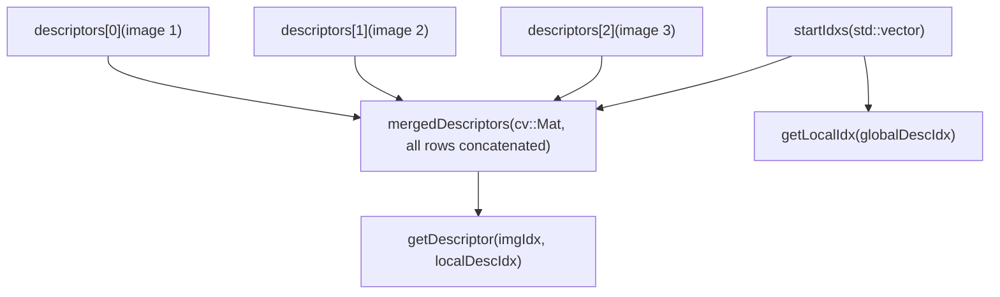
Sources: [modules/features2d/src/matchers.cpp411-510](https://github.com/opencv/opencv/blob/91c78f50/modules/features2d/src/matchers.cpp#L411-L510)

---

## Feature Detection and Description Pipeline

The typical workflow follows a detect → describe → match pattern. `Feature2D` exposes three core virtual methods: `detect()`, `compute()`, and `detectAndCompute()`. Most concrete implementations override `detectAndCompute()` to do both steps in one pass (e.g., ORB, BRISK, SIFT).

**End-to-end pipeline with API method names:**

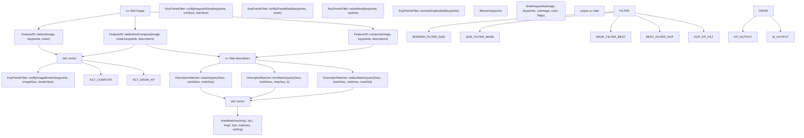
Sources: [modules/features2d/include/opencv2/features2d.hpp139-223](https://github.com/opencv/opencv/blob/91c78f50/modules/features2d/include/opencv2/features2d.hpp#L139-L223) [modules/features2d/src/feature2d.cpp1-100](https://github.com/opencv/opencv/blob/91c78f50/modules/features2d/src/feature2d.cpp#L1-L100) [modules/features2d/src/matchers.cpp579-618](https://github.com/opencv/opencv/blob/91c78f50/modules/features2d/src/matchers.cpp#L579-L618) [modules/features2d/src/keypoint.cpp69-169](https://github.com/opencv/opencv/blob/91c78f50/modules/features2d/src/keypoint.cpp#L69-L169) [modules/features2d/src/draw.cpp91-248](https://github.com/opencv/opencv/blob/91c78f50/modules/features2d/src/draw.cpp#L91-L248)

---

## Descriptor Matching System

The descriptor matching system provides a flexible framework for finding correspondences between feature descriptors from different images.

### DescriptorMatcher Class Hierarchy

**`DescriptorMatcher` class hierarchy and configuration:**

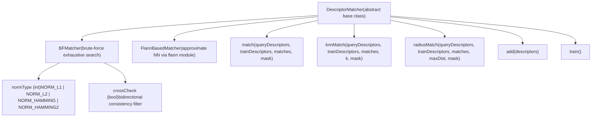
Sources: [modules/features2d/include/opencv2/features2d.hpp900-1100](https://github.com/opencv/opencv/blob/91c78f50/modules/features2d/include/opencv2/features2d.hpp#L900-L1100) [modules/features2d/src/matchers.cpp527-684](https://github.com/opencv/opencv/blob/91c78f50/modules/features2d/src/matchers.cpp#L527-L684) [modules/features2d/src/matchers.cpp708-731](https://github.com/opencv/opencv/blob/91c78f50/modules/features2d/src/matchers.cpp#L708-L731)

### Matching Modes

`DescriptorMatcher` provides three matching modes:

| Method | Output | Typical Use |
| --- | --- | --- |
| `match()` | 1 `DMatch` per query | Fast, one-to-one correspondence |
| `knnMatch(k)` | Up to k `DMatch` per query | Lowe's ratio test filtering |
| `radiusMatch(maxDist)` | All `DMatch` within distance | Threshold-based filtering |

Internally, `match()` is implemented by calling `knnMatch(k=1)` and converting the results ([modules/features2d/src/matchers.cpp611-618](https://github.com/opencv/opencv/blob/91c78f50/modules/features2d/src/matchers.cpp#L611-L618)).

Sources: [modules/features2d/src/matchers.cpp579-618](https://github.com/opencv/opencv/blob/91c78f50/modules/features2d/src/matchers.cpp#L579-L618) [modules/features2d/src/matchers.cpp647-678](https://github.com/opencv/opencv/blob/91c78f50/modules/features2d/src/matchers.cpp#L647-L678)

### BFMatcher Implementation Details

`BFMatcher` implements exhaustive nearest-neighbor search with optional OpenCL acceleration:

| Component | Description | Implementation |
| --- | --- | --- |
| CPU path | Uses `batchDistance()` for vectorized distance computation | [modules/features2d/src/matchers.cpp757-893](https://github.com/opencv/opencv/blob/91c78f50/modules/features2d/src/matchers.cpp#L757-L893) |
| OpenCL path | GPU kernels (`BruteForceMatch_*`) for parallel matching | [modules/features2d/src/matchers.cpp76-405](https://github.com/opencv/opencv/blob/91c78f50/modules/features2d/src/matchers.cpp#L76-L405) |
| Cross-check | Bidirectional matching filter (`crossCheck` constructor param) | [modules/features2d/src/matchers.cpp862](https://github.com/opencv/opencv/blob/91c78f50/modules/features2d/src/matchers.cpp#L862-L862) |
| Multi-image | Matches against merged `DescriptorCollection` from multiple images | [modules/features2d/src/matchers.cpp858-863](https://github.com/opencv/opencv/blob/91c78f50/modules/features2d/src/matchers.cpp#L858-L863) |

**Distance Metrics Supported:**

| Metric | Use Case | Descriptor Type |
| --- | --- | --- |
| `NORM_L2` | Default for floating-point descriptors | SIFT, SURF |
| `NORM_L1` | Manhattan distance | General |
| `NORM_HAMMING` | Binary descriptors | ORB, BRIEF, BRISK |
| `NORM_HAMMING2` | Binary descriptors with 2-bit groups | ORB with WTA\_K=3,4 |

Sources: [modules/features2d/src/matchers.cpp710-1015](https://github.com/opencv/opencv/blob/91c78f50/modules/features2d/src/matchers.cpp#L710-L1015) [modules/features2d/src/matchers.cpp853-856](https://github.com/opencv/opencv/blob/91c78f50/modules/features2d/src/matchers.cpp#L853-L856)

### OpenCL Acceleration

`BFMatcher` selects between an OpenCL path and a CPU path transparently. The OpenCL path uses kernels in `brute_force_match_oclsrc`.

**`BFMatcher` execution path selection:**

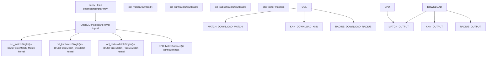
Sources: [modules/features2d/src/matchers.cpp67-406](https://github.com/opencv/opencv/blob/91c78f50/modules/features2d/src/matchers.cpp#L67-L406) [modules/features2d/src/matchers.cpp786-834](https://github.com/opencv/opencv/blob/91c78f50/modules/features2d/src/matchers.cpp#L786-L834)

---

## Bag-of-Words Framework

The Bag-of-Words (BOW) framework converts local feature descriptors into global image descriptors by quantizing descriptors to a visual vocabulary.

### BOW Architecture

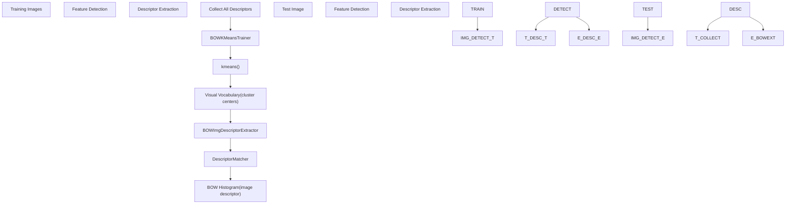
Sources: [modules/features2d/src/bagofwords.cpp47-216](https://github.com/opencv/opencv/blob/91c78f50/modules/features2d/src/bagofwords.cpp#L47-L216)

### BOWTrainer

The `BOWTrainer` base class and its `BOWKMeansTrainer` implementation manage vocabulary construction:

`BOWTrainer` is the abstract base; `BOWKMeansTrainer` clusters descriptors using `kmeans()`.

| Method | Purpose | Source |
| --- | --- | --- |
| `BOWTrainer::add(descriptors)` | Accumulate training descriptors | [modules/features2d/src/bagofwords.cpp53-68](https://github.com/opencv/opencv/blob/91c78f50/modules/features2d/src/bagofwords.cpp#L53-L68) |
| `BOWTrainer::cluster()` | Build vocabulary (pure virtual) | [modules/features2d/src/bagofwords.cpp75-78](https://github.com/opencv/opencv/blob/91c78f50/modules/features2d/src/bagofwords.cpp#L75-L78) |
| `BOWKMeansTrainer::cluster()` | Calls `kmeans()` on merged descriptors | [modules/features2d/src/bagofwords.cpp90-116](https://github.com/opencv/opencv/blob/91c78f50/modules/features2d/src/bagofwords.cpp#L90-L116) |

`BOWKMeansTrainer` constructor parameters: `clusterCount` (vocabulary size), `termcrit` (convergence), `attempts` (k-means restarts), `flags` (initialization method, e.g. `KMEANS_PP_CENTERS`).

Sources: [modules/features2d/src/bagofwords.cpp85-116](https://github.com/opencv/opencv/blob/91c78f50/modules/features2d/src/bagofwords.cpp#L85-L116)

### BOWImgDescriptorExtractor

The `BOWImgDescriptorExtractor` converts an image's feature descriptors into a single histogram descriptor:

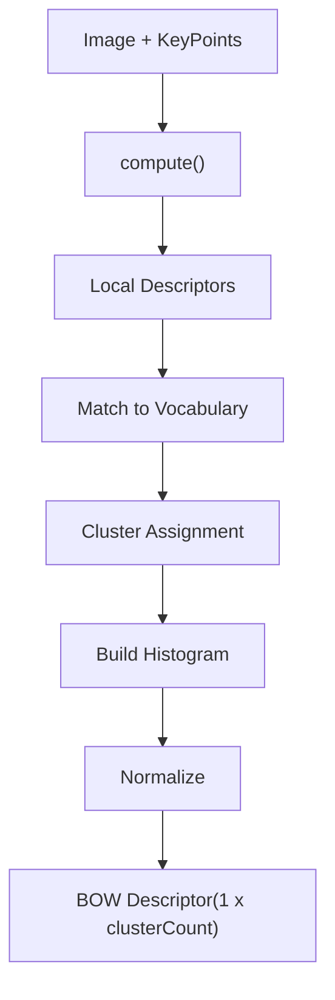
| Method | Purpose | Source |
| --- | --- | --- |
| `setVocabulary(vocab)` | Set vocabulary; clears and re-adds to internal `dmatcher` | [modules/features2d/src/bagofwords.cpp131-136](https://github.com/opencv/opencv/blob/91c78f50/modules/features2d/src/bagofwords.cpp#L131-L136) |
| `compute(image, keypoints, imgDescriptor)` | Extract BOW histogram for an image | [modules/features2d/src/bagofwords.cpp143-163](https://github.com/opencv/opencv/blob/91c78f50/modules/features2d/src/bagofwords.cpp#L143-L163) |
| `compute(keypointDescriptors, imgDescriptor)` | Compute from pre-computed descriptors | [modules/features2d/src/bagofwords.cpp175-214](https://github.com/opencv/opencv/blob/91c78f50/modules/features2d/src/bagofwords.cpp#L175-L214) |
| `descriptorSize()` | Returns `vocabulary.rows` (number of visual words) | [modules/features2d/src/bagofwords.cpp165-168](https://github.com/opencv/opencv/blob/91c78f50/modules/features2d/src/bagofwords.cpp#L165-L168) |
| `descriptorType()` | Returns `CV_32FC1` | [modules/features2d/src/bagofwords.cpp170-173](https://github.com/opencv/opencv/blob/91c78f50/modules/features2d/src/bagofwords.cpp#L170-L173) |

Sources: [modules/features2d/src/bagofwords.cpp119-216](https://github.com/opencv/opencv/blob/91c78f50/modules/features2d/src/bagofwords.cpp#L119-L216)

---

## KeyPoint Filtering and Processing

The `KeyPointsFilter` class provides static utility methods for post-processing detected keypoints:

### Filtering Operations

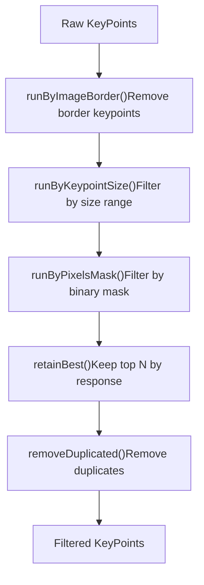
**`KeyPointsFilter` static methods:**

| Method | Purpose | Key Parameters |
| --- | --- | --- |
| `retainBest(keypoints, npoints)` | Keep N highest-response keypoints | `npoints` |
| `runByImageBorder(keypoints, imageSize, borderSize)` | Remove keypoints within border pixels of image edge | `borderSize` |
| `runByKeypointSize(keypoints, minSize, maxSize)` | Filter by `KeyPoint::size` range | `minSize`, `maxSize` |
| `runByPixelsMask(keypoints, mask)` | Keep keypoints where 8-bit mask is non-zero | `mask` (cv::Mat) |
| `removeDuplicated(keypoints)` | Remove keypoints with identical pt/size/angle | — |
| `removeDuplicatedSorted(keypoints)` | Same as above but preserves sorted order | — |
| `runByPixelsMask2VectorPoint(keypoints, removeFrom, mask)` | Filter keypoints and a parallel vector simultaneously | `removeFrom` |

Sources: [modules/features2d/src/keypoint.cpp69-293](https://github.com/opencv/opencv/blob/91c78f50/modules/features2d/src/keypoint.cpp#L69-L293) [modules/features2d/include/opencv2/features2d.hpp92-127](https://github.com/opencv/opencv/blob/91c78f50/modules/features2d/include/opencv2/features2d.hpp#L92-L127)

---

## Visualization Functions

The module provides functions for visualizing features and matches:

### drawKeypoints()

Renders keypoints on an image with optional orientation and scale visualization:

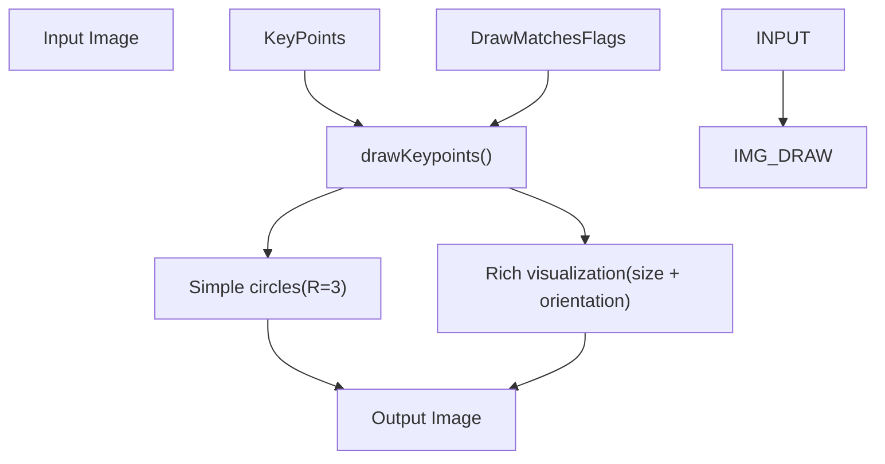
**`DrawMatchesFlags` enum values:**

| Flag | Effect |
| --- | --- |
| `DrawMatchesFlags::DEFAULT` | Create output image from scratch |
| `DrawMatchesFlags::DRAW_OVER_OUTIMG` | Draw onto existing output image |
| `DrawMatchesFlags::NOT_DRAW_SINGLE_POINTS` | Suppress drawing of unmatched keypoints |
| `DrawMatchesFlags::DRAW_RICH_KEYPOINTS` | Draw circle scaled to keypoint size, with orientation line |

Sources: [modules/features2d/src/draw.cpp91-123](https://github.com/opencv/opencv/blob/91c78f50/modules/features2d/src/draw.cpp#L91-L123) [modules/features2d/src/draw.cpp53-89](https://github.com/opencv/opencv/blob/91c78f50/modules/features2d/src/draw.cpp#L53-L89)

### drawMatches() and drawMatchesKnn()

`drawMatches()` concatenates two images side-by-side and draws lines between matched keypoints. `drawMatchesKnn()` accepts `vector<vector<DMatch>>` for multi-match visualization.

Sources: [modules/features2d/src/draw.cpp125-248](https://github.com/opencv/opencv/blob/91c78f50/modules/features2d/src/draw.cpp#L125-L248)

---

## Feature Detector Evaluation

The module provides tools for evaluating feature detector quality:

### Repeatability Evaluation

The `evaluateFeatureDetector()` function measures detector repeatability by computing the overlap of detected features under geometric transformations:

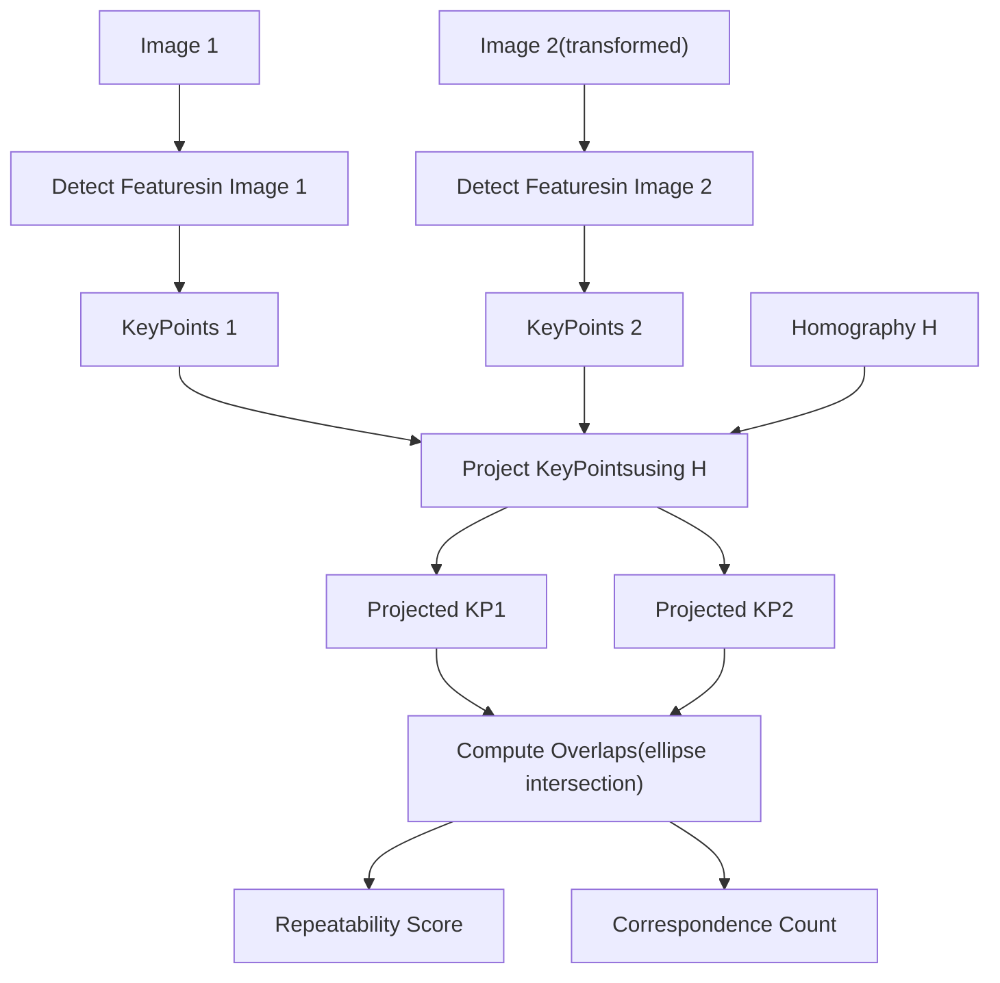
**Evaluation Metrics:**

| Metric | Formula | Interpretation |
| --- | --- | --- |
| Repeatability | `correspondences / min(count1, count2)` | Fraction of features detected in both images |
| Correspondence Count | Number of overlapping feature regions | Absolute count of repeated detections |

Sources: [modules/features2d/src/evaluation.cpp397-481](https://github.com/opencv/opencv/blob/91c78f50/modules/features2d/src/evaluation.cpp#L397-L481) [modules/features2d/src/evaluation.cpp323-395](https://github.com/opencv/opencv/blob/91c78f50/modules/features2d/src/evaluation.cpp#L323-L395)

### Descriptor Matcher Evaluation

`computeRecallPrecisionCurve()` generates a recall-precision curve from a set of matches and a ground-truth correctness mask.

| Function | Purpose |
| --- | --- |
| `computeRecallPrecisionCurve(matches1to2, correctMatches1to2Mask, recallPrecisionCurve)` | Builds recall-precision vector by iterating matches sorted by distance |
| `getRecall(recallPrecisionCurve, l_precision)` | Looks up recall at a given precision level |

Sources: [modules/features2d/src/evaluation.cpp499-558](https://github.com/opencv/opencv/blob/91c78f50/modules/features2d/src/evaluation.cpp#L499-L558)

---

## OpenCL Hardware Acceleration

`BFMatcher` contains an OpenCL path guarded by `#ifdef HAVE_OPENCL`. The kernels are compiled from `brute_force_match_oclsrc` (referenced via `ocl::features2d::brute_force_match_oclsrc`).

**OpenCL kernel compile-time options:**

| Build Option | Description | Values |
| --- | --- | --- |
| `-D T=<type>` | Descriptor element type | e.g., `float`, `uchar` |
| `-D kercn=<N>` | Vectorization width | 1 (default) or 4 (Intel GPU with aligned strides) |
| `-D DIST_TYPE=<N>` | Distance metric enum | `NORM_L2`, `NORM_L1`, `NORM_HAMMING` |
| `-D BLOCK_SIZE=16` | Work-group tile size | Fixed at 16 |
| `-D MAX_DESC_LEN=<N>` | Shared-memory cache size | 64 or 128 (0 = disabled for CPU) |

The condition for 4-wide vectorization is that the device is Intel and descriptor stride/offset/width are all multiples of 4 ([modules/features2d/src/matchers.cpp92-95](https://github.com/opencv/opencv/blob/91c78f50/modules/features2d/src/matchers.cpp#L92-L95)).

Sources: [modules/features2d/src/matchers.cpp76-228](https://github.com/opencv/opencv/blob/91c78f50/modules/features2d/src/matchers.cpp#L76-L228) [modules/features2d/src/matchers.cpp286-341](https://github.com/opencv/opencv/blob/91c78f50/modules/features2d/src/matchers.cpp#L286-L341)

---

## Integration with Other Modules

The features2d module integrates with several other OpenCV modules:

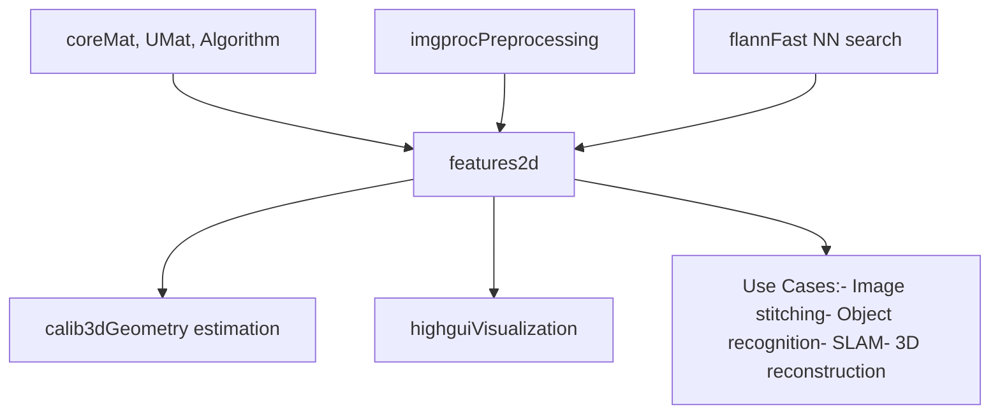
**Module Dependencies:**

-   **core**: Provides `Mat`, `UMat`, and `Algorithm` base classes
-   **imgproc**: Image preprocessing (grayscale conversion, filtering) before feature detection
-   **calib3d**: Uses feature matches for geometric estimation (homography, fundamental matrix, pose estimation) - see [Camera Calibration and 3D Vision](/opencv/opencv/8-camera-calibration-and-3d-vision-(calib3d))
-   **highgui**: Display functions for visualization
-   **flann**: Optional FLANN-based matcher for fast approximate nearest-neighbor search

**Sources:** [modules/features2d/src/matchers.cpp43-45](https://github.com/opencv/opencv/blob/91c78f50/modules/features2d/src/matchers.cpp#L43-L45) [modules/features2d/src/draw.cpp104](https://github.com/opencv/opencv/blob/91c78f50/modules/features2d/src/draw.cpp#L104-L104)
