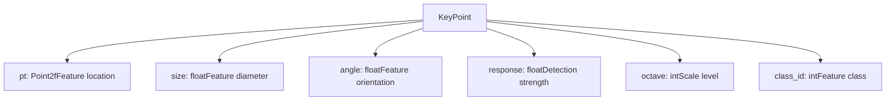
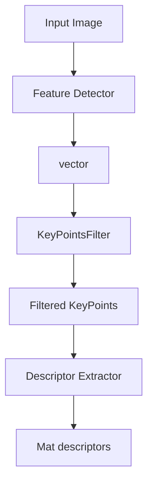
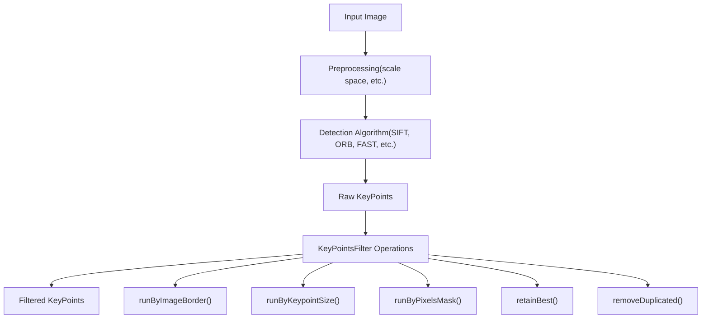
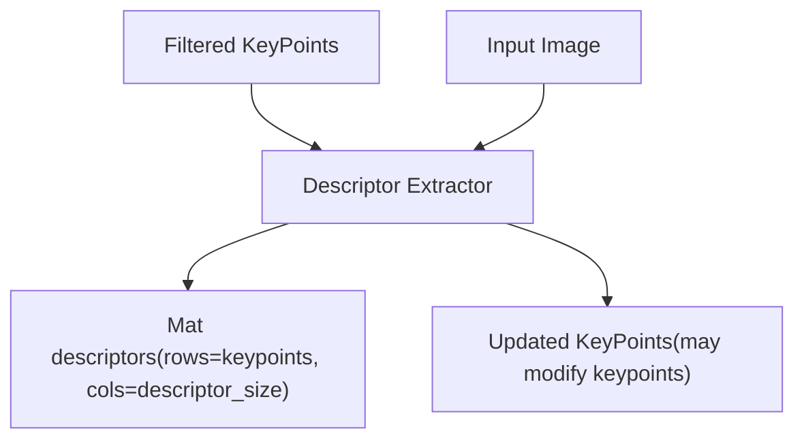
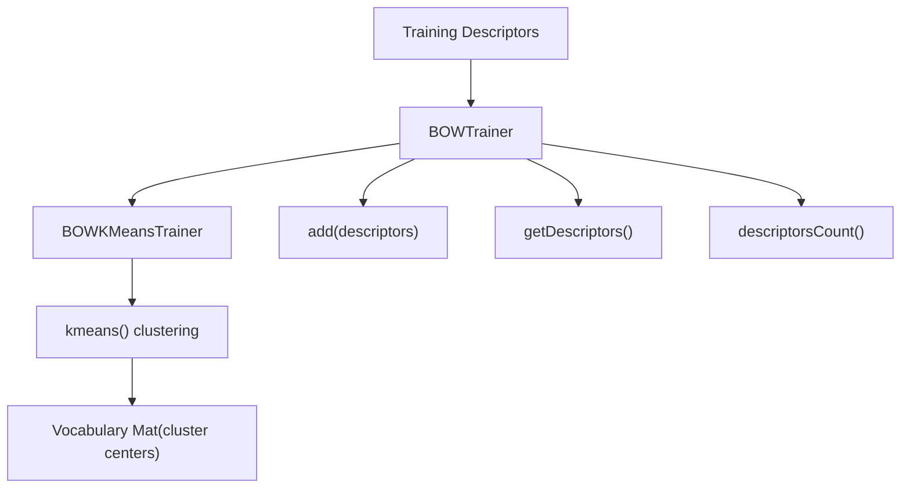
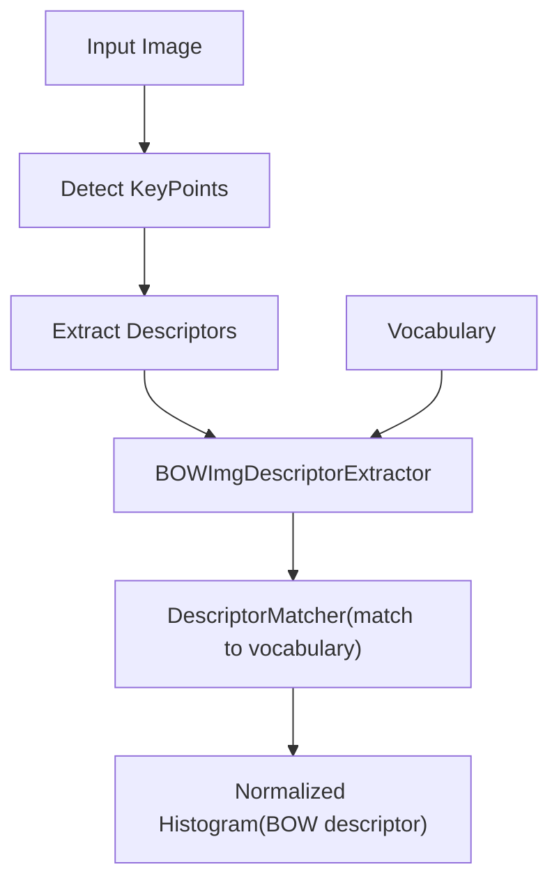
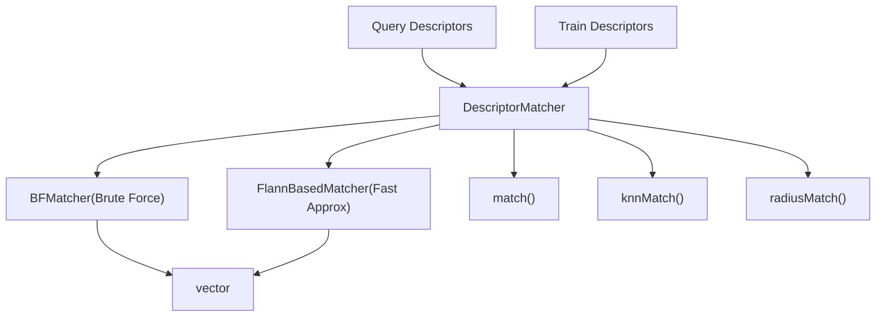
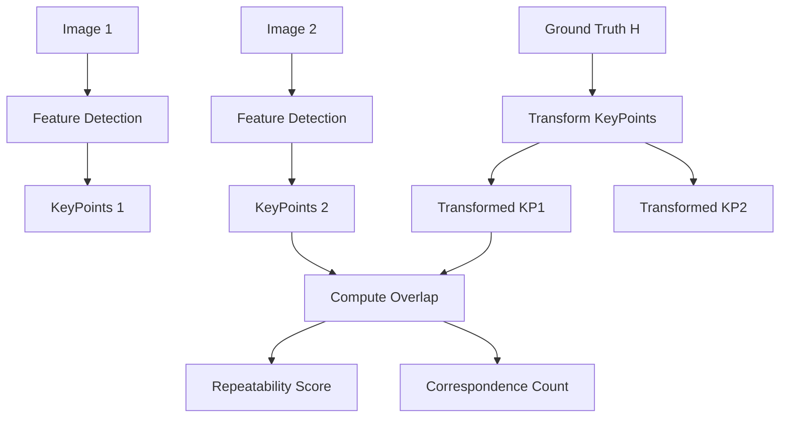
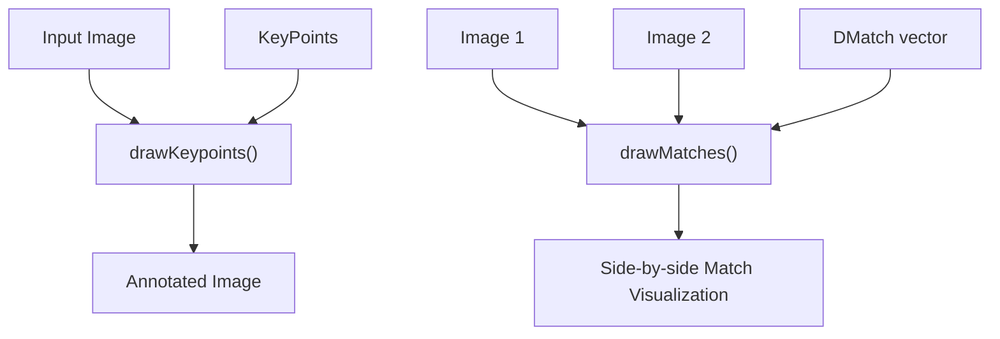
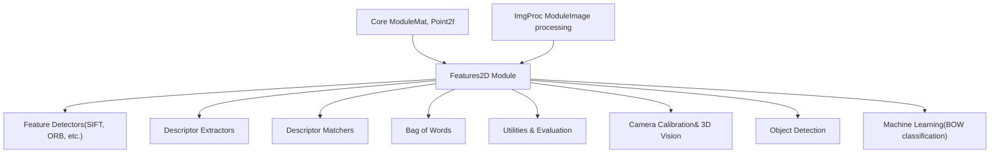

# Feature Detection and Description

Relevant source files

-   [doc/tutorials/features2d/akaze\_matching/images/graf.png](https://github.com/opencv/opencv/blob/91c78f50/doc/tutorials/features2d/akaze_matching/images/graf.png)
-   [doc/tutorials/features2d/akaze\_matching/images/res.png](https://github.com/opencv/opencv/blob/91c78f50/doc/tutorials/features2d/akaze_matching/images/res.png)
-   [modules/features2d/include/opencv2/features2d.hpp](https://github.com/opencv/opencv/blob/91c78f50/modules/features2d/include/opencv2/features2d.hpp)
-   [modules/features2d/perf/perf\_feature2d.hpp](https://github.com/opencv/opencv/blob/91c78f50/modules/features2d/perf/perf_feature2d.hpp)
-   [modules/features2d/src/agast.cpp](https://github.com/opencv/opencv/blob/91c78f50/modules/features2d/src/agast.cpp)
-   [modules/features2d/src/agast\_score.cpp](https://github.com/opencv/opencv/blob/91c78f50/modules/features2d/src/agast_score.cpp)
-   [modules/features2d/src/agast\_score.hpp](https://github.com/opencv/opencv/blob/91c78f50/modules/features2d/src/agast_score.hpp)
-   [modules/features2d/src/akaze.cpp](https://github.com/opencv/opencv/blob/91c78f50/modules/features2d/src/akaze.cpp)
-   [modules/features2d/src/blobdetector.cpp](https://github.com/opencv/opencv/blob/91c78f50/modules/features2d/src/blobdetector.cpp)
-   [modules/features2d/src/brisk.cpp](https://github.com/opencv/opencv/blob/91c78f50/modules/features2d/src/brisk.cpp)
-   [modules/features2d/src/fast.cpp](https://github.com/opencv/opencv/blob/91c78f50/modules/features2d/src/fast.cpp)
-   [modules/features2d/src/feature2d.cpp](https://github.com/opencv/opencv/blob/91c78f50/modules/features2d/src/feature2d.cpp)
-   [modules/features2d/src/gftt.cpp](https://github.com/opencv/opencv/blob/91c78f50/modules/features2d/src/gftt.cpp)
-   [modules/features2d/src/kaze.cpp](https://github.com/opencv/opencv/blob/91c78f50/modules/features2d/src/kaze.cpp)
-   [modules/features2d/src/kaze/AKAZEConfig.h](https://github.com/opencv/opencv/blob/91c78f50/modules/features2d/src/kaze/AKAZEConfig.h)
-   [modules/features2d/src/kaze/AKAZEFeatures.cpp](https://github.com/opencv/opencv/blob/91c78f50/modules/features2d/src/kaze/AKAZEFeatures.cpp)
-   [modules/features2d/src/kaze/AKAZEFeatures.h](https://github.com/opencv/opencv/blob/91c78f50/modules/features2d/src/kaze/AKAZEFeatures.h)
-   [modules/features2d/src/kaze/KAZEConfig.h](https://github.com/opencv/opencv/blob/91c78f50/modules/features2d/src/kaze/KAZEConfig.h)
-   [modules/features2d/src/kaze/KAZEFeatures.cpp](https://github.com/opencv/opencv/blob/91c78f50/modules/features2d/src/kaze/KAZEFeatures.cpp)
-   [modules/features2d/src/kaze/KAZEFeatures.h](https://github.com/opencv/opencv/blob/91c78f50/modules/features2d/src/kaze/KAZEFeatures.h)
-   [modules/features2d/src/kaze/TEvolution.h](https://github.com/opencv/opencv/blob/91c78f50/modules/features2d/src/kaze/TEvolution.h)
-   [modules/features2d/src/kaze/fed.cpp](https://github.com/opencv/opencv/blob/91c78f50/modules/features2d/src/kaze/fed.cpp)
-   [modules/features2d/src/kaze/fed.h](https://github.com/opencv/opencv/blob/91c78f50/modules/features2d/src/kaze/fed.h)
-   [modules/features2d/src/kaze/nldiffusion\_functions.cpp](https://github.com/opencv/opencv/blob/91c78f50/modules/features2d/src/kaze/nldiffusion_functions.cpp)
-   [modules/features2d/src/kaze/nldiffusion\_functions.h](https://github.com/opencv/opencv/blob/91c78f50/modules/features2d/src/kaze/nldiffusion_functions.h)
-   [modules/features2d/src/kaze/utils.h](https://github.com/opencv/opencv/blob/91c78f50/modules/features2d/src/kaze/utils.h)
-   [modules/features2d/src/mser.cpp](https://github.com/opencv/opencv/blob/91c78f50/modules/features2d/src/mser.cpp)
-   [modules/features2d/src/opencl/akaze.cl](https://github.com/opencv/opencv/blob/91c78f50/modules/features2d/src/opencl/akaze.cl)
-   [modules/features2d/src/orb.cpp](https://github.com/opencv/opencv/blob/91c78f50/modules/features2d/src/orb.cpp)
-   [modules/features2d/test/ocl/test\_feature2d.cpp](https://github.com/opencv/opencv/blob/91c78f50/modules/features2d/test/ocl/test_feature2d.cpp)
-   [modules/features2d/test/test\_agast.cpp](https://github.com/opencv/opencv/blob/91c78f50/modules/features2d/test/test_agast.cpp)
-   [modules/features2d/test/test\_akaze.cpp](https://github.com/opencv/opencv/blob/91c78f50/modules/features2d/test/test_akaze.cpp)
-   [modules/features2d/test/test\_blobdetector.cpp](https://github.com/opencv/opencv/blob/91c78f50/modules/features2d/test/test_blobdetector.cpp)
-   [modules/features2d/test/test\_brisk.cpp](https://github.com/opencv/opencv/blob/91c78f50/modules/features2d/test/test_brisk.cpp)
-   [modules/features2d/test/test\_descriptors\_invariance.cpp](https://github.com/opencv/opencv/blob/91c78f50/modules/features2d/test/test_descriptors_invariance.cpp)
-   [modules/features2d/test/test\_descriptors\_invariance.impl.hpp](https://github.com/opencv/opencv/blob/91c78f50/modules/features2d/test/test_descriptors_invariance.impl.hpp)
-   [modules/features2d/test/test\_descriptors\_regression.cpp](https://github.com/opencv/opencv/blob/91c78f50/modules/features2d/test/test_descriptors_regression.cpp)
-   [modules/features2d/test/test\_descriptors\_regression.impl.hpp](https://github.com/opencv/opencv/blob/91c78f50/modules/features2d/test/test_descriptors_regression.impl.hpp)
-   [modules/features2d/test/test\_detectors\_invariance.cpp](https://github.com/opencv/opencv/blob/91c78f50/modules/features2d/test/test_detectors_invariance.cpp)
-   [modules/features2d/test/test\_detectors\_invariance.impl.hpp](https://github.com/opencv/opencv/blob/91c78f50/modules/features2d/test/test_detectors_invariance.impl.hpp)
-   [modules/features2d/test/test\_detectors\_regression.cpp](https://github.com/opencv/opencv/blob/91c78f50/modules/features2d/test/test_detectors_regression.cpp)
-   [modules/features2d/test/test\_detectors\_regression.impl.hpp](https://github.com/opencv/opencv/blob/91c78f50/modules/features2d/test/test_detectors_regression.impl.hpp)
-   [modules/features2d/test/test\_invariance\_utils.hpp](https://github.com/opencv/opencv/blob/91c78f50/modules/features2d/test/test_invariance_utils.hpp)
-   [modules/features2d/test/test\_keypoints.cpp](https://github.com/opencv/opencv/blob/91c78f50/modules/features2d/test/test_keypoints.cpp)
-   [modules/features2d/test/test\_matchers\_algorithmic.cpp](https://github.com/opencv/opencv/blob/91c78f50/modules/features2d/test/test_matchers_algorithmic.cpp)
-   [modules/features2d/test/test\_orb.cpp](https://github.com/opencv/opencv/blob/91c78f50/modules/features2d/test/test_orb.cpp)
-   [modules/java/generator/src/cpp/jni\_part.cpp](https://github.com/opencv/opencv/blob/91c78f50/modules/java/generator/src/cpp/jni_part.cpp)

This document covers the feature detection and description components of OpenCV's features2d module, focusing on keypoint detection algorithms, feature descriptor computation, and related utilities. This includes the core data structures, filtering operations, bag-of-words models, and evaluation metrics. For information about feature matching algorithms and descriptor matching strategies, see [Feature Matching and Analysis](/opencv/opencv/6.2-descriptor-matching-and-bag-of-words).

## Core Data Structures

The features2d module centers around the `KeyPoint` structure and descriptor matrices that represent detected image features and their computed descriptions.

### KeyPoint Structure

The `KeyPoint` class represents a detected feature location with associated properties:

**KeyPoint Data Flow**

Sources: [modules/features2d/src/keypoint.cpp42-293](https://github.com/opencv/opencv/blob/91c78f50/modules/features2d/src/keypoint.cpp#L42-L293) [modules/features2d/src/draw.cpp53-89](https://github.com/opencv/opencv/blob/91c78f50/modules/features2d/src/draw.cpp#L53-L89)

### Descriptor Formats

Feature descriptors are stored as `Mat` objects where each row represents one keypoint's descriptor vector. The descriptor type and dimensions depend on the specific algorithm used (SIFT, ORB, etc.).

## Feature Detection Pipeline

The detection process transforms raw images into sets of distinctive keypoints through a standardized pipeline:

The `KeyPointsFilter` class provides several utility functions for post-processing detected keypoints:

| Function | Purpose |
| --- | --- |
| `retainBest()` | Keep only top N keypoints by response |
| `runByImageBorder()` | Remove keypoints near image edges |
| `runByKeypointSize()` | Filter by keypoint size range |
| `runByPixelsMask()` | Remove keypoints in masked regions |
| `removeDuplicated()` | Eliminate duplicate keypoints |

Sources: [modules/features2d/src/keypoint.cpp69-293](https://github.com/opencv/opencv/blob/91c78f50/modules/features2d/src/keypoint.cpp#L69-L293)

## Feature Description Process

After detection, keypoints are processed by descriptor extractors to compute distinctive feature vectors:

The descriptor computation may modify keypoint properties (such as orientation) during the extraction process. Different algorithms produce descriptors of varying dimensions and data types (float, binary, etc.).

Sources: [modules/features2d/src/bagofwords.cpp143-164](https://github.com/opencv/opencv/blob/91c78f50/modules/features2d/src/bagofwords.cpp#L143-L164)

## Bag of Words Model

The features2d module includes a complete bag-of-words implementation for image classification and retrieval:

### BOW Training Pipeline

### BOW Image Descriptor Extraction

The `BOWImgDescriptorExtractor` class converts images to bag-of-words histograms:

-   Takes keypoint descriptors and matches them to vocabulary clusters
-   Builds normalized histograms counting descriptor assignments
-   Outputs single-row descriptor representing entire image

Sources: [modules/features2d/src/bagofwords.cpp47-216](https://github.com/opencv/opencv/blob/91c78f50/modules/features2d/src/bagofwords.cpp#L47-L216)

## Descriptor Matching Infrastructure

While detailed matching algorithms are covered in [Feature Matching and Analysis](/opencv/opencv/6.2-descriptor-matching-and-bag-of-words), the basic matching infrastructure is part of the description system:

The `DescriptorMatcher` base class defines the interface, with `BFMatcher` providing exact brute-force matching using various distance metrics (L2, Hamming, etc.).

Sources: [modules/features2d/src/matchers.cpp411-1015](https://github.com/opencv/opencv/blob/91c78f50/modules/features2d/src/matchers.cpp#L411-L1015)

## Evaluation and Quality Metrics

The module includes comprehensive evaluation tools for assessing detector and descriptor performance:

### Repeatability Evaluation

The evaluation system uses elliptical keypoint representations to compute accurate overlap between corresponding features across different viewpoints.

### Performance Metrics

| Function | Purpose |
| --- | --- |
| `evaluateFeatureDetector()` | Compute detector repeatability |
| `computeRecallPrecisionCurve()` | Generate matching performance curves |
| `getRecall()` | Extract recall at specific precision |

Sources: [modules/features2d/src/evaluation.cpp397-581](https://github.com/opencv/opencv/blob/91c78f50/modules/features2d/src/evaluation.cpp#L397-L581)

## Visualization Support

The features2d module provides utilities for visualizing detected features and matches:

Visualization functions support various drawing modes:

-   Basic keypoint marking with circles
-   Rich keypoint drawing showing size and orientation
-   Match line drawing between corresponding features
-   Customizable colors and drawing flags

Sources: [modules/features2d/src/draw.cpp91-278](https://github.com/opencv/opencv/blob/91c78f50/modules/features2d/src/draw.cpp#L91-L278)

## System Integration

The feature detection and description system integrates with other OpenCV modules through standardized interfaces:

The module serves as a foundation for higher-level computer vision applications including object recognition, image matching, camera calibration, and 3D reconstruction.

Sources: [modules/features2d/include/opencv2/features2d/features2d.hpp44-48](https://github.com/opencv/opencv/blob/91c78f50/modules/features2d/include/opencv2/features2d/features2d.hpp#L44-L48) [modules/features2d/src/dynamic.cpp43-47](https://github.com/opencv/opencv/blob/91c78f50/modules/features2d/src/dynamic.cpp#L43-L47)
