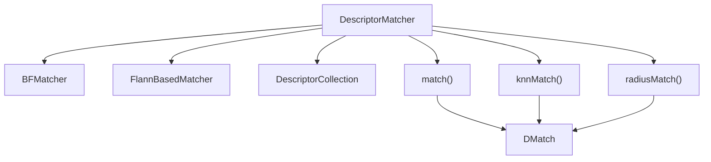
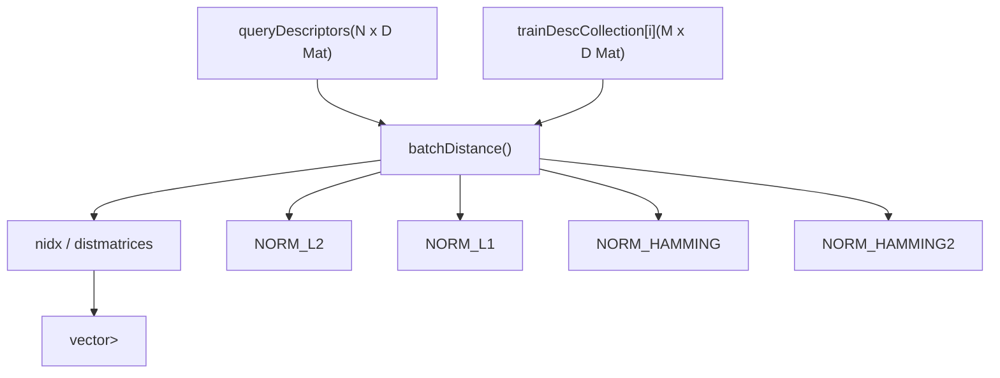
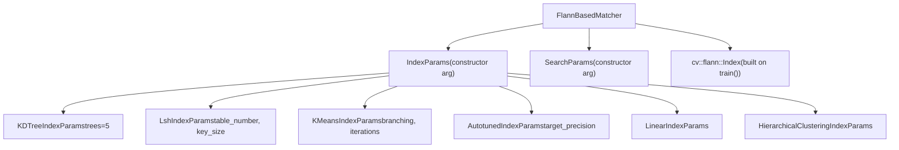
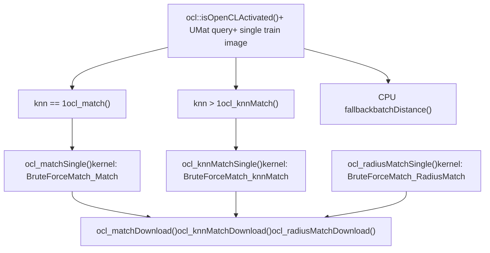
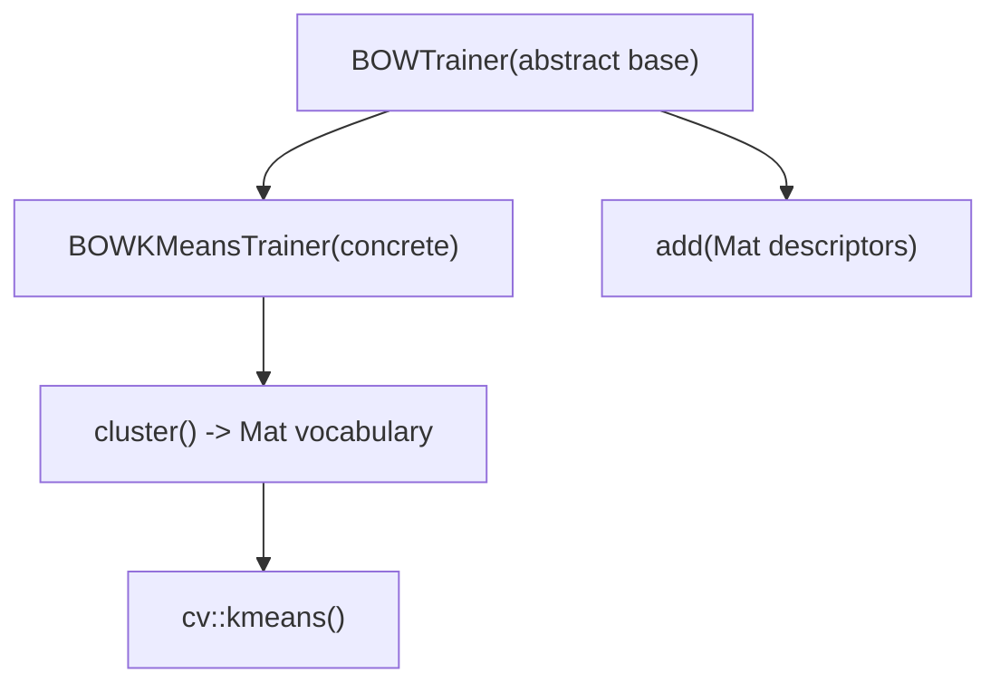
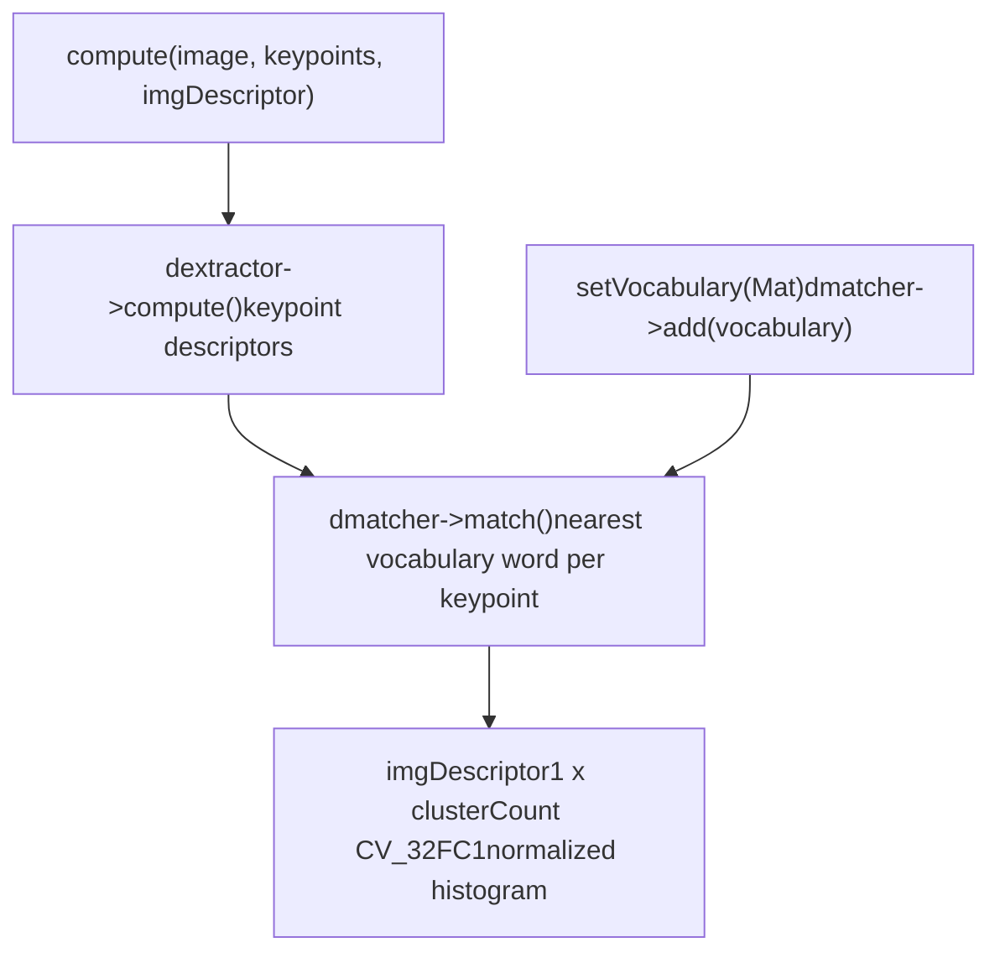
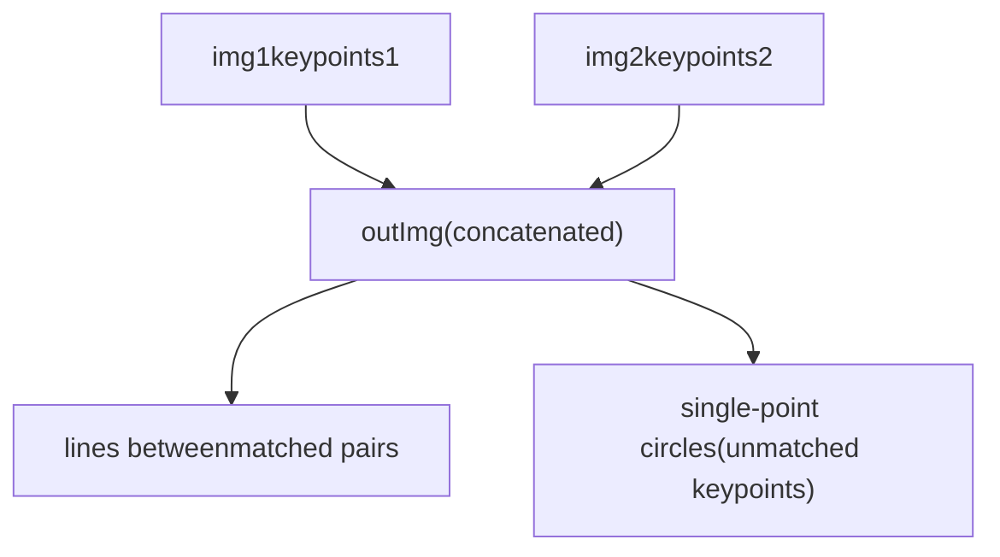
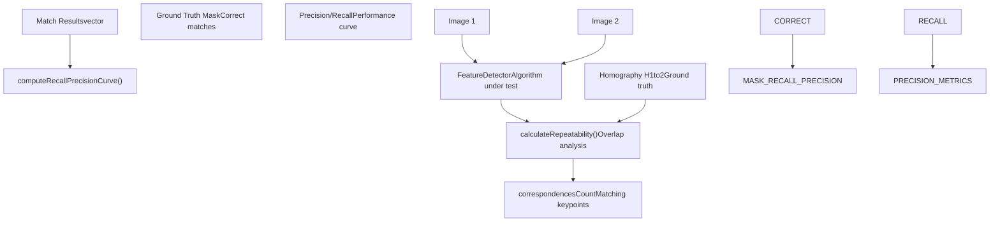
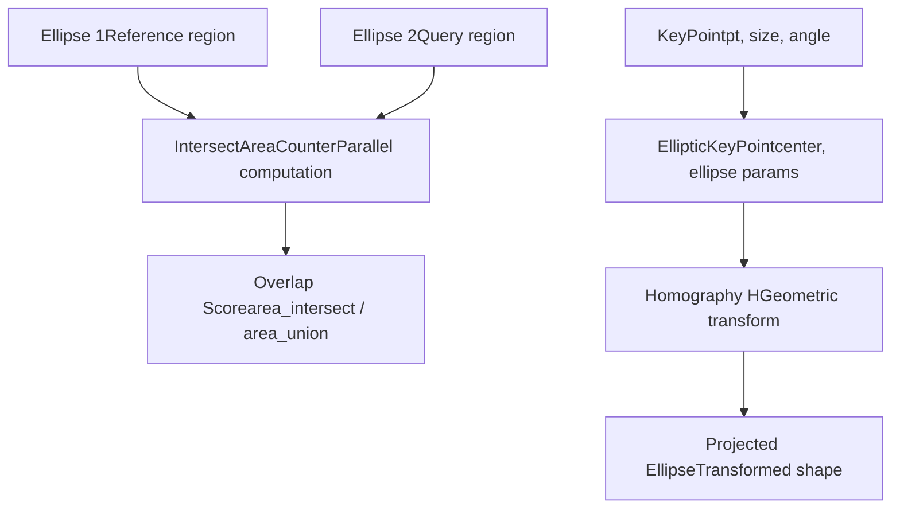

# Descriptor Matching and Bag-of-Words

Relevant source files

-   [cmake/checks/cpu\_neon.cpp](https://github.com/opencv/opencv/blob/91c78f50/cmake/checks/cpu_neon.cpp)
-   [doc/DoxygenLayout.xml](https://github.com/opencv/opencv/blob/91c78f50/doc/DoxygenLayout.xml)
-   [doc/opencv-logo-small.png](https://github.com/opencv/opencv/blob/91c78f50/doc/opencv-logo-small.png)
-   [modules/core/include/opencv2/core/affine.hpp](https://github.com/opencv/opencv/blob/91c78f50/modules/core/include/opencv2/core/affine.hpp)
-   [modules/core/include/opencv2/core/fast\_math.hpp](https://github.com/opencv/opencv/blob/91c78f50/modules/core/include/opencv2/core/fast_math.hpp)
-   [modules/core/src/matmul.simd.hpp](https://github.com/opencv/opencv/blob/91c78f50/modules/core/src/matmul.simd.hpp)
-   [modules/features2d/include/opencv2/features2d/features2d.hpp](https://github.com/opencv/opencv/blob/91c78f50/modules/features2d/include/opencv2/features2d/features2d.hpp)
-   [modules/features2d/src/bagofwords.cpp](https://github.com/opencv/opencv/blob/91c78f50/modules/features2d/src/bagofwords.cpp)
-   [modules/features2d/src/draw.cpp](https://github.com/opencv/opencv/blob/91c78f50/modules/features2d/src/draw.cpp)
-   [modules/features2d/src/dynamic.cpp](https://github.com/opencv/opencv/blob/91c78f50/modules/features2d/src/dynamic.cpp)
-   [modules/features2d/src/evaluation.cpp](https://github.com/opencv/opencv/blob/91c78f50/modules/features2d/src/evaluation.cpp)
-   [modules/features2d/src/keypoint.cpp](https://github.com/opencv/opencv/blob/91c78f50/modules/features2d/src/keypoint.cpp)
-   [modules/features2d/src/matchers.cpp](https://github.com/opencv/opencv/blob/91c78f50/modules/features2d/src/matchers.cpp)
-   [modules/features2d/test/test\_drawing.cpp](https://github.com/opencv/opencv/blob/91c78f50/modules/features2d/test/test_drawing.cpp)
-   [modules/features2d/test/test\_nearestneighbors.cpp](https://github.com/opencv/opencv/blob/91c78f50/modules/features2d/test/test_nearestneighbors.cpp)
-   [modules/features2d/test/test\_precomp.hpp](https://github.com/opencv/opencv/blob/91c78f50/modules/features2d/test/test_precomp.hpp)
-   [modules/features2d/test/test\_utils.cpp](https://github.com/opencv/opencv/blob/91c78f50/modules/features2d/test/test_utils.cpp)
-   [modules/flann/include/opencv2/flann.hpp](https://github.com/opencv/opencv/blob/91c78f50/modules/flann/include/opencv2/flann.hpp)
-   [modules/flann/include/opencv2/flann/all\_indices.h](https://github.com/opencv/opencv/blob/91c78f50/modules/flann/include/opencv2/flann/all_indices.h)
-   [modules/flann/include/opencv2/flann/allocator.h](https://github.com/opencv/opencv/blob/91c78f50/modules/flann/include/opencv2/flann/allocator.h)
-   [modules/flann/include/opencv2/flann/any.h](https://github.com/opencv/opencv/blob/91c78f50/modules/flann/include/opencv2/flann/any.h)
-   [modules/flann/include/opencv2/flann/autotuned\_index.h](https://github.com/opencv/opencv/blob/91c78f50/modules/flann/include/opencv2/flann/autotuned_index.h)
-   [modules/flann/include/opencv2/flann/composite\_index.h](https://github.com/opencv/opencv/blob/91c78f50/modules/flann/include/opencv2/flann/composite_index.h)
-   [modules/flann/include/opencv2/flann/config.h](https://github.com/opencv/opencv/blob/91c78f50/modules/flann/include/opencv2/flann/config.h)
-   [modules/flann/include/opencv2/flann/defines.h](https://github.com/opencv/opencv/blob/91c78f50/modules/flann/include/opencv2/flann/defines.h)
-   [modules/flann/include/opencv2/flann/dist.h](https://github.com/opencv/opencv/blob/91c78f50/modules/flann/include/opencv2/flann/dist.h)
-   [modules/flann/include/opencv2/flann/dynamic\_bitset.h](https://github.com/opencv/opencv/blob/91c78f50/modules/flann/include/opencv2/flann/dynamic_bitset.h)
-   [modules/flann/include/opencv2/flann/flann\_base.hpp](https://github.com/opencv/opencv/blob/91c78f50/modules/flann/include/opencv2/flann/flann_base.hpp)
-   [modules/flann/include/opencv2/flann/general.h](https://github.com/opencv/opencv/blob/91c78f50/modules/flann/include/opencv2/flann/general.h)
-   [modules/flann/include/opencv2/flann/hierarchical\_clustering\_index.h](https://github.com/opencv/opencv/blob/91c78f50/modules/flann/include/opencv2/flann/hierarchical_clustering_index.h)
-   [modules/flann/include/opencv2/flann/index\_testing.h](https://github.com/opencv/opencv/blob/91c78f50/modules/flann/include/opencv2/flann/index_testing.h)
-   [modules/flann/include/opencv2/flann/kdtree\_index.h](https://github.com/opencv/opencv/blob/91c78f50/modules/flann/include/opencv2/flann/kdtree_index.h)
-   [modules/flann/include/opencv2/flann/kdtree\_single\_index.h](https://github.com/opencv/opencv/blob/91c78f50/modules/flann/include/opencv2/flann/kdtree_single_index.h)
-   [modules/flann/include/opencv2/flann/kmeans\_index.h](https://github.com/opencv/opencv/blob/91c78f50/modules/flann/include/opencv2/flann/kmeans_index.h)
-   [modules/flann/include/opencv2/flann/linear\_index.h](https://github.com/opencv/opencv/blob/91c78f50/modules/flann/include/opencv2/flann/linear_index.h)
-   [modules/flann/include/opencv2/flann/logger.h](https://github.com/opencv/opencv/blob/91c78f50/modules/flann/include/opencv2/flann/logger.h)
-   [modules/flann/include/opencv2/flann/lsh\_index.h](https://github.com/opencv/opencv/blob/91c78f50/modules/flann/include/opencv2/flann/lsh_index.h)
-   [modules/flann/include/opencv2/flann/lsh\_table.h](https://github.com/opencv/opencv/blob/91c78f50/modules/flann/include/opencv2/flann/lsh_table.h)
-   [modules/flann/include/opencv2/flann/matrix.h](https://github.com/opencv/opencv/blob/91c78f50/modules/flann/include/opencv2/flann/matrix.h)
-   [modules/flann/include/opencv2/flann/miniflann.hpp](https://github.com/opencv/opencv/blob/91c78f50/modules/flann/include/opencv2/flann/miniflann.hpp)
-   [modules/flann/include/opencv2/flann/nn\_index.h](https://github.com/opencv/opencv/blob/91c78f50/modules/flann/include/opencv2/flann/nn_index.h)
-   [modules/flann/include/opencv2/flann/object\_factory.h](https://github.com/opencv/opencv/blob/91c78f50/modules/flann/include/opencv2/flann/object_factory.h)
-   [modules/flann/include/opencv2/flann/params.h](https://github.com/opencv/opencv/blob/91c78f50/modules/flann/include/opencv2/flann/params.h)
-   [modules/flann/include/opencv2/flann/random.h](https://github.com/opencv/opencv/blob/91c78f50/modules/flann/include/opencv2/flann/random.h)
-   [modules/flann/include/opencv2/flann/result\_set.h](https://github.com/opencv/opencv/blob/91c78f50/modules/flann/include/opencv2/flann/result_set.h)
-   [modules/flann/include/opencv2/flann/saving.h](https://github.com/opencv/opencv/blob/91c78f50/modules/flann/include/opencv2/flann/saving.h)
-   [modules/flann/include/opencv2/flann/timer.h](https://github.com/opencv/opencv/blob/91c78f50/modules/flann/include/opencv2/flann/timer.h)
-   [modules/flann/src/flann.cpp](https://github.com/opencv/opencv/blob/91c78f50/modules/flann/src/flann.cpp)
-   [modules/flann/src/miniflann.cpp](https://github.com/opencv/opencv/blob/91c78f50/modules/flann/src/miniflann.cpp)
-   [modules/flann/src/precomp.hpp](https://github.com/opencv/opencv/blob/91c78f50/modules/flann/src/precomp.hpp)
-   [samples/cpp/em.cpp](https://github.com/opencv/opencv/blob/91c78f50/samples/cpp/em.cpp)
-   [samples/cpp/letter\_recog.cpp](https://github.com/opencv/opencv/blob/91c78f50/samples/cpp/letter_recog.cpp)
-   [samples/cpp/points\_classifier.cpp](https://github.com/opencv/opencv/blob/91c78f50/samples/cpp/points_classifier.cpp)
-   [samples/cpp/watershed.cpp](https://github.com/opencv/opencv/blob/91c78f50/samples/cpp/watershed.cpp)

This page documents the descriptor matching and bag-of-words subsystems within `opencv_features2d`. It covers the `DescriptorMatcher` base interface, the `BFMatcher` (brute-force) and `FlannBasedMatcher` implementations, the three matching modes (`match`, `knnMatch`, `radiusMatch`), the `BOWTrainer` / `BOWImgDescriptorExtractor` pipeline for image classification, and the `drawKeypoints` / `drawMatches` visualization utilities.

For feature detection and descriptor computation, see page 6.1. For geometric uses of matches (homography, pose estimation), see page 8.2. </old\_str> <new\_str>

# Descriptor Matching and Bag-of-Words

This page documents the descriptor matching and bag-of-words subsystems within `opencv_features2d`. It covers the `DescriptorMatcher` base interface, the `BFMatcher` (brute-force) and `FlannBasedMatcher` implementations, the three matching modes (`match`, `knnMatch`, `radiusMatch`), the `BOWTrainer` / `BOWImgDescriptorExtractor` pipeline for image classification, and the `drawKeypoints` / `drawMatches` visualization utilities.

For feature detection and descriptor computation, see page 6.1. For geometric uses of matches (homography, pose estimation), see page 8.2.

## Core Matching Architecture

The matching system is built around `DescriptorMatcher` as an abstract base class. Two concrete implementations are provided: `BFMatcher` (exhaustive search) and `FlannBasedMatcher` (approximate nearest-neighbor search via the `opencv_flann` module).

**Class hierarchy and matching API diagram:**


Sources: [modules/features2d/src/matchers.cpp411-678](https://github.com/opencv/opencv/blob/91c78f50/modules/features2d/src/matchers.cpp#L411-L678)

### DescriptorMatcher Base Class

`DescriptorMatcher` in [modules/features2d/src/matchers.cpp](https://github.com/opencv/opencv/blob/91c78f50/modules/features2d/src/matchers.cpp) manages the training descriptor collection and dispatches the three matching modes to subclass implementations (`knnMatchImpl`, `radiusMatchImpl`).

Training descriptors are stored in two parallel collections:

-   `trainDescCollection` — `vector<Mat>` for CPU descriptors
-   `utrainDescCollection` — `vector<UMat>` for OpenCL-backed descriptors

The internal `DescriptorCollection` helper [modules/features2d/src/matchers.cpp411-510](https://github.com/opencv/opencv/blob/91c78f50/modules/features2d/src/matchers.cpp#L411-L510) merges all training images' descriptors into a single `mergedDescriptors` matrix and records `startIdxs` per image to translate global indices back to `(imgIdx, localDescIdx)` pairs.

| Method | Description | Output type |
| --- | --- | --- |
| `add()` | Append train descriptors | — |
| `train()` | Build index (subclass override) | — |
| `match()` | Best match per query descriptor | `vector<DMatch>` |
| `knnMatch()` | k nearest matches per query | `vector<vector<DMatch>>` |
| `radiusMatch()` | All matches within distance threshold | `vector<vector<DMatch>>` |
| `create()` | Factory: create by string name | `Ptr<DescriptorMatcher>` |

`match()` internally calls `knnMatch()` with `k=1` and flattens the result via `convertMatches()` [modules/features2d/src/matchers.cpp515-526](https://github.com/opencv/opencv/blob/91c78f50/modules/features2d/src/matchers.cpp#L515-L526)

Sources: [modules/features2d/src/matchers.cpp411-678](https://github.com/opencv/opencv/blob/91c78f50/modules/features2d/src/matchers.cpp#L411-L678)

### BFMatcher

`BFMatcher` performs an exhaustive comparison of every query descriptor against every training descriptor using `batchDistance()`. It guarantees exact nearest-neighbor results at the cost of O(N·M) comparisons.

**BFMatcher internal flow:**


Constructor parameters:

-   `normType` — distance metric; must match descriptor type (e.g. `NORM_HAMMING` for ORB/BRISK, `NORM_L2` for SIFT)
-   `crossCheck` — when `true`, a match `(i,j)` is only returned if descriptor `j` also finds `i` as its best match, reducing false positives

The `create()` factory method [modules/features2d/src/matchers.cpp1022-1048](https://github.com/opencv/opencv/blob/91c78f50/modules/features2d/src/matchers.cpp#L1022-L1048) accepts string aliases: `"BruteForce"` (L2), `"BruteForce-L1"`, `"BruteForce-Hamming"`, `"BruteForce-Hamming(2)"`, `"BruteForce-SL2"`.

Sources: [modules/features2d/src/matchers.cpp708-1015](https://github.com/opencv/opencv/blob/91c78f50/modules/features2d/src/matchers.cpp#L708-L1015)

### FlannBasedMatcher

`FlannBasedMatcher` wraps `cv::flann::Index` from the `opencv_flann` module to provide approximate nearest-neighbor search. It is faster than `BFMatcher` for large descriptor sets but is approximate and does not support `crossCheck`.

**FlannBasedMatcher construction and index types:**


Index type selection guidance:

| IndexParams | Best for | Notes |
| --- | --- | --- |
| `KDTreeIndexParams` | Float descriptors (SIFT, SURF) | Fast, approximate; multiple trees improve recall |
| `LshIndexParams` | Binary descriptors (ORB, BRISK, BRIEF) | Hash-based; set `table_number`, `key_size`, `multi_probe_level` |
| `KMeansIndexParams` | Large float descriptor sets | Hierarchical k-means tree |
| `AutotunedIndexParams` | Unknown descriptor type | Benchmarks and selects best index |
| `LinearIndexParams` | Small sets or exact results | Equivalent to brute force |

`train()` calls `flann::Index::build()` on the merged training descriptors. After `train()`, `knnMatchImpl` calls `flann::Index::knnSearch()` and `radiusMatchImpl` calls `flann::Index::radiusSearch()`.

The factory string name is `"FlannBased"` [modules/features2d/src/matchers.cpp1025-1028](https://github.com/opencv/opencv/blob/91c78f50/modules/features2d/src/matchers.cpp#L1025-L1028)

Sources: [modules/features2d/src/matchers.cpp1022-1048](https://github.com/opencv/opencv/blob/91c78f50/modules/features2d/src/matchers.cpp#L1022-L1048) [modules/flann/src/miniflann.cpp199-310](https://github.com/opencv/opencv/blob/91c78f50/modules/flann/src/miniflann.cpp#L199-L310) [modules/flann/include/opencv2/flann/miniflann.hpp](https://github.com/opencv/opencv/blob/91c78f50/modules/flann/include/opencv2/flann/miniflann.hpp)

### OpenCL Acceleration in BFMatcher

`BFMatcher` has an OpenCL fast path for `knnMatch` and `radiusMatch` that activates when:

-   `ocl::isOpenCLActivated()` returns true
-   The query descriptors are `UMat` with type `CV_32FC1`
-   There is exactly one training image
-   No mask is applied

**OpenCL kernel dispatch for BFMatcher:**


The kernels are compiled with compile-time constants `BLOCK_SIZE=16`, `MAX_DESC_LEN` (64 or 128 depending on descriptor width), and `kercn=4` on Intel devices with aligned memory.

Sources: [modules/features2d/src/matchers.cpp76-405](https://github.com/opencv/opencv/blob/91c78f50/modules/features2d/src/matchers.cpp#L76-L405) [modules/features2d/src/matchers.cpp786-960](https://github.com/opencv/opencv/blob/91c78f50/modules/features2d/src/matchers.cpp#L786-L960)

## Keypoint Filtering Utilities

`KeyPointsFilter` in [modules/features2d/src/keypoint.cpp](https://github.com/opencv/opencv/blob/91c78f50/modules/features2d/src/keypoint.cpp) provides static helper methods for post-processing raw keypoint lists. These are typically called inside detector implementations or by user code after `detect()`.

| Method | Behavior | Key internal mechanism |
| --- | --- | --- |
| `retainBest(keypoints, n)` | Keep top-N by `response` | `std::nth_element` + partition for ties |
| `runByImageBorder(keypoints, imageSize, borderSize)` | Remove keypoints within `borderSize` pixels of edge | `RoiPredicate` + `std::remove_if` |
| `runByKeypointSize(keypoints, minSize, maxSize)` | Remove keypoints outside `[minSize, maxSize]` scale | `SizePredicate` + `std::remove_if` |
| `runByPixelsMask(keypoints, mask)` | Remove keypoints at masked-out pixels | `MaskPredicate` + `std::remove_if` |
| `removeDuplicated(keypoints)` | Remove exact duplicates (same `pt`, `size`, `angle`) | `KeyPoint_LessThan` sort + scan |
| `removeDuplicatedSorted(keypoints)` | Same, but also sorts the output | `KeyPoint12_LessThan` + sort |

Sources: [modules/features2d/src/keypoint.cpp47-291](https://github.com/opencv/opencv/blob/91c78f50/modules/features2d/src/keypoint.cpp#L47-L291)

## Bag-of-Words Model

The bag-of-words (BoW) system in [modules/features2d/src/bagofwords.cpp](https://github.com/opencv/opencv/blob/91c78f50/modules/features2d/src/bagofwords.cpp) provides a two-phase pipeline for image classification: vocabulary training and per-image histogram extraction.

### Vocabulary Training

**BoW training class hierarchy:**


`BOWTrainer::add()` accumulates descriptor matrices (one per image) into `descriptors` and tracks total `size` [modules/features2d/src/bagofwords.cpp53-68](https://github.com/opencv/opencv/blob/91c78f50/modules/features2d/src/bagofwords.cpp#L53-L68)

`BOWKMeansTrainer::cluster()` merges all accumulated descriptors into a single matrix and calls `cv::kmeans()` with the configured `clusterCount`, `termcrit`, `attempts`, and `flags` parameters [modules/features2d/src/bagofwords.cpp90-116](https://github.com/opencv/opencv/blob/91c78f50/modules/features2d/src/bagofwords.cpp#L90-L116) The returned `vocabulary` matrix is `clusterCount × D` (one cluster center row per visual word).

### Image Descriptor Extraction

`BOWImgDescriptorExtractor` converts keypoint descriptors from a single image into a fixed-length normalized histogram using a pre-built vocabulary.

**BOWImgDescriptorExtractor data flow:**


`setVocabulary()` loads the vocabulary into the internal `DescriptorMatcher` so that subsequent `match()` calls compare keypoint descriptors against vocabulary cluster centers [modules/features2d/src/bagofwords.cpp131-136](https://github.com/opencv/opencv/blob/91c78f50/modules/features2d/src/bagofwords.cpp#L131-L136)

`compute()` [modules/features2d/src/bagofwords.cpp175-212](https://github.com/opencv/opencv/blob/91c78f50/modules/features2d/src/bagofwords.cpp#L175-L212) iterates over each `DMatch`, increments `imgDescriptor[0][match.trainIdx]`, then divides all bins by the total number of keypoints to produce a frequency histogram. The optional `pointIdxsOfClusters` output records which keypoint indices were assigned to each cluster.

| Member | Role |
| --- | --- |
| `dextractor` (`Ptr<Feature2D>`) | Computes keypoint descriptors |
| `dmatcher` (`Ptr<DescriptorMatcher>`) | Matches descriptors to vocabulary |
| `vocabulary` (`Mat`) | `clusterCount × D` cluster center matrix |
| `descriptorSize()` | Returns `vocabulary.rows` (histogram length) |
| `descriptorType()` | Always `CV_32FC1` |

Sources: [modules/features2d/src/bagofwords.cpp47-214](https://github.com/opencv/opencv/blob/91c78f50/modules/features2d/src/bagofwords.cpp#L47-L214)

## Keypoint and Match Drawing Utilities

[modules/features2d/src/draw.cpp](https://github.com/opencv/opencv/blob/91c78f50/modules/features2d/src/draw.cpp) provides two free functions for visualization.

### drawKeypoints

```
drawKeypoints(image, keypoints, outImage, color, flags)
```
Draws keypoints as circles on a copy of (or directly onto) `outImage`. `flags` is a bitmask from `DrawMatchesFlags`:

| Flag | Effect |
| --- | --- |
| `DEFAULT` | Small filled circles at keypoint center |
| `DRAW_RICH_KEYPOINTS` | Circles scaled by `keypoint.size`, line indicating `keypoint.angle` |
| `DRAW_OVER_OUTIMG` | Draw on the provided `outImage` rather than copying `image` first |
| `NOT_DRAW_SINGLE_POINTS` | Skip unmatched keypoints (used with `drawMatches`) |

### drawMatches

```
drawMatches(img1, keypoints1, img2, keypoints2, matches1to2, outImg,
            matchColor, singlePointColor, matchesMask, flags)
```
Concatenates `img1` and `img2` side-by-side, draws lines between matched keypoints, and optionally marks unmatched keypoints.

**drawMatches output layout:**


A `matchesMask` vector of the same length as `matches1to2` can suppress individual match lines when the corresponding mask value is zero.

Sources: [modules/features2d/src/draw.cpp53-248](https://github.com/opencv/opencv/blob/91c78f50/modules/features2d/src/draw.cpp#L53-L248)

## Performance Evaluation

The evaluation system provides metrics for assessing feature detection and matching performance:

### Evaluation Metrics


The evaluation framework uses elliptical keypoint representations to compute overlap ratios between corresponding regions across different views, accounting for geometric transformations through homography projections.

**Sources:** [modules/features2d/src/evaluation.cpp397-481](https://github.com/opencv/opencv/blob/91c78f50/modules/features2d/src/evaluation.cpp#L397-L481) [modules/features2d/src/evaluation.cpp499-535](https://github.com/opencv/opencv/blob/91c78f50/modules/features2d/src/evaluation.cpp#L499-L535)

### Elliptical Keypoint Analysis

The system converts circular keypoints to elliptical representations for accurate geometric analysis:


**Sources:** [modules/features2d/src/evaluation.cpp113-224](https://github.com/opencv/opencv/blob/91c78f50/modules/features2d/src/evaluation.cpp#L113-L224) [modules/features2d/src/evaluation.cpp323-395](https://github.com/opencv/opencv/blob/91c78f50/modules/features2d/src/evaluation.cpp#L323-L395)
