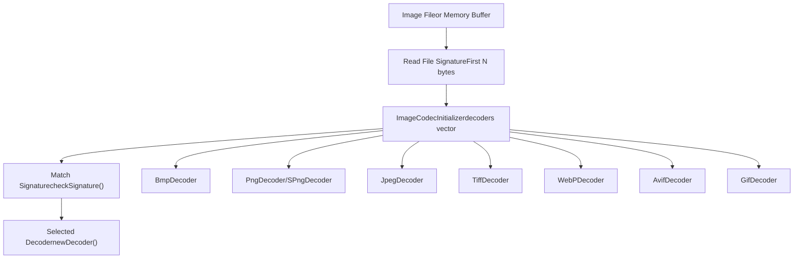
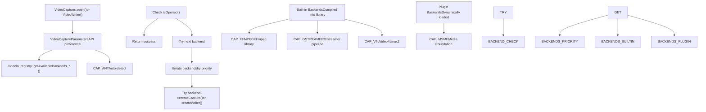

# Media I/O

Relevant source files

-   [cmake/OpenCVFindLibsGrfmt.cmake](https://github.com/opencv/opencv/blob/91c78f50/cmake/OpenCVFindLibsGrfmt.cmake)
-   [modules/imgcodecs/CMakeLists.txt](https://github.com/opencv/opencv/blob/91c78f50/modules/imgcodecs/CMakeLists.txt)
-   [modules/imgcodecs/include/opencv2/imgcodecs.hpp](https://github.com/opencv/opencv/blob/91c78f50/modules/imgcodecs/include/opencv2/imgcodecs.hpp)
-   [modules/imgcodecs/include/opencv2/imgcodecs/imgcodecs\_c.h](https://github.com/opencv/opencv/blob/91c78f50/modules/imgcodecs/include/opencv2/imgcodecs/imgcodecs_c.h)
-   [modules/imgcodecs/misc/java/test/ImgcodecsTest.java](https://github.com/opencv/opencv/blob/91c78f50/modules/imgcodecs/misc/java/test/ImgcodecsTest.java)
-   [modules/imgcodecs/src/exif.cpp](https://github.com/opencv/opencv/blob/91c78f50/modules/imgcodecs/src/exif.cpp)
-   [modules/imgcodecs/src/exif.hpp](https://github.com/opencv/opencv/blob/91c78f50/modules/imgcodecs/src/exif.hpp)
-   [modules/imgcodecs/src/grfmt\_avif.cpp](https://github.com/opencv/opencv/blob/91c78f50/modules/imgcodecs/src/grfmt_avif.cpp)
-   [modules/imgcodecs/src/grfmt\_avif.hpp](https://github.com/opencv/opencv/blob/91c78f50/modules/imgcodecs/src/grfmt_avif.hpp)
-   [modules/imgcodecs/src/grfmt\_base.cpp](https://github.com/opencv/opencv/blob/91c78f50/modules/imgcodecs/src/grfmt_base.cpp)
-   [modules/imgcodecs/src/grfmt\_base.hpp](https://github.com/opencv/opencv/blob/91c78f50/modules/imgcodecs/src/grfmt_base.hpp)
-   [modules/imgcodecs/src/grfmt\_gif.cpp](https://github.com/opencv/opencv/blob/91c78f50/modules/imgcodecs/src/grfmt_gif.cpp)
-   [modules/imgcodecs/src/grfmt\_gif.hpp](https://github.com/opencv/opencv/blob/91c78f50/modules/imgcodecs/src/grfmt_gif.hpp)
-   [modules/imgcodecs/src/grfmt\_hdr.cpp](https://github.com/opencv/opencv/blob/91c78f50/modules/imgcodecs/src/grfmt_hdr.cpp)
-   [modules/imgcodecs/src/grfmt\_hdr.hpp](https://github.com/opencv/opencv/blob/91c78f50/modules/imgcodecs/src/grfmt_hdr.hpp)
-   [modules/imgcodecs/src/grfmt\_jpeg.cpp](https://github.com/opencv/opencv/blob/91c78f50/modules/imgcodecs/src/grfmt_jpeg.cpp)
-   [modules/imgcodecs/src/grfmt\_jpeg.hpp](https://github.com/opencv/opencv/blob/91c78f50/modules/imgcodecs/src/grfmt_jpeg.hpp)
-   [modules/imgcodecs/src/grfmt\_jpeg2000.cpp](https://github.com/opencv/opencv/blob/91c78f50/modules/imgcodecs/src/grfmt_jpeg2000.cpp)
-   [modules/imgcodecs/src/grfmt\_png.cpp](https://github.com/opencv/opencv/blob/91c78f50/modules/imgcodecs/src/grfmt_png.cpp)
-   [modules/imgcodecs/src/grfmt\_png.hpp](https://github.com/opencv/opencv/blob/91c78f50/modules/imgcodecs/src/grfmt_png.hpp)
-   [modules/imgcodecs/src/grfmt\_spng.cpp](https://github.com/opencv/opencv/blob/91c78f50/modules/imgcodecs/src/grfmt_spng.cpp)
-   [modules/imgcodecs/src/grfmt\_tiff.cpp](https://github.com/opencv/opencv/blob/91c78f50/modules/imgcodecs/src/grfmt_tiff.cpp)
-   [modules/imgcodecs/src/grfmt\_tiff.hpp](https://github.com/opencv/opencv/blob/91c78f50/modules/imgcodecs/src/grfmt_tiff.hpp)
-   [modules/imgcodecs/src/grfmt\_webp.cpp](https://github.com/opencv/opencv/blob/91c78f50/modules/imgcodecs/src/grfmt_webp.cpp)
-   [modules/imgcodecs/src/grfmt\_webp.hpp](https://github.com/opencv/opencv/blob/91c78f50/modules/imgcodecs/src/grfmt_webp.hpp)
-   [modules/imgcodecs/src/grfmts.hpp](https://github.com/opencv/opencv/blob/91c78f50/modules/imgcodecs/src/grfmts.hpp)
-   [modules/imgcodecs/src/loadsave.cpp](https://github.com/opencv/opencv/blob/91c78f50/modules/imgcodecs/src/loadsave.cpp)
-   [modules/imgcodecs/test/test\_animation.cpp](https://github.com/opencv/opencv/blob/91c78f50/modules/imgcodecs/test/test_animation.cpp)
-   [modules/imgcodecs/test/test\_avif.cpp](https://github.com/opencv/opencv/blob/91c78f50/modules/imgcodecs/test/test_avif.cpp)
-   [modules/imgcodecs/test/test\_gif.cpp](https://github.com/opencv/opencv/blob/91c78f50/modules/imgcodecs/test/test_gif.cpp)
-   [modules/imgcodecs/test/test\_grfmt.cpp](https://github.com/opencv/opencv/blob/91c78f50/modules/imgcodecs/test/test_grfmt.cpp)
-   [modules/imgcodecs/test/test\_jpeg.cpp](https://github.com/opencv/opencv/blob/91c78f50/modules/imgcodecs/test/test_jpeg.cpp)
-   [modules/imgcodecs/test/test\_png.cpp](https://github.com/opencv/opencv/blob/91c78f50/modules/imgcodecs/test/test_png.cpp)
-   [modules/imgcodecs/test/test\_read\_write.cpp](https://github.com/opencv/opencv/blob/91c78f50/modules/imgcodecs/test/test_read_write.cpp)
-   [modules/imgcodecs/test/test\_tiff.cpp](https://github.com/opencv/opencv/blob/91c78f50/modules/imgcodecs/test/test_tiff.cpp)
-   [modules/imgcodecs/test/test\_webp.cpp](https://github.com/opencv/opencv/blob/91c78f50/modules/imgcodecs/test/test_webp.cpp)
-   [modules/videoio/cmake/detect\_ffmpeg.cmake](https://github.com/opencv/opencv/blob/91c78f50/modules/videoio/cmake/detect_ffmpeg.cmake)
-   [modules/videoio/cmake/init.cmake](https://github.com/opencv/opencv/blob/91c78f50/modules/videoio/cmake/init.cmake)
-   [modules/videoio/cmake/plugin.cmake](https://github.com/opencv/opencv/blob/91c78f50/modules/videoio/cmake/plugin.cmake)
-   [modules/videoio/include/opencv2/videoio.hpp](https://github.com/opencv/opencv/blob/91c78f50/modules/videoio/include/opencv2/videoio.hpp)
-   [modules/videoio/include/opencv2/videoio/registry.hpp](https://github.com/opencv/opencv/blob/91c78f50/modules/videoio/include/opencv2/videoio/registry.hpp)
-   [modules/videoio/include/opencv2/videoio/videoio\_c.h](https://github.com/opencv/opencv/blob/91c78f50/modules/videoio/include/opencv2/videoio/videoio_c.h)
-   [modules/videoio/misc/java/filelist\_common](https://github.com/opencv/opencv/blob/91c78f50/modules/videoio/misc/java/filelist_common)
-   [modules/videoio/misc/java/gen\_dict.json](https://github.com/opencv/opencv/blob/91c78f50/modules/videoio/misc/java/gen_dict.json)
-   [modules/videoio/misc/java/src/cpp/videoio\_converters.cpp](https://github.com/opencv/opencv/blob/91c78f50/modules/videoio/misc/java/src/cpp/videoio_converters.cpp)
-   [modules/videoio/misc/java/src/cpp/videoio\_converters.hpp](https://github.com/opencv/opencv/blob/91c78f50/modules/videoio/misc/java/src/cpp/videoio_converters.hpp)
-   [modules/videoio/misc/java/test/VideoCaptureTest.java](https://github.com/opencv/opencv/blob/91c78f50/modules/videoio/misc/java/test/VideoCaptureTest.java)
-   [modules/videoio/misc/plugin\_ffmpeg/CMakeLists.txt](https://github.com/opencv/opencv/blob/91c78f50/modules/videoio/misc/plugin_ffmpeg/CMakeLists.txt)
-   [modules/videoio/misc/plugin\_gstreamer/CMakeLists.txt](https://github.com/opencv/opencv/blob/91c78f50/modules/videoio/misc/plugin_gstreamer/CMakeLists.txt)
-   [modules/videoio/src/backend.hpp](https://github.com/opencv/opencv/blob/91c78f50/modules/videoio/src/backend.hpp)
-   [modules/videoio/src/backend\_plugin.cpp](https://github.com/opencv/opencv/blob/91c78f50/modules/videoio/src/backend_plugin.cpp)
-   [modules/videoio/src/backend\_static.cpp](https://github.com/opencv/opencv/blob/91c78f50/modules/videoio/src/backend_static.cpp)
-   [modules/videoio/src/cap.cpp](https://github.com/opencv/opencv/blob/91c78f50/modules/videoio/src/cap.cpp)
-   [modules/videoio/src/cap\_dc1394\_v2.cpp](https://github.com/opencv/opencv/blob/91c78f50/modules/videoio/src/cap_dc1394_v2.cpp)
-   [modules/videoio/src/cap\_dshow.cpp](https://github.com/opencv/opencv/blob/91c78f50/modules/videoio/src/cap_dshow.cpp)
-   [modules/videoio/src/cap\_dshow.hpp](https://github.com/opencv/opencv/blob/91c78f50/modules/videoio/src/cap_dshow.hpp)
-   [modules/videoio/src/cap\_ffmpeg.cpp](https://github.com/opencv/opencv/blob/91c78f50/modules/videoio/src/cap_ffmpeg.cpp)
-   [modules/videoio/src/cap\_ffmpeg\_impl.hpp](https://github.com/opencv/opencv/blob/91c78f50/modules/videoio/src/cap_ffmpeg_impl.hpp)
-   [modules/videoio/src/cap\_gphoto2.cpp](https://github.com/opencv/opencv/blob/91c78f50/modules/videoio/src/cap_gphoto2.cpp)
-   [modules/videoio/src/cap\_gstreamer.cpp](https://github.com/opencv/opencv/blob/91c78f50/modules/videoio/src/cap_gstreamer.cpp)
-   [modules/videoio/src/cap\_interface.hpp](https://github.com/opencv/opencv/blob/91c78f50/modules/videoio/src/cap_interface.hpp)
-   [modules/videoio/src/cap\_mjpeg\_decoder.cpp](https://github.com/opencv/opencv/blob/91c78f50/modules/videoio/src/cap_mjpeg_decoder.cpp)
-   [modules/videoio/src/cap\_mjpeg\_encoder.cpp](https://github.com/opencv/opencv/blob/91c78f50/modules/videoio/src/cap_mjpeg_encoder.cpp)
-   [modules/videoio/src/cap\_msmf.cpp](https://github.com/opencv/opencv/blob/91c78f50/modules/videoio/src/cap_msmf.cpp)
-   [modules/videoio/src/cap\_msmf.hpp](https://github.com/opencv/opencv/blob/91c78f50/modules/videoio/src/cap_msmf.hpp)
-   [modules/videoio/src/cap\_v4l.cpp](https://github.com/opencv/opencv/blob/91c78f50/modules/videoio/src/cap_v4l.cpp)
-   [modules/videoio/src/cap\_ximea.cpp](https://github.com/opencv/opencv/blob/91c78f50/modules/videoio/src/cap_ximea.cpp)
-   [modules/videoio/src/precomp.hpp](https://github.com/opencv/opencv/blob/91c78f50/modules/videoio/src/precomp.hpp)
-   [modules/videoio/src/videoio\_registry.cpp](https://github.com/opencv/opencv/blob/91c78f50/modules/videoio/src/videoio_registry.cpp)
-   [modules/videoio/test/test\_audio.cpp](https://github.com/opencv/opencv/blob/91c78f50/modules/videoio/test/test_audio.cpp)
-   [modules/videoio/test/test\_camera.cpp](https://github.com/opencv/opencv/blob/91c78f50/modules/videoio/test/test_camera.cpp)
-   [modules/videoio/test/test\_ffmpeg.cpp](https://github.com/opencv/opencv/blob/91c78f50/modules/videoio/test/test_ffmpeg.cpp)
-   [modules/videoio/test/test\_gstreamer.cpp](https://github.com/opencv/opencv/blob/91c78f50/modules/videoio/test/test_gstreamer.cpp)
-   [modules/videoio/test/test\_microphone.cpp](https://github.com/opencv/opencv/blob/91c78f50/modules/videoio/test/test_microphone.cpp)
-   [modules/videoio/test/test\_orientation.cpp](https://github.com/opencv/opencv/blob/91c78f50/modules/videoio/test/test_orientation.cpp)
-   [modules/videoio/test/test\_precomp.hpp](https://github.com/opencv/opencv/blob/91c78f50/modules/videoio/test/test_precomp.hpp)
-   [modules/videoio/test/test\_v4l2.cpp](https://github.com/opencv/opencv/blob/91c78f50/modules/videoio/test/test_v4l2.cpp)
-   [modules/videoio/test/test\_video\_io.cpp](https://github.com/opencv/opencv/blob/91c78f50/modules/videoio/test/test_video_io.cpp)
-   [samples/cpp/imgcodecs\_jpeg.cpp](https://github.com/opencv/opencv/blob/91c78f50/samples/cpp/imgcodecs_jpeg.cpp)
-   [samples/cpp/videocapture\_audio.cpp](https://github.com/opencv/opencv/blob/91c78f50/samples/cpp/videocapture_audio.cpp)
-   [samples/cpp/videocapture\_audio\_combination.cpp](https://github.com/opencv/opencv/blob/91c78f50/samples/cpp/videocapture_audio_combination.cpp)
-   [samples/cpp/videocapture\_microphone.cpp](https://github.com/opencv/opencv/blob/91c78f50/samples/cpp/videocapture_microphone.cpp)

## Purpose and Scope

The Media I/O system provides unified APIs for reading and writing images and video streams across multiple platforms and formats. This document covers the high-level architecture of both subsystems and their interaction patterns. For detailed information about specific components:

-   Image file reading/writing, codec system, and format support: see [Image File I/O and Codec System](/opencv/opencv/7.1-image-file-io-and-codec-system)
-   Video capture/writing, backend architecture, and camera/stream access: see [Video Capture and Backend Architecture](/opencv/opencv/7.2-video-capture-and-backend-architecture)

The Media I/O system abstracts platform-specific implementations through a registry-based plugin architecture, allowing OpenCV to support diverse hardware and software backends while maintaining a consistent API surface.

---

## System Architecture Overview

The Media I/O system consists of two primary modules that operate independently but share common design patterns:

```mermaid
flowchart TD
    APP["Application Code"]
    IMREAD["imread()imwrite()imdecode()imencode()"]
    VIDEOCAPTURE["cv::VideoCapture"]
    VIDEOWRITER["cv::VideoWriter"]
    IMG_REGISTRY["ImageCodecInitializerDecoder/Encoder Registry"]
    IMG_DECODERS["Image DecodersPngDecoder, JpegDecoderTiffDecoder, etc."]
    IMG_ENCODERS["Image EncodersPngEncoder, JpegEncoderTiffEncoder, etc."]
    VIO_REGISTRY["videoio_registryBackend Registry"]
    VIO_BACKENDS["Video BackendsFFmpeg, GStreamerMSMF, V4L2, etc."]
    ICAPTURE["IVideoCaptureInterface"]
    IWRITER["IVideoWriterInterface"]
    LIBPNG["libpng/libspng"]
    LIBJPEG["libjpeg-turbo"]
    LIBTIFF["libtiff"]
    LIBWEBP["libwebp"]
    FFMPEG["FFmpeglibavformat/libavcodec"]
    GSTREAMER["GStreamer"]
    V4L2["Video4Linux2"]
    MSMF["Media Foundation"]

    APP --> IMREAD
    APP --> VIDEOCAPTURE
    APP --> VIDEOWRITER
    IMREAD --> IMG_REGISTRY
    IMG --> REGISTRY_IMG_DECODERS
    IMG --> REGISTRY_IMG_ENCODERS
    VIDEOCAPTURE --> VIO_REGISTRY
    VIDEOWRITER --> VIO_REGISTRY
    VIO --> REGISTRY_VIO_BACKENDS
    VIO --> BACKENDS_ICAPTURE
    VIO --> BACKENDS_IWRITER
    IMG --> DECODERS_LIBPNG
    IMG --> DECODERS_LIBJPEG
    IMG --> DECODERS_LIBTIFF
    IMG --> DECODERS_LIBWEBP
    VIO --> BACKENDS_FFMPEG
    VIO --> BACKENDS_GSTREAMER
    VIO --> BACKENDS_V4L2
    VIO --> BACKENDS_MSMF
```

**Sources:**

-   [modules/imgcodecs/src/loadsave.cpp156-245](https://github.com/opencv/opencv/blob/91c78f50/modules/imgcodecs/src/loadsave.cpp#L156-L245)
-   [modules/videoio/src/videoio\_registry.cpp1-23](https://github.com/opencv/opencv/blob/91c78f50/modules/videoio/src/videoio_registry.cpp#L1-L23)
-   [modules/videoio/src/cap.cpp47-64](https://github.com/opencv/opencv/blob/91c78f50/modules/videoio/src/cap.cpp#L47-L64)

---

## Module Organization and Responsibilities

| Module | Primary Purpose | Key Classes/Functions | Configuration |
| --- | --- | --- | --- |
| **imgcodecs** | Still image file I/O | `imread()`, `imwrite()`, `imdecode()`, `imencode()`, `ImageDecoder`, `ImageEncoder` | Format support via `ImageCodecInitializer` registry |
| **videoio** | Video stream I/O | `VideoCapture`, `VideoWriter`, `IVideoCapture`, `IVideoWriter` | Backend selection via `videoio_registry` |

Both modules implement a **registry pattern** where format/backend support is determined at initialization time based on build configuration and available libraries.

**Sources:**

-   [modules/imgcodecs/include/opencv2/imgcodecs.hpp48-65](https://github.com/opencv/opencv/blob/91c78f50/modules/imgcodecs/include/opencv2/imgcodecs.hpp#L48-L65)
-   [modules/videoio/include/opencv2/videoio.hpp48-65](https://github.com/opencv/opencv/blob/91c78f50/modules/videoio/include/opencv2/videoio.hpp#L48-L65)

---

## Backend Abstraction Pattern

### Image Codec Registry

The imgcodecs module uses signature-based format detection and a static registry of decoders/encoders:

The `ImageCodecInitializer` struct maintains vectors of available decoders and encoders, populated at static initialization based on compile-time feature flags:

-   Decoders are selected by comparing file signatures via `checkSignature()`
-   Encoders are selected by file extension matching via `findEncoder()`
-   Each codec provides `signatureLength()` and format-specific signatures

**Sources:**

-   [modules/imgcodecs/src/loadsave.cpp152-252](https://github.com/opencv/opencv/blob/91c78f50/modules/imgcodecs/src/loadsave.cpp#L152-L252)
-   [modules/imgcodecs/src/loadsave.cpp261-297](https://github.com/opencv/opencv/blob/91c78f50/modules/imgcodecs/src/loadsave.cpp#L261-L297)
-   [modules/imgcodecs/src/loadsave.cpp327-365](https://github.com/opencv/opencv/blob/91c78f50/modules/imgcodecs/src/loadsave.cpp#L327-L365)

### Video Backend Registry

The videoio module implements a more sophisticated registry with runtime backend selection:

Backends are registered through `VideoBackendInfo` structures that specify:

-   Backend ID (`VideoCaptureAPIs` enum value)
-   Priority for auto-selection
-   Factory functions for creating capture/writer instances
-   Flags indicating file vs. camera vs. stream support

**Sources:**

-   [modules/videoio/src/cap.cpp115-177](https://github.com/opencv/opencv/blob/91c78f50/modules/videoio/src/cap.cpp#L115-L177)
-   [modules/videoio/src/videoio\_registry.cpp1-300](https://github.com/opencv/opencv/blob/91c78f50/modules/videoio/src/videoio_registry.cpp#L1-L300)
-   [modules/videoio/include/opencv2/videoio.hpp82-132](https://github.com/opencv/opencv/blob/91c78f50/modules/videoio/include/opencv2/videoio.hpp#L82-L132)

---

## Plugin Architecture

OpenCV supports both **static** (compiled-in) and **dynamic** (plugin) backends for video I/O:

### Plugin Configuration

Plugins are configured via CMake variables:

-   `VIDEOIO_PLUGIN_LIST`: Comma-separated list of backends to build as plugins (e.g., `"ffmpeg,gstreamer"`)
-   `VIDEOIO_ENABLE_PLUGINS`: Master switch for plugin support (default: ON except on embedded platforms)

When a backend is built as a plugin:

1.  Separate shared library is created (e.g., `opencv_videoio_ffmpeg450.so`)
2.  Library exports C ABI functions matching `CvPluginCapture` interface
3.  Main `videoio` module loads plugins at runtime via `PluginBackend` class
4.  Plugins are discovered in standard OpenCV plugin directories

**Sources:**

-   [modules/videoio/CMakeLists.txt1-22](https://github.com/opencv/opencv/blob/91c78f50/modules/videoio/CMakeLists.txt#L1-L22)
-   [modules/videoio/src/backend\_plugin.cpp1-35](https://github.com/opencv/opencv/blob/91c78f50/modules/videoio/src/backend_plugin.cpp#L1-L35)
-   [modules/videoio/cmake/plugin.cmake](https://github.com/opencv/opencv/blob/91c78f50/modules/videoio/cmake/plugin.cmake)

### Static Backend Registration

Built-in backends are registered directly in `videoio_registry.cpp` through helper macros and initialization functions. The registration process:

1.  Backend creates factory functions implementing `IBackend` interface
2.  `VideoBackendInfo` structure describes backend capabilities
3.  Registry maintains separate vectors for different use cases:
    -   `getAvailableBackends_CaptureByFilename()`
    -   `getAvailableBackends_CaptureByIndex()`
    -   `getAvailableBackends_Writer()`

**Sources:**

-   [modules/videoio/src/videoio\_registry.cpp100-300](https://github.com/opencv/opencv/blob/91c78f50/modules/videoio/src/videoio_registry.cpp#L100-L300)
-   [modules/videoio/src/backend\_static.cpp](https://github.com/opencv/opencv/blob/91c78f50/modules/videoio/src/backend_static.cpp)

---

## Key API Entry Points

### Image I/O Functions

| Function | Purpose | Key Parameters | Returns |
| --- | --- | --- | --- |
| `imread()` | Load image from file | `filename`, `flags` (ImreadModes) | `Mat` |
| `imwrite()` | Save image to file | `filename`, `img`, `params` (vector) | `bool` |
| `imdecode()` | Decode image from memory | `buf` (Mat or vector), `flags` | `Mat` |
| `imencode()` | Encode image to memory | `ext`, `img`, `buf`, `params` | `bool` |

The `flags` parameter for imread uses `ImreadModes` enum (e.g., `IMREAD_COLOR`, `IMREAD_GRAYSCALE`, `IMREAD_UNCHANGED`). The `params` vector for imwrite contains format-specific parameters defined by `ImwriteFlags` enum (e.g., `IMWRITE_JPEG_QUALITY`, `IMWRITE_PNG_COMPRESSION`).

**Sources:**

-   [modules/imgcodecs/include/opencv2/imgcodecs.hpp323-450](https://github.com/opencv/opencv/blob/91c78f50/modules/imgcodecs/include/opencv2/imgcodecs.hpp#L323-L450)
-   [modules/imgcodecs/src/loadsave.cpp400-700](https://github.com/opencv/opencv/blob/91c78f50/modules/imgcodecs/src/loadsave.cpp#L400-L700)

### Video I/O Classes

The `VideoCapture` and `VideoWriter` classes provide high-level interfaces while delegating to backend-specific implementations through `IVideoCapture` and `IVideoWriter` interfaces.

**Property System:**

-   `CAP_PROP_*` constants (defined in `VideoCaptureProperties` enum) identify properties
-   `get()` retrieves current property value
-   `set()` modifies property (may fail if backend doesn't support it)
-   Properties include frame dimensions, FPS, codec, hardware acceleration settings, etc.

**Sources:**

-   [modules/videoio/include/opencv2/videoio.hpp650-900](https://github.com/opencv/opencv/blob/91c78f50/modules/videoio/include/opencv2/videoio.hpp#L650-L900)
-   [modules/videoio/src/cap.cpp65-300](https://github.com/opencv/opencv/blob/91c78f50/modules/videoio/src/cap.cpp#L65-L300)
-   [modules/videoio/src/cap\_interface.hpp1-100](https://github.com/opencv/opencv/blob/91c78f50/modules/videoio/src/cap_interface.hpp#L1-L100)

---

## Common Backend Implementations

### FFmpeg Backend (CAP\_FFMPEG)

The FFmpeg backend provides broad codec and container format support for video files and streams:

-   **Reader Implementation:** `CvCapture_FFMPEG` class in [modules/videoio/src/cap\_ffmpeg\_impl.hpp538-626](https://github.com/opencv/opencv/blob/91c78f50/modules/videoio/src/cap_ffmpeg_impl.hpp#L538-L626)

    -   Uses `libavformat` for demuxing, `libavcodec` for decoding
    -   Supports seeking via `seek()` methods
    -   Hardware acceleration through `VideoAccelerationType` (VAAPI, D3D11, MFX)
    -   Handles timestamp normalization and DTS/PTS conversion
-   **Writer Implementation:** `CvVideoWriter_FFMPEG` class

    -   Codec selection via FOURCC codes
    -   Container format determined by file extension
    -   Bitrate control and quality parameters

**Configuration:**

-   Can be built as plugin via `VIDEOIO_PLUGIN_LIST="ffmpeg"`
-   Timeout settings: `CAP_PROP_OPEN_TIMEOUT_MSEC`, `CAP_PROP_READ_TIMEOUT_MSEC`
-   Thread control: `CAP_PROP_N_THREADS`

**Sources:**

-   [modules/videoio/src/cap\_ffmpeg\_impl.hpp1-2500](https://github.com/opencv/opencv/blob/91c78f50/modules/videoio/src/cap_ffmpeg_impl.hpp#L1-L2500)
-   [modules/videoio/src/cap\_ffmpeg.cpp1-800](https://github.com/opencv/opencv/blob/91c78f50/modules/videoio/src/cap_ffmpeg.cpp#L1-L800)

### Platform-Specific Backends

| Backend | Platform | Implementation Class | Key Features |
| --- | --- | --- | --- |
| **MSMF** | Windows | `CvCapture_MSMF`, `CvVideoWriter_MSMF` | Media Foundation API, hardware transforms, D3D11 acceleration |
| **V4L2** | Linux | `CvCaptureCAM_V4L` | Camera capture via Video4Linux2, multiple pixel formats, controls |
| **GStreamer** | Cross-platform | `GStreamerCapture`, `GStreamerWriter` | Pipeline-based, flexible format support |
| **AVFoundation** | macOS/iOS | `CaptureDelegate` | Native camera/screen capture |
| **DirectShow** | Windows | `videoInput` wrapper | Legacy camera interface |

**Sources:**

-   [modules/videoio/src/cap\_msmf.cpp1-500](https://github.com/opencv/opencv/blob/91c78f50/modules/videoio/src/cap_msmf.cpp#L1-L500)
-   [modules/videoio/src/cap\_v4l.cpp1-500](https://github.com/opencv/opencv/blob/91c78f50/modules/videoio/src/cap_v4l.cpp#L1-L500)
-   [modules/videoio/src/cap\_gstreamer.cpp1-500](https://github.com/opencv/opencv/blob/91c78f50/modules/videoio/src/cap_gstreamer.cpp#L1-L500)

---

## Configuration and Environment Variables

Both imgcodecs and videoio modules respect environment variables for debugging and behavior customization:

### Image I/O Configuration

| Variable | Purpose | Default |
| --- | --- | --- |
| `OPENCV_IO_MAX_IMAGE_PARAMS` | Maximum number of encode parameters | 50 |
| `OPENCV_IO_MAX_IMAGE_WIDTH` | Maximum image width | 1048576 (1M) |
| `OPENCV_IO_MAX_IMAGE_HEIGHT` | Maximum image height | 1048576 (1M) |
| `OPENCV_IO_MAX_IMAGE_PIXELS` | Maximum total pixels | 1073741824 (1G) |

### Video I/O Configuration

| Variable | Purpose | Default |
| --- | --- | --- |
| `OPENCV_VIDEOIO_DEBUG` | Enable verbose logging | false |
| `OPENCV_VIDEOCAPTURE_DEBUG` | Enable capture-specific logging | false |
| `OPENCV_VIDEOWRITER_DEBUG` | Enable writer-specific logging | false |
| `OPENCV_FFMPEG_IS_THREAD_SAFE` | Disable OpenCV locking for FFmpeg | false |
| `OPENCV_FFMPEG_THREADS` | Number of decoder threads | CPU count |
| `OPENCV_FFMPEG_CAPTURE_OPTIONS` | FFmpeg-specific options string | "" |

**Sources:**

-   [modules/imgcodecs/src/loadsave.cpp67-71](https://github.com/opencv/opencv/blob/91c78f50/modules/imgcodecs/src/loadsave.cpp#L67-L71)
-   [modules/videoio/src/cap.cpp49-63](https://github.com/opencv/opencv/blob/91c78f50/modules/videoio/src/cap.cpp#L49-L63)
-   [modules/videoio/src/cap\_ffmpeg\_impl.hpp1055-1183](https://github.com/opencv/opencv/blob/91c78f50/modules/videoio/src/cap_ffmpeg_impl.hpp#L1055-L1183)
