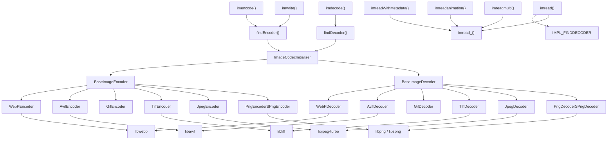
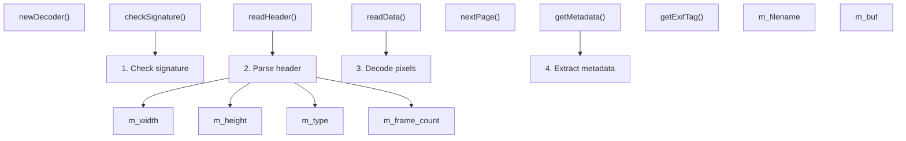
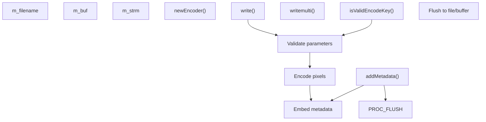
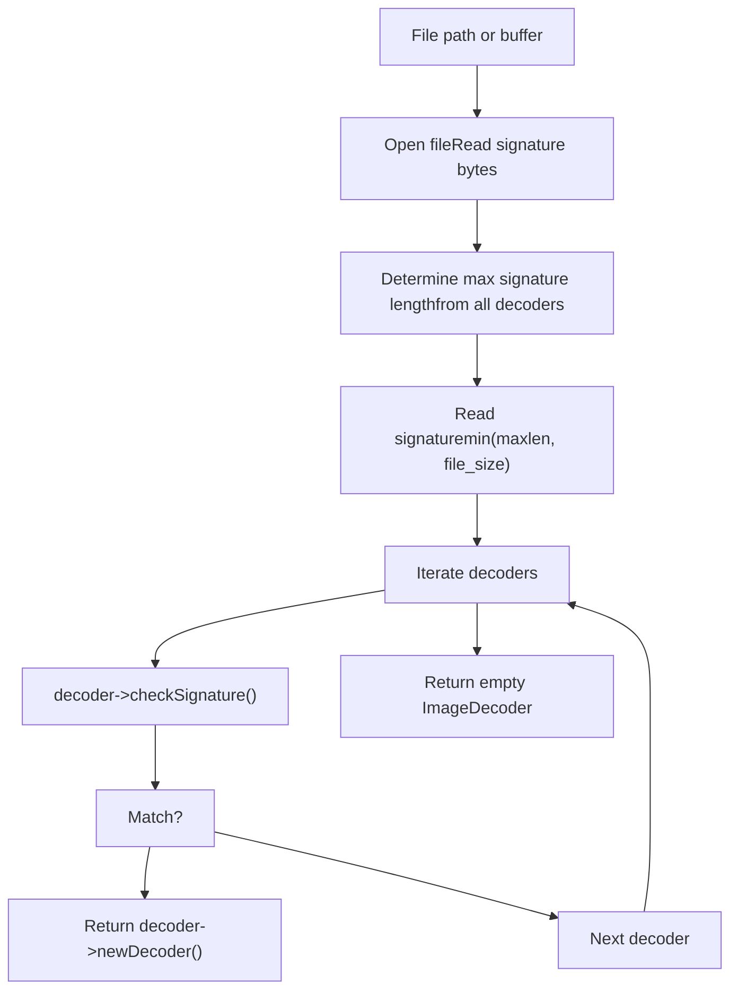
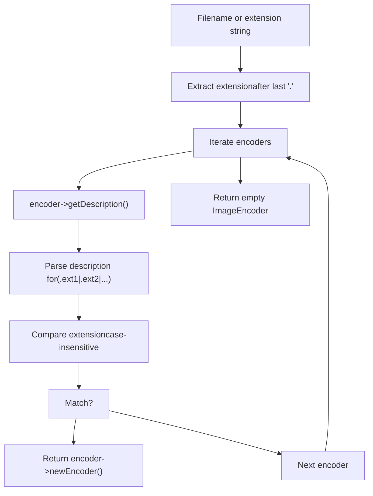
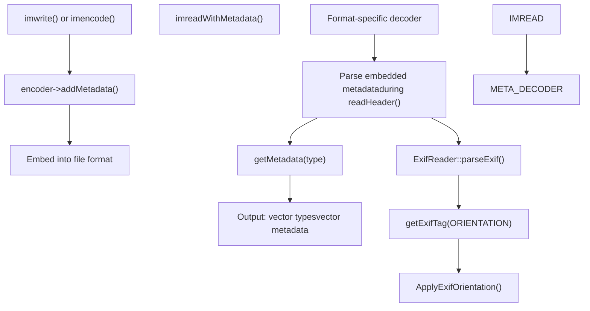
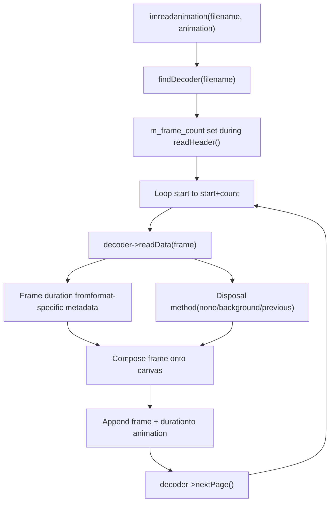
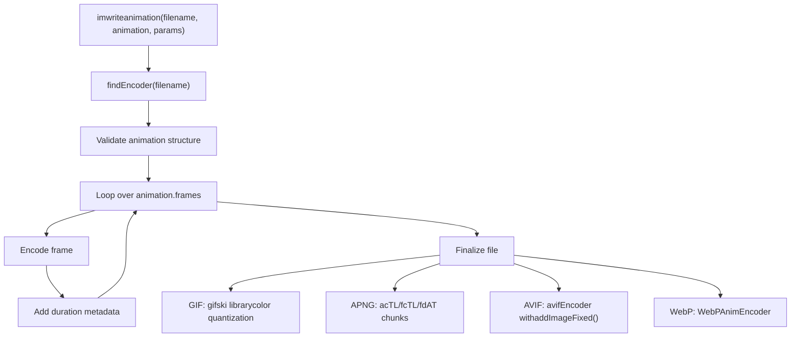

# Image File I/O and Codec System

Relevant source files

-   [cmake/OpenCVFindLibsGrfmt.cmake](https://github.com/opencv/opencv/blob/91c78f50/cmake/OpenCVFindLibsGrfmt.cmake)
-   [modules/imgcodecs/CMakeLists.txt](https://github.com/opencv/opencv/blob/91c78f50/modules/imgcodecs/CMakeLists.txt)
-   [modules/imgcodecs/include/opencv2/imgcodecs.hpp](https://github.com/opencv/opencv/blob/91c78f50/modules/imgcodecs/include/opencv2/imgcodecs.hpp)
-   [modules/imgcodecs/include/opencv2/imgcodecs/imgcodecs\_c.h](https://github.com/opencv/opencv/blob/91c78f50/modules/imgcodecs/include/opencv2/imgcodecs/imgcodecs_c.h)
-   [modules/imgcodecs/misc/java/test/ImgcodecsTest.java](https://github.com/opencv/opencv/blob/91c78f50/modules/imgcodecs/misc/java/test/ImgcodecsTest.java)
-   [modules/imgcodecs/src/exif.cpp](https://github.com/opencv/opencv/blob/91c78f50/modules/imgcodecs/src/exif.cpp)
-   [modules/imgcodecs/src/exif.hpp](https://github.com/opencv/opencv/blob/91c78f50/modules/imgcodecs/src/exif.hpp)
-   [modules/imgcodecs/src/grfmt\_avif.cpp](https://github.com/opencv/opencv/blob/91c78f50/modules/imgcodecs/src/grfmt_avif.cpp)
-   [modules/imgcodecs/src/grfmt\_avif.hpp](https://github.com/opencv/opencv/blob/91c78f50/modules/imgcodecs/src/grfmt_avif.hpp)
-   [modules/imgcodecs/src/grfmt\_base.cpp](https://github.com/opencv/opencv/blob/91c78f50/modules/imgcodecs/src/grfmt_base.cpp)
-   [modules/imgcodecs/src/grfmt\_base.hpp](https://github.com/opencv/opencv/blob/91c78f50/modules/imgcodecs/src/grfmt_base.hpp)
-   [modules/imgcodecs/src/grfmt\_gif.cpp](https://github.com/opencv/opencv/blob/91c78f50/modules/imgcodecs/src/grfmt_gif.cpp)
-   [modules/imgcodecs/src/grfmt\_gif.hpp](https://github.com/opencv/opencv/blob/91c78f50/modules/imgcodecs/src/grfmt_gif.hpp)
-   [modules/imgcodecs/src/grfmt\_hdr.cpp](https://github.com/opencv/opencv/blob/91c78f50/modules/imgcodecs/src/grfmt_hdr.cpp)
-   [modules/imgcodecs/src/grfmt\_hdr.hpp](https://github.com/opencv/opencv/blob/91c78f50/modules/imgcodecs/src/grfmt_hdr.hpp)
-   [modules/imgcodecs/src/grfmt\_jpeg.cpp](https://github.com/opencv/opencv/blob/91c78f50/modules/imgcodecs/src/grfmt_jpeg.cpp)
-   [modules/imgcodecs/src/grfmt\_jpeg.hpp](https://github.com/opencv/opencv/blob/91c78f50/modules/imgcodecs/src/grfmt_jpeg.hpp)
-   [modules/imgcodecs/src/grfmt\_jpeg2000.cpp](https://github.com/opencv/opencv/blob/91c78f50/modules/imgcodecs/src/grfmt_jpeg2000.cpp)
-   [modules/imgcodecs/src/grfmt\_png.cpp](https://github.com/opencv/opencv/blob/91c78f50/modules/imgcodecs/src/grfmt_png.cpp)
-   [modules/imgcodecs/src/grfmt\_png.hpp](https://github.com/opencv/opencv/blob/91c78f50/modules/imgcodecs/src/grfmt_png.hpp)
-   [modules/imgcodecs/src/grfmt\_spng.cpp](https://github.com/opencv/opencv/blob/91c78f50/modules/imgcodecs/src/grfmt_spng.cpp)
-   [modules/imgcodecs/src/grfmt\_tiff.cpp](https://github.com/opencv/opencv/blob/91c78f50/modules/imgcodecs/src/grfmt_tiff.cpp)
-   [modules/imgcodecs/src/grfmt\_tiff.hpp](https://github.com/opencv/opencv/blob/91c78f50/modules/imgcodecs/src/grfmt_tiff.hpp)
-   [modules/imgcodecs/src/grfmt\_webp.cpp](https://github.com/opencv/opencv/blob/91c78f50/modules/imgcodecs/src/grfmt_webp.cpp)
-   [modules/imgcodecs/src/grfmt\_webp.hpp](https://github.com/opencv/opencv/blob/91c78f50/modules/imgcodecs/src/grfmt_webp.hpp)
-   [modules/imgcodecs/src/grfmts.hpp](https://github.com/opencv/opencv/blob/91c78f50/modules/imgcodecs/src/grfmts.hpp)
-   [modules/imgcodecs/src/loadsave.cpp](https://github.com/opencv/opencv/blob/91c78f50/modules/imgcodecs/src/loadsave.cpp)
-   [modules/imgcodecs/test/test\_animation.cpp](https://github.com/opencv/opencv/blob/91c78f50/modules/imgcodecs/test/test_animation.cpp)
-   [modules/imgcodecs/test/test\_avif.cpp](https://github.com/opencv/opencv/blob/91c78f50/modules/imgcodecs/test/test_avif.cpp)
-   [modules/imgcodecs/test/test\_gif.cpp](https://github.com/opencv/opencv/blob/91c78f50/modules/imgcodecs/test/test_gif.cpp)
-   [modules/imgcodecs/test/test\_grfmt.cpp](https://github.com/opencv/opencv/blob/91c78f50/modules/imgcodecs/test/test_grfmt.cpp)
-   [modules/imgcodecs/test/test\_jpeg.cpp](https://github.com/opencv/opencv/blob/91c78f50/modules/imgcodecs/test/test_jpeg.cpp)
-   [modules/imgcodecs/test/test\_png.cpp](https://github.com/opencv/opencv/blob/91c78f50/modules/imgcodecs/test/test_png.cpp)
-   [modules/imgcodecs/test/test\_read\_write.cpp](https://github.com/opencv/opencv/blob/91c78f50/modules/imgcodecs/test/test_read_write.cpp)
-   [modules/imgcodecs/test/test\_tiff.cpp](https://github.com/opencv/opencv/blob/91c78f50/modules/imgcodecs/test/test_tiff.cpp)
-   [modules/imgcodecs/test/test\_webp.cpp](https://github.com/opencv/opencv/blob/91c78f50/modules/imgcodecs/test/test_webp.cpp)
-   [modules/videoio/misc/java/filelist\_common](https://github.com/opencv/opencv/blob/91c78f50/modules/videoio/misc/java/filelist_common)
-   [modules/videoio/misc/java/gen\_dict.json](https://github.com/opencv/opencv/blob/91c78f50/modules/videoio/misc/java/gen_dict.json)
-   [modules/videoio/misc/java/src/cpp/videoio\_converters.cpp](https://github.com/opencv/opencv/blob/91c78f50/modules/videoio/misc/java/src/cpp/videoio_converters.cpp)
-   [modules/videoio/misc/java/src/cpp/videoio\_converters.hpp](https://github.com/opencv/opencv/blob/91c78f50/modules/videoio/misc/java/src/cpp/videoio_converters.hpp)
-   [modules/videoio/misc/java/test/VideoCaptureTest.java](https://github.com/opencv/opencv/blob/91c78f50/modules/videoio/misc/java/test/VideoCaptureTest.java)
-   [samples/cpp/imgcodecs\_jpeg.cpp](https://github.com/opencv/opencv/blob/91c78f50/samples/cpp/imgcodecs_jpeg.cpp)

This document describes the `imgcodecs` module's architecture for reading and writing image files in various formats. It covers the codec system design, format support, metadata handling, animation/multi-page capabilities, and the public API for image file I/O operations.

For video file I/O, see [Video Capture and Backend Architecture](/opencv/opencv/7.2-video-capture-and-backend-architecture).

---

## System Overview

The `imgcodecs` module provides format-agnostic image file reading and writing through a plugin-based codec architecture. The system automatically detects file formats by signature matching and routes I/O operations to the appropriate codec implementation.

### High-Level Architecture


**Sources:** [modules/imgcodecs/include/opencv2/imgcodecs.hpp1-600](https://github.com/opencv/opencv/blob/91c78f50/modules/imgcodecs/include/opencv2/imgcodecs.hpp#L1-L600) [modules/imgcodecs/src/loadsave.cpp156-252](https://github.com/opencv/opencv/blob/91c78f50/modules/imgcodecs/src/loadsave.cpp#L156-L252) [modules/imgcodecs/src/grfmt\_base.hpp1-300](https://github.com/opencv/opencv/blob/91c78f50/modules/imgcodecs/src/grfmt_base.hpp#L1-L300)

---

## Core API Functions

The primary interface consists of file-based and memory-based I/O functions that accept format-specific flags and parameters.

### Image Reading Functions

| Function | Purpose | Key Features |
| --- | --- | --- |
| `imread()` | Load single image from file | Format auto-detection, EXIF orientation, color conversion |
| `imdecode()` | Decode image from memory buffer | Same features as `imread()` |
| `imreadmulti()` | Load multi-page/multi-frame images | TIFF pages, animated formats |
| `imreadanimation()` | Load animation with timing | Returns `Animation` with frames and durations |
| `imreadWithMetadata()` | Load image with EXIF/XMP/ICC data | Metadata returned separately |
| `imcount()` | Count pages/frames in file | Returns frame count without decoding |

### Image Writing Functions

| Function | Purpose | Key Features |
| --- | --- | --- |
| `imwrite()` | Save single image to file | Extension-based format selection |
| `imencode()` | Encode image to memory buffer | Format specified by extension string |
| `imwriteanimation()` | Save animation to file | GIF, AVIF, APNG, WebP support |
| `imencodeanimation()` | Encode animation to buffer | Memory-based animation writing |

### ImreadModes Flags

The `ImreadModes` enum controls how images are loaded and processed:

```
IMREAD_UNCHANGED            = -1  // Preserve format, alpha, orientationIMREAD_GRAYSCALE            = 0   // Convert to single-channel grayscaleIMREAD_COLOR_BGR            = 1   // Convert to 3-channel BGR (default)IMREAD_COLOR_RGB            = 256 // Convert to 3-channel RGBIMREAD_ANYDEPTH             = 2   // Preserve 16/32-bit depthIMREAD_ANYCOLOR             = 4   // Preserve channel countIMREAD_LOAD_GDAL            = 8   // Use GDAL driverIMREAD_REDUCED_GRAYSCALE_2  = 16  // Load at 1/2 resolution (grayscale)IMREAD_REDUCED_COLOR_2      = 17  // Load at 1/2 resolution (color)IMREAD_IGNORE_ORIENTATION   = 128 // Don't apply EXIF rotation
```
**Sources:** [modules/imgcodecs/include/opencv2/imgcodecs.hpp67-85](https://github.com/opencv/opencv/blob/91c78f50/modules/imgcodecs/include/opencv2/imgcodecs.hpp#L67-L85) [modules/imgcodecs/include/opencv2/imgcodecs.hpp323-375](https://github.com/opencv/opencv/blob/91c78f50/modules/imgcodecs/include/opencv2/imgcodecs.hpp#L323-L375) [modules/imgcodecs/src/loadsave.cpp754-791](https://github.com/opencv/opencv/blob/91c78f50/modules/imgcodecs/src/loadsave.cpp#L754-L791)

---

## Codec Architecture

The codec system uses abstract base classes with format-specific implementations. Codecs are registered at module initialization and selected based on file signatures (decoders) or extensions (encoders).

### Base Decoder Interface


**Key Methods:**

-   **`checkSignature(const String&)`**: Validates file format by examining header bytes
-   **`readHeader()`**: Parses metadata to populate `m_width`, `m_height`, `m_type`, `m_frame_count`
-   **`readData(Mat&)`**: Decodes pixel data into provided `Mat`
-   **`nextPage()`**: Advances to next frame/page in multi-page formats
-   **`getMetadata(ImageMetadataType)`**: Returns EXIF, XMP, or ICC profile data
-   **`setSource()`**: Sets input from filename or memory buffer (`m_buf`)

**Sources:** [modules/imgcodecs/src/grfmt\_base.hpp20-140](https://github.com/opencv/opencv/blob/91c78f50/modules/imgcodecs/src/grfmt_base.hpp#L20-L140) [modules/imgcodecs/src/grfmt\_base.cpp1-200](https://github.com/opencv/opencv/blob/91c78f50/modules/imgcodecs/src/grfmt_base.cpp#L1-L200)

### Base Encoder Interface


**Key Methods:**

-   **`write(const Mat&, const std::vector<int>& params)`**: Encodes single image
-   **`writemulti(const std::vector<Mat>&, const std::vector<int>& params)`**: Encodes multi-page
-   **`addMetadata(ImageMetadataType, InputArray)`**: Embeds EXIF/XMP/ICC data
-   **`isValidEncodeKey(int)`**: Validates format-specific parameter keys
-   **`setDestination()`**: Sets output to filename or memory buffer

**Sources:** [modules/imgcodecs/src/grfmt\_base.hpp142-250](https://github.com/opencv/opencv/blob/91c78f50/modules/imgcodecs/src/grfmt_base.hpp#L142-L250) [modules/imgcodecs/src/grfmt\_base.cpp1-200](https://github.com/opencv/opencv/blob/91c78f50/modules/imgcodecs/src/grfmt_base.cpp#L1-L200)

---

## Format Support and Registration

### Codec Registration System

The `ImageCodecInitializer` struct maintains vectors of registered decoders and encoders, populated at static initialization time.

```mermaid
flowchart TD
    INIT["ImageCodecInitializerconstructor"]
    BMP["decoders.push_backBmpDecoder"]
    GIF["#ifdef HAVE_IMGCODEC_GIFGifDecoder"]
    AVIF["#ifdef HAVE_AVIFAvifDecoder"]
    HDR["#ifdef HAVE_IMGCODEC_HDRHdrDecoder"]
    JPEG["#ifdef HAVE_JPEGJpegDecoder"]
    WEBP["#ifdef HAVE_WEBPWebPDecoder"]
    PNG["#if HAVE_PNG || HAVE_SPNGPngDecoder"]
    TIFF["#ifdef HAVE_TIFFTiffDecoder"]
    JP2K["#ifdef HAVE_JASPERJpeg2KDecoder"]
    EXR["#ifdef HAVE_OPENEXRExrDecoder"]
    GETCODECS["getCodecs()"]
    STATIC["static ImageCodecInitializerg_codecs"]

    INIT --> BMP
    INIT --> GIF
    INIT --> AVIF
    INIT --> HDR
    INIT --> JPEG
    INIT --> WEBP
    INIT --> PNG
    INIT --> TIFF
    INIT --> JP2K
    INIT --> EXR
    INIT --> STATIC
    GETCODECS --> STATIC
```


**Sources:** [modules/imgcodecs/src/loadsave.cpp157-245](https://github.com/opencv/opencv/blob/91c78f50/modules/imgcodecs/src/loadsave.cpp#L157-L245)

### Decoder Selection by Signature Matching


**Implementation:** The `findDecoder()` function reads the file signature (typically 8-32 bytes) and compares it against each registered decoder's signature pattern. BMP checks for "BM", PNG for "\\x89PNG\\r\\n\\x1a\\n", JPEG for "\\xFF\\xD8\\xFF", etc.

**Sources:** [modules/imgcodecs/src/loadsave.cpp261-297](https://github.com/opencv/opencv/blob/91c78f50/modules/imgcodecs/src/loadsave.cpp#L261-L297) [modules/imgcodecs/src/loadsave.cpp299-325](https://github.com/opencv/opencv/blob/91c78f50/modules/imgcodecs/src/loadsave.cpp#L299-L325)

### Encoder Selection by Extension


**Sources:** [modules/imgcodecs/src/loadsave.cpp327-365](https://github.com/opencv/opencv/blob/91c78f50/modules/imgcodecs/src/loadsave.cpp#L327-L365)

### Format Support Matrix

| Format | Extensions | Decoder Signature | Always Available | Third-Party Library | Animation | Multi-Page | Metadata |
| --- | --- | --- | --- | --- | --- | --- | --- |
| BMP | .bmp, .dib | "BM" | ✓ | Built-in | ✗ | ✗ | ✗ |
| PNG | .png | "\\x89PNG\\r\\n\\x1a\\n" | ✗ | libpng / libspng | ✓ (APNG) | ✗ | ✓ |
| JPEG | .jpg, .jpeg, .jpe | "\\xFF\\xD8\\xFF" | ✗ | libjpeg-turbo | ✗ | ✗ | ✓ |
| TIFF | .tiff, .tif | "II\\x2a\\x00" / "MM\\x00\\x2a" | ✗ | libtiff | ✗ | ✓ | ✓ |
| WebP | .webp | "RIFF????WEBP" | ✗ | libwebp | ✓ | ✗ | ✓ |
| AVIF | .avif | Varies | ✗ | libavif | ✓ | ✗ | ✓ |
| GIF | .gif | "GIF87a" / "GIF89a" | ✗ | Built-in | ✓ | ✗ | ✗ |
| JPEG2000 | .jp2, .j2c | Varies | ✗ | jasper / openjpeg | ✗ | ✗ | ✗ |
| OpenEXR | .exr | "\\x76\\x2f\\x31\\x01" | ✗ | OpenEXR | ✗ | ✗ | ✗ |
| PBM/PGM/PPM | .pbm, .pgm, .ppm, .pnm | "P1"-"P6" | ✓ | Built-in | ✗ | ✗ | ✗ |
| PFM | .pfm | "PF" / "Pf" | ✓ | Built-in | ✗ | ✗ | ✗ |
| Sun Raster | .sr, .ras | "\\x59\\xa6\\x6a\\x95" | ✓ | Built-in | ✗ | ✗ | ✗ |
| HDR | .hdr, .pic | "#?RADIANCE" | ✓ | Built-in | ✗ | ✗ | ✗ |

**Sources:** [modules/imgcodecs/include/opencv2/imgcodecs.hpp331-346](https://github.com/opencv/opencv/blob/91c78f50/modules/imgcodecs/include/opencv2/imgcodecs.hpp#L331-L346) [modules/imgcodecs/src/loadsave.cpp164-240](https://github.com/opencv/opencv/blob/91c78f50/modules/imgcodecs/src/loadsave.cpp#L164-L240)

---

## Metadata Handling

The system supports extracting and embedding image metadata including EXIF, XMP, ICC color profiles, and cICP video signal information.

### Metadata Types

```
enum ImageMetadataType{    IMAGE_METADATA_UNKNOWN = -1,    IMAGE_METADATA_EXIF = 0,     // EXIF (camera info, GPS, orientation)    IMAGE_METADATA_XMP = 1,      // XMP (Adobe Extensible Metadata Platform)    IMAGE_METADATA_ICCP = 2,     // ICC Profile (color management)    IMAGE_METADATA_CICP = 3,     // cICP Profile (video signal type)    IMAGE_METADATA_MAX = 3};
```
**Sources:** [modules/imgcodecs/include/opencv2/imgcodecs.hpp267-277](https://github.com/opencv/opencv/blob/91c78f50/modules/imgcodecs/include/opencv2/imgcodecs.hpp#L267-L277)

### Metadata Flow Diagram


### EXIF Orientation Transformation

The `ApplyExifOrientation()` function applies image transformations based on EXIF orientation tags:

| Orientation Value | Transformation |
| --- | --- |
| 1 (IMAGE\_ORIENTATION\_TL) | No change |
| 2 (IMAGE\_ORIENTATION\_TR) | Flip horizontally |
| 3 (IMAGE\_ORIENTATION\_BR) | Flip both horizontally and vertically |
| 4 (IMAGE\_ORIENTATION\_BL) | Flip vertically |
| 5 (IMAGE\_ORIENTATION\_LT) | Transpose |
| 6 (IMAGE\_ORIENTATION\_RT) | Transpose + flip horizontally |
| 7 (IMAGE\_ORIENTATION\_RB) | Transpose + flip both |
| 8 (IMAGE\_ORIENTATION\_LB) | Transpose + flip vertically |

**Implementation:** Unless `IMREAD_IGNORE_ORIENTATION` or `IMREAD_UNCHANGED` is specified, the orientation is automatically applied after decoding.

**Sources:** [modules/imgcodecs/src/loadsave.cpp382-417](https://github.com/opencv/opencv/blob/91c78f50/modules/imgcodecs/src/loadsave.cpp#L382-L417) [modules/imgcodecs/src/loadsave.cpp419-428](https://github.com/opencv/opencv/blob/91c78f50/modules/imgcodecs/src/loadsave.cpp#L419-L428) [modules/imgcodecs/src/loadsave.cpp629-633](https://github.com/opencv/opencv/blob/91c78f50/modules/imgcodecs/src/loadsave.cpp#L629-L633) [modules/imgcodecs/src/exif.hpp1-200](https://github.com/opencv/opencv/blob/91c78f50/modules/imgcodecs/src/exif.hpp#L1-L200) [modules/imgcodecs/src/exif.cpp1-500](https://github.com/opencv/opencv/blob/91c78f50/modules/imgcodecs/src/exif.cpp#L1-L500)

### Format-Specific Metadata Support

**JPEG:**

-   EXIF data from APP1 marker segments
-   XMP from APP1 with "[http://ns.adobe.com/xap/1.0/](http://ns.adobe.com/xap/1.0/)" prefix
-   ICC profile from APP2 marker segments

**PNG:**

-   EXIF from eXIf chunk or tEXt "Raw profile type exif"
-   XMP from tEXt "XML:com.adobe.xmp"
-   ICC profile from iCCP chunk

**TIFF:**

-   EXIF from TIFF tags
-   XMP from TIFF tag 700
-   ICC profile from TIFF tag 34675

**AVIF:**

-   EXIF, XMP, ICC via `avifImageSetMetadata*()` / `avifImageSetProfileICC()`

**WebP:**

-   EXIF, XMP, ICC via `WebPMuxSetChunk()` with EXIF/XMP/ICCP chunk types

**Sources:** [modules/imgcodecs/src/grfmt\_jpeg.cpp249-285](https://github.com/opencv/opencv/blob/91c78f50/modules/imgcodecs/src/grfmt_jpeg.cpp#L249-L285) [modules/imgcodecs/src/grfmt\_png.cpp636-674](https://github.com/opencv/opencv/blob/91c78f50/modules/imgcodecs/src/grfmt_png.cpp#L636-L674) [modules/imgcodecs/src/grfmt\_avif.cpp112-137](https://github.com/opencv/opencv/blob/91c78f50/modules/imgcodecs/src/grfmt_avif.cpp#L112-L137) [modules/imgcodecs/src/grfmt\_webp.cpp250-290](https://github.com/opencv/opencv/blob/91c78f50/modules/imgcodecs/src/grfmt_webp.cpp#L250-L290)

---

## Animation and Multi-Page Support

### Animation Structure

The `Animation` struct encapsulates frame sequences with timing information:

```
struct Animation{    int loop_count;                // 0 = infinite loop    Scalar bgcolor;                // Background color (BGRA)    std::vector<int> durations;    // Frame durations in milliseconds    std::vector<Mat> frames;       // Frame images    Mat still_image;               // Fallback still image};
```
**Notes:**

-   **GIF**: Durations rounded to 10ms increments (format limitation)
-   **Loop count behavior**: Some formats interpret N as "display N times" vs "N+1 times"

**Sources:** [modules/imgcodecs/include/opencv2/imgcodecs.hpp285-321](https://github.com/opencv/opencv/blob/91c78f50/modules/imgcodecs/include/opencv2/imgcodecs.hpp#L285-L321)

### Animation Decoding Flow


**Disposal Methods:**

-   **GIF\_DISPOSE\_NONE**: Leave frame, composite next on top
-   **GIF\_DISPOSE\_RESTORE\_BACKGROUND**: Clear to background before next frame
-   **GIF\_DISPOSE\_RESTORE\_PREVIOUS**: Restore to state before current frame

**Sources:** [modules/imgcodecs/src/loadsave.cpp818-921](https://github.com/opencv/opencv/blob/91c78f50/modules/imgcodecs/src/loadsave.cpp#L818-L921) [modules/imgcodecs/src/grfmt\_gif.cpp84-200](https://github.com/opencv/opencv/blob/91c78f50/modules/imgcodecs/src/grfmt_gif.cpp#L84-L200) [modules/imgcodecs/src/grfmt\_png.cpp401-578](https://github.com/opencv/opencv/blob/91c78f50/modules/imgcodecs/src/grfmt_png.cpp#L401-L578)

### Animation Encoding Flow


**Sources:** [modules/imgcodecs/include/opencv2/imgcodecs.hpp458-470](https://github.com/opencv/opencv/blob/91c78f50/modules/imgcodecs/include/opencv2/imgcodecs.hpp#L458-L470) [modules/imgcodecs/src/grfmt\_gif.cpp400-650](https://github.com/opencv/opencv/blob/91c78f50/modules/imgcodecs/src/grfmt_gif.cpp#L400-L650) [modules/imgcodecs/src/grfmt\_png.cpp1200-1500](https://github.com/opencv/opencv/blob/91c78f50/modules/imgcodecs/src/grfmt_png.cpp#L1200-L1500) [modules/imgcodecs/src/grfmt\_avif.cpp400-600](https://github.com/opencv/opencv/blob/91c78f50/modules/imgcodecs/src/grfmt_avif.cpp#L400-L600) [modules/imgcodecs/src/grfmt\_webp.cpp500-800](https://github.com/opencv/opencv/blob/91c78f50/modules/imgcodecs/src/grfmt_webp.cpp#L500-L800)

### Multi-Page TIFF Support

TIFF files can contain multiple independent images (pages). The `imreadmulti()` function loads a specified range:

```
bool imreadmulti(const String& filename,                  std::vector<Mat>& mats,                 int start = 0,                  int count = -1,                 int flags = IMREAD_ANYCOLOR);
```
**Implementation:** The decoder calls `TIFFReadDirectory()` to advance between pages and `readHeader()` to update dimensions/type for each page.

**Sources:** [modules/imgcodecs/include/opencv2/imgcodecs.hpp415-425](https://github.com/opencv/opencv/blob/91c78f50/modules/imgcodecs/include/opencv2/imgcodecs.hpp#L415-L425) [modules/imgcodecs/src/loadsave.cpp640-744](https://github.com/opencv/opencv/blob/91c78f50/modules/imgcodecs/src/loadsave.cpp#L640-L744) [modules/imgcodecs/src/grfmt\_tiff.cpp463-469](https://github.com/opencv/opencv/blob/91c78f50/modules/imgcodecs/src/grfmt_tiff.cpp#L463-L469)

---

## Memory Buffer I/O

The `imdecode()` and `imencode()` functions enable format handling without filesystem access, useful for network streaming or in-memory processing.

### Decoding from Memory

```
Mat imdecode(InputArray buf, int flags);
```
**Process:**

1.  Buffer passed to `findDecoder(const Mat& buf)`
2.  Signature extracted from buffer start
3.  Decoder's `setSource(buf)` configures internal buffer pointer
4.  `readHeader()` and `readData()` read from `m_buf` instead of file

**Format-Specific Implementations:**

**PNG (libpng):** Custom read callback `readDataFromBuf()` configured via `png_set_read_fn()`

```
void PngDecoder::readDataFromBuf(void* png_ptr, uchar* dst, size_t size){    PngDecoder* decoder = (PngDecoder*)png_get_io_ptr(png_ptr);    memcpy(dst, decoder->m_buf.ptr() + decoder->m_buf_pos, size);    decoder->m_buf_pos += size;}
```
**JPEG:** Buffer passed to libjpeg via `jpeg_mem_src(&cinfo, buf.ptr(), buf.size())`

**TIFF:** Custom TIFF I/O handlers via `TIFFClientOpen()` with `TiffDecoderBufHelper` callbacks

**Sources:** [modules/imgcodecs/src/loadsave.cpp1006-1055](https://github.com/opencv/opencv/blob/91c78f50/modules/imgcodecs/src/loadsave.cpp#L1006-L1055) [modules/imgcodecs/src/grfmt\_png.cpp237-250](https://github.com/opencv/opencv/blob/91c78f50/modules/imgcodecs/src/grfmt_png.cpp#L237-L250) [modules/imgcodecs/src/grfmt\_jpeg.cpp234-238](https://github.com/opencv/opencv/blob/91c78f50/modules/imgcodecs/src/grfmt_jpeg.cpp#L234-L238) [modules/imgcodecs/src/grfmt\_tiff.cpp250-323](https://github.com/opencv/opencv/blob/91c78f50/modules/imgcodecs/src/grfmt_tiff.cpp#L250-L323)

### Encoding to Memory

```
bool imencode(const String& ext,               InputArray img,              std::vector<uchar>& buf,              const std::vector<int>& params = std::vector<int>());
```
**Process:**

1.  Encoder found by extension string (e.g., ".png", ".jpg")
2.  Encoder's `setDestination(buf)` configures output buffer
3.  `write()` encodes to internal `m_strm` stream
4.  Stream contents copied to output `buf`

**Sources:** [modules/imgcodecs/include/opencv2/imgcodecs.hpp635-650](https://github.com/opencv/opencv/blob/91c78f50/modules/imgcodecs/include/opencv2/imgcodecs.hpp#L635-L650) [modules/imgcodecs/src/loadsave.cpp1057-1100](https://github.com/opencv/opencv/blob/91c78f50/modules/imgcodecs/src/loadsave.cpp#L1057-L1100)

---

## Configuration and Validation

### Image Size Limits

To prevent memory exhaustion attacks, maximum image dimensions are enforced:

```
static const size_t CV_IO_MAX_IMAGE_PARAMS = 50;static const size_t CV_IO_MAX_IMAGE_WIDTH = 1 << 20;   // 1,048,576 pixelsstatic const size_t CV_IO_MAX_IMAGE_HEIGHT = 1 << 20;  // 1,048,576 pixelsstatic const size_t CV_IO_MAX_IMAGE_PIXELS = 1 << 30;  // 1,073,741,824 pixels
```
**Environment Variables:**

-   `OPENCV_IO_MAX_IMAGE_PARAMS`
-   `OPENCV_IO_MAX_IMAGE_WIDTH`
-   `OPENCV_IO_MAX_IMAGE_HEIGHT`
-   `OPENCV_IO_MAX_IMAGE_PIXELS`

**Validation Function:**

```
static Size validateInputImageSize(const Size& size){    CV_Assert(size.width > 0 && size.width <= CV_IO_MAX_IMAGE_WIDTH);    CV_Assert(size.height > 0 && size.height <= CV_IO_MAX_IMAGE_HEIGHT);    uint64 pixels = (uint64)size.width * (uint64)size.height;    CV_Assert(pixels <= CV_IO_MAX_IMAGE_PIXELS);    return size;}
```
**Sources:** [modules/imgcodecs/src/loadsave.cpp67-81](https://github.com/opencv/opencv/blob/91c78f50/modules/imgcodecs/src/loadsave.cpp#L67-L81)

### Write Parameter Validation

Each encoder validates format-specific write parameters via `isValidEncodeKey()`:

```
bool isValidEncodeKey(int key){    // Example from PngEncoder    return key == IMWRITE_PNG_COMPRESSION ||           key == IMWRITE_PNG_STRATEGY ||           key == IMWRITE_PNG_BILEVEL ||           // ... other PNG-specific flags}
```
The system checks that all provided parameter keys are valid for at least one registered encoder to prevent silent parameter ignored warnings.

**Sources:** [modules/imgcodecs/src/loadsave.cpp367-380](https://github.com/opencv/opencv/blob/91c78f50/modules/imgcodecs/src/loadsave.cpp#L367-L380)

### Type and Channel Conversion

The `calcType()` function determines output `Mat` type based on format capabilities and read flags:

```
static inline int calcType(int type, int flags){    // If IMREAD_UNCHANGED, preserve original type    if (flags == IMREAD_UNCHANGED) return type;        // Force 8-bit depth unless IMREAD_ANYDEPTH    if ((flags & IMREAD_ANYDEPTH) == 0)        type = CV_MAKETYPE(CV_8U, CV_MAT_CN(type));        // Convert channels based on IMREAD_COLOR / IMREAD_GRAYSCALE    if (flags & (IMREAD_COLOR | IMREAD_COLOR_RGB))        type = CV_MAKETYPE(CV_MAT_DEPTH(type), 3);    else if ((flags & IMREAD_ANYCOLOR) == 0)        type = CV_MAKETYPE(CV_MAT_DEPTH(type), 1);        return type;}
```
**Sources:** [modules/imgcodecs/src/loadsave.cpp84-111](https://github.com/opencv/opencv/blob/91c78f50/modules/imgcodecs/src/loadsave.cpp#L84-L111)

---

## ImwriteFlags Reference

Format-specific encoding parameters are passed as key-value pairs:

```
std::vector<int> params;params.push_back(IMWRITE_JPEG_QUALITY);params.push_back(95);imwrite("output.jpg", img, params);
```
### Common Write Parameters

| Flag | Value Range | Default | Formats | Description |
| --- | --- | --- | --- | --- |
| `IMWRITE_JPEG_QUALITY` | 0-100 | 95 | JPEG | Quality (higher = better) |
| `IMWRITE_JPEG_PROGRESSIVE` | 0-1 | 0 | JPEG | Enable progressive encoding |
| `IMWRITE_JPEG_OPTIMIZE` | 0-1 | 0 | JPEG | Optimize Huffman tables |
| `IMWRITE_PNG_COMPRESSION` | 0-9 | 1 | PNG | Compression level (higher = slower/smaller) |
| `IMWRITE_PNG_STRATEGY` | See enum | RLE | PNG | Compression strategy |
| `IMWRITE_TIFF_COMPRESSION` | See enum | LZW | TIFF | Compression method |
| `IMWRITE_WEBP_QUALITY` | 1-100 | 100 | WebP | Quality (≥100 = lossless) |
| `IMWRITE_AVIF_QUALITY` | 0-100 | 95 | AVIF | Quality (higher = better) |
| `IMWRITE_AVIF_SPEED` | 0-10 | 9 | AVIF | Encode speed (0=slow/best, 10=fast) |
| `IMWRITE_AVIF_DEPTH` | 8/10/12 | 8 | AVIF | Bit depth |
| `IMWRITE_GIF_QUALITY` | 1-8 | 2 | GIF | Quantization quality |
| `IMWRITE_GIF_DITHER` | \-1 to 3 | 0 | GIF | Dithering level |

**Sources:** [modules/imgcodecs/include/opencv2/imgcodecs.hpp88-129](https://github.com/opencv/opencv/blob/91c78f50/modules/imgcodecs/include/opencv2/imgcodecs.hpp#L88-L129)

### TIFF Compression Methods

```
enum ImwriteTiffCompressionFlags {    IMWRITE_TIFF_COMPRESSION_NONE = 1,    IMWRITE_TIFF_COMPRESSION_LZW = 5,           // Default    IMWRITE_TIFF_COMPRESSION_JPEG = 7,    IMWRITE_TIFF_COMPRESSION_ADOBE_DEFLATE = 8,    IMWRITE_TIFF_COMPRESSION_DEFLATE = 32946,    IMWRITE_TIFF_COMPRESSION_PACKBITS = 32773,    // ... 20+ additional compression schemes};
```
**Sources:** [modules/imgcodecs/include/opencv2/imgcodecs.hpp139-173](https://github.com/opencv/opencv/blob/91c78f50/modules/imgcodecs/include/opencv2/imgcodecs.hpp#L139-L173)

---

## Error Handling and Logging

### Decoder Error Handling

Format-specific libraries use different error mechanisms:

**libpng:** Uses `setjmp/longjmp` for error recovery

```
if (setjmp(png_jmpbuf(m_png_ptr)) == 0) {    // Normal decoding} else {    // Error occurred, cleanup and return false}
```
**libjpeg:** Custom error handler prevents `exit()` calls

```
state->jerr.pub.error_exit = error_exit;if (setjmp(state->jerr.setjmp_buffer) == 0) {    // Normal decoding}
```
**libtiff:** Custom error/warning handlers via `TIFFSetErrorHandler()` or `TIFFOpenOptionsSetErrorHandlerExtR()`

**Sources:** [modules/imgcodecs/src/grfmt\_png.cpp265-266](https://github.com/opencv/opencv/blob/91c78f50/modules/imgcodecs/src/grfmt_png.cpp#L265-L266) [modules/imgcodecs/src/grfmt\_jpeg.cpp228-230](https://github.com/opencv/opencv/blob/91c78f50/modules/imgcodecs/src/grfmt_jpeg.cpp#L228-L230) [modules/imgcodecs/src/grfmt\_tiff.cpp114-198](https://github.com/opencv/opencv/blob/91c78f50/modules/imgcodecs/src/grfmt_tiff.cpp#L114-L198)

### Logging

OpenCV's `CV_LOG_WARNING()` and `CV_LOG_ERROR()` macros provide consistent error reporting:

```
if (!decoder) {    CV_LOG_WARNING(NULL, "imread_('" << filename << "'): can't open/read file");    return 0;}
```
**Sources:** [modules/imgcodecs/src/loadsave.cpp278-279](https://github.com/opencv/opencv/blob/91c78f50/modules/imgcodecs/src/loadsave.cpp#L278-L279) [modules/imgcodecs/src/loadsave.cpp568-574](https://github.com/opencv/opencv/blob/91c78f50/modules/imgcodecs/src/loadsave.cpp#L568-L574)
