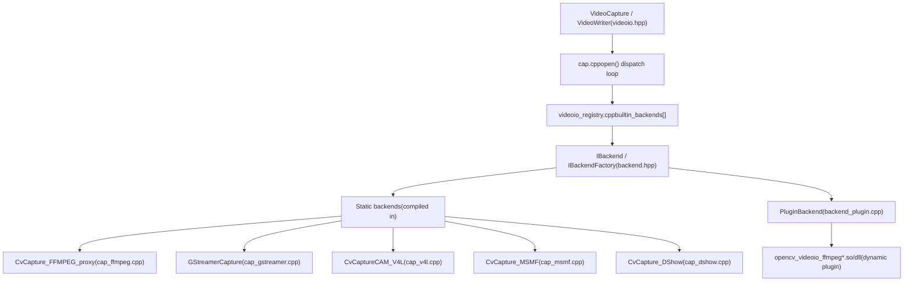

# Video Capture and Backend Architecture

Relevant source files

-   [doc/tutorials/app/highgui\_wayland\_ubuntu.markdown](https://github.com/opencv/opencv/blob/91c78f50/doc/tutorials/app/highgui_wayland_ubuntu.markdown?plain=1)
-   [modules/highgui/cmake/detect\_wayland.cmake](https://github.com/opencv/opencv/blob/91c78f50/modules/highgui/cmake/detect_wayland.cmake)
-   [modules/highgui/src/window\_wayland.cpp](https://github.com/opencv/opencv/blob/91c78f50/modules/highgui/src/window_wayland.cpp)
-   [modules/highgui/test/test\_gui.cpp](https://github.com/opencv/opencv/blob/91c78f50/modules/highgui/test/test_gui.cpp)
-   [modules/highgui/test/test\_precomp.hpp](https://github.com/opencv/opencv/blob/91c78f50/modules/highgui/test/test_precomp.hpp)
-   [modules/videoio/cmake/detect\_ffmpeg.cmake](https://github.com/opencv/opencv/blob/91c78f50/modules/videoio/cmake/detect_ffmpeg.cmake)
-   [modules/videoio/cmake/init.cmake](https://github.com/opencv/opencv/blob/91c78f50/modules/videoio/cmake/init.cmake)
-   [modules/videoio/cmake/plugin.cmake](https://github.com/opencv/opencv/blob/91c78f50/modules/videoio/cmake/plugin.cmake)
-   [modules/videoio/include/opencv2/videoio.hpp](https://github.com/opencv/opencv/blob/91c78f50/modules/videoio/include/opencv2/videoio.hpp)
-   [modules/videoio/include/opencv2/videoio/registry.hpp](https://github.com/opencv/opencv/blob/91c78f50/modules/videoio/include/opencv2/videoio/registry.hpp)
-   [modules/videoio/include/opencv2/videoio/videoio\_c.h](https://github.com/opencv/opencv/blob/91c78f50/modules/videoio/include/opencv2/videoio/videoio_c.h)
-   [modules/videoio/misc/plugin\_ffmpeg/CMakeLists.txt](https://github.com/opencv/opencv/blob/91c78f50/modules/videoio/misc/plugin_ffmpeg/CMakeLists.txt)
-   [modules/videoio/misc/plugin\_gstreamer/CMakeLists.txt](https://github.com/opencv/opencv/blob/91c78f50/modules/videoio/misc/plugin_gstreamer/CMakeLists.txt)
-   [modules/videoio/src/backend.hpp](https://github.com/opencv/opencv/blob/91c78f50/modules/videoio/src/backend.hpp)
-   [modules/videoio/src/backend\_plugin.cpp](https://github.com/opencv/opencv/blob/91c78f50/modules/videoio/src/backend_plugin.cpp)
-   [modules/videoio/src/backend\_static.cpp](https://github.com/opencv/opencv/blob/91c78f50/modules/videoio/src/backend_static.cpp)
-   [modules/videoio/src/cap.cpp](https://github.com/opencv/opencv/blob/91c78f50/modules/videoio/src/cap.cpp)
-   [modules/videoio/src/cap\_dc1394\_v2.cpp](https://github.com/opencv/opencv/blob/91c78f50/modules/videoio/src/cap_dc1394_v2.cpp)
-   [modules/videoio/src/cap\_dshow.cpp](https://github.com/opencv/opencv/blob/91c78f50/modules/videoio/src/cap_dshow.cpp)
-   [modules/videoio/src/cap\_dshow.hpp](https://github.com/opencv/opencv/blob/91c78f50/modules/videoio/src/cap_dshow.hpp)
-   [modules/videoio/src/cap\_ffmpeg.cpp](https://github.com/opencv/opencv/blob/91c78f50/modules/videoio/src/cap_ffmpeg.cpp)
-   [modules/videoio/src/cap\_ffmpeg\_impl.hpp](https://github.com/opencv/opencv/blob/91c78f50/modules/videoio/src/cap_ffmpeg_impl.hpp)
-   [modules/videoio/src/cap\_gphoto2.cpp](https://github.com/opencv/opencv/blob/91c78f50/modules/videoio/src/cap_gphoto2.cpp)
-   [modules/videoio/src/cap\_gstreamer.cpp](https://github.com/opencv/opencv/blob/91c78f50/modules/videoio/src/cap_gstreamer.cpp)
-   [modules/videoio/src/cap\_interface.hpp](https://github.com/opencv/opencv/blob/91c78f50/modules/videoio/src/cap_interface.hpp)
-   [modules/videoio/src/cap\_mjpeg\_decoder.cpp](https://github.com/opencv/opencv/blob/91c78f50/modules/videoio/src/cap_mjpeg_decoder.cpp)
-   [modules/videoio/src/cap\_mjpeg\_encoder.cpp](https://github.com/opencv/opencv/blob/91c78f50/modules/videoio/src/cap_mjpeg_encoder.cpp)
-   [modules/videoio/src/cap\_msmf.cpp](https://github.com/opencv/opencv/blob/91c78f50/modules/videoio/src/cap_msmf.cpp)
-   [modules/videoio/src/cap\_msmf.hpp](https://github.com/opencv/opencv/blob/91c78f50/modules/videoio/src/cap_msmf.hpp)
-   [modules/videoio/src/cap\_v4l.cpp](https://github.com/opencv/opencv/blob/91c78f50/modules/videoio/src/cap_v4l.cpp)
-   [modules/videoio/src/cap\_ximea.cpp](https://github.com/opencv/opencv/blob/91c78f50/modules/videoio/src/cap_ximea.cpp)
-   [modules/videoio/src/precomp.hpp](https://github.com/opencv/opencv/blob/91c78f50/modules/videoio/src/precomp.hpp)
-   [modules/videoio/src/videoio\_registry.cpp](https://github.com/opencv/opencv/blob/91c78f50/modules/videoio/src/videoio_registry.cpp)
-   [modules/videoio/test/test\_audio.cpp](https://github.com/opencv/opencv/blob/91c78f50/modules/videoio/test/test_audio.cpp)
-   [modules/videoio/test/test\_camera.cpp](https://github.com/opencv/opencv/blob/91c78f50/modules/videoio/test/test_camera.cpp)
-   [modules/videoio/test/test\_ffmpeg.cpp](https://github.com/opencv/opencv/blob/91c78f50/modules/videoio/test/test_ffmpeg.cpp)
-   [modules/videoio/test/test\_gstreamer.cpp](https://github.com/opencv/opencv/blob/91c78f50/modules/videoio/test/test_gstreamer.cpp)
-   [modules/videoio/test/test\_microphone.cpp](https://github.com/opencv/opencv/blob/91c78f50/modules/videoio/test/test_microphone.cpp)
-   [modules/videoio/test/test\_orientation.cpp](https://github.com/opencv/opencv/blob/91c78f50/modules/videoio/test/test_orientation.cpp)
-   [modules/videoio/test/test\_precomp.hpp](https://github.com/opencv/opencv/blob/91c78f50/modules/videoio/test/test_precomp.hpp)
-   [modules/videoio/test/test\_v4l2.cpp](https://github.com/opencv/opencv/blob/91c78f50/modules/videoio/test/test_v4l2.cpp)
-   [modules/videoio/test/test\_video\_io.cpp](https://github.com/opencv/opencv/blob/91c78f50/modules/videoio/test/test_video_io.cpp)
-   [samples/cpp/videocapture\_audio.cpp](https://github.com/opencv/opencv/blob/91c78f50/samples/cpp/videocapture_audio.cpp)
-   [samples/cpp/videocapture\_audio\_combination.cpp](https://github.com/opencv/opencv/blob/91c78f50/samples/cpp/videocapture_audio_combination.cpp)
-   [samples/cpp/videocapture\_microphone.cpp](https://github.com/opencv/opencv/blob/91c78f50/samples/cpp/videocapture_microphone.cpp)

This page describes the `opencv_videoio` module: the `VideoCapture` and `VideoWriter` public classes, the internal backend abstraction and registry, the plugin loading system, and the major platform-specific capture backends. For image file reading and writing (JPEG, PNG, etc.), see [Image File I/O and Codec System](/opencv/opencv/7.1-image-file-io-and-codec-system). For GUI display of video frames, see [Window Management and Multi-Backend GUI](/opencv/opencv/10.1-window-management-and-multi-backend-gui).

---

## Overview

The `videoio` module provides a unified API for reading from video files, network streams, and cameras, and for writing encoded video. Internally it is structured as a backend registry — at open time the public `VideoCapture` or `VideoWriter` object selects from a prioritized list of compiled-in or dynamically loaded backends, each of which implements a common C++ interface.

**Architecture Diagram: Public API → Registry → Backend**


Sources: [modules/videoio/src/cap.cpp127-236](https://github.com/opencv/opencv/blob/91c78f50/modules/videoio/src/cap.cpp#L127-L236) [modules/videoio/src/videoio\_registry.cpp66-130](https://github.com/opencv/opencv/blob/91c78f50/modules/videoio/src/videoio_registry.cpp#L66-L130) [modules/videoio/src/backend\_plugin.cpp40-75](https://github.com/opencv/opencv/blob/91c78f50/modules/videoio/src/backend_plugin.cpp#L40-L75)

---

## Public API

### VideoCapture

Defined in [modules/videoio/include/opencv2/videoio.hpp](https://github.com/opencv/opencv/blob/91c78f50/modules/videoio/include/opencv2/videoio.hpp) `VideoCapture` is the primary class for reading frames. It holds a `Ptr<IVideoCapture> icap` that is created and owned by the selected backend.

Key constructors:

-   `VideoCapture(const String& filename, int apiPreference = CAP_ANY)`
-   `VideoCapture(int index, int apiPreference = CAP_ANY)`
-   `VideoCapture(const Ptr<IStreamReader>& source, int apiPreference, const std::vector<int>& params)` — for reading from an in-memory stream

Key methods:

| Method | Description |
| --- | --- |
| `open()` | Opens a file, URL, or camera index |
| `isOpened()` | Returns true if a backend was successfully created |
| `grab()` | Advances the capture clock; fast, does not decode |
| `retrieve(Mat&, int channel=0)` | Decodes and returns the grabbed frame |
| `read(Mat&)` | Combines `grab()` and `retrieve()` |
| `get(int propId)` | Reads a `CAP_PROP_*` property |
| `set(int propId, double value)` | Writes a `CAP_PROP_*` property |
| `release()` | Destroys the backend and frees resources |

### VideoWriter

Also in [modules/videoio/include/opencv2/videoio.hpp](https://github.com/opencv/opencv/blob/91c78f50/modules/videoio/include/opencv2/videoio.hpp) `VideoWriter` holds a `Ptr<IVideoWriter> iwriter`. Key parameters to `open()` are the filename, `fourcc`, `fps`, and `frameSize`. A `std::vector<int>` params argument passes `VIDEOWRITER_PROP_*` key-value pairs at construction time.

Sources: [modules/videoio/include/opencv2/videoio.hpp70-240](https://github.com/opencv/opencv/blob/91c78f50/modules/videoio/include/opencv2/videoio.hpp#L70-L240) [modules/videoio/src/cap.cpp70-110](https://github.com/opencv/opencv/blob/91c78f50/modules/videoio/src/cap.cpp#L70-L110)

---

## Backend Registry

### `VideoCaptureAPIs` Enum

Every backend has a unique integer identifier declared in the `VideoCaptureAPIs` enum. Passing `CAP_ANY = 0` to `open()` causes the dispatcher to try all applicable backends in priority order.

| Constant | Value | Backend |
| --- | --- | --- |
| `CAP_ANY` | 0 | Auto-detect |
| `CAP_V4L` / `CAP_V4L2` | 200 | Video4Linux2 (Linux) |
| `CAP_DSHOW` | 700 | DirectShow (Windows) |
| `CAP_AVFOUNDATION` | 1200 | AVFoundation (macOS/iOS) |
| `CAP_MSMF` | 1400 | Microsoft Media Foundation |
| `CAP_GSTREAMER` | 1800 | GStreamer |
| `CAP_FFMPEG` | 1900 | FFmpeg |
| `CAP_IMAGES` | 2000 | OpenCV image sequence |
| `CAP_OPENCV_MJPEG` | 2200 | Built-in MJPEG |
| `CAP_INTEL_MFX` | 2300 | Intel MediaSDK/oneVPL |

Sources: [modules/videoio/include/opencv2/videoio.hpp92-129](https://github.com/opencv/opencv/blob/91c78f50/modules/videoio/include/opencv2/videoio.hpp#L92-L129)

### `builtin_backends[]`

The static array `builtin_backends[]` in [modules/videoio/src/videoio\_registry.cpp66](https://github.com/opencv/opencv/blob/91c78f50/modules/videoio/src/videoio_registry.cpp#L66-L66) lists every backend with its `BackendMode` flags (one or more of `MODE_CAPTURE_BY_FILENAME`, `MODE_CAPTURE_BY_INDEX`, `MODE_CAPTURE_BY_STREAM`, `MODE_WRITER`). Backends without the required compile-time `HAVE_*` symbol are conditionally replaced by `DECLARE_DYNAMIC_BACKEND`, which defers loading to the plugin system.

Priority within the array (documented comment in source):

1.  Multi-platform libraries: FFmpeg, GStreamer, Intel MFX
2.  Platform-specific SDKs: AVFOUNDATION, MSMF/DSHOW, V4L/V4L2
3.  RGB-D sensors: OpenNI, RealSense, OBSensor
4.  File-based fallbacks: image sequence, MJPEG
5.  Specialty SDKs: XIMEA, Aravis, uEye, gPhoto2

Sources: [modules/videoio/src/videoio\_registry.cpp58-130](https://github.com/opencv/opencv/blob/91c78f50/modules/videoio/src/videoio_registry.cpp#L58-L130)

### Dispatch in `cap.cpp`

**Backend Selection Flow**

> **[Mermaid sequence]**
> *(图表结构无法解析)*

Sources: [modules/videoio/src/cap.cpp117-237](https://github.com/opencv/opencv/blob/91c78f50/modules/videoio/src/cap.cpp#L117-L237)

---

## Internal Interface

All backends implement one of two internal abstract classes, defined in [modules/videoio/src/cap\_interface.hpp](https://github.com/opencv/opencv/blob/91c78f50/modules/videoio/src/cap_interface.hpp)

### `IVideoCapture`

```
virtual bool grabFrame()
virtual bool retrieveFrame(int channel, OutputArray)
virtual double getProperty(int propId) const
virtual bool setProperty(int propId, double value)
virtual bool isOpened() const
virtual int getCaptureDomain()
```
### `IVideoWriter`

```
virtual bool open(filename, fourcc, fps, frameSize, params)
virtual bool isOpened() const
virtual void write(InputArray)
virtual bool set(int propId, double value)
virtual double get(int propId) const
```
### `VideoCaptureParameters`

`VideoParameters` / `VideoCaptureParameters` (also in [modules/videoio/src/cap\_interface.hpp](https://github.com/opencv/opencv/blob/91c78f50/modules/videoio/src/cap_interface.hpp)) wraps the flat `std::vector<int>` key-value params vector into a typed accessor that tracks which parameters were consumed. Backends call `params.get<T>(CAP_PROP_*)` and `params.warnUnusedParameters()` to detect unsupported options.

**Interface Hierarchy Diagram**


Sources: [modules/videoio/src/cap\_interface.hpp40-120](https://github.com/opencv/opencv/blob/91c78f50/modules/videoio/src/cap_interface.hpp#L40-L120) [modules/videoio/src/cap\_ffmpeg.cpp68-88](https://github.com/opencv/opencv/blob/91c78f50/modules/videoio/src/cap_ffmpeg.cpp#L68-L88) [modules/videoio/src/cap\_gstreamer.cpp323-406](https://github.com/opencv/opencv/blob/91c78f50/modules/videoio/src/cap_gstreamer.cpp#L323-L406) [modules/videoio/src/cap\_v4l.cpp364-444](https://github.com/opencv/opencv/blob/91c78f50/modules/videoio/src/cap_v4l.cpp#L364-L444)

---

## Plugin System

When a backend is registered with `DECLARE_DYNAMIC_BACKEND`, `createPluginBackendFactory()` returns a `PluginBackend` factory ([modules/videoio/src/backend\_plugin.cpp40](https://github.com/opencv/opencv/blob/91c78f50/modules/videoio/src/backend_plugin.cpp#L40-L40)). On first use, it:

1.  Searches library paths for a shared library matching the backend name pattern (e.g. `libopencv_videoio_ffmpeg*.so`).
2.  Calls `dlopen` / `LoadLibrary` via `plugin_loader.private.hpp`.
3.  Resolves `opencv_videoio_capture_plugin_init_v1` to get a versioned ABI struct.
4.  Verifies ABI/API version compatibility.
5.  Caches the loaded capture and writer API tables.

The entry-point symbol `opencv_videoio_capture_plugin_init_v1` returns a struct whose `v0.id` field identifies which `VideoCaptureAPIs` value the plugin serves. Plugins built as separate shared libraries (e.g. the prebuilt FFmpeg wrapper on Windows) follow this same contract.

Sources: [modules/videoio/src/backend\_plugin.cpp44-75](https://github.com/opencv/opencv/blob/91c78f50/modules/videoio/src/backend_plugin.cpp#L44-L75) [modules/videoio/cmake/plugin.cmake1-10](https://github.com/opencv/opencv/blob/91c78f50/modules/videoio/cmake/plugin.cmake#L1-L10)

---

## Major Backends

### FFmpeg (`CAP_FFMPEG`)

**Files:** [modules/videoio/src/cap\_ffmpeg.cpp](https://github.com/opencv/opencv/blob/91c78f50/modules/videoio/src/cap_ffmpeg.cpp) [modules/videoio/src/cap\_ffmpeg\_impl.hpp](https://github.com/opencv/opencv/blob/91c78f50/modules/videoio/src/cap_ffmpeg_impl.hpp)

The FFmpeg backend is the primary backend for file and network stream access on all platforms. The public-facing proxy is `CvCapture_FFMPEG_proxy`, which wraps the internal `CvCapture_FFMPEG` struct. On Windows, the FFmpeg libraries are shipped as a pre-built plugin DLL; on Linux/macOS they are linked directly when `HAVE_FFMPEG` is set.

**Key internals of `CvCapture_FFMPEG`:**

| Field | Type | Role |
| --- | --- | --- |
| `ic` | `AVFormatContext*` | Container-level demuxer context |
| `context` | `AVCodecContext*` | Per-stream decoder context |
| `picture` | `AVFrame*` | Decoded raw frame |
| `img_convert_ctx` | `SwsContext*` | libswscale color/pixel format converter |
| `video_stream` | `int` | Index of selected video stream |
| `rawMode` | `bool` | If true, skip decode (demuxer only) |
| `va_type` | `VideoAccelerationType` | Requested hardware acceleration type |
| `interrupt_metadata` | `AVInterruptCallbackMetadata` | Timeout tracking for open/read |

**Open/Read Flow:**

> **[Mermaid sequence]**
> *(图表结构无法解析)*

**Notable capabilities:**

-   Raw demux mode: set `CAP_PROP_FORMAT = -1` to suppress decoding and receive compressed packets as `CV_8UC1` rows.
-   Hardware acceleration: set `CAP_PROP_HW_ACCELERATION` to a `VideoAccelerationType` value. Requires `LIBAVUTIL_VERSION_MAJOR >= 56` (FFmpeg 4.0+) and the `cap_ffmpeg_hw.hpp` helper.
-   Open/read timeouts: controlled by `CAP_PROP_OPEN_TIMEOUT_MSEC` and `CAP_PROP_READ_TIMEOUT_MSEC`, implemented via `_opencv_ffmpeg_interrupt_callback`.
-   Thread count: `CAP_PROP_N_THREADS` or `OPENCV_FFMPEG_THREADS` environment variable.
-   RTSP: defaults to TCP transport (`rtsp_flags=prefer_tcp`). Override via `OPENCV_FFMPEG_CAPTURE_OPTIONS`.

Sources: [modules/videoio/src/cap\_ffmpeg\_impl.hpp538-680](https://github.com/opencv/opencv/blob/91c78f50/modules/videoio/src/cap_ffmpeg_impl.hpp#L538-L680) [modules/videoio/src/cap\_ffmpeg.cpp68-120](https://github.com/opencv/opencv/blob/91c78f50/modules/videoio/src/cap_ffmpeg.cpp#L68-L120)

---

### GStreamer (`CAP_GSTREAMER`)

**File:** [modules/videoio/src/cap\_gstreamer.cpp](https://github.com/opencv/opencv/blob/91c78f50/modules/videoio/src/cap_gstreamer.cpp)

`GStreamerCapture` builds and controls GStreamer pipelines. A `gst_initializer` singleton (using a `static` local in `gst_initializer::init()`) calls `gst_init_check()` once per process.

For file/URL capture, the class constructs a `uridecodebin ! videoconvert ! appsink` pipeline. For camera index, it constructs `v4l2src` or equivalent. A custom pipeline string can be passed directly as the filename argument.

Audio is supported alongside video: a separate `audiopipeline` with `appsink` runs in parallel. `CAP_PROP_AUDIO_STREAM` and related properties configure which stream to attach.

Key fields:

| Field | Type | Role |
| --- | --- | --- |
| `pipeline` | `GSafePtr<GstElement>` | Main GStreamer pipeline element |
| `sink` | `GSafePtr<GstElement>` | `appsink` for video frames |
| `audiosink` | `GSafePtr<GstElement>` | `appsink` for audio samples |
| `caps` | `GSafePtr<GstCaps>` | Negotiated video caps |
| `openTimeout` | `GstClockTime` | Nanoseconds before pipeline open times out |

Sources: [modules/videoio/src/cap\_gstreamer.cpp323-442](https://github.com/opencv/opencv/blob/91c78f50/modules/videoio/src/cap_gstreamer.cpp#L323-L442) [modules/videoio/src/cap\_gstreamer.cpp218-283](https://github.com/opencv/opencv/blob/91c78f50/modules/videoio/src/cap_gstreamer.cpp#L218-L283)

---

### V4L2 (`CAP_V4L2`, Linux)

**File:** [modules/videoio/src/cap\_v4l.cpp](https://github.com/opencv/opencv/blob/91c78f50/modules/videoio/src/cap_v4l.cpp)

`CvCaptureCAM_V4L` opens `/dev/video<N>` via the V4L2 kernel API. It uses memory-mapped I/O (`mmap`) for zero-copy buffer management.

**Capture buffer lifecycle:**

> **[Mermaid sequence]**
> *(图表结构无法解析)*

**Pixel format probe order** (`autosetup_capture_mode_v4l2`): `BGR24 → RGB24 → YVU420 → YUV420 → YUV411P → YUYV → UYVY → NV12 → NV21 → SBGGR8 → SGBRG8 → SGRBG8 → XBGR32 → ABGR32 → SN9C10X → MJPEG (if HAVE_JPEG) → Y16 → Y12 → Y10 → GREY`

Properties like `CAP_PROP_BRIGHTNESS`, `CAP_PROP_CONTRAST`, `CAP_PROP_SATURATION`, `CAP_PROP_GAIN`, and `CAP_PROP_EXPOSURE` are mapped to V4L2 control IDs via `controlInfo()`. Range normalization (mapping to `<FileRef file-url="https://github.com/opencv/opencv/blob/91c78f50/0, 1)`) is on by default, matching OpenCV 3.x behavior; set `CAP_PROP_MODE = 0` to use raw V4L2 values.\\n\\nSources#LNaN-LNaN" NaN file-path="0, 1)`) is on by default, matching OpenCV 3.x behavior; set` CAP\_PROP\_MODE = 0\` to use raw V4L2 values.\\n\\nSources">Hii [modules/videoio/src/cap\_v4l.cpp585-640](https://github.com/opencv/opencv/blob/91c78f50/modules/videoio/src/cap_v4l.cpp#L585-L640)

---

### Microsoft Media Foundation (`CAP_MSMF`, Windows)

**File:** [modules/videoio/src/cap\_msmf.cpp](https://github.com/opencv/opencv/blob/91c78f50/modules/videoio/src/cap_msmf.cpp)

The MSMF backend uses the `IMFSourceReader` API with an async callback. `SourceReaderCB` implements `IMFSourceReaderCallback` and queues incoming `IMFSample` objects (up to `MSMF_READER_MAX_QUEUE_SIZE = 3`). The main thread blocks on a Win32 event via `SourceReaderCB::Wait()`.

`FormatStorage` enumerates all `IMFMediaType` objects from the source reader across all streams. `MediaType::VideoIsBetterThan()` / `AudioIsBetterThan()` pick the closest match to the requested resolution and frame rate.

Hardware acceleration is available when compiled with `HAVE_MSMF_DXVA`: `MFCreateDXGIDeviceManager` is loaded dynamically (via `mfplat.dll`) to avoid load failure on Windows 7. The environment variable `OPENCV_VIDEOIO_MSMF_ENABLE_HW_TRANSFORMS` (documented in `videoio.hpp`) controls whether hardware transform acceleration is enabled.

Sources: [modules/videoio/src/cap\_msmf.cpp408-590](https://github.com/opencv/opencv/blob/91c78f50/modules/videoio/src/cap_msmf.cpp#L408-L590) [modules/videoio/src/cap\_msmf.cpp55-73](https://github.com/opencv/opencv/blob/91c78f50/modules/videoio/src/cap_msmf.cpp#L55-L73)

---

### DirectShow (`CAP_DSHOW`, Windows)

**File:** [modules/videoio/src/cap\_dshow.cpp](https://github.com/opencv/opencv/blob/91c78f50/modules/videoio/src/cap_dshow.cpp)

The DirectShow backend wraps the `videoInput` library by Theodore Watson. It is the legacy Windows camera capture path, now largely superseded by MSMF. It appears in `builtin_backends[]` after MSMF with lower priority.

---

## `CAP_PROP_*` and `VIDEOWRITER_PROP_*` Reference

### Common `VideoCaptureProperties`

| Constant | Integer | R/W | Description |
| --- | --- | --- | --- |
| `CAP_PROP_POS_MSEC` | 0 | R/W | Position in video (ms) |
| `CAP_PROP_POS_FRAMES` | 1 | R/W | 0-based frame index; seek target |
| `CAP_PROP_FRAME_WIDTH` | 3 | R/W | Frame width in pixels |
| `CAP_PROP_FRAME_HEIGHT` | 4 | R/W | Frame height in pixels |
| `CAP_PROP_FPS` | 5 | R | Frame rate |
| `CAP_PROP_FOURCC` | 6 | R | Codec four-character code |
| `CAP_PROP_FRAME_COUNT` | 7 | R | Total frames in file |
| `CAP_PROP_FORMAT` | 8 | R/W | Mat type; set `-1` for raw demux mode |
| `CAP_PROP_CONVERT_RGB` | 16 | open | Decode to BGR if true (FFmpeg/GStreamer) |
| `CAP_PROP_BACKEND` | 42 | R | Active `VideoCaptureAPIs` value |
| `CAP_PROP_BITRATE` | 47 | R | Video bitrate (kbits/s) — FFmpeg |
| `CAP_PROP_ORIENTATION_AUTO` | 49 | R/W | Auto-rotate per stream metadata |
| `CAP_PROP_HW_ACCELERATION` | 50 | open | `VideoAccelerationType` |
| `CAP_PROP_HW_DEVICE` | 51 | open | GPU device index |
| `CAP_PROP_OPEN_TIMEOUT_MSEC` | 53 | open | Connection timeout — FFmpeg/GStreamer |
| `CAP_PROP_READ_TIMEOUT_MSEC` | 54 | open | Read timeout — FFmpeg/GStreamer |
| `CAP_PROP_AUDIO_STREAM` | 58 | open | Audio stream index; `-1` disables |
| `CAP_PROP_AUDIO_SAMPLES_PER_SECOND` | 62 | open/R | Audio sample rate |
| `CAP_PROP_N_THREADS` | 70 | open | Decoder thread count — FFmpeg |

### `VideoWriterProperties`

| Constant | Integer | Description |
| --- | --- | --- |
| `VIDEOWRITER_PROP_QUALITY` | 1 | Encoding quality 0–100 |
| `VIDEOWRITER_PROP_IS_COLOR` | 4 | Non-zero for color encoding |
| `VIDEOWRITER_PROP_DEPTH` | 5 | Bit depth (default `CV_8U`) |
| `VIDEOWRITER_PROP_HW_ACCELERATION` | 6 | `VideoAccelerationType` |
| `VIDEOWRITER_PROP_RAW_VIDEO` | 9 | Pass pre-encoded packets — FFmpeg |
| `VIDEOWRITER_PROP_KEY_INTERVAL` | 10 | Keyframe interval in raw mode |

Sources: [modules/videoio/include/opencv2/videoio.hpp138-240](https://github.com/opencv/opencv/blob/91c78f50/modules/videoio/include/opencv2/videoio.hpp#L138-L240)

---

## Hardware Acceleration

`VideoAccelerationType` (defined in `videoio.hpp`) is a shared enum used by both `CAP_PROP_HW_ACCELERATION` and `VIDEOWRITER_PROP_HW_ACCELERATION`.

| Value | Constant | Description |
| --- | --- | --- |
| 0 | `VIDEO_ACCELERATION_NONE` | Software only |
| 1 | `VIDEO_ACCELERATION_ANY` | Let backend choose best available |
| 2 | `VIDEO_ACCELERATION_D3D11` | Direct3D 11 (DXVA2) |
| 3 | `VIDEO_ACCELERATION_VAAPI` | VA-API (Linux) |
| 4 | `VIDEO_ACCELERATION_MFX` | Intel MediaSDK / oneVPL |
| 5 | `VIDEO_ACCELERATION_DRM` | DRM/KMS (Raspberry Pi V4) |

In the FFmpeg backend, `VIDEO_ACCELERATION_ANY` causes `cap_ffmpeg_hw.hpp` to probe for a hardware decoder via `av_hwdevice_iterate_types()`. When `CAP_PROP_HW_ACCELERATION_USE_OPENCL` is set, the backend creates an OpenCL context attached to the hardware device context to allow zero-copy transfer to `UMat` (see [OpenCL Acceleration](/opencv/opencv/3.2-opencl-acceleration-and-transparent-gpu-execution)).

Sources: [modules/videoio/include/opencv2/videoio.hpp256-269](https://github.com/opencv/opencv/blob/91c78f50/modules/videoio/include/opencv2/videoio.hpp#L256-L269) [modules/videoio/src/cap\_ffmpeg\_impl.hpp106-178](https://github.com/opencv/opencv/blob/91c78f50/modules/videoio/src/cap_ffmpeg_impl.hpp#L106-L178)

---

## Audio Support

Audio capture is primarily implemented in the GStreamer and MSMF backends. The relevant `CAP_PROP_*` constants:

-   `CAP_PROP_AUDIO_STREAM = 58` — selects the audio stream index to capture; pass `-1` to disable.
-   `CAP_PROP_AUDIO_POS = 59` — sample position of the last grabbed audio fragment.
-   `CAP_PROP_AUDIO_SHIFT_NSEC = 60` — offset between audio and video stream start times.
-   `CAP_PROP_AUDIO_DATA_DEPTH = 61` — sample format (`CV_16S`, `CV_32F`, etc.).
-   `CAP_PROP_AUDIO_SAMPLES_PER_SECOND = 62` — sample rate (default 44100).
-   `CAP_PROP_AUDIO_BASE_INDEX = 63` — channel index offset for `retrieve()` calls.
-   `CAP_PROP_AUDIO_TOTAL_CHANNELS = 64` — number of audio channels in the selected stream.

Audio data is retrieved via `VideoCapture::retrieve(Mat&, channelIdx)` where `channelIdx >= CAP_PROP_AUDIO_BASE_INDEX`. Each row of the returned `Mat` holds one audio frame as a single-channel `CV_16S` or `CV_32F` array.

Sources: [modules/videoio/include/opencv2/videoio.hpp198-206](https://github.com/opencv/opencv/blob/91c78f50/modules/videoio/include/opencv2/videoio.hpp#L198-L206) [modules/videoio/src/cap\_gstreamer.cpp383-398](https://github.com/opencv/opencv/blob/91c78f50/modules/videoio/src/cap_gstreamer.cpp#L383-L398) [modules/videoio/test/test\_audio.cpp1-50](https://github.com/opencv/opencv/blob/91c78f50/modules/videoio/test/test_audio.cpp#L1-L50)

---

## Environment Variables

Several behaviors can be tuned without recompilation:

| Variable | Affects | Description |
| --- | --- | --- |
| `OPENCV_VIDEOIO_DEBUG` | `cap.cpp` | Log backend selection attempts |
| `OPENCV_VIDEOCAPTURE_DEBUG` | `cap.cpp` | Same, narrowed to capture |
| `OPENCV_FFMPEG_DEBUG` | `cap_ffmpeg_impl.hpp` | Enable verbose FFmpeg log output |
| `OPENCV_FFMPEG_LOGLEVEL` | `cap_ffmpeg_impl.hpp` | Set `av_log_set_level()` |
| `OPENCV_FFMPEG_IS_THREAD_SAFE` | `cap_ffmpeg_impl.hpp` | Remove OpenCV mutex; rely on FFmpeg locking |
| `OPENCV_FFMPEG_THREADS` | `cap_ffmpeg_impl.hpp` | Default decoder thread count |
| `OPENCV_FFMPEG_CAPTURE_OPTIONS` | `cap_ffmpeg_impl.hpp` | Semicolon-separated `avdict` options (e.g. \`rtsp\_transport |
| `OPENCV_VIDEOIO_GSTREAMER_CALL_DEINIT` | `cap_gstreamer.cpp` | Call `gst_deinit()` on exit |
| `OPENCV_VIDEOIO_GSTREAMER_START_MAINLOOP` | `cap_gstreamer.cpp` | Run `GMainLoop` in a thread |
| `OPENCV_VIDEOIO_MSMF_ENABLE_HW_TRANSFORMS` | MSMF backend | 0 disables hardware MF transforms |
| `OPENCV_VIDEOIO_V4L_RANGE_NORMALIZED` | `cap_v4l.cpp` | Control property range normalization |

Sources: [modules/videoio/src/cap\_ffmpeg\_impl.hpp955-1062](https://github.com/opencv/opencv/blob/91c78f50/modules/videoio/src/cap_ffmpeg_impl.hpp#L955-L1062) [modules/videoio/src/cap\_gstreamer.cpp237-268](https://github.com/opencv/opencv/blob/91c78f50/modules/videoio/src/cap_gstreamer.cpp#L237-L268) [modules/videoio/src/cap.cpp49-51](https://github.com/opencv/opencv/blob/91c78f50/modules/videoio/src/cap.cpp#L49-L51)
