# Camera Calibration and 3D Vision (calib3d)

Relevant source files

-   [modules/calib3d/include/opencv2/calib3d/calib3d.hpp](https://github.com/opencv/opencv/blob/91c78f50/modules/calib3d/include/opencv2/calib3d/calib3d.hpp)
-   [modules/calib3d/include/opencv2/calib3d/calib3d\_c.h](https://github.com/opencv/opencv/blob/91c78f50/modules/calib3d/include/opencv2/calib3d/calib3d_c.h)
-   [modules/calib3d/perf/perf\_translation2d.cpp](https://github.com/opencv/opencv/blob/91c78f50/modules/calib3d/perf/perf_translation2d.cpp)
-   [modules/calib3d/src/calibinit.cpp](https://github.com/opencv/opencv/blob/91c78f50/modules/calib3d/src/calibinit.cpp)
-   [modules/calib3d/src/calibration.cpp](https://github.com/opencv/opencv/blob/91c78f50/modules/calib3d/src/calibration.cpp)
-   [modules/calib3d/src/calibration\_base.cpp](https://github.com/opencv/opencv/blob/91c78f50/modules/calib3d/src/calibration_base.cpp)
-   [modules/calib3d/src/checkchessboard.cpp](https://github.com/opencv/opencv/blob/91c78f50/modules/calib3d/src/checkchessboard.cpp)
-   [modules/calib3d/src/chessboard.cpp](https://github.com/opencv/opencv/blob/91c78f50/modules/calib3d/src/chessboard.cpp)
-   [modules/calib3d/src/circlesgrid.cpp](https://github.com/opencv/opencv/blob/91c78f50/modules/calib3d/src/circlesgrid.cpp)
-   [modules/calib3d/src/circlesgrid.hpp](https://github.com/opencv/opencv/blob/91c78f50/modules/calib3d/src/circlesgrid.hpp)
-   [modules/calib3d/src/compat\_ptsetreg.cpp](https://github.com/opencv/opencv/blob/91c78f50/modules/calib3d/src/compat_ptsetreg.cpp)
-   [modules/calib3d/src/five-point.cpp](https://github.com/opencv/opencv/blob/91c78f50/modules/calib3d/src/five-point.cpp)
-   [modules/calib3d/src/fundam.cpp](https://github.com/opencv/opencv/blob/91c78f50/modules/calib3d/src/fundam.cpp)
-   [modules/calib3d/src/levmarq.cpp](https://github.com/opencv/opencv/blob/91c78f50/modules/calib3d/src/levmarq.cpp)
-   [modules/calib3d/src/precomp.hpp](https://github.com/opencv/opencv/blob/91c78f50/modules/calib3d/src/precomp.hpp)
-   [modules/calib3d/src/ptsetreg.cpp](https://github.com/opencv/opencv/blob/91c78f50/modules/calib3d/src/ptsetreg.cpp)
-   [modules/calib3d/src/stereo\_geom.cpp](https://github.com/opencv/opencv/blob/91c78f50/modules/calib3d/src/stereo_geom.cpp)
-   [modules/calib3d/src/triangulate.cpp](https://github.com/opencv/opencv/blob/91c78f50/modules/calib3d/src/triangulate.cpp)
-   [modules/calib3d/src/upnp.cpp](https://github.com/opencv/opencv/blob/91c78f50/modules/calib3d/src/upnp.cpp)
-   [modules/calib3d/src/upnp.h](https://github.com/opencv/opencv/blob/91c78f50/modules/calib3d/src/upnp.h)
-   [modules/calib3d/test/test\_cameracalibration.cpp](https://github.com/opencv/opencv/blob/91c78f50/modules/calib3d/test/test_cameracalibration.cpp)
-   [modules/calib3d/test/test\_cameracalibration\_badarg.cpp](https://github.com/opencv/opencv/blob/91c78f50/modules/calib3d/test/test_cameracalibration_badarg.cpp)
-   [modules/calib3d/test/test\_chesscorners.cpp](https://github.com/opencv/opencv/blob/91c78f50/modules/calib3d/test/test_chesscorners.cpp)
-   [modules/calib3d/test/test\_chesscorners\_badarg.cpp](https://github.com/opencv/opencv/blob/91c78f50/modules/calib3d/test/test_chesscorners_badarg.cpp)
-   [modules/calib3d/test/test\_chesscorners\_timing.cpp](https://github.com/opencv/opencv/blob/91c78f50/modules/calib3d/test/test_chesscorners_timing.cpp)
-   [modules/calib3d/test/test\_main.cpp](https://github.com/opencv/opencv/blob/91c78f50/modules/calib3d/test/test_main.cpp)
-   [modules/calib3d/test/test\_modelest.cpp](https://github.com/opencv/opencv/blob/91c78f50/modules/calib3d/test/test_modelest.cpp)
-   [modules/calib3d/test/test\_translation\_2d\_estimator.cpp](https://github.com/opencv/opencv/blob/91c78f50/modules/calib3d/test/test_translation_2d_estimator.cpp)
-   [modules/imgproc/include/opencv2/imgproc/imgproc.hpp](https://github.com/opencv/opencv/blob/91c78f50/modules/imgproc/include/opencv2/imgproc/imgproc.hpp)
-   [modules/imgproc/include/opencv2/imgproc/types\_c.h](https://github.com/opencv/opencv/blob/91c78f50/modules/imgproc/include/opencv2/imgproc/types_c.h)

The `opencv_calib3d` module provides algorithms and tools for working with real-world cameras and performing 3D geometry operations. It bridges 2D images and 3D world geometry, covering camera calibration, lens distortion correction (including fisheye), stereo vision, fundamental matrix estimation, and 3D reconstruction.

## Overview

The calib3d module contains algorithms for:

-   Camera calibration to determine intrinsic and extrinsic parameters
-   Removal of lens distortion, including fisheye distortion
-   Stereo calibration and stereo correspondence
-   Geometric transformations between images (homographies, fundamental matrices)
-   Pose estimation and 3D reconstruction

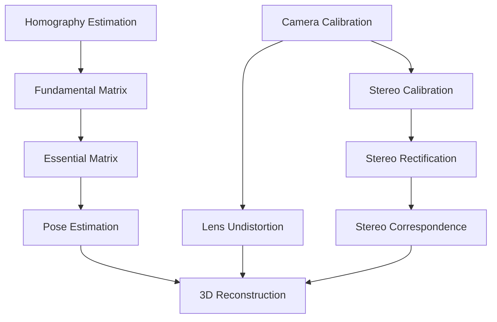
Sources: [modules/calib3d/src/calibration.cpp1-622](https://github.com/opencv/opencv/blob/91c78f50/modules/calib3d/src/calibration.cpp#L1-L622) [modules/calib3d/src/fundam.cpp1-463](https://github.com/opencv/opencv/blob/91c78f50/modules/calib3d/src/fundam.cpp#L1-L463) [modules/calib3d/src/fisheye.cpp1-252](https://github.com/opencv/opencv/blob/91c78f50/modules/calib3d/src/fisheye.cpp#L1-L252)

### Module Source Map

The diagram below maps the module's principal source files to their key exported code entities, linking functional areas to searchable code symbols.

**calib3d Source Files to Key Code Entities**

```mermaid
flowchart TD
    cal["calibration.cppcalibration_base.cpp"]
    init["calibinit.cppchessboard.cppcirclesgrid.cpp"]
    geo["fundam.cppfive-point.cpp"]
    pose["triangulate.cppupnp.cpp"]
    opt["ptsetreg.cpplevmarq.cpp"]
    fish["fisheye.cpp"]
    f1["calibrateCamera()stereoCalibrate()projectPoints()undistortPoints()"]
    f2["findChessboardCorners()findChessboardCornersSB()ChessBoardDetectorfindCirclesGrid()"]
    f3["findHomography()findFundamentalMat()findEssentialMat()HomographyEstimatorCallback"]
    f4["triangulatePoints()correctMatches()upnp class"]
    f5["RANSACPointSetRegistratorLMeDSPointSetRegistratorCvLevMarq"]
    f6["fisheye::calibrate()fisheye::projectPoints()fisheye::undistortPoints()"]

    cal --> f1
    init --> f2
    geo --> f3
    pose --> f4
    opt --> f5
    fish --> f6
```
Sources: [modules/calib3d/src/precomp.hpp49-51](https://github.com/opencv/opencv/blob/91c78f50/modules/calib3d/src/precomp.hpp#L49-L51) [modules/calib3d/src/calibration.cpp43-57](https://github.com/opencv/opencv/blob/91c78f50/modules/calib3d/src/calibration.cpp#L43-L57) [modules/calib3d/src/calibinit.cpp72-76](https://github.com/opencv/opencv/blob/91c78f50/modules/calib3d/src/calibinit.cpp#L72-L76) [modules/calib3d/src/fundam.cpp43-50](https://github.com/opencv/opencv/blob/91c78f50/modules/calib3d/src/fundam.cpp#L43-L50) [modules/calib3d/src/ptsetreg.cpp43-55](https://github.com/opencv/opencv/blob/91c78f50/modules/calib3d/src/ptsetreg.cpp#L43-L55)

This module is documented in detail across three child pages:

-   **Page 8.1** — Camera Models and Calibration Algorithms: pinhole model, distortion coefficients, `calibrateCamera`, pattern detection (`ChessBoardDetector`, `findCirclesGrid`), `CvLevMarq` optimization
-   **Page 8.2** — Pose Estimation and Geometric Transforms: `solvePnP` variants, `findHomography`, `findFundamentalMat`, `triangulatePoints`
-   **Page 8.3** — Stereo Vision and Fisheye Camera Model: `StereoBM`, `StereoSGBM`, fisheye model, stereo rectification

## Camera Model and Calibration Infrastructure

### The Pinhole Camera Model

OpenCV implements the pinhole camera model with distortion coefficients through the `calibrateCameraInternal` function. The projection pipeline transforms 3D world points to 2D image coordinates:

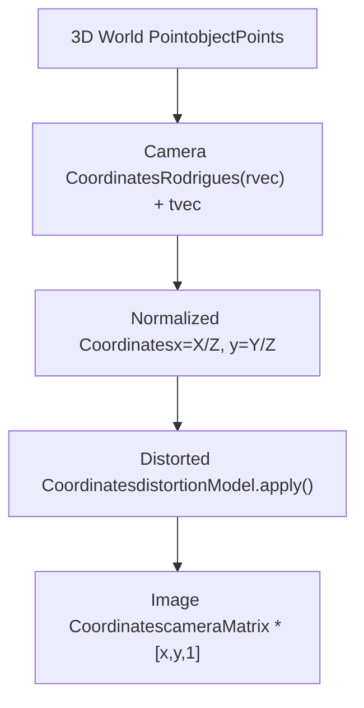
The transformation involves several key data structures:

-   `objectPoints` and `imagePoints` arrays for calibration data
-   `cameraMatrix` (3x3) containing intrinsic parameters
-   `distCoeffs` vector with distortion coefficients
-   `rvecs` and `tvecs` for extrinsic parameters per view

### Calibration Matrix Structure

The intrinsic camera matrix follows the standard form:

$$ K = \\begin{bmatrix} f\_x & 0 & c\_x \\ 0 & f\_y & c\_y \\ 0 & 0 & 1 \\end{bmatrix} $$

The `initIntrinsicParams2D` function computes initial estimates for these parameters using vanishing points detected from homographies.

Sources: [modules/calib3d/src/calibration.cpp61-140](https://github.com/opencv/opencv/blob/91c78f50/modules/calib3d/src/calibration.cpp#L61-L140) [modules/calib3d/src/calibration.cpp166-238](https://github.com/opencv/opencv/blob/91c78f50/modules/calib3d/src/calibration.cpp#L166-L238)

### Distortion Model Implementation

OpenCV implements multiple distortion models through calibration flags and coefficient vectors. The `calibrateCameraInternal` function supports:

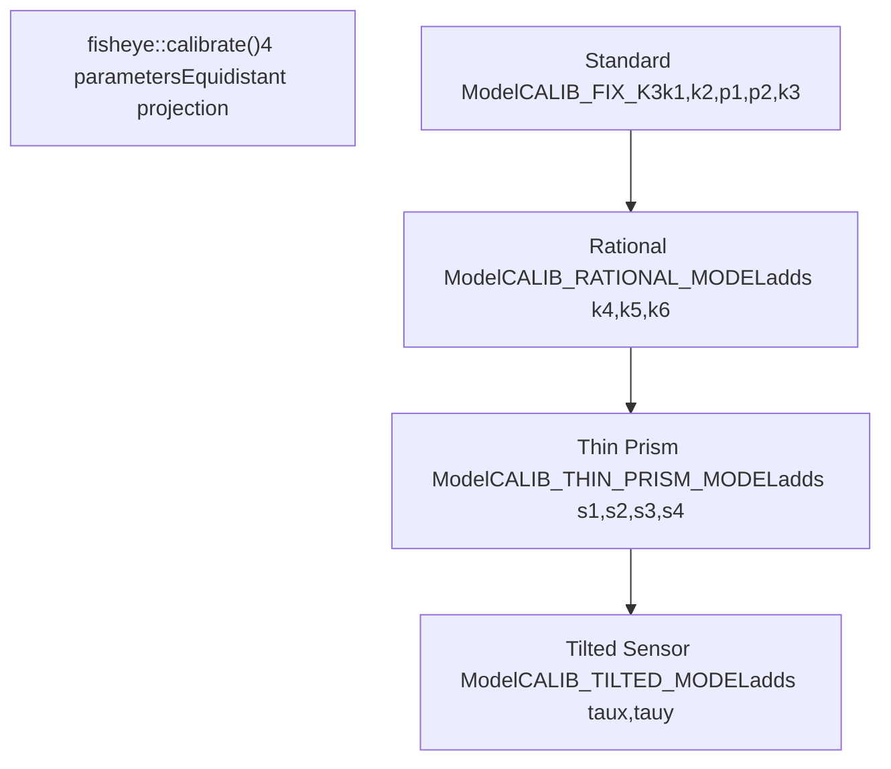
The distortion model selection is controlled by calibration flags:

-   `CALIB_FIX_K3`, `CALIB_FIX_K4`, `CALIB_FIX_K5`, `CALIB_FIX_K6` for rational model
-   `CALIB_FIX_S1_S2_S3_S4` for thin prism model
-   `CALIB_FIX_TAUX_TAUY` for tilted sensor model

Each model is validated during calibration with checks in lines 185-197 of the calibration implementation.

Sources: [modules/calib3d/src/calibration.cpp185-197](https://github.com/opencv/opencv/blob/91c78f50/modules/calib3d/src/calibration.cpp#L185-L197) [modules/calib3d/src/calibration.cpp275-282](https://github.com/opencv/opencv/blob/91c78f50/modules/calib3d/src/calibration.cpp#L275-L282) [modules/calib3d/src/fisheye.cpp88-106](https://github.com/opencv/opencv/blob/91c78f50/modules/calib3d/src/fisheye.cpp#L88-L106)

### Camera Calibration Implementation

The calibration pipeline is implemented through several interconnected components:

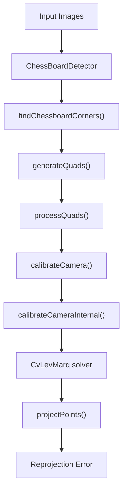
Key implementation classes and functions:

-   **`ChessBoardDetector`**: Detects calibration patterns using quad-based corner detection
-   **`calibrateCameraInternal`**: Core calibration algorithm implementing Zhang's method
-   **`CvLevMarq`**: Levenberg-Marquardt optimizer for non-linear parameter refinement
-   **`findExtrinsicCameraParams2`**: Estimates pose for each calibration view
-   **`initIntrinsicParams2D`**: Computes initial parameter estimates

The solver uses `CALIB_NINTRINSIC` (18) parameters and optimizes using iterative refinement with jacobians computed in `projectPoints`.

Sources: [modules/calib3d/src/calibinit.cpp245-284](https://github.com/opencv/opencv/blob/91c78f50/modules/calib3d/src/calibinit.cpp#L245-L284) [modules/calib3d/src/calibration.cpp166-238](https://github.com/opencv/opencv/blob/91c78f50/modules/calib3d/src/calibration.cpp#L166-L238) [modules/calib3d/src/calibration.cpp337-406](https://github.com/opencv/opencv/blob/91c78f50/modules/calib3d/src/calibration.cpp#L337-L406)

## Fisheye Camera Model

The `fisheye` namespace provides specialized algorithms for ultra-wide angle lenses using the equidistant projection model.

### Fisheye Projection Implementation

The fisheye projection model is implemented in `fisheye::projectPoints` with a distinct pipeline:

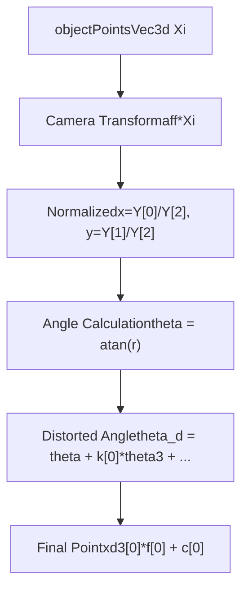
Key implementation details:

-   **Angle-based distortion**: `theta_d = theta + k[0]*theta3 + k[1]*theta5 + k[2]*theta7 + k[3]*theta9`
-   **Equidistant model**: `cdist = theta_d * inv_r` where `inv_r = 1.0/r`
-   **Alpha parameter**: Supports skew correction with `xd3(xd1[0] + alpha*xd1[1], xd1[1])`
-   **Jacobian computation**: Optional jacobian matrix for optimization in `JacobianRow` structures

The fisheye model uses only 4 distortion parameters compared to the standard model's up to 14 parameters.

Sources: [modules/calib3d/src/fisheye.cpp126-157](https://github.com/opencv/opencv/blob/91c78f50/modules/calib3d/src/fisheye.cpp#L126-L157) [modules/calib3d/src/fisheye.cpp49-55](https://github.com/opencv/opencv/blob/91c78f50/modules/calib3d/src/fisheye.cpp#L49-L55)

### Fisheye Calibration and Undistortion Functions

The fisheye namespace provides specialized implementations:

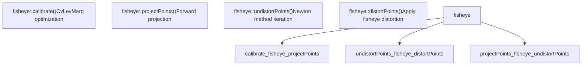
Key implementation features:

-   **`fisheye::calibrate`**: Uses `CvLevMarq` solver with specialized fisheye jacobians
-   **`fisheye::undistortPoints`**: Implements Newton-Raphson iteration with `TermCriteria` for convergence
-   **`fisheye::distortPoints`**: Direct application of fisheye distortion model
-   **Field-of-view handling**: Clips theta values to `[-CV_PI/2, CV_PI/2]` range for convergence

The undistortion process uses iterative Newton method with theta refinement:

```
theta_fix = (theta * (1 + k0_theta2 + k1_theta4 + k2_theta6 + k3_theta8) - theta_d) /
            (1 + 3*k0_theta2 + 5*k1_theta4 + 7*k2_theta6 + 9*k3_theta8)
```
Sources: [modules/calib3d/src/fisheye.cpp363-477](https://github.com/opencv/opencv/blob/91c78f50/modules/calib3d/src/fisheye.cpp#L363-L477) [modules/calib3d/src/fisheye.cpp449-467](https://github.com/opencv/opencv/blob/91c78f50/modules/calib3d/src/fisheye.cpp#L449-L467)

## Stereo Calibration and Multi-View Geometry

### Stereo Calibration Implementation

The `stereoCalibrateImpl` function provides stereo calibration using simultaneous optimization:

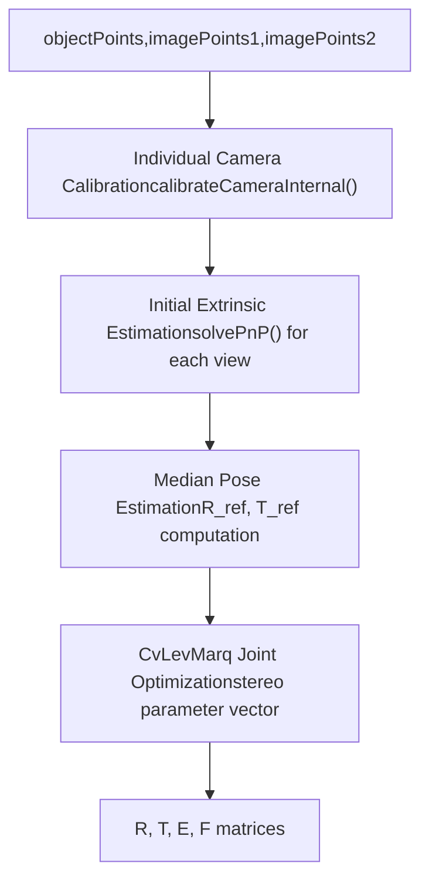
Key stereo calibration components:

-   **Parameter mapping**: Stereo Rt (6 params) + per-view Rt (6×n params) + intrinsics (2×18 params)
-   **`composeRT`**: Combines individual camera poses with stereo transformation
-   **Joint optimization**: Optimizes all parameters simultaneously using `CvLevMarq`
-   **Constraint handling**: Supports `CALIB_SAME_FOCAL_LENGTH`, `CALIB_FIX_INTRINSIC` flags

The stereo parameter vector layout:

-   Parameters 0-5: Inter-camera R,T
-   Parameters 6+i×6: Rt for i-th view
-   Parameters (nimages+1)×6+: Intrinsic parameters for both cameras

Sources: [modules/calib3d/src/calibration.cpp626-675](https://github.com/opencv/opencv/blob/91c78f50/modules/calib3d/src/calibration.cpp#L626-L675) [modules/calib3d/src/calibration.cpp742-802](https://github.com/opencv/opencv/blob/91c78f50/modules/calib3d/src/calibration.cpp#L742-L802)

### Stereo Rectification and Triangulation

Rectification transforms stereo image pairs to simplify correspondence matching:

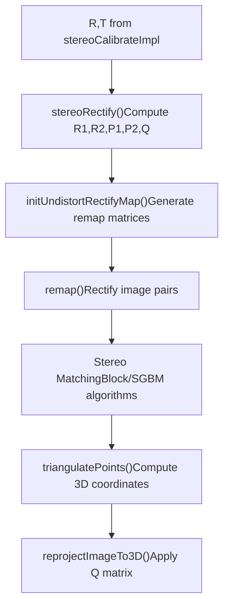
Key rectification functions:

-   **`stereoRectify`**: Computes rectification transformations R1, R2 and projection matrices P1, P2
-   **Disparity-to-depth matrix Q**: Enables 3D reconstruction from disparity maps
-   **`triangulatePoints`**: Direct 3D point reconstruction from stereo correspondences

The Q matrix enables disparity-to-3D transformation:

```
[X Y Z W]ᵀ = Q × [x y d 1]ᵀ
```
Sources: [modules/calib3d/src/triangulate.cpp43-147](https://github.com/opencv/opencv/blob/91c78f50/modules/calib3d/src/triangulate.cpp#L43-L147)

## Geometric Transformations and Multi-View Geometry

### Homography Estimation Implementation

The `findHomography` function implements robust planar transformation estimation:

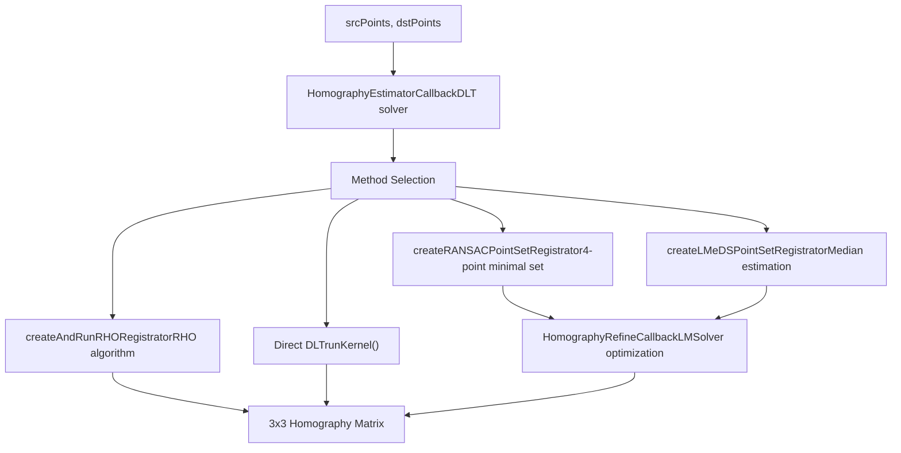
Key implementation components:

-   **`HomographyEstimatorCallback`**: Implements normalized DLT with point normalization
-   **`checkSubset`**: Validates 4-point configurations for degeneracy
-   **`computeError`**: Calculates reprojection errors for RANSAC
-   **`HomographyRefineCallback`**: Levenberg-Marquardt refinement using `LMSolver`

The normalization process scales points for numerical stability, then applies inverse transformation to the computed homography.

Sources: [modules/calib3d/src/fundam.cpp74-219](https://github.com/opencv/opencv/blob/91c78f50/modules/calib3d/src/fundam.cpp#L74-L219) [modules/calib3d/src/fundam.cpp357-463](https://github.com/opencv/opencv/blob/91c78f50/modules/calib3d/src/fundam.cpp#L357-L463)

### Fundamental Matrix Estimation

The fundamental matrix estimation provides multiple algorithmic approaches for epipolar geometry:

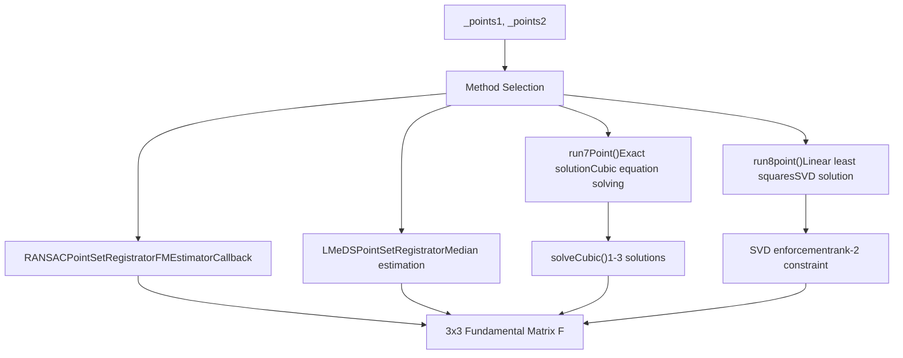
Key algorithmic components:

-   **`run7Point`**: Solves cubic equation for exact 7-point solution, can yield 1-3 matrices
-   **`run8point`**: Implements normalized 8-point algorithm with SVD rank-2 enforcement
-   **`FMEstimatorCallback`**: Callback for RANSAC-based robust estimation
-   **Point normalization**: Uses `normalizePoints` for numerical stability

The 7-point algorithm constructs the fundamental matrix as `F = λF₁ + (1-λ)F₂` and solves `det(F) = 0` as a cubic equation in λ.

Sources: [modules/calib3d/src/fundam.cpp519-637](https://github.com/opencv/opencv/blob/91c78f50/modules/calib3d/src/fundam.cpp#L519-L637) [modules/calib3d/src/fundam.cpp693-789](https://github.com/opencv/opencv/blob/91c78f50/modules/calib3d/src/fundam.cpp#L693-L789)

### Essential Matrix and Pose Recovery

Essential matrix estimation provides calibrated camera pose recovery with specialized algorithms:

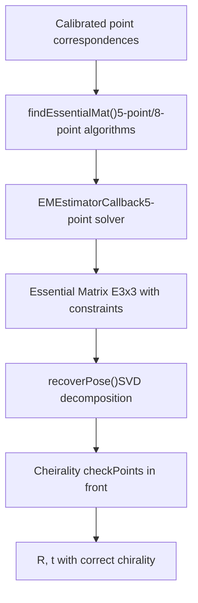
Key implementation details:

-   **`EMEstimatorCallback`**: Implements Nistér's 5-point algorithm with automatic constraint generation
-   **Constraint enforcement**: Essential matrix has rank 2 and specific singular value structure
-   **`recoverPose`**: Decomposes essential matrix using SVD, tests 4 possible R,t combinations
-   **Cheirality check**: Validates that triangulated points lie in front of both cameras

The 5-point algorithm generates a 10th-degree polynomial system that's solved to find up to 10 real essential matrix solutions.

Sources: [modules/calib3d/src/five-point.cpp46-104](https://github.com/opencv/opencv/blob/91c78f50/modules/calib3d/src/five-point.cpp#L46-L104)

## Pose Estimation and 3D Reconstruction

### Perspective-n-Point (PnP) Implementation

OpenCV provides multiple PnP solvers through a unified `solvePnP` interface:

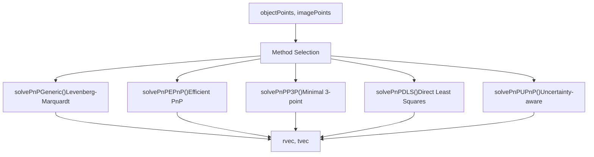
Each PnP method has specific characteristics:

-   **`solvePnPEPnP`**: Uses control points and barycentric coordinates, O(n) complexity
-   **`solvePnPP3P`**: Minimal solver, returns multiple solutions, requires RANSAC
-   **`solvePnPGeneric`**: Iterative refinement with jacobian computation
-   **`solvePnPRansac`**: Wraps any PnP method with RANSAC outlier rejection

The iterative method uses `CvLevMarq` with jacobians computed through finite differences or analytical derivatives.

Sources: [modules/calib3d/src/calibration.cpp428-431](https://github.com/opencv/opencv/blob/91c78f50/modules/calib3d/src/calibration.cpp#L428-L431)

## Triangulation and 3D Reconstruction

### 3D Point Reconstruction Implementation

The module provides several approaches for 3D reconstruction from multiple views:

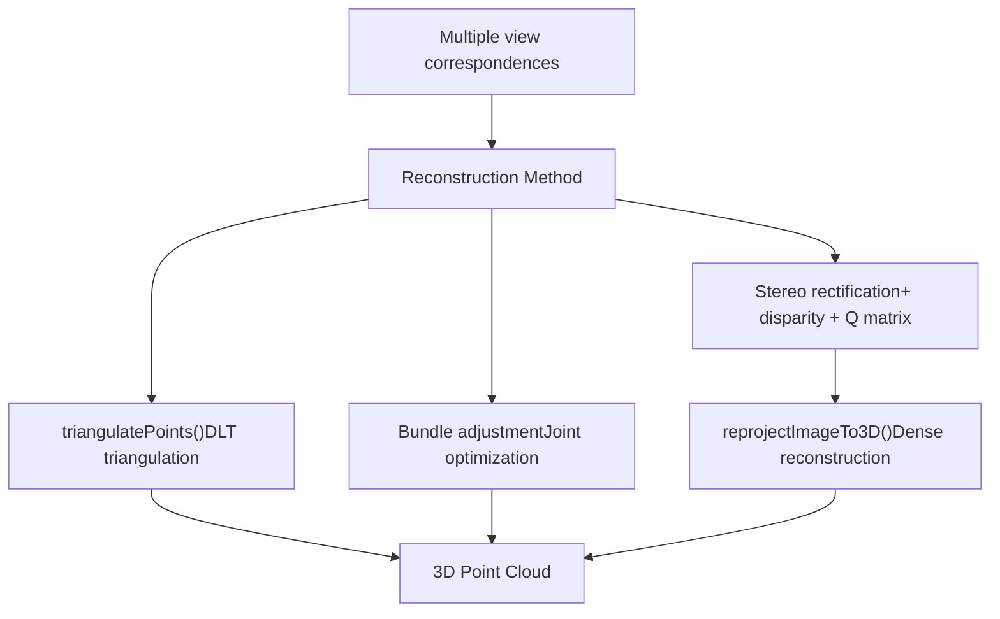
Key triangulation functions:

-   **`triangulatePoints`**: Implements DLT triangulation from N>=2 views using projection matrices
-   **`reprojectImageTo3D`**: Converts disparity maps to 3D coordinates using Q matrix
-   **Fundamental matrix constraint**: Used to validate and improve point correspondences

The triangulation solver constructs the system:

```
[P₁] [X]   [0]
[P₂] [Y] = [0]
[..] [Z]   [.]
[Pₙ] [W]   [0]
```
And solves via SVD to find the 3D point \[X/W, Y/W, Z/W\].

Sources: [modules/calib3d/src/triangulate.cpp43-147](https://github.com/opencv/opencv/blob/91c78f50/modules/calib3d/src/triangulate.cpp#L43-L147)

## Implementation Architecture

### Optimization Infrastructure

The calib3d module uses a layered optimization architecture:

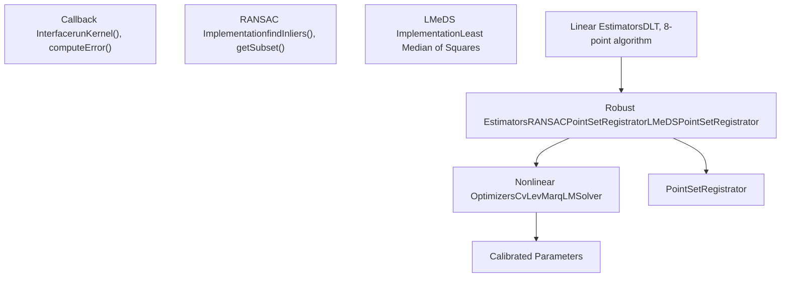
Key infrastructure components:

-   **`PointSetRegistrator`**: Abstract framework for robust parameter estimation
-   **`CvLevMarq`**: Levenberg-Marquardt solver with automatic jacobian computation
-   **`RANSACUpdateNumIters`**: Adaptive iteration count based on inlier ratio
-   **Callback pattern**: Separates estimation method from robust framework

The `PointSetRegistrator::Callback` interface enables algorithm-agnostic robust estimation through `runKernel` and `computeError` methods.

Sources: [modules/calib3d/src/ptsetreg.cpp78-236](https://github.com/opencv/opencv/blob/91c78f50/modules/calib3d/src/ptsetreg.cpp#L78-L236) [modules/calib3d/src/calibration.cpp337-345](https://github.com/opencv/opencv/blob/91c78f50/modules/calib3d/src/calibration.cpp#L337-L345) [modules/calib3d/src/levmarq.cpp1-200](https://github.com/opencv/opencv/blob/91c78f50/modules/calib3d/src/levmarq.cpp#L1-L200)

### Performance and Efficiency Considerations

The module implements several optimization strategies for real-time performance:

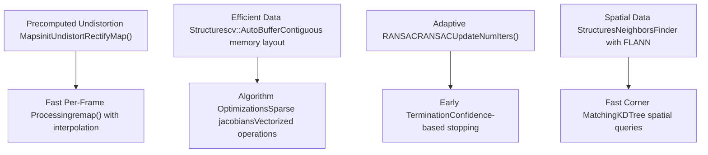
Performance-critical implementations:

-   **`initUndistortRectifyMap`**: Precomputes pixel mapping tables for O(1) per-pixel undistortion
-   **`NeighborsFinder`**: Uses FLANN KDTree for efficient spatial queries in `ChessBoardDetector`
-   **Sparse jacobians**: Only compute necessary derivatives in calibration optimization
-   **Memory layout**: Uses `cv::AutoBuffer` for stack-allocated temporary arrays

For real-time applications, the recommended pattern is map precomputation followed by `remap()` calls.

Sources: [modules/calib3d/src/calibinit.cpp508-516](https://github.com/opencv/opencv/blob/91c78f50/modules/calib3d/src/calibinit.cpp#L508-L516) [modules/calib3d/src/ptsetreg.cpp55-75](https://github.com/opencv/opencv/blob/91c78f50/modules/calib3d/src/ptsetreg.cpp#L55-L75)

## Code Examples

### Camera Calibration

Basic camera calibration workflow:

```
std::vector<std::vector<cv::Point3f>> objectPoints; // 3D pointsstd::vector<std::vector<cv::Point2f>> imagePoints;  // 2D pointscv::Size imageSize;                                 // Image size // Fill objectPoints and imagePoints by detecting pattern// in multiple images... cv::Mat cameraMatrix, distCoeffs;std::vector<cv::Mat> rvecs, tvecs; // Perform calibrationdouble reprojError = cv::calibrateCamera(    objectPoints, imagePoints, imageSize,     cameraMatrix, distCoeffs, rvecs, tvecs);
```
### Undistorting Images

```
// Using the calibration resultscv::Mat undistortedImage;cv::undistort(inputImage, undistortedImage, cameraMatrix, distCoeffs); // For better performance, precompute mapscv::Mat map1, map2;cv::initUndistortRectifyMap(    cameraMatrix, distCoeffs, cv::Mat(),     cameraMatrix, imageSize, CV_16SC2, map1, map2); // Then use remap for each framecv::remap(inputImage, undistortedImage, map1, map2, cv::INTER_LINEAR);
```
### Stereo Processing

```
// After stereo calibrationcv::Mat R1, R2, P1, P2, Q;cv::stereoRectify(    cameraMatrix1, distCoeffs1, cameraMatrix2, distCoeffs2,    imageSize, R, T, R1, R2, P1, P2, Q); // Create rectification mapscv::Mat map1x, map1y, map2x, map2y;cv::initUndistortRectifyMap(    cameraMatrix1, distCoeffs1, R1, P1, imageSize, CV_32FC1, map1x, map1y);cv::initUndistortRectifyMap(    cameraMatrix2, distCoeffs2, R2, P2, imageSize, CV_32FC1, map2x, map2y); // Rectify imagescv::Mat rectifiedLeft, rectifiedRight;cv::remap(imgLeft, rectifiedLeft, map1x, map1y, cv::INTER_LINEAR);cv::remap(imgRight, rectifiedRight, map2x, map2y, cv::INTER_LINEAR);
```
## References and Related APIs

This module is documented in detail in three child pages:

-   **Page 8.1** — Camera Models and Calibration Algorithms
-   **Page 8.2** — Pose Estimation (solvePnP) and Geometric Transforms
-   **Page 8.3** — Stereo Vision and Fisheye Camera Model

### Related OpenCV Modules

-   **core** (page 3): `Mat`, `Matx33d`, arithmetic and decomposition operations used throughout
-   **imgproc** (page 4): Image preprocessing (thresholding, filtering, `equalizeHist`) used in pattern detection
-   **features2d** (page 6): `DescriptorMatcher` and FLANN index used internally in calibration pattern search

### Function Reference

The main functions in this module are:

| Function | Purpose |
| --- | --- |
| `calibrateCamera()` | Single camera calibration |
| `stereoCalibrate()` | Stereo camera calibration |
| `stereoRectify()` | Compute stereo rectification parameters |
| `findChessboardCorners()` | Detect chessboard pattern in images |
| `solvePnP()` | Pose estimation from 3D-2D correspondences |
| `findHomography()` | Estimate homography between two images |
| `findFundamentalMat()` | Estimate fundamental matrix |
| `findEssentialMat()` | Estimate essential matrix |
| `undistort()` | Remove lens distortion from an image |
| `initUndistortRectifyMap()` | Compute maps for efficient undistortion |
| `fisheye::calibrate()` | Calibrate fisheye camera |
| `fisheye::undistortImage()` | Remove fisheye distortion |

Sources: [modules/calib3d/src/calibration.cpp166-622](https://github.com/opencv/opencv/blob/91c78f50/modules/calib3d/src/calibration.cpp#L166-L622) [modules/calib3d/src/fisheye.cpp62-358](https://github.com/opencv/opencv/blob/91c78f50/modules/calib3d/src/fisheye.cpp#L62-L358) [modules/calib3d/src/fundam.cpp357-469](https://github.com/opencv/opencv/blob/91c78f50/modules/calib3d/src/fundam.cpp#L357-L469)
