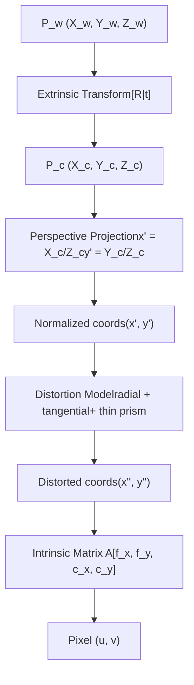
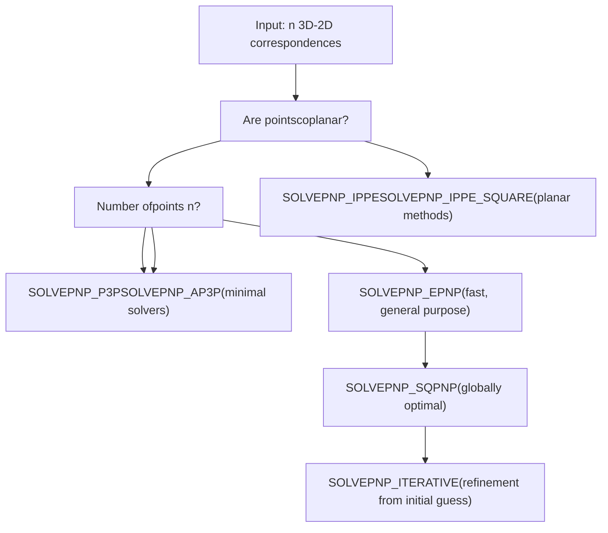
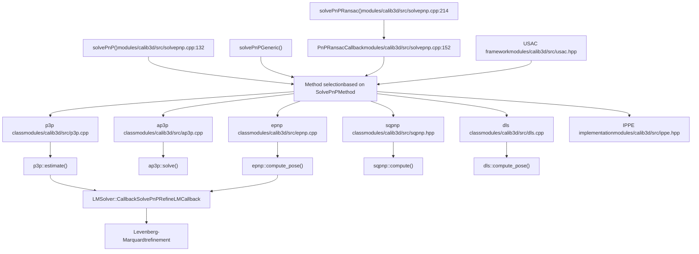
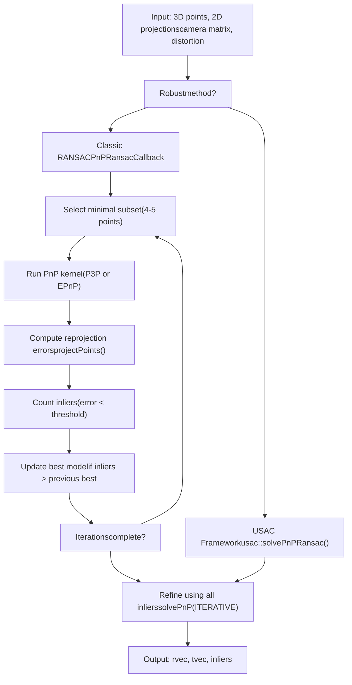
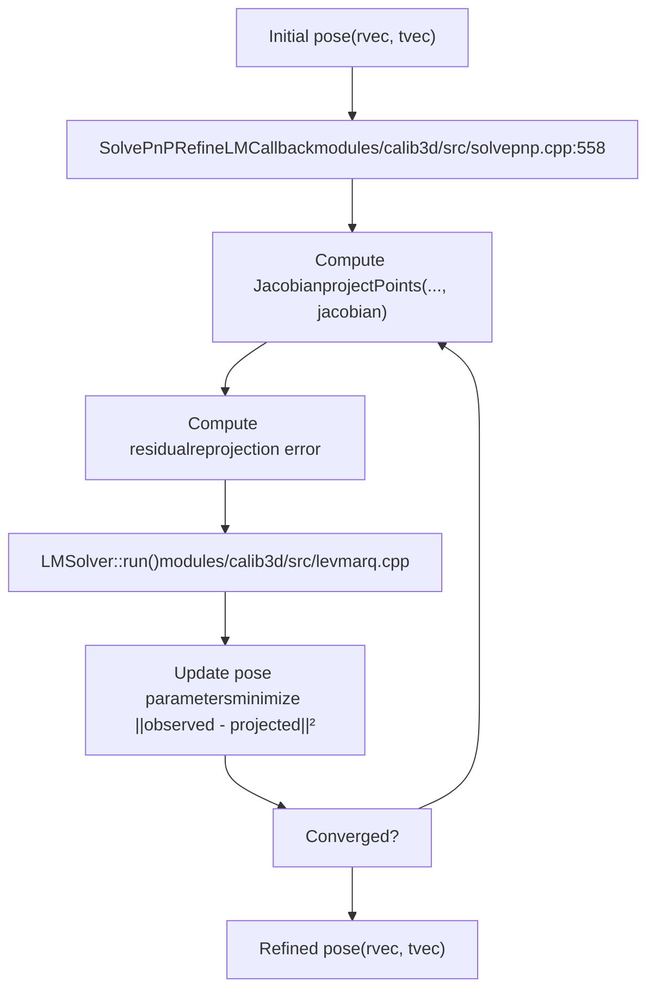

# Camera Models and Calibration Algorithms

Relevant source files

-   [modules/calib3d/include/opencv2/calib3d/calib3d.hpp](https://github.com/opencv/opencv/blob/91c78f50/modules/calib3d/include/opencv2/calib3d/calib3d.hpp)
-   [modules/calib3d/include/opencv2/calib3d/calib3d\_c.h](https://github.com/opencv/opencv/blob/91c78f50/modules/calib3d/include/opencv2/calib3d/calib3d_c.h)
-   [modules/calib3d/perf/perf\_translation2d.cpp](https://github.com/opencv/opencv/blob/91c78f50/modules/calib3d/perf/perf_translation2d.cpp)
-   [modules/calib3d/src/calibinit.cpp](https://github.com/opencv/opencv/blob/91c78f50/modules/calib3d/src/calibinit.cpp)
-   [modules/calib3d/src/calibration.cpp](https://github.com/opencv/opencv/blob/91c78f50/modules/calib3d/src/calibration.cpp)
-   [modules/calib3d/src/calibration\_base.cpp](https://github.com/opencv/opencv/blob/91c78f50/modules/calib3d/src/calibration_base.cpp)
-   [modules/calib3d/src/checkchessboard.cpp](https://github.com/opencv/opencv/blob/91c78f50/modules/calib3d/src/checkchessboard.cpp)
-   [modules/calib3d/src/chessboard.cpp](https://github.com/opencv/opencv/blob/91c78f50/modules/calib3d/src/chessboard.cpp)
-   [modules/calib3d/src/circlesgrid.cpp](https://github.com/opencv/opencv/blob/91c78f50/modules/calib3d/src/circlesgrid.cpp)
-   [modules/calib3d/src/circlesgrid.hpp](https://github.com/opencv/opencv/blob/91c78f50/modules/calib3d/src/circlesgrid.hpp)
-   [modules/calib3d/src/compat\_ptsetreg.cpp](https://github.com/opencv/opencv/blob/91c78f50/modules/calib3d/src/compat_ptsetreg.cpp)
-   [modules/calib3d/src/five-point.cpp](https://github.com/opencv/opencv/blob/91c78f50/modules/calib3d/src/five-point.cpp)
-   [modules/calib3d/src/fundam.cpp](https://github.com/opencv/opencv/blob/91c78f50/modules/calib3d/src/fundam.cpp)
-   [modules/calib3d/src/levmarq.cpp](https://github.com/opencv/opencv/blob/91c78f50/modules/calib3d/src/levmarq.cpp)
-   [modules/calib3d/src/precomp.hpp](https://github.com/opencv/opencv/blob/91c78f50/modules/calib3d/src/precomp.hpp)
-   [modules/calib3d/src/ptsetreg.cpp](https://github.com/opencv/opencv/blob/91c78f50/modules/calib3d/src/ptsetreg.cpp)
-   [modules/calib3d/src/stereo\_geom.cpp](https://github.com/opencv/opencv/blob/91c78f50/modules/calib3d/src/stereo_geom.cpp)
-   [modules/calib3d/src/triangulate.cpp](https://github.com/opencv/opencv/blob/91c78f50/modules/calib3d/src/triangulate.cpp)
-   [modules/calib3d/src/upnp.cpp](https://github.com/opencv/opencv/blob/91c78f50/modules/calib3d/src/upnp.cpp)
-   [modules/calib3d/src/upnp.h](https://github.com/opencv/opencv/blob/91c78f50/modules/calib3d/src/upnp.h)
-   [modules/calib3d/test/test\_cameracalibration.cpp](https://github.com/opencv/opencv/blob/91c78f50/modules/calib3d/test/test_cameracalibration.cpp)
-   [modules/calib3d/test/test\_cameracalibration\_badarg.cpp](https://github.com/opencv/opencv/blob/91c78f50/modules/calib3d/test/test_cameracalibration_badarg.cpp)
-   [modules/calib3d/test/test\_chesscorners.cpp](https://github.com/opencv/opencv/blob/91c78f50/modules/calib3d/test/test_chesscorners.cpp)
-   [modules/calib3d/test/test\_chesscorners\_badarg.cpp](https://github.com/opencv/opencv/blob/91c78f50/modules/calib3d/test/test_chesscorners_badarg.cpp)
-   [modules/calib3d/test/test\_chesscorners\_timing.cpp](https://github.com/opencv/opencv/blob/91c78f50/modules/calib3d/test/test_chesscorners_timing.cpp)
-   [modules/calib3d/test/test\_main.cpp](https://github.com/opencv/opencv/blob/91c78f50/modules/calib3d/test/test_main.cpp)
-   [modules/calib3d/test/test\_modelest.cpp](https://github.com/opencv/opencv/blob/91c78f50/modules/calib3d/test/test_modelest.cpp)
-   [modules/calib3d/test/test\_translation\_2d\_estimator.cpp](https://github.com/opencv/opencv/blob/91c78f50/modules/calib3d/test/test_translation_2d_estimator.cpp)
-   [modules/imgproc/include/opencv2/imgproc/imgproc.hpp](https://github.com/opencv/opencv/blob/91c78f50/modules/imgproc/include/opencv2/imgproc/imgproc.hpp)
-   [modules/imgproc/include/opencv2/imgproc/types\_c.h](https://github.com/opencv/opencv/blob/91c78f50/modules/imgproc/include/opencv2/imgproc/types_c.h)

## Purpose and Scope

This document describes the camera models and calibration algorithms implemented in OpenCV's `calib3d` module. It covers the mathematical foundations of the pinhole camera model, lens distortion parameterization, camera calibration procedures, and the Perspective-n-Point (PnP) problem for pose estimation. For geometric transformations between views such as homography and fundamental matrix estimation, see [8.2](/opencv/opencv/8.2-pose-estimation-(solvepnp)-and-geometric-transforms). For stereo calibration and rectification, refer to the stereo-specific documentation within the `calib3d` module.

**Sources:** [modules/calib3d/include/opencv2/calib3d.hpp54-542](https://github.com/opencv/opencv/blob/91c78f50/modules/calib3d/include/opencv2/calib3d.hpp#L54-L542)

---

## Camera Model Foundations

### Pinhole Camera Model

OpenCV implements the standard pinhole camera model where a 3D point $P\_w$ in world coordinates projects to a 2D pixel $p$ through the transformation:

$$s ; p = A \\begin{bmatrix} R|t \\end{bmatrix} P\_w$$

The **camera intrinsic matrix** $A$ (also denoted $K$) has the structure:

$$A = \\begin{bmatrix}f\_x & 0 & c\_x \\ 0 & f\_y & c\_y \\ 0 & 0 & 1\\end{bmatrix}$$

where:

-   $f\_x$, $f\_y$ are focal lengths expressed in pixel units
-   $(c\_x, c\_y)$ is the principal point (optical center), typically near the image center

The **extrinsic parameters** consist of rotation matrix $R$ and translation vector $t$ that transform from world to camera coordinate system.

**Sources:** [modules/calib3d/include/opencv2/calib3d.hpp66-92](https://github.com/opencv/opencv/blob/91c78f50/modules/calib3d/include/opencv2/calib3d.hpp#L66-L92)

---

### Distortion Model

Real lenses introduce distortion, primarily radial and tangential components. OpenCV's distortion model transforms normalized image coordinates $(x', y')$ to distorted coordinates $(x'', y'')$:

$$\\begin{bmatrix}x'' \\ y''\\end{bmatrix} = \\begin{bmatrix}x' \\frac{1 + k\_1 r^2 + k\_2 r^4 + k\_3 r^6}{1 + k\_4 r^2 + k\_5 r^4 + k\_6 r^6} + 2 p\_1 x' y' + p\_2(r^2 + 2 x'^2) + s\_1 r^2 + s\_2 r^4 \\ y' \\frac{1 + k\_1 r^2 + k\_2 r^4 + k\_3 r^6}{1 + k\_4 r^2 + k\_5 r^4 + k\_6 r^6} + p\_1 (r^2 + 2 y'^2) + 2 p\_2 x' y' + s\_3 r^2 + s\_4 r^4\\end{bmatrix}$$

where $r^2 = x'^2 + y'^2$.

The distortion coefficient vector is ordered as:

$$(k\_1, k\_2, p\_1, p\_2\[, k\_3\[, k\_4, k\_5, k\_6 \[, s\_1, s\_2, s\_3, s\_4\[, \\tau\_x, \\tau\_y\]\]\]\])$$

| Coefficient | Description |
| --- | --- |
| $k\_1, k\_2, k\_3, k\_4, k\_5, k\_6$ | Radial distortion coefficients |
| $p\_1, p\_2$ | Tangential distortion coefficients |
| $s\_1, s\_2, s\_3, s\_4$ | Thin prism distortion coefficients |
| $\\tau\_x, \\tau\_y$ | Tilted sensor model (Scheimpflug) parameters |

**Sources:** [modules/calib3d/include/opencv2/calib3d.hpp225-323](https://github.com/opencv/opencv/blob/91c78f50/modules/calib3d/include/opencv2/calib3d.hpp#L225-L323)


**Diagram: Camera Model Pipeline** - Transformation stages from 3D world point to 2D pixel coordinates

**Sources:** [modules/calib3d/include/opencv2/calib3d.hpp56-323](https://github.com/opencv/opencv/blob/91c78f50/modules/calib3d/include/opencv2/calib3d.hpp#L56-L323)

---

## Calibration Flags and Configuration

OpenCV provides extensive control over the calibration process through flags defined in the `calib3d.hpp` header. These flags control which parameters are estimated, fixed, or constrained during optimization.

### Calibration Flag Constants

| Flag | Value | Description |
| --- | --- | --- |
| `CALIB_USE_INTRINSIC_GUESS` | 0x00001 | Use provided camera matrix as initial estimate |
| `CALIB_FIX_ASPECT_RATIO` | 0x00002 | Fix $f\_x / f\_y$ ratio |
| `CALIB_FIX_PRINCIPAL_POINT` | 0x00004 | Fix $(c\_x, c\_y)$ |
| `CALIB_ZERO_TANGENT_DIST` | 0x00008 | Set $p\_1 = p\_2 = 0$ |
| `CALIB_FIX_FOCAL_LENGTH` | 0x00010 | Fix focal lengths |
| `CALIB_FIX_K1` through `CALIB_FIX_K6` | 0x00020-0x02000 | Fix individual radial coefficients |
| `CALIB_RATIONAL_MODEL` | 0x04000 | Enable rational distortion model (6 radial coeffs) |
| `CALIB_THIN_PRISM_MODEL` | 0x08000 | Enable thin prism distortion ($s\_1$-$s\_4$) |
| `CALIB_FIX_S1_S2_S3_S4` | 0x10000 | Fix thin prism coefficients |
| `CALIB_TILTED_MODEL` | 0x40000 | Enable tilted sensor model ($\\tau\_x$, $\\tau\_y$) |
| `CALIB_FIX_TAUX_TAUY` | 0x80000 | Fix tilted model parameters |

**Sources:** [modules/calib3d/include/opencv2/calib3d.hpp605-631](https://github.com/opencv/opencv/blob/91c78f50/modules/calib3d/include/opencv2/calib3d.hpp#L605-L631)

---

## Perspective-n-Point (PnP) Problem

The PnP problem estimates camera pose (rotation $R$ and translation $t$) given $n$ correspondences between 3D object points and 2D image projections. OpenCV implements multiple algorithms optimized for different scenarios.

### PnP Algorithm Selection


**Diagram: PnP Algorithm Selection Decision Tree**

**Sources:** [modules/calib3d/include/opencv2/calib3d.hpp563-587](https://github.com/opencv/opencv/blob/91c78f50/modules/calib3d/include/opencv2/calib3d.hpp#L563-L587) [modules/calib3d/src/solvepnp.cpp132-150](https://github.com/opencv/opencv/blob/91c78f50/modules/calib3d/src/solvepnp.cpp#L132-L150)

### SolvePnPMethod Enumeration

The `SolvePnPMethod` enum defines available algorithms:

| Method | Value | Description | Use Case |
| --- | --- | --- | --- |
| `SOLVEPNP_ITERATIVE` | 0 | Levenberg-Marquardt refinement | Refine initial pose estimate |
| `SOLVEPNP_EPNP` | 1 | Efficient Perspective-n-Point | General purpose, $n \\geq 4$ |
| `SOLVEPNP_P3P` | 2 | P3P solver | Minimal case, $n = 3,4$ |
| `SOLVEPNP_DLS` | 3 | Direct Least Squares (deprecated) | Remapped to EPNP |
| `SOLVEPNP_UPNP` | 4 | Unified PnP (deprecated) | Remapped to EPNP |
| `SOLVEPNP_AP3P` | 5 | Alternative P3P | Minimal case alternative |
| `SOLVEPNP_IPPE` | 6 | Infinitesimal Plane-Based Pose | Coplanar points |
| `SOLVEPNP_IPPE_SQUARE` | 7 | IPPE for square markers | 4-point square markers |
| `SOLVEPNP_SQPNP` | 8 | SQPnP globally optimal | High accuracy required |

**Sources:** [modules/calib3d/include/opencv2/calib3d.hpp563-587](https://github.com/opencv/opencv/blob/91c78f50/modules/calib3d/include/opencv2/calib3d.hpp#L563-L587)

---

## PnP Solver Implementation Architecture

### Core Solver Classes


**Diagram: PnP Solver Architecture** - Class hierarchy and method dispatch for pose estimation

**Sources:** [modules/calib3d/src/solvepnp.cpp132-556](https://github.com/opencv/opencv/blob/91c78f50/modules/calib3d/src/solvepnp.cpp#L132-L556) [modules/calib3d/src/epnp.cpp1-100](https://github.com/opencv/opencv/blob/91c78f50/modules/calib3d/src/epnp.cpp#L1-L100) [modules/calib3d/src/p3p.cpp1-50](https://github.com/opencv/opencv/blob/91c78f50/modules/calib3d/src/p3p.cpp#L1-L50) [modules/calib3d/src/ap3p.cpp1-50](https://github.com/opencv/opencv/blob/91c78f50/modules/calib3d/src/ap3p.cpp#L1-L50)

### Algorithm Implementation Details

#### EPnP (Efficient Perspective-n-Point)

The `epnp` class implements the algorithm from Lepetit et al. (2009). It expresses 3D points as weighted combinations of four control points and solves for their camera coordinates.

**Key Methods:**

-   `epnp::compute_pose()` - Main entry point
-   `epnp::choose_control_points()` - Select control point basis
-   `epnp::compute_barycentric_coordinates()` - Express points in control point basis
-   `epnp::compute_ccs()` - Estimate control points in camera coordinates
-   `epnp::compute_pcs()` - Back-project to 3D

**Sources:** [modules/calib3d/src/epnp.cpp1-400](https://github.com/opencv/opencv/blob/91c78f50/modules/calib3d/src/epnp.cpp#L1-L400) [modules/calib3d/src/epnp.h1-100](https://github.com/opencv/opencv/blob/91c78f50/modules/calib3d/src/epnp.h#L1-L100)

#### P3P and AP3P

Minimal solvers for 3-4 points. P3P solves a quartic polynomial, typically yielding up to 4 solutions that must be disambiguated.

**P3P Implementation:**

-   [modules/calib3d/src/p3p.cpp1-300](https://github.com/opencv/opencv/blob/91c78f50/modules/calib3d/src/p3p.cpp#L1-L300) - Implements Ding et al. (2023) revisited P3P
-   `p3p::estimate()` - Returns up to 4 pose hypotheses
-   [modules/calib3d/src/solvepnp.cpp427-556](https://github.com/opencv/opencv/blob/91c78f50/modules/calib3d/src/solvepnp.cpp#L427-L556) - Wrapper `solveP3P()` function

**AP3P Implementation:**

-   [modules/calib3d/src/ap3p.cpp1-250](https://github.com/opencv/opencv/blob/91c78f50/modules/calib3d/src/ap3p.cpp#L1-L250) - Alternative P3P formulation (Ke et al. 2017)
-   `ap3p::solve()` - Algebraic solution

**Sources:** [modules/calib3d/src/p3p.cpp1-300](https://github.com/opencv/opencv/blob/91c78f50/modules/calib3d/src/p3p.cpp#L1-L300) [modules/calib3d/src/ap3p.cpp1-250](https://github.com/opencv/opencv/blob/91c78f50/modules/calib3d/src/ap3p.cpp#L1-L250) [modules/calib3d/src/solvepnp.cpp427-556](https://github.com/opencv/opencv/blob/91c78f50/modules/calib3d/src/solvepnp.cpp#L427-L556)

#### DLS (Direct Least Squares)

**Note:** DLS and UPnP methods are currently remapped to EPnP due to implementation issues.

The `dls` class implements Hesch & Roumeliotis (2011) Direct Least Squares method. It uses Cayley parameterization to avoid rotation matrix singularities.

**Key Methods:**

-   `dls::run_kernel()` - Core DLS algorithm
-   `dls::build_coeff_matrix()` - Construct coefficient matrix
-   `dls::cayley2rotbar()` - Cayley to rotation matrix conversion

**Sources:** [modules/calib3d/src/dls.cpp1-300](https://github.com/opencv/opencv/blob/91c78f50/modules/calib3d/src/dls.cpp#L1-L300) [modules/calib3d/src/dls.h1-150](https://github.com/opencv/opencv/blob/91c78f50/modules/calib3d/src/dls.h#L1-L150)

#### SQPnP (Sequentially Optimal Polynomial)

The `sqpnp` class provides globally optimal solutions by formulating PnP as a polynomial optimization problem.

**Sources:** [modules/calib3d/src/sqpnp.hpp1-200](https://github.com/opencv/opencv/blob/91c78f50/modules/calib3d/src/sqpnp.hpp#L1-L200)

---

## Robust Estimation with RANSAC

OpenCV provides robust pose estimation through `solvePnPRansac()` which handles outliers in 2D-3D correspondences.

### RANSAC Pipeline


**Diagram: RANSAC-based Robust PnP Estimation Pipeline**

**Sources:** [modules/calib3d/src/solvepnp.cpp214-396](https://github.com/opencv/opencv/blob/91c78f50/modules/calib3d/src/solvepnp.cpp#L214-L396)

### PnPRansacCallback Implementation

The `PnPRansacCallback` class implements the `PointSetRegistrator::Callback` interface for RANSAC:

**Key Methods:**

-   `runKernel()` [modules/calib3d/src/solvepnp.cpp164-177](https://github.com/opencv/opencv/blob/91c78f50/modules/calib3d/src/solvepnp.cpp#L164-L177) - Computes pose from minimal set
-   `computeError()` [modules/calib3d/src/solvepnp.cpp181-203](https://github.com/opencv/opencv/blob/91c78f50/modules/calib3d/src/solvepnp.cpp#L181-L203) - Computes reprojection errors
-   Uses `projectPoints()` to evaluate model quality

**Member Variables:**

-   `cameraMatrix`, `distCoeffs` - Camera parameters
-   `flags` - Selected `SolvePnPMethod`
-   `useExtrinsicGuess` - Whether to use initial pose estimate
-   `rvec`, `tvec` - Current pose estimate

**Sources:** [modules/calib3d/src/solvepnp.cpp152-212](https://github.com/opencv/opencv/blob/91c78f50/modules/calib3d/src/solvepnp.cpp#L152-L212)

### RANSAC Parameter Control

| Parameter | Description | Typical Value |
| --- | --- | --- |
| `iterationsCount` | Maximum RANSAC iterations | 1000 |
| `reprojectionError` | Inlier threshold (pixels) | 0.5 - 8.0 |
| `confidence` | Desired confidence level | 0.99 |

The number of required iterations is dynamically updated using:

$$N = \\frac{\\log(1-p)}{\\log(1-(1-\\epsilon)^s)}$$

where $p$ is confidence, $\\epsilon$ is outlier ratio, and $s$ is sample size.

**Implementation:** [modules/calib3d/src/ptsetreg.cpp55-75](https://github.com/opencv/opencv/blob/91c78f50/modules/calib3d/src/ptsetreg.cpp#L55-L75)

**Sources:** [modules/calib3d/src/solvepnp.cpp214-396](https://github.com/opencv/opencv/blob/91c78f50/modules/calib3d/src/solvepnp.cpp#L214-L396) [modules/calib3d/src/ptsetreg.cpp55-75](https://github.com/opencv/opencv/blob/91c78f50/modules/calib3d/src/ptsetreg.cpp#L55-L75)

---

## Pose Refinement

### Levenberg-Marquardt Optimization

After obtaining an initial pose estimate (from any PnP solver or RANSAC), the pose can be refined using `SOLVEPNP_ITERATIVE` which applies Levenberg-Marquardt optimization.


**Diagram: Levenberg-Marquardt Pose Refinement Process**

**Sources:** [modules/calib3d/src/solvepnp.cpp558-608](https://github.com/opencv/opencv/blob/91c78f50/modules/calib3d/src/solvepnp.cpp#L558-L608)

### SolvePnPRefineLMCallback

This callback computes the residual and Jacobian for LM optimization:

```
class SolvePnPRefineLMCallback : public LMSolver::Callback{    bool compute(InputArray _param, OutputArray _err, OutputArray _Jac) const    {        Mat rvec = param(Rect(0, 0, 1, 3));        Mat tvec = param(Rect(0, 3, 1, 3));                // Project points and compute Jacobian        projectPoints(objectPoints, rvec, tvec, cameraMatrix,                       distCoeffs, projectedPts, _Jac.needed() ? J : noArray());                // Compute error (observed - projected)        err = projectedPts - imagePoints0;                return true;    }};
```
**Sources:** [modules/calib3d/src/solvepnp.cpp558-608](https://github.com/opencv/opencv/blob/91c78f50/modules/calib3d/src/solvepnp.cpp#L558-L608)

---

## Visual Servoing Refinement

OpenCV also implements visual servoing-based pose refinement using virtual visual servoing (VVS) principles.

### Interaction Matrix Formulation

The interaction matrix $L$ relates camera velocity to feature velocities:

$$\\dot{s} = L , v\_c$$

where $v\_c = (\\dot{t}, \\omega)$ is camera velocity (translation and angular).

For a 3D point projecting to normalized coordinates $(x, y)$:

$$L = \\begin{bmatrix} -1/Z & 0 & x/Z & xy & -(1+x^2) & y \\ 0 & -1/Z & y/Z & 1+y^2 & -xy & -x \\end{bmatrix}$$

**Implementation:** [modules/calib3d/src/solvepnp.cpp618-650](https://github.com/opencv/opencv/blob/91c78f50/modules/calib3d/src/solvepnp.cpp#L618-L650)

**Sources:** [modules/calib3d/src/solvepnp.cpp610-730](https://github.com/opencv/opencv/blob/91c78f50/modules/calib3d/src/solvepnp.cpp#L610-L730)

---

## Calibration Pattern Detection

Camera calibration typically uses calibration patterns (chessboards, circles) to establish 2D-3D correspondences.

### Pattern Detection Flags

| Flag | Description |
| --- | --- |
| `CALIB_CB_ADAPTIVE_THRESH` | Use adaptive thresholding |
| `CALIB_CB_NORMALIZE_IMAGE` | Normalize image before processing |
| `CALIB_CB_FILTER_QUADS` | Filter out spurious quadrangles |
| `CALIB_CB_FAST_CHECK` | Fast check for chessboard presence |

**Sources:** [modules/calib3d/include/opencv2/calib3d.hpp589-598](https://github.com/opencv/opencv/blob/91c78f50/modules/calib3d/include/opencv2/calib3d.hpp#L589-L598)

---

## Fisheye Camera Model

OpenCV provides a separate fisheye camera model for wide-angle lenses with significant distortion.

### Fisheye Distortion

The fisheye model uses angular parameterization:

$$\\theta\_d = \\theta (1 + k\_1 \\theta^2 + k\_2 \\theta^4 + k\_3 \\theta^6 + k\_4 \\theta^8)$$

where $\\theta = \\arctan(r)$ and $r = \\sqrt{x^2 + y^2}$.

**API Namespace:** `cv::fisheye` sub-module within `calib3d`

**Sources:** [modules/calib3d/include/opencv2/calib3d.hpp509-541](https://github.com/opencv/opencv/blob/91c78f50/modules/calib3d/include/opencv2/calib3d.hpp#L509-L541)

---

## Hand-Eye Calibration

For robotic applications, OpenCV provides hand-eye calibration methods that solve for the transformation between camera and robot end-effector.

### Calibration Methods

| Method | Reference |
| --- | --- |
| `CALIB_HAND_EYE_TSAI` | Tsai (1989) |
| `CALIB_HAND_EYE_PARK` | Park (1994) |
| `CALIB_HAND_EYE_HORAUD` | Horaud (1995) |
| `CALIB_HAND_EYE_ANDREFF` | Andreff (1999) |
| `CALIB_HAND_EYE_DANIILIDIS` | Daniilidis (1998) - Dual quaternions |

**Sources:** [modules/calib3d/include/opencv2/calib3d.hpp640-653](https://github.com/opencv/opencv/blob/91c78f50/modules/calib3d/include/opencv2/calib3d.hpp#L640-L653)

---

## Usage Examples

### Basic PnP Solving

```
// Given 3D object points, 2D image points, camera calibrationstd::vector<Point3f> objectPoints = ...; // 3D model pointsstd::vector<Point2f> imagePoints = ...;  // Corresponding 2D detectionsMat cameraMatrix = ...;                  // 3x3 intrinsic matrixMat distCoeffs = ...;                    // Distortion coefficients Mat rvec, tvec;bool success = solvePnP(objectPoints, imagePoints, cameraMatrix,                         distCoeffs, rvec, tvec,                         false, SOLVEPNP_ITERATIVE);
```
### Robust PnP with RANSAC

```
Mat rvec, tvec;std::vector<int> inliers; bool success = solvePnPRansac(objectPoints, imagePoints,                               cameraMatrix, distCoeffs,                               rvec, tvec,                               false,              // useExtrinsicGuess                               100,                // iterationsCount                               8.0,                // reprojectionError                               0.99,               // confidence                               inliers,            // output inliers                               SOLVEPNP_ITERATIVE);
```
**Sources:** [modules/calib3d/src/solvepnp.cpp132-150](https://github.com/opencv/opencv/blob/91c78f50/modules/calib3d/src/solvepnp.cpp#L132-L150) [modules/calib3d/src/solvepnp.cpp214-396](https://github.com/opencv/opencv/blob/91c78f50/modules/calib3d/src/solvepnp.cpp#L214-L396)

---

## Performance Considerations

### Algorithm Selection Guidelines

| Scenario | Recommended Method | Rationale |
| --- | --- | --- |
| Few points (n=3,4) | `SOLVEPNP_P3P` or `SOLVEPNP_AP3P` | Minimal solvers |
| General case (n≥6) | `SOLVEPNP_EPNP` | Fast, accurate |
| Planar object | `SOLVEPNP_IPPE` | Exploits planarity |
| Square marker | `SOLVEPNP_IPPE_SQUARE` | Optimized for squares |
| Maximum accuracy | `SOLVEPNP_SQPNP` | Globally optimal |
| Refinement | `SOLVEPNP_ITERATIVE` | Local optimization |
| Outlier handling | `solvePnPRansac()` | Robust estimation |

**Sources:** [modules/calib3d/perf/perf\_pnp.cpp1-110](https://github.com/opencv/opencv/blob/91c78f50/modules/calib3d/perf/perf_pnp.cpp#L1-L110) [modules/calib3d/test/test\_solvepnp\_ransac.cpp200-233](https://github.com/opencv/opencv/blob/91c78f50/modules/calib3d/test/test_solvepnp_ransac.cpp#L200-L233)

---

## Coordinate System Conventions

OpenCV uses standard computer vision coordinate conventions:

-   **Camera coordinates**: Right-handed, Z-axis pointing forward
-   **Image coordinates**: Origin at top-left, X right, Y down
-   **Rotation vectors**: Rodrigues parameterization (axis-angle)
-   **Homogeneous transformations**: $^cT\_o$ transforms object frame to camera frame

The notation $^cT\_o = \\begin{bmatrix} R & t \\ 0 & 1 \\end{bmatrix}$ represents the transformation where:

-   $R$: 3×3 rotation matrix (object orientation in camera frame)
-   $t$: 3×1 translation vector (object position in camera frame)

**Sources:** [modules/calib3d/include/opencv2/calib3d.hpp386-454](https://github.com/opencv/opencv/blob/91c78f50/modules/calib3d/include/opencv2/calib3d.hpp#L386-L454)
