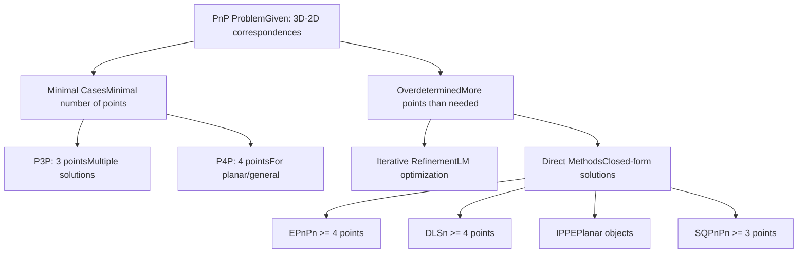
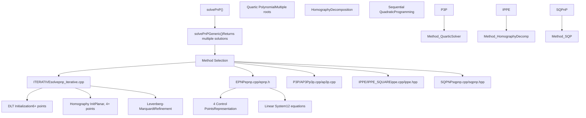
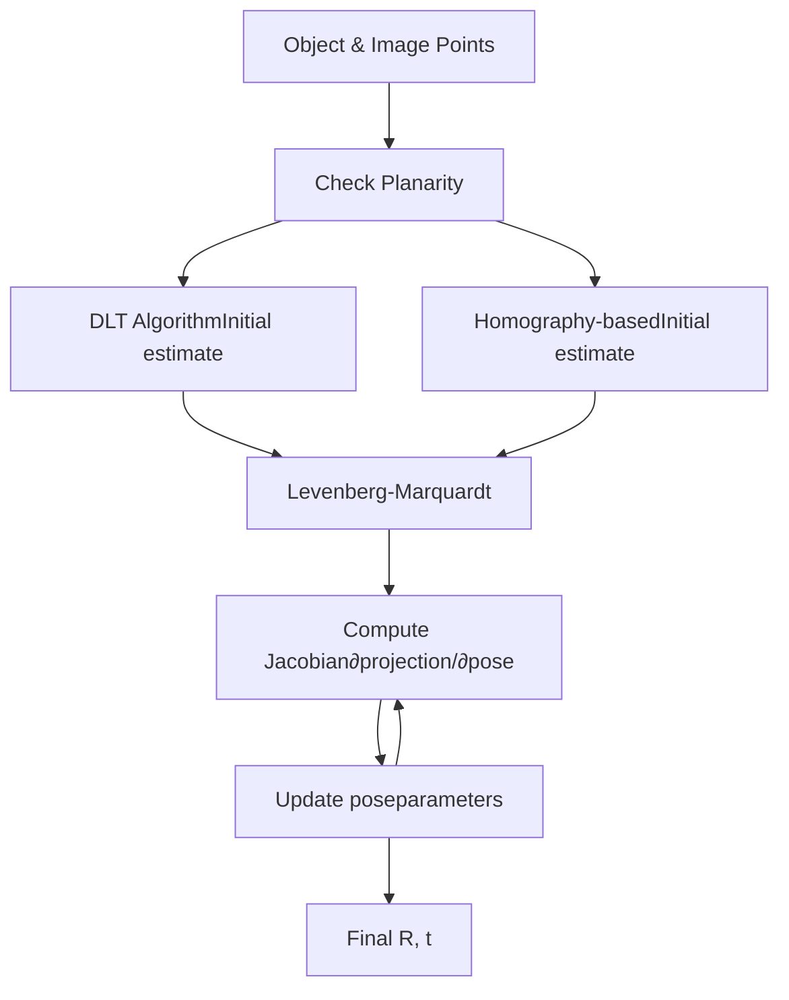
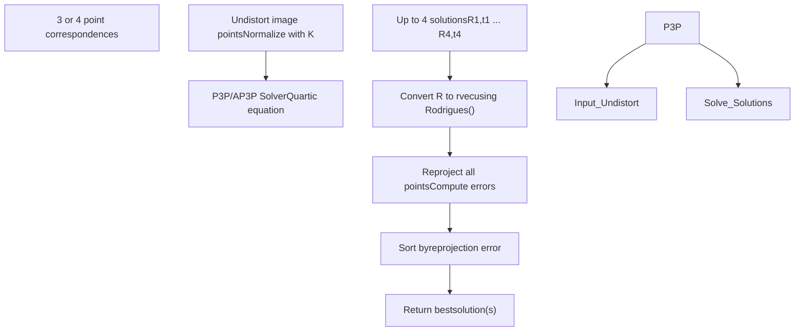
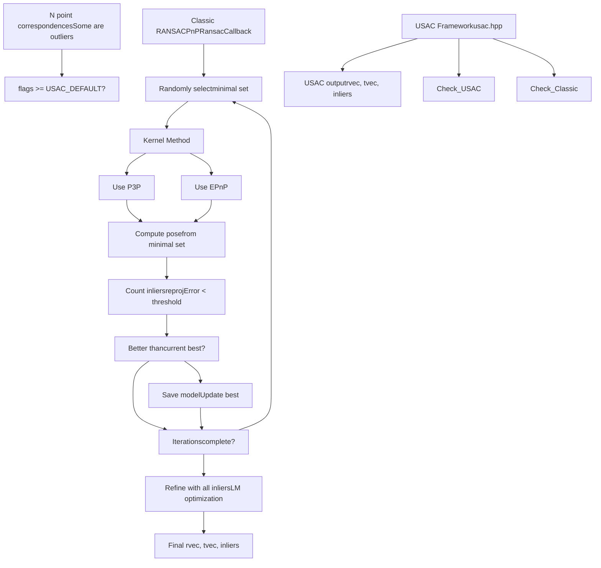
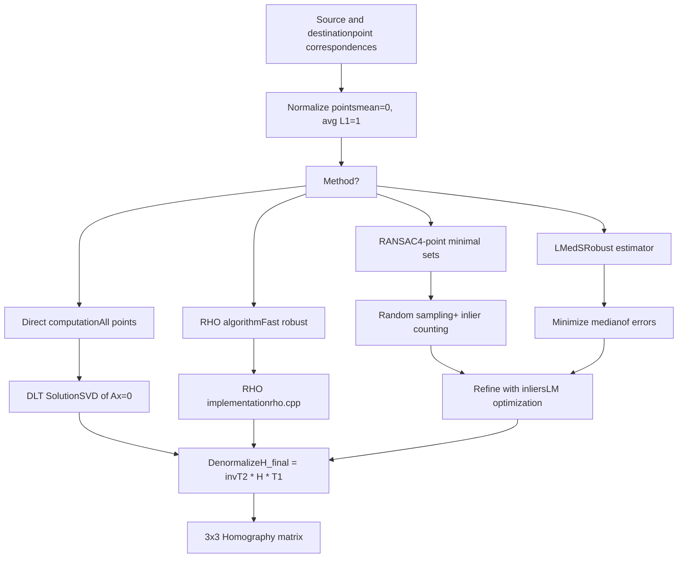
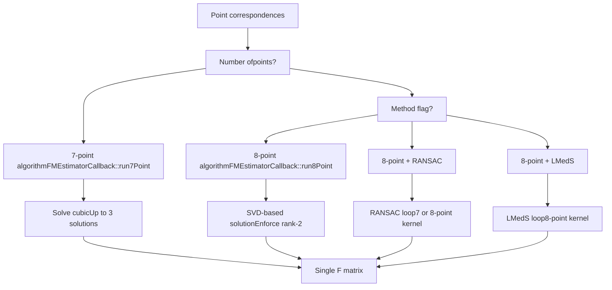
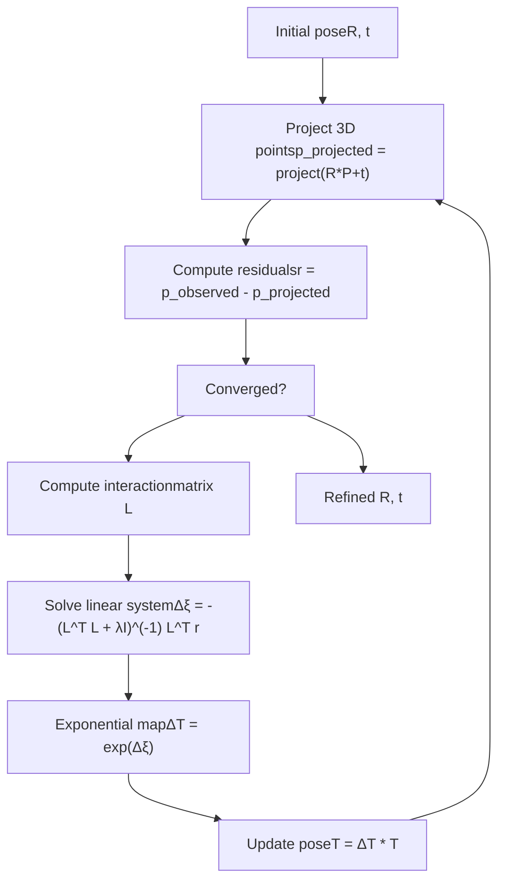
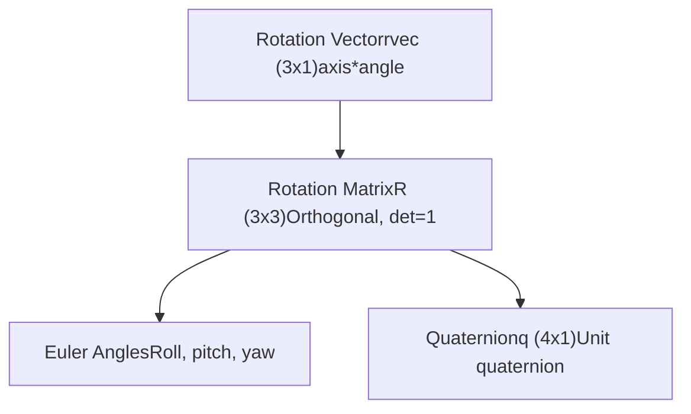

# Pose Estimation (solvePnP) and Geometric Transforms

Relevant source files

-   [cmake/vars/EnableModeVars.cmake](https://github.com/opencv/opencv/blob/91c78f50/cmake/vars/EnableModeVars.cmake)
-   [cmake/vars/OPENCV\_SEMIHOSTING.cmake](https://github.com/opencv/opencv/blob/91c78f50/cmake/vars/OPENCV_SEMIHOSTING.cmake)
-   [doc/opencv.bib](https://github.com/opencv/opencv/blob/91c78f50/doc/opencv.bib)
-   [modules/calib3d/doc/calib3d.bib](https://github.com/opencv/opencv/blob/91c78f50/modules/calib3d/doc/calib3d.bib)
-   [modules/calib3d/doc/solvePnP.markdown](https://github.com/opencv/opencv/blob/91c78f50/modules/calib3d/doc/solvePnP.markdown?plain=1)
-   [modules/calib3d/include/opencv2/calib3d.hpp](https://github.com/opencv/opencv/blob/91c78f50/modules/calib3d/include/opencv2/calib3d.hpp)
-   [modules/calib3d/include/opencv2/calib3d/calib3d\_c.h](https://github.com/opencv/opencv/blob/91c78f50/modules/calib3d/include/opencv2/calib3d/calib3d_c.h)
-   [modules/calib3d/perf/perf\_pnp.cpp](https://github.com/opencv/opencv/blob/91c78f50/modules/calib3d/perf/perf_pnp.cpp)
-   [modules/calib3d/perf/perf\_stereosgbm.cpp](https://github.com/opencv/opencv/blob/91c78f50/modules/calib3d/perf/perf_stereosgbm.cpp)
-   [modules/calib3d/perf/perf\_translation2d.cpp](https://github.com/opencv/opencv/blob/91c78f50/modules/calib3d/perf/perf_translation2d.cpp)
-   [modules/calib3d/src/ap3p.cpp](https://github.com/opencv/opencv/blob/91c78f50/modules/calib3d/src/ap3p.cpp)
-   [modules/calib3d/src/ap3p.h](https://github.com/opencv/opencv/blob/91c78f50/modules/calib3d/src/ap3p.h)
-   [modules/calib3d/src/calibinit.cpp](https://github.com/opencv/opencv/blob/91c78f50/modules/calib3d/src/calibinit.cpp)
-   [modules/calib3d/src/calibration.cpp](https://github.com/opencv/opencv/blob/91c78f50/modules/calib3d/src/calibration.cpp)
-   [modules/calib3d/src/calibration\_base.cpp](https://github.com/opencv/opencv/blob/91c78f50/modules/calib3d/src/calibration_base.cpp)
-   [modules/calib3d/src/checkchessboard.cpp](https://github.com/opencv/opencv/blob/91c78f50/modules/calib3d/src/checkchessboard.cpp)
-   [modules/calib3d/src/chessboard.cpp](https://github.com/opencv/opencv/blob/91c78f50/modules/calib3d/src/chessboard.cpp)
-   [modules/calib3d/src/circlesgrid.cpp](https://github.com/opencv/opencv/blob/91c78f50/modules/calib3d/src/circlesgrid.cpp)
-   [modules/calib3d/src/circlesgrid.hpp](https://github.com/opencv/opencv/blob/91c78f50/modules/calib3d/src/circlesgrid.hpp)
-   [modules/calib3d/src/compat\_ptsetreg.cpp](https://github.com/opencv/opencv/blob/91c78f50/modules/calib3d/src/compat_ptsetreg.cpp)
-   [modules/calib3d/src/dls.cpp](https://github.com/opencv/opencv/blob/91c78f50/modules/calib3d/src/dls.cpp)
-   [modules/calib3d/src/dls.h](https://github.com/opencv/opencv/blob/91c78f50/modules/calib3d/src/dls.h)
-   [modules/calib3d/src/epnp.cpp](https://github.com/opencv/opencv/blob/91c78f50/modules/calib3d/src/epnp.cpp)
-   [modules/calib3d/src/epnp.h](https://github.com/opencv/opencv/blob/91c78f50/modules/calib3d/src/epnp.h)
-   [modules/calib3d/src/five-point.cpp](https://github.com/opencv/opencv/blob/91c78f50/modules/calib3d/src/five-point.cpp)
-   [modules/calib3d/src/fundam.cpp](https://github.com/opencv/opencv/blob/91c78f50/modules/calib3d/src/fundam.cpp)
-   [modules/calib3d/src/ippe.cpp](https://github.com/opencv/opencv/blob/91c78f50/modules/calib3d/src/ippe.cpp)
-   [modules/calib3d/src/levmarq.cpp](https://github.com/opencv/opencv/blob/91c78f50/modules/calib3d/src/levmarq.cpp)
-   [modules/calib3d/src/p3p.cpp](https://github.com/opencv/opencv/blob/91c78f50/modules/calib3d/src/p3p.cpp)
-   [modules/calib3d/src/p3p.h](https://github.com/opencv/opencv/blob/91c78f50/modules/calib3d/src/p3p.h)
-   [modules/calib3d/src/precomp.hpp](https://github.com/opencv/opencv/blob/91c78f50/modules/calib3d/src/precomp.hpp)
-   [modules/calib3d/src/ptsetreg.cpp](https://github.com/opencv/opencv/blob/91c78f50/modules/calib3d/src/ptsetreg.cpp)
-   [modules/calib3d/src/solvepnp.cpp](https://github.com/opencv/opencv/blob/91c78f50/modules/calib3d/src/solvepnp.cpp)
-   [modules/calib3d/src/stereo\_geom.cpp](https://github.com/opencv/opencv/blob/91c78f50/modules/calib3d/src/stereo_geom.cpp)
-   [modules/calib3d/src/triangulate.cpp](https://github.com/opencv/opencv/blob/91c78f50/modules/calib3d/src/triangulate.cpp)
-   [modules/calib3d/src/upnp.cpp](https://github.com/opencv/opencv/blob/91c78f50/modules/calib3d/src/upnp.cpp)
-   [modules/calib3d/src/upnp.h](https://github.com/opencv/opencv/blob/91c78f50/modules/calib3d/src/upnp.h)
-   [modules/calib3d/test/test\_cameracalibration.cpp](https://github.com/opencv/opencv/blob/91c78f50/modules/calib3d/test/test_cameracalibration.cpp)
-   [modules/calib3d/test/test\_cameracalibration\_badarg.cpp](https://github.com/opencv/opencv/blob/91c78f50/modules/calib3d/test/test_cameracalibration_badarg.cpp)
-   [modules/calib3d/test/test\_chesscorners.cpp](https://github.com/opencv/opencv/blob/91c78f50/modules/calib3d/test/test_chesscorners.cpp)
-   [modules/calib3d/test/test\_chesscorners\_badarg.cpp](https://github.com/opencv/opencv/blob/91c78f50/modules/calib3d/test/test_chesscorners_badarg.cpp)
-   [modules/calib3d/test/test\_chesscorners\_timing.cpp](https://github.com/opencv/opencv/blob/91c78f50/modules/calib3d/test/test_chesscorners_timing.cpp)
-   [modules/calib3d/test/test\_main.cpp](https://github.com/opencv/opencv/blob/91c78f50/modules/calib3d/test/test_main.cpp)
-   [modules/calib3d/test/test\_modelest.cpp](https://github.com/opencv/opencv/blob/91c78f50/modules/calib3d/test/test_modelest.cpp)
-   [modules/calib3d/test/test\_solvepnp\_ransac.cpp](https://github.com/opencv/opencv/blob/91c78f50/modules/calib3d/test/test_solvepnp_ransac.cpp)
-   [modules/calib3d/test/test\_translation\_2d\_estimator.cpp](https://github.com/opencv/opencv/blob/91c78f50/modules/calib3d/test/test_translation_2d_estimator.cpp)
-   [modules/core/perf/perf\_mat.cpp](https://github.com/opencv/opencv/blob/91c78f50/modules/core/perf/perf_mat.cpp)
-   [modules/features2d/perf/perf\_batchDistance.cpp](https://github.com/opencv/opencv/blob/91c78f50/modules/features2d/perf/perf_batchDistance.cpp)
-   [modules/imgproc/include/opencv2/imgproc.hpp](https://github.com/opencv/opencv/blob/91c78f50/modules/imgproc/include/opencv2/imgproc.hpp)
-   [modules/imgproc/src/ccl\_bolelli\_forest.inc.hpp](https://github.com/opencv/opencv/blob/91c78f50/modules/imgproc/src/ccl_bolelli_forest.inc.hpp)
-   [modules/imgproc/src/ccl\_bolelli\_forest\_firstline.inc.hpp](https://github.com/opencv/opencv/blob/91c78f50/modules/imgproc/src/ccl_bolelli_forest_firstline.inc.hpp)
-   [modules/imgproc/src/ccl\_bolelli\_forest\_lastline.inc.hpp](https://github.com/opencv/opencv/blob/91c78f50/modules/imgproc/src/ccl_bolelli_forest_lastline.inc.hpp)
-   [modules/imgproc/src/ccl\_bolelli\_forest\_singleline.inc.hpp](https://github.com/opencv/opencv/blob/91c78f50/modules/imgproc/src/ccl_bolelli_forest_singleline.inc.hpp)
-   [modules/imgproc/src/connectedcomponents.cpp](https://github.com/opencv/opencv/blob/91c78f50/modules/imgproc/src/connectedcomponents.cpp)
-   [modules/imgproc/src/lsd.cpp](https://github.com/opencv/opencv/blob/91c78f50/modules/imgproc/src/lsd.cpp)
-   [modules/imgproc/src/min\_enclosing\_convex\_polygon.cpp](https://github.com/opencv/opencv/blob/91c78f50/modules/imgproc/src/min_enclosing_convex_polygon.cpp)
-   [modules/imgproc/src/phasecorr\_iterative.cpp](https://github.com/opencv/opencv/blob/91c78f50/modules/imgproc/src/phasecorr_iterative.cpp)
-   [modules/imgproc/test/test\_connectedcomponents.cpp](https://github.com/opencv/opencv/blob/91c78f50/modules/imgproc/test/test_connectedcomponents.cpp)
-   [modules/imgproc/test/test\_ipc.cpp](https://github.com/opencv/opencv/blob/91c78f50/modules/imgproc/test/test_ipc.cpp)
-   [modules/imgproc/test/test\_lsd.cpp](https://github.com/opencv/opencv/blob/91c78f50/modules/imgproc/test/test_lsd.cpp)
-   [platforms/semihosting/aarch64-semihosting.toolchain.cmake](https://github.com/opencv/opencv/blob/91c78f50/platforms/semihosting/aarch64-semihosting.toolchain.cmake)
-   [platforms/semihosting/include/aarch64\_semihosting\_port.hpp](https://github.com/opencv/opencv/blob/91c78f50/platforms/semihosting/include/aarch64_semihosting_port.hpp)
-   [samples/cpp/lsd\_lines.cpp](https://github.com/opencv/opencv/blob/91c78f50/samples/cpp/lsd_lines.cpp)

## Purpose and Scope

This document covers the pose estimation and geometric transformation estimation capabilities provided by the `calib3d` module. Specifically, it details:

-   **Pose Estimation (PnP)**: Computing camera pose (rotation and translation) from 3D-2D point correspondences using various algorithms
-   **Homography Estimation**: Finding planar projective transformations between two views
-   **Fundamental and Essential Matrix Estimation**: Estimating epipolar geometry from point correspondences
-   **Robust Estimation**: Using RANSAC and related methods to handle outliers

For camera calibration (computing intrinsic parameters and distortion coefficients), see [8.1](/opencv/opencv/8.1-camera-models-and-calibration-algorithms). For stereo vision and 3D reconstruction, see related sections in the calib3d module.

**Sources**: [modules/calib3d/include/opencv2/calib3d.hpp1-542](https://github.com/opencv/opencv/blob/91c78f50/modules/calib3d/include/opencv2/calib3d.hpp#L1-L542)

---

## The Perspective-n-Point (PnP) Problem

The PnP problem seeks to determine the camera's pose (rotation `R` and translation `t`) given:

-   A set of n 3D object points in world coordinates: `{P_w_i}`
-   Their corresponding 2D projections in the image: `{p_i}`
-   Camera intrinsic matrix `K` and distortion coefficients

The relationship follows the pinhole camera model:

```
s * p = K * [R|t] * P_w
```
Where `s` is an arbitrary scale factor. The goal is to recover `R` (rotation matrix or rotation vector) and `t` (translation vector).

### Problem Variants


**Diagram**: PnP problem variants and solution approaches

**Sources**: [modules/calib3d/include/opencv2/calib3d.hpp54-542](https://github.com/opencv/opencv/blob/91c78f50/modules/calib3d/include/opencv2/calib3d.hpp#L54-L542) [modules/calib3d/src/solvepnp.cpp132-556](https://github.com/opencv/opencv/blob/91c78f50/modules/calib3d/src/solvepnp.cpp#L132-L556)

---

## Core PnP API: solvePnP and solvePnPGeneric

### Main Function: `solvePnP`

The primary entry point for pose estimation is the `solvePnP` function:

```
bool solvePnP(InputArray objectPoints, InputArray imagePoints,              InputArray cameraMatrix, InputArray distCoeffs,              OutputArray rvec, OutputArray tvec,              bool useExtrinsicGuess = false, int flags = SOLVEPNP_ITERATIVE)
```
**Parameters**:

-   `objectPoints`: 3D points in object coordinate system (Nx3 or 1xN array of 3-channel points)
-   `imagePoints`: 2D image points (Nx2 or 1xN array of 2-channel points)
-   `cameraMatrix`: 3x3 camera intrinsic matrix
-   `distCoeffs`: Distortion coefficients (4, 5, 8, 12, or 14 elements)
-   `rvec`: Output rotation vector (Rodrigues format)
-   `tvec`: Output translation vector
-   `useExtrinsicGuess`: Use `rvec`/`tvec` as initial estimate (for ITERATIVE method)
-   `flags`: Method selector (see `SolvePnPMethod` enum)

### Available PnP Methods

```mermaid
flowchart TD
    ITER["SOLVEPNP_ITERATIVE = 0LM refinementNeeds 6+ points"]
    EPNP["SOLVEPNP_EPNP = 1EPnP algorithmFast, 4+ points"]
    P3P["SOLVEPNP_P3P = 2P3P solver3-4 points, multiple solutions"]
    DLS["SOLVEPNP_DLS = 3Remapped to EPnPBroken implementation"]
    UPNP["SOLVEPNP_UPNP = 4Remapped to EPnPBroken implementation"]
    AP3P["SOLVEPNP_AP3P = 5Algebraic P3P3-4 points"]
    IPPE["SOLVEPNP_IPPE = 6Infinitesimal planeCoplanar points"]
    IPPE_SQ["SOLVEPNP_IPPE_SQUARE = 7Square marker4 coplanar points"]
    SQPNP["SOLVEPNP_SQPNP = 8SQPnP algorithm3+ points"]
```


**Diagram**: Available PnP solution methods in OpenCV

**Sources**: [modules/calib3d/include/opencv2/calib3d.hpp563-587](https://github.com/opencv/opencv/blob/91c78f50/modules/calib3d/include/opencv2/calib3d.hpp#L563-L587) [modules/calib3d/src/solvepnp.cpp132-150](https://github.com/opencv/opencv/blob/91c78f50/modules/calib3d/src/solvepnp.cpp#L132-L150)

### Implementation Structure


**Diagram**: solvePnP implementation architecture and algorithm dispatch

**Sources**: [modules/calib3d/src/solvepnp.cpp132-556](https://github.com/opencv/opencv/blob/91c78f50/modules/calib3d/src/solvepnp.cpp#L132-L556) [modules/calib3d/src/epnp.cpp1-500](https://github.com/opencv/opencv/blob/91c78f50/modules/calib3d/src/epnp.cpp#L1-L500) [modules/calib3d/src/p3p.cpp1-400](https://github.com/opencv/opencv/blob/91c78f50/modules/calib3d/src/p3p.cpp#L1-L400) [modules/calib3d/src/ap3p.cpp1-300](https://github.com/opencv/opencv/blob/91c78f50/modules/calib3d/src/ap3p.cpp#L1-L300)

---

## Algorithm Details

### SOLVEPNP\_ITERATIVE: Levenberg-Marquardt Refinement

The iterative method uses non-linear optimization to minimize reprojection error:

**Initialization**:

-   Non-planar case (6+ points): Uses DLT (Direct Linear Transform)
-   Planar case (4+ points): Decomposes homography

**Optimization**:

-   Uses `LMSolver` for Levenberg-Marquardt minimization
-   Minimizes: `Σ ||p_i - project(R*P_w_i + t)||²`
-   Computes Jacobian of projection with respect to pose parameters


**Diagram**: SOLVEPNP\_ITERATIVE algorithm flow

**Sources**: [modules/calib3d/src/solvepnp.cpp558-741](https://github.com/opencv/opencv/blob/91c78f50/modules/calib3d/src/solvepnp.cpp#L558-L741)

### SOLVEPNP\_EPNP: Efficient Perspective-n-Point

EPnP represents all 3D points as weighted sums of 4 control points, reducing the problem to estimating the 3D coordinates of these control points.

**Key Classes**:

-   `epnp` class in [modules/calib3d/src/epnp.h1-100](https://github.com/opencv/opencv/blob/91c78f50/modules/calib3d/src/epnp.h#L1-L100) [modules/calib3d/src/epnp.cpp1-500](https://github.com/opencv/opencv/blob/91c78f50/modules/calib3d/src/epnp.cpp#L1-L500)

**Algorithm Steps**:

1.  Choose 4 control points (typically centroid and 3 points along principal axes)
2.  Express each 3D point as barycentric coordinates: `P_i = Σ α_ij * C_j`
3.  Set up linear system relating control point projections to image points
4.  Solve for control points in camera coordinates (up to scale)
5.  Use Procrustes to find best rigid transformation

**Sources**: [modules/calib3d/src/epnp.cpp8-500](https://github.com/opencv/opencv/blob/91c78f50/modules/calib3d/src/epnp.cpp#L8-L500) [modules/calib3d/src/epnp.h1-100](https://github.com/opencv/opencv/blob/91c78f50/modules/calib3d/src/epnp.h#L1-L100)

### SOLVEPNP\_P3P and SOLVEPNP\_AP3P: Minimal Solvers

Both P3P and AP3P solve the minimal 3-point case, potentially returning multiple solutions.

**P3P**: Uses distances between points and quartic polynomial solving

-   Implementation: [modules/calib3d/src/p3p.cpp1-400](https://github.com/opencv/opencv/blob/91c78f50/modules/calib3d/src/p3p.cpp#L1-L400)
-   Returns up to 4 solutions
-   Solutions sorted by reprojection error

**AP3P**: Algebraic formulation with better numerical stability

-   Implementation: [modules/calib3d/src/ap3p.cpp1-300](https://github.com/opencv/opencv/blob/91c78f50/modules/calib3d/src/ap3p.cpp#L1-L300)
-   Based on Ke et al. "An Efficient Algebraic Solution to the Perspective-Three-Point Problem"


**Diagram**: P3P/AP3P solution pipeline

**Sources**: [modules/calib3d/src/solvepnp.cpp427-556](https://github.com/opencv/opencv/blob/91c78f50/modules/calib3d/src/solvepnp.cpp#L427-L556) [modules/calib3d/src/p3p.cpp1-400](https://github.com/opencv/opencv/blob/91c78f50/modules/calib3d/src/p3p.cpp#L1-L400) [modules/calib3d/src/ap3p.cpp1-300](https://github.com/opencv/opencv/blob/91c78f50/modules/calib3d/src/ap3p.cpp#L1-L300)

### SOLVEPNP\_IPPE: Infinitesimal Plane-Based Pose Estimation

IPPE is designed for planar objects (all points lie on a plane).

**Key Idea**:

1.  Compute homography between object plane and image
2.  Decompose homography into possible (R, t) pairs
3.  Return the solution(s) with valid depth

**IPPE\_SQUARE Variant**:

-   Specialized for square markers
-   Requires exactly 4 points in specific order:
    -   Point 0: `[-squareLength/2, squareLength/2, 0]`
    -   Point 1: `[squareLength/2, squareLength/2, 0]`
    -   Point 2: `[squareLength/2, -squareLength/2, 0]`
    -   Point 3: `[-squareLength/2, -squareLength/2, 0]`

**Sources**: [modules/calib3d/src/ippe.cpp1-500](https://github.com/opencv/opencv/blob/91c78f50/modules/calib3d/src/ippe.cpp#L1-L500) [modules/calib3d/include/opencv2/calib3d.hpp574-582](https://github.com/opencv/opencv/blob/91c78f50/modules/calib3d/include/opencv2/calib3d.hpp#L574-L582)

### SOLVEPNP\_SQPNP: Sequential Quadratic Programming

SQPnP formulates PnP as a constrained optimization problem and uses sequential quadratic programming to solve it efficiently.

**Advantages**:

-   Consistently fast
-   Globally optimal solution
-   Works with as few as 3 points

**Sources**: [modules/calib3d/src/sqpnp.cpp1-800](https://github.com/opencv/opencv/blob/91c78f50/modules/calib3d/src/sqpnp.cpp#L1-L800) [modules/calib3d/include/opencv2/calib3d.hpp583](https://github.com/opencv/opencv/blob/91c78f50/modules/calib3d/include/opencv2/calib3d.hpp#L583-L583)

---

## Robust Pose Estimation with RANSAC

### solvePnPRansac

For real-world scenarios with outliers, `solvePnPRansac` combines PnP solving with RANSAC outlier rejection:

```
bool solvePnPRansac(InputArray objectPoints, InputArray imagePoints,                    InputArray cameraMatrix, InputArray distCoeffs,                    OutputArray rvec, OutputArray tvec,                    bool useExtrinsicGuess = false,                    int iterationsCount = 100,                    float reprojectionError = 8.0,                    double confidence = 0.99,                    OutputArray inliers = noArray(),                    int flags = SOLVEPNP_ITERATIVE)
```
### RANSAC Implementation Structure


**Diagram**: solvePnPRansac algorithm flow with classic RANSAC and USAC variants

**Sources**: [modules/calib3d/src/solvepnp.cpp214-396](https://github.com/opencv/opencv/blob/91c78f50/modules/calib3d/src/solvepnp.cpp#L214-L396) [modules/calib3d/src/ptsetreg.cpp78-280](https://github.com/opencv/opencv/blob/91c78f50/modules/calib3d/src/ptsetreg.cpp#L78-L280)

### PnPRansacCallback

The `PnPRansacCallback` class implements the `PointSetRegistrator::Callback` interface:

-   `runKernel()`: Solves PnP on minimal sample, returns model
-   `computeError()`: Computes reprojection errors for all points given a model


**Diagram**: PnPRansacCallback class relationships

**Sources**: [modules/calib3d/src/solvepnp.cpp152-212](https://github.com/opencv/opencv/blob/91c78f50/modules/calib3d/src/solvepnp.cpp#L152-L212) [modules/calib3d/src/ptsetreg.cpp78-280](https://github.com/opencv/opencv/blob/91c78f50/modules/calib3d/src/ptsetreg.cpp#L78-L280)

### USAC Framework

For `flags >= USAC_DEFAULT`, OpenCV uses the Universal Sample Consensus (USAC) framework with advanced features:

**USAC Variants**:

-   `USAC_DEFAULT`: Default settings
-   `USAC_PARALLEL`: Parallel execution
-   `USAC_FM_8PTS`: Fundamental matrix 8-point
-   `USAC_FAST`: Fast settings
-   `USAC_ACCURATE`: Accurate settings
-   `USAC_PROSAC`: Progressive sampling
-   `USAC_MAGSAC`: MAGSAC++ algorithm

**Sources**: [modules/calib3d/include/opencv2/calib3d.hpp551-561](https://github.com/opencv/opencv/blob/91c78f50/modules/calib3d/include/opencv2/calib3d.hpp#L551-L561) [modules/calib3d/src/usac.hpp1-200](https://github.com/opencv/opencv/blob/91c78f50/modules/calib3d/src/usac.hpp#L1-L200)

---

## Homography Estimation

A homography `H` is a 3x3 matrix representing a planar projective transformation:

```
p2 = H * p1  (in homogeneous coordinates)
```
### findHomography Function

```
Mat findHomography(InputArray srcPoints, InputArray dstPoints,                   int method = 0,                   double ransacReprojThreshold = 3,                   OutputArray mask = noArray(),                   const int maxIters = 2000,                   const double confidence = 0.995)
```
**Methods**:

-   `0` or `method == npoints`: All points, no RANSAC
-   `RANSAC`: RANSAC-based robust estimation
-   `LMEDS`: Least-Median robust estimation
-   `RHO`: RHO algorithm (fast RANSAC variant)
-   `USAC_*`: USAC framework variants

### Homography Computation Pipeline


**Diagram**: findHomography computation pipeline

**Sources**: [modules/calib3d/src/fundam.cpp357-482](https://github.com/opencv/opencv/blob/91c78f50/modules/calib3d/src/fundam.cpp#L357-L482)

### HomographyEstimatorCallback

Implements DLT-based homography estimation:

**Key Methods**:

-   `checkSubset()`: Verifies 4-point samples are geometrically consistent (no collinearities, proper orientation preservation)
-   `runKernel()`: Computes normalized homography using DLT (Direct Linear Transform)
-   `computeError()`: Calculates reprojection errors

**Normalization Process**:

1.  Compute mean of points: `(c_x, c_y)`
2.  Compute average L1 distance from mean
3.  Create transformation: `T = [s_x, 0, -c_x*s_x; 0, s_y, -c_y*s_y; 0, 0, 1]`
4.  Solve for normalized `H_norm`
5.  Denormalize: `H = invT_dst * H_norm * T_src`

**Sources**: [modules/calib3d/src/fundam.cpp71-219](https://github.com/opencv/opencv/blob/91c78f50/modules/calib3d/src/fundam.cpp#L71-L219)

### RHO Algorithm

RHO is a fast randomized homography estimation algorithm optimized for speed:

**Key Features**:

-   Non-randomness criterion for early termination
-   Optional Levenberg-Marquardt refinement
-   Efficient inlier/outlier management

**Sources**: [modules/calib3d/src/fundam.cpp280-354](https://github.com/opencv/opencv/blob/91c78f50/modules/calib3d/src/fundam.cpp#L280-L354) [modules/calib3d/src/rho.cpp1-1000](https://github.com/opencv/opencv/blob/91c78f50/modules/calib3d/src/rho.cpp#L1-L1000) [modules/calib3d/src/rho.h1-200](https://github.com/opencv/opencv/blob/91c78f50/modules/calib3d/src/rho.h#L1-L200)

---

## Fundamental and Essential Matrix Estimation

### Fundamental Matrix

The fundamental matrix `F` encodes the epipolar geometry between two views:

```
p2^T * F * p1 = 0
```
Where `p1`, `p2` are corresponding points in homogeneous coordinates.

### findFundamentalMat Function

```
Mat findFundamentalMat(InputArray points1, InputArray points2,                       int method = FM_RANSAC,                       double ransacReprojThreshold = 3.0,                       double confidence = 0.99,                       int maxIters = 2000,                       OutputArray mask = noArray())
```
**Methods**:

-   `FM_7POINT`: 7-point algorithm (exactly 7 points, up to 3 solutions)
-   `FM_8POINT`: 8-point algorithm (8+ points, single solution)
-   `FM_RANSAC`: 8-point with RANSAC
-   `FM_LMEDS`: 8-point with LMedS
-   `USAC_*`: USAC variants

### Fundamental Matrix Algorithm Selection


**Diagram**: Fundamental matrix algorithm selection

**Sources**: [modules/calib3d/src/fundam.cpp484-950](https://github.com/opencv/opencv/blob/91c78f50/modules/calib3d/src/fundam.cpp#L484-L950)

### 7-Point Algorithm

With exactly 7 point correspondences, the fundamental matrix has 1 degree of freedom. The algorithm:

1.  Sets up 7 linear equations in 9 unknowns
2.  Finds 2D null space (2 basis matrices `F1`, `F2`)
3.  Solves for `α` in `det(α*F1 + (1-α)*F2) = 0` (cubic equation)
4.  Returns up to 3 solutions

**Sources**: [modules/calib3d/src/fundam.cpp494-600](https://github.com/opencv/opencv/blob/91c78f50/modules/calib3d/src/fundam.cpp#L494-L600)

### 8-Point Algorithm

With 8+ points:

1.  Normalizes points (similar to homography)
2.  Solves `A*f = 0` using SVD (9th column of V)
3.  Enforces rank-2 constraint: Sets smallest singular value to 0
4.  Denormalizes result

**Sources**: [modules/calib3d/src/fundam.cpp602-700](https://github.com/opencv/opencv/blob/91c78f50/modules/calib3d/src/fundam.cpp#L602-L700)

### Essential Matrix

The essential matrix `E` is a special case of the fundamental matrix for calibrated cameras:

```
E = K2^T * F * K1
```
Where `K1`, `K2` are camera intrinsic matrices. Essential matrix has additional constraints:

-   Two equal singular values
-   One zero singular value
-   Can be decomposed to recover relative pose (R, t)

**Sources**: [modules/calib3d/src/five-point.cpp1-500](https://github.com/opencv/opencv/blob/91c78f50/modules/calib3d/src/five-point.cpp#L1-L500)

---

## Pose Refinement and Optimization

### solvePnPRefineLM and solvePnPRefineVVS

After obtaining an initial pose estimate, these functions refine it:

```
void solvePnPRefineLM(InputArray objectPoints, InputArray imagePoints,                      InputArray cameraMatrix, InputArray distCoeffs,                      InputOutputArray rvec, InputOutputArray tvec,                      TermCriteria criteria)
```
**LM (Levenberg-Marquardt) Refinement**:

-   Uses `LMSolver` with `SolvePnPRefineLMCallback`
-   Minimizes sum of squared reprojection errors
-   Computes analytical Jacobian

```
void solvePnPRefineVVS(InputArray objectPoints, InputArray imagePoints,                       InputArray cameraMatrix, InputArray distCoeffs,                       InputOutputArray rvec, InputOutputArray tvec,                       TermCriteria criteria, double VVSlambda)
```
**VVS (Virtual Visual Servoing) Refinement**:

-   Inspired by visual servoing control theory
-   Uses interaction matrix (relates image feature velocity to camera velocity)
-   Iteratively updates pose using exponential map on SE(3)

### Interaction Matrix and Exponential Map

The VVS approach computes:

1.  **Interaction Matrix** `L`: Relates point velocities in image to camera velocities
2.  **Residuals** `s`: Difference between projected and observed points
3.  **Pose update**: `Δξ = -(L^T L + λI)^(-1) L^T s`
4.  **Apply update**: `T_new = exp(Δξ) * T_old`

Where `exp(Δξ)` is the exponential map from se(3) to SE(3).


**Diagram**: VVS refinement iteration

**Sources**: [modules/calib3d/src/solvepnp.cpp610-741](https://github.com/opencv/opencv/blob/91c78f50/modules/calib3d/src/solvepnp.cpp#L610-L741)

---

## Coordinate System Conventions

### Homogeneous Transformations

OpenCV uses the notation `^c T_o` to represent the transformation from object frame to camera frame:

```
X_c = ^c T_o * X_o
```
Where:

-   `^c T_o = [^c R_o | ^c t_o; 0 | 1]` is a 4x4 transformation matrix
-   `^c R_o`: 3x3 rotation from object to camera frame
-   `^c t_o`: 3x1 translation (position of object origin in camera frame)

### Rotation Representations

OpenCV supports multiple rotation representations:


**Diagram**: Rotation representation conversions

The `Rodrigues()` function converts between rotation vector and rotation matrix:

-   Vector to matrix: `R = cos(θ)I + (1-cos(θ))rr^T + sin(θ)[r]_×`
-   Matrix to vector: Extract axis and angle from rotation matrix

Where `θ = ||rvec||`, `r = rvec/θ`, and `[r]_×` is the skew-symmetric matrix.

**Sources**: [modules/calib3d/include/opencv2/calib3d.hpp681-707](https://github.com/opencv/opencv/blob/91c78f50/modules/calib3d/include/opencv2/calib3d.hpp#L681-L707) [modules/calib3d/src/rodrigues.cpp1-300](https://github.com/opencv/opencv/blob/91c78f50/modules/calib3d/src/rodrigues.cpp#L1-L300)

---

## Utility Functions

### projectPoints

Projects 3D points to image plane:

```
void projectPoints(InputArray objectPoints,                   InputArray rvec, InputArray tvec,                   InputArray cameraMatrix,                   InputArray distCoeffs,                   OutputArray imagePoints,                   OutputArray jacobian = noArray())
```
**Pipeline**:

1.  Transform to camera coordinates: `P_cam = R * P_obj + t`
2.  Perspective projection: `x' = X_cam/Z_cam, y' = Y_cam/Z_cam`
3.  Apply distortion model
4.  Apply intrinsics: `u = f_x * x'' + c_x, v = f_y * y'' + c_y`

Optionally computes Jacobian matrix for optimization.

**Sources**: [modules/calib3d/src/calibration.cpp200-400](https://github.com/opencv/opencv/blob/91c78f50/modules/calib3d/src/calibration.cpp#L200-L400)

### drawFrameAxes

Visualizes the coordinate frame by drawing colored axes:

```
void drawFrameAxes(InputOutputArray image,                   InputArray cameraMatrix, InputArray distCoeffs,                   InputArray rvec, InputArray tvec,                   float length, int thickness = 3)
```
Draws:

-   Red line: X-axis
-   Green line: Y-axis
-   Blue line: Z-axis

**Sources**: [modules/calib3d/src/solvepnp.cpp91-130](https://github.com/opencv/opencv/blob/91c78f50/modules/calib3d/src/solvepnp.cpp#L91-L130)

---

## Summary of Key Classes and Functions

### Core PnP Functions

| Function | Purpose | Key Files |
| --- | --- | --- |
| `solvePnP` | Main PnP solver, single solution | [modules/calib3d/src/solvepnp.cpp132-150](https://github.com/opencv/opencv/blob/91c78f50/modules/calib3d/src/solvepnp.cpp#L132-L150) |
| `solvePnPGeneric` | Generic solver, multiple solutions | [modules/calib3d/src/solvepnp.cpp152-556](https://github.com/opencv/opencv/blob/91c78f50/modules/calib3d/src/solvepnp.cpp#L152-L556) |
| `solvePnPRansac` | Robust PnP with RANSAC | [modules/calib3d/src/solvepnp.cpp214-396](https://github.com/opencv/opencv/blob/91c78f50/modules/calib3d/src/solvepnp.cpp#L214-L396) |
| `solveP3P` | Minimal 3-point solver | [modules/calib3d/src/solvepnp.cpp427-556](https://github.com/opencv/opencv/blob/91c78f50/modules/calib3d/src/solvepnp.cpp#L427-L556) |
| `solvePnPRefineLM` | LM refinement | [modules/calib3d/src/solvepnp.cpp558-608](https://github.com/opencv/opencv/blob/91c78f50/modules/calib3d/src/solvepnp.cpp#L558-L608) |
| `solvePnPRefineVVS` | VVS refinement | [modules/calib3d/src/solvepnp.cpp610-741](https://github.com/opencv/opencv/blob/91c78f50/modules/calib3d/src/solvepnp.cpp#L610-L741) |

### Algorithm Implementation Classes

| Class | Algorithm | Key Files |
| --- | --- | --- |
| `epnp` | EPnP algorithm | [modules/calib3d/src/epnp.h1-100](https://github.com/opencv/opencv/blob/91c78f50/modules/calib3d/src/epnp.h#L1-L100) [modules/calib3d/src/epnp.cpp1-500](https://github.com/opencv/opencv/blob/91c78f50/modules/calib3d/src/epnp.cpp#L1-L500) |
| `p3p` | P3P solver | [modules/calib3d/src/p3p.h1-50](https://github.com/opencv/opencv/blob/91c78f50/modules/calib3d/src/p3p.h#L1-L50) [modules/calib3d/src/p3p.cpp1-400](https://github.com/opencv/opencv/blob/91c78f50/modules/calib3d/src/p3p.cpp#L1-L400) |
| `ap3p` | Algebraic P3P | [modules/calib3d/src/ap3p.h1-50](https://github.com/opencv/opencv/blob/91c78f50/modules/calib3d/src/ap3p.h#L1-L50) [modules/calib3d/src/ap3p.cpp1-300](https://github.com/opencv/opencv/blob/91c78f50/modules/calib3d/src/ap3p.cpp#L1-L300) |
| `dls` | DLS algorithm | [modules/calib3d/src/dls.h1-200](https://github.com/opencv/opencv/blob/91c78f50/modules/calib3d/src/dls.h#L1-L200) [modules/calib3d/src/dls.cpp1-800](https://github.com/opencv/opencv/blob/91c78f50/modules/calib3d/src/dls.cpp#L1-L800) |
| `upnp` | UPnP algorithm | [modules/calib3d/src/upnp.h1-100](https://github.com/opencv/opencv/blob/91c78f50/modules/calib3d/src/upnp.h#L1-L100) [modules/calib3d/src/upnp.cpp1-600](https://github.com/opencv/opencv/blob/91c78f50/modules/calib3d/src/upnp.cpp#L1-L600) |
| `PoseSolver` (IPPE) | IPPE solver | [modules/calib3d/src/ippe.cpp1-500](https://github.com/opencv/opencv/blob/91c78f50/modules/calib3d/src/ippe.cpp#L1-L500) |
| `SQPnP` | SQPnP solver | [modules/calib3d/src/sqpnp.cpp1-800](https://github.com/opencv/opencv/blob/91c78f50/modules/calib3d/src/sqpnp.cpp#L1-L800) |

### Geometric Transform Functions

| Function | Purpose | Key Files |
| --- | --- | --- |
| `findHomography` | Compute homography matrix | [modules/calib3d/src/fundam.cpp357-482](https://github.com/opencv/opencv/blob/91c78f50/modules/calib3d/src/fundam.cpp#L357-L482) |
| `findFundamentalMat` | Compute fundamental matrix | [modules/calib3d/src/fundam.cpp484-950](https://github.com/opencv/opencv/blob/91c78f50/modules/calib3d/src/fundam.cpp#L484-L950) |
| `findEssentialMat` | Compute essential matrix | [modules/calib3d/src/five-point.cpp1-500](https://github.com/opencv/opencv/blob/91c78f50/modules/calib3d/src/five-point.cpp#L1-L500) |
| `decomposeHomographyMat` | Decompose H to R, t, n | [modules/calib3d/src/homography\_decomp.cpp1-400](https://github.com/opencv/opencv/blob/91c78f50/modules/calib3d/src/homography_decomp.cpp#L1-L400) |
| `recoverPose` | Recover pose from E | [modules/calib3d/src/five-point.cpp200-400](https://github.com/opencv/opencv/blob/91c78f50/modules/calib3d/src/five-point.cpp#L200-L400) |

### Robust Estimation

| Component | Purpose | Key Files |
| --- | --- | --- |
| `RANSACPointSetRegistrator` | Classic RANSAC | [modules/calib3d/src/ptsetreg.cpp78-280](https://github.com/opencv/opencv/blob/91c78f50/modules/calib3d/src/ptsetreg.cpp#L78-L280) |
| `LMeDSPointSetRegistrator` | LMedS estimator | [modules/calib3d/src/ptsetreg.cpp282-400](https://github.com/opencv/opencv/blob/91c78f50/modules/calib3d/src/ptsetreg.cpp#L282-L400) |
| `PnPRansacCallback` | PnP RANSAC callback | [modules/calib3d/src/solvepnp.cpp152-212](https://github.com/opencv/opencv/blob/91c78f50/modules/calib3d/src/solvepnp.cpp#L152-L212) |
| `HomographyEstimatorCallback` | Homography estimator | [modules/calib3d/src/fundam.cpp71-219](https://github.com/opencv/opencv/blob/91c78f50/modules/calib3d/src/fundam.cpp#L71-L219) |
| USAC framework | Universal RANSAC | [modules/calib3d/src/usac.hpp1-200](https://github.com/opencv/opencv/blob/91c78f50/modules/calib3d/src/usac.hpp#L1-L200) [modules/calib3d/src/usac/](https://github.com/opencv/opencv/blob/91c78f50/modules/calib3d/src/usac/) |

**Sources**: [modules/calib3d/include/opencv2/calib3d.hpp1-1500](https://github.com/opencv/opencv/blob/91c78f50/modules/calib3d/include/opencv2/calib3d.hpp#L1-L1500) [modules/calib3d/src/solvepnp.cpp1-741](https://github.com/opencv/opencv/blob/91c78f50/modules/calib3d/src/solvepnp.cpp#L1-L741) [modules/calib3d/src/fundam.cpp1-950](https://github.com/opencv/opencv/blob/91c78f50/modules/calib3d/src/fundam.cpp#L1-L950)
