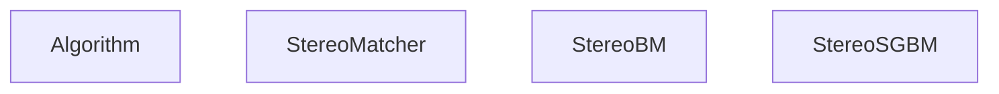
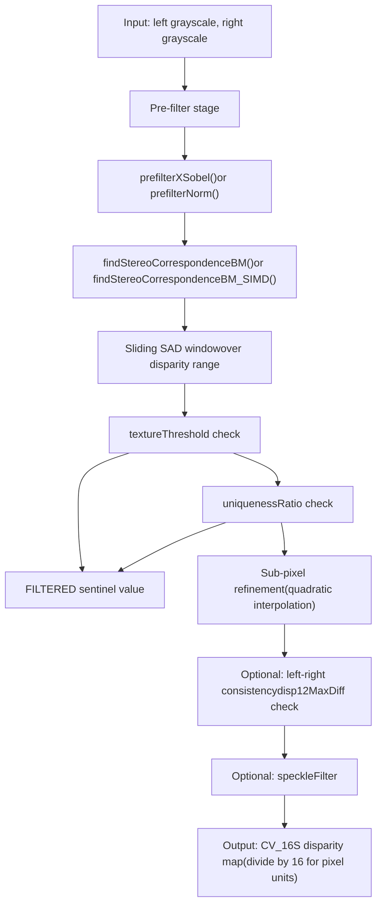
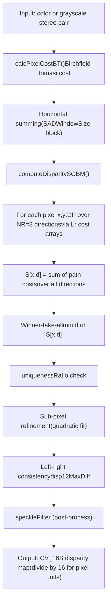
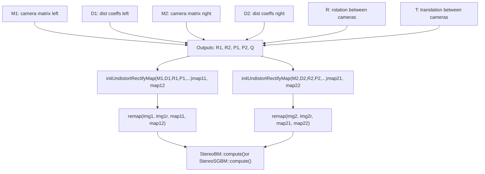
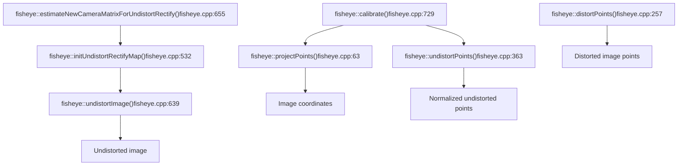
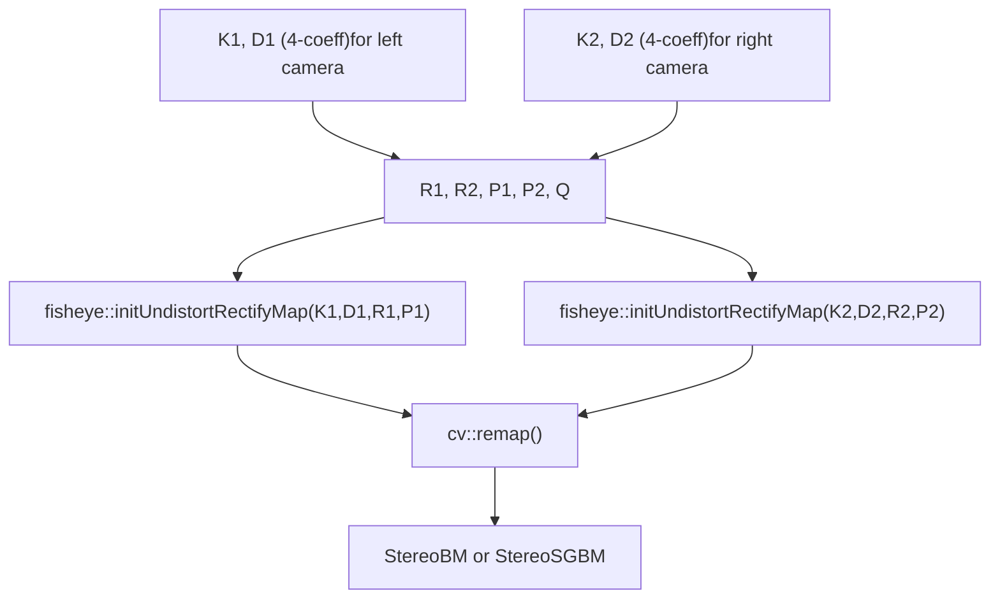

# Stereo Vision and Fisheye Camera Model

Relevant source files

-   [modules/calib3d/misc/objc/gen\_dict.json](https://github.com/opencv/opencv/blob/91c78f50/modules/calib3d/misc/objc/gen_dict.json)
-   [modules/calib3d/perf/opencl/perf\_stereobm.cpp](https://github.com/opencv/opencv/blob/91c78f50/modules/calib3d/perf/opencl/perf_stereobm.cpp)
-   [modules/calib3d/perf/perf\_undistort.cpp](https://github.com/opencv/opencv/blob/91c78f50/modules/calib3d/perf/perf_undistort.cpp)
-   [modules/calib3d/src/fisheye.cpp](https://github.com/opencv/opencv/blob/91c78f50/modules/calib3d/src/fisheye.cpp)
-   [modules/calib3d/src/fisheye.hpp](https://github.com/opencv/opencv/blob/91c78f50/modules/calib3d/src/fisheye.hpp)
-   [modules/calib3d/src/opencl/stereobm.cl](https://github.com/opencv/opencv/blob/91c78f50/modules/calib3d/src/opencl/stereobm.cl)
-   [modules/calib3d/src/stereobm.cpp](https://github.com/opencv/opencv/blob/91c78f50/modules/calib3d/src/stereobm.cpp)
-   [modules/calib3d/src/stereosgbm.cpp](https://github.com/opencv/opencv/blob/91c78f50/modules/calib3d/src/stereosgbm.cpp)
-   [modules/calib3d/src/undistort.dispatch.cpp](https://github.com/opencv/opencv/blob/91c78f50/modules/calib3d/src/undistort.dispatch.cpp)
-   [modules/calib3d/test/opencl/test\_stereobm.cpp](https://github.com/opencv/opencv/blob/91c78f50/modules/calib3d/test/opencl/test_stereobm.cpp)
-   [modules/calib3d/test/test\_fisheye.cpp](https://github.com/opencv/opencv/blob/91c78f50/modules/calib3d/test/test_fisheye.cpp)
-   [modules/calib3d/test/test\_stereomatching.cpp](https://github.com/opencv/opencv/blob/91c78f50/modules/calib3d/test/test_stereomatching.cpp)
-   [modules/calib3d/test/test\_undistort.cpp](https://github.com/opencv/opencv/blob/91c78f50/modules/calib3d/test/test_undistort.cpp)
-   [modules/calib3d/test/test\_undistort\_points.cpp](https://github.com/opencv/opencv/blob/91c78f50/modules/calib3d/test/test_undistort_points.cpp)
-   [modules/core/misc/objc/common/Float6.mm](https://github.com/opencv/opencv/blob/91c78f50/modules/core/misc/objc/common/Float6.mm)
-   [modules/core/misc/objc/common/Point3d.h](https://github.com/opencv/opencv/blob/91c78f50/modules/core/misc/objc/common/Point3d.h)
-   [modules/core/misc/objc/common/Point3d.mm](https://github.com/opencv/opencv/blob/91c78f50/modules/core/misc/objc/common/Point3d.mm)
-   [modules/core/misc/objc/common/Point3f.h](https://github.com/opencv/opencv/blob/91c78f50/modules/core/misc/objc/common/Point3f.h)
-   [modules/core/misc/objc/common/Point3f.mm](https://github.com/opencv/opencv/blob/91c78f50/modules/core/misc/objc/common/Point3f.mm)
-   [modules/core/misc/objc/common/Point3i.h](https://github.com/opencv/opencv/blob/91c78f50/modules/core/misc/objc/common/Point3i.h)
-   [modules/core/misc/objc/common/Point3i.mm](https://github.com/opencv/opencv/blob/91c78f50/modules/core/misc/objc/common/Point3i.mm)
-   [modules/core/test/test\_ptr.cpp](https://github.com/opencv/opencv/blob/91c78f50/modules/core/test/test_ptr.cpp)
-   [modules/features2d/misc/objc/gen\_dict.json](https://github.com/opencv/opencv/blob/91c78f50/modules/features2d/misc/objc/gen_dict.json)
-   [modules/imgproc/src/corner.cpp](https://github.com/opencv/opencv/blob/91c78f50/modules/imgproc/src/corner.cpp)
-   [samples/cpp/stereo\_match.cpp](https://github.com/opencv/opencv/blob/91c78f50/samples/cpp/stereo_match.cpp)

This page documents two distinct subsystems within OpenCV's `calib3d` module: **stereo disparity estimation** using `StereoBM` and `StereoSGBM`, and the **fisheye camera model** with its dedicated calibration, projection, and undistortion API. It also covers the stereo rectification workflow that bridges both areas.

For the underlying pinhole camera model and distortion coefficient conventions used in standard calibration, see [Camera Models and Calibration Algorithms](/opencv/opencv/8.1-camera-models-and-calibration-algorithms). For `solvePnP` and homography estimation, see [Pose Estimation and Geometric Transforms](/opencv/opencv/8.2-pose-estimation-(solvepnp)-and-geometric-transforms).

---

## Stereo Vision Overview

Stereo vision infers depth by measuring pixel displacement (disparity) between a pair of rectified images. OpenCV provides two concrete stereo matchers:

| Class | Algorithm | Cost Metric | Multi-pass DP | OpenCL |
| --- | --- | --- | --- | --- |
| `StereoBM` | Block matching (SAD) | Sum of Absolute Differences | No | Yes |
| `StereoSGBM` | Semi-global block matching | Birchfield-Tomasi | Yes (4 or 8 directions) | No |

Both derive from `StereoMatcher`, which inherits from `Algorithm`. The `compute()` virtual method produces a disparity map. Output disparity values are stored in fixed-point format: divide by **16.0** to obtain pixel-unit disparities (`DISP_SHIFT = 4`, `DISP_SCALE = 16`).

**Stereo Matching Class Hierarchy**


Sources: [modules/calib3d/src/stereobm.cpp59-103](https://github.com/opencv/opencv/blob/91c78f50/modules/calib3d/src/stereobm.cpp#L59-L103) [modules/calib3d/src/stereosgbm.cpp70-124](https://github.com/opencv/opencv/blob/91c78f50/modules/calib3d/src/stereosgbm.cpp#L70-L124)

---

## StereoBM

`StereoBM` is a fast SAD-based stereo matcher originally contributed by Kurt Konolige. It is implemented in [modules/calib3d/src/stereobm.cpp](https://github.com/opencv/opencv/blob/91c78f50/modules/calib3d/src/stereobm.cpp)

### Internal Parameter Structure

`StereoBMParams` holds all algorithm state:

| Field | Default | Description |
| --- | --- | --- |
| `preFilterType` | `PREFILTER_XSOBEL` | `PREFILTER_XSOBEL` or `PREFILTER_NORMALIZED_RESPONSE` |
| `preFilterSize` | 9 | Window size for normalized-response filter |
| `preFilterCap` | 31 | Clamps prefilter output to `[-cap, cap]` |
| `SADWindowSize` | 21 | Matching block size (must be odd) |
| `minDisparity` | 0 | Minimum expected disparity |
| `numDisparities` | 64 | Search range (must be divisible by 16) |
| `textureThreshold` | 10 | Filters pixels in flat regions |
| `uniquenessRatio` | 15 | Rejects match unless it is this % better than runner-up |
| `speckleWindowSize` | 0 | Window for speckle post-filter |
| `speckleRange` | 0 | Disparity range for speckle filter |
| `disp12MaxDiff` | \-1 | Max allowed difference in left-right consistency check |

Sources: [modules/calib3d/src/stereobm.cpp59-103](https://github.com/opencv/opencv/blob/91c78f50/modules/calib3d/src/stereobm.cpp#L59-L103)

### Processing Pipeline

**StereoBM Processing Pipeline**


Sources: [modules/calib3d/src/stereobm.cpp393-665](https://github.com/opencv/opencv/blob/91c78f50/modules/calib3d/src/stereobm.cpp#L393-L665) [modules/calib3d/src/stereobm.cpp668-1000](https://github.com/opencv/opencv/blob/91c78f50/modules/calib3d/src/stereobm.cpp#L668-L1000)

### Pre-Filters

Two CPU implementations are provided:

-   `prefilterNorm()` — normalized response via sliding window sum; computes a local-mean-subtracted, gain-normalized version of intensity.
-   `prefilterXSobel()` — horizontal Sobel gradient clamped to `[-preFilterCap, preFilterCap]` shifted to `[0, 2*preFilterCap]`.

The condition `preFilterCap <= 31 && SADWindowSize <= 21` (via `useShorts()`) enables a SIMD fast path using 16-bit intermediate accumulators instead of 32-bit (`findStereoCorrespondenceBM_SIMD`).

OpenCL kernels `prefilter_norm` and `prefilter_xsobel` are compiled from [modules/calib3d/src/opencl/stereobm.cl](https://github.com/opencv/opencv/blob/91c78f50/modules/calib3d/src/opencl/stereobm.cl) and invoked via `ocl_prefilter_norm()` / `ocl_prefilter_xsobel()`.

Sources: [modules/calib3d/src/stereobm.cpp106-290](https://github.com/opencv/opencv/blob/91c78f50/modules/calib3d/src/stereobm.cpp#L106-L290) [modules/calib3d/src/opencl/stereobm.cl55-250](https://github.com/opencv/opencv/blob/91c78f50/modules/calib3d/src/opencl/stereobm.cl#L55-L250)

### Buffer Management

`BufferBM` pre-allocates all working memory via `utils::BufferArea` to avoid repeated heap allocation. It holds per-stripe arrays for `hsad` (horizontal SAD accumulators), `htext` (texture sums), and `cbuf0` (column-wise cost ring buffer). When `useShorts()` is true, `sad_short` and `hsad_short` are used instead of their `int` counterparts.

Sources: [modules/calib3d/src/stereobm.cpp328-391](https://github.com/opencv/opencv/blob/91c78f50/modules/calib3d/src/stereobm.cpp#L328-L391)

---

## StereoSGBM

`StereoSGBM` implements Hirschmuller's Semi-Global Matching algorithm with block (rather than pixel) cost volumes. It is implemented in [modules/calib3d/src/stereosgbm.cpp](https://github.com/opencv/opencv/blob/91c78f50/modules/calib3d/src/stereosgbm.cpp)

### Mode Flags

| Mode | `isFullDP()` | Directions | Notes |
| --- | --- | --- | --- |
| `MODE_SGBM` | false | 5 (approx.) | Single pass |
| `MODE_HH` | true | 8 | Full DP, 2 passes |
| `MODE_HH4` | true | 4 | Reduced directions |
| `MODE_SGBM_3WAY` | false | 3-way | Internal variant |

### StereoSGBM Processing Pipeline

**StereoSGBM Processing Pipeline**


Sources: [modules/calib3d/src/stereosgbm.cpp490-550](https://github.com/opencv/opencv/blob/91c78f50/modules/calib3d/src/stereosgbm.cpp#L490-L550)

### Path Cost Accumulation

The dynamic programming accumulates path costs `Lr` in `NR=8` directions. The penalty structure for neighboring disparity transitions is:

-   Same disparity `d`: cost `Lr(p-r, d)`
-   Adjacent disparity `d±1`: cost `Lr(p-r, d±1) + P1`
-   Any other disparity: cost `min_k Lr(p-r, k) + P2`

P1 and P2 are user-specified. A common starting point is `P1 = 8 * cn * wsz * wsz` and `P2 = 32 * cn * wsz * wsz` (as seen in [samples/cpp/stereo\_match.cpp233-234](https://github.com/opencv/opencv/blob/91c78f50/samples/cpp/stereo_match.cpp#L233-L234)).

`BufferSGBM` manages all scratch memory including `Cbuf`, `Sbuf`, `Lr`, `minLr`, and `hsumBuf`.

Sources: [modules/calib3d/src/stereosgbm.cpp311-468](https://github.com/opencv/opencv/blob/91c78f50/modules/calib3d/src/stereosgbm.cpp#L311-L468) [modules/calib3d/src/stereosgbm.cpp490-530](https://github.com/opencv/opencv/blob/91c78f50/modules/calib3d/src/stereosgbm.cpp#L490-L530)

---

## Stereo Rectification

Before computing disparity, images from a calibrated stereo rig must be rectified so that corresponding points lie on the same horizontal scanline.

### Rectification Workflow

**Stereo Rectification Workflow (Code Entities)**


Sources: [samples/cpp/stereo\_match.cpp199-210](https://github.com/opencv/opencv/blob/91c78f50/samples/cpp/stereo_match.cpp#L199-L210) [modules/calib3d/src/undistort.dispatch.cpp86-200](https://github.com/opencv/opencv/blob/91c78f50/modules/calib3d/src/undistort.dispatch.cpp#L86-L200)

The matrix `Q` output by `stereoRectify` is the reprojection matrix. It allows converting disparity maps to 3D point clouds via `reprojectImageTo3D(disp, xyz, Q)`.

---

## Fisheye Camera Model

The `cv::fisheye` namespace provides a separate camera model suited for wide-angle lenses with fields of view up to 180°. The standard pinhole distortion model (used by `calibrateCamera`) does not accurately model the projection geometry of fisheye lenses.

### Mathematical Model

A 3D point `X = (X, Y, Z)` is projected using the equidistant (or equiangular) model:

1.  Project to normalized plane: `x = X/Z`, `y = Y/Z`
2.  Compute radius: `r = sqrt(x² + y²)`
3.  Incidence angle: `θ = atan(r)`
4.  Apply polynomial distortion:

```
θ_d = θ · (1 + k₁θ² + k₂θ⁴ + k₃θ⁶ + k₄θ⁸)
```
5.  Scale: `x_d = (θ_d / r) · x`, `y_d = (θ_d / r) · y`
6.  Apply camera intrinsics: `u = fx · x_d + cx`, `v = fy · y_d + cy`

The distortion vector `D` holds exactly **4** coefficients `[k1, k2, k3, k4]`. The camera matrix `K` is the standard 3×3 form with optional skew `alpha`.

Sources: [modules/calib3d/src/fisheye.cpp126-156](https://github.com/opencv/opencv/blob/91c78f50/modules/calib3d/src/fisheye.cpp#L126-L156) [modules/calib3d/src/fisheye.cpp294-315](https://github.com/opencv/opencv/blob/91c78f50/modules/calib3d/src/fisheye.cpp#L294-L315)

### Comparison: Pinhole vs. Fisheye Distortion

| Aspect | Pinhole (`calibrateCamera`) | Fisheye (`fisheye::calibrate`) |
| --- | --- | --- |
| Projection | Perspective | Equidistant |
| Distortion coefficients | Up to 14 (k1–k6, p1, p2, s1–s4, τx, τy) | Exactly 4 (k1–k4) |
| FOV range | Typically < 120° | Up to ~180° |
| Undistort API | `undistortPoints`, `initUndistortRectifyMap` | `fisheye::undistortPoints`, `fisheye::initUndistortRectifyMap` |

### API Call Map

**Fisheye API Functions and Their Roles**


Sources: [modules/calib3d/src/fisheye.cpp63-723](https://github.com/opencv/opencv/blob/91c78f50/modules/calib3d/src/fisheye.cpp#L63-L723)

### `fisheye::undistortPoints`

Inversion of the distortion is done iteratively. Given an observed image point, the normalized distorted radius `θ_d` is computed, then Newton's method solves for `θ`:

```
f(θ) = θ(1 + k₁θ² + k₂θ⁴ + k₃θ⁶ + k₄θ⁸) − θ_d = 0
f'(θ) = 1 + 3k₁θ² + 5k₂θ⁴ + 7k₃θ⁶ + 9k₄θ⁸
θ ← θ − f(θ)/f'(θ)
```
The function accepts a `TermCriteria` to control iteration count and epsilon convergence. The model is valid for `θ ∈ (−π/2, π/2)`, so `θ_d` is clamped to this range before inversion. Non-converged or sign-flipped solutions produce the sentinel `(-1000000, -1000000)`.

Sources: [modules/calib3d/src/fisheye.cpp363-527](https://github.com/opencv/opencv/blob/91c78f50/modules/calib3d/src/fisheye.cpp#L363-L527)

### `fisheye::initUndistortRectifyMap`

Generates pixel-level remap arrays (`map1`, `map2`) to be consumed by `cv::remap`. For each destination pixel `(j, i)`, it computes the corresponding source location in the distorted fisheye image by:

1.  Applying the inverse of `(P · R)` to the destination pixel.
2.  Computing `r` and `θ = atan(r)`.
3.  Applying the forward distortion polynomial.
4.  Projecting with `K` to get the source pixel.

Supported `m1type` values are `CV_16SC2` (integer + subpixel offset) and `CV_32F`.

Sources: [modules/calib3d/src/fisheye.cpp532-634](https://github.com/opencv/opencv/blob/91c78f50/modules/calib3d/src/fisheye.cpp#L532-L634)

### `fisheye::calibrate`

Accepts a set of corresponding 3D object points and 2D image points (from chessboard detection) and returns optimized `K` and `D` using Levenberg-Marquardt minimization. The internal `IntrinsicParams` struct (from [modules/calib3d/src/fisheye.hpp](https://github.com/opencv/opencv/blob/91c78f50/modules/calib3d/src/fisheye.hpp)) holds focal lengths, principal point, distortion coefficients, and skew:

```
IntrinsicParams {
    Vec2d f;    // focal lengths
    Vec2d c;    // principal point
    Vec4d k;    // distortion [k1,k2,k3,k4]
    double alpha; // skew
}
```
Calibration flags mirror those of `calibrateCamera`: `CALIB_FIX_FOCAL_LENGTH`, `CALIB_FIX_PRINCIPAL_POINT`, `CALIB_FIX_SKEW`, `CALIB_FIX_K1`–`CALIB_FIX_K4`, `CALIB_RECOMPUTE_EXTRINSIC`, `CALIB_CHECK_COND`, `CALIB_USE_INTRINSIC_GUESS`.

Sources: [modules/calib3d/src/fisheye.cpp729-820](https://github.com/opencv/opencv/blob/91c78f50/modules/calib3d/src/fisheye.cpp#L729-L820) [modules/calib3d/src/fisheye.hpp6-50](https://github.com/opencv/opencv/blob/91c78f50/modules/calib3d/src/fisheye.hpp#L6-L50)

### `fisheye::estimateNewCameraMatrixForUndistortRectify`

Computes a new pinhole-like camera matrix `P` for the undistorted output. It undistorts four edge midpoints, finds the bounding box of the result, then balances between:

-   `balance = 0`: crop to valid region only (no black borders, smaller FOV)
-   `balance = 1`: include all source pixels (black borders visible, full FOV)

The `fov_scale` parameter additionally scales the output focal length.

Sources: [modules/calib3d/src/fisheye.cpp655-723](https://github.com/opencv/opencv/blob/91c78f50/modules/calib3d/src/fisheye.cpp#L655-L723)

---

## Fisheye Stereo Rectification

For stereo rigs with fisheye cameras, the rectification workflow replaces the standard `initUndistortRectifyMap` with `fisheye::initUndistortRectifyMap`, passing the rectification rotation `R1`/`R2` and projection matrices `P1`/`P2` obtained from `stereoRectify`.

**Fisheye Stereo Rectification Workflow**


Sources: [modules/calib3d/src/fisheye.cpp532-648](https://github.com/opencv/opencv/blob/91c78f50/modules/calib3d/src/fisheye.cpp#L532-L648) [samples/cpp/stereo\_match.cpp169-210](https://github.com/opencv/opencv/blob/91c78f50/samples/cpp/stereo_match.cpp#L169-L210)

---

## Disparity Map Output Format

Both `StereoBM` and `StereoSGBM` output disparity maps with values scaled by 16 (fixed-point, 4 fractional bits). Pixels where no match was found receive the sentinel value `(minDisparity - 1) << DISP_SHIFT`.

| Operation | Code |
| --- | --- |
| Convert to float disparity | `disp.convertTo(dispF, CV_32F, 1.0/16.0)` |
| Convert to 8-bit for display | `disp.convertTo(disp8, CV_8U, 255.0/(numDisp*16.0))` |

Filtered/invalid pixels are set to the value `FILTERED = (minDisparity - 1) << 4` and can be identified after conversion by checking for values less than `minDisparity`.

Sources: [modules/calib3d/src/stereobm.cpp293-325](https://github.com/opencv/opencv/blob/91c78f50/modules/calib3d/src/stereobm.cpp#L293-L325) [modules/calib3d/src/stereosgbm.cpp493-508](https://github.com/opencv/opencv/blob/91c78f50/modules/calib3d/src/stereosgbm.cpp#L493-L508) [samples/cpp/stereo\_match.cpp256-276](https://github.com/opencv/opencv/blob/91c78f50/samples/cpp/stereo_match.cpp#L256-L276)

---

## Testing

| Test File | Coverage |
| --- | --- |
| [modules/calib3d/test/test\_fisheye.cpp](https://github.com/opencv/opencv/blob/91c78f50/modules/calib3d/test/test_fisheye.cpp) | `projectPoints`, `distortPoints`, `undistortPoints`, `undistortImage`, `calibrate`, `solvePnP`, Jacobian accuracy |
| [modules/calib3d/test/test\_stereomatching.cpp](https://github.com/opencv/opencv/blob/91c78f50/modules/calib3d/test/test_stereomatching.cpp) | StereoBM/SGBM quality metrics: RMS error, bad pixel fraction, occlusion masks, depth discontinuity masks |
| [modules/calib3d/test/opencl/test\_stereobm.cpp](https://github.com/opencv/opencv/blob/91c78f50/modules/calib3d/test/opencl/test_stereobm.cpp) | OCL vs CPU StereoBM result comparison |
| [modules/calib3d/perf/opencl/perf\_stereobm.cpp](https://github.com/opencv/opencv/blob/91c78f50/modules/calib3d/perf/opencl/perf_stereobm.cpp) | Performance benchmarks for OCL StereoBM |
