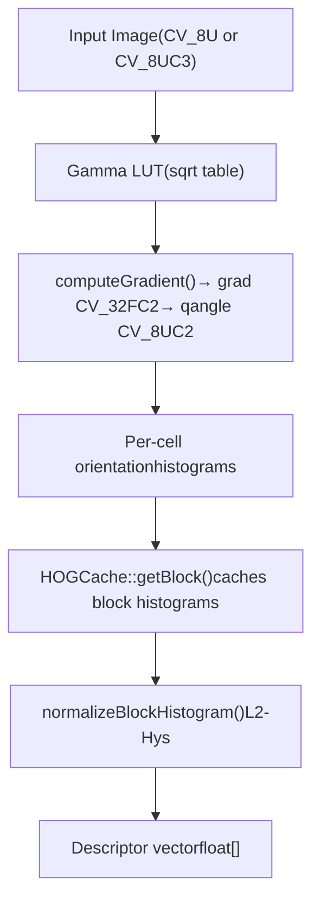
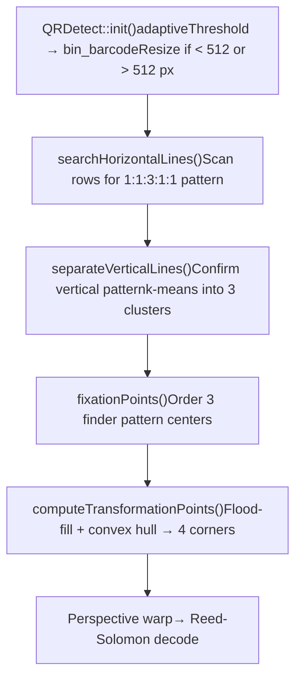
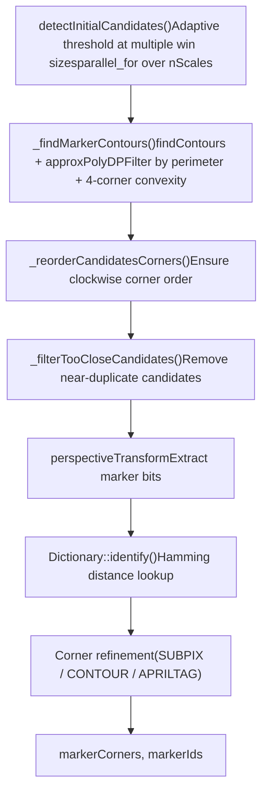

# Object Detection (objdetect)

Relevant source files

-   [3rdparty/quirc/LICENSE](https://github.com/opencv/opencv/blob/91c78f50/3rdparty/quirc/LICENSE)
-   [3rdparty/quirc/include/quirc.h](https://github.com/opencv/opencv/blob/91c78f50/3rdparty/quirc/include/quirc.h)
-   [3rdparty/quirc/include/quirc\_internal.h](https://github.com/opencv/opencv/blob/91c78f50/3rdparty/quirc/include/quirc_internal.h)
-   [3rdparty/quirc/src/decode.c](https://github.com/opencv/opencv/blob/91c78f50/3rdparty/quirc/src/decode.c)
-   [3rdparty/quirc/src/quirc.c](https://github.com/opencv/opencv/blob/91c78f50/3rdparty/quirc/src/quirc.c)
-   [3rdparty/quirc/src/version\_db.c](https://github.com/opencv/opencv/blob/91c78f50/3rdparty/quirc/src/version_db.c)
-   [cmake/checks/framebuffer.cpp](https://github.com/opencv/opencv/blob/91c78f50/cmake/checks/framebuffer.cpp)
-   [modules/calib3d/test/test\_affine3d\_estimator.cpp](https://github.com/opencv/opencv/blob/91c78f50/modules/calib3d/test/test_affine3d_estimator.cpp)
-   [modules/core/include/opencv2/core/cuda/functional.hpp](https://github.com/opencv/opencv/blob/91c78f50/modules/core/include/opencv2/core/cuda/functional.hpp)
-   [modules/dnn/src/op\_timvx.cpp](https://github.com/opencv/opencv/blob/91c78f50/modules/dnn/src/op_timvx.cpp)
-   [modules/dnn/src/vkcom/src/op\_matmul.cpp](https://github.com/opencv/opencv/blob/91c78f50/modules/dnn/src/vkcom/src/op_matmul.cpp)
-   [modules/gapi/src/streaming/onevpl/utils.cpp](https://github.com/opencv/opencv/blob/91c78f50/modules/gapi/src/streaming/onevpl/utils.cpp)
-   [modules/highgui/cmake/detect\_framebuffer.cmake](https://github.com/opencv/opencv/blob/91c78f50/modules/highgui/cmake/detect_framebuffer.cmake)
-   [modules/highgui/src/window\_framebuffer.cpp](https://github.com/opencv/opencv/blob/91c78f50/modules/highgui/src/window_framebuffer.cpp)
-   [modules/highgui/src/window\_framebuffer.hpp](https://github.com/opencv/opencv/blob/91c78f50/modules/highgui/src/window_framebuffer.hpp)
-   [modules/imgproc/src/generalized\_hough.cpp](https://github.com/opencv/opencv/blob/91c78f50/modules/imgproc/src/generalized_hough.cpp)
-   [modules/objdetect/include/opencv2/objdetect.hpp](https://github.com/opencv/opencv/blob/91c78f50/modules/objdetect/include/opencv2/objdetect.hpp)
-   [modules/objdetect/include/opencv2/objdetect/aruco\_board.hpp](https://github.com/opencv/opencv/blob/91c78f50/modules/objdetect/include/opencv2/objdetect/aruco_board.hpp)
-   [modules/objdetect/include/opencv2/objdetect/aruco\_detector.hpp](https://github.com/opencv/opencv/blob/91c78f50/modules/objdetect/include/opencv2/objdetect/aruco_detector.hpp)
-   [modules/objdetect/include/opencv2/objdetect/aruco\_dictionary.hpp](https://github.com/opencv/opencv/blob/91c78f50/modules/objdetect/include/opencv2/objdetect/aruco_dictionary.hpp)
-   [modules/objdetect/include/opencv2/objdetect/charuco\_detector.hpp](https://github.com/opencv/opencv/blob/91c78f50/modules/objdetect/include/opencv2/objdetect/charuco_detector.hpp)
-   [modules/objdetect/include/opencv2/objdetect/graphical\_code\_detector.hpp](https://github.com/opencv/opencv/blob/91c78f50/modules/objdetect/include/opencv2/objdetect/graphical_code_detector.hpp)
-   [modules/objdetect/include/opencv2/objdetect/objdetect.hpp](https://github.com/opencv/opencv/blob/91c78f50/modules/objdetect/include/opencv2/objdetect/objdetect.hpp)
-   [modules/objdetect/misc/java/filelist\_common](https://github.com/opencv/opencv/blob/91c78f50/modules/objdetect/misc/java/filelist_common)
-   [modules/objdetect/misc/java/gen\_dict.json](https://github.com/opencv/opencv/blob/91c78f50/modules/objdetect/misc/java/gen_dict.json)
-   [modules/objdetect/misc/java/src/cpp/objdetect\_converters.cpp](https://github.com/opencv/opencv/blob/91c78f50/modules/objdetect/misc/java/src/cpp/objdetect_converters.cpp)
-   [modules/objdetect/misc/java/src/cpp/objdetect\_converters.hpp](https://github.com/opencv/opencv/blob/91c78f50/modules/objdetect/misc/java/src/cpp/objdetect_converters.hpp)
-   [modules/objdetect/misc/java/test/ArucoTest.java](https://github.com/opencv/opencv/blob/91c78f50/modules/objdetect/misc/java/test/ArucoTest.java)
-   [modules/objdetect/misc/java/test/QRCodeDetectorTest.java](https://github.com/opencv/opencv/blob/91c78f50/modules/objdetect/misc/java/test/QRCodeDetectorTest.java)
-   [modules/objdetect/misc/objc/gen\_dict.json](https://github.com/opencv/opencv/blob/91c78f50/modules/objdetect/misc/objc/gen_dict.json)
-   [modules/objdetect/misc/python/pyopencv\_objdetect.hpp](https://github.com/opencv/opencv/blob/91c78f50/modules/objdetect/misc/python/pyopencv_objdetect.hpp)
-   [modules/objdetect/misc/python/test/test\_objdetect\_aruco.py](https://github.com/opencv/opencv/blob/91c78f50/modules/objdetect/misc/python/test/test_objdetect_aruco.py)
-   [modules/objdetect/misc/python/test/test\_qrcode\_detect.py](https://github.com/opencv/opencv/blob/91c78f50/modules/objdetect/misc/python/test/test_qrcode_detect.py)
-   [modules/objdetect/perf/opencl/perf\_cascades.cpp](https://github.com/opencv/opencv/blob/91c78f50/modules/objdetect/perf/opencl/perf_cascades.cpp)
-   [modules/objdetect/perf/opencl/perf\_hogdetect.cpp](https://github.com/opencv/opencv/blob/91c78f50/modules/objdetect/perf/opencl/perf_hogdetect.cpp)
-   [modules/objdetect/perf/perf\_aruco.cpp](https://github.com/opencv/opencv/blob/91c78f50/modules/objdetect/perf/perf_aruco.cpp)
-   [modules/objdetect/perf/perf\_qrcode\_pipeline.cpp](https://github.com/opencv/opencv/blob/91c78f50/modules/objdetect/perf/perf_qrcode_pipeline.cpp)
-   [modules/objdetect/src/aruco/aruco\_board.cpp](https://github.com/opencv/opencv/blob/91c78f50/modules/objdetect/src/aruco/aruco_board.cpp)
-   [modules/objdetect/src/aruco/aruco\_detector.cpp](https://github.com/opencv/opencv/blob/91c78f50/modules/objdetect/src/aruco/aruco_detector.cpp)
-   [modules/objdetect/src/aruco/aruco\_dictionary.cpp](https://github.com/opencv/opencv/blob/91c78f50/modules/objdetect/src/aruco/aruco_dictionary.cpp)
-   [modules/objdetect/src/aruco/aruco\_utils.cpp](https://github.com/opencv/opencv/blob/91c78f50/modules/objdetect/src/aruco/aruco_utils.cpp)
-   [modules/objdetect/src/aruco/aruco\_utils.hpp](https://github.com/opencv/opencv/blob/91c78f50/modules/objdetect/src/aruco/aruco_utils.hpp)
-   [modules/objdetect/src/aruco/charuco\_detector.cpp](https://github.com/opencv/opencv/blob/91c78f50/modules/objdetect/src/aruco/charuco_detector.cpp)
-   [modules/objdetect/src/aruco/predefined\_dictionaries.hpp](https://github.com/opencv/opencv/blob/91c78f50/modules/objdetect/src/aruco/predefined_dictionaries.hpp)
-   [modules/objdetect/src/cascadedetect.cpp](https://github.com/opencv/opencv/blob/91c78f50/modules/objdetect/src/cascadedetect.cpp)
-   [modules/objdetect/src/cascadedetect.hpp](https://github.com/opencv/opencv/blob/91c78f50/modules/objdetect/src/cascadedetect.hpp)
-   [modules/objdetect/src/graphical\_code\_detector.cpp](https://github.com/opencv/opencv/blob/91c78f50/modules/objdetect/src/graphical_code_detector.cpp)
-   [modules/objdetect/src/graphical\_code\_detector\_impl.hpp](https://github.com/opencv/opencv/blob/91c78f50/modules/objdetect/src/graphical_code_detector_impl.hpp)
-   [modules/objdetect/src/hog.cpp](https://github.com/opencv/opencv/blob/91c78f50/modules/objdetect/src/hog.cpp)
-   [modules/objdetect/src/opencl/cascadedetect.cl](https://github.com/opencv/opencv/blob/91c78f50/modules/objdetect/src/opencl/cascadedetect.cl)
-   [modules/objdetect/src/opencl/objdetect\_hog.cl](https://github.com/opencv/opencv/blob/91c78f50/modules/objdetect/src/opencl/objdetect_hog.cl)
-   [modules/objdetect/src/qrcode.cpp](https://github.com/opencv/opencv/blob/91c78f50/modules/objdetect/src/qrcode.cpp)
-   [modules/objdetect/src/qrcode\_encoder.cpp](https://github.com/opencv/opencv/blob/91c78f50/modules/objdetect/src/qrcode_encoder.cpp)
-   [modules/objdetect/src/qrcode\_encoder\_table.inl.hpp](https://github.com/opencv/opencv/blob/91c78f50/modules/objdetect/src/qrcode_encoder_table.inl.hpp)
-   [modules/objdetect/test/opencl/test\_hogdetector.cpp](https://github.com/opencv/opencv/blob/91c78f50/modules/objdetect/test/opencl/test_hogdetector.cpp)
-   [modules/objdetect/test/test\_aruco\_tutorial.cpp](https://github.com/opencv/opencv/blob/91c78f50/modules/objdetect/test/test_aruco_tutorial.cpp)
-   [modules/objdetect/test/test\_aruco\_utils.cpp](https://github.com/opencv/opencv/blob/91c78f50/modules/objdetect/test/test_aruco_utils.cpp)
-   [modules/objdetect/test/test\_aruco\_utils.hpp](https://github.com/opencv/opencv/blob/91c78f50/modules/objdetect/test/test_aruco_utils.hpp)
-   [modules/objdetect/test/test\_arucodetection.cpp](https://github.com/opencv/opencv/blob/91c78f50/modules/objdetect/test/test_arucodetection.cpp)
-   [modules/objdetect/test/test\_boarddetection.cpp](https://github.com/opencv/opencv/blob/91c78f50/modules/objdetect/test/test_boarddetection.cpp)
-   [modules/objdetect/test/test\_cascadeandhog.cpp](https://github.com/opencv/opencv/blob/91c78f50/modules/objdetect/test/test_cascadeandhog.cpp)
-   [modules/objdetect/test/test\_charucodetection.cpp](https://github.com/opencv/opencv/blob/91c78f50/modules/objdetect/test/test_charucodetection.cpp)
-   [modules/objdetect/test/test\_qr\_utils.hpp](https://github.com/opencv/opencv/blob/91c78f50/modules/objdetect/test/test_qr_utils.hpp)
-   [modules/objdetect/test/test\_qrcode.cpp](https://github.com/opencv/opencv/blob/91c78f50/modules/objdetect/test/test_qrcode.cpp)
-   [modules/objdetect/test/test\_qrcode\_encode.cpp](https://github.com/opencv/opencv/blob/91c78f50/modules/objdetect/test/test_qrcode_encode.cpp)
-   [modules/ts/include/opencv2/ts/cuda\_test.hpp](https://github.com/opencv/opencv/blob/91c78f50/modules/ts/include/opencv2/ts/cuda_test.hpp)
-   [modules/ts/src/cuda\_test.cpp](https://github.com/opencv/opencv/blob/91c78f50/modules/ts/src/cuda_test.cpp)
-   [samples/cpp/qrcode.cpp](https://github.com/opencv/opencv/blob/91c78f50/samples/cpp/qrcode.cpp)

The `opencv_objdetect` module provides algorithms for detecting objects, graphical codes, and fiducial markers in images. This page covers the high-level architecture and code organization of the module's four major subsystems: cascade classifiers, HOG-based detection, QR code detection/encoding, and ArUco marker detection.

For deeper coverage of each subsystem, see:

-   [Cascade Classifiers and Haar Features](/opencv/opencv/9.1-cascade-classifiers-and-haar-features)
-   [HOG Descriptor and SVM Detection](/opencv/opencv/9.2-hog-descriptor-and-svm-detection)
-   [QR Code and ArUco Marker Detection](/opencv/opencv/9.3-qr-code-and-aruco-marker-detection)

For GPU-accelerated cascade detection, see [GPU-Accelerated Image Processing and Optical Flow](/opencv/opencv/14.2-gpu-accelerated-image-processing-and-optical-flow).

---

## Module Structure

The module is declared in [modules/objdetect/include/opencv2/objdetect.hpp](https://github.com/opencv/opencv/blob/91c78f50/modules/objdetect/include/opencv2/objdetect.hpp) and exposes four independent detection families under a shared namespace.

**Module layout overview:**

```
modules/objdetect/
├── include/opencv2/
│   ├── objdetect.hpp              # root public header
│   └── objdetect/
│       ├── aruco_detector.hpp
│       ├── aruco_board.hpp
│       ├── aruco_dictionary.hpp
│       ├── charuco_detector.hpp
│       └── graphical_code_detector.hpp
└── src/
    ├── cascadedetect.hpp          # internal cascade structures
    ├── cascadedetect.cpp
    ├── hog.cpp
    ├── qrcode.cpp
    ├── qrcode_encoder.cpp
    ├── aruco/
    │   ├── aruco_detector.cpp
    │   ├── aruco_board.cpp
    │   └── charuco_detector.cpp
    └── opencl/
        ├── cascadedetect.cl
        └── objdetect_hog.cl
```
Sources: [modules/objdetect/include/opencv2/objdetect.hpp](https://github.com/opencv/opencv/blob/91c78f50/modules/objdetect/include/opencv2/objdetect.hpp) [modules/objdetect/src/cascadedetect.cpp](https://github.com/opencv/opencv/blob/91c78f50/modules/objdetect/src/cascadedetect.cpp) [modules/objdetect/src/hog.cpp](https://github.com/opencv/opencv/blob/91c78f50/modules/objdetect/src/hog.cpp) [modules/objdetect/src/qrcode.cpp](https://github.com/opencv/opencv/blob/91c78f50/modules/objdetect/src/qrcode.cpp) [modules/objdetect/src/aruco/aruco\_detector.cpp](https://github.com/opencv/opencv/blob/91c78f50/modules/objdetect/src/aruco/aruco_detector.cpp)

---

## Public API Classes

The following table lists every major class exposed in the public API.

| Class | Header | Role |
| --- | --- | --- |
| `CascadeClassifier` | `objdetect.hpp` | Boosted cascade detector; wraps `BaseCascadeClassifier` |
| `BaseCascadeClassifier` | `objdetect.hpp` | Abstract base for cascade implementations |
| `HOGDescriptor` | `objdetect.hpp` | HOG feature extraction and linear SVM detection |
| `QRCodeDetector` | `graphical_code_detector.hpp` | QR code localization and Reed-Solomon decoding |
| `QRCodeDetectorAruco` | `objdetect.hpp` | ArUco-based alternative QR code detector |
| `QRCodeEncoder` | `objdetect.hpp` | QR code generation |
| `aruco::ArucoDetector` | `aruco_detector.hpp` | Square fiducial marker detection |
| `aruco::CharucoDetector` | `charuco_detector.hpp` | ChArUco chessboard + ArUco board detection |
| `aruco::Dictionary` | `aruco_dictionary.hpp` | Binary code set for marker identification |
| `aruco::Board` | `aruco_board.hpp` | Base class for multi-marker board layouts |
| `aruco::CharucoBoard` | `aruco_board.hpp` | Chessboard with embedded ArUco markers |
| `aruco::GridBoard` | `aruco_board.hpp` | Rectangular grid of ArUco markers |
| `aruco::DetectorParameters` | `aruco_detector.hpp` | Tuning parameters for `ArucoDetector` |
| `SimilarRects` | `objdetect.hpp` | Predicate for rectangle clustering in `partition()` |

Utility functions shared across detectors:

| Function | Purpose |
| --- | --- |
| `groupRectangles()` | Merges overlapping detection windows; uses `partition()` with `SimilarRects` |
| `groupRectangles_meanshift()` | Mean-shift based window merging (HOG-specific) |

Sources: [modules/objdetect/include/opencv2/objdetect.hpp145-365](https://github.com/opencv/opencv/blob/91c78f50/modules/objdetect/include/opencv2/objdetect.hpp#L145-L365) [modules/objdetect/include/opencv2/objdetect/aruco\_detector.hpp25-250](https://github.com/opencv/opencv/blob/91c78f50/modules/objdetect/include/opencv2/objdetect/aruco_detector.hpp#L25-L250)

---

## Subsystem Dependency Map

**Class hierarchy and key relationships across subsystems:**

Sources: [modules/objdetect/src/cascadedetect.hpp77-228](https://github.com/opencv/opencv/blob/91c78f50/modules/objdetect/src/cascadedetect.hpp#L77-L228) [modules/objdetect/src/hog.cpp589-640](https://github.com/opencv/opencv/blob/91c78f50/modules/objdetect/src/hog.cpp#L589-L640) [modules/objdetect/src/qrcode.cpp101-122](https://github.com/opencv/opencv/blob/91c78f50/modules/objdetect/src/qrcode.cpp#L101-L122) [modules/objdetect/src/aruco/aruco\_detector.cpp220-310](https://github.com/opencv/opencv/blob/91c78f50/modules/objdetect/src/aruco/aruco_detector.cpp#L220-L310) [modules/objdetect/src/aruco/charuco\_detector.cpp17-25](https://github.com/opencv/opencv/blob/91c78f50/modules/objdetect/src/aruco/charuco_detector.cpp#L17-L25)

---

## Cascade Classifier

### Architecture

`CascadeClassifier` is a thin public wrapper around `BaseCascadeClassifier`, which is implemented by `CascadeClassifierImpl` (defined in the internal header [modules/objdetect/src/cascadedetect.hpp](https://github.com/opencv/opencv/blob/91c78f50/modules/objdetect/src/cascadedetect.hpp)).

The `CascadeClassifierImpl` holds:

-   A `Data` struct containing the parsed cascade model: `stages`, `classifiers`, `nodes`, `leaves`, and `stumps`.
-   A `Ptr<FeatureEvaluator>` — either a `HaarEvaluator` or `LBPEvaluator`, selected at load time based on the model file.
-   A `Ptr<CvHaarClassifierCascade> oldCascade` for backward compatibility with legacy `.xml` models.

### Detection Flow

**`CascadeClassifierImpl::detectMultiScale` execution path:**

> **[Mermaid sequence]**
> *(图表结构无法解析)*

Sources: [modules/objdetect/src/cascadedetect.cpp63-393](https://github.com/opencv/opencv/blob/91c78f50/modules/objdetect/src/cascadedetect.cpp#L63-L393) [modules/objdetect/src/cascadedetect.hpp84-136](https://github.com/opencv/opencv/blob/91c78f50/modules/objdetect/src/cascadedetect.hpp#L84-L136)

### Feature Evaluators

Both `HaarEvaluator` and `LBPEvaluator` inherit from `FeatureEvaluator`:

| Method | Role |
| --- | --- |
| `setImage()` | Pre-computes integral images for all scales |
| `setWindow()` | Moves evaluation context to a specific (x, y, scale) window |
| `calcOrd()` | Returns a continuous (ordered) feature value — Haar |
| `calcCat()` | Returns a categorical feature value — LBP |
| `getUMats()` / `getMats()` | Syncs data between CPU (`sbuf`) and OpenCL (`usbuf`) |
| `computeChannels()` | Fills integral image buffer for a single scale |
| `computeOptFeatures()` | Pre-computes memory offsets for fast access during detection |

`FeatureEvaluator::create(int type)` is the factory — it creates a `HaarEvaluator` when `type == FeatureEvaluator::HAAR` and `LBPEvaluator` when `type == FeatureEvaluator::LBP`.

Sources: [modules/objdetect/src/cascadedetect.cpp396-914](https://github.com/opencv/opencv/blob/91c78f50/modules/objdetect/src/cascadedetect.cpp#L396-L914) [modules/objdetect/src/cascadedetect.hpp11-74](https://github.com/opencv/opencv/blob/91c78f50/modules/objdetect/src/cascadedetect.hpp#L11-L74)

### OpenCL Acceleration

When OpenCL is available and the device is AMD, Intel, or NVIDIA, `HaarEvaluator::read()` sets a non-zero `localSize` and `lbufSize`. This activates the OpenCL path in `ocl_detectMultiScaleNoGrouping()`, which dispatches the `runHaarClassifier` or `runLBPClassifier` kernel from [modules/objdetect/src/opencl/cascadedetect.cl](https://github.com/opencv/opencv/blob/91c78f50/modules/objdetect/src/opencl/cascadedetect.cl)

Classifier data (`ustages`, `unodes`, `uleaves`, `usubsets`) and feature offsets (`ufbuf`) are uploaded to the GPU once and reused for all detection calls.

Sources: [modules/objdetect/src/cascadedetect.cpp1102-1200](https://github.com/opencv/opencv/blob/91c78f50/modules/objdetect/src/cascadedetect.cpp#L1102-L1200) [modules/objdetect/src/opencl/cascadedetect.cl1-100](https://github.com/opencv/opencv/blob/91c78f50/modules/objdetect/src/opencl/cascadedetect.cl#L1-L100)

---

## HOG Descriptor

### Architecture

`HOGDescriptor` stores all parameters that define the descriptor geometry, plus the SVM weight vector in `svmDetector`.

**Key parameters and their defaults (64×128 pedestrian detector):**

| Parameter | Default | Meaning |
| --- | --- | --- |
| `winSize` | 64×128 | Detection window in pixels |
| `blockSize` | 16×16 | HOG block size |
| `blockStride` | 8×8 | Stride between blocks |
| `cellSize` | 8×8 | Cell size within a block |
| `nbins` | 9 | Number of orientation bins |
| `signedGradient` | false | Unsigned (0–180°) vs signed (0–360°) |
| `gammaCorrection` | true | Square-root pixel normalization |
| `L2HysThreshold` | 0.2 | Clipping threshold for L2-Hys normalization |

### Descriptor Computation


Sources: [modules/objdetect/src/hog.cpp237-587](https://github.com/opencv/opencv/blob/91c78f50/modules/objdetect/src/hog.cpp#L237-L587) [modules/objdetect/src/hog.cpp589-640](https://github.com/opencv/opencv/blob/91c78f50/modules/objdetect/src/hog.cpp#L589-L640)

### Detection

`setSVMDetector(InputArray)` loads the linear SVM weights. The pre-trained 64×128 pedestrian detector is returned by `HOGDescriptor::getDefaultPeopleDetector()`.

`detectMultiScale()` slides the window at multiple image scales. After collecting candidates, it optionally calls `groupRectangles_meanshift()` (when `useMeanshiftGrouping=true`) or `groupRectangles()`.

`HOGCache` is an internal helper ([modules/objdetect/src/hog.cpp589-640](https://github.com/opencv/opencv/blob/91c78f50/modules/objdetect/src/hog.cpp#L589-L640)) that stores computed block histograms and invalidates them row-by-row as the scan window moves down.

An OpenCL kernel in [modules/objdetect/src/opencl/objdetect\_hog.cl](https://github.com/opencv/opencv/blob/91c78f50/modules/objdetect/src/opencl/objdetect_hog.cl) accelerates the gradient computation and histogram accumulation on GPU.

Sources: [modules/objdetect/src/hog.cpp87-145](https://github.com/opencv/opencv/blob/91c78f50/modules/objdetect/src/hog.cpp#L87-L145) [modules/objdetect/src/hog.cpp117-144](https://github.com/opencv/opencv/blob/91c78f50/modules/objdetect/src/hog.cpp#L117-L144)

---

## QR Code Detection and Encoding

### QRCodeDetector

`QRCodeDetector` inherits from `GraphicalCodeDetector`. The primary public methods are:

| Method | Output |
| --- | --- |
| `detect(img, corners)` | 4 corner points of the QR code |
| `decode(img, corners, straightCode)` | Decoded string + rectified image |
| `detectAndDecode(img, corners, straightCode)` | Both in one call |
| `detectMulti(img, corners)` | Corners of all QR codes |
| `decodeMulti(img, corners, info, codes)` | Decoded strings for all |
| `detectAndDecodeCurved(img, corners, code)` | Handles barrel-distorted codes |

Internally, `QRDetect` (defined in [modules/objdetect/src/qrcode.cpp101-122](https://github.com/opencv/opencv/blob/91c78f50/modules/objdetect/src/qrcode.cpp#L101-L122)) performs detection in these stages:


Sources: [modules/objdetect/src/qrcode.cpp101-698](https://github.com/opencv/opencv/blob/91c78f50/modules/objdetect/src/qrcode.cpp#L101-L698)

### QRCodeEncoder

`QRCodeEncoder` encodes a string into a QR code image. Supported encoding modes map to `QRCodeEncoder::EncodeMode`:

| Mode | Constant | Character set |
| --- | --- | --- |
| Numeric | `MODE_NUMERIC` | 0–9 |
| Alphanumeric | `MODE_ALPHANUMERIC` | 0–9, A–Z, space, `$%*+-./:` |
| Byte | `MODE_BYTE` | ISO 8859-1 |
| ECI | `MODE_ECI` | Extended character sets |
| Kanji | `MODE_KANJI` | Shift-JIS |
| Structured append | `MODE_STRUCTURED_APPEND` | Multi-part QR codes |

Error correction uses Galois Field arithmetic over GF(256) with generators computed by `polyGenerator()` in [modules/objdetect/src/qrcode\_encoder.cpp111-120](https://github.com/opencv/opencv/blob/91c78f50/modules/objdetect/src/qrcode_encoder.cpp#L111-L120)

Sources: [modules/objdetect/src/qrcode\_encoder.cpp1-132](https://github.com/opencv/opencv/blob/91c78f50/modules/objdetect/src/qrcode_encoder.cpp#L1-L132)

---

## ArUco Marker Detection

### Core Concepts

ArUco markers are square binary patterns belonging to a `Dictionary`. Each `Dictionary` stores:

-   `bytesList`: compressed bit patterns (as a `Mat` of type `CV_8UC4`)
-   `markerSize`: number of bits per side
-   `maxCorrectionBits`: error correction capacity

Predefined dictionaries are retrieved via `aruco::getPredefinedDictionary(aruco::DICT_6X6_250)` etc.

### ArucoDetector Pipeline

**Detection stages in `ArucoDetector::detectMarkers()`:**


Sources: [modules/objdetect/src/aruco/aruco\_detector.cpp119-310](https://github.com/opencv/opencv/blob/91c78f50/modules/objdetect/src/aruco/aruco_detector.cpp#L119-L310)

### DetectorParameters

`DetectorParameters` controls every stage of the pipeline. Key parameters:

| Parameter | Default | Stage |
| --- | --- | --- |
| `adaptiveThreshWinSizeMin/Max` | 3 / 23 | Thresholding |
| `adaptiveThreshWinSizeStep` | 10 | Thresholding |
| `minMarkerPerimeterRate` | 0.03 | Contour filter |
| `maxMarkerPerimeterRate` | 4.0 | Contour filter |
| `polygonalApproxAccuracyRate` | 0.03 | Quadrilateral test |
| `cornerRefinementMethod` | `CORNER_REFINE_NONE` | Corner refinement |
| `errorCorrectionRate` | 0.6 | Dictionary identification |
| `useAruco3Detection` | false | Aruco3 small-marker mode |

`DetectorParameters::readDetectorParameters(FileNode)` / `writeDetectorParameters(FileStorage)` handle serialization.

Sources: [modules/objdetect/include/opencv2/objdetect/aruco\_detector.hpp25-250](https://github.com/opencv/opencv/blob/91c78f50/modules/objdetect/include/opencv2/objdetect/aruco_detector.hpp#L25-L250) [modules/objdetect/src/aruco/aruco\_detector.cpp21-80](https://github.com/opencv/opencv/blob/91c78f50/modules/objdetect/src/aruco/aruco_detector.cpp#L21-L80)

### Corner Refinement Methods

| Enum | Method |
| --- | --- |
| `CORNER_REFINE_NONE` | Raw polygon corners from contour approximation |
| `CORNER_REFINE_SUBPIX` | OpenCV `cornerSubPix` on grayscale |
| `CORNER_REFINE_CONTOUR` | Line fitting through contour points |
| `CORNER_REFINE_APRILTAG` | AprilTag 2 quad detection algorithm |

Sources: [modules/objdetect/include/opencv2/objdetect/aruco\_detector.hpp16-21](https://github.com/opencv/opencv/blob/91c78f50/modules/objdetect/include/opencv2/objdetect/aruco_detector.hpp#L16-L21)

### CharucoDetector

`CharucoDetector` combines an embedded `ArucoDetector` with chessboard corner detection to produce sub-pixel accurate corner locations. It is implemented in [modules/objdetect/src/aruco/charuco\_detector.cpp](https://github.com/opencv/opencv/blob/91c78f50/modules/objdetect/src/aruco/charuco_detector.cpp)

Pipeline:

1.  Run `ArucoDetector::detectMarkers()` to find ArUco markers on the board.
2.  Project expected ChArUco corner positions using known board geometry.
3.  Refine positions with `cornerSubPix` using adaptive window sizes computed from marker spacing via `getMaximumSubPixWindowSizes()`.
4.  Validate with `checkBoard()` to reject false boards.

`CharucoParameters` stores optional camera matrix and distortion coefficients for undistortion during interpolation.

Sources: [modules/objdetect/src/aruco/charuco\_detector.cpp17-200](https://github.com/opencv/opencv/blob/91c78f50/modules/objdetect/src/aruco/charuco_detector.cpp#L17-L200) [modules/objdetect/include/opencv2/objdetect/charuco\_detector.hpp](https://github.com/opencv/opencv/blob/91c78f50/modules/objdetect/include/opencv2/objdetect/charuco_detector.hpp)

---

## Rectangle Grouping

Both `CascadeClassifier` and `HOGDescriptor` produce many overlapping candidate rectangles before final grouping. Two grouping strategies are implemented:

**`groupRectangles()`** — uses `cv::partition()` with `SimilarRects(eps)` to cluster rectangles by position and size, then averages each cluster and discards clusters smaller than `groupThreshold`.

**`groupRectangles_meanshift()`** — used only by `HOGDescriptor` when `useMeanshiftGrouping=true`. Encodes each detection as a 3D point `(cx, cy, log(scale))` and runs `MeanshiftGrouping` to find density modes.

Sources: [modules/objdetect/src/cascadedetect.cpp63-393](https://github.com/opencv/opencv/blob/91c78f50/modules/objdetect/src/cascadedetect.cpp#L63-L393) [modules/objdetect/include/opencv2/objdetect.hpp165-194](https://github.com/opencv/opencv/blob/91c78f50/modules/objdetect/include/opencv2/objdetect.hpp#L165-L194)

---

## Relationships to Other Modules

| Dependency | Used by | Purpose |
| --- | --- | --- |
| `opencv_core` | All subsystems | `Mat`, `UMat`, `parallel_for_`, `FileStorage` |
| `opencv_imgproc` | All subsystems | `resize`, `integral`, `adaptiveThreshold`, `findContours` |
| `opencv_calib3d` | QR, ArUco | `solvePnP`, `projectPoints`, perspective transforms |
| `opencv_dnn` | DNN face detector (separate subgroup) | `FaceDetectorYN`, `FaceRecognizerSF` |
| `opencv_features2d` | (none, independent) | — |

The module declares its dependency on `opencv_imgproc` and `opencv_calib3d` in its `CMakeLists.txt`. The ArUco submodule explicitly `#include`s `<opencv2/calib3d.hpp>` for pose estimation utilities.

Sources: [modules/objdetect/src/aruco/aruco\_detector.cpp1-15](https://github.com/opencv/opencv/blob/91c78f50/modules/objdetect/src/aruco/aruco_detector.cpp#L1-L15) [modules/objdetect/src/qrcode.cpp8-16](https://github.com/opencv/opencv/blob/91c78f50/modules/objdetect/src/qrcode.cpp#L8-L16)
