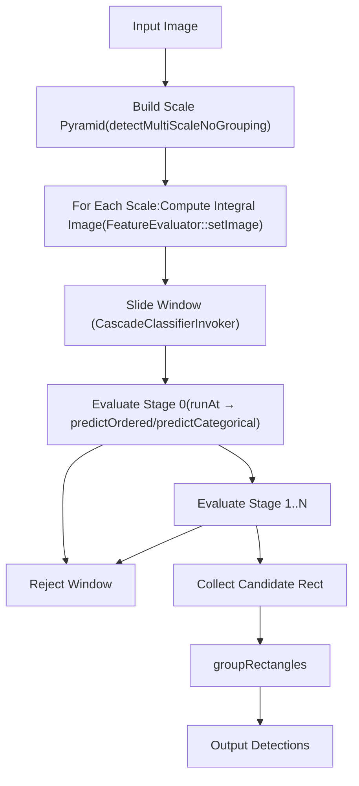
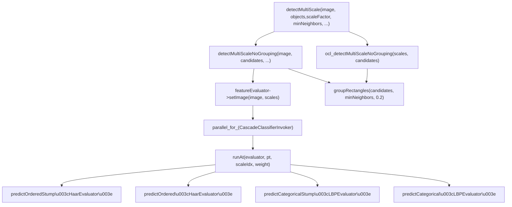
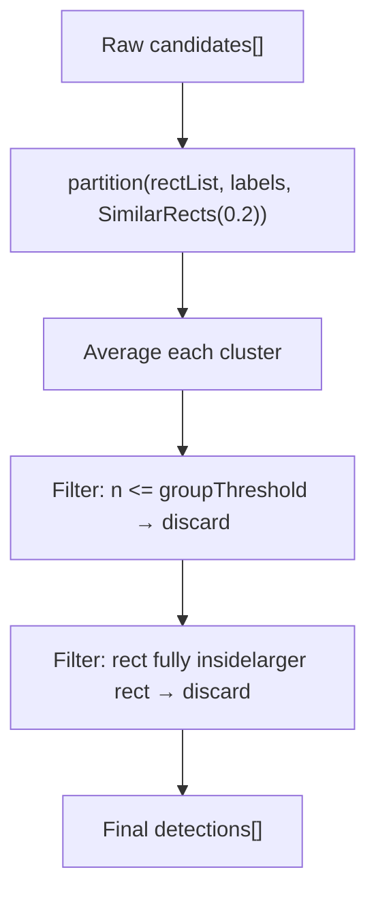
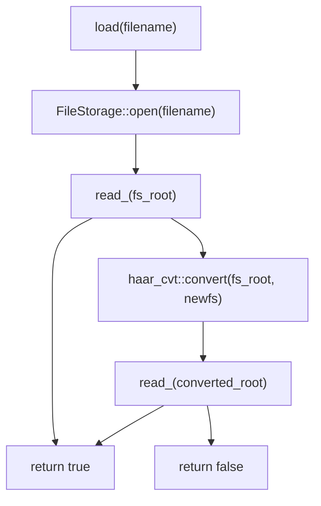
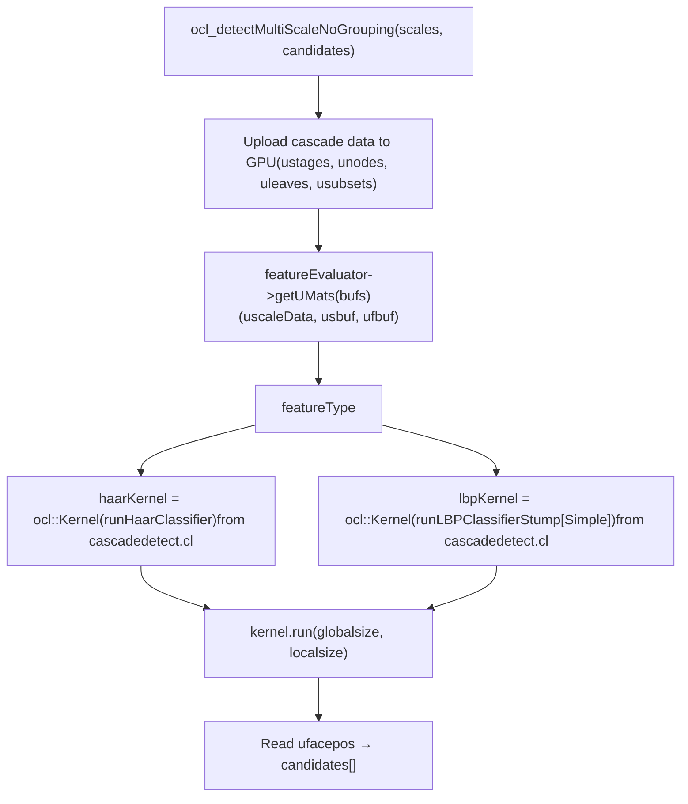

# Cascade Classifiers and Haar Features

Relevant source files

-   [modules/calib3d/test/test\_affine3d\_estimator.cpp](https://github.com/opencv/opencv/blob/91c78f50/modules/calib3d/test/test_affine3d_estimator.cpp)
-   [modules/core/include/opencv2/core/cuda/functional.hpp](https://github.com/opencv/opencv/blob/91c78f50/modules/core/include/opencv2/core/cuda/functional.hpp)
-   [modules/imgproc/src/generalized\_hough.cpp](https://github.com/opencv/opencv/blob/91c78f50/modules/imgproc/src/generalized_hough.cpp)
-   [modules/objdetect/include/opencv2/objdetect/objdetect.hpp](https://github.com/opencv/opencv/blob/91c78f50/modules/objdetect/include/opencv2/objdetect/objdetect.hpp)
-   [modules/objdetect/perf/opencl/perf\_cascades.cpp](https://github.com/opencv/opencv/blob/91c78f50/modules/objdetect/perf/opencl/perf_cascades.cpp)
-   [modules/objdetect/perf/opencl/perf\_hogdetect.cpp](https://github.com/opencv/opencv/blob/91c78f50/modules/objdetect/perf/opencl/perf_hogdetect.cpp)
-   [modules/objdetect/src/cascadedetect.cpp](https://github.com/opencv/opencv/blob/91c78f50/modules/objdetect/src/cascadedetect.cpp)
-   [modules/objdetect/src/cascadedetect.hpp](https://github.com/opencv/opencv/blob/91c78f50/modules/objdetect/src/cascadedetect.hpp)
-   [modules/objdetect/src/hog.cpp](https://github.com/opencv/opencv/blob/91c78f50/modules/objdetect/src/hog.cpp)
-   [modules/objdetect/src/opencl/cascadedetect.cl](https://github.com/opencv/opencv/blob/91c78f50/modules/objdetect/src/opencl/cascadedetect.cl)
-   [modules/objdetect/src/opencl/objdetect\_hog.cl](https://github.com/opencv/opencv/blob/91c78f50/modules/objdetect/src/opencl/objdetect_hog.cl)
-   [modules/objdetect/test/opencl/test\_hogdetector.cpp](https://github.com/opencv/opencv/blob/91c78f50/modules/objdetect/test/opencl/test_hogdetector.cpp)
-   [modules/objdetect/test/test\_cascadeandhog.cpp](https://github.com/opencv/opencv/blob/91c78f50/modules/objdetect/test/test_cascadeandhog.cpp)
-   [modules/ts/include/opencv2/ts/cuda\_test.hpp](https://github.com/opencv/opencv/blob/91c78f50/modules/ts/include/opencv2/ts/cuda_test.hpp)
-   [modules/ts/src/cuda\_test.cpp](https://github.com/opencv/opencv/blob/91c78f50/modules/ts/src/cuda_test.cpp)

## Purpose and Scope

This page documents the cascade classifier system in OpenCV's `objdetect` module, covering the `CascadeClassifier` public API, the internal `CascadeClassifierImpl`, the `HaarEvaluator` and `LBPEvaluator` feature computation classes, the multi-scale detection loop, rectangle grouping, and the OpenCL-accelerated detection path.

For the HOG-based detector that also lives in `objdetect`, see [HOG Descriptor and SVM Detection](/opencv/opencv/9.2-hog-descriptor-and-svm-detection). For QR code and ArUco detection, see [QR Code and ArUco Marker Detection](/opencv/opencv/9.3-qr-code-and-aruco-marker-detection).

---

## Algorithm Overview

A cascade classifier is a chain of boosted classification stages. Each stage is a strong classifier consisting of a collection of decision trees (weak classifiers). An input window is classified as positive only if it passes every stage. Early stages are cheap and fast, rejecting most negative windows; later stages are more discriminative.

At detection time, the input image is scanned at multiple scales. For each scale, an integral image is computed. A sliding window is evaluated by the cascade: if any stage's weighted tree sum falls below that stage's threshold, the window is rejected immediately without evaluating further stages. Only windows that survive all stages are reported as detections.


Sources: [modules/objdetect/src/cascadedetect.cpp916-1099](https://github.com/opencv/opencv/blob/91c78f50/modules/objdetect/src/cascadedetect.cpp#L916-L1099) [modules/objdetect/src/cascadedetect.hpp77-228](https://github.com/opencv/opencv/blob/91c78f50/modules/objdetect/src/cascadedetect.hpp#L77-L228)

---

## Class Hierarchy

The public `CascadeClassifier` class is a thin wrapper around `BaseCascadeClassifier`. The concrete implementation is `CascadeClassifierImpl`.


Sources: [modules/objdetect/src/cascadedetect.hpp11-74](https://github.com/opencv/opencv/blob/91c78f50/modules/objdetect/src/cascadedetect.hpp#L11-L74) [modules/objdetect/src/cascadedetect.hpp77-228](https://github.com/opencv/opencv/blob/91c78f50/modules/objdetect/src/cascadedetect.hpp#L77-L228)

---

## Cascade Data Model

`CascadeClassifierImpl::Data` holds the fully deserialized cascade in a set of flat arrays. This avoids pointer-chasing during detection.


When all trees are single-node stumps (`maxNodesPerTree == 1`), the data is packed into the optimized `stumps` vector. Otherwise the generic `nodes`/`leaves` layout is used. This is checked in `runAt()` to dispatch to the appropriate predictor template.

Sources: [modules/objdetect/src/cascadedetect.hpp162-213](https://github.com/opencv/opencv/blob/91c78f50/modules/objdetect/src/cascadedetect.hpp#L162-L213)

---

## Feature Types

### Haar Features (`HaarEvaluator`)

A Haar feature is the weighted sum of up to three axis-aligned (or 45°-tilted) rectangles evaluated on the integral image.


The `OptFeature::calc()` method computes the feature value using precomputed integral image offsets (`ofs[rect][corner]`):

```
value = weight[0] * CALC_SUM_OFS(ofs[0], ptr)
      + weight[1] * CALC_SUM_OFS(ofs[1], ptr)
      + weight[2] * CALC_SUM_OFS(ofs[2], ptr)   // only if weight[2] != 0
```
This is then divided by `varianceNormFactor` (derived from the squared-sum integral image), normalizing each window by its local contrast.

**Tilted features** use a separate tilted integral image channel. Whether tilted features exist is detected at load time; `hasTiltedFeatures` controls buffer allocation (`nchannels = 3` if tilted, `2` otherwise).

Sources: [modules/objdetect/src/cascadedetect.hpp314-402](https://github.com/opencv/opencv/blob/91c78f50/modules/objdetect/src/cascadedetect.hpp#L314-L402) [modules/objdetect/src/cascadedetect.cpp543-714](https://github.com/opencv/opencv/blob/91c78f50/modules/objdetect/src/cascadedetect.cpp#L543-L714)

### LBP Features (`LBPEvaluator`)

An LBP feature describes a single rectangle that is internally divided into a 3×3 grid of sub-cells. The center cell's integral sum is compared against each of the 8 surrounding cells to produce an 8-bit binary code.


The `OptFeature::calc()` uses 16 integral image offsets (4 corners for each of 4 quadrant cells needed to tile the 3×3 grid). The output is an integer in `[0, 255]`.

LBP nodes use **categorical** prediction: each `DTreeNode` stores a subset bitmask in `data.subsets`. The feature code is used to index into this bitmask to determine which child to follow.

Sources: [modules/objdetect/src/cascadedetect.hpp406-478](https://github.com/opencv/opencv/blob/91c78f50/modules/objdetect/src/cascadedetect.hpp#L406-L478) [modules/objdetect/src/cascadedetect.cpp776-906](https://github.com/opencv/opencv/blob/91c78f50/modules/objdetect/src/cascadedetect.cpp#L776-L906)

---

## Integral Image Buffer Layout

All scales share a single pre-allocated buffer (`sbuf` on CPU, `usbuf` on GPU). Scales are packed in row strips.

-   Each `ScaleData::layer_ofs` is a flat offset into the buffer.
-   `sqofs` is the offset of the squared-sum channel (= `sbufSize.area()`).
-   `tofs` is the offset of the tilted channel (= `sbufSize.area() * 2` when present).
-   LBP uses only one channel (`nchannels = 1`).

`FeatureEvaluator::updateScaleData()` computes the layout. `HaarEvaluator::computeChannels()` calls `integral()` to fill the buffer for each scale.

Sources: [modules/objdetect/src/cascadedetect.cpp438-539](https://github.com/opencv/opencv/blob/91c78f50/modules/objdetect/src/cascadedetect.cpp#L438-L539) [modules/objdetect/src/cascadedetect.cpp648-690](https://github.com/opencv/opencv/blob/91c78f50/modules/objdetect/src/cascadedetect.cpp#L648-L690)

---

## detectMultiScale Algorithm


Key parameters of `detectMultiScale`:

| Parameter | Default | Effect |
| --- | --- | --- |
| `scaleFactor` | 1.1 | Ratio between consecutive scale levels |
| `minNeighbors` | 3 | Minimum overlapping rectangles to keep a detection |
| `minSize` | `Size()` | Smallest window to search |
| `maxSize` | `Size()` | Largest window to search |
| `flags` | 0 | `CASCADE_SCALE_IMAGE`, `CASCADE_FIND_BIGGEST_OBJECT`, etc. |

The step size `ystep` for a given scale is `1` if `scale >= 2`, otherwise `2` — halving the number of positions to evaluate at small scales.

Sources: [modules/objdetect/src/cascadedetect.cpp968-1099](https://github.com/opencv/opencv/blob/91c78f50/modules/objdetect/src/cascadedetect.cpp#L968-L1099) [modules/objdetect/src/cascadedetect.hpp87-135](https://github.com/opencv/opencv/blob/91c78f50/modules/objdetect/src/cascadedetect.hpp#L87-L135)

---

## Predictor Functions

Four predictor templates are defined in `cascadedetect.hpp`:

| Template | Feature Type | Tree Depth | Used When |
| --- | --- | --- | --- |
| `predictOrderedStump<HaarEvaluator>` | Haar | 1 node | `maxNodesPerTree == 1` |
| `predictOrdered<HaarEvaluator>` | Haar | ≥1 nodes | `maxNodesPerTree > 1` |
| `predictCategoricalStump<LBPEvaluator>` | LBP | 1 node | `maxNodesPerTree == 1` |
| `predictCategorical<LBPEvaluator>` | LBP | ≥1 nodes | `maxNodesPerTree > 1` |

Each predictor iterates over stages. Within a stage, it sums the leaf values of all trees. If the sum falls below `stage.threshold`, the window is rejected and the negative stage index is returned. If all stages pass, `1` is returned.

For **ordered** (continuous-valued) features, the node threshold is compared directly:

```
idx = (feature_value < node.threshold) ? node.left : node.right
```
For **categorical** features, the feature code is used to look up a subset bitmask:

```
idx = (subset[code >> 5] & (1 << (code & 31))) ? node.left : node.right
```
Sources: [modules/objdetect/src/cascadedetect.hpp483-649](https://github.com/opencv/opencv/blob/91c78f50/modules/objdetect/src/cascadedetect.hpp#L483-L649)

---

## groupRectangles

After collection, raw candidate rectangles are clustered and filtered by `groupRectangles()`.

**Algorithm:**

1.  Cluster all rectangles using `partition()` with `SimilarRects(eps)` as the equivalence predicate. Two rectangles are similar if their overlap exceeds `(1 - eps)` of the smaller rectangle's size.
2.  Each cluster is averaged to produce a single representative rectangle.
3.  Clusters with fewer than `groupThreshold` members are discarded.
4.  Smaller rectangles fully contained within larger rectangles are also discarded.


There are three public overloads of `groupRectangles`:

-   `groupRectangles(rectList, groupThreshold, eps)` — basic form
-   `groupRectangles(rectList, weights, groupThreshold, eps)` — returns per-detection neighbor counts
-   `groupRectangles(rectList, rejectLevels, levelWeights, groupThreshold, eps)` — for ROC curve computation

A separate `groupRectangles_meanshift()` is also defined but is only used by the HOG detector.

Sources: [modules/objdetect/src/cascadedetect.cpp63-393](https://github.com/opencv/opencv/blob/91c78f50/modules/objdetect/src/cascadedetect.cpp#L63-L393)

---

## Loading a Cascade

`CascadeClassifierImpl::load()` handles both the current XML/YAML format and the legacy binary format:


`read_()` parses:

-   `cascadeParams` section: `featureType`, `stageType`, window `width`/`height`
-   `features` section: delegates to `FeatureEvaluator::read()` → `HaarEvaluator::read()` or `LBPEvaluator::read()`
-   `stages` section: populates `data.stages`, `data.classifiers`, `data.nodes`, `data.leaves`, `data.subsets`
-   Compresses single-node trees into `data.stumps`

`FeatureEvaluator::create()` is the factory for evaluator instances:

-   `HAAR (0)` → `new HaarEvaluator`
-   `LBP (1)` → `new LBPEvaluator`

Sources: [modules/objdetect/src/cascadedetect.cpp934-966](https://github.com/opencv/opencv/blob/91c78f50/modules/objdetect/src/cascadedetect.cpp#L934-L966) [modules/objdetect/src/cascadedetect.cpp909-914](https://github.com/opencv/opencv/blob/91c78f50/modules/objdetect/src/cascadedetect.cpp#L909-L914)

---

## OpenCL Acceleration Path

When OpenCL is available and the evaluator's `localSize` is non-empty, `detectMultiScale` calls `ocl_detectMultiScaleNoGrouping()` instead of the CPU path.


The Haar OpenCL kernel `runHaarClassifier` uses a **split-stage** strategy:

-   The first `SPLIT_STAGE` stages are evaluated per-work-item independently.
-   Remaining stages are evaluated cooperatively across the work group: candidates that survived the first split are shared via local memory (`lbuf`), and work items collectively evaluate the remaining stages.

A local sum buffer (`ibuf`) of size `SUM_BUF_SIZE` caches a tile of the integral image in local memory. This buffer is active on AMD, Intel, and NVIDIA devices where `localSize = Size(8, 8)` and `lbufSize = Size(origWinSize.width + 8, origWinSize.height + 8)`.

The maximum number of detections is capped at `MAX_FACES = 10000`. Detections are written to `ufacepos` using `atomic_inc`.

Sources: [modules/objdetect/src/cascadedetect.cpp1103-1213](https://github.com/opencv/opencv/blob/91c78f50/modules/objdetect/src/cascadedetect.cpp#L1103-L1213) [modules/objdetect/src/opencl/cascadedetect.cl71-360](https://github.com/opencv/opencv/blob/91c78f50/modules/objdetect/src/opencl/cascadedetect.cl#L71-L360) [modules/objdetect/src/cascadedetect.hpp128-132](https://github.com/opencv/opencv/blob/91c78f50/modules/objdetect/src/cascadedetect.hpp#L128-L132)

---

## Key Constants and Macros

The following macros from `cascadedetect.hpp` are used throughout the feature evaluators and OpenCL kernels to compute rectangle area sums from integral images:

| Macro | Purpose |
| --- | --- |
| `CV_SUM_OFS(p0,p1,p2,p3, sum, rect, step)` | Compute four corner offsets for a rectangle in the integral image |
| `CV_TILTED_OFS(p0,p1,p2,p3, tilted, rect, step)` | Same for the tilted integral image |
| `CALC_SUM_OFS(rect, ptr)` | Sum a rectangle from precomputed offsets: `ptr[p0]-ptr[p1]-ptr[p2]+ptr[p3]` |
| `CALC_SUM_OFS_(p0,p1,p2,p3, ptr)` | Inline version of the above |

These macros are replicated in OpenCL form inside `cascadedetect.cl`.

Sources: [modules/objdetect/src/cascadedetect.hpp261-311](https://github.com/opencv/opencv/blob/91c78f50/modules/objdetect/src/cascadedetect.hpp#L261-L311)

---

## Parallel CPU Execution

The `CascadeClassifierInvoker` class (a `ParallelLoopBody`) divides detection work across threads:

-   The outer loop is over scales.
-   Within each scale, rows are divided into `nstripes` stripes.
-   Each stripe is a unit of work that runs on one thread via `parallel_for_`.
-   Each thread clones the `FeatureEvaluator` (`featureEvaluator->clone()`) to have independent state.
-   Detections are appended to a shared `rectangles` vector protected by `Mutex mtx`.

The `ystep` field in `ScaleData` controls scanning granularity: step of 2 at small scales (`scale < 2`) to reduce computation.

Sources: [modules/objdetect/src/cascadedetect.cpp1013-1099](https://github.com/opencv/opencv/blob/91c78f50/modules/objdetect/src/cascadedetect.cpp#L1013-L1099)
