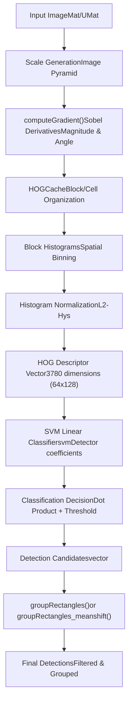
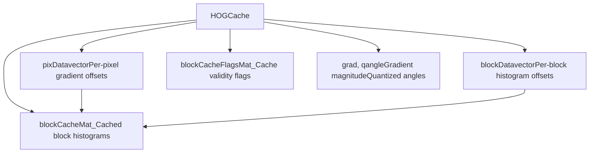
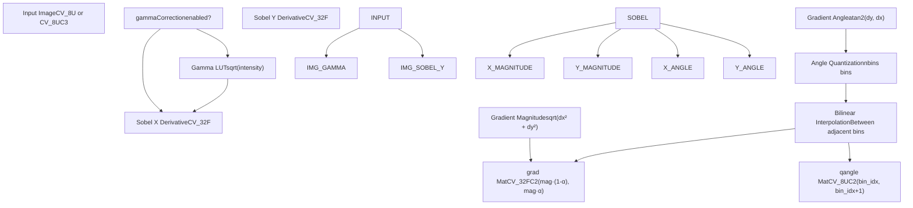
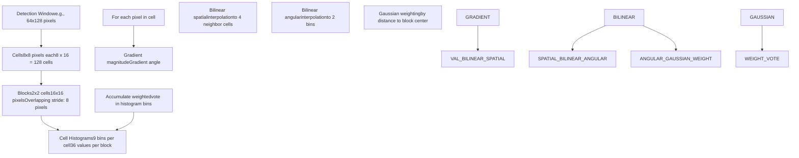
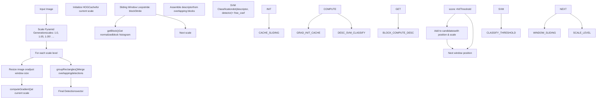
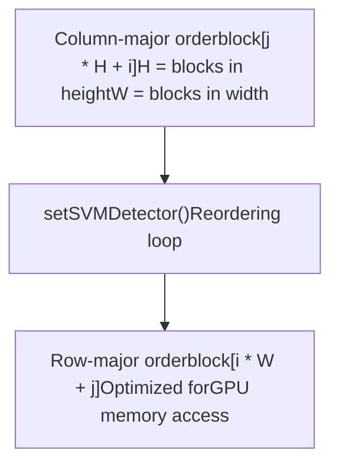
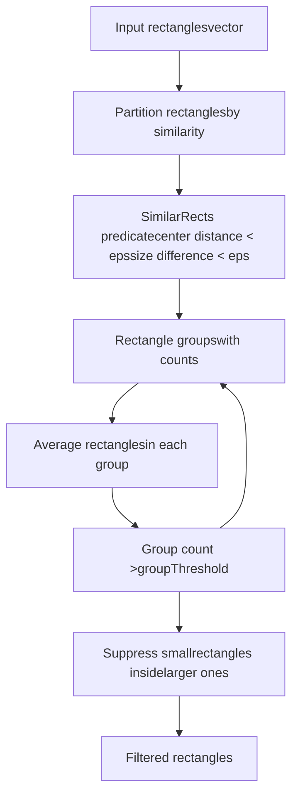
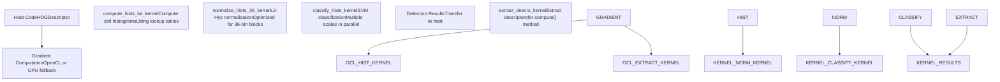

# HOG Descriptor and SVM Detection

Relevant source files

-   [modules/calib3d/test/test\_affine3d\_estimator.cpp](https://github.com/opencv/opencv/blob/91c78f50/modules/calib3d/test/test_affine3d_estimator.cpp)
-   [modules/core/include/opencv2/core/cuda/functional.hpp](https://github.com/opencv/opencv/blob/91c78f50/modules/core/include/opencv2/core/cuda/functional.hpp)
-   [modules/imgproc/src/generalized\_hough.cpp](https://github.com/opencv/opencv/blob/91c78f50/modules/imgproc/src/generalized_hough.cpp)
-   [modules/objdetect/include/opencv2/objdetect/objdetect.hpp](https://github.com/opencv/opencv/blob/91c78f50/modules/objdetect/include/opencv2/objdetect/objdetect.hpp)
-   [modules/objdetect/perf/opencl/perf\_cascades.cpp](https://github.com/opencv/opencv/blob/91c78f50/modules/objdetect/perf/opencl/perf_cascades.cpp)
-   [modules/objdetect/perf/opencl/perf\_hogdetect.cpp](https://github.com/opencv/opencv/blob/91c78f50/modules/objdetect/perf/opencl/perf_hogdetect.cpp)
-   [modules/objdetect/src/cascadedetect.cpp](https://github.com/opencv/opencv/blob/91c78f50/modules/objdetect/src/cascadedetect.cpp)
-   [modules/objdetect/src/cascadedetect.hpp](https://github.com/opencv/opencv/blob/91c78f50/modules/objdetect/src/cascadedetect.hpp)
-   [modules/objdetect/src/hog.cpp](https://github.com/opencv/opencv/blob/91c78f50/modules/objdetect/src/hog.cpp)
-   [modules/objdetect/src/opencl/cascadedetect.cl](https://github.com/opencv/opencv/blob/91c78f50/modules/objdetect/src/opencl/cascadedetect.cl)
-   [modules/objdetect/src/opencl/objdetect\_hog.cl](https://github.com/opencv/opencv/blob/91c78f50/modules/objdetect/src/opencl/objdetect_hog.cl)
-   [modules/objdetect/test/opencl/test\_hogdetector.cpp](https://github.com/opencv/opencv/blob/91c78f50/modules/objdetect/test/opencl/test_hogdetector.cpp)
-   [modules/objdetect/test/test\_cascadeandhog.cpp](https://github.com/opencv/opencv/blob/91c78f50/modules/objdetect/test/test_cascadeandhog.cpp)
-   [modules/ts/include/opencv2/ts/cuda\_test.hpp](https://github.com/opencv/opencv/blob/91c78f50/modules/ts/include/opencv2/ts/cuda_test.hpp)
-   [modules/ts/src/cuda\_test.cpp](https://github.com/opencv/opencv/blob/91c78f50/modules/ts/src/cuda_test.cpp)

## Purpose and Scope

This document describes the Histogram of Oriented Gradients (HOG) feature descriptor and Support Vector Machine (SVM) detection system in OpenCV's `objdetect` module. HOG is a feature descriptor used for object detection, particularly effective for pedestrian detection. The system computes gradient-based features from image regions and uses trained SVM classifiers to identify objects.

For information about cascade-based object detection using Haar or LBP features, see [Cascade Classifiers and Haar Features](/opencv/opencv/9.1-cascade-classifiers-and-haar-features). For general object detection module overview, see [Object Detection (objdetect)](/opencv/opencv/9-object-detection-(objdetect)).

---

## System Overview

The HOG detection system implements the algorithm introduced by Dalal and Triggs, computing gradient orientation histograms over a dense grid of uniformly-spaced cells and using overlapping local contrast normalization for improved accuracy. The system supports both CPU and OpenCL-accelerated computation paths.


**Sources**: [modules/objdetect/src/hog.cpp52-59](https://github.com/opencv/opencv/blob/91c78f50/modules/objdetect/src/hog.cpp#L52-L59) [modules/objdetect/src/cascadedetect.cpp63-173](https://github.com/opencv/opencv/blob/91c78f50/modules/objdetect/src/cascadedetect.cpp#L63-L173)

---

## Core Classes and Structures

### HOGDescriptor Class

The `HOGDescriptor` class is the primary interface for HOG feature computation and object detection. It encapsulates all configuration parameters and provides methods for descriptor computation and multi-scale detection.

| Component | Type | Description |
| --- | --- | --- |
| `winSize` | `Size` | Detection window size (e.g., Size(64,128)) |
| `blockSize` | `Size` | Block size for normalization (e.g., Size(16,16)) |
| `blockStride` | `Size` | Block stride (e.g., Size(8,8)) |
| `cellSize` | `Size` | Cell size for histograms (e.g., Size(8,8)) |
| `nbins` | `int` | Number of histogram bins (typically 9) |
| `svmDetector` | `vector<float>` | Linear SVM coefficients |
| `oclSvmDetector` | `UMat` | Reordered SVM coefficients for OpenCL |
| `free_coef` | `double` | SVM bias term |

**Sources**: [modules/objdetect/src/hog.cpp87-115](https://github.com/opencv/opencv/blob/91c78f50/modules/objdetect/src/hog.cpp#L87-L115)

### HOGCache Structure

Internal helper class that manages the computation and caching of HOG features for efficient sliding-window detection.


**Sources**: [modules/objdetect/src/hog.cpp589-743](https://github.com/opencv/opencv/blob/91c78f50/modules/objdetect/src/hog.cpp#L589-L743)

The `PixData` structure stores histogram offsets and interpolation weights for bilinear distribution of gradient votes:

-   `gradOfs`, `qangleOfs`: Offsets into gradient and angle arrays
-   `histOfs[4]`: Offsets for up to 4 neighboring cell histograms
-   `histWeights[4]`: Bilinear interpolation weights
-   `gradWeight`: Gaussian weighting for spatial position

**Sources**: [modules/objdetect/src/hog.cpp601-607](https://github.com/opencv/opencv/blob/91c78f50/modules/objdetect/src/hog.cpp#L601-L607)

---

## Gradient Computation Pipeline

The gradient computation is the first stage of HOG feature extraction. It computes image gradients using Sobel operators and optionally applies gamma correction.


**Sources**: [modules/objdetect/src/hog.cpp237-587](https://github.com/opencv/opencv/blob/91c78f50/modules/objdetect/src/hog.cpp#L237-L587)

### Multi-Channel Gradient Selection

For color images (3 channels), the algorithm computes gradients for each channel independently and selects the channel with maximum gradient magnitude at each pixel:

```
For each pixel (x,y):
  For each channel c in {R, G, B}:
    dx_c = pixel(x+1, y, c) - pixel(x-1, y, c)
    dy_c = pixel(x, y+1, c) - pixel(x, y-1, c)
    mag_c = dx_c² + dy_c²

  Select channel with max(mag_c)
  Use (dx_max, dy_max) for that pixel
```
**Sources**: [modules/objdetect/src/hog.cpp410-523](https://github.com/opencv/opencv/blob/91c78f50/modules/objdetect/src/hog.cpp#L410-L523)

---

## Block Histogram Computation

HOG features are computed by accumulating gradient orientations into histograms over cells, then normalizing blocks of cells together.


**Sources**: [modules/objdetect/src/hog.cpp656-743](https://github.com/opencv/opencv/blob/91c78f50/modules/objdetect/src/hog.cpp#L656-L743)

### Block Normalization

After computing raw histograms for a block, they are normalized using L2-Hys normalization:

1.  **L2 Normalization**: Divide by L2 norm: `v' = v / sqrt(||v||² + ε²)`
2.  **Clipping**: Clip values to `L2HysThreshold` (typically 0.2)
3.  **Re-normalize**: Apply L2 normalization again

This normalization provides invariance to illumination changes and improves detector robustness.

**Sources**: [modules/objdetect/src/hog.cpp875-955](https://github.com/opencv/opencv/blob/91c78f50/modules/objdetect/src/hog.cpp#L875-L955)

---

## Multi-Scale Detection Pipeline

The `detectMultiScale()` method implements a sliding-window approach across multiple image scales to detect objects at different sizes.


**Sources**: [modules/objdetect/src/hog.cpp1012-1250](https://github.com/opencv/opencv/blob/91c78f50/modules/objdetect/src/hog.cpp#L1012-L1250)

### Detection Method Variants

| Method | Signature | Purpose |
| --- | --- | --- |
| `detect()` | `detect(img, foundLocations, hitThreshold, winStride, padding, searchLocations)` | Detects at specified locations only |
| `detectMultiScale()` | `detectMultiScale(img, foundLocations, hitThreshold, winStride, padding, scale, finalThreshold, useMeanshiftGrouping)` | Full multi-scale detection with grouping |
| `detectMultiScaleROI()` | `detectMultiScaleROI(img, foundLocations, locations, hitThreshold, groupThreshold)` | Detection in specified regions of interest |

**Sources**: [modules/objdetect/src/hog.cpp957-1250](https://github.com/opencv/opencv/blob/91c78f50/modules/objdetect/src/hog.cpp#L957-L1250)

---

## SVM Detector Organization

The SVM detector is a linear classifier represented as a vector of coefficients. The detector size must match the descriptor size computed from the window configuration.

### Descriptor Size Calculation

```
cells_per_block = blockSize / cellSize
blocks_per_window_x = (winSize.width - blockSize.width) / blockStride.width + 1
blocks_per_window_y = (winSize.height - blockSize.height) / blockStride.height + 1

descriptor_size = nbins × cells_per_block.area() ×
                  blocks_per_window_x × blocks_per_window_y
```
For the default 64×128 pedestrian detector:

-   Window: 64×128 pixels
-   Block: 16×16 pixels (2×2 cells)
-   Cell: 8×8 pixels
-   Bins: 9
-   Blocks per window: 7×15 = 105 blocks
-   Descriptor size: 9 × 4 × 105 = **3780 dimensions**

**Sources**: [modules/objdetect/src/hog.cpp87-102](https://github.com/opencv/opencv/blob/91c78f50/modules/objdetect/src/hog.cpp#L87-L102)

### SVM Coefficient Reordering

For efficient OpenCL computation, the SVM coefficients are reordered from column-major (blocks along height, then width) to row-major (blocks along width, then height):


**Sources**: [modules/objdetect/src/hog.cpp117-144](https://github.com/opencv/opencv/blob/91c78f50/modules/objdetect/src/hog.cpp#L117-L144)

### Pre-trained Detectors

OpenCV provides two pre-trained HOG+SVM detectors:

| Detector | Method | Window Size | Description |
| --- | --- | --- | --- |
| Default People | `getDefaultPeopleDetector()` | 64×128 | Trained on INRIA person dataset |
| Daimler People | `getDaimlerPeopleDetector()` | 48×96 | Trained on DaimlerChrysler dataset |

**Sources**: [modules/objdetect/src/hog.cpp1252-1323](https://github.com/opencv/opencv/blob/91c78f50/modules/objdetect/src/hog.cpp#L1252-L1323)

---

## Detection Grouping Algorithms

After multi-scale detection, overlapping rectangles representing the same object are grouped together. OpenCV provides two grouping algorithms.

### Standard Rectangle Grouping

The `groupRectangles()` function uses a partition-based algorithm with a similarity predicate:


**Sources**: [modules/objdetect/src/cascadedetect.cpp63-173](https://github.com/opencv/opencv/blob/91c78f50/modules/objdetect/src/cascadedetect.cpp#L63-L173)

### Mean-Shift Grouping

The `groupRectangles_meanshift()` function uses mean-shift clustering in position-scale space, providing better grouping for densely overlapping detections:

1.  **Convert to 3D points**: `(x_center, y_center, log(scale))`
2.  **Apply mean-shift**: Iteratively move each point toward local density maximum
3.  **Cluster modes**: Group points that converge to same mode
4.  **Reconstruct rectangles**: Convert modes back to rectangles
5.  **Filter by weight**: Keep only modes with sufficient support

The mean-shift kernel uses a Gaussian with standard deviations `(8, 16, log(1.3))` in `(x, y, scale)` space.

**Sources**: [modules/objdetect/src/cascadedetect.cpp175-393](https://github.com/opencv/opencv/blob/91c78f50/modules/objdetect/src/cascadedetect.cpp#L175-L393)

---

## OpenCL Acceleration

The HOG implementation includes OpenCL kernels for GPU acceleration of the most computationally intensive operations.

### OpenCL Kernel Pipeline


**Sources**: [modules/objdetect/src/opencl/objdetect\_hog.cl1-303](https://github.com/opencv/opencv/blob/91c78f50/modules/objdetect/src/opencl/objdetect_hog.cl#L1-L303)

### Histogram Computation Kernel

The `compute_hists_lut_kernel` uses pre-computed lookup tables for Gaussian weights and bilinear interpolation weights to accelerate histogram accumulation:

-   **Work-group organization**: 12 threads per cell, 12×4 threads per block
-   **Local memory**: Shared histogram accumulators
-   **Lookup tables**: `gauss_w_lut` contains both Gaussian weights (256 entries) and interpolation weights (256 entries)
-   **Parallel reduction**: Thread-local histograms reduced in shared memory

**Sources**: [modules/objdetect/src/opencl/objdetect\_hog.cl65-152](https://github.com/opencv/opencv/blob/91c78f50/modules/objdetect/src/opencl/objdetect_hog.cl#L65-L152)

### Normalization Kernel

The `normalize_hists_36_kernel` is optimized for the common case of 36-dimensional block histograms (4 cells × 9 bins):

1.  Compute squared magnitudes in parallel
2.  Parallel reduction to compute block L2 norm
3.  Normalize and clip to threshold
4.  Re-normalize after clipping

**Sources**: [modules/objdetect/src/opencl/objdetect\_hog.cl157-197](https://github.com/opencv/opencv/blob/91c78f50/modules/objdetect/src/opencl/objdetect_hog.cl#L157-L197)

### Classification Kernel

The `classify_hists_kernel_many_scales` performs SVM classification across multiple scales efficiently:

-   Processes multiple scale levels in single kernel invocation
-   Coalesced memory access for normalized histograms
-   Shared memory for partial dot products
-   Outputs detection positions and confidence scores

**Sources**: [modules/objdetect/src/opencl/objdetect\_hog.cl199-303](https://github.com/opencv/opencv/blob/91c78f50/modules/objdetect/src/opencl/objdetect_hog.cl#L199-L303)

---

## Configuration Parameters

### Essential Parameters

| Parameter | Type | Default | Description |
| --- | --- | --- | --- |
| `winSize` | `Size` | \- | Detection window dimensions |
| `blockSize` | `Size` | Size(16,16) | Block size for normalization |
| `blockStride` | `Size` | Size(8,8) | Block stride (typically half blockSize) |
| `cellSize` | `Size` | Size(8,8) | Cell size for histograms |
| `nbins` | `int` | 9 | Number of orientation bins |

### Advanced Parameters

| Parameter | Type | Default | Description |
| --- | --- | --- | --- |
| `derivAperture` | `int` | 1 | Sobel kernel size (1, 3, 5, 7) |
| `winSigma` | `double` | \-1 | Gaussian sigma for block weighting (auto: (blockSize.width + blockSize.height)/8) |
| `histogramNormType` | `int` | L2Hys | Normalization method |
| `L2HysThreshold` | `double` | 0.2 | Threshold for L2-Hys clipping |
| `gammaCorrection` | `bool` | false | Apply gamma correction (sqrt) |
| `nlevels` | `int` | 64 | Number of scale levels |
| `signedGradient` | `bool` | false | Use signed gradients (0-360°) vs unsigned (0-180°) |

**Sources**: [modules/objdetect/src/hog.cpp148-202](https://github.com/opencv/opencv/blob/91c78f50/modules/objdetect/src/hog.cpp#L148-L202)

### Detection Parameters

| Parameter | Default | Description |
| --- | --- | --- |
| `hitThreshold` | 0.0 | SVM classification threshold |
| `winStride` | Size(8,8) | Stride for sliding window |
| `padding` | Size(0,0) | Padding around image |
| `scale` | 1.05 | Scale factor between pyramid levels |
| `finalThreshold` | 2.0 | Threshold for grouping (minNeighbors) |
| `useMeanshiftGrouping` | false | Use mean-shift vs standard grouping |

**Sources**: [modules/objdetect/src/hog.cpp1012-1105](https://github.com/opencv/opencv/blob/91c78f50/modules/objdetect/src/hog.cpp#L1012-L1105)

---

## Serialization Format

HOG descriptors can be saved and loaded using OpenCV's FileStorage system.

### XML/YAML Format Structure

```
myHOG:  opencv-object-detector-hog:    winSize: [64, 128]    blockSize: [16, 16]    blockStride: [8, 8]    cellSize: [8, 8]    nbins: 9    derivAperture: 1    winSigma: 4.0    histogramNormType: 0    L2HysThreshold: 0.2    gammaCorrection: 1    nlevels: 64    signedGradient: 0    SVMDetector: [coef0, coef1, ..., coef3780, bias]
```
The `SVMDetector` field contains the linear SVM coefficients followed by the optional bias term. If the descriptor size is N and the detector has N+1 values, the last value is the bias (free coefficient).

**Sources**: [modules/objdetect/src/hog.cpp148-218](https://github.com/opencv/opencv/blob/91c78f50/modules/objdetect/src/hog.cpp#L148-L218)

---

## Usage Patterns

### Basic Detection

```
// Create HOG descriptor with 64x128 windowHOGDescriptor hog;hog.setSVMDetector(HOGDescriptor::getDefaultPeopleDetector()); // Detect peoplevector<Rect> detections;hog.detectMultiScale(image, detections, 0.0, Size(8,8), Size(0,0), 1.05, 2.0);
```
### Computing Descriptors

```
HOGDescriptor hog;vector<float> descriptors;vector<Point> locations; // Compute descriptors at specified locationshog.compute(image, descriptors, Size(8,8), Size(0,0), locations);
```
### Custom Training

```
// Train custom detector (requires external SVM library)vector<float> detector_coefficients = trainSVM(positive_samples, negative_samples); HOGDescriptor hog;hog.setSVMDetector(detector_coefficients);
```
**Sources**: [modules/objdetect/test/test\_cascadeandhog.cpp485-495](https://github.com/opencv/opencv/blob/91c78f50/modules/objdetect/test/test_cascadeandhog.cpp#L485-L495)

---

## Performance Considerations

### CPU Optimizations

-   **SIMD vectorization**: Extensive use of `cv::v_float32x4` and similar intrinsics
-   **Cache-friendly access**: Pre-computed pixel/block offsets in `HOGCache`
-   **Lookup tables**: Pre-computed Gaussian weights and interpolation factors
-   **Integral images**: Not used (unlike Haar cascades) due to histogram complexity

**Sources**: [modules/objdetect/src/hog.cpp262-565](https://github.com/opencv/opencv/blob/91c78f50/modules/objdetect/src/hog.cpp#L262-L565)

### OpenCL Optimizations

-   **Coalesced memory access**: Reordered data layout for GPU efficiency
-   **Local memory usage**: Shared histogram accumulators reduce global memory traffic
-   **Work-group sizing**: Optimized for 256 threads per work-group
-   **Kernel fusion**: Combined histogram computation and normalization

**Sources**: [modules/objdetect/src/opencl/objdetect\_hog.cl46-303](https://github.com/opencv/opencv/blob/91c78f50/modules/objdetect/src/opencl/objdetect_hog.cl#L46-L303)

### Typical Performance Characteristics

For a 640×480 image with default people detector:

-   **CPU (single-threaded)**: ~100-200ms per frame
-   **CPU (multi-threaded)**: ~30-50ms per frame
-   **OpenCL (GPU)**: ~10-20ms per frame

Performance scales approximately linearly with:

-   Image area (width × height)
-   Number of scale levels
-   Window size
-   Descriptor dimensionality

**Sources**: [modules/objdetect/perf/opencl/perf\_hogdetect.cpp72-88](https://github.com/opencv/opencv/blob/91c78f50/modules/objdetect/perf/opencl/perf_hogdetect.cpp#L72-L88)
