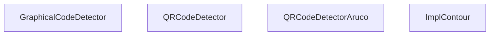
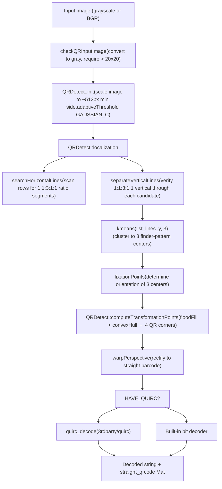
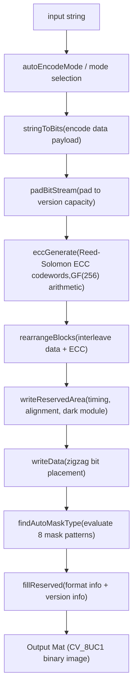
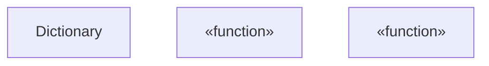
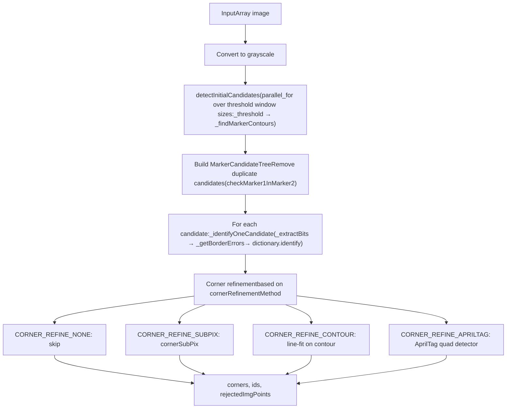
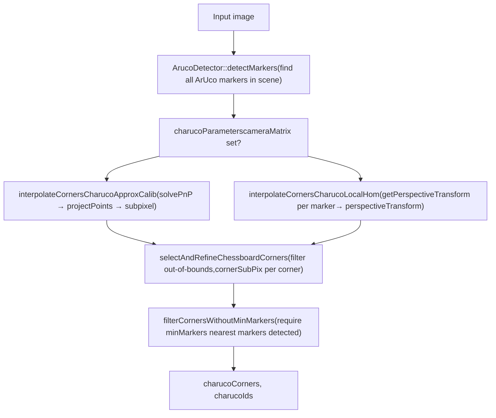

# QR Code and ArUco Marker Detection

Relevant source files

-   [3rdparty/quirc/LICENSE](https://github.com/opencv/opencv/blob/91c78f50/3rdparty/quirc/LICENSE)
-   [3rdparty/quirc/include/quirc.h](https://github.com/opencv/opencv/blob/91c78f50/3rdparty/quirc/include/quirc.h)
-   [3rdparty/quirc/include/quirc\_internal.h](https://github.com/opencv/opencv/blob/91c78f50/3rdparty/quirc/include/quirc_internal.h)
-   [3rdparty/quirc/src/decode.c](https://github.com/opencv/opencv/blob/91c78f50/3rdparty/quirc/src/decode.c)
-   [3rdparty/quirc/src/quirc.c](https://github.com/opencv/opencv/blob/91c78f50/3rdparty/quirc/src/quirc.c)
-   [3rdparty/quirc/src/version\_db.c](https://github.com/opencv/opencv/blob/91c78f50/3rdparty/quirc/src/version_db.c)
-   [cmake/checks/framebuffer.cpp](https://github.com/opencv/opencv/blob/91c78f50/cmake/checks/framebuffer.cpp)
-   [modules/dnn/src/op\_timvx.cpp](https://github.com/opencv/opencv/blob/91c78f50/modules/dnn/src/op_timvx.cpp)
-   [modules/dnn/src/vkcom/src/op\_matmul.cpp](https://github.com/opencv/opencv/blob/91c78f50/modules/dnn/src/vkcom/src/op_matmul.cpp)
-   [modules/gapi/src/streaming/onevpl/utils.cpp](https://github.com/opencv/opencv/blob/91c78f50/modules/gapi/src/streaming/onevpl/utils.cpp)
-   [modules/highgui/cmake/detect\_framebuffer.cmake](https://github.com/opencv/opencv/blob/91c78f50/modules/highgui/cmake/detect_framebuffer.cmake)
-   [modules/highgui/src/window\_framebuffer.cpp](https://github.com/opencv/opencv/blob/91c78f50/modules/highgui/src/window_framebuffer.cpp)
-   [modules/highgui/src/window\_framebuffer.hpp](https://github.com/opencv/opencv/blob/91c78f50/modules/highgui/src/window_framebuffer.hpp)
-   [modules/objdetect/include/opencv2/objdetect.hpp](https://github.com/opencv/opencv/blob/91c78f50/modules/objdetect/include/opencv2/objdetect.hpp)
-   [modules/objdetect/include/opencv2/objdetect/aruco\_board.hpp](https://github.com/opencv/opencv/blob/91c78f50/modules/objdetect/include/opencv2/objdetect/aruco_board.hpp)
-   [modules/objdetect/include/opencv2/objdetect/aruco\_detector.hpp](https://github.com/opencv/opencv/blob/91c78f50/modules/objdetect/include/opencv2/objdetect/aruco_detector.hpp)
-   [modules/objdetect/include/opencv2/objdetect/aruco\_dictionary.hpp](https://github.com/opencv/opencv/blob/91c78f50/modules/objdetect/include/opencv2/objdetect/aruco_dictionary.hpp)
-   [modules/objdetect/include/opencv2/objdetect/charuco\_detector.hpp](https://github.com/opencv/opencv/blob/91c78f50/modules/objdetect/include/opencv2/objdetect/charuco_detector.hpp)
-   [modules/objdetect/include/opencv2/objdetect/graphical\_code\_detector.hpp](https://github.com/opencv/opencv/blob/91c78f50/modules/objdetect/include/opencv2/objdetect/graphical_code_detector.hpp)
-   [modules/objdetect/misc/java/filelist\_common](https://github.com/opencv/opencv/blob/91c78f50/modules/objdetect/misc/java/filelist_common)
-   [modules/objdetect/misc/java/gen\_dict.json](https://github.com/opencv/opencv/blob/91c78f50/modules/objdetect/misc/java/gen_dict.json)
-   [modules/objdetect/misc/java/src/cpp/objdetect\_converters.cpp](https://github.com/opencv/opencv/blob/91c78f50/modules/objdetect/misc/java/src/cpp/objdetect_converters.cpp)
-   [modules/objdetect/misc/java/src/cpp/objdetect\_converters.hpp](https://github.com/opencv/opencv/blob/91c78f50/modules/objdetect/misc/java/src/cpp/objdetect_converters.hpp)
-   [modules/objdetect/misc/java/test/ArucoTest.java](https://github.com/opencv/opencv/blob/91c78f50/modules/objdetect/misc/java/test/ArucoTest.java)
-   [modules/objdetect/misc/java/test/QRCodeDetectorTest.java](https://github.com/opencv/opencv/blob/91c78f50/modules/objdetect/misc/java/test/QRCodeDetectorTest.java)
-   [modules/objdetect/misc/objc/gen\_dict.json](https://github.com/opencv/opencv/blob/91c78f50/modules/objdetect/misc/objc/gen_dict.json)
-   [modules/objdetect/misc/python/pyopencv\_objdetect.hpp](https://github.com/opencv/opencv/blob/91c78f50/modules/objdetect/misc/python/pyopencv_objdetect.hpp)
-   [modules/objdetect/misc/python/test/test\_objdetect\_aruco.py](https://github.com/opencv/opencv/blob/91c78f50/modules/objdetect/misc/python/test/test_objdetect_aruco.py)
-   [modules/objdetect/misc/python/test/test\_qrcode\_detect.py](https://github.com/opencv/opencv/blob/91c78f50/modules/objdetect/misc/python/test/test_qrcode_detect.py)
-   [modules/objdetect/perf/perf\_aruco.cpp](https://github.com/opencv/opencv/blob/91c78f50/modules/objdetect/perf/perf_aruco.cpp)
-   [modules/objdetect/perf/perf\_qrcode\_pipeline.cpp](https://github.com/opencv/opencv/blob/91c78f50/modules/objdetect/perf/perf_qrcode_pipeline.cpp)
-   [modules/objdetect/src/aruco/aruco\_board.cpp](https://github.com/opencv/opencv/blob/91c78f50/modules/objdetect/src/aruco/aruco_board.cpp)
-   [modules/objdetect/src/aruco/aruco\_detector.cpp](https://github.com/opencv/opencv/blob/91c78f50/modules/objdetect/src/aruco/aruco_detector.cpp)
-   [modules/objdetect/src/aruco/aruco\_dictionary.cpp](https://github.com/opencv/opencv/blob/91c78f50/modules/objdetect/src/aruco/aruco_dictionary.cpp)
-   [modules/objdetect/src/aruco/aruco\_utils.cpp](https://github.com/opencv/opencv/blob/91c78f50/modules/objdetect/src/aruco/aruco_utils.cpp)
-   [modules/objdetect/src/aruco/aruco\_utils.hpp](https://github.com/opencv/opencv/blob/91c78f50/modules/objdetect/src/aruco/aruco_utils.hpp)
-   [modules/objdetect/src/aruco/charuco\_detector.cpp](https://github.com/opencv/opencv/blob/91c78f50/modules/objdetect/src/aruco/charuco_detector.cpp)
-   [modules/objdetect/src/aruco/predefined\_dictionaries.hpp](https://github.com/opencv/opencv/blob/91c78f50/modules/objdetect/src/aruco/predefined_dictionaries.hpp)
-   [modules/objdetect/src/graphical\_code\_detector.cpp](https://github.com/opencv/opencv/blob/91c78f50/modules/objdetect/src/graphical_code_detector.cpp)
-   [modules/objdetect/src/graphical\_code\_detector\_impl.hpp](https://github.com/opencv/opencv/blob/91c78f50/modules/objdetect/src/graphical_code_detector_impl.hpp)
-   [modules/objdetect/src/qrcode.cpp](https://github.com/opencv/opencv/blob/91c78f50/modules/objdetect/src/qrcode.cpp)
-   [modules/objdetect/src/qrcode\_encoder.cpp](https://github.com/opencv/opencv/blob/91c78f50/modules/objdetect/src/qrcode_encoder.cpp)
-   [modules/objdetect/src/qrcode\_encoder\_table.inl.hpp](https://github.com/opencv/opencv/blob/91c78f50/modules/objdetect/src/qrcode_encoder_table.inl.hpp)
-   [modules/objdetect/test/test\_aruco\_tutorial.cpp](https://github.com/opencv/opencv/blob/91c78f50/modules/objdetect/test/test_aruco_tutorial.cpp)
-   [modules/objdetect/test/test\_aruco\_utils.cpp](https://github.com/opencv/opencv/blob/91c78f50/modules/objdetect/test/test_aruco_utils.cpp)
-   [modules/objdetect/test/test\_aruco\_utils.hpp](https://github.com/opencv/opencv/blob/91c78f50/modules/objdetect/test/test_aruco_utils.hpp)
-   [modules/objdetect/test/test\_arucodetection.cpp](https://github.com/opencv/opencv/blob/91c78f50/modules/objdetect/test/test_arucodetection.cpp)
-   [modules/objdetect/test/test\_boarddetection.cpp](https://github.com/opencv/opencv/blob/91c78f50/modules/objdetect/test/test_boarddetection.cpp)
-   [modules/objdetect/test/test\_charucodetection.cpp](https://github.com/opencv/opencv/blob/91c78f50/modules/objdetect/test/test_charucodetection.cpp)
-   [modules/objdetect/test/test\_qr\_utils.hpp](https://github.com/opencv/opencv/blob/91c78f50/modules/objdetect/test/test_qr_utils.hpp)
-   [modules/objdetect/test/test\_qrcode.cpp](https://github.com/opencv/opencv/blob/91c78f50/modules/objdetect/test/test_qrcode.cpp)
-   [modules/objdetect/test/test\_qrcode\_encode.cpp](https://github.com/opencv/opencv/blob/91c78f50/modules/objdetect/test/test_qrcode_encode.cpp)
-   [samples/cpp/qrcode.cpp](https://github.com/opencv/opencv/blob/91c78f50/samples/cpp/qrcode.cpp)

This page covers the QR code and ArUco marker subsystems in the `opencv_objdetect` module. It describes the detection and encoding APIs, internal algorithms, dictionary structures, board types, and the ChArUco calibration target. For HOG/SVM people detection see [9.2](/opencv/opencv/9.2-hog-descriptor-and-svm-detection); for cascade face detection see [9.1](/opencv/opencv/9.1-cascade-classifiers-and-haar-features); for the camera calibration routines that consume ArUco/ChArUco output see [8.1](/opencv/opencv/8.1-camera-models-and-calibration-algorithms) and [8.2](/opencv/opencv/8.2-pose-estimation-(solvepnp)-and-geometric-transforms).

---

## Module Organization

Both subsystems live under `modules/objdetect/`. The public API is declared in `modules/objdetect/include/opencv2/objdetect.hpp` and the ArUco-specific headers under `modules/objdetect/include/opencv2/objdetect/`.

```
modules/objdetect/
├── include/opencv2/objdetect/
│   ├── aruco_detector.hpp      # ArucoDetector, DetectorParameters, RefineParameters
│   ├── aruco_dictionary.hpp    # Dictionary
│   ├── aruco_board.hpp         # Board, GridBoard, CharucoBoard
│   └── charuco_detector.hpp    # CharucoDetector, CharucoParameters
├── src/
│   ├── qrcode.cpp              # QRDetect, ImplContour, QRCodeDetector
│   ├── qrcode_encoder.cpp      # QRCodeEncoderImpl
│   └── aruco/
│       ├── aruco_detector.cpp  # ArucoDetector internals
│       ├── aruco_dictionary.cpp
│       ├── aruco_board.cpp
│       └── charuco_detector.cpp
└── 3rdparty/quirc/             # Optional quirc QR decode library
```
Sources: [modules/objdetect/src/qrcode.cpp1-20](https://github.com/opencv/opencv/blob/91c78f50/modules/objdetect/src/qrcode.cpp#L1-L20) [modules/objdetect/include/opencv2/objdetect.hpp44-134](https://github.com/opencv/opencv/blob/91c78f50/modules/objdetect/include/opencv2/objdetect.hpp#L44-L134)

---

## QR Code Detection

### Class Hierarchy and Entry Points

**Class hierarchy diagram: QR Code detection classes**


Sources: [modules/objdetect/src/qrcode.cpp974-1004](https://github.com/opencv/opencv/blob/91c78f50/modules/objdetect/src/qrcode.cpp#L974-L1004) [modules/objdetect/include/opencv2/objdetect.hpp44-49](https://github.com/opencv/opencv/blob/91c78f50/modules/objdetect/include/opencv2/objdetect.hpp#L44-L49)

`QRCodeDetector` uses `ImplContour` as its internal implementation via a Pimpl pointer. `QRCodeDetectorAruco` is an alternative that reuses ArUco-style candidate detection before QR decoding — useful for multi-QR scenes.

Both implement `GraphicalCodeDetector`, which is declared in `modules/objdetect/include/opencv2/objdetect/graphical_code_detector.hpp`.

---

### QR Code Detection Pipeline

The `ImplContour::detect()` path calls `QRDetect`, an internal class defined in [modules/objdetect/src/qrcode.cpp101-122](https://github.com/opencv/opencv/blob/91c78f50/modules/objdetect/src/qrcode.cpp#L101-L122)

**Flowchart: QR Code detection pipeline (contours-based)**


Sources: [modules/objdetect/src/qrcode.cpp101-567](https://github.com/opencv/opencv/blob/91c78f50/modules/objdetect/src/qrcode.cpp#L101-L567) [modules/objdetect/src/qrcode.cpp125-167](https://github.com/opencv/opencv/blob/91c78f50/modules/objdetect/src/qrcode.cpp#L125-L167) [modules/objdetect/src/qrcode.cpp169-232](https://github.com/opencv/opencv/blob/91c78f50/modules/objdetect/src/qrcode.cpp#L169-L232)

#### Scaling Logic

`QRDetect::init` normalizes the image before thresholding:

| Condition | Action |
| --- | --- |
| `min_side < 512` | `ZOOMING`: scale up; `coeff_expansion = 512 / min_side` |
| `min_side > 512` | `SHRINKING`: scale down; `coeff_expansion = min_side / 512` |
| `min_side == 512` | `UNCHANGED` |

After detection, localization points are scaled back to original-image coordinates.

Sources: [modules/objdetect/src/qrcode.cpp125-167](https://github.com/opencv/opencv/blob/91c78f50/modules/objdetect/src/qrcode.cpp#L125-L167)

#### Finder Pattern Localization

`searchHorizontalLines` ([modules/objdetect/src/qrcode.cpp169-232](https://github.com/opencv/opencv/blob/91c78f50/modules/objdetect/src/qrcode.cpp#L169-L232)) scans each row of the thresholded image for runs of pixels with the ratio **1 : 1 : 3 : 1 : 1** (dark:light:dark:light:dark). Each matching run becomes a candidate line `Vec3d {x_start, y, length}`.

`separateVerticalLines` → `extractVerticalLines` ([modules/objdetect/src/qrcode.cpp234-365](https://github.com/opencv/opencv/blob/91c78f50/modules/objdetect/src/qrcode.cpp#L234-L365)) then verifies the vertical signature through the center of each horizontal candidate. It checks a 6-segment vertical profile against the **3/14 : 1/7 : 1/7 : 3/14 : 1/7 : 1/7** expected ratio. Verified candidates are clustered using `kmeans` with `k=3` to yield three finder-pattern centers.

`fixationPoints` ([modules/objdetect/src/qrcode.cpp367-463](https://github.com/opencv/opencv/blob/91c78f50/modules/objdetect/src/qrcode.cpp#L367-L463)) arranges the three centers so they form a valid non-degenerate triangle and establishes the orientation (clockwise ordering) needed by `computeTransformationPoints`.

#### Corner Computation

`computeTransformationPoints` ([modules/objdetect/src/qrcode.cpp570-698](https://github.com/opencv/opencv/blob/91c78f50/modules/objdetect/src/qrcode.cpp#L570-L698)) uses `floodFill` from each finder-pattern center to recover the actual filled region of each pattern, then builds a `convexHull` over all three regions. The fourth QR corner (opposite the three finder patterns) is estimated by line intersection.

---

### Tunable Parameters

| Parameter | Setter | Default | Effect |
| --- | --- | --- | --- |
| `epsX` | `setEpsX()` | `0.2` | Tolerance for horizontal 1:1:3:1:1 ratio check |
| `epsY` | `setEpsY()` | `0.1` | Tolerance for vertical ratio check |
| `useAlignmentMarkers` | `setUseAlignmentMarkers()` | `true` | Whether alignment markers are used when computing corners of higher-version QR codes |

Sources: [modules/objdetect/src/qrcode.cpp974-1009](https://github.com/opencv/opencv/blob/91c78f50/modules/objdetect/src/qrcode.cpp#L974-L1009)

---

### Multi-QR Code Detection

`detectMulti` / `decodeMulti` / `detectAndDecodeMulti` search an image for all QR codes simultaneously. Two strategies are available:

| Class | Method | Notes |
| --- | --- | --- |
| `QRCodeDetector` | Contour-based, repeated `QRDetect` over candidates | Default |
| `QRCodeDetectorAruco` | ArUco-style candidate squares + QR decode | Better for grids of QR codes |

Usage is identical through the `GraphicalCodeDetector` interface:

```
// via QRCodeDetector (contours-based)QRCodeDetector detector;std::vector<Point> corners;std::vector<cv::String> decoded;detector.detectAndDecodeMulti(img, decoded, corners); // via QRCodeDetectorArucoQRCodeDetectorAruco detector2;detector2.detectAndDecodeMulti(img, decoded, corners);
```
The test suite at [modules/objdetect/test/test\_qrcode.cpp338-372](https://github.com/opencv/opencv/blob/91c78f50/modules/objdetect/test/test_qrcode.cpp#L338-L372) covers 2–9 QR codes per image with both methods.

---

### Curved QR Code Detection

`QRCodeDetector` exposes `detectAndDecodeCurved` (and `decodeCurved`) for QR codes printed on curved or bent surfaces. These methods use alignment markers (available in QR versions ≥ 2) to build a polynomial deformation model that corrects the perspective before bit extraction.

Sources: [modules/objdetect/src/qrcode.cpp995-997](https://github.com/opencv/opencv/blob/91c78f50/modules/objdetect/src/qrcode.cpp#L995-L997)

---

## QR Code Encoding

`QRCodeEncoder` ([modules/objdetect/src/qrcode\_encoder.cpp](https://github.com/opencv/opencv/blob/91c78f50/modules/objdetect/src/qrcode_encoder.cpp)) generates a QR code image from an input string.

### `QRCodeEncoder::Params`

| Field | Type | Default | Description |
| --- | --- | --- | --- |
| `version` | `int` | `0` (auto) | QR version 1–40 |
| `correction_level` | `CorrectionLevel` | `CORRECT_LEVEL_L` | L=7%, M=15%, Q=25%, H=30% recovery |
| `mode` | `EncodeMode` | `MODE_AUTO` | Numeric / Alphanumeric / Byte / Kanji / ECI / Structured |
| `structure_number` | `int` | `1` | Number of symbols for structured append (1–16) |

Sources: [modules/objdetect/src/qrcode\_encoder.cpp166-172](https://github.com/opencv/opencv/blob/91c78f50/modules/objdetect/src/qrcode_encoder.cpp#L166-L172)

### Encoding Pipeline

`QRCodeEncoderImpl::generatingProcess` ([modules/objdetect/src/qrcode\_encoder.cpp174-242](https://github.com/opencv/opencv/blob/91c78f50/modules/objdetect/src/qrcode_encoder.cpp#L174-L242)) executes the following stages:


Sources: [modules/objdetect/src/qrcode\_encoder.cpp174-242](https://github.com/opencv/opencv/blob/91c78f50/modules/objdetect/src/qrcode_encoder.cpp#L174-L242) [modules/objdetect/src/qrcode\_encoder.cpp244-298](https://github.com/opencv/opencv/blob/91c78f50/modules/objdetect/src/qrcode_encoder.cpp#L244-L298)

The GF(256) arithmetic helpers (`gfPow`, `gfMul`, `gfDiv`, `gfPolyMul`, `gfPolyDiv`) and the generator polynomial (`polyGenerator`) are all local static functions in [modules/objdetect/src/qrcode\_encoder.cpp45-120](https://github.com/opencv/opencv/blob/91c78f50/modules/objdetect/src/qrcode_encoder.cpp#L45-L120)

---

## ArUco Marker Detection

ArUco markers are square binary fiducial patterns. Each marker belongs to a `Dictionary` which defines the set of valid codewords.

### Dictionary System

**Dictionary class diagram**


Sources: [modules/objdetect/include/opencv2/objdetect/aruco\_dictionary.hpp16-90](https://github.com/opencv/opencv/blob/91c78f50/modules/objdetect/include/opencv2/objdetect/aruco_dictionary.hpp#L16-L90) [modules/objdetect/src/aruco/aruco\_dictionary.cpp1-50](https://github.com/opencv/opencv/blob/91c78f50/modules/objdetect/src/aruco/aruco_dictionary.cpp#L1-L50)

`bytesList` is stored as a `CV_8UC4` Mat where each row is one marker's 4 rotations packed as bytes. `maxCorrectionBits` determines how many bit errors `identify()` tolerates.

#### Predefined Dictionaries

`getPredefinedDictionary(name)` returns one of the built-in sets. Common choices:

| Name | Grid size | Markers | Max correction bits |
| --- | --- | --- | --- |
| `DICT_4X4_50` | 4×4 | 50 | 0 |
| `DICT_4X4_100` | 4×4 | 100 | 0 |
| `DICT_5X5_50` | 5×5 | 50 | 2 |
| `DICT_6X6_250` | 6×6 | 250 | 3 |
| `DICT_7X7_1000` | 7×7 | 1000 | 5 |
| `DICT_ARUCO_ORIGINAL` | 5×5 | 1024 | – |
| `DICT_APRILTAG_16h5` | AprilTag | 30 | – |
| `DICT_APRILTAG_36h11` | AprilTag | 587 | – |

Sources: [modules/objdetect/src/aruco/aruco\_dictionary.cpp1-50](https://github.com/opencv/opencv/blob/91c78f50/modules/objdetect/src/aruco/aruco_dictionary.cpp#L1-L50)

---

### DetectorParameters

`DetectorParameters` ([modules/objdetect/include/opencv2/objdetect/aruco\_detector.hpp25-234](https://github.com/opencv/opencv/blob/91c78f50/modules/objdetect/include/opencv2/objdetect/aruco_detector.hpp#L25-L234)) controls all aspects of marker detection. Key fields:

#### Adaptive Thresholding

| Parameter | Default | Description |
| --- | --- | --- |
| `adaptiveThreshWinSizeMin` | 3 | Smallest window for adaptive threshold |
| `adaptiveThreshWinSizeMax` | 23 | Largest window |
| `adaptiveThreshWinSizeStep` | 10 | Step between window sizes |
| `adaptiveThreshConstant` | 7 | Threshold constant C |

#### Marker Size / Shape Filters

| Parameter | Default | Description |
| --- | --- | --- |
| `minMarkerPerimeterRate` | 0.03 | Min marker perimeter as fraction of image max dim |
| `maxMarkerPerimeterRate` | 4.0 | Max marker perimeter |
| `polygonalApproxAccuracyRate` | 0.03 | `approxPolyDP` accuracy rate |
| `minCornerDistanceRate` | 0.05 | Min distance between corners / perimeter |
| `minDistanceToBorder` | 3 | Min pixels to image border |
| `minMarkerDistanceRate` | 0.125 | Min distance between two grouped markers |

#### Corner Refinement

| Parameter | Default | Description |
| --- | --- | --- |
| `cornerRefinementMethod` | `CORNER_REFINE_NONE` | None / SubPix / Contour / AprilTag |
| `cornerRefinementWinSize` | 5 | Max refinement window (pixels) |
| `relativeCornerRefinmentWinSize` | 0.3 | Window size relative to module size |
| `cornerRefinementMaxIterations` | 30 | Max iterations |
| `cornerRefinementMinAccuracy` | 0.1 | Stop criterion |

#### Bit Decoding

| Parameter | Default | Description |
| --- | --- | --- |
| `markerBorderBits` | 1 | Border width in bit units |
| `perspectiveRemovePixelPerCell` | 4 | Pixels per bit cell after perspective removal |
| `perspectiveRemoveIgnoredMarginPerCell` | 0.13 | Cell margin ignored during bit extraction |
| `maxErroneousBitsInBorderRate` | 0.35 | Max white bits allowed in black border |
| `minOtsuStdDev` | 5.0 | Min stddev to apply Otsu (otherwise threshold by mean) |
| `errorCorrectionRate` | 0.6 | Fraction of `maxCorrectionBits` allowed |

#### Aruco3 Mode

When `useAruco3Detection = true`, the detector uses a multi-resolution pyramid approach proposed in *Speeded up detection of squared fiducial markers* (Romero-Ramirez et al., 2018). This trades a small detection-rate decrease for significant speed gain on small markers.

| Parameter | Default | Description |
| --- | --- | --- |
| `useAruco3Detection` | `false` | Enable Aruco3 algorithm |
| `minSideLengthCanonicalImg` | 32 | Min marker side length in binarized image |
| `minMarkerLengthRatioOriginalImg` | 0.0 | Min marker side ratio in original image (controls pyramid depth) |

Sources: [modules/objdetect/include/opencv2/objdetect/aruco\_detector.hpp70-233](https://github.com/opencv/opencv/blob/91c78f50/modules/objdetect/include/opencv2/objdetect/aruco_detector.hpp#L70-L233)

---

### ArucoDetector Detection Pipeline

**Flowchart: ArucoDetector::detectMarkers internals**


Sources: [modules/objdetect/src/aruco/aruco\_detector.cpp269-388](https://github.com/opencv/opencv/blob/91c78f50/modules/objdetect/src/aruco/aruco_detector.cpp#L269-L388) [modules/objdetect/src/aruco/aruco\_detector.cpp470-600](https://github.com/opencv/opencv/blob/91c78f50/modules/objdetect/src/aruco/aruco_detector.cpp#L470-L600)

#### `_extractBits`

[modules/objdetect/src/aruco/aruco\_detector.cpp316-388](https://github.com/opencv/opencv/blob/91c78f50/modules/objdetect/src/aruco/aruco_detector.cpp#L316-L388) removes perspective using `getPerspectiveTransform` + `warpPerspective(INTER_NEAREST)`, then applies Otsu thresholding. Each cell in the `(markerSize + 2*borderBits) × (markerSize + 2*borderBits)` grid is evaluated by counting white pixels.

#### `_identifyOneCandidate`

[modules/objdetect/src/aruco/aruco\_detector.cpp470-600](https://github.com/opencv/opencv/blob/91c78f50/modules/objdetect/src/aruco/aruco_detector.cpp#L470-L600) tries all four rotations of the extracted bits against `dictionary.identify()`. It also optionally computes a `markerConfidence` score in `[0,1]` based on how cleanly black/white cells separate.

---

### ArucoDetector API

```
ArucoDetector detector(    getPredefinedDictionary(DICT_6X6_250),    DetectorParameters(),       // tuning    RefineParameters()          // for refineDetectedMarkers); vector<vector<Point2f>> corners;vector<int> ids;vector<vector<Point2f>> rejected; detector.detectMarkers(image, corners, ids, rejected);// Optional: recover missed markers using board geometrydetector.refineDetectedMarkers(image, board, corners, ids, rejected);
```
`refineDetectedMarkers` ([modules/objdetect/include/opencv2/objdetect/aruco\_detector.hpp318-380](https://github.com/opencv/opencv/blob/91c78f50/modules/objdetect/include/opencv2/objdetect/aruco_detector.hpp#L318-L380)) matches `rejected` candidates against the expected marker positions based on a `Board`, controlled by `RefineParameters`:

| Field | Default | Description |
| --- | --- | --- |
| `minRepDistance` | 10 | Max corner distance to count as reprojection match |
| `errorCorrectionRate` | 3.0 | Multiplier on `maxCorrectionBits` |
| `checkAllOrders` | `true` | Try all 4 corner orderings of rejected candidates |

Sources: [modules/objdetect/include/opencv2/objdetect/aruco\_detector.hpp238-400](https://github.com/opencv/opencv/blob/91c78f50/modules/objdetect/include/opencv2/objdetect/aruco_detector.hpp#L238-L400) [modules/objdetect/src/aruco/aruco\_detector.cpp82-114](https://github.com/opencv/opencv/blob/91c78f50/modules/objdetect/src/aruco/aruco_detector.cpp#L82-L114)

---

## ArUco Boards

### Board Class Hierarchy

**Class diagram: ArUco board types**


Sources: [modules/objdetect/include/opencv2/objdetect/aruco\_board.hpp1-200](https://github.com/opencv/opencv/blob/91c78f50/modules/objdetect/include/opencv2/objdetect/aruco_board.hpp#L1-L200) [modules/objdetect/src/aruco/aruco\_board.cpp1-80](https://github.com/opencv/opencv/blob/91c78f50/modules/objdetect/src/aruco/aruco_board.cpp#L1-L80)

### Board Usage

`Board::matchImagePoints` ([modules/objdetect/src/aruco/aruco\_board.cpp37-73](https://github.com/opencv/opencv/blob/91c78f50/modules/objdetect/src/aruco/aruco_board.cpp#L37-L73)) builds `(objectPoint, imagePoint)` correspondences between detected corners and the 3D board model. The result feeds directly into `solvePnP` for pose estimation.

```
// Pose from any BoardMat rvec, tvec;Mat objPts, imgPts;board.matchImagePoints(corners, ids, objPts, imgPts);solvePnP(objPts, imgPts, cameraMatrix, distCoeffs, rvec, tvec);
```
Sources: [modules/objdetect/src/aruco/aruco\_board.cpp37-73](https://github.com/opencv/opencv/blob/91c78f50/modules/objdetect/src/aruco/aruco_board.cpp#L37-L73)

### Marker Generation

```
// Generate a single marker imageMat markerImg;aruco::generateImageMarker(dictionary, id, sidePixels, markerImg, borderBits); // Generate a board imageMat boardImg;board.generateImage(Size(1000, 700), boardImg, marginSize=10, borderBits=1);
```
---

## ChArUco Detection and Calibration

A `CharucoBoard` combines a standard chessboard with embedded ArUco markers. Chessboard corners are detected with sub-pixel accuracy aided by nearby ArUco markers, making ChArUco boards well-suited for camera calibration.

### CharucoDetector


Sources: [modules/objdetect/src/aruco/charuco\_detector.cpp184-277](https://github.com/opencv/opencv/blob/91c78f50/modules/objdetect/src/aruco/charuco_detector.cpp#L184-L277)

#### Interpolation Methods

| Method | Trigger | Approach |
| --- | --- | --- |
| `interpolateCornersCharucoLocalHom` | No camera matrix | Per-marker homography via `getPerspectiveTransform` |
| `interpolateCornersCharucoApproxCalib` | Camera matrix provided | `solvePnP` approximate pose → `projectPoints` |

Both paths end with `cornerSubPix` refinement with a per-corner window size computed from the distance to the nearest marker corner.

Sources: [modules/objdetect/src/aruco/charuco\_detector.cpp183-277](https://github.com/opencv/opencv/blob/91c78f50/modules/objdetect/src/aruco/charuco_detector.cpp#L183-L277)

#### CharucoParameters

| Field | Default | Description |
| --- | --- | --- |
| `cameraMatrix` | empty | Optional 3×3 camera matrix; enables `ApproxCalib` path |
| `distCoeffs` | empty | Optional distortion coefficients |
| `minMarkers` | 2 | Minimum adjacent detected markers to keep a ChArUco corner |
| `tryRefineMarkers` | `false` | Run `refineDetectedMarkers` on the ArUco step |
| `checkMarkers` | `true` | Verify detected corners lie geometrically between nearest markers |

Sources: [modules/objdetect/include/opencv2/objdetect/charuco\_detector.hpp15-35](https://github.com/opencv/opencv/blob/91c78f50/modules/objdetect/include/opencv2/objdetect/charuco_detector.hpp#L15-L35)

### Pose Estimation from ChArUco

```
CharucoBoard board(Size(5, 7), 0.04f, 0.02f,                   getPredefinedDictionary(DICT_6X6_250));CharucoDetector detector(board); vector<Point2f> charucoCorners;vector<int> charucoIds;detector.detectBoard(image, charucoCorners, charucoIds); Mat rvec, tvec;// Use solvePnP with board.getChessboardCorners() for full pose
```
`getCharucoBoardPose` (declared in `aruco_board.hpp`) wraps this workflow; it calls `solvePnP` with the ChArUco corner 3D coordinates.

Sources: [modules/objdetect/src/aruco/charuco\_detector.cpp314-400](https://github.com/opencv/opencv/blob/91c78f50/modules/objdetect/src/aruco/charuco_detector.cpp#L314-L400) [modules/objdetect/test/test\_charucodetection.cpp203-296](https://github.com/opencv/opencv/blob/91c78f50/modules/objdetect/test/test_charucodetection.cpp#L203-L296)

---

## Key API Summary

### QR Code

| Class / Function | File | Purpose |
| --- | --- | --- |
| `QRCodeDetector` | `qrcode.cpp` | Detect + decode single or multiple QR codes |
| `QRCodeDetectorAruco` | `qrcode.cpp` | ArUco-based multi-QR detection |
| `GraphicalCodeDetector` | `graphical_code_detector.hpp` | Base class for both detectors |
| `QRCodeEncoder` | `qrcode_encoder.cpp` | Encode strings to QR code images |
| `QRCodeEncoder::Params` | `qrcode_encoder.cpp` | Version, ECC level, encoding mode |
| `QRDetect` | `qrcode.cpp` | Internal: finder pattern localization |
| `ImplContour` | `qrcode.cpp` | Internal: Pimpl for `QRCodeDetector` |

### ArUco

| Class / Function | File | Purpose |
| --- | --- | --- |
| `Dictionary` | `aruco_dictionary.hpp` | Marker codeword set and identification |
| `getPredefinedDictionary` | `aruco_dictionary.hpp` | Get built-in dictionary by name |
| `generateCustomDictionary` | `aruco_dictionary.hpp` | Build a custom dictionary |
| `DetectorParameters` | `aruco_detector.hpp` | All detection tuning knobs |
| `RefineParameters` | `aruco_detector.hpp` | Parameters for `refineDetectedMarkers` |
| `ArucoDetector` | `aruco_detector.hpp` | Main marker detection class |
| `Board` | `aruco_board.hpp` | Base board with 3D object points |
| `GridBoard` | `aruco_board.hpp` | Regular rectangular grid of markers |
| `CharucoBoard` | `aruco_board.hpp` | Chessboard + embedded ArUco markers |
| `CharucoParameters` | `charuco_detector.hpp` | ChArUco detection tuning |
| `CharucoDetector` | `charuco_detector.hpp` | Detect ChArUco corners |
| `generateImageMarker` | `aruco_dictionary.hpp` | Render a single marker to a Mat |

Sources: [modules/objdetect/include/opencv2/objdetect/aruco\_detector.hpp275-400](https://github.com/opencv/opencv/blob/91c78f50/modules/objdetect/include/opencv2/objdetect/aruco_detector.hpp#L275-L400) [modules/objdetect/include/opencv2/objdetect/charuco\_detector.hpp37-100](https://github.com/opencv/opencv/blob/91c78f50/modules/objdetect/include/opencv2/objdetect/charuco_detector.hpp#L37-L100) [modules/objdetect/include/opencv2/objdetect/aruco\_board.hpp1-200](https://github.com/opencv/opencv/blob/91c78f50/modules/objdetect/include/opencv2/objdetect/aruco_board.hpp#L1-L200)
