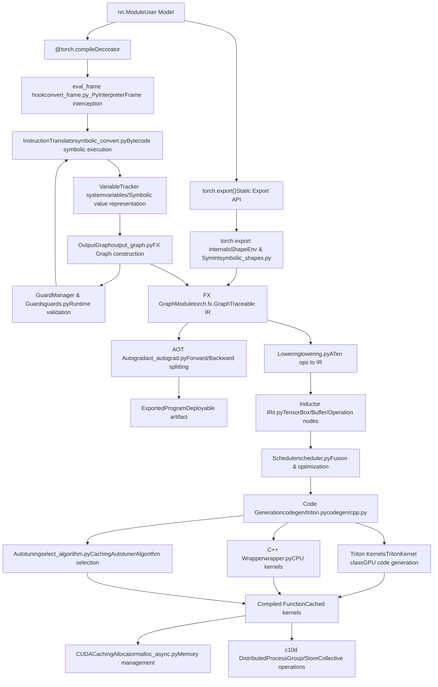
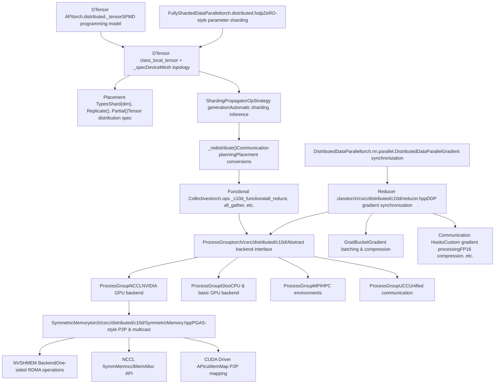
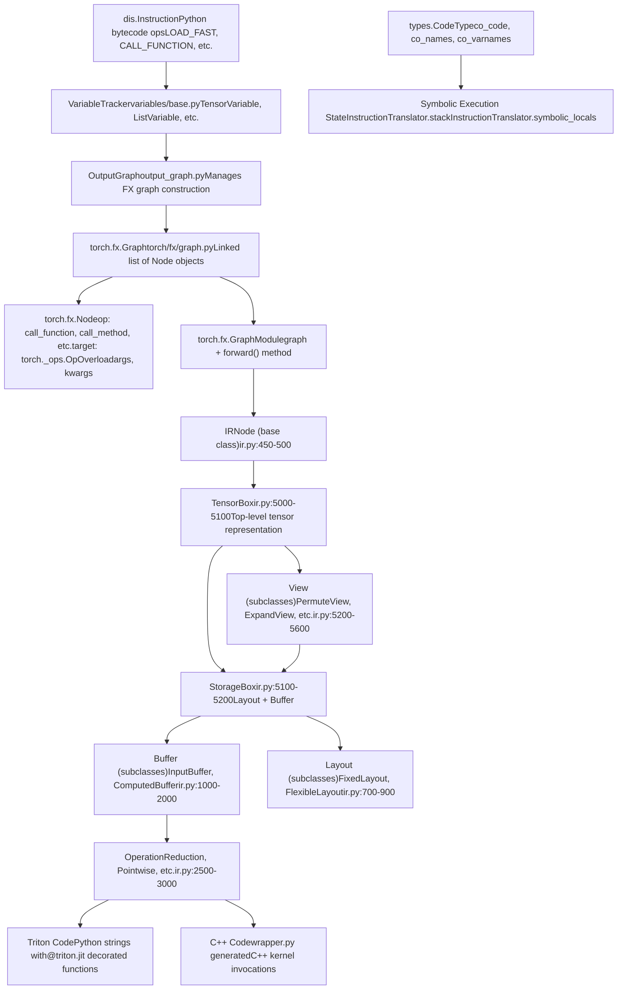
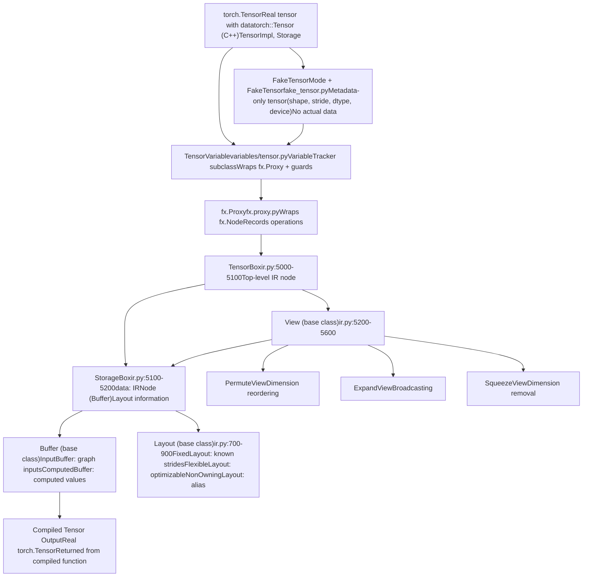
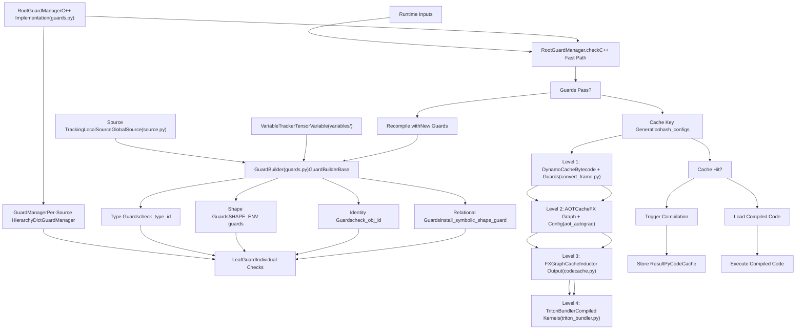

# Overview

Relevant source files

-   [.ci/docker/ci\_commit\_pins/torchbench.txt](https://github.com/pytorch/pytorch/blob/915982a4/.ci/docker/ci_commit_pins/torchbench.txt)
-   [aten/src/ATen/core/CachingHostAllocator.h](https://github.com/pytorch/pytorch/blob/915982a4/aten/src/ATen/core/CachingHostAllocator.h)
-   [aten/src/ATen/core/PythonFallbackKernel.cpp](https://github.com/pytorch/pytorch/blob/915982a4/aten/src/ATen/core/PythonFallbackKernel.cpp)
-   [aten/src/ATen/cuda/CachingHostAllocator.cpp](https://github.com/pytorch/pytorch/blob/915982a4/aten/src/ATen/cuda/CachingHostAllocator.cpp)
-   [aten/src/ATen/native/TensorCompare.cpp](https://github.com/pytorch/pytorch/blob/915982a4/aten/src/ATen/native/TensorCompare.cpp)
-   [aten/src/ATen/test/cuda\_caching\_host\_allocator\_test.cpp](https://github.com/pytorch/pytorch/blob/915982a4/aten/src/ATen/test/cuda_caching_host_allocator_test.cpp)
-   [aten/src/ATen/xpu/CachingHostAllocator.cpp](https://github.com/pytorch/pytorch/blob/915982a4/aten/src/ATen/xpu/CachingHostAllocator.cpp)
-   [c10/core/AllocatorConfig.cpp](https://github.com/pytorch/pytorch/blob/915982a4/c10/core/AllocatorConfig.cpp)
-   [c10/core/AllocatorConfig.h](https://github.com/pytorch/pytorch/blob/915982a4/c10/core/AllocatorConfig.h)
-   [c10/cuda/CUDAAllocatorConfig.cpp](https://github.com/pytorch/pytorch/blob/915982a4/c10/cuda/CUDAAllocatorConfig.cpp)
-   [c10/cuda/CUDAAllocatorConfig.h](https://github.com/pytorch/pytorch/blob/915982a4/c10/cuda/CUDAAllocatorConfig.h)
-   [c10/cuda/CUDACachingAllocator.cpp](https://github.com/pytorch/pytorch/blob/915982a4/c10/cuda/CUDACachingAllocator.cpp)
-   [c10/cuda/CUDACachingAllocator.h](https://github.com/pytorch/pytorch/blob/915982a4/c10/cuda/CUDACachingAllocator.h)
-   [c10/test/core/AllocatorConfig\_test.cpp](https://github.com/pytorch/pytorch/blob/915982a4/c10/test/core/AllocatorConfig_test.cpp)
-   [c10/xpu/XPUCachingAllocator.cpp](https://github.com/pytorch/pytorch/blob/915982a4/c10/xpu/XPUCachingAllocator.cpp)
-   [c10/xpu/XPUCachingAllocator.h](https://github.com/pytorch/pytorch/blob/915982a4/c10/xpu/XPUCachingAllocator.h)
-   [docs/source/cuda.aliases.md](https://github.com/pytorch/pytorch/blob/915982a4/docs/source/cuda.aliases.md)
-   [docs/source/notes/cuda.rst](https://github.com/pytorch/pytorch/blob/915982a4/docs/source/notes/cuda.rst)
-   [docs/source/xpu.aliases.md](https://github.com/pytorch/pytorch/blob/915982a4/docs/source/xpu.aliases.md)
-   [docs/source/xpu.md](https://github.com/pytorch/pytorch/blob/915982a4/docs/source/xpu.md)
-   [test/distributed/\_composable/fsdp/test\_fully\_shard\_compile.py](https://github.com/pytorch/pytorch/blob/915982a4/test/distributed/_composable/fsdp/test_fully_shard_compile.py)
-   [test/distributed/tensor/experimental/test\_register\_sharding.py](https://github.com/pytorch/pytorch/blob/915982a4/test/distributed/tensor/experimental/test_register_sharding.py)
-   [test/distributed/tensor/test\_decompositions.py](https://github.com/pytorch/pytorch/blob/915982a4/test/distributed/tensor/test_decompositions.py)
-   [test/distributed/tensor/test\_dtensor\_dispatch\_overhead.py](https://github.com/pytorch/pytorch/blob/915982a4/test/distributed/tensor/test_dtensor_dispatch_overhead.py)
-   [test/distributed/tensor/test\_dtensor\_export.py](https://github.com/pytorch/pytorch/blob/915982a4/test/distributed/tensor/test_dtensor_export.py)
-   [test/distributed/tensor/test\_dtensor\_ops.py](https://github.com/pytorch/pytorch/blob/915982a4/test/distributed/tensor/test_dtensor_ops.py)
-   [test/distributed/tensor/test\_math\_ops.py](https://github.com/pytorch/pytorch/blob/915982a4/test/distributed/tensor/test_math_ops.py)
-   [test/distributed/tensor/test\_matrix\_ops.py](https://github.com/pytorch/pytorch/blob/915982a4/test/distributed/tensor/test_matrix_ops.py)
-   [test/distributed/tensor/test\_op\_strategy.py](https://github.com/pytorch/pytorch/blob/915982a4/test/distributed/tensor/test_op_strategy.py)
-   [test/distributed/tensor/test\_pointwise\_ops.py](https://github.com/pytorch/pytorch/blob/915982a4/test/distributed/tensor/test_pointwise_ops.py)
-   [test/distributed/tensor/test\_single\_dim\_strategy.py](https://github.com/pytorch/pytorch/blob/915982a4/test/distributed/tensor/test_single_dim_strategy.py)
-   [test/distributed/tensor/test\_tensor\_ops.py](https://github.com/pytorch/pytorch/blob/915982a4/test/distributed/tensor/test_tensor_ops.py)
-   [test/distributed/tensor/test\_view\_ops.py](https://github.com/pytorch/pytorch/blob/915982a4/test/distributed/tensor/test_view_ops.py)
-   [test/dynamo/test\_activation\_checkpointing.py](https://github.com/pytorch/pytorch/blob/915982a4/test/dynamo/test_activation_checkpointing.py)
-   [test/dynamo/test\_activation\_offloading.py](https://github.com/pytorch/pytorch/blob/915982a4/test/dynamo/test_activation_offloading.py)
-   [test/dynamo/test\_aot\_autograd.py](https://github.com/pytorch/pytorch/blob/915982a4/test/dynamo/test_aot_autograd.py)
-   [test/dynamo/test\_dicts.py](https://github.com/pytorch/pytorch/blob/915982a4/test/dynamo/test_dicts.py)
-   [test/dynamo/test\_error\_messages.py](https://github.com/pytorch/pytorch/blob/915982a4/test/dynamo/test_error_messages.py)
-   [test/dynamo/test\_functions.py](https://github.com/pytorch/pytorch/blob/915982a4/test/dynamo/test_functions.py)
-   [test/dynamo/test\_fwd\_loss\_bwd.py](https://github.com/pytorch/pytorch/blob/915982a4/test/dynamo/test_fwd_loss_bwd.py)
-   [test/dynamo/test\_list.py](https://github.com/pytorch/pytorch/blob/915982a4/test/dynamo/test_list.py)
-   [test/dynamo/test\_misc.py](https://github.com/pytorch/pytorch/blob/915982a4/test/dynamo/test_misc.py)
-   [test/dynamo/test\_modules.py](https://github.com/pytorch/pytorch/blob/915982a4/test/dynamo/test_modules.py)
-   [test/dynamo/test\_nested\_graph\_breaks.py](https://github.com/pytorch/pytorch/blob/915982a4/test/dynamo/test_nested_graph_breaks.py)
-   [test/dynamo/test\_repros.py](https://github.com/pytorch/pytorch/blob/915982a4/test/dynamo/test_repros.py)
-   [test/dynamo/test\_utils.py](https://github.com/pytorch/pytorch/blob/915982a4/test/dynamo/test_utils.py)
-   [test/dynamo\_expected\_failures/TestCustomOp.test\_impl\_device\_cpu](https://github.com/pytorch/pytorch/blob/915982a4/test/dynamo_expected_failures/TestCustomOp.test_impl_device_cpu)
-   [test/export/test\_experimental.py](https://github.com/pytorch/pytorch/blob/915982a4/test/export/test_experimental.py)
-   [test/export/test\_export.py](https://github.com/pytorch/pytorch/blob/915982a4/test/export/test_export.py)
-   [test/functorch/test\_aotdispatch.py](https://github.com/pytorch/pytorch/blob/915982a4/test/functorch/test_aotdispatch.py)
-   [test/fx/test\_fx\_xform\_observer.py](https://github.com/pytorch/pytorch/blob/915982a4/test/fx/test_fx_xform_observer.py)
-   [test/inductor/test\_aot\_inductor.py](https://github.com/pytorch/pytorch/blob/915982a4/test/inductor/test_aot_inductor.py)
-   [test/inductor/test\_combo\_kernels.py](https://github.com/pytorch/pytorch/blob/915982a4/test/inductor/test_combo_kernels.py)
-   [test/inductor/test\_custom\_op\_autotune.py](https://github.com/pytorch/pytorch/blob/915982a4/test/inductor/test_custom_op_autotune.py)
-   [test/inductor/test\_foreach.py](https://github.com/pytorch/pytorch/blob/915982a4/test/inductor/test_foreach.py)
-   [test/inductor/test\_max\_autotune.py](https://github.com/pytorch/pytorch/blob/915982a4/test/inductor/test_max_autotune.py)
-   [test/inductor/test\_mmdecomp.py](https://github.com/pytorch/pytorch/blob/915982a4/test/inductor/test_mmdecomp.py)
-   [test/inductor/test\_torchinductor.py](https://github.com/pytorch/pytorch/blob/915982a4/test/inductor/test_torchinductor.py)
-   [test/inductor/test\_torchinductor\_codegen\_dynamic\_shapes.py](https://github.com/pytorch/pytorch/blob/915982a4/test/inductor/test_torchinductor_codegen_dynamic_shapes.py)
-   [test/profiler/test\_record\_function.py](https://github.com/pytorch/pytorch/blob/915982a4/test/profiler/test_record_function.py)
-   [test/profiler/test\_torch\_tidy.py](https://github.com/pytorch/pytorch/blob/915982a4/test/profiler/test_torch_tidy.py)
-   [test/test\_accelerator.py](https://github.com/pytorch/pytorch/blob/915982a4/test/test_accelerator.py)
-   [test/test\_autograd\_fallback.py](https://github.com/pytorch/pytorch/blob/915982a4/test/test_autograd_fallback.py)
-   [test/test\_cuda.py](https://github.com/pytorch/pytorch/blob/915982a4/test/test_cuda.py)
-   [test/test\_cuda\_compatibility.py](https://github.com/pytorch/pytorch/blob/915982a4/test/test_cuda_compatibility.py)
-   [test/test\_dynamic\_shapes.py](https://github.com/pytorch/pytorch/blob/915982a4/test/test_dynamic_shapes.py)
-   [test/test\_proxy\_tensor.py](https://github.com/pytorch/pytorch/blob/915982a4/test/test_proxy_tensor.py)
-   [test/test\_xpu.py](https://github.com/pytorch/pytorch/blob/915982a4/test/test_xpu.py)
-   [torch/\_C/\_\_init\_\_.pyi.in](https://github.com/pytorch/pytorch/blob/915982a4/torch/_C/__init__.pyi.in)
-   [torch/\_dynamo/bytecode\_analysis.py](https://github.com/pytorch/pytorch/blob/915982a4/torch/_dynamo/bytecode_analysis.py)
-   [torch/\_dynamo/bytecode\_transformation.py](https://github.com/pytorch/pytorch/blob/915982a4/torch/_dynamo/bytecode_transformation.py)
-   [torch/\_dynamo/codegen.py](https://github.com/pytorch/pytorch/blob/915982a4/torch/_dynamo/codegen.py)
-   [torch/\_dynamo/config.py](https://github.com/pytorch/pytorch/blob/915982a4/torch/_dynamo/config.py)
-   [torch/\_dynamo/convert\_frame.py](https://github.com/pytorch/pytorch/blob/915982a4/torch/_dynamo/convert_frame.py)
-   [torch/\_dynamo/eval\_frame.py](https://github.com/pytorch/pytorch/blob/915982a4/torch/_dynamo/eval_frame.py)
-   [torch/\_dynamo/exc.py](https://github.com/pytorch/pytorch/blob/915982a4/torch/_dynamo/exc.py)
-   [torch/\_dynamo/functional\_export.py](https://github.com/pytorch/pytorch/blob/915982a4/torch/_dynamo/functional_export.py)
-   [torch/\_dynamo/graph\_break\_registry.json](https://github.com/pytorch/pytorch/blob/915982a4/torch/_dynamo/graph_break_registry.json)
-   [torch/\_dynamo/output\_graph.py](https://github.com/pytorch/pytorch/blob/915982a4/torch/_dynamo/output_graph.py)
-   [torch/\_dynamo/resume\_execution.py](https://github.com/pytorch/pytorch/blob/915982a4/torch/_dynamo/resume_execution.py)
-   [torch/\_dynamo/side\_effects.py](https://github.com/pytorch/pytorch/blob/915982a4/torch/_dynamo/side_effects.py)
-   [torch/\_dynamo/symbolic\_convert.py](https://github.com/pytorch/pytorch/blob/915982a4/torch/_dynamo/symbolic_convert.py)
-   [torch/\_dynamo/test\_case.py](https://github.com/pytorch/pytorch/blob/915982a4/torch/_dynamo/test_case.py)
-   [torch/\_dynamo/testing.py](https://github.com/pytorch/pytorch/blob/915982a4/torch/_dynamo/testing.py)
-   [torch/\_dynamo/trace\_rules.py](https://github.com/pytorch/pytorch/blob/915982a4/torch/_dynamo/trace_rules.py)
-   [torch/\_dynamo/utils.py](https://github.com/pytorch/pytorch/blob/915982a4/torch/_dynamo/utils.py)
-   [torch/\_dynamo/variables/\_\_init\_\_.py](https://github.com/pytorch/pytorch/blob/915982a4/torch/_dynamo/variables/__init__.py)
-   [torch/\_dynamo/variables/base.py](https://github.com/pytorch/pytorch/blob/915982a4/torch/_dynamo/variables/base.py)
-   [torch/\_dynamo/variables/builder.py](https://github.com/pytorch/pytorch/blob/915982a4/torch/_dynamo/variables/builder.py)
-   [torch/\_dynamo/variables/builtin.py](https://github.com/pytorch/pytorch/blob/915982a4/torch/_dynamo/variables/builtin.py)
-   [torch/\_dynamo/variables/constant.py](https://github.com/pytorch/pytorch/blob/915982a4/torch/_dynamo/variables/constant.py)
-   [torch/\_dynamo/variables/ctx\_manager.py](https://github.com/pytorch/pytorch/blob/915982a4/torch/_dynamo/variables/ctx_manager.py)
-   [torch/\_dynamo/variables/dicts.py](https://github.com/pytorch/pytorch/blob/915982a4/torch/_dynamo/variables/dicts.py)
-   [torch/\_dynamo/variables/functions.py](https://github.com/pytorch/pytorch/blob/915982a4/torch/_dynamo/variables/functions.py)
-   [torch/\_dynamo/variables/higher\_order\_ops.py](https://github.com/pytorch/pytorch/blob/915982a4/torch/_dynamo/variables/higher_order_ops.py)
-   [torch/\_dynamo/variables/iter.py](https://github.com/pytorch/pytorch/blob/915982a4/torch/_dynamo/variables/iter.py)
-   [torch/\_dynamo/variables/lists.py](https://github.com/pytorch/pytorch/blob/915982a4/torch/_dynamo/variables/lists.py)
-   [torch/\_dynamo/variables/misc.py](https://github.com/pytorch/pytorch/blob/915982a4/torch/_dynamo/variables/misc.py)
-   [torch/\_dynamo/variables/nn\_module.py](https://github.com/pytorch/pytorch/blob/915982a4/torch/_dynamo/variables/nn_module.py)
-   [torch/\_dynamo/variables/optimizer.py](https://github.com/pytorch/pytorch/blob/915982a4/torch/_dynamo/variables/optimizer.py)
-   [torch/\_dynamo/variables/tensor.py](https://github.com/pytorch/pytorch/blob/915982a4/torch/_dynamo/variables/tensor.py)
-   [torch/\_dynamo/variables/torch.py](https://github.com/pytorch/pytorch/blob/915982a4/torch/_dynamo/variables/torch.py)
-   [torch/\_dynamo/variables/user\_defined.py](https://github.com/pytorch/pytorch/blob/915982a4/torch/_dynamo/variables/user_defined.py)
-   [torch/\_export/non\_strict\_utils.py](https://github.com/pytorch/pytorch/blob/915982a4/torch/_export/non_strict_utils.py)
-   [torch/\_functorch/\_activation\_offloading/\_\_init\_\_.py](https://github.com/pytorch/pytorch/blob/915982a4/torch/_functorch/_activation_offloading/__init__.py)
-   [torch/\_functorch/\_activation\_offloading/activation\_offloading.py](https://github.com/pytorch/pytorch/blob/915982a4/torch/_functorch/_activation_offloading/activation_offloading.py)
-   [torch/\_functorch/\_aot\_autograd/collect\_metadata\_analysis.py](https://github.com/pytorch/pytorch/blob/915982a4/torch/_functorch/_aot_autograd/collect_metadata_analysis.py)
-   [torch/\_functorch/\_aot\_autograd/frontend\_utils.py](https://github.com/pytorch/pytorch/blob/915982a4/torch/_functorch/_aot_autograd/frontend_utils.py)
-   [torch/\_functorch/\_aot\_autograd/fx\_utils.py](https://github.com/pytorch/pytorch/blob/915982a4/torch/_functorch/_aot_autograd/fx_utils.py)
-   [torch/\_functorch/\_aot\_autograd/graph\_capture.py](https://github.com/pytorch/pytorch/blob/915982a4/torch/_functorch/_aot_autograd/graph_capture.py)
-   [torch/\_functorch/\_aot\_autograd/graph\_capture\_wrappers.py](https://github.com/pytorch/pytorch/blob/915982a4/torch/_functorch/_aot_autograd/graph_capture_wrappers.py)
-   [torch/\_functorch/\_aot\_autograd/graph\_compile.py](https://github.com/pytorch/pytorch/blob/915982a4/torch/_functorch/_aot_autograd/graph_compile.py)
-   [torch/\_functorch/\_aot\_autograd/input\_output\_analysis.py](https://github.com/pytorch/pytorch/blob/915982a4/torch/_functorch/_aot_autograd/input_output_analysis.py)
-   [torch/\_functorch/\_aot\_autograd/runtime\_wrappers.py](https://github.com/pytorch/pytorch/blob/915982a4/torch/_functorch/_aot_autograd/runtime_wrappers.py)
-   [torch/\_functorch/\_aot\_autograd/schemas.py](https://github.com/pytorch/pytorch/blob/915982a4/torch/_functorch/_aot_autograd/schemas.py)
-   [torch/\_functorch/\_aot\_autograd/subclass\_parametrization.py](https://github.com/pytorch/pytorch/blob/915982a4/torch/_functorch/_aot_autograd/subclass_parametrization.py)
-   [torch/\_functorch/\_aot\_autograd/subclass\_utils.py](https://github.com/pytorch/pytorch/blob/915982a4/torch/_functorch/_aot_autograd/subclass_utils.py)
-   [torch/\_functorch/\_aot\_autograd/utils.py](https://github.com/pytorch/pytorch/blob/915982a4/torch/_functorch/_aot_autograd/utils.py)
-   [torch/\_functorch/aot\_autograd.py](https://github.com/pytorch/pytorch/blob/915982a4/torch/_functorch/aot_autograd.py)
-   [torch/\_functorch/config.py](https://github.com/pytorch/pytorch/blob/915982a4/torch/_functorch/config.py)
-   [torch/\_functorch/partitioners.py](https://github.com/pytorch/pytorch/blob/915982a4/torch/_functorch/partitioners.py)
-   [torch/\_inductor/autotune\_process.py](https://github.com/pytorch/pytorch/blob/915982a4/torch/_inductor/autotune_process.py)
-   [torch/\_inductor/choices.py](https://github.com/pytorch/pytorch/blob/915982a4/torch/_inductor/choices.py)
-   [torch/\_inductor/codegen/common.py](https://github.com/pytorch/pytorch/blob/915982a4/torch/_inductor/codegen/common.py)
-   [torch/\_inductor/codegen/cpp\_wrapper\_cpu.py](https://github.com/pytorch/pytorch/blob/915982a4/torch/_inductor/codegen/cpp_wrapper_cpu.py)
-   [torch/\_inductor/codegen/cpp\_wrapper\_cpu\_array\_ref.py](https://github.com/pytorch/pytorch/blob/915982a4/torch/_inductor/codegen/cpp_wrapper_cpu_array_ref.py)
-   [torch/\_inductor/codegen/simd.py](https://github.com/pytorch/pytorch/blob/915982a4/torch/_inductor/codegen/simd.py)
-   [torch/\_inductor/codegen/subgraph.py](https://github.com/pytorch/pytorch/blob/915982a4/torch/_inductor/codegen/subgraph.py)
-   [torch/\_inductor/codegen/triton.py](https://github.com/pytorch/pytorch/blob/915982a4/torch/_inductor/codegen/triton.py)
-   [torch/\_inductor/codegen/triton\_combo\_kernel.py](https://github.com/pytorch/pytorch/blob/915982a4/torch/_inductor/codegen/triton_combo_kernel.py)
-   [torch/\_inductor/codegen/wrapper.py](https://github.com/pytorch/pytorch/blob/915982a4/torch/_inductor/codegen/wrapper.py)
-   [torch/\_inductor/config.py](https://github.com/pytorch/pytorch/blob/915982a4/torch/_inductor/config.py)
-   [torch/\_inductor/decomposition.py](https://github.com/pytorch/pytorch/blob/915982a4/torch/_inductor/decomposition.py)
-   [torch/\_inductor/dtype\_propagation.py](https://github.com/pytorch/pytorch/blob/915982a4/torch/_inductor/dtype_propagation.py)
-   [torch/\_inductor/graph.py](https://github.com/pytorch/pytorch/blob/915982a4/torch/_inductor/graph.py)
-   [torch/\_inductor/ir.py](https://github.com/pytorch/pytorch/blob/915982a4/torch/_inductor/ir.py)
-   [torch/\_inductor/kernel/bmm.py](https://github.com/pytorch/pytorch/blob/915982a4/torch/_inductor/kernel/bmm.py)
-   [torch/\_inductor/kernel/conv.py](https://github.com/pytorch/pytorch/blob/915982a4/torch/_inductor/kernel/conv.py)
-   [torch/\_inductor/kernel/custom\_op.py](https://github.com/pytorch/pytorch/blob/915982a4/torch/_inductor/kernel/custom_op.py)
-   [torch/\_inductor/kernel/mm.py](https://github.com/pytorch/pytorch/blob/915982a4/torch/_inductor/kernel/mm.py)
-   [torch/\_inductor/kernel/mm\_plus\_mm.py](https://github.com/pytorch/pytorch/blob/915982a4/torch/_inductor/kernel/mm_plus_mm.py)
-   [torch/\_inductor/kernel\_inputs.py](https://github.com/pytorch/pytorch/blob/915982a4/torch/_inductor/kernel_inputs.py)
-   [torch/\_inductor/lowering.py](https://github.com/pytorch/pytorch/blob/915982a4/torch/_inductor/lowering.py)
-   [torch/\_inductor/memory.py](https://github.com/pytorch/pytorch/blob/915982a4/torch/_inductor/memory.py)
-   [torch/\_inductor/ops\_handler.py](https://github.com/pytorch/pytorch/blob/915982a4/torch/_inductor/ops_handler.py)
-   [torch/\_inductor/runtime/triton\_heuristics.py](https://github.com/pytorch/pytorch/blob/915982a4/torch/_inductor/runtime/triton_heuristics.py)
-   [torch/\_inductor/scheduler.py](https://github.com/pytorch/pytorch/blob/915982a4/torch/_inductor/scheduler.py)
-   [torch/\_inductor/select\_algorithm.py](https://github.com/pytorch/pytorch/blob/915982a4/torch/_inductor/select_algorithm.py)
-   [torch/\_inductor/shape\_propagation.py](https://github.com/pytorch/pytorch/blob/915982a4/torch/_inductor/shape_propagation.py)
-   [torch/\_inductor/template\_heuristics/triton.py](https://github.com/pytorch/pytorch/blob/915982a4/torch/_inductor/template_heuristics/triton.py)
-   [torch/\_inductor/utils.py](https://github.com/pytorch/pytorch/blob/915982a4/torch/_inductor/utils.py)
-   [torch/\_inductor/virtualized.py](https://github.com/pytorch/pytorch/blob/915982a4/torch/_inductor/virtualized.py)
-   [torch/\_library/autograd.py](https://github.com/pytorch/pytorch/blob/915982a4/torch/_library/autograd.py)
-   [torch/\_meta\_registrations.py](https://github.com/pytorch/pytorch/blob/915982a4/torch/_meta_registrations.py)
-   [torch/\_utils.py](https://github.com/pytorch/pytorch/blob/915982a4/torch/_utils.py)
-   [torch/csrc/DeviceAccelerator.cpp](https://github.com/pytorch/pytorch/blob/915982a4/torch/csrc/DeviceAccelerator.cpp)
-   [torch/csrc/Module.cpp](https://github.com/pytorch/pytorch/blob/915982a4/torch/csrc/Module.cpp)
-   [torch/csrc/autograd/autograd\_not\_implemented\_fallback.cpp](https://github.com/pytorch/pytorch/blob/915982a4/torch/csrc/autograd/autograd_not_implemented_fallback.cpp)
-   [torch/csrc/cuda/Module.cpp](https://github.com/pytorch/pytorch/blob/915982a4/torch/csrc/cuda/Module.cpp)
-   [torch/csrc/cuda/memory\_snapshot.cpp](https://github.com/pytorch/pytorch/blob/915982a4/torch/csrc/cuda/memory_snapshot.cpp)
-   [torch/csrc/inductor/cpp\_wrapper/common.h](https://github.com/pytorch/pytorch/blob/915982a4/torch/csrc/inductor/cpp_wrapper/common.h)
-   [torch/csrc/profiler/combined\_traceback.cpp](https://github.com/pytorch/pytorch/blob/915982a4/torch/csrc/profiler/combined_traceback.cpp)
-   [torch/csrc/profiler/combined\_traceback.h](https://github.com/pytorch/pytorch/blob/915982a4/torch/csrc/profiler/combined_traceback.h)
-   [torch/csrc/profiler/python/combined\_traceback.cpp](https://github.com/pytorch/pytorch/blob/915982a4/torch/csrc/profiler/python/combined_traceback.cpp)
-   [torch/csrc/xpu/Module.cpp](https://github.com/pytorch/pytorch/blob/915982a4/torch/csrc/xpu/Module.cpp)
-   [torch/cuda/\_\_init\_\_.py](https://github.com/pytorch/pytorch/blob/915982a4/torch/cuda/__init__.py)
-   [torch/cuda/\_device\_limits.py](https://github.com/pytorch/pytorch/blob/915982a4/torch/cuda/_device_limits.py)
-   [torch/cuda/memory.py](https://github.com/pytorch/pytorch/blob/915982a4/torch/cuda/memory.py)
-   [torch/distributed/tensor/\_decompositions.py](https://github.com/pytorch/pytorch/blob/915982a4/torch/distributed/tensor/_decompositions.py)
-   [torch/distributed/tensor/\_nonlinear\_redux.py](https://github.com/pytorch/pytorch/blob/915982a4/torch/distributed/tensor/_nonlinear_redux.py)
-   [torch/distributed/tensor/\_op\_schema.py](https://github.com/pytorch/pytorch/blob/915982a4/torch/distributed/tensor/_op_schema.py)
-   [torch/distributed/tensor/\_ops/\_conv\_ops.py](https://github.com/pytorch/pytorch/blob/915982a4/torch/distributed/tensor/_ops/_conv_ops.py)
-   [torch/distributed/tensor/\_ops/\_math\_ops.py](https://github.com/pytorch/pytorch/blob/915982a4/torch/distributed/tensor/_ops/_math_ops.py)
-   [torch/distributed/tensor/\_ops/\_matrix\_ops.py](https://github.com/pytorch/pytorch/blob/915982a4/torch/distributed/tensor/_ops/_matrix_ops.py)
-   [torch/distributed/tensor/\_ops/\_pointwise\_ops.py](https://github.com/pytorch/pytorch/blob/915982a4/torch/distributed/tensor/_ops/_pointwise_ops.py)
-   [torch/distributed/tensor/\_ops/\_random\_ops.py](https://github.com/pytorch/pytorch/blob/915982a4/torch/distributed/tensor/_ops/_random_ops.py)
-   [torch/distributed/tensor/\_ops/\_tensor\_ops.py](https://github.com/pytorch/pytorch/blob/915982a4/torch/distributed/tensor/_ops/_tensor_ops.py)
-   [torch/distributed/tensor/\_ops/\_view\_ops.py](https://github.com/pytorch/pytorch/blob/915982a4/torch/distributed/tensor/_ops/_view_ops.py)
-   [torch/distributed/tensor/\_ops/single\_dim\_strategy.py](https://github.com/pytorch/pytorch/blob/915982a4/torch/distributed/tensor/_ops/single_dim_strategy.py)
-   [torch/distributed/tensor/\_ops/utils.py](https://github.com/pytorch/pytorch/blob/915982a4/torch/distributed/tensor/_ops/utils.py)
-   [torch/distributed/tensor/\_sharding\_prop.py](https://github.com/pytorch/pytorch/blob/915982a4/torch/distributed/tensor/_sharding_prop.py)
-   [torch/distributed/tensor/debug/\_\_init\_\_.py](https://github.com/pytorch/pytorch/blob/915982a4/torch/distributed/tensor/debug/__init__.py)
-   [torch/export/\_\_init\_\_.py](https://github.com/pytorch/pytorch/blob/915982a4/torch/export/__init__.py)
-   [torch/export/\_trace.py](https://github.com/pytorch/pytorch/blob/915982a4/torch/export/_trace.py)
-   [torch/fx/experimental/symbolic\_shapes.py](https://github.com/pytorch/pytorch/blob/915982a4/torch/fx/experimental/symbolic_shapes.py)
-   [torch/fx/passes/graph\_transform\_observer.py](https://github.com/pytorch/pytorch/blob/915982a4/torch/fx/passes/graph_transform_observer.py)
-   [torch/testing/\_internal/common\_ops\_unbacked.py](https://github.com/pytorch/pytorch/blob/915982a4/torch/testing/_internal/common_ops_unbacked.py)
-   [torch/testing/\_internal/optests/aot\_autograd.py](https://github.com/pytorch/pytorch/blob/915982a4/torch/testing/_internal/optests/aot_autograd.py)
-   [torch/utils/viz/MemoryViz.js](https://github.com/pytorch/pytorch/blob/915982a4/torch/utils/viz/MemoryViz.js)
-   [torch/xpu/\_\_init\_\_.py](https://github.com/pytorch/pytorch/blob/915982a4/torch/xpu/__init__.py)
-   [torch/xpu/graphs.py](https://github.com/pytorch/pytorch/blob/915982a4/torch/xpu/graphs.py)
-   [torch/xpu/memory.py](https://github.com/pytorch/pytorch/blob/915982a4/torch/xpu/memory.py)
-   [torchgen/native\_function\_generation.py](https://github.com/pytorch/pytorch/blob/915982a4/torchgen/native_function_generation.py)

## Purpose and Scope

This wiki documents the internal architecture of PyTorch, an open-source machine learning framework. PyTorch provides tensor computation with GPU acceleration and a dynamic computational graph system for building and training neural networks. The documentation covers:

-   **Compilation System** ([#2](/pytorch/pytorch/2-compilation-system)): `torch.compile`, TorchDynamo graph capture, AOTAutograd functionalization, and TorchInductor code generation
-   **Device Backends** ([#3](/pytorch/pytorch/3-device-backends-and-native-operations)): ATen operator system, CUDA/MPS/XPU implementations, and hardware-specific optimizations
-   **Distributed Training** ([#4](/pytorch/pytorch/4-distributed-training-systems)): c10d communication primitives and symmetric memory systems
-   **Build Infrastructure** ([#5](/pytorch/pytorch/5-build-and-test-infrastructure)): Build system, CI/CD pipelines, and testing frameworks

This overview provides a high-level understanding of how these systems interact. For detailed information on specific subsystems, refer to the linked sections.

## High-Level Architecture

PyTorch Compilation Stack - From User Code to Execution

PyTorch's architecture transforms Python code through multiple compilation stages to generate optimized hardware-specific kernels.

**Architecture Overview**: The compilation pipeline has four main stages: (1) **TorchDynamo** intercepts Python bytecode via `eval_frame` hook and performs symbolic execution through `InstructionTranslator`, producing `VariableTracker` objects that represent program values; (2) **Graph Capture** constructs FX graphs via `OutputGraph` and optionally exports to `ExportedProgram` with static guarantees; (3) **AOT Autograd** functionalizes mutations and generates joint forward-backward graphs; (4) **TorchInductor** lowers FX graphs to Inductor IR, applies fusion optimizations in `Scheduler`, generates Triton/C++ code, and performs autotuning via `CachingAutotuner`. Guards inserted by `GuardManager` enable safe caching and trigger recompilation when assumptions are violated.

**Sources:** [torch/\_dynamo/convert\_frame.py1-100](https://github.com/pytorch/pytorch/blob/915982a4/torch/_dynamo/convert_frame.py#L1-L100) [torch/\_dynamo/symbolic\_convert.py1-308](https://github.com/pytorch/pytorch/blob/915982a4/torch/_dynamo/symbolic_convert.py#L1-L308) [torch/\_dynamo/output\_graph.py1-100](https://github.com/pytorch/pytorch/blob/915982a4/torch/_dynamo/output_graph.py#L1-L100) [torch/\_dynamo/guards.py1-100](https://github.com/pytorch/pytorch/blob/915982a4/torch/_dynamo/guards.py#L1-L100) [torch/\_inductor/compile\_fx.py](https://github.com/pytorch/pytorch/blob/915982a4/torch/_inductor/compile_fx.py) [torch/\_inductor/ir.py1-500](https://github.com/pytorch/pytorch/blob/915982a4/torch/_inductor/ir.py#L1-L500) [torch/\_inductor/lowering.py1-200](https://github.com/pytorch/pytorch/blob/915982a4/torch/_inductor/lowering.py#L1-L200) [torch/\_inductor/scheduler.py1-200](https://github.com/pytorch/pytorch/blob/915982a4/torch/_inductor/scheduler.py#L1-L200) [torch/\_inductor/codegen/triton.py1-200](https://github.com/pytorch/pytorch/blob/915982a4/torch/_inductor/codegen/triton.py#L1-L200) [torch/\_inductor/select\_algorithm.py1-100](https://github.com/pytorch/pytorch/blob/915982a4/torch/_inductor/select_algorithm.py#L1-L100) [test/export/test\_export.py1-100](https://github.com/pytorch/pytorch/blob/915982a4/test/export/test_export.py#L1-L100)

## Core Systems Overview

### Compilation System

PyTorch's compilation system transforms Python code into optimized machine code through multiple stages:

| Component | Entry Point | Key Classes/Functions | Core Files | Purpose |
| --- | --- | --- | --- | --- |
| **torch.compile** | `torch.compile()` decorator | `OptimizedModule`, `_compile` | `torch/_dynamo/__init__.py` | User-facing JIT compilation API |
| **TorchDynamo** | `convert_frame.py` | `InstructionTranslator`, `VariableTracker`, `OutputGraph`, `GuardManager` | `symbolic_convert.py`, `variables/`, `output_graph.py`, `guards.py` | Intercepts bytecode, performs symbolic execution, builds FX graphs with guards |
| **FX Graph IR** | `torch.fx` | `Graph`, `GraphModule`, `Node`, `Tracer` | `torch/fx/graph.py`, `torch/fx/graph_module.py` | Intermediate representation for model transformations |
| **AOT Autograd** | `aot_autograd.py` | `aot_module_simplified`, `aot_function`, `create_joint` | `torch/_functorch/aot_autograd.py` | Functionalizes mutations, generates joint forward-backward graphs |
| **TorchInductor** | `compile_fx()` | `compile_fx`, `GraphLowering`, `Scheduler`, `TritonKernel` | `compile_fx.py`, `graph.py`, `scheduler.py`, `codegen/triton.py` | Lowers FX to IR, applies optimizations, generates Triton/C++ kernels |
| **torch.export** | `torch.export.export()` | `ExportedProgram`, `FakeTensorMode`, `ShapeEnv`, `export` | `torch/export/__init__.py`, `torch/fx/experimental/symbolic_shapes.py` | Extracts static graphs with dynamic shape support for deployment |

**Key Data Flow**: User code → `eval_frame` hook → `InstructionTranslator` → `VariableTracker` objects → `OutputGraph` → FX `GraphModule` → AOT Autograd → Inductor IR (`TensorBox`, `Buffer`) → `Scheduler` fusion → Triton/C++ code generation → `CachingAutotuner` → Compiled kernels

**Sources:** [torch/\_dynamo/convert\_frame.py1-100](https://github.com/pytorch/pytorch/blob/915982a4/torch/_dynamo/convert_frame.py#L1-L100) [torch/\_dynamo/symbolic\_convert.py1-308](https://github.com/pytorch/pytorch/blob/915982a4/torch/_dynamo/symbolic_convert.py#L1-L308) [torch/\_dynamo/output\_graph.py1-100](https://github.com/pytorch/pytorch/blob/915982a4/torch/_dynamo/output_graph.py#L1-L100) [torch/\_dynamo/variables/builder.py1-100](https://github.com/pytorch/pytorch/blob/915982a4/torch/_dynamo/variables/builder.py#L1-L100) [torch/\_inductor/compile\_fx.py](https://github.com/pytorch/pytorch/blob/915982a4/torch/_inductor/compile_fx.py) [torch/\_inductor/ir.py1-500](https://github.com/pytorch/pytorch/blob/915982a4/torch/_inductor/ir.py#L1-L500) [torch/\_inductor/lowering.py1-200](https://github.com/pytorch/pytorch/blob/915982a4/torch/_inductor/lowering.py#L1-L200) [torch/\_inductor/scheduler.py1-200](https://github.com/pytorch/pytorch/blob/915982a4/torch/_inductor/scheduler.py#L1-L200) [torch/\_inductor/codegen/triton.py1-200](https://github.com/pytorch/pytorch/blob/915982a4/torch/_inductor/codegen/triton.py#L1-L200) [test/export/test\_export.py1-100](https://github.com/pytorch/pytorch/blob/915982a4/test/export/test_export.py#L1-L100)

### Device Backends

Hardware Backend Architecture

The device backend system provides a unified operator interface through the ATen library, with Inductor generating platform-specific optimized code:

```mermaid
flowchart TD
    InductorIR["Inductor IRir.pyTensorBox, Buffer, ComputedBuffer"]
    Lowering["Lowering Layerlowering.pyATen ops → IR"]
    Scheduler["Schedulerscheduler.pyBaseSchedulerNode, FusedSchedulerNodeFusion & tiling decisions"]
    TritonGPU["Triton GPU Kernelscodegen/triton.pyTritonKernel, TritonScheduling"]
    CUDABlas["cuBLAS/cuBLASLtmm_plus_mm.pyExternKernelCaller"]
    MemAlloc["CUDACachingAllocatorc10/cuda/CUDACachingAllocator.cppBlockPool, DeviceCachingAllocator"]
    CUDAGraph["CUDA Graph Capturecompile_fx.py"]
    TritonROCm["Triton ROCm KernelsTriton backend: rocm"]
    HipBlas["hipBLAS/hipBLASLtMatrix ops"]
    ROCmMem["ROCm Memory ManagementHIPAllocator"]
    MPSOps["MPS Operationsaten/src/ATen/mps/MPSAllocator.haten/src/ATen/native/mps/"]
    MetalShaders["Metal Shadersaten/src/ATen/native/mps/kernels/LinearAlgebra.metal, UnaryKernel.metal"]
    MPSGraph["MPSGraph FrameworkApple Metal Performance Shaders"]
    XPUOps["XPU Operationsaten/src/ATen/native/xpu/"]
    SYCLKernels["SYCL KernelsIntel oneAPI"]
    XPUAlloc["XPU AllocatorXPUAllocator"]
    CPPSIMD["C++ SIMD Kernelscodegen/cpp.pyCppKernel, CppVecKernelAVX2/AVX512/NEON"]
    VecISA["vec_isa.pyISA detection & validation"]
    CPPBlas["OpenMP + MKL/BLISThreading & BLAS"]
    NCCL["NCCL (NVIDIA)ProcessGroupNCCLtorch/csrc/distributed/c10d/"]
    Gloo["Gloo (Facebook)ProcessGroupGlooCPU & basic GPU"]
    MPI["MPI BackendProcessGroupMPIHPC environments"]
    UCC["UCC BackendUnified Collective Communication"]
    DTensor["DTensortorch/distributed/_tensor/DeviceMesh, Placement typesShardingPropagator"]
    SymmMem["SymmetricMemorytorch/csrc/distributed/c10d/SymmetricMemory.hppPGAS-style P2P access"]
    FSDP["FullyShardedDataParallelParameter sharding"]
    DDP["DistributedDataParallelGradient reduction"]
    SelectAlgo["select_algorithm.pyautotune_select_algorithm()TritonTemplate, ExternKernelCaller"]
    CachingAuto["CachingAutotunertriton_heuristics.pyCoordescTunerConfig benchmarking"]
    AutotuneCache["AutotuneCacheLocal & remote caching"]

    TritonGPU --> MemAlloc
    CUDABlas --> MemAlloc
    TritonROCm --> ROCmMem
    HipBlas --> ROCmMem
    MPSOps --> MetalShaders
    MPSOps --> MPSGraph
    XPUOps --> SYCLKernels
    XPUOps --> XPUAlloc
    CPPSIMD --> VecISA
    CPPSIMD --> CPPBlas
    DTensor --> NCCL
    SymmMem --> NCCL
    FSDP --> DTensor
    DDP --> NCCL
    DDP --> Gloo
    SelectAlgo --> CachingAuto
    CachingAuto --> AutotuneCache
    Lowering --> InductorIR
    InductorIR --> Scheduler
    Scheduler --> TritonGPU
    Scheduler --> TritonROCm
    Scheduler --> MPSOps
    Scheduler --> XPUOps
    Scheduler --> CPPSIMD
    Scheduler --> SelectAlgo
    SelectAlgo --> CUDABlas
    SelectAlgo --> HipBlas
    Scheduler --> DTensor
    Scheduler --> SymmMem
```

**Backend Selection**: Inductor's `Scheduler` analyzes the IR and generates backend-specific code: (1) **Triton backends** for CUDA/ROCm generate GPU kernels via `TritonKernel`; (2) **MPS backend** uses Metal shaders for Apple Silicon; (3) **C++ backend** generates vectorized CPU code with AVX2/AVX512; (4) **External kernels** call optimized libraries (cuBLAS, hipBLAS). The `CachingAutotuner` benchmarks multiple kernel configurations and caches the best choice. Distributed primitives (`DTensor`, `SymmetricMemory`) are orthogonal to compilation and work across all backends via `ProcessGroup` abstraction.

**Sources:** [torch/\_inductor/ir.py1-500](https://github.com/pytorch/pytorch/blob/915982a4/torch/_inductor/ir.py#L1-L500) [torch/\_inductor/lowering.py1-200](https://github.com/pytorch/pytorch/blob/915982a4/torch/_inductor/lowering.py#L1-L200) [torch/\_inductor/scheduler.py1-300](https://github.com/pytorch/pytorch/blob/915982a4/torch/_inductor/scheduler.py#L1-L300) [torch/\_inductor/codegen/triton.py1-200](https://github.com/pytorch/pytorch/blob/915982a4/torch/_inductor/codegen/triton.py#L1-L200) [torch/\_inductor/codegen/cpp.py](https://github.com/pytorch/pytorch/blob/915982a4/torch/_inductor/codegen/cpp.py) [torch/\_inductor/select\_algorithm.py1-200](https://github.com/pytorch/pytorch/blob/915982a4/torch/_inductor/select_algorithm.py#L1-L200) [torch/\_inductor/runtime/triton\_heuristics.py1-400](https://github.com/pytorch/pytorch/blob/915982a4/torch/_inductor/runtime/triton_heuristics.py#L1-L400) [torch/\_inductor/utils.py1-100](https://github.com/pytorch/pytorch/blob/915982a4/torch/_inductor/utils.py#L1-L100)

### Distributed Training

Distributed Training Architecture

PyTorch provides a multi-layer distributed training system with different abstractions for various use cases:

**Core Components**:

-   **DDP/FSDP**: High-level APIs for data/model parallelism using `Reducer` for gradient synchronization
-   **DTensor**: SPMD abstraction with `DeviceMesh` for device topology and `Placement` types (`Shard`, `Replicate`, `Partial`) for tensor distribution. `ShardingPropagator` infers output sharding from inputs and `_redistribute` inserts collective operations.
-   **ProcessGroup**: Abstract interface with NCCL (GPU), Gloo (CPU), MPI, UCC backends
-   **SymmetricMemory**: Low-level PGAS-style memory for efficient P2P access using NVSHMEM, NCCL symmetric memory APIs, or CUDA driver cuMemMap
-   **Collective Operations**: `all_reduce`, `all_gather`, `reduce_scatter`, `broadcast`, etc. exposed through `_c10d_functional` namespace

**Sources:** [torch/\_inductor/ir.py1-500](https://github.com/pytorch/pytorch/blob/915982a4/torch/_inductor/ir.py#L1-L500) [torch/\_dynamo/variables/builder.py1-100](https://github.com/pytorch/pytorch/blob/915982a4/torch/_dynamo/variables/builder.py#L1-L100)

### Build and Development Infrastructure

The build system orchestrates code generation, compilation, and testing:

| Component | Entry Point | Purpose |
| --- | --- | --- |
| **Python Build** | `setup.py` | Top-level build orchestration, package creation |
| **CMake** | `CMakeLists.txt` | C++ build configuration, dependency management |
| **Code Generation** | `torchgen/` | Generates C++ code from YAML operator definitions |
| **CI/CD** | `.github/workflows/` | Automated testing, builds, and releases |
| **Testing** | `test/`, `OpInfo` | Comprehensive test suite with operator database |

**Sources:** [torch/\_inductor/config.py1-100](https://github.com/pytorch/pytorch/blob/915982a4/torch/_inductor/config.py#L1-L100) [test/inductor/test\_torchinductor.py1-100](https://github.com/pytorch/pytorch/blob/915982a4/test/inductor/test_torchinductor.py#L1-L100)

## Compilation Pipeline Flow

torch.compile End-to-End Execution Flow

This sequence diagram shows how a user's PyTorch code flows through the compilation system with caching and guard checks:

> **[Mermaid sequence]**
> *(图表结构无法解析)*

**Key Decision Points**: Multi-stage caching (DynamoCache, FXGraphCache) enables reuse at different compilation levels. Guard checks at runtime determine if cached code is valid or if recompilation is needed. Guard failures trigger specialized recompilation for new input patterns.

**Sources:** [torch/\_dynamo/convert\_frame.py1-100](https://github.com/pytorch/pytorch/blob/915982a4/torch/_dynamo/convert_frame.py#L1-L100) [torch/\_dynamo/symbolic\_convert.py1-100](https://github.com/pytorch/pytorch/blob/915982a4/torch/_dynamo/symbolic_convert.py#L1-L100) [torch/\_dynamo/guards.py1-100](https://github.com/pytorch/pytorch/blob/915982a4/torch/_dynamo/guards.py#L1-L100) [torch/\_dynamo/output\_graph.py1-100](https://github.com/pytorch/pytorch/blob/915982a4/torch/_dynamo/output_graph.py#L1-L100) [torch/\_inductor/compile\_fx.py](https://github.com/pytorch/pytorch/blob/915982a4/torch/_inductor/compile_fx.py) [torch/\_inductor/lowering.py1-100](https://github.com/pytorch/pytorch/blob/915982a4/torch/_inductor/lowering.py#L1-L100) [torch/\_inductor/scheduler.py1-100](https://github.com/pytorch/pytorch/blob/915982a4/torch/_inductor/scheduler.py#L1-L100) [torch/\_inductor/codegen/triton.py1-100](https://github.com/pytorch/pytorch/blob/915982a4/torch/_inductor/codegen/triton.py#L1-L100) [torch/\_inductor/runtime/triton\_heuristics.py1-100](https://github.com/pytorch/pytorch/blob/915982a4/torch/_inductor/runtime/triton_heuristics.py#L1-L100) [torch/\_inductor/codecache.py1-100](https://github.com/pytorch/pytorch/blob/915982a4/torch/_inductor/codecache.py#L1-L100)

## Key Data Structures

### Graph Representation

Intermediate Representation Hierarchy

PyTorch uses multiple IR (Intermediate Representation) levels with explicit transformations between them:

**Transformation Pipeline**:

1.  **Python Bytecode → Dynamo IR**: `InstructionTranslator` ([symbolic\_convert.py308-400](https://github.com/pytorch/pytorch/blob/915982a4/symbolic_convert.py#L308-L400)) executes bytecode symbolically, creating `VariableTracker` instances ([variables/base.py1-100](https://github.com/pytorch/pytorch/blob/915982a4/variables/base.py#L1-L100)) for each Python value
2.  **Dynamo IR → FX Graph**: `OutputGraph` ([output\_graph.py1-200](https://github.com/pytorch/pytorch/blob/915982a4/output_graph.py#L1-L200)) converts `VariableTracker` objects to `fx.Node` instances via `create_proxy()` method
3.  **FX Graph → Inductor IR**: `lowering.py` ([lowering.py1-300](https://github.com/pytorch/pytorch/blob/915982a4/lowering.py#L1-L300)) lowers each FX node to `IRNode` instances. ATen operations become `TensorBox` wrapping `StorageBox` with `Buffer` and `Layout`
4.  **Inductor IR → Generated Code**: `Scheduler` ([scheduler.py1-400](https://github.com/pytorch/pytorch/blob/915982a4/scheduler.py#L1-L400)) groups operations into kernels, `codegen/triton.py` and `codegen/cpp.py` generate code strings

**IR Level Details**:

-   **Python Bytecode**: Raw CPython bytecode, analyzed via `dis` module
-   **Dynamo Symbolic IR**: `VariableTracker` hierarchy tracks types, shapes, and relationships between program values
-   **FX Graph**: Dataflow graph of operations (`torch.fx.Node` with `call_function` target = `torch._ops.OpOverload`)
-   **Inductor IR**: `TensorBox` → `StorageBox` → `Buffer` hierarchy models tensor storage and views. `Operation` nodes compute values.
-   **Generated Code**: Triton Python code or C++ wrapper code for execution

**Sources:** [torch/\_dynamo/symbolic\_convert.py1-400](https://github.com/pytorch/pytorch/blob/915982a4/torch/_dynamo/symbolic_convert.py#L1-L400) [torch/\_dynamo/variables/base.py1-200](https://github.com/pytorch/pytorch/blob/915982a4/torch/_dynamo/variables/base.py#L1-L200) [torch/\_dynamo/output\_graph.py1-300](https://github.com/pytorch/pytorch/blob/915982a4/torch/_dynamo/output_graph.py#L1-L300) [torch/\_inductor/ir.py1-1000](https://github.com/pytorch/pytorch/blob/915982a4/torch/_inductor/ir.py#L1-L1000) [torch/\_inductor/lowering.py1-300](https://github.com/pytorch/pytorch/blob/915982a4/torch/_inductor/lowering.py#L1-L300) [torch/\_inductor/scheduler.py1-400](https://github.com/pytorch/pytorch/blob/915982a4/torch/_inductor/scheduler.py#L1-L400) [torch/\_inductor/codegen/triton.py1-200](https://github.com/pytorch/pytorch/blob/915982a4/torch/_inductor/codegen/triton.py#L1-L200)

### Tensor Representation

Tensor Abstraction Layers During Compilation

Tensors are represented differently at each compilation stage to enable optimization while maintaining correctness:

**Representation Details**:

1.  **Eager Mode (`torch.Tensor`)**: Real tensors with allocated storage. Contains shape, stride, dtype, device, and data pointer. Implemented in C++ as `TensorImpl` + `Storage`.

2.  **Compile-Time Abstractions**:

    -   **FakeTensor** ([torch/\_subclasses/fake\_tensor.py](https://github.com/pytorch/pytorch/blob/915982a4/torch/_subclasses/fake_tensor.py)): Metadata-only tensor for shape inference. Created by `FakeTensorMode` context. No actual data, only shape/stride/dtype/device. Used throughout Dynamo and Inductor for symbolic shape propagation.
    -   **TensorVariable** ([torch/\_dynamo/variables/tensor.py1-100](https://github.com/pytorch/pytorch/blob/915982a4/torch/_dynamo/variables/tensor.py#L1-L100)): Dynamo's `VariableTracker` for tensors. Wraps `fx.Proxy` and tracks guards. Created by `VariableBuilder.wrap_fx_proxy()`.
    -   **fx.Proxy** ([torch/fx/proxy.py](https://github.com/pytorch/pytorch/blob/915982a4/torch/fx/proxy.py)): Wrapper around `fx.Node` that records operations into FX graph via `__torch_function__` overrides.
3.  **Inductor IR Model**:

    -   **TensorBox** ([torch/\_inductor/ir.py5000-5100](https://github.com/pytorch/pytorch/blob/915982a4/torch/_inductor/ir.py#L5000-L5100)): Top-level IR node representing a tensor. Points to either:
        -   **StorageBox** ([ir.py5100-5200](https://github.com/pytorch/pytorch/blob/915982a4/ir.py#L5100-L5200)): Owns storage, has `Layout` and `Buffer`
        -   **View** ([ir.py5200-5600](https://github.com/pytorch/pytorch/blob/915982a4/ir.py#L5200-L5600)): References another tensor's storage (e.g., `PermuteView`, `ExpandView`)
    -   **Buffer** ([ir.py1000-2000](https://github.com/pytorch/pytorch/blob/915982a4/ir.py#L1000-L2000)): Represents actual allocation. `InputBuffer` for graph inputs, `ComputedBuffer` for computed values.
    -   **Layout** ([ir.py700-900](https://github.com/pytorch/pytorch/blob/915982a4/ir.py#L700-L900)): Describes memory layout (strides, offsets). `FixedLayout` for known layouts, `FlexibleLayout` for optimizable layouts.

**Mutation Handling**: When mutating a tensor, Inductor "swings" the `StorageBox.data` pointer to a new `Buffer`, preserving functional semantics while modeling mutation ([ir.py5100-5200](https://github.com/pytorch/pytorch/blob/915982a4/ir.py#L5100-L5200)).

**Sources:** [torch/\_inductor/ir.py450-1000](https://github.com/pytorch/pytorch/blob/915982a4/torch/_inductor/ir.py#L450-L1000) [torch/\_inductor/ir.py5000-5600](https://github.com/pytorch/pytorch/blob/915982a4/torch/_inductor/ir.py#L5000-L5600) [torch/\_dynamo/variables/tensor.py1-100](https://github.com/pytorch/pytorch/blob/915982a4/torch/_dynamo/variables/tensor.py#L1-L100) [torch/\_dynamo/variables/builder.py1-300](https://github.com/pytorch/pytorch/blob/915982a4/torch/_dynamo/variables/builder.py#L1-L300) [torch/\_subclasses/fake\_tensor.py](https://github.com/pytorch/pytorch/blob/915982a4/torch/_subclasses/fake_tensor.py)

## Guard and Caching System

Guard and Caching System Architecture

PyTorch uses a multi-level guard and caching system to efficiently reuse compiled code while maintaining correctness:

**Key Mechanisms**:

-   **Hierarchical Guards**: Organized by source (locals, globals, etc.) via `GuardManager` for efficient checking
-   **C++ Fast Path**: Critical guard checking (`RootGuardManager.check`) implemented in C++ for minimal overhead
-   **Multi-Level Caching**: Four cache levels store artifacts at increasing specialization (`DynamoCache`, `AOTCache`, `FXGraphCache`, `TritonBundler`)
-   **Speculation and Restart**: Failed guards trigger recompilation with refined specialization
-   **Cache Key Composition**: Keys combine bytecode, guards, graph structure, and hardware config via `hash_configs()`

**Sources:** [torch/\_dynamo/guards.py1-100](https://github.com/pytorch/pytorch/blob/915982a4/torch/_dynamo/guards.py#L1-L100) [torch/\_dynamo/convert\_frame.py1-100](https://github.com/pytorch/pytorch/blob/915982a4/torch/_dynamo/convert_frame.py#L1-L100) [torch/\_inductor/codecache.py1-100](https://github.com/pytorch/pytorch/blob/915982a4/torch/_inductor/codecache.py#L1-L100) [torch/\_inductor/runtime/triton\_heuristics.py1-100](https://github.com/pytorch/pytorch/blob/915982a4/torch/_inductor/runtime/triton_heuristics.py#L1-L100)

## Configuration and Optimization

PyTorch provides extensive configuration options through:

-   **torch.\_dynamo.config**: Controls Dynamo behavior (graph breaks, guards, caching)
-   **torch.\_inductor.config**: Controls Inductor optimizations (fusion, layout, autotuning)
-   **Environment Variables**: `TORCHINDUCTOR_*`, `TORCH_COMPILE_*` prefixes

Key optimization features:

| Feature | Configuration | Description |
| --- | --- | --- |
| **Autotuning** | `config.max_autotune` | Benchmark multiple kernel implementations via `CachingAutotuner` |
| **Fusion** | `config.pattern_matcher` | Fuse multiple operations into single kernels in `scheduler.py` |
| **Layout Optimization** | `config.layout_optimization` | Choose optimal memory layouts (NHWC vs NCHW) |
| **Graph Cache** | `config.fx_graph_cache` | Cache compiled graphs across runs in `FXGraphCache` |
| **Coordinate Descent Tuning** | `config.coordinate_descent_tuning` | Advanced kernel parameter search via `CoordescTuner` |

**Sources:** [torch/\_inductor/config.py1-100](https://github.com/pytorch/pytorch/blob/915982a4/torch/_inductor/config.py#L1-L100) [torch/\_dynamo/config.py1-100](https://github.com/pytorch/pytorch/blob/915982a4/torch/_dynamo/config.py#L1-L100) [test/inductor/test\_torchinductor.py1-100](https://github.com/pytorch/pytorch/blob/915982a4/test/inductor/test_torchinductor.py#L1-L100)

## Entry Points and APIs

Primary user-facing APIs:

| API | Module | Purpose | Example |
| --- | --- | --- | --- |
| `torch.compile()` | `torch._dynamo` | JIT compile functions/modules | `@torch.compile def fn(x): ...` |
| `torch.export()` | `torch.export` | Extract static graphs | `ep = torch.export.export(model, inputs)` |
| `torch.jit.script()` | `torch.jit` | TorchScript compilation | `scripted = torch.jit.script(model)` |
| ATen operations | `torch`, `torch.nn.functional` | Core tensor operations | `torch.matmul(a, b)` |

**Sources:** [torch/\_dynamo/convert\_frame.py1-100](https://github.com/pytorch/pytorch/blob/915982a4/torch/_dynamo/convert_frame.py#L1-L100) [test/export/test\_export.py1-100](https://github.com/pytorch/pytorch/blob/915982a4/test/export/test_export.py#L1-L100)

## Testing and Validation

PyTorch includes comprehensive testing infrastructure:

-   **OpInfo Database**: Defines operators with sample inputs and expected behaviors ([torch/testing/\_internal/common\_methods\_invocations.py1-100](https://github.com/pytorch/pytorch/blob/915982a4/torch/testing/_internal/common_methods_invocations.py#L1-L100))
-   **Device-Specific Tests**: Separate test suites for CPU, CUDA, MPS, XPU backends ([test/test\_mps.py1-100](https://github.com/pytorch/pytorch/blob/915982a4/test/test_mps.py#L1-L100) [test/test\_sparse.py1-100](https://github.com/pytorch/pytorch/blob/915982a4/test/test_sparse.py#L1-L100))
-   **Inductor Tests**: Verify compilation correctness and performance ([test/inductor/test\_torchinductor.py1-100](https://github.com/pytorch/pytorch/blob/915982a4/test/inductor/test_torchinductor.py#L1-L100) [test/inductor/test\_max\_autotune.py1-100](https://github.com/pytorch/pytorch/blob/915982a4/test/inductor/test_max_autotune.py#L1-L100))
-   **Export Tests**: Validate static graph extraction ([test/export/test\_export.py1-100](https://github.com/pytorch/pytorch/blob/915982a4/test/export/test_export.py#L1-L100))
-   **Dynamic Shape Tests**: Test symbolic shape reasoning ([test/test\_dynamic\_shapes.py1-100](https://github.com/pytorch/pytorch/blob/915982a4/test/test_dynamic_shapes.py#L1-L100))

**Sources:** [torch/testing/\_internal/common\_methods\_invocations.py1-100](https://github.com/pytorch/pytorch/blob/915982a4/torch/testing/_internal/common_methods_invocations.py#L1-L100) [test/inductor/test\_torchinductor.py1-100](https://github.com/pytorch/pytorch/blob/915982a4/test/inductor/test_torchinductor.py#L1-L100) [test/export/test\_export.py1-100](https://github.com/pytorch/pytorch/blob/915982a4/test/export/test_export.py#L1-L100)
