# Compilation System

Relevant source files

-   [.ci/docker/ci\_commit\_pins/torchbench.txt](https://github.com/pytorch/pytorch/blob/915982a4/.ci/docker/ci_commit_pins/torchbench.txt)
-   [aten/src/ATen/core/PythonFallbackKernel.cpp](https://github.com/pytorch/pytorch/blob/915982a4/aten/src/ATen/core/PythonFallbackKernel.cpp)
-   [aten/src/ATen/native/TensorCompare.cpp](https://github.com/pytorch/pytorch/blob/915982a4/aten/src/ATen/native/TensorCompare.cpp)
-   [test/distributed/\_composable/fsdp/test\_fully\_shard\_compile.py](https://github.com/pytorch/pytorch/blob/915982a4/test/distributed/_composable/fsdp/test_fully_shard_compile.py)
-   [test/distributed/tensor/test\_dtensor\_export.py](https://github.com/pytorch/pytorch/blob/915982a4/test/distributed/tensor/test_dtensor_export.py)
-   [test/dynamo/test\_activation\_checkpointing.py](https://github.com/pytorch/pytorch/blob/915982a4/test/dynamo/test_activation_checkpointing.py)
-   [test/dynamo/test\_activation\_offloading.py](https://github.com/pytorch/pytorch/blob/915982a4/test/dynamo/test_activation_offloading.py)
-   [test/dynamo/test\_aot\_autograd.py](https://github.com/pytorch/pytorch/blob/915982a4/test/dynamo/test_aot_autograd.py)
-   [test/dynamo/test\_dicts.py](https://github.com/pytorch/pytorch/blob/915982a4/test/dynamo/test_dicts.py)
-   [test/dynamo/test\_error\_messages.py](https://github.com/pytorch/pytorch/blob/915982a4/test/dynamo/test_error_messages.py)
-   [test/dynamo/test\_functions.py](https://github.com/pytorch/pytorch/blob/915982a4/test/dynamo/test_functions.py)
-   [test/dynamo/test\_fwd\_loss\_bwd.py](https://github.com/pytorch/pytorch/blob/915982a4/test/dynamo/test_fwd_loss_bwd.py)
-   [test/dynamo/test\_list.py](https://github.com/pytorch/pytorch/blob/915982a4/test/dynamo/test_list.py)
-   [test/dynamo/test\_misc.py](https://github.com/pytorch/pytorch/blob/915982a4/test/dynamo/test_misc.py)
-   [test/dynamo/test\_modules.py](https://github.com/pytorch/pytorch/blob/915982a4/test/dynamo/test_modules.py)
-   [test/dynamo/test\_nested\_graph\_breaks.py](https://github.com/pytorch/pytorch/blob/915982a4/test/dynamo/test_nested_graph_breaks.py)
-   [test/dynamo/test\_repros.py](https://github.com/pytorch/pytorch/blob/915982a4/test/dynamo/test_repros.py)
-   [test/dynamo/test\_utils.py](https://github.com/pytorch/pytorch/blob/915982a4/test/dynamo/test_utils.py)
-   [test/dynamo\_expected\_failures/TestCustomOp.test\_impl\_device\_cpu](https://github.com/pytorch/pytorch/blob/915982a4/test/dynamo_expected_failures/TestCustomOp.test_impl_device_cpu)
-   [test/export/test\_experimental.py](https://github.com/pytorch/pytorch/blob/915982a4/test/export/test_experimental.py)
-   [test/export/test\_export.py](https://github.com/pytorch/pytorch/blob/915982a4/test/export/test_export.py)
-   [test/functorch/test\_aotdispatch.py](https://github.com/pytorch/pytorch/blob/915982a4/test/functorch/test_aotdispatch.py)
-   [test/fx/test\_fx\_xform\_observer.py](https://github.com/pytorch/pytorch/blob/915982a4/test/fx/test_fx_xform_observer.py)
-   [test/inductor/test\_aot\_inductor.py](https://github.com/pytorch/pytorch/blob/915982a4/test/inductor/test_aot_inductor.py)
-   [test/inductor/test\_combo\_kernels.py](https://github.com/pytorch/pytorch/blob/915982a4/test/inductor/test_combo_kernels.py)
-   [test/inductor/test\_custom\_op\_autotune.py](https://github.com/pytorch/pytorch/blob/915982a4/test/inductor/test_custom_op_autotune.py)
-   [test/inductor/test\_foreach.py](https://github.com/pytorch/pytorch/blob/915982a4/test/inductor/test_foreach.py)
-   [test/inductor/test\_max\_autotune.py](https://github.com/pytorch/pytorch/blob/915982a4/test/inductor/test_max_autotune.py)
-   [test/inductor/test\_mmdecomp.py](https://github.com/pytorch/pytorch/blob/915982a4/test/inductor/test_mmdecomp.py)
-   [test/inductor/test\_torchinductor.py](https://github.com/pytorch/pytorch/blob/915982a4/test/inductor/test_torchinductor.py)
-   [test/inductor/test\_torchinductor\_codegen\_dynamic\_shapes.py](https://github.com/pytorch/pytorch/blob/915982a4/test/inductor/test_torchinductor_codegen_dynamic_shapes.py)
-   [test/profiler/test\_record\_function.py](https://github.com/pytorch/pytorch/blob/915982a4/test/profiler/test_record_function.py)
-   [test/profiler/test\_torch\_tidy.py](https://github.com/pytorch/pytorch/blob/915982a4/test/profiler/test_torch_tidy.py)
-   [test/test\_autograd\_fallback.py](https://github.com/pytorch/pytorch/blob/915982a4/test/test_autograd_fallback.py)
-   [test/test\_dynamic\_shapes.py](https://github.com/pytorch/pytorch/blob/915982a4/test/test_dynamic_shapes.py)
-   [test/test\_proxy\_tensor.py](https://github.com/pytorch/pytorch/blob/915982a4/test/test_proxy_tensor.py)
-   [torch/\_dynamo/bytecode\_analysis.py](https://github.com/pytorch/pytorch/blob/915982a4/torch/_dynamo/bytecode_analysis.py)
-   [torch/\_dynamo/bytecode\_transformation.py](https://github.com/pytorch/pytorch/blob/915982a4/torch/_dynamo/bytecode_transformation.py)
-   [torch/\_dynamo/codegen.py](https://github.com/pytorch/pytorch/blob/915982a4/torch/_dynamo/codegen.py)
-   [torch/\_dynamo/config.py](https://github.com/pytorch/pytorch/blob/915982a4/torch/_dynamo/config.py)
-   [torch/\_dynamo/convert\_frame.py](https://github.com/pytorch/pytorch/blob/915982a4/torch/_dynamo/convert_frame.py)
-   [torch/\_dynamo/eval\_frame.py](https://github.com/pytorch/pytorch/blob/915982a4/torch/_dynamo/eval_frame.py)
-   [torch/\_dynamo/exc.py](https://github.com/pytorch/pytorch/blob/915982a4/torch/_dynamo/exc.py)
-   [torch/\_dynamo/functional\_export.py](https://github.com/pytorch/pytorch/blob/915982a4/torch/_dynamo/functional_export.py)
-   [torch/\_dynamo/graph\_break\_registry.json](https://github.com/pytorch/pytorch/blob/915982a4/torch/_dynamo/graph_break_registry.json)
-   [torch/\_dynamo/output\_graph.py](https://github.com/pytorch/pytorch/blob/915982a4/torch/_dynamo/output_graph.py)
-   [torch/\_dynamo/resume\_execution.py](https://github.com/pytorch/pytorch/blob/915982a4/torch/_dynamo/resume_execution.py)
-   [torch/\_dynamo/side\_effects.py](https://github.com/pytorch/pytorch/blob/915982a4/torch/_dynamo/side_effects.py)
-   [torch/\_dynamo/symbolic\_convert.py](https://github.com/pytorch/pytorch/blob/915982a4/torch/_dynamo/symbolic_convert.py)
-   [torch/\_dynamo/test\_case.py](https://github.com/pytorch/pytorch/blob/915982a4/torch/_dynamo/test_case.py)
-   [torch/\_dynamo/testing.py](https://github.com/pytorch/pytorch/blob/915982a4/torch/_dynamo/testing.py)
-   [torch/\_dynamo/trace\_rules.py](https://github.com/pytorch/pytorch/blob/915982a4/torch/_dynamo/trace_rules.py)
-   [torch/\_dynamo/utils.py](https://github.com/pytorch/pytorch/blob/915982a4/torch/_dynamo/utils.py)
-   [torch/\_dynamo/variables/\_\_init\_\_.py](https://github.com/pytorch/pytorch/blob/915982a4/torch/_dynamo/variables/__init__.py)
-   [torch/\_dynamo/variables/base.py](https://github.com/pytorch/pytorch/blob/915982a4/torch/_dynamo/variables/base.py)
-   [torch/\_dynamo/variables/builder.py](https://github.com/pytorch/pytorch/blob/915982a4/torch/_dynamo/variables/builder.py)
-   [torch/\_dynamo/variables/builtin.py](https://github.com/pytorch/pytorch/blob/915982a4/torch/_dynamo/variables/builtin.py)
-   [torch/\_dynamo/variables/constant.py](https://github.com/pytorch/pytorch/blob/915982a4/torch/_dynamo/variables/constant.py)
-   [torch/\_dynamo/variables/ctx\_manager.py](https://github.com/pytorch/pytorch/blob/915982a4/torch/_dynamo/variables/ctx_manager.py)
-   [torch/\_dynamo/variables/dicts.py](https://github.com/pytorch/pytorch/blob/915982a4/torch/_dynamo/variables/dicts.py)
-   [torch/\_dynamo/variables/functions.py](https://github.com/pytorch/pytorch/blob/915982a4/torch/_dynamo/variables/functions.py)
-   [torch/\_dynamo/variables/higher\_order\_ops.py](https://github.com/pytorch/pytorch/blob/915982a4/torch/_dynamo/variables/higher_order_ops.py)
-   [torch/\_dynamo/variables/iter.py](https://github.com/pytorch/pytorch/blob/915982a4/torch/_dynamo/variables/iter.py)
-   [torch/\_dynamo/variables/lists.py](https://github.com/pytorch/pytorch/blob/915982a4/torch/_dynamo/variables/lists.py)
-   [torch/\_dynamo/variables/misc.py](https://github.com/pytorch/pytorch/blob/915982a4/torch/_dynamo/variables/misc.py)
-   [torch/\_dynamo/variables/nn\_module.py](https://github.com/pytorch/pytorch/blob/915982a4/torch/_dynamo/variables/nn_module.py)
-   [torch/\_dynamo/variables/optimizer.py](https://github.com/pytorch/pytorch/blob/915982a4/torch/_dynamo/variables/optimizer.py)
-   [torch/\_dynamo/variables/tensor.py](https://github.com/pytorch/pytorch/blob/915982a4/torch/_dynamo/variables/tensor.py)
-   [torch/\_dynamo/variables/torch.py](https://github.com/pytorch/pytorch/blob/915982a4/torch/_dynamo/variables/torch.py)
-   [torch/\_dynamo/variables/user\_defined.py](https://github.com/pytorch/pytorch/blob/915982a4/torch/_dynamo/variables/user_defined.py)
-   [torch/\_export/non\_strict\_utils.py](https://github.com/pytorch/pytorch/blob/915982a4/torch/_export/non_strict_utils.py)
-   [torch/\_functorch/\_activation\_offloading/\_\_init\_\_.py](https://github.com/pytorch/pytorch/blob/915982a4/torch/_functorch/_activation_offloading/__init__.py)
-   [torch/\_functorch/\_activation\_offloading/activation\_offloading.py](https://github.com/pytorch/pytorch/blob/915982a4/torch/_functorch/_activation_offloading/activation_offloading.py)
-   [torch/\_functorch/\_aot\_autograd/collect\_metadata\_analysis.py](https://github.com/pytorch/pytorch/blob/915982a4/torch/_functorch/_aot_autograd/collect_metadata_analysis.py)
-   [torch/\_functorch/\_aot\_autograd/frontend\_utils.py](https://github.com/pytorch/pytorch/blob/915982a4/torch/_functorch/_aot_autograd/frontend_utils.py)
-   [torch/\_functorch/\_aot\_autograd/fx\_utils.py](https://github.com/pytorch/pytorch/blob/915982a4/torch/_functorch/_aot_autograd/fx_utils.py)
-   [torch/\_functorch/\_aot\_autograd/graph\_capture.py](https://github.com/pytorch/pytorch/blob/915982a4/torch/_functorch/_aot_autograd/graph_capture.py)
-   [torch/\_functorch/\_aot\_autograd/graph\_capture\_wrappers.py](https://github.com/pytorch/pytorch/blob/915982a4/torch/_functorch/_aot_autograd/graph_capture_wrappers.py)
-   [torch/\_functorch/\_aot\_autograd/graph\_compile.py](https://github.com/pytorch/pytorch/blob/915982a4/torch/_functorch/_aot_autograd/graph_compile.py)
-   [torch/\_functorch/\_aot\_autograd/input\_output\_analysis.py](https://github.com/pytorch/pytorch/blob/915982a4/torch/_functorch/_aot_autograd/input_output_analysis.py)
-   [torch/\_functorch/\_aot\_autograd/runtime\_wrappers.py](https://github.com/pytorch/pytorch/blob/915982a4/torch/_functorch/_aot_autograd/runtime_wrappers.py)
-   [torch/\_functorch/\_aot\_autograd/schemas.py](https://github.com/pytorch/pytorch/blob/915982a4/torch/_functorch/_aot_autograd/schemas.py)
-   [torch/\_functorch/\_aot\_autograd/subclass\_parametrization.py](https://github.com/pytorch/pytorch/blob/915982a4/torch/_functorch/_aot_autograd/subclass_parametrization.py)
-   [torch/\_functorch/\_aot\_autograd/subclass\_utils.py](https://github.com/pytorch/pytorch/blob/915982a4/torch/_functorch/_aot_autograd/subclass_utils.py)
-   [torch/\_functorch/\_aot\_autograd/utils.py](https://github.com/pytorch/pytorch/blob/915982a4/torch/_functorch/_aot_autograd/utils.py)
-   [torch/\_functorch/aot\_autograd.py](https://github.com/pytorch/pytorch/blob/915982a4/torch/_functorch/aot_autograd.py)
-   [torch/\_functorch/config.py](https://github.com/pytorch/pytorch/blob/915982a4/torch/_functorch/config.py)
-   [torch/\_functorch/partitioners.py](https://github.com/pytorch/pytorch/blob/915982a4/torch/_functorch/partitioners.py)
-   [torch/\_inductor/autotune\_process.py](https://github.com/pytorch/pytorch/blob/915982a4/torch/_inductor/autotune_process.py)
-   [torch/\_inductor/choices.py](https://github.com/pytorch/pytorch/blob/915982a4/torch/_inductor/choices.py)
-   [torch/\_inductor/codegen/common.py](https://github.com/pytorch/pytorch/blob/915982a4/torch/_inductor/codegen/common.py)
-   [torch/\_inductor/codegen/cpp\_wrapper\_cpu.py](https://github.com/pytorch/pytorch/blob/915982a4/torch/_inductor/codegen/cpp_wrapper_cpu.py)
-   [torch/\_inductor/codegen/cpp\_wrapper\_cpu\_array\_ref.py](https://github.com/pytorch/pytorch/blob/915982a4/torch/_inductor/codegen/cpp_wrapper_cpu_array_ref.py)
-   [torch/\_inductor/codegen/simd.py](https://github.com/pytorch/pytorch/blob/915982a4/torch/_inductor/codegen/simd.py)
-   [torch/\_inductor/codegen/subgraph.py](https://github.com/pytorch/pytorch/blob/915982a4/torch/_inductor/codegen/subgraph.py)
-   [torch/\_inductor/codegen/triton.py](https://github.com/pytorch/pytorch/blob/915982a4/torch/_inductor/codegen/triton.py)
-   [torch/\_inductor/codegen/triton\_combo\_kernel.py](https://github.com/pytorch/pytorch/blob/915982a4/torch/_inductor/codegen/triton_combo_kernel.py)
-   [torch/\_inductor/codegen/wrapper.py](https://github.com/pytorch/pytorch/blob/915982a4/torch/_inductor/codegen/wrapper.py)
-   [torch/\_inductor/config.py](https://github.com/pytorch/pytorch/blob/915982a4/torch/_inductor/config.py)
-   [torch/\_inductor/decomposition.py](https://github.com/pytorch/pytorch/blob/915982a4/torch/_inductor/decomposition.py)
-   [torch/\_inductor/dtype\_propagation.py](https://github.com/pytorch/pytorch/blob/915982a4/torch/_inductor/dtype_propagation.py)
-   [torch/\_inductor/graph.py](https://github.com/pytorch/pytorch/blob/915982a4/torch/_inductor/graph.py)
-   [torch/\_inductor/ir.py](https://github.com/pytorch/pytorch/blob/915982a4/torch/_inductor/ir.py)
-   [torch/\_inductor/kernel/bmm.py](https://github.com/pytorch/pytorch/blob/915982a4/torch/_inductor/kernel/bmm.py)
-   [torch/\_inductor/kernel/conv.py](https://github.com/pytorch/pytorch/blob/915982a4/torch/_inductor/kernel/conv.py)
-   [torch/\_inductor/kernel/custom\_op.py](https://github.com/pytorch/pytorch/blob/915982a4/torch/_inductor/kernel/custom_op.py)
-   [torch/\_inductor/kernel/mm.py](https://github.com/pytorch/pytorch/blob/915982a4/torch/_inductor/kernel/mm.py)
-   [torch/\_inductor/kernel/mm\_plus\_mm.py](https://github.com/pytorch/pytorch/blob/915982a4/torch/_inductor/kernel/mm_plus_mm.py)
-   [torch/\_inductor/kernel\_inputs.py](https://github.com/pytorch/pytorch/blob/915982a4/torch/_inductor/kernel_inputs.py)
-   [torch/\_inductor/lowering.py](https://github.com/pytorch/pytorch/blob/915982a4/torch/_inductor/lowering.py)
-   [torch/\_inductor/memory.py](https://github.com/pytorch/pytorch/blob/915982a4/torch/_inductor/memory.py)
-   [torch/\_inductor/ops\_handler.py](https://github.com/pytorch/pytorch/blob/915982a4/torch/_inductor/ops_handler.py)
-   [torch/\_inductor/runtime/triton\_heuristics.py](https://github.com/pytorch/pytorch/blob/915982a4/torch/_inductor/runtime/triton_heuristics.py)
-   [torch/\_inductor/scheduler.py](https://github.com/pytorch/pytorch/blob/915982a4/torch/_inductor/scheduler.py)
-   [torch/\_inductor/select\_algorithm.py](https://github.com/pytorch/pytorch/blob/915982a4/torch/_inductor/select_algorithm.py)
-   [torch/\_inductor/shape\_propagation.py](https://github.com/pytorch/pytorch/blob/915982a4/torch/_inductor/shape_propagation.py)
-   [torch/\_inductor/template\_heuristics/triton.py](https://github.com/pytorch/pytorch/blob/915982a4/torch/_inductor/template_heuristics/triton.py)
-   [torch/\_inductor/utils.py](https://github.com/pytorch/pytorch/blob/915982a4/torch/_inductor/utils.py)
-   [torch/\_inductor/virtualized.py](https://github.com/pytorch/pytorch/blob/915982a4/torch/_inductor/virtualized.py)
-   [torch/\_library/autograd.py](https://github.com/pytorch/pytorch/blob/915982a4/torch/_library/autograd.py)
-   [torch/csrc/autograd/autograd\_not\_implemented\_fallback.cpp](https://github.com/pytorch/pytorch/blob/915982a4/torch/csrc/autograd/autograd_not_implemented_fallback.cpp)
-   [torch/csrc/inductor/cpp\_wrapper/common.h](https://github.com/pytorch/pytorch/blob/915982a4/torch/csrc/inductor/cpp_wrapper/common.h)
-   [torch/export/\_\_init\_\_.py](https://github.com/pytorch/pytorch/blob/915982a4/torch/export/__init__.py)
-   [torch/export/\_trace.py](https://github.com/pytorch/pytorch/blob/915982a4/torch/export/_trace.py)
-   [torch/fx/experimental/symbolic\_shapes.py](https://github.com/pytorch/pytorch/blob/915982a4/torch/fx/experimental/symbolic_shapes.py)
-   [torch/fx/passes/graph\_transform\_observer.py](https://github.com/pytorch/pytorch/blob/915982a4/torch/fx/passes/graph_transform_observer.py)
-   [torch/testing/\_internal/optests/aot\_autograd.py](https://github.com/pytorch/pytorch/blob/915982a4/torch/testing/_internal/optests/aot_autograd.py)
-   [torchgen/native\_function\_generation.py](https://github.com/pytorch/pytorch/blob/915982a4/torchgen/native_function_generation.py)

## Overview

The Compilation System transforms PyTorch models from Python code into optimized executable kernels. This page covers the end-to-end compilation pipeline, from bytecode interception through graph capture to code generation.

The compilation stack consists of four major layers:

1.  **TorchDynamo** ([#2.2](/pytorch/pytorch/2.2-torchdynamo-frontend)) - Python bytecode analysis and symbolic execution that captures models into FX graphs
2.  **torch.export** ([#2.3](/pytorch/pytorch/2.3-torch.export:-static-graph-export)) - Ahead-of-time graph export with strict guarantees for deployment
3.  **AOT Autograd** ([#2.4](/pytorch/pytorch/2.4-aot-autograd-and-functionalization)) - Ahead-of-time automatic differentiation that splits forward/backward graphs
4.  **TorchInductor** ([#2.5](/pytorch/pytorch/2.5-torchinductor-backend)) - Backend compiler that generates Triton, CUTLASS, and C++ kernels

For information about backend execution, memory management, and device abstractions, see [Device Backends and Native Operations](/pytorch/pytorch/3-device-backends-and-native-operations). For distributed training infrastructure, see [Distributed Training Systems](/pytorch/pytorch/4-distributed-training-systems).

---

## Compilation Pipeline Flow

The following diagram shows the high-level flow through the compilation stack:

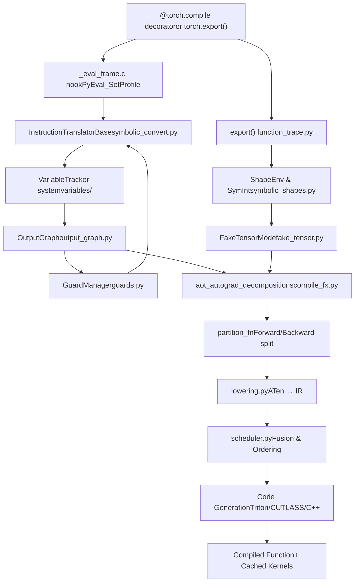
Sources: [test/inductor/test\_torchinductor.py1-200](https://github.com/pytorch/pytorch/blob/915982a4/test/inductor/test_torchinductor.py#L1-L200) [torch/\_dynamo/convert\_frame.py1-100](https://github.com/pytorch/pytorch/blob/915982a4/torch/_dynamo/convert_frame.py#L1-L100) [torch/\_inductor/compile\_fx.py1-100](https://github.com/pytorch/pytorch/blob/915982a4/torch/_inductor/compile_fx.py#L1-L100)

---

## Entry Points and Decorators

PyTorch provides two primary entry points for compilation:

| Entry Point | Purpose | Strictness | Use Case |
| --- | --- | --- | --- |
| `@torch.compile` | Eager-mode JIT compilation | Non-strict by default | Training & inference with graph breaks |
| `torch.export()` | Ahead-of-time graph export | Strict, no graph breaks | Deployment & serialization |

The `@torch.compile` decorator in [torch/\_dynamo/eval\_frame.py200-300](https://github.com/pytorch/pytorch/blob/915982a4/torch/_dynamo/eval_frame.py#L200-L300) installs a frame evaluation hook via `_eval_frame.c` that intercepts Python bytecode execution. When a decorated function runs, the hook redirects to `convert_frame()` in [torch/\_dynamo/convert\_frame.py100-200](https://github.com/pytorch/pytorch/blob/915982a4/torch/_dynamo/convert_frame.py#L100-L200)

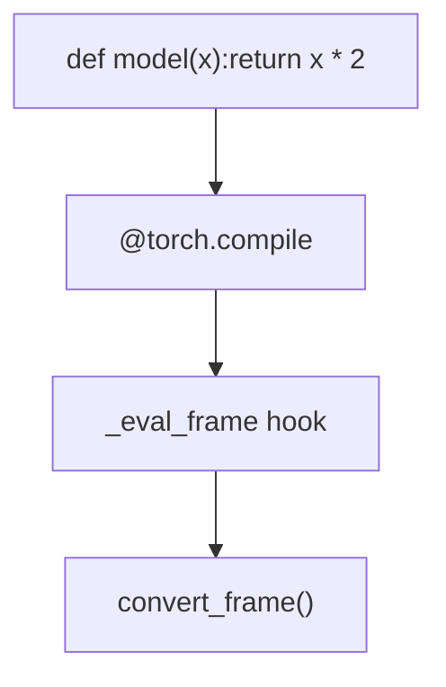
Sources: [torch/\_dynamo/eval\_frame.py1-300](https://github.com/pytorch/pytorch/blob/915982a4/torch/_dynamo/eval_frame.py#L1-L300) [torch/\_dynamo/convert\_frame.py1-200](https://github.com/pytorch/pytorch/blob/915982a4/torch/_dynamo/convert_frame.py#L1-L200)

---

## Key Data Structures

The compilation system uses several core data structures to represent program state:

### VariableTracker Hierarchy

`VariableTracker` is the base class for all symbolic values during tracing. Located in [torch/\_dynamo/variables/base.py1-200](https://github.com/pytorch/pytorch/blob/915982a4/torch/_dynamo/variables/base.py#L1-L200) it provides:

-   **Source tracking**: Where the value came from (e.g., `LocalSource`, `AttrSource`)
-   **Guard installation**: Conditions that must hold for the compiled code to be valid
-   **Graph reconstruction**: How to recreate the value in the FX graph

Key subclasses include:

| Class | File | Purpose |
| --- | --- | --- |
| `TensorVariable` | [torch/\_dynamo/variables/tensor.py](https://github.com/pytorch/pytorch/blob/915982a4/torch/_dynamo/variables/tensor.py) | Tracks tensor values with shape/dtype |
| `UserFunctionVariable` | [torch/\_dynamo/variables/functions.py](https://github.com/pytorch/pytorch/blob/915982a4/torch/_dynamo/variables/functions.py) | User-defined functions that can be inlined |
| `NNModuleVariable` | [torch/\_dynamo/variables/nn\_module.py](https://github.com/pytorch/pytorch/blob/915982a4/torch/_dynamo/variables/nn_module.py) | torch.nn.Module instances |
| `BuiltinVariable` | [torch/\_dynamo/variables/builtin.py](https://github.com/pytorch/pytorch/blob/915982a4/torch/_dynamo/variables/builtin.py) | Python built-in functions |
| `TorchInGraphFunctionVariable` | [torch/\_dynamo/variables/torch.py](https://github.com/pytorch/pytorch/blob/915982a4/torch/_dynamo/variables/torch.py) | torch.\* operations |

### OutputGraph Structure

The `OutputGraph` class in [torch/\_dynamo/output\_graph.py1-500](https://github.com/pytorch/pytorch/blob/915982a4/torch/_dynamo/output_graph.py#L1-L500) manages the FX graph being constructed:

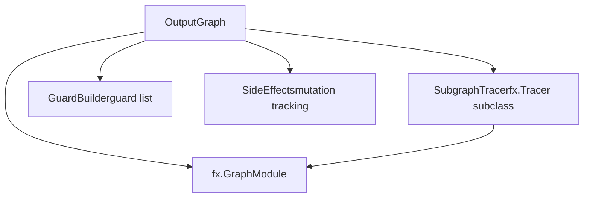
-   `SubgraphTracer`: FX tracer that handles nested higher-order operators
-   `GraphModule`: The actual FX graph being built
-   `GuardBuilder`: Accumulates guards for recompilation detection
-   `SideEffects`: Tracks mutations and side effects

Sources: [torch/\_dynamo/output\_graph.py1-500](https://github.com/pytorch/pytorch/blob/915982a4/torch/_dynamo/output_graph.py#L1-L500) [torch/\_dynamo/guards.py1-300](https://github.com/pytorch/pytorch/blob/915982a4/torch/_dynamo/guards.py#L1-L300)

---

## Bytecode Analysis and Symbolic Execution

### Frame Interception

When a compiled function executes, the `_eval_frame` hook in [torch/\_dynamo/eval\_frame.py200-400](https://github.com/pytorch/pytorch/blob/915982a4/torch/_dynamo/eval_frame.py#L200-L400) intercepts it. The hook:

1.  Checks the cache in [torch/\_dynamo/convert\_frame.py300-400](https://github.com/pytorch/pytorch/blob/915982a4/torch/_dynamo/convert_frame.py#L300-L400)
2.  Analyzes bytecode using `InstructionTranslatorBase` in [torch/\_dynamo/symbolic\_convert.py1-500](https://github.com/pytorch/pytorch/blob/915982a4/torch/_dynamo/symbolic_convert.py#L1-L500)
3.  Builds an FX graph via `OutputGraph`
4.  Compiles the graph through the backend
5.  Installs guards and caches the result

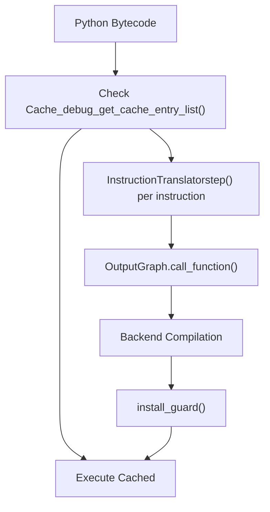
Sources: [torch/\_dynamo/convert\_frame.py100-500](https://github.com/pytorch/pytorch/blob/915982a4/torch/_dynamo/convert_frame.py#L100-L500) [torch/\_dynamo/symbolic\_convert.py1-500](https://github.com/pytorch/pytorch/blob/915982a4/torch/_dynamo/symbolic_convert.py#L1-L500)

### Instruction Translation

The `InstructionTranslator` class in [torch/\_dynamo/symbolic\_convert.py500-2000](https://github.com/pytorch/pytorch/blob/915982a4/torch/_dynamo/symbolic_convert.py#L500-L2000) implements a virtual machine that executes Python bytecode symbolically:

**Key methods by bytecode:**

| Bytecode | Handler Method | Purpose |
| --- | --- | --- |
| LOAD\_FAST | `LOAD_FAST()` | Load local variable |
| LOAD\_ATTR | `LOAD_ATTR()` | Get attribute |
| CALL\_FUNCTION | `CALL_FUNCTION()` | Function call |
| BINARY\_OP | `BINARY_OP()` | Binary operations |
| JUMP\_IF\_\* | `JUMP_IF_*()` | Conditional branches |
| FOR\_ITER | `FOR_ITER()` | Loop iteration |

Each handler manipulates the symbolic stack using `VariableTracker` instances. For example, `LOAD_ATTR()` in [torch/\_dynamo/symbolic\_convert.py1500-1600](https://github.com/pytorch/pytorch/blob/915982a4/torch/_dynamo/symbolic_convert.py#L1500-L1600):

```
def LOAD_ATTR(self, inst):
    obj = self.pop()  # Get object from stack
    result = obj.var_getattr(self, inst.argval)  # Call getattr on VariableTracker
    self.push(result)  # Push result
```
### Variable Tracking Example

Consider this code:

```
def fn(x):    return x.relu().sum()
```
During symbolic execution:

1.  `x` becomes a `TensorVariable` from `LOAD_FAST`
2.  `.relu()` → `LOAD_ATTR` creates `TorchInGraphFunctionVariable(torch.relu)`
3.  Function call → `CALL_FUNCTION` adds `call_function` node to FX graph
4.  `.sum()` → Similar process for sum operation

Sources: [torch/\_dynamo/symbolic\_convert.py500-2000](https://github.com/pytorch/pytorch/blob/915982a4/torch/_dynamo/symbolic_convert.py#L500-L2000) [torch/\_dynamo/variables/tensor.py1-500](https://github.com/pytorch/pytorch/blob/915982a4/torch/_dynamo/variables/tensor.py#L1-L500)

---

## Guard System

### Purpose

Guards are runtime checks that ensure compiled code remains valid. When a guard fails, recompilation occurs with updated assumptions.

### Guard Types

Located in [torch/\_dynamo/guards.py1-800](https://github.com/pytorch/pytorch/blob/915982a4/torch/_dynamo/guards.py#L1-L800):

| Guard Type | Class | Example |
| --- | --- | --- |
| Type guard | `EQUALS_MATCH` | `type(x) is torch.Tensor` |
| Shape guard | `SHAPE_MATCH` | `x.shape[0] == 32` |
| Value guard | `EQUALS_MATCH` | `config.value == True` |
| Dynamic shape | `DYNAMIC_DIM` | `2 <= x.shape[0] <= 1024` |

### Guard Installation Flow

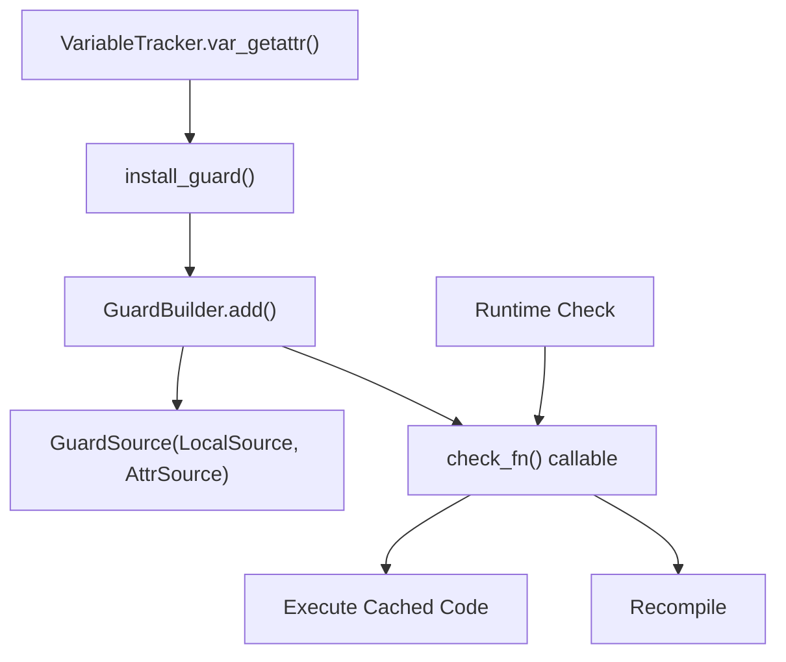
### Guard Creation

When accessing `x.shape[0]`, Dynamo creates:

1.  A `TensorVariable` for `x` with source `LocalSource("x")`
2.  A `SizeVariable` for `.shape[0]` with source `AttrSource(base=x, attr="shape[0]")`
3.  A guard: `LOCAL("x").shape[0] == 32`

This guard is stored in [torch/\_dynamo/output\_graph.py300-400](https://github.com/pytorch/pytorch/blob/915982a4/torch/_dynamo/output_graph.py#L300-L400) and checked before executing cached code.

Sources: [torch/\_dynamo/guards.py1-800](https://github.com/pytorch/pytorch/blob/915982a4/torch/_dynamo/guards.py#L1-L800) [torch/\_dynamo/output\_graph.py300-500](https://github.com/pytorch/pytorch/blob/915982a4/torch/_dynamo/output_graph.py#L300-L500)

---

## Graph Construction

### FX Graph Representation

The FX graph in [torch/fx/graph.py](https://github.com/pytorch/pytorch/blob/915982a4/torch/fx/graph.py) represents the computational graph:

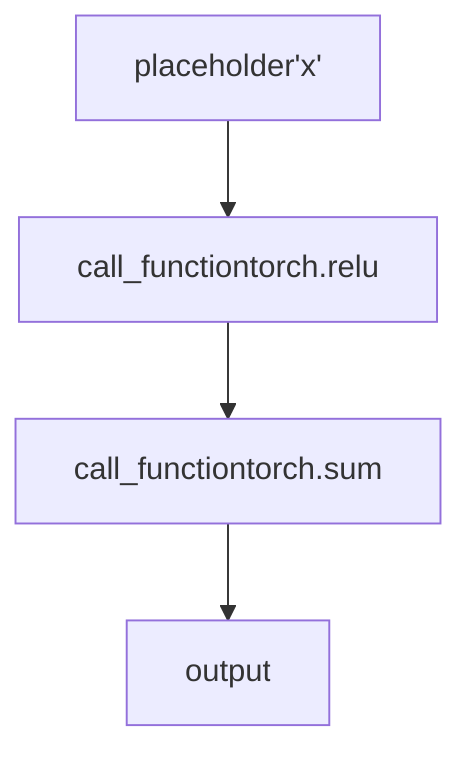
### Node Creation

When `OutputGraph.call_function()` is invoked in [torch/\_dynamo/output\_graph.py800-1000](https://github.com/pytorch/pytorch/blob/915982a4/torch/_dynamo/output_graph.py#L800-L1000):

1.  Creates an `fx.Node` with `op='call_function'`
2.  Records `target` (the function), `args`, and `kwargs`
3.  Wraps result in appropriate `VariableTracker`
4.  Adds node to the graph

Example from [torch/\_dynamo/output\_graph.py900-950](https://github.com/pytorch/pytorch/blob/915982a4/torch/_dynamo/output_graph.py#L900-L950):

```
def call_function(self, fn, args, kwargs):
    # Create FX node
    node = self.create_proxy("call_function", fn, args, kwargs)
    # Wrap in VariableTracker
    return wrap_fx_proxy(self, node)
```
### Higher-Order Operators

For higher-order ops like `torch.cond`, Dynamo uses nested `SubgraphTracer` instances in [torch/\_dynamo/output\_graph.py1500-1800](https://github.com/pytorch/pytorch/blob/915982a4/torch/_dynamo/output_graph.py#L1500-L1800):

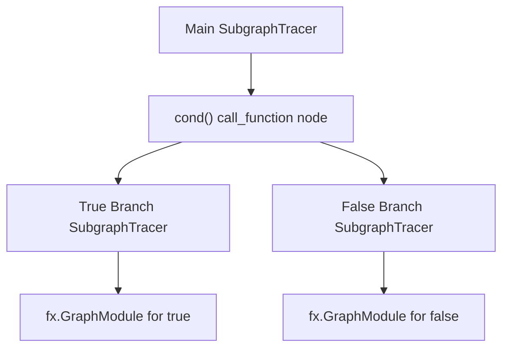
Sources: [torch/\_dynamo/output\_graph.py1-2000](https://github.com/pytorch/pytorch/blob/915982a4/torch/_dynamo/output_graph.py#L1-L2000) [torch/\_dynamo/variables/higher\_order\_ops.py1-500](https://github.com/pytorch/pytorch/blob/915982a4/torch/_dynamo/variables/higher_order_ops.py#L1-L500)

---

## Specialization and Recompilation

### Cache Structure

Each function has a cache in [torch/\_dynamo/eval\_frame.py500-700](https://github.com/pytorch/pytorch/blob/915982a4/torch/_dynamo/eval_frame.py#L500-L700) keyed by:

-   Guard check results
-   Input shapes (when dynamic)
-   Code object identity

### Recompilation Triggers

From [torch/\_dynamo/convert\_frame.py200-300](https://github.com/pytorch/pytorch/blob/915982a4/torch/_dynamo/convert_frame.py#L200-L300) recompilation occurs when:

1.  **Guard failure**: A guard check returns `False`
2.  **New code path**: Encountering a branch not seen before
3.  **Shape change**: Input shape changes beyond dynamic range
4.  **Type change**: Input type differs

### Speculation and Rollback

The `SpeculationLog` in [torch/\_dynamo/symbolic\_convert.py270-310](https://github.com/pytorch/pytorch/blob/915982a4/torch/_dynamo/symbolic_convert.py#L270-L310) handles failed speculations:

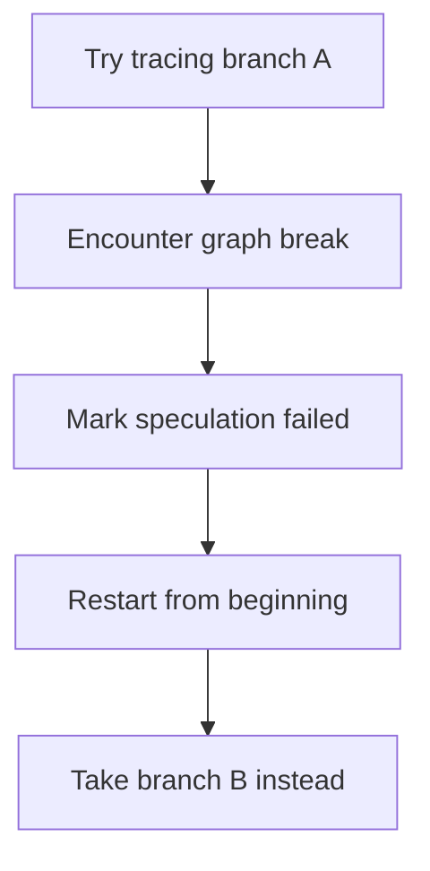
When speculation fails, analysis restarts from the function beginning but avoids the failed path.

Sources: [torch/\_dynamo/symbolic\_convert.py270-350](https://github.com/pytorch/pytorch/blob/915982a4/torch/_dynamo/symbolic_convert.py#L270-L350) [torch/\_dynamo/convert\_frame.py200-400](https://github.com/pytorch/pytorch/blob/915982a4/torch/_dynamo/convert_frame.py#L200-L400)

---

## Graph Breaks

### Definition

A graph break splits compilation into multiple graphs when Dynamo encounters unsupported patterns.

### Common Causes

From [torch/\_dynamo/graph\_break\_registry.json1-100](https://github.com/pytorch/pytorch/blob/915982a4/torch/_dynamo/graph_break_registry.json#L1-L100):

| Category | Example | Reason |
| --- | --- | --- |
| Unsupported operation | `pdb.set_trace()` | Not traceable |
| Dynamic control flow | `if x.item() > 0` | Data-dependent branch |
| Side effects | `print(x)` | External I/O |
| Unsupported types | Custom C++ extension | No tracing support |

### Graph Break Handling

From [torch/\_dynamo/symbolic\_convert.py3000-3200](https://github.com/pytorch/pytorch/blob/915982a4/torch/_dynamo/symbolic_convert.py#L3000-L3200):

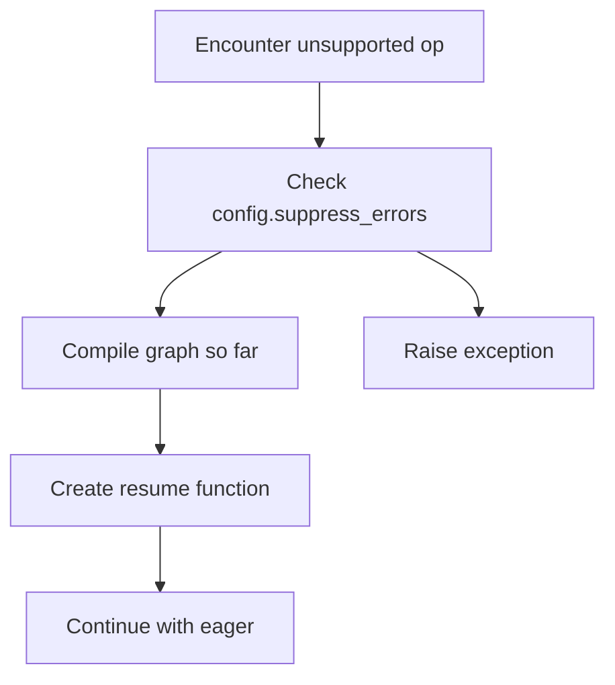
The resume function in [torch/\_dynamo/resume\_execution.py1-300](https://github.com/pytorch/pytorch/blob/915982a4/torch/_dynamo/resume_execution.py#L1-L300) continues execution in eager mode after the graph break point.

Sources: [torch/\_dynamo/symbolic\_convert.py3000-3500](https://github.com/pytorch/pytorch/blob/915982a4/torch/_dynamo/symbolic_convert.py#L3000-L3500) [torch/\_dynamo/resume\_execution.py1-300](https://github.com/pytorch/pytorch/blob/915982a4/torch/_dynamo/resume_execution.py#L1-L300)

---

## Symbolic Shapes

### ShapeEnv

The `ShapeEnv` class in [torch/fx/experimental/symbolic\_shapes.py1-1000](https://github.com/pytorch/pytorch/blob/915982a4/torch/fx/experimental/symbolic_shapes.py#L1-L1000) tracks symbolic shape constraints:

-   Maintains mappings from `SymInt` to `sympy.Expr`
-   Records constraints like `s0 >= 2`
-   Evaluates predicates with Z3 solver when needed

### SymInt System

`SymInt` in [torch/fx/experimental/symbolic\_shapes.py2000-2500](https://github.com/pytorch/pytorch/blob/915982a4/torch/fx/experimental/symbolic_shapes.py#L2000-L2500) represents symbolic integer values:

```
x = torch.randn(n, 10)  # n is SymIntresult = x.sum()  # Shape tracked symbolically
```
During tracing:

1.  `n` becomes a `SymInt` backed by `sympy.Symbol("s0")`
2.  Operations on `n` create `sympy` expressions
3.  `ShapeEnv` tracks constraints: `s0 >= 0`

### FakeTensorMode

`FakeTensorMode` in [torch/\_subclasses/fake\_tensor.py1-500](https://github.com/pytorch/pytorch/blob/915982a4/torch/_subclasses/fake_tensor.py#L1-L500) enables shape inference without materializing tensors:

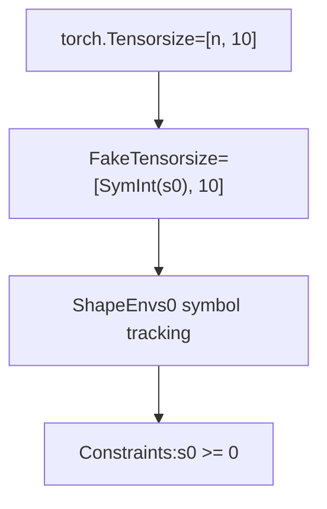
Operations on `FakeTensor` propagate symbolic shapes without executing kernels.

Sources: [torch/fx/experimental/symbolic\_shapes.py1-3000](https://github.com/pytorch/pytorch/blob/915982a4/torch/fx/experimental/symbolic_shapes.py#L1-L3000) [torch/\_subclasses/fake\_tensor.py1-800](https://github.com/pytorch/pytorch/blob/915982a4/torch/_subclasses/fake_tensor.py#L1-L800)

---

## Lowering to Inductor IR

### ATen → Inductor IR

The lowering process in [torch/\_inductor/lowering.py1-500](https://github.com/pytorch/pytorch/blob/915982a4/torch/_inductor/lowering.py#L1-L500) converts ATen operations to Inductor's IR:

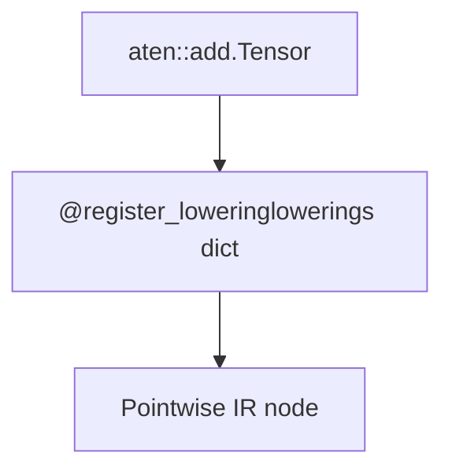
### IR Node Types

From [torch/\_inductor/ir.py1-1000](https://github.com/pytorch/pytorch/blob/915982a4/torch/_inductor/ir.py#L1-L1000):

| IR Node | Purpose | Example |
| --- | --- | --- |
| `Pointwise` | Element-wise ops | `x + y` |
| `Reduction` | Reduction ops | `x.sum()` |
| `ComputedBuffer` | Intermediate tensors | Temp storage |
| `InputBuffer` | Graph inputs | Function args |
| `ExternKernel` | External calls | cuBLAS |

### Lowering Registration

Lowerings are registered in [torch/\_inductor/lowering.py500-1000](https://github.com/pytorch/pytorch/blob/915982a4/torch/_inductor/lowering.py#L500-L1000):

```
@register_lowering(aten.add)def add(x, y):    return ops.add(x, y)  # Create Pointwise IR
```
The `ops` object dispatches to device-specific implementations.

### Example: Matrix Multiplication

For `torch.mm`, the lowering in [torch/\_inductor/lowering.py2000-2500](https://github.com/pytorch/pytorch/blob/915982a4/torch/_inductor/lowering.py#L2000-L2500):

1.  Checks for templates (CUTLASS, Triton MM)
2.  Considers tuned implementations in [torch/\_inductor/kernel/mm.py](https://github.com/pytorch/pytorch/blob/915982a4/torch/_inductor/kernel/mm.py)
3.  Falls back to ATen if needed
4.  Returns `ExternKernelCaller` for cuBLAS/MKL or template caller

Sources: [torch/\_inductor/lowering.py1-3000](https://github.com/pytorch/pytorch/blob/915982a4/torch/_inductor/lowering.py#L1-L3000) [torch/\_inductor/ir.py1-5000](https://github.com/pytorch/pytorch/blob/915982a4/torch/_inductor/ir.py#L1-L5000)

---

## Scheduling and Fusion

### Scheduler Architecture

The `Scheduler` class in [torch/\_inductor/scheduler.py1-500](https://github.com/pytorch/pytorch/blob/915982a4/torch/_inductor/scheduler.py#L1-L500) orchestrates kernel fusion:

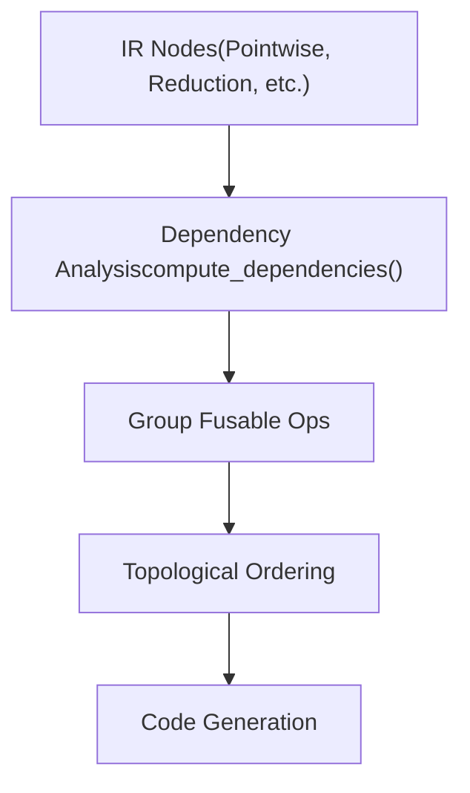
### Fusion Decisions

From [torch/\_inductor/scheduler.py1000-1500](https://github.com/pytorch/pytorch/blob/915982a4/torch/_inductor/scheduler.py#L1000-L1500) fusion considers:

1.  **Memory dependencies**: Can ops share memory?
2.  **Device compatibility**: Same device?
3.  **Iteration space**: Compatible loop structures?
4.  **Buffer reuse**: Can intermediate buffers be eliminated?

### BaseSchedulerNode

Each IR node becomes a `BaseSchedulerNode` in [torch/\_inductor/scheduler.py200-400](https://github.com/pytorch/pytorch/blob/915982a4/torch/_inductor/scheduler.py#L200-L400):

-   `SchedulerNode`: Single operation
-   `FusedSchedulerNode`: Multiple fused operations
-   `ExternKernelSchedulerNode`: External kernel call

### Fusion Example

For `(x + y).relu()`:

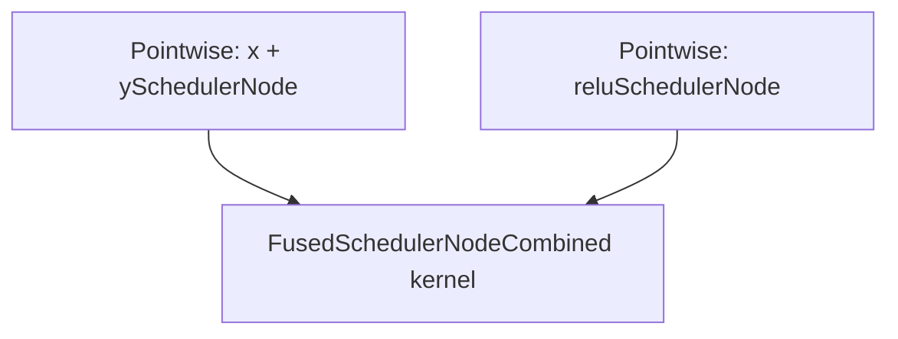
Both operations fuse into a single Triton kernel.

Sources: [torch/\_inductor/scheduler.py1-3000](https://github.com/pytorch/pytorch/blob/915982a4/torch/_inductor/scheduler.py#L1-L3000)

---

## Code Generation

### Backends

TorchInductor supports multiple code generation backends:

| Backend | Implementation | Use Case |
| --- | --- | --- |
| Triton | [torch/\_inductor/codegen/triton.py](https://github.com/pytorch/pytorch/blob/915982a4/torch/_inductor/codegen/triton.py) | GPU kernels |
| CUTLASS | [torch/\_inductor/codegen/cutlass/](https://github.com/pytorch/pytorch/blob/915982a4/torch/_inductor/codegen/cutlass/) | NVIDIA GEMM |
| C++ | [torch/\_inductor/codegen/cpp.py](https://github.com/pytorch/pytorch/blob/915982a4/torch/_inductor/codegen/cpp.py) | CPU kernels |

### Triton Code Generation

The `TritonKernel` class in [torch/\_inductor/codegen/triton.py1-1000](https://github.com/pytorch/pytorch/blob/915982a4/torch/_inductor/codegen/triton.py#L1-L1000) generates Triton code:

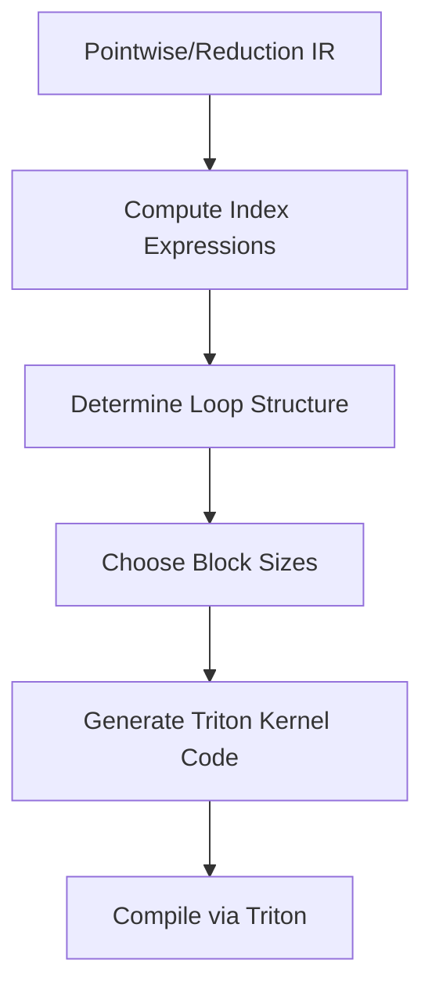
### Triton Template Example

For matrix multiplication, [torch/\_inductor/codegen/triton\_templates.py1-500](https://github.com/pytorch/pytorch/blob/915982a4/torch/_inductor/codegen/triton_templates.py#L1-L500) provides templates:

```
@triton.jitdef matmul_kernel(A, B, C, M, N, K, ...):    # Template code with placeholders    pid = tl.program_id(0)    # ... block computation
```
### Autotuning

`CachingAutotuner` in [torch/\_inductor/runtime/triton\_heuristics.py300-500](https://github.com/pytorch/pytorch/blob/915982a4/torch/_inductor/runtime/triton_heuristics.py#L300-L500) benchmarks multiple configurations:

1.  Generates configs (block sizes, warps, stages)
2.  Compiles each variant
3.  Benchmarks on actual hardware
4.  Caches best config in [torch/\_inductor/autotune\_cache.py](https://github.com/pytorch/pytorch/blob/915982a4/torch/_inductor/autotune_cache.py)

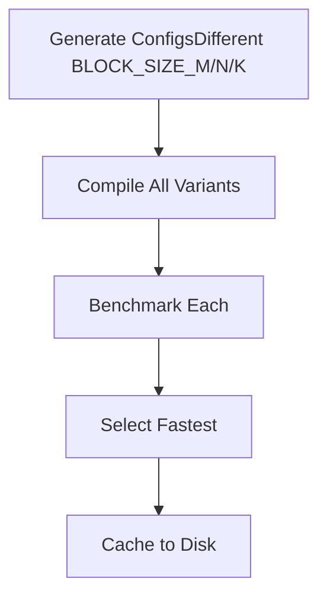
Sources: [torch/\_inductor/codegen/triton.py1-3000](https://github.com/pytorch/pytorch/blob/915982a4/torch/_inductor/codegen/triton.py#L1-L3000) [torch/\_inductor/runtime/triton\_heuristics.py1-2000](https://github.com/pytorch/pytorch/blob/915982a4/torch/_inductor/runtime/triton_heuristics.py#L1-L2000)

---

## Wrapper Code Generation

### Purpose

The wrapper in [torch/\_inductor/codegen/wrapper.py1-500](https://github.com/pytorch/pytorch/blob/915982a4/torch/_inductor/codegen/wrapper.py#L1-L500) generates Python code that:

1.  Allocates output tensors
2.  Calls generated kernels
3.  Handles memory management
4.  Manages CUDA streams/graphs

### PythonWrapperCodegen

From [torch/\_inductor/codegen/wrapper.py500-1000](https://github.com/pytorch/pytorch/blob/915982a4/torch/_inductor/codegen/wrapper.py#L500-L1000):

```
def codegen_allocation(self, buffer):    # Generate: empty_strided(size, stride, ...)    size = buffer.get_size()    stride = buffer.get_stride()    return f"torch.empty_strided({size}, {stride}, ...)" def codegen_kernel_call(self, kernel):    # Generate: kernel.run(args, grid, stream)    return f"{kernel.name}.run(...)"
```
### Generated Wrapper Example

For `(x + y).relu()`, the wrapper generates:

```
def forward(x, y):    # Allocation    buf0 = torch.empty_strided((100,), (1,), device='cuda')    # Kernel call    triton_poi_fused_add_relu_0.run(x, y, buf0, 100, grid=...)    return buf0
```
Sources: [torch/\_inductor/codegen/wrapper.py1-3000](https://github.com/pytorch/pytorch/blob/915982a4/torch/_inductor/codegen/wrapper.py#L1-L3000)

---

## Compilation Cache

### Cache Layers

Multiple caching layers avoid recompilation:

| Cache | File | Purpose |
| --- | --- | --- |
| FXGraphCache | [torch/\_inductor/fx\_passes/fxgraph\_cache.py](https://github.com/pytorch/pytorch/blob/915982a4/torch/_inductor/fx_passes/fxgraph_cache.py) | Caches FX graphs |
| PyCodeCache | [torch/\_inductor/codecache.py1000-1500](https://github.com/pytorch/pytorch/blob/915982a4/torch/_inductor/codecache.py#L1000-L1500) | Caches Python wrapper code |
| TritonCodeCache | [torch/\_inductor/codecache.py2000-2500](https://github.com/pytorch/pytorch/blob/915982a4/torch/_inductor/codecache.py#L2000-L2500) | Caches compiled Triton kernels |
| AutotuneCache | [torch/\_inductor/autotune\_cache.py](https://github.com/pytorch/pytorch/blob/915982a4/torch/_inductor/autotune_cache.py) | Caches autotuning results |

### Cache Key Generation

From [torch/\_inductor/codecache.py500-700](https://github.com/pytorch/pytorch/blob/915982a4/torch/_inductor/codecache.py#L500-L700):

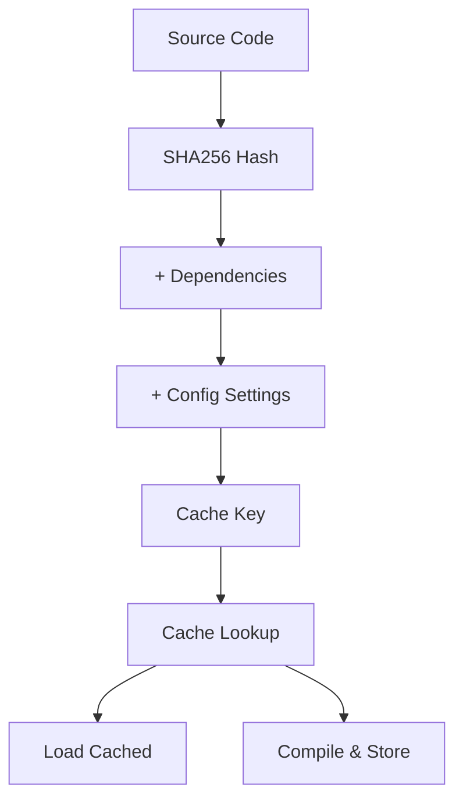
### FXGraphCache Details

The FX graph cache in [torch/\_inductor/fx\_passes/fxgraph\_cache.py1-500](https://github.com/pytorch/pytorch/blob/915982a4/torch/_inductor/fx_passes/fxgraph_cache.py#L1-L500) stores:

-   Serialized FX graph
-   Guard conditions
-   Compiled artifacts
-   Metadata (shapes, devices, etc.)

On cache hit, bypasses Dynamo/AOTAutograd entirely.

Sources: [torch/\_inductor/codecache.py1-3000](https://github.com/pytorch/pytorch/blob/915982a4/torch/_inductor/codecache.py#L1-L3000) [torch/\_inductor/fx\_passes/fxgraph\_cache.py1-800](https://github.com/pytorch/pytorch/blob/915982a4/torch/_inductor/fx_passes/fxgraph_cache.py#L1-L800)

---

## Configuration System

### torch.\_inductor.config

The config module in [torch/\_inductor/config.py1-500](https://github.com/pytorch/pytorch/blob/915982a4/torch/_inductor/config.py#L1-L500) provides settings:

```
# Example settingsconfig.max_autotune = True  # Enable autotuningconfig.triton.cudagraphs = True  # Use CUDA graphsconfig.freezing = True  # Freeze weights
```
### Important Flags

From [torch/\_inductor/config.py100-300](https://github.com/pytorch/pytorch/blob/915982a4/torch/_inductor/config.py#L100-L300):

| Flag | Purpose | Default |
| --- | --- | --- |
| `max_autotune` | Enable slow autotuning | False |
| `max_autotune_gemm` | Autotune GEMM only | False |
| `triton.cudagraphs` | Use CUDA graphs | True |
| `cpp_wrapper` | Generate C++ wrapper | False |
| `freezing` | Freeze parameters | False |

### Dynamic Configuration

Settings can be patched temporarily:

```
with config.patch({"max_autotune": True}):    torch.compile(model)(inputs)
```
Sources: [torch/\_inductor/config.py1-1000](https://github.com/pytorch/pytorch/blob/915982a4/torch/_inductor/config.py#L1-L1000)

---

## Performance Profiling

### Compilation Metrics

From [torch/\_inductor/metrics.py](https://github.com/pytorch/pytorch/blob/915982a4/torch/_inductor/metrics.py):

-   `generated_kernel_count`: Number of generated kernels
-   `generated_cpp_vec_kernel_count`: Vectorized CPU kernels
-   `inductor_time`: Total compilation time
-   `code_gen_time`: Code generation time

### Benchmarking

The benchmarking system in [torch/\_inductor/runtime/benchmarking.py1-300](https://github.com/pytorch/pytorch/blob/915982a4/torch/_inductor/runtime/benchmarking.py#L1-L300) measures:

1.  Kernel execution time
2.  Memory bandwidth utilization
3.  FLOPS achieved

### Logging

Key loggers in [torch/\_inductor/utils.py100-200](https://github.com/pytorch/pytorch/blob/915982a4/torch/_inductor/utils.py#L100-L200):

-   `torch._inductor.scheduler`: Scheduling decisions
-   `torch._inductor.fusion`: Fusion decisions
-   `torch._inductor.select_algorithm`: Algorithm selection

Enable with:

```
torch._logging.set_logs(inductor=logging.DEBUG)
```
Sources: [torch/\_inductor/metrics.py1-200](https://github.com/pytorch/pytorch/blob/915982a4/torch/_inductor/metrics.py#L1-L200) [torch/\_inductor/runtime/benchmarking.py1-500](https://github.com/pytorch/pytorch/blob/915982a4/torch/_inductor/runtime/benchmarking.py#L1-L500)

---

## Testing Infrastructure

### Test Organization

Compilation tests in:

-   [test/inductor/test\_torchinductor.py1-1000](https://github.com/pytorch/pytorch/blob/915982a4/test/inductor/test_torchinductor.py#L1-L1000): Core Inductor functionality
-   [test/inductor/test\_aot\_inductor.py1-500](https://github.com/pytorch/pytorch/blob/915982a4/test/inductor/test_aot_inductor.py#L1-L500): AOT compilation
-   [test/export/test\_export.py1-500](https://github.com/pytorch/pytorch/blob/915982a4/test/export/test_export.py#L1-L500): Export functionality
-   [test/dynamo/test\_misc.py1-500](https://github.com/pytorch/pytorch/blob/915982a4/test/dynamo/test_misc.py#L1-L500): Dynamo tracing

### Helper Functions

From [test/inductor/test\_torchinductor.py400-500](https://github.com/pytorch/pytorch/blob/915982a4/test/inductor/test_torchinductor.py#L400-L500):

```
def check_model(self, model, inputs):    # Compare eager vs compiled    expected = model(*inputs)    compiled = torch.compile(model)    actual = compiled(*inputs)    self.assertEqual(expected, actual)
```
### OpInfo Database

The OpInfo system in [torch/testing/\_internal/common\_methods\_invocations.py](https://github.com/pytorch/pytorch/blob/915982a4/torch/testing/_internal/common_methods_invocations.py) provides:

-   ~1000+ operator definitions
-   Sample input generators
-   Expected outputs
-   Device compatibility info

Sources: [test/inductor/test\_torchinductor.py1-2000](https://github.com/pytorch/pytorch/blob/915982a4/test/inductor/test_torchinductor.py#L1-L2000) [test/export/test\_export.py1-1000](https://github.com/pytorch/pytorch/blob/915982a4/test/export/test_export.py#L1-L1000)

---

## Debugging Tools

### Graph Visualization

```
# Print FX graphprint(exported_program.graph) # Visualize with GraphVizexported_program.graph.print_tabular()
```
### Intermediate Outputs

From [torch/\_inductor/utils.py500-700](https://github.com/pytorch/pytorch/blob/915982a4/torch/_inductor/utils.py#L500-L700):

```
# Get generated codecode = run_and_get_code(torch.compile(model), inputs)print(code[0])  # Wrapper codeprint(code[1])  # Kernel code
```
### Minifier

The minifier in [torch/\_dynamo/debug\_utils.py](https://github.com/pytorch/pytorch/blob/915982a4/torch/_dynamo/debug_utils.py) automatically reduces failing cases:

```
# On compilation error, minification runs automatically# Produces minimal reproducer in /tmp/minifier_*
```
### Graph Break Logging

From [torch/\_dynamo/utils.py1000-1200](https://github.com/pytorch/pytorch/blob/915982a4/torch/_dynamo/utils.py#L1000-L1200):

```
import torch._dynamotorch._dynamo.config.verbose = True  # Log graph breakstorch._dynamo.explain(model)(inputs)  # Explain why breaks occur
```
Sources: [torch/\_inductor/utils.py1-2000](https://github.com/pytorch/pytorch/blob/915982a4/torch/_inductor/utils.py#L1-L2000) [torch/\_dynamo/debug\_utils.py1-500](https://github.com/pytorch/pytorch/blob/915982a4/torch/_dynamo/debug_utils.py#L1-L500)
