# torch.compile Pipeline Overview

Relevant source files

-   [.ci/docker/ci\_commit\_pins/torchbench.txt](https://github.com/pytorch/pytorch/blob/915982a4/.ci/docker/ci_commit_pins/torchbench.txt)
-   [aten/src/ATen/core/PythonFallbackKernel.cpp](https://github.com/pytorch/pytorch/blob/915982a4/aten/src/ATen/core/PythonFallbackKernel.cpp)
-   [aten/src/ATen/native/TensorCompare.cpp](https://github.com/pytorch/pytorch/blob/915982a4/aten/src/ATen/native/TensorCompare.cpp)
-   [test/distributed/\_composable/fsdp/test\_fully\_shard\_compile.py](https://github.com/pytorch/pytorch/blob/915982a4/test/distributed/_composable/fsdp/test_fully_shard_compile.py)
-   [test/distributed/tensor/test\_dtensor\_export.py](https://github.com/pytorch/pytorch/blob/915982a4/test/distributed/tensor/test_dtensor_export.py)
-   [test/dynamo/test\_activation\_checkpointing.py](https://github.com/pytorch/pytorch/blob/915982a4/test/dynamo/test_activation_checkpointing.py)
-   [test/dynamo/test\_activation\_offloading.py](https://github.com/pytorch/pytorch/blob/915982a4/test/dynamo/test_activation_offloading.py)
-   [test/dynamo/test\_aot\_autograd.py](https://github.com/pytorch/pytorch/blob/915982a4/test/dynamo/test_aot_autograd.py)
-   [test/dynamo/test\_dicts.py](https://github.com/pytorch/pytorch/blob/915982a4/test/dynamo/test_dicts.py)
-   [test/dynamo/test\_error\_messages.py](https://github.com/pytorch/pytorch/blob/915982a4/test/dynamo/test_error_messages.py)
-   [test/dynamo/test\_functions.py](https://github.com/pytorch/pytorch/blob/915982a4/test/dynamo/test_functions.py)
-   [test/dynamo/test\_fwd\_loss\_bwd.py](https://github.com/pytorch/pytorch/blob/915982a4/test/dynamo/test_fwd_loss_bwd.py)
-   [test/dynamo/test\_list.py](https://github.com/pytorch/pytorch/blob/915982a4/test/dynamo/test_list.py)
-   [test/dynamo/test\_misc.py](https://github.com/pytorch/pytorch/blob/915982a4/test/dynamo/test_misc.py)
-   [test/dynamo/test\_modules.py](https://github.com/pytorch/pytorch/blob/915982a4/test/dynamo/test_modules.py)
-   [test/dynamo/test\_nested\_graph\_breaks.py](https://github.com/pytorch/pytorch/blob/915982a4/test/dynamo/test_nested_graph_breaks.py)
-   [test/dynamo/test\_repros.py](https://github.com/pytorch/pytorch/blob/915982a4/test/dynamo/test_repros.py)
-   [test/dynamo/test\_utils.py](https://github.com/pytorch/pytorch/blob/915982a4/test/dynamo/test_utils.py)
-   [test/dynamo\_expected\_failures/TestCustomOp.test\_impl\_device\_cpu](https://github.com/pytorch/pytorch/blob/915982a4/test/dynamo_expected_failures/TestCustomOp.test_impl_device_cpu)
-   [test/export/test\_experimental.py](https://github.com/pytorch/pytorch/blob/915982a4/test/export/test_experimental.py)
-   [test/export/test\_export.py](https://github.com/pytorch/pytorch/blob/915982a4/test/export/test_export.py)
-   [test/functorch/test\_aotdispatch.py](https://github.com/pytorch/pytorch/blob/915982a4/test/functorch/test_aotdispatch.py)
-   [test/fx/test\_fx\_xform\_observer.py](https://github.com/pytorch/pytorch/blob/915982a4/test/fx/test_fx_xform_observer.py)
-   [test/inductor/test\_aot\_inductor.py](https://github.com/pytorch/pytorch/blob/915982a4/test/inductor/test_aot_inductor.py)
-   [test/inductor/test\_combo\_kernels.py](https://github.com/pytorch/pytorch/blob/915982a4/test/inductor/test_combo_kernels.py)
-   [test/inductor/test\_custom\_op\_autotune.py](https://github.com/pytorch/pytorch/blob/915982a4/test/inductor/test_custom_op_autotune.py)
-   [test/inductor/test\_foreach.py](https://github.com/pytorch/pytorch/blob/915982a4/test/inductor/test_foreach.py)
-   [test/inductor/test\_max\_autotune.py](https://github.com/pytorch/pytorch/blob/915982a4/test/inductor/test_max_autotune.py)
-   [test/inductor/test\_mmdecomp.py](https://github.com/pytorch/pytorch/blob/915982a4/test/inductor/test_mmdecomp.py)
-   [test/inductor/test\_torchinductor.py](https://github.com/pytorch/pytorch/blob/915982a4/test/inductor/test_torchinductor.py)
-   [test/inductor/test\_torchinductor\_codegen\_dynamic\_shapes.py](https://github.com/pytorch/pytorch/blob/915982a4/test/inductor/test_torchinductor_codegen_dynamic_shapes.py)
-   [test/profiler/test\_record\_function.py](https://github.com/pytorch/pytorch/blob/915982a4/test/profiler/test_record_function.py)
-   [test/profiler/test\_torch\_tidy.py](https://github.com/pytorch/pytorch/blob/915982a4/test/profiler/test_torch_tidy.py)
-   [test/test\_autograd\_fallback.py](https://github.com/pytorch/pytorch/blob/915982a4/test/test_autograd_fallback.py)
-   [test/test\_dynamic\_shapes.py](https://github.com/pytorch/pytorch/blob/915982a4/test/test_dynamic_shapes.py)
-   [test/test\_proxy\_tensor.py](https://github.com/pytorch/pytorch/blob/915982a4/test/test_proxy_tensor.py)
-   [torch/\_dynamo/bytecode\_analysis.py](https://github.com/pytorch/pytorch/blob/915982a4/torch/_dynamo/bytecode_analysis.py)
-   [torch/\_dynamo/bytecode\_transformation.py](https://github.com/pytorch/pytorch/blob/915982a4/torch/_dynamo/bytecode_transformation.py)
-   [torch/\_dynamo/codegen.py](https://github.com/pytorch/pytorch/blob/915982a4/torch/_dynamo/codegen.py)
-   [torch/\_dynamo/config.py](https://github.com/pytorch/pytorch/blob/915982a4/torch/_dynamo/config.py)
-   [torch/\_dynamo/convert\_frame.py](https://github.com/pytorch/pytorch/blob/915982a4/torch/_dynamo/convert_frame.py)
-   [torch/\_dynamo/eval\_frame.py](https://github.com/pytorch/pytorch/blob/915982a4/torch/_dynamo/eval_frame.py)
-   [torch/\_dynamo/exc.py](https://github.com/pytorch/pytorch/blob/915982a4/torch/_dynamo/exc.py)
-   [torch/\_dynamo/functional\_export.py](https://github.com/pytorch/pytorch/blob/915982a4/torch/_dynamo/functional_export.py)
-   [torch/\_dynamo/graph\_break\_registry.json](https://github.com/pytorch/pytorch/blob/915982a4/torch/_dynamo/graph_break_registry.json)
-   [torch/\_dynamo/output\_graph.py](https://github.com/pytorch/pytorch/blob/915982a4/torch/_dynamo/output_graph.py)
-   [torch/\_dynamo/resume\_execution.py](https://github.com/pytorch/pytorch/blob/915982a4/torch/_dynamo/resume_execution.py)
-   [torch/\_dynamo/side\_effects.py](https://github.com/pytorch/pytorch/blob/915982a4/torch/_dynamo/side_effects.py)
-   [torch/\_dynamo/symbolic\_convert.py](https://github.com/pytorch/pytorch/blob/915982a4/torch/_dynamo/symbolic_convert.py)
-   [torch/\_dynamo/test\_case.py](https://github.com/pytorch/pytorch/blob/915982a4/torch/_dynamo/test_case.py)
-   [torch/\_dynamo/testing.py](https://github.com/pytorch/pytorch/blob/915982a4/torch/_dynamo/testing.py)
-   [torch/\_dynamo/trace\_rules.py](https://github.com/pytorch/pytorch/blob/915982a4/torch/_dynamo/trace_rules.py)
-   [torch/\_dynamo/utils.py](https://github.com/pytorch/pytorch/blob/915982a4/torch/_dynamo/utils.py)
-   [torch/\_dynamo/variables/\_\_init\_\_.py](https://github.com/pytorch/pytorch/blob/915982a4/torch/_dynamo/variables/__init__.py)
-   [torch/\_dynamo/variables/base.py](https://github.com/pytorch/pytorch/blob/915982a4/torch/_dynamo/variables/base.py)
-   [torch/\_dynamo/variables/builder.py](https://github.com/pytorch/pytorch/blob/915982a4/torch/_dynamo/variables/builder.py)
-   [torch/\_dynamo/variables/builtin.py](https://github.com/pytorch/pytorch/blob/915982a4/torch/_dynamo/variables/builtin.py)
-   [torch/\_dynamo/variables/constant.py](https://github.com/pytorch/pytorch/blob/915982a4/torch/_dynamo/variables/constant.py)
-   [torch/\_dynamo/variables/ctx\_manager.py](https://github.com/pytorch/pytorch/blob/915982a4/torch/_dynamo/variables/ctx_manager.py)
-   [torch/\_dynamo/variables/dicts.py](https://github.com/pytorch/pytorch/blob/915982a4/torch/_dynamo/variables/dicts.py)
-   [torch/\_dynamo/variables/functions.py](https://github.com/pytorch/pytorch/blob/915982a4/torch/_dynamo/variables/functions.py)
-   [torch/\_dynamo/variables/higher\_order\_ops.py](https://github.com/pytorch/pytorch/blob/915982a4/torch/_dynamo/variables/higher_order_ops.py)
-   [torch/\_dynamo/variables/iter.py](https://github.com/pytorch/pytorch/blob/915982a4/torch/_dynamo/variables/iter.py)
-   [torch/\_dynamo/variables/lists.py](https://github.com/pytorch/pytorch/blob/915982a4/torch/_dynamo/variables/lists.py)
-   [torch/\_dynamo/variables/misc.py](https://github.com/pytorch/pytorch/blob/915982a4/torch/_dynamo/variables/misc.py)
-   [torch/\_dynamo/variables/nn\_module.py](https://github.com/pytorch/pytorch/blob/915982a4/torch/_dynamo/variables/nn_module.py)
-   [torch/\_dynamo/variables/optimizer.py](https://github.com/pytorch/pytorch/blob/915982a4/torch/_dynamo/variables/optimizer.py)
-   [torch/\_dynamo/variables/tensor.py](https://github.com/pytorch/pytorch/blob/915982a4/torch/_dynamo/variables/tensor.py)
-   [torch/\_dynamo/variables/torch.py](https://github.com/pytorch/pytorch/blob/915982a4/torch/_dynamo/variables/torch.py)
-   [torch/\_dynamo/variables/user\_defined.py](https://github.com/pytorch/pytorch/blob/915982a4/torch/_dynamo/variables/user_defined.py)
-   [torch/\_export/non\_strict\_utils.py](https://github.com/pytorch/pytorch/blob/915982a4/torch/_export/non_strict_utils.py)
-   [torch/\_functorch/\_activation\_offloading/\_\_init\_\_.py](https://github.com/pytorch/pytorch/blob/915982a4/torch/_functorch/_activation_offloading/__init__.py)
-   [torch/\_functorch/\_activation\_offloading/activation\_offloading.py](https://github.com/pytorch/pytorch/blob/915982a4/torch/_functorch/_activation_offloading/activation_offloading.py)
-   [torch/\_functorch/\_aot\_autograd/collect\_metadata\_analysis.py](https://github.com/pytorch/pytorch/blob/915982a4/torch/_functorch/_aot_autograd/collect_metadata_analysis.py)
-   [torch/\_functorch/\_aot\_autograd/frontend\_utils.py](https://github.com/pytorch/pytorch/blob/915982a4/torch/_functorch/_aot_autograd/frontend_utils.py)
-   [torch/\_functorch/\_aot\_autograd/fx\_utils.py](https://github.com/pytorch/pytorch/blob/915982a4/torch/_functorch/_aot_autograd/fx_utils.py)
-   [torch/\_functorch/\_aot\_autograd/graph\_capture.py](https://github.com/pytorch/pytorch/blob/915982a4/torch/_functorch/_aot_autograd/graph_capture.py)
-   [torch/\_functorch/\_aot\_autograd/graph\_capture\_wrappers.py](https://github.com/pytorch/pytorch/blob/915982a4/torch/_functorch/_aot_autograd/graph_capture_wrappers.py)
-   [torch/\_functorch/\_aot\_autograd/graph\_compile.py](https://github.com/pytorch/pytorch/blob/915982a4/torch/_functorch/_aot_autograd/graph_compile.py)
-   [torch/\_functorch/\_aot\_autograd/input\_output\_analysis.py](https://github.com/pytorch/pytorch/blob/915982a4/torch/_functorch/_aot_autograd/input_output_analysis.py)
-   [torch/\_functorch/\_aot\_autograd/runtime\_wrappers.py](https://github.com/pytorch/pytorch/blob/915982a4/torch/_functorch/_aot_autograd/runtime_wrappers.py)
-   [torch/\_functorch/\_aot\_autograd/schemas.py](https://github.com/pytorch/pytorch/blob/915982a4/torch/_functorch/_aot_autograd/schemas.py)
-   [torch/\_functorch/\_aot\_autograd/subclass\_parametrization.py](https://github.com/pytorch/pytorch/blob/915982a4/torch/_functorch/_aot_autograd/subclass_parametrization.py)
-   [torch/\_functorch/\_aot\_autograd/subclass\_utils.py](https://github.com/pytorch/pytorch/blob/915982a4/torch/_functorch/_aot_autograd/subclass_utils.py)
-   [torch/\_functorch/\_aot\_autograd/utils.py](https://github.com/pytorch/pytorch/blob/915982a4/torch/_functorch/_aot_autograd/utils.py)
-   [torch/\_functorch/aot\_autograd.py](https://github.com/pytorch/pytorch/blob/915982a4/torch/_functorch/aot_autograd.py)
-   [torch/\_functorch/config.py](https://github.com/pytorch/pytorch/blob/915982a4/torch/_functorch/config.py)
-   [torch/\_functorch/partitioners.py](https://github.com/pytorch/pytorch/blob/915982a4/torch/_functorch/partitioners.py)
-   [torch/\_inductor/autotune\_process.py](https://github.com/pytorch/pytorch/blob/915982a4/torch/_inductor/autotune_process.py)
-   [torch/\_inductor/choices.py](https://github.com/pytorch/pytorch/blob/915982a4/torch/_inductor/choices.py)
-   [torch/\_inductor/codegen/common.py](https://github.com/pytorch/pytorch/blob/915982a4/torch/_inductor/codegen/common.py)
-   [torch/\_inductor/codegen/cpp\_wrapper\_cpu.py](https://github.com/pytorch/pytorch/blob/915982a4/torch/_inductor/codegen/cpp_wrapper_cpu.py)
-   [torch/\_inductor/codegen/cpp\_wrapper\_cpu\_array\_ref.py](https://github.com/pytorch/pytorch/blob/915982a4/torch/_inductor/codegen/cpp_wrapper_cpu_array_ref.py)
-   [torch/\_inductor/codegen/simd.py](https://github.com/pytorch/pytorch/blob/915982a4/torch/_inductor/codegen/simd.py)
-   [torch/\_inductor/codegen/subgraph.py](https://github.com/pytorch/pytorch/blob/915982a4/torch/_inductor/codegen/subgraph.py)
-   [torch/\_inductor/codegen/triton.py](https://github.com/pytorch/pytorch/blob/915982a4/torch/_inductor/codegen/triton.py)
-   [torch/\_inductor/codegen/triton\_combo\_kernel.py](https://github.com/pytorch/pytorch/blob/915982a4/torch/_inductor/codegen/triton_combo_kernel.py)
-   [torch/\_inductor/codegen/wrapper.py](https://github.com/pytorch/pytorch/blob/915982a4/torch/_inductor/codegen/wrapper.py)
-   [torch/\_inductor/config.py](https://github.com/pytorch/pytorch/blob/915982a4/torch/_inductor/config.py)
-   [torch/\_inductor/decomposition.py](https://github.com/pytorch/pytorch/blob/915982a4/torch/_inductor/decomposition.py)
-   [torch/\_inductor/dtype\_propagation.py](https://github.com/pytorch/pytorch/blob/915982a4/torch/_inductor/dtype_propagation.py)
-   [torch/\_inductor/graph.py](https://github.com/pytorch/pytorch/blob/915982a4/torch/_inductor/graph.py)
-   [torch/\_inductor/ir.py](https://github.com/pytorch/pytorch/blob/915982a4/torch/_inductor/ir.py)
-   [torch/\_inductor/kernel/bmm.py](https://github.com/pytorch/pytorch/blob/915982a4/torch/_inductor/kernel/bmm.py)
-   [torch/\_inductor/kernel/conv.py](https://github.com/pytorch/pytorch/blob/915982a4/torch/_inductor/kernel/conv.py)
-   [torch/\_inductor/kernel/custom\_op.py](https://github.com/pytorch/pytorch/blob/915982a4/torch/_inductor/kernel/custom_op.py)
-   [torch/\_inductor/kernel/mm.py](https://github.com/pytorch/pytorch/blob/915982a4/torch/_inductor/kernel/mm.py)
-   [torch/\_inductor/kernel/mm\_plus\_mm.py](https://github.com/pytorch/pytorch/blob/915982a4/torch/_inductor/kernel/mm_plus_mm.py)
-   [torch/\_inductor/kernel\_inputs.py](https://github.com/pytorch/pytorch/blob/915982a4/torch/_inductor/kernel_inputs.py)
-   [torch/\_inductor/lowering.py](https://github.com/pytorch/pytorch/blob/915982a4/torch/_inductor/lowering.py)
-   [torch/\_inductor/memory.py](https://github.com/pytorch/pytorch/blob/915982a4/torch/_inductor/memory.py)
-   [torch/\_inductor/ops\_handler.py](https://github.com/pytorch/pytorch/blob/915982a4/torch/_inductor/ops_handler.py)
-   [torch/\_inductor/runtime/triton\_heuristics.py](https://github.com/pytorch/pytorch/blob/915982a4/torch/_inductor/runtime/triton_heuristics.py)
-   [torch/\_inductor/scheduler.py](https://github.com/pytorch/pytorch/blob/915982a4/torch/_inductor/scheduler.py)
-   [torch/\_inductor/select\_algorithm.py](https://github.com/pytorch/pytorch/blob/915982a4/torch/_inductor/select_algorithm.py)
-   [torch/\_inductor/shape\_propagation.py](https://github.com/pytorch/pytorch/blob/915982a4/torch/_inductor/shape_propagation.py)
-   [torch/\_inductor/template\_heuristics/triton.py](https://github.com/pytorch/pytorch/blob/915982a4/torch/_inductor/template_heuristics/triton.py)
-   [torch/\_inductor/utils.py](https://github.com/pytorch/pytorch/blob/915982a4/torch/_inductor/utils.py)
-   [torch/\_inductor/virtualized.py](https://github.com/pytorch/pytorch/blob/915982a4/torch/_inductor/virtualized.py)
-   [torch/\_library/autograd.py](https://github.com/pytorch/pytorch/blob/915982a4/torch/_library/autograd.py)
-   [torch/csrc/autograd/autograd\_not\_implemented\_fallback.cpp](https://github.com/pytorch/pytorch/blob/915982a4/torch/csrc/autograd/autograd_not_implemented_fallback.cpp)
-   [torch/csrc/inductor/cpp\_wrapper/common.h](https://github.com/pytorch/pytorch/blob/915982a4/torch/csrc/inductor/cpp_wrapper/common.h)
-   [torch/export/\_\_init\_\_.py](https://github.com/pytorch/pytorch/blob/915982a4/torch/export/__init__.py)
-   [torch/export/\_trace.py](https://github.com/pytorch/pytorch/blob/915982a4/torch/export/_trace.py)
-   [torch/fx/experimental/symbolic\_shapes.py](https://github.com/pytorch/pytorch/blob/915982a4/torch/fx/experimental/symbolic_shapes.py)
-   [torch/fx/passes/graph\_transform\_observer.py](https://github.com/pytorch/pytorch/blob/915982a4/torch/fx/passes/graph_transform_observer.py)
-   [torch/testing/\_internal/optests/aot\_autograd.py](https://github.com/pytorch/pytorch/blob/915982a4/torch/testing/_internal/optests/aot_autograd.py)
-   [torchgen/native\_function\_generation.py](https://github.com/pytorch/pytorch/blob/915982a4/torchgen/native_function_generation.py)

## Purpose and Scope

This page describes the end-to-end compilation pipeline from the `@torch.compile` decorator through kernel execution. It covers the flow of code through TorchDynamo (bytecode analysis), graph capture, AOT Autograd, TorchInductor (backend compilation), and final execution.

For detailed information on specific subsystems:

-   TorchDynamo bytecode analysis and symbolic execution: see [2.2](/pytorch/pytorch/2.2-torchdynamo-frontend)
-   Static graph export with torch.export: see [2.3](/pytorch/pytorch/2.3-torch.export:-static-graph-export)
-   AOT Autograd and functionalization: see [2.4](/pytorch/pytorch/2.4-aot-autograd-and-functionalization)
-   TorchInductor backend details: see [2.5](/pytorch/pytorch/2.5-torchinductor-backend)

## Complete Pipeline Flow

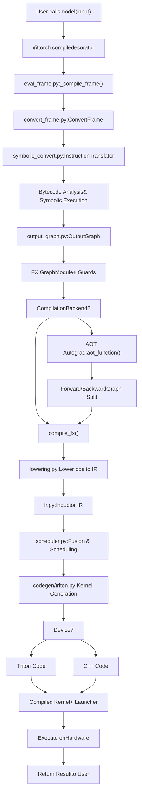
**Sources:** [torch/\_dynamo/eval\_frame.py1-100](https://github.com/pytorch/pytorch/blob/915982a4/torch/_dynamo/eval_frame.py#L1-L100) [torch/\_dynamo/convert\_frame.py1-100](https://github.com/pytorch/pytorch/blob/915982a4/torch/_dynamo/convert_frame.py#L1-L100) [torch/\_dynamo/symbolic\_convert.py1-100](https://github.com/pytorch/pytorch/blob/915982a4/torch/_dynamo/symbolic_convert.py#L1-L100) [torch/\_dynamo/output\_graph.py1-100](https://github.com/pytorch/pytorch/blob/915982a4/torch/_dynamo/output_graph.py#L1-L100) [torch/\_inductor/compile\_fx.py](https://github.com/pytorch/pytorch/blob/915982a4/torch/_inductor/compile_fx.py) (referenced in test files), [torch/\_inductor/lowering.py1-100](https://github.com/pytorch/pytorch/blob/915982a4/torch/_inductor/lowering.py#L1-L100) [torch/\_inductor/ir.py1-100](https://github.com/pytorch/pytorch/blob/915982a4/torch/_inductor/ir.py#L1-L100) [torch/\_inductor/scheduler.py1-100](https://github.com/pytorch/pytorch/blob/915982a4/torch/_inductor/scheduler.py#L1-L100) [torch/\_inductor/codegen/triton.py1-100](https://github.com/pytorch/pytorch/blob/915982a4/torch/_inductor/codegen/triton.py#L1-L100)

## Entry Point: The @torch.compile Decorator

When a user decorates a function with `@torch.compile`, PyTorch installs a custom frame evaluation hook that intercepts Python bytecode execution.

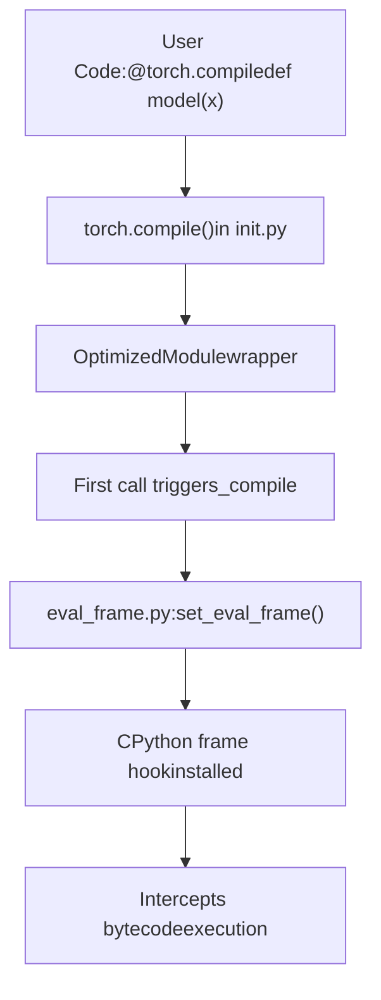
**Key Code Entities:**

-   `torch.compile()` - User-facing API decorator
-   `OptimizedModule` - Wrapper class that intercepts `__call__`
-   `set_eval_frame()` - Installs the frame evaluation hook
-   `_compile_frame()` - Main entry point for frame compilation

**Sources:** [test/inductor/test\_torchinductor.py515-520](https://github.com/pytorch/pytorch/blob/915982a4/test/inductor/test_torchinductor.py#L515-L520) [torch/\_dynamo/eval\_frame.py1-100](https://github.com/pytorch/pytorch/blob/915982a4/torch/_dynamo/eval_frame.py#L1-L100)

## TorchDynamo: Bytecode Analysis and Symbolic Execution

TorchDynamo intercepts Python frames and performs symbolic execution on the bytecode to capture program behavior.

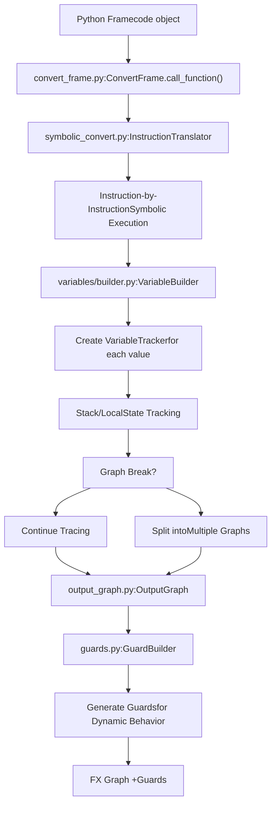
**Key Components:**

| Component | File | Purpose |
| --- | --- | --- |
| `InstructionTranslator` | symbolic\_convert.py | Core bytecode symbolic executor |
| `VariableTracker` | variables/base.py | Abstract representation of Python values |
| `VariableBuilder` | variables/builder.py | Constructs VariableTrackers from Python objects |
| `OutputGraph` | output\_graph.py | Manages FX graph construction |
| `GuardBuilder` | guards.py | Creates guards for dynamic properties |

**Symbolic Execution Process:**

1.  Each bytecode instruction is processed in `InstructionTranslator.step()`
2.  Python values are wrapped in `VariableTracker` subclasses (e.g., `TensorVariable`, `ConstantVariable`)
3.  Operations create FX graph nodes via `OutputGraph.create_proxy()`
4.  Guards are registered for any dynamic behavior (e.g., tensor shapes, data-dependent control flow)

**Sources:** [torch/\_dynamo/symbolic\_convert.py1-100](https://github.com/pytorch/pytorch/blob/915982a4/torch/_dynamo/symbolic_convert.py#L1-L100) [torch/\_dynamo/variables/builder.py1-100](https://github.com/pytorch/pytorch/blob/915982a4/torch/_dynamo/variables/builder.py#L1-L100) [torch/\_dynamo/output\_graph.py1-100](https://github.com/pytorch/pytorch/blob/915982a4/torch/_dynamo/output_graph.py#L1-L100) [torch/\_dynamo/guards.py](https://github.com/pytorch/pytorch/blob/915982a4/torch/_dynamo/guards.py) (referenced)

## FX Graph Construction

The `OutputGraph` class manages the FX graph construction process, coordinating with a `SubgraphTracer`.

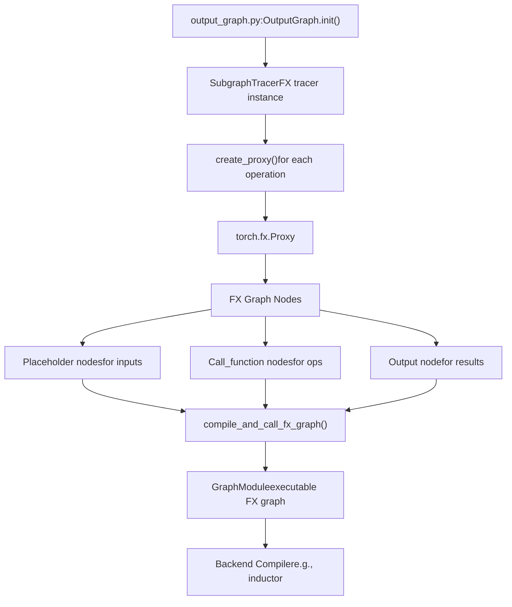
**Graph Node Types:**

-   **placeholder**: Graph inputs (arguments, module parameters)
-   **get\_attr**: Module attributes/buffers
-   **call\_function**: PyTorch operations (torch.ops.aten.\*)
-   **call\_method**: Tensor methods
-   **call\_module**: Submodule invocations
-   **output**: Graph outputs

**Sources:** [torch/\_dynamo/output\_graph.py1-200](https://github.com/pytorch/pytorch/blob/915982a4/torch/_dynamo/output_graph.py#L1-L200) [test/export/test\_export.py600-700](https://github.com/pytorch/pytorch/blob/915982a4/test/export/test_export.py#L600-L700)

## AOT Autograd: Forward/Backward Splitting

AOT (Ahead-Of-Time) Autograd separates forward and backward passes before compilation.

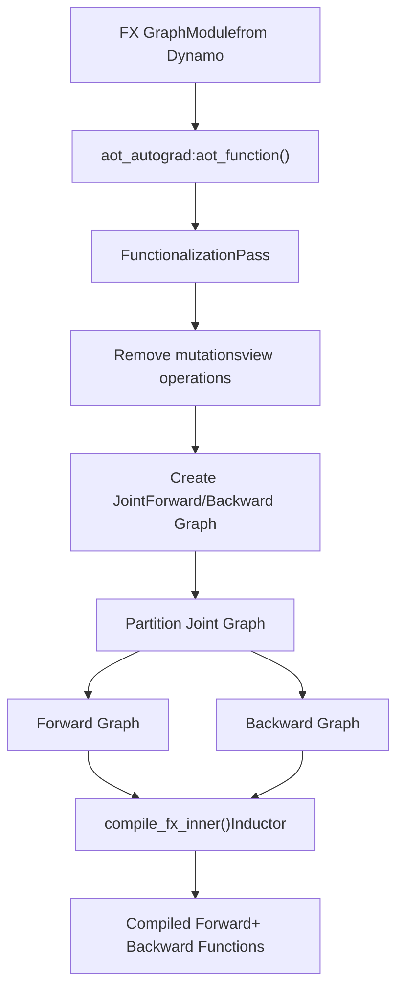
**Key Transformations:**

1.  **Functionalization**: Converts in-place ops to functional equivalents
2.  **Joint Graph Creation**: Combines forward and autograd backward into single graph
3.  **Graph Partitioning**: Splits joint graph into forward-only and backward-only components
4.  **Backend Compilation**: Each partition is compiled separately by the backend (typically Inductor)

**Sources:** [torch/\_functorch/aot\_autograd.py](https://github.com/pytorch/pytorch/blob/915982a4/torch/_functorch/aot_autograd.py) (referenced), [test/export/test\_export.py300-400](https://github.com/pytorch/pytorch/blob/915982a4/test/export/test_export.py#L300-L400)

## TorchInductor Backend: IR Lowering

TorchInductor receives FX graphs and lowers them to an optimizable intermediate representation.

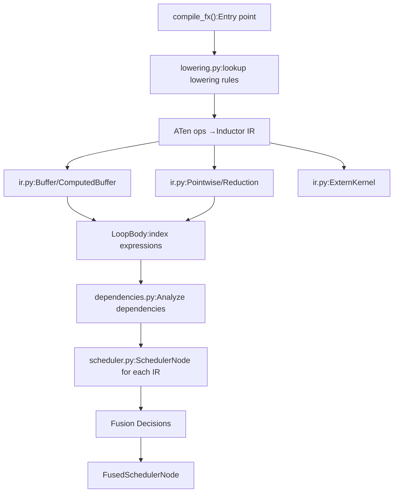
**Inductor IR Node Types:**

| IR Class | Purpose | File |
| --- | --- | --- |
| `Pointwise` | Element-wise operations | ir.py |
| `Reduction` | Reduction operations (sum, max, etc.) | ir.py |
| `ComputedBuffer` | Computed tensor values | ir.py |
| `ExternKernel` | Calls to external kernels (e.g., CUDA libs) | ir.py |
| `LoopBody` | Index expressions for loop kernels | loop\_body.py |

**Lowering Process:**

1.  For each FX node, lookup lowering rule in `lowerings` dictionary
2.  Execute lowering function to create IR nodes
3.  IR nodes contain index expressions using SymPy for symbolic shapes
4.  Dependencies between IR nodes are tracked for scheduling

**Sources:** [torch/\_inductor/lowering.py1-200](https://github.com/pytorch/pytorch/blob/915982a4/torch/_inductor/lowering.py#L1-L200) [torch/\_inductor/ir.py1-500](https://github.com/pytorch/pytorch/blob/915982a4/torch/_inductor/ir.py#L1-L500) [test/inductor/test\_torchinductor.py400-500](https://github.com/pytorch/pytorch/blob/915982a4/test/inductor/test_torchinductor.py#L400-L500)

## Scheduling and Fusion

The `Scheduler` class analyzes IR nodes to determine fusion opportunities and kernel ordering.

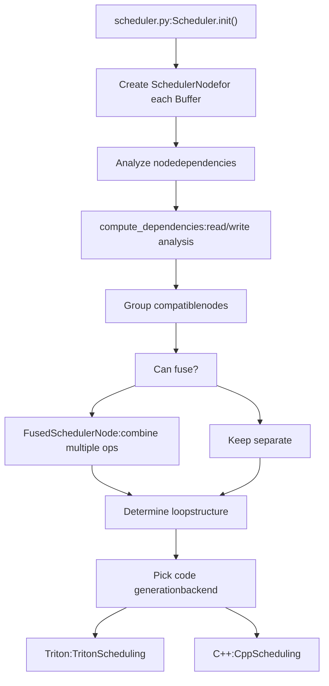
**Fusion Criteria:**

-   Compatible device types
-   Compatible loop structures (size and reduction dimensions)
-   Memory dependency constraints (no WAR/WAW hazards)
-   Read/write patterns allow fusion
-   Heuristics based on memory bandwidth vs compute

**Fusion Groups:**

| Group Type | Description | Example |
| --- | --- | --- |
| `(device, sizes, reductions)` | Pointwise ops on same tensor shape | Add, multiply, relu |
| `(device, (numel, rnumel))` | Reductions with same output size | Sum, max along dimension |
| Epilogue fusion | Fuse pointwise into reduction output | Reduction + normalization |

**Sources:** [torch/\_inductor/scheduler.py1-500](https://github.com/pytorch/pytorch/blob/915982a4/torch/_inductor/scheduler.py#L1-L500) [test/inductor/test\_torchinductor.py800-900](https://github.com/pytorch/pytorch/blob/915982a4/test/inductor/test_torchinductor.py#L800-L900)

## Code Generation: Triton and C++

Fused IR nodes are compiled into executable kernels using either Triton (for GPUs) or C++ (for CPUs).

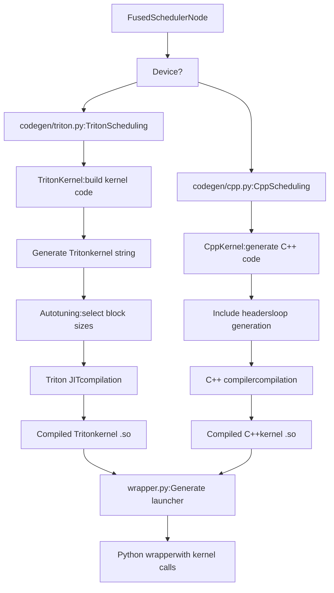
**Triton Code Generation Pipeline:**

1.  `TritonKernel` creates kernel template with loop indices
2.  Loop bounds computed from tensor shapes
3.  Index expressions converted to Triton syntax
4.  Memory access patterns analyzed for coalescing
5.  Block sizes selected via autotuning or heuristics
6.  Triton JIT compiles kernel to CUDA

**C++ Code Generation Pipeline:**

1.  `CppKernel` generates vectorized loop code
2.  Loop structure based on IR scheduling decisions
3.  Vectorization using CPU SIMD instructions
4.  OpenMP parallelization for multi-threading
5.  C++ compiler (g++/clang) produces shared object

**Sources:** [torch/\_inductor/codegen/triton.py1-300](https://github.com/pytorch/pytorch/blob/915982a4/torch/_inductor/codegen/triton.py#L1-L300) [torch/\_inductor/codegen/wrapper.py1-200](https://github.com/pytorch/pytorch/blob/915982a4/torch/_inductor/codegen/wrapper.py#L1-L200) [test/inductor/test\_torchinductor.py1000-1100](https://github.com/pytorch/pytorch/blob/915982a4/test/inductor/test_torchinductor.py#L1000-L1100)

## Configuration System

The compilation pipeline is controlled by `torch._inductor.config` and `torch._dynamo.config`.

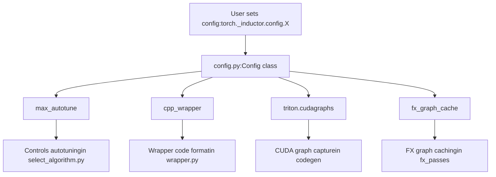
**Key Configuration Options:**

| Config | Type | Purpose | Default |
| --- | --- | --- | --- |
| `debug` | bool | Enable debug output | False |
| `max_autotune` | bool | Extensive kernel tuning | False |
| `cpp_wrapper` | bool | C++ vs Python wrapper | False |
| `triton.cudagraphs` | bool | Enable CUDA graphs | False |
| `fx_graph_cache` | bool | Cache compiled graphs | True |
| `epilogue_fusion` | bool | Fuse epilogue ops | True |
| `pattern_matcher` | bool | Enable pattern matching | True |

**Sources:** [torch/\_inductor/config.py1-200](https://github.com/pytorch/pytorch/blob/915982a4/torch/_inductor/config.py#L1-L200) [test/inductor/test\_torchinductor.py330-350](https://github.com/pytorch/pytorch/blob/915982a4/test/inductor/test_torchinductor.py#L330-L350)

## Caching and Recompilation

The compilation system caches results at multiple levels to avoid recompilation.

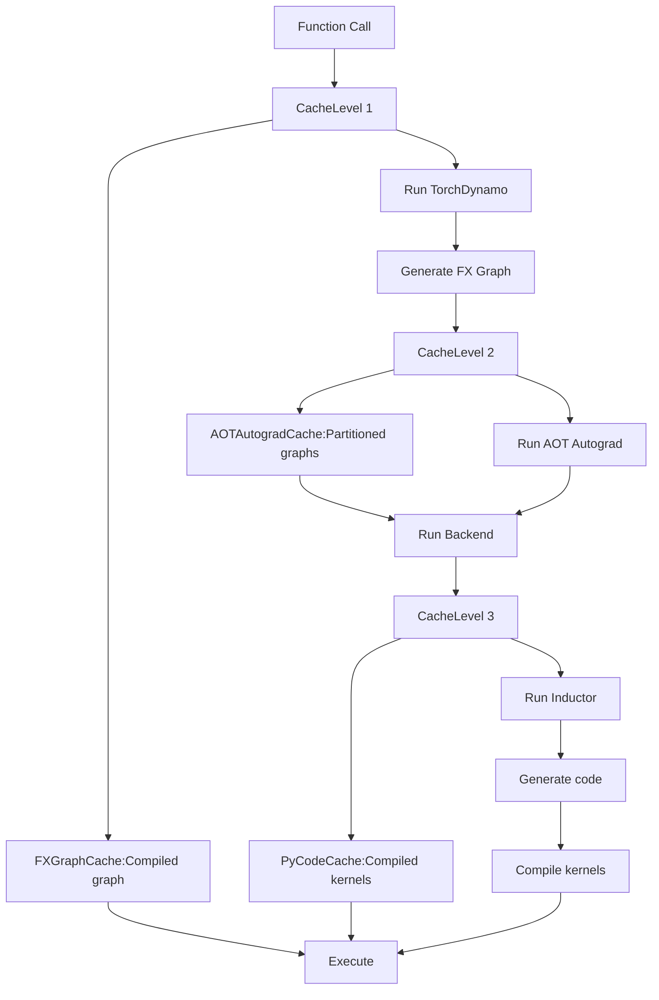
**Cache Hierarchy:**

| Cache Level | File | Key | Value |
| --- | --- | --- | --- |
| Guard cache | eval\_frame.py | Code object + guards | Compiled function |
| FXGraphCache | fx\_graph\_cache.py | FX graph hash | Compiled graph module |
| AOTAutogradCache | aot\_autograd.py | Joint graph hash | Forward/backward functions |
| PyCodeCache | codecache.py | Kernel source hash | Compiled .so file |
| AutotuneCache | autotune\_cache.py | Config + input shapes | Best kernel config |

**Sources:** [torch/\_inductor/codecache.py1-200](https://github.com/pytorch/pytorch/blob/915982a4/torch/_inductor/codecache.py#L1-L200) [torch/\_dynamo/eval\_frame.py100-200](https://github.com/pytorch/pytorch/blob/915982a4/torch/_dynamo/eval_frame.py#L100-L200)

## Guard System

Guards ensure compiled code is only used when assumptions remain valid.

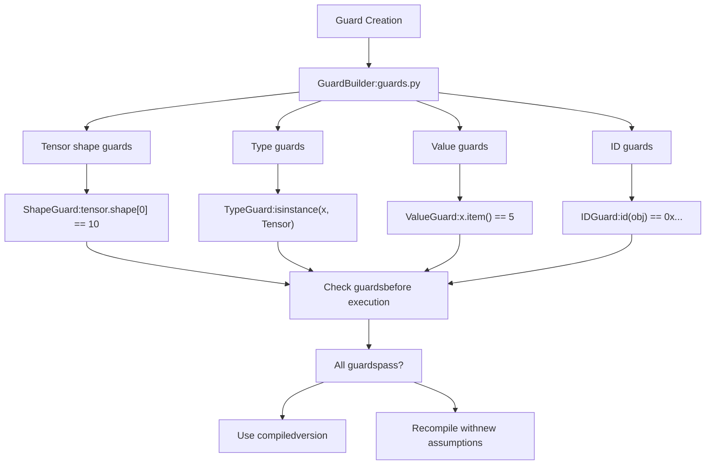
**Guard Types:**

| Guard | Purpose | Example |
| --- | --- | --- |
| `EQUALS_MATCH` | Value equality | `x == 5` |
| `SHAPE_ENV` | Symbolic shape constraints | `s0 > 0` |
| `TYPE_MATCH` | Type checking | `type(x) is int` |
| `ID_MATCH` | Identity checking | `x is y` |
| `DATA_PTR_MATCH` | Tensor data location | `tensor.data_ptr() == addr` |

**Sources:** [torch/\_guards.py](https://github.com/pytorch/pytorch/blob/915982a4/torch/_guards.py) (referenced), [torch/\_dynamo/guards.py](https://github.com/pytorch/pytorch/blob/915982a4/torch/_dynamo/guards.py) (referenced), [test/dynamo/test\_misc.py1000-1100](https://github.com/pytorch/pytorch/blob/915982a4/test/dynamo/test_misc.py#L1000-L1100)

## Execution and Kernel Launch

Compiled kernels are invoked through generated Python wrapper code.

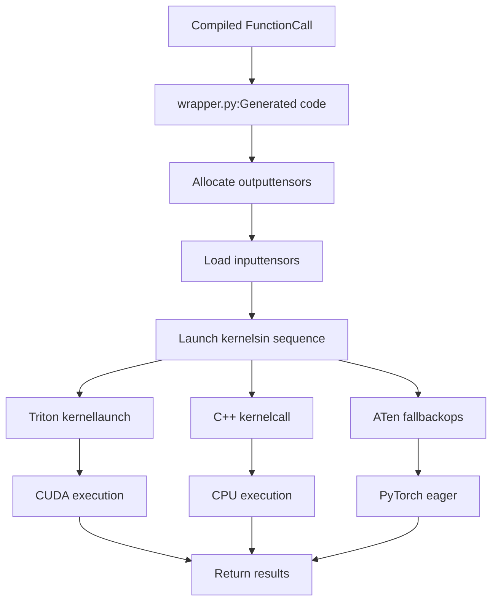
**Wrapper Code Structure:**

```
# Generated by wrapper.pydef call(args):    buf0 = torch.empty_strided(...)  # Allocate output    kernel_0.run(args[0], buf0, ...)  # Launch kernel    return buf0
```
**Sources:** [torch/\_inductor/codegen/wrapper.py1-100](https://github.com/pytorch/pytorch/blob/915982a4/torch/_inductor/codegen/wrapper.py#L1-L100) [test/inductor/test\_torchinductor.py500-600](https://github.com/pytorch/pytorch/blob/915982a4/test/inductor/test_torchinductor.py#L500-L600)

## Multi-Graph Compilation

Complex models may be split into multiple graphs due to graph breaks.

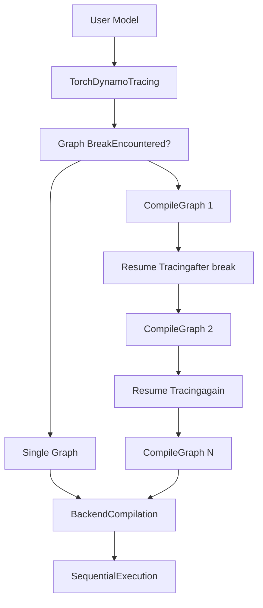
**Common Graph Break Causes:**

-   Unsupported Python operations (e.g., `print()`, debugging)
-   Data-dependent control flow that can't be symbolically executed
-   Calls to non-traceable functions
-   Side effects that must be preserved in original order

**Graph Break Example:**

```
@torch.compiledef model(x):    y = x + 1      # Graph 1    print(y)       # Graph break (print not traceable)    z = y * 2      # Graph 2    return z
```
**Sources:** [torch/\_dynamo/symbolic\_convert.py2000-2100](https://github.com/pytorch/pytorch/blob/915982a4/torch/_dynamo/symbolic_convert.py#L2000-L2100) [torch/\_dynamo/exc.py](https://github.com/pytorch/pytorch/blob/915982a4/torch/_dynamo/exc.py) (referenced)

## End-to-End Example

Complete compilation trace for a simple function:

> **[Mermaid sequence]**
> *(图表结构无法解析)*

**Sources:** [test/inductor/test\_torchinductor.py429-520](https://github.com/pytorch/pytorch/blob/915982a4/test/inductor/test_torchinductor.py#L429-L520) [torch/\_dynamo/convert\_frame.py1-100](https://github.com/pytorch/pytorch/blob/915982a4/torch/_dynamo/convert_frame.py#L1-L100) [torch/\_dynamo/output\_graph.py1-200](https://github.com/pytorch/pytorch/blob/915982a4/torch/_dynamo/output_graph.py#L1-L200)

## Summary

The torch.compile pipeline consists of these major stages:

1.  **Entry (@torch.compile)**: Decorator installs frame evaluation hook
2.  **TorchDynamo**: Bytecode analysis and symbolic execution to FX graph
3.  **Graph Construction**: FX graph with guards for dynamic behavior
4.  **AOT Autograd**: Forward/backward separation and functionalization
5.  **TorchInductor**: IR lowering, scheduling, fusion optimization
6.  **Code Generation**: Triton (GPU) or C++ (CPU) kernel compilation
7.  **Execution**: Cached compiled kernels with guard checking

This pipeline enables PyTorch to optimize Python code into efficient GPU/CPU kernels while maintaining full compatibility with eager mode execution.

**Sources:** [torch/\_dynamo/eval\_frame.py1-200](https://github.com/pytorch/pytorch/blob/915982a4/torch/_dynamo/eval_frame.py#L1-L200) [torch/\_dynamo/symbolic\_convert.py1-300](https://github.com/pytorch/pytorch/blob/915982a4/torch/_dynamo/symbolic_convert.py#L1-L300) [torch/\_dynamo/output\_graph.py1-300](https://github.com/pytorch/pytorch/blob/915982a4/torch/_dynamo/output_graph.py#L1-L300) [torch/\_inductor/compile\_fx.py](https://github.com/pytorch/pytorch/blob/915982a4/torch/_inductor/compile_fx.py) (referenced in tests), [torch/\_inductor/lowering.py1-200](https://github.com/pytorch/pytorch/blob/915982a4/torch/_inductor/lowering.py#L1-L200) [torch/\_inductor/scheduler.py1-200](https://github.com/pytorch/pytorch/blob/915982a4/torch/_inductor/scheduler.py#L1-L200) [torch/\_inductor/codegen/triton.py1-200](https://github.com/pytorch/pytorch/blob/915982a4/torch/_inductor/codegen/triton.py#L1-L200) [test/inductor/test\_torchinductor.py1-1000](https://github.com/pytorch/pytorch/blob/915982a4/test/inductor/test_torchinductor.py#L1-L1000)
