# TorchDynamo Frontend

Relevant source files

-   [aten/src/ATen/core/PythonFallbackKernel.cpp](https://github.com/pytorch/pytorch/blob/915982a4/aten/src/ATen/core/PythonFallbackKernel.cpp)
-   [test/distributed/\_composable/fsdp/test\_fully\_shard\_compile.py](https://github.com/pytorch/pytorch/blob/915982a4/test/distributed/_composable/fsdp/test_fully_shard_compile.py)
-   [test/dynamo/test\_dicts.py](https://github.com/pytorch/pytorch/blob/915982a4/test/dynamo/test_dicts.py)
-   [test/dynamo/test\_error\_messages.py](https://github.com/pytorch/pytorch/blob/915982a4/test/dynamo/test_error_messages.py)
-   [test/dynamo/test\_functions.py](https://github.com/pytorch/pytorch/blob/915982a4/test/dynamo/test_functions.py)
-   [test/dynamo/test\_fwd\_loss\_bwd.py](https://github.com/pytorch/pytorch/blob/915982a4/test/dynamo/test_fwd_loss_bwd.py)
-   [test/dynamo/test\_guard\_manager.py](https://github.com/pytorch/pytorch/blob/915982a4/test/dynamo/test_guard_manager.py)
-   [test/dynamo/test\_list.py](https://github.com/pytorch/pytorch/blob/915982a4/test/dynamo/test_list.py)
-   [test/dynamo/test\_logging.py](https://github.com/pytorch/pytorch/blob/915982a4/test/dynamo/test_logging.py)
-   [test/dynamo/test\_misc.py](https://github.com/pytorch/pytorch/blob/915982a4/test/dynamo/test_misc.py)
-   [test/dynamo/test\_modules.py](https://github.com/pytorch/pytorch/blob/915982a4/test/dynamo/test_modules.py)
-   [test/dynamo/test\_nested\_graph\_breaks.py](https://github.com/pytorch/pytorch/blob/915982a4/test/dynamo/test_nested_graph_breaks.py)
-   [test/dynamo/test\_repros.py](https://github.com/pytorch/pytorch/blob/915982a4/test/dynamo/test_repros.py)
-   [test/dynamo/test\_skip\_guard\_eval\_unsafe.py](https://github.com/pytorch/pytorch/blob/915982a4/test/dynamo/test_skip_guard_eval_unsafe.py)
-   [test/dynamo/test\_utils.py](https://github.com/pytorch/pytorch/blob/915982a4/test/dynamo/test_utils.py)
-   [test/dynamo\_expected\_failures/TestCustomOp.test\_impl\_device\_cpu](https://github.com/pytorch/pytorch/blob/915982a4/test/dynamo_expected_failures/TestCustomOp.test_impl_device_cpu)
-   [test/export/test\_experimental.py](https://github.com/pytorch/pytorch/blob/915982a4/test/export/test_experimental.py)
-   [test/export/test\_export.py](https://github.com/pytorch/pytorch/blob/915982a4/test/export/test_export.py)
-   [test/fx/test\_fx\_xform\_observer.py](https://github.com/pytorch/pytorch/blob/915982a4/test/fx/test_fx_xform_observer.py)
-   [test/profiler/test\_record\_function.py](https://github.com/pytorch/pytorch/blob/915982a4/test/profiler/test_record_function.py)
-   [test/profiler/test\_torch\_tidy.py](https://github.com/pytorch/pytorch/blob/915982a4/test/profiler/test_torch_tidy.py)
-   [test/test\_dynamic\_shapes.py](https://github.com/pytorch/pytorch/blob/915982a4/test/test_dynamic_shapes.py)
-   [test/test\_proxy\_tensor.py](https://github.com/pytorch/pytorch/blob/915982a4/test/test_proxy_tensor.py)
-   [torch/\_C/\_dynamo/guards.pyi](https://github.com/pytorch/pytorch/blob/915982a4/torch/_C/_dynamo/guards.pyi)
-   [torch/\_decomp/decompositions\_for\_jvp.py](https://github.com/pytorch/pytorch/blob/915982a4/torch/_decomp/decompositions_for_jvp.py)
-   [torch/\_dispatch/python.py](https://github.com/pytorch/pytorch/blob/915982a4/torch/_dispatch/python.py)
-   [torch/\_dynamo/bytecode\_analysis.py](https://github.com/pytorch/pytorch/blob/915982a4/torch/_dynamo/bytecode_analysis.py)
-   [torch/\_dynamo/bytecode\_transformation.py](https://github.com/pytorch/pytorch/blob/915982a4/torch/_dynamo/bytecode_transformation.py)
-   [torch/\_dynamo/codegen.py](https://github.com/pytorch/pytorch/blob/915982a4/torch/_dynamo/codegen.py)
-   [torch/\_dynamo/config.py](https://github.com/pytorch/pytorch/blob/915982a4/torch/_dynamo/config.py)
-   [torch/\_dynamo/convert\_frame.py](https://github.com/pytorch/pytorch/blob/915982a4/torch/_dynamo/convert_frame.py)
-   [torch/\_dynamo/eval\_frame.py](https://github.com/pytorch/pytorch/blob/915982a4/torch/_dynamo/eval_frame.py)
-   [torch/\_dynamo/exc.py](https://github.com/pytorch/pytorch/blob/915982a4/torch/_dynamo/exc.py)
-   [torch/\_dynamo/functional\_export.py](https://github.com/pytorch/pytorch/blob/915982a4/torch/_dynamo/functional_export.py)
-   [torch/\_dynamo/graph\_break\_registry.json](https://github.com/pytorch/pytorch/blob/915982a4/torch/_dynamo/graph_break_registry.json)
-   [torch/\_dynamo/guards.py](https://github.com/pytorch/pytorch/blob/915982a4/torch/_dynamo/guards.py)
-   [torch/\_dynamo/output\_graph.py](https://github.com/pytorch/pytorch/blob/915982a4/torch/_dynamo/output_graph.py)
-   [torch/\_dynamo/resume\_execution.py](https://github.com/pytorch/pytorch/blob/915982a4/torch/_dynamo/resume_execution.py)
-   [torch/\_dynamo/side\_effects.py](https://github.com/pytorch/pytorch/blob/915982a4/torch/_dynamo/side_effects.py)
-   [torch/\_dynamo/source.py](https://github.com/pytorch/pytorch/blob/915982a4/torch/_dynamo/source.py)
-   [torch/\_dynamo/symbolic\_convert.py](https://github.com/pytorch/pytorch/blob/915982a4/torch/_dynamo/symbolic_convert.py)
-   [torch/\_dynamo/test\_case.py](https://github.com/pytorch/pytorch/blob/915982a4/torch/_dynamo/test_case.py)
-   [torch/\_dynamo/testing.py](https://github.com/pytorch/pytorch/blob/915982a4/torch/_dynamo/testing.py)
-   [torch/\_dynamo/trace\_rules.py](https://github.com/pytorch/pytorch/blob/915982a4/torch/_dynamo/trace_rules.py)
-   [torch/\_dynamo/utils.py](https://github.com/pytorch/pytorch/blob/915982a4/torch/_dynamo/utils.py)
-   [torch/\_dynamo/variables/\_\_init\_\_.py](https://github.com/pytorch/pytorch/blob/915982a4/torch/_dynamo/variables/__init__.py)
-   [torch/\_dynamo/variables/base.py](https://github.com/pytorch/pytorch/blob/915982a4/torch/_dynamo/variables/base.py)
-   [torch/\_dynamo/variables/builder.py](https://github.com/pytorch/pytorch/blob/915982a4/torch/_dynamo/variables/builder.py)
-   [torch/\_dynamo/variables/builtin.py](https://github.com/pytorch/pytorch/blob/915982a4/torch/_dynamo/variables/builtin.py)
-   [torch/\_dynamo/variables/constant.py](https://github.com/pytorch/pytorch/blob/915982a4/torch/_dynamo/variables/constant.py)
-   [torch/\_dynamo/variables/ctx\_manager.py](https://github.com/pytorch/pytorch/blob/915982a4/torch/_dynamo/variables/ctx_manager.py)
-   [torch/\_dynamo/variables/dicts.py](https://github.com/pytorch/pytorch/blob/915982a4/torch/_dynamo/variables/dicts.py)
-   [torch/\_dynamo/variables/functions.py](https://github.com/pytorch/pytorch/blob/915982a4/torch/_dynamo/variables/functions.py)
-   [torch/\_dynamo/variables/higher\_order\_ops.py](https://github.com/pytorch/pytorch/blob/915982a4/torch/_dynamo/variables/higher_order_ops.py)
-   [torch/\_dynamo/variables/iter.py](https://github.com/pytorch/pytorch/blob/915982a4/torch/_dynamo/variables/iter.py)
-   [torch/\_dynamo/variables/lists.py](https://github.com/pytorch/pytorch/blob/915982a4/torch/_dynamo/variables/lists.py)
-   [torch/\_dynamo/variables/misc.py](https://github.com/pytorch/pytorch/blob/915982a4/torch/_dynamo/variables/misc.py)
-   [torch/\_dynamo/variables/nn\_module.py](https://github.com/pytorch/pytorch/blob/915982a4/torch/_dynamo/variables/nn_module.py)
-   [torch/\_dynamo/variables/optimizer.py](https://github.com/pytorch/pytorch/blob/915982a4/torch/_dynamo/variables/optimizer.py)
-   [torch/\_dynamo/variables/tensor.py](https://github.com/pytorch/pytorch/blob/915982a4/torch/_dynamo/variables/tensor.py)
-   [torch/\_dynamo/variables/torch.py](https://github.com/pytorch/pytorch/blob/915982a4/torch/_dynamo/variables/torch.py)
-   [torch/\_dynamo/variables/user\_defined.py](https://github.com/pytorch/pytorch/blob/915982a4/torch/_dynamo/variables/user_defined.py)
-   [torch/\_export/non\_strict\_utils.py](https://github.com/pytorch/pytorch/blob/915982a4/torch/_export/non_strict_utils.py)
-   [torch/\_guards.py](https://github.com/pytorch/pytorch/blob/915982a4/torch/_guards.py)
-   [torch/\_lazy/device\_context.py](https://github.com/pytorch/pytorch/blob/915982a4/torch/_lazy/device_context.py)
-   [torch/\_logging/\_internal.py](https://github.com/pytorch/pytorch/blob/915982a4/torch/_logging/_internal.py)
-   [torch/\_logging/\_registrations.py](https://github.com/pytorch/pytorch/blob/915982a4/torch/_logging/_registrations.py)
-   [torch/\_numpy/\_funcs\_impl.py](https://github.com/pytorch/pytorch/blob/915982a4/torch/_numpy/_funcs_impl.py)
-   [torch/\_numpy/\_reductions\_impl.py](https://github.com/pytorch/pytorch/blob/915982a4/torch/_numpy/_reductions_impl.py)
-   [torch/\_refs/fft.py](https://github.com/pytorch/pytorch/blob/915982a4/torch/_refs/fft.py)
-   [torch/csrc/dynamo/guards.cpp](https://github.com/pytorch/pytorch/blob/915982a4/torch/csrc/dynamo/guards.cpp)
-   [torch/export/\_\_init\_\_.py](https://github.com/pytorch/pytorch/blob/915982a4/torch/export/__init__.py)
-   [torch/export/\_trace.py](https://github.com/pytorch/pytorch/blob/915982a4/torch/export/_trace.py)
-   [torch/fx/experimental/symbolic\_shapes.py](https://github.com/pytorch/pytorch/blob/915982a4/torch/fx/experimental/symbolic_shapes.py)
-   [torch/fx/passes/graph\_transform\_observer.py](https://github.com/pytorch/pytorch/blob/915982a4/torch/fx/passes/graph_transform_observer.py)

## Purpose and Scope

TorchDynamo Frontend is PyTorch's Python bytecode analysis and symbolic execution engine that captures models into FX graphs. It intercepts Python frame execution, analyzes bytecode instructions, and transforms them into traceable graph representations while tracking variables and generating guards for correctness. This page covers the core tracing infrastructure, variable tracking system, and graph construction mechanisms. For details on guard generation and recompilation triggers, see [Guard System and Recompilation](/pytorch/pytorch/2.2.3-guard-system-and-recompilation). For subsequent compilation stages, see [torch.export](/pytorch/pytorch/2.3-torch.export:-static-graph-export) and [TorchInductor Backend](/pytorch/pytorch/2.5-torchinductor-backend).

## System Architecture Overview

TorchDynamo Frontend consists of four cooperating subsystems: bytecode analysis, variable tracking, graph construction, and guard management. The system intercepts Python execution at frame boundaries and performs symbolic execution to build FX graphs.

### High-Level Component Architecture

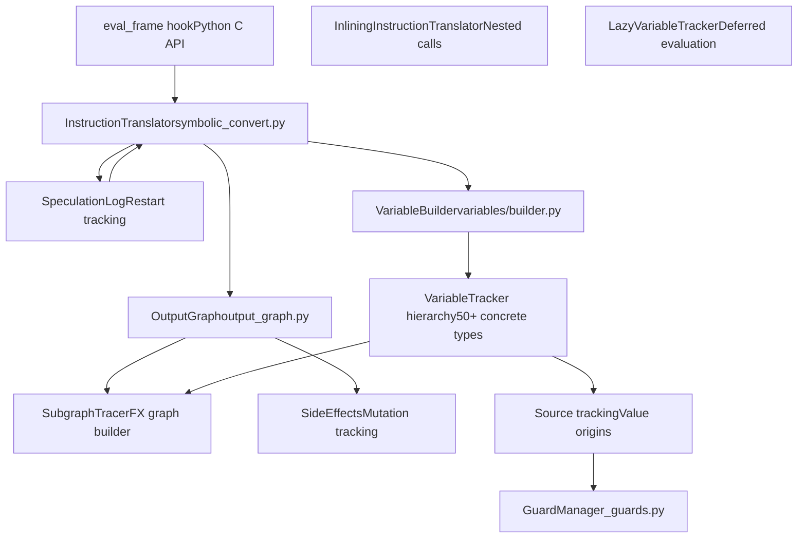
Sources: [torch/\_dynamo/symbolic\_convert.py1-100](https://github.com/pytorch/pytorch/blob/915982a4/torch/_dynamo/symbolic_convert.py#L1-L100) [torch/\_dynamo/variables/builder.py1-100](https://github.com/pytorch/pytorch/blob/915982a4/torch/_dynamo/variables/builder.py#L1-L100) [torch/\_dynamo/output\_graph.py1-100](https://github.com/pytorch/pytorch/blob/915982a4/torch/_dynamo/output_graph.py#L1-L100)

## Bytecode Interception and Frame Processing

TorchDynamo registers a custom evaluation frame callback with CPython that intercepts function execution before bytecode is evaluated. This callback creates an `InstructionTranslator` instance to symbolically execute the frame.

### Execution Flow from User Code to Symbolic Execution

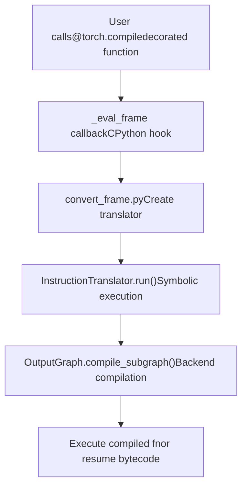
Sources: [torch/\_dynamo/symbolic\_convert.py1-100](https://github.com/pytorch/pytorch/blob/915982a4/torch/_dynamo/symbolic_convert.py#L1-L100) [torch/\_dynamo/eval\_frame.py1-100](https://github.com/pytorch/pytorch/blob/915982a4/torch/_dynamo/eval_frame.py#L1-L100)

### InstructionTranslator Class Hierarchy

The `InstructionTranslatorBase` class provides the core bytecode processing loop, with specialized subclasses for different contexts:


Sources: [torch/\_dynamo/symbolic\_convert.py1000-2000](https://github.com/pytorch/pytorch/blob/915982a4/torch/_dynamo/symbolic_convert.py#L1000-L2000)

The translator maintains a `symbolic_stack` (analogous to Python's evaluation stack) and `symbolic_locals`/`symbolic_globals` dictionaries that contain `VariableTracker` objects instead of actual Python values. The `step()` method at [torch/\_dynamo/symbolic\_convert.py2500-3000](https://github.com/pytorch/pytorch/blob/915982a4/torch/_dynamo/symbolic_convert.py#L2500-L3000) dispatches to opcode-specific handler methods (e.g., `LOAD_FAST`, `CALL_FUNCTION`, `BINARY_ADD`).

## Variable Tracking System

Every Python value encountered during tracing is wrapped in a `VariableTracker` subclass that maintains symbolic information and knows how to generate FX graph nodes for operations on that value.

### Core VariableTracker Hierarchy

```mermaid
flowchart TD
    Base["VariableTrackervariables/base.pyAbstract base"]
    Tensor["TensorVariablevariables/tensor.pytorch.Tensor"]
    Constant["ConstantVariablevariables/constant.pyPrimitives"]
    Function["UserFunctionVariablevariables/functions.pyPython functions"]
    Module["NNModuleVariablevariables/nn_module.pytorch.nn.Module"]
    List["ListVariablevariables/lists.pyPython list"]
    Dict["ConstDictVariablevariables/dicts.pyPython dict"]
    Builtin["BuiltinVariablevariables/builtin.pyBuilt-ins"]
    UserObj["UserDefinedObjectVariablevariables/user_defined.pyCustom objects"]
    Higher["TorchHigherOrderOperatorVariablevariables/higher_order_ops.pyHOPs"]

    Base --> Tensor
    Base --> Constant
    Base --> Function
    Base --> Module
    Base --> List
    Base --> Dict
    Base --> Builtin
    Base --> UserObj
    Base --> Higher
```
Sources: [torch/\_dynamo/variables/base.py1-200](https://github.com/pytorch/pytorch/blob/915982a4/torch/_dynamo/variables/base.py#L1-L200) [torch/\_dynamo/variables/\_\_init\_\_.py1-100](https://github.com/pytorch/pytorch/blob/915982a4/torch/_dynamo/variables/__init__.py#L1-L100)

Each `VariableTracker` implements methods like:

-   `call_function(tx, args, kwargs)`: Handles calling the value
-   `call_method(tx, name, args, kwargs)`: Handles method calls
-   `var_getattr(tx, name)`: Handles attribute access
-   `as_proxy()`: Returns FX proxy representation
-   `reconstruct(codegen)`: Generates bytecode to recreate the value

### VariableBuilder: Type Dispatch to VariableTracker

The `VariableBuilder` class at [torch/\_dynamo/variables/builder.py457-550](https://github.com/pytorch/pytorch/blob/915982a4/torch/_dynamo/variables/builder.py#L457-L550) converts Python values to appropriate `VariableTracker` instances using type-based dispatch:

| Python Type | VariableTracker Class | Dispatch Location |
| --- | --- | --- |
| `torch.Tensor` | `TensorVariable` | [builder.py588](https://github.com/pytorch/pytorch/blob/915982a4/builder.py#L588-L588) |
| `int`, `float`, `str`, `bool` | `ConstantVariable` | [builder.py597](https://github.com/pytorch/pytorch/blob/915982a4/builder.py#L597-L597) |
| `list`, `tuple`, `torch.Size` | `ListVariable`, `TupleVariable` | [builder.py591-593](https://github.com/pytorch/pytorch/blob/915982a4/builder.py#L591-L593) |
| `dict` | `ConstDictVariable` | [builder.py1200-1300](https://github.com/pytorch/pytorch/blob/915982a4/builder.py#L1200-L1300) |
| `types.FunctionType` | `UserFunctionVariable` | [builder.py1500-1600](https://github.com/pytorch/pytorch/blob/915982a4/builder.py#L1500-L1600) |
| `torch.nn.Module` | `NNModuleVariable` | [builder.py2000-2100](https://github.com/pytorch/pytorch/blob/915982a4/builder.py#L2000-L2100) |

Sources: [torch/\_dynamo/variables/builder.py572-616](https://github.com/pytorch/pytorch/blob/915982a4/torch/_dynamo/variables/builder.py#L572-L616)

The builder uses a cached dispatch table at [builder.py576-616](https://github.com/pytorch/pytorch/blob/915982a4/builder.py#L576-L616) for fast type lookup. When called with a value, it:

1.  Checks if value is already tracked in `output.side_effects`
2.  Looks up cached `VariableTracker` in `output.variable_tracker_cache`
3.  If not cached, dispatches to appropriate `wrap_*` method
4.  Installs necessary guards via the variable's source
5.  Caches the result for deduplication

### Source Tracking and Guard Generation

Each `VariableTracker` has an optional `source` attribute tracking value provenance. Sources form a tree structure enabling guard generation:

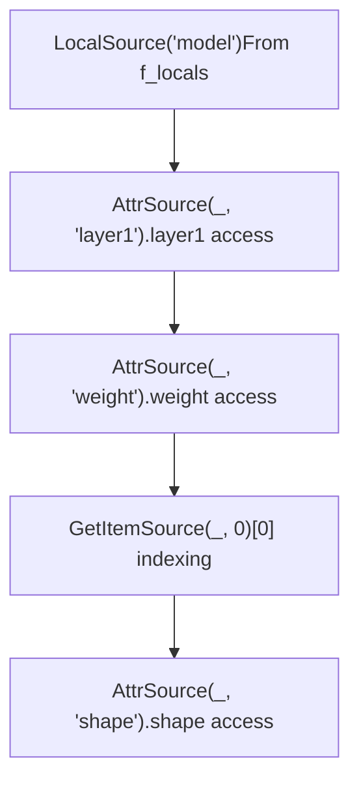
**Example source chain for** `model.layer1.weight[0].shape`:

-   Root: `LocalSource("model")`
-   Path: `AttrSource` → `AttrSource` → `GetItemSource` → `AttrSource`

Sources: [torch/\_dynamo/source.py100-300](https://github.com/pytorch/pytorch/blob/915982a4/torch/_dynamo/source.py#L100-L300) [torch/\_dynamo/variables/builder.py460-471](https://github.com/pytorch/pytorch/blob/915982a4/torch/_dynamo/variables/builder.py#L460-L471)

When a `VariableTracker` operation requires a guard (e.g., type check, value equality), it calls `source.make_guard(GuardBuilder.TYPE_MATCH)` at [guards.py500-600](https://github.com/pytorch/pytorch/blob/915982a4/guards.py#L500-L600) to generate a guard expression like `isinstance(local('model').layer1.weight[0], torch.Tensor)`.

## Symbolic Execution of Bytecode Operations

When processing an operation like `a + b`, the translator doesn't execute the addition eagerly. Instead:

1.  Pop `VariableTracker` objects from the symbolic stack
2.  Call `left.call_method(tx, "__add__", [right], {})`
3.  The variable generates FX graph nodes via `output.create_proxy()`
4.  Return new `VariableTracker` wrapping the result
5.  Push result onto symbolic stack

### Operation Processing Flow

> **[Mermaid sequence]**
> *(图表结构无法解析)*

Sources: [torch/\_dynamo/symbolic\_convert.py2000-2500](https://github.com/pytorch/pytorch/blob/915982a4/torch/_dynamo/symbolic_convert.py#L2000-L2500)

### Example: BINARY\_ADD Handler

The `BINARY_ADD` instruction handler at [symbolic\_convert.py2100-2150](https://github.com/pytorch/pytorch/blob/915982a4/symbolic_convert.py#L2100-L2150):

```
def BINARY_ADD(self, inst):    right = self.pop()    left = self.pop()    # Dispatches to BuiltinVariable(operator.add).call_function    result = BuiltinVariable(operator.add).call_function(        self, [left, right], {}    )    self.push(result)
```
For `TensorVariable`, the `call_method` implementation at [variables/tensor.py500-600](https://github.com/pytorch/pytorch/blob/915982a4/variables/tensor.py#L500-L600) generates:

```
proxy = tx.output.create_proxy(    "call_function",    operator.add,    (left.as_proxy(), right.as_proxy()),    {})return TensorVariable.from_proxy(tx, proxy)
```
Sources: [torch/\_dynamo/symbolic\_convert.py2100-2200](https://github.com/pytorch/pytorch/blob/915982a4/torch/_dynamo/symbolic_convert.py#L2100-L2200) [torch/\_dynamo/variables/tensor.py500-600](https://github.com/pytorch/pytorch/blob/915982a4/torch/_dynamo/variables/tensor.py#L500-L600)

## OutputGraph and Graph Construction

The `OutputGraph` class at [torch/\_dynamo/output\_graph.py584-1500](https://github.com/pytorch/pytorch/blob/915982a4/torch/_dynamo/output_graph.py#L584-L1500) manages FX graph construction, side effect tracking, guard collection, and compilation.

### OutputGraph Internal Structure

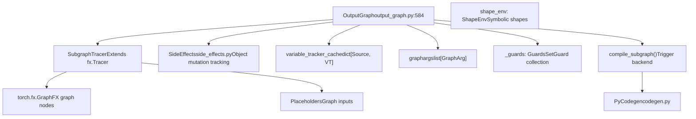
Sources: [torch/\_dynamo/output\_graph.py584-800](https://github.com/pytorch/pytorch/blob/915982a4/torch/_dynamo/output_graph.py#L584-L800)

### Creating FX Graph Nodes

The `create_proxy` method at [output\_graph.py1200-1400](https://github.com/pytorch/pytorch/blob/915982a4/output_graph.py#L1200-L1400) creates FX graph nodes:

```
def create_proxy(self, kind, target, args, kwargs, name=None):    # Creates FX Proxy wrapping a graph node    proxy = self.current_tracer.create_proxy(kind, target, args, kwargs, name)    # Attach metadata: example_value, stack_trace, nn_module_stack    set_example_value(proxy.node, example_value)    proxy.node.meta["stack_trace"] = traceback.format_stack()    return proxy
```
Node kinds include:

-   `"placeholder"`: Graph inputs
-   `"call_function"`: Function calls (torch ops, Python functions)
-   `"call_method"`: Method calls on objects
-   `"call_module"`: Calls to nn.Module submodules
-   `"get_attr"`: Attribute access on graph module
-   `"output"`: Graph return values

Sources: [torch/\_dynamo/output\_graph.py1200-1400](https://github.com/pytorch/pytorch/blob/915982a4/torch/_dynamo/output_graph.py#L1200-L1400)

## Speculation and Restart Mechanism

TorchDynamo handles data-dependent control flow through speculation: it attempts to trace both branches, and if that fails, it restarts with a graph break.

### SpeculationLog Structure


Sources: [torch/\_dynamo/symbolic\_convert.py240-340](https://github.com/pytorch/pytorch/blob/915982a4/torch/_dynamo/symbolic_convert.py#L240-L340)

The speculation process at [symbolic\_convert.py690-947](https://github.com/pytorch/pytorch/blob/915982a4/symbolic_convert.py#L690-L947):

1.  **First attempt**: Speculatively trace conditional branch
2.  **Failure**: Raise `SpeculationRestartAnalysis` exception
3.  **Restart**: Re-trace from beginning with `speculation_log.restart()`
4.  **Second attempt**: Generate graph break at failed speculation point

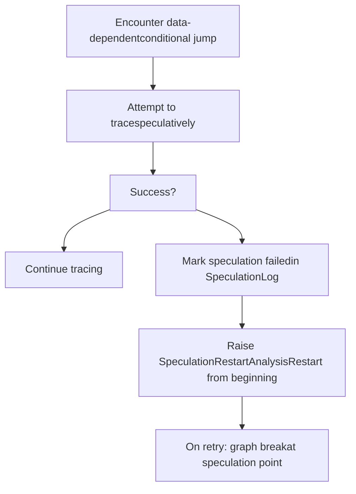
Sources: [torch/\_dynamo/symbolic\_convert.py690-800](https://github.com/pytorch/pytorch/blob/915982a4/torch/_dynamo/symbolic_convert.py#L690-L800)

## Handling Different Python Constructs

### Function Call Dispatch

When processing `CALL_FUNCTION` bytecode, the translator examines the function variable type and decides how to handle it:

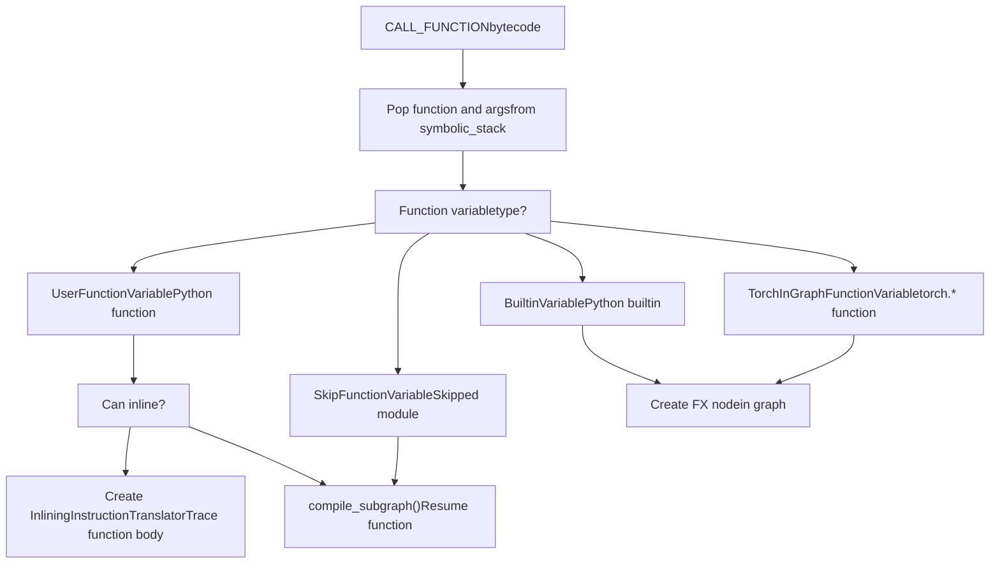
Sources: [torch/\_dynamo/symbolic\_convert.py3000-3500](https://github.com/pytorch/pytorch/blob/915982a4/torch/_dynamo/symbolic_convert.py#L3000-L3500) [torch/\_dynamo/variables/functions.py800-1200](https://github.com/pytorch/pytorch/blob/915982a4/torch/_dynamo/variables/functions.py#L800-L1200)

The `inline_call` method at [symbolic\_convert.py3200-3400](https://github.com/pytorch/pytorch/blob/915982a4/symbolic_convert.py#L3200-L3400) creates an `InliningInstructionTranslator` that:

-   Inherits parent's `OutputGraph` (writes to same graph)
-   Binds arguments to parameters using `bind_args_cached` at [variables/functions.py180-265](https://github.com/pytorch/pytorch/blob/915982a4/variables/functions.py#L180-L265)
-   Processes function bytecode symbolically
-   Returns result `VariableTracker` to parent

### Control Flow Handling

TorchDynamo evaluates conditional branches at compile time when possible:

**Jump instruction handler** at [symbolic\_convert.py690-947](https://github.com/pytorch/pytorch/blob/915982a4/symbolic_convert.py#L690-L947):

```
def generic_jump(truth_fn, push):    def inner(self, inst):        value = self.pop()        if value.is_python_constant():            # Constant condition: follow appropriate branch            if truth_fn(value.as_python_constant()):                if push:                    self.push(value)                self.jump(inst)  # Update instruction_pointer        else:            # Data-dependent: graph break            jump_graph_break(self, inst, value)
```
For loops, TorchDynamo:

-   **Small constant iteration**: Unrolls loop completely
-   **Large/dynamic iteration**: Graph breaks at loop entry

Sources: [torch/\_dynamo/symbolic\_convert.py690-947](https://github.com/pytorch/pytorch/blob/915982a4/torch/_dynamo/symbolic_convert.py#L690-L947)

### Context Manager Handling

Context managers use the block stack for proper `__enter__`/`__exit__` tracking:

```
# Bytecode for: with ctx_manager:# LOAD_FAST ctx_manager# SETUP_WITH target# ... body ...# WITH_CLEANUP_START# WITH_CLEANUP_FINISH
```
Handler at [symbolic\_convert.py4000-4300](https://github.com/pytorch/pytorch/blob/915982a4/symbolic_convert.py#L4000-L4300):

1.  Call `ctx_manager.call_method(tx, "__enter__", [], {})`
2.  Push result to symbolic\_stack
3.  Add `BlockStackEntry` to `block_stack`
4.  Execute body instructions
5.  On exit, call `__exit__` method

Sources: [torch/\_dynamo/symbolic\_convert.py4000-4300](https://github.com/pytorch/pytorch/blob/915982a4/torch/_dynamo/symbolic_convert.py#L4000-L4300) [torch/\_dynamo/variables/ctx\_manager.py1-200](https://github.com/pytorch/pytorch/blob/915982a4/torch/_dynamo/variables/ctx_manager.py#L1-L200)

## Trace Rules and Inlining Policy

The `trace_rules.py` module at [torch/\_dynamo/trace\_rules.py87-130](https://github.com/pytorch/pytorch/blob/915982a4/torch/_dynamo/trace_rules.py#L87-L130) defines what code to trace versus skip:

### Decision Priority Order

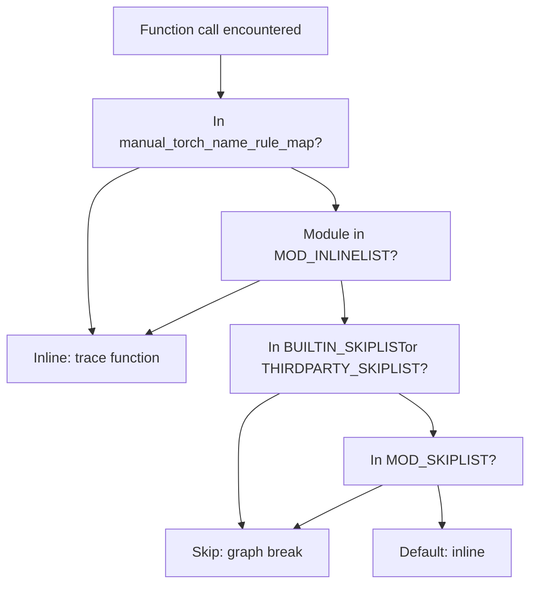
Sources: [torch/\_dynamo/trace\_rules.py87-130](https://github.com/pytorch/pytorch/blob/915982a4/torch/_dynamo/trace_rules.py#L87-L130)

### Key Skip and Inline Lists

| List Name | Purpose | Examples |
| --- | --- | --- |
| `BUILTIN_SKIPLIST` | Python stdlib to skip | `abc`, `collections`, `os`, `sys` |
| `THIRDPARTY_SKIPLIST` | Third-party libs to skip | `numpy`, `pandas`, `transformers` |
| `MOD_INLINELIST` | Always inline these modules | `torch.nn.functional`, `torch.utils._pytree` |
| `manual_torch_name_rule_map` | Explicit function rules | Specific torch ops |

Sources: [torch/\_dynamo/trace\_rules.py200-500](https://github.com/pytorch/pytorch/blob/915982a4/torch/_dynamo/trace_rules.py#L200-L500)

Skip rules at [trace\_rules.py600-800](https://github.com/pytorch/pytorch/blob/915982a4/trace_rules.py#L600-L800) return `SkipFunctionVariable` which causes graph breaks, while inline rules allow symbolic execution into the function body.

## Lazy Variable Tracking Optimization

`LazyVariableTracker` at [torch/\_dynamo/variables/lazy.py1-200](https://github.com/pytorch/pytorch/blob/915982a4/torch/_dynamo/variables/lazy.py#L1-L200) defers `VariableTracker` creation until values are accessed:

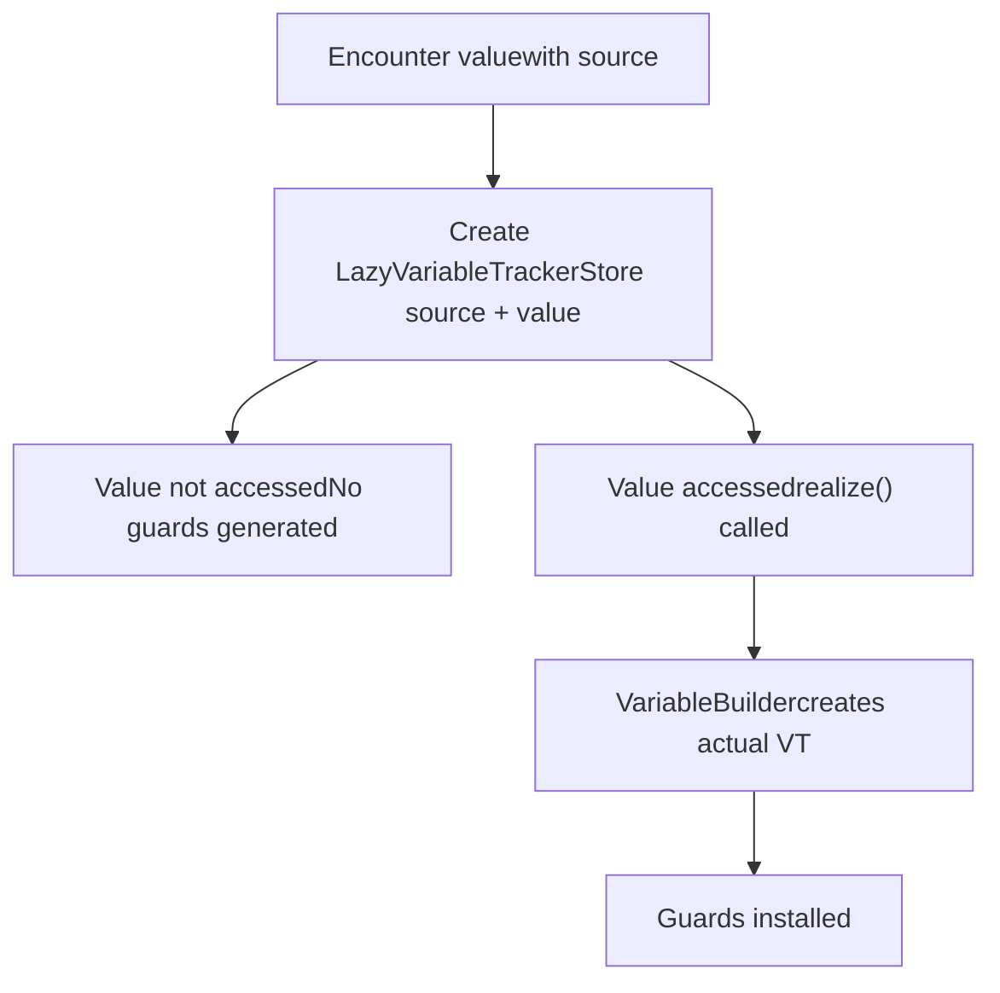
This optimization is critical for:

-   **Function defaults**: `def f(x, y=torch.tensor([]))` - default not used → no guard
-   **Module attributes**: `model.config` accessed but `model.other_attr` not → only guard `config`
-   **Dict values**: `d = {"a": 1, "b": 2}; use d["a"]` → only guard key `"a"`

Sources: [torch/\_dynamo/variables/lazy.py1-200](https://github.com/pytorch/pytorch/blob/915982a4/torch/_dynamo/variables/lazy.py#L1-L200) [torch/\_dynamo/variables/builder.py670-680](https://github.com/pytorch/pytorch/blob/915982a4/torch/_dynamo/variables/builder.py#L670-L680)

## Compilation and Resume Function Generation

When a graph break occurs or function completes, `OutputGraph.compile_subgraph()` at [output\_graph.py1800-2200](https://github.com/pytorch/pytorch/blob/915982a4/output_graph.py#L1800-L2200) compiles the captured graph:

### Compilation Pipeline

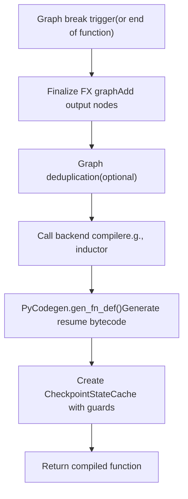
Sources: [torch/\_dynamo/output\_graph.py1800-2200](https://github.com/pytorch/pytorch/blob/915982a4/torch/_dynamo/output_graph.py#L1800-L2200) [torch/\_dynamo/codegen.py1-200](https://github.com/pytorch/pytorch/blob/915982a4/torch/_dynamo/codegen.py#L1-L200)

### Resume Function Structure

The `PyCodegen` class at [torch/\_dynamo/codegen.py100-500](https://github.com/pytorch/pytorch/blob/915982a4/torch/_dynamo/codegen.py#L100-L500) generates bytecode for resume functions:

```
# Conceptual structure of generated resume functiondef resume_at_30(x, y, __compiled_fn_0, __resume_fn_1):    # Restore local variables from graph outputs    result = __compiled_fn_0(x, y)    z, w = result        # Continue execution from resume point    # ... original bytecode from instruction 30 onwards ...        # May call next resume function    return __resume_fn_1(z, w, ...)
```
The codegen:

1.  Reconstructs locals from graph inputs (`reconstructor` at [codegen.py600-800](https://github.com/pytorch/pytorch/blob/915982a4/codegen.py#L600-L800))
2.  Calls compiled graph function
3.  Unpacks results into local variables
4.  Continues with remaining bytecode
5.  Chains to next resume function if needed

Sources: [torch/\_dynamo/codegen.py100-800](https://github.com/pytorch/pytorch/blob/915982a4/torch/_dynamo/codegen.py#L100-L800) [torch/\_dynamo/resume\_execution.py1-200](https://github.com/pytorch/pytorch/blob/915982a4/torch/_dynamo/resume_execution.py#L1-L200)

## Error Handling and Graph Break Messages

When encountering unsupported operations, TorchDynamo raises `Unsupported` exceptions defined in [exc.py400-600](https://github.com/pytorch/pytorch/blob/915982a4/exc.py#L400-L600) The structured error system provides detailed graph break information:

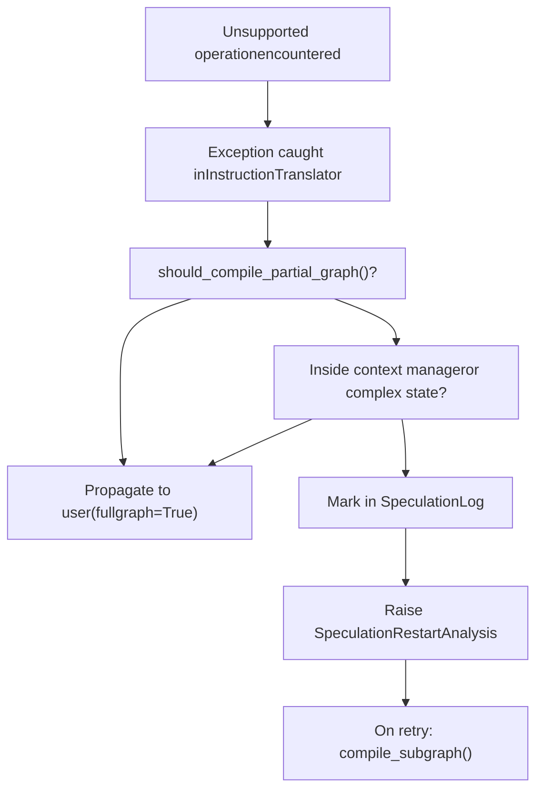
Sources: [torch/\_dynamo/exc.py400-700](https://github.com/pytorch/pytorch/blob/915982a4/torch/_dynamo/exc.py#L400-L700) [torch/\_dynamo/symbolic\_convert.py660-690](https://github.com/pytorch/pytorch/blob/915982a4/torch/_dynamo/symbolic_convert.py#L660-L690)

The `unimplemented()` function at [exc.py800-1000](https://github.com/pytorch/pytorch/blob/915982a4/exc.py#L800-L1000) constructs structured error messages with:

-   **gb\_type**: Graph break category
-   **context**: Specific operation that failed
-   **explanation**: Why it's unsupported
-   **hints**: How to work around it

These errors are logged to `graph_break_log` for debugging and appear in the graph break registry at [torch/\_dynamo/graph\_break\_registry.json](https://github.com/pytorch/pytorch/blob/915982a4/torch/_dynamo/graph_break_registry.json)

## Performance Optimizations

### Variable Caching Strategy

The `variable_tracker_cache` in `OutputGraph` at [output\_graph.py800-900](https://github.com/pytorch/pytorch/blob/915982a4/output_graph.py#L800-L900) deduplicates variables:

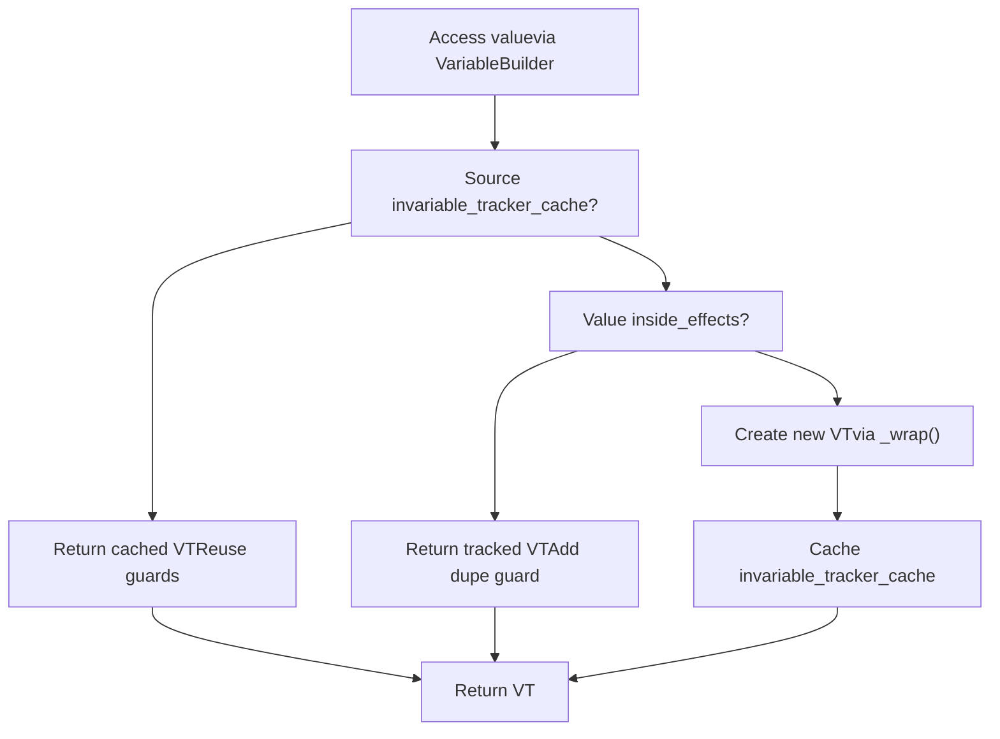
Sources: [torch/\_dynamo/variables/builder.py508-549](https://github.com/pytorch/pytorch/blob/915982a4/torch/_dynamo/variables/builder.py#L508-L549) [torch/\_dynamo/output\_graph.py800-900](https://github.com/pytorch/pytorch/blob/915982a4/torch/_dynamo/output_graph.py#L800-L900)

### Other Optimizations

| Optimization | Location | Benefit |
| --- | --- | --- |
| Lazy variable tracking | [variables/lazy.py](https://github.com/pytorch/pytorch/blob/915982a4/variables/lazy.py) | Defer guards until values accessed |
| Constant folding | [variables/torch.py206-406](https://github.com/pytorch/pytorch/blob/915982a4/variables/torch.py#L206-L406) | Evaluate pure functions at trace time |
| Guard deduplication | [guards.py600-700](https://github.com/pytorch/pytorch/blob/915982a4/guards.py#L600-L700) | Single guard per unique condition |
| Bytecode caching | [bytecode\_transformation.py1-200](https://github.com/pytorch/pytorch/blob/915982a4/bytecode_transformation.py#L1-L200) | Parse bytecode once per function |
| Inline function caching | [variables/functions.py172-178](https://github.com/pytorch/pytorch/blob/915982a4/variables/functions.py#L172-L178) | Cache FunctionSpec for bind\_args |

Sources: Multiple files listed in table

## Integration with Guards

While guard generation details are in [Guard System and Recompilation](/pytorch/pytorch/2.2.3-guard-system-and-recompilation), the frontend continuously collects guards during tracing:

**Guard installation points**:

-   Type checks: `install_guard(source.make_guard(GuardBuilder.TYPE_MATCH))`
-   Value checks: `install_guard(source.make_guard(GuardBuilder.CONSTANT_MATCH))`
-   Shape checks: `install_guard(source.make_guard(GuardBuilder.TENSOR_MATCH))`
-   ID checks: `install_guard(source.make_guard(GuardBuilder.ID_MATCH))`

Guards flow from `VariableTracker` → `Source` → `GuardBuilder` → `GuardManager` in `OutputGraph`. At execution time, all guards are checked before using the cached compiled graph.

Sources: [torch/\_dynamo/guards.py400-700](https://github.com/pytorch/pytorch/blob/915982a4/torch/_dynamo/guards.py#L400-L700) [torch/\_dynamo/variables/builder.py563-571](https://github.com/pytorch/pytorch/blob/915982a4/torch/_dynamo/variables/builder.py#L563-L571)

## Summary

TorchDynamo Frontend transforms Python bytecode into FX graphs through:

1.  **Frame interception**: Custom eval frame hook at CPython level
2.  **Symbolic execution**: `InstructionTranslator` processes bytecode symbolically via opcode handlers
3.  **Variable tracking**: `VariableTracker` hierarchy (50+ types) represents Python values symbolically
4.  **Graph construction**: `OutputGraph` and `SubgraphTracer` build FX graphs via `create_proxy()`
5.  **Guard collection**: `Source` objects track value origins for guard generation
6.  **Speculation system**: `SpeculationLog` handles uncertain control flow via restart mechanism
7.  **Partial compilation**: Graph breaks enable mixing compiled and eager execution
8.  **Code generation**: `PyCodegen` creates resume functions for post-graph-break execution

This architecture handles diverse Python and PyTorch patterns while maintaining correctness through guards and enabling performance through compilation.

Sources: [torch/\_dynamo/symbolic\_convert.py1-200](https://github.com/pytorch/pytorch/blob/915982a4/torch/_dynamo/symbolic_convert.py#L1-L200) [torch/\_dynamo/variables/builder.py1-100](https://github.com/pytorch/pytorch/blob/915982a4/torch/_dynamo/variables/builder.py#L1-L100) [torch/\_dynamo/output\_graph.py1-200](https://github.com/pytorch/pytorch/blob/915982a4/torch/_dynamo/output_graph.py#L1-L200) [torch/\_dynamo/guards.py1-100](https://github.com/pytorch/pytorch/blob/915982a4/torch/_dynamo/guards.py#L1-L100)
