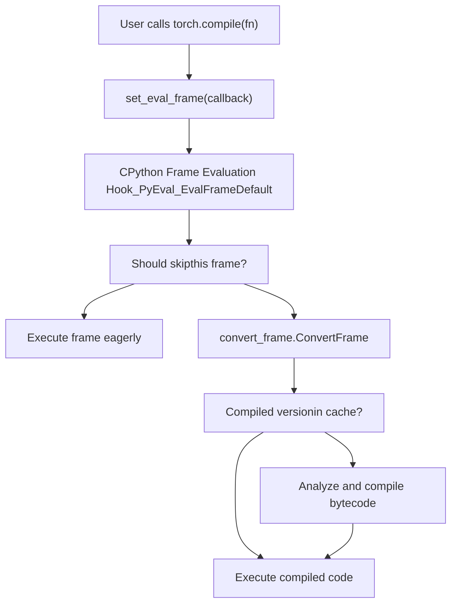
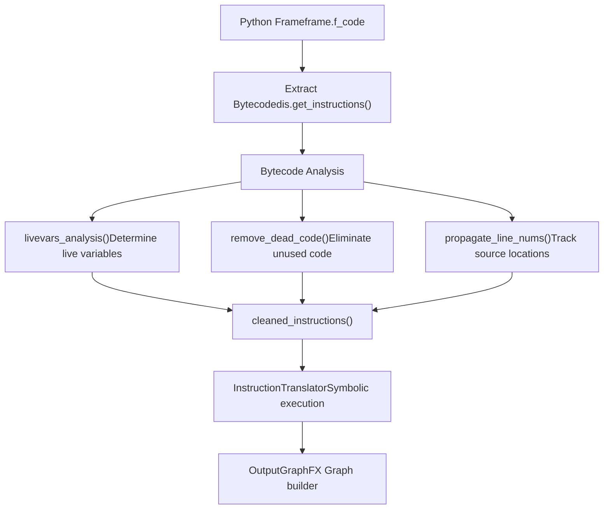
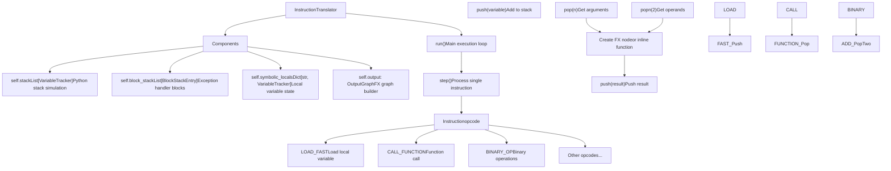
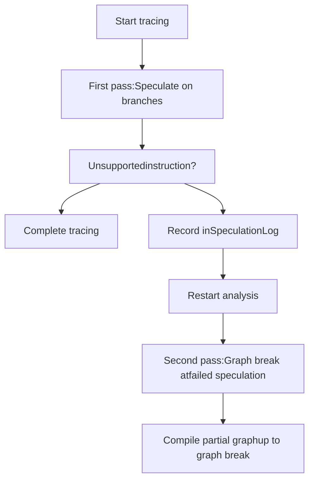
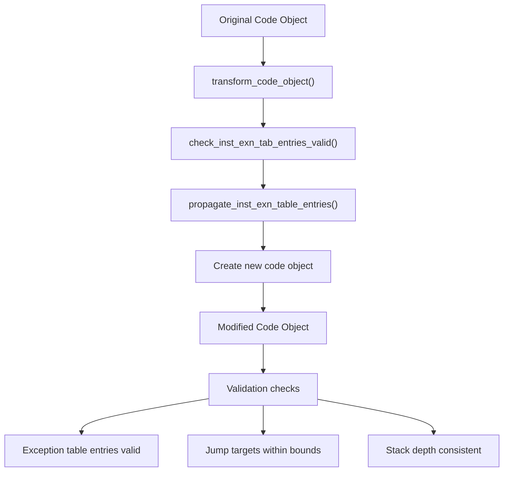
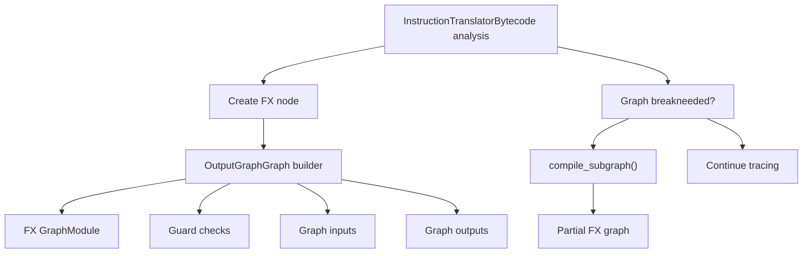

# Frame Evaluation and Bytecode Analysis

Relevant source files

-   [aten/src/ATen/core/PythonFallbackKernel.cpp](https://github.com/pytorch/pytorch/blob/915982a4/aten/src/ATen/core/PythonFallbackKernel.cpp)
-   [test/distributed/\_composable/fsdp/test\_fully\_shard\_compile.py](https://github.com/pytorch/pytorch/blob/915982a4/test/distributed/_composable/fsdp/test_fully_shard_compile.py)
-   [test/dynamo/test\_dicts.py](https://github.com/pytorch/pytorch/blob/915982a4/test/dynamo/test_dicts.py)
-   [test/dynamo/test\_error\_messages.py](https://github.com/pytorch/pytorch/blob/915982a4/test/dynamo/test_error_messages.py)
-   [test/dynamo/test\_functions.py](https://github.com/pytorch/pytorch/blob/915982a4/test/dynamo/test_functions.py)
-   [test/dynamo/test\_fwd\_loss\_bwd.py](https://github.com/pytorch/pytorch/blob/915982a4/test/dynamo/test_fwd_loss_bwd.py)
-   [test/dynamo/test\_list.py](https://github.com/pytorch/pytorch/blob/915982a4/test/dynamo/test_list.py)
-   [test/dynamo/test\_misc.py](https://github.com/pytorch/pytorch/blob/915982a4/test/dynamo/test_misc.py)
-   [test/dynamo/test\_modules.py](https://github.com/pytorch/pytorch/blob/915982a4/test/dynamo/test_modules.py)
-   [test/dynamo/test\_nested\_graph\_breaks.py](https://github.com/pytorch/pytorch/blob/915982a4/test/dynamo/test_nested_graph_breaks.py)
-   [test/dynamo/test\_repros.py](https://github.com/pytorch/pytorch/blob/915982a4/test/dynamo/test_repros.py)
-   [test/dynamo/test\_utils.py](https://github.com/pytorch/pytorch/blob/915982a4/test/dynamo/test_utils.py)
-   [test/dynamo\_expected\_failures/TestCustomOp.test\_impl\_device\_cpu](https://github.com/pytorch/pytorch/blob/915982a4/test/dynamo_expected_failures/TestCustomOp.test_impl_device_cpu)
-   [test/export/test\_experimental.py](https://github.com/pytorch/pytorch/blob/915982a4/test/export/test_experimental.py)
-   [test/export/test\_export.py](https://github.com/pytorch/pytorch/blob/915982a4/test/export/test_export.py)
-   [test/fx/test\_fx\_xform\_observer.py](https://github.com/pytorch/pytorch/blob/915982a4/test/fx/test_fx_xform_observer.py)
-   [test/profiler/test\_record\_function.py](https://github.com/pytorch/pytorch/blob/915982a4/test/profiler/test_record_function.py)
-   [test/profiler/test\_torch\_tidy.py](https://github.com/pytorch/pytorch/blob/915982a4/test/profiler/test_torch_tidy.py)
-   [test/test\_dynamic\_shapes.py](https://github.com/pytorch/pytorch/blob/915982a4/test/test_dynamic_shapes.py)
-   [test/test\_proxy\_tensor.py](https://github.com/pytorch/pytorch/blob/915982a4/test/test_proxy_tensor.py)
-   [torch/\_dynamo/bytecode\_analysis.py](https://github.com/pytorch/pytorch/blob/915982a4/torch/_dynamo/bytecode_analysis.py)
-   [torch/\_dynamo/bytecode\_transformation.py](https://github.com/pytorch/pytorch/blob/915982a4/torch/_dynamo/bytecode_transformation.py)
-   [torch/\_dynamo/codegen.py](https://github.com/pytorch/pytorch/blob/915982a4/torch/_dynamo/codegen.py)
-   [torch/\_dynamo/config.py](https://github.com/pytorch/pytorch/blob/915982a4/torch/_dynamo/config.py)
-   [torch/\_dynamo/convert\_frame.py](https://github.com/pytorch/pytorch/blob/915982a4/torch/_dynamo/convert_frame.py)
-   [torch/\_dynamo/eval\_frame.py](https://github.com/pytorch/pytorch/blob/915982a4/torch/_dynamo/eval_frame.py)
-   [torch/\_dynamo/exc.py](https://github.com/pytorch/pytorch/blob/915982a4/torch/_dynamo/exc.py)
-   [torch/\_dynamo/functional\_export.py](https://github.com/pytorch/pytorch/blob/915982a4/torch/_dynamo/functional_export.py)
-   [torch/\_dynamo/graph\_break\_registry.json](https://github.com/pytorch/pytorch/blob/915982a4/torch/_dynamo/graph_break_registry.json)
-   [torch/\_dynamo/output\_graph.py](https://github.com/pytorch/pytorch/blob/915982a4/torch/_dynamo/output_graph.py)
-   [torch/\_dynamo/resume\_execution.py](https://github.com/pytorch/pytorch/blob/915982a4/torch/_dynamo/resume_execution.py)
-   [torch/\_dynamo/side\_effects.py](https://github.com/pytorch/pytorch/blob/915982a4/torch/_dynamo/side_effects.py)
-   [torch/\_dynamo/symbolic\_convert.py](https://github.com/pytorch/pytorch/blob/915982a4/torch/_dynamo/symbolic_convert.py)
-   [torch/\_dynamo/test\_case.py](https://github.com/pytorch/pytorch/blob/915982a4/torch/_dynamo/test_case.py)
-   [torch/\_dynamo/testing.py](https://github.com/pytorch/pytorch/blob/915982a4/torch/_dynamo/testing.py)
-   [torch/\_dynamo/trace\_rules.py](https://github.com/pytorch/pytorch/blob/915982a4/torch/_dynamo/trace_rules.py)
-   [torch/\_dynamo/utils.py](https://github.com/pytorch/pytorch/blob/915982a4/torch/_dynamo/utils.py)
-   [torch/\_dynamo/variables/\_\_init\_\_.py](https://github.com/pytorch/pytorch/blob/915982a4/torch/_dynamo/variables/__init__.py)
-   [torch/\_dynamo/variables/base.py](https://github.com/pytorch/pytorch/blob/915982a4/torch/_dynamo/variables/base.py)
-   [torch/\_dynamo/variables/builder.py](https://github.com/pytorch/pytorch/blob/915982a4/torch/_dynamo/variables/builder.py)
-   [torch/\_dynamo/variables/builtin.py](https://github.com/pytorch/pytorch/blob/915982a4/torch/_dynamo/variables/builtin.py)
-   [torch/\_dynamo/variables/constant.py](https://github.com/pytorch/pytorch/blob/915982a4/torch/_dynamo/variables/constant.py)
-   [torch/\_dynamo/variables/ctx\_manager.py](https://github.com/pytorch/pytorch/blob/915982a4/torch/_dynamo/variables/ctx_manager.py)
-   [torch/\_dynamo/variables/dicts.py](https://github.com/pytorch/pytorch/blob/915982a4/torch/_dynamo/variables/dicts.py)
-   [torch/\_dynamo/variables/functions.py](https://github.com/pytorch/pytorch/blob/915982a4/torch/_dynamo/variables/functions.py)
-   [torch/\_dynamo/variables/higher\_order\_ops.py](https://github.com/pytorch/pytorch/blob/915982a4/torch/_dynamo/variables/higher_order_ops.py)
-   [torch/\_dynamo/variables/iter.py](https://github.com/pytorch/pytorch/blob/915982a4/torch/_dynamo/variables/iter.py)
-   [torch/\_dynamo/variables/lists.py](https://github.com/pytorch/pytorch/blob/915982a4/torch/_dynamo/variables/lists.py)
-   [torch/\_dynamo/variables/misc.py](https://github.com/pytorch/pytorch/blob/915982a4/torch/_dynamo/variables/misc.py)
-   [torch/\_dynamo/variables/nn\_module.py](https://github.com/pytorch/pytorch/blob/915982a4/torch/_dynamo/variables/nn_module.py)
-   [torch/\_dynamo/variables/optimizer.py](https://github.com/pytorch/pytorch/blob/915982a4/torch/_dynamo/variables/optimizer.py)
-   [torch/\_dynamo/variables/tensor.py](https://github.com/pytorch/pytorch/blob/915982a4/torch/_dynamo/variables/tensor.py)
-   [torch/\_dynamo/variables/torch.py](https://github.com/pytorch/pytorch/blob/915982a4/torch/_dynamo/variables/torch.py)
-   [torch/\_dynamo/variables/user\_defined.py](https://github.com/pytorch/pytorch/blob/915982a4/torch/_dynamo/variables/user_defined.py)
-   [torch/\_export/non\_strict\_utils.py](https://github.com/pytorch/pytorch/blob/915982a4/torch/_export/non_strict_utils.py)
-   [torch/export/\_\_init\_\_.py](https://github.com/pytorch/pytorch/blob/915982a4/torch/export/__init__.py)
-   [torch/export/\_trace.py](https://github.com/pytorch/pytorch/blob/915982a4/torch/export/_trace.py)
-   [torch/fx/experimental/symbolic\_shapes.py](https://github.com/pytorch/pytorch/blob/915982a4/torch/fx/experimental/symbolic_shapes.py)
-   [torch/fx/passes/graph\_transform\_observer.py](https://github.com/pytorch/pytorch/blob/915982a4/torch/fx/passes/graph_transform_observer.py)

## Purpose and Scope

This document describes how TorchDynamo intercepts Python frame execution at runtime and analyzes bytecode instructions to capture PyTorch operations into FX graphs. This is the foundational mechanism that enables dynamic compilation in `torch.compile`.

**Scope:** This page covers the frame evaluation hook mechanism and bytecode-level tracing. For information about how bytecode instructions are converted to symbolic values and variable trackers, see [Variable Tracking and Symbolic Execution](/pytorch/pytorch/2.2.2-variable-tracking-and-symbolic-execution). For how guards are created and managed during this process, see [Guard System and Recompilation](/pytorch/pytorch/2.2.3-guard-system-and-recompilation).

---

## Frame Evaluation Hook Mechanism

TorchDynamo intercepts Python code execution by installing a custom frame evaluation function using CPython's `_PyEval_RequestCodeExtraIndex` and `_PyEval_SetProfile` APIs. This allows Dynamo to inspect and potentially rewrite code objects before they execute.

### Hook Installation

The frame evaluation hook is installed via the `set_eval_frame` function, which registers a callback that CPython invokes before executing each code object.


**Frame Evaluation Hook Registration Flow**

Sources: [torch/\_dynamo/eval\_frame.py1-500](https://github.com/pytorch/pytorch/blob/915982a4/torch/_dynamo/eval_frame.py#L1-L500)

The core hook is implemented in `torch/_dynamo/eval_frame.py`:

-   `set_eval_frame(callback)` - Installs the frame evaluation callback
-   `reset_code(code)` - Resets a code object to its original state
-   `skip_code(code)` - Marks a code object to skip compilation
-   `TorchPatcher` class - Manages patching and unpatching of the eval frame hook

### Frame Skip Decisions

Not all frames should be compiled. Dynamo uses several heuristics to decide whether to trace a frame:

| Skip Reason | Check Location | Example |
| --- | --- | --- |
| Internal Dynamo code | `is_dynamo_code()` | Frames in `torch._dynamo.*` |
| Explicitly skipped | `skip_code()` called | User-marked skip regions |
| Too small | Code size heuristics | Single-line functions |
| Non-traceable | `trace_rules.check()` | Standard library code |
| Already compiled | Cache lookup | Previously compiled with same guards |

Sources: [torch/\_dynamo/eval\_frame.py300-400](https://github.com/pytorch/pytorch/blob/915982a4/torch/_dynamo/eval_frame.py#L300-L400) [torch/\_dynamo/trace\_rules.py1-100](https://github.com/pytorch/pytorch/blob/915982a4/torch/_dynamo/trace_rules.py#L1-L100)

---

## Bytecode Analysis Pipeline

Once Dynamo decides to compile a frame, the bytecode undergoes several analysis and transformation stages:


**Bytecode Analysis and Transformation Pipeline**

Sources: [torch/\_dynamo/bytecode\_analysis.py1-300](https://github.com/pytorch/pytorch/blob/915982a4/torch/_dynamo/bytecode_analysis.py#L1-L300) [torch/\_dynamo/bytecode\_transformation.py1-200](https://github.com/pytorch/pytorch/blob/915982a4/torch/_dynamo/bytecode_transformation.py#L1-L200)

### Key Analysis Functions

The bytecode analysis module provides utilities for understanding and transforming bytecode:

**Liveness Analysis**

-   `livevars_analysis(instructions, cells, codeobj)` - Computes which variables are live at each program point using dataflow analysis
-   Returns a dict mapping instruction offsets to sets of live variable names
-   Used to determine which variables need to be captured in closures and resume functions

**Code Cleaning**

-   `remove_dead_code(instructions)` - Eliminates unreachable bytecode after returns/raises
-   `remove_pointless_jumps(instructions)` - Optimizes jump chains and removes no-op jumps
-   `cleaned_instructions(code)` - Returns a cleaned list of `Instruction` objects

**Control Flow Analysis**

-   `JUMP_OPNAMES` - Set of opcodes that perform jumps
-   `get_indexof(instructions, target)` - Maps instruction objects to their indices
-   Builds control flow graph for speculation and guard placement

Sources: [torch/\_dynamo/bytecode\_analysis.py40-150](https://github.com/pytorch/pytorch/blob/915982a4/torch/_dynamo/bytecode_analysis.py#L40-L150) [torch/\_dynamo/bytecode\_transformation.py200-400](https://github.com/pytorch/pytorch/blob/915982a4/torch/_dynamo/bytecode_transformation.py#L200-L400)

---

## Instruction Translation

The `InstructionTranslator` class performs symbolic execution of bytecode instructions, converting them into graph operations and variable trackers.

### InstructionTranslator Architecture


**InstructionTranslator Class Structure**

Sources: [torch/\_dynamo/symbolic\_convert.py1-500](https://github.com/pytorch/pytorch/blob/915982a4/torch/_dynamo/symbolic_convert.py#L1-L500)

### Core Translation Methods

The `InstructionTranslator` class in `symbolic_convert.py` provides methods for each bytecode opcode:

**Stack Operations**

-   `push(val: VariableTracker)` - Push a variable tracker onto the symbolic stack
-   `pop()` - Pop and return the top stack item
-   `popn(n: int)` - Pop n items from the stack

**Instruction Processing**

-   `step()` - Process the current instruction and advance the instruction pointer
-   `run()` - Main loop that calls `step()` until the frame completes
-   Instruction handlers like `LOAD_FAST()`, `STORE_FAST()`, `CALL_FUNCTION()` etc.

**Control Flow**

-   `jump(target: Instruction)` - Update instruction pointer to target
-   `generic_jump(truth_fn, push)` - Handle conditional jumps, potentially creating graph breaks
-   `RETURN_VALUE()` - Handle function return

Sources: [torch/\_dynamo/symbolic\_convert.py800-1500](https://github.com/pytorch/pytorch/blob/915982a4/torch/_dynamo/symbolic_convert.py#L800-L1500)

### Instruction Handler Example

Here's how a typical bytecode instruction is handled:

**LOAD\_FAST (Load Local Variable)**

1.  Get variable name from instruction argument
2.  Look up variable in `self.symbolic_locals`
3.  Push corresponding `VariableTracker` onto stack

**CALL\_FUNCTION (Function Call)**

1.  Pop function and arguments from stack
2.  Check if function can be inlined or traced
3.  If yes: inline the call and continue tracing
4.  If no: emit graph node or graph break

**BINARY\_OP (Binary Operations like ADD, SUB)**

1.  Pop two operands from stack
2.  Call the operator method on the variable tracker
3.  Push result onto stack (may create FX node)

Sources: [torch/\_dynamo/symbolic\_convert.py1500-2000](https://github.com/pytorch/pytorch/blob/915982a4/torch/_dynamo/symbolic_convert.py#L1500-L2000)

---

## Speculation and Restarts

TorchDynamo uses speculative execution to handle dynamic control flow. When tracing encounters a data-dependent branch, it may speculate on which path to take.

### SpeculationLog

The `SpeculationLog` tracks speculation attempts and failures during bytecode analysis:


**Speculation and Restart Flow**

Sources: [torch/\_dynamo/symbolic\_convert.py240-350](https://github.com/pytorch/pytorch/blob/915982a4/torch/_dynamo/symbolic_convert.py#L240-L350)

**SpeculationLog Structure**

-   `entries: List[SpeculationEntry]` - Recorded speculation points
-   `index: int` - Current position in log during replay
-   `next(filename, lineno, inst)` - Get or create speculation entry
-   `restart()` - Reset index for replaying from start
-   Used to make tracing deterministic across restarts

**SpeculationEntry**

-   Records the instruction pointer and instruction that caused speculation
-   `_failed: bool` - Whether this speculation previously failed
-   `fail_and_restart_analysis()` - Marks entry as failed and raises `SpeculationRestartAnalysis`
-   On subsequent passes, checks `failed()` to insert graph break instead of re-attempting

Sources: [torch/\_dynamo/symbolic\_convert.py240-270](https://github.com/pytorch/pytorch/blob/915982a4/torch/_dynamo/symbolic_convert.py#L240-L270)

---

## Bytecode Instruction Representation

Dynamo uses a custom `Instruction` dataclass to represent bytecode instructions with additional metadata:

### Instruction Class

```
@dataclassclass Instruction:    opcode: int           # Bytecode opcode number    opname: str          # Human-readable opcode name    arg: Optional[int]   # Instruction argument    argval: Any          # Resolved argument value    offset: int          # Byte offset in code object    starts_line: Optional[int]  # Source line number    is_jump_target: bool # Is this a jump target?    target: Optional[Instruction]  # For jump instructions    # Additional fields for exception table, positions, etc.
```
**Key Instruction Utilities**

-   `create_instruction(opname, arg, target)` - Factory for creating instructions
-   `create_call_function(nargs)` - Create CALL\_FUNCTION instruction
-   `create_jump_absolute(target)` - Create jump to target instruction
-   `create_rot_n(n)` - Create stack rotation instruction
-   `is_jump_absolute(inst)` - Check if instruction is an absolute jump

Sources: [torch/\_dynamo/bytecode\_transformation.py50-200](https://github.com/pytorch/pytorch/blob/915982a4/torch/_dynamo/bytecode_transformation.py#L50-L200)

---

## Bytecode Transformation Utilities

The `bytecode_transformation` module provides utilities for modifying and generating bytecode:

### Code Object Transformation


**Code Object Transformation Pipeline**

Sources: [torch/\_dynamo/bytecode\_transformation.py300-600](https://github.com/pytorch/pytorch/blob/915982a4/torch/_dynamo/bytecode_transformation.py#L300-L600)

**Key Functions**

-   `transform_code_object(code, transform_fn)` - Apply transformation function to code object's instructions
-   `check_inst_exn_tab_entries_valid(insts)` - Validate exception table entries reference valid instructions
-   `propagate_inst_exn_table_entries(old, new)` - Copy exception handling metadata from old to new instructions
-   `propagate_line_nums(old, new)` - Preserve source line number information

**Instruction Creation Helpers**

-   `create_load_const(value)` - Create LOAD\_CONST instruction
-   `create_binary_slice(start, stop, step)` - Create slice object construction
-   `create_build_tuple(n)` - Create BUILD\_TUPLE with n items
-   `create_dup_top()` - Create DUP\_TOP instruction
-   `create_swap(n)` - Create SWAP instruction (3.11+)

Sources: [torch/\_dynamo/bytecode\_transformation.py400-800](https://github.com/pytorch/pytorch/blob/915982a4/torch/_dynamo/bytecode_transformation.py#L400-L800)

---

## Frame State and Context

During bytecode analysis, Dynamo maintains several pieces of state about the frame being traced:

### Frame Context Tracking

| State Component | Location | Purpose |
| --- | --- | --- |
| Instruction pointer | `self.instruction_pointer` | Current bytecode offset |
| Python stack | `self.stack` | Symbolic execution stack |
| Local variables | `self.symbolic_locals` | Variable name → VariableTracker |
| Block stack | `self.block_stack` | Exception handler nesting |
| Cell variables | `self.symbolic_cell_vars` | Closure cell variables |
| Global scope | `self.f_globals` | Global namespace |
| Code object | `self.f_code` | Function code object |

**InstructionTranslator State Management**

-   State is checkpointed at speculation points
-   On restart, state is restored to checkpoint
-   Guard violations trigger recompilation with fresh state

Sources: [torch/\_dynamo/symbolic\_convert.py500-700](https://github.com/pytorch/pytorch/blob/915982a4/torch/_dynamo/symbolic_convert.py#L500-L700)

---

## Integration with OutputGraph

The `InstructionTranslator` works closely with `OutputGraph` to build the FX graph:


**InstructionTranslator and OutputGraph Integration**

Sources: [torch/\_dynamo/symbolic\_convert.py700-900](https://github.com/pytorch/pytorch/blob/915982a4/torch/_dynamo/symbolic_convert.py#L700-L900) [torch/\_dynamo/output\_graph.py1-200](https://github.com/pytorch/pytorch/blob/915982a4/torch/_dynamo/output_graph.py#L1-L200)

**Key Interactions**

-   `self.output.create_proxy(kind, target, args, kwargs)` - Create FX node in graph
-   `self.output.compile_subgraph(tx, reason)` - Trigger compilation of partial graph
-   `self.output.add_output_instructions(insts)` - Add resume bytecode
-   `self.output.side_effects` - Track mutations to objects

For more details on how the FX graph is constructed and managed, see the OutputGraph documentation in the compilation pipeline sections.

---

## Summary

Frame evaluation and bytecode analysis form the foundation of TorchDynamo's tracing system:

1.  **Frame Hook**: CPython eval frame hook intercepts function execution
2.  **Skip Logic**: Heuristics determine which frames to compile
3.  **Bytecode Extraction**: Code object bytecode is extracted and analyzed
4.  **Instruction Translation**: `InstructionTranslator` symbolically executes each instruction
5.  **Variable Tracking**: Bytecode operations create `VariableTracker` objects (see [Variable Tracking](/pytorch/pytorch/2.2.2-variable-tracking-and-symbolic-execution))
6.  **Graph Building**: Operations are recorded in an FX graph via `OutputGraph`
7.  **Guard Creation**: Dynamic behaviors tracked with guards (see [Guard System](/pytorch/pytorch/2.2.3-guard-system-and-recompilation))
8.  **Speculation**: Dynamic control flow handled with speculation and restart

This architecture allows Dynamo to dynamically compile PyTorch code while preserving Python semantics and handling the full complexity of Python bytecode execution.
